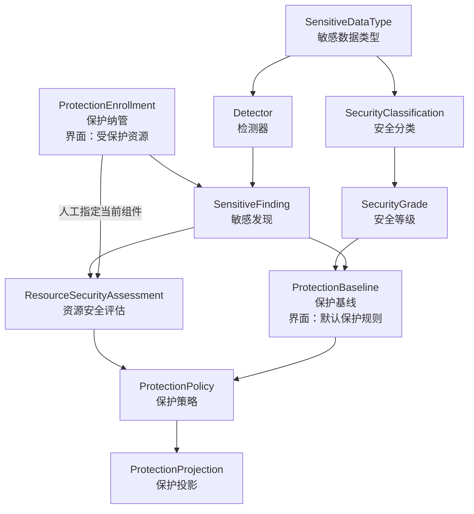
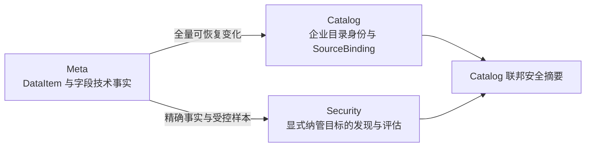
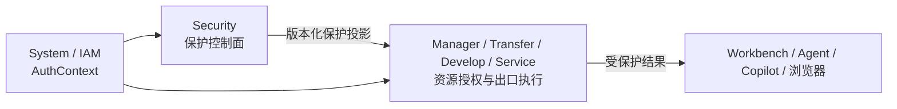
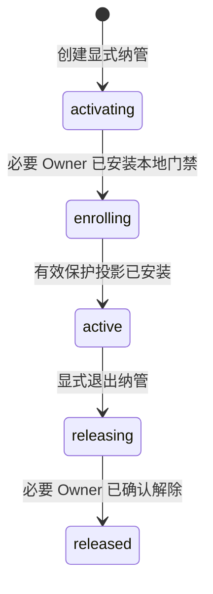
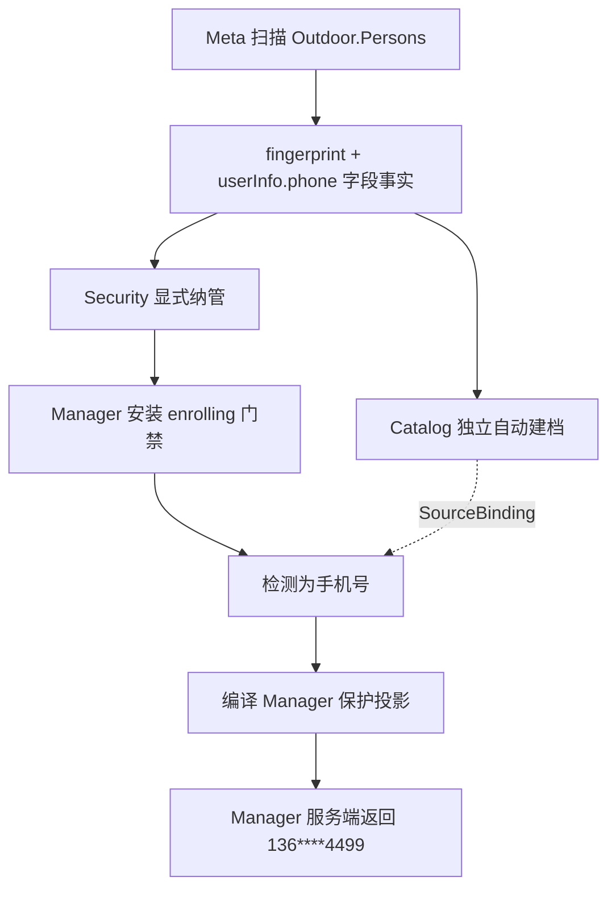

# ADDP 数据安全与隐私保护体系图

本文定义 ADDP 数据安全与隐私保护的概念边界、事实所有权和模块协作关系。实现约束见 [数据安全与隐私保护实现规范](../spec/addp数据安全与隐私保护实现规范.md)。

## 一、模块定位

ADDP 设置独立 `Security` 模块，中文名为“数据安全”，产品入口使用“数据安全与隐私保护”。Security 是安全分类分级、敏感发现、具体专业资源评估、保护策略和可执行保护投影的唯一业务控制面。

Security 不是：

- System IAM 的替代品，不拥有 User、Role、Permission、AuthContext 或登录认证；
- 企业资源目录，不复制 CatalogEntry、责任、目录可见性或业务编目；
- 中央数据代理，不接管所有预览、查询、导出和服务流量；
- 全资源 ACL 中心，不代替各 owner 的 Resource Grant / Policy 和最终资源动作判断；
- 凭据加解密工具包，敏感配置值加解密属于 `common/secretcipher`。

## 二、核心概念



- `SensitiveDataType` 回答“是什么敏感数据”，例如手机号、身份证件号、银行卡号和精确位置。
- `SecurityClassification` 回答“属于哪类安全信息”，例如个人信息、敏感个人信息、金融信息和商业秘密。
- `SecurityGrade` 回答“风险和默认控制强度有多高”。
- `DetectorCapability` 是随平台安装的可信、版本化检测实现；`Detector` 是租户把某项能力绑定到 SensitiveDataType，并配置是否参与发现及自动采用置信度的租户配置。二者共同根据结构事实和受控样本产生候选发现，不直接改写 owner 专业事实。
- `SensitiveFinding` 保存候选类型、置信度和不含原始敏感值的证据；界面必须完整展示检测能力规则、实际命中依据与已知局限，方便人工核实。
- `SensitiveDiscoveryQualitySummary` 不是新领域事实，而是根据 Finding、不可变复核和 Assessment 当前修订即时形成的只读质量摘要，用于判断识别方式是否值得优化。
- `ResourceSecurityAssessment` 是安全治理人员对确定专业资源或组件做出的正式分类分级结论。它既可由 Finding 复核形成，也可在自动发现漏检时从 Meta 当前字段清单中人工指定；不得接受自由文本字段路径。人工指定候选只包含尚未形成任何正式 Assessment 的当前组件，已经确认、调整或撤销过的组件都在既有 Assessment 上继续治理，不得重新混入“遗漏字段”选择器。
- `ProtectionBaseline` 定义某类型和等级的最低保护意图。
- `ProtectionPolicy` 针对正式评估、消费 Owner 和动作显式收紧保护结果；没有显式 Policy 时，Assessment 对应的 ProtectionBaseline 仍是有效最低保护意图。
- `ProtectionProjection` 是交付给数据出口 owner 的最小、版本化、可校验执行契约，不是策略业务对象副本。

ProtectionBaseline 或 SensitiveDataType 的保护语义变化由 Security 根据自身 Finding 与 Assessment 依赖精确定位 Enrollment，并通过唯一编译器重新发布投影；不依赖 Catalog，也不重新扫描 Meta。正式 Assessment revision 冻结当次分类分级结论，不随定义修改静默漂移。

### 2.1 产品信息架构

Security 的领域事实保持独立，产品入口收敛为四个工作区，不按数据库实体逐一暴露同级菜单：

| 产品入口 | 承载事实与操作 | 定位 |
| --- | --- | --- |
| 分类分级体系 | SecurityClassification、SecurityGrade、definition profile | 以“分类目录”和“保护等级”两个页签维护低频基础定义；平台推荐定义可由用户显式、一键补齐。分类回答业务或合规归属，等级回答风险与保护强度，二者相互独立 |
| 敏感数据定义 | SensitiveDataType、Detector | 以敏感类型为主视图，把具体识别方式收进对应类型，统一回答“什么数据敏感、如何发现、发现后先采用哪个分类与等级” |
| 默认保护规则 | ProtectionBaseline | 定义敏感类型与保护等级组合下自动采用且不可放宽的最低保护效果 |
| 受保护资源 | ProtectionEnrollment 及其 Finding、Assessment、Projection 状态 | 选择 Meta 已扫描资源纳入数据保护，并观察发现、复核和各 Owner 保护规则同步状态 |

这只是产品信息架构收敛，不合并 Security 的领域对象。“分类分级体系”是低频基础定义工作区，不是新的领域对象；稳定技术术语仍为 `ProtectionBaseline` 和 `ProtectionEnrollment`；“默认保护规则”“受保护资源”只用于面向用户的页面与导航，“纳入数据保护”是创建 ProtectionEnrollment 的动作。

## 三、专业资源身份与 Catalog

Standard、Model、Security 都先使用 owner 稳定专业资源身份形成自身事实，不以 Catalog 建档为前置。Security 使用类型化专业资源引用：

```text
owner_module + resource_type + resource_identity + optional component_key
```

针对 Meta DataItem 字段：

```text
owner_module      = meta
resource_type     = data_item
resource_identity = item fingerprint
component_key     = Meta 发布的稳定字段键
```

用户创建 ProtectionEnrollment 时只从 Meta 资源树选择一个 DataItem。Security 根据选择结果的标准 ResourceLocator 计算并保存 DataItem fingerprint，同时冻结仅含 Engine ID、item type 与 full_name 的最小保护目标快照；Enrollment 不接受字段路径。`component_key` 可以由 Detector 发现进入 Finding，也可以由治理人员从 Security 实时读取的 Meta 当前字段事实中选择后直接进入 Assessment，但不能由浏览器自由填写。ResourceLocator 和展示快照都不进入 Owner 投影的专业资源身份。

Catalog 与 Security 是 Meta 技术事实的并行消费者：



Catalog 建档后通过 SourceBinding 联邦展示 Security 事实；Security 不迁移、复制或改绑 Assessment。Catalog 来源重绑不得让旧评估静默跟随到新物理来源。Catalog 不是 Security 发现、评估、策略编译或保护生效的启动、Ready 或运行依赖。

## 四、事实所有权

| Owner | 权威事实 | 明确不拥有 |
| --- | --- | --- |
| Standard | Domain、Glossary、Element、CodeSet、Unit、Metric 等业务数据标准 | 安全分类、安全等级和具体资源安全评估 |
| Meta | DataItem、字段路径、类型、结构、源版本和受控读取能力 | “该字段是手机号/L3”等治理结论 |
| Security | 敏感类型、安全分类分级、Detector、Finding、Assessment、保护基线、策略和保护投影 | IAM、业务资源本体、CatalogEntry、owner ACL 和中央内容代理；受控例外属于后续范围 |
| Catalog | 企业目录身份、SourceBinding、业务语义关联、责任、治理状态和目录可见性 | Security 专业事实的第二份可编辑结果 |
| System / IAM | Principal、Tenant、Role、Permission、AuthContext 和审计基础设施 | 敏感数据识别和字段保护策略 |
| 资源 Owner | Resource Grant / Policy、最终资源动作判断和本模块服务端出口保护执行 | 第二套安全分类分级和私有脱敏规则体系 |

## 五、控制面与数据面

Security 只编译保护决策，数据出口 owner 在自身服务端执行：



资源 Owner 先根据 AuthContext、Permission 和 Resource Grant / Policy 判断能否执行预览、查询、导出或发布，再与 Security 投影合并并执行更严格结果。Owner 可以拒绝访问，但不得降低 Security 基线。

用户数据请求只读取 Owner 本地有效投影，不逐行、逐字段或逐请求同步调用 Security、Catalog 或 Meta。浏览器不接收明文后再遮盖。

Owner acknowledgement 只证明当前保护投影已经持久安装，并且后续请求不会绕过该投影；它不是一次具体预览、查询、服务响应或导出的执行结果。具体请求仍由 Owner 根据引擎、动作、读取形态、结构快照和结果血缘执行字段保护，无法证明安全执行时必须保守拒绝。因此 Security 界面统一展示“保护规则同步状态”和投影要求，不把 `active + acknowledged` 表述为所有数据形态都已经实际执行成功。

## 六、显式纳管与受控负担

只有显式纳管的资源进入 Security 主链路。未纳管资源不调用 Security、不扫描内容、不执行保护算法、不写保护审计。Locator 型出口通过本地索引快速未命中返回原路径；自由查询在当前 Tenant 存在任一纳管目标时，允许为证明 JOIN、View、`$lookup` 等完整依赖而读取 PreparedQuery 的 `QueryReadSet`，只有本次查询精确命中纳管 DataItem 后才继续读取 `QueryOutputLineage` 和实时源字段结构。该成本不得扩大为逐请求 Security / Meta / Catalog 远程调用或内容扫描。

Develop 不解析 SQL/MQL，也不按结果列名猜测敏感字段。Engine Provider 在同一 PreparedQuery 中声明 source 到结果的 identity、direct、derived 或 opaque 关系；Develop 只对 identity/direct 输出执行 `query` 规则，任何受保护组件的 derived/opaque 输出、结构漂移或 lineage unresolved 都拒绝当前查询。保护发生在 QueryResult 写入执行记录或返回 Workbench / Notebook 之前。

纳管激活顺序固定为：



- `activating`：Security 尚未声明保护已生效；先发布最小 `enrolling` 门禁变化。
- `enrolling`：Owner 已安装门禁，正在发现或等待策略；相关出口拒绝或保守抑制，不返回明文。
- `active`：必要 Owner 已确认安装本地有效投影；具体请求按投影执行字段保护，或在当前数据形态无法安全执行时保守拒绝。
- `releasing`：Owner 继续执行最后有效保护，直到明确解除变化安装完成。
- `released`：只保留历史和审计；Owner 本地纳管索引已显式删除。

“受保护资源”页面的默认工作视图只展示 `activating`、`enrolling`、`active` 和 `releasing`；`released` 记录进入独立的“已退出”历史视图，按退出完成时间倒序展示，依然可读但不提供逐条硬删除。治理人员可以从已退出记录直接执行“重新纳入保护”，但该动作必须创建新的 ProtectionEnrollment 并重新经过四个必要 Owner 的激活屏障、敏感发现与投影安装；旧聚合仍保持 `released`，不得恢复或改写其生命周期和退出审计。

## 七、Finding、正式评估与保守保护

Detector 产生的 Finding 不是正式治理真相，但安全保护不必等待人工确认：

- Finding 达到产生该 Finding 的 Detector 绑定所配置的自动采用置信度，且存在匹配的 ProtectionBaseline 时，Security 立即编译保守保护投影；
- Finding 证据不足时，已纳管 Owner 继续拒绝或保守抑制；
- 人工确认后形成正式 Assessment，编译器在同一主路径上用正式结论取代候选基线；
- 人工确认误报时显式关闭 Finding，由同一变化流发布新投影，不建立旁路“不脱敏”规则。
- 自动发现漏检时，治理人员可以从 Meta 当前字段事实中选择组件、敏感类型和保护等级，直接形成来源为 `manual` 的正式 Assessment；Security 必须在服务端校验组件和结构指纹，不接受自由文本路径。
- 已形成的正式 Assessment 后续被判定错误时，通过追加 `not_sensitive` 不可变修订撤销当前结论；历史 Finding、review 和 Assessment revision 均保留，同一编译器据此移除字段规则并在没有其他有效规则时回到资源级保守拒绝。

治理操作只面向 Enrollment 最近一次成功发现的当前快照。当前快照摘要同时区分候选总数、待复核数和已复核数；历史快照 Finding 与不可变复核记录继续保留用于审计，但不混入当前待办。

“待复核候选”是“受保护资源”页面对上述当前 Finding 的集中工作视图，不是新的领域对象、任务实体或状态事实。它只汇总未退出 Enrollment 最新成功发现中尚无初审记录的 Finding，并允许按敏感类型和识别能力版本筛选；确认、调整和误识别仍统一追加不可变 SensitiveFindingReview，并进入同一 Assessment 与投影编译链。候选离开该视图的依据只能是已有事实发生变化，前端不得维护第二份待办状态。

识别质量观察必须区分“当前工作量”和“历史人工证据”：当前候选与待复核只取每个未退出 Enrollment 的最新成功发现；确认、调整和误识别驳回按 `{enrollment, component, detector capability version}` 折叠为最新不可变复核，避免重复重新发现把同一字段无限放大。确认与调整可以共同形成“确认属于敏感数据”的比率，但必须分别展示，不能把调整伪装为完全正确；没有人工复核样本时不得显示 `0%` 准确率。来源为 `manual` 的当前正式 Assessment 只作为自动发现可能漏检的人工补充线索，不直接归因于某个 Detector，也不等同于统计学漏检率。

一次成功发现中 Finding 数为 0，只是“当前已支持检测能力对该次资源快照零命中”，不能上升为“无敏感数据”的正式治理真相。Security 不因零命中自动发布 `allow`；治理人员确认当前无需保护时，使用同一 Release 主路径退出纳管，并冻结确认人、时间、原因和依据快照。

## 八、Outdoor 手机号示例



Catalog 尚未建档时，只要 Security 已完成纳管激活且 Manager 已安装有效投影，预览仍返回 `136****4499`。已识别为手机号但单个值不符合确认格式时，使用投影中的保守失败效果，不返回原值。

## 九、保护能力分层

| 能力 | 数据是否改变 | 典型出口 |
| --- | --- | --- |
| 动态遮盖 | 否 | 预览、查询、服务展示 |
| 字段抑制 | 否 | 高敏字段不返回原值 |
| 行过滤 | 否 | Department、Project Group 或业务区域数据范围 |
| 假名化/令牌化 | 生成替代值 | 关联分析和跨系统使用 |
| 静态脱敏 | 生成新 DataItem | 测试、研究和对外交付 |
| 匿名化 | 生成不可再识别结果 | 开放或广泛分析 |
| 原值揭示 | 否 | 显式、限时、可审计的高风险例外 |

普通哈希不是小取值空间数据的默认匿名化方法。动态遮盖不修改源数据；静态脱敏必须生成新 DataItem 并保留血缘。

## 十、相关文档

- [ADDP 术语表](addp术语表.md)
- [ADDP 核心概念关系图](addp核心概念关系图.md)
- [ADDP 模块架构图](addp模块架构图.md)
- [ADDP 账号与权限体系图](addp账号与权限体系图.md)
- [ADDP 企业资源目录体系图](addp企业资源目录体系图.md)
- [数据安全与隐私保护实现规范](../spec/addp数据安全与隐私保护实现规范.md)
- [数据安全与隐私保护体系专题](../next/ADDP数据安全与隐私保护体系专题.md)
