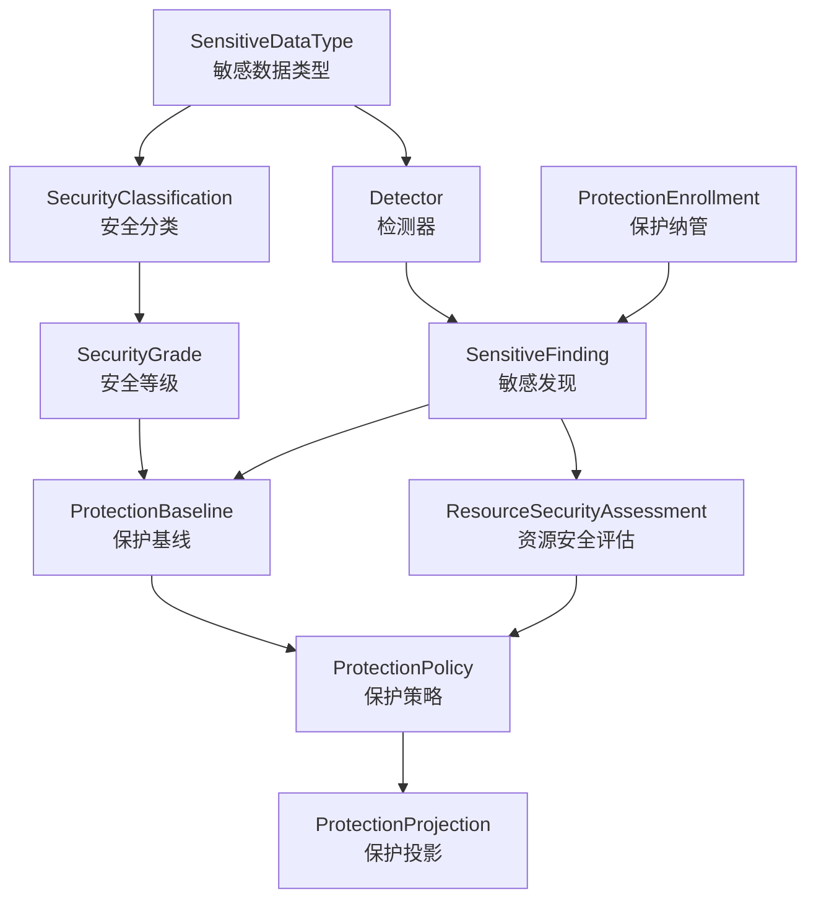
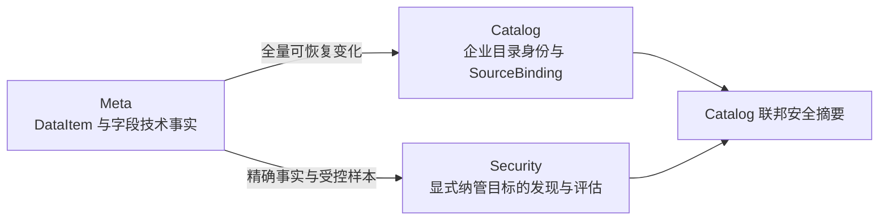
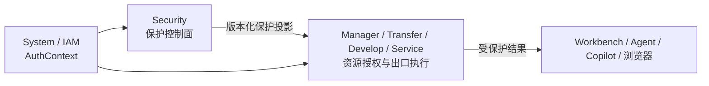
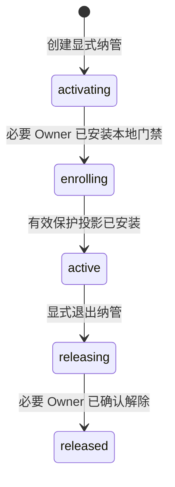
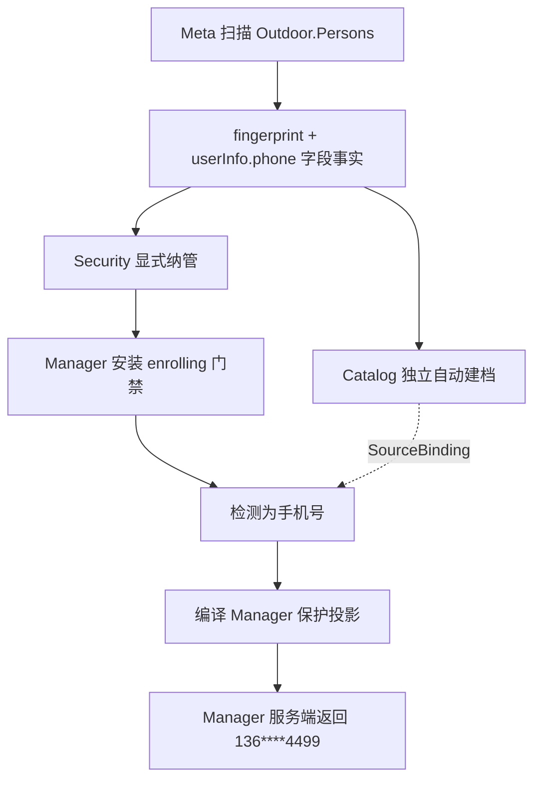

# ADDP 数据安全与隐私保护体系图

本文定义 ADDP 数据安全与隐私保护的概念边界、事实所有权和模块协作关系。实现约束见 [数据安全与隐私保护实现规范](../spec/addp数据安全与隐私保护实现规范.md)。

## 一、模块定位

ADDP 设置独立 `Security` 模块，中文名为“数据安全”，产品入口使用“数据安全与隐私保护”。Security 是安全分类分级、敏感发现、具体专业资源评估、保护策略和可执行保护投影的唯一业务控制面。

Security 不是：

- System IAM 的替代品，不拥有 User、Role、Permission、AuthContext 或登录认证；
- 企业资源目录，不复制 CatalogEntry、责任、目录可见性或业务编目；
- 中央数据代理，不接管所有预览、查询、导出和服务流量；
- 全资源 ACL 中心，不代替各 owner 的 Resource Grant / Policy 和最终资源动作判断；
- 凭据加解密工具包，敏感配置值加解密属于 `common/secretcipher`。

## 二、核心概念



- `SensitiveDataType` 回答“是什么敏感数据”，例如手机号、身份证件号、银行卡号和精确位置。
- `SecurityClassification` 回答“属于哪类安全信息”，例如个人信息、敏感个人信息、金融信息和商业秘密。
- `SecurityGrade` 回答“风险和默认控制强度有多高”。
- `Detector` 根据结构事实和受控样本产生候选发现，不直接改写 owner 专业事实。
- `SensitiveFinding` 保存候选类型、置信度和不含原始敏感值的证据。
- `ResourceSecurityAssessment` 是安全治理人员对确定专业资源或组件做出的正式分类分级结论。
- `ProtectionBaseline` 定义某类型和等级的最低保护意图。
- `ProtectionPolicy` 针对正式评估、消费 Owner 和动作显式收紧保护结果；没有显式 Policy 时，Assessment 对应的 ProtectionBaseline 仍是有效最低保护意图。
- `ProtectionProjection` 是交付给数据出口 owner 的最小、版本化、可校验执行契约，不是策略业务对象副本。

ProtectionBaseline 或 SensitiveDataType 的保护语义变化由 Security 根据自身 Finding 与 Assessment 依赖精确定位 Enrollment，并通过唯一编译器重新发布投影；不依赖 Catalog，也不重新扫描 Meta。正式 Assessment revision 冻结当次分类分级结论，不随定义修改静默漂移。

## 三、专业资源身份与 Catalog

Standard、Model、Security 都先使用 owner 稳定专业资源身份形成自身事实，不以 Catalog 建档为前置。Security 使用类型化专业资源引用：

```text
owner_module + resource_type + resource_identity + optional component_key
```

针对 Meta DataItem 字段：

```text
owner_module      = meta
resource_type     = data_item
resource_identity = item fingerprint
component_key     = Meta 发布的稳定字段键
```

用户创建 ProtectionEnrollment 时只从 Meta 资源树选择一个 DataItem。Security 根据选择结果的标准 ResourceLocator 计算并保存 DataItem fingerprint，同时冻结仅含 Engine ID、item type 与 full_name 的最小保护目标快照；Enrollment 不接受字段路径，`component_key` 由后续 Detector 发现并进入 Finding、Assessment 与保护规则。ResourceLocator 和展示快照都不进入 Owner 投影的专业资源身份。

Catalog 与 Security 是 Meta 技术事实的并行消费者：



Catalog 建档后通过 SourceBinding 联邦展示 Security 事实；Security 不迁移、复制或改绑 Assessment。Catalog 来源重绑不得让旧评估静默跟随到新物理来源。Catalog 不是 Security 发现、评估、策略编译或保护生效的启动、Ready 或运行依赖。

## 四、事实所有权

| Owner | 权威事实 | 明确不拥有 |
| --- | --- | --- |
| Standard | Domain、Glossary、Element、CodeSet、Unit、Metric 等业务数据标准 | 安全分类、安全等级和具体资源安全评估 |
| Meta | DataItem、字段路径、类型、结构、源版本和受控读取能力 | “该字段是手机号/L3”等治理结论 |
| Security | 敏感类型、安全分类分级、Detector、Finding、Assessment、保护基线、策略和保护投影 | IAM、业务资源本体、CatalogEntry、owner ACL 和中央内容代理；受控例外属于后续范围 |
| Catalog | 企业目录身份、SourceBinding、业务语义关联、责任、治理状态和目录可见性 | Security 专业事实的第二份可编辑结果 |
| System / IAM | Principal、Tenant、Role、Permission、AuthContext 和审计基础设施 | 敏感数据识别和字段保护策略 |
| 资源 Owner | Resource Grant / Policy、最终资源动作判断和本模块服务端出口保护执行 | 第二套安全分类分级和私有脱敏规则体系 |

## 五、控制面与数据面

Security 只编译保护决策，数据出口 owner 在自身服务端执行：



资源 Owner 先根据 AuthContext、Permission 和 Resource Grant / Policy 判断能否执行预览、查询、导出或发布，再与 Security 投影合并并执行更严格结果。Owner 可以拒绝访问，但不得降低 Security 基线。

用户数据请求只读取 Owner 本地有效投影，不逐行、逐字段或逐请求同步调用 Security、Catalog 或 Meta。浏览器不接收明文后再遮盖。

## 六、显式纳管与受控负担

只有显式纳管的资源进入 Security 主链路。未纳管资源不调用 Security、不扫描内容、不执行保护算法、不写保护审计。Locator 型出口通过本地索引快速未命中返回原路径；自由查询在当前 Tenant 存在任一纳管目标时，允许为证明 JOIN、View、`$lookup` 等完整依赖而读取 PreparedQuery 的 `QueryReadSet`，只有本次查询精确命中纳管 DataItem 后才继续读取 `QueryOutputLineage` 和实时源字段结构。该成本不得扩大为逐请求 Security / Meta / Catalog 远程调用或内容扫描。

Develop 不解析 SQL/MQL，也不按结果列名猜测敏感字段。Engine Provider 在同一 PreparedQuery 中声明 source 到结果的 identity、direct、derived 或 opaque 关系；Develop 只对 identity/direct 输出执行 `query` 规则，任何受保护组件的 derived/opaque 输出、结构漂移或 lineage unresolved 都拒绝当前查询。保护发生在 QueryResult 写入执行记录或返回 Workbench / Notebook 之前。

纳管激活顺序固定为：



- `activating`：Security 尚未声明保护已生效；先发布最小 `enrolling` 门禁变化。
- `enrolling`：Owner 已安装门禁，正在发现或等待策略；相关出口拒绝或保守抑制，不返回明文。
- `active`：Owner 使用本地有效投影执行。
- `releasing`：Owner 继续执行最后有效保护，直到明确解除变化安装完成。
- `released`：只保留历史和审计；Owner 本地纳管索引已显式删除。

保护纳管管理页的默认工作视图只展示 `activating`、`enrolling`、`active` 和 `releasing`；`released` 记录进入独立的“已退出”历史视图，依然可读但不提供逐条硬删除。需要再次保护同一资源时应创建新的 ProtectionEnrollment，不恢复旧聚合的生命周期。

## 七、Finding、正式评估与保守保护

Detector 产生的 Finding 不是正式治理真相，但安全保护不必等待人工确认：

- Finding 达到所属 SensitiveDataType 和 ProtectionBaseline 的保护阈值时，Security 立即编译保守保护投影；
- Finding 证据不足时，已纳管 Owner 继续拒绝或保守抑制；
- 人工确认后形成正式 Assessment，编译器在同一主路径上用正式结论取代候选基线；
- 人工确认误报时显式关闭 Finding，由同一变化流发布新投影，不建立旁路“不脱敏”规则。

治理操作只面向 Enrollment 最近一次成功发现的当前快照。当前快照摘要同时区分候选总数、待复核数和已复核数；历史快照 Finding 与不可变复核记录继续保留用于审计，但不混入当前待办。

一次成功发现中 Finding 数为 0，只是“当前已支持检测能力对该次资源快照零命中”，不能上升为“无敏感数据”的正式治理真相。Security 不因零命中自动发布 `allow`；治理人员确认当前无需保护时，使用同一 Release 主路径退出纳管，并冻结确认人、时间、原因和依据快照。

## 八、Outdoor 手机号示例



Catalog 尚未建档时，只要 Security 已完成纳管激活且 Manager 已安装有效投影，预览仍返回 `136****4499`。已识别为手机号但单个值不符合确认格式时，使用投影中的保守失败效果，不返回原值。

## 九、保护能力分层

| 能力 | 数据是否改变 | 典型出口 |
| --- | --- | --- |
| 动态遮盖 | 否 | 预览、查询、服务展示 |
| 字段抑制 | 否 | 高敏字段不返回原值 |
| 行过滤 | 否 | Department、Project Group 或业务区域数据范围 |
| 假名化/令牌化 | 生成替代值 | 关联分析和跨系统使用 |
| 静态脱敏 | 生成新 DataItem | 测试、研究和对外交付 |
| 匿名化 | 生成不可再识别结果 | 开放或广泛分析 |
| 原值揭示 | 否 | 显式、限时、可审计的高风险例外 |

普通哈希不是小取值空间数据的默认匿名化方法。动态遮盖不修改源数据；静态脱敏必须生成新 DataItem 并保留血缘。

## 十、相关文档

- [ADDP 术语表](addp术语表.md)
- [ADDP 核心概念关系图](addp核心概念关系图.md)
- [ADDP 模块架构图](addp模块架构图.md)
- [ADDP 账号与权限体系图](addp账号与权限体系图.md)
- [ADDP 企业资源目录体系图](addp企业资源目录体系图.md)
- [数据安全与隐私保护实现规范](../spec/addp数据安全与隐私保护实现规范.md)
- [数据安全与隐私保护体系专题](../next/ADDP数据安全与隐私保护体系专题.md)
