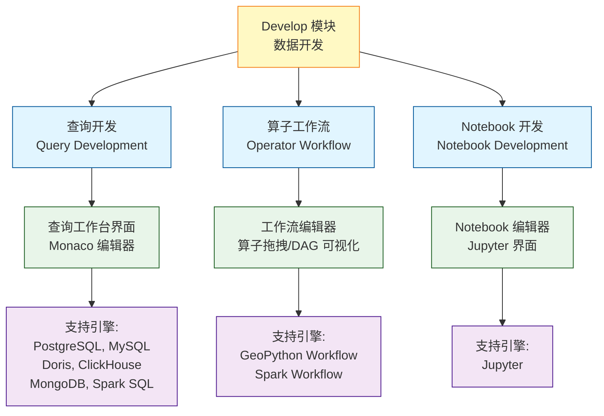
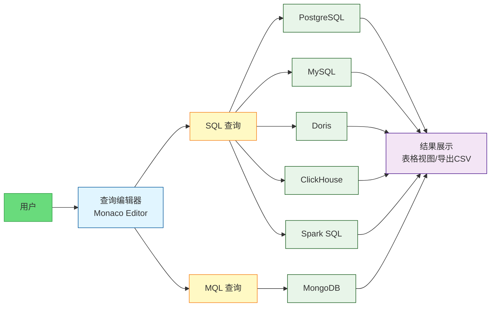
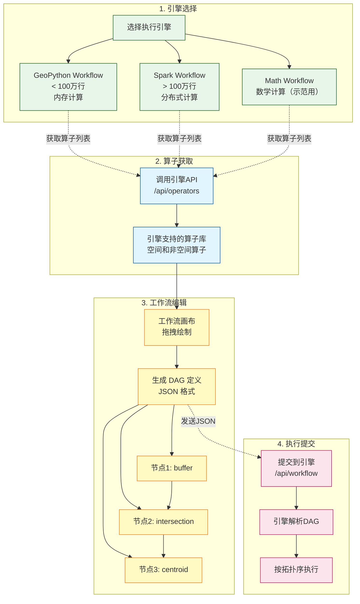
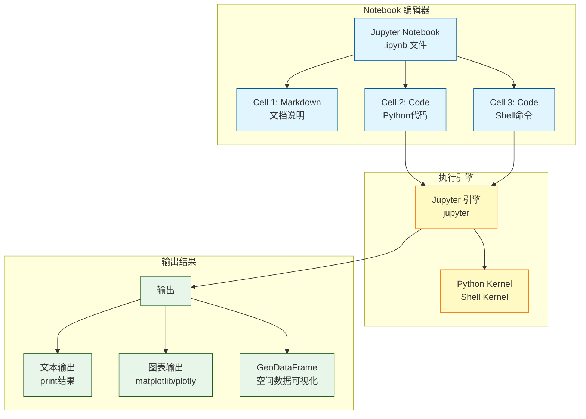
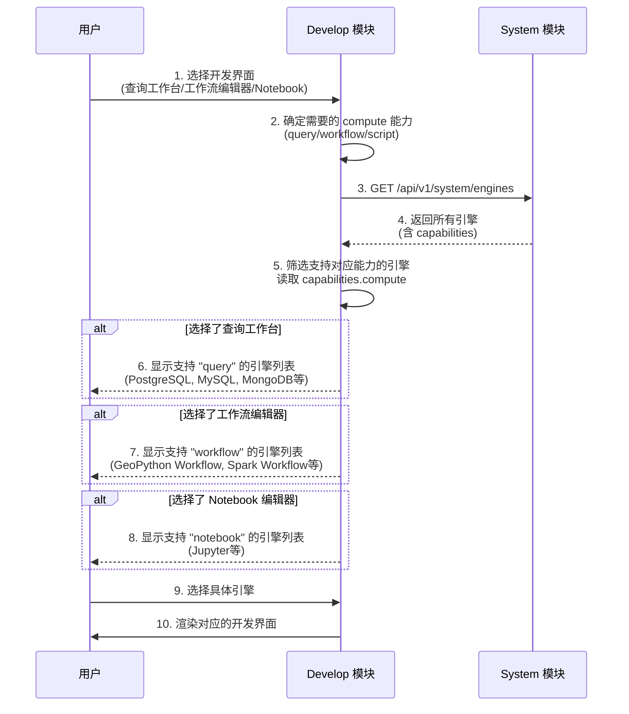

# ADDP 数据开发体系图

本文档展示 ADDP 平台的三种数据开发方式及其与引擎能力的关系。

---

## 目录

1. [三种开发方式概述](#三种开发方式概述)
2. [查询开发 (Query)](#查询开发-query)
3. [算子工作流 (Workflow)](#算子工作流-workflow)
4. [Notebook 开发](#notebook-开发)
5. [能力声明与开发界面映射](#能力声明与开发界面映射)

---

## 三种开发方式概述

ADDP 的 Develop 模块提供三种数据开发方式，由引擎的 `capabilities.compute` 能力决定：



### 三种开发方式对比

| 维度 | 查询开发 (Query) | 算子工作流 (Workflow) | Notebook 开发 |
|------|-----------------|---------------------|--------------|
| **能力字段** | `compute.query.supported` | `compute.workflow.supported` | `compute.script.supported` |
| **界面** | 查询工作台 | 工作流编辑器 | Notebook 编辑器 |
| **编辑器** | Monaco (SQL/MQL) | 算子拖拽 + DAG 可视化 | Jupyter Notebook |
| **执行方式** | SQL/MQL 执行 | DAG 工作流执行 | Cell 逐个执行 |
| **适用场景** | 数据查询、统计分析 | 数据处理、空间分析 | 交互式探索、变量传递 |
| **支持引擎** | 可查询通用引擎 | 工作流运行时 | Jupyter 脚本运行时 |
| **结果展示** | 表格视图、导出 CSV | GeoDataFrame、可视化 | 文本、图表、地图 |
| **保存形式** | SQL 文本 + 历史记录 | DAG JSON + 执行记录 | .ipynb 文件 |

---

## 查询开发 (Query)

### 查询开发概述

**查询开发** 支持 SQL、MQL 等查询语言的编辑、执行和结果展示。



### 查询开发特性

- **语法高亮**: 支持 SQL/MQL 语法高亮
- **自动补全**: 表名、字段名自动补全
- **格式化**: SQL 代码格式化
- **执行历史**: 保存 SQL 和结果,可回溯
- **结果导出**: 表格视图、导出 CSV

---

## 算子工作流 (Workflow)

### 算子工作流概述

**算子工作流** 是基于数据处理算子的可视化 DAG 工作流,用于空间和非空间数据分析。



### 重要说明

### 查询任务与 DuckDB 联邦查询

Develop 的 `query` 任务分为两条互斥主路径：

1. 普通 SQL 查询：`content.query_type="sql"`，`execution_config.engine_id` 指向 System 中具备 query 能力的真实引擎实例。
2. DuckDB 联邦查询：`content.query_type="sql"`，`execution_config.query_mode="duckdb"`，由 Develop 内置 DuckDB 服务执行，运行时根据 SQL 引用动态挂载 PostgreSQL、MySQL、MinIO/S3 等真实 System 引擎。

DuckDB 联邦查询不是工作流引擎，也不是 System 中注册的普通引擎实例。Develop 前端可以在查询工作台中提供 DuckDB 查询模式选项，但该选项必须来自 Develop 自身的查询模式能力，而不是追加到 `/develop/engines` 的伪 Engine。`/develop/engines` 只能返回 System 中具备 query 能力的真实引擎实例；保存任务、即时执行和写入执行记录均不得使用虚拟 `engine_id=0`，必须使用 `query_mode="duckdb"` 标识该内置联邦查询路径。

### Notebook 脚本任务

Notebook 使用 `dev_type="script"`，并在 `execution_config.engine_id` 中绑定 System 注册的 Notebook 引擎实例。Develop 只列出 `active` 且声明 `compute.script.modes` 包含 `notebook` 的 Runtime Descriptor。上传时先选择引擎，再从该实例查询 Kernel；执行时沿用保存的引擎和 Kernel，不接受临时改绑。

Develop 后端通过 `common/dbbridge.OpenScriptSession()` 消费 `ScriptRuntimeProvider`，并使用租户 Service Access Token 调用返回的受控运行端点。部署配置不再提供 `JUPYTER_URL`，Develop 也不代理引擎健康检查。

⚠️ **Spark Workflow 运行时特殊要求**:

当用户选择 **Spark Workflow** 运行时时，除了该运行时自注册记录本身，还需要：

1. **注册 Spark 通用引擎资源**作为运行时（`engine_type: "spark"`）
2. 在执行配置中指定 `spark_cluster_id`（指向实际的 Spark 通用引擎资源）
3. Develop 后端校验 `spark_cluster_id` 指向已启用的 `engine_type=spark` 通用引擎资源，再调用 `WorkflowRuntimeProvider.ExecuteWorkflow()` 并映射为标准请求顶层 `engine_id`
4. Spark Workflow 根据顶层 `engine_id` 读取 Spark 资源配置并创建 SparkSession

工作流算子中的数据源/目标资源不复用这个顶层 `engine_id`。用户和 AI 侧应使用 `locator` 或 `target_parent_locator + target_name` 选择表、文件、对象存储资源；Develop 后端在执行前派生数据源的 `connection_info` 以及 `schema/table` 或 `path`，再传给运行时。

**架构关系**：
```
Develop 执行配置 spark_cluster_id
    ↓ 映射为标准请求顶层 engine_id
Spark Workflow 运行时 (WorkflowRuntimeProvider)
    ↓ 读取 System 中的 spark 通用引擎资源
Spark 通用引擎资源 (运行时)
    ↓ 创建 SparkSession 并分布式执行
结果返回
```

相比之下，**GeoPython Workflow** 和手动注册后的 **Math Workflow** 自身就是可执行运行时，无需额外绑定 Spark 通用引擎资源。

### 算子工作流特点

**节点粒度**: 细粒度算子 (buffer、intersection、centroid)
**DAG 层级**: 算子级别的有向无环图
**数据传递**: GeoDataFrame 在内存中传递
**执行运行时**: GeoPython Workflow (单节点内存计算) 或 Spark Workflow (分布式计算)
**适用场景**: 数据分析、地理计算

### 典型算子

**空间算子** (21 个):
- **几何操作**: buffer、centroid、convex_hull、envelope
- **空间关系**: intersection、union、difference、symmetric_difference
- **空间查询**: within、contains、intersects、touches
- **坐标转换**: to_crs、reproject
- **其他**: dissolve、clip、overlay

**非空间算子**:
- **数据转换**: filter、select、aggregate
- **数学计算**: sum、mean、max、min
- **连接操作**: join、merge

---

## Notebook 开发

### Notebook 概述

**Jupyter Notebook** 交互式开发环境,支持 Python 和 Shell 代码执行。



### Notebook 特性

- **交互式开发**: Cell 逐个执行,实时查看结果
- **变量传递**: Cell 间共享变量,工作流间传递数据
- **多种输出**: 文本、图表、GeoDataFrame 可视化
- **Python Notebook**: 通过 Jupyter 运行 Python Notebook
- **保存回放**: .ipynb 文件保存,可重新执行

---

## 能力声明与开发界面映射

用户先选择开发界面，系统根据界面需求筛选支持对应 compute 能力的引擎:



### 开发界面与引擎筛选规则

| 用户选择的界面 | 需要的能力 | 筛选后的引擎示例 | 编辑器组件 |
|--------------|----------------|----------------|-----------|
| 查询工作台 | `compute.query.supported=true` | PostgreSQL, MySQL, MongoDB, Neo4j, ClickHouse, Doris, Spark SQL | Monaco Editor |
| 工作流编辑器 | `compute.workflow.supported=true` | GeoPython Workflow, Spark Workflow, Model3D Workflow, PointCloud Workflow, SuperMap Workflow, Math Workflow（自动启动服务、手动注册示例） | 算子拖拽 + DAG Canvas |
| Notebook 编辑器 | `compute.script.supported=true` | Jupyter | Jupyter Notebook |

### 引擎能力声明示例

**PostgreSQL 引擎**:
```json
{
  "schema_version": "engine.capabilities/v1",
  "compute": {
    "query": {
      "supported": true,
      "languages": ["sql"],
      "default_language": "sql"
    }
  }
}
```
→ 当用户选择**查询工作台**时，PostgreSQL 会出现在可用引擎列表中

**GeoPython Workflow 引擎**:
```json
{
  "schema_version": "engine.capabilities/v1",
  "compute": {
    "workflow": {
      "supported": true,
      "runtime_api": "addp.workflow/v1",
      "dynamic_operators": true
    }
  }
}
```
→ 当用户选择**工作流编辑器**时，GeoPython Workflow 会出现在可用引擎列表中

**Jupyter 引擎**:
```json
{
  "schema_version": "engine.capabilities/v1",
  "compute": {
    "script": {
      "supported": true,
      "modes": ["notebook"],
      "languages": ["python"]
    }
  }
}
```
→ 当用户选择**Notebook 编辑器**时，Jupyter 会出现在可用引擎列表中

**组合能力引擎** (理论示例):
```json
{
  "schema_version": "engine.capabilities/v1",
  "compute": {
    "query": {"supported": true, "languages": ["sql"]},
    "workflow": {"supported": true, "runtime_api": "addp.workflow/v1", "dynamic_operators": true}
  }
}
```
→ 该引擎会同时出现在**查询工作台**和**工作流编辑器**的引擎列表中

---

## 相关文档

- [返回核心概念关系图](addp核心概念关系图.md)
- [ADDP 引擎体系图](addp引擎体系图.md)
- [ADDP 任务编排体系图](addp任务编排体系图.md)
- [Develop 模块详情](../../develop/CLAUDE.md)

---

**文档版本**: v1.0
**创建日期**: 2026-02-16
**作者**: ADDP 开发团队
