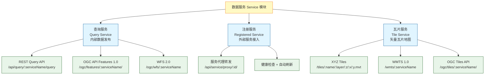
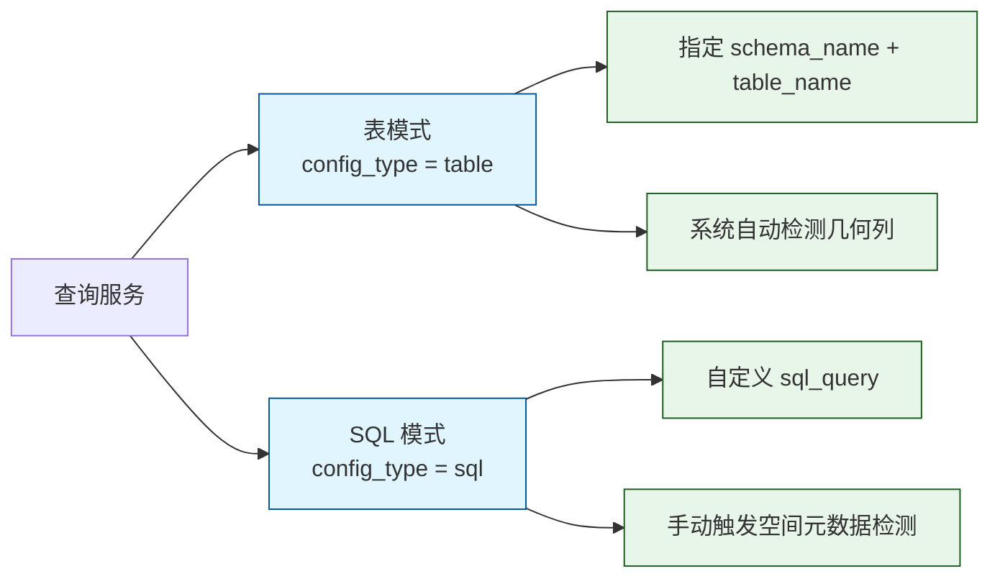
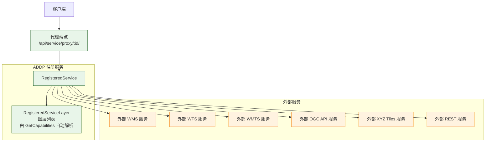
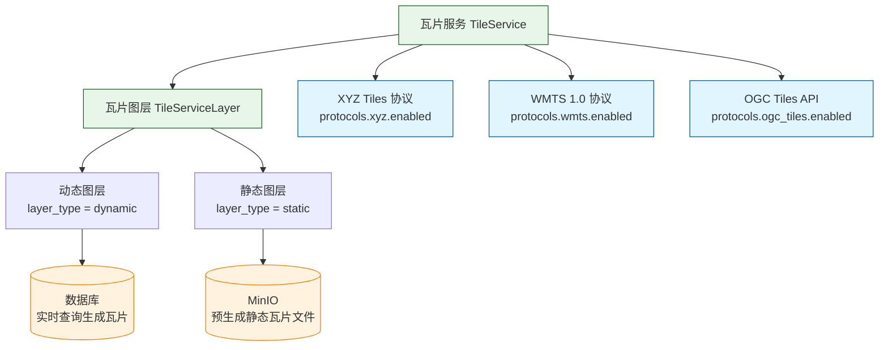

# ADDP 数据服务体系图

本文档展示 ADDP 平台的数据服务体系，包括内部查询服务发布、外部服务注册和矢量瓦片服务三大系统。

---

## 目录

1. [数据服务概述](#数据服务概述)
2. [查询服务](#查询服务)
3. [注册服务](#注册服务)
4. [瓦片服务](#瓦片服务)
5. [服务目录](#服务目录)
6. [权限控制](#权限控制)

---

## 数据服务概述

ADDP 的数据服务体系由三个相互独立的服务系统组成：



### 三大服务系统对比

| 服务系统 | 数据库表 | 定位 | 支持协议 |
|----------|----------|------|----------|
| **查询服务** | `service.query_services` | 将内部数据库表或 SQL 查询发布为标准服务 | REST Query、OGC API Features 1.0、WFS 2.0 |
| **注册服务** | `service.registered_services` | 注册管理外部第三方 OGC 服务，提供统一代理 | 代理 WMS/WFS/WMTS/OGC API/XYZ/REST |
| **瓦片服务** | `service.tile_services` | 发布高性能矢量瓦片地图服务 | XYZ Tiles、WMTS 1.0、OGC Tiles API |

---

## 查询服务

查询服务将内部数据源或固定查询发布为稳定、受治理的数据 API。表、固定 SQL 和联邦 SQL 只表达来源与执行绑定；REST Query、OGC API Features 和 WFS 是同一个不可变发布版本的协议投影，共用结构化查询内核，不各自构造 SQL。

每次通过验证并对外生效的版本都是一个 `published service` 血缘主体，身份为 `service_id + published_revision`。它不是 data item；其来源依赖由 Service 在发布时冻结并向 Meta 提供，血缘关系表示为 `data item --serve--> published service`。因此服务页面可以直接查询与展示血缘，不要求用户跳转到 Manager。

### 配置模式

查询服务支持两种互斥的配置模式：



### 查询服务依赖快照

查询服务不复制完整 Meta item attributes，只冻结执行和对外契约真正依赖的事实：

- 表模式以 `data_config.locator` 指向的 Meta item 为源身份，保存 item fingerprint、源扫描时间以及从标准 attributes 解析出的 `datatype.TableInfo`、`datatype.SpatialInfo` 和对象表执行描述符。
- SQL 模式没有单一 Meta item 身份，保存规范化 SQL hash 以及检测得到的输出 `TableInfo` / `SpatialInfo`。
- DuckDB 联邦 SQL 如果引用对象表，还会在发布时冻结查询实际引用的对象表物理映射；普通执行只从 System 获取当前连接信息，不再调用 Meta 重新解析对象表。
- Meta 负责当前 item 事实、fingerprint、`scanned_at` 和 `data_updated_at`；Service 负责 `captured_at` 和依赖投影 hash。
- 普通服务执行只读取已发布快照，不在每次请求时调用 Meta。只有显式检查或刷新动作才重新读取源事实并比较差异。
- 快照结构直接复用 `common/datatype` 现有模型，不新增与 `SpatialInfo`、`TableInfo` 重复的空间或表结构实体。
- `dependency_hash` 只覆盖查询执行和输出契约事实，不包含 `row_count`、大小、扫描时间、数据更新时间、空间范围和空间索引状态，避免数据量变化被误判为结构契约变化。
- `dependency_hash` 只是依赖快照的版本摘要，不是具体血缘边；具体边必须来自已解析的 source item 列表和发布事实。
- 表模式直接使用 source snapshot 中的 item fingerprint；SQL / 联邦 SQL 只有在得到明确 source item 列表时才能建立服务依赖，无法解析时保留“不完整依赖”状态，不伪造血缘边。
- 静态瓦片服务若由预生成 PMTiles 提供，应表达为“原始数据 `derive` 到 PMTiles data item，再由 PMTiles item `serve` 到服务”，不能把临时瓦片缓存路径当成源数据。
- 历史记录不保留兼容路径：无法通过 locator 定位同租户且具有 fingerprint 的 Meta item 的表模式服务，以及无法还原对象表依赖的旧 DuckDB 联邦 SQL 服务，在快照迁移时直接删除并由用户重新创建。

空间信息统一保存为标准 `SpatialInfo` payload，例如 `geometry_columns`、`primary_geometry_column`、`crs_ref`、`crs_definitions` 和原生 CRS 下的 `extent`，不再保存 Service 私有的 `column/srid/types` 简化结构。

### 查询服务发布契约

每个发布版本必须冻结：

- 来源绑定和执行 Runtime；
- 输出 `TableInfo` / `SpatialInfo`；
- 非空唯一的稳定排序键，允许复合键；
- 可选择字段、可过滤字段及允许的类型化操作符；
- 最大返回行数、超时等资源限制；
- 依赖快照和版本 hash。

消费者只能提交结构化查询请求，不得提交 SQL、WHERE、ORDER BY 或引擎原生表达式。调用方排序不足以形成全序时，查询编译器自动追加稳定排序键。发布版本缺少稳定排序键时不得执行分页查询，也不得启用 OGC API Features。

普通查询默认使用 cursor/keyset 分页，读取 `limit + 1` 行判断 `has_more`，不执行精确计数。游标绑定发布版本、查询指纹、有效排序和最后一行排序值。管理列表仍使用 `page/page_size`，两种分页语义不得混用。

### 支持的协议

| 协议 | 端点 | 主要操作 | 状态 |
|------|------|----------|------|
| **REST Query API** | `POST /api/query/:serviceName/query` | 结构化过滤、稳定排序、游标分页、字段选择 | ✅ 已实现 |
| **OGC API Features 1.0** | `GET /ogc/features/:serviceName/` | Landing Page、Collections、Items | ✅ 已实现 |
| **WFS 2.0** | `GET /ogc/wfs/:serviceName` | GetCapabilities、GetFeature、DescribeFeatureType | ✅ 已实现 |
| WMS 1.3 | 待实现 | GetCapabilities、GetMap、GetFeatureInfo | ⏳ 规划中 |

### REST Query API 请求

```json
{
  "select": ["id", "name", "updated_at"],
  "filter": {
    "field": "status",
    "op": "eq",
    "value": "active"
  },
  "order_by": [
    {"field": "updated_at", "direction": "desc"}
  ],
  "page": {"limit": 100, "cursor": ""},
  "format": "json"
}
```

过滤节点只允许发布策略声明的字段和类型化操作符；逻辑组合使用 `and/or/not` 结构，不接受字符串表达式。响应分页只返回 `limit/has_more/next_cursor`，默认不返回总数。

### OGC API Features 端点

```
GET /ogc/features/:serviceName/                         ← Landing Page
GET /ogc/features/:serviceName/conformance              ← 标准声明
GET /ogc/features/:serviceName/collections              ← 集合列表
GET /ogc/features/:serviceName/collections/:id/items   ← 要素列表（limit + opaque cursor）
GET /ogc/features/:serviceName/collections/:id/items/:fid ← 单个要素
```

### 查询服务管理 API

```
POST   /api/v1/service/query                              ← 创建查询服务
GET    /api/v1/service/query                              ← 列表
GET    /api/v1/service/query/:id                          ← 详情
PUT    /api/v1/service/query/:id                          ← 更新用户配置
DELETE /api/v1/service/query/:id                          ← 删除
GET    /api/v1/service/query/:id/source-snapshot-diff     ← 显式检查 Meta 当前事实差异
POST   /api/v1/service/query/:id/refresh-source-snapshot  ← 显式刷新表模式依赖快照
POST   /api/v1/service/sql/output-contract                ← 检测 SQL 输出 TableInfo / SpatialInfo
```

---

## 注册服务

注册服务用于将**外部第三方 OGC 服务**纳入 ADDP 统一管理，提供代理访问、元数据解析、健康监控等能力。

### 注册服务架构



### 支持注册的服务类型

| service_type | 说明 |
|---|---|
| `wms` | Web Map Service（地图图片服务） |
| `wfs` | Web Feature Service（矢量要素服务） |
| `wmts` | Web Map Tile Service（瓦片地图服务） |
| `ogc_api` | OGC API Features（现代 OGC 标准） |
| `xyz` | XYZ Tiles（Slippy Map 瓦片） |
| `rest` | RESTful API 服务 |

### 认证配置

| auth_type | 说明 |
|---|---|
| `none` | 无需认证（公开服务） |
| `basic` | HTTP Basic Auth |
| `bearer` | Bearer Token |
| `api_key` | API Key（Header 或 Query 参数） |

> 认证信息使用 AES-256-GCM 加密存储在 `auth_config` 字段中。

### 注册服务管理 API

```
POST   /api/service/registered              ← 注册服务（自动调用 GetCapabilities 解析元数据）
GET    /api/service/registered              ← 列表
GET    /api/service/registered/:id          ← 详情（含图层列表）
PUT    /api/service/registered/:id          ← 更新
DELETE /api/service/registered/:id          ← 删除
POST   /api/service/registered/:id/refresh  ← 手动刷新元数据
POST   /api/service/registered/:id/health   ← 手动触发健康检查

GET    /api/service/proxy/:id/*path         ← 代理转发（无需认证，自动注入外部服务认证）
```

### 自动化任务

- **定时健康检查**：每小时（cron: `0 * * * *`）自动检测所有注册服务的可用性
- **定时元数据刷新**：每天凌晨（cron: `0 0 * * *`）自动更新 GetCapabilities 元数据

### 安全机制

- **防 SSRF**：代理转发前检查目标 URL 合法性
- **白名单机制**：可配置允许代理的域名白名单
- **认证隔离**：外部服务认证信息仅在服务端使用，不暴露给客户端

---

## 瓦片服务

瓦片服务将数据库中的空间数据，以高性能矢量瓦片格式对外发布，支持动态生成和静态预存两种图层模式。

### 瓦片服务架构



### 支持的协议与端点

| 协议 | 端点 | 格式 | 状态 |
|------|------|------|------|
| **XYZ Tiles** | `GET /tiles/:serviceName/:layerName/:z/:x/:y.{format}` | mvt / png / jpg | ✅ 已实现 |
| **WMTS 1.0** | `GET /wmts/:serviceName` | GetCapabilities | ✅ 已实现 |
| **OGC Tiles API** | `GET /ogc/tiles/:serviceName/` | 现代标准 | ✅ 已实现 |

### OGC Tiles API 端点

```
GET /ogc/tiles/:serviceName/                                                         ← Landing Page
GET /ogc/tiles/:serviceName/conformance                                              ← 标准声明
GET /ogc/tiles/:serviceName/tileMatrixSets                                           ← 瓦片矩阵集列表
GET /ogc/tiles/:serviceName/tileMatrixSets/:tileMatrixSetId                         ← 矩阵集详情
GET /ogc/tiles/:serviceName/tiles                                                    ← 图层列表
GET /ogc/tiles/:serviceName/tiles/:layer/:tileMatrixSetId/:z/:row/:col              ← 获取瓦片
```

### 瓦片服务管理 API

```
POST   /api/service/tile                              ← 创建瓦片服务
GET    /api/service/tile                              ← 列表
GET    /api/service/tile/:id                          ← 详情
PUT    /api/service/tile/:id                          ← 更新
DELETE /api/service/tile/:id                          ← 删除

POST   /api/service/tile-layers/:serviceId            ← 添加图层
GET    /api/service/tile-layers/:serviceId            ← 图层列表
GET    /api/service/tile-layers/:serviceId/:layerId   ← 图层详情
PUT    /api/service/tile-layers/:serviceId/:layerId   ← 更新图层
DELETE /api/service/tile-layers/:serviceId/:layerId   ← 删除图层
```

---

## 服务目录

服务目录提供统一的服务发现和浏览入口，聚合三大服务系统的所有服务：

```
GET /api/service/catalog  ← 获取服务目录（聚合查询/注册/瓦片服务）
```

前端支持按协议类型筛选：全部、WMS、WFS、WMTS、OGC API Features、XYZ Tiles。

---

## 权限控制

### 管理端（需 User Access Token）

所有 `/api/service/*` 路径下的管理操作均需要有效的用户 Access Token，且严格按租户隔离：所有查询自动过滤 `tenant_id`。

### 公开端（可选认证）

以下端点可配置是否需要认证（通过 `public_access` 字段控制）：

| 端点类型 | 路径前缀 |
|----------|----------|
| REST 数据查询 | `POST /api/query/:serviceName/query` |
| OGC API Features | `GET /ogc/features/:serviceName/` |
| WFS | `GET /ogc/wfs/:serviceName` |
| XYZ 瓦片 | `GET /tiles/:serviceName/:layerName/:z/:x/:y` |
| WMTS | `GET /wmts/:serviceName` |
| OGC Tiles | `GET /ogc/tiles/:serviceName/` |
| 注册服务代理 | `GET /api/service/proxy/:id/*path` |

---

## 相关文档

- [返回核心概念关系图](addp核心概念关系图.md)
- [Service 模块详情](../../service/CLAUDE.md)

---

**文档版本**: v2.0
**更新日期**: 2026-02-17
**作者**: ADDP 开发团队
