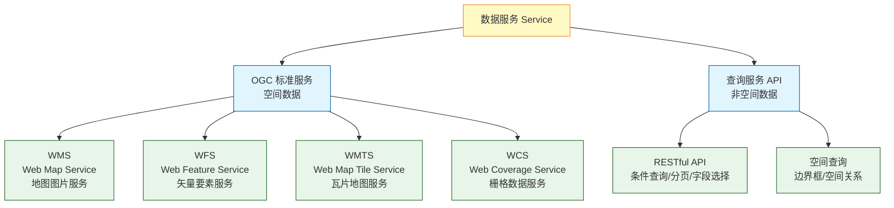
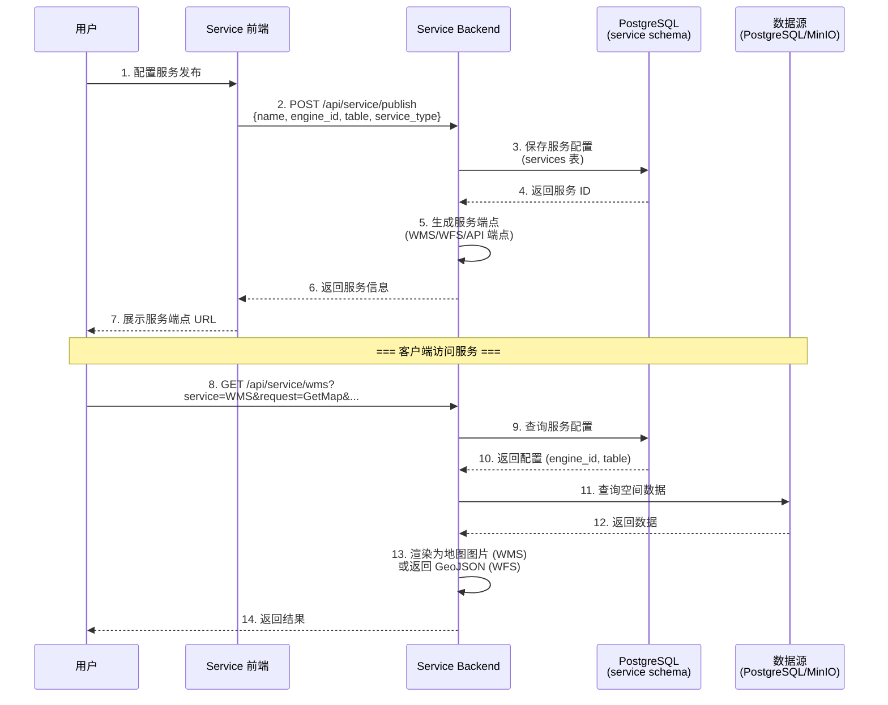
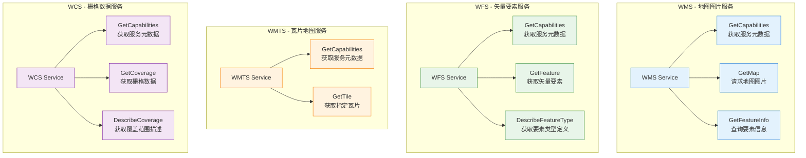
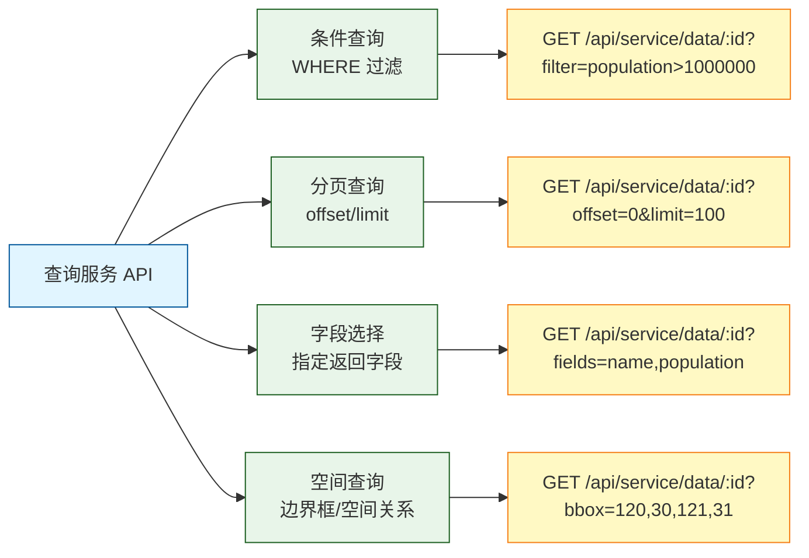

# ADDP 数据服务体系图

本文档展示 ADDP 平台的数据服务发布机制,包括 OGC 标准服务和查询服务 API。

---

## 目录

1. [数据服务概述](#数据服务概述)
2. [服务发布流程](#服务发布流程)
3. [OGC 标准服务](#ogc-标准服务)
4. [查询服务 API](#查询服务-api)

---

## 数据服务概述

**数据服务** 是将数据以 API 形式对外发布,支持 OGC 标准服务(空间数据)和查询服务(非空间数据)。

---

## 服务发布流程

---

## OGC 标准服务

ADDP 支持以下 OGC 标准服务:

### OGC 标准服务说明

| 服务 | 说明 | 主要操作 | 适用场景 |
|------|------|---------|---------|
| **WMS** | Web Map Service 地图图片服务 | - GetCapabilities - GetMap - GetFeatureInfo | 在线地图展示,快速渲染 |
| **WFS** | Web Feature Service 矢量要素服务 | - GetCapabilities - GetFeature - DescribeFeatureType | 矢量数据下载,GIS分析 |
| **WMTS** | Web Map Tile Service 瓦片地图服务 | - GetCapabilities - GetTile | 高性能地图展示,离线地图 |
| **WCS** | Web Coverage Service 栅格数据服务 | - GetCapabilities - GetCoverage - DescribeCoverage | 栅格数据下载,遥感分析 |

---

## 查询服务 API

ADDP 提供 RESTful 数据查询接口,支持非空间数据访问:

### 查询 API 参数

| 参数 | 说明 | 示例 |
|------|------|------|
| `filter` | 条件过滤 (WHERE 子句) | `filter=population>1000000` |
| `offset` | 分页偏移量 | `offset=0` |
| `limit` | 分页大小 | `limit=100` |
| `fields` | 指定返回字段 | `fields=name,population,area` |
| `bbox` | 边界框空间查询 | `bbox=120,30,121,31` (minX,minY,maxX,maxY) |
| `spatial_filter` | 空间关系查询 | `spatial_filter=within:POLYGON(...)` |
| `sort` | 排序 | `sort=population:desc` |

---

## 服务注册与权限

**服务注册**:
- 服务名称、描述、版本
- API 端点和参数定义
- 数据源配置 (引擎、表、字段)

**权限控制**:
- **公开服务**: 无需认证,任何人可访问
- **需认证服务**: 需要 JWT Token
- **租户隔离**: 服务仅对所属租户可见

**访问统计**:
- 记录调用次数
- 统计流量和耗时
- 分析热点数据

---

## 相关文档

- [返回核心概念关系图](../addp核心概念关系图.md)
- [Service 模块详情](../../service/CLAUDE.md)

---

**文档版本**: v1.0
**创建日期**: 2026-02-16
**作者**: ADDP 开发团队
