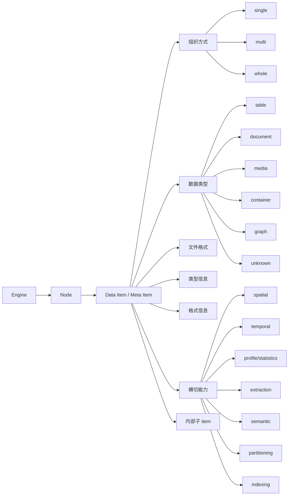

# ADDP 数据类型与格式体系图

本文定义 ADDP 对 data item、数据类型、组织方式、文件格式和横切能力的概念模型。本文只讨论概念层，不修改实现规范；spec 层后续应以本文为准逐步修订。

## 核心结论

ADDP 的数据管理主轴是：

```text
engine -> node -> data item
```

- `engine`：数据来自哪个引擎。
- `node`：引擎内的目录、schema、bucket、prefix 等资源树节点。
- `data item`：平台真正管理、预览、检索、授权、传输的核心数据对象，对应 `meta_item`。

`data item` 是 meta 体系的核心概念，也是 `meta_item` 表的关键语义。`node` 只是资源树组织结构，不能替代 item 边界。

一个 data item 内部可以包含子 item，例如 SQLite 的内部 table、Excel 的 sheet、GeoPackage 的 layer、压缩包中的文件。当前概念上这些子 item 不直接展开为 `meta_item`，而应先在 attributes 中表达；只有当需要独立授权、检索、血缘、传输或生命周期管理时，才讨论是否升格为独立 meta item。

一句话概括：

**engine 管连接，node 管资源树，data item 管平台语义；组织方式管资源如何成为 item，数据类型管用户如何理解 item，文件格式管编码，横切能力管跨类型附加能力。**

## 总览



## engine / node / data item

### engine

`engine` 表示数据接入和访问能力，例如 PostgreSQL、MySQL、MongoDB、Neo4j、MinIO、S3、NFS、本地文件系统。

engine 只回答：

- 如何连接。
- 如何枚举资源。
- 如何读取内容。
- 能提供哪些存储侧元信息。

engine 不直接决定 data item 的数据类型，也不直接决定一个目录、prefix 或文件组是否构成 item。

### node

`node` 表示 engine 内的资源树节点，例如：

- 数据库 schema。
- bucket。
- prefix。
- 目录。
- catalog 分组节点。

node 的职责是组织资源树，服务浏览、扫描和定位。node 不是 data item，除非某个 detector 或引擎原生边界明确说明“这个范围整体构成一个 data item”。

### data item

`data item` 是 ADDP 的核心数据对象，对应 `meta_item`。平台围绕 data item 做：

- 元数据扫描。
- 目录展示。
- 预览。
- 检索。
- 授权。
- 传输。
- 血缘和资产治理。

data item 的身份由 `meta_item` 表字段承载，例如 `id`、`tenant_id`、`engine_id`、`node_id`、`item_type`、`name`、`full_name`、`fingerprint`。这些字段不应重复写入 attributes。

## 组织方式

组织方式回答：**引擎中的文件、目录、表、prefix 等资源如何组织成一个 data item。**

建议使用“组织方式”替代“组合形态”。它比“组合形态”更贴近 engine 资源到 data item 的归并关系，也更容易跨文件、对象存储和数据库引擎复用。

| 组织方式 | 含义 | 示例 |
|---|---|---|
| `single` | 一对一，一个引擎资源就是一个 data item | 数据库 table、CSV 文件、SQLite 文件、PDF、图片 |
| `multi` | 多对一，多个资源共同组成一个 data item | Shapefile 多文件、一组表共同构成一个业务 item |
| `whole` | 全部对一，整个目录、prefix、schema 或扫描范围构成一个 data item | Iceberg 表目录、OSGB 场景目录、完整数据集目录 |

### single

`single` 不等于“单文件”。它表示一个引擎资源和一个 data item 一一对应。

示例：

- PostgreSQL table。
- CSV 文件。
- PDF 文件。
- SQLite 文件。
- ZIP 文件。

SQLite、ZIP、RAR 等虽然内部包含子 item 或子资源，但它们作为外层 data item 仍是 `single`。容器不是组织方式，而是数据类型。

### multi

`multi` 表示多个资源共同组成一个有意义的 data item。

示例：

- Shapefile 的 `.shp/.shx/.dbf/.prj`。
- 未来一组物理表共同构成一个业务逻辑 item。
- 主文件 + 同级索引文件 + 同级元数据文件。

`multi` 只认领明确匹配的组件资源，不独占整个目录或 prefix。

### whole

`whole` 表示整个范围构成一个 data item，不再逐个顾忌范围内的文件和子目录。

示例：

- Iceberg 表目录。
- OSGB 场景目录。
- 明确声明为完整数据集的 prefix。

Parquet 本身不需要被称为“湖表”。一个 Parquet 文件可以是 `single + table + format=parquet`；一组同类 Parquet 文件可以是 `multi + table + format=parquet`；未来 Iceberg 支持后，可以是 `whole + table + format=iceberg`。数据类型仍然是 `table`。

### 取消容器组织方式

容器不是组织方式。容器描述的是 data item 的数据类型或类型特征。

例如：

- SQLite 文件：`organization=single`，`data_type=container`，`format=sqlite`。
- GeoPackage 文件：`organization=single`，`data_type=container`，`format=geopackage`。
- ZIP 文件：`organization=single`，`data_type=container`，`format=zip`。

容器内部的表、sheet、layer、文件是内部子 item，应先在 attributes 中表达。

### 暂不保留 mixed_collection

`mixed_collection` 暂不作为基础组织方式。

如果只认领部分资源，就是 `multi`；如果整个范围都归并为一个 item，就是 `whole`。未来确实出现无法表达的复杂组织方式，再单独讨论。

## 数据类型

数据类型回答：**这个 data item 在用户观感和处理方式上是什么。**

数据类型是对一类类似数据的抽象。它们通常具备相似的数据特征、预览方式、处理手段和治理方式。

建议第一版数据类型：

| 数据类型 | 含义 | 典型处理方式 |
|---|---|---|
| `table` | 表格型数据，有字段、行列或可推断字段 | 字段预览、表格查询、导入导出、统计分析 |
| `document` | 文档型数据，面向阅读、解析和全文提取 | 文档预览、文本提取、全文索引、摘要 |
| `media` | 媒体型数据，包括图片、视频、音频 | 缩略图、播放、转码、媒体元信息 |
| `container` | 容器型数据，内部包含子 item 或资源 | 内部目录、sheet/table/layer 枚举、解包或选择子对象 |
| `graph` | 图数据，节点、边、关系结构 | 图谱预览、关系查询、图算法 |
| `unknown` | 暂未识别 | 基础文件预览或下载 |

### table

`table` 是所有表格型 data item 的通用数据类型。

包括：

- 数据库表。
- CSV / TSV。
- records 型 JSON。
- GeoJSON FeatureCollection。
- Shapefile。
- Parquet / ORC / Avro。
- Iceberg 等表格式目录。

CSV 和 JSON 虽然文本属性强，但只要平台把它们作为行列数据处理，就应归为 `table`。文本属性属于文件格式或读取方式，不应把 CSV 放进 `document`。

JSON 需要结构识别：

- records array、JSON Lines、GeoJSON FeatureCollection 可归为 `table`。
- 任意 JSON 对象、配置文件、嵌套文档可归为 `document` 或 `container`，取决于平台消费方式。

### media

`media` 合并图片、视频、音频。

理由：

- 用户感知都是媒体内容。
- 处理链路相近：预览、缩略图、播放、转码、编码信息。
- 差异可通过 `type_info.media.kind=image|video|audio` 或类似字段表达。

### container

`container` 表示 item 内部包含子 item 或资源。

示例：

- ZIP / RAR / TAR。
- SQLite。
- GeoPackage。
- Excel。

容器类型不说明它如何被 engine 组织成 item。大多数容器文件外层组织方式是 `single`。

## 类型信息

类型信息是某个数据类型天然应该具备的通用元数据。

| 数据类型 | 类型信息示例 |
|---|---|
| `table` | 字段列表、字段类型、主键、索引、行数、采样信息 |
| `document` | 标题、作者、页数、正文摘要、语言 |
| `media` | kind、宽高、时长、编码、采样率、颜色模式 |
| `container` | 内部子 item 列表、默认入口、子资源数量 |
| `graph` | label、relationship、属性结构、节点数、边数 |

这里不再使用 `schema` 作为概念层分区名。这个词容易和数据库 schema、JSON 结构规范、表结构描述混淆。对于 ADDP 概念层，应明确说：

- 表格型数据有 `table info`。
- 媒体型数据有 `media info`。
- 文档型数据有 `document info`。
- 容器型数据有 `container info`。

## 文件格式与格式信息

文件格式回答 item 的编码方式，例如：

- `csv`、`tsv`
- `json`、`geojson`
- `parquet`、`orc`、`avro`
- `shapefile`
- `sqlite`、`geopackage`
- `zip`、`rar`
- `pdf`
- `jpeg`、`png`、`tiff`

格式信息是某个具体格式才有的描述。

示例：

| 格式 | 格式信息示例 |
|---|---|
| `csv` | delimiter、encoding、has_header、quote_char |
| `shapefile` | base_name、component_extensions、has_prj、shape_type、dbf_version |
| `geojson` | geojson_type、feature_count、has_bbox、crs |
| `sqlite` | sqlite_version、table_count、tables |
| `zip` | compression_method、entry_count、encrypted |

格式信息不应污染数据类型信息。例如 Shapefile 的 `shape_type` 是格式信息；几何字段列表、字段类型属于 table info；哪个字段是空间字段和 SRID/extent 属于 spatial。

## 横切能力

横切能力是不属于单一数据类型、也不属于单一文件格式，但会影响平台处理能力的附加语义。

### spatial

`spatial` 是典型横切能力。它既不属于数据类型，也不属于文件格式。

具体而言：

1. table 上的空间字段，本身应该在 table info 的 field info 中。
2. 哪个字段是空间字段，属于 spatial。
3. SRID、extent、geometry type、空间维度、空间索引等属于 spatial。
4. Shapefile、GeoJSON、GeoPackage 等具体格式仍应保留自己的 format info，和通用 spatial 独立。

示例：

- Shapefile = `data_type=table` + `organization=multi` + `format=shapefile` + `spatial`。
- GeoJSON = `data_type=table` + `organization=single` + `format=geojson` + `spatial`。
- PostGIS 表 = `data_type=table` + `organization=single` + `spatial`。
- GeoTIFF = `data_type=media` + `format=tiff` + `spatial`。

### 其他横切能力

| 横切能力 | 含义 |
|---|---|
| `temporal` | 时间字段、时间范围、时间粒度 |
| `profile` / `statistics` | 采样统计、空值率、min/max、质量画像 |
| `extraction` | OCR、文本提取、摘要、提取状态 |
| `semantic` | embedding、语义索引、向量表示 |
| `partitioning` | 分区字段、分区范围、分区样例 |
| `indexing` | 空间索引、全文索引、向量索引等能力描述 |

这些能力不应变成顶层数据类型，也不应被塞进具体格式信息。它们应该作为横切能力独立表达。

## 去掉 ObjectInfo

概念层不再保留 `ObjectInfo`。

原因是 `ObjectInfo` 容易被误解为“对象存储中的对象信息”，但实际上对象大小、etag、content-type、last_modified 等属于 storage 层信息。

例如 MinIO 中的 CSV 文件同时具备：

- storage info：bucket、path、size、etag、content_type、last_modified。
- table info：字段、行数、表头、采样类型。

因此：

- `TableInfo` 属于 `data_type=table` 的类型信息。
- `MediaInfo` 属于 `data_type=media` 的类型信息。
- `DocumentInfo` 属于 `data_type=document` 的类型信息。
- `ContainerInfo` 属于 `data_type=container` 的类型信息。
- 原 `ObjectInfo` 应拆散并融入 storage info，不作为数据类型模型。

## attributes 概念分层

基于上述概念，data item attributes 应表达：

```json
{
  "storage": {},
  "item": {
    "organization": "single|multi|whole",
    "data_type": "table|document|media|container|graph|unknown",
    "format": "..."
  },
  "type_info": {},
  "format_info": {},
  "capabilities": {}
}
```

| 分区 | 回答的问题 | 示例 |
|---|---|---|
| `storage` | 这个 item 在引擎侧的存储和访问属性是什么 | bucket、path、physical_path、size、etag、content_type |
| `item` | 这个 data item 的核心语义是什么 | organization、data_type、format、entry_path、component_files |
| `type_info` | 对应数据类型的通用元数据是什么 | table fields、media width/height、document page_count、container children |
| `format_info` | 对应文件格式的私有信息是什么 | CSV delimiter、Shapefile components、SQLite version |
| `capabilities` | 这个 item 有哪些横切能力 | spatial、temporal、statistics、extraction |

`meta_item` 表字段仍是 item 身份和归属的事实源。attributes 不重复保存 `id`、`tenant_id`、`engine_id`、`node_id`、`name`、`full_name`、`fingerprint` 等表字段。

本文先定义概念目标。当前实现中的旧字段名和 spec 层结构应在后续修订中逐步对齐，不在本文中保留 `schema` 作为概念层兼容项。

## 设计原则

- ADDP 的核心层次是 `engine -> node -> data item`。
- data item 是平台真正治理、预览、检索和传输的对象。
- 组织方式表达资源如何成为 item，不表达数据是什么。
- 数据类型表达用户如何理解 item，不表达资源如何组织。
- 文件格式表达编码方式，不表达数据类型和组织方式。
- 横切能力表达跨数据类型、跨格式的附加能力。
- 容器是数据类型，不是组织方式。
- “湖表”不是基础概念；Parquet、Iceberg 等都是 `table` 类型在不同组织方式和格式下的实现。
- `ObjectInfo` 不作为概念层模型，存储侧对象信息归入 storage info。
- 一个事实只有一个规范来源和一个规范存储点。
