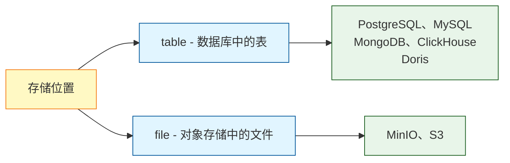
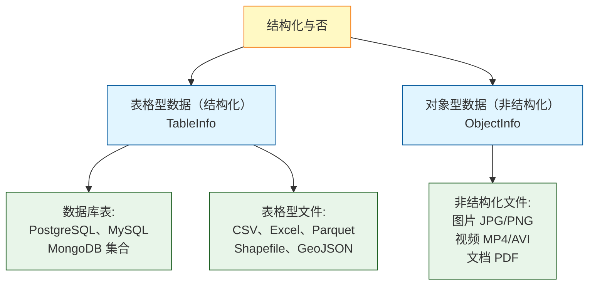
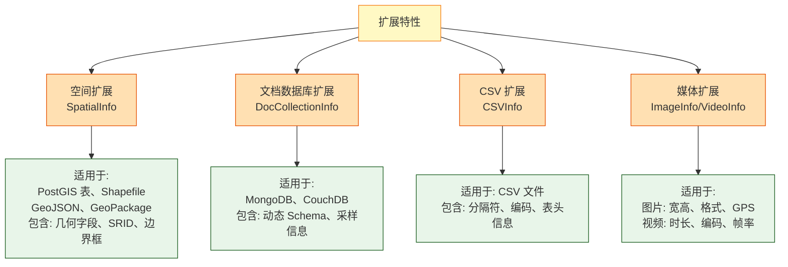
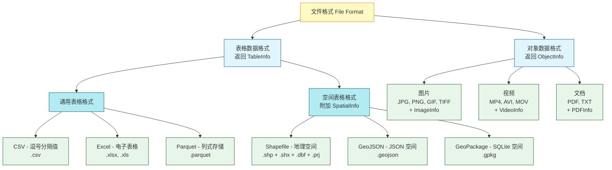
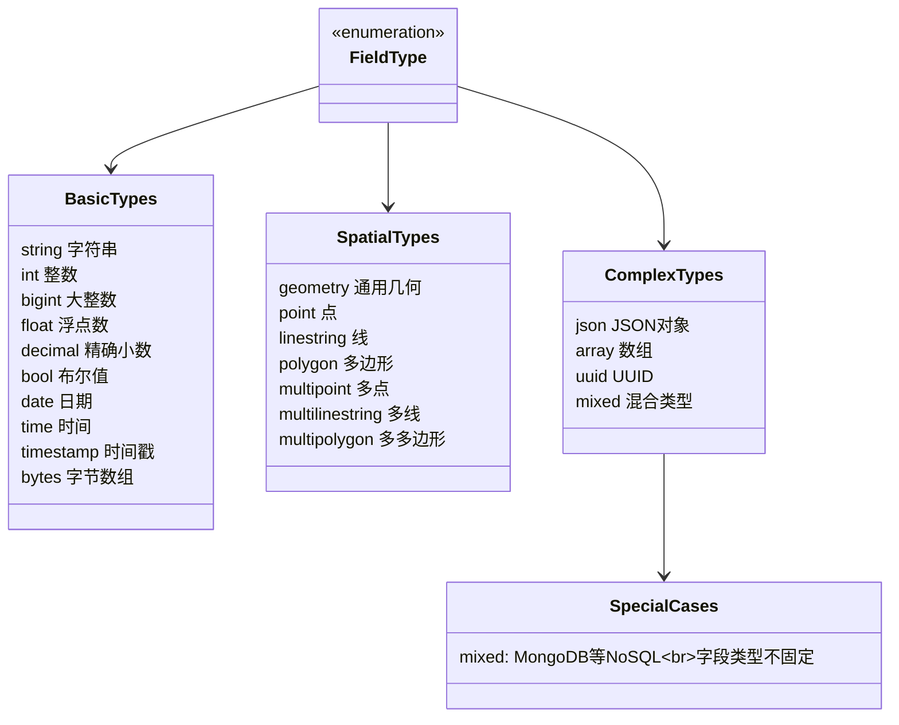
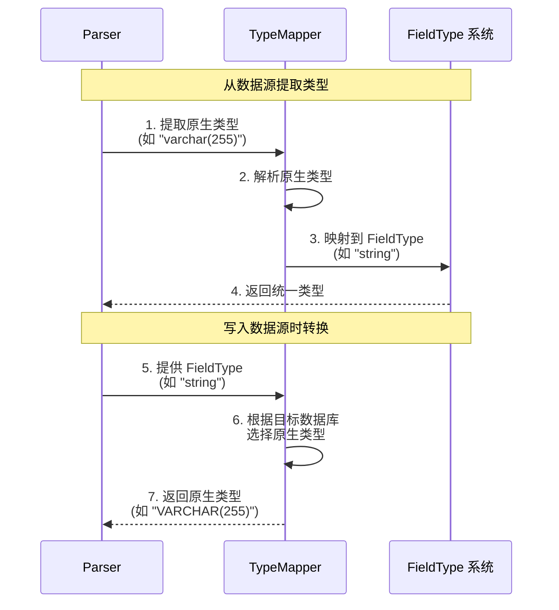

# ADDP 数据类型与格式体系图

本文档展示 ADDP 平台的数据类型分类、数据格式支持和类型映射机制。

---

## 目录

1. [数据类型分类](#数据类型分类)
2. [数据格式体系](#数据格式体系)
3. [FieldType 统一类型系统](#fieldtype-统一类型系统)
4. [TypeMapper 类型映射](#typemapper-类型映射)

---

## 数据类型分类

ADDP 使用**两个正交维度**来描述数据，确保分类清晰且可扩展：

### 维度 1: 存储位置 (Where)

数据的物理存储位置，即所在的存储引擎：

### 维度 2: 数据特征 (What)

按照结构化与非结构化划分：

**说明**：
- **表格型数据 (TableInfo)**：结构化，具有行列结构，可以查询和预览字段，返回 `TableInfo` 对象
  - 数据库表：PostgreSQL、MySQL、MongoDB 集合、ClickHouse 表
  - 文件：CSV、Excel、Shapefile、GeoJSON、Parquet
- **对象型数据 (ObjectInfo)**：非结构化的二进制数据，返回 `ObjectInfo` 对象
  - 文件：图片（JPG/PNG/GIF/TIFF）、视频（MP4/AVI/MOV）、文档（PDF）

### 可选扩展特性 (Extensions)

数据的附加特性，通过 `ExtensionInfo` 机制实现：

**关键设计**：
- **空间特性是扩展，不是独立类型**：PostGIS 表本质上是关系型数据库表，只是增加了空间字段
- **文档数据库也是表格型的**：MongoDB 的集合也有行列结构，特殊性在于 Schema 动态（使用 `FieldTypeMixed`）
- **文件不等于非结构化**：CSV、Shapefile 等文件也包含表格型数据

### 数据分类矩阵

| 存储位置 | 表格型数据 (TableInfo) | 对象型数据 (ObjectInfo) |
|---------|----------------------|----------------------|
| **table** | PostgreSQL 表 MySQL 表 MongoDB 集合 ClickHouse 表 | --- |
| **file** | CSV 文件 Excel 文件 Shapefile 文件 GeoJSON 文件 Parquet 文件 | 图片文件 视频文件 PDF 文件 |

**扩展示例**：
- PostgreSQL + PostGIS 表 = `TableInfo` + `SpatialInfo`
- Shapefile 文件 = `TableInfo` + `SpatialInfo` + `ShapefileInfo`
- MongoDB 集合 = `TableInfo` + `DocCollectionInfo`
- JPG 图片 = `ObjectInfo` + `ImageInfo`

---

## 数据格式体系

ADDP 支持的文件格式按**数据特征**分类：

### 格式支持列表

| 数据特征 | 格式名称 | 扩展名 | 返回类型 | 扩展信息 | Parser 支持 | 预览支持 |
|---------|---------|-------|---------|---------|-----------|---------|
| **表格数据** | CSV | .csv | `TableInfo` | `CSVInfo` | ✅ CSVParser | ✅ TablePreview |
| | Excel | .xlsx, .xls | `TableInfo` | `ExcelInfo` | ✅ ExcelParser | ✅ TablePreview |
| | Parquet | .parquet | `TableInfo` | - | ✅ ParquetParser | ✅ TablePreview |
| | SQLite | .db, .sqlite | `TableInfo` | - | ✅ SQLiteParser | ✅ TablePreview |
| **表格数据 + 空间扩展** | Shapefile | .shp | `TableInfo` | `SpatialInfo` `ShapefileInfo` | ✅ ShapefileParser | ✅ ShapefilePreview |
| | GeoJSON | .geojson | `TableInfo` | `SpatialInfo` `GeoJSONInfo` | ✅ GeoJSONParser | ✅ GeoJsonPreview |
| | GeoPackage | .gpkg | `TableInfo` | `SpatialInfo` | ✅ GeoPackageParser | ✅ TablePreview |
| **对象数据** | 图片 | .jpg, .png, .gif, .tiff | `ObjectInfo` | `ImageInfo` | ✅ ImageParser | ✅ ImagePreview |
| | 视频 | .mp4, .avi, .mov | `ObjectInfo` | `VideoInfo` | ✅ VideoParser | ✅ VideoPreview |
| | 文档 | .pdf | `ObjectInfo` | `PDFInfo` | ✅ PDFParser | ✅ PDFPreview |

**说明**：
- **表格数据格式**：生成 `TableInfo`，包含字段定义和记录，可以进行查询和分析
- **空间表格格式**：在表格基础上增加 `SpatialInfo` 扩展，包含几何字段、SRID、边界框等信息
- **对象数据格式**：生成 `ObjectInfo`，包含文件元数据（大小、修改时间）和格式特定扩展（如图片的宽高、视频的时长）

---

## FieldType 统一类型系统

ADDP 定义了统一的 `FieldType` 类型系统,所有 Parser 返回的字段类型都映射到这个系统:

### FieldType 详细说明

| 类型分类 | FieldType | 说明 | 映射示例 |
|---------|-----------|------|---------|
| **基础类型** | `string` | 字符串 | PostgreSQL: `varchar`, `text` |
| | `int` | 整数 | PostgreSQL: `int`, `integer` |
| | `bigint` | 大整数 | PostgreSQL: `bigint` |
| | `float` | 浮点数 | PostgreSQL: `real`, `float` |
| | `decimal` | 精确小数 | PostgreSQL: `numeric`, `decimal` |
| | `bool` | 布尔值 | PostgreSQL: `boolean` |
| | `date` | 日期 | PostgreSQL: `date` |
| | `time` | 时间 | PostgreSQL: `time` |
| | `timestamp` | 时间戳 | PostgreSQL: `timestamp` |
| | `bytes` | 字节数组 | PostgreSQL: `bytea` |
| **空间类型** | `geometry` | 通用几何 | PostGIS: `geometry` |
| | `point` | 点 | PostGIS: `point` |
| | `linestring` | 线 | PostGIS: `linestring` |
| | `polygon` | 多边形 | PostGIS: `polygon` |
| | `multipoint` | 多点 | PostGIS: `multipoint` |
| **复杂类型** | `json` | JSON 对象 | PostgreSQL: `json`, `jsonb` |
| | `array` | 数组 | PostgreSQL: `array` |
| | `uuid` | UUID | PostgreSQL: `uuid` |
| | `mixed` | 混合类型 | MongoDB: 同一字段不同文档类型不同 |

---

## TypeMapper 类型映射

ADDP 使用 `TypeMapper` 实现原生类型 ↔ FieldType 的双向转换:

### TypeMapper 示例

**PostgreSQL TypeMapper**:

| 原生类型 | FieldType | 反向映射 |
|---------|-----------|---------|
| `varchar`, `text`, `char` | `string` | `VARCHAR(255)` |
| `int`, `integer`, `int4` | `int` | `INTEGER` |
| `bigint`, `int8` | `bigint` | `BIGINT` |
| `real`, `float4` | `float` | `REAL` |
| `numeric`, `decimal` | `decimal` | `NUMERIC` |
| `boolean`, `bool` | `bool` | `BOOLEAN` |
| `geometry` | `geometry` | `GEOMETRY` |
| `point` | `point` | `POINT` |
| `json`, `jsonb` | `json` | `JSONB` |

**MongoDB TypeMapper**:

| BSON 类型 | FieldType | 说明 |
|-----------|-----------|------|
| `string` | `string` | 字符串 |
| `int`, `long` | `int`, `bigint` | 整数 |
| `double` | `float` | 浮点数 |
| `bool` | `bool` | 布尔值 |
| `date` | `timestamp` | 日期时间 |
| `object` | `json` | 嵌套对象 |
| `array` | `array` | 数组 |
| `mixed` | `mixed` | 混合类型(同一字段不同文档类型不同) |

**Shapefile DBF TypeMapper**:

| DBF 类型 | FieldType | 说明 |
|----------|-----------|------|
| `C` (Character) | `string` | 字符串 |
| `N` (Numeric) | `int`, `decimal` | 数值(根据精度判断) |
| `F` (Float) | `float` | 浮点数 |
| `L` (Logical) | `bool` | 布尔值 |
| `D` (Date) | `date` | 日期 |

---

## 数据格式扩展

ADDP 支持通过插件机制扩展新的数据格式,详细指南请参考:

[ADDP 数据格式扩展指南](../addp数据格式扩展指南.md)

**扩展步骤** (3 步):
1. 在 `common/parser/` 创建新的 Parser 实现
2. 实现对应的 Parser 接口(FileTableParser/ObjectInfoParser 等)
3. 在 `common/parser/registry.go` 注册 Parser

---

## 相关文档

- [返回核心概念关系图](../addp核心概念关系图.md)
- [ADDP 元数据体系图](addp元数据体系图.md)
- [ADDP 数据格式扩展指南](../addp数据格式扩展指南.md)

---

**文档版本**: v2.0
**创建日期**: 2026-02-16
**更新日期**: 2026-02-16
**更新说明**: 重新梳理数据类型分类，采用"存储位置"和"数据特征"两个正交维度，更准确地反映代码实际设计
**作者**: ADDP 开发团队
