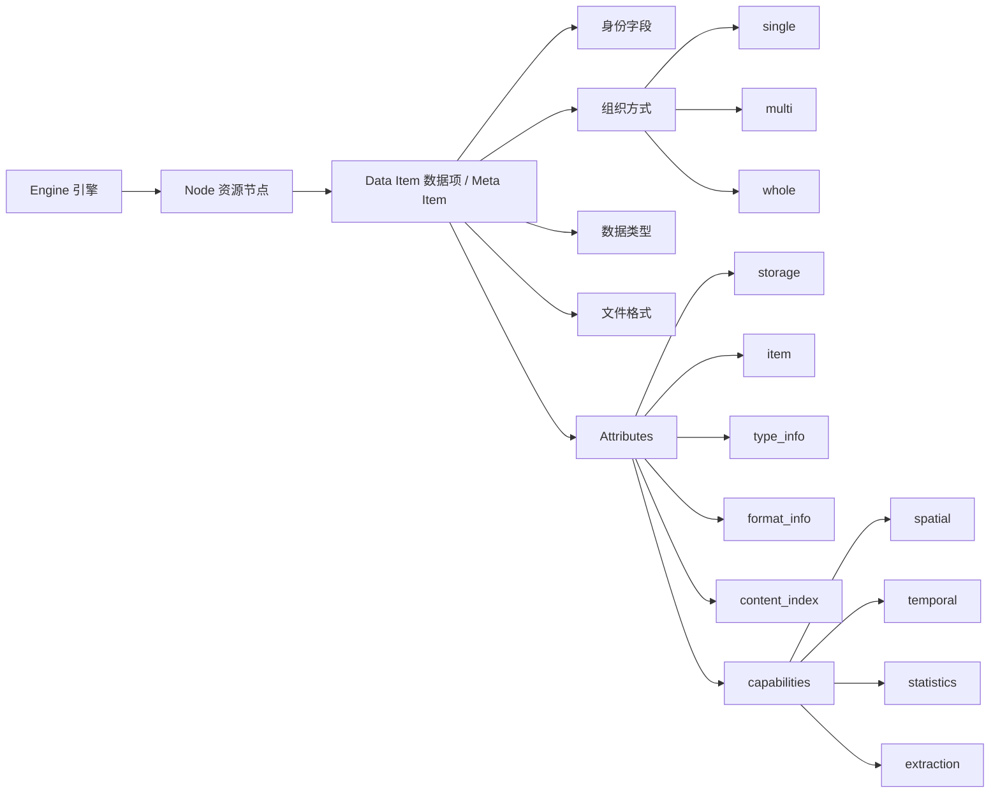

# ADDP 数据项体系图

本文从概念层说明数据项在 ADDP 中的位置，以及 engine、node、data item、data type、format 和各模块之间的职责边界。具体接口、字段结构和实现约束由 `docs/spec/` 下的规范定义。

## 核心结论

ADDP 的资源到平台语义的主链条是：

```text
engine -> node -> data item
```

- `engine` 负责连接和访问外部数据系统。
- `node` 负责表达引擎内的资源树组织。
- `data item` 是平台真正管理、预览、检索、授权、传输和治理的数据对象。

`data item` 是资源世界和语义世界的衔接点。对象存储里的对象、文件系统里的文件、数据库里的表、图数据库里的 label，都只有在被识别成 data item 后，才进入 ADDP 的统一数据管理语义。

一句话概括：

**engine 管连接，node 管资源树，data item 管平台语义；组织方式管资源如何成为 item，数据类型管用户如何理解 item，文件格式管编码，横切能力管跨类型附加能力。**

## 总览



## engine / node / data item

### engine

`engine` 表示数据接入和访问能力，例如 PostgreSQL、MySQL、MongoDB、Neo4j、MinIO、S3、NFS、本地文件系统。

engine 只回答：

- 如何连接。
- 如何枚举资源。
- 如何读取内容。
- 能提供哪些存储侧元信息。

engine 不直接决定 data item 的最终数据类型，也不直接决定一个目录、prefix 或文件组是否构成 item。

### node

`node` 表示 engine 内的资源树节点，例如：

- 数据库 schema。
- bucket。
- prefix。
- 目录。
- catalog 分组节点。

node 的职责是组织资源树，服务浏览、扫描和定位。node 不是 data item，除非某个探测器或引擎原生边界明确说明“这个范围整体构成一个 data item”。

### data item

`data item` 是 ADDP 的核心数据对象，对应落库实体 `meta_item`。平台围绕 data item 做：

- 元数据扫描。
- 目录展示。
- 内容读取和预览。
- 检索。
- 授权。
- 传输。
- 血缘和资产治理。

data item 的身份由 `meta_item` 表字段承载，例如 `id`、`tenant_id`、`engine_id`、`node_id`、`item_type`、`name`、`full_name`、`fingerprint`。这些身份字段不应重复写入 attributes。

`item_type` 是 data item 在所属引擎 catalog / 路径模型中的原生叶子术语，不是内容语义类型。例如 MinIO / S3 的叶子是 `object`，NFS / 本地文件系统的叶子是 `file`，MongoDB 的叶子是 `collection`，Neo4j 的叶子是 `label` / `relationship`。同一个 CSV 在对象存储中应是 `item_type=object`，在文件系统中应是 `item_type=file`；它们的表格语义由 `attributes.item.data_type=table` 表达。

一个 data item 内部可以包含子对象，例如 SQLite 的内部 table、Excel 的 sheet、GeoPackage 的 layer、压缩包中的文件。当前概念上这些子对象默认写入 attributes；只有当需要独立授权、检索、血缘、传输或生命周期管理时，才讨论是否升格为独立 data item。

## 组织方式

组织方式回答：**引擎中的文件、目录、表、prefix 等资源如何组织成一个 data item。**

| 组织方式 | 含义 | 示例 |
|---|---|---|
| `single` | 一个引擎资源对应一个 data item | 数据库 table、对象存储 object、文件系统 file |
| `multi` | 多个明确组件资源共同组成一个 data item | Shapefile 多对象 / 多文件、主资源加同级索引资源 |
| `whole` | 整个目录、prefix、schema 或扫描范围构成一个 data item | Iceberg 表目录、OSGB 场景目录、完整数据集 prefix |

`single` 不等于单文件。数据库表也是 `single`。SQLite、ZIP、RAR 等虽然内部包含子对象，但外层 data item 通常仍是 `single`。

`multi` 只认领明确匹配的组件资源，不独占整个目录或 prefix。Shapefile 是典型 `multi`。

`whole` 表示整段范围构成一个 data item，不再逐个顾忌范围内的文件和子目录。只有规范明确声明的格式或引擎原生边界才应使用 `whole`。

## 数据类型、文件格式和横切能力

数据类型和文件格式是 data item 的两个不同维度：

- `data type` 回答“用户和平台如何理解这个 item”。
- `format` 回答“这个资源或 item 使用什么格式编码”。

数据类型比文件格式更高层。一个数据类型可以对应多个文件格式，例如 `table` 可以来自 CSV、TSV、Parquet、Shapefile、数据库表、JSON FeatureCollection。一个文件格式也可能需要根据内容结构落到不同数据类型，例如 JSON 可以是 table、document 或 container。

空间、时间、统计、提取、语义、分区、索引等不应变成基础数据类型，也不应塞进某个具体格式信息里；它们是横切能力。

数据类型和文件格式的完整概念见 [ADDP 数据类型和格式体系图](addp数据类型和格式体系图.md)。

## 模块职责边界

数据项体系跨越 Meta、Manager、Transfer、common/format、common/resource 和 engine plugin。为了避免重复推断和事实源分裂，模块职责按以下顺序分层：

```text
engine capability
  -> Meta detector 确定 data item
  -> Meta normalizer 写 attributes
  -> common/resource 提供读取抽象
  -> common/format 提供格式和数据类型能力
  -> Manager / Transfer / Asset / Search 消费
```

| 模块 / 层级 | 负责 | 不负责 |
|---|---|---|
| engine plugin | 连接、catalog、元数据、内容读写、批次读写等 engine capability | 判断最终 `data_type`、归并 multi / whole item、写最终 attributes |
| `meta` | 资源树扫描、detector 调度、data item 识别、claims / exclusive 合并、attributes normalizer、落库 | Manager 面向前端的 DTO、Transfer 执行计划、format plugin 内部解析细节 |
| `common/resource` | `ResourceRef`、`ResourceReader`、`ComponentReader`、`NativeCursor` 等读取抽象 | 连接凭据管理、格式解析、面向前端的 DTO |
| `common/format` | 文件格式枚举、FormatPlugin、格式身份、格式能力、info provider、content reader | 构造 engine reader、决定最终 item 边界、直接写 `meta_item.attributes`、定义展示策略 |
| `manager` | 消费已入库 data item 和标准 attributes，基于 reader / provider 组装管理端内容结果 | 重新判断 organization、重新猜 format、重新枚举 sibling 组件 |
| `transfer` | 基于 data item、engine capability、resource 抽象和 format 能力规划读写 | 重复推断字段类型、重复识别组件、绕过 provider 硬编码格式 |
| `asset` / `search` | 消费标准 attributes 做资产治理、索引和检索 | 自行识别 data item 或重写格式解析规则 |
| frontend | 基于后端 DTO 展示内容和交互 | 决定 data item 边界、直接访问 engine、复刻后端格式解析规则 |

## 事实源归属

| 事实 | 事实源 |
|---|---|
| 术语定义 | [ADDP 术语表](addp术语表.md) |
| data item 边界、主资源、组件、whole scope、claims / exclusive | [ADDP 数据项探测器规范](../spec/addp数据项探测器规范.md) |
| attributes 分区和字段归属 | [ADDP 元数据 attributes 规范](../spec/addp元数据attributes规范.md) |
| 数据类型、文件格式、FormatPlugin、info provider、content reader | [ADDP 数据类型与格式能力规范](../spec/addp数据类型与格式能力规范.md) |
| 资源定位和读取抽象 | [ADDP 资源读取抽象规范](../spec/addp资源读取抽象规范.md) |
| 内置数据类型与文件格式落地规则 | [ADDP 内置数据类型与文件格式规范](../spec/addp内置数据类型与文件格式规范.md) |
| 新增数据类型或文件格式步骤 | [ADDP 数据类型与文件格式扩展指南](../spec/addp数据类型与文件格式扩展指南.md) |

## 调用边界

### Meta 扫描

```text
engine catalog / metadata / content read
  -> Meta detector
  -> format plugin 提供候选事实
  -> Meta normalizer
  -> meta_item + attributes
```

Meta 可以调用格式能力，但最终 item 边界和 attributes 核心字段由 Meta 裁决。

### Manager 内容读取

```text
meta item + attributes
  -> Manager 根据 engine capability 构造 resource reader
  -> FormatPlugin / info provider / content reader
  -> Manager 组装管理端 DTO
```

Manager 不重新识别 item。multi 读取使用 `attributes.item.component_files`；whole 读取使用已入库 whole scope。

### Transfer

```text
source / target data item
  -> TransferPlan(engine, resource, data_type, format, capabilities, policy)
  -> resource reader / writer
  -> format plugin
  -> content reader / writer
  -> pipeline reader / writer
```

Transfer 可以根据目标能力选择编码格式，但不能绕过标准字段、类型信息和横切能力事实源。

## 设计约束

1. 同一事实只在一个模块裁决，并写入一个规范位置。
2. `manager`、`transfer`、`asset`、`search` 只消费已入库 data item，不复刻 Meta detector。
3. `common/format` 可以声明 layout 能力，但不直接决定最终 `organization` 和 claims。
4. `common/resource` 不进入格式语义，也不承载面向前端的 DTO。
5. FormatPlugin 不接 `engine_id`，不反向构造 engine reader。
6. 私有格式字段必须进入命名空间，不能覆盖平台标准字段。
