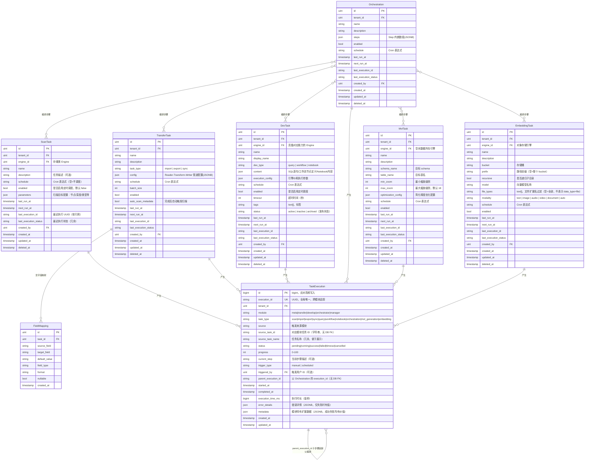
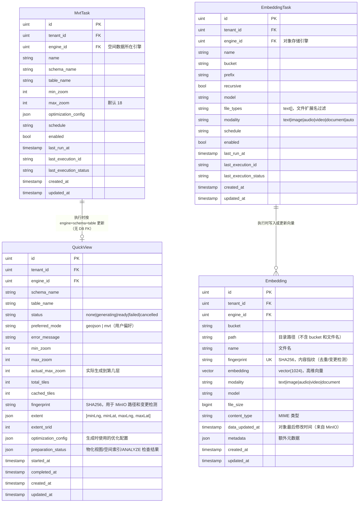
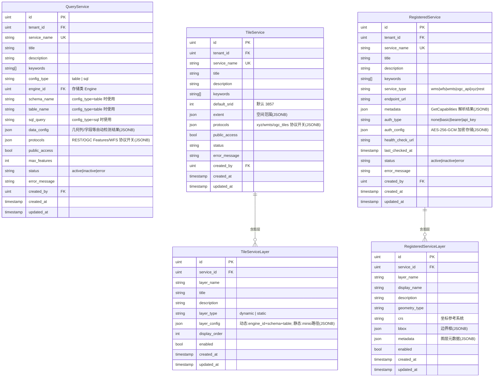
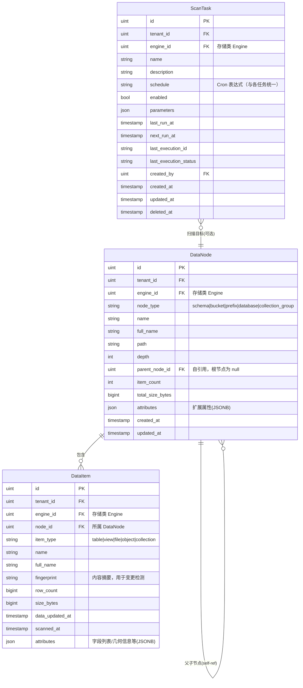
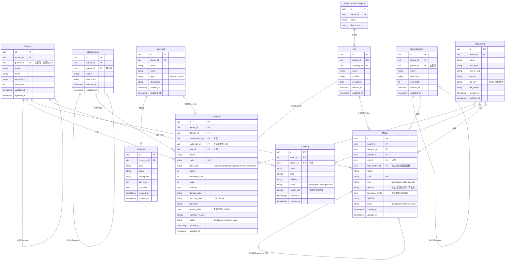
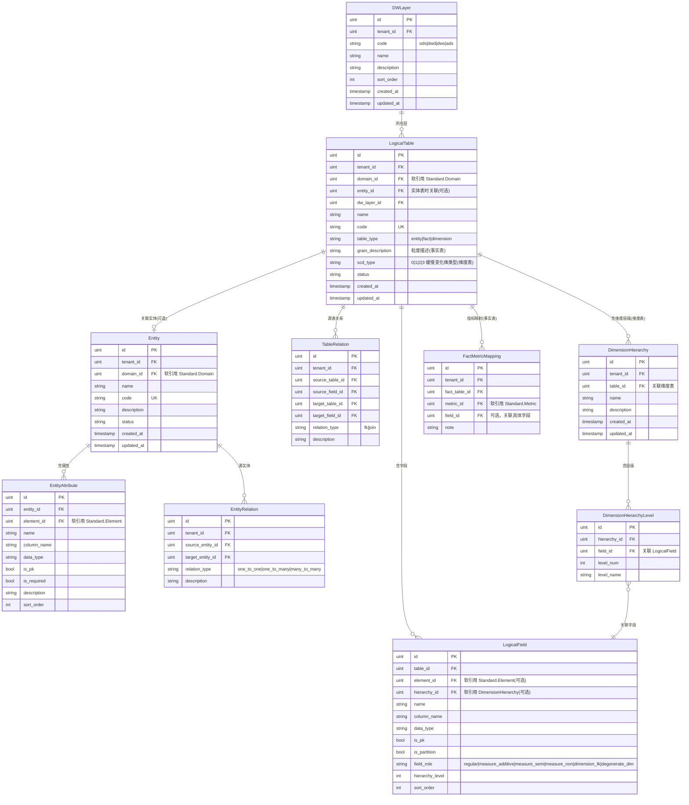
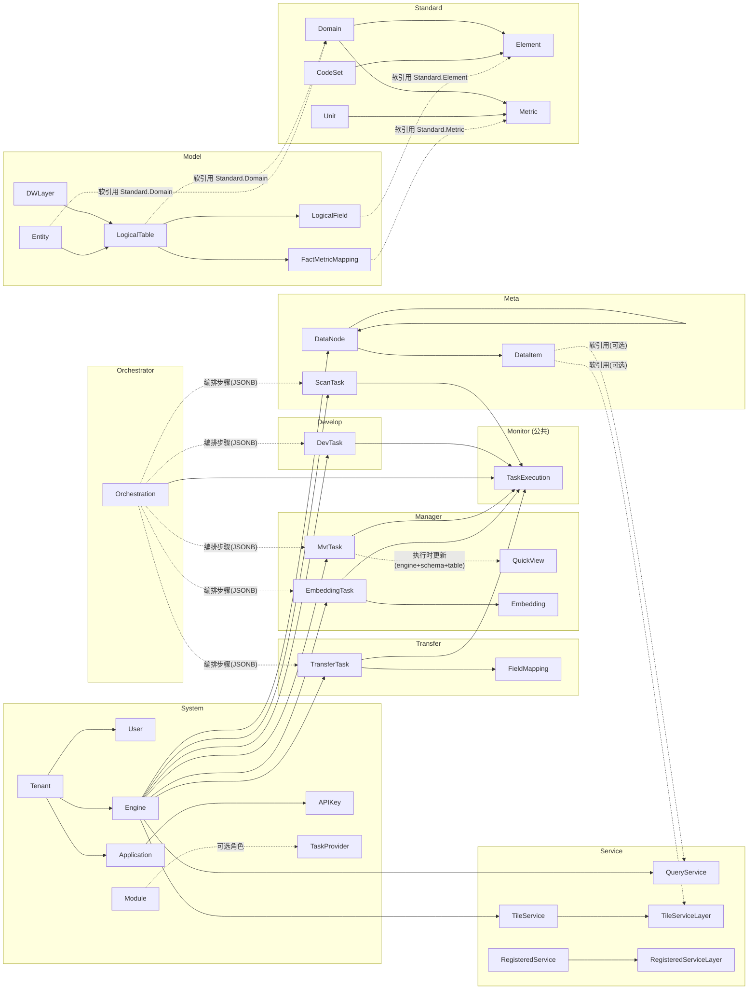
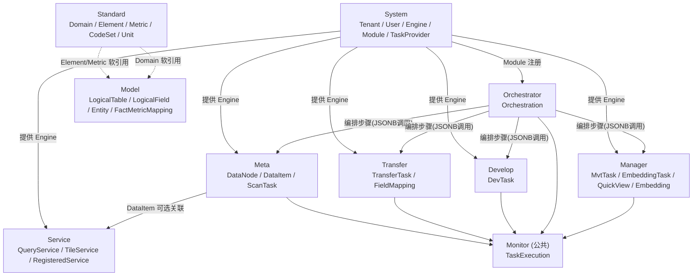

# ADDP 元模型（Meta-Model）

本文档从业务语义层面提炼 ADDP 的核心对象及其关系。
元模型中的对象是**业务概念**，不直接对应数据库表：一个业务对象可能跨多张表，多个对象也可能共享一张表的不同行。

Mermaid 图的字段与 PG 表字段保持一致，便于发现并修正字段设计问题。

---

## 一、中英文对照表

### 全局横切能力（提炼自多个业务对象，无独立实体表）

| 中文     | 英文标识符  | 说明                                                           | 体现在哪些业务对象上                              |
| -------- | ----------- | -------------------------------------------------------------- | ------------------------------------------------- |
| 调度配置 | Schedule    | 定时触发能力（Cron 表达式），定义"何时执行"                    | Task 及所有派生任务均可具备                       |
| 执行记录 | Execution   | 单次运行的状态/进度/耗时/错误，记录"执行了什么、结果如何"      | 所有 Task 派生对象执行后均写入 common.task_executions |
| 数据指纹 | Fingerprint | 内容摘要（MD5/SHA），用于去重、变更检测、血缘追踪              | DataNode / DataItem / QuickView / Embedding       |
| 向量嵌入 | Embedding   | 多模态内容的高维向量表示（pgvector），支持语义检索             | DataItem（文件/对象/表）                          |
| 审计日志 | AuditLog    | 所有操作的不可变轨迹（操作人/时间/HTTP方法/路径/状态码）       | 全局，由 System 集中记录                          |

---

### System 模块核心对象（schema: system）

| 中文     | 英文标识符  | 说明                                                             |
| -------- | ----------- | ---------------------------------------------------------------- |
| 租户     | Tenant      | 平台顶级隔离单元，所有业务对象都归属于某个租户                   |
| 用户     | User        | 属于某个租户的操作主体，user_type 区分 super_admin/tenant_admin/user |
| 引擎     | Engine      | 数据源和计算资源的统一抽象，通过 capabilities 声明具体能力       |
| 模块     | Module      | ADDP 微服务单元；可选择性地声明任务能力，成为任务提供者          |
| 应用     | Application | API 访问控制单元，属于某个租户，持有多个 APIKey                  |
| API密钥  | APIKey      | 应用的访问凭证，支持速率限制和有效期                             |

**关于 Module 与 TaskProvider**：
- `TaskProvider` 不是独立对象，而是 `Module` 的一种可选角色，通过注册时声明任务 API 来体现
- 考虑将 `task_providers` 表合并到 `module_registry` 表中（待讨论后决定是否修改）
- 不是所有模块都是任务提供者：Console / Gateway / Monitor 不暴露任务接口

**关于 Engine**：
- `engine_origin = 'general'`：用户手动注册的数据引擎（PostgreSQL/MySQL/MinIO 等）
- `engine_origin = 'extension'`：系统自动注册的计算引擎（Python Workflow/Spark/Jupyter）
- `is_builtin = true`：内置引擎，tenant_id = null，全局可见
- `capabilities` JSONB 字段声明引擎的存储/计算能力，各模块按需使用

---

### 引擎能力分类（从 capabilities JSONB 提炼，无独立表）

| 中文         | 英文标识符        | 对应插件接口            | 使用该能力的模块               |
| ------------ | ----------------- | ----------------------- | ------------------------------ |
| 目录发现       | CatalogCapability  | CatalogProvider          | Meta / Manager / Console        |
| Catalog leaf facts | CatalogFactsCapability | CatalogFactsProvider     | Meta / Manager / Service        |
| 内容读取       | ContentRead        | ContentReadableProvider  | Manager / Meta / Transfer       |
| 查询计算       | QueryCompute       | QueryRuntimeProvider     | Develop / Service / Manager     |
| 工作流计算     | WorkflowCompute    | WorkflowRuntimeProvider  | Develop / Orchestrator          |
| Notebook计算   | ScriptCompute      | ScriptRuntimeProvider    | Develop                         |

---

### Task（任务）抽象体系

**核心思想**：ADDP 中多种业务对象在本质上都是"任务"——定义了"做什么"，可以被执行、被调度、产生执行记录，也可以被 Orchestrator 编排。

| 中文         | 英文标识符    | 所在 Schema   | 说明                                                  |
| ------------ | ------------- | ------------- | ----------------------------------------------------- |
| 任务（抽象） | Task          | —             | 抽象概念，以下均为派生                                |
| 扫描任务     | ScanTask      | metadata      | 对某个 Engine 的元数据扫描任务定义                    |
| 传输任务     | TransferTask  | transfer      | 数据导入/导出/同步任务定义，含字段映射                |
| 开发任务     | DevTask       | develop       | 可执行的开发工件（SQL/工作流/Notebook），本质也是任务 |
| 编排工作流   | Orchestration | orchestrator  | 跨模块任务的 DAG 编排定义，**本身也是一种任务**       |
| MVT生成任务  | MvtTask       | manager       | 对空间表生成矢量瓦片的任务定义，执行后更新 QuickView  |
| 向量化任务   | EmbeddingTask | manager       | 对对象存储文件进行多模态向量化的任务定义              |

**任务的共同能力**：
- **Schedule**：所有 Task 均可配置定时调度（Cron 表达式）
- **Execution**：所有 Task 执行后写入 `common.task_executions` 统一记录
- **可被 Orchestration 编排**：ScanTask / TransferTask / DevTask / MvtTask / EmbeddingTask 均可作为 Orchestration 的步骤（Step）
- **Orchestration 的递归性**：Orchestration 执行完也产生 Execution，未来可被更高层编排引用

**任务类型（task_type in common.task_executions）**：
- Meta: `scan`
- Transfer: `import` / `export` / `sync`
- Develop: `query` / `workflow` / `notebook`
- Orchestrator: `orchestration`
- Manager: `mvt_generation` / `embedding`

---

### Manager 模块核心对象（schema: manager）

| 中文         | 英文标识符    | 说明                                                              |
| ------------ | ------------- | ----------------------------------------------------------------- |
| MVT生成任务  | MvtTask       | Task 派生，对空间表生成矢量瓦片，执行时更新关联的 QuickView       |
| 向量化任务   | EmbeddingTask | Task 派生，对对象存储文件进行多模态向量化，写入 Embedding         |
| 快速预览状态 | QuickView     | 空间表的 MVT 缓存状态记录（非任务，是状态对象），描述瓦片是否就绪 |
| 向量记录     | Embedding     | 单个文件的高维向量及元信息，fingerprint 用于去重和变更检测        |

**关于 QuickView**：
- 是"瓦片缓存状态记录"，不是任务——描述一张空间表的 MVT 缓存是否就绪
- 可以存在无对应 MvtTask 的 QuickView（用户 ad-hoc 点击"生成"按钮触发）
- `preparation_status` JSONB 存储物化视图/空间索引/ANALYZE 等准备阶段检查结果

---

### Meta 模块核心对象（schema: meta）

| 中文     | 英文标识符 | 说明                                                         |
| -------- | ---------- | ------------------------------------------------------------ |
| 数据节点 | DataNode   | 树形层级中的容器节点（数据库/Schema/Bucket/前缀目录等），属于存储类 Engine |
| 数据项   | DataItem   | 最小数据实体（表/视图/文件/对象/集合），是管理和操作的最小单元，属于存储类 Engine |

- `DataNode` 是容器，可包含多个子 `DataNode` 或多个 `DataItem`（树形结构，parent_node_id 自引用）
- `DataNode` 和 `DataItem` 都属于具有**存储能力**的 `Engine`（RelationalStorage / BranchLeafStorage / ObjectStorage / FileStorage）

---

### Transfer 模块核心对象（schema: transfer）

| 中文     | 英文标识符   | 说明                                                     |
| -------- | ------------ | -------------------------------------------------------- |
| 传输任务 | TransferTask | Task 派生，数据导入/导出/同步的任务定义                  |
| 字段映射 | FieldMapping | TransferTask 的子对象，定义源→目标字段的映射规则         |

---

### Orchestrator 模块核心对象（schema: orchestrator）

| 中文       | 英文标识符    | 说明                                                              |
| ---------- | ------------- | ----------------------------------------------------------------- |
| 编排工作流 | Orchestration | Task 派生，跨模块任务的 DAG 定义，本身执行后也产生 Execution      |
| 步骤       | Step          | Orchestration 的子对象，两种模式：任务引用（provider/task_type/task_id）或引擎调用（engine_identifier），内嵌 JSONB |

---

### Develop 模块核心对象（schema: develop）

| 中文     | 英文标识符 | 说明                                                                  |
| -------- | ---------- | --------------------------------------------------------------------- |
| 开发任务 | DevTask    | Task 派生，可执行的开发工件（query/workflow/notebook），选择计算类 Engine 执行 |

---

### Service 模块核心对象（schema: service）

Service 模块有三个相互独立的子系统：

| 中文           | 英文标识符         | 数据库表                          | 有子图层 | 说明                                                   |
| -------------- | ------------------ | --------------------------------- | -------- | ------------------------------------------------------ |
| 查询服务       | QueryService       | service.query_services            | 无       | 将内部单张表或 SQL 查询发布为 REST/OGC/WFS 接口        |
| 瓦片服务       | TileService        | service.tile_services             | 有       | 将内部空间数据发布为矢量瓦片（XYZ/WMTS/OGC Tiles）     |
| 瓦片服务图层   | TileServiceLayer   | service.tile_service_layers       | —        | TileService 的子图层，每层对应一个数据源（动态/静态）  |
| 注册服务       | RegisteredService  | service.registered_services       | 有       | 注册和代理第三方外部服务（WMS/WFS/WMTS/XYZ/REST）      |
| 注册服务图层   | RegisteredServiceLayer | service.registered_service_layers | —    | 从外部服务 GetCapabilities 自动解析的图层列表          |

**QueryService 配置模式**：`config_type = 'table'`（指定 schema+table）或 `config_type = 'sql'`（自定义 SQL）
**TileServiceLayer 模式**：`layer_type = 'dynamic'`（实时查询数据库）或 `layer_type = 'static'`（MinIO 预生成瓦片）

---

### Model 模块核心对象（schema: model）

| 中文     | 英文标识符       | 说明                                              |
| -------- | ---------------- | ------------------------------------------------- |
| 逻辑表   | LogicalTable     | 数仓逻辑层的表定义（实体/事实/维度表，ODS/DWD/DWS/ADS 层） |
| 逻辑字段 | LogicalField     | 逻辑表的字段，可软引用 Standard.Element           |

---

### Standard 模块核心对象（schema: standard）

| 中文     | 英文标识符 | 说明                                         |
| -------- | ---------- | -------------------------------------------- |
| 数据元   | Element    | 数据标准的核心原子：语义、类型、约束、码值集 |
| 指标     | Metric     | 业务指标定义（原子/派生/复合），含计算公式   |
| 码值集   | CodeSet    | 枚举型数据的值域（如：性别、状态码）         |
| 码值项   | CodeItem   | CodeSet 中的具体枚举值                       |
| 计量单位 | Unit       | 指标和数据元的度量单位                       |
| 业务术语 | Glossary   | 业务概念的标准化定义词典                     |

---

## 二、Mermaid 图

> 字段与 PG 表保持一致，便于在阅读图的过程中发现字段设计问题，问题记录在每张图后面。

---

### 2.1 系统核心对象图（System 模块）

```mermaid
erDiagram
    Tenant {
        uint id PK
        string name
        string description
        bool is_active
        timestamp created_at
        timestamp updated_at
    }

    User {
        uint id PK
        uint tenant_id FK "super_admin 时为 null"
        string username
        string email
        string password_hash
        string full_name
        string user_type "super_admin | tenant_admin | user"
        bool is_active
        timestamp created_at
        timestamp updated_at
    }

    Engine {
        uint id PK
        uint tenant_id FK "内置引擎时为 null"
        string name
        string engine_type "postgresql|mysql|minio|python_workflow|..."
        string engine_origin "general | extension"
        bool is_builtin
        json connection_info
        json capabilities "存储/计算能力声明(JSONB)"
        json scan_config
        string connection_status "online|offline|unknown|checking"
        string check_message
        timestamp last_check_at
        uint created_by FK
        bool is_active
        timestamp created_at
        timestamp updated_at
    }

    Module {
        uint id PK
        string module_name "system|manager|meta|transfer|..."
        string module_url
        string route_prefix
        string health_check_url
        string status "up | down"
        json metadata "版本、权重等扩展信息(JSONB)"
        timestamp last_heartbeat
        timestamp created_at
        timestamp updated_at
    }

    TaskProvider {
        uint id PK
        string module_name "与 Module.module_name 对应"
        string display_name
        string description
        string base_url
        string task_list_endpoint "GET /api/tasks"
        string task_detail_endpoint "GET /api/tasks/{task_type}/{id}"
        string task_execute_endpoint "POST /api/tasks/{task_type}/{id}/execute"
        string task_status_endpoint "GET /api/executions/{execution_id}"
        string task_cancel_endpoint "POST /api/executions/{execution_id}/cancel"
        json capabilities "声明支持的 task_types 及前端路由(JSONB)"
        bool is_enabled
        timestamp created_at
        timestamp updated_at
    }

    Application {
        uint id PK
        uint tenant_id FK
        string name
        json allowed_services
        int rate_limit_per_minute
        string status
        timestamp created_at
        timestamp updated_at
    }

    APIKey {
        uint id PK
        uint application_id FK
        string name
        string key_hash
        timestamp expires_at
        string status "active | revoked"
        timestamp revoked_at
        timestamp created_at
    }

    Tenant ||--o{ User : "拥有"
    Tenant ||--o{ Engine : "注册"
    Tenant ||--o{ Application : "拥有"
    Application ||--o{ APIKey : "持有"
    Module ||--o| TaskProvider : "可选角色(module_name关联)"
```

**⚠️ 发现的问题**：

| # | 问题描述 | 当前状态 | 影响 |
|---|----------|----------|------|
| S-1 | `TaskProvider` 与 `Module` 通过 `module_name` 字符串关联，无 FK 约束 | 两张独立表 | 数据一致性依赖应用层保证；考虑合并到 `Module.metadata` 中 |
| S-2 | `Module` 无 `tenant_id`，模块是全局的而非租户级的 | 设计如此 | 确认模块注册是否需要按租户隔离（当前不需要） |
| S-3 | `Engine.created_by` 记录创建人 ID，但无对应 FK 约束（跨 schema 引用 User） | 应用层维护 | 合理，跨 schema 不用数据库 FK |

---

### 2.2 Task 抽象体系图

> Task 是抽象概念（无实体表），所有派生任务共享：BaseTask 公共字段、Schedule 能力、产生 Execution、可被 Orchestration 编排。

**说明**：
- `Orchestration.steps` 是内嵌 JSONB 数组，每个 Step 支持两种模式：
  - **任务引用模式**（`provider` 非空）：通过 TaskProvider API 调用已配置好的任务（`provider/task_type/task_id`）
  - **引擎调用模式**（`engine_identifier` 非空）：动态通过计算引擎类型执行，无需预先定义任务
- `Orchestration` 执行后本身也产生 `TaskExecution`（task_type='orchestration'），**未来可被更高层 Orchestration 编排**（当前未实现）
- `DevTask.engine_id` 指向"具备对应能力的引擎"：`query` 类选择同时具备 RelationalStorage+SQLCompute 的引擎（如 PostgreSQL）；`workflow` 类选择 WorkflowCompute 引擎（如 Python Workflow）；`notebook` 类选择 NotebookCompute 引擎（如 Jupyter）
- `TaskExecution.error_details`：仅在失败时填充，存储错误类型、错误栈等诊断信息；`metadata`：每次执行均可写入，存储各模块特有的过程数据和结果统计

**⚠️ 发现的问题**：

| # | 问题描述 | 当前状态 | 影响 |
|---|----------|----------|------|
| T-1 | `TransferTask` 的 `schedule` 字段是字符串（Cron 表达式），而 `ScanTask` 用了 `schedule_type` + `cron_expression` 两字段，两者不一致 | ✅ 已修正 | ScanTask 已统一改为单字段 `schedule`，六类任务调度字段现已一致 |
| T-2 | `Orchestration.steps` 内嵌 JSONB，步骤中引用的任务类型无法做数据库级约束 | 应用层维护 | 合理，跨模块调用只能在应用层验证 |
| T-3 | `TaskExecution.source_task_id` 是字符串而非 FK，无法联表查询到对应任务的详情 | 设计如此 | 需要应用层按 module+task_type 路由到对应表查询 |
| T-4 | `Orchestration` 本身也是 Task，但当前无法作为另一个 Orchestration 的 Step 被引用 | 未实现 | 元模型上预留，实现时按需支持 |

---

### 2.3 Manager 模块对象图

**说明**：
- `QuickView` 是状态对象，不是任务——描述一张空间表的 MVT 缓存是否就绪
- `MvtTask` 与 `QuickView` 通过 `engine_id + schema_name + table_name` 关联，无 DB FK（一张表可以没有 MvtTask 也有 QuickView，如 ad-hoc 生成）
- MvtTask 执行流程：准备阶段（检查物化视图/空间索引/ANALYZE，更新 QuickView.preparation_status）→ 生成阶段（逐 zoom 层写 MinIO，更新 QuickView.cached_tiles）→ 完成阶段（更新 QuickView.status=ready，回写 MvtTask.last_execution_id）

**⚠️ 发现的问题**：

| # | 问题描述 | 当前状态 | 影响 |
|---|----------|----------|------|
| MG-1 | `MvtTask` 与 `QuickView` 通过 engine+schema+table 三字段软关联，无 DB FK | 设计如此 | 同一张空间表可能对应多个 MvtTask（不同 zoom 配置），QuickView 按最新执行覆盖更新 |
| MG-2 | `Embedding.fingerprint` 是唯一键，依赖 SHA256 内容指纹去重；文件内容不变则不重复向量化 | 设计如此 | 合理，基于内容的去重机制 |

---

### 2.4 Service 模块对象图

**说明**：
- `QueryService` 无子图层，直接对应单张表或一条 SQL，是最简洁的服务形式
- `TileService` 含多个 `TileServiceLayer`，每层可独立选择动态或静态模式
- `RegisteredService` 的图层由 GetCapabilities 自动解析生成，不是用户手工创建的

**⚠️ 发现的问题**：

| # | 问题描述 | 当前状态 | 影响 |
|---|----------|----------|------|
| SV-1 | `QueryService` 和 `TileService` 均引用存储类 Engine（engine_id），但 `TileServiceLayer` 里的 engine_id 藏在 `layer_config` JSONB 中，无显式 FK | 设计如此 | 动态图层的 engine_id 无法做 DB 级约束，应用层需校验 |
| SV-2 | 三类服务（QueryService/TileService/RegisteredService）无统一父表，服务目录需要 UNION 三张表 | 设计如此 | 服务目录查询性能依赖应用层聚合；考虑是否增加服务目录视图 |
| SV-3 | `RegisteredService.auth_config` 加密存储但仍在同一张表，敏感信息与业务信息混存 | 当前实现 | 可接受，加密存储是合理的安全措施 |

---

### 2.5 Meta 模块对象图

**说明**：
- `DataNode` 通过 `parent_node_id` 自引用形成树形层级：Engine 根 → Schema/Bucket → Table/Prefix → ...
- `DataItem` 是叶子节点，不再有子项，是管理和引用的最小单元
- `ScanTask` 针对一个 Engine 执行，可选指定从某个 `DataNode` 开始扫描（增量扫描）

**⚠️ 发现的问题**：

| # | 问题描述 | 当前状态 | 影响 |
|---|----------|----------|------|
| M-1 | `ScanTask` 的调度字段（`schedule_type + cron_expression`）与 `TransferTask`、`DevTask` 的单字段 `schedule` 不一致 | ✅ 已修正 | ScanTask 已统一改为单字段 `schedule`，六类任务调度字段现已一致 |
| M-2 | `DataItem.attributes` JSONB 存放字段列表，无法做字段级查询和索引 | 设计如此 | 字段元数据检索依赖全文索引（Meilisearch）|

---

### 2.6 Standard 模块对象图

**⚠️ 发现的问题**：

| # | 问题描述 | 当前状态 | 影响 |
|---|----------|----------|------|
| ST-1 | `Glossary.related_ids` 用 int64[] 数组存储关联术语 ID，无法做 FK 约束 | 应用层维护 | 合理，同表自引用用数组比关联表轻量 |
| ST-2 | `Element` 无独立的 `DimensionHierarchy` 关联（维度层级定义在 Model 模块中），Standard 与 Model 的层级定义分离 | 设计如此 | 维度层级是建模概念，放 Model 更合理 |

---

### 2.7 Model 模块对象图

**⚠️ 发现的问题**：

| # | 问题描述 | 当前状态 | 影响 |
|---|----------|----------|------|
| MO-1 | `LogicalField.element_id` 软引用 `Standard.Element`，无 DB FK，一致性依赖应用层 | 跨 schema 设计如此 | 合理 |
| MO-2 | `FactMetricMapping.metric_id` 软引用 `Standard.Metric`，无 DB FK | 跨 schema 设计如此 | 合理 |
| MO-3 | `Entity` 和 `LogicalTable` 都有 `domain_id`，都软引用 `Standard.Domain`，两者的关系（Entity 是 LogicalTable 的模板）通过 `LogicalTable.entity_id` 可选关联，但未强制 | 设计如此 | 允许逻辑表不依赖实体直接建模 |

---

### 2.8 跨模块关系图

> 忽略字段细节，聚焦模块间的关键业务关联。实线 = 同 schema DB FK；虚线 = 跨 schema 软引用（无 DB FK，应用层维护）。

**说明**：
- 实线（`-->`）：同 schema 内有 DB FK 的关联
- 虚线（`-.->`）：跨 schema 软引用，无 DB FK，应用层维护一致性
- `DataItem → QueryService/TileServiceLayer`：Service 发布服务时可关联元数据项，但不强制——服务可直接指定 engine_id + schema + table 而不经过 Meta

---

### 2.9 全局元模型总图（概览）

> 模块级视图，只展示模块之间的依赖方向，不列对象细节。

---

## 三、发现的问题汇总

| 编号 | 分类     | 问题描述                                                              | 优先级 | 状态       |
|------|----------|-----------------------------------------------------------------------|--------|------------|
| S-1  | System   | TaskProvider 与 Module 通过 module_name 字符串关联，无 DB FK，考虑合并两表 | 中  | 待讨论     |
| S-2  | System   | Module 无 tenant_id，模块是全局的                                     | —      | 已确认合理 |
| S-3  | System   | Engine.created_by 无 DB FK（跨 schema 引用 User）                     | —      | 已确认合理 |
| T-1  | Task     | ScanTask 调度字段与其他任务不一致（schedule_type+cron_expression vs 单字段 schedule） | 中 | ✅ 已修正（所有六类任务均统一为单字段 schedule） |
| T-2  | Task     | Orchestration.steps 内嵌 JSONB，任务引用无 DB 约束                    | —      | 已确认合理 |
| T-3  | Task     | TaskExecution.source_task_id 为字符串，无法联表查询任务详情            | 低     | 待讨论     |
| T-4  | Task     | Orchestration 不能作为另一 Orchestration 的 Step（递归编排）          | 低     | 元模型预留，待实现 |
| M-1  | Meta     | ScanTask 的调度字段（schedule_type + cron_expression）与其他任务单字段 schedule 不一致 | 中 | ✅ 已修正，见 T-1 |
| M-2  | Meta     | DataItem.attributes JSONB 存字段列表，无字段级查询能力                | —      | 已确认合理（依赖 Meilisearch）|
| MG-1 | Manager  | MvtTask 与 QuickView 通过 engine+schema+table 三字段软关联，无 DB FK  | —      | 已确认合理 |
| MG-2 | Manager  | Embedding.fingerprint 是唯一键，依赖 SHA256 去重；文件内容不变则不重复向量化 | — | 已确认合理 |
| SV-1 | Service  | TileServiceLayer.engine_id 藏在 layer_config JSONB 中，无 DB FK       | 中     | 待讨论     |
| SV-2 | Service  | 三类服务无统一父表，服务目录需 UNION 查询                             | 低     | 待讨论     |
| SV-3 | Service  | RegisteredService.auth_config 加密存储，敏感信息与业务信息混存        | —      | 已确认合理 |
| ST-1 | Standard | Glossary.related_ids 用 int64[] 存关联 ID，无 FK 约束                 | —      | 已确认合理 |
| ST-2 | Standard | 维度层级（DimensionHierarchy）定义在 Model 模块而非 Standard 模块     | —      | 已确认合理 |
| MO-1 | Model    | LogicalField.element_id 软引用 Standard.Element，无 DB FK             | —      | 已确认合理 |
| MO-2 | Model    | FactMetricMapping.metric_id 软引用 Standard.Metric，无 DB FK          | —      | 已确认合理 |
| MO-3 | Model    | Entity 和 LogicalTable 都软引用 Domain，LogicalTable 可不经 Entity 直接建模 | —  | 已确认合理 |
