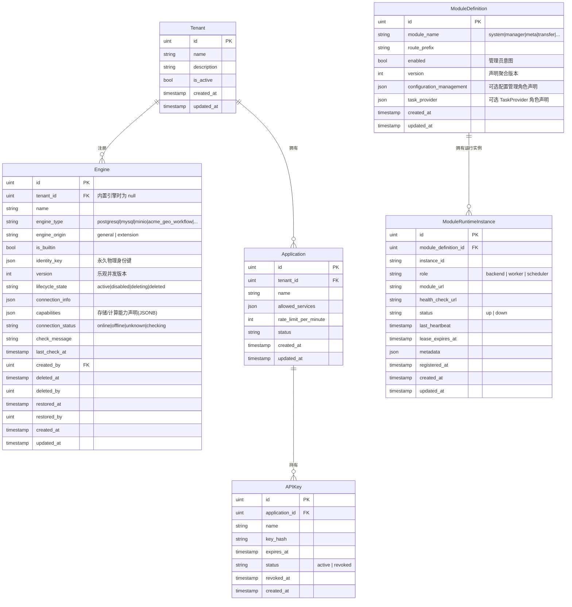
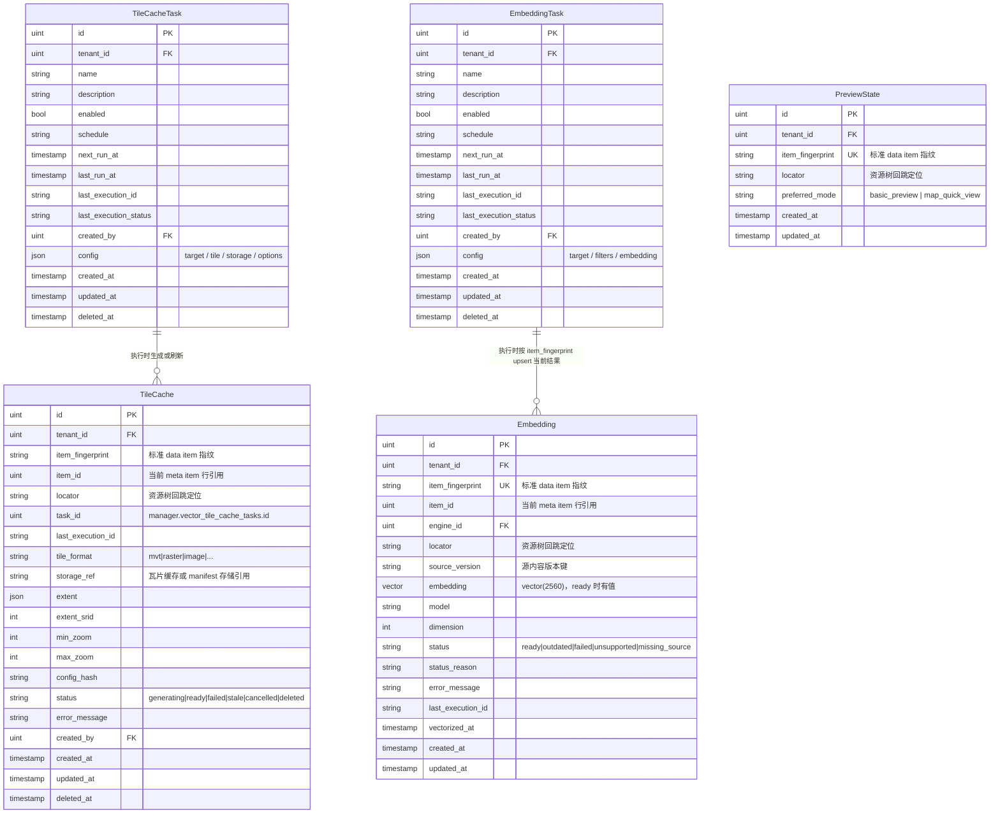
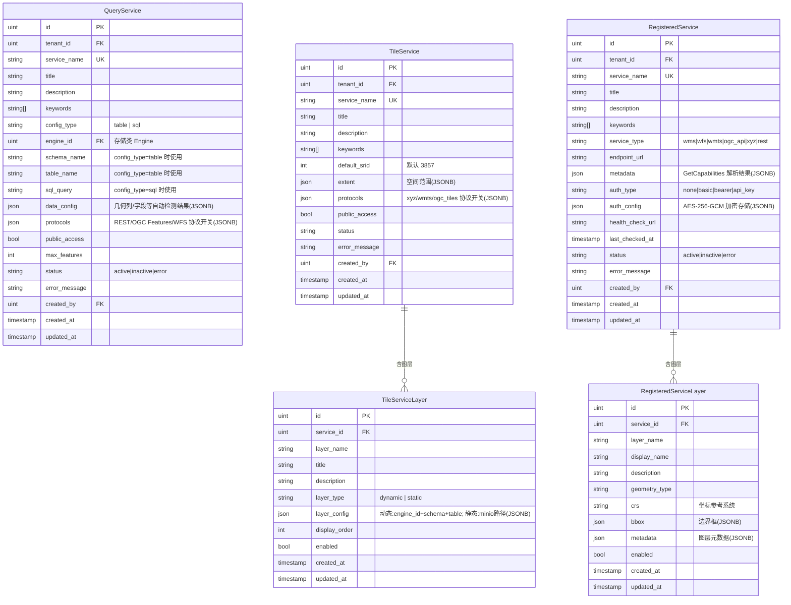
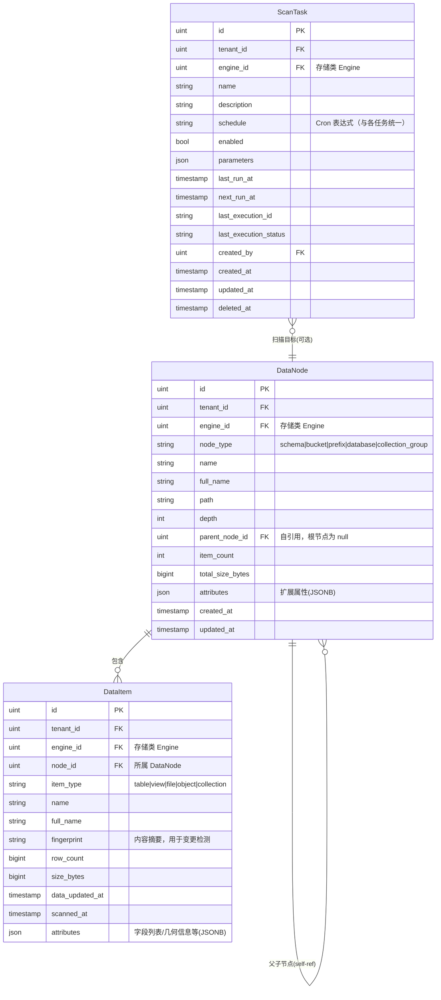
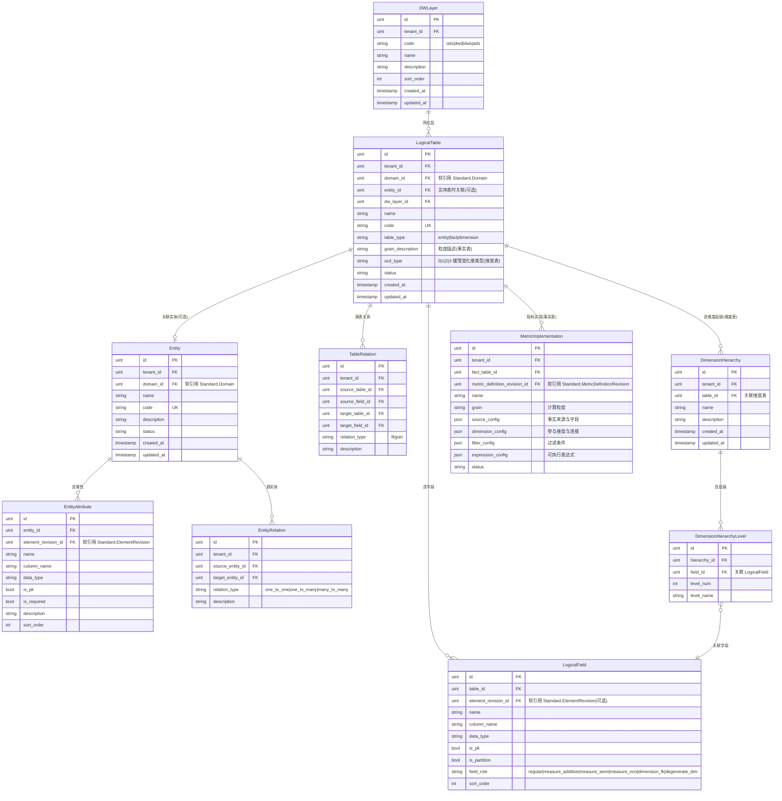
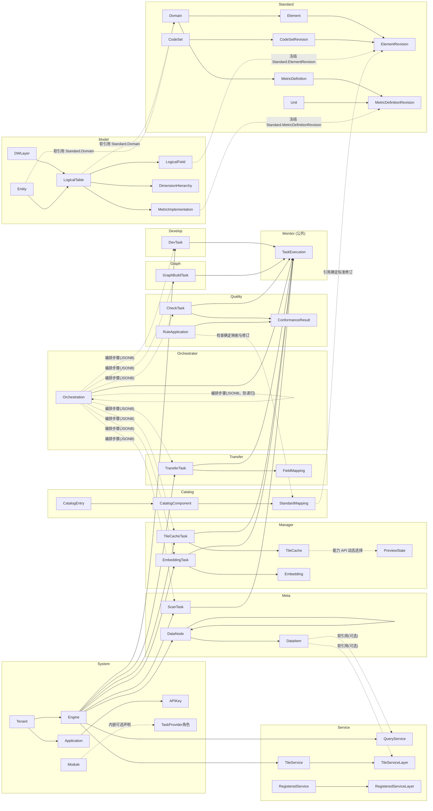
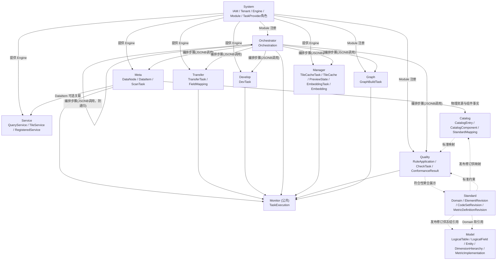

# ADDP 元模型（Meta-Model）

本文档从业务语义层面提炼 ADDP 的核心对象及其关系。
元模型中的对象是**业务概念**，不直接对应数据库表：一个业务对象可能跨多张表，多个对象也可能共享一张表的不同行。

Mermaid 图默认与 PG 表字段保持一致，便于发现并修正字段设计问题；明确标注为“目标元模型”的章节允许先描述已确认的目标状态，并必须在待改造项中列出当前实现偏差。

> IAM 概念以 [ADDP 账号与权限体系](addp账号与权限体系图.md) 为准。本文不展示旧 `user_type` 和 User 单 Tenant 表结构；IAM 具体字段、关系与迁移边界见 [System IAM 数据模型与迁移规范](../../system/docs/IAM数据模型与迁移规范.md)。

---

## 一、中英文对照表

### 全局横切能力（提炼自多个业务对象，无独立实体表）

| 中文     | 英文标识符  | 说明                                                           | 体现在哪些业务对象上                              |
| -------- | ----------- | -------------------------------------------------------------- | ------------------------------------------------- |
| 调度配置 | Schedule    | 定时触发能力（Cron 表达式），定义"何时执行"                    | Task 及所有派生任务均可具备                       |
| 执行记录 | Execution   | 单次运行的状态/进度/耗时/错误，记录"执行了什么、结果如何"      | 所有 Task 派生对象执行后均写入 common.task_executions |
| 数据血缘 | Lineage     | data item 之间的来源、派生和服务依赖关系视图；关系证据可回溯到 execution 或发布事实 | Meta 的 lineage_observations、lineage_item_relations、lineage_service_dependencies |
| 数据指纹 | Fingerprint | 内容摘要（MD5/SHA），用于去重、变更检测、血缘追踪              | DataNode / DataItem / PreviewState / Embedding       |
| 向量嵌入 | Embedding   | data item 的当前向量化结果状态与 pgvector 向量内容，支持语义检索 | DataItem（文件/对象/表）                          |
| 审计日志 | AuditLog    | 所有操作的不可变轨迹（操作人/时间/HTTP方法/路径/状态码）       | 全局，由 System 集中记录                          |

---

### System 模块核心对象（schema: system）

| 中文     | 英文标识符  | 说明                                                             |
| -------- | ----------- | ---------------------------------------------------------------- |
| 租户     | Tenant      | 平台顶级隔离单元，所有业务对象都归属于某个租户                   |
| 用户     | User        | ADDP 内部自然人身份；目标上通过 Tenant Membership 加入一个或多个 Tenant，不再以 user_type 表达权限 |
| 租户成员关系 | TenantMembership | User 或 Service Principal 进入某个 Tenant 的有效关系；一次业务会话只选择一个当前 Tenant |
| 外部身份 | ExternalIdentity | 外部 IdP 的 `issuer + subject` 到 ADDP User 的稳定映射 |
| 部门 | Department | Tenant 内表达稳定组织归属的层级组织单元 |
| 项目组 | ProjectGroup | Tenant 内表达跨部门协作的成员集合 |
| 角色分配 | RoleAssignment | 将 Role 赋予 Principal，并声明 Platform、Tenant、Department 或 Project Group Scope |
| 引擎     | Engine      | 数据源和计算资源的统一抽象，通过 capabilities 声明具体能力       |
| 模块     | Module      | ADDP 微服务单元；可选择性地声明任务能力，成为任务提供者          |
| 应用     | Application | API 访问控制单元，属于某个租户，持有多个 APIKey                  |
| API密钥  | APIKey      | 应用的访问凭证，支持速率限制和有效期                             |

**关于 Module 与 TaskProvider**：
- `TaskProvider` 不是独立对象，而是 `Module` 的一种可选角色，通过注册时声明任务 API 来体现
- `module_definitions` 保存稳定模块身份、管理员意图和可选 `task_provider` 声明；`module_runtime_instances` 单独保存进程租约和运行端点
- TaskProvider 的 `available`、`unavailable_reason` 和有效 Backend 端点池是 System 根据当前租约生成的读取投影，不是持久事实；调用方不得把单个端点缓存为模块身份
- 不是所有模块都是任务提供者：Console / Gateway / Monitor 不暴露任务接口

**关于 Engine**：
- `engine_origin = 'general'`：用户手动注册的数据引擎（PostgreSQL/MySQL/MinIO 等）
- `engine_origin = 'extension'`：按 ADDP 扩展规范注册的运行时（GeoPython Workflow、Spark Workflow、Jupyter、用户自研 Workflow 等）
- `is_builtin = true`：内置引擎，tenant_id = null，全局可见
- `capabilities` JSONB 字段声明引擎的存储/计算能力，各模块按需使用

---

### 引擎能力分类（从 capabilities JSONB 提炼，无独立表）

| 中文         | 英文标识符        | 对应插件接口            | 使用该能力的模块               |
| ------------ | ----------------- | ----------------------- | ------------------------------ |
| 目录发现       | EngineCatalogCapability  | EngineCatalogProvider          | Meta / Manager / Console        |
| Catalog leaf facts | EngineCatalogFactsCapability | EngineCatalogFactsProvider     | Meta / Manager / Service        |
| 内容读取       | ContentRead        | ContentReadableProvider  | Manager / Meta / Transfer       |
| 查询计算       | QueryCompute       | QueryRuntimeProvider     | Develop / Service / Manager     |
| 工作流计算     | WorkflowCompute    | WorkflowRuntimeProvider  | Develop / Orchestrator          |
| Notebook计算   | ScriptCompute      | ScriptRuntimeProvider    | Develop                         |

---

### Task（任务）抽象体系

**核心思想**：ADDP 中多种业务对象在本质上都是"任务"——定义了"做什么"，可以被执行、被调度、产生执行记录，也可以被 Orchestrator 编排。

| 中文         | 英文标识符    | 所在 Schema   | 说明                                                  |
| ------------ | ------------- | ------------- | ----------------------------------------------------- |
| 任务（抽象） | Task          | —             | 抽象概念，以下均为派生                                |
| 扫描任务     | ScanTask      | metadata      | 对某个 Engine 的元数据扫描任务定义                    |
| 传输任务     | TransferTask  | transfer      | 数据同步任务定义，阶段 1 统一任务体系只暴露 `task_type=sync` |
| 开发任务     | DevTask       | develop       | 可执行的开发工件（query/workflow/script），本质也是任务 |
| 编排工作流   | Orchestration | orchestrator  | 跨模块任务的 DAG 编排定义，**本身也是一种任务**       |
| 瓦片缓存生成任务 | TileCacheTask | manager | 生成瓦片缓存的任务定义，执行后更新 TileCache 结果事实 |
| 向量化任务   | EmbeddingTask | manager       | 对 data item 范围执行向量化的任务定义                 |
| 质量检查任务 | CheckTask     | quality       | 数据质量检查任务定义                                  |
| 图谱构建任务 | GraphBuildTask | graph        | 知识图谱构建任务定义                                  |

**任务的共同能力**：
- **Schedule**：所有 Task 均可配置定时调度（Cron 表达式）
- **Execution**：所有 Task 执行后写入 `common.task_executions` 统一记录
- **可被 Orchestration 编排**：ScanTask / TransferTask / DevTask / TileCacheTask / VectorMaterializedViewTask / EmbeddingTask / CheckTask / GraphBuildTask / Orchestration 均可作为 Orchestration 的步骤（Step）
- **Orchestration 的递归性**：Orchestration 执行完也产生 Execution，并以 `task_type=orchestration` 暴露给任务库；保存和执行时必须防止递归引用

**任务类型（task_type in common.task_executions）**：
- Meta: `scan`
- Transfer: `sync`
- Develop: `query` / `workflow` / `script`
- Orchestrator: `orchestration`
- Manager: `vector_tile_cache_generation` / `vector_materialized_view_generation` / `embedding`
- Quality: `check`
- Graph: `kg_build`

---

### Manager 模块核心对象（schema: manager）

| 中文         | 英文标识符    | 说明                                                              |
| ------------ | ------------- | ----------------------------------------------------------------- |
| 瓦片缓存生成任务 | TileCacheTask | Task 派生，生成瓦片缓存结果，执行时更新 TileCache |
| 向量化任务   | EmbeddingTask | Task 派生，对 data item 范围执行向量化，写入 Embedding artifact state |
| 预览状态 | PreviewState | 数据项预览状态，保存 item 身份、预览模式偏好和 map / scene_3d 交互视角 |
| 瓦片缓存结果 | TileCache | 空间 data item 的瓦片缓存结果状态，记录最小必要结果事实 |
| 向量记录     | Embedding     | 单个 data item 的当前向量化结果状态，以 item_fingerprint 去重     |

**关于 PreviewState**：
- 是预览状态，不是任务，也不是快显或瓦片缓存结果。
- PreviewState 保存用户预览状态；可快显能力、推荐结果和渲染源由能力 API 根据空间元数据、数据格式和各类快显结果动态合成。
- 瓦片缓存生成必须先创建 `TileCacheTask`，再执行；不设计无任务定义的 ad-hoc 瓦片缓存生成。

---

### Meta 模块核心对象（schema: meta）

| 中文     | 英文标识符 | 说明                                                         |
| -------- | ---------- | ------------------------------------------------------------ |
| 数据节点 | DataNode   | 树形层级中的容器节点（数据库/Schema/Bucket/前缀目录等），属于存储类 Engine |
| 数据项   | DataItem   | 最小数据实体（表/视图/文件/对象/集合），是管理和操作的最小单元，属于存储类 Engine |

- `DataNode` 是容器，可包含多个子 `DataNode` 或多个 `DataItem`（树形结构，parent_node_id 自引用）
- `DataNode` 和 `DataItem` 都属于具有**存储能力**的 `Engine`（RelationalStorage / BranchLeafStorage / ObjectStorage / FileStorage）

---

### Transfer 模块核心对象（schema: transfer）

| 中文     | 英文标识符   | 说明                                                     |
| -------- | ------------ | -------------------------------------------------------- |
| 传输任务 | TransferTask | Task 派生，阶段 1 对统一任务体系暴露为数据同步任务定义    |
| 字段映射 | FieldMapping | TransferTask 的子对象，定义源→目标字段的映射规则         |

---

### Orchestrator 模块核心对象（schema: orchestrator）

| 中文       | 英文标识符    | 说明                                                              |
| ---------- | ------------- | ----------------------------------------------------------------- |
| 编排工作流 | Orchestration | Task 派生，跨模块任务的 DAG 定义，本身执行后也产生 Execution      |
| 步骤       | Step          | Orchestration 的子对象，通过 `provider/task_type/task_id` 引用已有任务定义，内嵌 JSONB |

---

### Develop 模块核心对象（schema: develop）

| 中文     | 英文标识符 | 说明                                                                  |
| -------- | ---------- | --------------------------------------------------------------------- |
| 开发任务 | DevTask    | Task 派生，可执行的开发工件（query/workflow/script），选择计算类 Engine 执行 |

---

### Quality 模块核心对象（schema: quality）

| 中文         | 英文标识符 | 说明                         |
| ------------ | ---------- | ---------------------------- |
| 质量检查任务 | CheckTask  | Task 派生，执行数据质量规则检查 |

---

### Graph 模块核心对象（schema: graph）

| 中文         | 英文标识符    | 说明                         |
| ------------ | ------------- | ---------------------------- |
| 图谱构建任务 | GraphBuildTask | Task 派生，执行知识图谱构建任务 |

---

### Service 模块核心对象（schema: service）

Service 模块有三个相互独立的子系统：

| 中文           | 英文标识符         | 数据库表                          | 有子图层 | 说明                                                   |
| -------------- | ------------------ | --------------------------------- | -------- | ------------------------------------------------------ |
| 查询服务       | QueryService       | service.query_services            | 无       | 将内部单张表或 SQL 查询发布为 REST/OGC/WFS 接口        |
| 瓦片服务       | TileService        | service.tile_services             | 有       | 将内部空间数据发布为矢量瓦片（XYZ/WMTS/OGC Tiles）     |
| 瓦片服务图层   | TileServiceLayer   | service.tile_service_layers       | —        | TileService 的子图层，每层对应一个数据源（动态/静态）  |
| 注册服务       | RegisteredService  | service.registered_services       | 有       | 注册和代理第三方外部服务（WMS/WFS/WMTS/XYZ/REST）      |
| 注册服务图层   | RegisteredServiceLayer | service.registered_service_layers | —    | 从外部服务 GetCapabilities 自动解析的图层列表          |

**QueryService 配置模式**：`config_type = 'table'`（指定 schema+table）或 `config_type = 'sql'`（自定义 SQL）
**TileServiceLayer 模式**：`layer_type = 'dynamic'`（实时查询数据库）或 `layer_type = 'static'`（MinIO 预生成瓦片）

---

### Model 模块核心对象（schema: model）

| 中文     | 英文标识符       | 说明                                              |
| -------- | ---------------- | ------------------------------------------------- |
| 逻辑表   | LogicalTable     | 数仓逻辑层的表定义（实体/事实/维度表，ODS/DWD/DWS/ADS 层） |
| 逻辑字段 | LogicalField     | 逻辑表的字段，可软引用 Standard.Element           |

---

### Standard 模块核心对象（schema: standard）

| 中文     | 英文标识符 | 说明                                         |
| -------- | ---------- | -------------------------------------------- |
| 数据元   | Element    | 数据标准的核心原子：语义、类型、约束、码值集 |
| 指标     | Metric     | 业务指标定义（原子/派生/复合），含计算公式   |
| 码值集   | CodeSet    | 枚举型数据的值域（如：性别、状态码）         |
| 码值项   | CodeItem   | CodeSet 中的具体枚举值                       |
| 计量单位 | Unit       | 指标和数据元的度量单位                       |
| 业务术语 | Glossary   | 业务概念的标准化定义词典                     |

---

## 二、Mermaid 图

> 字段与 PG 表保持一致，便于在阅读图的过程中发现字段设计问题，问题记录在每张图后面。

---

### 2.1 系统非 IAM 核心对象图（System 模块）

> 本图只展示跨模块元模型需要的 System 对象。IAM 实体字段和数据库关系由 [System IAM 数据模型与迁移规范](../../system/docs/IAM数据模型与迁移规范.md) 及实际 migration 维护，避免在两份关系图中重复定义。

**⚠️ 发现的问题**：

| # | 问题描述 | 当前状态 | 影响 |
|---|----------|----------|------|
| S-1 | TaskProvider 过去与 Module 通过 `module_name` 跨表关联 | 已收敛 | 声明已纳入 `module_definitions.task_provider`，Provider ID 复用 Module ID，无独立生命周期 |
| S-2 | `Module` 无 `tenant_id`，模块是全局的而非租户级的 | 设计如此 | 确认模块注册是否需要按租户隔离（当前不需要） |
| S-3 | `Engine.created_by` 记录创建人 ID，但无对应 FK 约束（跨 schema 引用 User） | 应用层维护 | 合理，跨 schema 不用数据库 FK |

---

### 2.2 Task 抽象体系图

> Task 是抽象概念（无实体表），所有派生任务共享：BaseTask 公共字段、Schedule 能力、产生 Execution、可被 Orchestration 编排。

```mermaid
erDiagram
    ScanTask {
        uint id PK
        uint tenant_id FK
        uint engine_id FK "存储类 Engine"
        string name
        string description "任务描述（可选）"
        string schedule "Cron 表达式（空=不调度）"
        bool enabled "是否启用定时调度，默认 false"
        json parameters "扫描目标配置：节点/深度/类型等"
        timestamp last_run_at
        timestamp next_run_at
        string last_execution_id "最近执行 UUID（软引用）"
        string last_execution_status "最近执行状态（冗余）"
        uint created_by FK
        timestamp created_at
        timestamp updated_at
        timestamp deleted_at
    }

    TransferTask {
        uint id PK
        uint tenant_id FK
        string name
        string description
        string task_type "固定为 sync；Manager 导入/导出是调用方业务语义"
        json config "Reader-Transform-Writer 管道配置(JSONB)"
        string schedule "Cron 表达式"
        int batch_size
        bool enabled
        bool auto_scan_metadata "完成后自动触发扫描"
        timestamp last_run_at
        timestamp next_run_at
        string last_execution_id
        string last_execution_status
        uint created_by FK
        timestamp created_at
        timestamp updated_at
        timestamp deleted_at
    }

    FieldMapping {
        uint id PK
        uint task_id FK
        string source_field
        string target_field
        string default_value
        string field_type
        string format
        bool nullable
        timestamp created_at
    }

    DevTask {
        uint id PK
        uint tenant_id FK
        uint engine_id FK "具备对应能力的 Engine"
        string name
        string display_name
        string dev_type "query | workflow | script"
        json content "SQL语句/工作流节点定义/脚本内容"
        json execution_config "引擎ID和执行参数"
        string schedule "Cron 表达式"
        bool enabled "是否启用定时调度"
        int timeout "超时时间（秒）"
        string tags "text[]，标签"
        string status "active | inactive | archived（发布状态）"
        timestamp last_run_at
        timestamp next_run_at
        string last_execution_id
        string last_execution_status
        uint created_by FK
        timestamp created_at
        timestamp updated_at
        timestamp deleted_at
    }

    Orchestration {
        uint id PK
        uint tenant_id FK
        string name
        string description
        json steps "Step 内嵌数组(JSONB)"
        bool enabled
        string schedule "Cron 表达式"
        timestamp last_run_at
        timestamp next_run_at
        string last_execution_id
        string last_execution_status
        uint created_by FK
        timestamp created_at
        timestamp updated_at
        timestamp deleted_at
    }

    TileCacheTask {
        uint id PK
        uint tenant_id FK
        string name
        string description
        bool enabled
        string schedule "Cron 表达式"
        timestamp next_run_at
        timestamp last_run_at
        string last_execution_id
        string last_execution_status
        uint created_by FK
        json config "target / tile / storage / options"
        timestamp created_at
        timestamp updated_at
        timestamp deleted_at
    }

    EmbeddingTask {
        uint id PK
        uint tenant_id FK
        string name
        string description
        bool enabled
        string schedule "Cron 表达式"
        timestamp next_run_at
        timestamp last_run_at
        string last_execution_id
        string last_execution_status
        uint created_by FK
        json config "target / filters / embedding"
        timestamp created_at
        timestamp updated_at
        timestamp deleted_at
    }

    CheckTask {
        uint id PK
        uint tenant_id FK
        string name
        string description
        string schedule "Cron 表达式"
        bool enabled
        timestamp last_run_at
        timestamp next_run_at
        string last_execution_id
        string last_execution_status
        uint created_by FK
        timestamp created_at
        timestamp updated_at
        timestamp deleted_at
    }

    GraphBuildTask {
        uint id PK
        uint tenant_id FK
        uint graph_id FK "图谱 ID"
        string name
        string description
        string schedule "Cron 表达式"
        bool enabled
        timestamp last_run_at
        timestamp next_run_at
        string last_execution_id
        string last_execution_status
        uint created_by FK
        timestamp created_at
        timestamp updated_at
        timestamp deleted_at
    }

    TaskExecution {
        bigint id PK "bigint，应对高频写入"
        string execution_id UK "UUID，全局唯一，跨模块追踪"
        uint tenant_id FK
        string module "meta|transfer|develop|orchestrator|manager|quality|graph"
        string task_type "scan|sync|query|workflow|script|orchestration|vector_tile_cache_generation|vector_materialized_view_generation|embedding|check|kg_build"
        string source "触发来源模块"
        string source_task_id "对应模块任务 ID（字符串，无 DB FK）"
        string source_task_name "任务名称（冗余，便于展示）"
        string status "pending|running|success|failed|timeout|cancelled"
        int progress "0-100"
        string current_step "当前步骤描述（可选）"
        string trigger_type "manual | scheduled"
        uint triggered_by FK "触发用户 ID（可选）"
        string parent_execution_id "父 Orchestration 的 execution_id（无 DB FK）"
        timestamp started_at
        timestamp completed_at
        bigint execution_time_ms "执行时长（毫秒）"
        json error_details "错误详情（JSONB，仅失败时有值）"
        json metadata "模块特有扩展数据（JSONB，成功失败均有价值）"
        timestamp created_at
        timestamp updated_at
    }

    TransferTask ||--o{ FieldMapping : "含字段映射"
    ScanTask ||--o{ TaskExecution : "产生"
    TransferTask ||--o{ TaskExecution : "产生"
    DevTask ||--o{ TaskExecution : "产生"
    Orchestration ||--o{ TaskExecution : "产生"
    TileCacheTask ||--o{ TaskExecution : "产生"
    EmbeddingTask ||--o{ TaskExecution : "产生"
    CheckTask ||--o{ TaskExecution : "产生"
    GraphBuildTask ||--o{ TaskExecution : "产生"
    Orchestration }o--o{ ScanTask : "编排步骤"
    Orchestration }o--o{ TransferTask : "编排步骤"
    Orchestration }o--o{ DevTask : "编排步骤"
    Orchestration }o--o{ TileCacheTask : "编排步骤"
    Orchestration }o--o{ EmbeddingTask : "编排步骤"
    Orchestration }o--o{ CheckTask : "编排步骤"
    Orchestration }o--o{ GraphBuildTask : "编排步骤"
    Orchestration }o--o{ Orchestration : "编排步骤（需防递归）"
    TaskExecution ||--o{ TaskExecution : "parent_execution_id 子步骤追踪父编排"
```

**说明**：
- `Orchestration.steps` 是内嵌 JSONB 数组，每个 Step 通过 TaskProvider API 调用已有任务定义（`provider/task_type/task_id`）。
- 工作流运行时由 Develop 消费；算子工作流必须先在 Develop 中形成 `workflow` 任务，再作为 `provider=develop, task_type=workflow` 的 Step 进入 Orchestrator。
- `Orchestration` 执行后本身也产生 `TaskExecution`（task_type='orchestration'），并可作为 `provider=orchestrator, task_type=orchestration` 的任务被更高层 Orchestration 引用；保存和执行时必须防止自引用或循环引用。
- `DevTask.execution_config` 表达执行目标：所有 `query` 任务统一使用 `engine_id` 指向具备 query 能力的真实 System Engine，DuckDB 联邦查询绑定平台内置 DuckDB Runtime Engine，不存在 `query_mode` 或虚拟 `engine_id=0`；`workflow` 任务的 `engine_id` 指向具体工作流运行时实例，不冗余保存 `engine_type`；`script` 类选择具备脚本执行能力的引擎，当前可由 Jupyter Notebook runtime 承载
- `TaskExecution.error_details`：仅在失败时填充，存储错误类型、错误栈等诊断信息；`metadata`：每次执行均可写入，存储各模块特有的过程数据和结果统计

**⚠️ 发现的问题**：

| # | 问题描述 | 当前状态 | 影响 |
|---|----------|----------|------|
| T-1 | `TransferTask` 的 `schedule` 字段是字符串（Cron 表达式），而 `ScanTask` 用了 `schedule_type` + `cron_expression` 两字段，两者不一致 | ✅ 已修正 | ScanTask 已统一改为单字段 `schedule`，任务调度字段现已一致 |
| T-2 | `Orchestration.steps` 内嵌 JSONB，步骤中引用的任务类型无法做数据库级约束 | 应用层维护 | 合理，跨模块调用只能在应用层验证 |
| T-3 | `TaskExecution.source_task_id` 是字符串而非 FK，无法联表查询到对应任务的详情 | 设计如此 | 需要应用层按 module+task_type 路由到对应表查询 |
| T-4 | `Orchestration` 本身也是 Task，可作为另一个 Orchestration 的 Step 被引用 | 受限支持 | 必须在保存和执行时防止自引用或循环引用 |

---

### 2.3 Manager 模块对象图

**说明**：
- `PreviewState` 是预览状态，不是任务，也不是瓦片缓存结果；它只保存当前 item 的显示偏好和轻量交互视角，`can_use_quick_view`、`can_generate_tile_cache`、`default_tile_cache_id` 等能力字段由能力 API 动态合成。
- `TileCache` 是瓦片缓存结果状态，记录最小必要结果事实，例如存储引用、格式、范围、层级、配置指纹、最近 execution 和状态。
- `TileCacheTask` 执行流程：创建 execution → 按 `config` 生成或刷新 `TileCache` → 回写 `TileCacheTask.last_execution_id` / `last_execution_status`；执行链路不写回 `PreviewState` 能力字段。
- 瓦片缓存生成必须先创建 `TileCacheTask`，再执行；不设计无任务定义的 ad-hoc 瓦片缓存生成。

**⚠️ 发现的问题**：

| # | 问题描述 | 当前状态 | 影响 |
|---|----------|----------|------|
| MG-1 | 瓦片缓存结果状态需要从 PreviewState 中独立出来 | 已收敛 | `PreviewState` 负责预览偏好和交互状态，`TileCache` 负责结果事实 |
| MG-2 | `Embedding.item_fingerprint` 与 `tenant_id` 组成唯一键，按标准 data item 指纹去重；重复执行只跳过或覆盖当前结果 | 已收敛 | 与 Manager 向量化能力说明一致 |

---

### 2.4 Service 模块对象图

**说明**：
- `QueryService` 无子图层，直接对应单张表或一条 SQL，是最简洁的服务形式
- `TileService` 含多个 `TileServiceLayer`，每层可独立选择动态或静态模式
- `RegisteredService` 的图层由 GetCapabilities 自动解析生成，不是用户手工创建的

**⚠️ 发现的问题**：

| # | 问题描述 | 当前状态 | 影响 |
|---|----------|----------|------|
| SV-1 | `QueryService` 和 `TileService` 均引用存储类 Engine（engine_id），但 `TileServiceLayer` 里的 engine_id 藏在 `layer_config` JSONB 中，无显式 FK | 设计如此 | 动态图层的 engine_id 无法做 DB 级约束，应用层需校验 |
| SV-2 | 三类服务（QueryService/TileService/RegisteredService）无统一父表，服务目录需要 UNION 三张表 | 设计如此 | 服务目录查询性能依赖应用层聚合；考虑是否增加服务目录视图 |
| SV-3 | `RegisteredService.auth_config` 加密存储但仍在同一张表，敏感信息与业务信息混存 | 当前实现 | 可接受，加密存储是合理的安全措施 |

---

### 2.5 Meta 模块对象图

**说明**：
- `DataNode` 通过 `parent_node_id` 自引用形成树形层级：Engine 根 → Schema/Bucket → Table/Prefix → ...
- `DataItem` 是叶子节点，不再有子项，是管理和引用的最小单元
- `ScanTask` 针对一个 Engine 执行，可选指定从某个 `DataNode` 开始扫描（增量扫描）

**⚠️ 发现的问题**：

| # | 问题描述 | 当前状态 | 影响 |
|---|----------|----------|------|
| M-1 | `ScanTask` 的调度字段（`schedule_type + cron_expression`）与 `TransferTask`、`DevTask` 的单字段 `schedule` 不一致 | ✅ 已修正 | ScanTask 已统一改为单字段 `schedule`，六类任务调度字段现已一致 |
| M-2 | `DataItem.attributes` JSONB 存放字段列表，无法做字段级查询和索引 | 设计如此 | 字段元数据检索依赖全文索引（Meilisearch）|

---

### 2.6 Standard 模块对象图

> 本节描述 Standard 的目标元模型。稳定身份负责长期引用，修订负责审核、发布、生效和历史追溯；下方“待改造项”用于标识当前实现与目标模型之间的差异。

```mermaid
erDiagram
    Domain {
        uint id PK
        uint tenant_id FK
        uint parent_id FK "自引用，根域为 null"
        string name
        string code
        string description
        int sort_order
        timestamp created_at
        timestamp updated_at
    }

    StandardCollection {
        uint id PK
        uint tenant_id FK
        string code UK
        uint draft_revision_id FK
        int version "并发控制"
        timestamp created_at
        timestamp updated_at
    }

    StandardCollectionRevision {
        uint id PK
        uint collection_id FK
        int revision_no
        string status "draft|in_review|published|withdrawn"
        string name
        string description
        string change_summary
        uint submitted_by
        uint published_by
    }

    StandardCollectionMember {
        uint id PK
        uint collection_revision_id FK
        string member_type "element|code_set|metric|glossary|document"
        uint member_id "对应标准稳定身份"
    }

    StandardCollectionAssignment {
        uint id PK
        uint collection_id FK
        uint principal_id "System User Principal"
        string role "owner|maintainer|reviewer"
    }

    StandardCollectionEvent {
        uint id PK
        uint collection_id FK
        uint revision_id FK
        string event_type "created|draft_created|draft_updated|submitted|returned|published|assignments_replaced"
        uint actor_id "System User Principal"
        jsonb detail "最小事件详情"
        timestamp created_at
    }

    StandardCategory {
        uint id PK
        uint tenant_id FK
        uint parent_id FK "自引用"
        string object_type "element|code_set|metric|document|glossary"
        string code
        string name
        int sort_order
    }

    Element {
        uint id PK
        uint tenant_id FK
        uint owner_domain_id FK "scope_type=domain 时必填"
        uint category_id FK "仅导航"
        string code UK
        string scope_type "platform|tenant_common|domain"
        timestamp created_at
        timestamp updated_at
    }

    ElementRevision {
        uint id PK
        uint element_id FK
        int revision_no
        string status "draft|in_review|published|withdrawn"
        string name
        string definition
        string data_type
        string value_domain_type "unrestricted|range|enumeration"
        json range_config "连续值域结构"
        uint code_set_revision_id FK "枚举值域时必填"
        uint unit_id FK "可选"
        timestamp effective_from
        timestamp effective_to
        timestamp created_at
        timestamp updated_at
    }

    CodeSet {
        uint id PK
        uint tenant_id FK
        uint owner_domain_id FK "scope_type=domain 时必填"
        uint category_id FK "仅导航"
        string code UK
        string scope_type "platform|tenant_common|domain"
        timestamp created_at
        timestamp updated_at
    }

    CodeSetRevision {
        uint id PK
        uint code_set_id FK
        int revision_no
        string status "draft|in_review|published|withdrawn"
        string name
        string definition
        timestamp effective_from
        timestamp effective_to
        timestamp created_at
        timestamp updated_at
    }

    CodeItem {
        uint id PK
        uint code_set_revision_id FK
        string code
        string name
        string description
        int sort_order
    }

    MeasurementCategory {
        uint id PK
        uint tenant_id FK
        string name
        string description
    }

    Unit {
        uint id PK
        uint tenant_id FK
        uint category_id FK
        string name
        string symbol
        bool is_system
        timestamp created_at
        timestamp updated_at
    }

    MetricDefinition {
        uint id PK
        uint tenant_id FK
        uint category_id FK
        uint owner_domain_id FK "scope_type=domain 时必填"
        string code UK
        string scope_type "platform|tenant_common|domain"
        timestamp created_at
        timestamp updated_at
    }

    MetricDefinitionRevision {
        uint id PK
        uint metric_definition_id FK
        int revision_no
        string status "draft|in_review|published|withdrawn"
        string name
        string definition
        string statistical_caliber "业务统计口径"
        string semantic_formula "非引擎可执行的业务表达"
        uint unit_id FK "可选"
        timestamp effective_from
        timestamp effective_to
        timestamp created_at
        timestamp updated_at
    }

    Glossary {
        uint id PK
        uint tenant_id FK
        uint owner_domain_id FK "scope_type=domain 时必填"
        uint category_id FK "仅导航"
        string code UK
        string scope_type "platform|tenant_common|domain"
        timestamp created_at
        timestamp updated_at
    }

    GlossaryRevision {
        uint id PK
        uint glossary_id FK
        int revision_no
        string status "draft|in_review|published|withdrawn"
        string name
        string[] alias
        string definition
        int64[] related_ids "关联术语ID数组"
        timestamp effective_from
        timestamp effective_to
        timestamp created_at
        timestamp updated_at
    }

    Document {
        uint id PK
        uint tenant_id FK
        uint owner_domain_id FK "scope_type=domain 时必填"
        uint category_id FK "仅导航"
        string code UK
        string scope_type "platform|tenant_common|domain"
        string doc_type
        string source_org
        timestamp created_at
        timestamp updated_at
    }

    DocumentRevision {
        uint id PK
        uint document_id FK
        int revision_no
        string status "draft|in_review|published|withdrawn"
        string name
        string version_label
        string file_key "MinIO 文件路径"
        string file_name
        timestamp effective_from
        timestamp effective_to
        timestamp created_at
        timestamp updated_at
    }

    ExtractionEvidence {
        uint id PK
        uint document_revision_id FK
        string locator "页码/章节/文本片段位置"
        string excerpt_hash "证据内容摘要"
        string candidate_type
        uint candidate_revision_id "审核后指向正式修订"
        string review_status
    }

    Domain ||--o{ Domain : "父子域(self-ref)"
    Domain ||--o{ Element : "治理归属(scope=domain)"
    Domain ||--o{ CodeSet : "治理归属(scope=domain)"
    Domain ||--o{ MetricDefinition : "治理归属(scope=domain)"
    Domain ||--o{ Glossary : "治理归属(scope=domain)"
    Domain ||--o{ Document : "治理归属(scope=domain)"
    StandardCollection ||--o{ StandardCollectionRevision : "含治理配置修订"
    StandardCollection ||--o{ StandardCollectionAssignment : "职责分配"
    StandardCollection ||--o{ StandardCollectionEvent : "不可变治理事件"
    StandardCollectionRevision ||--o{ StandardCollectionEvent : "关联审核修订"
    StandardCollectionRevision ||--o{ StandardCollectionMember : "冻结成员清单"
    StandardCollectionMember }o--o{ Element : "成员稳定身份"
    StandardCollectionMember }o--o{ CodeSet : "成员稳定身份"
    StandardCollectionMember }o--o{ MetricDefinition : "成员稳定身份"
    StandardCollectionMember }o--o{ Glossary : "成员稳定身份"
    StandardCollectionMember }o--o{ Document : "成员稳定身份"
    StandardCategory ||--o{ StandardCategory : "父子分类(self-ref)"
    StandardCategory ||--o{ Element : "导航分类"
    StandardCategory ||--o{ CodeSet : "导航分类"
    StandardCategory ||--o{ MetricDefinition : "导航分类"
    StandardCategory ||--o{ Glossary : "导航分类"
    StandardCategory ||--o{ Document : "导航分类"
    Element ||--o{ ElementRevision : "含修订"
    CodeSet ||--o{ CodeSetRevision : "含修订"
    CodeSetRevision ||--o{ CodeItem : "含码值"
    CodeSetRevision ||--o{ ElementRevision : "枚举值域约束"
    MeasurementCategory ||--o{ Unit : "含单位"
    Unit ||--o{ ElementRevision : "计量单位(可选)"
    Unit ||--o{ MetricDefinitionRevision : "计量单位(可选)"
    MetricDefinition ||--o{ MetricDefinitionRevision : "含修订"
    Glossary ||--o{ GlossaryRevision : "含修订"
    Document ||--o{ DocumentRevision : "含修订"
    DocumentRevision ||--o{ ExtractionEvidence : "含提取证据"
```

**待改造项**：

| # | 问题描述 | 当前状态 | 影响 |
|---|----------|----------|------|
| ST-1 | 当前只有数据元和码值集采用稳定身份 + 不可变修订；术语、指标和文档仍是可变资源 | 待迁移 | 正式发布后的口径和来源无法被精确冻结，历史追溯链不完整 |
| ST-2 | `DimensionHierarchy` 已整体迁入 Model，Standard 旧表、API、权限与前端入口已删除 | ✅ 已实现 | 维度层级成为 LogicalTable 聚合内单一事实，不再跨模块软引用 |
| ST-4 | StandardCollection 已按“稳定身份 + 治理配置修订 + 成员快照 + 对象级职责分配 + 不可变治理事件”实现 | ✅ 已实现 | 可独立配置跨域标准集的成员、维护人、对象级权限和审核流程，且不改变成员自身发布状态 |
| ST-5 | 当前指标同时保存业务公式和 `derivation_config` | 待迁移 | Standard 与 Model 的计算实现职责混杂；Standard 只保留语义口径，具体实现迁入 Model |
| ST-6 | 当前标准文档没有不可变修订与提取证据模型 | 待迁移 | Copilot 提取结果无法稳定回溯到来源版本、页码或章节，也无法建立可靠审核链 |
| ST-7 | 码值层级与跨码值集映射尚未形成规范 | 待讨论 | 需要先区分标准间语义映射与 Transfer 的资产级转换执行，再决定是否建立父子码项和 crosswalk 资源 |

---

### 2.7 Model 模块对象图

**⚠️ 发现的问题**：

| # | 问题描述 | 当前状态 | 影响 |
|---|----------|----------|------|
| MO-1 | 当前 EntityAttribute / LogicalField 已逐步增加 `element_revision_id`，但仍需确认所有审批、导入和展示路径只以确定修订作为正式引用 | 待收口 | 跨 schema 无 DB FK 是合理边界，但正式模型不能动态跟随数据元当前版本 |
| MO-2 | 当前 `FactMetricMapping.metric_id` 只引用可变的 `Standard.Metric`，且没有完整计算实现契约 | 待迁移 | 应替换为 Model 所属的 MetricImplementation，并冻结 `metric_definition_revision_id` |
| MO-3 | `Entity` 和 `LogicalTable` 都有 `domain_id`，都软引用 `Standard.Domain`，两者的关系（Entity 是 LogicalTable 的模板）通过 `LogicalTable.entity_id` 可选关联，但未强制 | 设计如此 | 允许逻辑表不依赖实体直接建模 |
| MO-4 | Model 已独占 DimensionHierarchy 与层级成员，LogicalField 不再保存 `hierarchy_id + hierarchy_level` | ✅ 已实现 | 层级序号从 1 开始，成员只引用同一 LogicalTable 的字段并共用父版本 |

---

### 2.8 跨模块关系图

> 忽略字段细节，聚焦模块间的关键业务关联。实线 = 同 schema DB FK；虚线 = 跨 schema 软引用（无 DB FK，应用层维护）。

**说明**：
- 实线（`-->`）：同 schema 内有 DB FK 的关联
- 虚线（`-.->`）：跨 schema 软引用，无 DB FK，应用层维护一致性
- `DataItem → QueryService/TileServiceLayer`：Service 发布服务时可关联元数据项，但不强制——服务可直接指定 engine_id + schema + table 而不经过 Meta

---

### 2.9 全局元模型总图（概览）

> 模块级视图，只展示模块之间的依赖方向，不列对象细节。

---

## 三、发现的问题汇总

| 编号 | 分类     | 问题描述                                                              | 优先级 | 状态       |
|------|----------|-----------------------------------------------------------------------|--------|------------|
| S-1  | System   | TaskProvider 曾与 Module 通过 `module_name` 跨表关联 | — | ✅ 已收敛为 `module_definitions.task_provider` 内嵌角色声明，Provider ID 复用 Module ID |
| S-2  | System   | Module 无 tenant_id，模块是全局的                                     | —      | 已确认合理 |
| S-3  | System   | Engine.created_by 无 DB FK（跨 schema 引用 User）                     | —      | 已确认合理 |
| T-1  | Task     | ScanTask 调度字段与其他任务不一致（schedule_type+cron_expression vs 单字段 schedule） | 中 | ✅ 已修正（任务调度字段已统一为单字段 schedule） |
| T-2  | Task     | Orchestration.steps 内嵌 JSONB，任务引用无 DB 约束                    | —      | 已确认合理 |
| T-3  | Task     | TaskExecution.source_task_id 为字符串，无法联表查询任务详情            | 低     | 待讨论     |
| T-4  | Task     | Orchestration 可作为另一 Orchestration 的 Step，但必须防止自引用或循环引用 | 中 | 受限支持 |
| M-1  | Meta     | ScanTask 的调度字段（schedule_type + cron_expression）与其他任务单字段 schedule 不一致 | 中 | ✅ 已修正，见 T-1 |
| M-2  | Meta     | DataItem.attributes JSONB 存字段列表，无字段级查询能力                | —      | 已确认合理（依赖 Meilisearch）|
| MG-1 | Manager  | 瓦片缓存结果状态从 PreviewState 独立为 TileCache | — | 已按预览状态与瓦片缓存概念收敛 |
| MG-2 | Manager  | Embedding 以 `tenant_id + item_fingerprint` 唯一，重复执行只跳过或覆盖当前 artifact state | — | 已按 Manager 向量化能力说明收敛 |
| SV-1 | Service  | TileServiceLayer.engine_id 藏在 layer_config JSONB 中，无 DB FK       | 中     | 待讨论     |
| SV-2 | Service  | 三类服务无统一父表，服务目录需 UNION 查询                             | 低     | 待讨论     |
| SV-3 | Service  | RegisteredService.auth_config 加密存储，敏感信息与业务信息混存        | —      | 已确认合理 |
| ST-1 | Standard | Glossary.related_ids 用 int64[] 存关联 ID，无 FK 约束                 | —      | 已确认合理 |
| ST-2 | Standard | DimensionHierarchy 所有权与实现已统一迁入 Model | — | ✅ 已完成，Standard 旧路线已删除 |
| MO-1 | Model    | 正式模型必须冻结 Standard.ElementRevision，不能只动态引用 Element | 高 | 已有冻结字段，待收口全部审批与消费路径 |
| MO-2 | Model    | 当前 FactMetricMapping 只引用可变 Standard.Metric，缺少指标实现契约 | 高 | 待替换为 MetricImplementation 并冻结 MetricDefinitionRevision |
| MO-3 | Model    | Entity 和 LogicalTable 都软引用 Domain，LogicalTable 可不经 Entity 直接建模 | —  | 已确认合理 |
