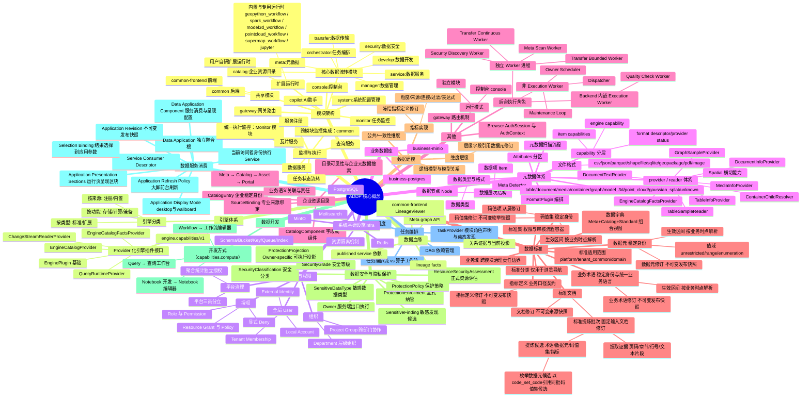
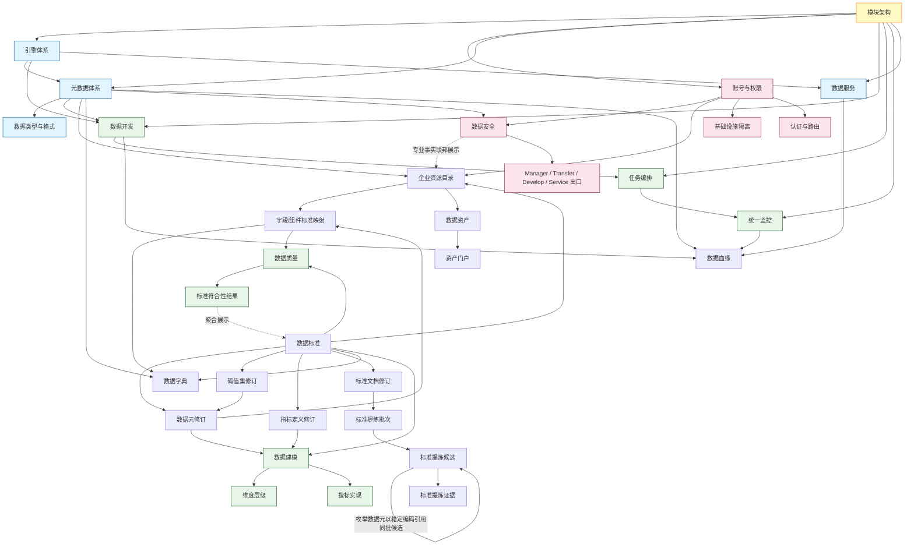

# ADDP 核心概念关系图

本文档是 ADDP 核心概念的总览索引页,使用可视化图表展示核心概念全景,并提供详细文档的导航链接。

---

## 目录

1. [核心概念全景图](#核心概念全景图)
2. [核心概念导航](#核心概念导航)
3. [文档索引](#文档索引)

---

## 核心概念全景图

ADDP 平台的核心概念体系:

---

## 核心概念导航

### 1. [模块架构](addp模块架构图.md)

**ADDP 各个模块及其依赖关系**

- 模块总览图 (Console、Gateway、System、Manager、Meta、Transfer、Orchestrator、Develop、Service、Monitor)
- 模块分层架构 (前端层、网关层、服务层、数据层)
- 共享模块 (common、common-frontend)
- 扩展运行时 (内置与专用运行时 geopython_workflow、spark_workflow、model3d_workflow、pointcloud_workflow、supermap_workflow、jupyter，以及用户自研扩展运行时)
- 基础设施 (PostgreSQL、Redis、MinIO、Meilisearch)

📄 **[阅读完整文档 →](addp模块架构图.md)**

---

### 2. [引擎体系](addp引擎体系图.md)

**引擎系统架构、分类体系和能力声明机制**

- Provider 化引擎插件架构 (EnginePlugin、EngineCatalogProvider、EngineCatalogFactsProvider、StoreProvider、QueryRuntimeProvider)
- 引擎分类体系 (按功能、按来源、按注册方式)
- 当前支持的引擎列表
- 结构化能力声明 (`engine.capabilities/v1`)
- 引擎插件系统

📄 **[阅读完整文档 →](addp引擎体系图.md)**

---

### 3. [账号与权限](addp账号与权限体系图.md)

**统一身份、Tenant 隔离、组织关系和权限控制模型**

- 全局 User 与 Tenant Membership
- Local Account、External Identity 和 Service Principal
- Department、Project Group 和 Tenant 隔离
- Role / Permission 与 owner Resource Grant / Policy
- 平台三员分立和跨租户聚合统计授权
- opaque User Access Token 与 AuthContext

📄 **[阅读完整文档 →](addp账号与权限体系图.md)**

---

### 4. [元数据体系](addp元数据体系图.md)

**元数据管理体系，包括资源层次、数据项识别、attributes normalizer 和扫描流程**

- 元数据层次结构 (engine、node、data item)
- Meta Detector 识别 data item 边界
- Meta Normalizer 生成标准 attributes
- FormatPlugin、info provider、content reader 的编排边界
- 元数据扫描流程

📄 **[阅读完整文档 →](addp元数据体系图.md)**

---

### 5. [数据类型和格式](addp数据类型和格式体系图.md)

**数据类型、文件格式、FormatPlugin 和 provider / reader 体系**

- 数据类型分类 (table、document、media、container、graph、unknown)
- 文件格式体系 (csv、json、parquet、shapefile、sqlite/geopackage、pdf、图片等)
- capability 分层 (engine capability、format descriptor / provider status、item capabilities)
- provider / reader 矩阵与跨模块边界 (TableInfoProvider、TableSampleReader、DocumentInfoProvider、DocumentTextReader、MediaInfoProvider 等)

📄 **[阅读完整文档 →](addp数据类型和格式体系图.md)**

---

### 6. [数据开发](addp数据开发体系图.md)

**三种数据开发方式及其与引擎能力的关系**

- 三种开发方式概述 (查询开发、算子工作流、Notebook 开发)
- 查询开发 (Query) - SQL/MQL 查询
- 算子工作流 (Workflow) - 可视化 DAG 工作流
- Notebook 开发 - Jupyter Notebook 交互式开发
- capabilities.compute 与开发界面映射

📄 **[阅读完整文档 →](addp数据开发体系图.md)**

---

### 7. [任务编排](addp任务编排体系图.md)

**任务库机制、任务编排流与算子工作流的区别、以及跨模块编排能力**

- 任务库机制（模块 TaskProvider 角色声明、跨模块任务调用）
- 任务编排流 vs 算子工作流 (粗粒度 vs 细粒度、跨模块 vs 单引擎)
- 编排 DAG 示例
- 依赖管理与声明输出绑定
- 调度方式 (Cron 定时调度、手动触发)

📄 **[阅读完整文档 →](addp任务编排体系图.md)**

---

### 8. [监控与执行](addp监控与执行体系图.md)

**统一执行监控架构和跨模块任务追踪机制**

- 统一执行监控架构 (common.task_executions 表、Monitor 模块)
- 任务执行状态流转 (pending → running → success/failed)
- 跨模块监控集成
- 各模块任务类型

📄 **[阅读完整文档 →](addp监控与执行体系图.md)**

---

### 9. [数据服务](addp数据服务体系图.md)

**数据服务发布机制,包括 OGC 标准服务和查询服务 API**

- 数据服务概述
- 服务发布流程
- 查询服务 API (RESTful 接口、条件查询、分页、空间查询)
- 瓦片服务
- 服务注册

📄 **[阅读完整文档 →](addp数据服务体系图.md)**

---

### 10. [数据血缘](../spec/addp数据血缘能力规范.md)

**数据项来源、派生、服务依赖和执行证据的统一关系视图**

- 真实读写 owner 写入版本化 `lineage_facts`
- Meta 保存关系证据和当前投影，PostgreSQL 关系表是第一阶段唯一事实源
- 图查询统一使用 Meta lineage graph API
- `common-frontend/graph` 提供可嵌入的 `LineageViewer`
- 字段级血缘和 SQL 自动解析属于后续阶段

📄 **[阅读完整规范 →](../spec/addp数据血缘能力规范.md)**

---

### 11. [基础设施隔离](addp基础设施隔离图.md)

**基础设施架构,包括系统基础设施与业务数据库的隔离**

- 基础设施架构概述
- 系统基础设施 vs 业务数据库 (ADDP 元数据 vs 用户业务数据)
- 资源隔离机制 (PostgreSQL Schema、MinIO Bucket、Redis Key、bounded execution claim、Meilisearch Index)

📄 **[阅读完整文档 →](addp基础设施隔离图.md)**

---

### 12. [企业资源目录](addp企业资源目录体系图.md)

**企业资源稳定身份、业务语义关联、责任和权限感知发现**

- CatalogEntry 与 Meta DataItem fingerprint 的身份分离
- Meta、Standard、Catalog、Manager、Asset、Portal 的事实边界
- DataItem 自动建档、来源失效和显式重绑
- Department / Project Group / User 与目录身份的关系
- 技术资源、企业元数据、内容和资产搜索的所有权

📄 **[阅读完整文档 →](addp企业资源目录体系图.md)**

---

### 13. [数据安全与隐私保护](addp数据安全与隐私保护体系图.md)

**安全专业事实、显式纳管、保护策略与 Owner 出口执行**

- Security 与 Standard、Catalog、IAM 和资源 Owner 的事实边界
- Meta 技术事实之上的显式纳管和受控敏感发现
- Finding、Assessment、Policy 和 ProtectionProjection 单一编译主路
- Manager、Transfer、Develop 和 Service 本地执行保护投影

📄 **[阅读完整文档 →](addp数据安全与隐私保护体系图.md)**

---

### 14. [认证与路由](addp登录认证的原理说明.md)

**Browser AuthSession、登录恢复、静默刷新和 Console iframe 认证机制**

- opaque Token 与 AuthContext 流程
- 页面启动恢复、主动刷新和多标签页互斥
- 独立模块与 Console 统一登录
- Console iframe `postMessage` 认证机制
- 认证中间件原理（Go 代码）
- Token 自动刷新机制（JavaScript 代码）
- 安全特性（bcrypt、Token Hash、轮换撤销、多租户隔离）

> Gateway 路由规则和 Console 架构图见：[ADDP 模块架构图](addp模块架构图.md)

📄 **[阅读完整文档 →](addp登录认证的原理说明.md)**

---

## 文档索引

### 架构与模块

- **[ADDP 模块架构图](addp模块架构图.md)** - 模块总览、分层架构、共享模块、扩展运行时
- **[引擎体系图](addp引擎体系图.md)** - 引擎插件架构、分类体系、能力声明
- **[基础设施隔离图](addp基础设施隔离图.md)** - 系统与业务分离、资源隔离机制

### 用户与权限

- **[账号与权限体系](addp账号与权限体系图.md)** - User、Tenant Membership、组织、角色、资源授权和 AuthContext
- **[登录认证原理说明](addp登录认证的原理说明.md)** - Browser AuthSession、静默恢复、Token 轮换和 iframe 认证（Gateway 路由与 Console 架构见[模块架构图](addp模块架构图.md)）

### 数据管理

- **[元数据体系图](addp元数据体系图.md)** - 元数据层次、扫描流程、attributes 结构
- **[数据项体系图](addp数据项体系图.md)** - engine、node、data item 链条和模块职责边界
- **[数据类型和格式体系图](addp数据类型和格式体系图.md)** - 数据类型、文件格式、能力分层、provider / reader 体系
- **[企业资源目录体系图](addp企业资源目录体系图.md)** - CatalogEntry、来源绑定、业务语义、责任和企业目录搜索边界
- **[数据安全与隐私保护体系图](addp数据安全与隐私保护体系图.md)** - Security 事实所有权、显式纳管、发现评估、保护投影与 Owner 服务端出口执行

### 数据开发与编排

- **[数据开发体系图](addp数据开发体系图.md)** - 查询开发、算子工作流、Notebook 开发
- **[任务编排体系图](addp任务编排体系图.md)** - 任务库、编排流、DAG 依赖、调度方式

### 监控与服务

- **[监控与执行体系图](addp监控与执行体系图.md)** - 统一执行监控、状态流转、跨模块监控
- **[数据服务体系图](addp数据服务体系图.md)** - OGC 标准服务、查询服务 API

### 治理与血缘

- **[数据血缘能力规范](../spec/addp数据血缘能力规范.md)** - 统一 execution facts、Meta 关系投影、服务依赖和查看器边界
- **[数据项体系图](addp数据项体系图.md)** - data item 身份、字段边界和血缘职责归属

---

## 核心概念关系总结

ADDP 平台的核心概念之间存在紧密的关联:

**关键关联**:
1. **模块架构**是基础,定义了 ADDP 的整体结构
2. **引擎体系**驱动**元数据**、**数据开发**和**数据服务**
3. **数据开发**的结果可以被**任务编排**使用,形成复杂的数据流水线
4. **所有任务**的执行被**统一监控**
5. **账号与权限**确保**基础设施隔离**和**认证与路由**的安全性
6. **业务域**是跨模块复用的治理责任边界；标准适用范围、标准集和标准分类分别回答“在哪里成立”“如何治理”和“如何浏览”，不能相互替代
7. **数据标准**以稳定身份承接长期引用，以不可变修订承接审核、发布和历史追溯；定义按生效区间和业务时点动态解析，数据元枚举值域固定引用码值集修订
8. **维度层级和指标实现**属于 Model；Standard 只拥有可复用的数据元、码值集和指标定义等语义契约，Model 必须冻结所采用的标准修订
9. **标准落标与符合性**形成单一事实链：Catalog 拥有实际字段/组件到标准修订的映射，Quality 拥有规则应用、执行结果和问题，Standard 只聚合展示
10. **数据字典**是 Meta、Catalog 与 Standard 的组合视图，不是 Standard 内独立复制的资源
11. **数据安全**与 Catalog 并行消费 Meta 事实；它只分析显式纳管目标，以 owner 专业资源身份形成事实，不要求先建立 CatalogEntry
12. **保护执行**不在 Security 中代理原始数据；Security 编译投影，资源 Owner 在服务端出口合并授权结果并执行更严效果

---

## 相关文档

- [ADDP 各模块简要介绍](addp各模块功能介绍.md) - 各模块功能概述
- [ADDP 开发原则](../spec/addp开发原则.md) - 开发指导原则
- [ADDP 配置介绍](../spec/addp配置介绍.md) - 环境变量和配置管理
- [ADDP 技术栈规约](../spec/addp技术栈规约.md) - 依赖版本规范
- [ADDP 共享模块介绍](addp共享模块介绍.md) - common 和 common-frontend 详解

---

**文档版本**: v1.0
**创建日期**: 2026-02-16
**作者**: ADDP 开发团队
