# ADDP 模块架构图

本文档使用可视化图表展示 ADDP 平台的模块组成、层次关系和依赖关系。

---

## 目录

1. [模块总览](#模块总览)
2. [模块详细说明](#模块详细说明)
3. [共享模块](#共享模块)
4. [Worker 运行时](#worker-运行时)
5. [Monitor 模块](#monitor-模块)
6. [Gateway 路由机制](#gateway-路由机制)
7. [ADDP 两种使用方式](#addp-两种使用方式)
8. [扩展运行时与任务编排](#扩展运行时与任务编排)
9. [模块启动顺序](#模块启动顺序)

---

## 模块总览

ADDP 平台采用微服务架构,由以下模块组成:

```mermaid
graph TB
    subgraph "前端层"
        Console[Console<br/>控制台<br/>:5170]
        SystemFE[System Frontend<br/>:5173]
        ManagerFE[Manager Frontend<br/>:5174]
        MetaFE[Meta Frontend<br/>:5175]
        TransferFE[Transfer Frontend<br/>:5176]
        OrchestratorFE[Orchestrator Frontend<br/>:5177]
        DevelopFE[Develop Frontend<br/>:5178]
        ServiceFE[Service Frontend<br/>:5179]
        MonitorFE[Monitor Frontend<br/>:5179]
    end

    subgraph "网关层"
        Gateway[Gateway<br/>API网关<br/>:8000]
    end

    subgraph "服务层"
        System[System Backend<br/>核心系统<br/>:8180]
        Manager[Manager Backend<br/>数据管理<br/>:8081]
        Meta[Meta Backend<br/>元数据服务<br/>:8082]
        Transfer[Transfer Backend<br/>数据传输<br/>:8083]
        Orchestrator[Orchestrator Backend<br/>任务编排<br/>:8084]
        Develop[Develop Backend<br/>数据开发<br/>:8185]
        Service[Service Backend<br/>数据服务<br/>:8086]
        Monitor[Monitor Backend<br/>执行监控<br/>:8100]
    end

    subgraph "Worker运行时"
        TransferBoundedWorker[Transfer Bounded Worker<br/>Asynq 有界任务]
        TransferContinuousWorker[Transfer Continuous Worker<br/>Supervisor / Runtime Sessions]
        MetaWorker[Meta Worker<br/>扫描任务处理]
    end

    subgraph "共享模块"
        Common[common<br/>后端共享库]
        CommonFE[common-frontend<br/>前端共享库]
    end

    subgraph "扩展运行时"
        PyWorkflow[geopython_workflow<br/>内置 Workflow 示例]
        SparkWorkflow[spark_workflow<br/>内置 Workflow 示例]
        CustomWorkflow[用户自研 Workflow<br/>addp.workflow/v1]
        Jupyter[jupyter<br/>Notebook 脚本运行时]
    end

    subgraph "基础设施层"
        PostgreSQL[(PostgreSQL<br/>系统数据库<br/>:15432)]
        Redis[(Redis<br/>缓存/队列<br/>:16379)]
        MinIO[(MinIO<br/>对象存储<br/>:19000)]
        Meilisearch[(Meilisearch<br/>全文搜索<br/>:17700)]
        InfraKafka[(Infra Kafka<br/>KRaft<br/>:19092)]
        KafkaConnect[Kafka Connect<br/>Debezium<br/>:18083]
    end

    Console --> Gateway
    SystemFE -.-> Console
    ManagerFE -.-> Console
    MetaFE -.-> Console
    TransferFE -.-> Console
    OrchestratorFE -.-> Console
    DevelopFE -.-> Console
    ServiceFE -.-> Console
    MonitorFE -.-> Console

    Gateway --> System
    Gateway --> Manager
    Gateway --> Meta
    Gateway --> Transfer
    Gateway --> Orchestrator
    Gateway --> Develop
    Gateway --> Service
    Gateway --> Monitor

    System --> Common
    Manager --> Common
    Meta --> Common
    Transfer --> Common
    Orchestrator --> Common
    Develop --> Common
    Service --> Common
    Monitor --> Common

    SystemFE --> CommonFE
    ManagerFE --> CommonFE
    MetaFE --> CommonFE
    TransferFE --> CommonFE
    OrchestratorFE --> CommonFE
    DevelopFE --> CommonFE
    ServiceFE --> CommonFE

    Common --> PostgreSQL
    Common --> Redis
    Common --> MinIO
    Common --> Meilisearch
    KafkaConnect --> InfraKafka

    Transfer --> TransferBoundedWorker
    Transfer -.-> TransferContinuousWorker
    Meta --> MetaWorker
    TransferBoundedWorker --> Redis
    TransferContinuousWorker --> PostgreSQL
    MetaWorker --> Redis

    Develop --> Common
    Common --> PyWorkflow
    Common --> SparkWorkflow
    Common --> CustomWorkflow
    Common --> Jupyter

    classDef frontend fill:#e1f5ff,stroke:#01579b
    classDef gateway fill:#fff3e0,stroke:#e65100
    classDef backend fill:#f3e5f5,stroke:#4a148c
    classDef worker fill:#ffe0b2,stroke:#e65100
    classDef shared fill:#e8f5e9,stroke:#1b5e20
    classDef engine fill:#fff9c4,stroke:#f57f17
    classDef infra fill:#fce4ec,stroke:#880e4f

    class Console,SystemFE,ManagerFE,MetaFE,TransferFE,OrchestratorFE,DevelopFE,ServiceFE,MonitorFE frontend
    class Gateway gateway
    class System,Manager,Meta,Transfer,Orchestrator,Develop,Service,Monitor backend
    class TransferBoundedWorker,TransferContinuousWorker,MetaWorker worker
    class Common,CommonFE shared
    class PyWorkflow,SparkWorkflow,CustomWorkflow,Jupyter engine
    class PostgreSQL,Redis,MinIO,Meilisearch,InfraKafka,KafkaConnect infra
```

**说明**:
- **前端层**: 各模块的独立前端应用,Console 通过 iframe 集成所有模块前端
- **网关层**: Gateway 统一处理外部请求并路由到对应的后端服务
- **服务层**: 各业务模块的后端服务,提供 RESTful API
- **Worker运行时**: 独立的后台任务处理进程
  - **Transfer Bounded Worker**: 基于 Asynq 的异步任务队列，处理 snapshot 和 watermark bounded execution。
  - **Transfer Continuous Worker**: 已实现的独立长驻进程角色，通过 supervisor、DB lease、heartbeat 和 fencing 承载多个 continuous runtime session；不使用 Asynq 承载无限消费循环。当前数据面只开放业务 Kafka keyed JSON -> PostgreSQL，Debezium CDC 尚未实现。
  - **Meta Worker**: 基于 Asynq 的扫描任务处理,执行元数据扫描和索引
- **Manager 快显与瓦片任务**: 当前 PostGIS + MVT 格式实现中，`vector_tile_cache_generation` 由 Manager Backend 内的任务服务和调度器执行；任务定义为 `manager.vector_tile_cache_tasks`，执行记录进入 `common.task_executions`，结果状态进入 `manager.vector_tile_cache`。`vector_materialized_view_generation` 由 Manager Backend 在手动或编排触发时执行，任务定义为 `manager.vector_materialized_view_tasks`，结果状态进入 `manager.vector_materialized_view`，当前不启动模块自身定时调度。若后续矢量物化视图构建或瓦片缓存生成负载转移到 Manager 进程内、需要多执行器横向扩展，或引入专门 GIS 计算引擎，应将对应任务类型的唯一执行运行时切换为 Manager Worker 或 GIS 执行引擎，不允许 Backend 与 Worker 双轨并存。
- **共享模块**: common 和 common-frontend 提供可复用的代码和组件
- **扩展运行时**: engines 目录下的内置工作流 / 脚本运行时，由 Develop 模块通过统一 Provider 调用
- **基础设施层**: 共享的数据库、缓存、对象存储、搜索引擎，以及 PostgreSQL CDC 使用的 Infra Kafka/Kafka Connect。Infra Kafka 和 Connect 已部署，但 CDC task/capture supervisor 尚未开放。

---

## 模块详细说明

| 模块 | 职责 | 端口 (开发/生产) | 主要技术栈 |
|------|------|-----------------|-----------|
| **Console** | 控制台入口,集成所有模块功能 | 5170 / 80 | Vue 3, Vue Router |
| **System** | 核心系统服务:用户认证、引擎管理、日志 | 8180 / 8180 | Go, Gin, GORM, JWT |
| **Gateway** | API 网关,请求路由和转发 | 8000 / 8000 | Go, Gin |
| **Manager** | 数据管理:数据存储目录展示、数据预览、空间快显和瓦片缓存 | 8081 / 8081 | Go, Gin, OpenLayers |
| **Meta** | 元数据服务:扫描、索引、搜索 | 8082 / 8082 | Go, Gin, Meilisearch, Cron |
| **Meta Worker** | Meta 扫描任务处理器 | - | Go, Asynq Worker |
| **Transfer** | 数据传输:同步、搬运、格式转换任务 | 8083 / 8083 | Go, Gin, Asynq |
| **Transfer Bounded Worker** | Transfer 有界任务处理器 | - | Go, Asynq Worker |
| **Transfer Continuous Worker** | Transfer 持续任务处理器 | - | Go, DB lease, Kafka client |
| **Orchestrator** | 任务编排:跨模块任务编排调度 | 8084 / 8084 | Go, Gin, Cron |
| **Develop** | 数据开发:查询执行、工作流、Notebook 开发 | 8185 / 8185 | Go, Gin, Monaco Editor |
| **Service** | 数据服务:服务发布(空间OGC标准与非空间)、外部服务注册 | 8086 / 8086 | Go, Gin, OGC 标准 |
| **Monitor** | 执行监控:统一监控所有模块的任务执行记录、统计分析 | 8100 / 8100 | Go, Gin, PostgreSQL |
| **Copilot** | AI 辅助助手：SQL 智能生成、工作流智能生成 | 8087 / 8087 | Python, FastAPI, LangChain |


---

## 共享模块

### common (后端共享库)

位于 `common/` 目录,所有后端服务依赖的共享代码:

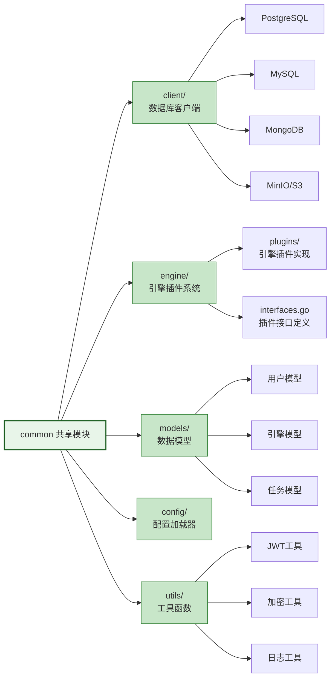

**主要内容**:
- **client/**: 数据库客户端(PostgreSQL、MySQL、MongoDB、MinIO 等)
- **engine/**: 引擎插件系统(接口定义、插件实现、自动注册)
- **models/**: 通用数据模型(用户、引擎、任务等)
- **config/**: 配置加载器(环境变量、.env 文件)
- **utils/**: 工具函数(JWT、加密、日志等)

### common-frontend (前端共享库)

位于 `common-frontend/` 目录,前端模块复用的组件和工具:

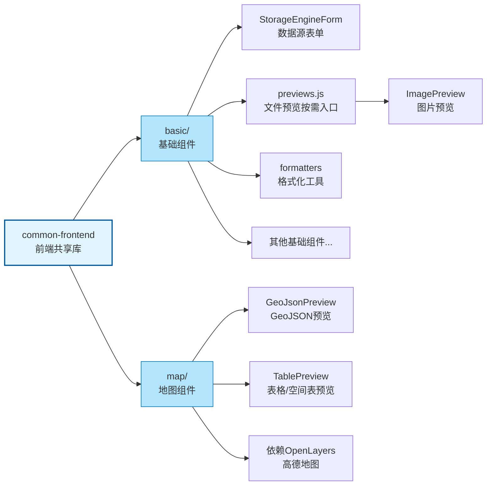

**模块划分**:
- **basic/**: 基础 UI 组件,无地图依赖；文件预览组件通过 `previews.js` 独立入口按需导入
  - `StorageEngineForm`: 数据源表单组件
  - `ImagePreview`: 图片预览组件，从 `@common-ui/previews` 导入
  - `formatters`: 数据格式化工具
  - 其他通用 UI 组件
- **map/**: 地图相关组件,依赖 OpenLayers 和高德地图
  - `GeoJsonPreview`: GeoJSON 数据预览组件
  - `TablePreview`: 表格数据预览组件，支持 Shapefile 等空间表的空间字段可视化

**使用原则**:
- 各模块通过 `npm install` 引入 common-frontend
- common-frontend 自身不能有 `node_modules`(避免依赖冲突)
- 各模块需在 `package.json` 中添加 `overrides` 强制统一 Vue 版本

---

## Worker 运行时

ADDP 平台的部分模块拥有独立的 Worker 运行时进程,用于处理异步任务和后台作业。Manager 当前没有独立 Worker；PostGIS + MVT 主路径中的瓦片缓存生成由 Manager Backend 内部的任务服务和调度器执行 `vector_tile_cache_generation`，矢量物化视图由 Manager Backend 在手动或 Orchestrator 编排触发时执行 `vector_materialized_view_generation`。若后续格式实现需要 Manager 进程内重计算、多执行器并发或独立资源隔离，应先把文档和任务运行时统一切换到 Manager Worker 或 GIS 执行引擎，再实现代码，不保留 Backend 与 Worker 双轨。

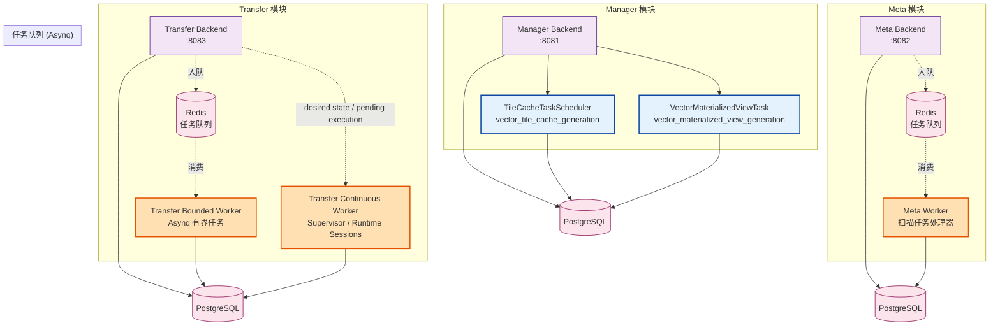

**后台运行时说明**:

| 运行时 | 所属模块 | 职责 | 技术栈 |
|--------|---------|------|-------|
| **Transfer Bounded Worker** | Transfer | 处理 snapshot 和 watermark bounded `sync` execution，handler 完成后释放 Asynq slot | Go, Asynq, Redis |
| **Transfer Continuous Worker** | Transfer | 一个进程承载多个 continuous runtime session，按 task claim lease，并在 session 内受限处理 partition | Go, DB lease, Kafka client |
| **Meta Worker** | Meta | 异步处理元数据扫描和索引任务,支持定时调度 | Go, Asynq, Redis |
| **TileCacheTaskScheduler** | Manager | 在 Manager Backend 内按 `manager.vector_tile_cache_tasks.next_run_at` 触发 `vector_tile_cache_generation`，执行记录写入 `common.task_executions` | Go, DB claim |
| **VectorMaterializedViewTask** | Manager | 在 Manager Backend 内按用户手动或 Orchestrator 编排触发执行 `vector_materialized_view_generation`，创建或刷新 Manager 管理的 3857 矢量物化视图目标 | Go, TaskProvider API |

**运行时说明**:
- **Asynq 队列**: 当前用于 Transfer、Meta 等独立 Worker 场景。
- **Continuous supervisor**: Transfer continuous worker 直接 claim pending execution 和 `transfer.runtime_leases`；同一 task 同一时刻只有一个合法 owner，不把长期 session 投递为 Asynq job。
- **CDC capture supervisor**: PostgreSQL CDC v1 契约已由工作包 3A 冻结，Infra Kafka/Kafka Connect 开发部署已由 3B 完成。后续 capture supervisor 作为 Transfer 独立捕获控制角色通过 Kafka Connect REST 管理 Debezium connector；它不嵌入 continuous worker，也不把 Infra Kafka 注册为 System Engine。
- **DB claim 调度**: Manager 瓦片缓存任务通过 `enabled + schedule + next_run_at` 轮询并 claim 到期任务；矢量物化视图当前 `supports_schedule=false`，不由 Manager 自身定时调度。
- **执行记录**: 各模块执行状态统一写入 `common.task_executions`。
- **结果状态**: Manager 瓦片缓存结果状态写入 `manager.vector_tile_cache`，矢量物化视图结果状态写入 `manager.vector_materialized_view`，不由 execution 替代。
- **未来切换条件**: 当瓦片生成或矢量物化视图构建的主要计算不再由 PostGIS 承担，或 Manager API 响应因后台生成受影响，或需要多个执行器并行消费同一类任务时，对应任务类型应切换到唯一的 Manager Worker 或 GIS 执行引擎运行时。

---

## Monitor 模块

Monitor 模块是 ADDP 平台的**统一执行监控中心**,负责监控所有模块的任务执行记录。

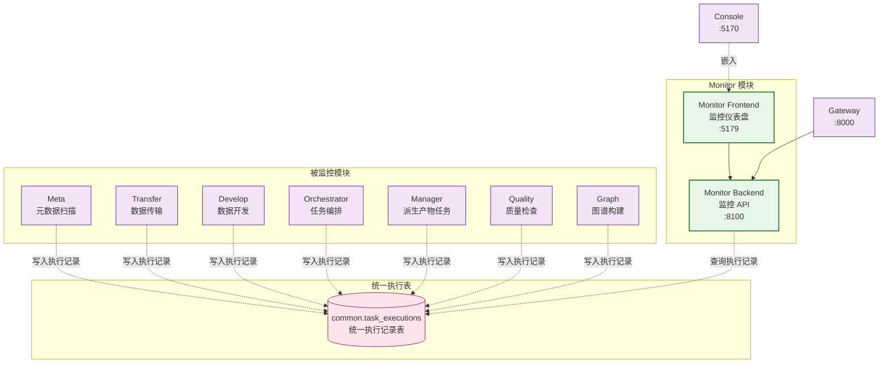

**Monitor 模块功能**:

| 功能 | 说明 |
|------|------|
| **执行记录查询** | 分页查询所有模块的任务执行记录,支持模块/状态/类型过滤 |
| **统计分析** | 计算成功率、平均执行时间、失败原因分布等统计指标 |
| **趋势分析** | 按天聚合执行数据,生成趋势图表 |
| **模块健康检查** | 检查各模块的任务执行状态,识别异常模块 |

**统一执行表 (common.task_executions)**:
- **跨模块统一**: Meta、Transfer、Develop、Orchestrator、Manager、Quality、Graph 等模块的执行记录统一存储
- **灵活字段**: 使用 JSONB 字段存储模块特有数据 (execution_config, result, error_details)
- **性能优化**: 多层索引 (租户+状态、模块+类型、时间降序、JSONB GIN)
- **来源审计**: 通过 source 记录触发来源模块，trigger_type 只表达 manual / scheduled
- **数据血缘**: 通过 module + source_task_id 关联原始任务定义

---

## Gateway 路由机制

Gateway 作为 ADDP 的统一入口，负责请求路由和转发。ADDP 采用 **动态模块注册 + 动态路由发现** 机制，支持模块的自动上线/下线和故障转移。

### 模块注册与路由发现流程

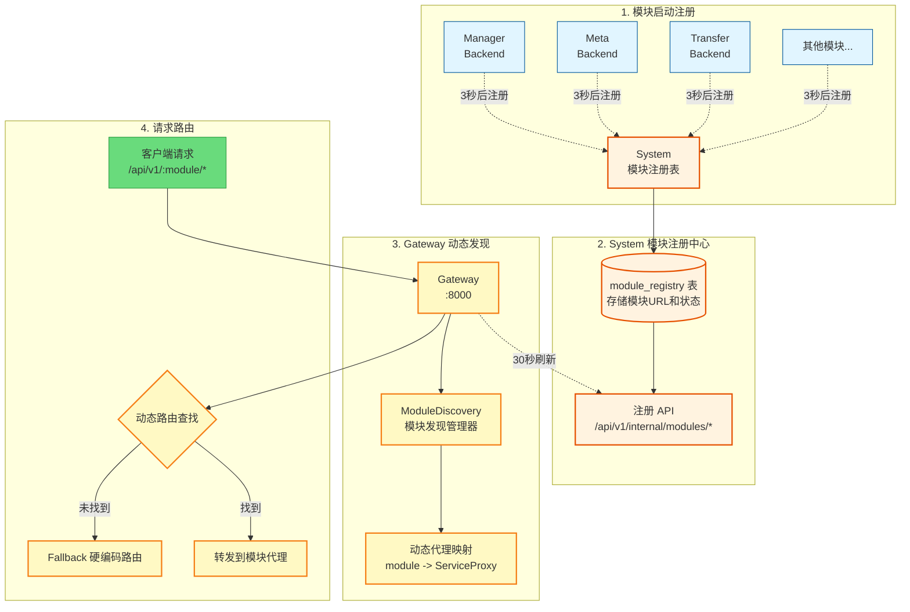

### 核心机制说明

**1. 模块自动注册**:
- 各模块启动后 **3 秒**自动向 System 模块注册表（`module_registry` 表）注册
- 注册信息包括：模块名、服务 URL、路由前缀、健康检查 URL、状态等
- 注册操作是 **幂等的**（多次注册自动更新，不会产生重复记录）

**2. 周期心跳机制**:
- 模块每 **10 秒**发送一次心跳到 System
- System 每 **60 秒**清理超过 **30 秒**未心跳的模块（标记为 `status='down'`）

**3. Gateway 动态发现**:
- Gateway 启动时从 System 获取模块列表
- 每 **30 秒**定期刷新模块列表（可配置 `MODULE_REFRESH_INTERVAL`）
- 根据模块状态（`status='up'`）自动创建/更新/删除 HTTP 代理

**4. 双层路由机制**:
- **优先**：动态路由（从模块发现获取代理）
- **备选**：硬编码路由（环境变量 `*_SERVICE_URL` 配置）
- 当模块发现失败或模块下线时，自动 Fallback 到硬编码路由

### 路由请求流程

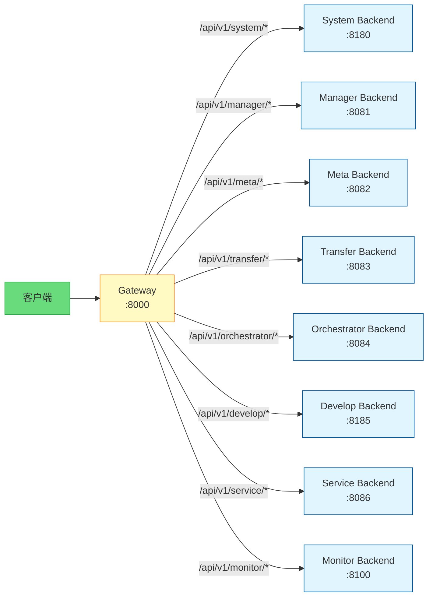

### 路由规则

| 路径前缀 | 目标服务 | 端口 | 说明 |
|---------|---------|------|------|
| `/api/v1/system/*` | System Backend | 8180 | 用户认证、引擎管理、日志 |
| `/api/v1/manager/*` | Manager Backend | 8081 | 数据管理、预览、空间快显和瓦片缓存 |
| `/api/v1/meta/*` | Meta Backend | 8082 | 元数据扫描、索引、搜索 |
| `/api/v1/transfer/*` | Transfer Backend | 8083 | 数据同步、搬运、格式转换 |
| `/api/v1/orchestrator/*` | Orchestrator Backend | 8084 | 任务编排、调度 |
| `/api/v1/develop/*` | Develop Backend | 8185 | 查询、工作流、Notebook |
| `/api/v1/service/*` | Service Backend | 8086 | 数据服务发布、OGC 标准 |
| `/api/v1/monitor/*` | Monitor Backend | 8100 | 执行监控、统计分析 |

### 配置环境变量

#### Gateway 模块配置

```bash
# 启用模块发现（推荐）
MODULE_REGISTRY_ENABLED=true                 # 启用动态路由发现
MODULE_REFRESH_INTERVAL=30s                  # 模块列表刷新间隔

# System 模块配置（用于获取注册信息）
SYSTEM_URL=http://system-backend:8180
INTERNAL_API_KEY=your_internal_api_key_here  # 服务间调用认证

# Fallback 硬编码路由（模块发现失败时使用）
MANAGER_URL=http://manager-backend:8081
META_URL=http://meta-backend:8082
# ... 其他模块
```

#### 各模块配置

```bash
# 启用与 System 集成
ENABLE_INTEGRATION=true
SYSTEM_URL=http://system-backend:8180
INTERNAL_API_KEY=your_internal_api_key_here
```

### 关键文件位置

| 组件 | 文件路径 | 说明 |
|------|---------|------|
| **System 注册表** | [system/backend/internal/models/module_registry.go](../system/backend/internal/models/module_registry.go) | 模块注册表数据模型 |
| **System API** | [system/backend/internal/api/module_registry_handler.go](../system/backend/internal/api/module_registry_handler.go) | 注册/心跳/查询 API |
| **Gateway 发现** | [gateway/internal/module_discovery.go](../gateway/internal/module_discovery.go) | 模块发现管理器（定期刷新） |
| **Gateway 路由** | [gateway/internal/router/router.go](../gateway/internal/router/router.go) | 动态路由配置 |
| **Common 客户端** | [common/client/system.go](../common/client/system.go) | 模块注册客户端（RegisterModule、SendHeartbeat） |

### 优势与特性

- ✅ **动态上线/下线**：模块启动/停止无需重启 Gateway
- ✅ **故障自动恢复**：模块重启后自动重新注册为 `up` 状态
- ✅ **健康监控**：通过心跳机制实时监控模块状态
- ✅ **双层防护**：动态路由失败时自动 Fallback 到硬编码路由
- ✅ **可观测性**：所有模块状态实时可查（`GET /api/v1/internal/modules`）

---

## ADDP 两种使用方式

ADDP 支持两种使用方式：通过 Console 控制台访问，或各模块独立部署使用。

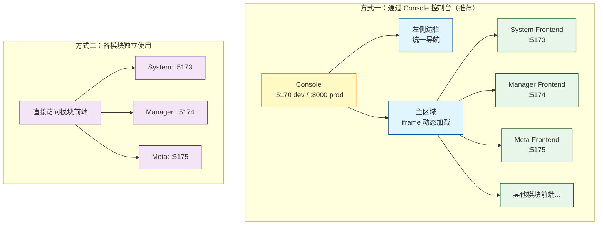

### 两种使用方式说明

**方式一：通过 Console 控制台**（推荐）：
- **单一入口**：`http://localhost:5170`（dev）或 `http://localhost:8000`（prod）
- **集成导航**：左侧边栏显示所有模块的导航菜单
- **模块加载**：主区域通过 iframe 动态加载各模块前端
- **一次登录**：访问所有模块，短期 Access Token 共享传递
- **适用场景**：生产环境，提供完整的用户体验

**方式二：各模块独立使用**：
- **直接访问**：各模块前端独立访问（如 `http://localhost:5173`）
- **独立登录**：每个模块有自己的登录页面
- **独立部署**：适合单个模块独立部署的场景
- **适用场景**：开发调试，模块独立交付

> 认证细节（iframe Token 传递、Token 刷新机制等）见：[ADDP 登录认证原理说明](addp登录认证的原理说明.md)

---

## 扩展运行时与任务编排

### 扩展运行时概述

位于 `engines/` 目录，ADDP 平台提供若干内置扩展运行时作为示例和默认部署选择；用户也可以按扩展引擎规范注册自研运行时：

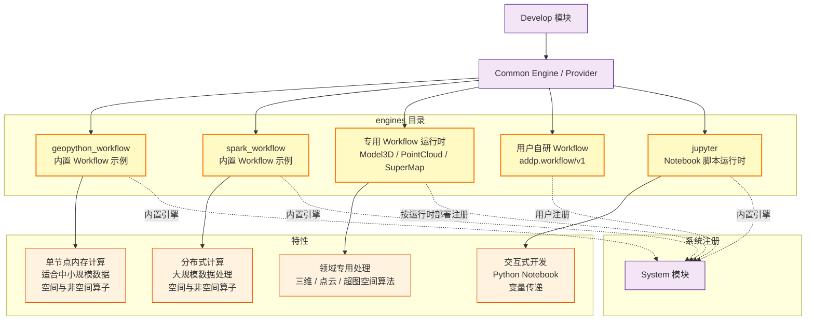

**运行时示例**：

| 引擎 | 类型 | 适用场景 | 主要能力 |
|------|------|---------|---------|
| **geopython_workflow** | 工作流运行时 | 数据量 < 100 万行 | 快速执行，空间与非空间算子 |
| **spark_workflow** | 工作流运行时 | 数据量 > 100 万行 | 大规模数据处理，空间与非空间算子；执行时绑定 `engine_type=spark` 的通用引擎资源 |
| **model3d_workflow** | 工作流运行时 | 三维模型、BIM 和 3DGS 快显 | GLB、3D Tiles、KSplat 等领域转换算子 |
| **pointcloud_workflow** | 工作流运行时 | 点云快显 | LAS / LAZ / E57 / PCD / XYZ 到 COPC 转换算子 |
| **supermap_workflow** | 工作流运行时 | 超图数据格式与空间分析 | SuperMap iObjects Java / SPS 算子和 DAG 内存对象传递 |
| **math_workflow** | 工作流运行时参考实现 | 学习与扩展规范示例 | 基础数学算子；开发环境自动启动服务，手动注册后可用 |
| **jupyter** | 脚本运行时 | Notebook 开发 | Python Notebook，变量传递 |

**注册机制**：
- 生产内置运行时可以启动时自注册为**内置引擎** (`is_builtin = true`)；参考实现或需要外部 SDK 绑定的运行时可以通过 System 扩展引擎表单手动注册。
- 用户自研扩展运行时按同一张 System 引擎注册表管理，不要求某个内置工作流运行时必然存在。
- 调用方只发现已注册、启用且声明对应能力的运行时实例；工作流算子通过 `addp.workflow/v1` 动态发现。

---

### 扩展运行时与任务编排的架构关系

#### 一、扩展运行时层：System 注册 → Common Provider 调用

System 是扩展运行时的**注册中心**。Develop 负责编排和执行工作流；其他业务模块如需 direct 算子能力，也必须通过 Common Engine / Provider 按已注册运行时实例调用，不得直接假设某个内置工作流引擎存在。

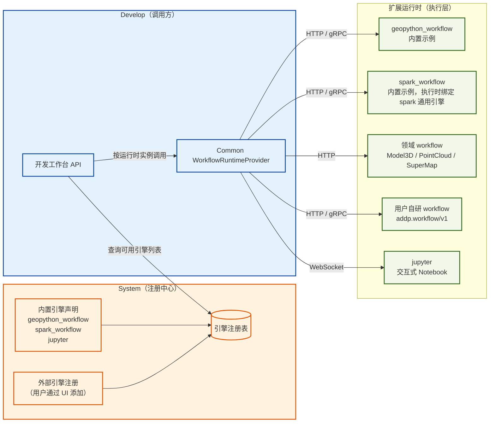

**要点**：
- System 仅维护引擎元数据（连接信息、类型、状态），不参与执行
- Develop 运行时从 System 查询引擎配置，按用户选择路由到对应运行时
- 扩展运行时是纯执行层，无任务定义概念，只接受并执行代码/作业

---

#### 二、任务编排层：各模块向 System 注册 → Orchestrator 编排

各业务模块向 System 注册自己提供的 **TaskProvider capabilities**，Orchestrator 读取注册表后动态调用。

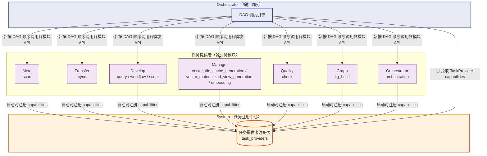

**要点**：
- 各模块启动时向 System 注册 TaskProvider capabilities（任务类型、定义 schema、执行 schema、owner 前端入口和标准 API endpoint）
- Orchestrator 不硬编码对任何模块的依赖，完全由注册信息驱动
- DAG 步骤只能引用 owner 模块已保存的任务定义，通过 `provider + task_type + task_id` 调用标准 TaskProvider API

---

#### 三、两层之间的关联：System 注册表与 Common 调用路径

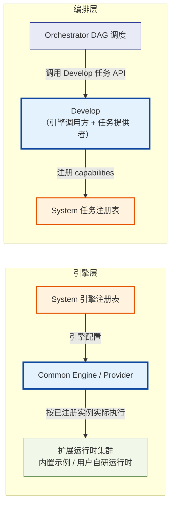

**Develop 在两层中扮演不同角色**：
- 对**引擎层**：是工作流编排和执行的主要消费者，从 System 获取引擎配置，经 Common Engine / Provider 向扩展运行时派发执行任务；其他业务模块如需 direct 算子，也走同一 Provider 主路径
- 对**编排层**：是提供者，将自身能力封装为 `query` / `workflow` / `script` 三类可编排任务类型注册到 System，供 Orchestrator 调度；Notebook 是 `script` 的当前 UI 和运行时形态，不作为独立 `task_type`

这意味着一个复杂的数据处理流水线可以是：
> Transfer 导入数据 → Develop 执行 SQL/Python 加工 → Meta 更新元数据 → Manager 刷新目录
>
> 全部由 Orchestrator 统一编排，其中 Develop 步骤内部再调用扩展运行时执行。

---

## 模块启动顺序

ADDP 平台各模块存在依赖关系，必须按以下顺序启动：

```
1. 基础设施层（必须最先就绪）
   ├─ PostgreSQL
   ├─ Redis
   ├─ MinIO
   └─ Meilisearch

2. 核心系统层
   └─ System Backend（认证中心、模块注册中心、引擎注册表）

3. Go 业务模块层（可并行启动）
   ├─ Manager Backend
   ├─ Meta Backend + Worker
   ├─ Transfer Backend + Worker
   ├─ Orchestrator Backend
   ├─ Develop Backend
   ├─ Service Backend
   └─ Monitor Backend

4. 扩展运行时层（可并行启动）
   ├─ GeoPython Workflow 运行时
   ├─ Math Workflow 参考运行时（自动启动服务、手动注册）
   ├─ Spark Workflow 运行时
   └─ Jupyter 脚本运行时

5. Copilot（Python 应用层，独立启动）
   └─ Copilot Backend（启动时仅向 System 注册，运行时才调用 Meta/Develop）

6. 网关层
   └─ Gateway（从 System 获取已注册的模块路由信息，建立动态路由）

7. 前端层（可并行启动）
   ├─ Console Frontend
   ├─ System Frontend
   ├─ Manager Frontend
   ├─ Meta Frontend
   ├─ Transfer Frontend
   ├─ Orchestrator Frontend
   ├─ Develop Frontend
   ├─ Service Frontend
   └─ Monitor Frontend
```

**关键顺序约束说明**：

| 约束 | 说明 |
|------|------|
| **System → Go 业务模块** | 业务模块依赖 System 提供的认证和注册服务 |
| **Go 业务模块 → Gateway** | 业务模块启动后 3 秒自动向 System 注册；Gateway 启动时从 System 获取已注册模块列表建立路由，必须在业务模块之后启动 |
| **Copilot 独立于 Go 业务模块层** | Copilot 是 Python 应用服务，语言运行时与 Go 模块不同，不适合混入 Go 三段式（编译→启动→健康检查）流程；但启动时依赖相同（仅 System），运行时才调用 Meta/Develop |
| **前端无严格顺序约束** | Console 通过 iframe 动态加载各模块前端（用户访问时才加载），各前端可完全并行启动 |

---

## 相关文档

- [ADDP 各模块简要介绍](addp各模块功能介绍.md)
- [ADDP 核心概念关系图](addp核心概念关系图.md)
- [ADDP 登录认证原理说明](addp登录认证的原理说明.md)
- [ADDP 开发原则](../spec/addp开发原则.md)
- [ADDP 共享模块介绍](addp共享模块介绍.md)
- [ADDP 新模块开发指南](../spec/addp新模块开发指南.md)
- [Monitor 模块实施报告](../monitor/docs/Monitor模块实施报告.md)

---

**文档版本**: v1.1
**创建日期**: 2026-02-16
**更新日期**: 2026-02-16
**作者**: ADDP 开发团队
