# ADDP 模块架构图

本文档使用可视化图表展示 ADDP 平台的模块组成、层次关系和依赖关系。

---

## 目录

1. [模块总览](#模块总览)
2. [模块详细说明](#模块详细说明)
3. [共享模块](#共享模块)
4. [Worker 运行时](#worker-运行时)
5. [Monitor 模块](#monitor-模块)
6. [Gateway 路由机制](#gateway-路由机制)
7. [ADDP 两种使用方式](#addp-两种使用方式)
8. [扩展运行时与任务编排](#扩展运行时与任务编排)
9. [模块启动顺序](#模块启动顺序)

---

## 模块总览

ADDP 平台采用微服务架构,由以下模块组成:

```mermaid
graph TB
    subgraph "前端层"
        Console[Console<br/>控制台<br/>:5170]
        SystemFE[System Frontend<br/>:5173]
        ManagerFE[Manager Frontend<br/>:5174]
        MetaFE[Meta Frontend<br/>:5175]
        CatalogFE[Catalog Frontend<br/>:5189]
        WorkbenchFE[Workbench Frontend<br/>:5190]
        SecurityFE[Security Frontend<br/>:5191]
        TransferFE[Transfer Frontend<br/>:5176]
        OrchestratorFE[Orchestrator Frontend<br/>:5177]
        DevelopFE[Develop Frontend<br/>:5178]
        ServiceFE[Service Frontend<br/>:5179]
        MonitorFE[Monitor Frontend<br/>:5179]
        InferenceFE[Inference Frontend<br/>:5188]
        StandardFE[Standard Frontend<br/>:5181]
        ModelFE[Model Frontend<br/>:5182]
        AssetFE[Asset Frontend<br/>:5184]
        PortalFE[Portal Frontend<br/>:5185]
    end

    subgraph "网关层"
        Gateway[Gateway<br/>API网关<br/>:8000]
    end

    subgraph "服务层"
        System[System Backend<br/>核心系统<br/>:8180]
        Manager[Manager Backend<br/>数据管理<br/>:8081]
        Meta[Meta Backend<br/>元数据服务<br/>:8082]
        Catalog[Catalog Backend<br/>企业资源目录<br/>:8192]
        Workbench[Workbench Backend<br/>服务消费工作台<br/>:8193]
        Security[Security Backend<br/>数据安全<br/>:8194]
        Transfer[Transfer Backend<br/>数据传输<br/>:8083]
        Orchestrator[Orchestrator Backend<br/>任务编排<br/>:8084]
        Develop[Develop Backend<br/>数据开发<br/>:8185]
        Service[Service Backend<br/>数据服务<br/>:8086]
        Monitor[Monitor Backend<br/>执行监控<br/>:8100]
        Quality[Quality Backend<br/>数据质量<br/>:8182]
        Inference[Inference Backend<br/>统一 AI 推理<br/>:8191]
        Standard[Standard Backend<br/>数据标准<br/>:8110]
        Model[Model Backend<br/>数据建模<br/>:8181]
        Asset[Asset Backend<br/>数据资产<br/>:8183]
        Portal[Portal Backend<br/>资产门户 BFF<br/>:8184]
    end

    subgraph "Worker运行时"
        TransferBoundedWorker[Transfer Bounded Worker<br/>PostgreSQL Claim]
        TransferContinuousWorker[Transfer Continuous Worker<br/>Supervisor / Runtime Sessions]
        MetaWorker[Meta Worker<br/>扫描任务处理]
        QualityWorker[Quality Worker<br/>独立进程 / PostgreSQL Claim]
        SecurityWorker[Security Worker<br/>敏感发现 / PostgreSQL Claim]
    end

    subgraph "共享模块"
        Common[common<br/>后端共享库]
        CommonFE[common-frontend<br/>前端共享库]
    end

    subgraph "扩展运行时"
        PyWorkflow[geopython_workflow<br/>内置 Workflow 示例]
        SparkWorkflow[spark_workflow<br/>内置 Workflow 示例]
        CustomWorkflow[用户自研 Workflow<br/>addp.workflow/v1]
        Jupyter[jupyter<br/>Notebook 脚本运行时]
    end

    subgraph "基础设施层"
        PostgreSQL[(PostgreSQL<br/>系统数据库<br/>:15432)]
        Redis[(Redis<br/>缓存/事件<br/>:16379)]
        MinIO[(MinIO<br/>对象存储<br/>:19000)]
        Meilisearch[(Meilisearch<br/>全文搜索<br/>:17700)]
        InfraKafka[(Infra Kafka<br/>KRaft<br/>:19092)]
        KafkaConnect[Kafka Connect<br/>Debezium<br/>:18083]
    end

    Console --> Gateway
    SystemFE -.-> Console
    ManagerFE -.-> Console
    MetaFE -.-> Console
    CatalogFE -.-> Console
    WorkbenchFE -.-> Console
    SecurityFE -.-> Console
    TransferFE -.-> Console
    OrchestratorFE -.-> Console
    DevelopFE -.-> Console
    ServiceFE -.-> Console
    MonitorFE -.-> Console
    InferenceFE -.-> Console
    StandardFE -.-> Console
    ModelFE -.-> Console
    AssetFE -.-> Console
    PortalFE -.-> Console

    Gateway --> System
    Gateway --> Manager
    Gateway --> Meta
    Gateway --> Catalog
    Gateway --> Workbench
    Gateway --> Security
    Gateway --> Transfer
    Gateway --> Orchestrator
    Gateway --> Develop
    Gateway --> Service
    Gateway --> Monitor
    Gateway --> Quality
    Gateway --> Inference
    Gateway --> Standard
    Gateway --> Model
    Gateway --> Asset
    Gateway --> Portal

    System --> Common
    Manager --> Common
    Meta --> Common
    Catalog --> Common
    Workbench --> Common
    Security --> Common
    Transfer --> Common
    Orchestrator --> Common
    Develop --> Common
    Service --> Common
    Monitor --> Common
    Quality --> Common
    Inference --> Common
    Standard --> Common
    Model --> Common
    Asset --> Common
    Portal --> Common

    Meta -. DataItem 可恢复变化 .-> Catalog
    Meta -. 已显式纳管目标的精确技术事实 .-> Security
    Standard -. 语义对象公开读取 .-> Catalog
    Standard -. 已发布语义修订 .-> Model
    Standard -. 已发布语义修订 .-> Quality
    Model -. Entity 与 LogicalTable 专业资源 .-> Catalog
    Catalog -. 字段或组件标准映射 .-> Quality
    Quality -. 符合性聚合 .-> Standard
    Security -. 当前用户权限下的安全专业事实 .-> CatalogFE
    Security -. 保护投影变化 .-> Manager
    Security -. 保护投影变化 .-> Transfer
    Security -. 保护投影变化 .-> Develop
    Security -. 保护投影变化 .-> Service
    Catalog -. 目录摘要与导航 .-> Manager
    Catalog -. 目录对象选择 .-> Asset
    Asset -. 已发布资产 .-> Portal
    Service -. Consumer Descriptor 与在线查询 .-> Workbench

    SystemFE --> CommonFE
    ManagerFE --> CommonFE
    MetaFE --> CommonFE
    CatalogFE --> CommonFE
    WorkbenchFE --> CommonFE
    SecurityFE --> CommonFE
    TransferFE --> CommonFE
    OrchestratorFE --> CommonFE
    DevelopFE --> CommonFE
    ServiceFE --> CommonFE
    InferenceFE --> CommonFE
    StandardFE --> CommonFE
    ModelFE --> CommonFE
    AssetFE --> CommonFE
    PortalFE --> CommonFE

    Common --> PostgreSQL
    Common --> Redis
    Common --> MinIO
    Common --> Meilisearch
    KafkaConnect --> InfraKafka

    Transfer --> TransferBoundedWorker
    Transfer -.-> TransferContinuousWorker
    Meta --> MetaWorker
    Quality --> QualityWorker
    Security --> SecurityWorker
    TransferBoundedWorker --> PostgreSQL
    TransferContinuousWorker --> PostgreSQL
    MetaWorker --> PostgreSQL
    QualityWorker --> PostgreSQL
    SecurityWorker --> PostgreSQL

    Develop --> Common
    Common --> PyWorkflow
    Common --> SparkWorkflow
    Common --> CustomWorkflow
    Common --> Jupyter

    classDef frontend fill:#e1f5ff,stroke:#01579b
    classDef gateway fill:#fff3e0,stroke:#e65100
    classDef backend fill:#f3e5f5,stroke:#4a148c
    classDef worker fill:#ffe0b2,stroke:#e65100
    classDef shared fill:#e8f5e9,stroke:#1b5e20
    classDef engine fill:#fff9c4,stroke:#f57f17
    classDef infra fill:#fce4ec,stroke:#880e4f

    class Console,SystemFE,ManagerFE,MetaFE,CatalogFE,WorkbenchFE,SecurityFE,TransferFE,OrchestratorFE,DevelopFE,ServiceFE,MonitorFE,InferenceFE,StandardFE,ModelFE,AssetFE,PortalFE frontend
    class Gateway gateway
    class System,Manager,Meta,Catalog,Workbench,Security,Transfer,Orchestrator,Develop,Service,Monitor,Quality,Inference,Standard,Model,Asset,Portal backend
    class TransferBoundedWorker,TransferContinuousWorker,MetaWorker,QualityWorker,SecurityWorker worker
    class Common,CommonFE shared
    class PyWorkflow,SparkWorkflow,CustomWorkflow,Jupyter engine
    class PostgreSQL,Redis,MinIO,Meilisearch,InfraKafka,KafkaConnect infra
```

**说明**:
- **前端层**: 各模块的独立前端应用,Console 通过 iframe 集成所有模块前端
- **网关层**: Gateway 统一处理外部请求并路由到对应的后端服务
- **服务层**: 各业务模块的后端服务,提供 RESTful API
- **业务模块边界**: Transfer、Develop、Model、Quality 等是对等 owner，默认只向下依赖 System、Meta、Common 和 Engine Provider。跨 owner 协作优先由 Orchestrator 连接 TaskProvider 稳定输出与必填运行时输入，数据资源使用 ResourceLocator 交接；引入 Common Client 只解决传输实现重复，不会消除 owner-specific ID、API 或生命周期造成的语义依赖。任务定义非必要不得保存其他业务 owner 的专有 ID。
- **企业目录主线**: Meta 维护 DataItem 技术事实并提供可恢复变化；Catalog 建立企业目录身份、业务语义关联、责任和搜索；Asset 从 Catalog 选择并组合目录对象；Portal 只消费已发布资产。图中的虚线业务调用都是运行软依赖，不构成启动或 Ready 条件。
- **数据标准主线**: Standard 拥有业务域、术语、数据元、码值集、单位、指标定义和标准来源文档等语义契约；Model 拥有逻辑模型、公共/一致性维度、维度层级和指标实现，并冻结采用的 Standard 修订；Catalog 拥有实际字段/组件到标准修订的映射；Quality 拥有规则应用、执行、符合性结果和问题。Standard 可以聚合展示落标与符合性，但不复制后三者的事实。
- **数据安全主线**: Security 与 Catalog 并行消费 Meta 事实，但只精确读取已显式纳管目标；Security 编译 Owner-specific 保护投影，Manager、Transfer、Develop 和 Service 后台拉取后在本模块服务端出口执行。Catalog 只联邦展示 Security 专业事实，不是安全发现或保护生效的前置。
- **Worker运行时**: bounded execution 数据面使用 owner 模块附属的独立进程；owner Backend 只承担 API、调度和控制面。
  - **Transfer Bounded Worker**: 从 `common.task_executions` PostgreSQL claim snapshot、watermark 和 bounded replay execution。
  - **Transfer Continuous Worker**: 已实现的独立长驻进程角色，通过 supervisor、DB lease、heartbeat 和 fencing 承载多个 continuous runtime session；不使用 Asynq 承载无限消费循环。当前数据面开放业务 Kafka keyed JSON -> PostgreSQL/MySQL，以及 PostgreSQL/MySQL/Oracle 单表 Debezium CDC -> PostgreSQL/MySQL/Oracle；Oracle Spatial 由 Oracle capture Provider 在源 schema 内维护 WKB 镜像表后进入同一 Debezium/consumer/apply 主路径，Oracle target 只开放 XY geometry。两类 source 共用同一 continuous runtime、position、lease 和 fencing；ArcGIS SDE 仍保留为后续独立逻辑变化源 Provider，不能并入普通 Oracle redo CDC。
  - **Meta Worker**: 从 `common.task_executions` PostgreSQL claim 扫描 execution，执行元数据扫描和索引。
  - **Quality Worker**: 独立进程，从 `common.task_executions` PostgreSQL claim `check|materialization_gate` execution；字段检查执行评分和 Issue reconcile，物化门禁通过 Model Client 读取同批 staging 并执行强类型断言。
  - **Security Worker**: 独立进程，只领取 Security 对显式纳管目标创建的 `sensitive_data_discovery` execution，读取必要专业事实和受控样本并生成 Finding；不全量遍历 Meta，不提供通用数据代理。
- **Manager 快显与瓦片任务**: `vector_tile_cache_generation` 与 `vector_tile_set_generation` 由 Manager Backend 按源能力选择唯一执行路径：PostgreSQL/PostGIS 表使用原生 `ST_AsMVT`，MySQL、Oracle 等标准 EWKB 可读的空间表流式物化临时 FlatGeobuf 后调用 GeoPython `vector_to_pmtiles`，文件或对象通过受控访问计划调用同一 operator；三类路径统一输出 PMTiles v3。任务定义、执行记录和缓存结果分别进入 Manager owner 表、`common.task_executions` 与 `manager.vector_tile_cache`。`vector_materialized_view_generation` 仍由 Manager Backend 在手动或编排触发时执行，结果进入 `manager.vector_materialized_view`。这些任务当前不启动模块自身定时调度；若需要多执行器横向扩展或独立 GIS 资源隔离，应将对应任务类型整体切换为唯一的 Manager Worker 或 GIS 执行引擎，不允许 Backend 与 Worker 双轨并存。
- **共享模块**: common 和 common-frontend 提供可复用的代码和组件
- **扩展运行时**: `engines/` 目录集中放置不拥有业务配置事实的独立计算 / Notebook Runtime 实现，由业务模块通过统一 Provider 调用。Inference 同时拥有 Provider、Deployment、Profile、凭据和配置管理入口，因此保留为根目录业务模块；其数据面端点另以 `inference_runtime` Engine Instance 纳入统一引擎体系，不在 `engines/` 下复制 owner 实现。
- **基础设施层**: 共享的数据库、缓存、对象存储、搜索引擎，以及 PostgreSQL/MySQL/Oracle CDC 使用的 Infra Kafka/Kafka Connect。Infra Kafka、Connect 和 Transfer capture supervisor 已开放；Infra Kafka 不注册为 System Engine，也不进入用户任务配置。

---

## 模块详细说明

| 模块 | 职责 | 端口 (开发/生产) | 主要技术栈 |
|------|------|-----------------|-----------|
| **Console** | 控制台入口,集成所有模块功能 | 5170 / 80 | Vue 3, Vue Router |
| **System** | 核心系统服务:用户认证、引擎管理、日志 | 8180 / 8180 | Go, Gin, GORM, opaque Token |
| **Gateway** | API 网关,请求路由和转发 | 8000 / 8000 | Go, Gin |
| **Manager** | 数据管理:数据存储目录展示、数据预览、空间快显和瓦片缓存 | 8081 / 8081 | Go, Gin, OpenLayers |
| **Meta** | 元数据服务:扫描、索引、搜索 | 8082 / 8082 | Go, Gin, Meilisearch, Cron |
| **Catalog** | 企业资源目录：稳定目录身份、来源绑定、业务语义关联、责任、治理和企业元数据搜索 | 8192 / 8192 | Go, Gin, GORM, Meilisearch |
| **Workbench** | 数据应用工作台：直接把已发布数据服务配置为 Data Application Component，支持动态参数、结构化查询、参数绑定、选择联动、桌面与大屏展示、大屏前台刷新、不可变发布修订和最终运行 | 8193 / 8193 | Go, Gin, GORM, Vue 3 |
| **Security** | 数据安全：敏感类型、安全分类分级、显式纳管、敏感发现、资源评估、保护策略与 Owner-specific 保护投影 | 8194 / 8194 | Go, Gin, GORM, Vue 3 |
| **Security Worker** | 已纳管资源的有界敏感数据发现执行器 | - | Go, PostgreSQL claim/lease |
| **Meta Worker** | Meta 扫描任务处理器 | - | Go, PostgreSQL claim/lease |
| **Transfer** | 数据传输:同步、搬运、格式转换任务 | 8083 / 8083 | Go, Gin, GORM |
| **Transfer Bounded Worker** | Transfer 有界任务处理器 | - | Go, PostgreSQL claim/lease |
| **Transfer Continuous Worker** | Transfer 持续任务处理器 | - | Go, DB lease, Kafka client |
| **Orchestrator** | 任务编排:跨模块任务编排调度 | 8084 / 8084 | Go, Gin, Cron |
| **Develop** | 数据开发:查询执行、工作流、Notebook 开发 | 8185 / 8185 | Go, Gin, Monaco Editor |
| **Service** | 数据服务:服务发布(空间OGC标准与非空间)、外部服务注册 | 8086 / 8086 | Go, Gin, OGC 标准 |
| **Monitor** | 执行监控:统一监控所有模块的任务执行记录、统计分析 | 8100 / 8100 | Go, Gin, PostgreSQL |
| **Model** | 数据建模：业务实体、逻辑模型、模型关系、公共/一致性维度、维度层级和指标实现；冻结采用的 Standard 修订 | 8181 / 8181 | Go, Gin, GORM, Vue 3 |
| **Quality** | 数据质量：基于确定资源、组件和标准修订管理规则应用、检查任务、符合性结果、质量评分和问题治理 | 8182 / 8182 | Go, Gin, GORM |
| **Quality Worker** | Quality 有界字段检查与物化门禁执行器，独立进程 | - | Go, PostgreSQL claim/lease |
| **Standard** | 数据标准：业务域、术语、数据元、码值集、单位、指标定义和来源文档等可复用业务语义契约；不拥有维度层级、字段映射或质量执行事实 | 8110 / 8110 | Go, Gin, GORM |
| **Asset** | 数据资产：目录对象组合、发布、申请、授权、评价和运营 | 8183 / 8183 | Go, Gin, GORM, Meilisearch |
| **Portal** | 面向消费者的已发布资产门户 BFF | 8184 / 8184 | Go, Gin, GORM |
| **Inference** | 统一 AI 推理：Provider Connection、Model Deployment、Model Profile、加密凭据和推理数据面 | 8191 / 8191 | Go, Gin, GORM |
| **Copilot** | AI 辅助助手：输入资源解析与确认、查询/工作流/Notebook/Transfer 领域生成、导航和图谱抽取 | 8087 / 8087 | Python, FastAPI, LangChain |


---

## 共享模块

### common (后端共享库)

位于 `common/` 目录,所有后端服务依赖的共享代码:

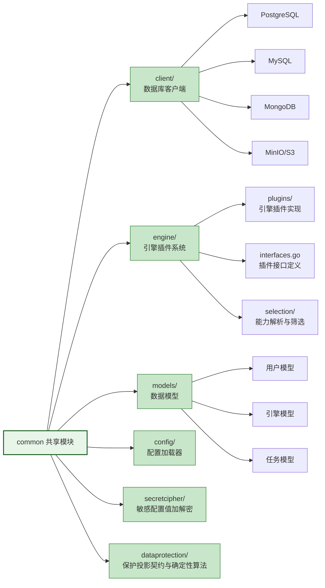

**主要内容**:
- **client/**: 数据库客户端(PostgreSQL、MySQL、MongoDB、MinIO 等)
- **engine/**: 引擎插件系统(接口定义、插件实现、自动注册)
- **models/**: 通用数据模型(用户、引擎、任务等)
- **config/**: 根环境部署配置、服务地址、端口检查和时区
- **secretcipher/**: 密码、Token、Webhook Secret 等敏感配置值的 AES-256-GCM 加解密；不承载 Security 业务事实
- **dataprotection/**: 跨 Owner 共享的保护投影 v1 契约、路径定位、校验和确定性遮盖 / 抑制算法；不读写 Security 数据库，不做业务决策

### common-frontend (前端共享库)

位于 `common-frontend/` 目录,前端模块复用的组件和工具:

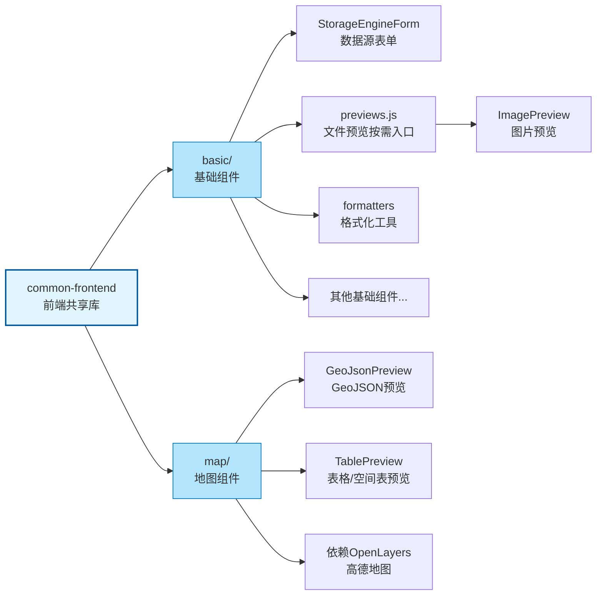

**模块划分**:
- **basic/**: 基础 UI 组件,无地图依赖；文件预览组件通过 `previews.js` 独立入口按需导入
  - `StorageEngineForm`: 数据源表单组件
  - `ImagePreview`: 图片预览组件，从 `@common-ui/previews` 导入
  - `formatters`: 数据格式化工具
  - 其他通用 UI 组件
- **map/**: 地图相关组件,依赖 OpenLayers 和高德地图
  - `GeoJsonPreview`: GeoJSON 数据预览组件
  - `TablePreview`: 表格数据预览组件，支持 Shapefile 等空间表的空间字段可视化

**使用原则**:
- 各模块通过 `npm install` 引入 common-frontend
- common-frontend 自身不能有 `node_modules`(避免依赖冲突)
- 各模块需在 `package.json` 中添加 `overrides` 强制统一 Vue 版本

---

## Worker 运行时

ADDP 的 execution worker 是执行 owner 的运行时角色。Quality、Meta、Transfer bounded 和 Manager 文档转换使用各模块附属的独立 Worker 进程，Transfer continuous 使用专用长期运行时 Worker；对应 Backend 只承担控制面。Manager 的 `pptx_pdf_generation` 由唯一的 `manager-worker` 通过 PostgreSQL claim / lease 执行，LibreOffice 只存在于该 Worker 的运行镜像；Manager Backend 不加载 LibreOffice，也不得保留进程内转换旁路。PostgreSQL/PostGIS 原生 MVT、MySQL/Oracle 临时 FlatGeobuf 到 GeoPython PMTiles、文件或对象到 GeoPython PMTiles，以及矢量物化视图仍按各自既有唯一执行路线运行。Manager 受管当前结果任务不启动 owner scheduler；Embedding 的逐 item 调度器独立保留。后续格式若需要独立资源隔离，应先确定唯一的 Manager Worker 或专业执行引擎，再实现代码，不保留 Backend 与 Worker 双轨。

### 模块启动与引擎可用性边界

- 零个 Engine Instance 是平台合法状态。任何模块 Backend、附属 Worker 的进程启动和 readiness 都不得要求某个 Engine Instance 已登记、处于 active 或在线，也不得因为内置 Engine Runtime 缺失而失败。
- 模块可以依赖自身必需的 Infra，例如 owner PostgreSQL schema、执行队列使用的 PostgreSQL、Redis、MinIO、Meilisearch 或 Infra Kafka。Infra 是部署基础设施，不属于 Engine Instance 启动解耦范围；必需 Infra 不可用时，模块可以启动失败或保持 not ready。
- Engine Plugin 的静态注册表完整性属于进程代码完整性，不等同于 Engine Instance 存在。独立 Engine Runtime 的内部依赖只约束该 Runtime 自身，不得反向成为 System 或业务模块的启动条件。
- Backend 在具体 API 调用需要引擎时才解析 Engine Instance；缺失或离线只失败当前请求。Worker 必须能够在零引擎状态下空闲运行，并在领取到引用缺失或离线引擎的 execution 时只失败该 execution，进程继续处理后续任务。
- 引擎连接巡检、实例能力刷新和 Runtime 自注册只能在 HTTP 服务就绪后异步执行，并按 Engine Instance 隔离失败；不得进入模块启动关键路径。

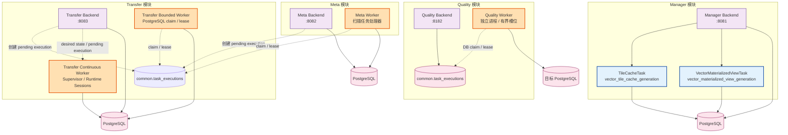

**后台运行时说明**:

| 运行时 | 所属模块 | 职责 | 技术栈 |
|--------|---------|------|-------|
| **Transfer Bounded Worker** | Transfer | PostgreSQL claim snapshot、watermark 和 bounded replay execution，持有 execution lease 后执行 | Go, PostgreSQL claim/lease |
| **Transfer Continuous Worker** | Transfer | 一个进程承载多个 continuous runtime session，按 task claim lease，并在 session 内受限处理 partition | Go, DB lease, Kafka client |
| **Meta Worker** | Meta | PostgreSQL claim 扫描 execution，处理元数据扫描和索引；定时调度留在 Backend | Go, PostgreSQL claim/lease |
| **Quality Worker** | Quality | 独立进程领取已授权 `pending` `check|materialization_gate` execution，执行字段规则或物化断言 | Go, PostgreSQL claim/lease, Model Client |
| **TileCacheTask** | Manager | 在 Manager Backend 内按手动请求或 Orchestrator 编排触发 `vector_tile_cache_generation`，执行记录写入 `common.task_executions` | Go, TaskProvider API |
| **VectorMaterializedViewTask** | Manager | 在 Manager Backend 内按用户手动或 Orchestrator 编排触发执行 `vector_materialized_view_generation`，创建或刷新 Manager 管理的 3857 矢量物化视图目标 | Go, TaskProvider API |

**运行时说明**:
- **Bounded execution queue**: Quality、Meta、Transfer bounded 统一以 `common.task_executions` PostgreSQL claim 为唯一领取路线，不使用 Redis/Asynq 或进程内 channel。
- **Continuous supervisor**: Transfer continuous worker 直接 claim pending execution 和 `transfer.runtime_leases`；同一 task 同一时刻只有一个合法 owner，不把长期 session 投递为 Asynq job。
- **Quality DB claim**: 独立 `quality-worker` 从 `common.task_executions` 领取已授权 `pending` `check|materialization_gate` execution；每个实例使用有界槽位，多实例通过 `SKIP LOCKED`、attempt 与 `lease_token` 协调。
- **CDC capture supervisor**: Transfer 已实现唯一 capture control plane，通过 Kafka Connect REST 管理 PostgreSQL/MySQL Debezium connector，并负责 generation、provider 专属捕获资源、内部 topic/group/ACL 的任务级生命周期；它不嵌入 continuous worker，也不把 Infra Kafka 注册为 System Engine。
- **Manager 受管结果调度边界**: 瓦片缓存、矢量物化视图等受管当前结果任务均为 `supports_schedule=false`，不由 Manager 自身定时调度；周期性刷新由 Orchestrator 显式携带本次覆盖确认触发。Embedding 的逐 item owner scheduler 独立保留。
- **执行记录**: 各模块执行状态统一写入 `common.task_executions`。
- **角色边界**: owner scheduler 负责创建和投递 execution，execution worker 负责真实运行体与终态，Monitor dispatcher 只消费通知 outbox；固定 cleanup、collector 和 heartbeat 属于 maintenance loop，不应统称 worker。
- **单一路线**: 同一 task type 只能有一条正式执行路线。Quality `check|materialization_gate`、Meta scan、Transfer bounded 和 Orchestrator 来源 Develop query 的正式路线均是独立 Worker + PostgreSQL claim；Backend 不执行 bounded 业务逻辑。
- **结果状态**: Manager 瓦片缓存结果状态写入 `manager.vector_tile_cache`，矢量物化视图结果状态写入 `manager.vector_materialized_view`，不由 execution 替代。
- **未来切换条件**: 当 Manager API 响应因后台生成受影响、临时材料与 GeoPython 调用需要独立资源隔离，或需要多个执行器并行消费同一类任务时，对应任务类型应切换到唯一的 Manager Worker 或 GIS 执行引擎运行时。

---

## Monitor 模块

Monitor 模块是 ADDP 平台的**统一执行监控中心**,负责监控所有模块的任务执行记录。

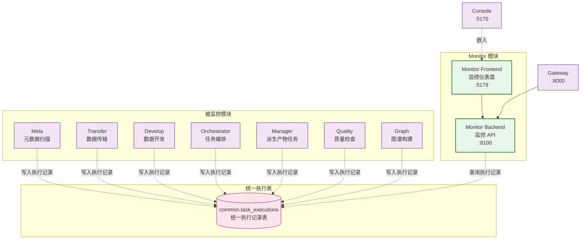

**Monitor 模块功能**:

| 功能 | 说明 |
|------|------|
| **执行记录查询** | 分页查询所有模块的任务执行记录,支持模块/状态/类型过滤 |
| **统计分析** | 计算成功率、平均执行时间、失败原因分布等统计指标 |
| **趋势分析** | 按天聚合执行数据,生成趋势图表 |
| **模块健康检查** | 检查各模块的任务执行状态,识别异常模块 |

**统一执行表 (common.task_executions)**:
- **跨模块统一**: Meta、Transfer、Develop、Orchestrator、Manager、Quality、Graph 等模块的执行记录统一存储
- **灵活字段**: 使用 JSONB 字段存储模块特有数据 (execution_config, result, error_details)
- **性能优化**: 多层索引 (租户+状态、模块+类型、时间降序、JSONB GIN)
- **来源审计**: 通过 source 记录触发来源模块，trigger_type 只表达 manual / scheduled
- **数据血缘**: 真实读写 owner 在 execution 结果中写入 `lineage_facts`，Meta 解析后保存关系证据和当前投影；`source_task_id` 只作为任务定义软引用

---

## 配置管理职责

ADDP 的配置管理采用“Console 集中呈现、System 集中治理、owner 模块自治”的结构。配置项的平台级或 Tenant 级范围与配置语义的 owner 是两个独立维度；System 不因为提供模块目录和 IAM 就成为所有配置的事实源。

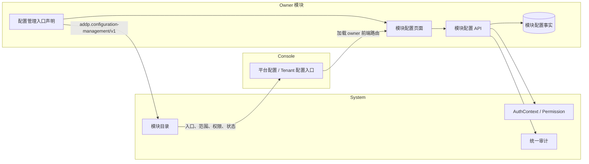

| 组件 | 职责 | 明确不负责 |
| --- | --- | --- |
| Console | 按当前 AuthContext、Permission 和模块状态聚合模块级配置入口，加载 owner 模块页面 | 保存配置值、解释业务字段、代替后端授权 |
| System | 登记版本化配置管理入口能力，提供 IAM、Permission、统一审计及 System-owned 配置 | 保存其他模块配置值、理解业务字段、在模块下线时代管配置 |
| owner 模块 | 定义、校验、保存、应用并审计本模块的普通运行配置 | 把部署配置或 Secret 混入普通配置表 |
| 部署系统 | 提供端口、数据库、基础设施地址和 Secret 等 Bootstrap 输入 | 作为 owner 普通运行配置的 fallback |

模块启动后可以随模块注册发布自己的配置管理入口。每个模块对外发布一个稳定的模块级入口；模块内的多个配置域在该入口页面内部通过 Tab 或分组组织。System 只接受 owner 与当前 Service Principal 一致的声明，并按稳定 entry id 幂等更新；声明不携带具体配置定义和值。Console 只负责统一入口和上下文分区，配置页面及 API 保持模块独立运行能力。

Platform Realm 只展示平台配置入口，Tenant Context 只展示当前 Tenant 配置入口。owner API 必须执行最终上下文和 Permission 校验；System 的通用平台配置 Permission 不能绕过业务模块自己的配置 Permission。

部署配置、普通运行配置、Secret、资源实体和任务快照的详细边界见 [ADDP 配置规范](../spec/addp配置介绍.md)。

### AI 推理职责

AI 推理采用“System 登记 Runtime、Inference 拥有推理资源、业务模块拥有场景绑定、Console 聚合入口”的单一路径。在线厂商账号和内网模型端点不会各自成为 System Engine Instance。

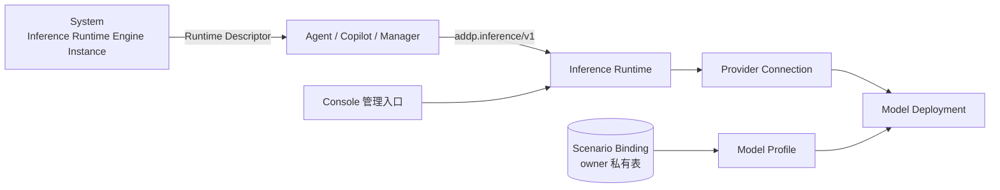

| 组件 | 拥有的事实 | 明确不拥有 |
| --- | --- | --- |
| System | Runtime Engine Instance、IAM、Permission、模块生命周期 | Provider 列表、模型列表、API Key、场景默认值 |
| Inference | Provider Connection、Model Deployment、Model Profile、加密凭据、统一推理协议与调用审计 | Agent/Copilot/Manager 的业务 Service、Chain 和场景绑定 |
| Agent / Copilot / Manager | 本模块 Scenario Binding、业务上下文和 Service/Chain | 厂商协议适配、上游 API Key |
| Console | Inference 管理页面的统一入口 | 推理资源和密钥事实 |

Runtime Instance 默认是平台级共享计算能力，但不因此获得任意 Tenant 业务权限。Provider Connection 可以是平台级或 Tenant 级；平台 Provider 必须显式授权全部或指定 Tenant，Tenant Provider 只能被所属 Tenant 使用。调用方按“Tenant 显式场景绑定 > 平台默认场景绑定 > 明确未配置错误”解析，不做任意模型自动优先或隐藏 fallback。详细契约见 [ADDP AI 推理接口规范](../spec/addp%20AI推理接口规范.md)。

---

## Gateway 路由机制

Gateway 作为 ADDP 的统一入口，负责请求路由和转发。ADDP 采用 **持久模块定义 + 临时运行实例租约 + 动态路由发现** 的单一机制。该模型借鉴服务注册中心对 Service、Instance、enabled 和 healthy 的分离，但注册事实仍由 System/PostgreSQL 管理，不引入 Nacos 产品依赖。

### 模块注册与路由发现流程

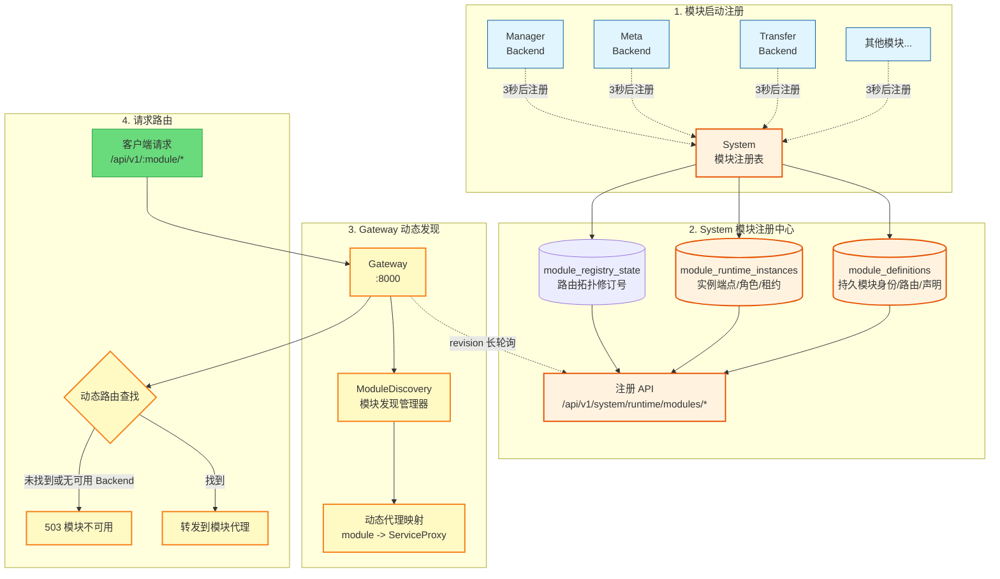

### 核心机制说明

**1. 持久模块定义**:
- `module_definitions` 保存稳定 `module_name`、路由前缀、管理员启用状态和配置管理入口声明；模块进程离线不会删除该定义。
- `enabled` 是管理员意图，与实例心跳健康独立。禁用模块时所有实例即使仍有心跳也不得进入 Gateway 路由或 Console 动态入口。
- 模块首次注册创建定义；后续注册按 `module_name` 幂等更新允许由 owner 发布的声明，不改变定义 ID。
- 模块定义是可变持久化主资源，使用正整数 `version` 进行乐观并发控制。平台系统管理员只能通过 `/api/v1/system/platform/modules` 读取定义和实例投影，并通过带 `version` 的更新请求修改 `enabled`；路由前缀和配置入口声明仍由 owner 注册发布，不提供管理员手工编辑路径。
- 相同 owner 声明的重复注册保持幂等且不递增 `version`；路由前缀或配置入口声明实际变化时，System 原子更新声明并递增 `version`，同时保持管理员 `enabled` 不变。

**2. 临时运行实例租约**:
- 每个 Backend 或 Worker 进程启动时生成本次进程唯一的 `instance_id`，并以 `module_name + instance_id` 注册到 `module_runtime_instances`。
- 运行实例声明 `role`；只有 `backend` 实例具有 Gateway 路由端点，`worker`、`scheduler` 等角色只用于运行状态和容量观测。
- 同一模块允许多个运行实例并存，注册不会互相覆盖 URL、版本或元数据。
- 注册提交完整实例声明；后续心跳只续租并更新 `last_heartbeat`，不得借心跳覆盖模块定义、管理员启用状态或实例元数据。
- Backend 必须先完成自身必需 Infra 初始化并成功绑定 HTTP 监听端口，再发起后台注册；不得把尚未监听的 `module_url` 提前发布为可路由实例。

**3. 周期心跳机制**:
- 模块每 **10 秒**发送一次心跳到 System
- System 将超过租约超时时间未心跳的运行实例标记为 `down`，但不删除运行实例历史，也不删除持久模块定义。
- 同一 `instance_id` 重新注册可恢复为 `up`；新进程必须使用新的 `instance_id`。
- 任一次心跳失败后，Go 与 Python 公共客户端的下一次请求都必须使用同一 `instance_id` 幂等重注册；注册失败使用有界退避，不能继续发送必然失败的心跳直到租约过期。
- 公共客户端必须发布 `starting|registered|recovering|failed|stopped` 五态进程内快照。首次注册成功进入 `registered`；任一心跳失败立即进入 `recovering`，重注册成功后恢复。该快照只供本进程就绪判断，不落库、不发布第二套注册事实。
- 连接失败、超时、`429` 和 `5xx` 是可重试故障；严格刷新凭据后仍然出现的 `400`、`401`、`403` 或其他确定性契约拒绝必须进入 `failed` 并终止进程，不得无限重试永不可成功的配置。心跳返回实例不存在时仍使用同 ID 重注册。
- 模块正常退出时应注销本次 `instance_id`；异常退出仍由租约到期收敛。
- Go 进程入口必须把同一个可取消的信号 Context 传给公共注册客户端；客户端返回生命周期完成信号，入口在关闭资源和退出进程前必须等待该信号，确保限时注销请求已经结束。不得用 `context.Background()` 承载进程级注册生命周期，也不得用 `os.Exit` 绕过等待与清理。
- Runtime 模块注册、心跳和注销失败必须返回 `{error, error_code}`；稳定错误码使用 `module_registration_invalid`、`module_runtime_instance_not_found`、`module_registry_unauthorized`、`module_registry_forbidden`、`module_registration_failed`、`module_heartbeat_failed` 和 `module_deregistration_failed`。Go 与 Python 公共客户端都必须保留 `method`、`path`、`status_code`、`error_code`、`error_message` 和受限长度的 `response_body`；后台生命周期日志还必须包含 `operation`、`module`、`instance_id` 和 `role`，不得只输出无结构的异常文本。

**管理面边界**:
- `platform.module.read` 允许平台系统管理员查看模块定义及其 Backend、Worker、Scheduler 实例投影；`platform.module.update` 只允许修改模块定义的 `enabled` 管理意图。
- 管理界面不得创建模块定义、删除运行实例、手工修改 `status` 或延长租约。定义由 owner 首次注册产生，实例健康只能由注册、心跳和租约到期推进。
- 管理界面按固定周期重新读取 System 当前投影；进程稍后启动并重新注册后，无需重启 System 或前端即可显示为可用。
- `GET /api/v1/system/platform/modules` 和模块详情只返回有界的当前运行投影：保留全部租约有效的实例；某个角色当前没有有效租约时，仅保留该角色最近一次离线观测，用于区分“从未注册该角色”和“该角色当前离线”。不得在模块主列表中携带全部历史实例。
- `GET /api/v1/system/platform/modules/{module_name}/instances` 是全部实例历史的唯一只读分页入口，按 `registered_at DESC, id DESC` 稳定排序，并支持 role、status 过滤。历史记录继续保留，管理面不提供删除或健康写入。
- `module_runtime_instances` 记录会被心跳、注销和租约收敛更新，是实例生命周期历史，不是追加式审计事件；管理员启停等操作审计仍以 `audit_logs` 为唯一事实源。

**4. Gateway 动态发现**:
- Gateway 启动时以 `revision=0` 从 System 获取已启用模块及其 `up` 的 Backend 完整快照。
- 后续只通过 revision 长轮询等待拓扑变化；新增、恢复、下线、端点变化和管理员启停会立即唤醒请求。
- 长轮询达到 `MODULE_WATCH_TIMEOUT`（默认 **10 秒**）时，即使 revision 未变化也返回一份新鲜完整快照，使 Gateway 持有的租约截止时间持续更新，不会因缓存租约老化形成路由空窗。
- 只根据 `enabled + role=backend + status=up + lease valid` 的实例创建、更新和移除 HTTP 代理
- Gateway 原子替换完整快照；System 短暂不可达时保留最近一次快照，但每次选路仍校验其中的租约截止时间。
- 多个 Backend 实例的选择必须来自同一发现结果，不能回退到环境变量中的第二套路由事实源

**5. 单一路由机制**:
- 模块动态注册表是 Gateway 业务模块路由的唯一事实源。
- System 注册中心暂时不可达时，Gateway 可以继续使用最近一次成功且尚未超过本地失效窗口的发现快照；不得读取 `*_SERVICE_URL` 建立平行 fallback 路由。
- 没有可用 Backend 实例或快照已失效时返回 503，不能把请求静默发往未受租约管理的地址。

### 存活、就绪、注册与可路由契约

ADDP 必须分开以下四个状态，不再使用含义不明的“启动成功”同时表示进程与平台可用性：

| 状态 | 唯一判断 | 消费方 |
| --- | --- | --- |
| Alive | HTTP 进程已监听并能处理本地存活请求 | 进程管理器、容器存活探针、T4 构建身份预检 |
| Ready | 自身必需 Infra 已就绪，且业务模块当前注册生命周期为 `registered` | 部署就绪探针、开发启动脚本、业务路由门禁 |
| Registered | System 已为当前 `module_name + instance_id` 建立或续期租约 | 当前进程注册生命周期、System 模块管理 |
| Routable | System 快照中实例满足 `enabled + backend + up + lease valid`，并已被 Gateway 应用 | Gateway |

Backend 的公开健康端点只保留两个唯一语义：

- `GET /health/live`：只做本地进程存活判断，成功固定返回 `200`；响应包含 `status=live`、`module` 和统一构建身份。不访问 System、其他业务模块、必需 Infra 或可选 Engine Instance。
- `GET /health/ready`：Ready 时返回 `200` 和 `status=ready`；否则返回 `503` 和 `status=not_ready`。响应包含 `module`、`role`、`instance_id`、`registration_state`、统一构建身份及受限的 `checks[]`；检查项只暴露稳定 `name/status/error_code`，不返回凭据、连接串或原始下游错误。
- 旧 `/health` 不再保留；各模块、Monitor、注册的 `health_check_url`、开发脚本、Compose/部署探针和 T4 预检必须在同一次实施中切换，不得保留别名或 fallback。

Backend 必须在健康路由之后、所有业务路由之前安装统一 Ready 门禁；未 Ready 时直连业务请求也返回 `503 module_not_ready`，不得借直连地址绕过 System 注册资格。Gateway 仍只依据 System 租约路由，不在每个请求前额外探测 Ready；System 不可达后的短暂观测延迟由 10 秒心跳和 30 秒租约边界收敛。

Worker 和 Scheduler 不为健康检查额外分配 HTTP 端口。它们必须先完成自身必需 Infra 初始化，再注册实例；未进入 `registered` 或心跳失败进入 `recovering` 时，不得领取新 execution、创建新调度执行或接受新工作。已在执行的工作按 owner execution lease 和授权契约收敛，不因模块心跳一次失败就无条件中止。自身必需 Infra 出现无法恢复的故障时，必须停止心跳、注销并退出，不得以有效租约伪装可工作。

System 是唯一例外：其 Ready 只依赖自身必需 Infra、迁移和 IAM/bootstrap 事实，不依赖它向自己注册。Gateway 的 Ready 要求已从 System 成功应用至少一次完整模块路由快照；业务模块不得把任何其他业务模块的可达性纳入 Ready。

### 路由请求流程

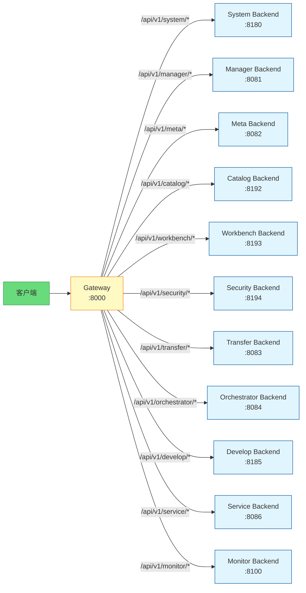

### 路由规则

| 路径前缀 | 目标服务 | 端口 | 说明 |
|---------|---------|------|------|
| `/api/v1/system/*` | System Backend | 8180 | 用户认证、引擎管理、日志 |
| `/api/v1/manager/*` | Manager Backend | 8081 | 数据管理、预览、空间快显和瓦片缓存 |
| `/api/v1/meta/*` | Meta Backend | 8082 | 元数据扫描、索引、搜索 |
| `/api/v1/catalog/*` | Catalog Backend | 8192 | 企业目录身份、业务编目、责任、语义关联和搜索 |
| `/api/v1/workbench/*` | Workbench Backend | 8193 | 已发布服务消费、个人视图和后续数据应用创作 |
| `/api/v1/security/*` | Security Backend | 8194 | 安全分类分级、纳管、敏感发现、资源评估、保护策略和运行时投影变化 |
| `/api/v1/transfer/*` | Transfer Backend | 8083 | 数据同步、搬运、格式转换 |
| `/api/v1/orchestrator/*` | Orchestrator Backend | 8084 | 任务编排、调度 |
| `/api/v1/develop/*` | Develop Backend | 8185 | 查询、工作流、Notebook |
| `/api/v1/service/*` | Service Backend | 8086 | 数据服务发布、OGC 标准 |
| `/api/v1/monitor/*` | Monitor Backend | 8100 | 执行监控、统计分析 |

### 配置环境变量

#### Gateway 模块配置

```bash
# 启用模块发现（推荐）
MODULE_REGISTRY_ENABLED=true                 # 启用动态路由发现
MODULE_WATCH_TIMEOUT=10s                     # revision 长轮询超时

# System 模块配置（用于获取注册信息）
SYSTEM_URL=http://system-backend:8180
GATEWAY_SERVICE_CLIENT_SECRET=your_gateway_service_client_secret

# System 自身地址是 Gateway 获取注册事实所需的部署 Bootstrap，不是业务模块路由 fallback
```

#### 各模块配置

```bash
# 启用与 System 集成
ENABLE_INTEGRATION=true
SYSTEM_URL=http://system-backend:8180
MODULE_SERVICE_CLIENT_SECRET=your_module_service_client_secret
```

### 关键文件位置

| 组件 | 文件路径 | 说明 |
|------|---------|------|
| **System 注册表** | [system/backend/internal/models/module_registry.go](../../system/backend/internal/models/module_registry.go) | 持久模块定义与运行实例租约模型 |
| **System API** | [system/backend/internal/api/module_registry_handler.go](../../system/backend/internal/api/module_registry_handler.go) | 注册/心跳/查询 API |
| **Gateway 发现** | [gateway/internal/module_discovery.go](../../gateway/internal/module_discovery.go) | 模块发现管理器（定期刷新） |
| **Gateway 路由** | [gateway/internal/router/router.go](../../gateway/internal/router/router.go) | 动态路由配置 |
| **Common 客户端** | [common/client/system_service.go](../../common/client/system_service.go) | 模块注册、心跳、重注册与退出注销客户端 |

### 优势与特性

- ✅ **动态上线/下线**：模块启动/停止无需重启 Gateway
- ✅ **故障自动恢复**：模块重启后自动重新注册为 `up` 状态
- ✅ **健康监控**：通过心跳机制实时监控模块状态
- ✅ **单一事实源**：Gateway 只消费 System 注册事实，不维护业务模块硬编码 fallback
- ✅ **可观测性**：Gateway 使用 Platform Service Access Token 查询模块状态（`GET /api/v1/system/runtime/modules`）

---

## ADDP 两种使用方式

ADDP 支持两种使用方式：通过 Console 控制台访问，或各模块独立部署使用。

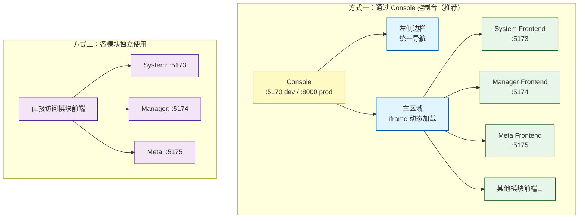

### 两种使用方式说明

**方式一：通过 Console 控制台**（推荐）：
- **单一入口**：`http://localhost:5170`（dev）或 `http://localhost:8000`（prod）
- **集成导航**：左侧边栏显示所有模块的导航菜单
- **模块加载**：主区域通过 iframe 动态加载各模块前端
- **一次登录**：访问所有模块，短期 Access Token 共享传递
- **适用场景**：生产环境，提供完整的用户体验

**方式二：各模块独立使用**：
- **直接访问**：各模块前端独立访问（如 `http://localhost:5173`）
- **独立登录**：每个模块有自己的登录页面
- **独立部署**：适合单个模块独立部署的场景
- **适用场景**：开发调试，模块独立交付

> 认证细节（Browser AuthSession、iframe `postMessage`、静默刷新和多标签页互斥）见：[ADDP 登录认证原理说明](addp登录认证的原理说明.md)

---

## 扩展运行时与任务编排

### 扩展运行时概述

位于 `engines/` 目录，ADDP 平台提供若干内置扩展运行时作为示例和默认部署选择；用户也可以按扩展引擎规范注册自研运行时：

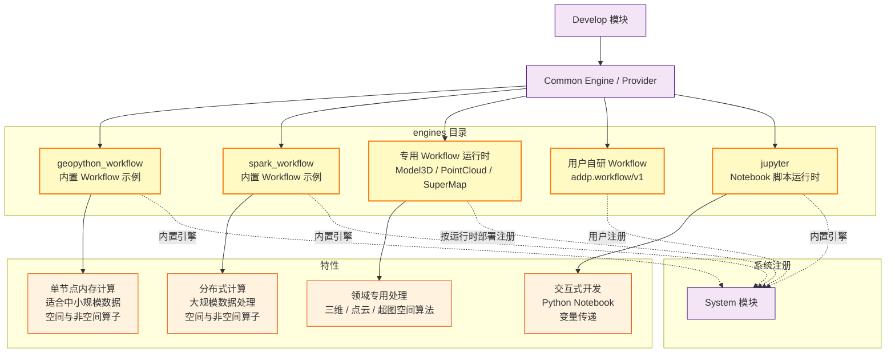

**运行时示例**：

| 引擎 | 类型 | 适用场景 | 主要能力 |
|------|------|---------|---------|
| **geopython_workflow** | 工作流运行时 | 数据量 < 100 万行 | 快速执行，空间与非空间算子 |
| **spark_workflow** | 工作流运行时 | 数据量 > 100 万行 | 大规模数据处理，空间与非空间算子；执行时绑定 `engine_type=spark` 的通用引擎资源 |
| **model3d_workflow** | 工作流运行时 | 三维模型、BIM 和 3DGS 快显 | GLB、3D Tiles、KSplat 等领域转换算子 |
| **pointcloud_workflow** | 工作流运行时 | 点云快显 | LAS / LAZ / E57 / PCD / XYZ 到 COPC 转换算子 |
| **supermap_workflow** | 工作流运行时 | 超图数据格式与空间分析 | SuperMap iObjects C++ 算子和 DAG 类型化内存句柄传递 |
| **math_workflow** | 工作流运行时参考实现 | 学习与扩展规范示例 | 基础数学算子；开发环境自动启动服务，手动注册后可用 |
| **jupyter** | 脚本运行时 | Notebook 开发 | Python Notebook，变量传递 |

**注册机制**：
- 生产内置运行时在自身服务就绪后异步自注册为**内置引擎** (`is_builtin = true`)；System 不代替 Runtime 预注册。System 尚未可用时，Runtime 退避重试注册，注册失败不得阻塞 Runtime 自身 readiness。
- 用户自研扩展运行时按同一张 System 引擎注册表管理，不要求某个内置工作流运行时必然存在。
- 调用方只发现已注册、启用且声明对应能力的运行时实例；工作流算子通过 `addp.workflow/v1` 动态发现。
- Runtime 与业务模块可以按任意顺序启动。模块选择启动不隐式要求或拉起可选 Runtime；需要本地运行某个 Runtime 时必须显式选择该 Runtime，或使用包含 Runtime 的全量部署组合。

---

### 扩展运行时与任务编排的架构关系

#### 一、扩展运行时层：System 注册 → Common Provider 调用

System 是扩展运行时的**注册中心**。Develop 负责编排和执行工作流；其他业务模块如需 direct 算子能力，也必须通过 Common Engine / Provider 按已注册运行时实例调用，不得直接假设某个内置工作流引擎存在。

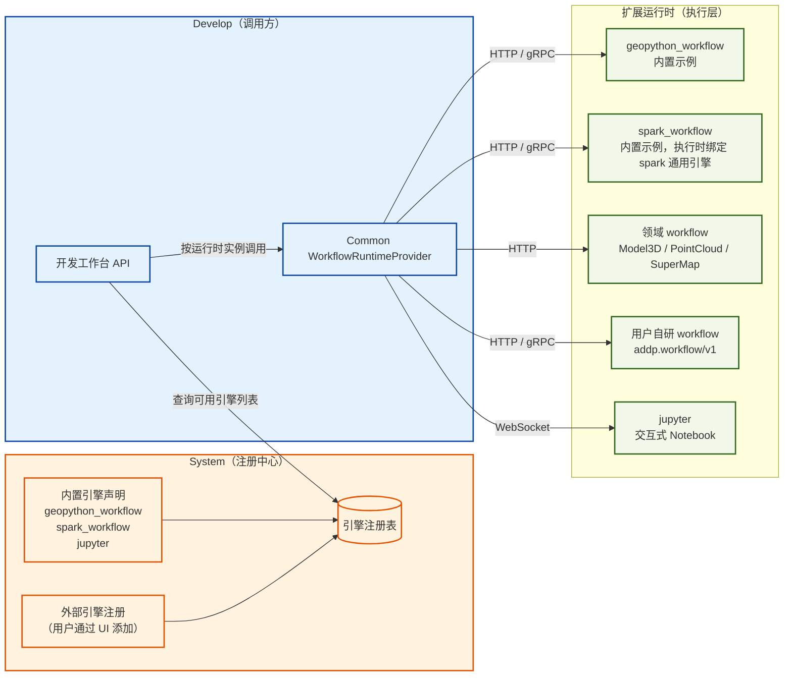

**要点**：
- System 仅维护引擎元数据（连接信息、类型、状态），不参与执行
- Develop 运行时从 System 查询引擎配置，按用户选择路由到对应运行时
- 扩展运行时是纯执行层，无任务定义概念，只接受并执行代码/作业

---

#### 二、任务编排层：各模块向 System 注册 → Orchestrator 编排

各业务模块在模块注册时向 System 声明自己提供的 **TaskProvider capabilities**，Orchestrator 在具体调用前从模块控制面动态解析当前有效 Backend。

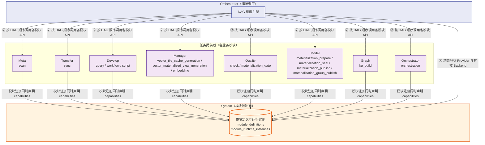

**要点**：
- 各模块 Backend 启动时通过模块注册一次性发布实例与 TaskProvider capabilities（任务类型、定义 schema、owner 前端入口和标准 API endpoint）；不再存在独立 Provider 注册请求
- Provider 声明是模块定义的一部分，管理员 `enabled` 与运行实例租约是可用性的唯一事实；Provider 不保存独立地址或启用状态
- Orchestrator 和 Monitor 每次实际使用前从 System 解析当前有效 Backend 池；模块离线期间保留声明但不可调用，Backend 恢复租约后立即可用
- TaskProvider 投影不得固定选择排序第一条 Backend，也不得把单个 `base_url` 当作模块事实；调用方从 System 返回的有效端点池中按稳定轮询选择，执行 POST 失败后不得自动换实例重放
- Orchestrator 不硬编码对任何模块的依赖，完全由注册信息驱动
- DAG 步骤只能引用 owner 模块已保存的任务定义，通过 `provider + task_type + task_id` 调用标准 TaskProvider API

---

#### 三、两层之间的关联：System 注册表与 Common 调用路径

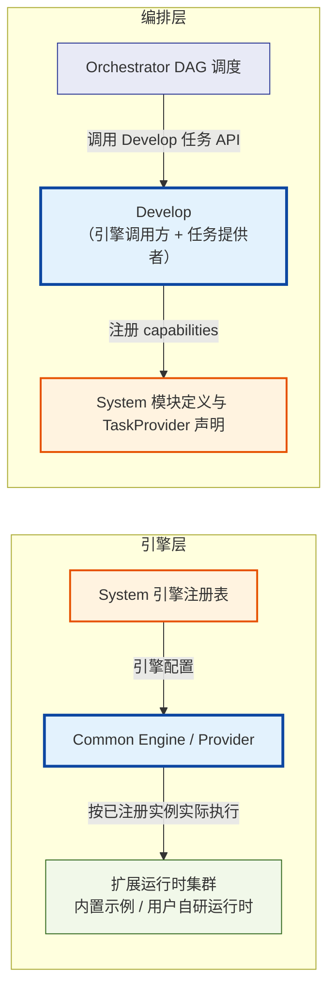

**Develop 在两层中扮演不同角色**：
- 对**引擎层**：是工作流编排和执行的主要消费者，从 System 获取引擎配置，经 Common Engine / Provider 向扩展运行时派发执行任务；其他业务模块如需 direct 算子，也走同一 Provider 主路径
- 对**编排层**：是提供者，将自身能力封装为 `query` / `workflow` / `script` 三类可编排任务类型注册到 System，供 Orchestrator 调度；Notebook 是 `script` 的当前 UI 和运行时形态，不作为独立 `task_type`

这意味着一个复杂的数据处理流水线可以是：
> Transfer 导入数据 → Develop 执行 SQL/Python 加工 → Meta 更新元数据 → Manager 刷新目录
>
> 全部由 Orchestrator 统一编排，其中 Develop 步骤内部再调用扩展运行时执行。

---

## 模块启动与恢复

ADDP 部署按以下顺序使实例进入 Ready。业务进程可以在 System 之前被操作系统或容器调度器创建，但只能保持 Alive/Not Ready 并后台注册；对平台业务可用性而言，System 是所有业务模块、Gateway 和 Python 应用的必要先行控制面：

```
1. 基础设施层（必须最先就绪）
   ├─ PostgreSQL
   ├─ Redis
   ├─ MinIO
   └─ Meilisearch

2. 控制面（必须先 Ready）
   └─ System Backend（认证中心、模块注册中心、引擎注册表）

3. 业务模块层（进程可并行创建，System Ready 后才能 Ready）
   ├─ Manager Backend
   ├─ Meta Backend + Worker
   ├─ Catalog Backend
   ├─ Security Backend + Worker
   ├─ Transfer Backend + Worker
   ├─ Orchestrator Backend
   ├─ Develop Backend
   ├─ Service Backend
   ├─ Monitor Backend
   ├─ Standard Backend
   ├─ Asset Backend
   └─ Portal Backend

4. 扩展运行时层（可并行，也可早于 System 或业务模块启动）
   ├─ GeoPython Workflow 运行时
   ├─ Math Workflow 参考运行时（自动启动服务、手动注册）
   ├─ Spark Workflow 运行时
   └─ Jupyter 脚本运行时

5. Python 应用层（独立进程，同样依赖 System 才能 Ready）
   ├─ Agent Backend
   └─ Copilot Backend

6. 网关层（至少应用一次 System 完整快照后 Ready，不等待业务模块）
   └─ Gateway（从 System 获取并持续监听模块路由快照）

7. 前端层（可并行启动）
   ├─ Console Frontend
   ├─ System Frontend
   ├─ Manager Frontend
   ├─ Meta Frontend
   ├─ Catalog Frontend
   ├─ Security Frontend
   ├─ Transfer Frontend
   ├─ Orchestrator Frontend
   ├─ Develop Frontend
   ├─ Service Frontend
   ├─ Monitor Frontend
   ├─ Standard Frontend
   ├─ Asset Frontend
   └─ Portal Frontend
```

**启动与恢复边界说明**：

| 约束 | 说明 |
|------|------|
| **Infra → 使用该 Infra 的进程** | PostgreSQL、Redis、MinIO、Meilisearch 等部署基础设施可以是进程自身的硬依赖；Infra 不属于 Engine Instance 启动解耦范围。 |
| **业务模块 ↔ System** | 业务进程的 Alive 不依赖 System 当时可达；Ready 强依赖当前进程已成功注册。注册客户端在后台对瞬时故障有界退避重试，System 恢复后使用同一进程级 `instance_id` 自动注册并恢复 Ready。 |
| **Gateway ↔ 业务模块** | Gateway 在 System 可达后以 `revision=0` 取得完整路由快照，随后长轮询更新；它不要求业务模块预先启动。模块稍后注册、租约失效或重新注册时，路由池自动收敛。 |
| **System 暂时不可达** | 模块在注册或心跳失败被观测后转为 Not Ready，但进程保持 Alive 并重试注册。Gateway 只保留最近一次仍在本地租约有效期内的快照；租约失效后请求返回 503，不回退到硬编码模块地址。 |
| **扩展运行时与 Engine Instance** | Runtime 自身就绪后异步注册；零个 Engine Instance 是合法状态，业务模块启动不得依赖任何内置或外部引擎存在。 |
| **Agent / Copilot 独立进程** | Python 应用与 Go 模块共用同一模块注册和 Ready 契约；进程可以在任意时刻创建，但 System 注册成功前不得接受业务流量。运行时调用其他业务模块时仍只失败当前请求，不改变本模块 Ready。 |
| **Catalog ↔ 专业模块** | Catalog 拉取 Meta DataItem 变化并按需读取 Standard、System 等 owner 事实；这些调用失败只造成同步滞后或当前业务请求失败，不改变 Catalog Ready。Manager、Asset 调用 Catalog 也遵循同一软依赖边界，禁止回退旧发现路径。 |
| **Security ↔ 专业模块** | Security 只精确读取显式纳管目标的 Meta / Owner 必要事实，不全量扫描；参与 Owner 后台拉取投影变化并本地执行。这些调用是运行软依赖，不改变任一模块 Ready；已纳管资源投影失效时 Owner 必须拒绝，不回退明文。Catalog Frontend 可按当前 User AuthContext 直读 Security 摘要，Catalog Backend 不代理、不复制且不依赖 Security Ready。 |
| **前端无严格顺序约束** | Console 通过 iframe 动态加载各模块前端（用户访问时才加载），各前端可完全并行启动 |

---

## 相关文档

- [ADDP 各模块简要介绍](addp各模块功能介绍.md)
- [ADDP 核心概念关系图](addp核心概念关系图.md)
- [ADDP 登录认证原理说明](addp登录认证的原理说明.md)
- [ADDP 开发原则](../spec/addp开发原则.md)
- [ADDP 共享模块介绍](addp共享模块介绍.md)
- [ADDP 新模块开发指南](../spec/addp新模块开发指南.md)
- [企业资源目录体系图](addp企业资源目录体系图.md)
- [企业资源目录实现规范](../spec/addp企业资源目录实现规范.md)
- [Monitor 模块实施报告](../../monitor/docs/Monitor模块实施报告.md)

---

**文档版本**: v1.2
**创建日期**: 2026-02-16
**更新日期**: 2026-08-26
**作者**: ADDP 开发团队
