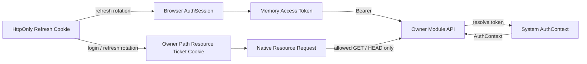
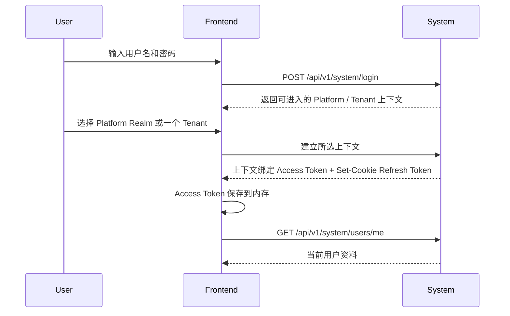
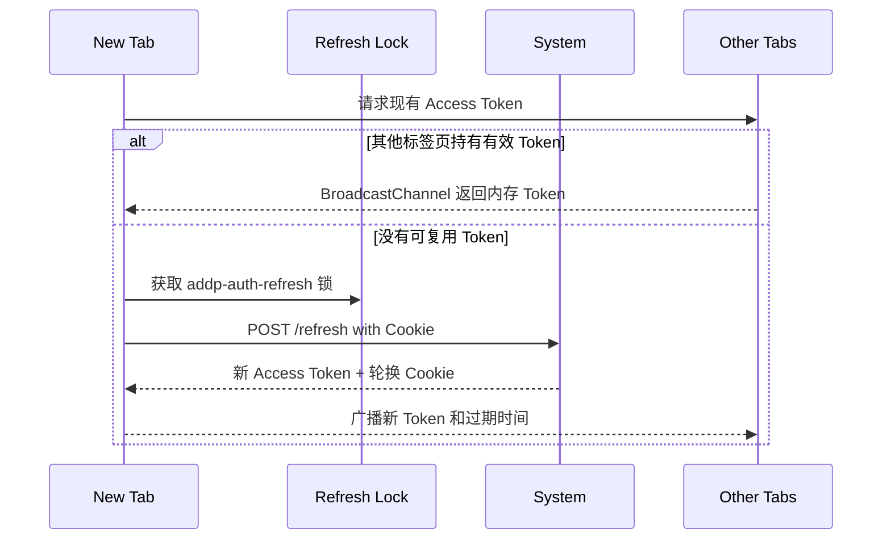
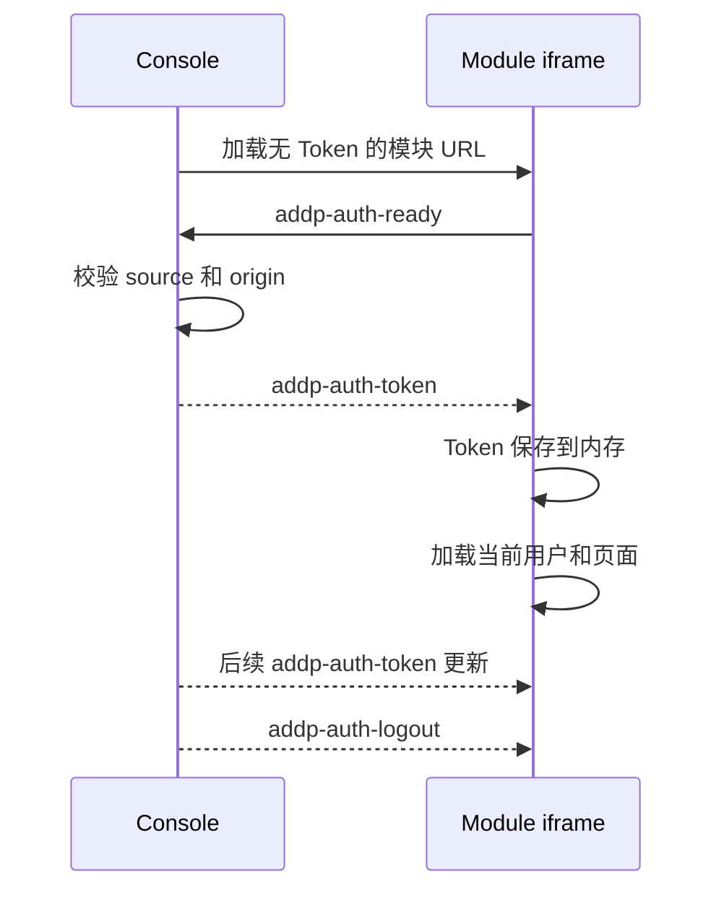

# ADDP 登录认证原理说明

更新日期：2026-07-22

## 一、整体模型

ADDP 浏览器认证由三类凭据和一个前端会话协调层组成：

- Refresh Token：长期会话凭据，只存在于 System 设置的 HttpOnly Cookie；
- User Access Token：15 分钟短期 Bearer Token，只存在于 JavaScript 运行时内存；
- Browser Resource Access Ticket：供无法添加 Authorization Header 的原生资源请求使用，通过 Owner Path 限定的 HttpOnly Cookie 传输。
- Browser AuthSession：负责启动恢复、刷新、跨标签页协调和 iframe Token 投递。



Access Token 不携带可解析 claims。System 对 Token 计算 SHA-256、查询 `system.access_tokens`、验证 Family 和有效期，再回查 Principal、会话模式、当前 Tenant Membership 和授权事实后生成 AuthContext。每枚 Token 只绑定 Platform Realm 或一个当前 Tenant。

## 二、为什么 Access Token 只放内存

Access Token 写入 `localStorage` 会使令牌跨页面生命周期长期存在，任何在 origin 内执行的脚本都可以读取。URL query Token 还可能进入浏览器历史、Referrer、前端服务器日志和错误采集。

内存 Token 的边界是：

- 页面进程退出后令牌自然消失；
- 页面刷新后不从本地存储恢复，而是使用 HttpOnly Refresh Cookie；
- iframe 不从 URL 获得 Token，而是从父 Console 获得；
- XSS 在当前页面存活期间仍可能代表用户请求 API，因此 CSP、依赖治理和输出转义仍然必要；内存存储不能替代前端安全治理。

## 三、登录与启动恢复

### 3.1 首次登录



### 3.2 页面刷新或新开标签页



因此，内存 Token 不意味着刷新页面后重新登录。只要 Refresh Token Family 有效，页面可以静默恢复。

静默恢复只能恢复 Token Family 当前绑定的会话模式和唯一当前 Tenant，不能因 User 后续获得其他 Tenant Membership 而自动合并权限。切换 Tenant 或切换平台/租户模式时需要重新建立授权上下文，并使旧上下文 Token 失效或停止使用。

## 四、静默刷新

Browser AuthSession 保存 Access Token 的预计过期时间，并在到期前主动刷新。API 的 401 只作为网络延迟、后台休眠或时钟偏差下的兜底。

```text
Access Token expires_in=900
  -> 约第 840 秒尝试刷新
  -> 获取跨标签页刷新锁
  -> POST /api/v1/system/refresh
  -> Cookie 内 Refresh Token 完成轮换
  -> 新 Access Token 进入内存
  -> 广播到其他标签页
```

同一个页面内的并发 API 请求共享一个刷新 Promise；同 origin 的多个页面通过 Web Locks 和 BroadcastChannel 协调。

Refresh Token Family 的最终有效期默认从登录时起固定 30 天。Token 轮换不会延长 Family 最终期限，因此达到 30 天、用户退出、账号停用或 Family 被撤销后需要重新登录。

## 五、Console iframe 认证

开发环境中 Console 与模块 iframe 使用不同端口，生产环境中使用同一站点的不同路径。两种环境统一使用同一消息协议。



iframe 模式下 Console 是唯一 Refresh Cookie 消费者。iframe 不调用 Refresh API，以免与父页面同时轮换同一 Refresh Token。

模块独立打开时没有父 Console，因此模块自身成为顶层 Browser AuthSession，并通过 Cookie 静默恢复。这是同一会话抽象在两种宿主模式下的运行方式，不是两套认证协议。

## 六、多标签页为什么必须加锁

ADDP 将旧 Refresh Token 重用视为泄露攻击。假设两个标签页同时持有即将过期的 Access Token：

```text
Tab A -> refresh(R1) -> 成功，Cookie 轮换为 R2
Tab B -> refresh(R1) -> R1 已使用，System 撤销整个 Family
```

单页面的 JavaScript Promise 无法阻止另一个标签页或 iframe 发出第二次请求。因此必须由浏览器级锁保证同一 origin 只有一个刷新者，并由广播把结果交给其他页面。

## 七、用户体验

| 场景 | 行为 |
| --- | --- |
| 首次登录 | 正常显示登录页。 |
| 页面刷新 | 进入短暂初始化状态，Cookie 有效时静默恢复。 |
| 新开同一 ADDP 标签页 | 优先复用其他标签页的内存 Token，否则在锁内静默刷新。 |
| Console 切换模块 | iframe 完成认证握手，用户无需登录。 |
| 切换 Tenant | 重新建立目标 Tenant 的授权上下文，不合并两个 Tenant 的权限。 |
| 切换平台/租户模式 | 重新建立互斥上下文，平台角色与 Tenant Role 不同时激活。 |
| 独立打开模块 | 模块使用同一 Cookie 静默恢复。 |
| 浏览器重启 | 持久 Refresh Cookie 和 Family 有效时静默恢复。 |
| 网络暂时中断 | 保留未知状态并允许重试，不立即当作退出。 |
| 用户退出或会话撤销 | 所有标签页和 iframe 同步退出。 |
| Family 达到 30 天 | 重新登录。 |

不同 hostname、浏览器 Profile、设备和无痕会话不共享 Cookie，需要各自登录。`localhost` 与 `127.0.0.1` 也属于不同 Cookie 主机。

## 八、特殊资源请求

普通 HTTP、SSE 和可控 Fetch 请求通过共享客户端动态读取内存 User Access Token。原生图片、媒体、下载和部分三维加载器无法设置 Authorization Header，因此不能直接消费内存 Token。

System 在第一方登录和每次 Web Refresh Token 轮换时，为支持原生资源的 Owner 签发短期 Browser Resource Access Ticket：

```text
System login / refresh
  -> addp_rat_ opaque ticket
  -> 只保存 SHA-256 Hash
  -> Set-Cookie HttpOnly; Path=/api/v1/{owner}
  -> 原生资源请求使用无凭据 URL
  -> Owner 仅在允许的 GET/HEAD 资源路由解析票据
  -> System AuthContext 返回 resource_access_ticket 身份
```

票据与当前 Refresh Token Family 和会话模式关联，有效期不超过 User Access Token；退出、上下文切换、Family 撤销、Refresh Token 轮换或重用时同步失效。System 从票据回溯所属第一方 Browser Family，并投影与 User Access Token 相同的 Principal、Context、认证、组织和 Role Assignment；票据自身只把 client 约束收窄为对应 owner audience 和唯一 `resource:read` Scope。

Owner 将 Resource Ticket Guard 直接挂在允许的 GET/HEAD 原生资源路由上，挂载即白名单。该 Guard 只读取 `addp_resource_access_ticket` Cookie，不接受 `Authorization` Header 与 Cookie 同时参与认证，不缓存 AuthContext，并校验 owner audience、Scope 和路由声明的 Role Permission all-of 候选。Owner Handler 仍执行 Assignment Scope、当前 Tenant、资源归属、Grant、Policy 和 Explicit Deny；票据只解决浏览器无法设置 Header 的传输问题，不扩大授权范围。

## 九、实现归属

| 能力 | Owner |
| --- | --- |
| Refresh Cookie、Token Family、Access Token、Browser Resource Access Ticket | System |
| Browser AuthSession、多标签页协议、iframe 认证协议 | common-frontend |
| iframe 会话协调 | Console |
| Resource Access Ticket 可用路由和业务权限 | 对应 owner 模块 |
| AuthContext 消费 | common Go / common-python |

相关正式规范：

- `docs/spec/addp登录认证的统一要求.md`
- `docs/spec/addp OAuth授权规范.md`
- `docs/spec/addp授权上下文规范.md`
