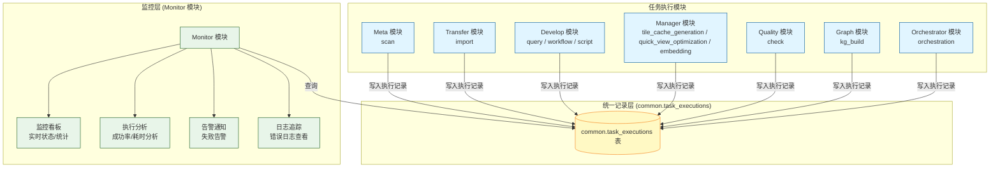
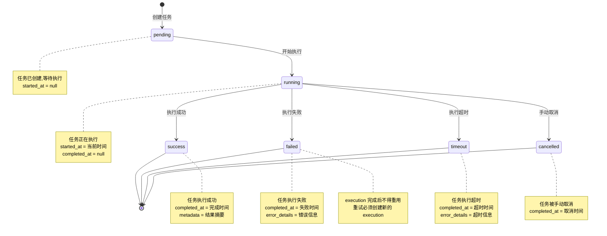
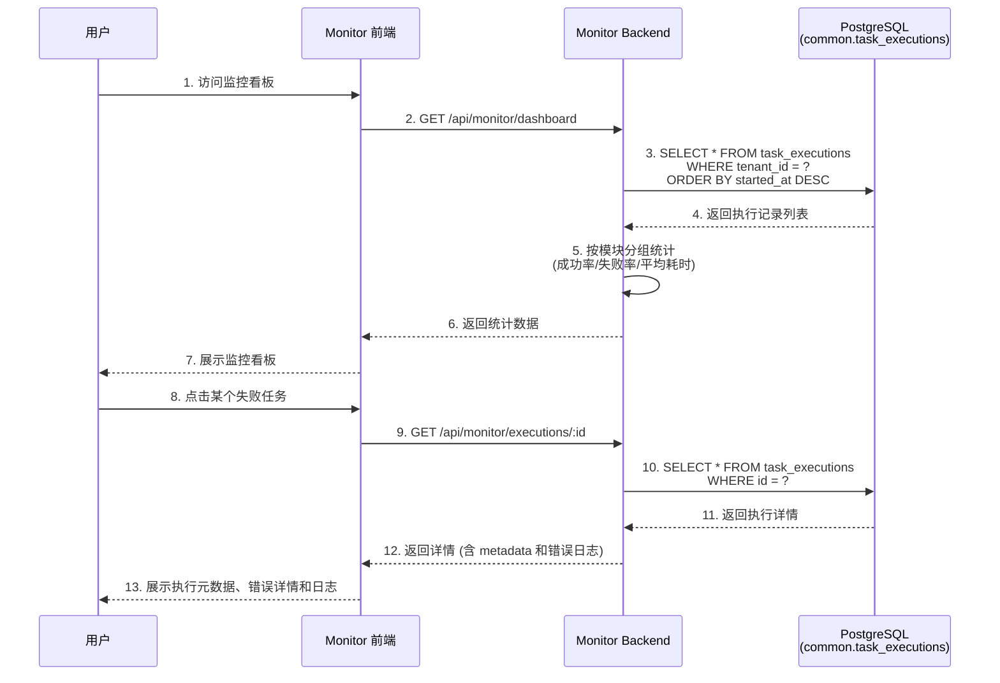

# ADDP 监控与执行体系图

本文档展示 ADDP 平台的统一执行监控架构和跨模块任务追踪机制。

---

## 目录

1. [监控体系概述](#监控体系概述)
2. [统一执行监控架构](#统一执行监控架构)
3. [任务执行状态流转](#任务执行状态流转)
4. [跨模块监控集成](#跨模块监控集成)

---

## 监控体系概述

ADDP 采用**统一执行监控架构**,通过 `common.task_executions` 表统一记录所有模块的任务执行,Monitor 模块提供集中监控和分析。

**核心特点**:
- **统一记录表**: `common.task_executions` 表记录所有模块任务
- **模块标识**: 通过 `module` 字段区分不同模块的任务
- **任务类型**: 通过 `task_type` 字段区分任务类型
- **集中监控**: Monitor 模块统一查询、分析、可视化

---

## 统一执行监控架构

### task_executions 表结构

| 字段 | 类型 | 说明 |
|------|------|------|
| `id` | bigint | 执行记录 ID |
| `tenant_id` | int | 租户 ID (租户隔离) |
| `module` | string | 模块名称 (meta/transfer/develop/manager/quality/graph/orchestrator) |
| `task_type` | string | 任务类型 (scan/import/orchestration/query/workflow/script/tile_cache_generation/quick_view_optimization/embedding/check/kg_build) |
| `source` | string | 触发来源模块 |
| `source_task_id` | string | 任务 ID (对应模块内的任务定义 ID) |
| `trigger_type` | string | `manual` / `scheduled` |
| `status` | string | 执行状态 (pending/running/success/failed/timeout/cancelled) |
| `started_at` | timestamp | 开始时间 |
| `completed_at` | timestamp | 完成时间 |
| `execution_time_ms` | bigint | 执行时长 (毫秒) |
| `metadata` | jsonb | 结果摘要、步骤结果、模块扩展信息 |
| `error_details` | jsonb | 错误类型、消息和诊断信息 |

---

## 任务执行状态流转

### 状态说明

| 状态 | 说明 | started_at | completed_at | metadata/error_details |
|------|------|-----------|------------|-------------|
| `pending` | 任务已创建,等待执行 | null | null | null |
| `running` | 任务正在执行 | 开始时间 | null | null |
| `success` | 任务执行成功 | 开始时间 | 完成时间 | metadata |
| `failed` | 任务执行失败 | 开始时间 | 失败时间 | error_details |
| `timeout` | 任务执行超时 | 开始时间 | 超时时间 | error_details |
| `cancelled` | 任务被手动取消 | 开始时间(可选) | 取消时间 | null |

---

## 跨模块监控集成

Monitor 模块统一监控所有模块的任务执行:

### 监控功能

**1. 实时监控看板**:
- 当前运行任务数量
- 最近 24 小时任务执行统计
- 按模块分组的成功率/失败率
- 按任务类型分组的平均耗时
- TaskProvider provider health：注册状态、模块 `/health`、标准 `GET /tasks?task_type=` 任务发现可调用性和 capabilities 基础结构

**2. 历史执行记录**:
- 按模块、任务类型、状态筛选
- 按时间范围筛选
- 分页查询

**3. 执行详情**:
- 任务参数
- 执行时长
- 执行元数据摘要和原始 JSON
- 执行结果或错误信息
- 关联日志

执行元数据由任务 owner 模块写入 `common.task_executions.metadata`，Monitor 只负责通用展示和轻量摘要，不反向拥有或改写模块产物。对于 Manager 瓦片缓存生成和快显性能优化，执行详情应能展示实际生成目标、`target_kind`、是否使用外部 3857 优化目标、是否建议快显性能优化、瓦片生成统计等诊断字段，并保留原始 JSON 作为兜底。

**4. 统计分析**:
- 成功率趋势图
- 执行耗时分布图
- 失败原因分析
- 热点任务 Top 10

**5. 告警通知** (可选):
- 任务失败告警
- 执行超时告警
- 成功率下降告警

---

## 各模块任务类型

| 模块 | task_type | 说明 | 示例 |
|------|-----------|------|------|
| **Meta** | `scan` | 元数据扫描任务 | 扫描 PostgreSQL 数据库 |
| **Transfer** | `import` | 数据导入任务 | 从 CSV 导入到 PostgreSQL |
| **Orchestrator** | `orchestration` | 编排任务执行 | 执行数据处理流水线 |
| **Develop** | `query` | 查询执行任务 | SQL 查询执行 |
| | `workflow` | 工作流执行任务 | 执行空间分析工作流 |
| | `script` | 脚本执行任务 | 执行命令式脚本；当前可由 Jupyter Notebook runtime 承载 |
| **Manager** | `tile_cache_generation` | 瓦片缓存生成任务 | 为空间数据生成瓦片缓存 |
| | `quick_view_optimization` | 快显性能优化任务 | 为 PostGIS 空间数据创建或刷新 3857 快显优化目标 |
| | `embedding` | 向量化任务 | 对对象存储文件进行向量化 |
| **Quality** | `check` | 数据质量检查任务 | 执行质量规则检查 |
| **Graph** | `kg_build` | 知识图谱构建任务 | 构建知识图谱 |

---

## 相关文档

- [返回核心概念关系图](addp核心概念关系图.md)
- [ADDP 任务编排体系图](addp任务编排体系图.md)
- [ADDP 任务体系规范](../spec/addp任务体系规范.md)
- [Monitor 模块实施报告](../Monitor模块实施报告.md)

---

**文档版本**: v1.0
**创建日期**: 2026-02-16
**作者**: ADDP 开发团队
