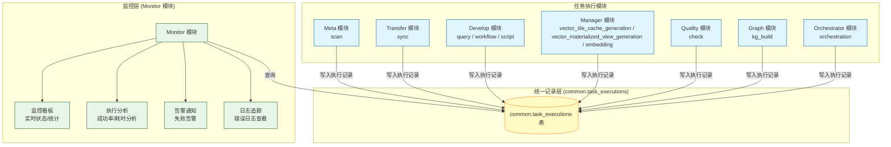
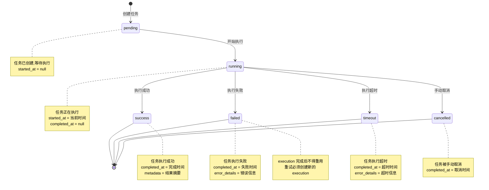
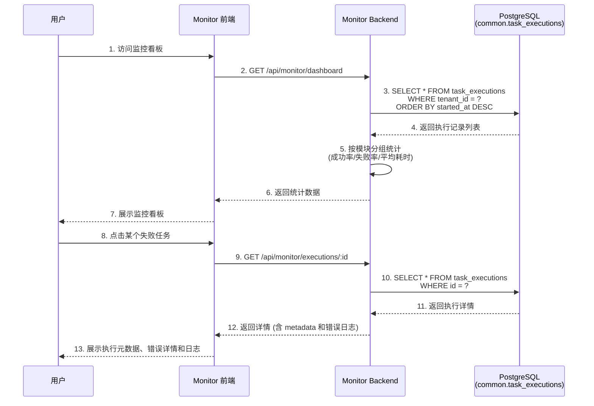

# ADDP 监控与执行体系图

本文档展示 ADDP 平台的统一执行监控架构和跨模块任务追踪机制。

---

## 目录

1. [监控体系概述](#监控体系概述)
2. [统一执行监控架构](#统一执行监控架构)
3. [任务执行状态流转](#任务执行状态流转)
4. [跨模块监控集成](#跨模块监控集成)

---

## 监控体系概述

ADDP 采用**统一执行监控架构**,通过 `common.task_executions` 表统一记录所有模块的任务执行,Monitor 模块提供集中监控和分析。

**核心特点**:
- **统一记录表**: `common.task_executions` 表记录所有模块任务
- **模块标识**: 通过 `module` 字段区分不同模块的任务
- **任务类型**: 通过 `task_type` 字段区分任务类型
- **集中监控**: Monitor 模块统一查询、分析、可视化

---

## 统一执行监控架构

### task_executions 表结构

| 字段 | 类型 | 说明 |
|------|------|------|
| `id` | bigint | 执行记录 ID |
| `tenant_id` | int | 租户 ID (租户隔离) |
| `module` | string | 模块名称 (meta/transfer/develop/manager/quality/graph/orchestrator) |
| `task_type` | string | 任务类型 (scan/sync/orchestration/query/workflow/script/vector_tile_cache_generation/vector_materialized_view_generation/embedding/check/kg_build) |
| `source` | string | 触发来源模块 |
| `source_task_id` | string | 任务 ID (对应模块内的任务定义 ID) |
| `trigger_type` | string | `manual` / `scheduled` |
| `status` | string | 执行状态 (pending/running/success/failed/timeout/cancelled) |
| `started_at` | timestamp | 开始时间 |
| `completed_at` | timestamp | 完成时间 |
| `execution_time_ms` | bigint | 执行时长 (毫秒) |
| `metadata` | jsonb | 结果摘要、步骤结果、模块扩展信息 |
| `error_details` | jsonb | 错误类型、消息和诊断信息 |

### 执行运行时角色矩阵

`common.task_executions` 统一记录执行事实，但不要求所有模块使用同一种运行时队列。下面的矩阵区分“执行 worker”和“调度器、投递器、维护循环”，避免把名称相同的后台组件误认为同一机制。

| 运行时角色 | 所属模块 | 进程边界 | 领取/投递事实 | 并发与恢复 | 与 `common.task_executions` 的关系 |
|---|---|---|---|---|---|
| Quality execution worker | Quality | 内嵌 `quality-backend` | PostgreSQL `FOR UPDATE SKIP LOCKED` 领取已授权 `pending` execution | `QUALITY_WORKER_CONCURRENCY` 默认 4；execution lease、超时预算、过期恢复 | 直接消费 Quality `check` execution，并写入评分、Issue reconcile 和终态 |
| Meta scan worker | Meta | 独立 `meta-worker` 进程 | Redis/Asynq `meta:scan` | `META_WORKER_CONCURRENCY` 默认 10；由 Asynq 管理重试 | Backend 创建 Meta execution 后投递，worker 执行扫描并回写 execution |
| Transfer bounded worker | Transfer | 独立 `transfer-worker` 进程 | Redis/Asynq `transfer:execute` | `TRANSFER_WORKER_CONCURRENCY` 默认 10；由 Asynq 管理重试 | 承担 bounded `sync` execution，不承载 continuous 无限消费 |
| Transfer continuous worker | Transfer | 独立 `transfer-continuous-worker` 进程 | `transfer.runtime_leases`、Kafka/CDC position | capacity、heartbeat、fencing；恢复创建新的 recovery execution | 承担 continuous runtime session；`sync_states` 是业务 committed position，不替代 execution 历史 |
| Webhook/Email dispatcher | Monitor | 内嵌 `monitor-backend` | Monitor delivery outbox + `SKIP LOCKED` | 投递 lease、至少一次语义、指数退避和 dead 终态 | 消费告警生命周期 delivery，不创建或改写业务 execution |

**角色边界**:

- execution worker 负责“执行什么以及如何完成”；owner scheduler 只负责“何时创建 execution”；dispatcher 只负责“如何投递通知”。
- Orchestrator scheduler、Manager embedding scheduler、Meta lineage collector 和各模块 cleanup 属于 scheduler/maintenance loop，不自动等同 execution worker。
- Quality、Meta、Transfer 的运行时机制可以不同，但 owner 必须保持单一路线，不能让同一 task type 在 Redis、数据库和进程内队列之间无定义地旁路切换。

当前实现巡检发现 Meta Backend 在 Redis 不可用时仍保留本地队列 fallback；这与 Meta scan 的 Asynq 独立 worker 主路线形成双轨，后续应单独收敛，不能作为新模块示范。

---

## 任务执行状态流转

### 状态说明

| 状态 | 说明 | started_at | completed_at | metadata/error_details |
|------|------|-----------|------------|-------------|
| `pending` | 任务已创建,等待执行 | null | null | null |
| `running` | 任务正在执行 | 开始时间 | null | null |
| `success` | 任务执行成功 | 开始时间 | 完成时间 | metadata |
| `failed` | 任务执行失败 | 开始时间 | 失败时间 | error_details |
| `timeout` | 任务执行超时 | 开始时间 | 超时时间 | error_details |
| `cancelled` | 任务被手动取消 | 开始时间(可选) | 取消时间 | null |

---

## 跨模块监控集成

Monitor 模块统一监控所有模块的任务执行:

### 监控功能

**1. 实时监控看板**:
- 当前运行任务数量
- 最近 24 小时任务执行统计
- 按模块分组的成功率/失败率
- 按任务类型分组的平均耗时
- TaskProvider provider health：注册状态、模块 `/health`、capabilities 基础结构，以及标准 `GET /tasks?task_type=` 任务发现响应体是否符合 `{items,total,page,page_size}`

**2. 历史执行记录**:
- 按模块、任务类型、状态筛选
- 按时间范围筛选
- 分页查询

**3. 执行详情**:
- 任务参数
- 执行时长
- 执行元数据摘要和原始 JSON
- 执行结果或错误信息
- 关联日志
- 仅当对应 TaskProvider task type 明确声明 `supports_cancel=true` 时，才在监控侧展示取消入口；`supports_cancel=false` 的执行只展示状态和诊断，不提供标准取消动作。

执行元数据由任务 owner 模块写入 `common.task_executions.metadata`，Monitor 只负责通用展示和轻量摘要，不反向拥有或改写模块产物。对于 Manager 瓦片缓存生成和矢量物化视图，执行详情应能展示实际生成目标、`target_kind`、是否使用外部 3857 优化目标、是否建议矢量物化视图、瓦片生成统计等诊断字段，并保留原始 JSON 作为兜底。

Transfer continuous 运行观测同样遵守 owner 边界：Transfer worker 从业务 Kafka 采集分区 earliest/latest，以目标已提交 `next_offset` 计算 lag、retention 恢复余量和 checkpoint age/health，并写入 `metadata.continuous.diagnostics`。Monitor 只从 `common.task_executions` 展示 health、恢复 circuit 和分区诊断，不直连业务 Kafka，不读取 `transfer.sync_states` 或 `transfer.runtime_leases`。这保证 Monitor 始终是统一观测者，而不是 continuous runtime 的第二个 owner。

Monitor 可以把 owner metadata 无状态归一化为实时观测信号：retention critical、recovery circuit open 与数据库 CDC `schema_change.status=pending` 为严重，retention degraded、checkpoint degraded、恢复等待和 half-open 为警告。观测信号不是新的 execution 状态。普通 continuous 运行信号来自每个任务最新 active execution；schema blocked 信号来自最新一个仍为 pending 的 schema-change 终态 execution，审批将同一公共投影改为 applied 后自动恢复。Monitor evaluator 只扫描 `common.task_executions` 公共事实，把仍存在的信号物化为 `monitor.alert_incidents`，不得读取 `transfer.schema_change_requests`。告警身份包含规则身份和实际任务身份，同一规则、同一任务同时最多一个 `open|acknowledged` 事件。确认只记录操作人和时间，抑制只暂停通知，二者都不得改写 execution metadata 或 owner 私有状态。

通用执行告警由 Monitor 拥有规则策略，但不拥有运行事实。租户规则精确绑定 `module + task_type + source_task_id`，第一版只允许最近失败、最近超时和连续失败；owner 模块负责写真实 `success|failed|timeout`，Monitor 不读取 owner 私有表补判。ad-hoc、子 execution 和 Transfer continuous session 不进入通用规则；同一任务的最新根 execution 已切换为 continuous 时，Monitor 不再沿用其历史 bounded 终态。多个 evaluator 必须先收集全部 active signal，再由一个 reconciler 统一打开、升级和恢复 incident，避免一个 evaluator 错误恢复另一个 evaluator 的告警。

通用规则的外部通知采用显式 `monitor.notification_routes`。规则没有路由时仍保存 incident 和不可变 lifecycle event，但不产生 Webhook/邮件 delivery；有路由时只向当前租户绑定的目标生成 outbox。规则、incident/event、路由和 delivery 均归 Monitor，System 只提供统一操作审计，各任务 owner 不保存通知目标或告警阈值。

Webhook v1 由 Monitor 拥有。告警打开、严重级别由 warning 升为 critical、告警恢复时，Monitor 必须在更新 incident 的同一个 Infra PostgreSQL 事务中写入不可变 `monitor.alert_events`，并为当时已启用且订阅该事件的 `monitor.webhook_destinations` 生成 `monitor.webhook_deliveries` outbox。HTTP 发送只能在事务外执行；dispatcher 使用短事务和 `FOR UPDATE SKIP LOCKED` 领取到期 delivery，按至少一次语义重试。接收方以全局唯一 `delivery_id` 幂等。确认不产生通知；抑制期间仍保留生命周期 event，但对应 delivery 记为 suppressed 且不补发。通知渠道不能反向成为告警、execution 或 Transfer runtime 的事实源。

Webhook 请求固定使用 `monitor.alert.webhook/v1` JSON schema，事件类型只允许 `opened|escalated|resolved`。签名使用目标独立 secret 对 `timestamp + "." + raw_body` 做 HMAC-SHA256，并通过 `X-ADDP-Webhook-ID`、`X-ADDP-Webhook-Timestamp`、`X-ADDP-Webhook-Signature: v1=<hex>` 传递。secret 使用平台 `ENCRYPTION_KEY` 做 AES-256-GCM 加密，API 和投递审计不得返回明文或密文。payload 只包含稳定告警摘要、任务/执行身份和 Console 链接，不携带业务数据、凭据或完整 execution metadata。

Webhook 目标运维不改变告警事实边界。测试投递使用独立 `monitor.webhook.test/v1` schema，同步验证目标当前 URL、secret、SSRF 策略和签名，不生成告警 event 或正式 outbox。人工重投只允许 `dead` delivery，复用原 `delivery_id` 和 payload，并使用目标当前 URL/secret 开启新的最大尝试周期；累计尝试次数和人工重投次数必须保留。删除目标取消未领取投递但保留历史 delivery，已领取请求可以完成。所有写操作进入 System 统一审计日志，Monitor 不建立第二套操作审计。

邮件通知与 Webhook 消费同一条不可变 `monitor.alert_events` 事实流，但使用独立 `monitor.email_destinations` 和 `monitor.email_deliveries`。租户目标只保存名称、收件地址、订阅事件和启用状态；SMTP Relay、TLS 模式、认证凭据与发件身份属于 Monitor 部署配置。邮件 delivery 冻结收件人、主题和正文，dispatcher 在事务外按至少一次语义发送；测试发送不生成 event/outbox，`dead` 人工重投复用原 `delivery_id` 和内容。SMTP 未配置时 dispatcher 不启动，未投递 outbox 保持 `pending`，不能伪造通知结果。

**4. 统计分析**:
- 成功率趋势图
- 执行耗时分布图
- 失败原因分析
- 热点任务 Top 10

**5. 告警通知**:
- Webhook v1 支持 continuous 告警的打开、升级和恢复投递
- 每租户维护独立 Webhook 目标、订阅事件和签名 secret
- 支持指数退避、失败终态和投递审计
- 支持独立测试投递、`dead` 手动重投、目标删除和 System 操作审计
- 通用任务最近失败、最近超时和连续失败按同一告警生命周期评估
- 邮件通知 v1 使用平台统一 SMTP Relay 和独立邮件 outbox；站内通知后续实现

---

## 各模块任务类型

| 模块 | task_type | 说明 | 示例 |
|------|-----------|------|------|
| **Meta** | `scan` | 元数据扫描任务 | 扫描 PostgreSQL 数据库 |
| **Transfer** | `sync` | 数据同步任务 | 表导入、表导出或跨格式同步 |
| **Orchestrator** | `orchestration` | 编排任务执行 | 执行数据处理流水线 |
| **Develop** | `query` | 查询执行任务 | SQL 查询执行 |
| | `workflow` | 工作流执行任务 | 执行空间分析工作流 |
| | `script` | 脚本执行任务 | 执行命令式脚本；当前可由 Jupyter Notebook runtime 承载 |
| **Manager** | `vector_tile_cache_generation` | 瓦片缓存生成任务 | 为空间数据生成瓦片缓存 |
| | `vector_materialized_view_generation` | 矢量物化视图任务 | 为 PostGIS 空间数据创建或刷新 3857 矢量物化视图目标 |
| | `embedding` | 向量化任务 | 对对象存储文件进行向量化 |
| **Quality** | `check` | 数据质量检查任务 | 执行质量规则检查 |
| **Graph** | `kg_build` | 知识图谱构建任务 | 构建知识图谱 |

---

## 相关文档

- [返回核心概念关系图](addp核心概念关系图.md)
- [ADDP 任务编排体系图](addp任务编排体系图.md)
- [ADDP 任务体系规范](../spec/addp任务体系规范.md)
- [Monitor 模块实施报告](../../monitor/docs/Monitor模块实施报告.md)

---

**文档版本**: v1.0
**创建日期**: 2026-02-16
**作者**: ADDP 开发团队
