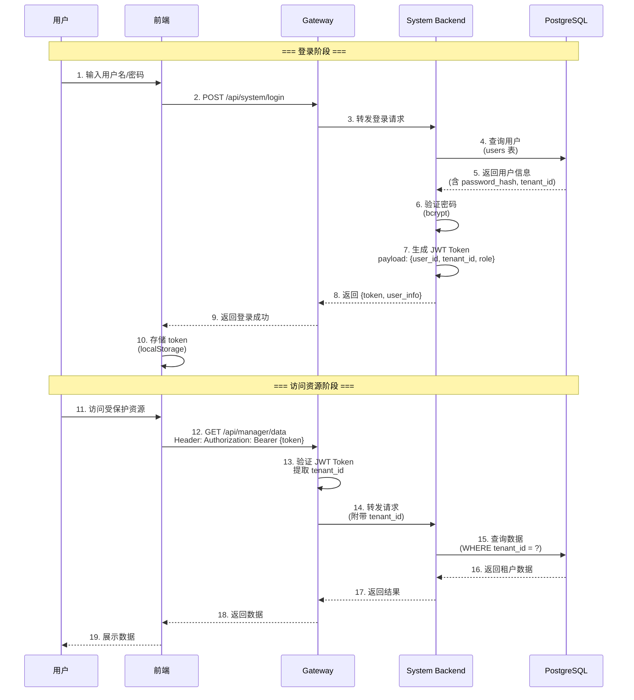
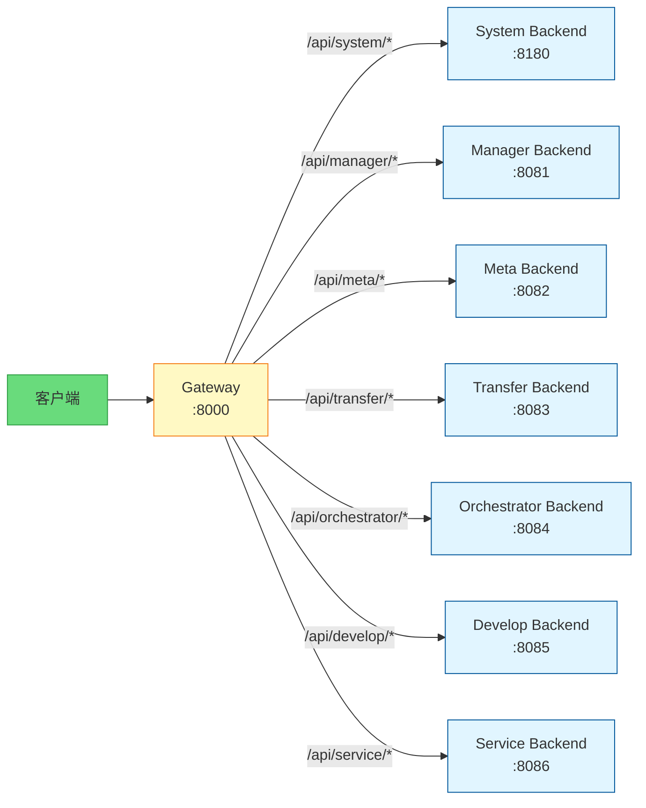
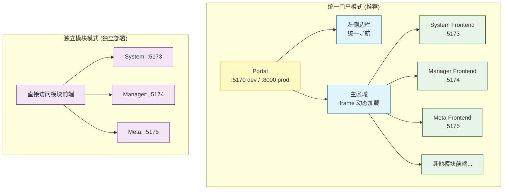
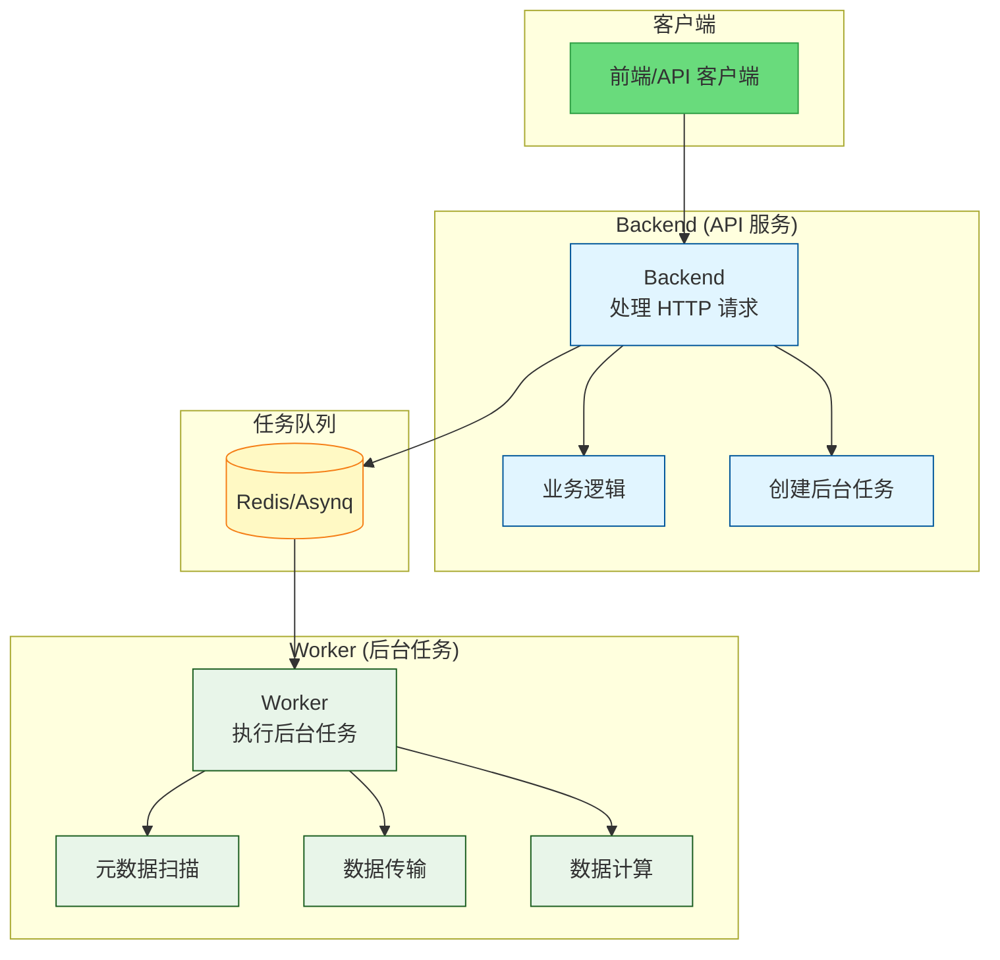

# ADDP 认证与路由体系图

本文档展示 ADDP 平台的 JWT 认证流程、Gateway 路由机制和 Portal 架构。

---

## 目录

1. [JWT 认证流程](#jwt-认证流程)
2. [Gateway 路由机制](#gateway-路由机制)
3. [Portal 架构](#portal-架构)
4. [Backend/Worker 分离架构](#backendworker-分离架构)

---

## JWT 认证流程

ADDP 使用 **JWT (JSON Web Token)** 实现无状态认证。



### JWT Token 结构

```json
{
  "header": {
    "alg": "HS256",
    "typ": "JWT"
  },
  "payload": {
    "user_id": 123,
    "username": "admin",
    "tenant_id": 1,
    "tenant_name": "默认租户",
    "role": "admin",
    "exp": 1708099200,
    "iat": 1708012800
  },
  "signature": "..."
}
```

---

## Gateway 路由机制

Gateway 作为 ADDP 的统一入口,负责请求路由和转发。



### 路由规则

| 路径前缀 | 目标服务 | 端口 | 说明 |
|---------|---------|------|------|
| `/api/system/*` | System Backend | 8180 | 用户认证、引擎管理、日志 |
| `/api/manager/*` | Manager Backend | 8081 | 数据管理、预览、MVT 瓦片 |
| `/api/meta/*` | Meta Backend | 8082 | 元数据扫描、索引、搜索 |
| `/api/transfer/*` | Transfer Backend | 8083 | 数据导入、导出、同步 |
| `/api/orchestrator/*` | Orchestrator Backend | 8084 | 任务编排、调度 |
| `/api/develop/*` | Develop Backend | 8085 | 查询、工作流、Notebook |
| `/api/service/*` | Service Backend | 8086 | 数据服务发布、OGC 标准 |

---

## Portal 架构

Portal 是 ADDP 的统一入口,提供两种访问模式。



### Portal 两种模式

**1. 统一门户模式** (推荐):
- **单一入口**: `http://localhost:5170` (dev) 或 `http://localhost:8000` (prod)
- **集成导航**: 左侧边栏显示所有模块的导航菜单
- **模块加载**: 主区域通过 iframe 动态加载模块前端
- **一次登录**: 访问所有模块,JWT Token 共享
- **适用场景**: 生产环境,提供完整的用户体验

**2. 独立模块模式**:
- **直接访问**: 各模块前端独立访问 (如 `http://localhost:5173`)
- **独立登录**: 每个模块有自己的登录页面
- **独立部署**: 适合单个模块独立部署的场景
- **适用场景**: 开发调试,模块独立交付

---

## Backend/Worker 分离架构

部分模块采用 Backend/Worker 分离架构,提高系统性能和可扩展性。



### Backend/Worker 分离说明

**Backend**:
- 处理 HTTP API 请求
- 执行业务逻辑
- 返回即时响应
- 创建后台任务

**Worker**:
- 执行后台任务 (扫描、传输、计算等)
- 基于 Asynq 任务队列
- 异步处理,不阻塞请求
- 支持任务重试和并发控制

**采用分离架构的模块**:
- **Meta**: Backend (API) + Worker (元数据扫描)
- **Transfer**: Backend (API) + Worker (数据导入/导出/同步)

---

## 相关文档

- [返回核心概念关系图](../addp核心概念关系图.md)
- [ADDP 账号与权限体系图](addp账号与权限体系图.md)
- [Gateway 架构说明](../../gateway/doc/gateway架构说明.md)

---

**文档版本**: v1.0
**创建日期**: 2026-02-16
**作者**: ADDP 开发团队
