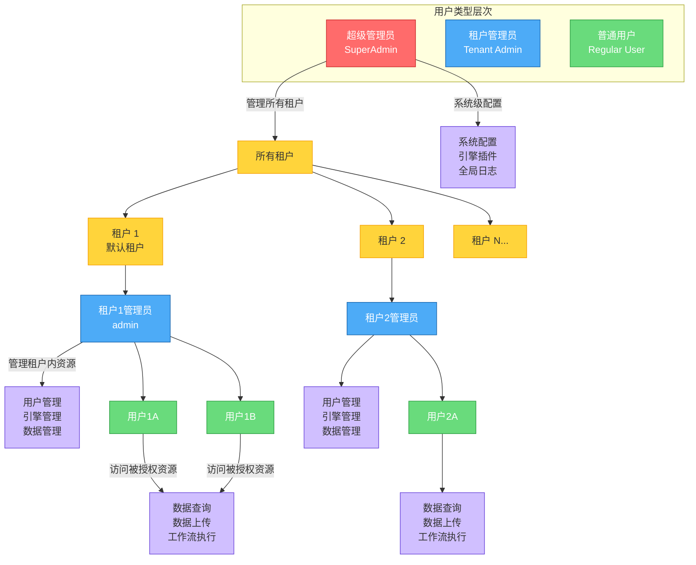
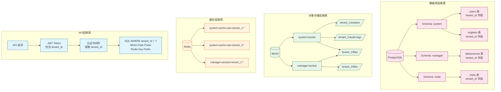
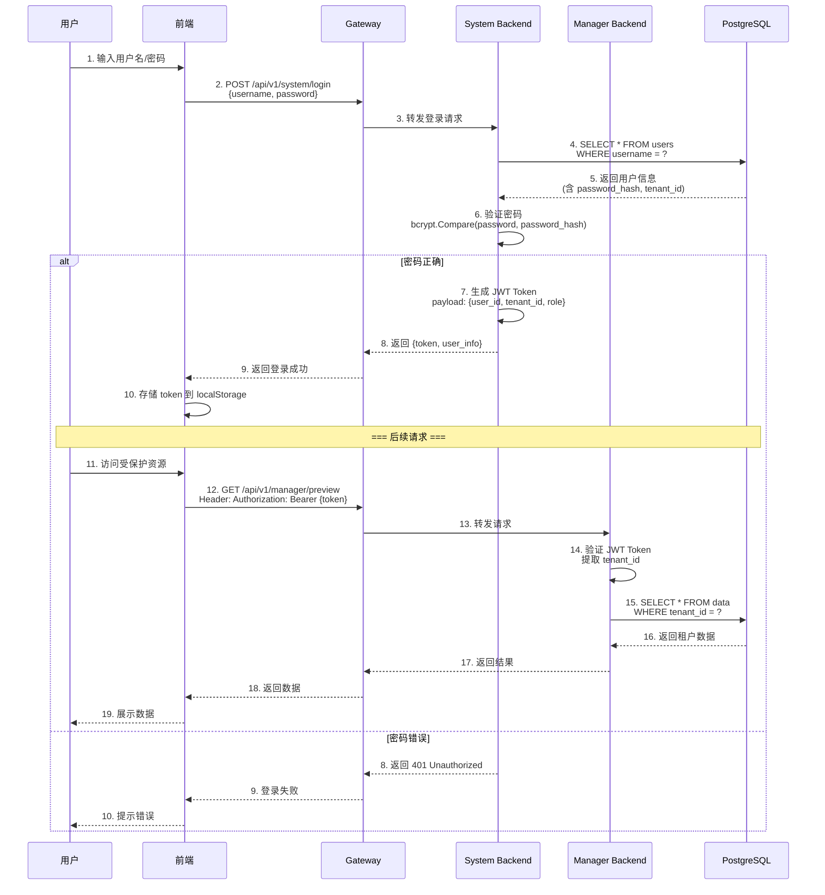

# ADDP 账号与权限体系图

本文档展示 ADDP 平台的用户类型、租户隔离机制和权限控制模型。

---

## 目录

1. [账号体系概述](#账号体系概述)
2. [用户类型层次](#用户类型层次)
3. [租户隔离机制](#租户隔离机制)
4. [RBAC 权限模型](#rbac-权限模型)
5. [认证流程](#认证流程)

---

## 账号体系概述

ADDP 采用**多租户架构**,支持不同级别的用户管理和权限控制:

- **多租户隔离**: 租户间数据完全隔离,资源独立管理
- **分级用户**: 超级管理员、租户管理员、普通用户三级体系
- **RBAC 权限**: 基于角色的访问控制,灵活配置
- **JWT 认证**: 无状态认证,安全高效

---

## 用户类型层次



### 用户类型详情

| 用户类型 | 权限范围 | 主要职责 | 默认账号 |
|---------|---------|---------|---------|
| **超级管理员<br/>SuperAdmin** | 跨租户,系统级 | - 管理所有租户<br/>- 创建/删除租户<br/>- 系统配置<br/>- 全局日志查看 | `SuperAdmin` / `20251001#SuperAdmin`<br/>⚠️ 默认禁用,需在 `.env` 中设置 `ENABLE_SUPER_ADMIN=true` |
| **租户管理员<br/>Tenant Admin** | 单个租户内 | - 租户内的用户管理<br/>- 含普通用户所有功能权限 | `admin` / `123456`<br/>(管理"默认租户") |
| **普通用户<br/>Regular User** | 单个租户内 | - 引擎管理<br/>- 数据查询/上传/删除<br/>- 工作流开发<br/>-服务发布<br/>-其他功能 | 由租户管理员创建 |

---

## 租户隔离机制

**租户 (Tenant)** 是 ADDP 平台中资源隔离的基本单位。



### 隔离机制详情

**1. 数据库隔离**:
- 所有业务表包含 `tenant_id` 字段
- SQL 查询自动添加 `WHERE tenant_id = ?` 条件
- 租户间数据完全隔离,无法跨租户访问

**2. 对象存储隔离**:
- MinIO 按租户组织目录结构
- 路径前缀: `/{bucket}/tenant_{id}/{category}/{resource}/`
  - `bucket`: 模块名(如 system、manager)
  - `category`: 模块内的功能分类(如 avatars、files)
- 示例: `/system/tenant_1/avatars/user123.png`
- 平台级对象使用 `tenant_0`,例如 `/system/tenant_0/audit-logs/2026/03/...`

**3. 缓存隔离**:
- Redis Key 命名规范: `{module}:{middleware}:{function}:tenant_{id}:{resource_id}`
- 示例: `system:cache:user:tenant_1:123`

**4. API 层隔离**:
- JWT Token 包含 `tenant_id` 字段
- 中间件自动提取 `tenant_id` 并注入上下文
- 所有查询和操作自动应用租户过滤

### 内置租户

- 系统启动时自动创建**"默认租户"** (ID=1)
- 所有用户必须归属于某个租户
- 超级管理员可创建新租户

---


## 认证流程

ADDP 使用 **JWT (JSON Web Token)** 实现无状态认证。



### 认证流程说明

**登录阶段**:
1. 用户输入用户名和密码
2. 前端发送登录请求到 Gateway
3. Gateway 转发到 System Backend
4. System 查询数据库验证用户
5. 验证密码(使用 bcrypt)
6. 生成 JWT Token,包含 `user_id`、`tenant_id`、`role`
7. 前端存储 Token 到 localStorage

**访问资源阶段**:
1. 前端请求携带 `Authorization: Bearer {token}` Header
2. Gateway 中间件验证 Token 有效性
3. 提取 `tenant_id` 并注入请求上下文
4. 后端自动应用租户过滤
5. 返回租户隔离的数据

### JWT Token 结构

```json
{
  "header": {
    "alg": "HS256",
    "typ": "JWT"
  },
  "payload": {
    "user_id": 123,
    "username": "admin",
    "tenant_id": 1,
    "tenant_name": "默认租户",
    "role": "admin",
    "exp": 1708099200,
    "iat": 1708012800
  },
  "signature": "..."
}
```

**Payload 字段说明**:
- `user_id`: 用户 ID
- `username`: 用户名
- `tenant_id`: 租户 ID(用于数据隔离)
- `tenant_name`: 租户名称
- `role`: 用户角色(用于权限控制)
- `exp`: 过期时间(默认 24 小时)
- `iat`: 签发时间

---

## 测试账号

ADDP 提供以下测试账号用于开发和演示:

| 账号类型 | 用户名 | 密码 | 租户 | 说明 |
|---------|-------|------|------|------|
| **租户管理员** | `admin` | `123456` | 默认租户(ID=1) | 管理默认租户的用户、引擎、数据 |
| **超级管理员** | `SuperAdmin` | `20251001#SuperAdmin` | - | 系统级管理、租户管理<br/>⚠️ 默认禁用,需在 `.env` 中设置 `ENABLE_SUPER_ADMIN=true` |

**启用超级管理员**:
```bash
# .env 文件
ENABLE_SUPER_ADMIN=true
```

---

## 相关文档

- [返回核心概念关系图](addp核心概念关系图.md)
- [ADDP 登录认证原理说明](addp登录认证的原理说明.md)
- [System 模块详情](../../system/CLAUDE.md)

---

**文档版本**: v1.0
**创建日期**: 2026-02-16
**作者**: ADDP 开发团队
