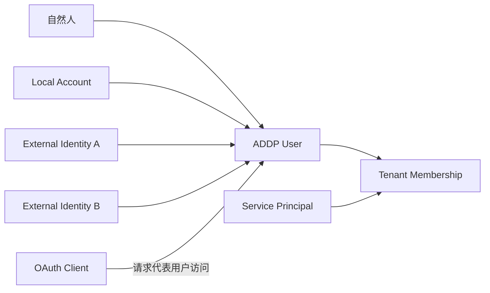
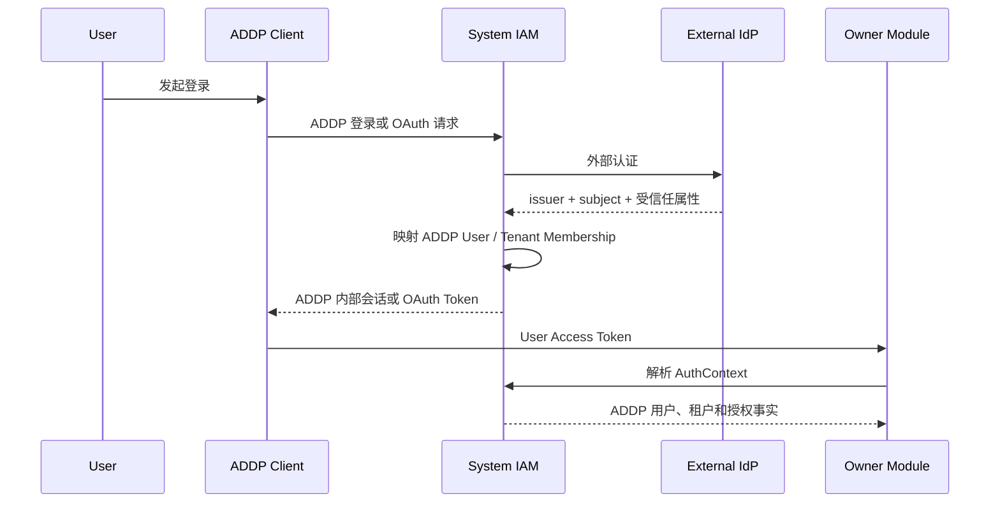
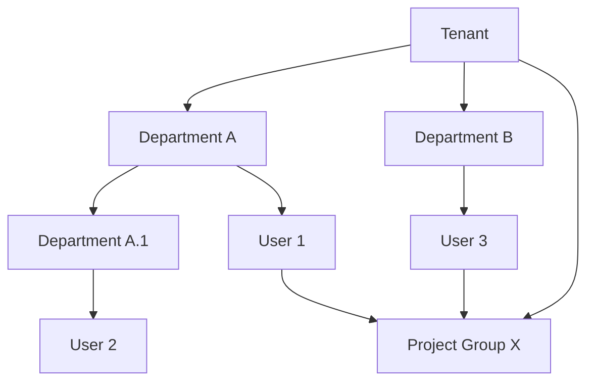
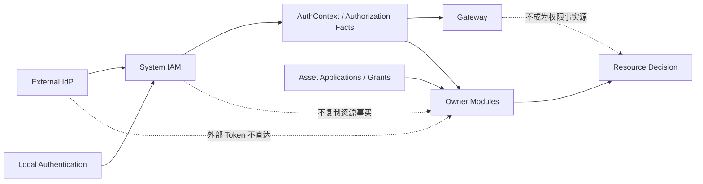

# ADDP 账号与权限体系

更新日期：2026-07-23

状态：正式概念文档。本文定义 ADDP IAM 的稳定概念、事实归属和授权边界，不预设 Fosite、Keycloak、Casdoor、OIDC Provider、SAML 或具体策略引擎。

## 一、目标

本文为 ADDP IAM（Identity and Access Management，身份与访问管理）体系建立概念共识，覆盖：

1. 没有外部 IdP 时，ADDP 自有账号、认证和授权闭环；
2. 存在外部 IdP 时，ADDP 与企业身份体系联合；
3. 浏览器 SSO、CLI、Device Flow 和后续非浏览器登录方式；
4. 租户内细粒度角色和功能权限；
5. 多级部门、跨部门项目组和数据资源权限。

本文只回答“有哪些稳定概念、事实归谁、边界如何划分”，不回答数据库表、API、协议库或产品选型。

## 二、当前事实与需要修正的认识

当前 ADDP 已具备以下基础：

- System 持有 `users`、`tenants`、opaque Token、Refresh Token Family、OAuth Client 和 AuthContext；
- Web、CLI 和外部 Agent 最终都映射为 ADDP User Access Token；
- 业务模块消费 System AuthContext，并继续执行租户和资源权限校验；
- OAuth Scope 只能缩小能力，不能提升用户权限；
- Asset 已有资产申请和授权事实，各业务 owner 已有部分资源级校验。

但当前模型仍有明显边界不足：

- `super_admin | tenant_admin | user` 是固定管理层级，不是完整 RBAC；
- Tenant 目前常被描述为“组织”，未来必须与部门树分离；
- AuthContext 还不能表达角色、组织成员关系和可计算的权限事实；
- 用户、角色、部门、项目组和资源授权之间缺少统一主体模型；
- 外部 IdP 身份映射、账号供应和离职撤权尚未形成概念闭环；

## 三、核心决策

本方案确定以下目标决策：

1. **ADDP 始终保留自己的内部用户身份。** 外部 IdP 负责证明“你是谁”，不能成为 ADDP 租户、权限和数据授权的直接事实源。
2. **System 是 ADDP 的唯一 IAM 权威。** 是否未来拆成独立部署不改变逻辑事实源，也不建立第二套用户、角色或会话。
3. **采用全局 User + Tenant Membership。** 同一个内部 User 可以加入多个 Tenant，但一次业务会话只能选择一个当前 Tenant；平台管理会话属于 Platform Realm，不与 Tenant 权限混用。
4. **身份、登录账号和认证方式分离。** 一个 ADDP User 可以绑定本地账号、一个或多个外部身份以及多种认证方式。
5. **认证与授权分离。** 登录成功只产生已认证主体；能否执行操作还要经过角色、权限、资源策略、上下文条件和审批判断。
6. **功能权限以 RBAC 为主，数据权限使用 RBAC + 关系/属性策略。** 不把部门名、项目名或数据路径编码进角色名称。
7. **部门和项目组是授权主体集合，不是角色。** 部门表达稳定组织归属，项目组表达跨部门协作。
8. **平台管理权不自动等于租户数据访问权。** 平台管理员默认只管理平台和 Tenant 生命周期；跨租户统计必须通过独立的聚合数据权限访问，租户业务明细只能通过显式 Tenant 授权或受审计的紧急访问获得。
9. **资源 owner 持有资源和细粒度授权事实。** System 提供身份、组织、角色和通用授权事实，不建立复制所有业务资源的中央 ACL 大表。
10. **默认拒绝，显式授权，拒绝优先。** Scope、角色和组织关系都只能在 Tenant 边界内增加候选允许，不能绕过 owner 的资源校验。

## 四、统一概念模型

### 4.1 身份域

| 概念 | 定义 | 不等同于 |
| --- | --- | --- |
| Platform Realm | ADDP 平台管理身份域，负责平台运维、安全审计和 Tenant 生命周期。 | 任意 Tenant 的业务空间。 |
| Tenant | 企业、学校、研究机构或独立业务主体的数据与权限隔离边界。 | 部门、学院、实验室或项目组。 |
| Tenant Membership | User 进入某个 Tenant 的有效成员关系。 | 登录账号本身。 |

一个 User 可以同时拥有多个有效 Tenant Membership。业务会话必须选择且只能选择一个当前 Tenant，切换 Tenant 时重新建立对应的授权上下文，不能把多个 Tenant 的 Role、Department、Project Group 或资源权限合并到同一个 AuthContext。

平台管理会话进入 Platform Realm，不设置当前 Tenant，也不通过 `tenant_id=null` 自动获得所有 Tenant 的业务权限。一个 User 可以同时具有平台角色和 Tenant Membership，但平台管理上下文与 Tenant 业务上下文必须互斥，权限来源和审计记录必须明确区分。

### 4.2 主体与账号

| 概念 | 定义 | 关键约束 |
| --- | --- | --- |
| User | ADDP 内部的自然人身份，是审计、授权和资源归属的稳定主体。 | 外部 IdP 用户必须先映射为 ADDP User。 |
| Local Account | ADDP 自己管理的登录标识和本地凭据。 | 凭据不是 User 本身。 |
| External Identity | 外部 IdP 的稳定身份，主键语义为 `issuer + subject`。 | 不以邮箱作为永久唯一身份。 |
| Service Principal | 应用、自动化任务或工作负载的非人主体。 | 不伪装成 User，不使用用户密码。 |
| OAuth Client | 请求用户授权的客户端软件。 | 不是 User、Service Principal、Tenant 或角色。 |
| Principal | 一次请求中正在被授权判断的主体，可以是 User 或 Service Principal。 | 不等同于客户端软件。 |



### 4.3 认证方式

Authentication Method 表达主体如何证明身份，可以包括：

- 本地用户名/密码；
- Passkey、OTP 或其他 MFA 因子；
- 外部 IdP 联合登录；
- 恢复码或受控账号恢复；
- CLI Authorization Code + PKCE；
- 无浏览器环境的 Device Authorization Flow；
- Service Principal 的工作负载认证。

CLI 和 Device Flow 是登录交互通道，不是新的用户体系。无论入口如何，最终都必须建立 ADDP 内部会话和 AuthContext。

### 4.4 外部 IdP 与身份联合

外部 IdP 接入时，ADDP 同时承担两个逻辑角色：

1. 对外部 IdP，ADDP 是依赖方，消费外部认证结果；
2. 对 ADDP Web、CLI 和业务模块，System 仍是内部会话与授权上下文权威。



边界如下：

- 外部 Access Token、ID Token 或 SAML Assertion 不直接进入业务模块；
- 外部组、部门和角色不能未经映射直接成为 ADDP 权限；
- 每个外部属性必须明确权威来源、同步方向和失效规则；
- IdP 账号停用、解绑或离职必须能够终止 ADDP 会话并撤销有效授权；
- Tenant 可以配置自己的 IdP 和映射规则，平台可以提供默认 IdP，但不能跨 Tenant 混用映射结果；
- 本地账号是否允许、是否作为应急账号，由 Tenant 安全策略决定，不能形成绕过外部 IdP 的默认后门。

### 4.5 SSO

SSO 表示用户在可信身份域完成一次认证后，可以在策略允许的 ADDP 客户端之间复用登录状态。它不表示所有客户端共享同一个 Token。

- 浏览器通过 System Browser AuthSession 获得第一方会话；
- CLI 通过浏览器中的同一 SSO 会话完成 Authorization Code + PKCE；
- 无浏览器设备通过 Device Flow 由另一个已登录终端确认；
- 每个客户端获得自己的 Token Family、client identity、audience 和 Scope；
- 退出分为当前客户端退出、当前 ADDP User 全局退出、外部 IdP 单点退出，三者必须在后续规范中分别定义；
- SSO 复用认证，不跳过 ADDP 的 Tenant、角色和资源授权。

## 五、组织模型

### 5.1 Department

Department 是 Tenant 内的稳定层级组织单元，例如学院、事业部、中心、实验室或科室。

- Department 形成单棵或多棵有向树，不允许循环；
- 一个 Department 只能属于一个 Tenant；
- User 可以有一个主部门和零到多个附加部门成员关系；
- Department Membership 可以表达负责人、成员等组织关系，但这些关系本身不是全局功能角色；
- 父部门授权是否覆盖子部门必须由策略显式声明，不做隐式继承。

### 5.2 Project Group

Project Group 是 Tenant 内面向跨部门协作的成员集合，例如科研课题组、联合项目组或专项工作组。

- 可以包含不同 Department 的 User；
- 不能包含其他 Tenant 的 User；
- 不改变 User 的主部门和组织归属；
- 可以有项目负责人、管理员、成员等组内角色；
- 第一阶段不支持项目组嵌套，避免循环和难以解释的继承；
- 可以有开始时间、结束时间和关闭状态，关闭后相关临时授权应失效。

### 5.3 为什么 Department 和 Project Group 必须分开

Department 回答“用户稳定属于哪里”，Project Group 回答“用户当前与谁协作”。二者生命周期、层级结构和权限继承不同，不能用一个通用 `group` 字段混在一起。



## 六、角色与功能权限

### 6.1 Permission

Permission 是稳定、最小的功能动作，例如“查看用户”“创建工作流”“发布数据服务”。Permission 由对应 owner 模块以版本化 Manifest 定义，经唯一发布期聚合进入 System 运行时目录；不由 Tenant 任意创造新的动作语义。System 只理解 Permission 的稳定 Key、owner、Scope 和组合属性，不理解业务实现或资源 Policy。

### 6.2 Role

Role 是 Permission 的命名集合。目标体系允许：

- ADDP 内置平台角色；
- ADDP 内置 Tenant 角色；
- Tenant 基于稳定 Permission 创建自定义角色；
- owner 模块提供领域 Permission，但不各自建立用户和角色体系。

Role Assignment 必须包含明确 Scope：Platform、Tenant、Department 或 Project Group。具体业务资源范围由 owner 的 Resource Grant / Policy 表达，不进入 System Role Assignment。`tenant_admin` 不应继续作为同时表达身份类别和全部权限的永久字段。

### 6.3 管理角色与业务角色

管理角色和业务角色应分离：

| 层级 | 示例职责 | 默认边界 |
| --- | --- | --- |
| Platform Role | 平台配置、Tenant 生命周期、安全审计 | 不自动读取 Tenant 业务数据 |
| Tenant Administration Role（用户界面：租户组织与权限管理员） | 用户、角色、IdP、组织管理 | 当前 Tenant；不自动包含基础设施或业务权限 |
| Business Role | 数据开发、资产管理、服务发布、质量管理 | 当前 Tenant 和明确 Scope |
| Project Role | 项目负责人、项目成员 | 当前 Project Group |

Tenant 没有独立登录账号或租户密码。User 先通过全局账号完成认证，再选择一个由有效 Tenant Membership 提供的 Tenant Context。平台安全管理员负责创建普通 User 和凭据，平台系统管理员负责创建或初始化 Tenant 并指定首位 Tenant Administrator；两项职责不能合并到平台系统管理员。

普通 User 遗失本地密码时，平台安全管理员可以通过受控的 Local Account 密码重置能力替换其凭据。重置必须撤销该 User 的既有会话并写入高风险审计，且不能用于任何有效平台角色持有人；平台三员只能本人修改密码，或在三员凭据整体失效时使用离线灾难恢复流程。

### 6.4 平台三员分立

目标模型在 Platform Realm 采用三员分立，使用三个内置且不可修改权限集合的平台角色替代永久 `super_admin`。这里的三员是职责分离，不是把一个超级管理员改成三个名称不同但都可执行全部操作的账号。

| 平台角色 | 主要职责 | 明确禁止 |
| --- | --- | --- |
| Platform System Administrator（平台系统管理员） | 平台运行配置、模块与基础设施运维、Tenant 生命周期、备份恢复和可用性管理 | 管理账号和角色、修改认证安全策略、读取或删除审计记录、默认读取 Tenant 业务数据 |
| Platform Security Administrator（平台安全管理员） | User 和 External Identity 生命周期、平台角色任命流程、认证与 MFA 策略、外部 IdP、安全策略、会话撤销和权限治理 | 平台运行运维、读取 Tenant 业务数据、修改或删除审计记录、独立完成自己的提权 |
| Platform Audit Administrator（平台审计管理员） | 查询和导出不可篡改审计记录、检查三员履职和权限变更、维护审计报表与告警 | 平台运维、账号与权限管理、业务操作、修改或删除原始审计记录、降低最低审计保留要求 |

强制约束如下：

- 三个角色在同一自然人维度互斥；不得通过多个 User、External Identity、临时授权或委托令牌规避互斥；
- 三员只能使用实名 User 和强 MFA，Service Principal、共享账号和 OAuth Client 不得持有三员角色；
- 一次特权会话只激活一个平台角色，不能同时混入 Tenant Role；切换职责必须重新建立短时特权会话并记录认证强度；
- 三员角色的新增、变更和撤销必须由不同主体申请、复核，不能由任一管理员独立闭环；具体审批人组合在权限治理规范中确定；
- 三员角色定义和互斥规则属于平台内置安全策略，Tenant 自定义 Role 不能复制其受限 Permission，也不能组合出等价的全权角色；
- 不保留常驻 root 或超级管理员。紧急处置使用双人批准、限定动作、限定时长、自动失效且全程审计的 Break-glass Grant；它也不能删除审计记录或静默修改三员规则；
- 审计记录应写入追加式、独立保护的存储。拥有业务数据库管理能力的主体不能同时拥有审计记录删除或覆盖能力。

最终等保定级、适用控制项和测评口径仍需由项目的定级与测评结论确认；ADDP 的目标模型先提供可被严格执行的职责分离能力，而不把合规简化为角色命名。

## 七、数据与资源权限

### 7.1 资源授权不是功能 RBAC 的附属字段

功能 Permission 回答“能否调用某类能力”，资源授权回答“能否对这个资源执行该动作”。两者必须同时满足。

例如，拥有 `data.read` 功能权限不意味着可以读取 Tenant 内所有 Data Item；还必须由 Manager、Meta、Asset、Service 或其他 owner 判断目标资源是否授权给当前主体。

### 7.2 可授权主体

资源授权的目标可以是：

- 单个 User；
- Department 的直接成员；
- Department 及其显式包含的子部门成员；
- Project Group；
- 具有特定 Role 的主体集合；
- Service Principal。

Project Group 获得资源权限不会把权限传播到成员所属 Department，Department 获得权限也不会自动传播到成员参与的 Project Group。

### 7.3 Owner 边界

| 事实 | Owner |
| --- | --- |
| User、Service Principal、Tenant Membership | System IAM |
| Department、Project Group、成员关系 | System IAM |
| Permission 定义 Manifest | 对应业务 owner；System 能力由 System 自身拥有 |
| Permission 运行时目录、Role、Role Assignment | System IAM |
| Token、Session、OAuth Client、AuthContext | System IAM |
| 资源身份、资源层级和资源属性 | 对应业务 owner |
| 资源 Grant、资源 Policy 和最终访问判断 | 对应业务 owner |
| 数据资产申请、审批和有效期 | Asset |
| 写操作业务审批 | 对应业务 owner |
| 路由、粗粒度认证和流量治理 | Gateway |

Asset 的授权记录是一种业务授权来源，不等于全平台 IAM Role。Owner 可以消费 Asset 授权事实，但最终资源访问判断仍在 Owner 边界执行。

### 7.4 统一判定原则

```text
Allow = Principal 有效
  ∩ Tenant Membership 有效
  ∩ Tenant 有效
  ∩ Token audience / scope 允许
  ∩ Role Permission 允许
  ∩ Owner Resource Grant / Policy 允许
  ∩ 上下文条件允许
  ∩ 必要审批已完成
  ∩ 不存在显式 Deny
```

规则：

- 默认拒绝；
- Tenant 边界优先于所有 Allow；
- 显式 Deny 优先于 Allow；
- 多个 Allow 可以合并，但不能突破 Token Scope；
- 时间、项目状态、数据密级、网络位置等可以成为条件；
- 临时授权必须有明确有效期和撤销事实；
- SuperAdmin、TenantAdmin、Department Owner 等称谓都不能绕过 owner 资源权限。

### 7.5 跨租户全局统计

平台治理确实需要全局统计，例如 Tenant 数量、活跃用户趋势、任务成功率、容量使用和安全风险概况。该需求合理，但“查看全局统计”必须建模为独立的数据产品和只读 Permission，不能解释为平台管理员可以读取全部 Tenant 明细后自行汇总。

全局统计区分三类访问：

| 统计层级 | 示例 | 授权方式 |
| --- | --- | --- |
| 平台汇总 | Tenant 总数、总任务量、整体容量和可用性 | `platform.statistics.summary.read` |
| Tenant 维度聚合 | 各 Tenant 容量、活跃度、任务成功率 | `platform.statistics.tenant_breakdown.read`，按指标目录显式开放 |
| Tenant 业务明细 | 用户记录、数据内容、任务参数、SQL、文件名和逐条审计详情 | 不属于全局统计；必须进入对应 Tenant 上下文取得业务授权，或使用 Break-glass Grant |

实现边界在概念上确定为：

- 每个 owner 模块定义自己可以对外发布的指标及聚合口径，统计服务只消费受控指标，不获得任意查询 owner 业务表的全权凭据；
- 指标目录必须声明 owner、统计口径、允许维度、敏感级别、刷新周期、保留期和最小聚合粒度；涉及小样本、个人或敏感资源时应隐藏、合并或拒绝返回；
- 平台统计使用专门的只读投影或汇总表。缓存、导出和 API 都执行同一权限与脱敏规则，不保留绕过策略的查询入口；
- `Platform Statistics Viewer` 是独立的平台只读角色，可以按部署策略授予平台系统管理员或独立运营人员，但不自动包含在任一三员角色中；
- 系统运行统计、安全统计和审计统计分别遵循系统管理员、安全管理员、审计管理员的职责边界；跨租户业务统计必须额外获得相应 Statistics Permission；
- Tenant 维度查询、筛选和导出必须记录访问审计；任何从聚合统计下钻到业务明细的操作都重新执行 Tenant Membership、Role 和 owner 资源授权判断；
- Statistics Permission 只允许读取已发布统计结果，不授予 `tenant.data.read`，也不能作为 API 批量枚举 Tenant 业务资源的依据。

## 八、AuthContext 的目标定位

AuthContext 是一次请求的权威主体投影，不应膨胀为“当前用户能访问的全部资源列表”。目标上应能够表达：

- Principal 类型和稳定 ID；
- User、Tenant 和 Tenant Membership 状态；
- 当前登录方式、客户端、audience 和 Scope；
- 平台及 Tenant 级 Role Assignment 的必要投影；
- Department / Project Group 成员关系的版本或引用；
- MFA、认证时间等必要上下文；
- 委托身份和审计绑定。

资源级 Grant 不批量塞入 Token 或 AuthContext。Owner 使用 AuthContext 中的主体事实，结合自身资源和策略完成判断。高频身份事实可以缓存，但版本变化、成员撤销和角色调整必须能使缓存失效。

## 九、身份和权限生命周期

### 9.1 账号供应

ADDP 应支持两类来源，但最终生成同一种内部 User：

- 本地管理员创建或邀请；
- 外部 IdP 首次登录即时供应，或通过目录同步预先供应。

是否允许即时供应、默认进入哪个 Tenant/Department、是否自动分配 Role，必须由 Tenant 策略决定。

### 9.2 属性权威

每个身份属性必须明确权威来源：

- 本地管理；
- 外部 IdP；
- 外部目录同步；
- 用户自助维护。

同一属性不能同时由多个来源无规则覆盖。外部组和属性只能通过显式映射形成 ADDP Department、Project Group 或 Role Assignment。

### 9.3 停用与离职

User、Tenant Membership、External Identity 或 Project Group Membership 被停用时，应触发：

- 新请求立即拒绝；
- 现有会话和 Token Family 撤销；
- AuthContext 缓存失效；
- 临时资源授权和委托令牌失效；
- 资源所有权按 owner 规则转移或冻结；
- 完整审计记录。

## 十、安全与治理原则

- 高权限角色必须强制 MFA，并按职责使用双人审批或职责分离；
- 平台管理员查看已发布的跨租户聚合指标需要独立 Statistics Permission；访问 Tenant 业务明细必须进入显式授权的 Tenant 上下文，或者使用限时、可审计的 Break-glass Grant；
- Role、Permission、组织成员、IdP 映射和资源 Grant 的变更必须审计；
- 授权拒绝保留稳定原因和 Request ID，但不泄露其他 Tenant 或敏感资源存在性；
- 外部 IdP 不可用时的降级策略必须显式，不能静默回退到弱认证；
- 删除 User 不应破坏历史审计，业务资源归属需走 owner 生命周期规则；
- 所有权限计算必须可解释：能够回答主体、动作、资源、允许来源、拒绝原因和策略版本。

## 十一、模块边界



System IAM 负责统一身份和通用授权事实，但不承载所有业务资源 ACL。Gateway 负责流量入口和粗粒度策略，但不根据 URL 自行推断数据权限。Owner 模块是资源访问的最终执行点。

## 十二、当前实现到目标模型的概念迁移

| 当前概念 | 目标解释 |
| --- | --- |
| `users.user_type=super_admin` | 按实际职责拆分为互斥的 Platform Role Assignment，删除全权角色，不再隐式获得 Tenant 数据权限。 |
| `users.user_type=tenant_admin` | 迁移为 Tenant Administration Role Assignment。 |
| `users.user_type=user` | 回归普通 User 身份，不代表具体业务权限。 |
| `users.tenant_id` | 迁移为独立 Tenant Membership；业务会话只投影唯一当前 Tenant。 |
| OAuth Scope | 继续作为客户端令牌能力上限，不替代 Role Permission。 |
| Asset Authorization | 保持 Asset 业务授权事实，不升级为全局 Role。 |
| owner 内部权限判断 | 保持最终执行责任，但统一消费 IAM 主体和授权事实。 |

实施时只允许一次性切换到目标模型，不保留 `user_type` 与 Role 双轨权限判断。

## 十三、已确认的概念决策

1. **User 与 Tenant 的关系**：采用全局 User + Tenant Membership；一次业务会话只选择一个当前 Tenant，平台管理会话与 Tenant 业务会话互斥。
2. **平台最高管理权限**：以平台系统管理员、平台安全管理员和平台审计管理员三员分立替代永久 `super_admin`，角色互斥且不存在全权合并角色。
3. **平台管理员的数据权限**：默认无 Tenant 业务数据权限；聚合统计通过独立 Statistics Permission 访问，业务明细只能通过显式 Tenant 授权或 Break-glass Grant 访问。
4. **Department 成员关系**：一个主部门、多个附加部门，父子部门授权默认不继承，策略可显式包含子部门。
5. **Project Group 边界**：严格限制在单 Tenant，第一阶段不支持嵌套。
6. **Tenant 自定义角色**：允许基于 ADDP 稳定 Permission 组合自定义 Role，但不允许创造任意 Permission 字符串。
7. **Permission 所有权**：业务 Permission 由对应 owner 模块定义，通过唯一发布期聚合生成 System 运行时目录；System 不拥有业务实现语义，模块也不在启动时动态注册 Permission。
8. **资源显式 Deny**：支持并优先于 Allow，用于密级数据和例外隔离。
9. **外部身份供应**：同时保留管理员预配和策略控制的即时供应，不默认开启即时供应。
10. **Service Principal**：纳入同一 IAM 主体模型，但与 User、OAuth Client、API Key 严格分离。

## 十四、后续技术讨论顺序

概念已经确认。下一阶段按以下顺序讨论技术实现，避免先选产品再反推模型：

1. User、External Identity、Tenant Membership、Department、Project Group 的目标数据模型；
2. Permission 目录、Role、Role Assignment、三员互斥规则和权限命名；
3. AuthContext / Authorization Facts 契约及缓存失效；
4. owner 资源 Grant / Policy 接口和 Asset 授权衔接；
5. OAuth/OIDC Server 协议实现与 Fosite 等技术选型；
6. 本地认证、MFA、账号恢复和会话治理；
7. 外部 IdP 联合、账号供应和单点退出；
8. 管理控制台、跨租户统计、审计、紧急访问和迁移方案。

前四项边界和第 5 项协议引擎决策已经完成；决策结果见 [ADDP IAM OAuth/OIDC 协议引擎 ADR](../next/addp-IAM%20OAuth-OIDC协议引擎ADR.md)。下一步先完成协议存储边界和首批 IAM 数据基础，再进入本地认证、MFA 与账号恢复设计。
