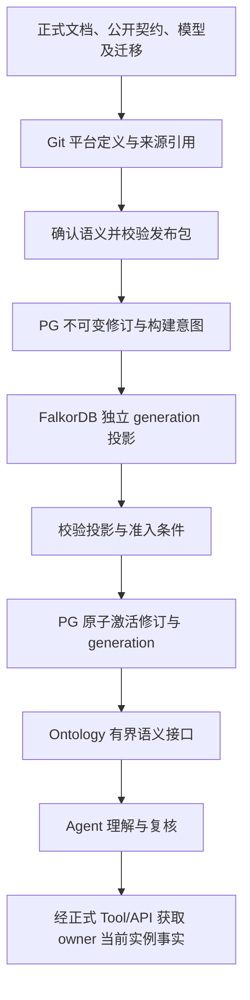

# ADDP Ontology 最小设计契约

更新日期：2026-10-08。

状态：独立 Ontology 的原生语义内核、PG 修订/发布服务、FalkorDB 投影适配和单机 Infra、System 内部任务授权、投影执行/激活及失败批次显式重建、常驻 Backend、管理 HTTP 入口与 Console 建模页面已实现，范围与标准验证入口见 [模块说明](../../ontology/CLAUDE.md)。两个原生定义只读 Agent Tool 已交付，并于 2026-09-18 完成本地真实用户的建模、发布激活和 Agent 读取联调；这不是业务实例查询验收，也不替代隔离部署的正式 T4。真实 T4 首跑被公共 Infra 的 MinIO 镜像拉取失败阻塞，未进入本体断言；该验收暂缓，不算通过。当前不调整 Graph，后续另行讨论其职责迁移。本文的目标设计不代表功能均已实现。

## 1. 目标与范围

### 当前建模页面切片

Console 数据治理组提供独立 Ontology 入口，不改动 Graph。原生类型、属性、关系、规则使用同一份表单草稿，保存仍由现有 Backend 校验、编译和生成摘要；浏览器不执行 CEL。页面只消费当前 Tenant 的正式管理 API，不访问 PG 或 FalkorDB。

模块内公开路由为 `/ontologies`、`/ontologies/new`、`/ontologies/:ontology_id`、`/ontologies/:ontology_id/revisions/:revision`。列表分页使用 `page`（默认 1 省略）；编辑器页签使用 `tab=properties|relations|rules`（默认 classes 省略）。新本体创建 revision 1；新修订从已保存定义复制并使用 head.last_revision+1。保存和状态流转携带精确 version；409 不自动重试、不覆盖本地编辑。发布/重建的 202 或含 intent 的 502 不表示激活，必须重新读取修订、最新投影与 active 指针；传输结果不确定时锁定写操作，要求显式重新加载后再决定下一步。投影 ready 也仅在 head.active_generation 匹配时显示为当前生效。

首轮页面提供创建、保存、提交审核、退回草稿、发布、撤回和失败投影显式重建。操作同时受状态与 Permission 限制，发布/重建额外要求执行授权权限。离页保护、认证、语言、主题和 Console 导航复用 common-frontend。T0 检查生命周期和 CI 登记，T1 验证状态/请求契约，T3 使用独立端口与受控 API 夹具验证交互；不借此声称真实 T4 或 Agent 已通过。

目标是让 Agent 使用用户明确建设的领域概念、关系、规则和数据映射，减少猜测，并对结论给出可核对的依据。不是用图数据库替换 Skill + Tool，也不是把业务数据整体搬进图数据库。

首版路线：

- 独立 `ontology` 业务模块，后端 Go + Gin + GORM，前端 Vue 3，沿用 ADDP 共享能力。
- Infra PostgreSQL 的 `ontology` owner schema 保存本模块权威定义、修订和发布控制事实；FalkorDB 保存可重建的已发布语义关系投影。
- CEL-Go 执行有限、确定性的分类条件；关系语义由 Ontology 服务明确实现，不交给 LLM 自行推断。
- 用户业务数据留在原业务库，访问仍走拥有该能力的正式 owner。
- Agent 保留现有 Skill、Tool Manifest、ToolExecutor、Python SDK、Gateway 和委托身份链路。
- 按层推进：已有 Tenant 原生定义保留，下一切片优先落实平台能力语义，以 Agent 理解和复核 Transfer 配置验收；个人联调按用户最新指定使用 MongoDB Outdoor → PostgreSQL Outdoor。具体源身份须由用户确认，不将近似表名自动替换；草稿确认、任务创建和实际运行分别验收，不扩大用户操作授权。领域数据绑定随后实施，不以导入全平台文档为前置条件。

不纳入首版：完整 RDF/OWL 推理、任意递归规则、任意 CEL 到 SQL/Cypher 的自动编译、通用 GraphRAG、全量业务实例复制、另建 Python/Java 本体服务，以及新的中心 Tool 服务。

### 1.1 三层语义与事实

2026-10-03 确认以下分层。它们表示 Agent 理解与执行时组合的不同知识，不表示需要创建三个数据库或将所有模块事实搬入 Ontology。

| 层次 | 回答的问题 | 权威来源与当前边界 |
| --- | --- | --- |
| 平台能力语义 | 用户意图对应 ADDP 的哪些功能、Skill 和 Tool？ | 平台概念文档、模块接口契约、Skill 与 Tool Manifest；结合 System 当前模块登记及运行时实际可用性、用户权限判断。已有 Transfer 创建能力定义、不可变 PG 修订、启动安全发布及唯一 PG active 消费；管理员查看尚未接入，真实 Agent 发布消费链路待验收。不能把 Tenant 定义当作平台定义，也不以建设平台本体为领域建模前置。 |
| 租户领域语义 | 业务对象、关系、口径和规则是什么？ | Ontology 自有定义与明确引用的专业 owner。Standard、Model 可提供业务定义；Meta 提供结构事实，Quality 提供规则与检查结果，Catalog 提供企业身份、责任及治理关联。各类来源按专业含义消费，不自动转换为可编辑本体定义。 |
| 运行时业务事实 | 本次授权读取中，具体对象处于什么状态？ | 数据读取 owner 的实际结果，绑定对象身份、时点、范围和完整性。业务数据留在原库；事实随读取变化，不写入本体定义包，也不要求复制到 FalkorDB。 |

Agent 将三层组合：平台能力语义辅助选择合法操作，领域语义说明业务含义与规则，运行时事实支撑具体判断。静态能力定义不证明对应模块已部署、Tool 可执行或用户有权限；本体关系声明也不证明实例关系已经存在。

### 1.2 可选模块与请求依赖

Ontology 不假设除 System 之外的任何业务模块已经部署或被用户使用，Agent 本身也不是 Ontology 的运行前置。自身 PG、FalkorDB 是必需 Infra；统一生命周期下 Alive 不要求 System 当时可达，Ready 要求自身 Infra 正常及 System 当前注册成功。其他业务模块不可达不影响 Ontology 启动、Ready、自有定义编辑发布或手工试算。

跨模块协作按明确操作通过正式 Client SDK/API 发起，不跨 Schema、不保存业务连接凭据，不因 SDK 可导入就认为远端能力存在。依赖只约束使用它的请求：引用某个 Standard 修订或读取某个来源时，该 owner 缺席、不可达或拒绝访问应明确阻断本次操作，不能阻断无关本体功能。稳定 owner 引用和已发布内容不得静默改绑其他来源。

客户端必须区分模块未提供、暂不可达、身份或权限拒绝、来源不存在、内容尚未建设、版本变化和观察不完整；可使用的公开分类以对应 owner 契约为准，404 等隐藏资源响应不得用于探测跨 Tenant 事实。上述情况不能统一解释为无数据、false 或空集合，不自动切换 owner，也不由 LLM 补齐未观察事实。Catalog 治理信息缺失不影响合法的独立本体操作，但显式选择的 Catalog 关联不可用时不能伪造其当前责任或审核状态。

### 1.3 平台 Transfer 首个切片

2026-10-08 确认：先按平台定义随代码维护、发布后不可编辑的路线推进，不实现平台管理员在线修订；是否引入在线修订另行讨论。Git 是代码和依据的版本来源，不是新增 Infra，也不是管理员操作本体的必要工具。平台定义不使用 Tenant 身份，平台发布准入与 Tenant 管理权限分开设计。

平台定义由 Ontology 唯一提供，与代码版本一起发布，具有独立 `platform_definition` 标识、修订与内容摘要；不使用 Tenant=0，不走租户定义的编辑发布 API。当前已装配启动机器发布及 PG active 只读消费，内部发布内核见 1.10，唯一消费见 1.11；不新增管理员在线编辑生命周期，真实 Agent 验收另行进行。定义只描述概念、关系、前置条件和效果，不复制权限表、API 地址或数据库凭据。Tool 名及 owner 由唯一 Manifest 核对，Skill 负责执行步骤，原 owner 继续提供事实与校验。

`platform.capability.context` 读取确定能力的有界上下文。首个能力为 `transfer.task.create`：持久化任务定义不等于启动 execution，不等于已经写入目标数据。Agent 先读取此上下文，再经 System/Meta/Manager 的正式 Tool 确认可访问引擎、源资源、结构事实和目标父节点；其他模块缺席只阻断本次任务，不成为 Ontology Ready 前置。Catalog、Standard、Model、Quality 和租户本体不参与该验收前置。

创建 Tool 仅开放 `bounded + snapshot + native table` 的无计划任务；请求不开放调度、启动、continuous 或任意连接配置。MongoDB 嵌套结构需要明确一文档一行或单数组元素一行，源侧标准只读 MQL 负责整形，目标字段映射消费实际查询输出，不自动递归摊平。信息不足先澄清，展示完整配置并经用户确认后调用唯一 Transfer 创建 API；元数据写操作不要求 owner 执行审批，但不继承运行授权，不自动重发结果不确定的创建请求。

验收必须分别证明：平台定义被实际读取；源和目标来自可信 owner；创建成功返回真实任务身份且为 idle/stopped、无启用计划；未生成 execution、未写业务数据。离线契约和受控 HTTP 测试不代替真实 Agent/LLM/用户身份验收；真实链路尚未运行时明确列为待验收。

### 1.4 平台语义的多源依据与唯一所有权（目标契约）

2026-10-08 确认：平台本体不是全量文档索引、数据库表结构镜像或接口清单。多种来源分别证明操作含义、公开能力、实现结构或当前实例事实；确认后的结构化定义及语义来源引用由 Ontology 唯一管理。下表以 Transfer 为例，不表示来源采集和新发布链路已经实现。

| 来源或存储 | 能证明的内容 | 纳入方式与边界 |
| --- | --- | --- |
| 正式概念与规范 Markdown | 模块职责、概念含义、操作条件、效果、保证及限制 | 引用确定文档版本和章节；草案、历史分析及演示不是默认权威依据，不把整篇文本自动提升为本体规则 |
| owner 公开 API 契约、Tool Manifest、能力声明 | 请求/输出结构、操作开放范围、Tool owner 及调用要求 | 按各自职责引用并校验；owner API 存在不代表已开放 Agent Tool，Manifest 不替代服务端校验 |
| 仓库内的模型、迁移及行为测试 | 实现对象、存储字段、约束、关联及可验证行为 | 用于概念到实现的对应和变更影响核对；不是每张表一个类、每个字段一个属性，不从枚举或方法名猜完整业务语义 |
| PG `transfer` schema 的实际记录及 `common.task_executions` | 某个任务配置、状态、已提交位置及某次运行结果 | 属于实例事实，仍由 Transfer 等 owner 管理；运行消费只走正式 Client SDK/API，不跨 schema 直读，不复制进平台定义 |
| `ontology/backend/internal/platform/transfer.json` | 当前整理后的 Transfer 创建能力语义 | 是可审查的定义发布源，不是独立数据库，也不是原始依据的替代物；只供部署编译和静态测试，不供运行消费或错误回退，发布链路见 1.11、5.1.1 |
| PG `ontology` schema | 本模块正式定义、来源捕获、修订、审计及激活事实 | 平台和 Tenant 定义的权威存储，作用域和权限分离；已有平台不可变记录、发布激活内核及启动发布/唯一 active 消费（1.8–1.11），来源捕获仍待实现；不能套用 Tenant 表及发布准入 |
| Infra FalkorDB | 确定修订生成的成员及关系投影 | 无独立编辑权、无第二个当前版本指针；不是业务实例主库或自动规则推理器 |

`transfer.transfer_tasks.config` 是某个传输任务的具体配置，不是“传输任务”这一平台概念的定义。概念解释可以不依赖 Transfer 已部署，当前任务与运行结果则必须在授权和确定观察范围内向 owner 获取。数据库物理位置相同，不消除模块所有权边界。

### 1.5 Transfer 概念、来源与事实入口映射（目标契约）

正式语义依据为 [Transfer 基本概念及配置](../../transfer/docs/transfer-基本概念及配置说明.md) 与 [任务语义与同步模式](../../transfer/docs/transfer-任务语义与同步模式.md)。结构依据为 [数据库架构](../../transfer/docs/数据库架构.md)、[模型](../../transfer/backend/internal/models/task.go) 及 owner 迁移；公开路由以 [Transfer Router](../../transfer/backend/internal/api/router.go) 和其契约为准。下表中的 API 均使用 `/api/v1/transfer` 前缀；列出公开 API 仅说明事实 owner，不给 Agent 开放这些接口或委托权限。

| 概念或操作 | 正式语义依据 | 实现对应（仅供来源追溯） | 公开契约与运行时事实入口 | 必须表达的边界 |
| --- | --- | --- | --- | --- |
| 传输任务定义 | 基本概念 1.1；任务语义第 1、5 节 | `TransferTask` / `transfer.transfer_tasks` | `/task-definitions/{id}`；当前已开放 `transfer.task.create` Tool 的受限创建 | 固定 `task_type=sync`；具体任务配置不是本体定义，创建不等于运行 |
| 一次执行 | 基本概念 1.2；任务语义第 5 节 | `common.task_executions`，由 Transfer 管理其 execution | `/executions/{execution_id}`；任务历史 `/task-definitions/{id}/executions` | execution 与任务身份不同；一次性 execution 可以没有任务定义，任务 idle 不证明执行成功 |
| 执行边界、装载及变化识别 | 任务语义第 2–4 节 | 任务配置 `runtime.boundary`、`load.mode` 及变化识别配置 | `/capabilities` 与确定任务详情；引擎 Provider 能力另向其 owner 获取 | bounded/continuous、snapshot/incremental 相互区分；watermark 不等于 CDC，不能识别物理删除；当前支持范围必须核实 |
| 源、目标、字段映射及行粒度 | 基本概念 2.2–2.3；任务语义第 1 节 | source/target endpoint、标准查询及 `field_mapping` | Meta/Manager 正式资源目录与事实 Tool；Transfer 配置和 owner 校验 | 目标父节点与名称不冒充已有源；实际查询输出才是映射输入，复杂加工属于 Develop |
| 目标写入策略 | 任务语义 2.5、4.1–4.2 | `target.policy.apply_mode`、稳定键及 Provider 校验 | `/capabilities`、任务详情及所选引擎能力 | replace、append、upsert 与删除传播效果不同；“同步”不能默认覆盖目标 |
| 调度与暂停/恢复 | 任务语义 2.4、6.4；正式任务 API | owner scheduler、`schedule/enabled`、continuous `desired_state` | `/task-definitions/{id}/pause`、`resume` 及任务/执行详情 | bounded 只控制已有定时调度，不中断 active execution，手动任务不能暂停调度；continuous 停止应用并按条件恢复，CDC Pause 不停止捕获 |
| 失败重试与恢复位置 | 任务语义第 4–6 节 | `ExecutionService.RetryExecution`、`sync_states`、目标 apply ledger | `/executions/{execution_id}/retry` 及安全执行诊断 | bounded snapshot replace 重试从头执行，append 拒绝；checkpoint 不等于 committed position，不把所有重试称为断点续传 |
| 停止、结构变化与删除 | 任务语义 5.1、6.4、第 7 节 | capture generation、schema change request、task-owned cleanup | `/task-definitions/{id}/stop`、`schema-change`、`schema-change/approve` 及删除 API | CDC Stop 不可逆且需明确确认；审批不自动 Resume；删除任务不等于删除目标业务数据，不能泛化为所有 continuous 任务的相同效果 |

增量位置、运行时 lease、fencing、capture 和 dead-letter 私有字段主要是实现依据；仅把与用户可见条件、风险和解释有关的语义纳入定义。它们不因存在于 `transfer` schema 就变成 Agent 可读属性，不开放任意私表查询。

### 1.6 来源追溯与变更维护（目标契约）

- 每个重要概念、关系、操作条件和效果关联来源 owner、来源类别、稳定身份与引用位置、用途、确定版本和内容摘要。Git 来源固定提交及文件/章节；公开契约固定契约身份和确定版本/摘要。行号或可变路径只能辅助定位，不能作为唯一版本证据。
- 按需捕获最小、只读的语义依据和公开结构，不保存业务实例、凭据或私有运行数据。来源捕获不是另一份可编辑定义，也不替代 owner 当前授权。平台语义来源引用与 Tenant 本体数据绑定的模型、授权及用途不同，不能混为一套字段映射。
- 文档证明意图和正式含义，公开契约证明交互边界，实现与测试证明实际行为；没有一类来源可以覆盖所有事实。发生矛盾时先由 owner 核清并同步规范与实现，阻断依赖该冲突的发布，不让模型静默选择或拼接。
- Transfer 改变公开操作、配置语义、条件、效果、支持范围或保证时，同次更新相关规范、平台定义及来源引用、实际受影响的 Skill/Tool 和验收；纯内部重构或性能优化经核对不改变语义时，不强制新增本体修订。表/代码变化检测只能提示影响，不能自动判定业务含义或发布未经确认的定义。
- 平台定义由平台开发者在 Git 中维护，发布到 PG 后不可独立编辑；Tenant 原生定义继续由 Tenant 管理入口编辑发布。复用可适用的摘要、投影、审计及激活机制，不强行把操作前置条件塞进现有 Tenant CEL 分类模型，也不在 Transfer 保存第二份平台本体。
- 运行消费区分“语义已知”“owner 当前支持”“本次授权可执行”。平台定义绑定所依据的公开契约；消费依赖该能力的请求时核实当前 owner 与契约适用性，未匹配或无法核实不能推测执行，也不能自动改用旧定义。其他业务模块缺席不影响 Ontology 自有功能的 Ready。

现有测试覆盖平台定义引用 Tool/owner/Skill 等基础一致性、已开放创建切片及 1.7–1.11 的静态编译/恢复、PG 发布和真实派生图消费，尚未覆盖完整来源追溯、契约漂移及真实 System/Gateway/Agent 发布消费链路。后续实施必须沿标准入口补齐 T0 引用/影响选择、T1 语义边界与漂移拒绝及 T4 真实 Agent 消费证据；创建成功但无 execution、暂停不冒充取消、重试不冒充续传等应由 owner 行为断言和 Agent 场景分别证明，不能只检查提示词包含某句话。

### 1.7 平台定义编译与不可变快照切片

平台能力定义使用独立的编译与恢复入口，不复用要求 Tenant 身份的原生 CEL 内核。编译只校验静态定义，不读取其他模块、业务数据或 IAM，不授予发布权限，也不证明定义与当前 owner 契约一致。

- 来源 JSON 必须是单个对象，拒绝未知字段、重复键、非法 UTF-8、尾随值、超限嵌套和超限内容。概念身份唯一、名称包含中英文；关系必须引用已声明概念且不能重复；操作 Tool 必须与能力身份一致；输入、效果、排除效果和要求身份不得重复，效果与排除效果不得重叠。引用真实 Tool/owner/Skill 的跨 owner 核验继续由既有 Manifest 契约测试负责，不能由纯编译器猜测。
- `addp.platform-definition/v1` 快照固定平台编译器版本及规范化定义，来源中的 `digest` 必须为空，由编译器计算整个快照的 SHA-256。调用方不能提交 Tenant、Actor、凭据、运行可用性或自报摘要。成员数组保留声明顺序，JSON 对象键规范化；改变定义或编译契约需发布新修订，不能重解释历史修订。
- 来源最多 64 KiB、JSON 嵌套最多 32 层；能力上下文最多 32 KiB、32 个概念、64 条关系、16 项要求，每项操作输入/效果/排除效果及每项要求的 Tool 最多 32 个。普通身份和 Skill 最多 64 字节，点分能力/Tool/效果身份最多 128 字节；每个概念名称最多 16 种语言，每个名称和语言键最多 512 字节且非空；修订必须为正数且不超过 PG BIGINT 正数上界。限制由平台编译契约固定，不通过用户参数放宽。当前上下文输出字段与权限契约不变，Transfer 定义修订提升为 2，以区分绑定编译契约的快照摘要。
- 恢复只接受当前快照契约/编译器版本、完全一致的规范化内容和摘要；损坏、非规范内容或旧编译器版本明确拒绝，不自动升级，不退回文件重算。输出与序列化内容无可变别名，调用方修改上下文不能改变快照。
- 部署来源经过同一编译入口，删除直接反序列化并返回未经校验定义的路径；运行消费仅 Restore PG active，见 1.11。快照不是 published、图 ready 或平台发布授权凭证；PG 内部记录、机器准入与投影发布内核见 1.8–1.10，来源捕获和管理员查看页面尚未实现。

该切片只修改 Ontology 内部定义编译和既有输出的内容摘要，不增加 API、权限、数据库迁移或依赖。沿 `make test-module MODULE=ontology` 的 Go T1 自动发现编译/恢复测试，既有 T0、前端 T1/T3 和 Tenant PG/FalkorDB T2 继续验证模块回归；不将 Tenant T2 当作平台发布管理或真实 Agent T4 已通过。

### 1.8 平台能力定义的 PG 不可变记录切片

当前以能力身份（例如 `transfer.task.create`）作为修订聚合边界，不把单项能力定义称为整个 Transfer 模块的完整本体。平台修订独立存储在 `ontology.platform_capabilities`、`platform_revisions` 和 `platform_revision_events`，不含 Tenant 或 Membership，不借用租户表。记录切片只推进 last_revision，不表示激活；1.10 在头表独立增加 active 指针与 activation_version。

- 唯一内部存入命令接受已编译快照、可信平台主体事实和调用方观察到的最后修订。主体必须为 platform 上下文，记录 principal ID/type 与 authorization version；这些事实不是鉴权器。未来入口须先验证真实身份及平台操作授权，本切片不增加 HTTP 入口、IAM 权限、自动导入或执行委托。
- 锁定能力头后精确比较最后修订基线，新修订必须严格增大但不要求连续：首次部署可直接记录 Transfer 修订 2，无须伪造修订 1。重复或回退修订、过期基线均拒绝，不以相同摘要掩盖重复命令。修订、头更新及 record 审计在同一事务中完成；失败全部回滚。
- 保存完整规范化快照的 TEXT 原字节及 SHA-256，而非重新序列化的 JSONB。数据库核对摘要及载荷中的能力/修订身份；修订与审计拒绝 UPDATE/DELETE。读取确定修订再次经过同一 Restore 路径检查契约、规范化字节、摘要及身份，损坏明确拒绝。
- 存入不等于发布、图构建或激活，不生成 `common.task_executions`，不写 FalkorDB。记录切片本身不挂到运行消费上；1.11 已一次性切换为 PG active 消费并删除运行时源文件读取，不保留 PG 失败后回退文件的双轨路线。

迁移 004 将 Ontology schema 提升到 4，保持既有 Tenant 修订和激活事实。T1 覆盖数据库访问前拒绝，T2 复用 `TestPostgresRevisionLifecycle/platform_revision_storage` 与迁移升级测试，验证并发基线、不可变保护、审计回滚及作用域隔离。现有模块入口、PostgreSQL CI Job 自动覆盖，无新增数据库、依赖或测试脚本；标准命令为 `make test-module MODULE=ontology` 和 `make test-ontology-postgres`。

### 1.9 平台自动发布的机器授权边界

2026-10-08 确认：平台定义随代码部署自动发布，由固定 `addp-ontology` Platform Service 身份执行；管理员只读查看，不接收用户上传定义或在线修改。目标链路为校验、不可变记录、图构建、复核与激活；失败不切换当前版本。平台链路不能借用 Tenant 执行授权或伪造 Tenant=0。

本切片先落实真实机器准入：Ontology 拥有不可委托、不可租户定制的 `ontology.platform_definition.publish`，仅内置 `platform.ontology_runtime` 持有。System 唯一 `POST /api/v1/system/runtime/platform-definition-publication-checks` 通过现有 IAM 认证、Service 凭据、Platform Context、Permission 与固定 Client 守卫核验当前调用；只接受能力身份、正数 BIGINT 修订字符串和 SHA-256 摘要，不接受 Tenant、主体、凭据、定义载荷或图地址。

成功只回显绑定和当前机器主体/授权版本，响应不可缓存，不签发发布票据或执行凭据，也不表示已记录、构图或激活。Ontology 通过 Common System Client SDK 每次重新核验；结果只供当次主体审计，不能作为后续阶段的长期授权。正式发布器在存入、构图和激活前仍需再次核验当前机器权限，并另行保证并发基线与故障保护。System 不判断定义内容或保存平台定义副本。

机器准入切片本身不装配启动发布器；后续 1.11 已装配并切换 Agent 的唯一消费来源。T0/T1 纳入既有授权、Swagger 和 Go 门禁；前向 IAM 迁移及角色版本回归由现有 System IAM PostgreSQL T2 自动发现，标准入口为 `make test-authorization`、`make test-go`、`make test-system-iam-postgres`。没有新增外部依赖、数据库或 CI 路径。

### 1.10 平台同步发布内核

部署发布是固定机器身份的一次有界同步操作，不是 Tenant 后台任务，不引入另一套任务队列。调用前完成静态编译；存入、构图、激活三个阶段分别重新核验机器权限。PG 行锁内不调用 System 或 FalkorDB。已有能力/修订只允许复用字节及摘要完全一致的不可变记录，同身份不同内容拒绝；不得放宽原始 Store 的重复记录约束。

每次调用分配新的 generation，PG `platform_projections` 记录确定修订、摘要、激活版本基线及 building/ready/failed/superseded 状态。能力头保存当前发布 generation、active 修订/generation 和单调递增 activation_version；FalkorDB 不保存生效指针。新的尝试在锁定同一能力头后取代旧 building 尝试，使旧尝试不能迟到激活。中断尝试不自动重放、不在取消路径删除图；后续调用使用新 generation，旧图清理另行实施。该指针是发布 fencing，不是 IAM 授权票据或执行租约。

平台图使用独立 `ontology:p:` 物理命名空间。当前投影只包含概念、各语言名称及显式概念关系；操作条件、效果、前置 Tool 等仍完整保存在 PG 快照中，不把结构投影冒充完整推理引擎。复用唯一 Build/Verify 适配，校验全部成员、边、摘要和数量，不覆盖既有 generation。

激活事务统一按能力头、不可变修订、投影加锁，核对最后记录修订、当前发布 generation、building 状态、摘要及 activation_version 基线；只允许最新记录修订激活，拒绝旧部署回滚。ready、active 指针和机器审计同事务提交，审计失败全部回滚。任何构图、校验、撤权、取消、并发冲突或审计失败都不切换旧 active。失败后的 PG 状态收敛也遵守原调用取消，不以后台补写伪装成功；进程中断可能暂留 building，由下一次调用取代。

内核切片本身不装配自动启动发布、不提供新 HTTP 入口或管理员写权限；后续 1.11 已装配启动发布及消费。T1 自动发现发布顺序与拒绝测试；T2 纳入既有 `TestPostgresRevisionLifecycle`、`TestPostgresProjectionRuntime` 和 `TestFalkorIntegration` 选择器，覆盖迁移、事务、并发 fencing、真实图及失败保留旧版本。标准入口为 `make test-module MODULE=ontology`，现有 Ontology PostgreSQL/FalkorDB CI Job 覆盖，无新增依赖或数据库。

### 1.11 启动发布与唯一 PG 消费

Backend 启动绑定 HTTP、发起 System 注册后，在独立且退出时等待的 goroutine 中编译随部署交付的定义；仅当既有 Lifecycle Ready（自身 PG/FalkorDB 正常、System 注册成功）时进行一次平台发布。当前部署包只有 Transfer 创建能力。等待阶段可取消；发布仍走 1.10 的机器准入与 generation fencing，失败不在后台自动重放，后续部署/重启才产生新的尝试。日志只给稳定结果分类，不泄露原始错误、定义、凭据或图 key。平台发布失败不改变 Backend 的通用 Ready 或 Tenant Supervisor；已有平台 active 继续可读，首次失败则没有可消费定义。

`GET /platform/capabilities/{capability}` 保留现有 Tenant User / 精确 Delegated Tool 与 `ontology.semantic.read` 边界，响应字段和 32 KiB 上限不变，不新增管理员写接口。读取只走本模块 PG：同一只读可重复读事务核对 capability head、active 修订及 ready generation 的身份、摘要和激活基线，再经唯一 Restore 校验完整快照。平台定义是全局平台内容，读取不伪造 Platform Actor 或 Tenant=0，也不访问其他 owner schema。API 只接受规范能力身份及无 query 的请求；没有能力记录返回 404，已有记录但无 active 返回 409，关联损坏或快照异常返回 500，不缓存或回退旧消费路径。200 中 revision/digest 表示读取时的 active 静态定义，不证明当前 Tool 可用、用户可执行或后续操作仍使用同一激活版本。

源 JSON 仅供部署编译和静态契约测试，不再供 Handler/运行语义读取。删除 `TransferContext` 的直接源文件消费方法，不保留 PG 失败后读取文件的分支。定义包更新不要求所有业务模块存在；相关 Tool/Skill 引用仍由既有 Manifest 门禁核对。T1 覆盖启动等待/取消/失败、路由授权和唯一消费，T2 在既有 PG/FalkorDB 选择器验证首次未激活、部署发布、旧版本保留、切换及损坏拒绝；标准入口与现有 CI Job 无新增依赖或登记路径。真实 System/Gateway/Agent T4 另行验收。

### 1.12 简短输入与平台能力选择

用户只表达业务目标，例如“把 MongoDB 的 outdoor 传到 PostgreSQL，先建任务不要运行”；读取本体、发现真实资源、禁止猜测和确认写入策略由 Runtime、Skill 与 owner 契约承担，不要求用户写出内部流程或 API 字段。

平台能力目录唯一入口为 `GET /platform/capabilities`，Tool 为 `platform.capabilities.list`，沿用 Tenant User / 精确 Delegated Scope 与 `ontology.semantic.read`。仅列出同一 PG 只读可重复读快照中已激活且完整核验的定义，按 capability 升序；未激活定义不进入目录，空目录返回成功空数组，损坏定义导致整次失败，不能丢弃异常成员。最多 32 项、完整紧凑 JSON 128 KiB，超限明确失败，不分页、不截断、不访问源文件或业务库；拒绝任何 query，响应不缓存。目录包含概念、关系、操作条件与效果及 Skill/Tool 引用，不证明模块可用或用户具有业务操作权限。

Skill Runtime 装配用 `platform_routed=true` 声明该任务领域必须经平台语义选择，不在 Agent 维护另一套能力到 Skill 的映射。初始意图分类只决定是否进入该领域，不选择其中的 Skill 或能力；随后 Runtime 经正式 ToolExecutor 读取目录，LLM 根据用户短输入和返回语义选择一个 capability，Runtime 只接受目录中的身份，并核对定义所指 Skill 已装配、Tool 属于其白名单且 owner 与 Manifest 一致。空目录、无匹配或多义时解释限制或要求补充意图，不自动选第一项；目录读取失败终止当前相关请求，不能退回 Skill 描述路由。闲聊与其他尚未纳入平台语义的 Skill 不读取 Ontology，不改变 Ready 依赖。

能力选择通过后仍由领域 Skill 读取当前确定能力上下文、获取真实 owner 资源事实和确认配置；目录不是执行授权，也不是保证后续读取版本不变的票据。Interaction 恢复沿用既有 Skill 与已观察事实，不重新选择能力。当前只纳入 Transfer 创建切片，不据此宣称持续同步、启动、暂停或重试已有平台语义。参数草稿仍可由 LLM 基于事实提出，受控组装的进一步改造不在本切片实现。

目录读取记录为现有 Tool step，选择后的 Skill 沿用现有 run state；本切片不新增专门的能力选择审计或版本绑定。验证使用现有授权、Swagger、Go/Python T1、Ontology PostgreSQL T2 与 Agent 评测入口；不新增权限、基础设施或 CI Job。确定性短输入测试证明代码消费链路，真实 LLM 的短输入验收须另行记录，不能用脚本化模型替代。

### 1.13 平台语义条件与配置复核

平台定义唯一描述概念、操作条件、效果和支持边界；Skill 保留获取事实、补齐缺口与组织交互的方法，不维护另一份条件清单。Transfer 发布修订 3 在既有概念/关系结构中定义各个 `inputs_required` 条件的含义及 `requires` 关系，不新增 API 字段、权限或编辑入口。接口编码和参数 Schema 仍由 Tool Manifest/SDK/Transfer owner 管理，权限仍由 System 与 owner 裁决。

Agent 在当前 Harness 调用内成功读取 `platform.capability.context` 后才允许复核或创建；上下文失败不能使用 checkpoint 中的旧定义。Runtime 按返回的条件身份调用有限的条件适配器；未知条件明确拒绝，不交给模型自行忽略。核验源有正式结构事实、目标父节点由 owner 返回、边界/装载/写入策略符合条件，以及直接字段映射有依据。当前查询整形适配仅覆盖 Skill 已有的 MQL 显式直接投影和可选单次数组展开，拒绝复杂表达式或其他查询语言；它不替代 Provider 的正式查询分析和 Transfer 后端校验，不执行查询、不读取样本、不声称扫描结构完整覆盖业务值。

`request_clarification` 的 `transfer_create_review` 原因要求 `operation_review={tool,arguments}` 和 confirm/cancel 两个选项。Runtime 先校验条件及 Manifest，再追加确切参数的规范化 JSON 到复核提示中；仅保存参数与能力修订/摘要绑定的指纹，选项身份由服务端生成，模型不能通过普通候选伪造已复核状态。正式 Interaction 回答才写入 confirmed；创建前重新核验全部条件和指纹。任务参数、语义摘要或 owner 结构事实变化都要求重新复核。提交前消费确认并持久化检查点，响应丢失或失败不自动重用确认。此复核是配置确认，不是新的 Owner 审批或权限授予。

确认消费使用既有 checkpoint 事件的进程内提交回执：AG-UI 适配层完成数据库事务、再次检查客户端断开和运行取消后才回执，Harness 等待回执成功后调用写 Tool；持久化失败或回执前取消不调用 owner。回执后已发出的 owner 调用不承诺撤销。回执不进入 HTTP、数据库 payload 或事件回放。每次重新读取平台上下文前清空旧观察，刷新失败不能沿用同次 Harness 内较早的成功结果。

正式 ResourceFacts 刷新替换该资源原观察快照，不把新响应缺失的字段、查询名或旧搜索元数据合并回来；结构缺失明确补充事实，不能用旧结构通过创建条件。正式快照取得后只能由后续正式快照替换，搜索、目录与预览不能覆盖或补写它，从而保留完整事实来源。

沿已有 Agent eval、平台定义 Go T1 与授权契约门禁验证源/目标伪造、未知条件、未复核、变更后复核失效、同一确认重复写入及非 Transfer 路径不受影响；沿既有 Ontology T2 验证新修订发布。没有新增外部依赖、标准入口或 CI Job，个人环境需用户重启后另做真实短输入联调。

## 2. 术语与唯一事实所有权

新增术语见[术语表](../concepts/addp术语表.md)的“领域本体（目标设计）”。以下职责是目标边界，不表示现有接口已经支持。

| 事实 | 唯一 owner | Ontology 的使用方式 |
| --- | --- | --- |
| 业务域、术语、数据元、码值、单位、指标定义 | Standard | 引用确定修订或带版本/摘要的只读来源捕获，不提供可编辑副本 |
| 业务实体、属性、实体关系、逻辑模型、维度层级、指标实现及概念实现映射 | Model | 引用并增加本体专有语义，不复制实体基础定义或指标计算 |
| 实际字段/组件与标准的映射 | Catalog | 消费 Catalog 权威映射，不另存一份字段落标关系 |
| 本体修订、类/属性到读取 owner 来源及输出的本体数据绑定 | Ontology（待实现） | 显式固定来源、对象身份、输出路径、转换语义与绑定版本；Catalog 可引用并提供治理视图，不建立第二份可编辑绑定 |
| 本体自有类、形式化关系特征、分类规则、来源对齐、修订与发布 | Ontology | 权威管理、校验及解释 |
| 本体类到业务图节点标签、属性名、边类型的执行映射 | Graph | 绑定 Ontology 修订；这是图构建执行配置，不是第二份本体定义 |
| 图谱实例、构建任务、实例抽取审核、图分析 | Graph | 不接管这些业务能力 |
| 数据结构、字段路径与结构覆盖率 | Meta | 经正式 owner 能力读取，不按名称或 locator 猜测字段 |
| 数据质量检查、评分、问题治理 | Quality | 本体分类不符合不等于质量不合格；不重复建设质量执行器 |
| 身份、授权、敏感数据保护 | System / Security / 数据出口 owner | 本体不能扩大权限，也不能绕过脱敏或明文授权 |
| 数据读取、查询与计算 | Manager / Develop / Service 等执行 owner | Ontology 不保存业务连接凭据，不另建 SQL/MQL 执行入口 |

### 2.1 有 Model 与没有 Model

已经存在的 Model Entity 以来源引用进入本体视图，其名称、属性和基础关系仍在 Model 修改。Ontology 只保存身份对齐和本体专有的继承、逆关系、分类条件等扩展。

未建设 Model 时，允许在 Ontology 创建自有类与属性，不强制先建设数仓、逻辑表或 Standard。对同一个受治理的概念，当前基础定义必须只有一个 owner；来源不能同时为“自有”与“Model 引用”。

后续若把自有概念纳入 Model，应经人工确认明确转移基础定义所有权、升级引用并重新发布；历史修订保留当时来源快照，但不保留两套当前可编辑定义。禁止按同名自动合并或双向同步。

### 2.2 本体数据绑定与其他映射的边界

本体数据绑定由 Ontology 唯一管理，连接确定本体修订、类/属性与实际读取 owner 的来源和输出；不以 CatalogEntry、Standard Element 或 Model Entity 已存在为前提。Catalog 提供资源盘点、企业身份、责任、审核协作和追踪增强，未来只引用本体绑定身份/版本或联邦读取详情，不维护另一份物理字段到本体属性的可编辑映射。此项是 2026-10-03 更新的目标边界，当前尚无正式绑定 API、数据库存储或运行时消费者。

Catalog 的既有 StandardMapping 仍只表示组件到确定 ElementRevision 的落标关系。Model 已有概念实现映射仍由 Model 提供；Ontology 引用所需确定版本，不复制表、字段或连接条件。本体绑定既不替代这两类专业映射，也不复制它们的生命周期。显式选择的来源按确定类型解析，缺少来源时不从另一种映射猜测或回退；同名字段不构成语义对齐。

语义定义发布不要求已经绑定业务数据。必须先有可引用的本体修订，再建立独立、版本化的本体数据绑定；绑定不得反向改写已发布定义。没有有效绑定时仍可解释概念和执行假设性试算，不能声称已经判定真实数据。

### 2.3 本体数据绑定的最小契约（待实现）

| 内容 | 必须明确的事实 |
| --- | --- |
| 本体目标 | 当前 Tenant、确定 Ontology 修订及摘要、目标类/属性；目标不得随“最新版本”自动漂移 |
| 来源与读取契约 | 读取 owner、公开能力、确定专业资源身份及可核对版本/输出契约；实际 Engine 来源使用完整 EngineCatalogPath 等平台规范身份，不从展示名或路径字符串猜测 |
| 对象粒度 | 哪个输出对象对应一个业务实例，使用哪个稳定身份；嵌套成员需明确所属活动及成员身份/位置，不能把同一次读取中的不同对象混配 |
| 属性输入 | 类型化输出路径、期望原生类型、明确的有界转换及缺失策略；直接值和“日期存在性”等派生观察分别声明，不允许任意脚本、隐式类型转换或由 LLM 填值 |
| 绑定生命周期 | 稳定身份、并发版本、显式确认及不可变可消费版本；修改需重新确认，本体更新或来源契约漂移不能自动改绑 |
| 可选治理关联 | 确定 Catalog/Standard/Model 专业引用及其用途；不改变绑定唯一 owner，不以关联存在推导数据权限 |

绑定来源可以是具有正式结构/读取契约的 owner，不强制经过 Meta 或 Catalog。选择 Meta 已扫描资源时需核验 Meta 身份及结构事实；Meta 未提供时，只有选定读取 owner 自己已提供可验证来源和结构/输出契约，才可建立绑定。没有任何可靠契约时要求补齐，不能手写未验证 locator 或由 LLM 按名称推断。

绑定只表达“如何把读取输出解释为规则输入”，不持有数据凭据，不执行查询，不证明已读到具体实例。消费时分别固定本体激活身份与绑定版本，核对目标摘要及实际来源契约；权限、撤回、输出变化和完整性仍在每次真实读取/求值时检查。单条记录判断不证明整个集合完整，更不证明统计人数。

首个真实切片限定为判断一条 Outdoor 活动是否满足 `valid_activity`：从实际读取结果取得稳定活动身份、`status` 和 `title.date`，用明确转换产生 `activity_status` 与 `activity_date_present`。日期字段完整观察后的缺失、null、空字符串才表示无日期；未投影、受保护字段或结果不完整为未知，错误类型为无效。转换规则是需用户确认的绑定内容，业务集合名、状态、路径不硬编码进通用服务。成员展开、人员关联、去重、聚合及地域推断不属于该切片。

## 3. 最小定义模型

以一个 Tenant 内的 Ontology 为定义聚合：稳定身份、稳定编码、可选的 Standard Domain 引用和资源并发版本。未建设 Domain 时允许租户范围建模，不在本模块复制业务域。

类、属性、关系和规则有聚合内稳定身份，作为同一 Ontology 修订的成员统一发布；首版不为每个成员再建立一套独立发布流程。

| 成员 | 必须明确的内容 |
| --- | --- |
| 类 | 稳定身份、语义名称、来源所有权、直接父类；可引用 Model Entity |
| 属性 | 所属类、逻辑类型、含义、可选的标准修订/单位引用；基础字段规则不覆盖来源 owner |
| 关系 | 两端允许的类、方向、显式逆关系及传递性声明 |
| 分类规则 | 目标类、布尔条件、类型化输入、缺失/未知策略、语义依据 |
| 来源对齐 | owner、来源类型、稳定身份、确定修订或版本、内容摘要及只读捕获 |

一个 OntologyRevision 冻结完整成员集合、依赖清单、规则语言/编译器版本和规范化内容摘要。草稿并发 `version`、业务 `revision_no` 和图投影构建批次不可混用。

外部 owner 如果只有可变资源版本而无不可变修订，应通过其正式接口读取一致的聚合内容并核对版本，捕获只读快照及摘要。没有可靠一致性读取契约时拒绝发布该引用，不以多次无版本 GET 拼成伪快照。

来源快照仅供历史解释与确定性执行，不接受单独编辑。源定义更新必须显式更新依赖、重新审核发布；不得后台改写已发布修订。源对象删除/撤回、权限撤销和安全策略收紧必须遵守原 owner 的约束，历史快照不是继续访问业务数据的授权。

## 4. 第一版语义边界

### 4.1 关系与约束

- 继承：首版拒绝继承环，计算有界祖先关系；同名属性的类型或来源冲突在发布前拒绝，不静默覆盖。
- 逆关系：只按明确声明生成反向语义，不从关系名称猜测。
- 传递关系：只有显式声明的关系才允许闭包推导，执行必须有深度、规模及成本上限。输出因上限不完整时必须标记，不能将未遍历到解释为不存在。
- 两端类型、属性类型与基数约束用于定义一致性及有完整事实时的符合性判断；成员集合不完整时不能证明“恰好一个”“没有关联对象”等否定结论。
- 首版不把本体约束自动变成业务库 DDL 或 Quality 检查方案。正式质量检查仍归 Quality，图引擎约束同步仍归 Graph。

FalkorDB 中主要是类型、规则、依赖和来源引用之间的语义关系，不是全部业务实例。声明“地点位于行政区”不代表数据库已经知道每个活动地点的行政归属。

### 4.2 CEL 分类条件

分类条件只有一份规范表达式。可视化编辑器可以帮助生成，但不能同时保存一份能独立修改的条件 JSON 与 CEL。发布时类型检查并冻结表达式及其编译环境；编译结果是可重建产物。

首个真实切片只需要布尔值、字符串、有限枚举集合与逻辑运算。扩展数值、日期、单位换算或集合运算前，必须先定义精度、时区、溢出、单位来源及成本边界；不得把泛化 `dyn` 或任意宿主函数作为绕过类型契约的入口。

禁止规则读取网络、文件、数据库、隐式当前时间或随机值；所需时点必须是显式输入。限制表达式长度、输入大小和执行成本，禁止未经审查的宏、递归和自定义执行函数。

CEL 负责有限事实上的条件求值，不负责读取业务表、构建 SQL 或证明任意本体公理。指标聚合、去重、连接和空间计算仍由相应执行 owner 完成。

### 4.3 未知不等于 false

区分输入事实状态与规则输出状态：

| 层级 | 状态 | 含义 |
| --- | --- | --- |
| 输入事实 | 已知值 | owner 提供了可信且类型正确的值 |
| 输入事实 | 已确认缺失 | owner 已完整观察该字段/关系，确认没有值；按具体业务规则处理 |
| 输入事实 | 未知 | 未读取、无权限、映射缺失、抽样不完整或尚未确认；不能擅自补零/false |
| 输入事实 | 无效 | 类型错误、来源矛盾或证据无法校验；不能作为正常值继续求值 |
| 分类输出 | matched / not_matched | 证据足以确定条件成立/不成立 |
| 分类输出 | unknown | 当前证据不足以判定 |
| 分类输出 | error | 类型、执行、授权或依赖等错误导致未完成求值；不是业务不符合 |

如果其他已知事实已足以决定布尔结果，可以在保留缺失证据的同时返回确定结果。例如活动已取消，即使日期尚未读取，也足以排除统计有效性。

“内部使用”不是把所有关系都当成完整闭世界的理由。完整性必须限定到本次查询范围、权限范围、字段覆盖和分页状态；完整地读到一个空集合与只读到第一页是不同事实。

## 5. PostgreSQL、FalkorDB 与发布

### 5.1 存储职责

PG 保存 Ontology 身份、工作修订、不可变发布内容、依赖捕获、发布审计、投影构建状态及当前激活指针。FalkorDB 保存由确定修订构建的关系投影与最小查询属性；图中不保存业务连接凭据。

首版每个 Tenant、Ontology、发布修订及构建批次使用服务端生成的独立 graph key。调用方只提供业务身份，不能直接选择 graph key 或执行任意 Cypher。物理分图有助于隔离，但不能替代服务端 Tenant 和资源授权。

规则求值从 PG 的确定修订加载权威定义；图查询返回成员身份和关系，必须能核对修订和摘要。禁止在 PG 与图中分别编辑规则，也不维护两个“当前版本”指针。

#### 5.1.1 平台定义与 Tenant 定义的存储分工（目标契约）

当前平台 Transfer 定义以 `transfer.json` 为部署编译输入，固定机器身份发布到独立 PG 平台修订及 FalkorDB generation；运行接口只读 PG active（1.11）。Tenant 修订也存于 PG，并由确定修订生成独立 FalkorDB 投影；两者共享存储原则和唯一图适配，但不混用身份或发布准入。Tenant Agent 定义接口从 PG 加载权威定义并核对激活绑定，不是直接查询 FalkorDB。

目标分工为：Git 管平台定义发布源及语义来源引用，PG 管运行时完整发布内容、来源捕获、契约绑定、不可变修订、审计、构建状态与唯一激活指针，FalkorDB 管派生关系投影。平台定义和 Tenant 定义共享这一存储原则，但具有明确隔离的身份、作用域、管理权限及编写入口；当前 Tenant 表和内核不接受平台身份。平台记录、机器授权、投影激活及运行消费已接入（1.8–1.11），来源捕获与完整 owner 契约绑定仍待实现；不使用 Tenant=0 或给各 Tenant 复制一份平台定义。

图是派生产物，不保存第二份完整规则或业务实例；PG 定义读取与图关系查询承担不同职责，不是彼此失败时的兜底。每次消费固定修订、摘要及相关投影身份，更新不使同一请求混用版本；所需图不可用时明确失败。新投影失败不切换激活指针，既有定义也只有在当前 owner 契约仍适用时才能执行消费；缺少发布内容不得回退内嵌文件。

平台运行时直接读取内嵌 JSON 的路径已删除，保留文件仅作为发布输入及静态测试来源；不得形成“先读 PG、失败读文件”或“图失败换 PG 图查询”的兼容分支。平台发布授权已实现，与部署中 owner 的完整契约核验仍需实现；不能把现有 Tenant 发布权限、T2 或本地联调证据当作真实平台发布及 Agent T4 已通过。

### 5.2 发布主路径

以下为当前 Tenant 原生定义的发布主路径。平台定义按 5.1.1 经 Git 审查后发布，可复用已验证的投影与激活机制，但不能直接套用 Tenant Actor、草稿管理 API 或发布权限。

定义生命周期沿用 `draft → in_review → published → withdrawn`；只有草稿可改，退回审核恢复草稿。`published` 表示内容已冻结，不等于其图投影已经可用。

1. 校验聚合并发版本、引用权限、依赖一致性、继承/关系约束及 CEL 类型。
2. 在 PG 事务中冻结发布修订，并创建可恢复的投影构建 execution。发布记录与构建意图必须原子保存，不能先写图再补 PG。
3. Ontology Backend 的有界 Supervisor 通过现有 `common.task_executions` claim、lease 和 fencing 执行构建；首版不另起消息队列或第二套 Worker 路线。
4. 在新 graph key 中构建完整投影，校验成员数量、关系引用、修订摘要和确定性探针。投影状态为 `pending / building / ready / failed`。
5. 仅在投影 ready、发布未撤回、预期激活基线未变化且依赖准入仍满足时，在 PG 事务中切换 `active_revision_id + projection_generation`。并发发布不能由完成顺序决定谁覆盖谁；激活基线冲突必须显式重新确认。

本体当前激活指针是 Ontology 自己的运行时发布机制，不改变 Standard 按生效区间解析修订的规则。首版不引入预约生效或按请求隐式选择最新 published 修订。

### 5.3 故障、重建与撤回

- 新投影失败时，既有激活指针保持不变；请求明确指定失败的新修订时返回不可用，不能悄悄改用旧版。
- 同一修订重建只能使用其已冻结内容，新 generation 校验后切换；不能顺便读取最新 Standard/Model 定义改变语义。
- 请求第一次解析即固定修订和 generation。后续激活新版不使同一个请求混用版本。
- 所需图投影不可用时明确失败，不新增“FalkorDB 失败就走另一套 PG 图查询”的隐式旁路。
- 撤回修订后禁止新的执行消费，撤回当前修订时清除当前激活指针，不自动选一个历史版本。历史审计读取与重新执行分开授权。
- 已运行请求在输出结论或触发下游动作前复核撤回与授权；失效则停止，不把旧授权冻结为永久权利。
- 图清理只删除本 owner、明确身份且已无有效引用的 generation；保留必要的历史定义及审计，不清理用户业务库。Tenant 删除沿现有 Cleanup owner 机制处理。

### 5.4 PG 修订阶段的实施边界

本节记录 PG 修订内部切片的边界；其上的首次投影执行见 5.5，当前正式 HTTP 装配见 10.1：

- `ontology.ontologies` 协调同一本体的修订序号和激活指针；每次创建必须为上次序号加一，且不能存在另一份 draft / in_review。调用方明确提交目标修订号，冲突不自动重试。
- `ontology.revisions` 保存唯一的规范化定义包、摘要、状态和乐观锁 version。编辑、提交审核、退回、发布、撤回都要求精确 version；已发布内容不能修改，只能创建下一修订。
- `ontology.revision_events` 保存每次变更的主体、状态、版本及定义摘要，与业务写入同事务提交；数据库拒绝改写发布内容和既有审计。
- 发布原子创建 `common.task_executions` 的 `ontology / semantic_projection` bounded execution，绑定确定修订、摘要和初始 generation。只保存已认证调用方的 actor 事实，不伪造 System Execution Authorization；未获得后续授权准入的 execution 不得领取，不提供任意后台执行入口。
- 撤回取消尚未领取的构建意图，清空指向当前修订的激活指针并保留审计。已在运行的执行不能仅靠数据库改状态冒充取消；执行器在激活前复核撤回。当前没有图查询接口，不能把 pending 当作可用；失败投影重建见 5.6。
- 内部服务的 Actor 参数只承载调用方已核实的主体/租户/授权版本，不是鉴权器。用户入口必须经过 10.1 的正式 API 与 execution 授权链路，不直接暴露内部服务。
- 迁移由 `common/schema.Migrate` 协调 owner 版本化 SQL；仅只读要求已初始化的 common schema，不由 Ontology 初始化共享表。T2 夹具通过 common 的正式初始化能力准备共享执行存储。

首次图构建、激活按 5.5 实施；失败批次的新 generation 重建按 5.6 实施；更广泛的 ready 投影维护及历史清理仍按 5.2、5.3 另行实施。

### 5.5 首次投影执行与激活切片

本节记录首次执行内部切片：连接已授权的首次发布意图、Common 租约、FalkorDB 构建与 PG 激活。重建见 5.6，HTTP 装配见 10.1；历史图清理与 Agent 消费入口仍不在已交付范围。

- 发布事务创建 owner 投影记录，保存 generation、execution、摘要以及当时的 `activation_version` 基线。本体头只保存一个 active revision/generation；每次切换或撤回当前版本均递增 activation_version，避免空指针的 ABA 冲突。
- 有界 Supervisor 只在调用方明确报告 Ready 时领取；复用 Common claim/lease/终态原语。锁顺序统一为本体头、修订、投影、execution；claim 只锁 execution，提交后再进入 owner 事务，禁止倒置。
- 执行前恢复并核对冻结快照，消费 System 内部任务授权；只允许 pending 投影进入 building 一次。完成完整图校验后再次消费授权，提交事务复核授权响应期限、当前 lease、撤回状态和激活基线，原子保存 ready、激活指针、owner 审计及 execution success。
- 网络调用不在持有 PG 行锁时执行，避免 System 租约复核与 owner 终态事务互相等待。授权响应只是本次即时复核结果，不缓存为永久许可。
- 本切片不自动重放图写入。失败、取消、授权失效和过期租约都收敛为失败投影；保留原激活指针，部分图不删除、不激活。需要新 generation 的显式重建另行实现，不能重置当前 execution 或沿用旧授权来重试。
- owner 激活审计独立于定义修订审计，记录准确 generation、attempt 和发布主体，不复制用户 Token。撤回当前修订同步清空指针，不回退旧版本。

### 5.6 失败投影的显式重建

- 只重建仍为 published 修订的 failed 投影，且旧 execution 已终结并释放租约。请求必须携带修订 version、失败 generation 和明确确认的 activation_version；过期基线或重复重建冲突，不隐式重试。
- 同一失败 generation 只能产生一个后继；同一修订至多有一个 pending/building 投影。后继再失败时须明确选择该后继重建，不允许从历史祖先分叉。ready 投影的主动替换不属于本切片。
- 新投影、新 execution 和重建请求审计同事务保存，保留 predecessor generation；不改写冻结定义、原 execution、旧授权或旧图。修订记录上的 generation/build_execution_id 只证明首次发布时的构建身份，不是“当前投影”指针；后续准入和执行一律以 owner 投影记录为准。
- 首次构建和重建共用唯一准入与执行路径。准入显式指定 generation，以本次请求的 User Token 为新的 execution 签发授权；主体是本次已获发布权限的请求人，不借用原发布者身份。当前 Actor 必须与新 execution 中冻结的请求主体一致。
- 重建再次恢复同一冻结快照并校验摘要，不读取最新来源定义。只有新图完整校验、授权复核及激活基线检查均通过才切换；失败继续保留原激活版本。
- 撤回检查该修订的全部投影，原子取消尚未领取的重建，并阻断已领取投影激活；旧 generation 的迟到授权、终态回写不能影响新 generation。
- 本节仅定义内部重建能力，HTTP 入口见 10.1；仍不提供 Agent 入口或历史图清理。沿已有 Ontology T1、PG T2 和真实 PG/FalkorDB 联动 T2 验证，无新增外部依赖或 CI Job。

## 6. Agent 如何消费

### 发布运行时前置：内部执行授权（准入和首次执行已接入）

语义投影只读写 Ontology 的 Infra 存储，不访问用户业务 Engine。后续复用 System Execution Authorization 的签发、有效期、主体版本复核和审计，以及 Common 的 execution/lease/fencing；不新增 Token、登录方式或第二套 Worker。内部任务必须有明确且不可变的执行与操作范围，不能把空 Engine 列表解释为任意授权，也不能把 Infra FalkorDB 伪装成业务 Engine。

System 负责当前 User、Tenant Membership、授权版本、功能 Permission 及唯一 Runtime 消费身份；Ontology 负责本体资源权限、修订/摘要、发布/撤回和激活基线。签发成功并原子附加完整授权引用后才允许领取，构建前与激活前均复核；业务数据访问仍使用原有逐 Engine Access Scope。实施时必须同步 System 数据库不可变约束、API/Swagger、Common 客户端、权限登记和真实 IAM PostgreSQL 门禁；完整投影运行时仍须验证构建前与激活前的授权消费，不能用 Infra 或准入测试代替。

当前已增加互斥的 `internal_task` 范围、System 151/152 向前迁移、现有签发 API 的内部任务分支、精确租约消费 API、Common 客户端和 Ontology `AdmitProjection`。范围固定为 task_type/resource_id/revision/digest/generation，System 只核对 common execution 与 IAM，Ontology 核对自有修订及撤回。失败不自动重签或复用已关闭 execution；未附加授权不能领取。用户发布权限通过自定义角色显式授予，不自动扩大既有用户角色。首次执行器已接入构建前/激活前消费与 PG 激活指针；正式 HTTP 发布入口与常驻服务已按 10.1 装配，真实 T4 尚未通过。

### 6.1 不改变 Tool 架构

语义能力仍走现有主路径：Agent Runtime → Tool Adapter → ToolExecutor → Python SDK → Gateway / Ontology 正式 API。Graph Tool 不是一种替代 HTTP 的通信协议，也不是向模型公开数据库连接。

首版按三个职责组织能力，具体 Tool 名称、HTTP DTO、Scope 和输出 Schema 在 owner API 实施时同步定稿，本轮不向 Manifest 登记占位 Tool：

1. 解析概念：从当前用户可见本体中找候选、返回含义和来源；歧义返回候选供澄清，不自动选同名概念。
2. 获取语义上下文：固定修订，返回有界的相关类、关系、规则、所需属性和映射 owner 引用；不返回整张图。
3. 求值与解释：按确定规则和有界的已确认事实求值，返回结论、依据及缺口；不在模型上下文中执行任意表达式。

Skill 指导何时调用这些能力，现有业务 Tool 继续承担数据读取、查询和任务执行。LLM 不能自行生成 tenant_id、字段映射、规则阈值或未观察到的来源身份。

### 6.2 语义上下文与事实来源

首个只读消费切片固定两个 Tool：`ontology.classes.list` 枚举用户明确指定本体在读取时已激活的类；`ontology.class.context` 使用前者返回的 revision、generation、activation_version 和明确 class_id 读取该类上下文。不跨本体猜测身份，不从名称推断业务实例。正式路径为 `GET /ontologies/{ontology_id}/semantic/classes` 与 `GET /ontologies/{ontology_id}/semantic/classes/{class_id}`，后者三个版本 query 必填；未知或重复 query 拒绝。

两个入口只接受 Tenant User 或精确对应 Tool 的 Delegated Token，使用独立且可委托的 `ontology.semantic.read`，不沿用管理修订权限。管理路由仍拒绝委托令牌；不自动给已有角色增加权限。查询在同一 PG 只读快照中核对 head、published 修订与 ready 投影的身份/摘要，再从权威原生定义构造有界结果；不把 PG 定义读取描述成 FalkorDB 实例查询。输出固定本体、修订、generation、activation_version、digest 与 `knowledge_kind=native_definition`。未激活返回 409，固定版本已变化返回 409，跨 Tenant/不存在统一 404；读取时的绑定不保证后续调用仍激活。

类上下文包含该类、完整祖先、可用属性、以该类为显式端点的关系和直接绑定该类的规则；规则不隐式继承，关系不是实例边，不执行 CEL。无来源映射与业务事实时不宣称已验证真实数据。类目录最多 64 项，目录和上下文紧凑 JSON 最大 128 KiB，超限明确失败而非截断。SDK、Manifest、精确委托、Skill 与离线评测同次接入；真实身份 Online 验收仍单独报告。

一次语义上下文至少固定：Ontology 身份及修订、投影 generation、相关定义摘要、原 owner 依赖修订/版本，以及本次采用的 Ontology 数据绑定版本。被引用的 Catalog StandardMapping、Model 概念实现映射仍由各自 owner 解析并固定，不反向修改 Ontology 发布包；没有使用的可选来源不构成请求依赖。

语义上下文不等于业务数据快照。业务取数另行记录 owner、结果引用（如有）、采集时点、查询范围、字段覆盖与分页完整性；源数据变化时不能只靠相同本体修订宣称结果可重放。

LLM 自填字段值只能用于明确标注的假设性规则试算，不能产生“已验证真实数据”结论。正式 Agent 链路的事实必须绑定本轮实际 owner Tool 结果，由可信 Runtime/ToolExecutor 从已观察结果构造，不能接受模型重写值或伪造出处。没有已实现的可信事实交接契约时，该真实数据求值能力不得上线；不为绕过此条件先建通用证据数据库。

真实求值链路按同一条主路径推进：选择确定本体规则与已确认绑定 → 在当前用户权限下调用选定读取 owner → 可信执行层核对实际结果身份、输出契约、字段覆盖及完整性，按绑定构造输入 → Ontology 使用同一激活版本和绑定版本求值并复核可消费状态 → 返回受权限约束的依据。模型只提供明确的对象选择和操作意图，不提交自证来源或任意事实值；手工试算继续标记 hypothetical，不作为真实求值的替代入口。无权限或 owner 失败首先保留正式错误，不能用 unknown 结果掩盖权限/通信失败；成功读取但所需字段未被完整观察才构成事实缺口。

Ontology 委托令牌的 audience 不能被直接转发给 Manager、Develop 或 Service。各 owner 操作沿自己的精确 Tool Scope 和短期委托令牌执行，不能用 Ontology 的宽权限 Service Token 代替用户的数据权限。语义定义可读也不意味着其所有来源数据可读。

### 6.3 解释输出

#### 当前规则试算切片

Console 在本体详情提供 `/ontologies/:ontology_id/trial` 页面，使用现有类目录与类上下文选择规则，不读取草稿、历史修订或业务数据。`POST /ontologies/{ontology_id}/semantic/rules/{rule_id}/trial` 仅接受 Tenant User 和 `ontology.semantic.read`；这是无持久化、无业务效果的定义消费，不扩展已有 Delegated Tool 的 scope，也不新增后台任务。

请求体固定为类目录返回的 `revision`、`generation`、`activation_version` 与按规则变量名索引的 `inputs`。每项包含 `state=known|absent|unknown|invalid`；非 known 的 `value` 必须省略或为 null。输入最多 16 项，请求最多 96 KiB；不接受表达式、租户、来源凭证或任意 query。未提交变量按 unknown 处理；未知变量返回 400，未知规则返回 404。已知值类型或枚举错误、显式 invalid 输入属于试算结果 error，不当作“不匹配”。

服务端复用唯一 CEL 内核，执行前后核对同一 published/ready 激活绑定；未激活或版本变化返回 409，不回退历史版本。HTTP 200 只表示试算得到结果，响应包含激活绑定、摘要及 `decision.mode=hypothetical`、规则依据、四态结果、输入状态和未决变量，不回显原始值，不持久化输入或输出。页面修改输入、规则、本体或重新加载时清除旧结果；冲突后保留输入但禁止继续试算，显式重新加载建立新基线。试算不是可信业务事实，也不是人数统计或质量检测。

该切片复用现有 Ontology T0/T1、PG T2 与前端 T3 标准入口；Swagger、请求边界、租户/用户权限、撤回/版本变化、四态输出及页面迟到响应隔离同次验证。不新增运行依赖、数据库、CI Job 或 Agent Tool；正式隔离 T4 仍单独报告。

令牌轮换后的 AuthContext 重取不是本体或规则切换。重取期间隐藏定义和输入、取消在途试算并清除结果；只有同一 User、Tenant 和 Tenant Membership 经权威上下文重新确认且仍有语义读取权限时，才恢复同一路由下的内存输入，不自动重新提交试算。换主体、换租户/成员身份、退出、权限撤销或重取失败均清空旧数据；仍由试算接口验证原激活绑定，409 锁定不会被普通令牌刷新解除。输入不写入浏览器持久存储。

解释是可核对的规则与事实，不是模型隐藏推理。最小内容包括：

- 本体修订、规则身份及定义摘要；
- 条件与来源依据，必要时包括受保护的来源引用；
- 决定结论的输入、输入状态与来源时点；
- matched / not_matched / unknown，或明确的执行错误；
- 缺失/未确认事项、数据范围与完整性；
- 使用了哪条显式关系或分类规则，而不是只输出“系统推断”。

无权访问的字段和值不能出现在解释、缺口说明或可观察错误差异中。工具超限应明确拒绝或沿 owner 的正式分页契约继续读取，不截断后宣称完整；分页后再做本地规则过滤不能冒充完整筛选结果。

AgentRun 只保存现有规范允许的紧凑事实与版本引用，不复制业务明细或整张图。新能力未定义正式 ResultRef 类型前使用 Manifest 的 `none`，不能从任意 ID 猜测结果引用。

Agent 取消仍遵守现有规范：取消 Runtime 不自动取消已有 owner execution。Ontology 的同步图查询应传播请求取消并有服务端超时；发布 execution 的取消由 owner 生命周期契约单独管理。

## 7. Graph 暂不调整，后续另行决策

当前 Graph 仍拥有自己的本体 CRUD。本阶段不修改其代码、接口、权限、数据和页面，不把 Graph 迁移作为语义内核建设的前置条件。Ontology 使用独立的自有定义与测试夹具，不复制、同步或双写 Graph 的当前定义。

以下仅记录后续讨论的迁移候选，须在 Ontology 初步成果验收后重新确认范围，当前不执行：

1. 盘点 `graph.ontologies / entity_types / relation_types / ontology_versions` 及所有前端、构建、导入、推导和知识服务消费者。
2. 将类、属性、关系定义及来源对齐收敛到 Ontology；将 NodeLabels、边类型、图属性名、节点展示字段等执行/呈现配置留在 Graph 的类型化映射中。
3. Model 导入改为引用/对齐，不复制可编辑实体；由图实例结构推导出的结果只能是待确认候选，不能自动成为权威业务语义。
4. Graph 图谱固定引用 Ontology 已发布修订；抽取出的实例候选仍由 Graph 审核，不转移到 Ontology。
5. 在受控切换窗口冻结旧本体写入，核对稳定身份、版本、属性及执行映射，处理冲突后统一切换消费者。
6. 删除旧本体写表、API、Permission、编辑页面及调用路径；历史内容如有审计保留需要，只作为不可变历史事实，不再参与旧运行时。
7. 如确认迁移，须通过唯一所有权与消费者回归测试；不维持双写或双版本 API。

切换前现有 Graph 模块文档仍描述当前实现。未来如确认切换，须同批更新 Graph、Ontology、概念架构图、权限与路由文档；不能把当前的暂缓决定解释为允许同一概念保留两个可编辑 owner。

前端应先检索并复用 `common-frontend/graph` 已有本体展示能力，按职责提炼编辑组合，不复制第二份相同契约的图画布。

## 8. 技术选型与实施准入

临时原型曾验证 Go 1.24.2、CEL-Go `v0.32.0`、FalkorDB Go 客户端 `v2.1.0` 和 FalkorDB `v4.20.6` ARM64 的有限场景。正式代码采用已锁定 CEL-Go 和基于 go-redis 的唯一 FalkorDB 薄适配，不引入原型 SDK。适配及定义图构建/校验由独占 T2 验证；单机 Infra 与 T2 共用固定版本服务定义，首次执行/激活组件已接入 PG/FalkorDB 联动 T2。当前已有 10.1 的管理 HTTP 入口、Console 建模页面，以及 6.2 的两个原生定义只读 Agent Tool。

正式实施必须满足：

- 锁定依赖版本及镜像 digest，与平台依赖规约协调；原型使用的客户端依赖 go-redis `v9.17.2`，与当前规约一致。
- 取消采用“请求停止使用结果 + 数据库有界终止”，不承诺即时硬中止。唯一适配基于平台已有 go-redis，逐请求独占连接；取消关闭该连接并拒绝返回迟到结果，不通过外层 goroutine 留下无人管理的查询。已经提交的读写查询始终带非零服务端 timeout，服务端同时启用 TIMEOUT_MAX / TIMEOUT_DEFAULT；超时回滚可能额外耗时，断连不等于写入未发生，禁止自动重放写操作。
- 首个适配切片将每条查询预算限制为最多 2 秒、每个适配器最多 4 个在途请求；容量满时立即拒绝。构建只能写未激活的独立 generation；取消、撤回、授权失效或租约丢失后禁止发布结果和切换 PG 激活指针。连接回收及超时只证明资源边界，不替代后续 PG fencing / IAM 准入。
- 验证所选唯一客户端路线的参数编码、并发安全、超时、连接回收及错误分类，再进入正式数据面；不在运行时保留多驱动回退。
- FalkorDB 作为 Ontology 的 Infra 私有依赖部署，单独配置凭据、网络边界、资源限额与健康检查；不复用现有 Redis 存储，也不自动注册为用户 Engine Instance。
- PG 定义为恢复权威；FalkorDB 可丢弃重建，但备份恢复必须同时保留定义、来源捕获、发布指针与重建能力。
- 注册、Ready、迁移、配置、端口和部署遵守现有模块规范。业务依赖 owner 不可达只阻断相应操作，不能要求 Standard/Model/Catalog 全部在线才能启动 Ontology。
- 对外错误、HTTP API、Swagger、Permission、SDK、Manifest 和前端调用在实施时一次同步；本轮不提前增加空模块或空路由。

## 9. Outdoor 首个验收切片

### 本地原生定义演示与真实业务的区别

2026-09-18 在个人开发环境通过正式页面创建并激活 `beijing_outdoor_demo` 修订 1；Agent 对话 76 的成功运行依次调用 `ontology.classes.list`、`ontology.class.context`，读取同一激活版本并解释继承属性、`registered` 条件和未知输入。该联调未读取业务数据库，未验证真实报名人数；当日 `make test-agent-eval` 离线门禁通过，不替代正式 T4。

演示定义来自合成夹具：`attendance` 表示“含成员状态的活动观察”，继承 `activity` 仅用于演示内核继承能力；它不能直接作为真实活动成员关系的业务模型。演示 `registered` 的三状态集合也不是下文真实 Outdoor 的完整报名口径。后续真实字段映射必须先明确活动、人员与成员关系的业务粒度，并采用已确认的业务口径；不得把合成定义直接绑定生产来源、猜测城市字段，或将演示结果描述成真实数据结论。

### 9.1 业务口径

以[Outdoor 领域理解](Outdoor领域理解.md)为依据：统计有效活动排除草稿、取消和无日期活动；报名与实际参加按已确认的成员状态分别计算。实际参加是现行业务统计定义，不额外声称存在签到证据。

2026-09-17 的仓库外只读聚合原型得到：

| 项目 | 数值 | 解释 |
| --- | ---: | --- |
| 活动总数 | 2383 | 只读业务快照 |
| 统计有效活动 | 681 | 与独立 MongoDB aggregation 一致 |
| 计入报名 | 5009 | 有效活动内的成员数组条目 |
| 计入实际参加 | 4886 | 有效活动内的成员数组条目 |
| 成员状态未知 | 15 | 有效活动内状态字段缺失，不猜测 |

这些是特定时间的数据观察，不是永久验收常量或正式发布指标。成员条目没有做人员-活动对去重；正式指标仍需要稳定身份、去重和 Model/Service 的完整执行契约。

业务数据以北京为主要背景，但本次统计未加地域过滤。“怀柔区位于北京”仅用明确标注的可丢弃夹具验证关系查询；北京、怀柔区是地点实例，不是两个本体类。真实活动行政归属要有可信地点映射，不能从数据集背景或标题猜测。

### 9.1.1 正式业务定义切片（不接 Catalog）

2026-09-18 的交付切片按用户确认先忽略 Catalog，仅建设正式业务定义及其确定性规则用例；未实现字段绑定、业务取数、聚合或可信事实交接。2026-10-03 已确认模块解耦与三层语义，第 2 节将本体专用绑定明确为 Ontology-owned 的独立契约，尚未实施；不以临时绑定表绕过正式确认、版本或事实交接。合成演示 `beijing_outdoor_demo` 保留；正式业务定义使用独立身份 `outdoor_business`，不把两者当作可互换版本，也不自动给 Tenant 创建本体。

- `activity`（户外活动）、`person`（户外参与者）、`activity_membership`（活动成员关系）是三个独立类，无相互继承。成员关系作为带状态的关联对象，通过 `membership_activity` 指向活动、`membership_person` 指向人员；声明仅约束类型端点，不证明已有实例关联、基数或唯一性。
- 活动具有字符串 `activity_status` 和布尔 `activity_date_present`。后者表达已经确认存在非空活动日期的观察，不是新增业务库字段；未来读取 owner 提供可核验的日期事实，可信执行层按已确认绑定构造输入，不能由 LLM、标题或字段名猜测。已知缺失、null 或空字符串对应“无日期”；未读取仍为 unknown，混合类型等无效事实不得当作 false。
- `valid_activity` 只绑定活动：有日期，且状态不是“拟定中”“已取消”。不把历史状态“报名截止”或“已结束”排除；活动状态不设置封闭枚举，以遵守已确认的“草稿/取消/其他”口径。
- 成员关系具有枚举 `member_status`：报名中、领队、领队组、替补中、占坑中、浏览中。`registered` 与 `participated` 只对该成员状态分类，分别采用第 9.1 节引用的五状态和三状态口径。缺失/未读状态为 unknown；未知码值或错误类型为 error，不静默转为 false。
- 成员规则不隐式遍历关系、不自动执行活动规则。统计消费必须另外证明关联活动满足 `valid_activity`，限定 `members[]` 范围并明确身份、去重与完整性；定义解释和假设性试算不能称为已核实报名、实际到场或统计人数。当前不扩展至 `addMembers[]`、`aaMembers[]`、签到证据或行政区判断。

正式定义用例位于 `ontology/backend/internal/semantic/testdata/outdoor_business.json`，语义内核 T1 检查类/关系粒度、完整状态矩阵、缺失与未知、无效输入及假设性解释。现有 Ontology Go 模块/CI 自动发现覆盖，无新增门禁或运行依赖；仍沿 `make test-module MODULE=ontology` 执行，不把定义用例当作真实数据闭环。

2026-09-18 已在个人开发环境通过正式页面完成 `outdoor_business` 修订 1 的创建、提交及发布，当前激活版本为 revision 1 / activation_version 2，generation 为 `34e81c3f-5e75-4451-9d48-70725a0e957c`。保存定义与测试夹具核对一致。Agent 会话 77 通过 `ontology.classes.list` 和两次 `ontology.class.context` 读取 `activity`、`activity_membership` 的同一激活版本，准确解释上述状态集合和证据边界；未调用业务查询工具。Ontology 模块门禁及 Agent 离线门禁通过。本记录是本地真实用户联调，不构成隔离 T4 或真实人数统计验收，也不代表其他 Tenant 已自动获得该本体。

### 9.2 验收问题

1. 为什么某条活动被纳入或排除统计有效活动？返回规则、状态与日期依据。
2. 为什么替补计入报名，但不计入实际参加？返回同一版本下两条规则及区别。
3. 缺少成员状态时如何回答？返回未知及缺口，不按数组位置猜测。
4. 没有读取日期与明确缺少日期有何差别？验证事实完整性和缺失策略。
5. 找不到可信的北京行政区映射时如何回答？要求补齐映射，不虚构地域结果。
6. 发布新版本、撤回或取消查询时，是否保持版本一致、权限有效和资源可回收？

已有原型只证明 Go/CEL 分类、图定义读取、有限关系、版本条件与超时可行；没有证明正式 PG 发布、IAM、可信事实交接、Agent 端到端效果或 FalkorDB 相对其他引擎的性能优势。

## 10. 实施切片与门禁

1a 语义内核、1b PG 修订/发布、1c-1 FalkorDB 投影适配及 1c-2 的首次执行/失败重建、Backend 管理入口已实施。首次发布和重建共用新 execution 的授权准入、Common 租约、确定性图构建、全量校验和 PG 原子激活，不存在绕过准入的构建旁路。常驻 Backend 位于 `ontology/backend/cmd/server`，管理路由位于 `internal/api`；端口、构建、部署、权限与开发生命周期同步登记。owner schema 由向前迁移管理；本轮未在个人开发库执行迁移或重启服务。FalkorDB 单机 Infra 与独占 T2 共用定义。原生定义的只读 Agent API/SDK/Tool/Skill 和离线评测已接入；真实 System/Gateway 的 T4、来源引用、关系实例推导、历史图清理及真实数据证据消费仍未完成。

内核输入属于假设性试算，不验证业务 owner 证据或 IAM；调用方传入的租户/修订身份匹配检查不等于授权。第 6.3 节的用户试算接口由 Ontology owner 统一鉴权，只接受手工假设，不认证业务事实。真实业务事实求值接口上线前仍必须满足第 6 节的可信事实交接与授权要求。

后续按以下依赖顺序实施，但不能把同一切片所需的 CI/测试登记留到以后：

| 切片 | 必须同时交付 | 最小充分验证 |
| --- | --- | --- |
| 1a. 语义内核（当前） | 原生定义、继承/关系声明校验、不可变快照与摘要、受限 CEL、四态事实与解释、依赖规约和模块文档 | `make test-module MODULE=ontology`：T0 一致性和自动发现；T1 类型/未知/继承/不可变性/规则预算/取消；现有 CI Go 测试自动发现 |
| 1b. PG 修订与发布（当前） | owner 迁移、乐观锁、审核/冻结/撤回、原子 pending execution、审计；标准 PG 门禁和 CI 登记 | T0 登记；T1 快照恢复与状态输入；T2 迁移、并发冲突、原子回滚、租户隔离、冻结保护与撤回 |
| 1c-1. 图适配准入 | go-redis 唯一适配、请求取消/服务端有界终止、原生定义投影构建与全量核验、独占 FalkorDB T2 和 CI 登记 | T0 自动发现与退出安全；T1 参数/身份/取消；T2 投影、读写超时/回滚、连接回收和并发 |
| 1c-Infra. 单机部署 | 正式/T2 共用定义、独立凭据与卷、回环端口、图健康检查、部署脚本与影响登记 | T0 配置一致、Secret 拒绝与门禁清理；T2 容器重建后的图快照恢复；不宣称生产 HA/TLS 认证 |
| 1c-2. 发布运行时 | 授权准入、lease/fencing、构建恢复/激活/重建；实际服务、Infra、权限和 CI 登记 | T0 登记一致性；T2 发布恢复、重建、引用撤回与取消；正式入口按 T4 验证 |
| 2. 建模入口及 Graph 边界确认 | Ontology 初步成果验收后讨论编辑界面、来源引用及 Graph 是否/如何切换；不预先改造 Graph | 按确认范围交付 owner 唯一性、迁移及消费者回归门禁 |
| 3a. 独立本体数据绑定 | Ontology-owned 的确认、版本化绑定与公开读取契约校验；可选专业来源引用；不以 Catalog/Meta/Standard/Model 为启动或建模前置 | T1 来源分类、输出路径/类型、无效与未知区分；T2 确认/版本、Tenant 隔离、漂移与撤销；API/Swagger、SDK 及已有 CI 同次覆盖 |
| 3b. 单活动真实判断与 Agent | 确定规则/绑定、本次授权的 owner 读取、可信事实交接、真实求值及 API/SDK/Tool/Skill/评测同步；Catalog 治理增强后续按需接入 | T1 委托、缺少可选模块、权限拒绝、伪造来源/值拒绝、缺口与输出上限；T2 本体/绑定跨版本及撤回；T4 正式用户授权与单条 Outdoor 活动闭环，不宣称全量统计 |

1a 不对外开放编辑入口；1b 不以 Graph 改造为前提，但不能导入其定义形成双 owner。第三切片不得通过原型直连 MongoDB 或临时 Go 程序作为产品旁路。

新模块必须验证根 `make test-module MODULE=ontology`、`make test-changed` 和平台自动发现能够命中。新增 PG/FalkorDB T2 必须同步登记标准入口、服务依赖、串行集成聚合和 CI Job；FalkorDB 是新的依赖类型，需要相应服务定义和一致性检查覆盖，不能只加测试文件。

本地共享 PostgreSQL 测试只允许 `addp_test` 与 `addp_iam_test`，通过标准入口隔离 owner schema，不创建一次性命名 database。FalkorDB 使用独占、固定镜像的 disposable 服务，失败和中断都清理并核验残留，不使用个人开发数据。

Agent 评测沿现有 `evals/agent-scenarios/` 和 `make test-agent-eval` 扩展；正式在线验证走已登记 T4，不新建第二套评测框架。用同一模型、同一数据快照与同一授权比较“Skill + Tool”与“增加领域语义”两组，至少覆盖正确率、无依据断言、澄清、版本依据和权限拒绝；不只看回答是否流畅。

### 10.1 Backend 管理入口

Backend 使用 Go/Gin，端口 8195，唯一 API 前缀 `/api/v1/ontology`，不改 Graph。管理路由仅接受当前 Tenant 的 User Access Token；主体、成员、租户和授权版本从 System AuthContext 取得，禁止请求体自报。只有 6.2 的两个只读定义入口允许精确 Tool 的 Delegated Token；不开放 Service Token 或任意 Cypher。

`ontology.revision.read` 读取本体头、确定修订与确定 generation；`ontology.revision.update` 创建/保存草稿、提交审核、退回；`ontology.revision.publish` 发布/撤回，发布和失败重建同时要求 `system.execution_authorization.create`。Permission 均为 Tenant scope，自定义角色显式分配，不扩张既有用户角色。`platform.ontology_runtime` 仅用于自身模块注册，Tenant Runtime 权限保持不变。

- `GET /ontologies/{ontology_id}`：返回 last_revision、activation_version、active_revision/generation，不把 published 当作 active。
- `GET /ontologies`：当前 Tenant 的本体头分页列表，固定按 ontology_id 升序；不按名称猜测或跨租户发现本体。
- `GET /ontologies/{ontology_id}/revisions`：当前 Tenant 下确定本体的修订摘要分页列表，固定按 revision 降序。返回身份、version、status、digest、首次发布 generation/execution 与时间，不加载或返回定义 payload；完整内容仍由确定修订详情接口读取。不存在或属于其他 Tenant 的本体统一返回 404。
- 两个管理列表仅接受 `page`、`page_size`，默认 1/20，每页最多 100；非规范正整数、重复/未知参数及超过有符号 32 位 OFFSET 范围的请求返回 400，不静默改写参数。响应复用 `data/total/page/page_size/total_pages`，越界页为 `data: []`；每次请求在同一只读 PG 快照内读取 total 和当前页，不承诺多个请求之间冻结列表。沿用 `ontology.revision.read`，不开放 Delegated Token 或增加新的权限。
- `POST /ontologies/{ontology_id}/revisions`、`GET/PUT /ontologies/{ontology_id}/revisions/{revision}`：请求只提交原生定义成员，Scope 由路径、修订号和认证事实组成；保存携带精确 version。
- 修订下 `POST /submit`、`/return`、`/publish`、`/withdraw`：精确 version，不接受内容；`POST /rebuild` 另带 failed_generation 和 activation_version。
- `GET /ontologies/{ontology_id}/projections/{generation}`：仅返回当前 Tenant/本体的投影身份、状态、前驱和激活基线，不暴露授权、lease token 或图物理 key。
- `GET /ontologies/{ontology_id}/revisions/{revision}/projection`：按重建前驱链读取该修订最新一次投影（不是 active 指针），便于发布/重建响应丢失后找回任务身份；没有投影返回 404。按无后继节点确定，不按客户端时间猜测或回退首次 generation。

发布/重建先提交 PG 意图，再在同一请求栈内签发并附加授权，成功返回 202（仅表示已准入，不表示 active）。准入失败返回 502 和稳定 `projection_admission_failed`，同时返回已提交的 revision/version/generation/execution_id；调用方必须按身份重新查询，不得盲重试发布。原修订不会因准入失败解冻，后续遵循显式失败重建。请求/进程中断产生的未准入 pending 不被领取，当前不自动补签或重放，可撤回修订；无授权 pending 的自动超时收敛不在本切片范围。

Backend 使用统一 Lifecycle，绑定监听后异步注册；Ready 同时要求 PG、带非零查询上限的 FalkorDB 和 System 注册有效。Supervisor 只在 Ready 时领取；退出停止领取、取消并等待在途执行，限时关闭 HTTP，再等待注销。部署仅使用独立 `ONTOLOGY_SERVICE_CLIENT_SECRET`、`INFRA_FALKORDB_PASSWORD` 与部署地址，不注册 Business Engine。

最小门禁为 T0 权限/Swagger/构建与生命周期登记、T1 正式路由鉴权与严格 DTO、T2 PG/FalkorDB 原有状态机及读取隔离。真实 System/Gateway 跨进程体验另需 T4，不以进程内认证夹具冒充已上线。

## 11. 相关事实源

- [术语表](../concepts/addp术语表.md)、[核心概念关系图](../concepts/addp核心概念关系图.md)、[模块架构图](../concepts/addp模块架构图.md)。
- [Standard 模块](../../standard/CLAUDE.md)、[Model 模块](../../model/CLAUDE.md)、[Catalog 模块](../../catalog/CLAUDE.md)、[Graph 模块](../../graph/CLAUDE.md)。
- [Agent 模块](../../agent/CLAUDE.md)、[Tool 开放规范](../spec/addp智能体Tool开放规范.md)、[智能体评测规范](../spec/addp智能体评测规范.md)。
- [技术栈规约](../spec/addp技术栈规约.md)、[开发原则](../spec/addp开发原则.md)、[测试与验收规范](../spec/addp测试与验收规范.md)、[新模块开发指南](../spec/addp新模块开发指南.md)。
- [FalkorDB Go 客户端 v2.1.0](https://github.com/FalkorDB/falkordb-go/tree/v2.1.0)、[CEL-Go v0.32.0](https://github.com/cel-expr/cel-go/tree/v0.32.0)。
