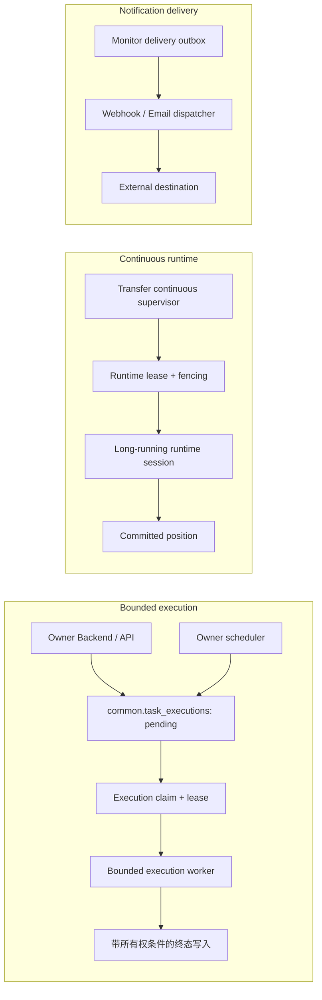

# ADDP Worker 职责与执行运行时改进专题

更新时间：2026-08-20

状态：核心运行时改造已完成，统一观测与故障注入验收待继续推进

## 一、专题目的

ADDP 当前存在多种被称为 Worker 的后台组件，但它们承担的职责、运行周期和一致性要求并不相同：

- Quality 执行有限时长的数据质量检查；
- Meta 执行有限时长的元数据扫描；
- Transfer 同时包含有限时长的 bounded execution 和长期运行的 continuous runtime session；
- Monitor 投递 Webhook 和邮件通知；
- 各模块还有 cleanup、collector、注册同步等维护循环；
- Spark Worker、Kafka Connect Worker 等名称还会出现在基础设施层。

如果只按进程名称把这些组件统一为一种 Worker，容易混淆业务 execution、调度、通知投递和基础设施运行时。本专题用于：

1. 盘点当前各类 Worker 的真实职责和生命周期；
2. 区分 execution worker、owner scheduler、dispatcher、maintenance loop 和基础设施 worker；
3. 识别 bounded execution 在领取、租约、恢复、重试、取消和终态写入方面的缺口；
4. 记录已确认目标、实施状态和验收条件；
5. 为后续专题讨论、规范修订和分阶段实施保留事实依据。

本文保留现状盘点和实施追踪。正式约束以术语表、任务体系规范、监控与执行体系图和模块架构图为准；已确认内容不再作为候选方案解释。

## 二、与正式规范的关系

当前正式术语和通用约束仍以以下文档为准：

- [ADDP 术语表](../concepts/addp术语表.md)
- [ADDP 任务体系规范](../spec/addp任务体系规范.md)
- [ADDP 监控与执行体系图](../concepts/addp监控与执行体系图.md)
- [ADDP 模块架构图](../concepts/addp模块架构图.md)

其中已经明确：

- `execution worker` 是执行业务 execution 的运行时角色，不限定为独立进程；
- `owner scheduler` 负责决定何时创建 execution，不替代 worker 执行业务逻辑；
- `runtime queue` 是投递和领取机制，不是任务定义或执行结果的事实源；
- `dispatcher` 消费 outbox 或 delivery，不执行业务 execution；
- `maintenance loop` 处理清理、采集、注册同步等固定维护工作；
- `common.task_executions` 统一的是执行事实，不要求所有组件采用同一种底层队列技术。

本专题不会覆盖正式规范。目标方案确认后，应先修改上述概念和规范文档，再修改实现；专题中已经完成的内容随后应迁入正式文档并从本文删除，避免长期形成第二套规范。

## 三、分类边界

### 3.1 Execution worker

Execution worker 消费 owner 已创建的 execution，取得合法运行所有权，执行真实业务逻辑并写入终态。

它至少需要回答：

- 从哪里领取 `pending` execution；
- 如何防止两个实例同时成为有效执行者；
- 并发上限由谁控制；
- 进程崩溃后如何识别和恢复未完成 execution；
- 何时允许重试，重试是否创建新 execution；
- 是否能真实中断正在运行的工作；
- 如何保证 execution 与 owner 任务摘要一致推进。

Quality、Meta scan 和 Transfer bounded 属于这一类。

### 3.2 Owner scheduler

Owner scheduler 读取 owner 任务定义中的 schedule，领取到期任务，原子创建 execution、推进 `next_run_at`，再通知 execution worker。

它负责“何时执行”，不负责“如何执行”。Worker 暂时不可用时，scheduler 是否仍应创建 durable `pending` execution，是本专题需要确认的控制面边界。

### 3.3 Continuous runtime worker

Continuous runtime worker 承担长期运行的 runtime session，而不是无限循环的 bounded execution。它需要 runtime lease、heartbeat、fencing、committed position 和恢复 execution。

Transfer continuous worker 属于这一类，不应被强制改造成普通队列任务。

### 3.4 Dispatcher

Dispatcher 消费通知 outbox，在事务外调用外部接收方，并维护投递 lease、尝试次数、退避和 dead 状态。

Monitor Webhook/Email dispatcher 属于这一类。它不创建或改写业务 execution，不进入 bounded execution worker 的统一方案。

### 3.5 Maintenance loop 与基础设施 worker

Cleanup consumer、Meta lineage collector、注册同步和观测采集属于 maintenance loop。Spark Worker、Kafka Connect Worker、Jupyter Web Server worker 等属于外部计算或基础设施运行时。

除非未来被明确建模为可持久、可配置、可审计的 owner task，否则这些组件不进入本专题的 bounded execution worker 收敛范围。

## 四、实施前运行时基线（历史记录）

本节记录 2026-08-20 改造前的事实，只用于解释本次变更动机，不再描述当前主路线。

### 4.1 默认进程与执行槽位

改造前默认全量开发环境中，ADDP 应用层启动 3 个独立 Worker 进程：

| 独立进程 | 默认容量 | 主要职责 |
| --- | ---: | --- |
| `meta-worker` | 10 | 消费 `meta:scan` Asynq 任务并执行 Meta scan execution |
| `transfer-bounded-worker` | 10 | 消费 `transfer:execute` Asynq 任务并执行 bounded `sync` execution |
| `transfer-continuous-worker` | 4 | 领取 runtime lease 并运行 continuous session |

此外还有嵌入 Backend 的后台角色：

| Backend | 内嵌角色 | 默认容量或循环 |
| --- | --- | --- |
| `quality-backend` | Quality execution worker | 4 个执行槽位，另有 lease recovery loop |
| `meta-backend` | Meta owner scheduler、lineage collector、cleanup | scheduler 周期扫描到期任务；Redis 未配置时还会启动 2 个本地执行 goroutine |
| `transfer-backend` | Transfer API/control plane、capture supervisor | bounded owner scheduler 当前不在 Backend，而在 bounded worker 进程 |
| `monitor-backend` | 告警 evaluator、Webhook dispatcher、可选 Email dispatcher | 独立后台循环，不是业务 execution worker |

“默认容量”表示单个进程实例的并发上限，不等于部署副本数。增加 Backend 或 Worker 副本会改变平台总并发，必须结合领取所有权协议判断是否安全。

### 4.2 现状机制矩阵

| 组件 | 进程边界 | 领取或投递机制 | 所有权与恢复 | 当前判断 |
| --- | --- | --- | --- | --- |
| Quality execution worker | 内嵌 `quality-backend` | PostgreSQL `FOR UPDATE SKIP LOCKED` 领取已授权的 `pending` execution | execution lease、heartbeat、attempt、过期恢复 | bounded 生命周期最完整，但 API 与执行资源耦合 |
| Meta scan worker | 独立 `meta-worker`；另有 Backend 本地 fallback | Redis/Asynq `meta:scan`，或进程内 channel | Asynq 重试；Backend 启动时扫描 `pending/running` 并重新排队；无 execution lease | 同一 task type 存在两条路线，运行所有权不足 |
| Transfer bounded worker | 独立 `transfer-bounded-worker` | Redis/Asynq `transfer:execute` | Asynq 显式 `MaxRetry(0)`；未发现完整的 running recovery/lease | Worker 崩溃可能留下长期 `running` execution |
| Transfer continuous worker | 独立进程 | `transfer.runtime_leases` claim | heartbeat、fencing、capacity、recovery execution、committed position | 符合长期 runtime session 的独立机制 |
| Monitor dispatcher | 内嵌 `monitor-backend` | delivery outbox + `SKIP LOCKED` | delivery lease、至少一次投递、指数退避、dead | 机制与职责匹配，不属于业务 worker |

### 4.3 当前实现结果

当前应用层执行边界已经收敛为：

| 进程 | 当前职责 | 唯一领取机制 |
| --- | --- | --- |
| 各模块 Backend | API、任务定义、授权准备、owner scheduler、状态查询 | 只创建 durable `pending`，不消费 bounded execution |
| `quality-worker` | Quality 有界检查、评分与 Issue reconcile | PostgreSQL claim + attempt + `lease_token` + heartbeat |
| `meta-worker` | Meta 有界扫描 | PostgreSQL claim + attempt + `lease_token` + heartbeat |
| `transfer-bounded-worker` | snapshot、watermark、bounded replay | PostgreSQL claim + attempt + `lease_token` + heartbeat |
| `transfer-continuous-worker` | 长期 continuous runtime session | `transfer.runtime_leases` + fencing + committed position |

Meta 与 Transfer bounded 的 Asynq 生产路径、Meta Backend 本地 channel fallback 均已删除。Quality Backend 不再启动执行槽位。Monitor dispatcher、cleanup consumer 和 lineage collector 保持各自既有角色，不进入 bounded execution worker。

## 五、改造前问题与风险（历史记录）

### 5.1 高风险：Transfer bounded 缺少完整的崩溃恢复闭环

改造前，`transfer:execute` 显式设置 `asynq.MaxRetry(0)`。如果 Worker 在 execution 已进入 `running` 后崩溃，Asynq 不会重新执行该消息，当时也没有等价的 execution lease expiry recovery 主路径。

可能结果包括：

- execution 长期停留在 `running`；
- owner task 长期保持运行摘要，阻塞后续执行；
- 目标端可能已经部分写入，但平台没有可靠的恢复或终态事实；
- 人工 retry 因原 execution 未进入 `failed` 而无法使用。

相关实现：

- `transfer/backend/internal/worker/queue.go`
- `transfer/backend/internal/service/execution_engine_service.go`
- `transfer/backend/internal/service/execution_service.go`

### 5.2 高风险：Transfer bounded 未能取得 running 状态时仍可能继续执行业务

Transfer bounded 在把 execution 更新为 `running` 失败时仅记录 warning，随后仍继续执行传输。若失败原因是 execution 已被其他执行者领取或已进入终态，继续写目标端可能造成重复或越权执行。

目标契约应当是 fail-closed：没有取得合法 execution 所有权，就不能执行任何外部读写。

### 5.3 高风险：Meta 对 running execution 的启动恢复没有 lease 边界

Meta Backend 启动时会把 Meta `running` execution 直接重置为 `pending` 并重新排队。但真正执行扫描的是独立 `meta-worker`，Backend 重启不等于 Worker 已停止。

如果 Backend 重启时旧 Worker 仍在运行，可能出现：

- 原 Worker 继续执行；
- Backend 将同一 execution 重置并再次入队；
- 新消息再次尝试执行同一 execution；
- 原执行者的终态写入与重新领取相互竞争。

没有 lease owner、lease expiry 或 fencing 时，Backend 无法证明原执行者已经失去所有权。

相关实现：

- `meta/backend/internal/service/scan_task_scheduler_lifecycle.go`
- `meta/backend/internal/service/scan_execution_runner.go`
- `common/execution/repository.go`

### 5.4 中高风险：Meta 同一执行类型存在双轨

Meta 当前根据 Redis 配置选择：

- Redis/Asynq + 独立 `meta-worker`；
- 本地 channel + `meta-backend` 内 2 个 goroutine。

两条路线的进程隔离、并发上限、失败恢复和扩缩容语义不同，与“同一 task type 只有一条主路线”的开发原则冲突。

相关实现：

- `meta/backend/cmd/server/main.go`
- `meta/backend/internal/service/scan_task_scheduler.go`
- `meta/backend/internal/service/scan_task_scheduler_lifecycle.go`

### 5.5 中风险：数据库 execution 与 Redis 消息之间存在投递窗口

Meta 和 Transfer bounded 都需要先在 PostgreSQL 创建 execution，再向 Redis 入队。这两个写操作不在同一个事务系统中。

当前入队调用返回错误时可以把 execution 标记为失败，但仍需考虑：

- Redis 已接受消息但客户端在收到响应前断线；
- 进程在数据库提交后、调用 Redis 前崩溃；
- 进程在 Redis 接受消息后、记录投递结果前崩溃；
- 重复入队是否只会产生一个合法执行者。

无论保留 Asynq 还是改用数据库领取，都必须显式定义该窗口的恢复与幂等策略。

### 5.6 中风险：Transfer owner scheduler 与执行 Worker 位于同一进程

Transfer bounded owner scheduler 当前由 `transfer-bounded-worker` 启动。Worker 未运行时，定时任务不会创建 execution，也不会留下 `pending` 执行事实。

这使“何时创建 execution”的控制面生命周期依赖“如何执行”的数据面进程，不利于独立扩缩容和故障判断。

### 5.7 中风险：Quality 运行机制完整，但进程边界耦合

Quality 已实现数据库 claim、lease heartbeat、attempt、过期恢复和带 lease 条件的终态写入，是当前 bounded execution 中最完整的所有权协议。

改造前 Worker 内嵌在 `quality-backend`：

- Backend 重启同时中断 API 和检查任务；
- Backend 多副本会按副本数增加执行槽位；
- API 请求与长时间检查共享 CPU、内存和数据库连接；
- 独立调整 Worker 容量需要调整 Backend 部署。

本轮已在统一执行契约基础上将其拆为独立 `quality-worker`。

### 5.8 取消能力尚未形成统一真实语义

Meta 和 Transfer 的队列封装中存在删除队列任务的 helper，但模块 TaskProvider 均声明 `supports_cancel=false`。删除一个待处理消息不能中断已经运行的 SQL、扫描、文件写入或目标事务，也不能独立保证任务摘要和 execution 终态一致。

因此当前保持 `supports_cancel=false` 是正确边界。后续只有具备以下能力后才能开放标准取消：

- 定位真实运行体并传递取消信号；
- 等待运行体停止或确认超时；
- 明确外部资源和部分写入处理；
- 由运行体或合法 owner 写入 `cancelled`；
- 重复取消幂等；
- 不通过直接改状态伪造取消成功。

## 六、已确认目标形态

建议将 ADDP 后台运行时分为三类，不追求底层技术全部一致：

### 6.1 Bounded execution 的统一契约

Quality、Meta scan 和 Transfer bounded 可以统一以下契约：

1. owner 在事务内创建唯一 `pending` execution，并同步 owner task 最近执行摘要；
2. Worker 原子完成 `pending → running`，同时取得限时所有权；
3. 未取得合法所有权时禁止执行外部读写；
4. 长任务必须续租，终态更新必须校验当前 owner；
5. lease 过期后由确定的 recovery 机制处理，旧执行者不能继续写回；
6. execution 未完成时的故障恢复与用户发起的业务 retry 必须区分；
7. 已进入终态的 execution 不得重用，用户 retry 必须创建新 execution；
8. owner task 摘要与 execution 的 claim、进度和终态应在相应事务中一致推进；
9. 结果写入必须说明重复执行边界，必要时使用 execution identity、staging 或 Provider fencing；
10. 并发上限、排队时长、attempt、lease expiry 和恢复原因必须可观测。

### 6.2 Runtime queue 决策记录

#### 方案 A：PostgreSQL execution claim 作为唯一 bounded 主路线

Worker 直接从 `common.task_executions` 领取自己模块和 task type 的 `pending` execution，使用 `SKIP LOCKED + lease` 协调多实例。

优点：

- execution 与领取事实位于同一数据库；
- 不存在数据库落库后必须再投 Redis 的必需窗口；
- 可以复用 Quality 已验证的模型；
- 恢复、attempt 和 owner task 摘要更容易事务化。

代价：

- PostgreSQL 同时承担队列领取压力；
- 需要规范轮询、索引、公平性和退避；
- 仍要解决外部数据写入的幂等和 fencing，数据库 lease 本身不能提供跨系统 exactly-once。

这是已确认并实施的唯一 bounded 主路线。

#### 未选择方案：保留 Asynq，但增加 durable dispatch 和 execution lease

PostgreSQL 保存 execution 和待投递 outbox，由 dispatcher 可靠投递到 Asynq；Worker 消费消息后仍必须通过 PostgreSQL execution lease 取得运行所有权。

优点：

- 保留 Asynq 的优先级、延迟、队列观测和水平扩展能力；
- Redis 消息只承担唤醒和传输，不成为执行所有权事实源。

代价：

- 系统组件和状态更多；
- 必须维护 outbox dispatcher、重复投递和消息清理；
- 即使增加 Asynq，最终仍需要数据库 lease 和外部写入幂等。

只有在明确存在数据库 claim 无法满足的吞吐、优先级或调度需求时，才建议选择此方案。

#### 不接受的方案

- 同一 task type 同时保留 Asynq、本地 channel 和数据库轮询三条可切换主路线；
- 只依赖 Asynq 消息是否 active 判断 execution 所有权；
- 通过启动时把所有 `running` execution 无条件改回 `pending` 实现恢复；
- 通过直接更新 execution 状态模拟取消；
- 为兼容旧部署长期保留 fallback 分支。

### 6.3 推荐的角色边界

- owner scheduler 推荐运行在 owner Backend/control plane，独立于 Worker 容量；
- bounded execution worker 可以独立部署，并只负责领取和执行；
- Transfer continuous worker 保留专用 supervisor、runtime lease 和 fencing；
- Monitor dispatcher 保留 outbox consumer 身份；
- maintenance loop 不因为拥有 goroutine 就自动迁入 execution worker 框架。

## 七、已确认的架构决策

以下决策均已确认：

| 编号 | 待确认决策 | 当前建议 |
| --- | --- | --- |
| D1 | Quality、Meta、Transfer bounded 是否统一 execution claim + lease 契约 | 同意统一契约 |
| D2 | bounded runtime queue 选择 PostgreSQL 唯一路线，还是 Asynq + durable outbox + DB lease | 优先选择 PostgreSQL 唯一路线 |
| D3 | Meta 是否删除 Backend 本地 channel fallback | 删除，不保留兼容路线 |
| D4 | Transfer owner scheduler 是否迁回 Transfer Backend/control plane | 迁回 |
| D5 | Quality 是否拆为独立 `quality-worker` | 拆分；Backend 不再启动执行槽位 |
| D6 | 未终态 execution 的崩溃恢复是否允许复用同一 execution | 仅在具备 lease/fencing 和幂等边界时允许；用户 retry 始终创建新 execution |
| D7 | 标准 cancel 能力何时开放 | 当前继续 `supports_cancel=false`，逐模块完成真实中断后再开放 |
| D8 | bounded 外部写入的幂等与 fencing 由通用层还是各 owner/Provider 负责 | 通用层定义契约，owner/Provider 实现具体提交边界 |
| D9 | Worker 扩缩容是否需要租户、引擎或任务级限流 | 先补观测和压测证据，再决定是否新增调度抽象 |

D1—D9 已作为本轮实现和验收依据，不再保留双轨候选。

## 八、实施进度

本轮按以下顺序实施：

### 阶段 0：规范和验收条件（已完成）

- 确认 D1—D9；
- 更新术语表、任务体系规范、监控与执行体系图和模块架构图；
- 定义 bounded execution 状态、lease、attempt、恢复、重试和取消契约；
- 定义每个模块的故障注入验收矩阵。

### 阶段 1：Transfer bounded 高风险闭环（已完成代码与模块测试）

- 禁止未取得 execution 所有权时继续执行；
- 补齐 Worker 崩溃、lease expiry 和 owner task 摘要收敛；
- 明确 snapshot、watermark、replay 等路径的重复执行和目标提交边界；
- 将 owner scheduler 与 bounded Worker 生命周期解耦。

### 阶段 2：Meta 单路线收敛（已完成代码与模块测试）

- 删除本地 channel fallback；
- 引入明确的 execution 所有权和恢复机制；
- 删除无租约依据的 `running → pending` 启动恢复；
- 补齐入队/领取失败、终态写入失败和重复投递测试。

### 阶段 3：Quality 独立进程（已完成代码与模块测试）

- 复用统一 PostgreSQL claim，并把 owner identity 收敛为 attempt + `lease_token`；
- 复核 Issue reconcile 与 execution 终态的一致性边界；
- 新增独立 `quality-worker`，删除 Backend 启动执行槽位的路线；
- 同步开发启动与容器部署定义。

### 阶段 4：统一观测与运维（进行中）

- 展示排队时长、执行时长、attempt、lease owner、lease expiry 和恢复原因；
- 区分 execution worker、continuous runtime 和 dispatcher 健康；
- 建立 Worker 停机、网络分区、数据库故障和外部目标部分写入的验收场景；
- 根据实际指标决定是否需要优先级、租户配额或任务级限流。

## 九、最低验收矩阵

任何模块迁入目标路线前，至少验证：

| 场景 | 期望结果 |
| --- | --- |
| 两个 Worker 同时领取同一 execution | 只有一个取得合法所有权 |
| Worker 在 claim 后、业务执行前崩溃 | lease 到期后按已确认策略恢复，不永久 `running` |
| Worker 在外部目标提交后、终态落库前崩溃 | 重放不会产生不可控重复，或明确失败并可诊断 |
| 旧 Worker lease 过期后迟到写回 | 条件更新或 fencing 拒绝写回 |
| Backend 重启而 Worker 未重启 | 不抢走仍有效的 Worker 所有权 |
| Worker 重启而 Backend 未重启 | durable `pending` execution 仍可继续领取 |
| owner scheduler 多副本并发 | 同一计划时刻最多创建一个 execution |
| 用户重复点击执行 | owner task active execution 约束生效 |
| 用户 retry 终态 execution | 创建新的 execution，并保留关联和原历史 |
| 入队或唤醒消息重复 | 不产生两个有效运行体 |
| 取消 pending execution | 只有在正式定义相应语义后才成功 |
| 取消 running execution | 必须真实中断运行体并正确处理外部资源 |
| Worker 优雅停机 | 停止领取新任务，并按规定完成、释放或收敛当前 execution |

## 十、当前结论

本轮已经完成并确认：

1. ADDP 中名为 Worker 的组件不是同一种角色；
2. `common.task_executions` 应统一执行事实和 bounded execution 生命周期契约，而不是强制统一所有底层运行技术；
3. Quality、Meta 和 Transfer bounded 具备统一 bounded execution 契约的价值；
4. Transfer continuous 和 Monitor dispatcher 应保持独立机制；
5. Meta 双轨和无 lease 恢复路径已经删除，Transfer bounded 崩溃后默认失败关闭并要求显式重试；
6. Backend 与有界 execution worker 的进程边界已落实到开发启动、镜像构建和容器部署定义。

下一步进入阶段 4：先补齐排队时长、attempt、lease expiry、恢复原因和各类 Worker 健康观测，再按故障注入矩阵验证停机、网络分区和外部目标部分提交场景。优先级、租户配额和更复杂的调度抽象继续以实际指标为前提。
