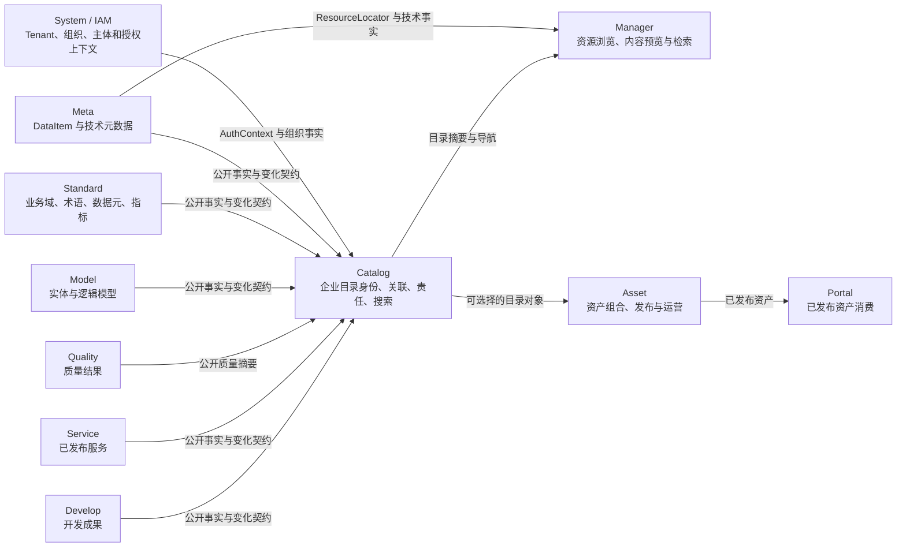
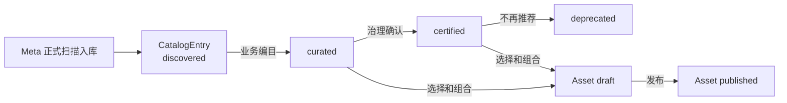

# ADDP 企业数据目录与 Catalog 模块专题

更新时间：2026-08-25

状态：架构方向已确认，待修订正式概念文档并拆分实施计划

## 一、文档定位

本专题持续跟踪 ADDP 企业数据目录（Enterprise Data Catalog，EDC）及独立 `Catalog` 模块的架构决策、待确认事项和实施进度。

本文件位于 `docs/next/`，用于承载正在推进的设计，不直接替代正式概念和规范。进入代码实现前，已经稳定的概念必须同步进入：

- `docs/concepts/addp术语表.md`；
- `docs/concepts/addp核心概念关系图.md`；
- `docs/concepts/addp模块架构图.md`；
- 后续新增的 Catalog 概念文档与实现规范；
- 受影响模块的 `CLAUDE.md`、API、Swagger、测试和 CI/CD 门禁。

本专题不讨论底层数据复制，不把企业数据目录等同于资产门户，也不以兼容现有 Asset 自动发现或 Meta 搜索实现为目标。

## 二、问题背景

ADDP 已经有多个管理数据和数据相关成果的专业模块：

- Meta 管理数据项身份、技术元数据、扫描、资源树和血缘；
- Standard 管理业务域、业务术语、数据元、指标、分类和分级；
- Model 管理业务实体、逻辑模型、数仓分层和模型关系；
- Quality 管理规则应用、质量检查、评分和问题治理；
- Service 管理已发布数据服务；
- Develop 管理查询、工作流和 Notebook 等开发成果；
- Manager 管理数据预览、检索、剖析和快显；
- Asset 管理数据资产的编目、发布、授权、评价和运营；
- Portal 面向消费者展示和申请已发布资产；
- System/IAM 管理 Tenant、Department、Project Group、User、Role 和授权上下文。

这些模块分别拥有专业事实，但当前缺少一个跨专业目录的统一关联与发现层，无法稳定回答：

> 企业有哪些数据、模型、指标和服务？它们是什么意思？由谁负责？质量如何？相互之间有什么关系？哪些已经完成治理，哪些已经作为资产发布？

此前 Meta 搜索、Manager 检索和 Asset 自动发现分别承担了一部分目录能力，导致“技术资源目录、企业数据目录和资产目录”边界不清。根因不是单个字段或接口缺失，而是 ADDP 尚未建立企业数据目录这一独立架构边界。

## 三、已确认的架构决策

以下决策已达成共识，后续设计不再并行保留其他路线：

1. ADDP 新增独立 `Catalog` 模块，承载企业数据目录能力。
2. Meta 与 Standard 之间不存在直接依赖关系；二者分别拥有技术事实和语义定义。
3. Catalog 通过专业模块的公开读契约和变化契约消费事实；专业模块不反向依赖 Catalog。
4. 业务语义定义仍归 Standard；语义定义与具体专业资源的关联事实归 Catalog。
5. 关联事实只在 Catalog 保存一份权威记录，不在 Meta 或 Standard 保存业务投影副本。
6. Catalog 数据库是目录身份、关联和治理事实源；Meilisearch 等搜索索引只是可重建投影。
7. 所有已被 Meta 正式识别并持久化的 DataItem 自动创建最小 `CatalogEntry`。
8. 第一次业务编目更新已有 CatalogEntry，不能创建第二个业务目录对象。
9. Department、Project Group 和个人工作视图影响责任、协作、权限和展示，不决定 CatalogEntry 是否存在。
10. CatalogEntry 不归属于某个 Workspace；个人或项目工作区只能引用它。
11. Manager 继续负责技术资源浏览、数据内容预览、剖析、快显和内容检索，不拥有企业业务目录事实。
12. Asset 从 Catalog 选择并组合一个或多个目录对象形成资产；Portal 只消费已发布资产。
13. 技术资源搜索、企业元数据搜索、内容检索和已发布资产搜索分别由对应 owner 管理，不能共用含义不清的“资产索引”。
14. Catalog 进程只在 System 注册成功后进入 Ready；Meta、Standard、Manager、Asset 等专业模块都不是 Catalog 的启动或 Ready 强依赖。对其他 owner 的同步失败进入可重试 reconciliation，不得让 Catalog 与专业模块形成循环启动。

## 四、核心概念边界

### 4.1 专业资源目录

专业资源目录由各 owner 模块维护，回答某一类资源“有哪些、如何组织、有哪些专业事实”。例如：

- Meta 的技术资源目录；
- Standard 的术语、数据元和指标目录；
- Model 的业务实体和逻辑模型目录；
- Service 的已发布服务目录；
- Develop 的可复用开发成果目录。

专业模块继续拥有完整专业事实。Catalog 不接管其 CRUD、生命周期和详细数据模型。

### 4.2 企业数据目录

企业数据目录不是另一棵资源树，也不是专业资源的完整副本。它负责：

- 企业级稳定目录身份；
- 专业资源与目录身份的来源绑定；
- 业务语义与具体资源的关联；
- 责任、治理状态和业务分类；
- 跨模块关系；
- 统一搜索、筛选和关系导航；
- 权限感知的企业目录视图。

```text
专业模块事实
    + CatalogEntry 企业目录身份
    + 业务语义和责任关联
    + 跨模块关系
    + 搜索、筛选和权限视图
    = 企业数据目录能力
```

### 4.3 数据资产目录

数据资产目录是已经完成业务定义、责任确认、治理和正式发布的运营成果视图。

Asset 负责资产身份和版本、多目录对象的组合边界、发布与上下架、使用条件，以及申请、授权、评价和运营。资产不复制 CatalogEntry 的来源绑定和专业事实。

一个资产可以组合多个 CatalogEntry，一个 CatalogEntry 也可以被多个资产复用。

### 4.4 Engine Catalog 与企业 Catalog

ADDP 引擎体系中的 `CatalogProvider`、catalog path 或数据库 catalog 表示引擎原生命名空间或扫描能力；本专题中的 `Catalog` 表示企业数据目录模块。

正式进入术语表时必须分别定义：

- Engine Catalog：数据引擎原生命名空间；
- Enterprise Data Catalog：跨专业目录的统一关联与发现能力；
- Catalog module：ADDP 中实现企业数据目录能力的 owner 模块；
- CatalogEntry：企业数据目录中的稳定对象身份。

## 五、模块职责和依赖方向

Meta 与 Standard 各自独立，不通过彼此完成扫描或语义定义。Catalog 位于专业事实之上，Asset 和 Portal 位于 Catalog 的资产化与消费侧。



图中箭头表示消费方向，不表示跨 Schema 查询。所有跨模块读取必须通过公开 API、统一 Client 或后续确定的单一变化契约完成。

### 5.1 Catalog 拥有的事实

Catalog 拥有：

- CatalogEntry 企业目录身份；
- CatalogEntry 与专业资源的来源绑定及历史；
- 资源特定的业务名称、业务描述和治理状态；
- 资源与 Standard 语义对象的关联；
- 责任部门、业务责任人、数据管理员和协作范围；
- 跨专业目录关系及其来源、版本和证据；
- 企业目录搜索所需的可重建索引；
- 收藏、关注、治理队列、编目草稿和目录集合等 Catalog 内协作事实。

### 5.2 Catalog 不拥有的事实

Catalog 不拥有：

- DataItem 的技术结构、路径、格式和扫描状态；
- 业务术语、数据元、指标和业务域的定义；
- 数据质量规则、执行和问题；
- 数据内容、预览结果、剖析结果和快显产物；
- 资产发布、申请、授权、评价和运营；
- Department、Project Group、User 和成员关系；
- 专业模块内部的完整对象副本。

## 六、CatalogEntry 身份模型

### 6.1 企业身份与技术身份分离

Meta DataItem fingerprint 是技术资源身份，用于在同一路径和引擎内稳定识别已扫描对象。路径重命名、移动或引擎替换会产生新的技术身份。

`catalog_entry_id` 是企业目录身份，独立于当前物理位置，用于承载长期业务说明、责任、语义关联和治理历史。

```text
CatalogEntry --represents--> Meta DataItem
CatalogEntry --belongs-to-domain--> Standard Domain
CatalogEntry --applies-term--> Standard Glossary Term
CatalogComponent --implements--> Standard Element
```

来源绑定属于 Catalog。Meta 不保存 `catalog_entry_id` 投影，Standard 也不保存反向资源列表。

### 6.2 来源绑定

来源绑定至少需要表达：

- `tenant_id`；
- `catalog_entry_id`；
- `source_module`；
- `source_type`；
- `source_identity`；
- 当前状态和生效时间；
- 失效原因、替换关系和历史版本。

对 Meta DataItem，`source_identity` 使用 Meta 对外稳定提供的 fingerprint，不把数据库行 ID、路径字符串或临时扫描 ID 作为企业身份。

同一个当前专业资源只能有一个有效的 CatalogEntry 来源绑定。历史绑定可以保留，但不能同时形成两个当前目录身份。

### 6.3 重命名、移动和显式重绑

自动扫描不得通过名称相似度、结构相似度或模糊匹配猜测资源重命名。

默认行为：

1. 原 fingerprint 不再出现时，原来源绑定进入 `missing`；
2. 新 fingerprint 出现时，自动创建新的 `discovered` CatalogEntry；
3. 治理人员确认两者是同一业务资源后，执行显式重绑；
4. 重绑事务合并或终止新建的临时目录身份，把新来源绑定到原 CatalogEntry，并保留历史证据。

显式重绑的详细状态机、冲突处理和审计要求仍需单独设计，但不能引入自动模糊跟随路线。

## 七、DataItem 自动建档决策

### 7.1 创建范围

所有被 Meta 正式识别并持久化的 DataItem 都自动创建最小 CatalogEntry，包括尚未完成业务编目的对象。

不自动创建顶级 CatalogEntry 的对象：

- 资源树 node、数据库目录节点和文件夹；
- ScanTask、execution 和扫描日志；
- 缓存、临时文件和模块内部配置；
- 字段和 DataItem component。

字段和组件作为 CatalogEntry 的下级 `CatalogComponent` 管理，用于字段级语义关联和搜索，但默认不是顶级企业目录对象。

如果某类对象不应进入企业资源盘点，应在 Meta 扫描范围或 DataItem 识别规则中排除。Catalog 不建立第二套“扫描到了但不建档”的永久过滤规则。

### 7.2 自动创建语义

Meta 扫描完成后，Catalog 通过公开变化契约幂等执行：

```text
ensure CatalogEntry(
    tenant_id,
    source_module = meta,
    source_type = data_item,
    source_identity = item_fingerprint
)
```

自动创建只建立最小身份和来源绑定，不代表已经业务编目、业务认证、租户全员可见、获得内容访问权、形成资产或发布到 Portal。

### 7.3 为什么不在第一次业务编目时创建

如果等到第一次人工编目才创建 CatalogEntry，会产生以下问题：

- 无法统计尚未治理的资源范围和治理覆盖率；
- 无法给未编目资源分配责任和治理任务；
- 同一资源可能被不同部门重复创建目录身份；
- 重命名、删除和来源失效缺少连续历史；
- 企业目录退化为“已治理对象清单”，不能承担完整资源盘点；
- Asset、Quality、Standard 等模块缺少统一关联锚点。

因此，ADDP 采用“自动建立身份，按阶段补充治理事实”的单一路线。

## 八、生命周期模型

来源状态和治理成熟度是两个正交维度，不能混成一个状态字段。

### 8.1 来源状态

`source_status` 候选值：

- `active`：当前专业资源仍存在；
- `missing`：当前来源不可见、已删除或超出扫描范围，等待确认或重绑。

### 8.2 治理状态

`governance_status` 候选值：

- `discovered`：自动发现，只有最小目录身份；
- `curated`：已补充业务名称、描述、业务域和基本责任；
- `certified`：经过治理确认，可作为可信资源；
- `deprecated`：业务上不再推荐使用，但保留历史和影响关系。

### 8.3 资产发布状态

资产的 `draft`、`published`、`offline` 等状态仍由 Asset 管理，不进入 CatalogEntry 治理状态。



CatalogEntry 来源消失时只改变 `source_status`，不自动清空业务语义、责任和治理历史。

## 九、业务语义关联

Standard 定义“语义是什么”：Domain、Glossary Term、Element、Metric、CodeSet、Classification 和 GradingLevel。

Catalog 定义“这个语义适用于哪个具体资源”：

- CatalogEntry 归属哪个业务域；
- CatalogEntry 应用哪些术语；
- 哪个字段或组件实现哪个数据元；
- 具体数据项支撑哪些指标、模型和服务。

关联事实由 Catalog 保存唯一权威记录。Catalog 创建关联时通过 Standard 公开 API 验证对象存在、属于同一 Tenant 且处于允许引用的生命周期；不能使用跨 Schema 外键或复制 Standard 名称作为权威事实。

Standard Domain 表达业务语义边界，Department 表达组织结构，二者不能合并。一个业务域可能由多个部门共同治理，一个部门也可能负责多个业务域。

## 十、Department、Project Group 与 Workspace

### 10.1 ADDP 当前基础

System/IAM 已经定义并持久化 Department、Department Membership、Project Group、Project Group Membership，以及对应 Scope 的 Role Assignment 和 AuthContext 投影。

当前缺口主要是完整的公开管理 API、Console 管理体验，以及业务模块如何使用这些作用域表达资源责任和协作范围，而不是底层表完全缺失。

### 10.2 Department 的目录职责

Department 表达稳定组织责任范围，可用于：

- CatalogEntry 的主要责任部门；
- 默认治理队列；
- Department Scope 的目录操作授权；
- 责任统计和治理覆盖率；
- 组织调整时的正式责任移交。

Department 不自动获得底层数据内容访问权。最终资源访问仍由对应 owner 模块执行。

### 10.3 Project Group 的目录职责

Project Group 表达跨部门、面向特定目标和期限的协作集合，可用于：

- 共享编目任务；
- 目录对象集合；
- 草稿评审和协作；
- 项目期限内的目录操作授权；
- 项目使用的数据清单。

Project Group 关闭时，临时目录授权和协作任务应失效或移交，但 CatalogEntry 及其长期责任不能随项目组一起消失。

### 10.4 个人工作视图

第一阶段不新增全局 `PersonalWorkspace` 实体。“我的目录”通过当前 User 的关系动态形成：

- 分配给我的治理任务；
- 我负责或参与治理的 CatalogEntry；
- 我的草稿；
- 我的收藏和关注；
- 最近访问和保存的搜索。

个人不能作为 CatalogEntry 唯一且不可替代的长期组织责任边界。User 可以担任业务责任人、数据管理员、技术维护者或任务执行人，但应同时存在可移交的组织责任。

### 10.5 是否新增统一 Workspace

第一阶段不新增全局 Workspace 模块，也不在 CatalogEntry 上增加 `workspace_id`。

Catalog 可以拥有 Project Group 范围的目录集合、草稿和任务，这些事实只引用 System 中的 Project Group。个人工作视图按 User 动态计算。

只有当 Develop、Model、Quality、Catalog 等多个模块都明确需要共享同一个工作空间身份、成员、生命周期、工具环境和产物集合时，才重新评估独立 Workspace 能力。即使新增，也不应默认放入 System/IAM；System 只继续拥有身份、组织和授权事实。

## 十一、目录组织和用户视图

企业数据目录不采用单一树表示所有维度，使用“业务主分类 + 分面筛选 + 关系图”。

主导航优先引用 Standard Domain。候选分面包括对象类型、来源模块、来源系统、责任部门、责任人、协作项目组、来源状态、治理状态、业务域、术语、质量、鲜活度、认证状态、安全等级和时空范围。

Catalog 需要表达跨模块关系，例如：

```text
业务实体 --推导出--> 逻辑模型
逻辑模型 --物化为--> CatalogEntry / DataItem
DataItem --支撑--> 指标
指标 --被暴露为--> 数据服务
工作流 --产生--> DataItem
Asset --组合--> CatalogEntry、指标、服务和模型
```

关系必须记录 owner、来源、版本、观察时间和证据，不能只有无来源的边。

## 十二、搜索所有权

| 搜索能力 | Owner | 主要对象与目标 |
| --- | --- | --- |
| 技术资源树搜索 | Meta | 按引擎、路径、技术类型定位 node 和 DataItem |
| 企业元数据搜索 | Catalog | 按业务语义、责任、质量、关系和治理状态发现企业资源 |
| 数据内容、全文、向量和空间检索 | Manager | 检索 DataItem 内容并进入预览或分析 |
| 已发布资产搜索 | Asset | 搜索可申请、授权和运营的已发布资产 |

不同 owner 可以使用同一 Meilisearch 基础设施，但必须使用不同索引、文档语义和权限过滤。不能继续让 DataItem、内容检索文档和已发布资产共用含义不清的 `asset` 文档模型或索引名称。

Catalog 搜索索引可以包含从专业模块派生的名称、类型、路径摘要、业务域、责任和质量摘要，但索引只用于检索和展示，可以从 Catalog 权威事实及专业模块重建。

## 十三、Manager、Asset 与 Portal 的衔接

### 13.1 Manager

Manager 保持技术使用入口：通过 Meta 资源树浏览资源，负责数据预览、内容读取、剖析、快显和内容检索；可以从 Data Explorer 跳转 CatalogEntry，并在有权限时展示 Catalog 业务摘要。

Catalog 不依赖 Manager 的预览或快显结果才能建立目录身份。Manager 也不写 Catalog 的语义关联和责任事实。

### 13.2 Asset

Asset 的目标来源模型为：

```text
Asset
└── AssetComponent[]
    ├── catalog_entry_id
    ├── role
    └── sort_order
```

`AssetComponent` 是概念名称，最终表名和 API 在 Asset 设计阶段确定。核心约束已经明确：

- 一个资产可以组合多个 CatalogEntry；
- Asset 不再使用 `{source_module, source_reference}` 直接引用专业模块；
- 资产发布前校验 CatalogEntry 当前有效性和必要治理条件；
- CatalogEntry 的技术与语义变化不复制到 Asset 权威表；
- 资产需要冻结的发布说明和承诺由 Asset 自己版本化。

现有 Asset 自动发现并直接创建资产草稿的路线应由“专业资源先进入 Catalog，再由 Asset 选择和组合”替代。迁移完成后删除旧路线，不保留兼容分支。

### 13.3 Portal

Portal 只消费 Asset 已发布消费接口，不直接搜索 Catalog 全量资源，也不绕过 Asset 申请和授权数据内容。

## 十四、一致性、变化传播和删除

### 14.1 单一事实源

- 专业事实：各专业模块；
- CatalogEntry、来源绑定、语义关联和责任：Catalog；
- 搜索索引：可重建投影；
- 资产发布与运营：Asset；
- 组织和主体：System/IAM。

不存在 Meta、Standard、Catalog 三处双写关联的方案。

### 14.2 变化传播

Catalog 应消费各专业模块的公开变化契约，并使用统一幂等处理器完成新增、更新和失效。还需要使用同一处理器提供可恢复的 reconciliation，修复事件丢失、停机或索引重建后的差异。

变化传输最终采用事件、outbox/change feed 或按游标拉取，仍需结合 ADDP 现有基础设施确定；正式实现只能选择一条权威变化契约，不能长期保留事件与全量轮询两套业务逻辑。

### 14.3 删除和来源失效

- 专业资源删除或不可见时，Catalog 先标记来源 `missing`；
- 不立即物理删除 CatalogEntry 的业务说明、责任、关系和审计；
- 对已被资产、关系或治理记录引用的 CatalogEntry，必须保留可解释历史；
- 是否最终物理清理由 Catalog 生命周期规范和 ADDP cleanup 体系统一决定；
- Catalog 不反向阻止专业模块删除，除非未来明确建立删除协调契约。

## 十五、权限与可发现性

必须分开判断：

1. CatalogEntry 是否存在；
2. 用户是否可以发现目录条目；
3. 哪些业务和技术元数据可见；
4. 是否可以预览或读取数据内容；
5. 是否可以申请或使用已发布资产。

自动创建 CatalogEntry 不等于租户内全员可见，更不等于获得数据访问权。

| 视图 | 范围 | 主要用户 |
| --- | --- | --- |
| 资源总览 | 权限允许的 `discovered` 及以上 CatalogEntry | 技术人员、治理人员 |
| 治理目录 | `curated`、`certified` 等已治理对象 | 业务人员、数据管理员 |
| 资产门户 | Asset 已发布对象 | 数据消费者 |

Catalog 是自身目录事实和目录操作权限的 owner；底层资源内容权限仍由 Meta、Manager、Service 或实际资源 owner 判断。Catalog 不建立复制全平台业务资源 ACL 的中央大表。

发现权限默认值、字段级元数据脱敏、Department / Project Group 的 Resource Scope Binding 以及 Catalog 与 owner 权限校验方式仍需形成独立规范。

## 十六、第一阶段范围

第一阶段聚焦 Meta DataItem，不同时把所有专业模块一次性接入。

### 16.1 纳入范围

- Catalog 模块骨架、注册、认证和权限清单；
- DataItem 自动创建 CatalogEntry；
- CatalogEntry 详情和来源绑定；
- `source_status`、`governance_status`；
- Standard Domain、Glossary Term、Element 的基础关联；
- 责任部门、业务责任人和数据管理员；
- 企业元数据搜索和基础分面；
- 从 Manager Data Explorer 跳转 Catalog；
- 从 Catalog 选择 DataItem 发起资产化。

### 16.2 暂不纳入

- 通用 Workspace 模块；
- 任意关系类型 DSL；
- 自动模糊重命名识别；
- 跨租户目录共享；
- 把字段全部升级为顶级 CatalogEntry；
- 自动生成业务语义或责任并直接作为权威事实；
- 一次性接入所有 Develop 临时查询、Notebook 和 execution；
- 用 Catalog 替代 Manager 数据预览或 Asset 发布流程。

## 十七、实施阶段与门禁

### 阶段0：正式概念固化

- 更新术语表，增加 Enterprise Data Catalog、Catalog module、CatalogEntry、CatalogComponent；
- 更新核心概念关系图和模块架构图；
- 新增 Catalog 概念说明与实现规范；
- 修订 Meta、Standard、Manager、Asset、Portal 模块边界；
- 明确搜索所有权和企业目录三个视图。

完成门槛：正式文档只保留独立 Catalog 模块这一条架构路线。

### 阶段1：对象与接口盘点

- 确认 DataItem 对外稳定引用和变化版本；
- 定义 Catalog 消费 Meta、Standard、System 的批量读取契约；
- 选择唯一变化传播机制；
- 定义 CatalogEntry、来源绑定、语义关联和责任模型；
- 定义权限、失效、重绑和审计状态机；
- 盘点并确定现有 Meta 搜索、Manager 搜索和 Asset 自动发现的删除范围。

完成门槛：数据库、API、事件和权限设计可以支撑单一路线实现。

### 阶段2：Catalog 基础能力

- 按 `docs/spec/addp新模块开发指南.md` 创建 Catalog 模块；
- 使用统一模块生命周期契约：`/health/live`、`/health/ready`、System 注册 Ready 门禁和同 ID 恢复；
- 增加数据库迁移、权限 Manifest、API、Swagger 和前端入口；
- 实现 DataItem 自动建档和幂等 reconciliation；
- 实现生命周期、来源详情和基础目录搜索；
- 同步根 Makefile、模块自动发现、Gateway、Console、开发脚本和 GitHub Actions。

完成门槛：扫描入库的 DataItem 有且只有一个 CatalogEntry，重复同步不产生重复对象。

### 阶段3：组织、语义与协作

- 补齐 System Department / Project Group 的公开管理 API 和 Console 体验；
- 实现 Catalog 责任关系和治理队列；
- 实现 Domain、Glossary Term 和 Element 关联；
- 实现“我的目录”、收藏、关注和 Project Group 目录集合；
- 实现治理状态推进和必要审计。

完成门槛：目录可以回答“是什么、属于哪个业务域、由谁负责、谁正在治理”。

### 阶段4：Manager 与 Asset 收敛

- Manager Data Explorer 展示 Catalog 摘要和跳转；
- Manager 内容检索与 Catalog 元数据搜索拆分索引和 API；
- Asset 改为通过 CatalogEntry 选择和组合资源；
- 删除 Asset 直接调用多个专业模块自动创建草稿资产的旧路线；
- 删除 Meta 中以 Asset 命名的 DataItem 搜索文档和发现接口；
- 删除通用 `source_reference` 资产来源路径。

完成门槛：资源发现、企业编目、资产发布只有一条端到端链路。

### 阶段5：扩展专业目录

- 按价值依次接入 Model、Standard Metric、Service 和经过筛选的 Develop 成果；
- 接入 Quality 摘要、血缘和跨模块关系；
- 建立认证、治理覆盖率和影响分析；
- 根据真实跨模块协作需求评估统一 Workspace。

完成门槛：每类对象都有明确 owner、稳定引用、同步契约和权限边界。

## 十八、当前实现冲突与迁移清单

以下实现是正式落地前必须处理的已知冲突：

1. Meta 搜索代码将扫描得到的 DataItem 文档命名为 `AssetRecord`，混淆资源和资产；
2. Manager 当前消费 Meta 的同一 Meilisearch DataItem 索引承担检索能力，企业元数据搜索所有权不清；
3. Asset 自己还有独立资产目录索引，形成两个不同含义的“资产搜索”；
4. Asset 自动调用 Meta、Service、Standard、Develop 发现对象并直接创建草稿资产；
5. Asset 使用 `source_module + source_reference` 表达单一来源，不能稳定组合多个专业对象；
6. Manager 资源树只有技术资源导航，缺少 Catalog 企业业务导航；
7. System 已有 Department / Project Group 数据模型，但管理入口和业务使用仍不完整。

迁移必须删除旧路径，不保留兼容字段、双写、fallback query 或并行发现流程。

## 十九、待继续确认的问题

以下问题不影响独立 Catalog 和自动建档方向，但需要在实施设计前确认：

1. 第一阶段 CatalogEntry 和 CatalogComponent 的最小字段及版本模型；
2. Meta 向 Catalog 提供变化的唯一契约和游标语义；
3. CatalogEntry 显式重绑、合并和冲突审计的完整状态机；
4. 责任部门、业务责任人、数据管理员和技术维护者的基数与移交规则；
5. `discovered` 条目默认可见范围及敏感技术元数据脱敏规则；
6. Standard Domain 与 CatalogEntry 是单一主归属还是允许多个辅助域；
7. 字段级 CatalogComponent 的创建、版本和搜索策略；
8. Catalog 关系事实与 Meta 血缘事实如何区分并在关系图中联合展示；
9. Asset 发布时需要冻结哪些 Catalog 摘要，哪些保持实时引用；
10. Catalog 模块的端口、数据库 Schema、Meilisearch 索引和前端路由命名。

## 二十、行业调研依据

本专题参考以下官方资料，形成的共同判断是：技术扫描或摄取应先建立可追踪资源身份，再通过业务域、团队、项目和发布流程逐步治理；项目空间可以控制协作和发布，但不应让企业资源在编目前完全没有身份。

- Microsoft Purview Data Map 与 Unified Catalog：<https://learn.microsoft.com/en-us/azure/purview/overview>
- Microsoft Purview Governance Domains：<https://learn.microsoft.com/en-us/purview/unified-catalog-governance-domains>
- Microsoft Purview Data Asset Search：<https://learn.microsoft.com/en-us/purview/unified-catalog-data-assets-search>
- Amazon DataZone Inventory 与发布：<https://docs.aws.amazon.com/datazone/latest/userguide/publishing-data.html>
- Amazon DataZone Projects：<https://docs.aws.amazon.com/datazone/latest/userguide/working-with-projects.html>
- OpenMetadata Domains 与 Data Products：<https://docs.open-metadata.org/v1.12.x/how-to-guides/data-governance/domains-%26-data-products>
- OpenMetadata Data Ownership：<https://docs.open-metadata.org/v1.12.x/how-to-guides/guide-for-data-users/data-ownership>
- DataHub Metadata Model：<https://github.com/datahub-project/datahub/blob/master/docs/modeling/metadata-model.md>

## 二十一、决策记录

### 2026-08-17：建立专题

- 确认 ADDP 缺少跨专业目录的企业数据目录能力；
- 识别 Meta 扩展、独立模块、Asset 扩展和前端聚合等候选方案；
- 暂未决定模块归属。

### 2026-08-25：收敛独立 Catalog 路线

- 确认新增独立 Catalog 模块；
- 确认 Meta 与 Standard 无直接依赖；
- 确认语义定义归 Standard、资源语义关联归 Catalog；
- 确认关联不投影回 Meta 或 Standard；
- 确认 Manager、Asset、Portal 的新边界和搜索所有权拆分；
- 确认所有已扫描持久化 DataItem 自动创建最小 CatalogEntry；
- 确认 Department、Project Group 和个人工作视图不决定 CatalogEntry 是否存在；
- 确认第一阶段不新增全局 Workspace，先使用 System 组织事实和 Catalog 内协作视图。

## 二十二、当前推进状态

| 工作项 | 状态 | 说明 |
| --- | --- | --- |
| 企业目录根因和目标 | 已确认 | 缺少跨专业目录统一身份、关联和发现层 |
| 独立 Catalog 模块方向 | 已确认 | 不再比较 Meta / Asset 扩展路线 |
| CatalogEntry 自动建档 | 已确认 | 所有正式持久化 DataItem 自动创建 |
| Meta / Standard / Catalog 边界 | 已确认 | 技术事实、语义定义、资源关联分别归属 |
| Department / Project Group / Workspace 边界 | 已确认 | 组织与协作不决定目录身份，Workspace 暂缓 |
| 搜索所有权 | 已确认 | Meta、Catalog、Manager、Asset 分别拥有对应搜索 |
| 正式术语和概念文档修订 | 待开始 | 阶段0 |
| 对象、API、变化和权限契约 | 待设计 | 阶段1 |
| Catalog 模块实现 | 未开始 | 阶段2 |
| 组织、语义与协作实现 | 未开始 | 阶段3 |
| Manager / Asset 旧路线删除 | 未开始 | 阶段4 |

下一次更新本专题时，应优先记录阶段0正式文档修订结论，以及阶段1尚未决定的变化契约、权限模型和重绑状态机。
