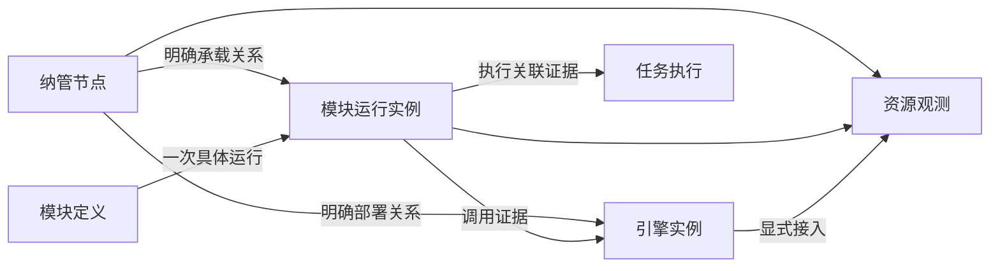

# ADDP 平台运行监控与可观测性设计

状态：总体方案与依赖隔离原则已确认；可选日志/指标设施、平台主机管理、采集配置及主机监控页面已分批实施并验收。九项概览、文件系统容量与 inode、磁盘吞吐与 IO 时间、网络接口收发的固定目录共 25 项，本地标准门禁与原生 Linux Hosted 验收已通过；平台告警领域调整仍待确认，生产 T5 未完成（2026-10-09）。

用户已确认首期覆盖 ADDP 自身部署节点、服务和明确纳管的业务引擎；监控组件按 Infra 组织、按需部署，其缺失或故障只影响对应观测能力。本文记录目标契约与分批实施证据；可选设施裁剪及资源查询的已验收范围以第十节批次记录为准，不据此宣称所有目标能力或生产部署已完成。

## 一、目标与范围

目标是把平台运行问题与资源压力、服务请求和任务执行事实关联起来，使运维人员能够从告警定位节点、运行实例、接口或引擎，并查看有权限的诊断证据。

| 需求 | 设计范围 |
| --- | --- |
| 主机台账与资源监测 | 纳管节点身份、基础信息、CPU、内存、磁盘、网络与趋势 |
| 服务实例负载监测 | 复用已有进程实例身份，区分进程消耗、容器配额和宿主容量 |
| 集中监控与资源统计 | 同类对象排行、容量统计、状态和有来源证据的部署关系 |
| 告警与关联诊断 | 基于有效观测判定，复用 Monitor 告警与通知机制，关联已有执行事实和日志入口 |
| 慢接口与调用拓扑 | 第二期补充分布式追踪；展示证据范围，不承诺自动根因判定 |
| SSH 初始化、防火墙、批量启停、扩容 | 第三期按实际需求讨论受控运维执行，不进入首期 |
| 功能热度、综合健康评分、泄漏诊断 | 暂缓；产品使用分析单独定义事实，诊断结论需要充分证据 |

不纳管企业内所有主机和应用，不采集客户端电脑，不自动扫描任意网络。业务引擎被登记不代表其宿主节点已纳管，也不代表平台已获得数据库专业指标或主机管理权限。

## 二、现有基础与目标差距

| 现有事实 | 目标改动 |
| --- | --- |
| System 保存模块定义、运行实例、心跳租约和引擎登记 | 增加纳管节点稳定身份与明确的部署关联，不重复登记服务或引擎 |
| Monitor 聚合任务执行、后台运行心跳、Provider health | 扩展平台资源观测；执行槽位不冒充 CPU 或内存 |
| Monitor 已有租户执行告警及独立平台日志链路告警 | 复用生命周期、事务 outbox 与投递机制，补充平台资源信号 |
| 日志正文使用受控实例文件 → Alloy → Loki → System 授权查询 | 保持唯一正文路径，增加观测能力的部署选择和故障呈现 |
| 请求日志记录 request_id、状态与耗时 | 统一应用指标；第二期增加 Trace/Span 与传播 |
| 标准 Infra 已包含日志组件，启动入口准备和校验日志配置 | 同步改造标准生命周期，才能支持不部署日志组件 |

当前代码与配置核对入口：

- [System 运行实例模型](../../system/backend/internal/models/module_registry.go)
- [Monitor 模块说明](../../monitor/CLAUDE.md)
- [公共请求日志](../../common/middleware/logging/logging.go)
- [日志采集配置](../../scripts/infra/runtime-logs.alloy)
- [Infra 启动入口](../../scripts/infra/up.sh)

## 三、对象身份与事实所有权

### 3.1 对象模型

| 对象 | 身份与规则 | 唯一事实源 |
| --- | --- | --- |
| 纳管节点 | 稳定 node_id；物理机或虚拟机。名称、IP、操作系统是属性，不以 IP 或容器主机名构造身份 | System 节点台账（待实现） |
| 模块定义 | 复用 module_name 与现有定义身份 | System 模块登记 |
| 模块运行实例 | 复用现有进程级 instance_id；重登记保留，真实重启产生新身份 | System 运行实例与租约 |
| 容器 | 使用部署环境提供的容器身份及配额证据；容器与进程不强制一一对应 | 容器运行环境 |
| 引擎实例 | 复用 engine_id；可以是集群或云服务，不强制拥有单一宿主节点 | System 引擎登记 |
| 任务执行 | 复用 execution 身份和 Owner 写入的事实；不从当前 Worker 推断历史执行位置 | Common 执行事实与任务 Owner |
| 监测目标 | 明确对象引用、监测类别和采集端点，身份不同于被观测对象 | Monitor 监测配置（待实现） |

node_id 由部署环境明确绑定到实例和采集来源，不能用现有 host_node_name、registered_host 或 host_node_ips 推算。未提供稳定绑定时保留“未关联节点”；历史实例不回填无法证明的节点身份。节点绑定不参与路由、Ready 或执行领取权。

部署关系记录来源与有效时间。调用关系来自明确配置或实际 Trace，展示来源、观测窗口与覆盖范围；未观测到调用不表示不存在依赖。引擎业务数据路径继续使用 ResourceLocator，不把 node_id 作为数据资源定位符。

### 3.2 模块职责

| Owner | 职责 | 边界 |
| --- | --- | --- |
| System | 节点基础台账、模块/实例/引擎登记、IAM、统一审计 | 不保存 Monitor 指标阈值或观测策略，不因资源告警改写实例租约 |
| Monitor | 监测目标、资源与服务质量查询、趋势、拓扑投影、规则、告警和通知 | 不创建第二套实例在线事实，不直接读取业务节点文件或业务引擎数据 |
| 业务模块与 Runtime | 自身请求、运行时和执行关联事实 | 不依赖中心遥测设施确认业务成功，不把执行结果存入指标后端 |
| Common / Common-Python | 埋点、身份字段、上下文传播、脱敏和传输公共能力 | 不拥有中央台账、指标历史或模块业务阈值 |
| Console | 聚合入口、上下文和跨模块导航 | 页面可见性不替代 Owner 授权 |
| Infra 与部署系统 | 组件生命周期、端点、Secret、采集权限、存储和资源预算 | 不注册为业务 Engine，不伪造 Tenant 或任务身份 |

平台节点和共享 Infra 的物理资源观测属于 Platform Context。Tenant 只查看有明确授权依据的引擎观测或执行摘要；不能通过 engine_id 获得宿主节点其他进程、其他 Tenant 或平台日志正文。首期平台资源视图只公开有界运维元数据，业务 SQL、参数和结果不采集到其中。Tenant 专业引擎诊断需另行细化 Owner 授权契约后接入。

采集服务使用独立最小权限身份和绑定来源，不代传长期 User Token。数据库专业指标使用专用监测账号；Monitor 不获取业务读写账号自行查询。平台日志正文继续由 System 的独立 Permission 和授权查询路径提供。

### 3.3 实际运行的平台级与租户级边界

2026-10-06 用户确认隔离测试身份安排，并明确实际运行须区分平台级和租户级。测试身份例外不改变以下运行边界，也不授予生产角色新的权限。

| 维度 | 平台级（Platform Context） | 租户级（Tenant Context） |
| --- | --- | --- |
| 观测范围 | 纳管节点、共享 Infra、平台模块实例及采集链路的有界运维事实 | 当前 Tenant 内获授权的引擎观测、任务执行及其摘要 |
| 管理范围 | 节点台账与平台监测目标，分别要求对应独立 Permission | 当前 Tenant 的已发布监控/执行功能及 Owner 对象权限；不获得平台节点或采集配置管理权 |
| 资源口径 | 宿主或平台服务的实际观测值，明确来源、窗口和覆盖范围 | 仅展示有可信租户归属依据的指标；共享宿主总用量不能按引擎关联直接归给租户 |
| 业务内容 | 平台角色不自动授予业务 SQL、参数、结果或 Tenant 内容读取权 | 按当前 Tenant 身份、功能 Permission 与 Owner 资源策略共同裁决 |
| 日志及告警 | 平台运行日志正文使用独立权限；平台事件不得虚构 Tenant | 现有租户执行告警按 Tenant 隔离；执行读取不附带平台日志正文或其他租户信息 |

服务端从 System 权威 AuthContext 派生当前 Context 和 Tenant，不接受浏览器自报 `tenant_id`、指标标签或引擎 ID 作为跨租户授权依据。具有平台角色的 User 切换到 Tenant Context 后仍须具备有效 Membership、当前 Tenant Role Permission 和 Owner 对象权限；Platform Context 不代表所有 Tenant。用户关联查询继续由对应 Owner 用当前已验证 User Token 裁决，后台采集身份不得代替用户读取裁决。

Console 与 Monitor 页面随当前 Context 呈现对应范围；上下文切换时清空旧范围数据、筛选和待完成请求，迟到响应不得覆盖新上下文。服务端授权覆盖列表、详情、趋势、汇总和拓扑，不能仅依靠前端隐藏页面。租户统计必须明确覆盖范围；租户 A、租户 B 和 Platform 三类身份分别验收，拒绝跨 Context、跨 Tenant 和后台身份绕过。

当前已发布的节点台账、监测目标与指标发现链路属于平台级。首期继续完成该链路；现有租户执行监控保持 Tenant 隔离。租户引擎资源观测仍须补齐可信归属、指标口径和 Owner 授权契约后实现，本节不宣称新增 Tenant 资源查询已经可用，也不增加新接口或权限占位。

## 四、技术路线与部署组织

### 4.1 唯一数据路径

| 数据 | 技术路线 | 存储与读取 |
| --- | --- | --- |
| 主机指标 | node_exporter → Prometheus 拉取 | Prometheus 时序存储，Monitor 受控查询 |
| Linux 容器指标 | cAdvisor → Prometheus 拉取 | 容器身份与配额明确绑定，Monitor 受控查询 |
| 应用/进程指标 | Go/Python 标准指标库和共享封装 → Prometheus 拉取 | 同一实例身份，规范化接口标签 |
| 日志 | 现有受控实例文件 → Alloy → Loki | 保持 System 授权正文读取；Monitor 展示链路健康和跳转 |
| Trace（第二期） | OpenTelemetry SDK → Alloy 的 OTLP 接收与处理 → Tempo | 受控诊断读取，按当前上下文授权 |
| 台账、策略、告警、审计、执行事实 | 保持各 Owner 的 PostgreSQL 事实源 | 高频采样不写 task_executions 或普通业务表 |

首期指标采用 Prometheus 拉取，不同时引入 remote_write 的第二条应用指标采集路径。Alloy 继续承接既有日志，第二期补充 OTLP；不同时部署另一套功能相同的常驻追踪采集器。每个目标和监测类别只登记一个采集来源，避免独立 exporter 与 Alloy 内置同类 exporter 重复采样。

Prometheus 负责时序查询及必要的记录规则；Monitor 拥有本专题告警策略、判定、事件与通知，不另引入 Alertmanager 作为第二个告警 owner。资源视图集成现有 Monitor 前端，Grafana 不作为首期产品入口或必需依赖。

### 4.2 中心组件与节点组件

| 类别 | 组件 | 部署规则 |
| --- | --- | --- |
| 中心指标设施 | Prometheus | 一套部署可服务多个节点；首期不宣称 HA 或跨地域可靠性 |
| 中心日志设施 | Loki、既有授权代理和存储 | 沿用独立 bucket、账号、保留与清理规则 |
| 中心追踪设施 | Tempo | 第二期按需部署；存储配置实施时按选定版本验证 |
| 节点采集 | node_exporter、cAdvisor、Alloy、既有日志接收和清理能力 | 只部署到显式接入对应能力的节点，权限按职责隔离 |
| 应用代码 | 指标库、OpenTelemetry SDK | 随模块构建，不因无遥测服务缺失应用依赖或无法启动 |

组件部署定义和生命周期由根 Infra Compose 与 scripts/infra 标准入口组织；组件配置放在既有 scripts/infra 目录。模块自己的业务能力仍归 Monitor，不新增“监控基础设施业务模块”。

指标、日志、追踪分别作为可选择的部署能力。部署选择、端点及 Secret 来自部署配置；规则阈值和普通运行策略归 Monitor 持久化配置，遵守 [配置规范](../spec/addp配置介绍.md)，不能再由 System 保存一套值或以环境变量覆盖已保存策略。实际端口来自标准生命周期，不在监测目标中硬编码首选值。

初期验证以 Linux 部署的节点、进程和容器为主。macOS 开发环境的原生宿主、Docker Desktop Linux 虚拟机和容器分别表达；容器内采集的 Linux 资源不能显示为 Mac 宿主资源。操作系统不支持的指标显示“不支持”，不改用外观相同但语义不同的数据。

现有日志 Alloy 不持有 Docker Socket。cAdvisor 的宿主访问权限必须独立评估和隔离，不为容器指标直接给现有日志采集器增加 privileged 或容器管理权限。所有新镜像、依赖和配置须核对技术栈规约，固定 tag/digest 并取得对应环境的实际验收证据；本稿不冻结未经验证的版本。

## 五、能力依赖与故障影响矩阵

“属于 Infra”描述部署归属，不表示所有模块必须依赖该组件。各模块必需的 PostgreSQL、Redis、MinIO 等仍按其真实用途决定；其自身依赖故障不属于遥测隔离承诺。

| 功能 | 依赖事实或设施 | 未选择/未接入 | 已选择但设施故障 | 必须保留的其他能力 |
| --- | --- | --- | --- | --- |
| 登录、模块路由、引擎登记 | System、模块必需 Infra、注册租约 | 按原有契约 | 按原有契约 | 不等待观测设施 |
| 数据探查、查询、传输、质量检测 | 各 Owner 必需 Infra、授权、实际业务引擎 | 按原有契约 | 仅依赖该资源的操作受影响 | 不因 Prometheus/Loki/Tempo/Monitor 缺失而失败 |
| 模块 UP/DOWN 与运行实例列表 | System 登记和租约 | 沿用已有能力 | 不能用采集状态覆盖登记事实 | 无指标设施也能读取实例登记 |
| 执行统计、执行诊断、后台槽位观测 | Common 公共事实及 Owner 读取裁决 | 沿用已有能力 | 按现有 Owner/存储错误语义 | 不依赖 Prometheus、Loki 或 Tempo |
| 节点/进程资源与趋势、TOP5 | Prometheus、对应 exporter、明确对象绑定 | 显示未启用或目标未接入 | 对应视图显示不可用或数据过期 | 其他业务、执行和日志能力继续工作 |
| 集中运行日志正文 | 既有日志来源、Alloy、Loki、System 授权 | 显示集中日志未启用 | 当前正文请求明确失败；不改读宿主文件 | 业务、资源和追踪能力继续工作 |
| Trace 与实际调用拓扑 | OTLP 链路、Tempo、身份与传播 | 显示追踪未启用 | 对应查询不可用，旧拓扑注明时间和覆盖 | 业务、资源、日志、执行继续工作 |
| 明确部署关系图 | System 台账和受信部署关联 | 未绑定关系不推断 | 来源不可读取时报告不完整 | 不要求 Tempo 存在 |
| 资源告警 | 有效指标样本、Monitor 规则/事件存储 | 不评估未启用能力；保留历史 | 依赖观测未知，不能自动判正常或恢复 | 其他告警来源独立评估 |
| 已有执行告警及通知 | 执行事实、Monitor、已配置通知渠道 | 无渠道仍保存事件 | 渠道失败有界重试，不回滚执行 | Prometheus/Loki/Tempo 缺失不阻断已有通知 |
| Monitor 模块本身 | 自身必需 Infra 和 System 注册 | 其他模块正常运行 | 集中监控/告警不可用 | Owner 继续写执行事实，模块继续注册 |

同一 Alloy 或网络路径被日志与追踪共同使用时，其故障会影响这两类观测。矩阵按实际依赖解释影响，不承诺共享组件间不存在关联故障；这种故障仍不得传播到业务主路径。

### 5.1 能力状态与目标状态

部署意图和运行观测分别表达，不新增一个笼统的“监控正常”字段。

| 状态维度 | 目标语义 |
| --- | --- |
| 部署意图 | enabled / disabled；仅由部署配置决定 |
| 能力可用性 | enabled 时区分 available、unconfigured、unavailable；关闭时显示 disabled |
| 目标接入与样本 | 未接入、有效数据、窗口内无数据、数据过期、不支持；分别展示来源和最近有效采样时间 |

disabled 不尝试发送，不制造设施离线告警；unconfigured 表示已选择但必要配置不完整；unavailable 表示配置存在但访问或协议验证失败。available 只说明查询/采集设施可用，不证明所有节点有样本。窗口内无数据不能解释为零负载；过期样本不能继续显示为实时正常。

关闭能力是部署意图，不是观测恢复事实。停止相应评估并保留历史告警，不把活动事件伪造为指标恢复；关闭期间的处理状态在详细告警契约中明确后实施。目标状态不改写 System 租约、Engine 生命周期或任务执行终态。

### 5.2 启动、业务请求与生命周期隔离

1. 业务模块的 live/ready、注册和 Gateway 路由不检查观测设施。Monitor 的整体 Ready 不包含可选指标、日志、追踪后端；自身必需存储和 System 注册继续遵守原有规则。
2. 指标端点读取本地有界状态，不在采样时执行业务查询。Trace 发送在业务请求外使用有界队列、批处理和有限超时；队列满或发送失败可丢弃遥测并记录计数，不无限重试、积压或等待远端确认。
3. 集中日志未启用时不启用其远端采集。既有结构化输出、受控启动身份和有界接收规则必须在同一次生命周期改造中核实；不恢复旧固定模块日志文件或新增直接读文件路径。
4. 用户查询观测数据按能力独立失败。组合页面分区加载，指标失败不挡执行记录或日志入口；后端不得把查询错误包装成成功空列表。
5. 标准启动入口按选择分别预检、启动和报告。观测配置错误不得阻止无关核心服务启动；所选观测能力失败必须明确报告并返回非零整体结果，不以全成功掩盖部分失败。调用入口根据所需服务检查实际就绪，不能把聚合退出码当作全部业务已不可用。
6. 关闭时不校验该能力专用凭据，也不主动启动其组件。错误不得触发对其他运行中设施的停止、清理、重建或接管。
7. 观测设施短暂恢复后自动恢复连接；已有业务进程不需要重启。恢复不补造停采窗口的数据，不承诺停机期间日志或 Trace 已完整保存。
8. 指标、日志、Trace、任务记录、操作审计分别遵守其可靠性契约。不可丢失的授权/审计约束不能因为遥测隔离而放宽。

## 六、指标口径与资源预算

| 类别 | 首期口径 |
| --- | --- |
| 主机 CPU | 节点 CPU 忙碌率；总览按核数加权，注明窗口与有效样本覆盖 |
| 进程 CPU | 消耗 CPU 核数；有明确有效配额时另算配额利用率，不默认分配宿主全部核数 |
| 主机内存 | 总量、可用量及基于可用量的压力；操作系统缓存不能直接判为泄漏 |
| 进程/容器内存 | 进程驻留内存、容器内存与配额分别展示；无限制时不伪造百分比 |
| 运行时内存 | 堆、GC、并发运行体等专业指标；持续增长只能提示进一步诊断 |
| 磁盘 | 明确文件系统/挂载点的容量、可用空间、inode；IO 吞吐、等待和繁忙时间独立展示 |
| 网络 | 各网卡上下行速率与错误；累计字节转速率处理计数器重置，不重复累加桥接/虚拟接口 |
| 服务质量 | 完成请求数、错误率、延迟分布；接口使用规范化 route，排除敏感请求内容 |
| 执行运行 | 复用现有积压、排队与运行时长、失败率和槽位；不从 CPU 推算执行容量 |

首期只在同类对象、同一时间口径内排行。主机物理容量不与进程消耗或容器配额相加；共享文件系统不按挂载节点重复汇总；集群引擎不按连接登记数推算服务器数量。历史环比注明等长窗口、完整度与无基期情况。

默认以秒级采样和刷新表达近实时，页面展示最近采样时间，不承诺逐毫秒实时。采样、查询窗口、分辨率、保留期、返回点数和并发预算必须在详细配置契约与测试中确定；长窗口查询使用有界步长，前端刷新频率不能直接改变采样频率。

指标标签仅保留必要身份与有限维度，控制运行实例重启产生的序列规模。TraceId、request_id、execution_id、用户 ID、完整 URL、SQL、Token 不作为指标标签；关联身份使用适合的数据字段，仍限制索引基数与保留范围。

观测组件限制 CPU、内存、队列、磁盘和保留期。复用 MinIO 时采用独立 bucket/账号、容量预算与清理规则；bucket 分开不等于底层磁盘隔离。同机共享资源耗尽可能影响业务，需要真实预算测试，不能仅凭软依赖声称物理故障隔离。

## 七、告警、追踪与运维边界

资源告警从有效观测产生 active signal，再由 Monitor 统一处理事件与通知。持续时间、恢复阈值、维护静默、确认、抑制与通知重试明确分开；查询失败、采样缺失和不支持的指标不能产生虚假的恢复。平台观测与租户执行分别授权，不将平台资源事件写进租户执行告警表或虚构 Tenant。

现有 platform_log_* 专属于平台日志域。扩展平台资源事件时复用中立发送和生命周期机制，不直接把资源信号塞进日志专用模型。平台运行告警的领域收敛、表/API 命名和既有事件语义的保留范围在详细设计时先核对日志已确认契约；如需改变已有语义，先讨论、修订文档，再整体替换，不能旁路保留两套相同职责的事件与通知路线。

第二期逐步贯通 Gateway、Go/Python 服务、公共 HTTP Client 和数据库/引擎调用。request_id、trace_id、execution 身份分别表示请求、调用链和业务执行，不互相替代。异步任务使用明确关联与新运行跨度，不把长任务硬挂在创建请求生命周期下。慢请求与错误保留策略必须与采样位置、容量和丢弃观测一起验收；随机头部采样不能保证保留全部慢请求。

拓扑先提供有证据的部署关系，随后增加观测调用关系。每条关系注明来源、有效时间或观测窗口；不使用指标聚合算法宣称根因已确认。综合分数暂不替代可解释的指标和规则。

监控系统整体不可用时无法靠自身完成告警，生产需独立的外部存活探针；独立探针不授予业务读取或主机管理权。

第三期若接入运维动作，ADDP 负责目标、操作计划、权限和审计，成熟执行设施承担实际变更。主机登记不默认保存 SSH 密码，监控采集身份不具备 Shell 权限，Monitor 不提供任意命令执行器。启停、移除纳管、服务停止、主机关机是不同操作，详细契约未确认前不开放。现有 Orchestrator 租户任务不能隐含获得平台主机操作权。

## 八、分期、标准入口与验收

### 8.1 开发顺序

| 阶段 | 工作 | 完成条件 |
| --- | --- | --- |
| D0 设计基线 | 概念、Owner、依赖矩阵、现状差距与验收整理 | 本文与术语、架构、监控入口一致；不宣称代码落地 |
| D1 第一期开工契约 | node_id 与实例绑定、监测目标、指标目录、部署选择、状态和权限契约 | 核对现有声明/配置/日志边界，解决会改变业务结果的歧义后再编码 |
| P1.1 部署与隔离基础 | 标准 Infra 选择、能力状态、生命周期、Prometheus 和采集夹具 | 未部署和运行故障两类隔离测试通过，无业务主路径依赖 |
| P1.2 资源观测闭环 | 节点/实例关联、指标/趋势/TOP5、基础服务质量、资源告警与日志跳转 | 口径、权限、告警及真实部署链路通过；删除被替换路径 |
| P2 关联诊断 | Trace、慢接口、调用拓扑、专业引擎观测和执行关联 | 异步关联、采样、脱敏与读取授权通过 |
| P3 受控运维 | 按真实需求细化初始化、配置变更、启停与扩容 | 独立操作范围与权限确认、计划/执行/审计验收，不复用监测身份 |

### 8.2 测试与 CI 影响

遵守 [测试与验收规范](../spec/addp测试与验收规范.md)。下表定义各层验收要求，各实施批次的入口、范围与实测结果见第十节。新增服务、权限、API、迁移或测试入口必须在编码前登记影响，不能等推送失败再补门禁。

| 层级 | 必须证明的事实 | 标准承接方式 |
| --- | --- | --- |
| T0 | Owner/权限声明、Swagger、配置与生命周期一致；新组件/镜像/门禁注册 | test-platform 与现有登记检查；新增输入随实现登记 |
| T1 | 指标单位、配额缺失、身份绑定、计数重置、能力状态、未知观测、恢复阈值、有界发送 | 各 Owner 已有 Go/Python 门禁自动发现 |
| T2 | 真正的指标采集/查询、告警事务、队列满/超时/设施断开与恢复、生命周期清理 | Owner disposable 门禁；新 Prometheus/采集依赖按规范登记服务、固定镜像和输入 |
| T3 | 平台权限、能力未启用、目标未接入、过期数据、分区错误、路由恢复、跨页面导航 | Monitor/System 现有前端门禁；共享能力按消费者扩散 |
| T4 | 真实 System/Gateway/Owner 下无观测设施的业务、运行中故障、恢复及进程身份关联 | 在标准 Online suite 中实现并登记，禁止占位 suite |
| T5 | 正式发布选择、安装/停止/升级、真实 OS 与容器采集权限；HA 仅在另有证据时宣称 | 已登记 Release suite 的相应能力认证 |

关键故障场景至少包括：

1. 指标、日志、追踪全部未部署：System/Gateway/业务 Owner 按自身依赖 Ready，执行与结果读取正常，页面不产生虚假观测告警。
2. 仅启用指标和日志、未部署 Tempo：资源与日志可用，追踪显示未启用，业务不受影响。
3. 运行中分别中断 Prometheus、Loki、OTLP/Tempo：只影响依赖区域，不改写租约、任务或引擎生命周期，不无限积压。
4. 仅一个节点采集失败：其他节点正常；旧样本过期，不能显示零负载或恢复资源告警。
5. 配置错误和专用凭据缺失：所选观测能力报告失败；关闭能力不校验其 Secret；无关业务生命周期不被阻断。
6. 设施恢复：已有业务进程不重启，重新获得新样本；停采空白保留，历史不伪造。
7. 真实进程重启、多实例、IP 变化、容器重建：身份正确关联，不串历史，不重复统计。
8. 无配额、缺节点身份、共享磁盘和缺失统计窗口：显示真实边界，聚合不重复计数。
9. Platform/Tenant 越权、来源伪造、任意采集端点与敏感内容：服务端拒绝，不依赖前端隐藏。
10. 采集/发送预算耗尽：业务不阻塞，丢弃或失败可观测；标准测试退出清理自建容器、进程、卷和本轮数据库事实。

工作区验证默认运行 `make test-changed`，明确单 Owner 时使用 `make test-module MODULE=<owner>`；数据库运行前先用 `bash scripts/infra/status.sh` 核实实际映射。本地只使用 `addp_test`/`addp_iam_test` 和标准入口，测试不接管个人 Infra。新增 T2 依赖须同步 `ADDP_T2_SERVICES`、镜像、输入、退出清理和 CI 注册；新增 T4/T5 suite 取得实现后才能列为可运行入口。

### 8.3 本轮设计交付与后续准入

- [x] 确认首期纳管范围、模块职责和技术主路径。
- [x] 整理组件依赖、未部署行为和故障影响矩阵。
- [x] 定义观测设施不进入业务 Ready/主请求的隔离要求。
- [x] 区分已实现日志/执行基础与待实现资源、裁剪和追踪能力。
- [x] 同步术语及概念、模块和文档导航。
- [x] 细化 D1 的节点/实例字段、目标发现、部署选择、数据状态、权限和采集/查询预算（目标契约，待实施）。
- [ ] 确认 D1 的平台运行告警领域调整，完成历史记录、接口、权限与订阅的替换契约。
- [ ] 按 P1.1/P1.2 实施并通过门禁；未实施项不得计为通过。

第一期开工契约见第十节。节点、部署、状态、查询与权限部分可据此拆分实施；平台告警领域调整在确认之前不进入迁移或代码变更。

## 九、技术资料与相关规范

- [Prometheus HTTP 服务发现](https://prometheus.io/docs/prometheus/latest/http_sd/)：监测目标可转换为受控发现投影；不是新的对象身份事实源。
- [Prometheus 埋点约定](https://prometheus.io/docs/practices/instrumentation/)：指标类型、标签基数与请求指标设计参考。
- [OpenTelemetry 采样](https://opentelemetry.io/docs/concepts/sampling/)：第二期慢请求保留与容量设计参考。
- [Alloy cAdvisor 组件](https://grafana.com/docs/alloy/latest/reference/components/prometheus/prometheus.exporter.cadvisor/)：Linux 支持、宿主权限和 Docker Desktop 边界参考，不表示仓库现有配置已启用。
- [术语表](../concepts/addp术语表.md)
- [模块架构](../concepts/addp模块架构图.md)
- [监控与执行体系](../concepts/addp监控与执行体系图.md)
- [授权上下文规范](../spec/addp授权上下文规范.md)
- [配置规范](../spec/addp配置介绍.md)
- [技术栈规约](../spec/addp技术栈规约.md)
- [模块服务运行日志设计](ADDP模块服务运行日志设计.md)

## 十、第一期开工契约与分批实施记录

10.1–10.8 定义第一期的目标契约（2026-10-05），按批次实施；已发布范围与实测结果以 10.9–10.27 的批次记录为准，不能把其余目标契约当作已有能力。告警领域调整单独列于 10.7，不因其他部分已细化而视作获得批准。

### 10.1 节点与实例绑定

System 的节点台账只保存身份和部署元数据，不保存瞬时资源指标、SSH 凭据或“综合在线状态”。

| 字段 | 契约 |
| --- | --- |
| `node_id` | System 创建的 UUID，不由 IP、名称或硬件信息计算；纳管期间稳定，不复用已退出节点的身份 |
| `display_name` | 运维显示名称，可编辑，不要求作为全局身份唯一键 |
| `node_kind` | `physical` 或 `virtual`；Docker Desktop 的 Linux VM 属于独立虚拟节点，容器不是节点 |
| `addresses` | 显式填写的 IP/DNS 地址，仅作台账属性；不自动选择一个地址作为采集端点 |
| `enabled` | 是否继续纳管的管理员意图，不表示电源、网络或业务实例状态 |
| `version` | 独立可变台账的正整数并发版本，创建为 1；更新须原子校验并递增 |
| `created_at`、`updated_at` | UTC 时间；所有操作者与变更结果另走现有审计，不重复建审计表 |

节点聚合内的部署绑定声明明确列举允许的模块服务 Client 与模块名，变更使用节点 `version`；同一模块 Client 可被明确允许部署在多个节点，不因此推断某次进程的具体位置。服务登记中的 `node_id` 只是一份声明，System 按当前 Client 与这份允许集合裁决；关联投影附带 `node_binding_state`（`unbound/bound/rejected`）及安全原因。被拒绝的声明不能进入部署拓扑、资源汇总或采集身份标签；主实例登记与租约仍成立。这是节点领域的来源约束，不为 Client 增加 Shell 或其他业务权限。

首期采用停用纳管，暂不提供节点物理删除、关机或 SSH 操作。停用后停止纳入当前资源汇总与采集发现，保留节点身份、历史关联和指标保留窗口；这不停止节点上的业务服务。

绑定按以下顺序进行：

1. Platform User 在 System 创建节点，取得 `node_id`；部署人员向属于该节点的进程注入目标部署输入 `ADDP_HOST_NODE_ID`。本地 `.dev-state` 可以保存已配置输入，不能成为第二个节点身份分配器。
2. Common/Common-Python 在既有模块登记请求增加可空 `node_id`。System 继续校验当前模块服务身份；非空值须是合法 UUID，且只在台账存在、启用并符合该部署来源的绑定约束时投影为已关联。未知或未被允许的节点引用保留绑定诊断，不建立承载关系，不因此拒绝整个业务实例登记或续租。
3. `host_node_name/host_node_ips/runtime_hostname/registered_host` 保留各自既有语义，不成为 `node_id` 的别名或兼容输入。缺少 ID 时显示未关联；历史实例不靠名称匹配补填。部署声明是声明证据，不等于平台已独立验证物理位置。
4. 一个具体进程实例的节点声明在首次登记时固定，同一 `instance_id` 恢复登记不得改挂节点。部署位置变化后产生新的进程实例身份；不能通过编辑当前节点反写历史实例。绑定诊断与实例 UP/DOWN 分别返回。
5. 引擎的部署关联由 System 在已有引擎事实旁维护显式节点集合，使用引擎聚合的 `version` 校验，记录声明来源与生效时间。远端、集群或云引擎允许节点集合为空；删除关联保留其历史有效区间，不自动拆成多个 Engine Instance。

共享部署输入解析遇到非法 `ADDP_HOST_NODE_ID` 时只停用该绑定并记录安全诊断，不将非法 UUID 发送进业务登记请求，也不退回名称/IP 推算；进程注册仍用原有必需字段完成。API 对恶意或非规范请求的体积、类型和语法错误继续严格拒绝，这与合法业务进程因观测输入错误而无法启动分别验证。

部署绑定约束必须来自受控部署登记，不能信任浏览器提交的服务身份，也不能把采集端点响应的任意 `node_id` 当作授权证据。编码前须在 System 登记测试中证明同模块多节点部署可区分、非授权来源不建立绑定以及绑定失败不影响租约；不能仅凭 UUID 存在就认定位置可信。首次声明与登记写入同事务，重登记只核验原声明，不覆盖它；台账停用或允许来源撤销后当前关联失效，原声明仍作为带时间的历史证据保留。

### 10.2 监测目标与采集发现

Monitor 的监测目标引用已有对象，拥有采集配置。目标的普通配置使用自身 `version`；采集权限和 Secret 不进入普通读取响应。

| 字段 | 契约 |
| --- | --- |
| `id`、`version` | Monitor 主资源身份与并发版本 |
| `subject` | 判别联合：节点 `{kind:node,node_id}`；模块实例 `{kind:module_instance,module_name,instance_id}`；引擎 `{kind:engine,engine_id}`。只接受所属类型的字段 |
| `monitor_kind` | `host_resources`、`process_resources`、`container_resources`、`service_quality`；第一期不自动开放数据库专业采集 |
| `source` | 固定受支持来源类型及受控端点；不接受任意脚本、任意 PromQL 或用户指定的多目标代理参数 |
| `enabled` | 监测意图，独立于主体和模块的 enabled；关闭不改主体生命周期 |
| `created_at`、`updated_at` | 配置时间，不冒充最近采样时间 |

同一主体和监测类别最多一个启用来源。一个实例指标端点可同时承载进程资源和服务质量，发现投影按物理采集端点合并为一个 scrape target，不能为两个视图重复拉取。cAdvisor 一个节点端点可返回多个容器：节点绑定和容器筛选来自受控配置，明确声明的容器/进程关系才能投影到实例；未绑定容器不得推断为某个 Tenant 或业务实例。

首期引擎视图展示明确关联节点的资源及采集覆盖，不把节点总消耗标成该引擎独占消耗。远端未纳管宿主的引擎显示未接入；引擎专用 exporter、数据库指标或云厂商 API 的专业接入留到 P2，在 Owner 授权与专用凭据契约完成后开放。

首期对主机与显式容器来源支持目标配置；模块实例来源随已有登记投影产生，不再要求为每次重启人工登记新实例。部署输入明确提供 Prometheus 可达的指标地址，不能拼接 `module_url + /metrics`，Worker 无业务地址时也不能被遗漏。相同语义的目标配置由一个 Monitor 服务维护，自动实例投影不能成为第二套实例登记或管理员可编辑的身份事实。

Prometheus 通过 Monitor 的单一受认证 HTTP SD 读取全量目标投影；投影组合 Monitor 配置与 System 当前对象状态，不分页，不接受调用者自报标签。固定刷新周期初值 30 秒，身份标签由控制面填入，覆盖来源自报的保留身份标签。停用节点/目标、已结束实例及未绑定来源从新快照移除；历史指标仍按原身份保留。

HTTP SD 失败时 Prometheus 会保留上一份列表，因此“不出现在新快照”只在刷新成功后生效。Monitor 当前查询与告警必须重新按当前纳管/目标范围筛选，不能把旧采集列表当作当前授权或对象状态。页面展示最近成功发现时间与配置生效状态；停止采集有收敛窗口，凭据撤销及网络策略才是紧急阻断边界，不能承诺发现服务故障时仍即时停采。[Prometheus HTTP SD 官方契约](https://prometheus.io/docs/prometheus/latest/http_sd/)

控制面不可用时返回失败，不以成功空列表清除全部目标。应用指标端点仅绑定受控网络与独立采集认证，不经公开 Gateway 业务路由；第一期应用指标采用部署管理的 mTLS 采集身份，证书由 Secret 注入并支持吊销/轮换。采集身份不能访问业务 API，指标读取不能获取用户或业务引擎凭据。

exporter 不能假设都原生提供相同的 TLS 服务端能力。node_exporter 的保护使用其 exporter-toolkit 配置；cAdvisor 的 `collector_cert/collector_key` 用于它向应用端采集的客户端，并不保护其对外指标服务。cAdvisor 原始端点只暴露于隔离的本节点采集网络，远程读取通过节点专用 Nginx mTLS 入口，仅允许固定指标路径且不开放 Web UI/调试/任意反向代理。该入口属于 Infra 的传输防护，不承担第二条采集或授权事实路径，不让日志 Alloy 获得宿主权限；节点入口镜像、预算、配置输入及证书测试随 P1.1 一同登记。未部署这种保护的来源不进入远程发现。[node_exporter 文档](https://github.com/prometheus/node_exporter#tls-endpoint)、[cAdvisor 服务实现](https://github.com/google/cadvisor/blob/master/cmd/cadvisor.go)

目标端点须限制到受管地址范围和明确端口，禁止 URL 凭据、重定向、云 metadata 地址与任意外网扫描；受控回环/私网按部署模式显式允许，DNS 解析结果须重新核验。不能复制通知 Webhook 的外网访问规则直接当作主机采集规则。端点变更必须重验证并记审计。

### 10.3 部署选择与配置生效

以下是目标部署键；本轮已实现集中日志选择，其余键仍待实现，不作为当前可用命令。根 `.env.example` 仍是唯一模板，不新增 `deploy.env` 或模块私有覆盖文件。

| 目标部署输入 | 建议模板值 | 使用者与行为 |
| --- | --- | --- |
| `ADDP_OBSERVABILITY_METRICS_ENABLED` | `false` | 标准 Infra 入口选择 Prometheus 及明确的指标采集来源；业务进程据此决定是否开放指标端点 |
| `ADDP_OBSERVABILITY_LOGS_ENABLED` | `true` | 选择现有集中日志组合；保留现有模板的日志使用意图，支持显式关闭，不靠 Loki Secret 是否存在猜开关 |
| `ADDP_OBSERVABILITY_TRACES_ENABLED` | `false` | 第二期才提供 true 的实现；首期 true 明确报告未支持，核心业务仍按实际就绪结果启动 |
| `ADDP_HOST_NODE_ID` | 空 | 单个部署节点显式绑定，不为全环境所有宿主注入同一个 ID |
| 各设施端点、证书与 Secret 引用 | 按实际部署填写 | 能力 enabled 时独立预检；浏览器不读取内部端点或凭据 |

布尔值只接受 `true/false`；模板与显式部署输入决定意图，不按组件探测结果改变开关。中心设施选择与节点采集选择分别处理：开启中心 Prometheus 不自动在全部机器安装 exporter。共享 Alloy 的日志/追踪配置按能力生成，未选择的输入不出现在有效配置和 Secret 校验中。

标准 `up/status/down`、开发与生产启动都消费同一选择解析实现。核心服务与各观测能力分别记录结果，整体命令在所选能力失败时返回非零，但调用者应按必需服务的实际状态决定是否继续，不能靠 `set -e` 把可选能力失败提升为全平台中止。未选择的组件不创建；已有观测组件停用只能由标准入口在确认项目归属后处理，保留数据卷，不停止其他工作区或核心服务。

部署选择、物理资源限制、设施端点和证书随对应组件生命周期生效；修改它们不承诺热更新。恢复同一设施的连接无需重启业务。Monitor-owned 查询预算与阈值采用原子热更新，目标配置在下一次成功发现后生效，响应区分保存版本与已应用版本。首期采样周期固定 15 秒，由唯一的版本化采集契约生成配置；页面不提供一个不能实际生效的采样编辑项，后续可配置采样时再明确发布与回执协议。

### 10.4 状态与读取响应

能力读取返回 `capability`、`enabled`、`availability`、安全 `reason_code`、`checked_at`；不返回原始连接错误、内部地址或 Secret。全局可用性采用有界周期探测，不能因某个 exporter 无样本就判整个 Prometheus 不可用。

资源读取返回对象身份、指标目录键、单位、时间与数据状态。有效性按每个指标/序列判断，不把“有一个 CPU 点”解释为整个对象全部有效。

| `data_state` | 条件与展示 |
| --- | --- |
| `not_connected` | 当前没有启用且有效绑定的来源；不调用后端猜测身份 |
| `valid` | 有满足新鲜度和口径的有效样本；速率还必须满足所需样本数与完整窗口 |
| `no_data` | 来源已接入，但查询窗口没有有效样本；值为空，不能显示 0 |
| `stale` | 最近有效样本超过新鲜度；可以显示带时间的历史值，不计入当前排行、汇总与恢复判定 |
| `unsupported` | 来源/操作系统/配额证据不支持该指标；不是设施故障 |

瞬时视图包含 `sampled_at`、`queried_at`、`window_seconds`；趋势包含起止时间、实际步长与各序列缺口。`value=null` 与 `value=0` 明确区分。时钟异常或速率计算窗口不足不生成伪有效点。CPU 分母、内存配额及容器映射等口径证据来自同一对象与窗口，不能用现在的容量回算过去百分比。

HTTP 行为遵守既有 API 规范：

- 能力目录读取成功返回 200，即使其中某个能力 disabled/unavailable；这仅证明状态查询成功。
- 直接请求未启用能力返回 409 与 `observability_capability_disabled`；已启用但配置缺失返回 503 与 `observability_capability_unconfigured`；后端故障返回 503 与 `observability_backend_unavailable`，超时返回 504 与 `observability_query_timeout`。
- 已成功查询但没有样本返回 200 和明确数据状态；不能将故障包装成这种响应。非法指标/参数返回 400，超出已声明查询预算返回 422，瞬时并发限流返回 429；无权限/对象不存在分别沿用 403/404。
- 管理列表沿用 `data/total/page/page_size/total_pages`，每页最大 100；组合页面各区独立请求。当前数据汇总返回有效对象数与应覆盖对象数，覆盖率不足时明确“不完整”，不能用部分成功值冒充全平台总值。

### 10.5 第一版指标与预算

数字为第一期初始设计值，需要由真实采集及负载门禁证明；不是已经取得的性能上限。固定指标目录是唯一的公式、单位和来源定义，前端与告警共用，不各自编写 PromQL。第一期不开放任意表达式、插件代码或全量标签搜索。

| 指标目录范围 | 计算与缺失规则 |
| --- | --- |
| 节点 CPU、1/5/15 分钟负载 | CPU 使用 1 分钟计数器速率；负载展示原值并同时显示核数，不直接当 CPU 百分比 |
| 节点内存、文件系统、inode | 内存压力基于可用量；文件系统按挂载证据和排除规则展示，共享归属不明确则不作全局总容量 |
| 节点网络、磁盘 IO | 1 分钟计数器速率，区分设备；过滤桥接/虚拟设备需要显式规则，计数重置使用后端速率语义 |
| 进程 CPU 核数、RSS、运行时 | 进程与容器范围分别展示；没有有效配额就不生成配额利用率 |
| 服务请求量、5xx 率、延迟分位数 | 完成请求计数和时长直方图；规范化 route 与有限方法/状态类别；无请求时错误率/延迟为空，不判断服务故障 |

| 预算项 | 初值与所有权 |
| --- | --- |
| 采样与超时 | scrape 15 秒、超时 5 秒；首期固定采集契约，超时不得大于采样周期 |
| 数据新鲜度 | 单点超过 60 秒标 stale；告警连续窗口内缺样本时进入 unknown，不能仅凭最新一点跨缺口判定 |
| 刷新与范围 | 页面默认 15 秒刷新、最短 10 秒；查询范围最长 7 天，不修改后端采样频率 |
| 查询输出 | 每请求最多 12 个目录指标、100 条序列、每序列 1,000 点、总计 20,000 点；实际步长至少 15 秒，随范围增大；拒绝超限，不能偷偷截断 |
| 查询保护 | 总超时 5 秒；单主体并发 2、单 Monitor 进程上游查询并发 8；满额快速返回 429，无无界等待队列；存储预算与限流策略分开 |
| 时序保留 | 初始 7 天与 10 GiB 体积上限同时限制，达到体积上限可能提前淘汰，不能保证总能查到 7 天；磁盘另预留 WAL/压缩空间 |
| 序列准入 | 单端点采样上限 20,000；全部署初始活跃序列预算 200,000。端点超限是采集失败，必须可见；总预算需要有界计数与准入，不能把单端点 sample_limit 当成全局限额 |
| 组件资源 | Prometheus 初始上限 1 CPU/2 GiB；node_exporter 0.25 CPU/256 MiB；cAdvisor 0.5 CPU/512 MiB，均为可调整部署预算，负载证据不足时不能宣称满足规模 |

查询预算归 Monitor 普通平台配置，版本校验、热生效与审计同次实现；初次无持久值使用定义默认值，保存后不退回环境值。组件资源、磁盘卷容量和 TSDB 启动保留参数归 Infra 部署，页面只读呈现实际配置。Alloy/Loki/日志接收与清理沿用现有已验证预算，不因指标开启取消它们的边界。

客户端选择窗口，服务端依据指标目录与预计序列上界规划步长，使单序列点数和总点数同时满足预算；实际返回序列仍要二次核验。Nginx 节点入口初始上限 0.25 CPU/128 MiB，同样只表示设计预算。全局序列准入按去重后的采集端点及每端点配额预留总额，包含自身指标开销；配额预留之和不得超过全局预算，新增端点与提高配额须原子校验。不根据一次观测到的少量序列承诺剩余容量充足。

固定 scrape 配置、sample limit、标签和响应体限额应在实际选择版本的配置校验中验证。Prometheus 时间/体积保留针对时序块，不代表整个数据目录的绝对磁盘硬配额，需要额外卷容量与磁盘告警。[Prometheus 配置](https://prometheus.io/docs/prometheus/latest/configuration/configuration/)、[存储说明](https://prometheus.io/docs/prometheus/latest/storage/)

### 10.6 权限与接口责任

下表是待发布的功能契约，Permission Key 必须在实施时进入 owner manifest、生成常量、角色目录与双语文本，不能只在 Handler 中手写字符串。Platform Context 不能因 URL 相似自动激活 Tenant 权限。

| 功能/API 目标 | Owner 与最小权限 |
| --- | --- |
| `/api/v1/system/platform/host_nodes` 节点列表/详情、创建和更新 | System；目标 `platform.host_node.read/create/update`，Platform User；更新携带版本，第一期不开放 delete |
| 既有模块实例及引擎的关联投影 | System；沿用对应对象读取权限，关联变更由对应聚合管理权限与节点读取权限共同裁决，不新增复制对象 API |
| `/api/v1/system/runtime/observability-identities` | System；`system.observability_identity.read`，仅固定 `addp-monitor` 的非委托 Platform Service Access Token；无分页、筛选或调用者标签，只提供有界当前身份与租约投影 |
| `/api/v1/monitor/platform/observability_capabilities` | Monitor；目标 `monitor.resource_observation.read`，只返回安全状态 |
| `/api/v1/monitor/platform/monitoring_targets` | Monitor；目标 `monitor.monitoring_target.read/create/update/delete`，Platform User；只编辑可变采集配置，不修改自动实例身份 |
| `/api/v1/monitor/platform/resource_observations` 与 `/resource_trends` | Monitor；目标 `monitor.resource_observation.read`；指标目录白名单、主体约束与预算校验，不接受任意 query |
| `/api/v1/monitor/platform/metrics_discovery` | Monitor；目标 `monitor.metrics_discovery.read`，仅固定 Prometheus Platform Service Client；全量有界快照，不接受 User 或委托身份 |
| 查询预算配置 | Monitor；沿用自身 `monitor.configuration.read/update`，注册在已有模块级配置入口内，不增加 Console 一级域入口 |
| 平台日志正文 | System；沿用 `platform.module_log.read` 和原授权读取路径；资源/告警读取权不附带正文权 |

System 节点与 Monitor 采集配置管理属于平台系统管理职责；Platform Security Administrator 不因安全角色而自动得到业务观测权，Platform Audit Administrator 读取统一审计也不等于能编辑目标或看正文。角色授予必须在发布清单显式声明，不能硬编码“管理员全部放行”。采集、发现、日志上报身份互相隔离，不复用 `addp-log-observer` 取得额外权限。

Monitor 读取 System 的跨 owner 对象投影须按调用类型授权：用户关联查询仅在当前请求内转发已验证 User Token、由 System 再裁决；后台发现使用独立最小 Platform 服务能力，仅读有界身份/租约/部署投影，不获得 Engine Connection 或 Tenant 业务读取。当前 User 的节点/实例权限不足时不暴露其关联详情，也不能用后台服务结果绕过。第一期不发布 Tenant 资源观测接口。

各批实施同步其实际变更 Owner 的 Swagger 和权限覆盖报告，API 请求/响应/错误/版本与调用方一致；分批记录区分已发布接口与尚未实现的目标，不为后续设计生成不存在的 Swagger operation。

### 10.7 告警契约与待确认的领域调整

建议将现有平台日志专用事件、通知目标和投递域收敛为平台运行告警，保留日志来源专用观测及规则。该调整已提出确认，确认前只完成下述可复用行为设计，不迁移表、接口或权限。

- 资源规则显式绑定主体/指标/有限维度；同一主体、规则与维度最多一个未恢复事件。严重级别固定，不在同一事件里擅自升级；warning 与 critical 如同时启用须是两个明确规则身份。
- 建议内存压力规则初值超过 80% 持续 5 分钟打开，低于 75% 持续 2 分钟恢复；CPU 忙碌超过 90% 持续 5 分钟打开，低于 80% 持续 2 分钟恢复。规则由管理员显式启用；名称为资源压力，不称内存泄漏或自动扩容结论。
- 连续性按原始采样证据与质量窗口证明，不能把多次重复读取同一个样本当作持续异常。评估默认 15 秒并复用 Monitor 调度预算；evaluator 输出 risk/normal/unknown，由单一事务 reconciler 创建 incident/event/outbox。
- 能力关闭、目标停用、来源断开或查询失败时，资源规则暂停或 unknown，既有事件保持未恢复；列表区分事件状态与当前评估状态。再次启用先取得完整窗口再判定，不把暂停时间累加进持续时间；无有效恢复证据不生成 resolved。
- 确认表示人员接手，限时抑制只控制通知；两者不把故障改成正常。规则被停用后保留处理入口与历史，不以规则停用自动宣告资源恢复；规则变更不得把不同信号覆盖成原事件，生效与活动事件处理需要在同次接口中显式表达。
- 资源样本缺失先标 unknown；独立的采集链路告警只能基于其本身的有效心跳/探测判定，不能把 Prometheus 故障扩成每台主机业务 DOWN。
- opened/resolved 通知复用事务 outbox、至少一次传输、确认/抑制、失败重试和历史重投；不配置目标也保存事件，发送失败不回滚业务或告警事实。停用评估不取消已生成的事实通知；停用通知目标沿用现有取消未投递记录的契约。

领域调整若确认，实施方案必须同时满足：原位迁移而非另建同职责事件链；历史 ID、事件发生时间、投递身份及凭据保持；旧通知目标只订阅日志类别，不自动扩到资源；原权限不能自动授予新增资源范围；所有旧表/API/页面/权限路径在同次切换删除。外部历史消息载荷作为不可变事实保留，不能为统一 schema 重新发送或改写；新消息协议与接收端变更另作明确验证。

### 10.8 开工顺序与最小验收场景

优先完成 P1.1 的能力裁剪与启动隔离，然后实现 System 节点及绑定、Monitor 目标与指标查询，最后接入已确认的告警域。整个过程不新增业务 Ready 依赖，也不以节点绑定失败中止业务注册。

| 场景 | 必须证明 |
| --- | --- |
| 指标/日志均关闭，观测 Secret 缺失 | 核心依赖仍按标准入口启动；业务注册/Ready/任务执行不因观测关闭失败，无远端发送和离线告警 |
| 只开启指标、只开启日志 | 各自独立预检/启动/查询，未选择组件不被隐式拉起；日志关闭后的结构化输出仍有界 |
| enabled 配置缺失、故障、恢复 | 状态与错误码区分，核心仍可用；恢复不重启业务、不伪填缺口，不伪造告警恢复 |
| 节点改名/IP 变化、真实进程重启、未知节点 ID | 节点身份稳定；新实例身份明确，恢复注册不改节点，绑定未知不影响租约 |
| 停用目标时发现服务失联 | 当前查询与告警排除已停用范围；陈旧采集状态可见，不把缓存继续采集说成已停止 |
| 缺配额、短窗口、无请求、部分序列过期 | 空值/不支持/过期不变成零；不同口径不混算，排行与汇总给出覆盖范围 |
| 查询及采集超限 | 有界失败、无静默截断和无限队列；业务线程与必需 Infra 未被观测压垮 |
| Platform/Tenant、User/采集服务、跨 owner 权限 | 目标和身份隔离，拒绝绕过 Owner、委托及机器身份扩权，日志正文权限独立 |
| 告警暂停、unknown、恢复和通知失败 | 只有有效恢复产生 resolved；事件/通知原子、无渠道仍存事件、投递重试身份稳定 |

当前设计变更只需文档结构/链接/空白检查和 `make test-changed`。实现上述场景时按 8.2 分配 T0-T5 owner 与 disposable 依赖：标准入口自动发现已有 Go/前端测试，新 Infra 输入、组件和采集链路门禁须在编码同次登记；真实多节点、生产规模与完整七天保留仍须独立验收。

### 10.9 D1 文档验证记录

2026-10-05 D1 文档阶段仅修改本文，未变更服务、接口、权限清单、环境或依赖，未重启任何开发服务。

- 文档八个详细设计小节、14 条本地链接、代码围栏及空白检查通过；`git diff --check -- docs/next/ADDP平台运行监控与可观测性设计.md` 通过。
- `make test-changed` 退出 2：共享工作区其他并行改动使全部已登记模块进入计划，缺少相关 PostgreSQL/MySQL/OceanBase 等 T2 参数，在执行门禁前预检失败；未运行的聚合门禁不计通过。
- `make test-platform` 退出 2：`test-dev-lifecycle` 的 GeoPython `container_entrypoint.sh` 夹具超过 10 秒超时；本轮未修改该夹具或放宽时限，后续平台门禁未执行。不能据此宣称全平台验证通过，未来实现仍由已有 Platform CI 和对应 owner 标准门禁验收。
- D1 文档阶段尚未实施 P1/P2/P3；下节单独记录后续实施的实际范围。

### 10.10 P1.1 第一批：集中日志部署与启动隔离

本批只实施已有集中日志组合的选择与隔离，不计为完整 P1.1。`ADDP_OBSERVABILITY_LOGS_ENABLED` 已进入根模板、Infra/开发/生产生命周期与 System/Monitor；Prometheus、指标端点、节点绑定及追踪选择尚未实现。

- 可选设施统一归 `observability-logs` Profile，先启动核心 Infra，再独立预检日志凭据、端口、构建与健康；观测失败保留非零整体结果，业务调用入口根据核心实际 Ready 继续。
- 关闭时停止经过工作区归属核验的远端组件并保留卷；本地有界输出及清理继续运行。无效的日志专用凭据和端口不阻断核心 Compose 校验。
- System 停用日志观察器 OAuth Client 并撤销授权，正文读取仍由既有授权接口访问 Loki；关闭时返回既有未接入响应，不新增宿主文件读取路径。
- Monitor 的日志摘要增加 `deployment_state=enabled/disabled/unconfigured`，关闭或配置无效时暂停观测与失联评估，当前健康显示 unknown；前端单独呈现部署选择，隐藏过时实时指标，保留历史告警。关闭或重新开启本身不生成恢复事件；新的检测生命周期清零连续异常/恢复样本数，保留已有告警和观测身份，恢复必须重新取得足够的新样本。通知历史与既有投递流程保持独立。
- 统一平台运行告警的表/API/权限迁移仍待明确确认。本批沿用现有日志告警域，没有迁移订阅或新增资源告警。

本批门禁复用 `test-dev-lifecycle`、`test-go`、`test-system-frontend`、`test-monitor-postgres`、`test-system-iam-postgres`、`test-system-runtime-log` 及 Swagger 覆盖检查。没有新增测试入口、外部服务类型或镜像；已有 Platform、Go、System 前端和 PostgreSQL/日志 T2 CI 自动登记覆盖变更。具体执行结果如下，未运行项不计通过。

2026-10-05 实施验证：

| 入口 | 结果与范围 |
| --- | --- |
| `make test-platform` | 通过；平台一致性、授权/Swagger 覆盖、Make/CI 自动登记和隔离夹具验证完成 |
| `make test-dev-lifecycle` | 最新输入完整通过；22 项部署/模型夹具检查、端口与停止保护、生命周期/构建以及 Worker 编译检查 |
| `make test-go` | 当前代码通过；所有已跟踪 Go 模块的依赖一致性与 T1 测试，数据库验证另走下列 T2 入口 |
| `make test-system-frontend` | 91 项确定性测试、43 项浏览器测试及构建通过；包括关闭/配置无效时隐藏过时实时指标并保留告警 |
| `make test-monitor-postgres` | 通过；包含暂停时不评估失联、不生成恢复事件，重新开启后恢复样本重新累计 |
| `make test-system-iam-postgres` | 完整门禁通过；包含日志观察器 Client 停用、授权版本失效与业务 Client 独立性 |
| `make test-system-runtime-log` | 固定输入后重跑完整通过；实际采集、查询、故障恢复、容量、物理保留与旧实例隔离验证完成，退出核验自建容器/网络/卷/目录清理为零；首次运行因修改执行中的登记信息而作废 |
| Monitor Swagger 生成与路由覆盖 | 通过，55 个公开路由方法；同步部署状态与观测上报错误契约 |
| 本文链接/围栏与任务范围空白检查 | 14 条本地链接、围栏与 `git diff --check` 通过 |
| `make test-changed` | 未通过聚合预检：共享工作区还含其他任务改动，全部模块入选，缺少其他 PostgreSQL/MySQL/OceanBase 等 T2 参数；该聚合没有执行，不能计为通过，由已有模块 T2 CI 覆盖未运行的其他 Owner 门禁 |

既有个人环境未重启，运行验收只使用标准 T2 自建隔离设施，以及已核实 `25432` 映射下的 `addp_test`/`addp_iam_test`。根 Make 的脚本语法验证改为逐文件检查；复制端口工具的隔离夹具同步携带其共享日志选择依赖，停止测试替身校验新的 Profile 参数，同时保留工作区归属与删卷保护。

本批不等于 P1.1 全部完成：Prometheus、节点身份绑定、资源指标查询、TLS/采样预算和完整故障隔离验收仍按后续步骤实施。优先继续 P1.1 的 Prometheus 与指标采集部署，沿用本批的独立选择、实际状态报告及业务启动隔离。

### 10.11 P1.1 第二批：指标中心部署与采集夹具

本批先建立 Prometheus 中心的可选生命周期，不提前发布节点台账、资源查询或 HTTP SD 接口。根模板指标开关缺省 `false`，开启只选择 `observability-metrics` Profile；关闭停止经当前工作区归属核验的中心容器并保留时序卷，错误配置或中心失败在核心 Infra Ready 后报告非零，不停止业务设施。共享部署准备归 `scripts/utils/observability-env.sh`，删除原日志专用入口文件；日志仍独立选择。

中心固定 [官方版本目录](https://prometheus.io/download/) 中的 Prometheus 3.13.4 LTS 镜像 tag 与 manifest digest；查询监听只发布回环首选 `19090`，经实际映射读取。独立部署证书目录只包含 `ca.crt`、`server.crt/key`、`health.crt/key`，签发 CA 私钥与其他客户端私钥在目录外保管；CA 限于本中心的可信部署客户端，不复用业务身份凭据或节点采集客户端，服务器证书包含 `localhost` 和 `prometheus` SAN。开启必需路径与可读文件，标准入口不生成生产 CA 或证书。服务端强制验证客户端证书，TLS 最低 1.2；健康探针也使用 mTLS。管理 API、远端写入和 HTTP 重载均不开启，容器无宿主采集权限，非 root、只读根文件系统并丢弃 capabilities。

基础配置仅采中心自身的运行指标（15 秒/5 秒），不能算作主机或业务引擎已纳管。业务目标依然只有后续 Monitor HTTP SD 路线，不另开放生产静态目标文件或任意采集配置入口。自身端点预留 20,000 序列预算，后续全局准入必须包含此开销。每端点 sample limit 20,000、响应体 10 MiB、标签数量 20、标签名 128 字节、标签值 512 字节；真实预算与 TLS 在所选版本校验。Prometheus 内部查询保护采用 5 秒超时、8 并发和 200,000 个加载样本；这些限制不替代 Monitor 的请求准入或全局活跃序列预算。保留 7 天/10 GiB、容器 1 CPU/2 GiB 属于部署上限，不等于性能或磁盘绝对硬配额证明。

新增 `make test-monitor-metrics`：Owner 自建随机 Compose 项目、回环随机端口、临时 CA/证书/源文件及私有卷，复用中心部署定义和单一配置。只在测试配置加入受控 mTLS 指标来源，验证真实样本、采样参数、预算越限可见、无证书/错误 CA 拒绝、来源中断恢复、中心重启持久化和退出零残留；不把夹具声明为真实宿主/业务服务纳管。登记到根集成入口、T2 变更选择与 CI；部署脚本隔离验证继续走 `test-dev-lifecycle`，平台登记走 `test-platform`。

追踪开关和通用能力状态 API 不在本批范围；正式节点/实例绑定与 HTTP SD、应用埋点、资源查询仍须后续实现。最终输入验证记录：

| 标准入口或检查 | 结果与边界 |
| --- | --- |
| `make test-monitor-metrics` | 完整通过；官方固定镜像配置校验、实际非 root/只读/CPU/内存边界、中心自身与受控来源 mTLS 采样、无证书/外部 CA/明文拒绝、20,001 样本越限失败且不接纳部分样本、来源中断恢复、中心 SIGKILL 后原时点样本重放、独立夹具路由及退出零残留 |
| `make test-dev-lifecycle`（由 `test-platform` 调用） | 完整子门禁通过；29 项部署检查及端口、停止保护、开发生命周期和 Worker 编译检查，包括指标默认关闭、无效布尔值、缺失证书、中心启动失败、日志失败不阻断指标及四种能力组合 |
| T2 CI 登记检查 | 通过；新 Monitor owner 独占服务门禁、固定镜像、输入路径、Make 集成入口和 CI job 均已覆盖 |
| `make test-platform` | 未通过最终权限目录检查：共享工作区的栅格策略并行任务新增 3 个权限，实际目录 476/内置角色 manifest version 111，既有测试仍期待 473/110。本批没有新增 Permission 或修改角色目录，不改写该并行任务；已有 `.github/workflows/platform-ci.yml` 的同一入口将复核 |
| `make test-changed` | 聚合预检未通过，多个其他 Owner 的 PostgreSQL/MySQL/OceanBase 等 T2 参数缺失，聚合未执行；本批指标 T2 已单独运行，其他 Owner 由现有已登记模块 T2 CI 门禁验证，未执行项不计通过 |
| 任务范围 `git diff --check`、设计本地链接及围栏 | 通过；14 条本地链接有效，旧日志专用准备文件及代码调用均已移除 |

首次夹具运行发现行内 YAML tmpfs 选项未加引号而拆成两项，随后补正临时 CA 的标准用途扩展、所选版本的 `7d`→`1w` 归一化断言，以及临时容器每次重启后的实际随机端口读取。最终固定输入已完整重跑通过；不计失败运行作为通过证据。标准启动同时核验容器健康与宿主实际端口的 mTLS Ready，避免中心消失或宿主访问失败时报告就绪。

个人 Infra 与业务进程未重启；只启动和清理本轮独占夹具。当前没有新增 HTTP API 或权限契约，未新增 Swagger 路由。下一步优先实施 System 节点台账与明确部署身份绑定，再向 Monitor HTTP SD 提供可靠的对象引用；中心自身采集和受控技术夹具不计为正式资源覆盖。

### 10.12 P1.1 第三批：节点台账与模块实例声明

本批实现 System 平台节点 API 和模块实例绑定基础，暂不发布 Monitor 发现/查询接口、引擎部署关联或节点操作页面。节点创建、读取、更新分别要求 `platform.host_node.create/read/update`，仅 Platform User 使用，默认仅平台系统管理员获权；无删除、SSH 或电源操作。节点 API 采用 `/api/v1/system/platform/host_nodes`，列表按名称/地址检索并分页（最大 100）。创建不带 version，更新为携带正整数 version 的完整替换；台账与绑定允许集合同事务递增版本并写入既有审计。

节点包含 UUID `node_id`、`display_name`、`node_kind=physical|virtual`、显式 `addresses`、`enabled`、`allowed_module_bindings=[{client_id,module_name}]`、version 和 UTC 时间。名称最大 255 字符且不含控制字符、地址最多 32 个，每项仅无端口的 IP 或 DNS 名，允许绑定最多 64 对且无重复。允许集合明确枚举 `addp-<module_name>` 身份，可以在首次部署前设置；它不创建 OAuth Client，也不授予登记权。实际关联仍要求已验证的 Platform Service Principal。节点名称、地址与当前实例的历史展示字段分别维护。

登记请求增加可空 `node_id`。首次登记在原登记事务内固定 `declared_node_id`、真实 `registration_client_id` 及既有 `registered_at`，重登记只续租和更新既有运行信息，不能补填或改挂首次声明；进程迁移须换 instance_id。System 自登记由受信本地启动路径明确提供自身 `addp-system` 身份，不接受外部请求声明 Client。Go 与 Python 共享登记从 `ADDP_HOST_NODE_ID` 读取 UUID；非法环境值仅输出不含原值的安全诊断并省略声明，不能阻断业务启动。直接 HTTP 的非法 UUID、未知字段、错误类型或超限正文仍返回 400。

实例投影返回 `declared_node_id`（首次声明）、`node_id`（仅当前有效关联）、`node_binding_state=unbound|bound|rejected` 和固定 `node_binding_reason`。无声明为 unbound；未知节点、禁用节点或允许集合不包含首次真实 Client/模块对分别返回 `node_unknown/node_disabled/source_not_allowed`。读取按当前台账重新裁定，撤销和停用立即生效，不把拒绝声明放进 node_id、资源汇总或拓扑；不能将部署声明解释为物理位置已独立验证。绑定状态不改变登记成功、租约、路由或 Ready。

实施前门禁范围：System/Common Go T1、Common Python、授权目录/常量/SQL 与 Swagger 覆盖、System IAM PostgreSQL T2（实际迁移、并发版本、审计原子性及绑定投影）、部署 Compose 配置检查。既有 `test-go`、`test-common-python`、`test-authorization`、`test-system-iam-postgres` 和平台登记覆盖这些路径，不新增数据库、服务依赖或门禁入口。下表只记录已实际执行的结果。

2026-10-05 本批验证：

| 标准入口或检查 | 结果与边界 |
| --- | --- |
| `make test-platform` | 最后一轮完整通过；29 项部署配置夹具、生命周期与启动隔离、共享前端、Make/CI 自动登记、Online 分发夹具、授权目录及 Swagger 路由覆盖均通过；本轮结果同时复核此前两批的相关平台登记 |
| `make test-go` | 完整通过，22 个 Go 模块的依赖一致性与 T1；最终 System 接口、服务、仓储和模型变更又单独复验通过 |
| `make test-common-python` | 236 项测试、28 项子测试通过；在系统临时目录创建独立 Python 3.12 环境，安装仓库已声明的开发及 LangChain 可选依赖，并显式引用已有 libspatialindex 动态库；没有修改个人虚拟环境 |
| `make test-system-iam-postgres` | 完整通过；覆盖迁移 189 重放、权限种子、真实节点/模块绑定、版本并发及既有 IAM/OAuth 门禁。旧版本迁移夹具先完成其历史断言，再迁至当前版本调用当前仓储，不增加生产兼容路径 |
| `bash scripts/test/system-iam-postgres-gate.sh --package repository` | 最终新增断言后复验通过；同版本并发更新仅一个成功、首次声明不可改挂、数据库直接改挂被约束拒绝、节点停用/撤销后投影立即失效且续租继续、真实审计写入异常回滚整个节点更新 |
| `make test-authorization` 与 System Swagger 标准生成 | 通过；三个节点权限、平台系统管理员授予、生成常量、SQL 种子、公开路由覆盖和双语说明同步。创建五项字段必需，更新另要求 version，无删除路由 |
| `docker compose -f docker-compose.yml config --quiet` | 通过；节点 ID 透传未增加业务依赖或改变可选观测组件生命周期 |
| 文档与任务范围空白检查 | 设计 14 条本地链接及代码围栏有效；任务范围 `git diff --check`、9 个新增 Go/SQL 文件空白检查通过 |
| `make test-changed` | 聚合预检未通过；共享工作区多个其他 Owner 入选，缺少其 PostgreSQL/MySQL/OceanBase 等 T2 参数，聚合未执行。相关本批门禁已单独运行；其他未执行 Owner 由已有 CI 门禁覆盖，不计为本地通过 |

PostgreSQL 验证先核实当前 Infra 映射 `25432`，只使用标准入口管理的 `addp_iam_test`；没有新增或删除 database，没有重启个人 Infra 或业务服务。首次 Python 门禁因个人环境缺少已声明的可选依赖而收集失败，最终使用上述独立临时环境完整重跑；失败运行不计通过。

平台总门禁此前一次遇到生命周期夹具 10 秒超时，另一次在其他任务正在调整的 Hosted Elasticsearch/Spark 夹具处失败；相关夹具复验后，最后一轮总入口退出 0。本批没有放宽超时或改写其他任务的 Hosted 实现，不以部分子门禁结果代替总入口通过。

本批尚未实现节点管理页面、业务引擎部署关联、Monitor HTTP SD、主机/实例指标查询或统一平台运行告警迁移；节点台账与声明成功不能计为资源采集覆盖。控制台节点管理可在现有 API 和权限基础上继续实施，使节点 ID 与允许集合可由管理员配置。

### 10.13 P1.1 第四批：控制台节点台账与实例关联展示

本批沿用第三批 API 与权限。System 唯一节点列表路由为 `/host-nodes`，节点详情为 `/host-nodes/:node_id`，经 Console 公开为 `/system/host-nodes` 及其详情路径；节点身份保留在路径，名称/地址检索与分页使用 `search/page/page_size`，默认第 1 页、每页 20 条省略。通过共享导航桥恢复刷新、分享和历史导航；创建弹窗与未保存草稿不写入 URL。

页面仅允许持有 `platform.host_node.read` 的 Platform User。创建与更新按钮分别受既有独立权限控制；节点 UUID 只读，停用通过携带最新版本的完整更新提交，无删除、SSH、电源或资源采集按钮。地址每行一项，允许集合以模块标识维护，其 Client 固定为 API 契约规定的 `addp-<module_name>`；空数组明确提交。编辑先读取详情，不用列表旧版本覆盖；409 保留草稿并提示主动重新加载，不自动重试写入。详情读取失败不展示可提交的默认表单，迟到响应不能覆盖新节点或新 Context。

模块实例概览及查询共用既有 `ModuleInstanceNode`，显示当前关联状态、首次声明及固定拒绝原因；只有当前 bound 的 node_id 且具有节点读取权限时提供详情导航。无节点权限仍能读取已获权的模块实例，不额外查询节点台账，不用首次声明或旧名称/IP制造有效关联。

实施前识别 T0/T1/T3：System 前端状态、真实组件浏览器及构建，Console 菜单/权限/iframe 导航及构建，共享路由策略与组件唯一所有权，授权与前端 CI 自动登记检查。本批不改变后端 API、Swagger、数据库、外部服务依赖或门禁入口，新增测试由已有 System/Console 前端 CI 自动发现。

页面沿用共享 API Client、导航桥、主题、国际化、状态播报和 Element Plus 焦点陷阱。关闭弹窗优先恢复触发控件，列表重查后原控件不存在时恢复搜索框；列表及详情请求分别校验请求序号和当前身份生命周期。无法识别的关联状态显示未知，不由旧节点名称/IP或首次声明推断有效关联。IAM 权限页面同步补齐 `host_node` 中英文资源名称。

本批浏览器验收使用正式 System/Console 组件与受控 API 响应，不将 HTTP 夹具计为真实采集覆盖；真实节点绑定、审计和数据库并发证据见第三批。没有启动或重启个人 Infra、Backend 或开发前端，只使用标准门禁自建的隔离浏览器与 Vite 服务。

2026-10-05 最终验收记录：

| 标准入口或检查 | 结果与边界 |
| --- | --- |
| `make test-system-frontend` | 最终输入完整通过：93 项单元测试、63 项浏览器测试及构建。包括新建完整请求、详情最新版本、清空地址/允许集合、停用、409 保留草稿且不重试、只读和跨 Context 拒绝、404/503/非法 ID、同页两个节点的迟到响应隔离、实例关联权限及英文窄屏；迟到用例等待旧响应完成后再断言 |
| `make test-console-frontend` | 完整通过：146 项单元测试、113 项浏览器测试及构建。真实 System iframe 验证列表/详情公开 URL、保持同一 iframe 文档、刷新恢复、筛选保留、关闭后的焦点恢复；新增菜单与平台权限策略均覆盖 |
| `make test-common-frontend` | 143 项测试通过；复用已有导航、主题、焦点与状态播报实现，没有新增同职责共享组件或第二套节点展示 |
| `make test-authorization` | 通过；权限目录、生成产物及 Swagger 路由覆盖一致。本批只消费第三批 API，不需要重新生成后端 Swagger |
| `make test-frontend-ci-registration` | 16 项登记测试及一致性检查通过；21 个前端仍由既有 CI 注册覆盖，新增 System/Console 浏览器用例自动发现，无需新增 Workflow 或门禁入口 |
| 文档/翻译/任务范围检查 | 6 个新增前端文件空白检查、42 条节点中英文词条对应、JSON 解析、设计本地链接/围栏及任务范围 `git diff --check` 通过；已查看 Console 桌面和英文窄屏截图 |
| `make test-changed` | 聚合预检未通过，共享工作区其他 Owner 的 PostgreSQL/MySQL/OceanBase 等 T2 参数缺失，聚合未执行；本批前端及相关 T0 门禁已单独运行，其他 Owner 的未执行项仍由已有 CI 验证，不计为本地通过 |
| `make test-platform`、后端/T2 总入口 | 本批未重跑；本批没有后端/数据库/Infra 变更，沿用第三批相应证据，当前前端及共享路由策略按上述实际门禁验证，不宣称整工作区全部通过 |

首次前端验证发现 IAM 权限资源翻译缺项、新建弹窗初始焦点不稳定，以及测试定位/拒绝访问地址断言与规范实现不一致，均已修正；最终标准入口完整重跑通过。构建仍有既有共享大包体积提示，未放宽构建门禁或改变依赖。测试结束后清理由标准入口负责，不接管个人开发环境。

下一步优先接入 Monitor 采集目标及认证 HTTP SD，使 Prometheus 发现仅引用 System 当前有效节点/实例关联的目标；控制台台账完成不计为主机或业务引擎已采集资源指标。统一平台运行告警迁移仍按第 10.7 节等待单独确认。

### 10.14 P1.1 第五批：采集发现的 System 身份准入

本批先补齐 Monitor 采集发现所需的跨 Owner 依赖，再接目标配置及 Prometheus HTTP SD。正式发现不能复用全量模块详情或直接读取 System 私有表。

- System 唯一服务投影为 `GET /api/v1/system/runtime/observability-identities`，无 query 参数和请求正文，只接收固定 `addp-monitor` 的 Platform Service Access Token 与 `system.observability_identity.read`。权限只授予 `platform.monitor_runtime`，不授予 User、Gateway、日志观测器或 Tenant Role，不可委托或租户定制。
- 响应只包含 `observed_at`、`nodes[{node_id,version}]` 与 `module_instances[{module_name,instance_id,role,node_id,lease_expires_at}]`。节点只含当前启用台账；实例须模块启用、UP、租约尚有效，并由既有唯一节点绑定裁决确认。Worker、Scheduler、Ingress 与 Backend 一视同仁，不要求业务 URL。停用、撤销来源、未关联、未知节点、已结束与过期实例不进入有效集合。
- 全量读取在只读可重复读事务内完成，初始上限 1,000 个启用节点和 10,000 个带节点声明的当前候选实例，输出最多 4 MiB，总超时 5 秒。超过预算返回 503 `observability_identity_budget_exceeded`；控制面失败返回 503 `observability_identity_unavailable`，超时返回 504 `observability_identity_timeout`。均不返回成功的空快照或截断快照；真实空集合仍为 200。`Cache-Control: no-store`，不持久化或缓存新一套租约。
- Common 是共享 DTO 与 Bearer-only 服务 Client 的唯一实现；读取必须有界、校验完整数组、时间、唯一身份及节点引用；相对本次读取允许最多 5 秒时钟偏差，陈旧或异常未来快照失败关闭。Monitor 后续只按当前快照生成采集投影，生成时还须按当时的时间排除已到期租约，不能把该后台能力转用于浏览器节点详情、Engine Connection 或 Tenant 业务读取。Engine 部署关联和指标地址尚未发布，因此本批不推断引擎节点、不拼接业务 URL、不生成虚假采集端点。

实施前门禁登记：现有 Go 自动发现覆盖 Common/System；System IAM PostgreSQL 标准入口的 `AgainstPostgres` 自动发现覆盖新迁移、角色授予和事务投影测试；已有权限目录、Swagger 覆盖与平台一致性 T0 覆盖新增权限和服务路由，无新增设施、构建方式或 CI owner。本批运行 `make test-changed` 并按工作区共享变更的实际限制报告结果，再运行 Common/System 最小充分 Go、`make test-authorization`、System Swagger 覆盖及 `make test-system-iam-postgres`。不修改业务 Ready，不重启个人开发服务。

本批实现与验收记录（2026-10-05）：

- 已实现 System 服务路由、只读有界事务投影、Common DTO/读取 Client、权限 Manifest 与生成常量、迁移 190、角色授予和双语文本；System Swagger 严格覆盖为 207 个公开路由方法。节点、模块、业务地址与凭据的所有权未发生变化。
- `make test-go` 的 22 个已登记 Go 模块通过；随后 Common Client/Models/Authorization 全包、System API/Service/Repository/Migration 全包复跑通过。新增准入测试覆盖普通 User、Tenant Service、其他 Client、缺权限和委托令牌拒绝，以及未知/重复参数、正文、503/504 安全错误。
- 预算专项证明 1,000 个节点及 10,000 个候选实例的边界成功，增加一个即整份拒绝；合法 100 字符多字节实例名使序列化结果超过 4 MiB 时同样整份拒绝。四种运行角色均可进入，未关联、被撤销来源、模块/节点停用、DOWN 与扫描前已过期实例不进入；观测读取不改租约，停用观测后业务心跳仍成功。
- `make test-system-iam-postgres` 使用经 Infra status 核实的 localhost:25432 / `addp_iam_test`。IAM、OAuth、API、Migration、Engine Access 包首次均通过；Repository 首次因测试在未消费完结果集时对同一连接执行 SHOW 而失败，调整为查询前检查后，`SYSTEM_IAM_POSTGRES_TEST_ARGS=--package repository` 全包复跑通过，并补跑 `--package online-fixture` 通过。生产实现无需绕过事务隔离：已真实核对 repeatable read/read-only，在首次节点 SELECT 后并发停用节点仍返回同一旧快照，下一次读取才移除节点/实例；查询失败返回 nil 而非部分对象。迁移重复运行无重复授予。
- `make test-authorization`、严格 System Swagger 路由覆盖通过；System 前端标准门禁通过 93 个确定性测试、63 个浏览器用例和构建，覆盖新增权限资源名称。新接口、新 Go/PG 测试由既有 CI 自动发现命中，无新 owner 或设施依赖。
- `make test-platform` 完整通过，包含生命周期隔离、构建/前端/Python/T2/Online CI 自动登记、权限目录及全模块 Swagger 覆盖；新路由与测试的既有登记链已验证。文档 38 个相对链接、双语 JSON/TOML、Swagger 响应/权限契约及新文件空白检查通过。
- `make test-changed` 在执行前因共享工作区其他门禁所需 PostgreSQL/MySQL/OceanBase 参数未提供而失败，聚合不计通过。初次 Swagger 路由覆盖因注册函数位于 handler 文件、超出既有 `*_routes.go` 扫描范围而失败，迁至唯一 routes 文件后严格复跑通过；没有修改覆盖检查或留下双路由。
- 本批未重启个人服务/Infra、未声明已在真实业务部署生效。Monitor 目标配置、Prometheus HTTP SD、指标端点及资源查询仍待下一批接入；本批完成的是这些功能需要的 System 当前身份准入。

### 10.15 P1.1 第六批 A：节点来源准入与发现投影内核

本批先实现 Monitor 内部唯一的节点采集来源准入和发现投影，不提前发布目标管理 API、发现 API、权限或 Prometheus 生产接线。后续持久化配置和 HTTP SD 必须调用该内核，不能另写端点校验或根据地址推断身份。实现完成不计为已经采集节点资源。

节点来源只接受 `node_exporter + host_resources` 和 `cadvisor + container_resources`，后者必须指向既定节点 mTLS 入口。端点固定为显式端口的 `https://<IP或DNS>:<port>/metrics`，无凭据、query、fragment、重定向或自选路径。部署明确提供 CIDR 和允许端口集合，空集合不能准入；回环与私网不默认放行，云 metadata、链路本地、组播、未指定地址始终拒绝。DNS 每次发现重新核验所有解析地址，只接受一个不同的合法 IP，拒绝多地址歧义。发现输出该 IP，Prometheus 不再次解析用户填写的 DNS；来源服务器证书必须含该 IP 的 SAN，准入客户端以同一 IP 验证证书，不关闭 TLS 验证或使用可编辑 server_name。

固定输入边界：CIDR/端口分别最多 64 项且不得重复，CIDR 必须为规范网络地址并拒绝全地址 `/0`；URL 最多 512 字节，端口 1–65535 且为规范十进制。DNS 使用小写 ASCII 标签，不接受尾部点、全数字地址变体或 IPv6 zone，单次回答最多 64 项；相同 IP 的重复回答归为一个地址。保存目标输入最多 1,000 项，响应头最多 32 KiB、指标正文最多 10 MiB，不能以无限读取作为准入测试。

来源准入使用部署注入的独立客户端证书与 CA，在五秒总窗口内验证受认证请求成功、无客户端证书的请求不能读取指标；只读取有界正文，不保存指标正文或远端错误原文。此检查是某时刻的入口验证，入口持续保护仍由受控部署和网络策略保证，不能把证书验证当作物理承载位置证明。CA 与准入客户端证书不使用指标中心健康凭据，证书轮换通过重建部署客户端生效。本批尚不新增环境变量或证书目录事实源。

投影每次调用 System 既有当前身份 Client，仅接受新鲜、完整的投影；System 或 DNS 失败明确失败，不返回成功空列表。只发现当前有效节点上启用的目标，节点失效不改变保存的采集意图。身份标签全部由 Monitor 构造，配置版本只放内部发现元数据，不制造每次保存的新指标标签；不存在从 cAdvisor 容器到实例或 Tenant 的推断。当前首批手动节点来源没有进程来源，不改变模块实例自动来源的既定后续路线。

节点来源预留每端点 20,000 样本，中心自身预留 20,000，总预留 200,000，因而首批最多九个不同的启用节点端点。不同节点/类别不能共用同一物理入口；同一节点/类别不能重复启用。准入与投影有共同固定预算，投影再次检验；后续配置写事务仍须原子执行预算准入，本批纯内核不宣称数据库并发准入已经完成。预留不是历史活跃序列硬上限，也不证明 Prometheus 已应用配置；返回发现投影不能当作生效回执。

本批测试层级为 Monitor Go T1（受控 DNS、真实本地 TLS 握手与协议边界）及平台 T0；沿用 `make test-go` 的模块自动发现，不新增模块、数据库、外部服务依赖或构建入口。实际 Prometheus HTTP SD、OAuth、目标并发写及生产证书部署在后续接线批次分别补齐既有 T2/权限/Swagger 门禁。本地 TLS 测试不计为真实 Prometheus T2 或个人环境运行验收。

最终验证记录：

- `make test-go`：最终代码通过全部 22 个 Go 模块的依赖与测试门禁；新增内核有 16 个测试组，覆盖 TLS 1.2/1.3 真实握手、匿名可读与证书不匹配拒绝、受控网络与 DNS 变化、重定向、正文限制、当前身份失效、重复归属、预算及可选状态。
- `make test-platform`：完整 T0 通过，包括生命周期/启动隔离、CI 登记、执行夹具、授权目录和 Swagger 路由覆盖。Monitor 仍为 55 个公开路由方法，未将内部投影计为已发布发现 API。
- `make test-changed`：全工作区预检因缺少跨模块 PostgreSQL、MySQL/OceanBase 测试配置退出，后续门禁未执行，不计为通过。本批没有数据库、镜像、前端或外部设施变更，按实际范围完成上述 T0/T1；后续真实采集接线的必需 T2 尚未实施、未运行。
- 最终变更空白检查通过；个人 Infra、业务进程与证书部署未重启或接管。下一批优先补齐目标配置的 User 对象裁决与原子持久化、固定 Prometheus 身份的认证 HTTP SD，以及唯一生产接线的真实 T2。

### 10.16 P1.1 第六批 B：目标持久化与认证发现接口

本批发布节点目标管理和固定 `addp-prometheus` 身份的 HTTP SD，复用第六批 A 内核。目标主体与监测类别创建后不可改写；更新以完整配置和正版本执行 CAS，删除同样携带版本。列表与详情、创建、更新、删除均按当前请求转发已验证 User Token，逐个引用节点由 System 详情接口重新裁决，不使用后台身份快照替代用户授权。分页最多 100 条，节点核验在请求内去重，有界失败时整次请求明确失败，不返回部分授权结果。

停用配置允许在指标能力关闭或配置缺失时保存；启用或修改启用目标须通过现有来源准入。写事务用全局非阻塞事务锁串行化目标预算、版本和去重；最多 1,000 个保存目标、九个启用节点端点。启用写入在同一有界窗口重新解析全部启用端点，拒绝当前物理入口重复，不保存第二份 DNS/IP 身份台账。停用或删除只收回意图，不依赖来源在线；发现依旧重新核验当前节点身份与 DNS。

Monitor 的 CIDR、端口、来源 CA 和准入客户端证书由部署注入，独立于指标中心健康证书。指标开关关闭、配置错误或证书缺失不使全模块启动失败；只在需要采集的接口返回能力状态。HTTP SD 只接受固定 Prometheus 非委托 Platform Service Access Token，管理接口只接受非委托 Platform User Access Token。新增权限进入 Monitor manifest、生成常量、角色目录、双语文本和 System 连续迁移；Prometheus 凭据可选、独立，关闭时撤销，不能复用业务模块或日志观测器身份。

接口返回保存版本，不声明 Prometheus 已应用该版本。实际生产 HTTP SD/OAuth 配置、来源部署与真实采集回执须由后续接线和既有独占 `test-monitor-metrics` T2 验证，不能用 Handler 单测代替。当前批验证范围为平台 T0、Go T1、Monitor 原子写入 PostgreSQL T2 与 System IAM PostgreSQL T2；沿用现有标准入口和 CI 自动发现，无新数据库、模块或测试启动路线。个人开发服务不重启。

2026-10-06 验证记录：

- `make test-go` 最终复验通过全部 22 个 Go 模块，覆盖当前 Common Client、Monitor Handler/Service、System 配置与凭据管理。Monitor 新增发现回归验证当前有效节点、节点停用后的成功空列表，以及 System 身份读取失败时的 503；受控响应不计为真实生产 HTTP SD 生效证据。
- `make test-module MODULE=monitor` 已完成平台 T0、Monitor Go T1、前端测试与构建；首次在指标 T2 的首次采样断言处失败，后续步骤未执行，不计为模块聚合通过。失败原因是不同 job 的首次采样时间独立，夹具已有样本不能证明中心自身也已有样本。改为分别等待对应采样事实，未放宽超时、TLS 或样本限额；两个确定性回归及 `scripts/test/infra-runtime-log-lifecycle_test.py` 全部 29 项通过。
- `make test-monitor-metrics` 修正后独立复跑通过，覆盖真实 Prometheus 双向 TLS、受控标签、样本超限、来源中断、指标中心恢复与 WAL 历史样本持久化；退出后自有容器、网络、卷和临时文件均清零。该入口当前仍验证中心自身与受控来源，不证明新增 Monitor HTTP SD 已生产接线。
- `make test-monitor-postgres` 全包通过，包含新增目标事务预算竞争、CAS、主体不可改写和删除版本检查；测试只清理自己创建的 UUID，并核对没有残留。使用 Infra status 核实的 localhost:25432 / `addp_test`，未新增或删除 database。
- System IAM 的 `--package iam --test prometheus-credential` 与 `--package api --test oauth-client-credentials` 分别通过：目标权限归属、独立最小服务身份、可选凭据启停、真实 Client Credentials 签发、Tenant 拒绝及旧令牌撤销均覆盖。随后 `make test-system-iam-postgres` 完整复验通过 IAM、OAuth、API、Migration、Engine Access、Repository 和 Online Fixture 七个包，使用同一已核实 Infra 的 `addp_iam_test`，没有跳过项；迁移 191 与既有身份、权限目录和节点投影回归均验证。
- `make test-authorization` 通过，Monitor Swagger 生成与严格覆盖校验一致，公开路由方法为 61；System 前端标准门禁通过 93 项单元测试、63 项浏览器测试及构建。现有 Owner 发现和 CI 登记已覆盖新增文件，没有新增模块或并行测试路线。
- `make test-changed` 因共享工作区其他 Owner 所需 PostgreSQL、MySQL/OceanBase 等连接参数未提供而在预检退出，后续门禁未执行，不计为通过。此前全 Go 验证遇到其他任务的 Manager 测试失败，最终全入口复跑已通过，不将失败运行算作通过。

本批没有提交、推送或接管个人运行环境；T4/T5、生产 Prometheus OAuth/HTTP SD 配置和节点来源部署未实施、未验收。下一步优先完成这条生产接线并扩展已有指标 T2，验证真实身份签发、目标发现、节点失效移除和抓取结果；统一平台运行告警迁移仍按第 10.7 节等待单独确认。

### 10.17 P1.1 第七批 A：指标中心的原生认证发现接线

中心通过 Prometheus 原生 OAuth2 Client Credentials 调用已有 System Token 路由，固定 `addp-prometheus`、`addp.api` scope/audience 和 Platform Context，再通过唯一 HTTP SD 路由读取 Monitor 投影。不部署令牌代理、不写 Token 文件、不使用静态 Bearer fallback。30 秒发现刷新和 15 秒采样保持既定契约，抓取与发现均关闭重定向；发现失败保留旧目标的行为不能解释为当前有效身份。

部署明确提供 HTTPS 的 `PROMETHEUS_SYSTEM_URL`、`PROMETHEUS_MONITOR_URL`，只填写 origin（显式端口、无凭据、路径、query 或 fragment），分别拼接固定正式 API 路径，不从业务注册 URL 推算内部地址。`ADDP_METRICS_DEPLOYMENT_DIR` 为仓库外绝对目录，提供 `control-ca.crt`、`source-ca.crt`、`collector.crt/key`、`prometheus-client-secret`；后者须与 System 的独立 `PROMETHEUS_SERVICE_CLIENT_SECRET` 一致。中心健康证书仍只用于中心自身，不作为节点采集或控制面凭据。部署负责文件访问权限、信任范围和证书轮换；配置生成仅从版本化模板和当前部署输入产生 `prometheus.yml`，不形成可编辑的第二份事实源。

选择指标中心时要求完整接线输入，缺失只使可选指标启动明确失败，核心 Infra 和业务启动继续；关闭指标时不要求以上输入。发现作业只采集 Monitor 输出的节点来源，预留样本、正文、标签和目标限额随唯一版本化模板生效。控制面身份标签覆盖来源自报字段，并移除伪造的其他 `addp_*` 与 `exported_addp_*` 标签，版本元数据不成为时序身份。Linux 节点 exporter 和节点防护入口独立部署，不因选择中心而自动获取宿主权限。

本批使用既有 `make test-monitor-metrics` 验证固定版本 Prometheus 原生 OAuth/HTTP SD 和 mTLS 的实际传输行为；其控制面响应为受控协议夹具，不能计为真实 System/Monitor 部署全链路或物理资源覆盖。真实 System 凭据签发与当前节点裁决分别已有 Owner PostgreSQL/Handler 门禁，生产全链路仍须独立验收。部署准备、生命周期隔离及 CI 输入登记归现有 T0，新增输入同步登记到现有指标 T2，不增加新服务、数据库或 Workflow。

生产平台的唯一服务定义仍在根 Compose：向 System 显式传递可选指标开关和独立发现 Secret，向 Monitor 传递开关与网络准入集合。标准生产生命周期只在三个准入证书文件完整时合并 `scripts/prod/metrics-platform.yml`；该文件仅增加 Monitor 的只读 Secret 挂载和容器文件路径，不重复定义服务、不增加 Prometheus 启动依赖。未选中或缺文件时不挂载不存在的路径，后者报告能力未配置但继续业务启动。Monitor 准入证书可独立于 Prometheus collector 管理；根 `.env` 中本机文件路径不直接传入容器当成有效路径。

2026-10-06 验证记录：

- `make test-monitor-metrics` 最终复验通过：使用生产配置生成器和唯一模板，真实 Prometheus 完成原生 OAuth 续取、认证 HTTP SD、来源 mTLS 抓取、身份标签防伪、样本限额、来源中断恢复及中心 SIGKILL 后 WAL 样本恢复。503 与 302 分别同时核对新请求状态和发现失败计数；发现失败保留旧目标、重定向不跟随、成功空列表移除目标及恢复发现均有实测证据。退出后自有容器、网络、卷和临时文件清零。
- `make test-go` 通过全部 22 个 Go 模块。本批未修改 Go/API/数据库契约，未新增迁移或重新签发个人环境凭据；上述协议 T2 的 Token/发现响应仍是夹具，不能代替真实 System/Monitor 全链路验收。
- 部署配置单元测试七项通过，包含真实 Compose 合并、原生配置生成、错误输入不覆盖既有配置、Secret 独立性、目录私钥边界、健康证书复用拒绝及可选挂载选择。现有 T2 CI 登记检查通过，新增输入进入已有 Owner 门禁，没有新增测试服务或 Workflow。
- `make test-dev-lifecycle` 最终复验通过，包含全部 43 项 Infra/部署/镜像单元测试及完整生命周期回归。此前一次运行在共享脚本被其他任务同时修改期间读到截断命令而失败；当前文件没有该命令，重新运行完整标准入口通过，不把失败运行计为通过。
- `make test-platform` 完整通过，覆盖生命周期与设施隔离、构建/CI 登记、在线入口确定性回归、权限目录及 Swagger 路由覆盖。生产 Compose 与证书挂载的最终新增断言另由上述七项部署测试和完整生命周期复验覆盖。
- `make test-changed` 因全工作区所需 PostgreSQL、MySQL/OceanBase 等测试连接参数缺失而在预检退出，后续门禁未执行，不计为通过；本批按实际范围单独完成上述标准入口验证。未运行的跨 Owner 数据库 T2 由既有 `.github/workflows/release-and-t2-gates.yml` 对应门禁验证，CI 登记检查已确认覆盖；本批没有推送触发 CI，因此不声明这些门禁已通过。

本批没有提交、推送或重启个人服务。节点 exporter 的受控部署、真实 System → Monitor → Prometheus 全链路以及生产生效回执尚未实施、未验收；下一批优先补齐这些来源与验收证据，随后再交付资源查询和页面展示。统一平台运行告警迁移仍按第 10.7 节等待单独确认。

### 10.18 P1.1 第七批 B：Linux 主机指标来源的受控部署

本批沿已确认来源契约实现独立 node_exporter 部署入口。中心 `up.sh` 和业务生命周期不调用节点入口；节点选择由根 `.env.example` 的 `ADDP_NODE_METRICS_ENABLED=false` 单独声明。节点入口仅消费显式导出的部署输入，不创建节点身份、不修改 Monitor 目标、不签发证书、不修改防火墙。部署方在目标 Linux 节点主动执行 `python3 scripts/infra/node-metrics.py up`，选中且通过准入后才启动单一来源；未选择直接报告 Disabled，不访问 Docker。

生产来源固定官方 node_exporter v1.12.1 及多架构 digest，使用 exporter-toolkit 原生 `RequireAndVerifyClientCert`、TLS 1.2 起。`ADDP_NODE_METRICS_TLS_DIR` 必须是仓库外绝对目录，只包含 `ca.crt/server.crt/server.key`；仅这些文件及版本化 Web 模板只读挂载，CA 签发私钥与客户端私钥不得进入此目录。客户端 CA 仅签发本来源的 Monitor 准入与 Prometheus 采集身份，中心健康身份不被信任。服务器证书须包含 Monitor 发现所用 IP SAN；证书有效性、用途、密钥匹配由真实 TLS 验证，不把文件存在当作身份或物理位置证明。

`ADDP_NODE_METRICS_LISTEN` 必须是受控本机 IP 与显式端口，无通配监听、DNS 或自动避让；端口冲突明确失败。原生 Linux Docker 使用 host 网络和 PID 命名空间、宿主 `/` 只读且 rslave 传播、显式 `/host/proc` 与 `/host/sys`；这属于节点部署权限，不向日志 Alloy 或业务服务授予。来源以 UID/GID 65534 运行，禁 privileged、移除全部 capability、禁止权限提升，初始预算 0.25 CPU/256 MiB。仅启用 CPU、内存、负载、文件系统、磁盘 IO、网卡、TCP 统计、系统统计、uname 和时间这十个采集器，不启用 textfile、systemd、进程命令行或额外宿主权限采集器。宿主文件系统与证书须可由该 UID 读取，不能自动放宽权限。

部署入口拒绝 macOS/Windows、Docker Desktop、远程 Docker endpoint 及低于 5.12 的 Linux 内核，以免把虚拟机资源误报为纳管宿主，或把旧内核的子挂载只读行为当作已满足边界。`down/status` 不要求当前证书仍存在，停止不依赖指标中心。固定节点 Compose Project 带仓库 Owner 标签，异工作区已有同名容器时拒绝操作；不会扫描或接管用户其他服务。

验证范围在实施前确定：配置/入口分支属于现有 `make test-dev-lifecycle` 的 T0/T1；现有 `make test-monitor-metrics` 增加独占的真实 node_exporter，直接复用生产基础模板与 mTLS Web 配置，覆盖匿名/错误客户端/明文拒绝、实际资源样本进入生产 HTTP SD 作业、故障与恢复。该 T2 不挂载宿主 `/`、不使用 host 网络/PID，不能证明 Linux 生产权限、物理节点绑定或真实 System/Monitor 认证。新增镜像、模板及入口加入该 owner 的 `ADDP_T2_INPUT_FILES`，沿既有 CI Job 执行，不新增第二个门禁或 workflow。真实 Linux 部署（包括宿主子挂载实际只读及传播）、cAdvisor 节点入口、System → Monitor → Prometheus T4 和生效回执继续单独验收。

来源实现参考 [node_exporter 官方容器部署](https://github.com/prometheus/node_exporter#docker)、[exporter-toolkit Web 配置](https://github.com/prometheus/exporter-toolkit/blob/master/docs/web-configuration.md) 和 [Docker 递归只读挂载约束](https://docs.docker.com/engine/storage/bind-mounts/#recursive-mounts)。

本批已取得的本地证据：

- `make test-monitor-metrics` 完整通过：复用唯一生产基础/Web 模板的真实 node_exporter 接受独立采集与准入证书，拒绝匿名、外部签发客户端、中心健康身份及明文；CPU、内存、负载、磁盘、网卡和启动时间样本经原生 HTTP SD 进入时序库。来源停止/恢复、发现故障保留旧目标/成功空列表撤除、中心 SIGKILL 后 WAL 历史恢复继续通过，退出后本轮容器、网络、卷与临时文件均零残留。
- 当前 `make test-dev-lifecycle` 完整通过，部署配置聚合为 49 项；新增六项节点入口测试覆盖关闭时不访问 Docker、受控 IP/三文件输入、Linux/Desktop/远程边界、Docker Context 优先级、工作区所有权、证书缺失时可停止和强制重建，正式 Compose 合并确认 host 网络/PID、资源限制与只读挂载。未在本机执行生产节点 `up`。
- `python3 scripts/ci/check-t2-ci-registration.py --repository .` 和 `git diff --check` 通过；新增来源的镜像/模板/入口沿现有 `monitor-metrics` CI Job 与统一 owner 输入登记覆盖，未新增重复门禁。
- `make test-changed` 在数据库测试参数预检退出，后续未运行，不计为通过；未运行的 PostgreSQL、MySQL/OceanBase 等跨 Owner T2 由既有 `.github/workflows/release-and-t2-gates.yml` 对应标准入口验证，本批未推送触发这些 CI。

平台聚合的失败须单独保留，不能计为本批已通过：`make test-platform` 在既有 Online Runner 的 `test_runs_transfer_insert_only_suite_with_owned_browser_fixture` 发生 5 秒子进程超时后退出。随后按标准入口运行 `make test-online-runner`，Redis Hosted/Consumer 的 19 项组中出现 7 个 10/20 秒子进程超时错误，复验仍失败。最初 Transfer 用例仅复制既有 Runner/Preflight，Infra/启动为其私有夹具，不调用本批新节点入口；本批未修改这些夹具或放宽超时，重复超时根因尚未确认。`make test-authorization` 的 Common 授权测试通过，但后续 Swagger 检查器的 18 项夹具中出现 3 个 15 秒子进程超时，入口失败，不计为整体通过。对应复验日志分别为系统临时目录中的 `addp-node-metrics-platform.log`、`addp-node-metrics-online-recheck.log` 和 `addp-node-metrics-authorization.log`；既有 Platform CI 会执行同一标准入口，本批未推送、未取得 CI 复验结果。

本批完成节点来源实现及其部署/指标 T0–T2 验证，没有在用户机器安装宿主采集器、重启业务或执行真实 T4。下一步优先定位并稳定上述本地标准门禁的重复超时，再补真实 System → Monitor → Prometheus 的身份、准入、发现及生效回执；真实 Linux 宿主权限、cAdvisor、资源查询/页面及统一告警域迁移仍不是已交付能力。

2026-10-06 后续诊断与复验：

- `make test-swagger` 完整通过，18 项检查器夹具及全模块真实路由覆盖均通过。同一 Agent/Copilot 夹具的临时进程树诊断约 1.3 秒完成，普通 Python 启动约 35 毫秒；诊断仅使用本轮私有临时目录，未连接个人服务。
- `make test-platform` 完整复验退出 0，包含当前 49 项部署/生命周期聚合、Online Runner、授权目录及 Swagger 检查；此前失败的 Redis Hosted/Consumer 19 项组和 Transfer 所在 Online 聚合均通过。日志为系统临时目录中的 `addp-timeout-platform-recheck.log`。
- 本轮没有修改上述夹具代码、超时阈值或测试调度。此前超时未复现，根因仍未确认；当前通过不能作为已修复某个确定性缺陷的结论，也不删除上方历史失败记录。
- 新增调查记录后，`make test-changed` 再次因全工作区 PostgreSQL、MySQL/OceanBase 等连接条件缺失而在预检退出，后续门禁未运行；设计文档围栏、本地链接和变更空白检查通过。本轮没有运行真实 T4/T5，也没有提交、推送或重启个人服务。

### 10.19 真实认证链路的隔离验收身份（已确认）

2026-10-06 用户同意测试身份安排，并明确实际运行区分平台级与租户级。下述限定例外已同步到测试规范；权限目录与已发布接口保持现有契约。真实 T4 suite 尚未实现、登记或执行，不因设计确认计为通过。

现有 `platform.host_node.*` 与 `monitor.monitoring_target.*` 都只允许 Platform Scope、不可委托、不可租户定制；内置 User 角色目录仅向平台系统管理员授予这些权限。目标管理路由还明确要求非委托 Platform User，不能以 `addp-prometheus` 或其他服务身份代替。现有 Online 身份夹具建立 Tenant 自定义角色，因此不能原样复用于本链路。

实施前调查发现，测试规范原有的 T4 平台管理员 Token 全面禁用规则与真实节点/目标管理验收冲突。用户确认后，仅为本平台控制面链路明确一次性隔离部署的身份例外；直接插入测试角色或把 Platform 权限授予 Tenant 仍不能作为正式 API 授权验收。

本链路的限定例外保持生产权限模型：

- 仅在干净 GitHub Hosted Linux disposable 部署中，通过 System 正式三员 Bootstrap 建立临时平台身份；User 使用真实密码/MFA 登录与 Platform Context，凭据只保存到仓库外当次私有 Secret 目录。
- 临时平台系统管理员只用于本 suite 的节点与监测目标创建、读取、版本更新、停用和删除断言，不用于租户业务数据验收；验证三员职责分离及 Tenant/无权限身份拒绝。Bootstrap 不合并三员，验收不修改角色清单或绕过 Permission Guard。
- Prometheus 始终通过原生 Client Credentials 换取独立 `addp-prometheus` Platform Service Access Token，仅持有 `monitor.metrics_discovery.read`；User 令牌不能代替发现身份，采集身份不能管理节点或目标。
- 通过 Gateway 正式节点/目标 API、真实 Monitor 准入与当前 System 身份投影，以及生产 Prometheus 模板验证发现和采集。TLS 入口只转发正式 API，不返回合成 Token、AuthContext 或发现列表。
- 生效证据分别记录保存版本、当前发现投影、Prometheus 活动目标及新鲜抓取样本；配置保存成功不能当作已采集。节点停用须证明成功空发现与活动目标撤除，控制面故障须证明发现失败及旧目标保留，不能因历史样本仍存在而误判未撤除或已恢复。
- 成功、失败和中断均沿现有 Hosted 生命周期停止当次模块，销毁当次来源、指标中心、Infra、卷及凭据，并验证零残留；不调用个人服务、不使用本地共享 PostgreSQL 运行 T4。首次真实通过前只允许手工调度。

测试规范的限定范围已修订，后续实施须同批完成唯一 Online suite、System-owned 身份准备、标准分发/预检、确定性回归及既有 T4 Workflow 登记。临时管理员仍持有既有角色的完整权限，因此只在当次隔离部署使用，测试脚本限制为节点/目标管理；不新建平台最小权限角色、不扩大生产权限。Linux 宿主权限与物理节点绑定的 T5 证据仍独立取得，本 suite 的采样事实不替代这些证据。

### 10.20 P1.1 第八批：真实节点指标控制面验收

本批实现 `platform-node-metrics` 唯一 Hosted Linux T4 suite，复用 `hosted-online.sh`、标准 Infra/开发启动、正式 node_exporter 部署入口及指标中心生成器。指标中心只由标准 Infra 启动；临时来源和 TLS 转发监听原生 Docker bridge Gateway 的限定端口，使中心可从独立容器网络访问宿主，不新增第二个采集中心。TLS 转发入口只连接真实 Gateway；System 签发 Token、Monitor 当前节点投影与来源准入均使用正式实现。固定端口只属于准入后的一次性测试部署，端口占用失败，不扫描或接管个人服务。

System-owned Online 身份准备先执行三员 Bootstrap，分别保存临时系统/安全管理员的登录与 TOTP 凭据；不伪造 AAL2 或直接签发平台 User Token。另建立两个不同的非默认 Tenant 和最小执行读取 User，用于证明两者均无法访问平台节点、目标与发现入口。管理员通过真实登录/MFA 后先核验 AuthContext，Prometheus 独立 OAuth 身份同样核验当前 Context、Client 和唯一 Permission。

验收顺序为节点/目标创建及 CAS 冲突、实际发现版本、活动目标与新鲜 CPU/内存等样本、来源中断/恢复、真实控制面不可达时发现失败而保留旧目标、恢复后节点停用撤除及目标停用/删除。历史指标样本保留不等于当前目标仍活动；成功保存不是生效回执。报告只保存安全身份编号、版本和观测时间，不保存 Token、Secret、MFA 凭据或业务正文。

实施前门禁确定为：新增脚本/身份边界/清理与 CI 登记属于现有 `test-online-runner` 和平台 T0；System 身份准备的真实数据库验证进入既有 `test-system-iam-postgres --package online-fixture`。完整链路只能在手工 Hosted T4 执行，首次真实通过前不增加 schedule、不计为 T4 已验收。节点宿主挂载及完整生产覆盖仍不替代 T5；本地 macOS 不启动此套部署。

本批本地先行验证：平台聚合门禁 `make test-platform` 通过；`make test-node-metrics-online-runner` 通过，覆盖正式 TLS 生成/唯一中心配置、平台与采集身份校验、版本投影及 Hosted 各阶段失败清理；System 标准 Online fixture PostgreSQL 门禁通过，实际验证 Bootstrap、真实密码/MFA、三员权限区分和两个非默认 Tenant 的最小授权。CI 登记检查及反例回归通过。默认 `make test-changed` 因全工作区其他 Owner 的测试连接参数缺失而在预检失败，未执行的跨 Owner 数据库门禁不计为通过。完整 Hosted T4 仍待首次真实执行，部署与清理结果以该次 CI 证据为准。

首轮 Hosted T4（[37461258797](https://github.com/pampa0629/addp/actions/runs/37461258797)，`fbb246880`）在采集服务身份阶段失败：System 已以 HTTP 200 签发原生 OAuth Token，验收脚本错误地按大小写敏感方式比较 `token_type`；当前 OAuth Provider 固定返回 `bearer`，既有 Common Service Client 按大小写不敏感方式核验。修复沿用同一标准校验，不新增协议分支。该轮已完成平台真实密码/MFA 与两类平台角色核验；退出摘要为 `cleanup=passed`、`infra_cleanup=zero_residuals`，不计为完整 T4 通过。

本批首次真实通过（2026-10-06）：

- [Hosted T4 37463003308](https://github.com/pampa0629/addp/actions/runs/37463003308) 在 `456d3bb84` 上完整通过。平台系统/安全管理员分别完成真实密码/MFA；固定采集 Service 身份仅有发现权限；两个非默认 Tenant 均被平台列表、详情、创建、更新、删除与发现入口拒绝，拒绝操作未改变对象版本。
- `platform-node-metrics.json` 为 `result=passed`、`stage=complete`，保存/应用版本均为 2。CPU、内存、负载、磁盘 IO、网络和启动时间均有真实有限值样本；来源停止/恢复、控制面失败保留旧目标及恢复、节点停用/重新启用后的新样本、目标停用与 CAS 删除均通过。采样观察时间为 `2026-10-06T12:37:12Z`；记录阶段和安全编号，不归档 Token 或 Secret。
- Hosted `summary.txt` 独立确认 `result=passed`、`cleanup=passed`、`infra_cleanup=zero_residuals`。归档产物未包含环境文件或 opaque 凭据模式；完整清理不由业务报告中的待销毁标记推断。
- [Platform CI 37462963043](https://github.com/pampa0629/addp/actions/runs/37462963043) 与 [Release/T2 37462963023](https://github.com/pampa0629/addp/actions/runs/37462963023) 完整通过。来源实现的指标 T2 和 System Online fixture PostgreSQL 由前一实现提交的 [Release/T2 37461221654](https://github.com/pampa0629/addp/actions/runs/37461221654) 对应 Job 通过；修复提交未改变这些输入，部分选择性 Job 被跳过，不将跳过计为再次通过。本地默认工作区总门禁的数据库参数预检失败仍单独保留。

本批交付原生 Linux VM 的真实节点来源与平台控制面链路验收，不代表全部生产节点已纳管，也不替代宿主子挂载传播/只读边界、物理身份绑定等完整 T5。suite 继续手工触发。下一批优先实现 Platform 资源查询 API，以可信样本支撑节点总览和趋势页；目标管理页面、生效状态查询、cAdvisor 和租户引擎资源归属仍按各自契约推进，统一告警域收敛仍须单独确认。

### 10.21 Platform 节点资源查询第一批契约

本批在已验收采集链路上实现节点即时资源和趋势读取；仅非委托 Platform User 使用 `monitor.resource_observation.read`，默认授予平台系统管理员。每次把当前 User Token 转给 System 裁决节点引用，后台身份投影不能替代用户授权。Tenant、采集 Service 和委托身份不得调用。查询显式指定 `node_id` 与逗号分隔的 `metrics` 白名单；趋势另指定整秒 RFC3339 `start/end`，不接收 PromQL、标签、端点或自选步长。不发布 Tenant 资源查询或资源排行。

首批目录为 `node.cpu.logical_cores`（核）、`node.memory.total_bytes/available_bytes`（字节）、`node.memory.used_percent`（百分比）、`node.load.average_1m/average_5m/average_15m`（负载原值）、`node.uptime_seconds`（秒）。CPU 核数来自同一时刻 idle CPU 序列计数；内存百分比以同次采样的可用量和总量计算，容量变化不以现在值回算历史。CPU 忙碌率、文件系统、网络与磁盘 IO 速率未发布；这些指标的完整窗口、设备维度及序列上界随下一指标批次验收，不能把负载当作 CPU 百分比。

节点停用或无启用主机目标返回逐指标 `not_connected`，不查询历史采集作为当前值。node_version 是当前 User 取得的 System 台账版本，target_saved_version 是当前 Monitor 配置版本，不能当作 Prometheus 已应用回执。查询选择器只能来自当前节点、当前启用 node_exporter 目标及其受控解析地址；来源切换后旧端点样本不得混入当前来源。每个指标提供单位、评估时间、真实 `sampled_at`、数据状态和可空值；趋势按规划网格显式补缺口。即时及每个趋势网格点采用显式 300 秒有界 lookback；此窗口没有样本为 no_data，窗口内样本超过 60 秒为 stale（即时视图以 queried_at 判断，趋势以各网格评估时间判断），不能声称已经查遍全部历史。响应返回 lookback_seconds。时间在未来、非有限数值或分母证据不足不能生成有效值；超过 60 秒为 stale。Prometheus 的评估时间不是采样时间，必须分别查询真实 timestamp 证据。[Prometheus 查询 API](https://prometheus.io/docs/prometheus/latest/querying/api/) 与 [timestamp 函数](https://prometheus.io/docs/prometheus/latest/querying/functions/#timestamp) 是传输与时间语义依据。

查询目录、表达式生成、步长规划和证据归一由 Monitor 唯一维护。只用 Prometheus 原生 query/query_range，通过独立查询 mTLS 身份连接显式部署 origin；不复用中心 health、节点准入或 collector 证书。部署新增 `MONITOR_PROMETHEUS_URL/CA_FILE/CLIENT_CERT_FILE/CLIENT_KEY_FILE`，关闭或配置错误不影响 Monitor Ready，查询返回 disabled/unconfigured。查询客户端不跟随重定向、不使用系统代理、不执行管理端点、不返回上游地址或原始错误。

查询预算在已有模块级配置域 `/settings/resource-query-policy` 读取/更新，沿用 `monitor.configuration.read/update`，仅 Platform User。Monitor 保存唯一单例版本，CAS 更新和标准平台审计同次接入；每次查询读取一份已提交预算，无持久值使用定义默认值，不回退环境变量。新请求立即消费新版本，已在途请求使用开始时的预算；降限不会取消已在途请求。响应明确 `pending_restart=false`。指标数、序列数、每序列点数、总点数、最长范围、超时和并发配置不得高于 10.5 的初始保护上限，最小步长固定 15 秒、新鲜度固定 60 秒。按主体与进程计数快速拒绝，无等待队列；硬上限准入必须在读取持久预算前执行，再核对本请求预算版本的更低限额，防止配置读取先形成无界请求队列；返回内容再次核验，不使用上游 limit 截断。

实施前确定门禁：Monitor Go T1 覆盖白名单/注入、预算规划、身份/用户节点裁决、缺失/过期/分母证据、上游错误/限额/重定向/真实 mTLS、即时/趋势与并发；Monitor PostgreSQL T2 覆盖预算 CAS 与热读取；System IAM PostgreSQL T2 验证新读取权限发布（Role Permission 触发器唯一推进授权版本，迁移另撤销旧 Refresh Token Family）。沿既有 owner 自动发现与 CI 门禁，不增加测试库、启动路线或必需依赖。实际资源查询 Hosted T4 的限定身份范围已按用户确认同步到测试规范，扩展实现、验收范围与首次真实通过证据见 10.22；证据只覆盖该次 Hosted Linux 部署。

本批已取得的验证证据（2026-10-06）：

| 标准入口 | 实际结果与范围 |
| --- | --- |
| `make test-module MODULE=monitor` | 完整退出 0；平台 T0、Monitor 全量 Go T1、前端测试/构建、真实指标 T2 与 PostgreSQL T2 均通过，覆盖末次查询客户端证书叶子、有效期和 ClientAuth 用途校验 |
| `make test-dev-lifecycle` | CI 编排收尾后完整退出 0；51 项部署配置测试及生命周期/编译检查通过，新增回归验证查询目录子文件与删除路径均纳入指标门禁输入，Hosted Job 在运行原生 Go 查询探针前准备规约工具链 |
| `make test-monitor-postgres` | 通过；预算单例首次并发 CAS、冲突版本及跨仓储热读取通过，沿用 `addp_test` |
| `make test-system-iam-postgres SYSTEM_IAM_POSTGRES_TEST_ARGS='--package migration'` | 迁移包完整通过；迁移 193 重放、仅系统管理员获权、持有人授权版本恰好推进一次及旧 Refresh Family 撤销通过，沿用 `addp_iam_test`；不计其他 IAM 包再次通过 |
| `make test-monitor-metrics` | 通过；原生 Prometheus 与真实 node_exporter 经独立查询 mTLS 身份返回八项指标的即时与趋势证据，错误来源端点不混入旧样本；查询私钥位于中心未挂载的私有目录，退出确认容器、网络、卷与临时文件零残留 |
| `make test-authorization` | 通过；权限目录、生成常量、SQL 种子及全模块 Swagger 覆盖一致，Monitor 为 65 个公开路由方法 |
| `make test-system-frontend` | 通过；93 项单元测试、67 项浏览器测试及构建，包含新权限的中英文目录显示文本 |
| `python3 scripts/ci/check-t2-ci-registration.py --repository .` | 通过；查询内核目录、配置与部署输入沿既有指标 owner 登记，Hosted 指标 Job 增加按公共 Go 版本准备工具链；数据库门禁仍由现有 Monitor/System Job 承接 |

本批较早一次 `make test-go` 在另一批未提交的 Manager 剖析授权测试 `TestDataProfileServiceFreezesActorAndIsolatesReuse` 失败后退出，错误为 `query read set unresolved: catalog path engine is required`，后续模块未运行，不计全仓通过。较早的全仓 Go 测试曾通过，但之后追加了查询客户端证书叶子校验，旧结果不能覆盖该末次改动；后续全仓 Go 重新通过的证据见 10.22。默认 `make test-changed` 因其他 Owner 的 PostgreSQL、MySQL/OceanBase 等测试连接条件缺失而在预检退出，后续未运行。这些失败和未运行项不能由专项通过替代；未覆盖的全仓 Go 与跨 Owner T2 仍由既有 Platform CI 和 Release/T2 对应标准入口验证，本批尚未提交或推送触发 CI。

本批迁移 193 依赖工作区中另一批尚未提交的迁移 192，迁移目录要求版本连续。当前保留全部本批改动于工作区，不单独提交导致主干迁移缺号，也不把其他任务改动合并提交。本机指标中心仍关闭，未重启个人服务、修改个人环境配置或安装宿主采集器。资源查询页面、CPU 忙碌率与磁盘/网络速率、Tenant 资源观测、实际资源查询 Hosted T4 及宿主权限 T5 均不在本批已验收范围。

### 10.22 资源查询 Hosted 验收扩展（已完成真实验收）

复用唯一 `platform-node-metrics` suite 和当次 Hosted Linux 一次性部署，不新增并行 suite、测试角色或生产授权。沿正式三员 Bootstrap、真实密码/MFA、Platform AuthContext 和 Gateway 路由验证本批新增接口；不使用管理员访问 Tenant 业务数据。2026-10-06 用户确认查询及预算配置验收范围，测试规范 5.2 节已同步扩展限定例外；生产权限模型不变。

本批新增验证范围：

| 接口或情形 | 预期断言 |
| --- | --- |
| `GET /platform/resource_observations`、`GET /platform/resource_trends` | 仅查询本 suite 正式创建的节点和八项目录指标；核对真实有限值、单位、评估/采样时间、节点版本和目标保存版本，趋势缺口不可伪造成零 |
| `GET/PUT /settings/resource-query-policy` | 仅在当次隔离库读取与更新预算；CAS 冲突不得改版本，降限后新请求按新版本拒绝超额指标，合法请求成功，`pending_restart=false`，随后按 CAS 恢复原预算 |
| 平台与租户隔离 | 平台安全管理员、独立采集 Service、两个非默认 Tenant User 均拒绝上述接口；匿名拒绝，拒绝配置更新不能改变保存版本 |
| 节点/目标停用 | 继续使用已批准的节点/目标管理操作；新查询须返回逐指标 `not_connected` 与 null，历史样本仍存在也不得返回当前有效值 |
| 节点重新启用 | 使用本次重新启用前的时间作为恢复界线；通过资源查询 API 核对当前节点和目标保存版本，八项指标均须有晚于该界线的新有效样本，停用前样本不得计为恢复 |
| 指标中心中断与恢复 | 仅操作本 suite 标准 Infra 拥有的中心容器；查询明确失败，Monitor Ready 与既有租户执行列表继续可用，恢复后取得新的有效查询证据 |

Monitor 查询证书与 health、collector、节点准入身份分离，私钥仅放在仓库外当次私有目录，不挂载进指标中心。查询 origin 必须从标准 Infra 已启动中心的真实 loopback 端口映射取得，在 Monitor 标准启动前提供，不推断首选端口，不增加业务 Ready 依赖。指标中心仍只由标准 Infra 生命周期创建；不在个人本地环境运行这套验收或重启个人服务。

实施前门禁范围：现有 `make test-node-metrics-online-runner` 覆盖断言、证书/端口接线及退出清理，`make test-online-runner` 和平台登记继续覆盖唯一 suite 与 Hosted 编排；已有 System Online fixture 仅需确认当前权限清单，不引入新身份类型。真实结果以手工 Hosted T4 的业务报告、独立清理摘要和安全归档为准。用户已确认资源查询及预算读写两类接口；扩展实现后，未真实运行的检查仍不计为 T4 通过。

本轮只读核对：迁移 192、193 仍均未提交，主干仍为 `91afa033c`。再次运行 `make test-go` 返回 2，Manager 新增 `data_profile_consumption_test.go:199` 的测试 Token Source 缺少 `PlatformToken` 方法，导致该包编译失败；后续模块未运行，本轮不计全仓 Go 通过。该文件属于另一批正在修改的剖析授权工作，本轮未代为修复或提交；上一批 Monitor 模块专项证据仍按原范围保留。`git diff --check` 通过。用户随后已确认测试用途范围；继续扩展实施及本地门禁，前序迁移提交仍是本批提交和真实 Hosted 运行的依赖。

本批扩展已接入唯一 suite，未新增公开 API、角色或 Hosted profile，原 API Swagger 契约不变。查询证书由当次中心 CA 独立签发，私钥目录权限为 0700、密钥为 0600；中心端口须同时核验 Infra Project、Service 和当前工作区归属，不接受通配、多映射或非规范端口。配置/启动/查询接线的任何阶段失败继续走同一完整清理路径。三员及两个非默认 Tenant 的真实密码/MFA/最小授权准备沿原 System helper；不以测试身份替代正式运行隔离。

本批实际门禁结果：

- `make test-node-metrics-online-runner` 退出 0：恢复断言补强后 17 项确定性检查及 System Metrics 单元检查通过，包含有效零值、过期证据、缺口伪值、网格截断、预算 CAS/热读取/恢复、独立证书、动态端口与容器归属、查询接线失败清理。新增恢复反例拒绝停用前仍新鲜的样本、任一指标缺失或未恢复及旧节点/目标版本；中心恢复与节点重新启用复用同一新样本核验。首次新增过期反例恰好为 60 秒，按契约仍应有效；调整为超过 60 秒后通过，没有放宽实现阈值。
- `make test-online-runner` 完整退出 0，原 suite 继续沿既有标准分发、预检、报告、Hosted 生命周期及 CI 登记被覆盖。
- `make test-system-iam-postgres SYSTEM_IAM_POSTGRES_TEST_ARGS='--package online-fixture'` 退出 0；真实数据库验证 Bootstrap、密码/MFA、平台系统/安全管理员权限区别及两个 Tenant 的最小执行读取身份，新增断言确认资源读取和预算配置只授予系统管理员。本轮使用已核实 localhost:25432 的 `addp_iam_test`，没有新建或删除 database。
- 上述 Manager 测试 Token Source 已由原任务补齐；检测到输入变化后再次运行 `make test-go`，全部 Go 模块完整退出 0，先前编译失败不作为当前通过证据，也不删除其历史记录。
- `python3 scripts/ci/check-online-ci-registration.py --repository .`、设计文档围栏/引用文件检查及 `git diff --check` 通过。默认 `make test-changed` 仍因其他 Owner 的测试连接参数缺失在预检退出，后续未运行；未覆盖的跨 Owner T2 由既有 Release/T2 标准 Job 承接，未运行项不计为通过。

上述迁移未提交状态属于实施期间的验证记录。2026-10-06 用户提交并推送 `v0.1.22`（`794450a30`），已包含连续迁移 000192/000193、资源查询与预算配置实现，以及同一 suite 的 Hosted 验收扩展；提交依赖已解除。当前提交上重新执行 `make test-node-metrics-online-runner`，17 项确定性检查及 System 身份夹具检查通过，Online CI 登记一致。已手工触发 [扩展 Hosted T4 run 37485747576](https://github.com/pampa0629/addp/actions/runs/37485747576)，验收对象固定为 `794450a30`，目标 Job 已完成并通过（16 分 36 秒）。原 `456d3bb84` 的通过只证明原节点/目标采集链路，不能覆盖新增查询与预算 API；中心故障时业务不受影响、停用后不复用历史及恢复后的新 API 样本已由本轮真实结果证明，具体证据如下。

本轮业务报告、独立清理摘要与归档已下载并逐项核对：

| 真实验收范围 | 实际结果 |
| --- | --- |
| 构建与运行身份 | `online-report.json` 为 `passed`，前检 `repository_clean=true`；System/Gateway/Monitor 的 `git_commit` 均为完整 `794450a30`，构建 ID 与源码 fingerprint 按标准前检校验；使用独占 `addp_online` |
| 八项即时/趋势资源查询 | `resource_query=true`；八项指标的单位、有限值、采样/评估时间、完整网格、节点版本与目标保存版本均通过断言；不是协议夹具 |
| 查询预算 CAS 与热生效 | `query_budget_cas_hot_read=true`，恢复后的预算版本为 2；陈旧版本更新返回 409 且不改变状态，降限后的新请求拒绝超额指标，合法单指标请求与恢复后的完整查询消费对应保存版本，`pending_restart=false` |
| Platform/Tenant/Service 隔离 | `identity_isolation=true`、`query_identity_isolation=true`；真实 MFA 平台系统管理员执行限定操作，平台安全管理员、独立采集身份、两个非默认 Tenant 与匿名身份拒绝查询及预算接口，拒绝写入不改变版本 |
| 中心故障与恢复 | `center_query_outage_recovery=true`；中心中断时查询明确失败，Monitor Ready 与两个租户执行列表继续可用，恢复后的八项新有效 API 样本通过 |
| 节点重启用与停用 | `node_query_resume_fresh_samples=true`、`disabled_query_does_not_reuse_history=true`；重启用后核对当前节点/目标版本及晚于激活界线的八项新样本，节点或目标停用后即时/趋势均为 `not_connected` 与 null |
| 来源、控制面与目标撤除 | `source_outage_recovery=true`、`control_outage_recovery=true`、`node_and_target_removal=true`；发现失败保留最后成功目标，成功空列表撤除，保存/活动配置版本 2 的证据与管理 CAS 验证均通过 |
| 独立退出清理 | `summary.txt` 的 `result=passed`、`cleanup=passed`、`infra_cleanup=zero_residuals`；业务报告的待部署销毁标记必须与该独立摘要联合读取，不能单独报告整体通过 |
| 安全归档 | 18 个文件无 Secret env/私钥文件，无私钥正文或完整 IAM 不透明凭据；秘密目录由 Hosted 生命周期销毁，核验使用本轮正式 IAM 前缀，不输出凭据内容 |

本轮在测试规范已批准的同一一次性部署与身份范围内执行，未新增角色、接口、suite、夜间调度或启动路线，没有重启个人开发服务。`make test-node-metrics-online-runner` 和 Online CI 登记检查通过；任务文档空白、围栏与链接校验通过。`794450a30` 的既有 Release/T2 中 Monitor metrics 与 Monitor PostgreSQL 两个 Job 均已通过；OceanBase Job 首次因下载 `go-toml/v2@v2.2.4` 的 HTTP/2 `INTERNAL_ERROR` 失败，测试包未编译完成，工作流尚未结束时重跑请求未接受，首次失败不计为通过。工作流结束后仅重跑该独立 Job，第二次完整通过，整套 [Release/T2 run 37484315468](https://github.com/pampa0629/addp/actions/runs/37484315468/attempts/2) 结果为 `success`；没有更换依赖、下载源或放宽门禁。同一提交的 [Platform CI run 37484315115](https://github.com/pampa0629/addp/actions/runs/37484315115) 聚合结果为 `cancelled`：全仓 Go、Monitor/Console 前端 Job 已通过，Platform consistency 与 GeoPython GDAL Job 被取消，未完成项不计为通过。默认 `make test-changed` 因共享工作区其他 Common/模块变更需要的 PostgreSQL、MySQL/OceanBase 等 T2 参数缺失在预检退出，后续未执行，也不计为通过。

本次证据只覆盖该 Linux VM 的八项基础指标与平台权限链路。当次尚未交付的用户资源查询页面已在后续 10.24 节接入；生产 T5、cAdvisor 和更多指标仍须分批交付。

### 10.23 平台监测目标管理前端

本批接入已确认的目标管理能力，沿用既有授权与后端契约。唯一页面由 Monitor 拥有，Console 集成 `/monitor/monitoring-targets`、`/monitor/monitoring-targets/new` 和 `/monitor/monitoring-targets/:id`；详情主体、新建动作、分页进入公开 URL，未保存来源端点只留在当前表单。入口要求 Platform Context、`monitor.monitoring_target.read` 与 `platform.host_node.read`；新建另需 create，更新和删除分别检查独立 Permission。页面只接受非委托 User，Tenant 和后台身份不得加载平台数据。

节点身份取自 System 台账，不以端点地址推断节点。表单填写稳定 node_id，并提供已授权 System 节点台账导航；主体与监测类别创建后不可修改，来源只使用既有 node_exporter/host_resources 或 cadvisor/container_resources 配对。启停保存完整配置与原版本，删除也携带原版本；版本冲突保留草稿，停止再次写入，要求用户明确重新加载，不自动重放。列表展示保存配置与保存版本，不把启用标记解释为采集已生效。

上下文、主体或权限变化时同步取消请求、清空列表和表单；迟到的列表、详情和写入回执不得覆盖新身份范围。导航复用共享 Console bridge、路由授权和页面描述；主题与中英文使用共享能力。实施前门禁：Monitor 确定性/浏览器测试和构建，Console 前端门禁与共享授权门禁覆盖菜单、搜索及 Platform/Tenant 路由；现有 `tests/*.test.mjs`、Playwright testDir 和 CI 登记自动发现新增文件，无新依赖、测试库、常驻进程或后端重启。

Console 浏览器门禁新增一个由标准 Playwright 生命周期拥有的真实 Monitor 前端夹具，显式独立回环端口、共享缓存隔离和有界退出。CI Console Job 同次补齐 Monitor 锁定依赖安装；影响矩阵将 Monitor 前端变化扩散至 Console，后端变化不扩散。登记检查核对跨前端 webServer 的 npm 安装步骤，缺失即拒绝，不仅检查模块本身已登记。

本批验证结果：

| 标准入口 | 结果 |
| --- | --- |
| `make test-monitor-frontend` | 32 项确定性测试、23 项真实组件浏览器用例及构建通过；覆盖 CAS 冲突保留草稿、显式重载、只读权限、Service/委托/Tenant 拒绝、Context 切换和迟到响应，以及英文与窄屏布局 |
| `make test-console-frontend` | 148 项确定性测试、116 项浏览器用例及构建通过；真实 Monitor iframe 验证菜单选中、单文档详情导航、刷新恢复、关闭保留分页与 Tenant 拒绝 |
| `make test-common-frontend` | 144 项测试通过，覆盖共享路由授权与模块根入口选择 |
| `make test-frontend-ci-registration` | 17 项登记回归及 21 个前端一致性检查通过，覆盖缺失跨前端安装步骤和错误 matrix owner 的拒绝 |
| 影响矩阵及选择器 | `python3 -m unittest scripts/test/changed-gate_test.py scripts/ci/select-module-gate_test.py`，29 项通过 |
| `make test-workflow-security` | 工作流安全门禁通过；未改变 Action 版本或放宽检查 |
| `make test-changed` | 全工作区预检因其他 Owner 的 PostgreSQL、MySQL/OceanBase 等 T2 参数缺失退出，聚合后续门禁未执行，不计为通过；上述本批前端与 T0 专项已单独完成，跨 Owner 未执行项由既有 Release/T2 CI 验证 |

最终桌面和英文窄屏截图已检查，任务范围空白、翻译 JSON 与本地链接验证通过。构建保留既有大包提示。浏览器响应来自受控协议夹具，本批不宣称新增后端资源查询、采集或 Hosted T4 已验收，也没有重启个人 Infra/开发服务。

### 10.24 节点资源视图（已接入并通过确定性验收）

Monitor 唯一拥有节点资源页面，Console 通过 `/monitor/node-resources` 与 `/monitor/node-resources/:node_id` 集成。入口仅接受非委托 Platform User，同时要求 `platform.host_node.read` 与 `monitor.resource_observation.read`；Tenant、Service 和委托身份不能请求节点或观测。节点分页/名称搜索消费 System 已有台账 API，不复制节点实体，也不批量扇出资源请求。选择节点后通过用户授权的 System 详情确认当前主体，再读取八项即时指标；任何身份、上下文、权限或节点变化立即取消请求并清空旧数据。

即时值只展示 `valid` 的有限数值，零是有效值；`stale/no_data/not_connected` 分别显示陈旧/缺失/未接入，保留采样及评估时间供核对，不把最后已知值冒充当前值。关闭、缺配置、不可用、查询超时、预算和并发超限显示独立错误状态，失败后移除旧观测。页面不推断 CPU 利用率、健康分数或内存泄漏。

详情默认近 1 小时内存使用率趋势，支持近 5 分钟、24 小时、7 天及八项目录中的单项切换。`range/metric` 与列表 `search/page/page_size` 进入 canonical URL，默认值省略；详情身份无效或不存在明确报错，不切换其他节点。趋势结束时间采用本次即时响应的服务端 `end`，使用整秒 RFC3339；按返回网格呈现，不在浏览器聚合或补值。手工刷新重新读取当前主体和即时/趋势；首批不增加后台轮询或持久浏览器缓存。

复用 Common Chart 的唯一 `ChartRenderer`：折线有界上限扩至 1,000 点，以覆盖资源 API 的最大网格；柱形仍 500、饼图仍 20。折线/柱形 `null` 保留为空点，折线禁止跨空点连线，饼图拒绝空值；领域适配将陈旧/缺失点映射为 null，原状态和采样时间在明细表保留。主题、语言、尺寸与卸载复用共享图表生命周期，不复制 ECharts 实现。既有 Workbench 消费者一并回归。

实施前确认 T0/T1/T3：`make test-monitor-frontend`、`make test-console-frontend`、`make test-common-frontend`、`make test-workbench-frontend` 与 `make test-frontend-ci-registration`，工作区入口仍运行 `make test-changed` 并单独记录参数预检结果。现有 Node/Playwright 自动发现和 Monitor → Console 依赖登记已覆盖新增用例，无新增依赖、后端接口、Swagger 或必需 Infra；本批不重启个人开发服务。真实后端 T4 证据沿用 10.22 的 API 范围，确定性浏览器夹具不计为真实页面 T4。

2026-10-07 本批标准门禁结果：

| 标准入口 | 当前结果 |
| --- | --- |
| `make test-monitor-frontend` | 38 项确定性测试、41 项浏览器回归及构建通过；覆盖八项即时资源、服务端时间窗、URL 恢复、零值/陈旧/缺失、六类查询失败清除、权限与身份/节点切换的迟到响应隔离 |
| `make test-console-frontend` | 148 项确定性测试、118 项浏览器回归及构建通过；新增真实 Monitor iframe 的单历史、刷新、前进/后退与 Tenant 入口拒绝。首次与本轮 Workbench 共用 4170 测试端口而失败，待其正常退出后串行复验完整通过，不复用或接管个人服务 |
| `make test-common-frontend` | 147 项通过，含共享空点、1,000 点上限与组合权限；Monitor 的唯一图表/格式化所有权断言归其标准入口 |
| `make test-workbench-frontend` | 123 项确定性测试、64 项浏览器回归及构建通过，覆盖既有共享图表消费者 |
| `make test-frontend-ci-registration` | 17 项检查器回归与 21 个前端登记检查通过；现有 Node/Playwright 自动发现覆盖新用例，无需新增 CI 主路径 |
| `make test-changed` | 退出 2：共享工作区其他 Common/模块变更需要的 PostgreSQL、MySQL/OceanBase 等 T2 连接参数缺失，止于统一预检，后续未执行；不计为通过。当前已提交范围的前端由既有 Platform CI 独立复验；这些未提交跨 owner T2 输入须由各自任务在提交时通过既有 Release/T2 标准门禁验证 |

首次 Monitor 浏览器复验中，创建和更新的两条成功通知同时存在，旧用例的单元素定位失败；修正为核对最新更新通知，并保留实际请求版本/启停/删除断言，完整复验通过，没有改动产品保存语义。桌面及英文窄屏截图已查看，窄屏无横向页面溢出；中英文词条、任务文档围栏/本地链接与空白检查通过。本批复用现有 API 契约，未改后端接口、Swagger、权限或部署输入，没有重启个人开发服务。上述浏览器均使用受控 API 夹具，只计为 T3；后续真实 Console/Monitor 页面验收及证据见 10.25。

提交 `e35135489` 的 Platform CI（Run 37494968877）和 Release/T2（Run 37494968948）均已完成并通过；该提交的页面验收仍属于确定性 T3。

### 10.25 节点资源页面 Hosted 验收（已完成真实验收）

在既有 `platform-node-metrics` 一次性 Linux 部署中增加真实 Console/Monitor iframe 阶段，位于预算恢复后、故障注入前。沿用 10.22 的正式三员 Bootstrap 临时身份与已批准的节点资源读取范围，不授予新权限、不读取 Tenant 业务数据。浏览器自行完成密码及 MFA 登录，以其实际 AuthContext 证明与 API 阶段相同的非委托 Platform 系统管理员；安全管理员通过另一 Browser Context 完成真实 MFA，验证资源入口拒绝且没有节点/资源业务请求。

页面验收读取真实 System 节点列表与详情、八项即时指标和单项趋势，核对节点/目标/预算版本、指标目录、有限数值、完整网格和服务端时间窗。验证 Console 地址与真实 iframe 的单历史、前进/后退、趋势选择及刷新恢复，并保存认证完成后的页面截图和不含凭据的资源响应证据。浏览器不拦截 API、不注入 Token、不替换 MFA；生成验证码复用现有 RFC6238 实现，并等待新时间步避免重放。同一 suite 的 API 故障恢复与 Platform/Tenant/Service 拒绝矩阵继续执行。

实施前确认门禁：`make test-node-metrics-online-runner`、`make test-online-runner`、`make test-frontend-ci-registration` 与 `make test-changed`。浏览器用例仅由已有 Online Playwright 配置执行，不加入确定性 T3；Hosted 标准入口在应用启动后准备 Chromium，安装失败也须完成隔离部署清理。既有 Online T4 workflow 和 runner 注册复用；报告缺失、版本不符、缺少截图或浏览器失败均不得计为通过。密码、MFA、Token 不进入报告、截图或命令参数，登录阶段关闭自动失败截图与 trace，退出仍以独立生命周期报告核验凭据销毁和零残留。真实运行结果将在本节记录。

2026-10-07 本地前置门禁：`make test-node-metrics-online-runner` 通过（19 项协议/证据/生命周期测试及 System Metrics fixture 单元测试），`make test-online-runner` 完整通过，`make test-console-frontend` 通过（148 项单元、118 项确定性浏览器回归及构建），`make test-frontend-ci-registration` 通过（17 项回归、21 个前端登记）。Online Playwright 配置成功发现唯一的新用例；加载检查曾发现 CommonJS 转译不接受 `import.meta`，已按既有 runner 的 Console 工作目录确定仓库位置并复验。`make test-changed` 退出 2，其他任务的 T2 连接参数缺失导致统一预检退出，后续未执行，不计为通过。上述结果均不替代真实 Hosted 页面 T4。

首次真实执行 Run 37559331735（提交 `de32f1b02`）未通过，业务报告停在 `platform-resource-query-and-budget`，当次浏览器阶段尚未进入。真实日志显示首个八项即时查询返回 HTTP 200，失败位于响应断言；旧报告未保存具体断言与响应，因此先增加脱敏失败原因、原生采样时间及资源 DTO 证据，再复现，不将启动采样时序假设写成已确认根因。该次退出 `cleanup=passed`、`infra_cleanup=zero_residuals`，失败不计为页面 T4。

同一提交的 Release/T2 Run 37559327731 在既有 System `TestEngineAccessDelegationAgainstPostgres` 失败：旧断言统计全部角色的委派 Permission 绑定为零，与已发布的 000194 专用租户角色模板冲突（实际计数 3）。工作区已有另一任务对该断言的未提交修订，本批不混入提交，当前全仓 T2 不计为通过；Console 与 Monitor 前端远程 CI 已通过。

诊断 Run 37560758272（提交 `4eb5461f7`）通过八项即时/趋势查询与预算 CAS，实际首次样本时间为 `02:22:20.973Z`，趋势 end 为 `02:22:21Z`，最后一格八项均有效、此前缺失格完整保留。随后浏览器完成密码/MFA、真实节点列表与八项卡片、图表及单 iframe 历史导航，失败于验收用例按字符串顺序匹配 `range/metric`：实际 URL 为 `metric=…&range=5m`，状态与期望一致。改用既有 `matchesRedirectURL` 按路径及排序后的完整参数核对，不放宽身份、参数值、网格或资源版本断言；待下一轮完整复验。本次仍为失败，清理通过且零残留；首次即时响应失败的具体原因未取得，启动时序仍只是待验证假设。诊断提交的 Platform CI Run 37560733598 已通过；Release/T2 Run 37560733597 汇总通过但 IAM 实际验证跳过，不能替代上次失败的 IAM 复验。

复验期间的静态检查发现拒绝入口的首次直达会在设置活动分组前返回，Console 不挂载侧栏（`Portal.vue` 的 `access-denied` 分支）；Playwright 对不存在元素做 `not.toContainText` 仍会失败。该拒绝断言改为资源导航项计数为零，同时保留拒绝页、无 iframe、无业务请求及实际安全管理员 MFA/AuthContext 断言，适配合法的无侧栏页面。当前在途 Run 37562119255 仍使用修订前提交，结果须按真实报告记录，不计为修订后覆盖。

Run 37562119255（提交 `9d28d75d1`）复现并确认启动采样时序问题：首个即时响应 end 为 `02:41:31.000Z`、queried_at 为 `2026-10-07T02:41:31.94427321Z`，首次原生采样为 `02:41:31.524Z`，八项均为合法 `no_data`。来源 up 不能证明较早的整秒评估时刻已有样本。验收器保留首次响应及采样时间，先完整校验目录、网格、状态和值/时间关系、节点及目标版本，再仅对合法尚未有效的数据有界等待（既有 100 秒收敛上限）；403、结构错误、版本错误和伪造缺失数值立即失败，等待成功后仍执行原有即时/趋势、预算和浏览器完整断言。产品继续按整秒返回真实缺失，未改后端、权限或指标判定。该失败轮次清理通过且零残留；其 Platform CI Run 37562094514 已通过。下一轮统一覆盖就绪与拒绝入口的验收修订。

2026-10-07 完整复验通过：[Hosted T4 Run 37563564755](https://github.com/pampa0629/addp/actions/runs/37563564755)，源码提交 `b3a64756cb75cd574668151ebfdba71917fe28fc`。标准前置入口 `make test-node-metrics-online-runner` 已通过 21 项确定性协议/证据/生命周期测试及 System Metrics fixture 单元测试；Online Playwright 加载检查通过。该提交的 Platform CI Run 37563538303 完整通过，Console 前端远程复验通过；Release/T2 Run 37563538429 汇总通过，其中未选择的 IAM 验证不能覆盖先前旧迁移断言的失败。

实际报告核查如下：

- `online-report.json`、`platform-node-metrics.json`、`node-resources-browser.json` 均为 passed；Online 与浏览器报告匹配同一 Run ID，API 报告与浏览器输入匹配同一节点及目标 ID。System、Gateway、Monitor 的实际 Build Identity 均匹配上述提交，不借用个人开发服务。
- 实际浏览器通过密码/MFA 登录，平台系统管理员 Principal 31 与 API 阶段一致、非委托 User、Platform Context、AAL2；独立 Browser Context 的平台安全管理员 Principal 32 完成 MFA 后显示拒绝页，不挂载资源 iframe、不出现资源导航项且节点/资源请求为零。原有 Tenant、Service 与无权限身份拒绝矩阵继续通过。
- 浏览器采集 8 份真实即时/趋势响应：八项即时资源、近 1 小时默认趋势、切换平均负载及近 5 分钟后刷新恢复、服务端 end 锚定、目录/完整网格/有限数值/状态时间、节点版本 1、目标保存版本 2、预算版本 2 均通过。列表无资源查询扇出，详情保留同一 iframe，前进/后退及 URL 完整状态恢复通过。
- 预算读写/CAS/热生效、中心/来源/控制面故障恢复、中心故障时 Monitor Ready 与 Tenant 执行查询隔离、新样本恢复、节点/目标停用后不复用历史、目标删除及节点停用全部通过。首次整秒响应若尚无有效样本，由合法结构与身份验证后的有界就绪检查处理；本次初始响应已有有效数据，就绪等待分支由 21 项前置测试覆盖，第三轮真实缺失证据保留，不声称本次实际进入等待分支。
- 独立 `summary.txt` 为 `result=passed`、`cleanup=passed`、`infra_cleanup=zero_residuals`，完成当次身份、部署、卷及私密目录销毁；业务报告中的 awaiting-hosted-deployment-destruction 只表示它在退出清理前生成，须与独立清理报告合并判断。
- 实际列表、资源详情和近 5 分钟负载恢复三张 PNG 已查看，真实八项数值/状态/时间与恢复后的曲线正常展示。25 个归档文件未检出完整 IAM Token、私钥或凭据文件；Playwright 自动诊断输出位于已销毁的私密目录，公开报告不保存密码、MFA 或 Token。

本次证据只覆盖同一 Hosted Linux VM 的真实开发入口 Console 同源代理与 Monitor iframe，不扩大为生产 Nginx/T5、物理宿主绑定、cAdvisor、CPU 使用率、磁盘/网络资源、自动刷新或统一平台告警的验收。个人环境没有重启。首轮 `make test-changed` 的跨 owner T2 参数预检失败及 System 旧迁移断言的失败仍按各自范围保留，不计为全仓 T2 通过。优先闭合已有 IAM 迁移断言的独立复验，再推进新的资源指标。

交付前再次运行 `make test-changed`，退出 2：共享工作区其他 owner 的 PostgreSQL/MySQL 等 T2 连接条件缺失，止于预检；后续门禁未执行，不计为通过。文档围栏、报告间 Run ID/节点/目标关联和 `git diff --check` 校验通过，最终追加仅更新验收文档及 Monitor 导航说明，未改已验收代码。

### 10.26 节点资源详情自动刷新（已完成真实验收）

沿第 10.5 节已确认刷新契约，下一批只扩展 Monitor 节点资源详情交互：默认每轮完成后等待 15 秒，提供 10/15/30/60 秒和关闭选项，最短 10 秒；这里控制页面查询，不修改 15 秒采样周期。节点列表继续只读取台账，不向各节点扇出资源请求。公开 URL 使用唯一 `refresh=10|30|60|off`，默认 15 省略；仅详情接受，返回列表时移除。切换刷新选项 replace 当前历史项，后台刷新不改变 URL 或创建历史。

每轮仍通过当前 User 向 System 裁决节点，再依次读取八项即时资源及单项趋势；趋势窗口锚定本轮即时响应的服务端 end。只允许一轮活动请求，自动刷新不打断手工请求；路由、身份、权限变化与卸载取消旧请求和定时器，迟到响应不得覆盖新状态。等待新结果期间保留上轮带查询时间的观测，失败后清空失败区旧观测；401/403/404 停止自动重试，手工刷新或明确导航才重新裁决。设施故障及预算/并发失败按所选间隔重新查询，不创建无界重试队列。

页面隐藏时停止计时、取消未完成详情请求；恢复可见且开启自动刷新时立即读取一次，随后按完成后的间隔继续。关闭时保留手工刷新，不启动定时查询。可见性提示与间隔选择提供中英文文本；使用现有主题和共享图表/格式化实现，不新增通用轮询抽象或第二套资源页面。

测试及 CI 影响在实施前确认：T1 URL 解析归 `make test-monitor-frontend` 自动发现；T3 同入口新增时间控制下的连续刷新、隐藏/恢复、关闭/恢复 URL、慢请求无重叠、故障清空与恢复、撤权和卸载停止回归；Monitor 前端变更沿既有登记扩散至 `make test-console-frontend`，登记由 `make test-frontend-ci-registration` 校验。T4 扩展同一 `platform-node-metrics` Hosted suite，真实 MFA/同一临时非委托 Platform User 读取权限不变，验证自然计时自动刷新及关闭选择恢复，沿 `make test-node-metrics-online-runner` 校验安全产物协议。本批不增加 HTTP API、迁移、角色、部署输入或组件，不修改 IAM 工作。交付前运行以上 owner 门禁与默认 `make test-changed`；当前已有 T4 证据不能代替新增交互验收。

实施与本地验证：`make test-monitor-frontend` 最终通过 39 项单元测试、47 项确定性浏览器测试及构建；首次新增浏览器用例将虚拟时钟安装在页面创建定时器之后，且卸载用例查找了 standalone 不存在的菜单，导致六项用例失败。改为导航前安装时钟、通过实际浏览器历史导航卸载后完整复跑通过；慢请求夹具在请求前设置失败事实，没有改变生产计时或添加测试分支。`make test-node-metrics-online-runner` 21 项协议/Hosted/身份测试及 Go 夹具检查通过；`make test-frontend-ci-registration` 17 项检查通过，21 个前端登记完整。`make test-changed` 因共享工作区其他 owner 的 T2 环境参数缺失停在预检（exit 2），未计为通过；本批不接管这些工作。`make test-console-frontend` 完整通过 148 项单元测试、118 项浏览器测试及构建；中英文截图与窄屏无溢出检查完成。新增真实 Hosted T4 结果见下文。

2026-10-07 真实验收完成：实现提交 `1ce34d77050ca656a61387df1cd213fe0c746c14` 的 [Hosted T4 Run 37566181124](https://github.com/pampa0629/addp/actions/runs/37566181124) 已通过；同提交 [Platform CI Run 37566169065](https://github.com/pampa0629/addp/actions/runs/37566169065) 全部通过，含 Monitor、Console、平台一致性、Go workspace 与产品构建。T4 的实际 gate、产物上传、独立汇总步骤均成功。

- 使用正式密码与真实 MFA 的同一临时非委托 Platform User；安全管理员独立 MFA，资源入口拒绝且未发出节点/资源业务请求。原有 API 身份隔离、预算 CAS/热生效、中心/来源/控制面故障恢复、节点重新启用后的新样本、停用后排除历史和删除清理仍通过。没有扩大角色或测试身份的读取范围。
- 浏览器真实收到 14 次资源响应，八项即时及 1h/5m 趋势通过当前严格协议复核；节点版本 1、目标保存/应用版本 2、查询预算版本 2 一致。默认 15 秒按自然时间触发新一轮，服务端 end 前进且公开 URL 未变化；选择 `refresh=off` 后完整刷新恢复关闭选项，再等待 16 秒没有新的即时资源请求。该阶段未拦截 API、注入 Token 或修改浏览器时钟。隐藏/可见、慢请求、撤权与卸载的时间控制回归属于上述 T3，不冒充本次自然计时 T4。
- 本次初始 API 八项都为合法 `no_data`，`initial_resource_query_wait=true`，原有有界就绪等待在真实环境收敛，随后严格新鲜度验证通过。此前 10.25 的成功轮未执行该分支；本次追加了真实分支证据，没有放宽 DTO、版本、时间网格或有效值要求。
- 统一 Online 报告和浏览器报告的 Run ID 均为 `run-a1c219920d844c779726d80e8fb68821`；API 与浏览器输入的节点/目标 ID 一致。System、Gateway、Monitor 的实际 Build ID、Source Fingerprint 和 Git Commit 均核对至上述实现提交；业务场景耗时 244,837 ms，不作为性能容量承诺。
- 已查看当次恢复截图，Console 同 origin 的真实 Monitor iframe 展示关闭选项、手工刷新、八项有效资源与 5 分钟负载曲线；独立退出汇总为 `result=passed`、`cleanup=passed`、`infra_cleanup=zero_residuals`。25 个下载产物未发现环境凭据文件、私钥、完整 IAM opaque Token 或 MFA enrollment URI；私有 Playwright 输出没有进入上传产物。

本批完成既有节点资源详情的自动刷新实现与 T0/T1/T3/T4 验证，不代表 CPU 忙碌率、文件系统、磁盘/网络 IO、cAdvisor、全局排行或生产 T5 已完成。下一批优先在同一固定目录和查询路径补齐 CPU 忙碌率，沿已确认一分钟窗口及缺样本规则实施，继续保持 Platform/Tenant 边界；IAM 由对应任务处理，不作为本功能后续开发的前置。

最终收尾仅更新本节验收事实及 Monitor 开发导航，本轮文档的 Markdown 与限定路径空白检查通过，没有改变已验证实现。共享工作区全局 `git diff --check` 发现其他任务的 Model3D 补丁尾随空白（exit 2），未计为本轮路径通过，也未修改该任务文件；默认 `make test-changed` 的共享 T2 环境预检限制仍按上文单独计量。

### 10.27 节点 CPU 忙碌率与趋势（已完成真实验收）

本批沿用唯一固定指标目录、即时/趋势 API、Platform User 权限裁决及节点资源页面，增加 `node.cpu.busy_percent`，单位 `percent`，`window_seconds=60`；目录共九项，仍每项最多一条标量序列。预算、Tenant 边界、独立采集身份和可选 Infra 依赖不变。

忙碌率定义为 `100 × (1 − 各逻辑核 idle 计数器一分钟速率的平均值)`，包含 iowait、steal 等非 idle 时间。每核速率保留十二位小数、聚合百分比保留九位小数，以消除浮点运算将完全空闲误算成极小非零的误差，不通过 clamp 掩盖越界。按各核速率先计算再聚合，使用该历史窗口中的核集合，不借现在核数回算过去。负载平均值继续展示原值，页面明确一分钟窗口和非空闲口径。

完整窗口以固定 15 秒采样为基础：每核在左开右闭的一分钟范围中至少四个真实样本，窗口起点具有同源 idle 样本且距起点不超过 16 秒，最新样本距评估时点不超过 16 秒。16 秒包含一个采样周期及整秒评估的一秒容差，不改变一分钟速率窗口。当前、窗口起点及整个范围内出现过的核集合须完整相同（包括中途短暂新增后移除的核），当前及起点的所有核分别须同次采样；窗口内计数器不得重置，当前值不得小于起点值，主机启动时间在两端保持相同且与 idle 同次采样。缺样本、首次接入预热、核增减、主机重启及异常速率产生 `no_data` 空值，不补零、不将边界外旧值伪装成完整窗口。Prometheus `rate` 本身会外推边界并处理重置，因此其单独返回数值不能作为窗口完整证据；本批增加上述证据准入，并保留真实最新来源时间为 `sampled_at`。参考 [Prometheus rate](https://prometheus.io/docs/prometheus/latest/querying/functions/#rate) 与 [范围向量边界](https://prometheus.io/docs/prometheus/latest/querying/basics/#range-vector-selectors)。

实施前门禁识别：Go T1 及 Monitor owner 门禁自动发现目录/归一回归；现有 `make test-monitor-metrics` 用锁定 Prometheus 的 promtool 验证窗口、重置及核集合情景，并验证真实 node_exporter 即时/趋势；前端沿 `make test-monitor-frontend` 扩散至 `make test-console-frontend`；Online runner 由 `make test-node-metrics-online-runner` 覆盖。现有 CI 路径已登记资源查询目录、Monitor/Console 前端和 Online runner，无需新增组件、入口或工作流。API 目录和双语 Swagger 同批同步。2026-10-07 用户确认继续推进第九项的同一 Hosted 验收，测试规范第 5.2 节同步为九项读取；沿用原有隔离部署、身份、API 与清理边界。

2026-10-07 本批本地门禁证据：

| 标准入口 | 本批结果 |
|---|---|
| `make test-go` | 最终实现通过全部已跟踪 Go 模块的 T1 门禁；需外部部署的 integration skip 不计为 T2/T4 |
| `make test-monitor-metrics` | 完整通过；锁定 promtool 的 15 个 CPU 场景、真实 node_exporter 九项即时/趋势、来源范围隔离、中断与恢复、中心 SIGKILL 后历史保留及独立夹具存活均通过；退出容器/网络/卷/临时文件零残留 |
| `make test-monitor-postgres` | 18 项仓储及服务集成通过，包含目标预算/CAS、查询预算 CAS 与热读取；使用核实的 `addp-postgres:25432` 和标准 `addp_test` |
| `make test-monitor-frontend` | 40 项单测、48 项浏览器回归及构建通过；CPU 预热空值不影响其他指标、恢复有效零值和 CPU 趋势 URL 重载通过 |
| `make test-console-frontend` | 148 项单测、118 项浏览器回归及构建通过 |
| `make test-node-metrics-online-runner` | 22 项 Python 协议/Hosted runner 回归及既有 Go fixture 单测通过；含 CPU 60 秒口径与越界拒绝，不计为真实 T4 |
| `make test-frontend-ci-registration`、既有 T2 登记检查 | 17 项前端登记及 38 项 T2 登记回归通过，现有路径覆盖本批；没有新增永久入口 |
| Swagger 生成与 `check-route-coverage.sh monitor` | 双语产物同步，65 个公开路由方法覆盖一致；本批未新增 HTTP 路由或 Permission |
| `make test-changed` | 跨 owner 数据库参数预检失败（MySQL、OceanBase、PostgreSQL / System IAM DSN）；没有执行后续门禁，不计为通过。上述本批标准门禁独立执行 |

首次 promtool 严格比较暴露浮点边界问题：完全 idle 的结果约为 `1e-14%`；用小数步长 round 又使 `100%` 多出一个浮点尾差。最终采用整数缩放后舍入再除回，严格验证 0/50/100；越界仍返回空值，没有 clamp 兼容分支。首轮新增页面断言把共享格式器的 `0.00 %` 写成 `0%`，已修正断言并完整复跑。最终 15 场景同时验证窗口中途新增又移除的核及其恢复，防止只比较窗口两端而遗漏容量变化。上述诊断失败不计为通过；最后完整门禁通过才构成本批证据。

2026-10-07 用户确认继续推进，测试规范第 5.2 节已将读取范围同步为九项（含 CPU 忙碌率）；原临时身份、API 类型、预算用途、节点对象及生产权限边界不变。Online suite 与真实浏览器消费使用同一九项目录和 CPU 趋势；本批实现及两处验收脚本修正已提交，最终完整 Hosted 证据见本节下文。历史八项和自动刷新 T4 不替代本批验收。生产 T5 未运行，个人服务与环境没有重启。

Hosted 验收期间，同提交 Platform CI 的 Monitor T3 暴露既有自动刷新测试的异步竞争：只等第二次即时请求和现存画布就立即读取趋势参数，偶尔仍读到上一轮趋势请求。修正为轮询实际趋势请求的新服务端锚点；不修改页面或查询行为，不用重试或延长固定等待掩盖竞争。该次 CI 失败不计为通过；修正后 `make test-monitor-frontend` 的 40 项单测、48 项浏览器回归及构建重新通过，日志位于本轮仓库外验收目录。同提交后续 CI 结果另行计量。

首轮九项 Hosted（Run 37572147048，实现 `620d1f6b3`）的九项 API、CPU 趋势、真实 Console/MFA 与自然刷新阶段通过，但后段节点停用/恢复检查使用最初取得的短时采集服务 Token，发现接口返回 401；整轮 T4 失败。独立退出报告 `cleanup=passed`、`infra_cleanup=zero_residuals`。修正仅归本 suite：采集验证客户端按正式 OAuth `expires_in` 和单次请求预算提前重新执行同一 `addp-prometheus` 的 `client_credentials`，每次重新复核 Platform Service、固定 Client、相同主体及唯一发现 Permission；没有过期后 401 重试、权限放宽或 IAM 实现变更。标准 Online runner 门禁增加凭据寿命、重取与错误拒绝回归；现有登记和 Hosted 入口覆盖这些输入，修正后必须重新执行完整 suite。

上述凭据生命周期修正的 `make test-node-metrics-online-runner` 已通过 26 项 Python 回归和既有 Go fixture 单测。另独立复核首轮真实浏览器阶段：14 次资源响应符合九项协议，CPU 有效点为 7.122222222%–13.833333333%，CPU 60 秒窗口、实际采样时间、5 分钟趋势及恢复 URL/自然计时均通过；该阶段证据不改写整轮 T4 失败结论。实现后测试断言修正提交 `4b20e7a7c` 的 Platform CI（Run 37572564272）已全部通过。

2026-10-07 最终真实 Hosted T4：

- 实现及验收修正提交 `5bb4173cf4e2364643253bb4c7b7ca91de5e4d79` 的 [Online T4 Run 37573777193](https://github.com/pampa0629/addp/actions/runs/37573777193) 完整通过；同提交 [Platform CI Run 37573754535](https://github.com/pampa0629/addp/actions/runs/37573754535) 全部通过。首轮 Run 37572147048 和异步断言失败的旧 CI 保持失败事实，未作为本批完整通过证据。
- 浏览器真实收到 14 次资源响应，九项即时、内存 1h 及 CPU 1h/5m 趋势均按当前严格协议复核；节点版本 1、目标保存版本 2、查询预算版本 2 一致。CPU `window_seconds=60`，有效点为 9.622222222%–19.85%，真实采样时间早于评估时间；未接入和预热期间保留 `no_data` 断点，未补零。5m 返回完整 21 点时间网格，早期空点不冒充完整历史。
- 同一非委托 Platform User 31 经真实密码/MFA 登录 Console/Monitor iframe，九项卡片、CPU 指标/范围选择及 URL 重载、自然 15 秒刷新、关闭后重载及 16 秒无定时请求均通过。Platform 安全管理员 32 的入口拒绝和无业务请求通过；API 的 Service、Tenant、User 等越权验证保持原范围。没有 Token 注入、业务 API 拦截或改浏览器时钟。
- 采集验证客户端报告 `collector_grant_count=2`，两次正式 grant 均复核固定 `addp-prometheus`、同一 Platform Service 主体 30 和唯一 `monitor.metrics_discovery.read`。第二次在后段请求前重新取得有效凭据，节点停用/恢复的新样本断言及目标停用/删除均通过；没有以 401 重试绕过拒绝。
- 查询预算 CAS/热读取、中心查询故障与新样本恢复、原生来源及控制传输故障恢复、节点/目标停用后不复用历史全部通过。初始九项均为合法 `no_data`，`initial_resource_query_wait=true`，有界等待在真实环境收敛。CPU 单独预热时其他 gauge 仍可用的情景由前述 T3 和 promtool 验证，本轮初始全空响应不作为该情景证据。
- 统一报告与浏览器 Run ID 均为 `run-7a4209c30aae466c8903d311773df4a4`，节点/目标对象一致；System、Gateway、Monitor 的实际 Build ID、Source Fingerprint 和 Git Commit 均核对至上述提交。场景耗时 353,560 ms，不作为性能或容量承诺。
- 已查看九项页面恢复截图，显示有效 CPU 卡片、采样/评估时间、CPU 趋势选择和关闭刷新状态；趋势曲线的数据及恢复由实际响应和浏览器 DOM 断言验证。独立退出汇总 `result=passed`、`cleanup=passed`、`infra_cleanup=zero_residuals`；25 个下载产物未发现环境凭据文件、私钥、完整 opaque Token 或 MFA enrollment URI，私有 Playwright 登录输出没有上传。

本批已完成九项节点资源的 CPU 忙碌率、趋势及 T0/T1/T2/T3/T4 证据闭合。生产 T5、文件系统/磁盘/网络 IO、容器归属及统一平台告警仍未完成；默认 `make test-changed` 的跨 owner 数据库预检失败单独计量，不因本批标准入口通过而改记为成功。下一步优先细化文件系统的设备/挂载点维度、排除规则及多序列预算，再交付磁盘容量与趋势。最终收尾只同步本节和 Monitor 导航的验收事实，不改变已验证实现。

### 10.28 文件系统容量与趋势（已实现并完成本批验收）

本批延续已确认的平台节点资源观测范围，由节点 node_exporter 提供文件系统事实、Monitor 查询和展示；不修改 IAM、System 节点台账或 Tenant 数据权限。这里展示的是文件系统挂载视图，不建立物理磁盘、卷或分区台账。设备名不是全局身份，同一文件系统可能有多个绑定挂载，也可能被多个节点访问；不把各行相加作为节点或平台的物理总容量，不根据挂载路径推断租户归属。

2026-10-07 用户在解释两种容量口径与挂载范围后确认继续，采用全部已准入挂载和非特权可用容量分母；同一 Hosted suite 增加五项容量及挂载趋势读取。以下为实施契约，完成情况与分层验证证据见本节末尾。

**一、挂载维度与采集范围**

每条观测使用既有 `node_id` 与来源中的 `device`、`mountpoint`、`fstype` 共同区分。同设备的不同挂载点分别展示，保留来源字符串，不把路径规整成另一份身份。该组合只区分当前和历史观测序列，不保证设备路径复用后仍是同一块物理磁盘。

沿用锁定 node_exporter v1.12.1 的默认排除范围，并在唯一部署配置中显式固定对应规则：排除 `/dev`、`/proc`、`/sys`、运行凭据及 Docker/容器存储内部子目录，排除 proc、sysfs、overlay 等来源定义的文件系统类型；不另行硬编码 ext4/xfs 类型白名单。来源默认仍允许 tmpfs 和网络文件系统，因此表格保留这些挂载并展示类型，不能把其容量标为本机物理磁盘容量。若首期只要本地持久文件系统，需要另行确定如何识别远端、内存及特殊文件系统，不能仅靠设备名是否以 `/dev/` 开头判断。固定版本的 [Linux 排除规则与 statfs 实现](https://github.com/prometheus/node_exporter/blob/v1.12.1/collector/filesystem_linux.go) 和 [文件系统指标定义](https://github.com/prometheus/node_exporter/blob/v1.12.1/collector/filesystem_common.go) 是本批字段来源。

**二、容量指标与使用率口径**

首期固定新增以下五项，不在本批引入 inode、磁盘 IO 或物理容量汇总：

| 目录键 | 单位 | 口径 |
| --- | --- | --- |
| `node.filesystem.total_bytes` | bytes | `node_filesystem_size_bytes`，文件系统总容量 |
| `node.filesystem.free_bytes` | bytes | `node_filesystem_free_bytes`，包括保留空间在内的空闲容量 |
| `node.filesystem.available_bytes` | bytes | `node_filesystem_avail_bytes`，普通用户可用容量 |
| `node.filesystem.used_bytes` | bytes | 同次采样的 `total - free` |
| `node.filesystem.used_percent` | percent | `100 * used / (used + available)`，页面明确标注“可用容量使用率” |

使用率采用 GNU `df` 的非特权可用容量分母，但保留小数，不采用其整数向上取整的显示方式。另一种合理口径是 `100 * used / total`，应标注“总容量占用率”；两者因保留空间而不同，不能混用。例如总量 100 GiB、空闲 30 GiB、普通用户可用 25 GiB，已用均为 70 GiB，两种比例分别为 73.68% 与 70%。[GNU Coreutils 使用率计算](https://github.com/coreutils/coreutils/blob/master/src/df.c) 明确使用 `used + available` 作为分母。

容量及派生值必须属于同一节点、同一挂载维度、同次来源采样；趋势在每个评估点使用当时的容量，不能使用当前总量回算历史。采样值有限且满足 `0 <= available <= free <= total` 才生成有效容量；使用率分母为零时返回 `no_data`，不伪造 0 或做 clamp。来源 `device_error` 表示挂载已知但容量读取失败时保留挂载维度和空值；不公开其原始错误字符串，也不把读失败当成挂载不存在。

**三、唯一 API 与多序列预算**

沿用既有即时和趋势 API、当前 User 节点授权及 Monitor-owned CAS 查询预算，不新增文件系统专用路由或任意 PromQL 入口。系列增加必填的受控 `dimensions`：原九项标量为 `{}`；有效文件系统系列只允许 `device`、`mountpoint`、`fstype` 三项。查询可提供完整的三项精确选择器，必须一起出现且请求包含文件系统指标；不支持正则、自定义标签或不完整选择器。没有挂载证据时，文件系统目录返回带空维度的全空状态系列，页面展示缺失状态，不生成虚构的挂载行；已有精确选择器的空结果保留其已知维度。

预算不因新增维度而放宽。设一次请求包含 `S` 个标量和 `F` 个文件系统目录键：无精确选择器时，允许的挂载组上限为 `floor((max_series - S) / F)`，输出序列上界据此在请求前确定；精确选择器的挂载组上限为 1。趋势步长按序列上界和 `max_total_points` 提前规划，再检查实际结果的挂载组、序列及点数；历史窗口中出现过的挂载也计入，不能只按当前挂载数量预算。预算不足返回既有 422，不静默截断或自动只选第一个挂载。Prometheus 内部值、采样时间及挂载存在证据分别计入有界传输校验，公开输出预算仍按观测系列计量。

默认预算 `max_metrics=12`、`max_series=100` 保持不变。原九项和新增五项不合并成超额的十四项请求；页面一轮依次查询九项概览、五项文件系统表及当前选中的一项趋势。文件系统表的独立预算或来源错误不能清除已经有效的概览；身份、权限及节点变化仍取消整轮并拒绝迟到响应。

**四、页面、验收与未完成范围**

既有节点资源详情增加挂载表，展示设备、挂载点、类型、总量、已用、空闲、普通用户可用、所选使用率及采样状态。选择一行查看趋势时携带完整维度；URL 恢复使用同一精确选择器，趋势仍锚定本轮服务端 end，不猜根挂载或默认第一行。复用现有刷新生命周期、主题、格式器和共享图表。

实施前确认现有登记覆盖：资源查询目录及唯一 node-metrics 部署文件归 `make test-monitor-metrics`（T1/T2、锁定 promtool 与真实来源）；服务与预算复用 `make test-monitor-postgres`；页面沿 `make test-monitor-frontend` 的 T1/T3 扩散至 `make test-console-frontend`，登记由 `make test-frontend-ci-registration` 检查。API 同步双语 Swagger 和路由覆盖；Online 协议回归归 `make test-node-metrics-online-runner`，真实链路沿既有 Hosted `platform-node-metrics` suite。不新增永久入口或工作流。

必须覆盖重复/绑定挂载、未知标签、保留空间差异、异常与缺失值、容量变化、挂载出现/消失、挂载错误、预算溢出与长窗口步长、精确选择器及 URL 恢复、自动刷新与概览隔离。T2 使用本轮独立来源容器，不冒充物理宿主容量证据；真实 Hosted T4 仅在同一一次性节点增加五项容量及挂载趋势读取，原身份、预算用途、租户隔离与全部销毁要求不变。测试规范的同一隔离验收例外同步增加这五项容量读取，不改变生产身份或其他 suite。生产 T5、物理宿主挂载、inode、磁盘 IO、网络 IO 和全局容量汇总不计为本批完成。

2026-10-07 本批本地门禁证据：

| 标准入口 | 本批结果 |
|---|---|
| `make test-changed` | 最终完整通过平台 T0、Console/Monitor T1/T3/构建及 Monitor 指标、PostgreSQL T2；启动时登记命中的 owner 为 Console、Monitor。其他任务随后出现的工作区改动不纳入本批交付或证据 |
| `make test-go` | 全部已跟踪 Go 模块 T1 通过；外部环境 integration skip 不计为 T2/T4 |
| `make test-monitor-metrics` | 单独与默认入口均通过；17 个文件系统容量/挂载证据场景及 15 个 CPU 场景、真实 exporter 九项标量与五项容量即时/精确挂载趋势、范围隔离、中断恢复与 SIGKILL 后历史保留通过；退出容器/网络/卷/临时文件零残留 |
| `make test-monitor-postgres` | 18 项仓储及服务集成通过，包括目标预算/CAS、查询预算 CAS 与热读取；使用核实的 `addp-postgres:25432` 和标准 `addp_test` |
| `make test-monitor-frontend` | 最新 42 项单测、51 项浏览器回归及构建通过；挂载 URL 恢复、无效选择器拒绝、概览与挂载失败隔离、精确趋势、自动刷新与身份变化覆盖；桌面和窄屏截图复核 |
| `make test-console-frontend` | 最新 148 项单测、118 项浏览器回归及构建通过 |
| `make test-node-metrics-online-runner` | 27 项 Python 协议/Hosted runner 回归及既有 Go fixture 单测通过，涵盖完整五项容量公式、闭合维度、挂载恢复、浏览器证据与敏感产物拒绝；不计为真实 T4 |
| 前端、T2、Online CI 登记检查 | 现有标准登记覆盖本批路径，检查通过；没有新增永久入口或工作流 |
| Swagger 生成与 Monitor 路由覆盖 | 双语产物同步，65 个公开路由方法覆盖一致；未新增 HTTP 路由或 Permission |

早期默认入口因缺少 Monitor 测试 DSN 在预检退出，补齐实际连接后发现部署断言把两条带值的 filesystem 排除参数误计为采集器，已改为精确无值采集器白名单并单独校验排除规则。前端旧用例把新增挂载查询误计为概览刷新、预算提示文案断言不一致，也已修正并完整复跑；这些失败不计为通过。路由规范核对发现不完整挂载参数不能静默退回内存对象，已先同步规范，再实现明确错误且不发出节点资源查询的回归。上述最终标准入口覆盖本批交付实现；下述独立 Hosted T4 覆盖新增五项容量，不复用上一批九项指标的通过证据。

2026-10-07 本批真实 Hosted T4 与同实现 CI 证据：

- 实现提交 `08556c553f78debf87035fc062cc435ff68ea6bb` 已完成 [Hosted platform-node-metrics T4，Run 37602308231](https://github.com/pampa0629/addp/actions/runs/37602308231)；同提交 [Platform CI，Run 37602281641](https://github.com/pampa0629/addp/actions/runs/37602281641) 的 31 个执行门禁、[Release/T2，Run 37602281771](https://github.com/pampa0629/addp/actions/runs/37602281771) 的 5 个执行门禁均通过。其他 suite 的 skipped 不计为通过；本批之外其他任务提交的 CI 不并入本证据。
- 唯一正式登录、Platform User 读取及独立 Prometheus Service 发现链路通过；浏览器与 API 使用相同系统管理员主体，安全管理员入口被拒绝且没有业务读取。未注入 Token、拦截业务 API 或修改生产权限；同一最小采集主体的两次 OAuth grant 已核对。
- 当前节点真实返回 6 个挂载、30 条文件系统容量序列：根目录、`/boot`、`/boot/efi` 以及三个明确标为 tmpfs 的挂载。严格复核全部五项指标的闭合维度、单位、同次采样、新鲜度、`used=total-free` 和非特权可用容量使用率；未将它们相加为物理容量。API 阶段五项即时及精确挂载 60 秒趋势通过，浏览器阶段 14 项目录以九项概览、五项挂载表和单项趋势分别查询，未放宽 12 项请求预算。
- 浏览器实际收到 27 次资源响应，严格协议复核通过。根挂载 `/dev/root`、`/`、`ext4` 的五分钟使用率趋势为 1 条序列、21 个评估点、15 秒步长，其中 8 个有效点；最后有效值约 52.1812358%，采样时间 `2026-10-07T09:56:02.552999973Z`，其余早期缺失点保留为空。节点版本 1、目标保存版本 2、查询预算版本 2 一致；完整选择器的 URL 重载与真实曲线验证通过，已查看当次挂载表与关闭自动刷新恢复截图。
- 自然 15 秒刷新、服务端 end 前进、URL 不变、关闭后重载及 16 秒无定时请求仍通过。初始八项标量有效而 CPU 窗口未完成时明确为 `no_data`，原有有界就绪等待真实收敛；没有把缺失 CPU 改记为零。挂载无效 URL、缺失/异常、绑定挂载、历史容量变化和概览错误隔离由本批 T1/T2/T3 单独覆盖，不冒充真实页面 T4 的故障注入。
- 查询预算 CAS 与热生效、身份隔离、中心/来源/发现控制中断恢复通过；中心及节点恢复分别验证五项容量均来自恢复之后的新采样。节点与目标停用后的即时和趋势查询分别排除九项标量与五项容量历史，节点/目标移除与清理通过。
- 统一报告与浏览器 Run ID 均为 `run-6dd7853e23064e11b178ed851e601a20`；System、Gateway、Monitor 的实际 Git Commit、Build ID 和 Source Fingerprint 已核对至上述实现提交，业务验收耗时 438,960 ms，不作为性能容量承诺。独立退出汇总为 `result=passed`、`cleanup=passed`、`infra_cleanup=zero_residuals`。27 个下载产物未发现环境凭据文件、私钥、完整 IAM opaque Token 或 MFA enrollment URI；私有 Playwright 输出未进入上传产物。

本批完成文件系统容量、挂载表与精确趋势及其 T0/T1/T2/T3/T4 验证；inode、磁盘/网络 IO、全局容量汇总、更多纳管部署与生产 T5 尚未完成。建议下一批先补文件系统 inode 余量，区分“字节容量仍有余量”与“无法创建新文件”的资源风险，仍沿当前挂载维度和唯一查询链路。

### 10.29 文件系统 inode 余量与趋势（实现与本地/Hosted 验收已完成）

2026-10-07 用户继续推进上一批建议的 inode 余量。本批沿现有节点身份、挂载维度、可选指标来源和唯一资源 API，不修改 IAM、生产 Permission、Tenant 归属、采集范围或设施配置。新增四项固定目录：`node.filesystem.inodes_total`、`inodes_free`、`inodes_used`（单位 `inodes`）及 `inodes_used_percent`（单位 `percent`）；总数、空闲数来自锁定 node_exporter v1.12.1 的 `node_filesystem_files`、`node_filesystem_files_free`，已用为同次采样 `total-free`，使用率为 `100*used/total`。inode 是来源报告的容量槽位，不据此计算文件数量。来源见 [Linux statfs 映射](https://github.com/prometheus/node_exporter/blob/v1.12.1/collector/filesystem_linux.go) 和 [指标定义](https://github.com/prometheus/node_exporter/blob/v1.12.1/collector/filesystem_common.go)。

四项共同准入要求：来源 `device_error=0`；总数和空闲数有限、非负、为精确整数且不大于 `2^53-1`；总数必须大于零，空闲不大于总数；总数、空闲与挂载存在证据同次采样。总数为零（例如来源未提供可用统计）、缺失、重复、异常、整数范围越界或采样不一致时四项均为 `no_data`，仍保留已知挂载维度，不猜文件系统类型、不把缺失当零余量或健康。空闲为零且总数有效时明确为满用，已用为零则有效使用率为零。趋势逐点评估当时总量，保持断点和既有新鲜度规则。inode 失效不能使同挂载有效字节容量失效，两者不互作分母。两种百分比均先求已用/分母，再乘 100，避免先乘法的浮点尾差把数学上的 100% 算成越界值；不 clamp，不放宽百分比范围。

所有新键复用文件系统闭合维度与完整精确选择器，四项多挂载参与既有系列上界/总点数预算；目录共 18 项，默认 `max_metrics=12` 不放宽。页面一轮顺序查询九项概览、五项字节容量、四项 inode 和一项选中趋势，不合并为超额请求。两组挂载观测按相同维度在唯一表格组合，分别保留其点状态和采样时间；某组查询失败清除该组旧数据并明确提示，另一组和有效概览继续展示，不拼接异次采样计算派生值。已有挂载表补充 inode 四项，趋势选择与公开 URL 沿用原完整维度规则，不新增路由或第二种表格实现。

实施前门禁识别：Go T1 和锁定 promtool 增加零总量/满用/有效零/整数与非有限值/越界/缺失/重复/同次采样/容量变化/绑定挂载/精确趋势场景；`make test-monitor-metrics` 原探针覆盖 filesystem 测试与真实 exporter，多挂载预算和空值沿既有归一测试；Monitor 前端 T1/T3 扩散到 Console。API 固定目录描述与双语 Swagger同步，既有登记覆盖资源查询、前端、探针和 Online runner 路径；不新增永久入口或工作流。真实 T4 扩展同一 `platform-node-metrics` 隔离部署的四项 inode 即时/精确趋势、真实页面与 URL 恢复、停用历史排除及恢复新样本，沿原正式 MFA User 和最小发现身份，退出全部销毁。只要求来源有有效 inode 统计的挂载证明新鲜值，其他挂载允许明确空值；必须至少有一组四项有效事实与一条所选挂载真实趋势，不能以全空结果报告通过。测试规范同步这一明确范围，生产 T5、自动告警、磁盘/网络 IO 不计为本批完成。

2026-10-07 本批本地分层证据：

| 标准入口 | 本批结果 |
|---|---|
| `make test-changed` | 工作区已命中多个其他 owner，因跨 owner 数据库变量缺失在预检退出，未计为通过；本批沿下列已登记标准入口分别执行 |
| `make test-go` | 最终全部已跟踪 Go 模块 T1 通过；外部环境 integration skip 不计为 T2/T4 |
| `make test-monitor-metrics` | 最终完整通过：22 个 inode、18 个字节容量和 15 个 CPU 原生 promtool 场景；真实 exporter 两组挂载即时/精确趋势、隔离、预算及中断恢复通过，SIGKILL 后历史保留，退出零容器/网络/卷/临时文件残留 |
| `make test-monitor-postgres` | 18 项仓储/服务集成通过，使用核实的 `addp-postgres:25432` 和标准 `addp_test` |
| `make test-monitor-frontend` | 43 项单测、53 项 T3 浏览器回归及构建通过；inode 缺失、有效零、URL 恢复及两组挂载错误隔离覆盖 |
| `make test-console-frontend` | 148 项单测、118 项 T3 浏览器回归及构建通过 |
| `make test-node-metrics-online-runner` | 30 项 Python 回归及 Go fixture 通过，四项整数/公式/同次采样、支持与不支持统计的挂载、恢复新采样、浏览器证据和敏感产物验证覆盖；不计为真实 T4 |
| Swagger 生成及 Monitor 路由覆盖 | 双语产物同步，65 个公开路由方法覆盖一致；无新路由或 Permission |

`make test-platform` 最终完整重跑通过平台一致性、共享前端、生命周期、登记、Online 协议及授权/Swagger 门禁。首轮出现九个既有 Infra 生命周期夹具的 10 秒 subprocess 超时，未修改其他 owner 的脚本，首轮失败不计为通过。百分比顺序改正后，原字节容量用例的常量期望与实际逐步浮点计算出现末位差异，已用同一明确顺序的运行时期望重新验证；大容量满用精确 100% 场景仍通过，不 clamp 或放宽合法值。本地门禁不作为 Hosted T4 或 CI 的通过证据；后文单独记录真实执行结果，生产 T5 未运行。

本批首轮 Hosted T4（Run 37608271595，实现 `59ac70e24`）在 `inode-mount-trend-restore` 阶段失败：新增测试在页面重载后向既有 `const monitor` FrameLocator 重新赋值，触发 `Assignment to constant variable`。四项 inode 真实即时/精确趋势已执行通过，但后续完整浏览器与恢复场景尚未完成，因此整轮不计为通过。已确认既有 FrameLocator 按当前 iframe 动态解析，先前多个页面重载已沿同一实例完成；删除冗余重新赋值，沿单一路径完整重跑。首轮退出 `cleanup=passed`、`infra_cleanup=zero_residuals`，身份、角色、生产代码和判断标准不作放宽。

删除冗余赋值后，`make test-console-frontend` 再次完整通过 148 项单测、118 项 T3 浏览器回归及构建；首轮 29 个下载产物未发现环境凭据文件、私钥、完整 opaque Token 或 MFA enrollment URI。同一后端实现 `59ac70e24` 的 Platform CI（Run 37608252171）32 个执行门禁与 Release/T2（Run 37608252141）5 个执行门禁已完整通过；修正后的完整 Hosted T4 另行记录。

2026-10-07 本批最终真实 Hosted T4 与 CI 证据：

- 修正提交 `86853c844ad8ca6a515416f63527e84c04e72de4` 的 [Hosted platform-node-metrics T4，Run 37610515534](https://github.com/pampa0629/addp/actions/runs/37610515534) 完整通过；唯一执行的 Linux 节点 suite 于 `10:55:41–11:15:16 UTC` 运行，其他 suite 的 skipped 不计为通过。同提交 [Platform CI，Run 37610486715](https://github.com/pampa0629/addp/actions/runs/37610486715) 32 个执行门禁、[Release/T2，Run 37610486689](https://github.com/pampa0629/addp/actions/runs/37610486689) 3 个执行门禁均通过；本批后端、页面、指标探针和 runner 与 `59ac70e24` 无差异，其完整指标/PostgreSQL T2 仍以该实现的 5 个执行门禁记录，不把修正提交未执行项计为通过。
- 当前节点返回 6 个挂载、24 条 inode 序列：根目录、`/boot` 和三个 tmpfs 挂载均有四项有效统计；`/boot/efi` 的 vfat 来源无有效 inode 总数，四项明确为 `no_data` 且字节容量继续有效。严格校验整数精度、闭合维度、单位、同次采样、已用差值和百分比，不根据类型填充统计或相加为物理数量。API 四项即时及精确挂载 60 秒趋势通过。
- 根挂载 `/dev/root`、`/`、`ext4` 的首次 inode 样本时间为 `2026-10-07T11:09:20.056999921Z`：总数 19,529,728、空闲 18,109,635、已用 1,420,093、使用率约 7.2714428%。浏览器目录为 18 项，概览/字节/inode/单项趋势分别读取，40 次资源响应均通过严格协议复核，仍保留 12 项单次指标预算。节点版本 1、保存目标版本 2、查询预算版本 2 与当次页面一致。
- 根挂载 inode 五分钟趋势为 1 条序列、21 个评估点、15 秒步长，其中 8 个有效点；最后有效值约 7.2722723%，采样时间 `2026-10-07T11:10:05.056999921Z`，早期缺失点明确保留断点。完整三维选择器及 inode 指标 URL 重载、自然刷新与关闭后重载、真实曲线均通过；已查看当次 inode 曲线及挂载表截图。缺失/有效零、异常整数、挂载族错误隔离与大容量满用等由 T1/T2/T3 单独证明，不冒充这轮真实场景故障注入。
- 正式密码/MFA 登录、API 与浏览器同一平台系统管理员、安全管理员入口拒绝且无业务读取、独立最小发现身份的 OAuth grant 均已核对；未注入 Token、拦截业务 API 或修改 IAM。CAS 预算与热读取、中心/来源/发现控制中断恢复通过，中心及节点恢复明确证明四项 inode 来自恢复之后的新采样；节点与目标停用后的即时/趋势均排除既有 inode 历史，移除与全部清理通过。
- 统一报告及浏览器 Run ID 均为 `run-0e70d3567fd34d7d9eded1e04598fa33`；干净仓库、System/Gateway/Monitor 的 Git Commit、Build ID 与 Source Fingerprint 已核对至上述修正提交。业务验收耗时 434,459 ms，不作为性能容量承诺。独立汇总为 `result=passed`、`cleanup=passed`、`infra_cleanup=zero_residuals`；30 个下载产物未发现环境凭据文件、私钥、完整 opaque Token 或 MFA enrollment URI，私有 Playwright 输出未上传。

本批完成 inode 总数、空闲、已用、使用率与精确挂载趋势，以及本地分层和真实 Hosted T4 验收。跨 owner 默认 `test-changed` 预检失败、首轮平台超时与首轮 T4 脚本失败均保留，不改记为通过；生产 T5、自动告警、磁盘/网络 IO 和全局容量汇总仍未完成。建议下一批接入磁盘读写吞吐与趋势，复用既有 diskstats 来源，先明确块设备维度与文件系统挂载的区别。

### 10.31 Docker Desktop VM 本地节点验证（2026-10-07）

用户确认继续支持把承载 Business 与 Infra 的 Docker Desktop Linux VM 作为本地测试节点。沿用 System 的 `virtual` 节点、Monitor 目标准入、唯一 node_exporter 来源、Prometheus HTTP SD 和既有资源页面；不新增身份、API、指标协议或业务启动依赖。VM 整体消耗不等于某个容器或引擎消耗，在 Mac 上直接运行的模块也不能绑定到该 VM。

唯一 `scripts/infra/node-metrics.py` 入口根据本地 Engine 的实际系统信息选择部署环境：原生 Linux 保留宿主内核一致性和 5.12+ 门槛；macOS 上的本地 Docker Desktop Linux Engine 使用受限 VM 部署层。仍要求显式启用、规范监听 IP:端口、独立三文件 mTLS 目录与仓库 Owner；远程 Engine、非 Linux Engine 和未知运行环境拒绝。Docker Desktop 首批只启用 cpu、meminfo、loadavg、stat、uname、time 六个采集器，使用容器的内核全局 `/proc`，验证其 CPU 核数、内存总量及内核与 Docker Engine 的 VM 事实一致，不以采集容器的 CPU/内存额度充当节点容量。

Desktop 层使用独立 bridge 网络和显式宿主发布，不开启 host 网络/PID，不挂载宿主根、Docker Socket，不增加 capability 或 privileged。当前不能证明 VM 全局语义的 filesystem、diskstats、netdev、netstat 禁用；磁盘字节/inode 目录仍沿唯一 API 返回缺失事实，不把容器根目录、Mac 文件共享或容器网卡伪装成 VM 全局资源。内部路径与采集器开关由入口计算并覆盖，不作为新的 `.env` 部署键。正式目标地址仍由部署方提供，应能同时被 Monitor 和 Prometheus 访问；仅宿主回环发布只证明本机来源访问，不证明容器中的中心可以采集。

实施前门禁：部署选择/路径覆盖/端口映射/权限和拒绝场景归既有 `make test-dev-lifecycle`；真实六采集器、VM 容量对照、独立 mTLS、缺失族、唯一 HTTP SD 采样及恢复归 `make test-monitor-metrics`，复用独占来源并重新部署为受限层，不增加第二条指标链路。新增部署层登记到该 T2 的输入清单，现有 Release/T2 Job 和 Platform 生命周期 CI 覆盖；`make test-node-metrics-online-runner` 复核原生 Linux Hosted 链路配置未受影响。默认 `make test-changed` 仍运行，其他 Owner 的未运行门禁不计为本批通过。本地实际 Docker Desktop 结果与 Linux CI 结果分别记录，受限采集不替代原生 Linux T4/T5 或正式开发环境持续纳管。

本批本地实际验证：`make test-monitor-metrics` 完整退出 0，部署配置 19 项回归通过；锁定 promtool 的 CPU 15 项、文件系统字节 18 项和 inode 22 项场景通过，完整来源与受限来源的即时/趋势及作用域隔离均通过。Docker Desktop Engine 为 `6.10.14-linuxkit`，真实六采集器全部成功，CPU 18 核、内存 67,304,611,840 字节与 Engine 一致；采集容器仍为 0.25 CPU/256 MiB。四个禁用族没有输出，文件系统字节/inode 即时及趋势明确无数据；独立采集/准入 mTLS、匿名/错误客户端拒绝、HTTP SD 采样、来源故障/恢复后新样本、中心 SIGKILL 后历史样本重放及退出容器/网络/卷/文件零残留均通过。CI 同一 T2 Job 调整为 15 分钟，容纳新增的一分钟窗口和来源恢复阶段；登记回归 38 项及实际登记检查通过。

首轮真实 exporter 因不支持 `--collector.*=true` 参数失败，已改为入口计算统一启用/禁用前缀并完整重跑通过；未新增兼容参数或放宽断言。`make test-dev-lifecycle` 的 73 项 Python 回归通过，但后续共享工作区 Runtime restart 夹具的事件序列断言失败，整条入口不计为通过；该阶段未调用节点采集入口，本批不修改其他 Owner 的 Runtime 工作。默认 `make test-changed` 在其他 Owner 缺少 PostgreSQL/MySQL 等测试连接参数的统一预检阶段退出，后续跨 Owner 门禁未执行，不计为通过。原生 Linux Hosted runner、远程 CI 及持续部署的状态单独记录，不以本地 T2 代替。

当前个人开发部署尚未接通：根 `.env` 的指标中心、来源、HTTPS 控制面和独立采集/准入/查询凭据输入均未配置，节点和目标台账仍为空。本轮未写入开发库、修改 `.env`、重启个人服务或把临时 T2 数据冒充资源页面持续数据。下一步先确定复用已有 HTTPS 入口/证书还是准备独立本地开发部署输入，再登记 VM 节点和目标、接通持续指标中心与正式页面；System/Monitor 的配置生效重启遵守仓库要求由用户执行。

最终原生 Hosted runner 确定性复核：`make test-node-metrics-online-runner` 30 项协议/身份/生命周期回归及 System Online fixture 单测通过。新增 Desktop 能力没有再次执行真实 Hosted T4；远程 CI 尚待本批提交触发，不计为已通过。

### 10.32 本地持续指标部署的受控 TLS 入口（2026-10-07）

用户确认继续准备独立本地 TLS 入口与凭据。可选 `metrics-control` 由 Infra 组织，使用独立 `ADDP_METRICS_CONTROL_ENABLED=false` 选择；仅指标中心和此入口均显式选择时部署。入口不发布宿主端口，只在 `addp-network` 提供 `https://metrics-control:9444`，仅允许 Token POST 和指标发现 GET 两个固定路径，保留 Authorization，其他路径或方法拒绝。部署方明确提供 `ADDP_METRICS_CONTROL_GATEWAY_URL` 的规范 HTTP origin；本地取标准端口状态的 Gateway 实际地址，不推断模块地址。HTTP 一段位于受控开发网络，不能据此声称生产端到端 TLS。未选择或故障不进入业务 Ready；已有外部 TLS 入口仍作为同一控制面协议的部署输入，不增加业务 API 或身份路线。

`ADDP_METRICS_CONTROL_DIR` 是仓库外绝对目录，仅含服务器证书、私钥和由唯一版本化模板生成的 nginx.conf；标准脚本只验证输入并生成配置，不签发证书。控制面、中心和来源的信任根独立，健康、查询、准入和采集客户端分别签发，CA 私钥不挂载。个人 Mac 开发采用 Owner 私有 0700 外层目录，各组件仅只读挂载自己 0755 子目录；新建容器用叶子私钥可读权限由完整外层路径隔离保护，原生 Monitor 私钥保持 0600，不修改已有私钥或目录权限。此开发文件布局不作为生产权限 T5 验收证据。

实施前门禁：复用 `make test-dev-lifecycle` 验证显式选择、目录边界、规范地址、生成配置、固定路径和资源限制；`make test-monitor-metrics` 增加实际 TLS 转发服务，既有原生 OAuth/HTTP SD、独立来源 mTLS、即时/趋势、受限 VM 和故障恢复经过该入口，增加拒绝路径/方法/匿名请求，退出检查四个服务与所有临时资源零残留。T2 输入登记及现有 Release/T2、Platform 生命周期 CI 同批覆盖。个人部署通过标准 Infra 与来源入口新增可选服务，不重启个人业务模块；配置准备后 System、Monitor 由用户通过 restart.sh 生效，再以正式平台身份登记节点/目标，不直接写库、伪造发现或复用管理员 Token。

启动前发现现有长期 Infra 的 Compose 配置摘要与当前模板存在差异，不能为新增指标而隐式重建已有设施。因此标准 `scripts/infra/up.sh --metrics` 仅调和指标中心和已选择的私有 TLS 入口，复用唯一指标启动函数、Owner 校验和端口解析，既不构建/启动核心和日志设施，也不执行其初始化或生成日志凭据；私有网络须已由标准 Infra 建立。默认全量入口保留原职责。未知参数在环境准备之前拒绝。生命周期夹具验证整个命令仅操作指标服务，不以修改个人核心配置来绕过差异。

本轮实现及个人部署证据：仅新增可选私有 TLS 入口和 `up.sh --metrics`，默认路径复用同一个指标调和函数；生成配置全部预检后原子替换，重新执行标准指标入口重建所选指标容器应用配置及证书，保留时序卷。指标范围的端口解析不再要求或改写未选择的核心端点。现有长期容器配置摘要不一致时没有执行全量启动，个人源码服务没有由 AI 重启。部署方凭据位于仓库外 Owner 私有路径，根 .env 已配置且仍被 Git 忽略；控制面、中心、来源三个 CA，以及健康/查询/准入/采集四个客户端独立，签发私钥没有挂载。来源、TLS 转发、中心三个长期容器已通过标准入口建立；独立准入 mTLS 返回 VM 18 核及 67,304,611,840 字节，禁用族无输出，中心容器能连接明确来源端口，独立查询客户端访问中心成功。中心当前仅有自身作业，不把来源访问或 Ready 当作正式节点纳管完成。

最终 `make test-monitor-metrics` 退出 0，21 项配置回归、固定 promtool CPU 15/字节 18/inode 22 项场景、实际 TLS 固定路径/方法/查询参数/匿名发现拒绝、三个独立信任根、原生 OAuth 更新与 HTTP SD、完整与受限来源即时/趋势和来源隔离、限额、故障恢复后新样本、中心 WAL 恢复及四个 owned 服务全部资源零残留通过。`make test-node-metrics-online-runner` 30 项回归和 System fixture 单测通过；T2 登记 38 项及实际检查通过，既有 Release/T2 与 Platform CI 入口覆盖，无新增 workflow 或第二套测试路线。

`make test-dev-lifecycle` 最终 80 项 Python 回归与端口解析通过，但整条入口在同前批的 Runtime 重启夹具事件序列断言失败，未计为通过；该夹具复制的 restart.sh 与 Runtime 实现本轮未修改，且使用自己的 Infra 端口 stub，没有调用本轮指标启动入口。调试入口进一步复核到此断言，后续共享 Go 门禁未执行。期间并行高负载的两项既有日志夹具 10 秒超时在重跑消失，不放宽超时或断言。首轮新服务未登记到 Docker mock、累计调用未清空、全量准备前置顺序变化、指标范围仍读取核心端口的错误均已修正并由最终回归覆盖；独立控制 CA 复跑发现旧匿名检查使用中心 CA，删除重复检查并沿唯一正确 CA 的匿名拒绝场景重跑通过。默认 test-changed 因其他 Owner 缺少测试数据库参数预检退出，不计为通过；本轮真实 Hosted T4、生产 T5 和个人页面尚未完成。

个人配置待 System、Monitor 在用户终端按标准 restart.sh 生效。当前浏览器显示“ADDP 开发管理员”，节点资源页明确无权访问；本轮不修改 IAM，也不绕过此权限登记对象。后续使用具备正式平台节点/目标权限的账号，把 Desktop VM 登记为 virtual 并准入来源，再证明真实页面来自唯一 HTTP SD 的新鲜数据；不把临时 T2 标签或静态目标写入个人部署。

### 10.33 本地节点登记与地址变化处理（2026-10-08）

用户完成平台系统管理员登录后，已通过正式平台节点台账登记 `Docker Desktop Linux VM（Business / Infra）`，类型为 `virtual`，节点 ID 为 `755953df-488c-410a-88d4-0ecc47eb1351`，启用且不允许关联原生 Mac 上的模块。地址记录 `192.168.1.33`，表示当前 Mac 向 VM 来源发布的访问地址，不表示 VM 内部网卡地址。

运行前检查发现当前 en0 地址由昨日 `192.168.1.34` 变为 `192.168.1.33`；已有来源仍发布旧地址，旧端点超时，新地址端口拒绝连接。沿已确认的显式 IP 与独立 mTLS 路线处理：已仅更新来源监听地址、Monitor 的单地址 `/32` 准入范围，并以现有来源 CA 和服务器私钥重新签发对应新地址的叶子证书。保留中心、控制面和全部客户端身份，不扩大 CIDR、不关闭证书验证、不加入备用目标。证书链、IP SAN、密钥匹配及唯一节点部署函数的配置预检通过；来源容器与 Monitor 必须由用户按标准生命周期入口重新应用，AI 没有重启个人服务。正式目标准入及实时/趋势页面验收待新端点实际可达后完成，不把节点已登记计为采集已成功。

 本轮没有修改业务实现、测试入口或 CI 注册。`git diff --check` 通过；默认 `make test-changed` 因同工作区其他 Owner 的 Manager 改动缺少 `MANAGER_POSTGRES_TEST_DSN` 在预检退出，不计为通过，也不为此更改其测试资源。补查上一批远端验收：Release/T2 运行 `37638778223` 成功；Platform CI 运行 `37638778032` 在 Platform consistency 调用的 `test-dev-lifecycle` 退出 2，整条门禁未通过。节点登记及叶子证书预检不替代真实采集、趋势或生产 T5 验收。

用户随后通过标准节点 `up` 和开发 `restart.sh -monitor` 应用新地址及证书。只读检查来源发布为 `192.168.1.33:19091`，独立准入 mTLS 返回 200，18 个逻辑核和 67,304,611,840 字节内存。使用已登录的平台系统管理员，通过正式监测目标页面创建并启用 `9549b1ed-f0b2-4f3b-9c78-10715d33a405`，版本 1；主体引用上述唯一节点，类别 `host_resources`，来源为 `node_exporter`，端点为 `https://192.168.1.33:19091/metrics`。没有直接写库、设置静态目标或修改 IAM。

真实中心 `/api/v1/targets` 返回一个该节点的 `addp_nodes` 目标，health 为 up、lastError 为空，节点/类别/来源标签与正式目标一致；`up` 为 1，内存总量与独立来源一致。资源页在 2026-10-08 09:02:35（Asia/Shanghai）查询时，九项节点指标均为有效，采样时间为 09:02:27：CPU 18 核、完整一分钟 CPU 忙碌率 5.36%、内存使用率 32.96%，三个负载和运行时长均有值。CPU 首次接入的窗口不足阶段显示缺失，形成完整分钟后有效，没有用短窗口替代。近五分钟内存趋势明细显示从 08:58:42 起连续的真实样本，早于接入的点保留缺失；页面图表已有对应曲线。文件系统与 inode 显示缺失，与 Desktop 六采集器范围一致。该结果证明个人持续部署的正式节点、目标、原生 HTTP SD 和资源页面闭环，不作为 Hosted T4、生产 T5 或容器/引擎独占资源验收。

接入后再次运行默认 `make test-changed`，因工作区其他 Owner 的共享前端改动扩散到多个模块，而缺少对应 PostgreSQL 测试参数，在门禁运行前预检退出 2；各模块门禁未执行，不计为通过。本文 `git diff --check` 通过，本轮接入未变更业务代码。局域网地址变化已经造成一次实际中断；持续个人部署建议由网络管理方为本机设置 DHCP 地址保留，保持已登记端点和证书的显式地址一致，不以放宽来源网络边界解决地址变化。

### 10.34 主机接入与运行监控易用性（2026-10-08，用户已确认）

用户确认六项界面及接入方向：System 的用户入口称“平台主机管理”，Monitor 称“运行监控”，资源入口称“主机监控”；内部 node_id、对象所有权及既有规范路由不变，不增加旧名称别名或兼容入口。“允许关联的服务模块”是模块实例声明的准入集合，移入高级设置；已有模块使用当前 System 定义选择，不把添加允许项解释成安装服务或发现实例。无模块读取权限时不发起候选请求，保留已存集合且不允许用空候选误删。

采集配置保留为 Monitor 的独立管理对象，用户从主机监控详情进入配置时带入当前主机引用；新建时通过有权读取的 System 主机分页列表按名称/地址搜索选择，不要求抄写 UUID。已有目标主机不可改挂；列表与详情显示权威主机名称，主体失效或读取拒绝时禁止保存，不按旧名称或地址猜测。配置不完整时只补采集端点；不能由数据库连接地址拼接 /metrics。菜单暂作为高级配置入口保留，主机监控为主要入口。

即时资源响应增加 collection：state 为 not_connected（无启用节点/主机目标）、no_sample（没有当前有效抓取证据）、collecting（最新 up 为 1）、failed（最新 up 为 0）、stale（抓取证据过期）；sampled_at 为抓取证据时间或 null。filesystem 为 available、failed、not_collected、unknown；只在当前成功抓取且唯一 filesystem 采集器与 up 同次采样时判断成功或失败，成功抓取但该采集器计数为 0 时为 not_collected，来源断开、陈旧或重复时不推断不支持。使用固定作用域的 up 和 node_scrape_collector_success，只返回有界状态，不返回全中心目标、错误原文、URL、任意标签或 PromQL。历史趋势不附带当前采集状态，不能把当前失败改写为历史失败。两次中心读取共用原五秒请求期限、并发限制和 mTLS Client，不增加业务 Ready 依赖。

资源页顶部统一说明连接失败、未接入、等待样本或陈旧，正常采集时缺值仍按指标证据呈现，不用零填充。文件系统采集器未提供时显示明确说明，不能把 Desktop 受限部署缺少的族当成采集失败。采样/评估时间及 CPU 口径移入可展开的采样说明，主要展示值和状态。平台/租户隔离、身份切换清理和迟到响应防护保持单一既有路线。

部署自动接入沿既有三方职责推进：部署环境提供稳定主机身份、类型、受信承载关系和独立采集地址，System 登记身份与关联，Monitor 完成来源准入及配置。不得网络扫描、用 IP/URL/容器主机名生成身份或推断引擎宿主；Mac 原生模块与 Desktop VM 中的 Business/Infra 分别登记。现有 Platform User 节点 API 不接受后台服务自动创建；本轮不修改 IAM 或借用持久管理员 Token。无人值守登记在可信部署事实及正式调用身份契约发布后实现，本批前端选择与串联不宣称部署自动登记已完成。

当前个人采集中断事实：en0 已由 192.168.1.33 变为 192.168.74.250，来源容器仍发布旧地址，中心唯一正式目标 health=down，up=0，连接超时。稳定本地接入须同时满足宿主 Monitor 准入、容器中心访问及 TLS 身份；不能仅把目标改为 localhost（容器中的回环不代表宿主），不能关闭验证或扩大来源网段。网络部署改造独立验证后再应用，个人服务重启仍由用户执行。

实施前门禁：Monitor 状态协议及固定查询 T1、既有 metrics T2 的完整/受限来源状态、System/Monitor/Console 既有前端 T1/T3 与构建、Swagger 生成及覆盖，分别复用根 Makefile 标准入口和现有 CI 路径发现；不新增测试入口或 workflow。仅 UI 名称调整不修改 IAM 角色或 Permission。真实个人页面在用户标准重启后通过 Safari 验证，不以确定性浏览器夹具作为持续采集证据。

本地稳定访问补充：新增部署输入 ADDP_METRICS_DESKTOP_LOOPBACK_PORT（缺省为空），仅 macOS、本地 unix Docker Desktop Engine 接受。System 的主机身份保持 VM 类型，127.0.0.1 只表示 Mac 发布的采集访问地址；Monitor 准入同一 https://127.0.0.1:端口/metrics，CIDR 仍为精确 /32。中心在唯一 addp_nodes Job 中先保存 HTTP SD 原地址为 instance，只将部署显式指定的回环端口转换为 host.docker.internal:同端口；其他目标不转换，不建立第二个 Job、静态目标、代理或回退路径。来源叶子证书同时验证 127.0.0.1 IP SAN 与 host.docker.internal DNS SAN；保留独立 mTLS、CA 和客户端身份。生成入口核验实际本地 Engine，错误配置原子拒绝，不自动选择监听地址或端口。Mac T2 的受限来源阶段经过实际回环发布、容器宿主通道、原生 HTTP SD 和作用域查询；原生 Linux 仍沿原网络部署，T2 不宣称其支持 Desktop 的宿主通道。

本地应用准备：已沿原来源 CA 和原服务器私钥重签服务器叶子证书，验证 127.0.0.1 的 IP SAN、host.docker.internal 的 DNS SAN、证书链及公私钥匹配；保留 localhost SAN，私钥/CA/客户端身份不变。根 .env 已准备显式回环 19091、精确 /32 和 Desktop 中心转换输入；生产生成入口及节点部署配置预检通过。AI 未重启个人来源、Monitor 或中心。原来的 System 主机和 Monitor 目标保留身份；新的目标端点准入与真实资源页验收须等用户按标准入口重新应用后完成。

本批分项验证：`make test-go` 覆盖本次 Monitor Go 输入并返回 0；`make test-monitor-postgres` 返回 0；最终 `make test-monitor-frontend` 57 项浏览器回归及构建、`make test-console-frontend` 150 项单元测试、119 项浏览器回归及构建通过；`make test-common-frontend`、`make test-node-dependencies`、前端/T2 CI 登记、Monitor Swagger 生成及覆盖通过。`make test-monitor-metrics` 最终返回 0，真实 Docker Desktop 证明唯一回环发布端口与 host.docker.internal 传输、作用域标签、完整/受限来源即时及趋势、当前采集和文件系统状态、来源停止后新样本恢复、中心 SIGKILL 后历史重放及零残留。前三轮指标门禁分别因重建后查询夹具未更新中心随机端口、动态来源端口在恢复时变化、Compose 合并叠加端口退出；均保留失败记录。修复只统一独占夹具的端口与查询地址，不删除单端口或恢复新样本断言，不放宽生产安全边界。

当前完整门禁限制：`make test-changed` 因跨模块外部连接条件不完整在预检拒绝；`make test-module MODULE=monitor` 的平台 T0 因 Model3D 两个 Dockerfile.dockerignore 被构建登记器误认为 Dockerfile 而失败。System 完整前端验证受同工作区并行引擎授权修改影响，不能沿用早一轮全量通过宣称当前工作区已通过；本批主机管理的独立构建及 Safari 名称/高级模块选择已核对。上述门禁未通过，不替代或省略必要门禁，不提交其他 Owner 改动。个人配置已准备但尚未取得本轮用户重新应用确认；原正式目标仍指向旧 DHCP 地址，当前持续采集与新协议页面尚未验收，不能宣称本机已恢复。

最终 System 分项证据：`make test-system-frontend` 的 113 项单元测试通过；浏览器阶段 84 项通过、13 项失败，失败均在并行修改的引擎授权/委派用例，本批 14 项主机管理用例全部通过。整条入口退出 2，不计为通过；独立 System 前端构建已退出 0。本批不改动这些 IAM 用例或实现。`make test-node-metrics-online-runner` 30 项 runner 回归及 System 在线夹具单测退出 0，只作为既有原生 Linux 验收入口未受破坏的确定性证据，不宣称已执行真实 Hosted T4。最后 `git diff --check` 通过。

用户于本轮确认已执行标准应用命令后，`bash scripts/infra/status.sh` 显示指标中心健康；独占来源容器实际只发布 `127.0.0.1:19091`。独立准入客户端沿原来源 CA 验证 HTTPS 返回 200，18 个逻辑核及 67,304,611,840 字节内存，六项启用采集器均成功。经 Safari 已登录的正式平台系统管理员，更新原目标 `9549b1ed-f0b2-4f3b-9c78-10715d33a405` 的采集地址为 `https://127.0.0.1:19091/metrics`，版本由 1 升至 2；没有创建第二个节点或目标、直接写库或修改 IAM。经 System 同一主机详情清除已失效的 `192.168.1.33` 地址属性，主机版本由 1 升至 2，保持 VM 类型、启用和空模块允许集合；不将 Mac 回环别名冒充 VM 网卡地址。

独立查询客户端核对中心只有一个当前该节点目标，health=up、lastError 为空；instance 保持正式发现的 `127.0.0.1:19091`，实际抓取经唯一 Job 转为 `https://host.docker.internal:19091/metrics`。旧 DHCP 地址的历史 up=0 序列仍可出现在未限定 instance 的查询中，正式资源查询限定新 instance，不混合旧来源。Safari 经“查看主机监控”导航到原主机资源页，新 collection 协议已生效：首次 CPU 窗口不足明确提示等待，2026-10-08 12:21:36（Asia/Shanghai）九项指标均有效，CPU 忙碌率 7.91%、内存使用率 33.12%。近五分钟趋势明细从 12:20:30 的真实新样本开始连续有效，接入前缺口保留缺失；图表显示相应曲线，自动刷新继续取得新值。文件系统/inode 明确显示“当前采集源未提供文件系统指标”，符合受限 Desktop 部署。当前个人持续采集已恢复；之前完整工作区门禁阻塞和无人值守接入契约缺口仍保留，不以本轮运行验收替代 Hosted T4 或生产 T5。该运行配置调整未改变业务代码，复用上述当前输入的分项门禁证据。

### 10.35 资源单位与磁盘吞吐（2026-10-08，用户确认继续）

容量接口仍使用原始 bytes；展示统一使用 1024 进制 B/KiB/MiB/GiB/TiB/PiB，保留两位小数，不将 GiB 标成 GB。卡片、表格和采样明细沿共享格式化实现；容量趋势在同一图中按最大有效值选固定量级，坐标、曲线与悬停值同单位，缺失点不参与量级选择。时长接口仍为秒，卡片和明细显示日/小时/分钟，少于一分钟显示秒，保留最多三个非零时间分量；不把累计时长转为日期。Linux load average 展示为“系统平均负载（1/5/15 分钟）”，数值以“约 N 个任务”展示，卡片内紧邻数值说明平均任务数量；采样说明明确 R 状态运行或等待 CPU 的任务与 D 状态不可中断等待任务的平均数量，不是百分比、内存用量或 CPU 使用率，不按核数直接换算 CPU 使用率。依据 [Linux proc_loadavg 文档](https://man7.org/linux/man-pages/man5/proc_loadavg.5.html)。

磁盘读写吞吐沿现有 node_exporter 主机来源及固定目录扩展，单位 bytes_per_second、完整一分钟窗口，按单一 device 维度展示和查询趋势，不跨磁盘/分区/设备映射层求和，不以吞吐推断设备饱和或物理磁盘身份。当前 Desktop 受限六采集器不提供 diskstats，保持此部署边界；完整 Linux 来源沿现有 diskstats 采集。复用既有节点权限、预算、即时/趋势端点、独占 metrics T2 和 CI 输入登记，不新增采集 Job、权限或数据库。设备限定及响应归一化须同步校验，计数器重置、窗口不足、重复或跨来源证据不能产生有效吞吐。

实施前门禁：共享格式化 T1/唯一所有权由 `make test-common-frontend` 覆盖；Monitor 展示及作用域、路由、缺失状态 T1/T3/构建由 `make test-monitor-frontend`；目录、预算、设备维度、counter 窗口 T1 由 `make test-go`；真实源及 PromQL 窗口由 `make test-monitor-metrics`。既有自动发现覆盖这些目录，无新增入口或 workflow。Swagger 随设备查询契约同步；仅单位展示无需后端重启，磁盘查询运行验收须用户标准重启 Monitor。

设备选择沿同一 device query：磁盘精确选择只接受 device，文件系统仍须同时提供 device/mountpoint/fstype；同一请求中可包含无选择的两个维度族，按各族共同组数预算取上界，输出族内对齐的维度组。已选择维度时拒绝混合族，不将挂载设备字符串当成磁盘身份。目录总计 20 项，请求最多 12 项和返回最多 100 序列的预算不变。标准 T2 探针的原生 PromQL 测试选择同步纳入 DiskWindow，真实采集证明完整来源按设备的即时/趋势、受限来源空值及跨节点作用域拒绝。

磁盘原生速率测试使用 Prometheus 官方 promtool 的 `fuzzy_compare`，只容忍 IEEE 浮点尾数末位舍入；速率仍保留原始浮点值，不在生产查询中舍入。CPU、文件系统容量和 inode 保持精确比较；标签、系列数量、缺失和计数器重置场景不改变，归一化另以精确时间戳验证磁盘 witness 不匹配必须为空。依据 [Prometheus 原生单元测试格式](https://github.com/prometheus/prometheus/blob/main/docs/configuration/unit_testing_rules.md)。首次模块门禁与随后指标门禁因 `2047.9999999999998` 与 `2048` 精确比较失败，不计为通过；修正后须沿同一完整指标入口重新验证。

本批最终分项验证：`make test-go` 返回 0；`make test-common-frontend` 156 项通过；`make test-monitor-frontend` 45 项单元测试、59 项浏览器回归及构建通过；`make test-console-frontend` 150 项单元测试、119 项浏览器回归及构建通过。Monitor Swagger 生成及全模块覆盖、前端 CI 登记、构建登记、开发生命周期和最后一次执行夹具所有权检查通过。`make test-monitor-postgres` 在状态入口核实的 `addp-postgres:25432/addp_test` 运行并返回 0，未创建其他 database。最终 `make test-monitor-metrics` 返回 0：11 个磁盘原生窗口场景、15 个 CPU、18 个文件系统容量及 22 个 inode 场景通过；完整来源返回 18 个设备，精确设备趋势和跨节点隔离通过，Desktop 受限来源返回零设备及空值；来源恢复取得新样本、中心 SIGKILL 后历史保留及零临时资源残留均通过。

完整入口单独报告：首轮 `make test-module MODULE=monitor` 的平台 T0、Monitor Go T1 与前端 T1/T3 已完成，但在磁盘浮点精确比较退出，整条入口不计为通过；修复后重跑对应完整指标 T2、Go T1 和独立 PostgreSQL T2，通过分项覆盖，未再次运行整条模块入口。默认 `make test-changed` 仍因工作区跨 owner 的外部测试连接条件不完整在预检拒绝，不把未执行部分计为通过；不修改并行 IAM 或 Manager 变更，本轮不提交混合工作区，不宣称 Hosted T4 或生产 T5 已执行。

个人运行验收：Safari 在 2026-10-08 12:53:54（Asia/Shanghai）显示真实内存总量 62.68 GiB、可用内存 41.45 GiB、主机运行时长 3 天 7 小时 59 分钟，三个系统平均负载已去掉后缀并附数量口径说明。随后 Mac 锁屏，未取得新截图或磁盘后端的个人页面验收；已告知用户仅需在自己的终端执行 `./scripts/dev/restart.sh -monitor` 加载磁盘目录，AI 没有重启个人服务。当前 Desktop 的 diskstats 仍未启用，重启后预期为空值说明，不能把独占完整来源的设备数据作为个人受限来源数据。

用户确认重启后，2026-10-08 14:01:51 至 14:03:24（Asia/Shanghai）经原生 Safari、已登录的正式平台系统管理员复验同一主机资源页：九项基础指标均有效，内存总量 62.68 GiB、可用内存约 41.9 GiB，运行时长按“3天 9小时 7分钟”显示；三个系统平均负载无单位后缀，页面持续展示任务数量说明。自动刷新查询时间推进，内存总量趋势的纵轴为 GiB、曲线约 62.68 GiB，展开后的真实历史采样明细同样显示 62.68 GiB。磁盘目录重启后不再产生查询错误，正确返回空设备及未采集说明；文件系统与 inode 保持来源未提供的说明。保存原生页面截图到系统临时目录，完成本批个人受限来源页面验收；没有操作内置浏览器、调整身份权限或扩大 Desktop 采集器范围。原生 Linux 磁盘真实页面的 Hosted T4 及生产 T5 仍未执行，前述分项门禁与完整入口限制分别保留。

此次仅追加运行验收事实后，默认 `make test-changed` 返回 0：按当时工作区识别到的并行 Business 改动，执行平台 T0（包含共享前端 156 项测试、Swagger 和各入口登记）及 Business Redis 独占 T2 的 5 项回归，全部通过。该成功仅覆盖此刻变更选择，不等同于重跑前批 Monitor 整条模块门禁；Monitor 的代码验证仍引用上述分项证据。追加结果后 `git diff --check` 通过。

### 10.36 磁盘吞吐的原生 Linux 页面验收（2026-10-08，用户确认继续）

沿既有 `platform-node-metrics` Hosted Linux 一次性部署补齐两个磁盘吞吐指标，继续使用此前确认的正式密码/MFA 临时平台系统管理员，仅读取当次节点资源并验证原预算接口；Prometheus 的独立最小权限身份、生产权限和 Desktop 受限采集范围不变。即时结果按 device 分组，至少一个设备须具有完整一分钟窗口的有效读写速率；精确设备的读写趋势、Console URL 刷新恢复、容量 IEC 单位/经过时长/系统负载数量展示、无权限主体拒绝、中心恢复后的新样本、节点与目标停用后的历史排除分别验证。允许不同设备缺失，不把缺失率或零吞吐当成有负载；不跨设备求和，也不自行生成磁盘压力。

实施前门禁识别：本批只修改既有验收脚本及文档，不修改生产 API、IAM、采集器或业务实现。`make test-node-metrics-online-runner` 验证报告闭合校验与设备/窗口/身份/缺失反例；平台 T0 既有 `make test-online-runner` 自动聚合，Hosted T4 由已登记的 `online-t4-gates.yml` 同一 suite 执行并归档截图、响应及清理证据，无需新增入口或 workflow。默认 `make test-changed` 与 Console owner 门禁仍分别按实际输入和环境报告；真实 Hosted 执行完成前不计为已通过。

本地首批验证：最终 `make test-node-metrics-online-runner` 的 32 项回归、浏览器脚本语法和 System Metrics 夹具 Go 测试返回 0；`make test-console-frontend` 重跑的 150 项单测、119 项浏览器回归和构建返回 0。Console 首次执行因并行夹具占用 4173 端口失败，释放后沿同一入口重跑，无端口绕行或放宽配置。默认 `make test-changed` 因并行其他 Owner 缺少 PostgreSQL 测试连接条件在预检退出；首次 `make test-platform` 在既有 `test_logs_failure_does_not_prevent_selected_metrics_start` 的 10 秒进程超时失败（86 项中 1 项错误），不计为通过，未改动该夹具或延长超时。提交只包含本批验收脚本及规范，不含并行 IAM、Model3D、栅格或共享格式改动；真实 T4 和完整平台门禁分别取得结果后再记录。

平台门禁后续结果：沿原入口独立重跑 `make test-platform` 完整返回 0，未更改生命周期断言或超时；实现提交 `5c490bf5c` 的 [Platform CI（Run 37740647211）](https://github.com/pampa0629/addp/actions/runs/37740647211) 33 项任务全部成功。先前误在推送完成前调度的 Run 37740340253 指向旧提交，已取消，不计为本批验收；推送完成并核验提交后调度 [Hosted T4（Run 37740681212）](https://github.com/pampa0629/addp/actions/runs/37740681212)，真实验收及归档复核均通过。工作区默认 `test-changed` 的跨 Owner 预检失败仍单独保留，不由本次平台门禁或 CI 成功替代。

Hosted 归档证据：`online-report.json` 的预检和三个后端构建均对应完整提交 `5c490bf5c0ce6bfa6382fa22b3195a3e80c474b5`，suite 和浏览器报告均为 passed。原生来源返回设备 `sda` 的两条有效磁盘速率，首次即时值分别为 8,556.088888888888 B/s 和 233,938.48888888885 B/s；浏览器分别恢复近五分钟的读、写趋势，每条 21 个评估点，其中 5 个有效点，接入前缺失保留断点。六张 PNG 归档完整；人工查看磁盘截图的表格为 29.78 KiB/s、378.84 KiB/s，写入曲线使用 KiB/s，均为该次实时查询值。概览截图显示内存 15.61 GiB、时长“14分钟 38秒钟”，系统平均负载按无单位的任务数量展示。下载后重新执行既有报告闭合校验，目录 20 项、真实密码/MFA、作用域及身份、自动刷新、服务端窗口、文件系统/inode/磁盘 URL 恢复全部通过；中心恢复和节点恢复取得新磁盘样本，停用查询不复用历史数据。

最终清理由 Hosted 外层生命周期报告确认：`summary.txt` 为 result=passed、cleanup=passed、infra_cleanup=zero_residuals，包含应用、夹具、来源、Infra 和凭据目录销毁；套件中较早记录的 awaiting-hosted-deployment-destruction 只表示当时尚未执行外层销毁。下载归档不含 .env、.pem、.key 文件，私钥、JWT、OTP URI 和 Bearer 值模式扫描无命中。该证据完成原生 Linux 磁盘读写的真实页面 T4，不将其设备或样本冒充个人 Desktop 数据，不扩大受限采集器，也不计为生产 T5。

归档后仅补充本节及 Monitor 模块说明，再运行默认 `make test-changed`：当前并行共享认证前端改动扩散到多个 Owner，因 PostgreSQL/MySQL 等必需连接输入缺失在预检退出 2，未执行部分不计为通过。本批文档未改变先前已验证的验收脚本输入，保留上述本地、当前实现 CI 和真实 Hosted 分层证据；最终 `git diff --check` 返回 0。

### 10.37 网络接口收发吞吐（2026-10-08，用户确认继续）

沿现有 node_exporter netdev 来源发布 `node.network.receive_bytes_per_second` 与 `node.network.transmit_bytes_per_second`，目录共 22 项。接收/发送以当前节点的网络接口为参照，单位 bytes_per_second，展示 IEC B/s、KiB/s、MiB/s；完整一分钟速率共用磁盘的计数器窗口、重复来源、启动时间及采样时间证据校验。零速率有效，窗口不足、计数器重置或接口证据缺失保留空值；不据此计算链路利用率、推断物理网卡或识别租户。依据锁定 [node_exporter v1.12.1 netdev 实现](https://github.com/prometheus/node_exporter/blob/v1.12.1/collector/netdev_linux.go)。

网络接口沿既有 device 维度和精确 query；目录键确定所属族，文件系统、磁盘与网络分别维护维度组。未限定设备可混合指标，按三族共同组数上界计入既有序列/点数预算；限定设备时只允许一个分组族，不能用同名 device 将磁盘和网络关联。保留来源提供的接口名称，不按命名前缀推断物理接口或隐式过滤，逐接口展示且不求总和，避免桥接/虚拟/回环的重复计量。接口表、速率单位、趋势选择和公开 URL 恢复沿唯一设备吞吐交互实现；各区域错误独立，撤权和身份切换统一清空。原生 Linux 使用现有 host 网络命名空间；Desktop 仍关闭 netdev，不扩大受限 VM 采集范围。

实施前门禁：Monitor Go T1 覆盖三族预算、精确设备隔离和闭合响应；既有 metrics T2 新增网络原生窗口/重置情景并验证完整/受限来源、精确接口趋势和跨节点隔离；Monitor 前端 T1/T3 及 Console iframe 门禁覆盖单位、缺失、错误、刷新恢复和唯一交互。Swagger 同步固定目录与 device 描述。现有自动发现覆盖 Monitor 文件；metrics T2 的原生窗口测试选择同次加入网络情景，Online runner 和已登记 Hosted suite 扩展两项网络读取、恢复新样本、停用历史排除与真实页面证据，沿此前已确认的临时身份例外，不改生产 IAM。默认 `make test-changed`、明确 Owner 的 `make test-module MODULE=monitor`、`make test-console-frontend`、`make test-node-metrics-online-runner` 分别报告；未执行 Hosted T4 或生产 T5 不计为通过。

该 suite 页面证据上限随网络族收敛为 120 个资源响应：每个完整详情刷新轮次固定五族即时查询和一项趋势；同一导航验收共 16 轮，并为自然定时刷新保留最多四轮有界余量。超过上限即失败，API 的单次查询预算不变。

本批前端及入口分项证据：`make test-monitor-frontend` 的 46 项单元测试、60 项浏览器回归和构建返回 0；`make test-console-frontend` 的 155 项单元测试、123 项浏览器回归和构建返回 0；最终 `make test-node-metrics-online-runner` 的 31 个测试组（两个设备族共用协议/恢复回归）及 System Metrics 夹具测试返回 0。新增网络表和两条精确接口趋势、公开 URL 恢复、区域缺失与权限拒绝清空、三族维度隔离分别覆盖。Monitor Swagger 已生成，65 个公开路由覆盖一致。默认 `make test-changed` 因并行其他 Owner 所需连接参数缺失在预检退出 2，不计为通过。首轮 Monitor 完整入口在平台生命周期登记断言仍使用旧 promtool 测试选择时失败；同次更新网络测试选择及登记断言后重跑，结果待取得后记录，不移除登记检查。

后端分项 `make test-go` 完整通过 22 个 Go 模块，包含当前 Monitor 资源目录、API、预算和三族规范化；`make test-monitor-postgres` 在实际核实的 `addp-postgres:25432/addp_test` 返回 0，未创建其他 database。完整 `make test-module MODULE=monitor` 第二轮在平台 T0 的 Online 宿主脚本两项既有回归触发原 5 秒超时，退出 2，未进入后续 Monitor 步骤；随后沿 `scripts/test/online-host-gate_test.py` 原断言复跑 39 项返回 0，未改脚本或延长超时。整条平台门禁再次复验，指标 T2 继续执行；两者取得完整结果前不计为通过。

最终指标分项 `make test-monitor-metrics` 返回 0：11 个网络窗口/重置场景、11 个磁盘、15 个 CPU、18 个字节容量及 22 个 inode 场景通过；完整采集夹具的 11 个接口具备有界即时组、精确接口的两条趋势及跨节点隔离，18 个磁盘设备回归正常。该夹具不作为个人 Desktop VM 网络命名空间证明。实际 Docker Desktop 受限阶段返回零网络/磁盘设备及空值，没有伪造零速率；六采集器、唯一宿主传输、新样本恢复正常。中心 SIGKILL 后先前样本重放、独立夹具可用及零容器/网络/卷/临时文件残留均通过。整条平台门禁重试仍在运行，真实 Hosted T4 尚未执行，生产 T5 未执行。

平台门禁后续结果：在原断言和原超时下独立重跑 `make test-platform` 完整返回 0，包含当前 Online runner 聚合、授权/常量一致性及全模块 Swagger 路由覆盖。之前完整模块入口的失败保留，不改记为该入口已通过；当前平台 T0、22 模块 Go T1、Monitor PostgreSQL/metrics T2、Monitor 前端 T1/T3 与构建、Console 前端及 Online runner 分项组合已取得成功证据。实现已以 `193c0e82e50211e0821d1dad9d6f531acbcfdc2c` 推送 main；核验远端相同 SHA 后调度既有 Hosted suite，真实结果取得后另行记录，不把调度或进行中计为通过。

当前实现 CI 及 T4：上述完整提交的 [Platform CI（Run 37791001755）](https://github.com/pampa0629/addp/actions/runs/37791001755) 成功，已核对 Go 工作区、平台一致性、Console 前端与 Monitor 前端实际执行步骤；[Release/T2（Run 37791001784）](https://github.com/pampa0629/addp/actions/runs/37791001784) 成功，Monitor PostgreSQL 与独立指标生命周期步骤均实际执行，不把其他按路径跳过的 Owner 门禁计为本批执行。[Hosted T4（Run 37791100970）](https://github.com/pampa0629/addp/actions/runs/37791100970) 成功，归档预检及 System/Gateway/Monitor 构建均对应完整提交 `193c0e82e50211e0821d1dad9d6f531acbcfdc2c`；suite、真实浏览器与下载后的既有闭合校验均为 passed，固定目录 22 项、密码/MFA、身份隔离、预算 CAS/热生效、自动刷新、URL 恢复、故障后新样本与停用后历史排除分别通过。

网络实际证据：原生 Linux 来源即时返回 16 个接口、32 条收发序列，包含桥接、虚拟与回环，不据名称推断物理接口或汇总吞吐。浏览器选择 `br-cbcd2c334a5a` 的接收、发送趋势，各有 21 个评估点、5 个有效点；有效零速率显示为 0.00 B/s，接入前空值保留断点，未生成流量或把零速率解释为缺失。页面网络区域同时展示其他接口的 B/s、KiB/s 数值，发送趋势纵轴为 B/s；概览显示内存 15.61 GiB、时长“15分钟 59秒钟”，系统平均负载为无单位任务数量。84 个真实资源响应低于 120 上限，七张 PNG 归档齐全，网络及概览截图已人工复核。

最终清理及边界：外层 `summary.txt` 为 result=passed、cleanup=passed、infra_cleanup=zero_residuals；内层 awaiting-hosted-deployment-destruction 是外层销毁前记录，不能单独充当清理成功。下载归档共 36 个文件，无 .env/.pem/.key，私钥、JWT、OTP URI 与 Bearer 值模式扫描无命中。本轮完成原生 Linux 接口收发吞吐及趋势的真实 T4，不将该数据冒充个人 Desktop VM 数据；Desktop 的 netdev 仍未启用，网络区域应显示采集缺失说明。个人 Monitor 后端须由用户执行 `./scripts/dev/restart.sh -monitor` 加载新增目录，本轮未自行重启个人应用或 Infra。生产 T5 未执行，完整模块入口失败与跨 Owner 默认预检失败仍分别保留。

归档后仅补充本节与 Monitor 模块说明，默认 `make test-changed` 再次因并行共享认证等改动扩散所需的 PostgreSQL/MySQL 连接条件缺失在预检退出 2，后续门禁未执行，不计为通过。本批证据文档未改变上述已验收的源码输入；最后 `git diff --check` 通过，提交仅包含本批两份文档的验收记录。

### 10.38 磁盘 IO 时间观测（2026-10-08，用户确认继续）

在既有磁盘 device 族加入三项固定目录：`node.disk.io_busy_percent`（percent）、`node.disk.read_mean_duration_milliseconds` 与 `node.disk.write_mean_duration_milliseconds`（milliseconds），均为完整一分钟窗口，目录共 25 项。忙碌时间占比为 `100 * rate(node_disk_io_time_seconds_total[1m])`，沿内核活动时间统计口径，不能据此宣称设备已经饱和；多队列并发时内核计量可少计，不能作为精确物理忙碌时间。平均读取/写入耗时为 `1000 * rate(对应累计读写秒数[1m]) / rate(对应完成次数[1m])`；包含排队与处理，不命名为纯等待或 CPU iowait。依据 [Linux 内核 iostats](https://www.kernel.org/doc/html/latest/admin-guide/iostats.html) 与锁定 [node_exporter v1.12.1 diskstats](https://github.com/prometheus/node_exporter/blob/v1.12.1/collector/diskstats_linux.go)。

复用唯一设备计数器完整窗口校验：四个内部采样和一分钟前的边界见证、当前/边界同次启动时间、来源唯一、计数器非负且未重置。派生平均耗时要求时间与完成次数在当前及边界的采样时间分别一致、两者窗口证据均合格且完成速率大于零；无完成请求时返回已知 device 的 no_data，真实零耗时但有完成请求可以为有效零。忙碌占比先按 10⁻⁹ 个百分点舍入 IEEE 浮点尾差，再仅接受有限的 0–100 值，不将真实超限异常截断成合法值。磁盘五项保持独立点状态，不因无读请求而抹去有效忙碌或写入值；前端在同一磁盘表与精确设备趋势呈现百分比和 ms，不新增页面、请求族、权限、数据库或任意 PromQL。Desktop 仍禁用 diskstats，不扩大受限采集范围。

实施前门禁识别：Monitor Go T1 验证目录/单位、同族维度预算与归一；既有 metrics T2 的锁定 promtool 增加忙碌上下界、零活动、有请求零耗时、无请求、重置、窗口缺失、重复/异步来源等时间场景，实际完整/受限 exporter 验证磁盘五项、精确趋势及跨节点隔离。Monitor 前端 T1/T3、Console 前端、Online runner 沿现有自动发现与登记扩展，API 双语 Swagger 同步目录 25 项。真实 Hosted T4 扩展同一 suite 的三项时间即时/趋势、单位与 URL 恢复、故障后新样本和停用历史排除；不为验收施加磁盘压力，某设备无完成读写时允许相应耗时空值，其非零分母/零分母语义由确定性 T2 分别证明。平台身份沿此前限定例外，生产 IAM 不变；默认 `make test-changed`、明确 Owner 的模块门禁及各标准分项分别计量，未执行 T4/T5 不计为通过。

本批真实页面证据上限同次调整为 156 个资源响应：详情仍为五族即时加一项趋势，原 16 轮导航增加三项时间指标各两轮选择/刷新，共 22 轮，另保留最多四轮自然计时余量。超过上限失败，API 查询预算不变。

本地分项验证：`make test-go` 完整 22 个 Go 模块通过；`make test-monitor-postgres` 在标准状态入口核实的 `addp-postgres:25432/addp_test` 返回 0，未创建其他 database。Monitor 前端最终复跑 47 项单测、61 项浏览器回归及构建通过；Console 155 项单测、123 项浏览器回归及构建通过；Online runner 的 32 个测试组、浏览器语法及 System Metrics 夹具 Go 测试通过。Monitor Swagger 生成及 65 个公开路由覆盖通过，现有目录发现和 metrics T2 场景登记覆盖新增文件，无新增入口或 workflow。

失败与修复分别保留：首轮时间场景使用小数累计增量出现 IEEE 浮点消减末位差异，改为等价的整数增量夹具后保持原公式及比较精度；第二轮重复完成次数来源在时间对齐表达式触发多对多匹配，修正为按 device 聚合时间见证，来源唯一性仍由原完整窗口校验拒绝，不允许重复来源产生有效值。第三轮原生窗口全部通过，随后既有 mTLS 抓取就绪检查超时，整条指标入口未通过；同期完整平台入口有三项原 10 秒进程超时。Monitor 前端中间复跑的隐藏/恢复用例在新趋势返回前读取旧趋势锚点，改为等待同一既有断言收敛，最终全量通过；未放宽时间或断言。默认 `make test-changed` 因并行其他 Owner 必需连接条件缺失在预检退出，后续门禁未执行。完整 Monitor 标准入口随后按原条件串行复验，取得结果后单独记录。

最终标准 `make test-module MODULE=monitor` 串行完整返回 0，覆盖平台 T0、Monitor Go T1、47 项前端单测/61 项浏览器回归及构建、独占 metrics T2 和实际 Monitor PostgreSQL T2。metrics T2 保持原超时及断言，21 个 IO 时间、11 个磁盘、11 个网络、15 个 CPU、18 个文件系统容量及 22 个 inode 原生场景全部通过；完整来源返回 18 个磁盘设备及所选设备五项趋势、11 个网络接口，受限来源返回零磁盘/接口和空值。Desktop 真实 Engine 18 核、67,304,611,840 bytes 与容器 0.25 CPU/256 MiB 配额区分通过；来源恢复取得新采样，中心 SIGKILL 后历史保留，临时容器/网络/卷/文件零残留。PostgreSQL 仍使用标准核实的 `addp_test`，整条模块门禁成功不改写前述失败尝试和默认跨 Owner 预检失败。真实 Hosted T4、当前实现 CI 与生产 T5 尚未在此记录时取得结果。

实现提交 `88d7ade1d9a95131a8464f6004a599eeb8f8d8c0` 已推送；同一提交的 [Release/T2（Run 37803604603）](https://github.com/pampa0629/addp/actions/runs/37803604603) 完整成功，其中 Monitor PostgreSQL 与 metrics 基础设施门禁实际执行并成功，不以路径跳过代替验证。按推送后远端 SHA 核实，再调度同一提交的 [Hosted T4（Run 37803649252）](https://github.com/pampa0629/addp/actions/runs/37803649252)，页面与归档结果待完成后记录；当前工作区其他 Owner 的后续提交不替换此次不可变验收输入。

首次 Hosted T4（Run 37803649252）在 `inode-mount-trend-restore` 失败，不能计为通过：脚本默认选择文件系统第一行 `/dev/nvme0n1p15`、`/boot/efi`、vfat，其字节容量有效但 inode 正式返回 no_data。截图与归档 API 响应确认该缺失符合已有 inode 口径，失败为页面验收选样假设，不改生产查询或把 EFI inode 伪造为有效。首次五项磁盘与两项网络 API 读取、预算 CAS/热生效及身份隔离已执行成功，但新增时间指标页面阶段尚未到达；外层清理 passed、infra_cleanup=zero_residuals。修复沿既有唯一 `resourceDimensionRows` 合并实际响应，容量/inode 趋势验收选择两组均有有效证据的同一挂载，精确三维度 URL 和有效趋势断言保持；磁盘选择同样要求拟验证的吞吐/忙碌指标有效，平均耗时无完成请求仍可空值。没有足够有效观测仍失败，不放宽断言、不按固定设备名或文件系统类型筛选、不生成负载。

首次实现提交的 [Platform CI（Run 37803606968）](https://github.com/pampa0629/addp/actions/runs/37803606968) 33 项任务全部成功，Monitor 前端实际执行 61 项浏览器回归及构建通过。选样修复只涉及既有 Console T4 脚本，生产 Monitor 实现未变；最小充分复验 `make test-node-metrics-online-runner` 的 32 个测试组、浏览器语法和 System Metrics 夹具返回 0，`make test-console-frontend` 的 155 项单测、123 项浏览器回归及构建返回 0。修复不新增请求轮次，156 个响应上限及同一设备/挂载有效趋势、身份和单位断言保持，后续沿同一 Hosted suite 重跑。

修复提交 `839ef8338e932e244b7a6bb25a2fde14e87eafc0` 推送后再次核实远端 SHA，再调度 [Hosted T4（Run 37808051558）](https://github.com/pampa0629/addp/actions/runs/37808051558)。首次失败归档共 33 个文件，无 .env/.pem/.key，私钥、JWT、OTP URI 及 Bearer 值模式扫描无命中；失败记录和零残留清理不代替页面验收成功。修复后的默认 `make test-changed` 再次因混合工作区其他 Owner 所需数据库连接条件缺失在预检返回 2，未执行部分不计为通过；本批分项与模块成功仍分别计量。

修复后的真实 Hosted T4 与归档复核于 2026-10-09（Asia/Shanghai）完成：Run 37808051558 的外层报告、suite 和浏览器均为 passed；预检与 System/Gateway/Monitor 三个构建均对应完整提交 `839ef8338e932e244b7a6bb25a2fde14e87eafc0`。同一提交的 [Platform CI（Run 37808006295）](https://github.com/pampa0629/addp/actions/runs/37808006295) 33 项任务成功，[Release/T2（Run 37808006338）](https://github.com/pampa0629/addp/actions/runs/37808006338) 工作流成功；该修复只改页面验收脚本，Monitor PostgreSQL/metrics 实际执行证据继续引用生产实现提交的 Run 37803604603，路径跳过不另计为重跑。

下载后重新执行同一脚本的 `validate_resource_browser`，25 项固定目录、正式密码/MFA、身份拒绝、预算 CAS/热生效、自动刷新、服务端窗口、精确挂载/设备和 URL 恢复、五项磁盘及两项网络趋势全部闭合。浏览器共 102 个资源响应，低于 156 上限；三条新增 IO 时间趋势均为 sda 单设备、21 个评估点、5 个有效点，接入前空值保留断点。该次原生即时读写为约 20 KiB/s、3.55 MiB/s，忙碌占比 0.286666667%，平均读取 0.194805 ms、平均写入 1.516129 ms；这些是当次 Hosted 主机观测，不作为个人 Desktop VM 的数据。七张 PNG 齐全，人工复核平均写入趋势纵轴 ms、容量 15.61 GiB、时长“13分钟55秒钟”和无百分比的系统负载数量；挂载/inode 页面当前选择真实根 ext4，EFI 的缺失仍按原规则保留。

控制面、中心查询、来源中断及恢复取得新样本；同一采集主体完成两次正式 grant，节点/目标停用不复用历史，最终删除通过。外层 `summary.txt` 为 result=passed、cleanup=passed、infra_cleanup=zero_residuals；内层 awaiting-hosted-deployment-destruction 只是外层销毁前的记录。下载归档共 36 个文件，无 .env/.pem/.key，私钥、JWT、OTP URI 和 Bearer 值模式扫描无命中。首次失败与默认跨 Owner 预检失败继续单独保留；生产 T5 未执行。个人 Monitor 加载三项新目录仍须用户标准重启，本轮没有重启个人应用或 Infra，Desktop diskstats/netdev 等受限范围保持。

归档后仅追加本节事实、文档状态与 Monitor 模块说明；默认 `make test-changed` 仍因并行其他 Owner 的必需连接输入缺失在预检返回 2，未执行部分不计为通过。证据文档没有改变上述已验证源码输入，最终 `git diff --check` 返回 0；本次证据提交只包含这两份文档。

### 10.39 Docker Desktop VM 磁盘采集

2026-10-09 沿已确认的 Desktop VM 纳管继续补齐磁盘观测。此前六采集器部署关闭 diskstats，是个人磁盘区域无数据的配置原因；上述历史验收按当时范围保留。本批 Desktop 来源固定启用 cpu、meminfo、loadavg、diskstats、stat、uname、time 七个采集器，filesystem、netdev、netstat 仍关闭。原生 Linux 十采集器不变，两层共用唯一基础配置与原生 mTLS；不新增开关、Job、端点、权限、数据库或自动登记。

口径依据锁定 [node_exporter v1.12.1 diskstats](https://github.com/prometheus/node_exporter/blob/v1.12.1/collector/diskstats_linux.go) 与 [Linux 6.10 块设备统计实现](https://github.com/torvalds/linux/blob/v6.10/block/genhd.c)：ProcDiskstats 从 procfs 的 diskstats 读取内核块设备累计计数，内核遍历 block_class，按设备/分区累计，未按进程、挂载或网络命名空间及容器 cgroup 配额投影。这支持 VM 内核设备的读写吞吐、忙碌时间及平均耗时，不证明 Mac 物理磁盘身份、容器消耗或业务引擎归属。设备名称沿来源提供，不推断宿主路径，不将设备层相加为总 IO；遵从固定 exporter 过滤，原始计数完整窗口和无完成请求空值规则不变。

Desktop 保持 bridge 网络、独立 PID/挂载命名空间、非 root、cap_drop=ALL、no-new-privileges、只读容器根、0.25 CPU/256 MiB 和四个只读配置/证书挂载；不挂载宿主根、设备、Docker Socket，不授予 host 网络/PID。文件系统容量/inode 与网络族仍明确缺失，不用容器挂载/接口冒充 VM 全局数据。仅分离内核全局 diskstats 与命名空间相关采集器的既有部署选择，删除原来一并关闭四族的变量，不保留双轨。

实施前门禁：部署与安全边界归既有 make test-dev-lifecycle；make test-monitor-metrics 复用独占来源，将七采集器输出与另一个独占非 root 容器在不同 PID/挂载/网络命名空间下的 /proc/diskstats 前后快照对照，核验七项原始计数的转换及设备身份，不生成磁盘压力。相同来源通过唯一 HTTP SD 作业验证五项磁盘即时值、精确设备趋势、作用域隔离、来源恢复后的新磁盘样本；文件系统/inode/网络的空值继续断言。标准 owner 入口与既有 Platform CI、Release/T2 输入登记已经覆盖；macOS 本地结果证明当前 Desktop Engine，Linux CI 仅证明受限层，不代替生产 T5。个人采集源须由用户经原标准节点 up 应用，AI 不重启个人应用或 Infra。

本批本地验证：最终 make test-monitor-metrics 返回 0，22 项部署配置（含禁止权限提升）、全部原生窗口场景、完整/受限来源查询均通过。实际 Docker Desktop 6.10.14-linuxkit、18 核、67,304,611,840 bytes 与容器配额区分；18 个设备的七项原始计数和 major/minor 身份与独立 PID/挂载/网络命名空间快照一致。七采集器全部成功，受限来源返回 18 个磁盘设备和所选设备五项趋势，网络零设备及文件系统/inode 空值保持。来源恢复取得新磁盘样本，中心 SIGKILL 后历史重放，退出容器/网络/卷/临时文件零残留。make test-monitor-postgres 在已核实的 25432/addp_test 返回 0；未创建其他 database。

标准完整模块入口未通过，不以分项结果代替：首次因整体导入个人 .env 的 metrics=true 触发端口夹具的未隔离输入退出，已在原夹具补充清除指标开关，携带完整个人 .env 的同一标准脚本复验通过；该脚本沿原 Makefile 的 test-dev-lifecycle 和既有 Platform CI，不新增入口。第二次在已有 Infra 生命周期用例的 10 秒超时退出，同一用例原断言/原超时独立复验通过，根因尚未确认。第三次先通过完整平台 T0（含 CI 登记）、Monitor Go T1、47 项前端单测/61 项浏览器回归及构建，随后指标 T2 的首轮资源读取在约 3 秒返回 backend unavailable，Desktop 阶段未运行。增加仅 T2 的中心 TLS 握手失败诊断后，最终独占指标门禁完整通过，没有复现该失败；不将时长当作已确认的 TLS 超时根因，不放宽生产预算或测试断言。默认 make test-changed 仍在跨 Owner 数据库参数预检退出。上述失败分别保留；新的 CI、个人七采集器应用与生产 T5 不计为已通过。

个人运行边界：原生 Safari 已核对重启后同一 VM 主机的九项概览有效，容量为 GiB、时长为经过时间、负载为任务数量，磁盘五项目录正常加载但没有设备数据。只读 inspect 确认个人来源仍为旧六采集器，故新增配置尚未应用；AI 未重启个人来源、Monitor、中心或业务，也未操作内置浏览器。用户在自己的终端导出已有三个节点输入并经 python3 scripts/infra/node-metrics.py up 重建原来源后，再取得完整一分钟窗口，复验真实个人磁盘页；不重建节点或目标身份。

提交与 CI 边界：实现和上述本地证据已提交为 4acd466e7。git push origin main 在 github.com:443 连接约 75 秒后失败；API 域名可访问，但不能据此计为 Git 推送成功。按 GitHub 官方 SSH-over-443 方式，以官方 API 发布的主机公钥写入当次临时 known_hosts 并保持严格校验，服务可达但既有公钥认证被拒绝；未修改永久 Git/SSH/网络配置或添加认证密钥。CI 未触发，Platform CI 与 release-and-t2-gates 的 monitor-metrics/monitor-postgres 仍待成功推送后验证；此状态不改写本地独占 metrics 和 PostgreSQL 的通过，也不将完整本地模块入口计为通过。个人七采集器应用和 Safari 磁盘页面验收仍待用户标准入口操作。

2026-10-09 个人来源应用复核：用户经标准节点 up 重建后，来源容器创建时间为 02:55:56 UTC，实际命令包含 diskstats，保留独立 bridge、非 root、四个只读挂载及禁止权限提升。以已有独立查询 mTLS 身份只读核对中心中同一节点 `755953df-488c-410a-88d4-0ecc47eb1351` 的固定主机作业，up=1，七个采集器 success=1，磁盘读取/写入累计计数各 18 个设备。03:01 UTC 活跃设备 vda 的一分钟原生计算结果为读取约 1,638.40 B/s、写入约 577,991.11 B/s、忙碌约 0.97%、读取平均约 0.36 ms、写入平均约 0.94 ms，原始读取样本年龄约 13 秒。这仅证明个人来源至中心的数据到达和活跃计数，不代替 Monitor 完整窗口校验或 Safari 页面验收；Safari 会话已过期，等待用户重新登录，未使用内置浏览器或绕过认证。文件系统/inode/网卡仍不在该来源采集范围。

同轮 GitHub HTTPS 恢复，标准 git push origin main 成功，远端 main 更新到 `51d7a66bfb12fcb8c8363627ef7ca7ee8b450e63`，已包含本批实现 `4acd466e7` 与证据 `feea90bdd`。该完整提交触发 Platform CI（Run 37877201811）和 Release/T2（Run 37877201781），初查均 queued；不将排队或其他工作流的成功计为本批必需门禁通过。此前连接失败和本地完整模块入口失败保留，不改写历史事实。

2026-10-09 用户重新登录后，经原生 Safari 正式平台系统管理员复验同一 Desktop VM：磁盘区域实际返回 18 个设备，vda 的读取、写入吞吐、IO 忙碌时间占比、平均读取及写入耗时五条精确设备趋势均有有效样本。分别展开近五分钟采样明细，第一页各 20 个点显示有效数据，吞吐按 B/s 或 KiB/s、忙碌占比按 %、耗时按 ms 展示；闲置设备的有效零吞吐与无完成请求的耗时缺失保持区分。浏览器整页重新载入后保留 vda、平均写入耗时和近五分钟范围，并取得新的查询时间。没有生成磁盘压力、重启服务或操作内置浏览器；文件系统/inode/网络仍按既有来源范围表达缺失。

上述实现提交所在的 [Release/T2（Run 37877201781）](https://github.com/pampa0629/addp/actions/runs/37877201781) 已完整成功，Monitor PostgreSQL 和 metrics 基础设施任务均实际执行并成功。[Platform CI（Run 37877201811）](https://github.com/pampa0629/addp/actions/runs/37877201811) 的 Monitor 前端、Go 工作区及平台一致性分项成功；本次核对时产品构建仍进行中，GeoPython GDAL 任务取消，不能计为整个工作流成功。本地完整模块入口的历史失败与分项证据分别保留，生产 T5 未执行。

### 10.40 系统平均负载的就地解释

用户确认负载说明应出现在实际需要的地方。本批移除页面顶部的全局说明，在 1/5/15 分钟负载卡片的数值下直接显示“平均正在运行或等待的任务数，非百分比”，有效数值统一展示为“约 N 个任务”，保留两位小数和真实有效零值，缺失仍为破折号。详细统计范围放入同一卡片的采样说明：任务指进程或线程，计入运行或等待 CPU 的 R 状态及不可中断等待的 D 状态（常见于 I/O）；不同时间尺度为平滑平均，不是当前任务清单或瞬时队列长度。沿同一领域展示映射使趋势坐标、悬停及采样明细使用“个任务”，不改 API 的 load 原始单位、不按核数转为使用率或给出健康阈值。口径依据 [Linux proc_loadavg 文档](https://man7.org/linux/man-pages/man5/proc_loadavg.5.html) 与 [Linux 6.10 loadavg 实现](https://github.com/torvalds/linux/blob/v6.10/kernel/sched/loadavg.c)。

实施前门禁：沿既有 Monitor 前端 T1/T3 与构建入口同步现有展示回归，验证数量、零值/小数/缺失、中英文、卡片就地说明、趋势及明细；Console 已有 Monitor 导航消费路径由既有 Console 前端门禁覆盖。变更在已有前端 CI 与 changed-gate 输入范围内，不新增登记或测试入口。只修改前端和概念文档，无后端/权限/采集变更，个人开发页面由现有 HMR 生效，AI 不重启服务。

本批最小充分验证：`make test-monitor-frontend` 的 47 项单测、61 项浏览器回归及构建返回 0；`make test-console-frontend` 的 155 项单测、123 项浏览器回归及构建返回 0。中英文、小数、有效零值、缺失、就地说明、趋势明细及窄屏布局已覆盖。默认 `make test-changed` 因混合工作区其他 Owner 的必需数据库连接参数缺失，在预检退出 2，后续门禁未执行，不以本批前端分项替代全工作区通过。

个人页面复核：原生 Safari 中三张卡片的解释均紧贴数值，页面顶部不再重复说明；同一卡片展开采样说明可见进程/线程及 R/D 统计范围。真实负载趋势的纵轴与悬停为“个任务”，采样明细为“约 N 个任务”。12:29:48（Asia/Shanghai）主机卡片分别为约 5.24、6.26、6.71 个任务，容量仍为 GiB、运行时长仍为日/小时/分钟。页面最终恢复每 15 秒自动刷新，未重启后端或变更权限；该轮仅复核当前个人页面，不计为新一轮 Hosted T4 或生产 T5。

就地解释实现已提交为 `06921fa034f64ccf4509e71353c8329eb7cf26e8`；对应 [Platform CI（Run 37884290558）](https://github.com/pampa0629/addp/actions/runs/37884290558) 和 [Release/T2 工作流（Run 37884290517）](https://github.com/pampa0629/addp/actions/runs/37884290517) 完成并成功。该前端变更不将路径跳过的后端集成任务计为重新执行，前述跨 Owner 本地预检失败仍单独保留。

### 10.41 磁盘列表的活动优先展示

用户确认继续优化磁盘列表查找。仅调整 Monitor 磁盘表的默认显示顺序：读取吞吐、写入吞吐或 IO 忙碌占比中存在当前有效正值的设备优先；三项均为当前有效零值的设备随后；其余观测不足的设备最后。同组按设备名自然排序，不因吞吐细微波动反复交换同组行，不计算活动评分、不跨设备或不同单位求和、不推断物理设备或健康状态。陈旧正值不作为活动证据，部分缺失不能判定零活动，平均耗时不参与活动判定。保留全部设备、原始数据状态及精确设备趋势选择，刷新排序不改变已选设备身份。提示置于磁盘表旁，不新增顶部全局说明。

实施前门禁：本批只改既有 Monitor 前端领域映射、页面组合与中英文文本，沿唯一设备表格和趋势交互，不新增共享控件、API、权限或配置。`make test-monitor-frontend` 的自动发现覆盖排序 T1、刷新与精确设备选择 T3 及构建；Monitor 前端依赖扩散由已有 `make test-console-frontend` 验证，现有 Platform CI 输入登记可命中。默认 `make test-changed` 另行报告实际结果。无后端或采集变更，页面由既有 HMR 生效，不重启个人服务。

本批验证：`make test-monitor-frontend` 的 48 项单测、63 项浏览器回归及构建返回 0；`make test-console-frontend` 的 155 项单测、123 项浏览器回归及构建返回 0。排序覆盖有效零值、陈旧正值、部分缺失、忙碌指标单独有效、自然设备名顺序、输入不变和同组吞吐波动；中英文页面覆盖全部设备保留、刷新改变活动顺序时精确趋势仍绑定原设备及整页重载恢复。默认 `make test-changed` 因混合工作区其他 Owner 与模块集成所需数据库参数缺失，在预检退出 2，后续门禁未执行，不计为通过。

个人原生 Safari 复核同一 Desktop VM：18 个设备全部保留，当前活跃 vda 从末尾移动到首行，随后为 nbd0、nbd1、nbd2 等自然顺序，nbd2 排在 nbd10 之前。该次首行读取为 455.11 B/s、写入 470.40 KiB/s、忙碌 0.72%，无完成请求设备仍显示耗时缺失。磁盘表旁显示活动优先提示；真实数据用于确认页面效果，不作为固定排序测试值。未生成 IO 压力、重启服务或操作内置浏览器；未重跑 Hosted T4 或生产 T5。

活动优先实现已提交为 `6b717f4121ebb576aa507285ba2494015e5d0f0e`；对应 [Platform CI（Run 37926331909）](https://github.com/pampa0629/addp/actions/runs/37926331909) 和 [Release/T2 工作流（Run 37926331943）](https://github.com/pampa0629/addp/actions/runs/37926331943) 完成并成功。该前端变更不将路径跳过的后端集成任务计为重新执行；本地跨 Owner 预检失败仍保留。

### 10.42 磁盘指标的列内解释

用户确认继续将指标说明移到需要的位置。五个磁盘指标的列标题下直接显示简短释义，标题旁的可聚焦说明按钮通过现有 Element Plus Popover 展示该指标的详细口径；点击及键盘均可操作，不依赖悬停才出现的文字。读取/写入吞吐分别说明每秒平均数据量，忙碌占比说明有 IO 活动的时间比例及不能单独判定饱和度，读取/写入平均耗时分别说明每次已完成请求的平均时间、包含排队与处理、没有完成请求时缺失。详细说明各自包含完整一分钟窗口，不改变目录、数据单位、缺失与有效零值。移除磁盘表上方的旧长段说明，保留就地活动排序提示；网络说明沿原范围，不新增组件或另一条表格实现。

实施前门禁：仅涉及 Monitor 前端页面组合、样式与中英文文本，复用既有设备表和 Element Plus 控件。既有 `make test-monitor-frontend` 覆盖 T1/T3、五列说明位置、键盘/点击、中英文及窄屏，`make test-console-frontend` 覆盖已有消费路径与构建；Platform CI 和 changed-gate 已登记 Monitor 前端及 Console 依赖扩散，不需要新入口。默认 `make test-changed` 单独报告。无后端、API、权限或采集变化，不重启个人服务。

本批最终验证：`make test-monitor-frontend` 的 48 项单测、63 项浏览器回归及构建返回 0；`make test-console-frontend` 的 155 项单测、123 项浏览器回归及构建返回 0。五列简短释义、详细说明的点击/键盘展开关闭、中英文、620 像素窄屏、原精确设备选择及刷新恢复均覆盖。首轮 Monitor 浏览器回归为 62 项通过、1 项中文窄屏检查失败：测试在改变视口后立即读取整页宽度，而既有图表经 ResizeObserver 异步调整尺寸。改为在原断言与默认时限内等待同一个无横向溢出条件，未放宽宽度限制、跳过检查或修改生产布局；最终完整入口通过。默认 `make test-changed` 在混合工作区必需数据库连接参数预检退出 2，后续门禁未执行，不计为全工作区通过。

个人原生 Safari 复核：五列短说明直接显示在各自标题下，旧磁盘长段已移除，18 个设备保持活动优先顺序；当次 vda 写入 451.91 KiB/s、忙碌 0.76%、平均写入 0.80 ms，读取耗时缺失保持。该轮 Safari 验证实际显示位置与真实数据，说明按钮的点击/键盘交互由上述确定性浏览器回归验证，不扩大为原生 Safari 全部交互验收。未重启个人服务、修改权限或操作内置浏览器；Hosted T4 和生产 T5 未重跑。

### 10.43 无挂载或设备行时的紧凑状态

用户确认继续优化无数据区域。文件系统、磁盘及网络沿既有维度聚合结果判断是否存在行：有已知挂载或设备时保留完整表格，即使部分或全部指标缺失、陈旧或有效零值；零行时不渲染列标题与空表，只在该区域标题下显示紧凑状态。文件系统已有明确未提供或采集失败证据时复用原状态提示，不重复显示泛化空提示；查询错误仍独立展示。加载期间不提前断言没有数据。容量/接口统计口径与查询时间仅在存在行时展示，减少无数据区域的重复文字；区域标题始终保留，不改变趋势选择、URL、权限、请求生命周期或采集契约，不推断网络采集能力。

实施前门禁：变更只归 Monitor 前端展示、中英文文本与既有浏览器夹具。沿 `make test-monitor-frontend` 验证无行与有行缺失的区别、查询错误、刷新恢复、中英文及窄屏；Console 依赖扩散沿 `make test-console-frontend`。既有 Platform CI 前端矩阵及 changed-gate 已覆盖，不新增门禁或共享控件。默认 `make test-changed` 单独记录结果。无后端或 API 变更，不需要 Swagger 同步或个人服务重启。

个人原生 Safari 复核：标准刷新同一 Desktop VM 详情后，文件系统仅显示“当前采集源未提供文件系统指标”，网络仅显示原无数据提示；两个区域没有空表、统计口径长段和重复查询时间。磁盘 18 个设备完整保留，vda 仍在首行，当次写入 458.35 KiB/s、忙碌 1.61%、平均写入 1.25 ms，读取吞吐有效零与读取耗时缺失保持区分；后续自动刷新取得新值，原系统平均负载趋势与近五分钟 URL 保持。该轮只核对个人页面实际显示，不计为新 Hosted T4 或生产 T5；未重启服务或操作内置浏览器。

本批最小充分验证：`make test-monitor-frontend` 返回 0，48 项单测、64 项浏览器回归及构建通过；`make test-console-frontend` 返回 0，155 项单测、123 项浏览器回归及构建通过。中英文 620 像素窄屏核对三个无行区域各低于 160 像素、整页无横向溢出，刷新可恢复完整表格；已知挂载及设备即使所有数值缺失仍保留行，查询预算失败只显示原错误，不混为无数据或未提供采集。原有效零值、部分 inode/容量失败、精确设备与趋势恢复回归保持通过。默认 `make test-changed` 本次识别 Console/Monitor，在 Monitor PostgreSQL 必需端口与密码预检退出 2，后续门禁未运行，不计为通过；本批纯展示变更未另行重跑后端 T2，由既有 Platform CI 前端门禁复验本批代码。

### 10.44 无数据提示旁的采集配置入口

用户确认继续将配置入口放到无数据区域。文件系统没有挂载行且有未提供/失败采集证据或泛化空提示时，以及磁盘/网络没有设备行时，在同一区域状态提示旁提供入口，支持窄屏换行。有当前 target_id 时显示“查看采集配置”并复用既有当前目标详情路线；没有目标时显示“配置采集”，沿既有新建路线带入当前 node_id。顶部入口保留，两处复用同一 configureCollection 与 canConfigure，不新增权限、路由、身份缓存或绑定推断；无配置查看权限时不显示入口，已有目标的只读用户仍可查看，创建入口继续要求既有创建权限。加载中、查询错误及有行区域不额外显示空状态入口，点击不写入配置。

实施前门禁：仅修改 Monitor 既有页面组合、中英文词条与既有确定性夹具，沿根 `make test-monitor-frontend` 验证三个就地入口、中英文、键盘操作、窄屏、当前目标详情/带主机新建、只读及无创建权限和身份变化；依赖扩散沿 `make test-console-frontend`。根入口、前端 CI 矩阵与变更登记已覆盖，工作区并行调整浏览器隔离入口由其 owner 维护，本批仅消费标准入口并分别报告运行结果。默认 `make test-changed` 单独记录；无后端、API、IAM 或采集变化，不重启个人服务。

第二轮回归发现真实跨页导航缺陷：新建路线的 node_id 被离开中的 NodeResources 同步路由监听当作资源页参数清除。其规范化与刷新只应消费本页路由，离开时立即取消请求和计时，不再处理目标页面；MonitoringTargets 的同类同步监听也限定为自己的列表、新建和详情路线，避免返回资源页时清除范围/刷新参数。两页面各维护自己的既有路由集合，不增加旁路导航或兼容 query；浏览器回归同时验证带主机跳转与浏览器返回恢复原资源 URL。这属于已确认交互内的页面生命周期修复，不改变身份、归属或模块边界。

最终验证：`make test-monitor-frontend` 返回 0，48 项单测、66 项浏览器回归及构建通过；修复路由生命周期后重新执行 `make test-console-frontend`，155 项单测、123 项浏览器回归及构建返回 0。三个就地入口均覆盖只读查看当前目标、无创建权限时不显示新建入口、有创建权限时带入主机且不自动写入、浏览器返回保留原刷新设置、撤销配置权限后清除入口、中英文及 620 像素窄屏。第一轮 64 项通过/2 项失败是夹具遗漏列表读取及输入框定位错误；第二轮 64 项通过/2 项失败是上述 node_id 丢失，分别保留，不将失败轮次计为通过。默认 `make test-changed` 在混合工作区必需数据库参数预检退出 2，后续未执行；本批没有后端 T2、Hosted T4 或生产 T5 变更，未另行重跑这些层级，既有 Platform CI 前端任务承担独立复验。

个人 Safari 标准刷新后会话过期，停在正式登录页；已请求用户重新登录，本批尚未取得新入口的真实 Safari 页面验收，不将上一批的显示证据转记为本批通过。确定性浏览器交互结果与个人运行验收分别计量；未操作内置浏览器、读取管理员凭据或绕过登录，未重启个人服务。

2026-10-09 用户重新登录后的个人原生 Safari 复核：文件系统“当前采集源未提供文件系统指标”及网络无吞吐提示旁均显示“查看采集配置”。分别点击两个入口，均打开目标 `9549b1ed-f0b2-4f3b-9c78-10715d33a405` 的同一详情，主机为 Docker Desktop Linux VM（Business / Infra），配置已启用、版本为 2。两次使用浏览器返回均恢复原主机资源 URL，保留近五分钟范围、系统平均负载（1 分钟）趋势及每 15 秒自动刷新。真实磁盘 18 个设备仍保留，vda 优先显示，容量和时长单位及负载就地解释保持。本轮只通过正常页面查看和返回，没有保存、删除或修改目标，没有操作内置浏览器、读取凭据或重启服务；这补齐本批个人 Safari 交互证据，不计为新 Hosted T4 或生产 T5。

采集配置入口实现 `a72709badb5065a8f3acfe962d56d88f63837fed` 对应的 [Platform CI（Run 37946622857）](https://github.com/pampa0629/addp/actions/runs/37946622857)、[Release/T2 工作流（Run 37946622968）](https://github.com/pampa0629/addp/actions/runs/37946622968) 和 [Code Quality Check（Run 37946623001）](https://github.com/pampa0629/addp/actions/runs/37946623001) 均已完成并成功。工作流成功不将路径跳过的后端任务计为本批重新执行；本地混合工作区 `make test-changed` 的数据库参数预检失败仍保留。本轮仅追加验收事实，复用上述当前实现的 Monitor/Console 标准前端门禁及 CI 结果，文档通过 `git diff --check` 验证，不重复运行未变更的生产代码门禁。

### 10.45 采集配置详情中的最近采集结果

用户确认继续区分配置启用与实际采集。仅在已保存主机资源配置详情的启用开关旁展示“最近采集结果”，复用现有即时资源接口的 collection、queried_at、target_id 和 target_saved_version；按节点请求固定单项内存总量，沿唯一资源响应和 collection 校验，不新增 API、状态实体或任意查询。显示最近抓取成功、最近抓取失败、证据过期、暂无抓取证据或主机未接入采集，并在同一区域展示采样时间、查询时间、独立刷新及主机监控入口。抓取成功不承诺所有指标都有数据，也不代表业务健康；保存版本仅用于校验当前目标，不证明采集中心已经应用该版本。

观测读取继续独立要求 monitor.resource_observation.read，缺少该权限仅提示无权查看、不发送请求，不影响既有配置读取或编辑。列表和新建草稿不批量查询；停用的已保存配置不查询，也不将停用意图说成后台抓取已经停止。容器资源目标明确暂不提供该结果，不借用同节点主机来源。编辑草稿不改变已保存配置的观测结果，旁边提示其归属；保存成功后重新查询，手动刷新不清除草稿。返回目标身份或保存版本不匹配时丢弃结果并提示重新加载配置，不套用其他目标或更新版本的证据。失败、权限变化、切页和重新加载清除旧结果，取消在途读取并拒绝迟到响应；观测失败不阻断配置保存。

实施前门禁：本批只改 Monitor 既有详情组合、中英文文本和浏览器夹具，资源/目标 API 与权限不变，不需要 Swagger 或后端修改。沿 make test-monitor-frontend 覆盖已保存版本绑定、五态、失败恢复、无观测权限、停用/容器/新建不请求、草稿保留、身份撤权与迟到结果、中英文和窄屏；依赖扩散沿 make test-console-frontend。现有根入口、Platform CI 矩阵及 changed-gate 已自动覆盖 Monitor 前端及 Console，不新增 CI 登记。默认 make test-changed 单独报告；个人运行只在原生 Safari 查看，不保存配置或重启服务，不将该复核计为新增 Hosted T4 或生产 T5。

个人原生 Safari 复核：现有 Docker Desktop 主机目标版本 2 的详情，在采集开关下直接显示最近抓取成功、采样时间和查询时间；手动刷新后采样时间从 23:39:16 更新到 23:40:01（Asia/Shanghai），查询时间同步更新。旁边的主机监控入口打开同一节点；浏览器返回配置详情后重新取得 23:42:46 的抓取证据，再返回原资源页仍保留近五分钟范围、1 分钟负载指标及每 15 秒刷新设置。实际布局已通过截图核对，没有顶部全局长段说明。本轮只读取、刷新和导航，没有保存/删除/修改配置，没有操作内置浏览器、读取凭据或重启服务。

本批最终验证：make test-monitor-frontend 返回 0，48 项单测、78 项浏览器回归及构建通过；make test-console-frontend 返回 0，155 项单测、123 项浏览器回归及构建通过。新增回归覆盖中英文五态、620 像素无横向溢出、刷新保留草稿、查询失败恢复、无观测权限不请求、停用/容器/列表/新建不请求、目标或保存版本错配拒绝、只读用户独立刷新、撤权后拒绝迟到结果、保存新版本后取消旧请求并取得新结果。首轮 Monitor 为 76 项回归通过，补齐新版本保存和只读刷新两项、精简重复成功说明后重新完整执行上述最终门禁；首轮 Console 也成功，不以中途输入替代最终结果。默认 make test-changed 识别 57 项混合工作区文件和共享依赖扩散，在必需 T2 数据库参数预检退出 2，后续门禁未执行，不计为全工作区通过。没有改后端契约或采集部署，未重跑后端 T2、Hosted T4 或生产 T5；本批前端由已有 Platform CI 门禁继续复验。

上一批采集配置详情实现 `8b0eb4f93` 的 Platform CI（Run 37954651969）、Release/T2（Run 37954652097）和 Quality frontend smoke（Run 37954652054）已于本轮只读复核为 completed/success；该证据只对应 10.45，不作为下面新增采集证据契约的验收。

### 10.46 文件系统与网络区域的缺值说明

沿已确认的就地解释和采集证据边界，即时接口的 collection 增加必需 network 字段，与 filesystem 同为 available、failed、not_collected、unknown。Monitor 在既有一次有界查询中读取当前同节点、同端点的 netdev 采集器数量、成功值与采样时间，最多九行固定信号；采集器必须唯一且与最新成功 up 同一次抓取，重复、时间错配或证据不足只返回 unknown。整体失败、过期、未发现或未接入时两类采集器状态都为 unknown，不以旧成功覆盖新故障。不增加路由、权限、部署组件或任意 PromQL，不改变 Desktop 禁用文件系统和网络采集的范围。

文件系统与网络区域直接说明当前抓取失败、过期、等待证据、尚未接入、来源未提供该类指标或该采集器失败。各区域消费自己的即时响应证据，不借用更早的标量查询状态。采集器成功但无有效吞吐时，只说明暂无有效吞吐样本及需要连续一分钟计数；计数重置、重启、缺失或时间错配也可能导致缺值，不能将其断言为窗口不足。未知时明确尚不能确认原因，不从主机名称或空值猜测。已知设备/挂载即使所有值缺失仍保留表格，旁边展示原因；有效零值不显示缺值说明，但来源未提供指标或采集器失败的当前证据继续展示，不因先前窗口中仍有有效值而隐藏。已有独立查询错误优先，取消/撤权/身份变化继续清除证据。说明与查看采集配置入口留在对应区域，不新增顶部说明。

实施前门禁：后端有界归一和服务过期清除归 make test-go 的 T1；同一真实 Prometheus 的完整来源与 Desktop 受限来源归 make test-monitor-metrics 的 T2，确认 netdev available / not_collected 与跨节点隔离。既有 make test-monitor-postgres 不因只读字段变化新增数据库依赖。Monitor 中英文状态、局部证据与零值/恢复/错误由 make test-monitor-frontend 的 T1/T3 验证，Console 消费沿 make test-console-frontend。Swagger 生成和路由覆盖同步；根入口、既有 owner 自动发现和 Release/T2 输入已包含 resourcequery、前端与标准脚本，不增加 CI 路线。默认 make test-changed 单独计量。后端契约改变后由用户执行 ./scripts/dev/restart.sh -monitor，个人原生 Safari 复核另行记录；未运行的 Hosted T4 / 生产 T5 不计为通过。

2026-10-10 本批本地验证：最终 make test-go 返回 0，22 个 Go 模块的依赖一致性与 T1 通过，包含新鲜度跨查询期限失效时清除两类采集器证据。make test-monitor-metrics 返回 0，完整 node_exporter 来源的 network 为 available，真实 Docker Desktop 受限来源为 not_collected，跨节点无样本仍为 unknown；既有完整/受限即时及趋势、来源故障与新样本恢复、中心 SIGKILL 后历史重放及退出容器/网络/卷/文件零残留通过。最终 make test-monitor-frontend 返回 0，49 项单测、81 项浏览器回归及构建通过，包含局部状态不借用标量成功、中英文、620 像素无溢出、保留已知缺值设备、合法零值、失败后恢复、陈旧/等待/未知状态及非法新字段清除。make test-console-frontend 返回 0，155 项单测、123 项浏览器回归及构建通过；make test-node-metrics-online-runner 返回 0，33 项协议/夹具/Hosted 生命周期回归及既有 Go Metrics fixture 检查通过。Swagger 已重新生成，65 个公开路由方法覆盖一致。前端补充采集器失败但既有窗口仍有有效值的保留场景后完整复跑，以上采用最终输入结果，不混用初轮 78 项结果。

默认 make test-changed 在当时 63 项混合工作区变更、21 个受影响模块的 T2 参数预检退出 2，后续未执行，不计为全工作区通过。未修改数据库、目标事务或身份权限，未另行重跑 Monitor PostgreSQL 门禁；既有 Release/T2 owner Job 承担独立复验。不执行个人服务重启，当前开发后端仍需用户重启 Monitor 后才能提供 network 字段，个人 Safari 页面尚未复核；本批没有新 Hosted T4 或生产 T5 通过证据。

本批 make test-platform 最终返回 0，包含现有前端/T2/Release CI 登记、Online runner、授权目录一致性和全部 Swagger 路由覆盖。它证明静态与确定性协议门禁通过，不替代真实 Hosted T4 或个人 Safari 验收。

2026-10-10 追加实际验收：用户重启后，原生 macOS Safari 中同一 Docker Desktop Linux VM 主机正常展示 18 个逻辑核、62.68 GiB 内存、按任务数量解释的系统平均负载和按天/小时/分钟显示的运行时长。查询时间与资源值随 15 秒刷新更新，近五分钟负载曲线存在有效样本。文件系统区域就地显示“当前采集源未提供文件系统指标”，网络区域就地显示“当前采集源未提供网络接口指标，等待不会产生吞吐数据”，没有将未采集解释为等待窗口。磁盘表仍保留有效读写、IO 时间和合法零值。两处“查看采集配置”均打开同一主机目标 `9549b1ed-f0b2-4f3b-9c78-10715d33a405`，配置版本 2、已启用，最近抓取成功；通过 Safari 返回后保留 range=5m、metric=node.load.average_1m 和每 15 秒刷新。未改目标、身份、权限或个人部署，未操作内置浏览器；Safari 最终留在该主机概览。本次证明新 collection 契约已在个人部署运行，Desktop 未提供的两类指标仍不计为实际数据覆盖。

实现提交 `9d4319f9db454a902559ad16e2efb92f12942146` 的 Platform CI（Run 37958412519、38000976557）、Release/T2（Run 37958412478）和 Quality frontend smoke（Run 37958412537）已复核为 completed/success。工作区默认门禁在实施时的退出 2 记录仍保留，不以各 owner CI 成功改写为本地全工作区通过。另通过既有 online-t4-gates.yml 的 platform-node-metrics 入口启动原生 Linux 一次性部署复验（Run 38007579914，调度提交 `0d5183b207cf476368e1916d0cbf229cbb8a31f9`），沿既有节点资源、预算、身份隔离、真实浏览器、故障恢复及零残留范围，且即时响应强制校验 filesystem/network 采集证据；该运行目前待完成，不计为本批 T4 通过，生产 T5 仍未运行。

该轮 Hosted T4 最终失败，归档报告定位在 node-detail-catalog-metrics：旧浏览器断言要求平均负载只显示数字，而实际页面已按 10.40 就地说明要求显示“约 9.24 个任务”；下一条断言还依赖已删除的顶部平均负载说明。原生资源查询、文件系统、inode、磁盘和网络查询、预算 CAS/热生效及查询身份隔离已执行，但后续完整浏览器与恢复阶段未完成，整轮不计为通过。退出报告 cleanup=passed、infra_cleanup=zero_residuals。修复只将同一 Console T4 用例的三张负载卡断言同步为带两位小数的任务数量，并在各卡内核对就地释义，删除顶部说明旧断言；不恢复旧界面、不兼容两套文案、不放宽数值、采样、身份或清理条件。实施前确认既有 make test-node-metrics-online-runner 覆盖脚本语法与证据协议，make test-console-frontend 覆盖宿主 T1/T3，Platform CI 和既有 Hosted suite 已登记该路径，无需增加 Makefile 或 workflow 路线；默认 make test-changed 单独计量，修复后沿同一 Hosted 门禁完整重跑。

该轮归档中的文件系统、磁盘和网络即时响应均为 collecting，filesystem/network 均为 available，取得真实维度数据；这只是失败轮次中已完成阶段的证据，不替代整轮验收。修复后 make test-node-metrics-online-runner 返回 0，33 项协议/生命周期回归、浏览器脚本语法及 System Metrics 身份夹具通过。make test-console-frontend 首轮 155 项单测通过，浏览器 122 项通过、1 项 Catalog 覆盖率用例在原 30 秒总期限内未找到企业术语维度，整条入口返回 2，后续构建未执行；失败位于未修改的 e2e/catalog-coverage-navigation.spec.js，不修改该用例或超时，另沿原完整入口独立复跑。默认 make test-changed 对当时 23 项混合文件、23 个模块在必需 T2 连接参数预检退出 2，后续未执行。本批仅修复 Hosted 浏览器断言，无生产实现、接口或部署变更，提交前采用脚本 owner 的确定性通过证据；Console 独立复验、Hosted 完整重跑和生产 T5 继续分别记录。

后续独立复验 make test-console-frontend 返回 0，155 项单测、123 项浏览器回归（3.3 分钟）及构建（3.71 秒）通过，沿原 Catalog 用例和超时，无其他 Owner 修复。本批断言修复已本地提交 `fbb89e5ee6df9247e001b737bef1e6832a08ab4b`；其首次 git push 和远端 Git 读取均因 github.com:443 连接超时失败，两次独立、带五秒连接期限的 HTTPS 主站探测亦超时，GitHub API 读取仍可用且远端 main 当时为 `875c306bfe0e1aa71473ab33bd39cfc589d0fcf1`，不含本批修复。沿原入口第二次 git push 仍在 75 秒连接期限后退出 128，Hosted 完整重跑因修复尚未推送而未调度；不以 API 可读替代 Git 推送成功，也不调度已知旧提交或改变远端、凭据、权限及网络配置。下一步先在主站连接恢复后推送修复、核实远端提交，再沿同一 Hosted suite 闭合完整 T4。生产 T5 未运行。

2026-10-10 用户推送后，远端 main 核实为 `9dca0ad9547eea7d0b901952d59fd32a546d113a`，git merge-base 确认包含断言修复 `fbb89e5ee6df9247e001b737bef1e6832a08ab4b`。沿原 workflow 和 platform-node-metrics suite 完整重跑 [Hosted T4（Run 38018971915）](https://github.com/pampa0629/addp/actions/runs/38018971915)，调度提交为上述不可变 SHA，最终 completed/success。下载并复核同轮归档：平台报告 result=passed、stage=complete，25 项资源指标、查询预算 CAS/热生效、Platform/Tenant 及查询身份隔离、采集中心/采集源/控制面故障恢复、节点重新启用后的新样本、停用后不复用历史及节点/目标移除均通过。浏览器报告 result=passed、stage=complete，102 次真实资源响应，真实密码/MFA、同一平台身份、无权身份拒绝、iframe 与历史导航、指标/范围/维度恢复、服务端窗口锚点、自然 15 秒刷新及关闭刷新后无请求均通过；七张页面截图齐备，主机详情截图直接确认三张负载卡显示“约 X 个任务”并各自在卡内解释，内存为 GiB、运行时长按分钟/秒显示，网络截图有真实速率与趋势。

该轮文件系统、inode、磁盘和网络即时响应的 collection 均为 collecting，filesystem/network 均为 available；分别取得 30 个有效容量点、20 个有效 inode 点及 4 个真实 no_data 点、5 个有效磁盘点、32 个有效网络点，不把无 inode 支持的挂载补成零。平台报告中的 cleanup=awaiting-hosted-deployment-destruction 仅表示 API 阶段结束时尚待外层销毁；最终 summary.txt 为 result=passed、cleanup=passed、infra_cleanup=zero_residuals，完整 T4 据此闭合。此前失败轮次、Console 首轮失败及默认 make test-changed 参数预检失败仍分别保留，不改写为通过。相同调度提交的 Platform CI（Run 38018650255）中 Console 前端、Monitor 前端和平台一致性 Job 已通过，但 Manager 前端 Job 失败且整轮当时仍在运行，不计为全平台 CI 成功；该失败不在本批修复范围。本次收尾只追加现有设计文档的证据，复用上述实现与断言门禁结果，并以 git diff --check 检查文档；无生产代码、接口、权限或部署修改，未重启个人服务，未操作内置浏览器，生产 T5 仍未运行。

### 10.47 磁盘列表默认收起无活动设备

用户继续推进已建议的磁盘列表精简展示。在 10.41 活动优先排序上，默认只收起读取吞吐、写入吞吐和 IO 忙碌占比三项均为当前有效零值的设备；陈旧、缺失、部分证据及当前正在查看磁盘趋势的设备继续显示，不按设备名、设备数量或平均耗时判定活动，不将无活动解释为健康。排序与收起共用同一活动判定，数据和原始状态不删除。磁盘表旁显示当前/全部设备数量，以及“显示全部设备”或“收起无活动设备”按钮；全部设备无活动时就地说明，可直接展开。刷新和同主机指标/范围切换保留展开选择；切换主机或身份、整页重载时恢复默认精简展示，但 URL 中的磁盘趋势设备继续可见。展开/收起仅改变现有表格行，不增加接口请求、URL 参数、持久配置或另一条表格实现，网络列表不受影响。

实施前门禁：Monitor T1 覆盖活动判定唯一复用、合法零值、未知/陈旧、当前设备与输入不变；既有 make test-monitor-frontend 的 T3 覆盖中英文展开/收起、全部无活动、刷新保持、设备趋势恢复、身份/主机切换重置和窄屏。Console 通过 make test-console-frontend 验证宿主集成；真实 Hosted 用例从同一“显示全部设备”入口选择已验证的设备，维度、有效样本及趋势断言保持，脚本语法和证据协议由 make test-node-metrics-online-runner 覆盖，随后沿既有 platform-node-metrics suite 复验。默认 make test-changed 单独计量。现有 owner 自动发现、Platform CI 与 Hosted 路径登记已覆盖，无新入口或依赖，不改变后端、IAM、Swagger、采集部署及 T2 查询事实；个人服务无需重启，生产 T5 不计为通过。

2026-10-10 本批本地验证：make test-monitor-frontend 返回 0，49 项单测、83 项浏览器回归（1.5 分钟）及构建（3.63 秒）通过；中英文证明仅收起有效零活动设备、缺失/陈旧保留、展开不新增请求或改变 URL、刷新保持展开、收起/整页重载仍保留当前磁盘趋势设备、身份/主机边界重置及窄屏。make test-console-frontend 返回 0，155 项单测、123 项浏览器回归（2.4 分钟）及构建（1.97 秒）通过；make test-node-metrics-online-runner 返回 0，33 项协议/生命周期回归、Online 浏览器语法及 System Metrics 身份夹具通过。默认 make test-changed 对当时八项文件、Console/Monitor 两个 owner，在 Monitor PostgreSQL 测试端口和密码未提供的预检退出 2，后续未执行，不计为整条入口通过；本批不修改数据库或查询事实，也不接管个人 Infra。

原生 macOS Safari 已复核真实 Desktop VM：默认“显示 1 / 18 个设备”，只显示当前活跃 vda；展开后“显示 18 / 18 个设备”，保留 nbd0–15、vdb 的真实零值及缺失耗时，刷新后仍保持展开；收起后恢复 1 / 18，近五分钟负载趋势和每 15 秒刷新保持。文件系统及网络区域的既有受限来源说明不变。Safari 最终留在精简主机详情，未生成 IO 压力、重启服务或操作内置浏览器；本批新的 Hosted T4 尚待调度完成，生产 T5 未运行。

本批实现 `96cb94bda6c13f7e276bd830e8df262c8fb5289f` 已推送，对应 [Platform CI（Run 38029601852）](https://github.com/pampa0629/addp/actions/runs/38029601852)、[Release/T2 工作流（Run 38029601857）](https://github.com/pampa0629/addp/actions/runs/38029601857) 和 Quality frontend smoke（Run 38029601896）均 completed/success；Console、Monitor 前端和平台一致性 Job 成功，按路径跳过的后端门禁不计为重跑。沿同一提交的 [Hosted T4（Run 38029955919）](https://github.com/pampa0629/addp/actions/runs/38029955919) 最终 completed/success；下载归档后复核平台与浏览器报告 result=passed、stage=complete，25 项目录、102 次真实资源响应、七张截图、五项有效磁盘即时值及精确设备趋势恢复闭合，截图确认 sda 的平均写入耗时趋势使用 ms。真实密码/MFA、同一平台身份、无权身份拒绝、导航/范围恢复、自然 15 秒刷新与关闭刷新后无请求、预算 CAS/热生效、三类故障恢复、节点恢复新样本、停用历史排除与对象移除均通过；最终 summary.txt 为 result=passed、cleanup=passed、infra_cleanup=zero_residuals。监看命令曾因 GitHub API 网络读取中断退出 1，最终状态通过独立 run view 和同轮归档确认，不以监看客户端退出值替代门禁结果。该轮原生来源只有一个磁盘设备，多设备收起/展开由本批 T3 和个人 Safari 的 18 个真实设备分别证明；本地默认预检失败与生产 T5 未运行仍单独保留。
### 10.48 主机列表的即时资源概览

用户继续推进主机列表的 CPU、内存和采集状态概览。主机分页、搜索和登记事实仍来自 System；Monitor 在当前页有主机时读取一次 GET `/platform/resource_summaries?node_ids=...`，不逐行调用详情 API，不查询趋势或其他资源族。固定返回 CPU 一分钟忙碌率、内存使用率和当前采集证据；复用同一目录公式、数据状态、来源核验、采样时间及完成时的新鲜度判断，不建立缓存或新实体。空列表不发资源请求，列表沿现有手动刷新，不增加定时器。

批量请求仅接受 1–100 个不重复的规范节点 UUID；共享一次主体/进程并发租约、预算版本和总超时。两项指标的节点序列总数计入现有 MaxSeries/MaxTotalPoints，超预算返回 422，不静默拆分请求或截断节点。默认 20 条分页在默认预算内；列表提供 10/20/50 条的每页数量选择并重置页码。较大页或收紧预算时就地提示减少每页数量或调整查询预算，主机登记列表仍可使用。Monitor 必须原样转发当前 User Token，逐个由 System 核验当前节点引用及版本，任何拒绝或引用错误都整批失败且不查询历史指标；不能以后台身份投影替代用户授权。目标快照只读一次，停用节点/目标不查历史；所有来源先验证后，再用固定两次 Prometheus 查询取得全批指标及采集证据，按服务端附加的节点标签严格分组、去除该标签后复用原归一化。不接受任意指标、PromQL、来源或时间参数，不跨节点汇总百分比。

列表直接显示“CPU 忙碌率（1 分钟）”“内存使用率”“采集状态”；未知、陈旧、未连接的数值显示空值及原状态，采集成功不等于主机健康。主机名称/地址为主要识别信息，UUID 移入主机名称旁的详情提示，减少固定长列。撤权、身份/页码/筛选变化、刷新失败和迟到响应不得保留旧资源证据；采集中心不可用时保留已授权的 System 列表并显示资源错误，权限或对象不存在错误清空本轮列表。响应必须完整对应本次节点集合及登记版本，否则整批拒绝。

实施前门禁：既有 Go T1 覆盖固定批量公式、标签分组、节点隔离、总预算、授权拒绝、停用历史排除、完成时新鲜度和租约释放；metrics T2 增加同一真实 Prometheus 两节点批量结果与跨节点空值验证。Monitor 前端 T1/T3 与 Console 宿主门禁覆盖一次批量读取、分页搜索、空列表、五态、错误恢复及身份/请求生命周期，Swagger 同步并校验覆盖；既有自动发现覆盖 Monitor/Console 和 runner 路径，无需新增标准入口或 workflow。现有 Hosted suite 的列表无扇出断言同步为一次固定概览请求，真实详情与预算、身份、恢复及零残留断言保持，生产 IAM 不变。默认 make test-changed 单独报告，未执行 T4/T5 不计为通过。

批量公式使用 Prometheus 官方支持的 application/x-www-form-urlencoded POST 查询，避免较长固定公式触及 URI 长度限制；它是查询中心的只读传输方式，不新增 ADDP 写接口或请求授权路径。依据：[Prometheus HTTP API](https://prometheus.io/docs/prometheus/latest/querying/api/#instant-queries)。

2026-10-10 本批最终本地验证：`make test-module MODULE=monitor` 返回 0，平台 T0、Monitor Go T1、50 项前端单测、93 项浏览器回归和构建、独占指标 T2、Monitor PostgreSQL T2 完整执行通过。指标 T2 的真实完整与 Docker Desktop 受限来源分别执行包含新增批量概览的原生查询回归，证明两节点请求中当前节点的 CPU/内存有效，另一个节点始终无样本且不借用数值；来源与中心恢复、mTLS、历史重放及容器/网络/卷/临时文件零残留通过。PostgreSQL 使用已由 infra/status.sh 核实的 addp-postgres:25432/addp_test，没有创建其他 database。独立 make test-go 返回 0，22 个 Go 模块通过；随后调整的批量全停用分支由上述最终 Monitor 模块门禁再次验证。最终独立 make test-monitor-frontend、make test-console-frontend、make test-node-metrics-online-runner 均返回 0，分别为 50/93、155/123 和 33 项协议/生命周期回归及 System fixture；Swagger 生成与 66 个公开路由方法覆盖校验通过。

首轮 Go 在新增批量传输测试夹具失败：将内部 wire DTO 直接编码会生成真实 Prometheus 不会返回的 null histogram 字段，原严格归一化正确拒绝该响应。夹具改为输出官方实际 vector JSON 后，最终 Go 和真实两类来源 T2 均通过；未放宽生产响应校验。默认 make test-changed 识别当时 49 项混合工作区变更及共享规范扩散，在多个必需 T2 的数据库/外部引擎环境参数预检退出 2，后续未执行，不计为全工作区通过；本批已提供实际核实的 PostgreSQL 参数完成自己的 Monitor 全模块入口。

个人 Safari 已只读核对新版列表的 CPU、内存和采集状态列；当前运行中的 Monitor 尚无新路由，直连其实际 8100 端口的无凭据读取仍为 404，列表的对象拒绝逻辑清空观测。已请用户按标准入口 restart.sh -monitor 更新后端，未由 AI 重启或接管个人服务，也未使用内置浏览器或读取个人 Token。提交时本批新概览的个人真实页面、Hosted T4 和生产 T5 尚未执行通过；此前 10.47 的通过证据不替代本批新接口与列表验收。

本批实现提交 `3d93e1da4591796650cd8ce965b456710a23b3a3` 已推送 main。对应 Platform CI [38034264312](https://github.com/pampa0629/addp/actions/runs/38034264312)、Release and T2 [38034264320](https://github.com/pampa0629/addp/actions/runs/38034264320) 和 Quality frontend smoke [38034264338](https://github.com/pampa0629/addp/actions/runs/38034264338) 均 success，实际执行的 Monitor 前端、PostgreSQL 集成及原生指标门禁通过，未将其他路径跳过计为通过。

新增概览的 Hosted T4 [38034328309](https://github.com/pampa0629/addp/actions/runs/38034328309) success；workflow_dispatch 只接受命名 ref，提交 SHA 的派发返回 422、未创建运行，随后从 main 派发。实际验收 head 为 `c7952d49e59af7f6629c15c68346751d8ed2817f`，远端 compare 确认其包含本批实现，新增一个后继提交仅修改 HDFS/Spark 验收文件。已下载核对产物：browser/result=passed、stage=complete，列表及返回列表共两次 summaries，每次仅一个当前节点、固定 CPU/内存两项有效百分比，list_summary_batch=true；详情/趋势仍为 102 次资源读取、25 项目录及 7 张截图。平台身份、无权身份拒绝、停用不借历史、预算 CAS/热生效、来源与中心恢复继续通过。最终 summary.txt 为 result=passed、cleanup=passed、infra_cleanup=zero_residuals；suite_report 的 awaiting-hosted-deployment-destruction 是部署销毁前的中间记录，以最终生命周期清理证据为准。个人 Monitor 重启与 Safari 真实概览读取仍待完成，生产 T5 未执行。
