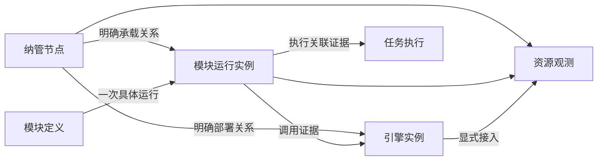

# ADDP 平台运行监控与可观测性设计

状态：总体方案与依赖隔离原则已确认；第一期开工契约已细化，告警领域调整待确认，尚未实施（2026-10-05）。

用户已确认首期覆盖 ADDP 自身部署节点、服务和明确纳管的业务引擎；监控组件按 Infra 组织、按需部署，其缺失或故障只影响对应观测能力。本文记录目标边界、组件依赖、对象身份、分期与验收要求，不代表现有部署已支持观测设施裁剪。

## 一、目标与范围

目标是把平台运行问题与资源压力、服务请求和任务执行事实关联起来，使运维人员能够从告警定位节点、运行实例、接口或引擎，并查看有权限的诊断证据。

| 需求 | 设计范围 |
| --- | --- |
| 主机台账与资源监测 | 纳管节点身份、基础信息、CPU、内存、磁盘、网络与趋势 |
| 服务实例负载监测 | 复用已有进程实例身份，区分进程消耗、容器配额和宿主容量 |
| 集中监控与资源统计 | 同类对象排行、容量统计、状态和有来源证据的部署关系 |
| 告警与关联诊断 | 基于有效观测判定，复用 Monitor 告警与通知机制，关联已有执行事实和日志入口 |
| 慢接口与调用拓扑 | 第二期补充分布式追踪；展示证据范围，不承诺自动根因判定 |
| SSH 初始化、防火墙、批量启停、扩容 | 第三期按实际需求讨论受控运维执行，不进入首期 |
| 功能热度、综合健康评分、泄漏诊断 | 暂缓；产品使用分析单独定义事实，诊断结论需要充分证据 |

不纳管企业内所有主机和应用，不采集客户端电脑，不自动扫描任意网络。业务引擎被登记不代表其宿主节点已纳管，也不代表平台已获得数据库专业指标或主机管理权限。

## 二、现有基础与目标差距

| 现有事实 | 目标改动 |
| --- | --- |
| System 保存模块定义、运行实例、心跳租约和引擎登记 | 增加纳管节点稳定身份与明确的部署关联，不重复登记服务或引擎 |
| Monitor 聚合任务执行、后台运行心跳、Provider health | 扩展平台资源观测；执行槽位不冒充 CPU 或内存 |
| Monitor 已有租户执行告警及独立平台日志链路告警 | 复用生命周期、事务 outbox 与投递机制，补充平台资源信号 |
| 日志正文使用受控实例文件 → Alloy → Loki → System 授权查询 | 保持唯一正文路径，增加观测能力的部署选择和故障呈现 |
| 请求日志记录 request_id、状态与耗时 | 统一应用指标；第二期增加 Trace/Span 与传播 |
| 标准 Infra 已包含日志组件，启动入口准备和校验日志配置 | 同步改造标准生命周期，才能支持不部署日志组件 |

当前代码与配置核对入口：

- [System 运行实例模型](../../system/backend/internal/models/module_registry.go)
- [Monitor 模块说明](../../monitor/CLAUDE.md)
- [公共请求日志](../../common/middleware/logging/logging.go)
- [日志采集配置](../../scripts/infra/runtime-logs.alloy)
- [Infra 启动入口](../../scripts/infra/up.sh)

## 三、对象身份与事实所有权

### 3.1 对象模型

| 对象 | 身份与规则 | 唯一事实源 |
| --- | --- | --- |
| 纳管节点 | 稳定 node_id；物理机或虚拟机。名称、IP、操作系统是属性，不以 IP 或容器主机名构造身份 | System 节点台账（待实现） |
| 模块定义 | 复用 module_name 与现有定义身份 | System 模块登记 |
| 模块运行实例 | 复用现有进程级 instance_id；重登记保留，真实重启产生新身份 | System 运行实例与租约 |
| 容器 | 使用部署环境提供的容器身份及配额证据；容器与进程不强制一一对应 | 容器运行环境 |
| 引擎实例 | 复用 engine_id；可以是集群或云服务，不强制拥有单一宿主节点 | System 引擎登记 |
| 任务执行 | 复用 execution 身份和 Owner 写入的事实；不从当前 Worker 推断历史执行位置 | Common 执行事实与任务 Owner |
| 监测目标 | 明确对象引用、监测类别和采集端点，身份不同于被观测对象 | Monitor 监测配置（待实现） |

node_id 由部署环境明确绑定到实例和采集来源，不能用现有 host_node_name、registered_host 或 host_node_ips 推算。未提供稳定绑定时保留“未关联节点”；历史实例不回填无法证明的节点身份。节点绑定不参与路由、Ready 或执行领取权。

部署关系记录来源与有效时间。调用关系来自明确配置或实际 Trace，展示来源、观测窗口与覆盖范围；未观测到调用不表示不存在依赖。引擎业务数据路径继续使用 ResourceLocator，不把 node_id 作为数据资源定位符。

### 3.2 模块职责

| Owner | 职责 | 边界 |
| --- | --- | --- |
| System | 节点基础台账、模块/实例/引擎登记、IAM、统一审计 | 不保存 Monitor 指标阈值或观测策略，不因资源告警改写实例租约 |
| Monitor | 监测目标、资源与服务质量查询、趋势、拓扑投影、规则、告警和通知 | 不创建第二套实例在线事实，不直接读取业务节点文件或业务引擎数据 |
| 业务模块与 Runtime | 自身请求、运行时和执行关联事实 | 不依赖中心遥测设施确认业务成功，不把执行结果存入指标后端 |
| Common / Common-Python | 埋点、身份字段、上下文传播、脱敏和传输公共能力 | 不拥有中央台账、指标历史或模块业务阈值 |
| Console | 聚合入口、上下文和跨模块导航 | 页面可见性不替代 Owner 授权 |
| Infra 与部署系统 | 组件生命周期、端点、Secret、采集权限、存储和资源预算 | 不注册为业务 Engine，不伪造 Tenant 或任务身份 |

平台节点和共享 Infra 的物理资源观测属于 Platform Context。Tenant 只查看有明确授权依据的引擎观测或执行摘要；不能通过 engine_id 获得宿主节点其他进程、其他 Tenant 或平台日志正文。首期平台资源视图只公开有界运维元数据，业务 SQL、参数和结果不采集到其中。Tenant 专业引擎诊断需另行细化 Owner 授权契约后接入。

采集服务使用独立最小权限身份和绑定来源，不代传长期 User Token。数据库专业指标使用专用监测账号；Monitor 不获取业务读写账号自行查询。平台日志正文继续由 System 的独立 Permission 和授权查询路径提供。

### 3.3 实际运行的平台级与租户级边界

2026-10-06 用户确认隔离测试身份安排，并明确实际运行须区分平台级和租户级。测试身份例外不改变以下运行边界，也不授予生产角色新的权限。

| 维度 | 平台级（Platform Context） | 租户级（Tenant Context） |
| --- | --- | --- |
| 观测范围 | 纳管节点、共享 Infra、平台模块实例及采集链路的有界运维事实 | 当前 Tenant 内获授权的引擎观测、任务执行及其摘要 |
| 管理范围 | 节点台账与平台监测目标，分别要求对应独立 Permission | 当前 Tenant 的已发布监控/执行功能及 Owner 对象权限；不获得平台节点或采集配置管理权 |
| 资源口径 | 宿主或平台服务的实际观测值，明确来源、窗口和覆盖范围 | 仅展示有可信租户归属依据的指标；共享宿主总用量不能按引擎关联直接归给租户 |
| 业务内容 | 平台角色不自动授予业务 SQL、参数、结果或 Tenant 内容读取权 | 按当前 Tenant 身份、功能 Permission 与 Owner 资源策略共同裁决 |
| 日志及告警 | 平台运行日志正文使用独立权限；平台事件不得虚构 Tenant | 现有租户执行告警按 Tenant 隔离；执行读取不附带平台日志正文或其他租户信息 |

服务端从 System 权威 AuthContext 派生当前 Context 和 Tenant，不接受浏览器自报 `tenant_id`、指标标签或引擎 ID 作为跨租户授权依据。具有平台角色的 User 切换到 Tenant Context 后仍须具备有效 Membership、当前 Tenant Role Permission 和 Owner 对象权限；Platform Context 不代表所有 Tenant。用户关联查询继续由对应 Owner 用当前已验证 User Token 裁决，后台采集身份不得代替用户读取裁决。

Console 与 Monitor 页面随当前 Context 呈现对应范围；上下文切换时清空旧范围数据、筛选和待完成请求，迟到响应不得覆盖新上下文。服务端授权覆盖列表、详情、趋势、汇总和拓扑，不能仅依靠前端隐藏页面。租户统计必须明确覆盖范围；租户 A、租户 B 和 Platform 三类身份分别验收，拒绝跨 Context、跨 Tenant 和后台身份绕过。

当前已发布的节点台账、监测目标与指标发现链路属于平台级。首期继续完成该链路；现有租户执行监控保持 Tenant 隔离。租户引擎资源观测仍须补齐可信归属、指标口径和 Owner 授权契约后实现，本节不宣称新增 Tenant 资源查询已经可用，也不增加新接口或权限占位。

## 四、技术路线与部署组织

### 4.1 唯一数据路径

| 数据 | 技术路线 | 存储与读取 |
| --- | --- | --- |
| 主机指标 | node_exporter → Prometheus 拉取 | Prometheus 时序存储，Monitor 受控查询 |
| Linux 容器指标 | cAdvisor → Prometheus 拉取 | 容器身份与配额明确绑定，Monitor 受控查询 |
| 应用/进程指标 | Go/Python 标准指标库和共享封装 → Prometheus 拉取 | 同一实例身份，规范化接口标签 |
| 日志 | 现有受控实例文件 → Alloy → Loki | 保持 System 授权正文读取；Monitor 展示链路健康和跳转 |
| Trace（第二期） | OpenTelemetry SDK → Alloy 的 OTLP 接收与处理 → Tempo | 受控诊断读取，按当前上下文授权 |
| 台账、策略、告警、审计、执行事实 | 保持各 Owner 的 PostgreSQL 事实源 | 高频采样不写 task_executions 或普通业务表 |

首期指标采用 Prometheus 拉取，不同时引入 remote_write 的第二条应用指标采集路径。Alloy 继续承接既有日志，第二期补充 OTLP；不同时部署另一套功能相同的常驻追踪采集器。每个目标和监测类别只登记一个采集来源，避免独立 exporter 与 Alloy 内置同类 exporter 重复采样。

Prometheus 负责时序查询及必要的记录规则；Monitor 拥有本专题告警策略、判定、事件与通知，不另引入 Alertmanager 作为第二个告警 owner。资源视图集成现有 Monitor 前端，Grafana 不作为首期产品入口或必需依赖。

### 4.2 中心组件与节点组件

| 类别 | 组件 | 部署规则 |
| --- | --- | --- |
| 中心指标设施 | Prometheus | 一套部署可服务多个节点；首期不宣称 HA 或跨地域可靠性 |
| 中心日志设施 | Loki、既有授权代理和存储 | 沿用独立 bucket、账号、保留与清理规则 |
| 中心追踪设施 | Tempo | 第二期按需部署；存储配置实施时按选定版本验证 |
| 节点采集 | node_exporter、cAdvisor、Alloy、既有日志接收和清理能力 | 只部署到显式接入对应能力的节点，权限按职责隔离 |
| 应用代码 | 指标库、OpenTelemetry SDK | 随模块构建，不因无遥测服务缺失应用依赖或无法启动 |

组件部署定义和生命周期由根 Infra Compose 与 scripts/infra 标准入口组织；组件配置放在既有 scripts/infra 目录。模块自己的业务能力仍归 Monitor，不新增“监控基础设施业务模块”。

指标、日志、追踪分别作为可选择的部署能力。部署选择、端点及 Secret 来自部署配置；规则阈值和普通运行策略归 Monitor 持久化配置，遵守 [配置规范](../spec/addp配置介绍.md)，不能再由 System 保存一套值或以环境变量覆盖已保存策略。实际端口来自标准生命周期，不在监测目标中硬编码首选值。

初期验证以 Linux 部署的节点、进程和容器为主。macOS 开发环境的原生宿主、Docker Desktop Linux 虚拟机和容器分别表达；容器内采集的 Linux 资源不能显示为 Mac 宿主资源。操作系统不支持的指标显示“不支持”，不改用外观相同但语义不同的数据。

现有日志 Alloy 不持有 Docker Socket。cAdvisor 的宿主访问权限必须独立评估和隔离，不为容器指标直接给现有日志采集器增加 privileged 或容器管理权限。所有新镜像、依赖和配置须核对技术栈规约，固定 tag/digest 并取得对应环境的实际验收证据；本稿不冻结未经验证的版本。

## 五、能力依赖与故障影响矩阵

“属于 Infra”描述部署归属，不表示所有模块必须依赖该组件。各模块必需的 PostgreSQL、Redis、MinIO 等仍按其真实用途决定；其自身依赖故障不属于遥测隔离承诺。

| 功能 | 依赖事实或设施 | 未选择/未接入 | 已选择但设施故障 | 必须保留的其他能力 |
| --- | --- | --- | --- | --- |
| 登录、模块路由、引擎登记 | System、模块必需 Infra、注册租约 | 按原有契约 | 按原有契约 | 不等待观测设施 |
| 数据探查、查询、传输、质量检测 | 各 Owner 必需 Infra、授权、实际业务引擎 | 按原有契约 | 仅依赖该资源的操作受影响 | 不因 Prometheus/Loki/Tempo/Monitor 缺失而失败 |
| 模块 UP/DOWN 与运行实例列表 | System 登记和租约 | 沿用已有能力 | 不能用采集状态覆盖登记事实 | 无指标设施也能读取实例登记 |
| 执行统计、执行诊断、后台槽位观测 | Common 公共事实及 Owner 读取裁决 | 沿用已有能力 | 按现有 Owner/存储错误语义 | 不依赖 Prometheus、Loki 或 Tempo |
| 节点/进程资源与趋势、TOP5 | Prometheus、对应 exporter、明确对象绑定 | 显示未启用或目标未接入 | 对应视图显示不可用或数据过期 | 其他业务、执行和日志能力继续工作 |
| 集中运行日志正文 | 既有日志来源、Alloy、Loki、System 授权 | 显示集中日志未启用 | 当前正文请求明确失败；不改读宿主文件 | 业务、资源和追踪能力继续工作 |
| Trace 与实际调用拓扑 | OTLP 链路、Tempo、身份与传播 | 显示追踪未启用 | 对应查询不可用，旧拓扑注明时间和覆盖 | 业务、资源、日志、执行继续工作 |
| 明确部署关系图 | System 台账和受信部署关联 | 未绑定关系不推断 | 来源不可读取时报告不完整 | 不要求 Tempo 存在 |
| 资源告警 | 有效指标样本、Monitor 规则/事件存储 | 不评估未启用能力；保留历史 | 依赖观测未知，不能自动判正常或恢复 | 其他告警来源独立评估 |
| 已有执行告警及通知 | 执行事实、Monitor、已配置通知渠道 | 无渠道仍保存事件 | 渠道失败有界重试，不回滚执行 | Prometheus/Loki/Tempo 缺失不阻断已有通知 |
| Monitor 模块本身 | 自身必需 Infra 和 System 注册 | 其他模块正常运行 | 集中监控/告警不可用 | Owner 继续写执行事实，模块继续注册 |

同一 Alloy 或网络路径被日志与追踪共同使用时，其故障会影响这两类观测。矩阵按实际依赖解释影响，不承诺共享组件间不存在关联故障；这种故障仍不得传播到业务主路径。

### 5.1 能力状态与目标状态

部署意图和运行观测分别表达，不新增一个笼统的“监控正常”字段。

| 状态维度 | 目标语义 |
| --- | --- |
| 部署意图 | enabled / disabled；仅由部署配置决定 |
| 能力可用性 | enabled 时区分 available、unconfigured、unavailable；关闭时显示 disabled |
| 目标接入与样本 | 未接入、有效数据、窗口内无数据、数据过期、不支持；分别展示来源和最近有效采样时间 |

disabled 不尝试发送，不制造设施离线告警；unconfigured 表示已选择但必要配置不完整；unavailable 表示配置存在但访问或协议验证失败。available 只说明查询/采集设施可用，不证明所有节点有样本。窗口内无数据不能解释为零负载；过期样本不能继续显示为实时正常。

关闭能力是部署意图，不是观测恢复事实。停止相应评估并保留历史告警，不把活动事件伪造为指标恢复；关闭期间的处理状态在详细告警契约中明确后实施。目标状态不改写 System 租约、Engine 生命周期或任务执行终态。

### 5.2 启动、业务请求与生命周期隔离

1. 业务模块的 live/ready、注册和 Gateway 路由不检查观测设施。Monitor 的整体 Ready 不包含可选指标、日志、追踪后端；自身必需存储和 System 注册继续遵守原有规则。
2. 指标端点读取本地有界状态，不在采样时执行业务查询。Trace 发送在业务请求外使用有界队列、批处理和有限超时；队列满或发送失败可丢弃遥测并记录计数，不无限重试、积压或等待远端确认。
3. 集中日志未启用时不启用其远端采集。既有结构化输出、受控启动身份和有界接收规则必须在同一次生命周期改造中核实；不恢复旧固定模块日志文件或新增直接读文件路径。
4. 用户查询观测数据按能力独立失败。组合页面分区加载，指标失败不挡执行记录或日志入口；后端不得把查询错误包装成成功空列表。
5. 标准启动入口按选择分别预检、启动和报告。观测配置错误不得阻止无关核心服务启动；所选观测能力失败必须明确报告并返回非零整体结果，不以全成功掩盖部分失败。调用入口根据所需服务检查实际就绪，不能把聚合退出码当作全部业务已不可用。
6. 关闭时不校验该能力专用凭据，也不主动启动其组件。错误不得触发对其他运行中设施的停止、清理、重建或接管。
7. 观测设施短暂恢复后自动恢复连接；已有业务进程不需要重启。恢复不补造停采窗口的数据，不承诺停机期间日志或 Trace 已完整保存。
8. 指标、日志、Trace、任务记录、操作审计分别遵守其可靠性契约。不可丢失的授权/审计约束不能因为遥测隔离而放宽。

## 六、指标口径与资源预算

| 类别 | 首期口径 |
| --- | --- |
| 主机 CPU | 节点 CPU 忙碌率；总览按核数加权，注明窗口与有效样本覆盖 |
| 进程 CPU | 消耗 CPU 核数；有明确有效配额时另算配额利用率，不默认分配宿主全部核数 |
| 主机内存 | 总量、可用量及基于可用量的压力；操作系统缓存不能直接判为泄漏 |
| 进程/容器内存 | 进程驻留内存、容器内存与配额分别展示；无限制时不伪造百分比 |
| 运行时内存 | 堆、GC、并发运行体等专业指标；持续增长只能提示进一步诊断 |
| 磁盘 | 明确文件系统/挂载点的容量、可用空间、inode；IO 吞吐、等待和繁忙时间独立展示 |
| 网络 | 各网卡上下行速率与错误；累计字节转速率处理计数器重置，不重复累加桥接/虚拟接口 |
| 服务质量 | 完成请求数、错误率、延迟分布；接口使用规范化 route，排除敏感请求内容 |
| 执行运行 | 复用现有积压、排队与运行时长、失败率和槽位；不从 CPU 推算执行容量 |

首期只在同类对象、同一时间口径内排行。主机物理容量不与进程消耗或容器配额相加；共享文件系统不按挂载节点重复汇总；集群引擎不按连接登记数推算服务器数量。历史环比注明等长窗口、完整度与无基期情况。

默认以秒级采样和刷新表达近实时，页面展示最近采样时间，不承诺逐毫秒实时。采样、查询窗口、分辨率、保留期、返回点数和并发预算必须在详细配置契约与测试中确定；长窗口查询使用有界步长，前端刷新频率不能直接改变采样频率。

指标标签仅保留必要身份与有限维度，控制运行实例重启产生的序列规模。TraceId、request_id、execution_id、用户 ID、完整 URL、SQL、Token 不作为指标标签；关联身份使用适合的数据字段，仍限制索引基数与保留范围。

观测组件限制 CPU、内存、队列、磁盘和保留期。复用 MinIO 时采用独立 bucket/账号、容量预算与清理规则；bucket 分开不等于底层磁盘隔离。同机共享资源耗尽可能影响业务，需要真实预算测试，不能仅凭软依赖声称物理故障隔离。

## 七、告警、追踪与运维边界

资源告警从有效观测产生 active signal，再由 Monitor 统一处理事件与通知。持续时间、恢复阈值、维护静默、确认、抑制与通知重试明确分开；查询失败、采样缺失和不支持的指标不能产生虚假的恢复。平台观测与租户执行分别授权，不将平台资源事件写进租户执行告警表或虚构 Tenant。

现有 platform_log_* 专属于平台日志域。扩展平台资源事件时复用中立发送和生命周期机制，不直接把资源信号塞进日志专用模型。平台运行告警的领域收敛、表/API 命名和既有事件语义的保留范围在详细设计时先核对日志已确认契约；如需改变已有语义，先讨论、修订文档，再整体替换，不能旁路保留两套相同职责的事件与通知路线。

第二期逐步贯通 Gateway、Go/Python 服务、公共 HTTP Client 和数据库/引擎调用。request_id、trace_id、execution 身份分别表示请求、调用链和业务执行，不互相替代。异步任务使用明确关联与新运行跨度，不把长任务硬挂在创建请求生命周期下。慢请求与错误保留策略必须与采样位置、容量和丢弃观测一起验收；随机头部采样不能保证保留全部慢请求。

拓扑先提供有证据的部署关系，随后增加观测调用关系。每条关系注明来源、有效时间或观测窗口；不使用指标聚合算法宣称根因已确认。综合分数暂不替代可解释的指标和规则。

监控系统整体不可用时无法靠自身完成告警，生产需独立的外部存活探针；独立探针不授予业务读取或主机管理权。

第三期若接入运维动作，ADDP 负责目标、操作计划、权限和审计，成熟执行设施承担实际变更。主机登记不默认保存 SSH 密码，监控采集身份不具备 Shell 权限，Monitor 不提供任意命令执行器。启停、移除纳管、服务停止、主机关机是不同操作，详细契约未确认前不开放。现有 Orchestrator 租户任务不能隐含获得平台主机操作权。

## 八、分期、标准入口与验收

### 8.1 开发顺序

| 阶段 | 工作 | 完成条件 |
| --- | --- | --- |
| D0 设计基线 | 概念、Owner、依赖矩阵、现状差距与验收整理 | 本文与术语、架构、监控入口一致；不宣称代码落地 |
| D1 第一期开工契约 | node_id 与实例绑定、监测目标、指标目录、部署选择、状态和权限契约 | 核对现有声明/配置/日志边界，解决会改变业务结果的歧义后再编码 |
| P1.1 部署与隔离基础 | 标准 Infra 选择、能力状态、生命周期、Prometheus 和采集夹具 | 未部署和运行故障两类隔离测试通过，无业务主路径依赖 |
| P1.2 资源观测闭环 | 节点/实例关联、指标/趋势/TOP5、基础服务质量、资源告警与日志跳转 | 口径、权限、告警及真实部署链路通过；删除被替换路径 |
| P2 关联诊断 | Trace、慢接口、调用拓扑、专业引擎观测和执行关联 | 异步关联、采样、脱敏与读取授权通过 |
| P3 受控运维 | 按真实需求细化初始化、配置变更、启停与扩容 | 独立操作范围与权限确认、计划/执行/审计验收，不复用监测身份 |

### 8.2 测试与 CI 影响

遵守 [测试与验收规范](../spec/addp测试与验收规范.md)。本轮只变更文档，无新增服务、权限、API、迁移或测试入口。后续实现必须在编码前登记影响，不能等推送失败再补门禁。

| 层级 | 必须证明的事实 | 标准承接方式 |
| --- | --- | --- |
| T0 | Owner/权限声明、Swagger、配置与生命周期一致；新组件/镜像/门禁注册 | test-platform 与现有登记检查；新增输入随实现登记 |
| T1 | 指标单位、配额缺失、身份绑定、计数重置、能力状态、未知观测、恢复阈值、有界发送 | 各 Owner 已有 Go/Python 门禁自动发现 |
| T2 | 真正的指标采集/查询、告警事务、队列满/超时/设施断开与恢复、生命周期清理 | Owner disposable 门禁；新 Prometheus/采集依赖按规范登记服务、固定镜像和输入 |
| T3 | 平台权限、能力未启用、目标未接入、过期数据、分区错误、路由恢复、跨页面导航 | Monitor/System 现有前端门禁；共享能力按消费者扩散 |
| T4 | 真实 System/Gateway/Owner 下无观测设施的业务、运行中故障、恢复及进程身份关联 | 在标准 Online suite 中实现并登记，禁止占位 suite |
| T5 | 正式发布选择、安装/停止/升级、真实 OS 与容器采集权限；HA 仅在另有证据时宣称 | 已登记 Release suite 的相应能力认证 |

关键故障场景至少包括：

1. 指标、日志、追踪全部未部署：System/Gateway/业务 Owner 按自身依赖 Ready，执行与结果读取正常，页面不产生虚假观测告警。
2. 仅启用指标和日志、未部署 Tempo：资源与日志可用，追踪显示未启用，业务不受影响。
3. 运行中分别中断 Prometheus、Loki、OTLP/Tempo：只影响依赖区域，不改写租约、任务或引擎生命周期，不无限积压。
4. 仅一个节点采集失败：其他节点正常；旧样本过期，不能显示零负载或恢复资源告警。
5. 配置错误和专用凭据缺失：所选观测能力报告失败；关闭能力不校验其 Secret；无关业务生命周期不被阻断。
6. 设施恢复：已有业务进程不重启，重新获得新样本；停采空白保留，历史不伪造。
7. 真实进程重启、多实例、IP 变化、容器重建：身份正确关联，不串历史，不重复统计。
8. 无配额、缺节点身份、共享磁盘和缺失统计窗口：显示真实边界，聚合不重复计数。
9. Platform/Tenant 越权、来源伪造、任意采集端点与敏感内容：服务端拒绝，不依赖前端隐藏。
10. 采集/发送预算耗尽：业务不阻塞，丢弃或失败可观测；标准测试退出清理自建容器、进程、卷和本轮数据库事实。

工作区验证默认运行 `make test-changed`，明确单 Owner 时使用 `make test-module MODULE=<owner>`；数据库运行前先用 `bash scripts/infra/status.sh` 核实实际映射。本地只使用 `addp_test`/`addp_iam_test` 和标准入口，测试不接管个人 Infra。新增 T2 依赖须同步 `ADDP_T2_SERVICES`、镜像、输入、退出清理和 CI 注册；新增 T4/T5 suite 取得实现后才能列为可运行入口。

### 8.3 本轮设计交付与后续准入

- [x] 确认首期纳管范围、模块职责和技术主路径。
- [x] 整理组件依赖、未部署行为和故障影响矩阵。
- [x] 定义观测设施不进入业务 Ready/主请求的隔离要求。
- [x] 区分已实现日志/执行基础与待实现资源、裁剪和追踪能力。
- [x] 同步术语及概念、模块和文档导航。
- [x] 细化 D1 的节点/实例字段、目标发现、部署选择、数据状态、权限和采集/查询预算（目标契约，待实施）。
- [ ] 确认 D1 的平台运行告警领域调整，完成历史记录、接口、权限与订阅的替换契约。
- [ ] 按 P1.1/P1.2 实施并通过门禁；未实施项不得计为通过。

第一期开工契约见第十节。节点、部署、状态、查询与权限部分可据此拆分实施；平台告警领域调整在确认之前不进入迁移或代码变更。

## 九、技术资料与相关规范

- [Prometheus HTTP 服务发现](https://prometheus.io/docs/prometheus/latest/http_sd/)：监测目标可转换为受控发现投影；不是新的对象身份事实源。
- [Prometheus 埋点约定](https://prometheus.io/docs/practices/instrumentation/)：指标类型、标签基数与请求指标设计参考。
- [OpenTelemetry 采样](https://opentelemetry.io/docs/concepts/sampling/)：第二期慢请求保留与容量设计参考。
- [Alloy cAdvisor 组件](https://grafana.com/docs/alloy/latest/reference/components/prometheus/prometheus.exporter.cadvisor/)：Linux 支持、宿主权限和 Docker Desktop 边界参考，不表示仓库现有配置已启用。
- [术语表](../concepts/addp术语表.md)
- [模块架构](../concepts/addp模块架构图.md)
- [监控与执行体系](../concepts/addp监控与执行体系图.md)
- [授权上下文规范](../spec/addp授权上下文规范.md)
- [配置规范](../spec/addp配置介绍.md)
- [技术栈规约](../spec/addp技术栈规约.md)
- [模块服务运行日志设计](ADDP模块服务运行日志设计.md)

## 十、第一期开工契约（2026-10-05，目标设计，待实施）

本节定义第一期的字段、行为及验收边界，按批次实施；已发布范围与实测结果以 10.9–10.21 的批次记录为准，不能把其余目标契约当作已有能力。告警领域调整单独列于 10.7，不因其他部分已细化而视作获得批准。

### 10.1 节点与实例绑定

System 的节点台账只保存身份和部署元数据，不保存瞬时资源指标、SSH 凭据或“综合在线状态”。

| 字段 | 契约 |
| --- | --- |
| `node_id` | System 创建的 UUID，不由 IP、名称或硬件信息计算；纳管期间稳定，不复用已退出节点的身份 |
| `display_name` | 运维显示名称，可编辑，不要求作为全局身份唯一键 |
| `node_kind` | `physical` 或 `virtual`；Docker Desktop 的 Linux VM 属于独立虚拟节点，容器不是节点 |
| `addresses` | 显式填写的 IP/DNS 地址，仅作台账属性；不自动选择一个地址作为采集端点 |
| `enabled` | 是否继续纳管的管理员意图，不表示电源、网络或业务实例状态 |
| `version` | 独立可变台账的正整数并发版本，创建为 1；更新须原子校验并递增 |
| `created_at`、`updated_at` | UTC 时间；所有操作者与变更结果另走现有审计，不重复建审计表 |

节点聚合内的部署绑定声明明确列举允许的模块服务 Client 与模块名，变更使用节点 `version`；同一模块 Client 可被明确允许部署在多个节点，不因此推断某次进程的具体位置。服务登记中的 `node_id` 只是一份声明，System 按当前 Client 与这份允许集合裁决；关联投影附带 `node_binding_state`（`unbound/bound/rejected`）及安全原因。被拒绝的声明不能进入部署拓扑、资源汇总或采集身份标签；主实例登记与租约仍成立。这是节点领域的来源约束，不为 Client 增加 Shell 或其他业务权限。

首期采用停用纳管，暂不提供节点物理删除、关机或 SSH 操作。停用后停止纳入当前资源汇总与采集发现，保留节点身份、历史关联和指标保留窗口；这不停止节点上的业务服务。

绑定按以下顺序进行：

1. Platform User 在 System 创建节点，取得 `node_id`；部署人员向属于该节点的进程注入目标部署输入 `ADDP_HOST_NODE_ID`。本地 `.dev-state` 可以保存已配置输入，不能成为第二个节点身份分配器。
2. Common/Common-Python 在既有模块登记请求增加可空 `node_id`。System 继续校验当前模块服务身份；非空值须是合法 UUID，且只在台账存在、启用并符合该部署来源的绑定约束时投影为已关联。未知或未被允许的节点引用保留绑定诊断，不建立承载关系，不因此拒绝整个业务实例登记或续租。
3. `host_node_name/host_node_ips/runtime_hostname/registered_host` 保留各自既有语义，不成为 `node_id` 的别名或兼容输入。缺少 ID 时显示未关联；历史实例不靠名称匹配补填。部署声明是声明证据，不等于平台已独立验证物理位置。
4. 一个具体进程实例的节点声明在首次登记时固定，同一 `instance_id` 恢复登记不得改挂节点。部署位置变化后产生新的进程实例身份；不能通过编辑当前节点反写历史实例。绑定诊断与实例 UP/DOWN 分别返回。
5. 引擎的部署关联由 System 在已有引擎事实旁维护显式节点集合，使用引擎聚合的 `version` 校验，记录声明来源与生效时间。远端、集群或云引擎允许节点集合为空；删除关联保留其历史有效区间，不自动拆成多个 Engine Instance。

共享部署输入解析遇到非法 `ADDP_HOST_NODE_ID` 时只停用该绑定并记录安全诊断，不将非法 UUID 发送进业务登记请求，也不退回名称/IP 推算；进程注册仍用原有必需字段完成。API 对恶意或非规范请求的体积、类型和语法错误继续严格拒绝，这与合法业务进程因观测输入错误而无法启动分别验证。

部署绑定约束必须来自受控部署登记，不能信任浏览器提交的服务身份，也不能把采集端点响应的任意 `node_id` 当作授权证据。编码前须在 System 登记测试中证明同模块多节点部署可区分、非授权来源不建立绑定以及绑定失败不影响租约；不能仅凭 UUID 存在就认定位置可信。首次声明与登记写入同事务，重登记只核验原声明，不覆盖它；台账停用或允许来源撤销后当前关联失效，原声明仍作为带时间的历史证据保留。

### 10.2 监测目标与采集发现

Monitor 的监测目标引用已有对象，拥有采集配置。目标的普通配置使用自身 `version`；采集权限和 Secret 不进入普通读取响应。

| 字段 | 契约 |
| --- | --- |
| `id`、`version` | Monitor 主资源身份与并发版本 |
| `subject` | 判别联合：节点 `{kind:node,node_id}`；模块实例 `{kind:module_instance,module_name,instance_id}`；引擎 `{kind:engine,engine_id}`。只接受所属类型的字段 |
| `monitor_kind` | `host_resources`、`process_resources`、`container_resources`、`service_quality`；第一期不自动开放数据库专业采集 |
| `source` | 固定受支持来源类型及受控端点；不接受任意脚本、任意 PromQL 或用户指定的多目标代理参数 |
| `enabled` | 监测意图，独立于主体和模块的 enabled；关闭不改主体生命周期 |
| `created_at`、`updated_at` | 配置时间，不冒充最近采样时间 |

同一主体和监测类别最多一个启用来源。一个实例指标端点可同时承载进程资源和服务质量，发现投影按物理采集端点合并为一个 scrape target，不能为两个视图重复拉取。cAdvisor 一个节点端点可返回多个容器：节点绑定和容器筛选来自受控配置，明确声明的容器/进程关系才能投影到实例；未绑定容器不得推断为某个 Tenant 或业务实例。

首期引擎视图展示明确关联节点的资源及采集覆盖，不把节点总消耗标成该引擎独占消耗。远端未纳管宿主的引擎显示未接入；引擎专用 exporter、数据库指标或云厂商 API 的专业接入留到 P2，在 Owner 授权与专用凭据契约完成后开放。

首期对主机与显式容器来源支持目标配置；模块实例来源随已有登记投影产生，不再要求为每次重启人工登记新实例。部署输入明确提供 Prometheus 可达的指标地址，不能拼接 `module_url + /metrics`，Worker 无业务地址时也不能被遗漏。相同语义的目标配置由一个 Monitor 服务维护，自动实例投影不能成为第二套实例登记或管理员可编辑的身份事实。

Prometheus 通过 Monitor 的单一受认证 HTTP SD 读取全量目标投影；投影组合 Monitor 配置与 System 当前对象状态，不分页，不接受调用者自报标签。固定刷新周期初值 30 秒，身份标签由控制面填入，覆盖来源自报的保留身份标签。停用节点/目标、已结束实例及未绑定来源从新快照移除；历史指标仍按原身份保留。

HTTP SD 失败时 Prometheus 会保留上一份列表，因此“不出现在新快照”只在刷新成功后生效。Monitor 当前查询与告警必须重新按当前纳管/目标范围筛选，不能把旧采集列表当作当前授权或对象状态。页面展示最近成功发现时间与配置生效状态；停止采集有收敛窗口，凭据撤销及网络策略才是紧急阻断边界，不能承诺发现服务故障时仍即时停采。[Prometheus HTTP SD 官方契约](https://prometheus.io/docs/prometheus/latest/http_sd/)

控制面不可用时返回失败，不以成功空列表清除全部目标。应用指标端点仅绑定受控网络与独立采集认证，不经公开 Gateway 业务路由；第一期应用指标采用部署管理的 mTLS 采集身份，证书由 Secret 注入并支持吊销/轮换。采集身份不能访问业务 API，指标读取不能获取用户或业务引擎凭据。

exporter 不能假设都原生提供相同的 TLS 服务端能力。node_exporter 的保护使用其 exporter-toolkit 配置；cAdvisor 的 `collector_cert/collector_key` 用于它向应用端采集的客户端，并不保护其对外指标服务。cAdvisor 原始端点只暴露于隔离的本节点采集网络，远程读取通过节点专用 Nginx mTLS 入口，仅允许固定指标路径且不开放 Web UI/调试/任意反向代理。该入口属于 Infra 的传输防护，不承担第二条采集或授权事实路径，不让日志 Alloy 获得宿主权限；节点入口镜像、预算、配置输入及证书测试随 P1.1 一同登记。未部署这种保护的来源不进入远程发现。[node_exporter 文档](https://github.com/prometheus/node_exporter#tls-endpoint)、[cAdvisor 服务实现](https://github.com/google/cadvisor/blob/master/cmd/cadvisor.go)

目标端点须限制到受管地址范围和明确端口，禁止 URL 凭据、重定向、云 metadata 地址与任意外网扫描；受控回环/私网按部署模式显式允许，DNS 解析结果须重新核验。不能复制通知 Webhook 的外网访问规则直接当作主机采集规则。端点变更必须重验证并记审计。

### 10.3 部署选择与配置生效

以下是目标部署键；本轮已实现集中日志选择，其余键仍待实现，不作为当前可用命令。根 `.env.example` 仍是唯一模板，不新增 `deploy.env` 或模块私有覆盖文件。

| 目标部署输入 | 建议模板值 | 使用者与行为 |
| --- | --- | --- |
| `ADDP_OBSERVABILITY_METRICS_ENABLED` | `false` | 标准 Infra 入口选择 Prometheus 及明确的指标采集来源；业务进程据此决定是否开放指标端点 |
| `ADDP_OBSERVABILITY_LOGS_ENABLED` | `true` | 选择现有集中日志组合；保留现有模板的日志使用意图，支持显式关闭，不靠 Loki Secret 是否存在猜开关 |
| `ADDP_OBSERVABILITY_TRACES_ENABLED` | `false` | 第二期才提供 true 的实现；首期 true 明确报告未支持，核心业务仍按实际就绪结果启动 |
| `ADDP_HOST_NODE_ID` | 空 | 单个部署节点显式绑定，不为全环境所有宿主注入同一个 ID |
| 各设施端点、证书与 Secret 引用 | 按实际部署填写 | 能力 enabled 时独立预检；浏览器不读取内部端点或凭据 |

布尔值只接受 `true/false`；模板与显式部署输入决定意图，不按组件探测结果改变开关。中心设施选择与节点采集选择分别处理：开启中心 Prometheus 不自动在全部机器安装 exporter。共享 Alloy 的日志/追踪配置按能力生成，未选择的输入不出现在有效配置和 Secret 校验中。

标准 `up/status/down`、开发与生产启动都消费同一选择解析实现。核心服务与各观测能力分别记录结果，整体命令在所选能力失败时返回非零，但调用者应按必需服务的实际状态决定是否继续，不能靠 `set -e` 把可选能力失败提升为全平台中止。未选择的组件不创建；已有观测组件停用只能由标准入口在确认项目归属后处理，保留数据卷，不停止其他工作区或核心服务。

部署选择、物理资源限制、设施端点和证书随对应组件生命周期生效；修改它们不承诺热更新。恢复同一设施的连接无需重启业务。Monitor-owned 查询预算与阈值采用原子热更新，目标配置在下一次成功发现后生效，响应区分保存版本与已应用版本。首期采样周期固定 15 秒，由唯一的版本化采集契约生成配置；页面不提供一个不能实际生效的采样编辑项，后续可配置采样时再明确发布与回执协议。

### 10.4 状态与读取响应

能力读取返回 `capability`、`enabled`、`availability`、安全 `reason_code`、`checked_at`；不返回原始连接错误、内部地址或 Secret。全局可用性采用有界周期探测，不能因某个 exporter 无样本就判整个 Prometheus 不可用。

资源读取返回对象身份、指标目录键、单位、时间与数据状态。有效性按每个指标/序列判断，不把“有一个 CPU 点”解释为整个对象全部有效。

| `data_state` | 条件与展示 |
| --- | --- |
| `not_connected` | 当前没有启用且有效绑定的来源；不调用后端猜测身份 |
| `valid` | 有满足新鲜度和口径的有效样本；速率还必须满足所需样本数与完整窗口 |
| `no_data` | 来源已接入，但查询窗口没有有效样本；值为空，不能显示 0 |
| `stale` | 最近有效样本超过新鲜度；可以显示带时间的历史值，不计入当前排行、汇总与恢复判定 |
| `unsupported` | 来源/操作系统/配额证据不支持该指标；不是设施故障 |

瞬时视图包含 `sampled_at`、`queried_at`、`window_seconds`；趋势包含起止时间、实际步长与各序列缺口。`value=null` 与 `value=0` 明确区分。时钟异常或速率计算窗口不足不生成伪有效点。CPU 分母、内存配额及容器映射等口径证据来自同一对象与窗口，不能用现在的容量回算过去百分比。

HTTP 行为遵守既有 API 规范：

- 能力目录读取成功返回 200，即使其中某个能力 disabled/unavailable；这仅证明状态查询成功。
- 直接请求未启用能力返回 409 与 `observability_capability_disabled`；已启用但配置缺失返回 503 与 `observability_capability_unconfigured`；后端故障返回 503 与 `observability_backend_unavailable`，超时返回 504 与 `observability_query_timeout`。
- 已成功查询但没有样本返回 200 和明确数据状态；不能将故障包装成这种响应。非法指标/参数返回 400，超出已声明查询预算返回 422，瞬时并发限流返回 429；无权限/对象不存在分别沿用 403/404。
- 管理列表沿用 `data/total/page/page_size/total_pages`，每页最大 100；组合页面各区独立请求。当前数据汇总返回有效对象数与应覆盖对象数，覆盖率不足时明确“不完整”，不能用部分成功值冒充全平台总值。

### 10.5 第一版指标与预算

数字为第一期初始设计值，需要由真实采集及负载门禁证明；不是已经取得的性能上限。固定指标目录是唯一的公式、单位和来源定义，前端与告警共用，不各自编写 PromQL。第一期不开放任意表达式、插件代码或全量标签搜索。

| 指标目录范围 | 计算与缺失规则 |
| --- | --- |
| 节点 CPU、1/5/15 分钟负载 | CPU 使用 1 分钟计数器速率；负载展示原值并同时显示核数，不直接当 CPU 百分比 |
| 节点内存、文件系统、inode | 内存压力基于可用量；文件系统按挂载证据和排除规则展示，共享归属不明确则不作全局总容量 |
| 节点网络、磁盘 IO | 1 分钟计数器速率，区分设备；过滤桥接/虚拟设备需要显式规则，计数重置使用后端速率语义 |
| 进程 CPU 核数、RSS、运行时 | 进程与容器范围分别展示；没有有效配额就不生成配额利用率 |
| 服务请求量、5xx 率、延迟分位数 | 完成请求计数和时长直方图；规范化 route 与有限方法/状态类别；无请求时错误率/延迟为空，不判断服务故障 |

| 预算项 | 初值与所有权 |
| --- | --- |
| 采样与超时 | scrape 15 秒、超时 5 秒；首期固定采集契约，超时不得大于采样周期 |
| 数据新鲜度 | 单点超过 60 秒标 stale；告警连续窗口内缺样本时进入 unknown，不能仅凭最新一点跨缺口判定 |
| 刷新与范围 | 页面默认 15 秒刷新、最短 10 秒；查询范围最长 7 天，不修改后端采样频率 |
| 查询输出 | 每请求最多 12 个目录指标、100 条序列、每序列 1,000 点、总计 20,000 点；实际步长至少 15 秒，随范围增大；拒绝超限，不能偷偷截断 |
| 查询保护 | 总超时 5 秒；单主体并发 2、单 Monitor 进程上游查询并发 8；满额快速返回 429，无无界等待队列；存储预算与限流策略分开 |
| 时序保留 | 初始 7 天与 10 GiB 体积上限同时限制，达到体积上限可能提前淘汰，不能保证总能查到 7 天；磁盘另预留 WAL/压缩空间 |
| 序列准入 | 单端点采样上限 20,000；全部署初始活跃序列预算 200,000。端点超限是采集失败，必须可见；总预算需要有界计数与准入，不能把单端点 sample_limit 当成全局限额 |
| 组件资源 | Prometheus 初始上限 1 CPU/2 GiB；node_exporter 0.25 CPU/256 MiB；cAdvisor 0.5 CPU/512 MiB，均为可调整部署预算，负载证据不足时不能宣称满足规模 |

查询预算归 Monitor 普通平台配置，版本校验、热生效与审计同次实现；初次无持久值使用定义默认值，保存后不退回环境值。组件资源、磁盘卷容量和 TSDB 启动保留参数归 Infra 部署，页面只读呈现实际配置。Alloy/Loki/日志接收与清理沿用现有已验证预算，不因指标开启取消它们的边界。

客户端选择窗口，服务端依据指标目录与预计序列上界规划步长，使单序列点数和总点数同时满足预算；实际返回序列仍要二次核验。Nginx 节点入口初始上限 0.25 CPU/128 MiB，同样只表示设计预算。全局序列准入按去重后的采集端点及每端点配额预留总额，包含自身指标开销；配额预留之和不得超过全局预算，新增端点与提高配额须原子校验。不根据一次观测到的少量序列承诺剩余容量充足。

固定 scrape 配置、sample limit、标签和响应体限额应在实际选择版本的配置校验中验证。Prometheus 时间/体积保留针对时序块，不代表整个数据目录的绝对磁盘硬配额，需要额外卷容量与磁盘告警。[Prometheus 配置](https://prometheus.io/docs/prometheus/latest/configuration/configuration/)、[存储说明](https://prometheus.io/docs/prometheus/latest/storage/)

### 10.6 权限与接口责任

下表是待发布的功能契约，Permission Key 必须在实施时进入 owner manifest、生成常量、角色目录与双语文本，不能只在 Handler 中手写字符串。Platform Context 不能因 URL 相似自动激活 Tenant 权限。

| 功能/API 目标 | Owner 与最小权限 |
| --- | --- |
| `/api/v1/system/platform/host_nodes` 节点列表/详情、创建和更新 | System；目标 `platform.host_node.read/create/update`，Platform User；更新携带版本，第一期不开放 delete |
| 既有模块实例及引擎的关联投影 | System；沿用对应对象读取权限，关联变更由对应聚合管理权限与节点读取权限共同裁决，不新增复制对象 API |
| `/api/v1/system/runtime/observability-identities` | System；`system.observability_identity.read`，仅固定 `addp-monitor` 的非委托 Platform Service Access Token；无分页、筛选或调用者标签，只提供有界当前身份与租约投影 |
| `/api/v1/monitor/platform/observability_capabilities` | Monitor；目标 `monitor.resource_observation.read`，只返回安全状态 |
| `/api/v1/monitor/platform/monitoring_targets` | Monitor；目标 `monitor.monitoring_target.read/create/update/delete`，Platform User；只编辑可变采集配置，不修改自动实例身份 |
| `/api/v1/monitor/platform/resource_observations` 与 `/resource_trends` | Monitor；目标 `monitor.resource_observation.read`；指标目录白名单、主体约束与预算校验，不接受任意 query |
| `/api/v1/monitor/platform/metrics_discovery` | Monitor；目标 `monitor.metrics_discovery.read`，仅固定 Prometheus Platform Service Client；全量有界快照，不接受 User 或委托身份 |
| 查询预算配置 | Monitor；沿用自身 `monitor.configuration.read/update`，注册在已有模块级配置入口内，不增加 Console 一级域入口 |
| 平台日志正文 | System；沿用 `platform.module_log.read` 和原授权读取路径；资源/告警读取权不附带正文权 |

System 节点与 Monitor 采集配置管理属于平台系统管理职责；Platform Security Administrator 不因安全角色而自动得到业务观测权，Platform Audit Administrator 读取统一审计也不等于能编辑目标或看正文。角色授予必须在发布清单显式声明，不能硬编码“管理员全部放行”。采集、发现、日志上报身份互相隔离，不复用 `addp-log-observer` 取得额外权限。

Monitor 读取 System 的跨 owner 对象投影须按调用类型授权：用户关联查询仅在当前请求内转发已验证 User Token、由 System 再裁决；后台发现使用独立最小 Platform 服务能力，仅读有界身份/租约/部署投影，不获得 Engine Connection 或 Tenant 业务读取。当前 User 的节点/实例权限不足时不暴露其关联详情，也不能用后台服务结果绕过。第一期不发布 Tenant 资源观测接口。

各批实施同步其实际变更 Owner 的 Swagger 和权限覆盖报告，API 请求/响应/错误/版本与调用方一致；分批记录区分已发布接口与尚未实现的目标，不为后续设计生成不存在的 Swagger operation。

### 10.7 告警契约与待确认的领域调整

建议将现有平台日志专用事件、通知目标和投递域收敛为平台运行告警，保留日志来源专用观测及规则。该调整已提出确认，确认前只完成下述可复用行为设计，不迁移表、接口或权限。

- 资源规则显式绑定主体/指标/有限维度；同一主体、规则与维度最多一个未恢复事件。严重级别固定，不在同一事件里擅自升级；warning 与 critical 如同时启用须是两个明确规则身份。
- 建议内存压力规则初值超过 80% 持续 5 分钟打开，低于 75% 持续 2 分钟恢复；CPU 忙碌超过 90% 持续 5 分钟打开，低于 80% 持续 2 分钟恢复。规则由管理员显式启用；名称为资源压力，不称内存泄漏或自动扩容结论。
- 连续性按原始采样证据与质量窗口证明，不能把多次重复读取同一个样本当作持续异常。评估默认 15 秒并复用 Monitor 调度预算；evaluator 输出 risk/normal/unknown，由单一事务 reconciler 创建 incident/event/outbox。
- 能力关闭、目标停用、来源断开或查询失败时，资源规则暂停或 unknown，既有事件保持未恢复；列表区分事件状态与当前评估状态。再次启用先取得完整窗口再判定，不把暂停时间累加进持续时间；无有效恢复证据不生成 resolved。
- 确认表示人员接手，限时抑制只控制通知；两者不把故障改成正常。规则被停用后保留处理入口与历史，不以规则停用自动宣告资源恢复；规则变更不得把不同信号覆盖成原事件，生效与活动事件处理需要在同次接口中显式表达。
- 资源样本缺失先标 unknown；独立的采集链路告警只能基于其本身的有效心跳/探测判定，不能把 Prometheus 故障扩成每台主机业务 DOWN。
- opened/resolved 通知复用事务 outbox、至少一次传输、确认/抑制、失败重试和历史重投；不配置目标也保存事件，发送失败不回滚业务或告警事实。停用评估不取消已生成的事实通知；停用通知目标沿用现有取消未投递记录的契约。

领域调整若确认，实施方案必须同时满足：原位迁移而非另建同职责事件链；历史 ID、事件发生时间、投递身份及凭据保持；旧通知目标只订阅日志类别，不自动扩到资源；原权限不能自动授予新增资源范围；所有旧表/API/页面/权限路径在同次切换删除。外部历史消息载荷作为不可变事实保留，不能为统一 schema 重新发送或改写；新消息协议与接收端变更另作明确验证。

### 10.8 开工顺序与最小验收场景

优先完成 P1.1 的能力裁剪与启动隔离，然后实现 System 节点及绑定、Monitor 目标与指标查询，最后接入已确认的告警域。整个过程不新增业务 Ready 依赖，也不以节点绑定失败中止业务注册。

| 场景 | 必须证明 |
| --- | --- |
| 指标/日志均关闭，观测 Secret 缺失 | 核心依赖仍按标准入口启动；业务注册/Ready/任务执行不因观测关闭失败，无远端发送和离线告警 |
| 只开启指标、只开启日志 | 各自独立预检/启动/查询，未选择组件不被隐式拉起；日志关闭后的结构化输出仍有界 |
| enabled 配置缺失、故障、恢复 | 状态与错误码区分，核心仍可用；恢复不重启业务、不伪填缺口，不伪造告警恢复 |
| 节点改名/IP 变化、真实进程重启、未知节点 ID | 节点身份稳定；新实例身份明确，恢复注册不改节点，绑定未知不影响租约 |
| 停用目标时发现服务失联 | 当前查询与告警排除已停用范围；陈旧采集状态可见，不把缓存继续采集说成已停止 |
| 缺配额、短窗口、无请求、部分序列过期 | 空值/不支持/过期不变成零；不同口径不混算，排行与汇总给出覆盖范围 |
| 查询及采集超限 | 有界失败、无静默截断和无限队列；业务线程与必需 Infra 未被观测压垮 |
| Platform/Tenant、User/采集服务、跨 owner 权限 | 目标和身份隔离，拒绝绕过 Owner、委托及机器身份扩权，日志正文权限独立 |
| 告警暂停、unknown、恢复和通知失败 | 只有有效恢复产生 resolved；事件/通知原子、无渠道仍存事件、投递重试身份稳定 |

当前设计变更只需文档结构/链接/空白检查和 `make test-changed`。实现上述场景时按 8.2 分配 T0-T5 owner 与 disposable 依赖：标准入口自动发现已有 Go/前端测试，新 Infra 输入、组件和采集链路门禁须在编码同次登记；真实多节点、生产规模与完整七天保留仍须独立验收。

### 10.9 D1 文档验证记录

2026-10-05 D1 文档阶段仅修改本文，未变更服务、接口、权限清单、环境或依赖，未重启任何开发服务。

- 文档八个详细设计小节、14 条本地链接、代码围栏及空白检查通过；`git diff --check -- docs/next/ADDP平台运行监控与可观测性设计.md` 通过。
- `make test-changed` 退出 2：共享工作区其他并行改动使全部已登记模块进入计划，缺少相关 PostgreSQL/MySQL/OceanBase 等 T2 参数，在执行门禁前预检失败；未运行的聚合门禁不计通过。
- `make test-platform` 退出 2：`test-dev-lifecycle` 的 GeoPython `container_entrypoint.sh` 夹具超过 10 秒超时；本轮未修改该夹具或放宽时限，后续平台门禁未执行。不能据此宣称全平台验证通过，未来实现仍由已有 Platform CI 和对应 owner 标准门禁验收。
- D1 文档阶段尚未实施 P1/P2/P3；下节单独记录后续实施的实际范围。

### 10.10 P1.1 第一批：集中日志部署与启动隔离

本批只实施已有集中日志组合的选择与隔离，不计为完整 P1.1。`ADDP_OBSERVABILITY_LOGS_ENABLED` 已进入根模板、Infra/开发/生产生命周期与 System/Monitor；Prometheus、指标端点、节点绑定及追踪选择尚未实现。

- 可选设施统一归 `observability-logs` Profile，先启动核心 Infra，再独立预检日志凭据、端口、构建与健康；观测失败保留非零整体结果，业务调用入口根据核心实际 Ready 继续。
- 关闭时停止经过工作区归属核验的远端组件并保留卷；本地有界输出及清理继续运行。无效的日志专用凭据和端口不阻断核心 Compose 校验。
- System 停用日志观察器 OAuth Client 并撤销授权，正文读取仍由既有授权接口访问 Loki；关闭时返回既有未接入响应，不新增宿主文件读取路径。
- Monitor 的日志摘要增加 `deployment_state=enabled/disabled/unconfigured`，关闭或配置无效时暂停观测与失联评估，当前健康显示 unknown；前端单独呈现部署选择，隐藏过时实时指标，保留历史告警。关闭或重新开启本身不生成恢复事件；新的检测生命周期清零连续异常/恢复样本数，保留已有告警和观测身份，恢复必须重新取得足够的新样本。通知历史与既有投递流程保持独立。
- 统一平台运行告警的表/API/权限迁移仍待明确确认。本批沿用现有日志告警域，没有迁移订阅或新增资源告警。

本批门禁复用 `test-dev-lifecycle`、`test-go`、`test-system-frontend`、`test-monitor-postgres`、`test-system-iam-postgres`、`test-system-runtime-log` 及 Swagger 覆盖检查。没有新增测试入口、外部服务类型或镜像；已有 Platform、Go、System 前端和 PostgreSQL/日志 T2 CI 自动登记覆盖变更。具体执行结果如下，未运行项不计通过。

2026-10-05 实施验证：

| 入口 | 结果与范围 |
| --- | --- |
| `make test-platform` | 通过；平台一致性、授权/Swagger 覆盖、Make/CI 自动登记和隔离夹具验证完成 |
| `make test-dev-lifecycle` | 最新输入完整通过；22 项部署/模型夹具检查、端口与停止保护、生命周期/构建以及 Worker 编译检查 |
| `make test-go` | 当前代码通过；所有已跟踪 Go 模块的依赖一致性与 T1 测试，数据库验证另走下列 T2 入口 |
| `make test-system-frontend` | 91 项确定性测试、43 项浏览器测试及构建通过；包括关闭/配置无效时隐藏过时实时指标并保留告警 |
| `make test-monitor-postgres` | 通过；包含暂停时不评估失联、不生成恢复事件，重新开启后恢复样本重新累计 |
| `make test-system-iam-postgres` | 完整门禁通过；包含日志观察器 Client 停用、授权版本失效与业务 Client 独立性 |
| `make test-system-runtime-log` | 固定输入后重跑完整通过；实际采集、查询、故障恢复、容量、物理保留与旧实例隔离验证完成，退出核验自建容器/网络/卷/目录清理为零；首次运行因修改执行中的登记信息而作废 |
| Monitor Swagger 生成与路由覆盖 | 通过，55 个公开路由方法；同步部署状态与观测上报错误契约 |
| 本文链接/围栏与任务范围空白检查 | 14 条本地链接、围栏与 `git diff --check` 通过 |
| `make test-changed` | 未通过聚合预检：共享工作区还含其他任务改动，全部模块入选，缺少其他 PostgreSQL/MySQL/OceanBase 等 T2 参数；该聚合没有执行，不能计为通过，由已有模块 T2 CI 覆盖未运行的其他 Owner 门禁 |

既有个人环境未重启，运行验收只使用标准 T2 自建隔离设施，以及已核实 `25432` 映射下的 `addp_test`/`addp_iam_test`。根 Make 的脚本语法验证改为逐文件检查；复制端口工具的隔离夹具同步携带其共享日志选择依赖，停止测试替身校验新的 Profile 参数，同时保留工作区归属与删卷保护。

本批不等于 P1.1 全部完成：Prometheus、节点身份绑定、资源指标查询、TLS/采样预算和完整故障隔离验收仍按后续步骤实施。优先继续 P1.1 的 Prometheus 与指标采集部署，沿用本批的独立选择、实际状态报告及业务启动隔离。

### 10.11 P1.1 第二批：指标中心部署与采集夹具

本批先建立 Prometheus 中心的可选生命周期，不提前发布节点台账、资源查询或 HTTP SD 接口。根模板指标开关缺省 `false`，开启只选择 `observability-metrics` Profile；关闭停止经当前工作区归属核验的中心容器并保留时序卷，错误配置或中心失败在核心 Infra Ready 后报告非零，不停止业务设施。共享部署准备归 `scripts/utils/observability-env.sh`，删除原日志专用入口文件；日志仍独立选择。

中心固定 [官方版本目录](https://prometheus.io/download/) 中的 Prometheus 3.13.4 LTS 镜像 tag 与 manifest digest；查询监听只发布回环首选 `19090`，经实际映射读取。独立部署证书目录只包含 `ca.crt`、`server.crt/key`、`health.crt/key`，签发 CA 私钥与其他客户端私钥在目录外保管；CA 限于本中心的可信部署客户端，不复用业务身份凭据或节点采集客户端，服务器证书包含 `localhost` 和 `prometheus` SAN。开启必需路径与可读文件，标准入口不生成生产 CA 或证书。服务端强制验证客户端证书，TLS 最低 1.2；健康探针也使用 mTLS。管理 API、远端写入和 HTTP 重载均不开启，容器无宿主采集权限，非 root、只读根文件系统并丢弃 capabilities。

基础配置仅采中心自身的运行指标（15 秒/5 秒），不能算作主机或业务引擎已纳管。业务目标依然只有后续 Monitor HTTP SD 路线，不另开放生产静态目标文件或任意采集配置入口。自身端点预留 20,000 序列预算，后续全局准入必须包含此开销。每端点 sample limit 20,000、响应体 10 MiB、标签数量 20、标签名 128 字节、标签值 512 字节；真实预算与 TLS 在所选版本校验。Prometheus 内部查询保护采用 5 秒超时、8 并发和 200,000 个加载样本；这些限制不替代 Monitor 的请求准入或全局活跃序列预算。保留 7 天/10 GiB、容器 1 CPU/2 GiB 属于部署上限，不等于性能或磁盘绝对硬配额证明。

新增 `make test-monitor-metrics`：Owner 自建随机 Compose 项目、回环随机端口、临时 CA/证书/源文件及私有卷，复用中心部署定义和单一配置。只在测试配置加入受控 mTLS 指标来源，验证真实样本、采样参数、预算越限可见、无证书/错误 CA 拒绝、来源中断恢复、中心重启持久化和退出零残留；不把夹具声明为真实宿主/业务服务纳管。登记到根集成入口、T2 变更选择与 CI；部署脚本隔离验证继续走 `test-dev-lifecycle`，平台登记走 `test-platform`。

追踪开关和通用能力状态 API 不在本批范围；正式节点/实例绑定与 HTTP SD、应用埋点、资源查询仍须后续实现。最终输入验证记录：

| 标准入口或检查 | 结果与边界 |
| --- | --- |
| `make test-monitor-metrics` | 完整通过；官方固定镜像配置校验、实际非 root/只读/CPU/内存边界、中心自身与受控来源 mTLS 采样、无证书/外部 CA/明文拒绝、20,001 样本越限失败且不接纳部分样本、来源中断恢复、中心 SIGKILL 后原时点样本重放、独立夹具路由及退出零残留 |
| `make test-dev-lifecycle`（由 `test-platform` 调用） | 完整子门禁通过；29 项部署检查及端口、停止保护、开发生命周期和 Worker 编译检查，包括指标默认关闭、无效布尔值、缺失证书、中心启动失败、日志失败不阻断指标及四种能力组合 |
| T2 CI 登记检查 | 通过；新 Monitor owner 独占服务门禁、固定镜像、输入路径、Make 集成入口和 CI job 均已覆盖 |
| `make test-platform` | 未通过最终权限目录检查：共享工作区的栅格策略并行任务新增 3 个权限，实际目录 476/内置角色 manifest version 111，既有测试仍期待 473/110。本批没有新增 Permission 或修改角色目录，不改写该并行任务；已有 `.github/workflows/platform-ci.yml` 的同一入口将复核 |
| `make test-changed` | 聚合预检未通过，多个其他 Owner 的 PostgreSQL/MySQL/OceanBase 等 T2 参数缺失，聚合未执行；本批指标 T2 已单独运行，其他 Owner 由现有已登记模块 T2 CI 门禁验证，未执行项不计通过 |
| 任务范围 `git diff --check`、设计本地链接及围栏 | 通过；14 条本地链接有效，旧日志专用准备文件及代码调用均已移除 |

首次夹具运行发现行内 YAML tmpfs 选项未加引号而拆成两项，随后补正临时 CA 的标准用途扩展、所选版本的 `7d`→`1w` 归一化断言，以及临时容器每次重启后的实际随机端口读取。最终固定输入已完整重跑通过；不计失败运行作为通过证据。标准启动同时核验容器健康与宿主实际端口的 mTLS Ready，避免中心消失或宿主访问失败时报告就绪。

个人 Infra 与业务进程未重启；只启动和清理本轮独占夹具。当前没有新增 HTTP API 或权限契约，未新增 Swagger 路由。下一步优先实施 System 节点台账与明确部署身份绑定，再向 Monitor HTTP SD 提供可靠的对象引用；中心自身采集和受控技术夹具不计为正式资源覆盖。

### 10.12 P1.1 第三批：节点台账与模块实例声明

本批实现 System 平台节点 API 和模块实例绑定基础，暂不发布 Monitor 发现/查询接口、引擎部署关联或节点操作页面。节点创建、读取、更新分别要求 `platform.host_node.create/read/update`，仅 Platform User 使用，默认仅平台系统管理员获权；无删除、SSH 或电源操作。节点 API 采用 `/api/v1/system/platform/host_nodes`，列表按名称/地址检索并分页（最大 100）。创建不带 version，更新为携带正整数 version 的完整替换；台账与绑定允许集合同事务递增版本并写入既有审计。

节点包含 UUID `node_id`、`display_name`、`node_kind=physical|virtual`、显式 `addresses`、`enabled`、`allowed_module_bindings=[{client_id,module_name}]`、version 和 UTC 时间。名称最大 255 字符且不含控制字符、地址最多 32 个，每项仅无端口的 IP 或 DNS 名，允许绑定最多 64 对且无重复。允许集合明确枚举 `addp-<module_name>` 身份，可以在首次部署前设置；它不创建 OAuth Client，也不授予登记权。实际关联仍要求已验证的 Platform Service Principal。节点名称、地址与当前实例的历史展示字段分别维护。

登记请求增加可空 `node_id`。首次登记在原登记事务内固定 `declared_node_id`、真实 `registration_client_id` 及既有 `registered_at`，重登记只续租和更新既有运行信息，不能补填或改挂首次声明；进程迁移须换 instance_id。System 自登记由受信本地启动路径明确提供自身 `addp-system` 身份，不接受外部请求声明 Client。Go 与 Python 共享登记从 `ADDP_HOST_NODE_ID` 读取 UUID；非法环境值仅输出不含原值的安全诊断并省略声明，不能阻断业务启动。直接 HTTP 的非法 UUID、未知字段、错误类型或超限正文仍返回 400。

实例投影返回 `declared_node_id`（首次声明）、`node_id`（仅当前有效关联）、`node_binding_state=unbound|bound|rejected` 和固定 `node_binding_reason`。无声明为 unbound；未知节点、禁用节点或允许集合不包含首次真实 Client/模块对分别返回 `node_unknown/node_disabled/source_not_allowed`。读取按当前台账重新裁定，撤销和停用立即生效，不把拒绝声明放进 node_id、资源汇总或拓扑；不能将部署声明解释为物理位置已独立验证。绑定状态不改变登记成功、租约、路由或 Ready。

实施前门禁范围：System/Common Go T1、Common Python、授权目录/常量/SQL 与 Swagger 覆盖、System IAM PostgreSQL T2（实际迁移、并发版本、审计原子性及绑定投影）、部署 Compose 配置检查。既有 `test-go`、`test-common-python`、`test-authorization`、`test-system-iam-postgres` 和平台登记覆盖这些路径，不新增数据库、服务依赖或门禁入口。下表只记录已实际执行的结果。

2026-10-05 本批验证：

| 标准入口或检查 | 结果与边界 |
| --- | --- |
| `make test-platform` | 最后一轮完整通过；29 项部署配置夹具、生命周期与启动隔离、共享前端、Make/CI 自动登记、Online 分发夹具、授权目录及 Swagger 路由覆盖均通过；本轮结果同时复核此前两批的相关平台登记 |
| `make test-go` | 完整通过，22 个 Go 模块的依赖一致性与 T1；最终 System 接口、服务、仓储和模型变更又单独复验通过 |
| `make test-common-python` | 236 项测试、28 项子测试通过；在系统临时目录创建独立 Python 3.12 环境，安装仓库已声明的开发及 LangChain 可选依赖，并显式引用已有 libspatialindex 动态库；没有修改个人虚拟环境 |
| `make test-system-iam-postgres` | 完整通过；覆盖迁移 189 重放、权限种子、真实节点/模块绑定、版本并发及既有 IAM/OAuth 门禁。旧版本迁移夹具先完成其历史断言，再迁至当前版本调用当前仓储，不增加生产兼容路径 |
| `bash scripts/test/system-iam-postgres-gate.sh --package repository` | 最终新增断言后复验通过；同版本并发更新仅一个成功、首次声明不可改挂、数据库直接改挂被约束拒绝、节点停用/撤销后投影立即失效且续租继续、真实审计写入异常回滚整个节点更新 |
| `make test-authorization` 与 System Swagger 标准生成 | 通过；三个节点权限、平台系统管理员授予、生成常量、SQL 种子、公开路由覆盖和双语说明同步。创建五项字段必需，更新另要求 version，无删除路由 |
| `docker compose -f docker-compose.yml config --quiet` | 通过；节点 ID 透传未增加业务依赖或改变可选观测组件生命周期 |
| 文档与任务范围空白检查 | 设计 14 条本地链接及代码围栏有效；任务范围 `git diff --check`、9 个新增 Go/SQL 文件空白检查通过 |
| `make test-changed` | 聚合预检未通过；共享工作区多个其他 Owner 入选，缺少其 PostgreSQL/MySQL/OceanBase 等 T2 参数，聚合未执行。相关本批门禁已单独运行；其他未执行 Owner 由已有 CI 门禁覆盖，不计为本地通过 |

PostgreSQL 验证先核实当前 Infra 映射 `25432`，只使用标准入口管理的 `addp_iam_test`；没有新增或删除 database，没有重启个人 Infra 或业务服务。首次 Python 门禁因个人环境缺少已声明的可选依赖而收集失败，最终使用上述独立临时环境完整重跑；失败运行不计通过。

平台总门禁此前一次遇到生命周期夹具 10 秒超时，另一次在其他任务正在调整的 Hosted Elasticsearch/Spark 夹具处失败；相关夹具复验后，最后一轮总入口退出 0。本批没有放宽超时或改写其他任务的 Hosted 实现，不以部分子门禁结果代替总入口通过。

本批尚未实现节点管理页面、业务引擎部署关联、Monitor HTTP SD、主机/实例指标查询或统一平台运行告警迁移；节点台账与声明成功不能计为资源采集覆盖。控制台节点管理可在现有 API 和权限基础上继续实施，使节点 ID 与允许集合可由管理员配置。

### 10.13 P1.1 第四批：控制台节点台账与实例关联展示

本批沿用第三批 API 与权限。System 唯一节点列表路由为 `/host-nodes`，节点详情为 `/host-nodes/:node_id`，经 Console 公开为 `/system/host-nodes` 及其详情路径；节点身份保留在路径，名称/地址检索与分页使用 `search/page/page_size`，默认第 1 页、每页 20 条省略。通过共享导航桥恢复刷新、分享和历史导航；创建弹窗与未保存草稿不写入 URL。

页面仅允许持有 `platform.host_node.read` 的 Platform User。创建与更新按钮分别受既有独立权限控制；节点 UUID 只读，停用通过携带最新版本的完整更新提交，无删除、SSH、电源或资源采集按钮。地址每行一项，允许集合以模块标识维护，其 Client 固定为 API 契约规定的 `addp-<module_name>`；空数组明确提交。编辑先读取详情，不用列表旧版本覆盖；409 保留草稿并提示主动重新加载，不自动重试写入。详情读取失败不展示可提交的默认表单，迟到响应不能覆盖新节点或新 Context。

模块实例概览及查询共用既有 `ModuleInstanceNode`，显示当前关联状态、首次声明及固定拒绝原因；只有当前 bound 的 node_id 且具有节点读取权限时提供详情导航。无节点权限仍能读取已获权的模块实例，不额外查询节点台账，不用首次声明或旧名称/IP制造有效关联。

实施前识别 T0/T1/T3：System 前端状态、真实组件浏览器及构建，Console 菜单/权限/iframe 导航及构建，共享路由策略与组件唯一所有权，授权与前端 CI 自动登记检查。本批不改变后端 API、Swagger、数据库、外部服务依赖或门禁入口，新增测试由已有 System/Console 前端 CI 自动发现。

页面沿用共享 API Client、导航桥、主题、国际化、状态播报和 Element Plus 焦点陷阱。关闭弹窗优先恢复触发控件，列表重查后原控件不存在时恢复搜索框；列表及详情请求分别校验请求序号和当前身份生命周期。无法识别的关联状态显示未知，不由旧节点名称/IP或首次声明推断有效关联。IAM 权限页面同步补齐 `host_node` 中英文资源名称。

本批浏览器验收使用正式 System/Console 组件与受控 API 响应，不将 HTTP 夹具计为真实采集覆盖；真实节点绑定、审计和数据库并发证据见第三批。没有启动或重启个人 Infra、Backend 或开发前端，只使用标准门禁自建的隔离浏览器与 Vite 服务。

2026-10-05 最终验收记录：

| 标准入口或检查 | 结果与边界 |
| --- | --- |
| `make test-system-frontend` | 最终输入完整通过：93 项单元测试、63 项浏览器测试及构建。包括新建完整请求、详情最新版本、清空地址/允许集合、停用、409 保留草稿且不重试、只读和跨 Context 拒绝、404/503/非法 ID、同页两个节点的迟到响应隔离、实例关联权限及英文窄屏；迟到用例等待旧响应完成后再断言 |
| `make test-console-frontend` | 完整通过：146 项单元测试、113 项浏览器测试及构建。真实 System iframe 验证列表/详情公开 URL、保持同一 iframe 文档、刷新恢复、筛选保留、关闭后的焦点恢复；新增菜单与平台权限策略均覆盖 |
| `make test-common-frontend` | 143 项测试通过；复用已有导航、主题、焦点与状态播报实现，没有新增同职责共享组件或第二套节点展示 |
| `make test-authorization` | 通过；权限目录、生成产物及 Swagger 路由覆盖一致。本批只消费第三批 API，不需要重新生成后端 Swagger |
| `make test-frontend-ci-registration` | 16 项登记测试及一致性检查通过；21 个前端仍由既有 CI 注册覆盖，新增 System/Console 浏览器用例自动发现，无需新增 Workflow 或门禁入口 |
| 文档/翻译/任务范围检查 | 6 个新增前端文件空白检查、42 条节点中英文词条对应、JSON 解析、设计本地链接/围栏及任务范围 `git diff --check` 通过；已查看 Console 桌面和英文窄屏截图 |
| `make test-changed` | 聚合预检未通过，共享工作区其他 Owner 的 PostgreSQL/MySQL/OceanBase 等 T2 参数缺失，聚合未执行；本批前端及相关 T0 门禁已单独运行，其他 Owner 的未执行项仍由已有 CI 验证，不计为本地通过 |
| `make test-platform`、后端/T2 总入口 | 本批未重跑；本批没有后端/数据库/Infra 变更，沿用第三批相应证据，当前前端及共享路由策略按上述实际门禁验证，不宣称整工作区全部通过 |

首次前端验证发现 IAM 权限资源翻译缺项、新建弹窗初始焦点不稳定，以及测试定位/拒绝访问地址断言与规范实现不一致，均已修正；最终标准入口完整重跑通过。构建仍有既有共享大包体积提示，未放宽构建门禁或改变依赖。测试结束后清理由标准入口负责，不接管个人开发环境。

下一步优先接入 Monitor 采集目标及认证 HTTP SD，使 Prometheus 发现仅引用 System 当前有效节点/实例关联的目标；控制台台账完成不计为主机或业务引擎已采集资源指标。统一平台运行告警迁移仍按第 10.7 节等待单独确认。

### 10.14 P1.1 第五批：采集发现的 System 身份准入

本批先补齐 Monitor 采集发现所需的跨 Owner 依赖，再接目标配置及 Prometheus HTTP SD。正式发现不能复用全量模块详情或直接读取 System 私有表。

- System 唯一服务投影为 `GET /api/v1/system/runtime/observability-identities`，无 query 参数和请求正文，只接收固定 `addp-monitor` 的 Platform Service Access Token 与 `system.observability_identity.read`。权限只授予 `platform.monitor_runtime`，不授予 User、Gateway、日志观测器或 Tenant Role，不可委托或租户定制。
- 响应只包含 `observed_at`、`nodes[{node_id,version}]` 与 `module_instances[{module_name,instance_id,role,node_id,lease_expires_at}]`。节点只含当前启用台账；实例须模块启用、UP、租约尚有效，并由既有唯一节点绑定裁决确认。Worker、Scheduler、Ingress 与 Backend 一视同仁，不要求业务 URL。停用、撤销来源、未关联、未知节点、已结束与过期实例不进入有效集合。
- 全量读取在只读可重复读事务内完成，初始上限 1,000 个启用节点和 10,000 个带节点声明的当前候选实例，输出最多 4 MiB，总超时 5 秒。超过预算返回 503 `observability_identity_budget_exceeded`；控制面失败返回 503 `observability_identity_unavailable`，超时返回 504 `observability_identity_timeout`。均不返回成功的空快照或截断快照；真实空集合仍为 200。`Cache-Control: no-store`，不持久化或缓存新一套租约。
- Common 是共享 DTO 与 Bearer-only 服务 Client 的唯一实现；读取必须有界、校验完整数组、时间、唯一身份及节点引用；相对本次读取允许最多 5 秒时钟偏差，陈旧或异常未来快照失败关闭。Monitor 后续只按当前快照生成采集投影，生成时还须按当时的时间排除已到期租约，不能把该后台能力转用于浏览器节点详情、Engine Connection 或 Tenant 业务读取。Engine 部署关联和指标地址尚未发布，因此本批不推断引擎节点、不拼接业务 URL、不生成虚假采集端点。

实施前门禁登记：现有 Go 自动发现覆盖 Common/System；System IAM PostgreSQL 标准入口的 `AgainstPostgres` 自动发现覆盖新迁移、角色授予和事务投影测试；已有权限目录、Swagger 覆盖与平台一致性 T0 覆盖新增权限和服务路由，无新增设施、构建方式或 CI owner。本批运行 `make test-changed` 并按工作区共享变更的实际限制报告结果，再运行 Common/System 最小充分 Go、`make test-authorization`、System Swagger 覆盖及 `make test-system-iam-postgres`。不修改业务 Ready，不重启个人开发服务。

本批实现与验收记录（2026-10-05）：

- 已实现 System 服务路由、只读有界事务投影、Common DTO/读取 Client、权限 Manifest 与生成常量、迁移 190、角色授予和双语文本；System Swagger 严格覆盖为 207 个公开路由方法。节点、模块、业务地址与凭据的所有权未发生变化。
- `make test-go` 的 22 个已登记 Go 模块通过；随后 Common Client/Models/Authorization 全包、System API/Service/Repository/Migration 全包复跑通过。新增准入测试覆盖普通 User、Tenant Service、其他 Client、缺权限和委托令牌拒绝，以及未知/重复参数、正文、503/504 安全错误。
- 预算专项证明 1,000 个节点及 10,000 个候选实例的边界成功，增加一个即整份拒绝；合法 100 字符多字节实例名使序列化结果超过 4 MiB 时同样整份拒绝。四种运行角色均可进入，未关联、被撤销来源、模块/节点停用、DOWN 与扫描前已过期实例不进入；观测读取不改租约，停用观测后业务心跳仍成功。
- `make test-system-iam-postgres` 使用经 Infra status 核实的 localhost:25432 / `addp_iam_test`。IAM、OAuth、API、Migration、Engine Access 包首次均通过；Repository 首次因测试在未消费完结果集时对同一连接执行 SHOW 而失败，调整为查询前检查后，`SYSTEM_IAM_POSTGRES_TEST_ARGS=--package repository` 全包复跑通过，并补跑 `--package online-fixture` 通过。生产实现无需绕过事务隔离：已真实核对 repeatable read/read-only，在首次节点 SELECT 后并发停用节点仍返回同一旧快照，下一次读取才移除节点/实例；查询失败返回 nil 而非部分对象。迁移重复运行无重复授予。
- `make test-authorization`、严格 System Swagger 路由覆盖通过；System 前端标准门禁通过 93 个确定性测试、63 个浏览器用例和构建，覆盖新增权限资源名称。新接口、新 Go/PG 测试由既有 CI 自动发现命中，无新 owner 或设施依赖。
- `make test-platform` 完整通过，包含生命周期隔离、构建/前端/Python/T2/Online CI 自动登记、权限目录及全模块 Swagger 覆盖；新路由与测试的既有登记链已验证。文档 38 个相对链接、双语 JSON/TOML、Swagger 响应/权限契约及新文件空白检查通过。
- `make test-changed` 在执行前因共享工作区其他门禁所需 PostgreSQL/MySQL/OceanBase 参数未提供而失败，聚合不计通过。初次 Swagger 路由覆盖因注册函数位于 handler 文件、超出既有 `*_routes.go` 扫描范围而失败，迁至唯一 routes 文件后严格复跑通过；没有修改覆盖检查或留下双路由。
- 本批未重启个人服务/Infra、未声明已在真实业务部署生效。Monitor 目标配置、Prometheus HTTP SD、指标端点及资源查询仍待下一批接入；本批完成的是这些功能需要的 System 当前身份准入。

### 10.15 P1.1 第六批 A：节点来源准入与发现投影内核

本批先实现 Monitor 内部唯一的节点采集来源准入和发现投影，不提前发布目标管理 API、发现 API、权限或 Prometheus 生产接线。后续持久化配置和 HTTP SD 必须调用该内核，不能另写端点校验或根据地址推断身份。实现完成不计为已经采集节点资源。

节点来源只接受 `node_exporter + host_resources` 和 `cadvisor + container_resources`，后者必须指向既定节点 mTLS 入口。端点固定为显式端口的 `https://<IP或DNS>:<port>/metrics`，无凭据、query、fragment、重定向或自选路径。部署明确提供 CIDR 和允许端口集合，空集合不能准入；回环与私网不默认放行，云 metadata、链路本地、组播、未指定地址始终拒绝。DNS 每次发现重新核验所有解析地址，只接受一个不同的合法 IP，拒绝多地址歧义。发现输出该 IP，Prometheus 不再次解析用户填写的 DNS；来源服务器证书必须含该 IP 的 SAN，准入客户端以同一 IP 验证证书，不关闭 TLS 验证或使用可编辑 server_name。

固定输入边界：CIDR/端口分别最多 64 项且不得重复，CIDR 必须为规范网络地址并拒绝全地址 `/0`；URL 最多 512 字节，端口 1–65535 且为规范十进制。DNS 使用小写 ASCII 标签，不接受尾部点、全数字地址变体或 IPv6 zone，单次回答最多 64 项；相同 IP 的重复回答归为一个地址。保存目标输入最多 1,000 项，响应头最多 32 KiB、指标正文最多 10 MiB，不能以无限读取作为准入测试。

来源准入使用部署注入的独立客户端证书与 CA，在五秒总窗口内验证受认证请求成功、无客户端证书的请求不能读取指标；只读取有界正文，不保存指标正文或远端错误原文。此检查是某时刻的入口验证，入口持续保护仍由受控部署和网络策略保证，不能把证书验证当作物理承载位置证明。CA 与准入客户端证书不使用指标中心健康凭据，证书轮换通过重建部署客户端生效。本批尚不新增环境变量或证书目录事实源。

投影每次调用 System 既有当前身份 Client，仅接受新鲜、完整的投影；System 或 DNS 失败明确失败，不返回成功空列表。只发现当前有效节点上启用的目标，节点失效不改变保存的采集意图。身份标签全部由 Monitor 构造，配置版本只放内部发现元数据，不制造每次保存的新指标标签；不存在从 cAdvisor 容器到实例或 Tenant 的推断。当前首批手动节点来源没有进程来源，不改变模块实例自动来源的既定后续路线。

节点来源预留每端点 20,000 样本，中心自身预留 20,000，总预留 200,000，因而首批最多九个不同的启用节点端点。不同节点/类别不能共用同一物理入口；同一节点/类别不能重复启用。准入与投影有共同固定预算，投影再次检验；后续配置写事务仍须原子执行预算准入，本批纯内核不宣称数据库并发准入已经完成。预留不是历史活跃序列硬上限，也不证明 Prometheus 已应用配置；返回发现投影不能当作生效回执。

本批测试层级为 Monitor Go T1（受控 DNS、真实本地 TLS 握手与协议边界）及平台 T0；沿用 `make test-go` 的模块自动发现，不新增模块、数据库、外部服务依赖或构建入口。实际 Prometheus HTTP SD、OAuth、目标并发写及生产证书部署在后续接线批次分别补齐既有 T2/权限/Swagger 门禁。本地 TLS 测试不计为真实 Prometheus T2 或个人环境运行验收。

最终验证记录：

- `make test-go`：最终代码通过全部 22 个 Go 模块的依赖与测试门禁；新增内核有 16 个测试组，覆盖 TLS 1.2/1.3 真实握手、匿名可读与证书不匹配拒绝、受控网络与 DNS 变化、重定向、正文限制、当前身份失效、重复归属、预算及可选状态。
- `make test-platform`：完整 T0 通过，包括生命周期/启动隔离、CI 登记、执行夹具、授权目录和 Swagger 路由覆盖。Monitor 仍为 55 个公开路由方法，未将内部投影计为已发布发现 API。
- `make test-changed`：全工作区预检因缺少跨模块 PostgreSQL、MySQL/OceanBase 测试配置退出，后续门禁未执行，不计为通过。本批没有数据库、镜像、前端或外部设施变更，按实际范围完成上述 T0/T1；后续真实采集接线的必需 T2 尚未实施、未运行。
- 最终变更空白检查通过；个人 Infra、业务进程与证书部署未重启或接管。下一批优先补齐目标配置的 User 对象裁决与原子持久化、固定 Prometheus 身份的认证 HTTP SD，以及唯一生产接线的真实 T2。

### 10.16 P1.1 第六批 B：目标持久化与认证发现接口

本批发布节点目标管理和固定 `addp-prometheus` 身份的 HTTP SD，复用第六批 A 内核。目标主体与监测类别创建后不可改写；更新以完整配置和正版本执行 CAS，删除同样携带版本。列表与详情、创建、更新、删除均按当前请求转发已验证 User Token，逐个引用节点由 System 详情接口重新裁决，不使用后台身份快照替代用户授权。分页最多 100 条，节点核验在请求内去重，有界失败时整次请求明确失败，不返回部分授权结果。

停用配置允许在指标能力关闭或配置缺失时保存；启用或修改启用目标须通过现有来源准入。写事务用全局非阻塞事务锁串行化目标预算、版本和去重；最多 1,000 个保存目标、九个启用节点端点。启用写入在同一有界窗口重新解析全部启用端点，拒绝当前物理入口重复，不保存第二份 DNS/IP 身份台账。停用或删除只收回意图，不依赖来源在线；发现依旧重新核验当前节点身份与 DNS。

Monitor 的 CIDR、端口、来源 CA 和准入客户端证书由部署注入，独立于指标中心健康证书。指标开关关闭、配置错误或证书缺失不使全模块启动失败；只在需要采集的接口返回能力状态。HTTP SD 只接受固定 Prometheus 非委托 Platform Service Access Token，管理接口只接受非委托 Platform User Access Token。新增权限进入 Monitor manifest、生成常量、角色目录、双语文本和 System 连续迁移；Prometheus 凭据可选、独立，关闭时撤销，不能复用业务模块或日志观测器身份。

接口返回保存版本，不声明 Prometheus 已应用该版本。实际生产 HTTP SD/OAuth 配置、来源部署与真实采集回执须由后续接线和既有独占 `test-monitor-metrics` T2 验证，不能用 Handler 单测代替。当前批验证范围为平台 T0、Go T1、Monitor 原子写入 PostgreSQL T2 与 System IAM PostgreSQL T2；沿用现有标准入口和 CI 自动发现，无新数据库、模块或测试启动路线。个人开发服务不重启。

2026-10-06 验证记录：

- `make test-go` 最终复验通过全部 22 个 Go 模块，覆盖当前 Common Client、Monitor Handler/Service、System 配置与凭据管理。Monitor 新增发现回归验证当前有效节点、节点停用后的成功空列表，以及 System 身份读取失败时的 503；受控响应不计为真实生产 HTTP SD 生效证据。
- `make test-module MODULE=monitor` 已完成平台 T0、Monitor Go T1、前端测试与构建；首次在指标 T2 的首次采样断言处失败，后续步骤未执行，不计为模块聚合通过。失败原因是不同 job 的首次采样时间独立，夹具已有样本不能证明中心自身也已有样本。改为分别等待对应采样事实，未放宽超时、TLS 或样本限额；两个确定性回归及 `scripts/test/infra-runtime-log-lifecycle_test.py` 全部 29 项通过。
- `make test-monitor-metrics` 修正后独立复跑通过，覆盖真实 Prometheus 双向 TLS、受控标签、样本超限、来源中断、指标中心恢复与 WAL 历史样本持久化；退出后自有容器、网络、卷和临时文件均清零。该入口当前仍验证中心自身与受控来源，不证明新增 Monitor HTTP SD 已生产接线。
- `make test-monitor-postgres` 全包通过，包含新增目标事务预算竞争、CAS、主体不可改写和删除版本检查；测试只清理自己创建的 UUID，并核对没有残留。使用 Infra status 核实的 localhost:25432 / `addp_test`，未新增或删除 database。
- System IAM 的 `--package iam --test prometheus-credential` 与 `--package api --test oauth-client-credentials` 分别通过：目标权限归属、独立最小服务身份、可选凭据启停、真实 Client Credentials 签发、Tenant 拒绝及旧令牌撤销均覆盖。随后 `make test-system-iam-postgres` 完整复验通过 IAM、OAuth、API、Migration、Engine Access、Repository 和 Online Fixture 七个包，使用同一已核实 Infra 的 `addp_iam_test`，没有跳过项；迁移 191 与既有身份、权限目录和节点投影回归均验证。
- `make test-authorization` 通过，Monitor Swagger 生成与严格覆盖校验一致，公开路由方法为 61；System 前端标准门禁通过 93 项单元测试、63 项浏览器测试及构建。现有 Owner 发现和 CI 登记已覆盖新增文件，没有新增模块或并行测试路线。
- `make test-changed` 因共享工作区其他 Owner 所需 PostgreSQL、MySQL/OceanBase 等连接参数未提供而在预检退出，后续门禁未执行，不计为通过。此前全 Go 验证遇到其他任务的 Manager 测试失败，最终全入口复跑已通过，不将失败运行算作通过。

本批没有提交、推送或接管个人运行环境；T4/T5、生产 Prometheus OAuth/HTTP SD 配置和节点来源部署未实施、未验收。下一步优先完成这条生产接线并扩展已有指标 T2，验证真实身份签发、目标发现、节点失效移除和抓取结果；统一平台运行告警迁移仍按第 10.7 节等待单独确认。

### 10.17 P1.1 第七批 A：指标中心的原生认证发现接线

中心通过 Prometheus 原生 OAuth2 Client Credentials 调用已有 System Token 路由，固定 `addp-prometheus`、`addp.api` scope/audience 和 Platform Context，再通过唯一 HTTP SD 路由读取 Monitor 投影。不部署令牌代理、不写 Token 文件、不使用静态 Bearer fallback。30 秒发现刷新和 15 秒采样保持既定契约，抓取与发现均关闭重定向；发现失败保留旧目标的行为不能解释为当前有效身份。

部署明确提供 HTTPS 的 `PROMETHEUS_SYSTEM_URL`、`PROMETHEUS_MONITOR_URL`，只填写 origin（显式端口、无凭据、路径、query 或 fragment），分别拼接固定正式 API 路径，不从业务注册 URL 推算内部地址。`ADDP_METRICS_DEPLOYMENT_DIR` 为仓库外绝对目录，提供 `control-ca.crt`、`source-ca.crt`、`collector.crt/key`、`prometheus-client-secret`；后者须与 System 的独立 `PROMETHEUS_SERVICE_CLIENT_SECRET` 一致。中心健康证书仍只用于中心自身，不作为节点采集或控制面凭据。部署负责文件访问权限、信任范围和证书轮换；配置生成仅从版本化模板和当前部署输入产生 `prometheus.yml`，不形成可编辑的第二份事实源。

选择指标中心时要求完整接线输入，缺失只使可选指标启动明确失败，核心 Infra 和业务启动继续；关闭指标时不要求以上输入。发现作业只采集 Monitor 输出的节点来源，预留样本、正文、标签和目标限额随唯一版本化模板生效。控制面身份标签覆盖来源自报字段，并移除伪造的其他 `addp_*` 与 `exported_addp_*` 标签，版本元数据不成为时序身份。Linux 节点 exporter 和节点防护入口独立部署，不因选择中心而自动获取宿主权限。

本批使用既有 `make test-monitor-metrics` 验证固定版本 Prometheus 原生 OAuth/HTTP SD 和 mTLS 的实际传输行为；其控制面响应为受控协议夹具，不能计为真实 System/Monitor 部署全链路或物理资源覆盖。真实 System 凭据签发与当前节点裁决分别已有 Owner PostgreSQL/Handler 门禁，生产全链路仍须独立验收。部署准备、生命周期隔离及 CI 输入登记归现有 T0，新增输入同步登记到现有指标 T2，不增加新服务、数据库或 Workflow。

生产平台的唯一服务定义仍在根 Compose：向 System 显式传递可选指标开关和独立发现 Secret，向 Monitor 传递开关与网络准入集合。标准生产生命周期只在三个准入证书文件完整时合并 `scripts/prod/metrics-platform.yml`；该文件仅增加 Monitor 的只读 Secret 挂载和容器文件路径，不重复定义服务、不增加 Prometheus 启动依赖。未选中或缺文件时不挂载不存在的路径，后者报告能力未配置但继续业务启动。Monitor 准入证书可独立于 Prometheus collector 管理；根 `.env` 中本机文件路径不直接传入容器当成有效路径。

2026-10-06 验证记录：

- `make test-monitor-metrics` 最终复验通过：使用生产配置生成器和唯一模板，真实 Prometheus 完成原生 OAuth 续取、认证 HTTP SD、来源 mTLS 抓取、身份标签防伪、样本限额、来源中断恢复及中心 SIGKILL 后 WAL 样本恢复。503 与 302 分别同时核对新请求状态和发现失败计数；发现失败保留旧目标、重定向不跟随、成功空列表移除目标及恢复发现均有实测证据。退出后自有容器、网络、卷和临时文件清零。
- `make test-go` 通过全部 22 个 Go 模块。本批未修改 Go/API/数据库契约，未新增迁移或重新签发个人环境凭据；上述协议 T2 的 Token/发现响应仍是夹具，不能代替真实 System/Monitor 全链路验收。
- 部署配置单元测试七项通过，包含真实 Compose 合并、原生配置生成、错误输入不覆盖既有配置、Secret 独立性、目录私钥边界、健康证书复用拒绝及可选挂载选择。现有 T2 CI 登记检查通过，新增输入进入已有 Owner 门禁，没有新增测试服务或 Workflow。
- `make test-dev-lifecycle` 最终复验通过，包含全部 43 项 Infra/部署/镜像单元测试及完整生命周期回归。此前一次运行在共享脚本被其他任务同时修改期间读到截断命令而失败；当前文件没有该命令，重新运行完整标准入口通过，不把失败运行计为通过。
- `make test-platform` 完整通过，覆盖生命周期与设施隔离、构建/CI 登记、在线入口确定性回归、权限目录及 Swagger 路由覆盖。生产 Compose 与证书挂载的最终新增断言另由上述七项部署测试和完整生命周期复验覆盖。
- `make test-changed` 因全工作区所需 PostgreSQL、MySQL/OceanBase 等测试连接参数缺失而在预检退出，后续门禁未执行，不计为通过；本批按实际范围单独完成上述标准入口验证。未运行的跨 Owner 数据库 T2 由既有 `.github/workflows/release-and-t2-gates.yml` 对应门禁验证，CI 登记检查已确认覆盖；本批没有推送触发 CI，因此不声明这些门禁已通过。

本批没有提交、推送或重启个人服务。节点 exporter 的受控部署、真实 System → Monitor → Prometheus 全链路以及生产生效回执尚未实施、未验收；下一批优先补齐这些来源与验收证据，随后再交付资源查询和页面展示。统一平台运行告警迁移仍按第 10.7 节等待单独确认。

### 10.18 P1.1 第七批 B：Linux 主机指标来源的受控部署

本批沿已确认来源契约实现独立 node_exporter 部署入口。中心 `up.sh` 和业务生命周期不调用节点入口；节点选择由根 `.env.example` 的 `ADDP_NODE_METRICS_ENABLED=false` 单独声明。节点入口仅消费显式导出的部署输入，不创建节点身份、不修改 Monitor 目标、不签发证书、不修改防火墙。部署方在目标 Linux 节点主动执行 `python3 scripts/infra/node-metrics.py up`，选中且通过准入后才启动单一来源；未选择直接报告 Disabled，不访问 Docker。

生产来源固定官方 node_exporter v1.12.1 及多架构 digest，使用 exporter-toolkit 原生 `RequireAndVerifyClientCert`、TLS 1.2 起。`ADDP_NODE_METRICS_TLS_DIR` 必须是仓库外绝对目录，只包含 `ca.crt/server.crt/server.key`；仅这些文件及版本化 Web 模板只读挂载，CA 签发私钥与客户端私钥不得进入此目录。客户端 CA 仅签发本来源的 Monitor 准入与 Prometheus 采集身份，中心健康身份不被信任。服务器证书须包含 Monitor 发现所用 IP SAN；证书有效性、用途、密钥匹配由真实 TLS 验证，不把文件存在当作身份或物理位置证明。

`ADDP_NODE_METRICS_LISTEN` 必须是受控本机 IP 与显式端口，无通配监听、DNS 或自动避让；端口冲突明确失败。原生 Linux Docker 使用 host 网络和 PID 命名空间、宿主 `/` 只读且 rslave 传播、显式 `/host/proc` 与 `/host/sys`；这属于节点部署权限，不向日志 Alloy 或业务服务授予。来源以 UID/GID 65534 运行，禁 privileged、移除全部 capability、禁止权限提升，初始预算 0.25 CPU/256 MiB。仅启用 CPU、内存、负载、文件系统、磁盘 IO、网卡、TCP 统计、系统统计、uname 和时间这十个采集器，不启用 textfile、systemd、进程命令行或额外宿主权限采集器。宿主文件系统与证书须可由该 UID 读取，不能自动放宽权限。

部署入口拒绝 macOS/Windows、Docker Desktop、远程 Docker endpoint 及低于 5.12 的 Linux 内核，以免把虚拟机资源误报为纳管宿主，或把旧内核的子挂载只读行为当作已满足边界。`down/status` 不要求当前证书仍存在，停止不依赖指标中心。固定节点 Compose Project 带仓库 Owner 标签，异工作区已有同名容器时拒绝操作；不会扫描或接管用户其他服务。

验证范围在实施前确定：配置/入口分支属于现有 `make test-dev-lifecycle` 的 T0/T1；现有 `make test-monitor-metrics` 增加独占的真实 node_exporter，直接复用生产基础模板与 mTLS Web 配置，覆盖匿名/错误客户端/明文拒绝、实际资源样本进入生产 HTTP SD 作业、故障与恢复。该 T2 不挂载宿主 `/`、不使用 host 网络/PID，不能证明 Linux 生产权限、物理节点绑定或真实 System/Monitor 认证。新增镜像、模板及入口加入该 owner 的 `ADDP_T2_INPUT_FILES`，沿既有 CI Job 执行，不新增第二个门禁或 workflow。真实 Linux 部署（包括宿主子挂载实际只读及传播）、cAdvisor 节点入口、System → Monitor → Prometheus T4 和生效回执继续单独验收。

来源实现参考 [node_exporter 官方容器部署](https://github.com/prometheus/node_exporter#docker)、[exporter-toolkit Web 配置](https://github.com/prometheus/exporter-toolkit/blob/master/docs/web-configuration.md) 和 [Docker 递归只读挂载约束](https://docs.docker.com/engine/storage/bind-mounts/#recursive-mounts)。

本批已取得的本地证据：

- `make test-monitor-metrics` 完整通过：复用唯一生产基础/Web 模板的真实 node_exporter 接受独立采集与准入证书，拒绝匿名、外部签发客户端、中心健康身份及明文；CPU、内存、负载、磁盘、网卡和启动时间样本经原生 HTTP SD 进入时序库。来源停止/恢复、发现故障保留旧目标/成功空列表撤除、中心 SIGKILL 后 WAL 历史恢复继续通过，退出后本轮容器、网络、卷与临时文件均零残留。
- 当前 `make test-dev-lifecycle` 完整通过，部署配置聚合为 49 项；新增六项节点入口测试覆盖关闭时不访问 Docker、受控 IP/三文件输入、Linux/Desktop/远程边界、Docker Context 优先级、工作区所有权、证书缺失时可停止和强制重建，正式 Compose 合并确认 host 网络/PID、资源限制与只读挂载。未在本机执行生产节点 `up`。
- `python3 scripts/ci/check-t2-ci-registration.py --repository .` 和 `git diff --check` 通过；新增来源的镜像/模板/入口沿现有 `monitor-metrics` CI Job 与统一 owner 输入登记覆盖，未新增重复门禁。
- `make test-changed` 在数据库测试参数预检退出，后续未运行，不计为通过；未运行的 PostgreSQL、MySQL/OceanBase 等跨 Owner T2 由既有 `.github/workflows/release-and-t2-gates.yml` 对应标准入口验证，本批未推送触发这些 CI。

平台聚合的失败须单独保留，不能计为本批已通过：`make test-platform` 在既有 Online Runner 的 `test_runs_transfer_insert_only_suite_with_owned_browser_fixture` 发生 5 秒子进程超时后退出。随后按标准入口运行 `make test-online-runner`，Redis Hosted/Consumer 的 19 项组中出现 7 个 10/20 秒子进程超时错误，复验仍失败。最初 Transfer 用例仅复制既有 Runner/Preflight，Infra/启动为其私有夹具，不调用本批新节点入口；本批未修改这些夹具或放宽超时，重复超时根因尚未确认。`make test-authorization` 的 Common 授权测试通过，但后续 Swagger 检查器的 18 项夹具中出现 3 个 15 秒子进程超时，入口失败，不计为整体通过。对应复验日志分别为系统临时目录中的 `addp-node-metrics-platform.log`、`addp-node-metrics-online-recheck.log` 和 `addp-node-metrics-authorization.log`；既有 Platform CI 会执行同一标准入口，本批未推送、未取得 CI 复验结果。

本批完成节点来源实现及其部署/指标 T0–T2 验证，没有在用户机器安装宿主采集器、重启业务或执行真实 T4。下一步优先定位并稳定上述本地标准门禁的重复超时，再补真实 System → Monitor → Prometheus 的身份、准入、发现及生效回执；真实 Linux 宿主权限、cAdvisor、资源查询/页面及统一告警域迁移仍不是已交付能力。

2026-10-06 后续诊断与复验：

- `make test-swagger` 完整通过，18 项检查器夹具及全模块真实路由覆盖均通过。同一 Agent/Copilot 夹具的临时进程树诊断约 1.3 秒完成，普通 Python 启动约 35 毫秒；诊断仅使用本轮私有临时目录，未连接个人服务。
- `make test-platform` 完整复验退出 0，包含当前 49 项部署/生命周期聚合、Online Runner、授权目录及 Swagger 检查；此前失败的 Redis Hosted/Consumer 19 项组和 Transfer 所在 Online 聚合均通过。日志为系统临时目录中的 `addp-timeout-platform-recheck.log`。
- 本轮没有修改上述夹具代码、超时阈值或测试调度。此前超时未复现，根因仍未确认；当前通过不能作为已修复某个确定性缺陷的结论，也不删除上方历史失败记录。
- 新增调查记录后，`make test-changed` 再次因全工作区 PostgreSQL、MySQL/OceanBase 等连接条件缺失而在预检退出，后续门禁未运行；设计文档围栏、本地链接和变更空白检查通过。本轮没有运行真实 T4/T5，也没有提交、推送或重启个人服务。

### 10.19 真实认证链路的隔离验收身份（已确认）

2026-10-06 用户同意测试身份安排，并明确实际运行区分平台级与租户级。下述限定例外已同步到测试规范；权限目录与已发布接口保持现有契约。真实 T4 suite 尚未实现、登记或执行，不因设计确认计为通过。

现有 `platform.host_node.*` 与 `monitor.monitoring_target.*` 都只允许 Platform Scope、不可委托、不可租户定制；内置 User 角色目录仅向平台系统管理员授予这些权限。目标管理路由还明确要求非委托 Platform User，不能以 `addp-prometheus` 或其他服务身份代替。现有 Online 身份夹具建立 Tenant 自定义角色，因此不能原样复用于本链路。

实施前调查发现，测试规范原有的 T4 平台管理员 Token 全面禁用规则与真实节点/目标管理验收冲突。用户确认后，仅为本平台控制面链路明确一次性隔离部署的身份例外；直接插入测试角色或把 Platform 权限授予 Tenant 仍不能作为正式 API 授权验收。

本链路的限定例外保持生产权限模型：

- 仅在干净 GitHub Hosted Linux disposable 部署中，通过 System 正式三员 Bootstrap 建立临时平台身份；User 使用真实密码/MFA 登录与 Platform Context，凭据只保存到仓库外当次私有 Secret 目录。
- 临时平台系统管理员只用于本 suite 的节点与监测目标创建、读取、版本更新、停用和删除断言，不用于租户业务数据验收；验证三员职责分离及 Tenant/无权限身份拒绝。Bootstrap 不合并三员，验收不修改角色清单或绕过 Permission Guard。
- Prometheus 始终通过原生 Client Credentials 换取独立 `addp-prometheus` Platform Service Access Token，仅持有 `monitor.metrics_discovery.read`；User 令牌不能代替发现身份，采集身份不能管理节点或目标。
- 通过 Gateway 正式节点/目标 API、真实 Monitor 准入与当前 System 身份投影，以及生产 Prometheus 模板验证发现和采集。TLS 入口只转发正式 API，不返回合成 Token、AuthContext 或发现列表。
- 生效证据分别记录保存版本、当前发现投影、Prometheus 活动目标及新鲜抓取样本；配置保存成功不能当作已采集。节点停用须证明成功空发现与活动目标撤除，控制面故障须证明发现失败及旧目标保留，不能因历史样本仍存在而误判未撤除或已恢复。
- 成功、失败和中断均沿现有 Hosted 生命周期停止当次模块，销毁当次来源、指标中心、Infra、卷及凭据，并验证零残留；不调用个人服务、不使用本地共享 PostgreSQL 运行 T4。首次真实通过前只允许手工调度。

测试规范的限定范围已修订，后续实施须同批完成唯一 Online suite、System-owned 身份准备、标准分发/预检、确定性回归及既有 T4 Workflow 登记。临时管理员仍持有既有角色的完整权限，因此只在当次隔离部署使用，测试脚本限制为节点/目标管理；不新建平台最小权限角色、不扩大生产权限。Linux 宿主权限与物理节点绑定的 T5 证据仍独立取得，本 suite 的采样事实不替代这些证据。

### 10.20 P1.1 第八批：真实节点指标控制面验收

本批实现 `platform-node-metrics` 唯一 Hosted Linux T4 suite，复用 `hosted-online.sh`、标准 Infra/开发启动、正式 node_exporter 部署入口及指标中心生成器。指标中心只由标准 Infra 启动；临时来源和 TLS 转发监听原生 Docker bridge Gateway 的限定端口，使中心可从独立容器网络访问宿主，不新增第二个采集中心。TLS 转发入口只连接真实 Gateway；System 签发 Token、Monitor 当前节点投影与来源准入均使用正式实现。固定端口只属于准入后的一次性测试部署，端口占用失败，不扫描或接管个人服务。

System-owned Online 身份准备先执行三员 Bootstrap，分别保存临时系统/安全管理员的登录与 TOTP 凭据；不伪造 AAL2 或直接签发平台 User Token。另建立两个不同的非默认 Tenant 和最小执行读取 User，用于证明两者均无法访问平台节点、目标与发现入口。管理员通过真实登录/MFA 后先核验 AuthContext，Prometheus 独立 OAuth 身份同样核验当前 Context、Client 和唯一 Permission。

验收顺序为节点/目标创建及 CAS 冲突、实际发现版本、活动目标与新鲜 CPU/内存等样本、来源中断/恢复、真实控制面不可达时发现失败而保留旧目标、恢复后节点停用撤除及目标停用/删除。历史指标样本保留不等于当前目标仍活动；成功保存不是生效回执。报告只保存安全身份编号、版本和观测时间，不保存 Token、Secret、MFA 凭据或业务正文。

实施前门禁确定为：新增脚本/身份边界/清理与 CI 登记属于现有 `test-online-runner` 和平台 T0；System 身份准备的真实数据库验证进入既有 `test-system-iam-postgres --package online-fixture`。完整链路只能在手工 Hosted T4 执行，首次真实通过前不增加 schedule、不计为 T4 已验收。节点宿主挂载及完整生产覆盖仍不替代 T5；本地 macOS 不启动此套部署。

本批本地先行验证：平台聚合门禁 `make test-platform` 通过；`make test-node-metrics-online-runner` 通过，覆盖正式 TLS 生成/唯一中心配置、平台与采集身份校验、版本投影及 Hosted 各阶段失败清理；System 标准 Online fixture PostgreSQL 门禁通过，实际验证 Bootstrap、真实密码/MFA、三员权限区分和两个非默认 Tenant 的最小授权。CI 登记检查及反例回归通过。默认 `make test-changed` 因全工作区其他 Owner 的测试连接参数缺失而在预检失败，未执行的跨 Owner 数据库门禁不计为通过。完整 Hosted T4 仍待首次真实执行，部署与清理结果以该次 CI 证据为准。

首轮 Hosted T4（[37461258797](https://github.com/pampa0629/addp/actions/runs/37461258797)，`fbb246880`）在采集服务身份阶段失败：System 已以 HTTP 200 签发原生 OAuth Token，验收脚本错误地按大小写敏感方式比较 `token_type`；当前 OAuth Provider 固定返回 `bearer`，既有 Common Service Client 按大小写不敏感方式核验。修复沿用同一标准校验，不新增协议分支。该轮已完成平台真实密码/MFA 与两类平台角色核验；退出摘要为 `cleanup=passed`、`infra_cleanup=zero_residuals`，不计为完整 T4 通过。

本批首次真实通过（2026-10-06）：

- [Hosted T4 37463003308](https://github.com/pampa0629/addp/actions/runs/37463003308) 在 `456d3bb84` 上完整通过。平台系统/安全管理员分别完成真实密码/MFA；固定采集 Service 身份仅有发现权限；两个非默认 Tenant 均被平台列表、详情、创建、更新、删除与发现入口拒绝，拒绝操作未改变对象版本。
- `platform-node-metrics.json` 为 `result=passed`、`stage=complete`，保存/应用版本均为 2。CPU、内存、负载、磁盘 IO、网络和启动时间均有真实有限值样本；来源停止/恢复、控制面失败保留旧目标及恢复、节点停用/重新启用后的新样本、目标停用与 CAS 删除均通过。采样观察时间为 `2026-10-06T12:37:12Z`；记录阶段和安全编号，不归档 Token 或 Secret。
- Hosted `summary.txt` 独立确认 `result=passed`、`cleanup=passed`、`infra_cleanup=zero_residuals`。归档产物未包含环境文件或 opaque 凭据模式；完整清理不由业务报告中的待销毁标记推断。
- [Platform CI 37462963043](https://github.com/pampa0629/addp/actions/runs/37462963043) 与 [Release/T2 37462963023](https://github.com/pampa0629/addp/actions/runs/37462963023) 完整通过。来源实现的指标 T2 和 System Online fixture PostgreSQL 由前一实现提交的 [Release/T2 37461221654](https://github.com/pampa0629/addp/actions/runs/37461221654) 对应 Job 通过；修复提交未改变这些输入，部分选择性 Job 被跳过，不将跳过计为再次通过。本地默认工作区总门禁的数据库参数预检失败仍单独保留。

本批交付原生 Linux VM 的真实节点来源与平台控制面链路验收，不代表全部生产节点已纳管，也不替代宿主子挂载传播/只读边界、物理身份绑定等完整 T5。suite 继续手工触发。下一批优先实现 Platform 资源查询 API，以可信样本支撑节点总览和趋势页；目标管理页面、生效状态查询、cAdvisor 和租户引擎资源归属仍按各自契约推进，统一告警域收敛仍须单独确认。

### 10.21 Platform 节点资源查询第一批契约

本批在已验收采集链路上实现节点即时资源和趋势读取；仅非委托 Platform User 使用 `monitor.resource_observation.read`，默认授予平台系统管理员。每次把当前 User Token 转给 System 裁决节点引用，后台身份投影不能替代用户授权。Tenant、采集 Service 和委托身份不得调用。查询显式指定 `node_id` 与逗号分隔的 `metrics` 白名单；趋势另指定整秒 RFC3339 `start/end`，不接收 PromQL、标签、端点或自选步长。不发布 Tenant 资源查询或资源排行。

首批目录为 `node.cpu.logical_cores`（核）、`node.memory.total_bytes/available_bytes`（字节）、`node.memory.used_percent`（百分比）、`node.load.average_1m/average_5m/average_15m`（负载原值）、`node.uptime_seconds`（秒）。CPU 核数来自同一时刻 idle CPU 序列计数；内存百分比以同次采样的可用量和总量计算，容量变化不以现在值回算历史。CPU 忙碌率、文件系统、网络与磁盘 IO 速率未发布；这些指标的完整窗口、设备维度及序列上界随下一指标批次验收，不能把负载当作 CPU 百分比。

节点停用或无启用主机目标返回逐指标 `not_connected`，不查询历史采集作为当前值。node_version 是当前 User 取得的 System 台账版本，target_saved_version 是当前 Monitor 配置版本，不能当作 Prometheus 已应用回执。查询选择器只能来自当前节点、当前启用 node_exporter 目标及其受控解析地址；来源切换后旧端点样本不得混入当前来源。每个指标提供单位、评估时间、真实 `sampled_at`、数据状态和可空值；趋势按规划网格显式补缺口。即时及每个趋势网格点采用显式 300 秒有界 lookback；此窗口没有样本为 no_data，窗口内样本超过 60 秒为 stale（即时视图以 queried_at 判断，趋势以各网格评估时间判断），不能声称已经查遍全部历史。响应返回 lookback_seconds。时间在未来、非有限数值或分母证据不足不能生成有效值；超过 60 秒为 stale。Prometheus 的评估时间不是采样时间，必须分别查询真实 timestamp 证据。[Prometheus 查询 API](https://prometheus.io/docs/prometheus/latest/querying/api/) 与 [timestamp 函数](https://prometheus.io/docs/prometheus/latest/querying/functions/#timestamp) 是传输与时间语义依据。

查询目录、表达式生成、步长规划和证据归一由 Monitor 唯一维护。只用 Prometheus 原生 query/query_range，通过独立查询 mTLS 身份连接显式部署 origin；不复用中心 health、节点准入或 collector 证书。部署新增 `MONITOR_PROMETHEUS_URL/CA_FILE/CLIENT_CERT_FILE/CLIENT_KEY_FILE`，关闭或配置错误不影响 Monitor Ready，查询返回 disabled/unconfigured。查询客户端不跟随重定向、不使用系统代理、不执行管理端点、不返回上游地址或原始错误。

查询预算在已有模块级配置域 `/settings/resource-query-policy` 读取/更新，沿用 `monitor.configuration.read/update`，仅 Platform User。Monitor 保存唯一单例版本，CAS 更新和标准平台审计同次接入；每次查询读取一份已提交预算，无持久值使用定义默认值，不回退环境变量。新请求立即消费新版本，已在途请求使用开始时的预算；降限不会取消已在途请求。响应明确 `pending_restart=false`。指标数、序列数、每序列点数、总点数、最长范围、超时和并发配置不得高于 10.5 的初始保护上限，最小步长固定 15 秒、新鲜度固定 60 秒。按主体与进程计数快速拒绝，无等待队列；硬上限准入必须在读取持久预算前执行，再核对本请求预算版本的更低限额，防止配置读取先形成无界请求队列；返回内容再次核验，不使用上游 limit 截断。

实施前确定门禁：Monitor Go T1 覆盖白名单/注入、预算规划、身份/用户节点裁决、缺失/过期/分母证据、上游错误/限额/重定向/真实 mTLS、即时/趋势与并发；Monitor PostgreSQL T2 覆盖预算 CAS 与热读取；System IAM PostgreSQL T2 验证新读取权限发布（Role Permission 触发器唯一推进授权版本，迁移另撤销旧 Refresh Token Family）。沿既有 owner 自动发现与 CI 门禁，不增加测试库、启动路线或必需依赖。实际资源查询 Hosted T4 的限定身份范围已按用户确认同步到测试规范，扩展实现、验收范围与首次真实通过证据见 10.22；证据只覆盖该次 Hosted Linux 部署。

本批已取得的验证证据（2026-10-06）：

| 标准入口 | 实际结果与范围 |
| --- | --- |
| `make test-module MODULE=monitor` | 完整退出 0；平台 T0、Monitor 全量 Go T1、前端测试/构建、真实指标 T2 与 PostgreSQL T2 均通过，覆盖末次查询客户端证书叶子、有效期和 ClientAuth 用途校验 |
| `make test-dev-lifecycle` | CI 编排收尾后完整退出 0；51 项部署配置测试及生命周期/编译检查通过，新增回归验证查询目录子文件与删除路径均纳入指标门禁输入，Hosted Job 在运行原生 Go 查询探针前准备规约工具链 |
| `make test-monitor-postgres` | 通过；预算单例首次并发 CAS、冲突版本及跨仓储热读取通过，沿用 `addp_test` |
| `make test-system-iam-postgres SYSTEM_IAM_POSTGRES_TEST_ARGS='--package migration'` | 迁移包完整通过；迁移 193 重放、仅系统管理员获权、持有人授权版本恰好推进一次及旧 Refresh Family 撤销通过，沿用 `addp_iam_test`；不计其他 IAM 包再次通过 |
| `make test-monitor-metrics` | 通过；原生 Prometheus 与真实 node_exporter 经独立查询 mTLS 身份返回八项指标的即时与趋势证据，错误来源端点不混入旧样本；查询私钥位于中心未挂载的私有目录，退出确认容器、网络、卷与临时文件零残留 |
| `make test-authorization` | 通过；权限目录、生成常量、SQL 种子及全模块 Swagger 覆盖一致，Monitor 为 65 个公开路由方法 |
| `make test-system-frontend` | 通过；93 项单元测试、67 项浏览器测试及构建，包含新权限的中英文目录显示文本 |
| `python3 scripts/ci/check-t2-ci-registration.py --repository .` | 通过；查询内核目录、配置与部署输入沿既有指标 owner 登记，Hosted 指标 Job 增加按公共 Go 版本准备工具链；数据库门禁仍由现有 Monitor/System Job 承接 |

本批较早一次 `make test-go` 在另一批未提交的 Manager 剖析授权测试 `TestDataProfileServiceFreezesActorAndIsolatesReuse` 失败后退出，错误为 `query read set unresolved: catalog path engine is required`，后续模块未运行，不计全仓通过。较早的全仓 Go 测试曾通过，但之后追加了查询客户端证书叶子校验，旧结果不能覆盖该末次改动；后续全仓 Go 重新通过的证据见 10.22。默认 `make test-changed` 因其他 Owner 的 PostgreSQL、MySQL/OceanBase 等测试连接条件缺失而在预检退出，后续未运行。这些失败和未运行项不能由专项通过替代；未覆盖的全仓 Go 与跨 Owner T2 仍由既有 Platform CI 和 Release/T2 对应标准入口验证，本批尚未提交或推送触发 CI。

本批迁移 193 依赖工作区中另一批尚未提交的迁移 192，迁移目录要求版本连续。当前保留全部本批改动于工作区，不单独提交导致主干迁移缺号，也不把其他任务改动合并提交。本机指标中心仍关闭，未重启个人服务、修改个人环境配置或安装宿主采集器。资源查询页面、CPU 忙碌率与磁盘/网络速率、Tenant 资源观测、实际资源查询 Hosted T4 及宿主权限 T5 均不在本批已验收范围。

### 10.22 资源查询 Hosted 验收扩展（已完成真实验收）

复用唯一 `platform-node-metrics` suite 和当次 Hosted Linux 一次性部署，不新增并行 suite、测试角色或生产授权。沿正式三员 Bootstrap、真实密码/MFA、Platform AuthContext 和 Gateway 路由验证本批新增接口；不使用管理员访问 Tenant 业务数据。2026-10-06 用户确认查询及预算配置验收范围，测试规范 5.2 节已同步扩展限定例外；生产权限模型不变。

本批新增验证范围：

| 接口或情形 | 预期断言 |
| --- | --- |
| `GET /platform/resource_observations`、`GET /platform/resource_trends` | 仅查询本 suite 正式创建的节点和八项目录指标；核对真实有限值、单位、评估/采样时间、节点版本和目标保存版本，趋势缺口不可伪造成零 |
| `GET/PUT /settings/resource-query-policy` | 仅在当次隔离库读取与更新预算；CAS 冲突不得改版本，降限后新请求按新版本拒绝超额指标，合法请求成功，`pending_restart=false`，随后按 CAS 恢复原预算 |
| 平台与租户隔离 | 平台安全管理员、独立采集 Service、两个非默认 Tenant User 均拒绝上述接口；匿名拒绝，拒绝配置更新不能改变保存版本 |
| 节点/目标停用 | 继续使用已批准的节点/目标管理操作；新查询须返回逐指标 `not_connected` 与 null，历史样本仍存在也不得返回当前有效值 |
| 节点重新启用 | 使用本次重新启用前的时间作为恢复界线；通过资源查询 API 核对当前节点和目标保存版本，八项指标均须有晚于该界线的新有效样本，停用前样本不得计为恢复 |
| 指标中心中断与恢复 | 仅操作本 suite 标准 Infra 拥有的中心容器；查询明确失败，Monitor Ready 与既有租户执行列表继续可用，恢复后取得新的有效查询证据 |

Monitor 查询证书与 health、collector、节点准入身份分离，私钥仅放在仓库外当次私有目录，不挂载进指标中心。查询 origin 必须从标准 Infra 已启动中心的真实 loopback 端口映射取得，在 Monitor 标准启动前提供，不推断首选端口，不增加业务 Ready 依赖。指标中心仍只由标准 Infra 生命周期创建；不在个人本地环境运行这套验收或重启个人服务。

实施前门禁范围：现有 `make test-node-metrics-online-runner` 覆盖断言、证书/端口接线及退出清理，`make test-online-runner` 和平台登记继续覆盖唯一 suite 与 Hosted 编排；已有 System Online fixture 仅需确认当前权限清单，不引入新身份类型。真实结果以手工 Hosted T4 的业务报告、独立清理摘要和安全归档为准。用户已确认资源查询及预算读写两类接口；扩展实现后，未真实运行的检查仍不计为 T4 通过。

本轮只读核对：迁移 192、193 仍均未提交，主干仍为 `91afa033c`。再次运行 `make test-go` 返回 2，Manager 新增 `data_profile_consumption_test.go:199` 的测试 Token Source 缺少 `PlatformToken` 方法，导致该包编译失败；后续模块未运行，本轮不计全仓 Go 通过。该文件属于另一批正在修改的剖析授权工作，本轮未代为修复或提交；上一批 Monitor 模块专项证据仍按原范围保留。`git diff --check` 通过。用户随后已确认测试用途范围；继续扩展实施及本地门禁，前序迁移提交仍是本批提交和真实 Hosted 运行的依赖。

本批扩展已接入唯一 suite，未新增公开 API、角色或 Hosted profile，原 API Swagger 契约不变。查询证书由当次中心 CA 独立签发，私钥目录权限为 0700、密钥为 0600；中心端口须同时核验 Infra Project、Service 和当前工作区归属，不接受通配、多映射或非规范端口。配置/启动/查询接线的任何阶段失败继续走同一完整清理路径。三员及两个非默认 Tenant 的真实密码/MFA/最小授权准备沿原 System helper；不以测试身份替代正式运行隔离。

本批实际门禁结果：

- `make test-node-metrics-online-runner` 退出 0：恢复断言补强后 17 项确定性检查及 System Metrics 单元检查通过，包含有效零值、过期证据、缺口伪值、网格截断、预算 CAS/热读取/恢复、独立证书、动态端口与容器归属、查询接线失败清理。新增恢复反例拒绝停用前仍新鲜的样本、任一指标缺失或未恢复及旧节点/目标版本；中心恢复与节点重新启用复用同一新样本核验。首次新增过期反例恰好为 60 秒，按契约仍应有效；调整为超过 60 秒后通过，没有放宽实现阈值。
- `make test-online-runner` 完整退出 0，原 suite 继续沿既有标准分发、预检、报告、Hosted 生命周期及 CI 登记被覆盖。
- `make test-system-iam-postgres SYSTEM_IAM_POSTGRES_TEST_ARGS='--package online-fixture'` 退出 0；真实数据库验证 Bootstrap、密码/MFA、平台系统/安全管理员权限区别及两个 Tenant 的最小执行读取身份，新增断言确认资源读取和预算配置只授予系统管理员。本轮使用已核实 localhost:25432 的 `addp_iam_test`，没有新建或删除 database。
- 上述 Manager 测试 Token Source 已由原任务补齐；检测到输入变化后再次运行 `make test-go`，全部 Go 模块完整退出 0，先前编译失败不作为当前通过证据，也不删除其历史记录。
- `python3 scripts/ci/check-online-ci-registration.py --repository .`、设计文档围栏/引用文件检查及 `git diff --check` 通过。默认 `make test-changed` 仍因其他 Owner 的测试连接参数缺失在预检退出，后续未运行；未覆盖的跨 Owner T2 由既有 Release/T2 标准 Job 承接，未运行项不计为通过。

上述迁移未提交状态属于实施期间的验证记录。2026-10-06 用户提交并推送 `v0.1.22`（`794450a30`），已包含连续迁移 000192/000193、资源查询与预算配置实现，以及同一 suite 的 Hosted 验收扩展；提交依赖已解除。当前提交上重新执行 `make test-node-metrics-online-runner`，17 项确定性检查及 System 身份夹具检查通过，Online CI 登记一致。已手工触发 [扩展 Hosted T4 run 37485747576](https://github.com/pampa0629/addp/actions/runs/37485747576)，验收对象固定为 `794450a30`，目标 Job 已完成并通过（16 分 36 秒）。原 `456d3bb84` 的通过只证明原节点/目标采集链路，不能覆盖新增查询与预算 API；中心故障时业务不受影响、停用后不复用历史及恢复后的新 API 样本已由本轮真实结果证明，具体证据如下。

本轮业务报告、独立清理摘要与归档已下载并逐项核对：

| 真实验收范围 | 实际结果 |
| --- | --- |
| 构建与运行身份 | `online-report.json` 为 `passed`，前检 `repository_clean=true`；System/Gateway/Monitor 的 `git_commit` 均为完整 `794450a30`，构建 ID 与源码 fingerprint 按标准前检校验；使用独占 `addp_online` |
| 八项即时/趋势资源查询 | `resource_query=true`；八项指标的单位、有限值、采样/评估时间、完整网格、节点版本与目标保存版本均通过断言；不是协议夹具 |
| 查询预算 CAS 与热生效 | `query_budget_cas_hot_read=true`，恢复后的预算版本为 2；陈旧版本更新返回 409 且不改变状态，降限后的新请求拒绝超额指标，合法单指标请求与恢复后的完整查询消费对应保存版本，`pending_restart=false` |
| Platform/Tenant/Service 隔离 | `identity_isolation=true`、`query_identity_isolation=true`；真实 MFA 平台系统管理员执行限定操作，平台安全管理员、独立采集身份、两个非默认 Tenant 与匿名身份拒绝查询及预算接口，拒绝写入不改变版本 |
| 中心故障与恢复 | `center_query_outage_recovery=true`；中心中断时查询明确失败，Monitor Ready 与两个租户执行列表继续可用，恢复后的八项新有效 API 样本通过 |
| 节点重启用与停用 | `node_query_resume_fresh_samples=true`、`disabled_query_does_not_reuse_history=true`；重启用后核对当前节点/目标版本及晚于激活界线的八项新样本，节点或目标停用后即时/趋势均为 `not_connected` 与 null |
| 来源、控制面与目标撤除 | `source_outage_recovery=true`、`control_outage_recovery=true`、`node_and_target_removal=true`；发现失败保留最后成功目标，成功空列表撤除，保存/活动配置版本 2 的证据与管理 CAS 验证均通过 |
| 独立退出清理 | `summary.txt` 的 `result=passed`、`cleanup=passed`、`infra_cleanup=zero_residuals`；业务报告的待部署销毁标记必须与该独立摘要联合读取，不能单独报告整体通过 |
| 安全归档 | 18 个文件无 Secret env/私钥文件，无私钥正文或完整 IAM 不透明凭据；秘密目录由 Hosted 生命周期销毁，核验使用本轮正式 IAM 前缀，不输出凭据内容 |

本轮在测试规范已批准的同一一次性部署与身份范围内执行，未新增角色、接口、suite、夜间调度或启动路线，没有重启个人开发服务。`make test-node-metrics-online-runner` 和 Online CI 登记检查通过；任务文档空白、围栏与链接校验通过。`794450a30` 的既有 Release/T2 中 Monitor metrics 与 Monitor PostgreSQL 两个 Job 均已通过；OceanBase Job 首次因下载 `go-toml/v2@v2.2.4` 的 HTTP/2 `INTERNAL_ERROR` 失败，测试包未编译完成，工作流尚未结束时重跑请求未接受，首次失败不计为通过。工作流结束后仅重跑该独立 Job，第二次完整通过，整套 [Release/T2 run 37484315468](https://github.com/pampa0629/addp/actions/runs/37484315468/attempts/2) 结果为 `success`；没有更换依赖、下载源或放宽门禁。同一提交的 [Platform CI run 37484315115](https://github.com/pampa0629/addp/actions/runs/37484315115) 聚合结果为 `cancelled`：全仓 Go、Monitor/Console 前端 Job 已通过，Platform consistency 与 GeoPython GDAL Job 被取消，未完成项不计为通过。默认 `make test-changed` 因共享工作区其他 Common/模块变更需要的 PostgreSQL、MySQL/OceanBase 等 T2 参数缺失在预检退出，后续未执行，也不计为通过。

本次证据只覆盖该 Linux VM 的八项基础指标与平台权限链路。当次尚未交付的用户资源查询页面已在后续 10.24 节接入；生产 T5、cAdvisor 和更多指标仍须分批交付。

### 10.23 平台监测目标管理前端

本批接入已确认的目标管理能力，沿用既有授权与后端契约。唯一页面由 Monitor 拥有，Console 集成 `/monitor/monitoring-targets`、`/monitor/monitoring-targets/new` 和 `/monitor/monitoring-targets/:id`；详情主体、新建动作、分页进入公开 URL，未保存来源端点只留在当前表单。入口要求 Platform Context、`monitor.monitoring_target.read` 与 `platform.host_node.read`；新建另需 create，更新和删除分别检查独立 Permission。页面只接受非委托 User，Tenant 和后台身份不得加载平台数据。

节点身份取自 System 台账，不以端点地址推断节点。表单填写稳定 node_id，并提供已授权 System 节点台账导航；主体与监测类别创建后不可修改，来源只使用既有 node_exporter/host_resources 或 cadvisor/container_resources 配对。启停保存完整配置与原版本，删除也携带原版本；版本冲突保留草稿，停止再次写入，要求用户明确重新加载，不自动重放。列表展示保存配置与保存版本，不把启用标记解释为采集已生效。

上下文、主体或权限变化时同步取消请求、清空列表和表单；迟到的列表、详情和写入回执不得覆盖新身份范围。导航复用共享 Console bridge、路由授权和页面描述；主题与中英文使用共享能力。实施前门禁：Monitor 确定性/浏览器测试和构建，Console 前端门禁与共享授权门禁覆盖菜单、搜索及 Platform/Tenant 路由；现有 `tests/*.test.mjs`、Playwright testDir 和 CI 登记自动发现新增文件，无新依赖、测试库、常驻进程或后端重启。

Console 浏览器门禁新增一个由标准 Playwright 生命周期拥有的真实 Monitor 前端夹具，显式独立回环端口、共享缓存隔离和有界退出。CI Console Job 同次补齐 Monitor 锁定依赖安装；影响矩阵将 Monitor 前端变化扩散至 Console，后端变化不扩散。登记检查核对跨前端 webServer 的 npm 安装步骤，缺失即拒绝，不仅检查模块本身已登记。

本批验证结果：

| 标准入口 | 结果 |
| --- | --- |
| `make test-monitor-frontend` | 32 项确定性测试、23 项真实组件浏览器用例及构建通过；覆盖 CAS 冲突保留草稿、显式重载、只读权限、Service/委托/Tenant 拒绝、Context 切换和迟到响应，以及英文与窄屏布局 |
| `make test-console-frontend` | 148 项确定性测试、116 项浏览器用例及构建通过；真实 Monitor iframe 验证菜单选中、单文档详情导航、刷新恢复、关闭保留分页与 Tenant 拒绝 |
| `make test-common-frontend` | 144 项测试通过，覆盖共享路由授权与模块根入口选择 |
| `make test-frontend-ci-registration` | 17 项登记回归及 21 个前端一致性检查通过，覆盖缺失跨前端安装步骤和错误 matrix owner 的拒绝 |
| 影响矩阵及选择器 | `python3 -m unittest scripts/test/changed-gate_test.py scripts/ci/select-module-gate_test.py`，29 项通过 |
| `make test-workflow-security` | 工作流安全门禁通过；未改变 Action 版本或放宽检查 |
| `make test-changed` | 全工作区预检因其他 Owner 的 PostgreSQL、MySQL/OceanBase 等 T2 参数缺失退出，聚合后续门禁未执行，不计为通过；上述本批前端与 T0 专项已单独完成，跨 Owner 未执行项由既有 Release/T2 CI 验证 |

最终桌面和英文窄屏截图已检查，任务范围空白、翻译 JSON 与本地链接验证通过。构建保留既有大包提示。浏览器响应来自受控协议夹具，本批不宣称新增后端资源查询、采集或 Hosted T4 已验收，也没有重启个人 Infra/开发服务。

### 10.24 节点资源视图（已接入并通过确定性验收）

Monitor 唯一拥有节点资源页面，Console 通过 `/monitor/node-resources` 与 `/monitor/node-resources/:node_id` 集成。入口仅接受非委托 Platform User，同时要求 `platform.host_node.read` 与 `monitor.resource_observation.read`；Tenant、Service 和委托身份不能请求节点或观测。节点分页/名称搜索消费 System 已有台账 API，不复制节点实体，也不批量扇出资源请求。选择节点后通过用户授权的 System 详情确认当前主体，再读取八项即时指标；任何身份、上下文、权限或节点变化立即取消请求并清空旧数据。

即时值只展示 `valid` 的有限数值，零是有效值；`stale/no_data/not_connected` 分别显示陈旧/缺失/未接入，保留采样及评估时间供核对，不把最后已知值冒充当前值。关闭、缺配置、不可用、查询超时、预算和并发超限显示独立错误状态，失败后移除旧观测。页面不推断 CPU 利用率、健康分数或内存泄漏。

详情默认近 1 小时内存使用率趋势，支持近 5 分钟、24 小时、7 天及八项目录中的单项切换。`range/metric` 与列表 `search/page/page_size` 进入 canonical URL，默认值省略；详情身份无效或不存在明确报错，不切换其他节点。趋势结束时间采用本次即时响应的服务端 `end`，使用整秒 RFC3339；按返回网格呈现，不在浏览器聚合或补值。手工刷新重新读取当前主体和即时/趋势；首批不增加后台轮询或持久浏览器缓存。

复用 Common Chart 的唯一 `ChartRenderer`：折线有界上限扩至 1,000 点，以覆盖资源 API 的最大网格；柱形仍 500、饼图仍 20。折线/柱形 `null` 保留为空点，折线禁止跨空点连线，饼图拒绝空值；领域适配将陈旧/缺失点映射为 null，原状态和采样时间在明细表保留。主题、语言、尺寸与卸载复用共享图表生命周期，不复制 ECharts 实现。既有 Workbench 消费者一并回归。

实施前确认 T0/T1/T3：`make test-monitor-frontend`、`make test-console-frontend`、`make test-common-frontend`、`make test-workbench-frontend` 与 `make test-frontend-ci-registration`，工作区入口仍运行 `make test-changed` 并单独记录参数预检结果。现有 Node/Playwright 自动发现和 Monitor → Console 依赖登记已覆盖新增用例，无新增依赖、后端接口、Swagger 或必需 Infra；本批不重启个人开发服务。真实后端 T4 证据沿用 10.22 的 API 范围，确定性浏览器夹具不计为真实页面 T4。

2026-10-07 本批标准门禁结果：

| 标准入口 | 当前结果 |
| --- | --- |
| `make test-monitor-frontend` | 38 项确定性测试、41 项浏览器回归及构建通过；覆盖八项即时资源、服务端时间窗、URL 恢复、零值/陈旧/缺失、六类查询失败清除、权限与身份/节点切换的迟到响应隔离 |
| `make test-console-frontend` | 148 项确定性测试、118 项浏览器回归及构建通过；新增真实 Monitor iframe 的单历史、刷新、前进/后退与 Tenant 入口拒绝。首次与本轮 Workbench 共用 4170 测试端口而失败，待其正常退出后串行复验完整通过，不复用或接管个人服务 |
| `make test-common-frontend` | 147 项通过，含共享空点、1,000 点上限与组合权限；Monitor 的唯一图表/格式化所有权断言归其标准入口 |
| `make test-workbench-frontend` | 123 项确定性测试、64 项浏览器回归及构建通过，覆盖既有共享图表消费者 |
| `make test-frontend-ci-registration` | 17 项检查器回归与 21 个前端登记检查通过；现有 Node/Playwright 自动发现覆盖新用例，无需新增 CI 主路径 |
| `make test-changed` | 退出 2：共享工作区其他 Common/模块变更需要的 PostgreSQL、MySQL/OceanBase 等 T2 连接参数缺失，止于统一预检，后续未执行；不计为通过。当前已提交范围的前端由既有 Platform CI 独立复验；这些未提交跨 owner T2 输入须由各自任务在提交时通过既有 Release/T2 标准门禁验证 |

首次 Monitor 浏览器复验中，创建和更新的两条成功通知同时存在，旧用例的单元素定位失败；修正为核对最新更新通知，并保留实际请求版本/启停/删除断言，完整复验通过，没有改动产品保存语义。桌面及英文窄屏截图已查看，窄屏无横向页面溢出；中英文词条、任务文档围栏/本地链接与空白检查通过。本批复用现有 API 契约，未改后端接口、Swagger、权限或部署输入，没有重启个人开发服务。上述浏览器均使用受控 API 夹具，只计为 T3；下一步优先让同一 Hosted suite 验收真实 Console 登录、节点资源页和查询请求的完整链路。

提交 `e35135489` 的 Platform CI（Run 37494968877）和 Release/T2（Run 37494968948）均已完成并通过；该提交的页面验收仍属于确定性 T3。

### 10.25 节点资源页面 Hosted 验收（实施中）

在既有 `platform-node-metrics` 一次性 Linux 部署中增加真实 Console/Monitor iframe 阶段，位于预算恢复后、故障注入前。沿用 10.22 的正式三员 Bootstrap 临时身份与已批准的节点资源读取范围，不授予新权限、不读取 Tenant 业务数据。浏览器自行完成密码及 MFA 登录，以其实际 AuthContext 证明与 API 阶段相同的非委托 Platform 系统管理员；安全管理员通过另一 Browser Context 完成真实 MFA，验证资源入口拒绝且没有节点/资源业务请求。

页面验收读取真实 System 节点列表与详情、八项即时指标和单项趋势，核对节点/目标/预算版本、指标目录、有限数值、完整网格和服务端时间窗。验证 Console 地址与真实 iframe 的单历史、前进/后退、趋势选择及刷新恢复，并保存认证完成后的页面截图和不含凭据的资源响应证据。浏览器不拦截 API、不注入 Token、不替换 MFA；生成验证码复用现有 RFC6238 实现，并等待新时间步避免重放。同一 suite 的 API 故障恢复与 Platform/Tenant/Service 拒绝矩阵继续执行。

实施前确认门禁：`make test-node-metrics-online-runner`、`make test-online-runner`、`make test-frontend-ci-registration` 与 `make test-changed`。浏览器用例仅由已有 Online Playwright 配置执行，不加入确定性 T3；Hosted 标准入口在应用启动后准备 Chromium，安装失败也须完成隔离部署清理。既有 Online T4 workflow 和 runner 注册复用；报告缺失、版本不符、缺少截图或浏览器失败均不得计为通过。密码、MFA、Token 不进入报告、截图或命令参数，登录阶段关闭自动失败截图与 trace，退出仍以独立生命周期报告核验凭据销毁和零残留。真实运行结果将在本节记录。

2026-10-07 本地前置门禁：`make test-node-metrics-online-runner` 通过（19 项协议/证据/生命周期测试及 System Metrics fixture 单元测试），`make test-online-runner` 完整通过，`make test-console-frontend` 通过（148 项单元、118 项确定性浏览器回归及构建），`make test-frontend-ci-registration` 通过（17 项回归、21 个前端登记）。Online Playwright 配置成功发现唯一的新用例；加载检查曾发现 CommonJS 转译不接受 `import.meta`，已按既有 runner 的 Console 工作目录确定仓库位置并复验。`make test-changed` 退出 2，其他任务的 T2 连接参数缺失导致统一预检退出，后续未执行，不计为通过。上述结果均不替代真实 Hosted 页面 T4。

首次真实执行 Run 37559331735（提交 `de32f1b02`）未通过，业务报告停在 `platform-resource-query-and-budget`，当次浏览器阶段尚未进入。真实日志显示首个八项即时查询返回 HTTP 200，失败位于响应断言；旧报告未保存具体断言与响应，因此先增加脱敏失败原因、原生采样时间及资源 DTO 证据，再复现，不将启动采样时序假设写成已确认根因。该次退出 `cleanup=passed`、`infra_cleanup=zero_residuals`，失败不计为页面 T4。

同一提交的 Release/T2 Run 37559327731 在既有 System `TestEngineAccessDelegationAgainstPostgres` 失败：旧断言统计全部角色的委派 Permission 绑定为零，与已发布的 000194 专用租户角色模板冲突（实际计数 3）。工作区已有另一任务对该断言的未提交修订，本批不混入提交，当前全仓 T2 不计为通过；Console 与 Monitor 前端远程 CI 已通过。
