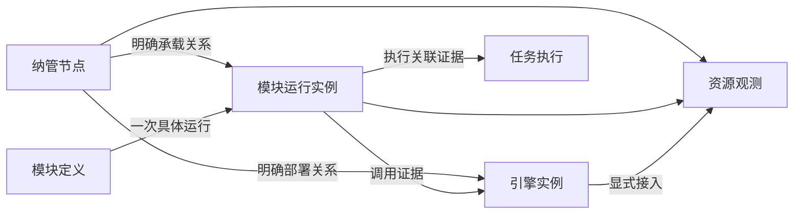

# ADDP 平台运行监控与可观测性设计

状态：总体方案与依赖隔离原则已确认，详细设计推进中，尚未实施（2026-10-04）。

用户已确认首期覆盖 ADDP 自身部署节点、服务和明确纳管的业务引擎；监控组件按 Infra 组织、按需部署，其缺失或故障只影响对应观测能力。本文记录目标边界、组件依赖、对象身份、分期与验收要求，不代表现有部署已支持观测设施裁剪。

## 一、目标与范围

目标是把平台运行问题与资源压力、服务请求和任务执行事实关联起来，使运维人员能够从告警定位节点、运行实例、接口或引擎，并查看有权限的诊断证据。

| 需求 | 设计范围 |
| --- | --- |
| 主机台账与资源监测 | 纳管节点身份、基础信息、CPU、内存、磁盘、网络与趋势 |
| 服务实例负载监测 | 复用已有进程实例身份，区分进程消耗、容器配额和宿主容量 |
| 集中监控与资源统计 | 同类对象排行、容量统计、状态和有来源证据的部署关系 |
| 告警与关联诊断 | 基于有效观测判定，复用 Monitor 告警与通知机制，关联已有执行事实和日志入口 |
| 慢接口与调用拓扑 | 第二期补充分布式追踪；展示证据范围，不承诺自动根因判定 |
| SSH 初始化、防火墙、批量启停、扩容 | 第三期按实际需求讨论受控运维执行，不进入首期 |
| 功能热度、综合健康评分、泄漏诊断 | 暂缓；产品使用分析单独定义事实，诊断结论需要充分证据 |

不纳管企业内所有主机和应用，不采集客户端电脑，不自动扫描任意网络。业务引擎被登记不代表其宿主节点已纳管，也不代表平台已获得数据库专业指标或主机管理权限。

## 二、现有基础与目标差距

| 现有事实 | 目标改动 |
| --- | --- |
| System 保存模块定义、运行实例、心跳租约和引擎登记 | 增加纳管节点稳定身份与明确的部署关联，不重复登记服务或引擎 |
| Monitor 聚合任务执行、后台运行心跳、Provider health | 扩展平台资源观测；执行槽位不冒充 CPU 或内存 |
| Monitor 已有租户执行告警及独立平台日志链路告警 | 复用生命周期、事务 outbox 与投递机制，补充平台资源信号 |
| 日志正文使用受控实例文件 → Alloy → Loki → System 授权查询 | 保持唯一正文路径，增加观测能力的部署选择和故障呈现 |
| 请求日志记录 request_id、状态与耗时 | 统一应用指标；第二期增加 Trace/Span 与传播 |
| 标准 Infra 已包含日志组件，启动入口准备和校验日志配置 | 同步改造标准生命周期，才能支持不部署日志组件 |

当前代码与配置核对入口：

- [System 运行实例模型](../../system/backend/internal/models/module_registry.go)
- [Monitor 模块说明](../../monitor/CLAUDE.md)
- [公共请求日志](../../common/middleware/logging/logging.go)
- [日志采集配置](../../scripts/infra/runtime-logs.alloy)
- [Infra 启动入口](../../scripts/infra/up.sh)

## 三、对象身份与事实所有权

### 3.1 对象模型

| 对象 | 身份与规则 | 唯一事实源 |
| --- | --- | --- |
| 纳管节点 | 稳定 node_id；物理机或虚拟机。名称、IP、操作系统是属性，不以 IP 或容器主机名构造身份 | System 节点台账（待实现） |
| 模块定义 | 复用 module_name 与现有定义身份 | System 模块登记 |
| 模块运行实例 | 复用现有进程级 instance_id；重登记保留，真实重启产生新身份 | System 运行实例与租约 |
| 容器 | 使用部署环境提供的容器身份及配额证据；容器与进程不强制一一对应 | 容器运行环境 |
| 引擎实例 | 复用 engine_id；可以是集群或云服务，不强制拥有单一宿主节点 | System 引擎登记 |
| 任务执行 | 复用 execution 身份和 Owner 写入的事实；不从当前 Worker 推断历史执行位置 | Common 执行事实与任务 Owner |
| 监测目标 | 明确对象引用、监测类别和采集端点，身份不同于被观测对象 | Monitor 监测配置（待实现） |

node_id 由部署环境明确绑定到实例和采集来源，不能用现有 host_node_name、registered_host 或 host_node_ips 推算。未提供稳定绑定时保留“未关联节点”；历史实例不回填无法证明的节点身份。节点绑定不参与路由、Ready 或执行领取权。

部署关系记录来源与有效时间。调用关系来自明确配置或实际 Trace，展示来源、观测窗口与覆盖范围；未观测到调用不表示不存在依赖。引擎业务数据路径继续使用 ResourceLocator，不把 node_id 作为数据资源定位符。

### 3.2 模块职责

| Owner | 职责 | 边界 |
| --- | --- | --- |
| System | 节点基础台账、模块/实例/引擎登记、IAM、统一审计 | 不保存 Monitor 指标阈值或观测策略，不因资源告警改写实例租约 |
| Monitor | 监测目标、资源与服务质量查询、趋势、拓扑投影、规则、告警和通知 | 不创建第二套实例在线事实，不直接读取业务节点文件或业务引擎数据 |
| 业务模块与 Runtime | 自身请求、运行时和执行关联事实 | 不依赖中心遥测设施确认业务成功，不把执行结果存入指标后端 |
| Common / Common-Python | 埋点、身份字段、上下文传播、脱敏和传输公共能力 | 不拥有中央台账、指标历史或模块业务阈值 |
| Console | 聚合入口、上下文和跨模块导航 | 页面可见性不替代 Owner 授权 |
| Infra 与部署系统 | 组件生命周期、端点、Secret、采集权限、存储和资源预算 | 不注册为业务 Engine，不伪造 Tenant 或任务身份 |

平台节点和共享 Infra 的物理资源观测属于 Platform Context。Tenant 只查看有明确授权依据的引擎观测或执行摘要；不能通过 engine_id 获得宿主节点其他进程、其他 Tenant 或平台日志正文。首期平台资源视图只公开有界运维元数据，业务 SQL、参数和结果不采集到其中。Tenant 专业引擎诊断需另行细化 Owner 授权契约后接入。

采集服务使用独立最小权限身份和绑定来源，不代传长期 User Token。数据库专业指标使用专用监测账号；Monitor 不获取业务读写账号自行查询。平台日志正文继续由 System 的独立 Permission 和授权查询路径提供。

## 四、技术路线与部署组织

### 4.1 唯一数据路径

| 数据 | 技术路线 | 存储与读取 |
| --- | --- | --- |
| 主机指标 | node_exporter → Prometheus 拉取 | Prometheus 时序存储，Monitor 受控查询 |
| Linux 容器指标 | cAdvisor → Prometheus 拉取 | 容器身份与配额明确绑定，Monitor 受控查询 |
| 应用/进程指标 | Go/Python 标准指标库和共享封装 → Prometheus 拉取 | 同一实例身份，规范化接口标签 |
| 日志 | 现有受控实例文件 → Alloy → Loki | 保持 System 授权正文读取；Monitor 展示链路健康和跳转 |
| Trace（第二期） | OpenTelemetry SDK → Alloy 的 OTLP 接收与处理 → Tempo | 受控诊断读取，按当前上下文授权 |
| 台账、策略、告警、审计、执行事实 | 保持各 Owner 的 PostgreSQL 事实源 | 高频采样不写 task_executions 或普通业务表 |

首期指标采用 Prometheus 拉取，不同时引入 remote_write 的第二条应用指标采集路径。Alloy 继续承接既有日志，第二期补充 OTLP；不同时部署另一套功能相同的常驻追踪采集器。每个目标和监测类别只登记一个采集来源，避免独立 exporter 与 Alloy 内置同类 exporter 重复采样。

Prometheus 负责时序查询及必要的记录规则；Monitor 拥有本专题告警策略、判定、事件与通知，不另引入 Alertmanager 作为第二个告警 owner。资源视图集成现有 Monitor 前端，Grafana 不作为首期产品入口或必需依赖。

### 4.2 中心组件与节点组件

| 类别 | 组件 | 部署规则 |
| --- | --- | --- |
| 中心指标设施 | Prometheus | 一套部署可服务多个节点；首期不宣称 HA 或跨地域可靠性 |
| 中心日志设施 | Loki、既有授权代理和存储 | 沿用独立 bucket、账号、保留与清理规则 |
| 中心追踪设施 | Tempo | 第二期按需部署；存储配置实施时按选定版本验证 |
| 节点采集 | node_exporter、cAdvisor、Alloy、既有日志接收和清理能力 | 只部署到显式接入对应能力的节点，权限按职责隔离 |
| 应用代码 | 指标库、OpenTelemetry SDK | 随模块构建，不因无遥测服务缺失应用依赖或无法启动 |

组件部署定义和生命周期由根 Infra Compose 与 scripts/infra 标准入口组织；组件配置放在既有 scripts/infra 目录。模块自己的业务能力仍归 Monitor，不新增“监控基础设施业务模块”。

指标、日志、追踪分别作为可选择的部署能力。部署选择、端点及 Secret 来自部署配置；规则阈值和普通运行策略归 Monitor 持久化配置，遵守 [配置规范](../spec/addp配置介绍.md)，不能再由 System 保存一套值或以环境变量覆盖已保存策略。实际端口来自标准生命周期，不在监测目标中硬编码首选值。

初期验证以 Linux 部署的节点、进程和容器为主。macOS 开发环境的原生宿主、Docker Desktop Linux 虚拟机和容器分别表达；容器内采集的 Linux 资源不能显示为 Mac 宿主资源。操作系统不支持的指标显示“不支持”，不改用外观相同但语义不同的数据。

现有日志 Alloy 不持有 Docker Socket。cAdvisor 的宿主访问权限必须独立评估和隔离，不为容器指标直接给现有日志采集器增加 privileged 或容器管理权限。所有新镜像、依赖和配置须核对技术栈规约，固定 tag/digest 并取得对应环境的实际验收证据；本稿不冻结未经验证的版本。

## 五、能力依赖与故障影响矩阵

“属于 Infra”描述部署归属，不表示所有模块必须依赖该组件。各模块必需的 PostgreSQL、Redis、MinIO 等仍按其真实用途决定；其自身依赖故障不属于遥测隔离承诺。

| 功能 | 依赖事实或设施 | 未选择/未接入 | 已选择但设施故障 | 必须保留的其他能力 |
| --- | --- | --- | --- | --- |
| 登录、模块路由、引擎登记 | System、模块必需 Infra、注册租约 | 按原有契约 | 按原有契约 | 不等待观测设施 |
| 数据探查、查询、传输、质量检测 | 各 Owner 必需 Infra、授权、实际业务引擎 | 按原有契约 | 仅依赖该资源的操作受影响 | 不因 Prometheus/Loki/Tempo/Monitor 缺失而失败 |
| 模块 UP/DOWN 与运行实例列表 | System 登记和租约 | 沿用已有能力 | 不能用采集状态覆盖登记事实 | 无指标设施也能读取实例登记 |
| 执行统计、执行诊断、后台槽位观测 | Common 公共事实及 Owner 读取裁决 | 沿用已有能力 | 按现有 Owner/存储错误语义 | 不依赖 Prometheus、Loki 或 Tempo |
| 节点/进程资源与趋势、TOP5 | Prometheus、对应 exporter、明确对象绑定 | 显示未启用或目标未接入 | 对应视图显示不可用或数据过期 | 其他业务、执行和日志能力继续工作 |
| 集中运行日志正文 | 既有日志来源、Alloy、Loki、System 授权 | 显示集中日志未启用 | 当前正文请求明确失败；不改读宿主文件 | 业务、资源和追踪能力继续工作 |
| Trace 与实际调用拓扑 | OTLP 链路、Tempo、身份与传播 | 显示追踪未启用 | 对应查询不可用，旧拓扑注明时间和覆盖 | 业务、资源、日志、执行继续工作 |
| 明确部署关系图 | System 台账和受信部署关联 | 未绑定关系不推断 | 来源不可读取时报告不完整 | 不要求 Tempo 存在 |
| 资源告警 | 有效指标样本、Monitor 规则/事件存储 | 不评估未启用能力；保留历史 | 依赖观测未知，不能自动判正常或恢复 | 其他告警来源独立评估 |
| 已有执行告警及通知 | 执行事实、Monitor、已配置通知渠道 | 无渠道仍保存事件 | 渠道失败有界重试，不回滚执行 | Prometheus/Loki/Tempo 缺失不阻断已有通知 |
| Monitor 模块本身 | 自身必需 Infra 和 System 注册 | 其他模块正常运行 | 集中监控/告警不可用 | Owner 继续写执行事实，模块继续注册 |

同一 Alloy 或网络路径被日志与追踪共同使用时，其故障会影响这两类观测。矩阵按实际依赖解释影响，不承诺共享组件间不存在关联故障；这种故障仍不得传播到业务主路径。

### 5.1 能力状态与目标状态

部署意图和运行观测分别表达，不新增一个笼统的“监控正常”字段。

| 状态维度 | 目标语义 |
| --- | --- |
| 部署意图 | enabled / disabled；仅由部署配置决定 |
| 能力可用性 | enabled 时区分 available、unconfigured、unavailable；关闭时显示 disabled |
| 目标接入与样本 | 未接入、有效数据、窗口内无数据、数据过期、不支持；分别展示来源和最近有效采样时间 |

disabled 不尝试发送，不制造设施离线告警；unconfigured 表示已选择但必要配置不完整；unavailable 表示配置存在但访问或协议验证失败。available 只说明查询/采集设施可用，不证明所有节点有样本。窗口内无数据不能解释为零负载；过期样本不能继续显示为实时正常。

关闭能力是部署意图，不是观测恢复事实。停止相应评估并保留历史告警，不把活动事件伪造为指标恢复；关闭期间的处理状态在详细告警契约中明确后实施。目标状态不改写 System 租约、Engine 生命周期或任务执行终态。

### 5.2 启动、业务请求与生命周期隔离

1. 业务模块的 live/ready、注册和 Gateway 路由不检查观测设施。Monitor 的整体 Ready 不包含可选指标、日志、追踪后端；自身必需存储和 System 注册继续遵守原有规则。
2. 指标端点读取本地有界状态，不在采样时执行业务查询。Trace 发送在业务请求外使用有界队列、批处理和有限超时；队列满或发送失败可丢弃遥测并记录计数，不无限重试、积压或等待远端确认。
3. 集中日志未启用时不启用其远端采集。既有结构化输出、受控启动身份和有界接收规则必须在同一次生命周期改造中核实；不恢复旧固定模块日志文件或新增直接读文件路径。
4. 用户查询观测数据按能力独立失败。组合页面分区加载，指标失败不挡执行记录或日志入口；后端不得把查询错误包装成成功空列表。
5. 标准启动入口按选择分别预检、启动和报告。观测配置错误不得阻止无关核心服务启动；所选观测能力失败必须明确报告并返回非零整体结果，不以全成功掩盖部分失败。调用入口根据所需服务检查实际就绪，不能把聚合退出码当作全部业务已不可用。
6. 关闭时不校验该能力专用凭据，也不主动启动其组件。错误不得触发对其他运行中设施的停止、清理、重建或接管。
7. 观测设施短暂恢复后自动恢复连接；已有业务进程不需要重启。恢复不补造停采窗口的数据，不承诺停机期间日志或 Trace 已完整保存。
8. 指标、日志、Trace、任务记录、操作审计分别遵守其可靠性契约。不可丢失的授权/审计约束不能因为遥测隔离而放宽。

## 六、指标口径与资源预算

| 类别 | 首期口径 |
| --- | --- |
| 主机 CPU | 节点 CPU 忙碌率；总览按核数加权，注明窗口与有效样本覆盖 |
| 进程 CPU | 消耗 CPU 核数；有明确有效配额时另算配额利用率，不默认分配宿主全部核数 |
| 主机内存 | 总量、可用量及基于可用量的压力；操作系统缓存不能直接判为泄漏 |
| 进程/容器内存 | 进程驻留内存、容器内存与配额分别展示；无限制时不伪造百分比 |
| 运行时内存 | 堆、GC、并发运行体等专业指标；持续增长只能提示进一步诊断 |
| 磁盘 | 明确文件系统/挂载点的容量、可用空间、inode；IO 吞吐、等待和繁忙时间独立展示 |
| 网络 | 各网卡上下行速率与错误；累计字节转速率处理计数器重置，不重复累加桥接/虚拟接口 |
| 服务质量 | 完成请求数、错误率、延迟分布；接口使用规范化 route，排除敏感请求内容 |
| 执行运行 | 复用现有积压、排队与运行时长、失败率和槽位；不从 CPU 推算执行容量 |

首期只在同类对象、同一时间口径内排行。主机物理容量不与进程消耗或容器配额相加；共享文件系统不按挂载节点重复汇总；集群引擎不按连接登记数推算服务器数量。历史环比注明等长窗口、完整度与无基期情况。

默认以秒级采样和刷新表达近实时，页面展示最近采样时间，不承诺逐毫秒实时。采样、查询窗口、分辨率、保留期、返回点数和并发预算必须在详细配置契约与测试中确定；长窗口查询使用有界步长，前端刷新频率不能直接改变采样频率。

指标标签仅保留必要身份与有限维度，控制运行实例重启产生的序列规模。TraceId、request_id、execution_id、用户 ID、完整 URL、SQL、Token 不作为指标标签；关联身份使用适合的数据字段，仍限制索引基数与保留范围。

观测组件限制 CPU、内存、队列、磁盘和保留期。复用 MinIO 时采用独立 bucket/账号、容量预算与清理规则；bucket 分开不等于底层磁盘隔离。同机共享资源耗尽可能影响业务，需要真实预算测试，不能仅凭软依赖声称物理故障隔离。

## 七、告警、追踪与运维边界

资源告警从有效观测产生 active signal，再由 Monitor 统一处理事件与通知。持续时间、恢复阈值、维护静默、确认、抑制与通知重试明确分开；查询失败、采样缺失和不支持的指标不能产生虚假的恢复。平台观测与租户执行分别授权，不将平台资源事件写进租户执行告警表或虚构 Tenant。

现有 platform_log_* 专属于平台日志域。扩展平台资源事件时复用中立发送和生命周期机制，不直接把资源信号塞进日志专用模型。平台运行告警的领域收敛、表/API 命名和既有事件语义的保留范围在详细设计时先核对日志已确认契约；如需改变已有语义，先讨论、修订文档，再整体替换，不能旁路保留两套相同职责的事件与通知路线。

第二期逐步贯通 Gateway、Go/Python 服务、公共 HTTP Client 和数据库/引擎调用。request_id、trace_id、execution 身份分别表示请求、调用链和业务执行，不互相替代。异步任务使用明确关联与新运行跨度，不把长任务硬挂在创建请求生命周期下。慢请求与错误保留策略必须与采样位置、容量和丢弃观测一起验收；随机头部采样不能保证保留全部慢请求。

拓扑先提供有证据的部署关系，随后增加观测调用关系。每条关系注明来源、有效时间或观测窗口；不使用指标聚合算法宣称根因已确认。综合分数暂不替代可解释的指标和规则。

监控系统整体不可用时无法靠自身完成告警，生产需独立的外部存活探针；独立探针不授予业务读取或主机管理权。

第三期若接入运维动作，ADDP 负责目标、操作计划、权限和审计，成熟执行设施承担实际变更。主机登记不默认保存 SSH 密码，监控采集身份不具备 Shell 权限，Monitor 不提供任意命令执行器。启停、移除纳管、服务停止、主机关机是不同操作，详细契约未确认前不开放。现有 Orchestrator 租户任务不能隐含获得平台主机操作权。

## 八、分期、标准入口与验收

### 8.1 开发顺序

| 阶段 | 工作 | 完成条件 |
| --- | --- | --- |
| D0 设计基线 | 概念、Owner、依赖矩阵、现状差距与验收整理 | 本文与术语、架构、监控入口一致；不宣称代码落地 |
| D1 第一期开工契约 | node_id 与实例绑定、监测目标、指标目录、部署选择、状态和权限契约 | 核对现有声明/配置/日志边界，解决会改变业务结果的歧义后再编码 |
| P1.1 部署与隔离基础 | 标准 Infra 选择、能力状态、生命周期、Prometheus 和采集夹具 | 未部署和运行故障两类隔离测试通过，无业务主路径依赖 |
| P1.2 资源观测闭环 | 节点/实例关联、指标/趋势/TOP5、基础服务质量、资源告警与日志跳转 | 口径、权限、告警及真实部署链路通过；删除被替换路径 |
| P2 关联诊断 | Trace、慢接口、调用拓扑、专业引擎观测和执行关联 | 异步关联、采样、脱敏与读取授权通过 |
| P3 受控运维 | 按真实需求细化初始化、配置变更、启停与扩容 | 独立操作范围与权限确认、计划/执行/审计验收，不复用监测身份 |

### 8.2 测试与 CI 影响

遵守 [测试与验收规范](../spec/addp测试与验收规范.md)。本轮只变更文档，无新增服务、权限、API、迁移或测试入口。后续实现必须在编码前登记影响，不能等推送失败再补门禁。

| 层级 | 必须证明的事实 | 标准承接方式 |
| --- | --- | --- |
| T0 | Owner/权限声明、Swagger、配置与生命周期一致；新组件/镜像/门禁注册 | test-platform 与现有登记检查；新增输入随实现登记 |
| T1 | 指标单位、配额缺失、身份绑定、计数重置、能力状态、未知观测、恢复阈值、有界发送 | 各 Owner 已有 Go/Python 门禁自动发现 |
| T2 | 真正的指标采集/查询、告警事务、队列满/超时/设施断开与恢复、生命周期清理 | Owner disposable 门禁；新 Prometheus/采集依赖按规范登记服务、固定镜像和输入 |
| T3 | 平台权限、能力未启用、目标未接入、过期数据、分区错误、路由恢复、跨页面导航 | Monitor/System 现有前端门禁；共享能力按消费者扩散 |
| T4 | 真实 System/Gateway/Owner 下无观测设施的业务、运行中故障、恢复及进程身份关联 | 在标准 Online suite 中实现并登记，禁止占位 suite |
| T5 | 正式发布选择、安装/停止/升级、真实 OS 与容器采集权限；HA 仅在另有证据时宣称 | 已登记 Release suite 的相应能力认证 |

关键故障场景至少包括：

1. 指标、日志、追踪全部未部署：System/Gateway/业务 Owner 按自身依赖 Ready，执行与结果读取正常，页面不产生虚假观测告警。
2. 仅启用指标和日志、未部署 Tempo：资源与日志可用，追踪显示未启用，业务不受影响。
3. 运行中分别中断 Prometheus、Loki、OTLP/Tempo：只影响依赖区域，不改写租约、任务或引擎生命周期，不无限积压。
4. 仅一个节点采集失败：其他节点正常；旧样本过期，不能显示零负载或恢复资源告警。
5. 配置错误和专用凭据缺失：所选观测能力报告失败；关闭能力不校验其 Secret；无关业务生命周期不被阻断。
6. 设施恢复：已有业务进程不重启，重新获得新样本；停采空白保留，历史不伪造。
7. 真实进程重启、多实例、IP 变化、容器重建：身份正确关联，不串历史，不重复统计。
8. 无配额、缺节点身份、共享磁盘和缺失统计窗口：显示真实边界，聚合不重复计数。
9. Platform/Tenant 越权、来源伪造、任意采集端点与敏感内容：服务端拒绝，不依赖前端隐藏。
10. 采集/发送预算耗尽：业务不阻塞，丢弃或失败可观测；标准测试退出清理自建容器、进程、卷和本轮数据库事实。

工作区验证默认运行 `make test-changed`，明确单 Owner 时使用 `make test-module MODULE=<owner>`；数据库运行前先用 `bash scripts/infra/status.sh` 核实实际映射。本地只使用 `addp_test`/`addp_iam_test` 和标准入口，测试不接管个人 Infra。新增 T2 依赖须同步 `ADDP_T2_SERVICES`、镜像、输入、退出清理和 CI 注册；新增 T4/T5 suite 取得实现后才能列为可运行入口。

### 8.3 本轮设计交付与后续准入

- [x] 确认首期纳管范围、模块职责和技术主路径。
- [x] 整理组件依赖、未部署行为和故障影响矩阵。
- [x] 定义观测设施不进入业务 Ready/主请求的隔离要求。
- [x] 区分已实现日志/执行基础与待实现资源、裁剪和追踪能力。
- [x] 同步术语及概念、模块和文档导航。
- [ ] 完成 D1 的字段、配置、权限、采集预算和告警契约。
- [ ] 按 P1.1/P1.2 实施并通过门禁；未实施项不得计为通过。

下一步优先推进 D1：先冻结节点绑定和观测部署/状态契约，再编写采集与页面。已有平台日志事件若需领域调整，应先单独明确语义与替换方案。

## 九、技术资料与相关规范

- [Prometheus HTTP 服务发现](https://prometheus.io/docs/prometheus/latest/http_sd/)：监测目标可转换为受控发现投影；不是新的对象身份事实源。
- [Prometheus 埋点约定](https://prometheus.io/docs/practices/instrumentation/)：指标类型、标签基数与请求指标设计参考。
- [OpenTelemetry 采样](https://opentelemetry.io/docs/concepts/sampling/)：第二期慢请求保留与容量设计参考。
- [Alloy cAdvisor 组件](https://grafana.com/docs/alloy/latest/reference/components/prometheus/prometheus.exporter.cadvisor/)：Linux 支持、宿主权限和 Docker Desktop 边界参考，不表示仓库现有配置已启用。
- [术语表](../concepts/addp术语表.md)
- [模块架构](../concepts/addp模块架构图.md)
- [监控与执行体系](../concepts/addp监控与执行体系图.md)
- [授权上下文规范](../spec/addp授权上下文规范.md)
- [配置规范](../spec/addp配置介绍.md)
- [技术栈规约](../spec/addp技术栈规约.md)
- [模块服务运行日志设计](ADDP模块服务运行日志设计.md)
