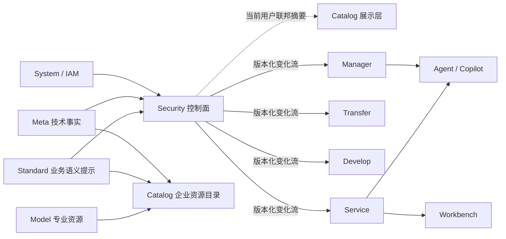
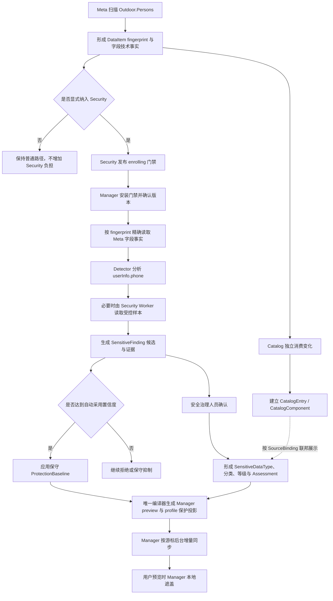

# ADDP 数据安全与隐私保护体系专题

更新时间：2026-09-03

状态：阶段 6 推进中；Manager、Develop、Service 与 Transfer bounded snapshot 已完成首个字段级保护切片，当前收敛 Security 治理易用性

## 一、文档定位

本专题持续跟踪 ADDP 数据安全与隐私保护体系的概念、模块边界、实施阶段和验收结果。本文位于 `docs/next/`，用于承载正在推进的设计；稳定结论在进入实现前必须同步进入术语表、核心概念关系图、模块架构图、正式规范和受影响模块说明。

本文替代并删除以下早期规划：

- `docs/plan/数据治理模块群规划.md`；
- `docs/plan/security模块详细设计.md`。

早期文档提出独立 Security 模块、敏感识别、分类分级、动态/静态脱敏和数据级权限，方向具有延续价值；但其中 Model、Standard、Catalog、IAM、Owner Resource Policy、TaskProvider、API 路径和数据模型均早于现行架构，不能继续作为实现依据。

## 二、旧数据治理模块群规划核对结论

旧规划除 Security 外的内容不能笼统表述为“全部实现”，应按现行事实分别判断：

| 旧规划范围 | 当前结论 | 现行承接位置 |
| --- | --- | --- |
| 数据标准、业务域、术语、数据元、原安全分类分级 | 主体能力已实现，但不再属于旧规划中的 Model 子系统；原安全分类分级早期实现已删除 | Standard 只保留业务数据标准；安全分类分级由 Security 唯一拥有，Catalog 只关联并展示专业事实 |
| 数据质量规则、检查、评分和问题跟踪 | 手动/Orchestrator 显式执行的核心闭环已实现 | `docs/spec/addp数据质量规范.md` 与 Quality 模块 |
| Quality 定时调度、Meta 扫描事件自动触发 | 未实现，而且被当前正式规范明确列为不支持范围 | 未来需要时先修订数据质量规范和任务体系规范，不继续由旧规划跟踪 |
| 全局质量报告、趋势和综合仪表盘 | 旧规划描述宽于当前实现 | 当前以 execution 评分、字段评分、Issue 和 Catalog 动态质量摘要为准；后续产品化由 Quality 专题承接 |
| Meta 数据血缘阶段 1 | 已按正式规范实现 | `docs/spec/addp数据血缘能力规范.md`；字段级血缘等后续范围也由该规范跟踪 |
| 业务实体、逻辑表、数仓分层、星型模型、物化 | 主体能力已实现，并已形成受控 staging、封存、质量门禁和原子发布主线 | Model、Quality、Orchestrator 和通用 writer |
| 指标定义、分类、公式和依赖 | 已实现 | Standard Metric |
| 统一指标计算、查询和服务输出 | 尚未形成平台级统一闭环 | 已由 `docs/next/ADDP企业资源目录能力专题.md` 记录为跨模块语义能力缺口，不归入本专题 |

因此，旧规划已经失去作为统一实施清单的价值。删除它不会表示所有旧设想均已完成，也不会取消尚未完成的工作；未完成事项必须由当前 owner 的正式规范或独立专题继续承接。

## 三、模块命名决策

### 3.1 候选名称

| 候选 | 优点 | 主要问题 |
| --- | --- | --- |
| `Security` / 安全 | 简洁，能覆盖发现、风险、策略、授权条件和保护执行 | 容易被误解为同时拥有 IAM、凭据、网络、主机、应用安全和审计基础设施 |
| `Data Security` / 数据安全 | 边界明确，覆盖分类分级、敏感数据、访问和使用保护 | 技术目录和 API 若直接使用 `data-security`，不符合现有单词模块命名习惯 |
| `Data Protection` / 数据保护 | 突出动态脱敏、匿名化和数据出口控制 | 对敏感发现、风险治理、分类分级和合规运营表达不足 |
| `Privacy` / 隐私 | 突出个人信息与敏感个人信息 | 范围过窄，无法自然覆盖商业秘密、财务、科研、地理和其他重要数据 |
| `GRC` / 安全治理与合规 | 能表达制度、风险和合规流程 | 不能清楚表达平台还必须形成可执行的数据保护控制 |

### 3.2 已确认结论

模块采用分层命名：

- 稳定模块英文名：`Security`；
- 稳定模块中文名：`数据安全`；
- 完整概念定位：`Data Security module / 数据安全模块`；
- 产品入口与本专题标题：`数据安全与隐私保护`；
- 代码目录、数据库 Schema、模块 ID 和 API 前缀统一使用 `security`。

采用该方案的前提是正式文档必须把 `Security module` 限定为“数据安全与隐私保护控制面”，不得把所有带有安全属性的能力迁入该模块。现有 `common/security` 在实施时整体重命名为 `common/secretcipher`，只承载密码、Token、Webhook Secret 等敏感配置值的 AES-256-GCM 加解密；不保留旧目录或转发包。System IAM 的平台安全策略、平台安全管理员和认证安全继续归 System。

共享包按具体技术能力命名，不使用含义过宽且与根业务模块重名的 `common/security`：

| 路径 | 职责 |
| --- | --- |
| `security/` | 数据安全与隐私保护业务控制面 |
| `common/secretcipher/` | 敏感配置值加解密，不负责密钥管理、业务数据加密或脱敏 |
| `common/dataprotection/` | 跨 Owner 稳定保护决策值对象及确定性遮盖、抑制等纯算法；仅在正式执行契约确定后建立 |
| `common/client/security.go` | Security 服务的 Bearer-only Client 与增量投影传输契约 |

命名、事实边界和运行契约已经完成正式定型；根 `security/` 模块、端口、Schema、Permission 和基础 API 已按单一路线建立。

## 四、问题本质与建设目标

手机号显示为 `138****1234` 只是第一个可见问题。平台需要建立的完整闭环是：

```text
Meta 技术事实与受控样本
    → Security 敏感发现与证据
    → 候选发现按自动采用置信度触发保守基线
    → 人工确认具体资源的正式分类分级
    → Security 编译版本化保护策略
    → 各资源 Owner 在自身数据出口执行
    → 保护结果、策略版本与例外进入审计和持续治理
```

建设目标包括：

1. 同一种敏感数据在预览、剖析、搜索、导出、查询、服务和 AI 消费中执行一致的保护意图；
2. 自动识别只产生候选和证据，不能静默成为正式治理真相；达到自动采用置信度的候选可立即触发保守基线，不因人工确认或 Catalog 建档滞后继续返回明文；
3. 分类分级、保护策略、资源授权、使用审批和执行审计各有唯一事实源；
4. 所有数据出口服务端执行保护，前端不承担安全边界；
5. 策略决策可解释，能够回答主体、动作、资源、字段、策略版本、允许来源和保护结果；
6. Security 或其他业务模块暂时不可达时 fail closed，不得回退明文或旧规则；
7. 结构化、半结构化、文档、媒体、空间和图数据最终进入同一治理体系，但按可验证能力分阶段开放。

## 五、模块边界

### 5.1 事实所有权

| 模块 | 权威职责 | 明确不拥有 |
| --- | --- | --- |
| Standard | Domain、Glossary、Element、CodeSet、Unit、Metric 等业务数据标准 | 安全分类体系、安全等级、敏感发现、资源安全评估和保护策略 |
| Meta | DataItem、字段路径、类型、结构、技术特征和受控采样能力 | “该字段属于手机号/L3”等治理结论 |
| Catalog | CatalogEntry/CatalogComponent 稳定企业身份、业务语义关联、责任和目录治理 | 安全分类分级定义、自动扫描证据、资源安全评估、保护算法和运行时访问判断 |
| Security | SecurityClassification、SecurityGrade、检测器与规则、扫描执行、敏感发现和证据、资源安全评估、保护策略及修订、策略例外治理、保护覆盖与执行观察 | 身份、角色目录、业务资源本体、中央全资源 ACL、所有数据内容代理 |
| System/IAM | Principal、Tenant、组织、Role、Permission、AuthContext、平台安全策略和审计基础设施 | 业务字段识别、脱敏策略和资源内容 |
| Asset | 数据使用申请、审批、期限和交付来源 | 最终资源访问判断和脱敏执行 |
| 资源 Owner | Resource Grant/Policy、最终访问判断，以及预览、查询、导出、服务等自身出口的保护执行 | 第二套分类分级标准和私有脱敏规则体系 |
| common | 稳定跨模块契约和无业务状态、确定性的保护算法 | 敏感识别业务、策略事实、授权事实和治理工作流 |

安全分类体系、安全等级体系、自动发现、具体专业资源安全评估和保护策略统一归 Security；Standard 回归业务数据标准，Catalog 在各专业事实之上提供稳定企业资源身份并联邦展示 Security 专业事实，不是 Security 开展专业治理或保护生效的前置条件。该事实归属已经确认，不再保留 Standard 和 Security 并行拥有安全分类分级的候选路线。

### 5.2 安全分类分级的已确认归属

安全分类和安全分级整体迁入 Security，由 Security 同时拥有定义和具体资源评估，Standard 与 Catalog 都不保存第二份可编辑安全结果。

必须先区分两类“分类”：

| 概念 | 示例 | owner |
| --- | --- | --- |
| 业务语义组织 | 客户域、交易域、指标分类、资产目录分类 | Standard Domain/MetricCategory、Catalog 业务语义、AssetCategory 等现有 owner |
| 安全分类 | 个人信息、敏感个人信息、金融信息、健康信息、重要数据、商业秘密 | SecurityClassification |
| 安全分级 | L1–L4 及各级定义、默认控制基线 | SecurityGrade |

现有 `standard.classifications`、`standard.grading_levels` 和数据元修订中的 `classification_id/security_level` 实际表达安全语义，却放在业务数据标准模块中。独立 Security 建立后继续保留这条路线会产生以下问题：

1. Security 的保护策略必须反向依赖 Standard 的安全对象，安全治理生命周期被拆成两个 owner；
2. 安全管理员需要进入 Standard 修改分级，而 Standard Permission 和数据标准角色并不等于安全治理职责；
3. 一个等级定义发生变化时，检测、评估、保护基线、例外和执行观察无法在同一专业边界内版本化；
4. 数据元上的安全等级容易被误当成具体物理字段的最终等级，忽略场景、组合、数据规模和实际用途造成的等级提升；
5. Standard 与 Security 若各保留一套分类分级，会形成无法解释的双事实源。

已确认的唯一主线为：

```text
SecurityClassification + SecurityGrade + Protection Baseline
                         ↓
显式纳管的专业资源引用 + component key
                         ↓
Security Sensitive Finding（候选、证据、置信度）
             ┌───────┴───────┐
             ↓               ↓
按阈值应用保守基线     安全治理人员审核
             ↓               ↓
临时有效保护决策       Resource Security Assessment
             └───────┬───────┘
                         ↓
Security Protection Policy / 唯一编译保护投影
                         ↓
各资源 Owner 最终授权判断与数据出口执行
```

Security 的 Finding、Assessment 和 Policy 直接绑定 owner 稳定专业资源身份，而不以 Catalog UUID 作为前置身份。针对 Meta DataItem 的首个切片使用 `{source_module: meta, source_type: data_item, source_identity: fingerprint, component_key: userInfo.phone}`，并冻结确认时的必要源版本或结构快照；Standard、Model、Service 等资源未来分别使用各自 owner 稳定身份。具体引用值对象和快照字段在阶段 1 正式规范中确定，本专题不固化 SQL 结构。

CatalogEntry/CatalogComponent 继续作为企业资源和字段组件的稳定目录身份。Catalog 建档后通过 SourceBinding 映射同一 owner 专业资源身份，在当前 User AuthContext 下联邦展示 Security 专业事实；Security 不迁移、复制或改绑 Assessment。Catalog 来源重绑时，原安全评估仍属于原专业资源与源版本，不得静默跟随到新物理来源。Catalog Backend 不反向依赖 Security；第一阶段不把安全结果复制进 Catalog 表或搜索投影，也不让 Security 可达性影响 Catalog 详情、编目或 Ready。

Standard Element 可以被 Security 作为一种待评估专业资源引用，从而表达“身份证号码数据元通常属于何种安全分类与基线等级”。该结果由 Security 保存，只是具体字段评估的候选基线，不能因为 CatalogComponent 关联了 Element 就自动成为最终结果。具体字段仍需结合真实内容、规模、组合关系、使用场景和人工确认形成独立 Assessment。

进入实施后必须一次完成以下替换：

- 从 Standard 删除 Classification、GradingLevel 管理页面、API、Permission 和 owner 表；
- 从 Element Revision 删除 `classification_id` 与 `security_level`；
- 在 Security 建立新的安全分类、安全等级及版本化保护基线，不沿用 Standard ID；
- 受影响的 Catalog 数据字典、Standard 引用解析、前端和测试同步切换到唯一新契约；
- 删除旧 Swagger、国际化文本、测试、文档引用以及 Catalog 数据字典和 Standard 引用解析中的旧契约；
- 不保留旧 ID 映射、旧字段读取、双写、兼容 API、兼容 query、回退到 Standard 或其他旁路。

删除与新建必须在同一次实施中完成。删除前不会先建立兼容层，新实现也不得识别旧 Standard ID；需要验证的数据使用测试环境重新配置为 Security 新事实，不迁移历史开发数据。

具体实体命名、Assessment 目标引用、基数和实施顺序以正式实现规范为准；阶段 2 已建立基础定义实体，Finding、Assessment 与 Policy 的持久化结构仍按阶段 4 实施。

### 5.3 Catalog 定位与专业模块关系

Catalog 是“owner 原生对象进入企业稳定身份、跨模块关系、责任和权限感知发现视图”的边界，不是专业模块开展定义、执行或治理的统一前置工作台。

在 Catalog 建档之前可以成立的内容：

- Standard 的 Domain、Glossary、Element、CodeSet、Metric 等业务标准；
- Model 的 Entity、LogicalTable、字段、建模关系和物化控制事实；
- Security 的分类、等级、检测器、保护基线、针对 owner 专业资源的 Finding、Assessment 和 Policy；
- 专业模块使用自身稳定身份完成的定义、审核、执行和变化历史。

必须有 Catalog 之后才成立的内容：

- CatalogEntry/CatalogComponent 企业稳定目录身份；
- 跨 owner 的企业关系、目录责任、可见性、治理状态和权限感知发现；
- 以 CatalogEntry 为对象的目录级组织与导航；
- 通过 SourceBinding 联邦组合 Standard、Model、Security 等 owner 专业事实的企业视图。

Meta 的依赖只表示“某项专业能力从哪里取得技术事实”，不决定 Security 和 Catalog 的先后。针对 DataItem，Catalog 和 Security 是 Meta 技术事实的并行消费者：Catalog 消费 owner-local 可恢复变化建立全量目录身份；Security 只读取显式纳管目标的精确事实和受控样本，不订阅全量 Meta 变化、不扫描未纳管资源。

### 5.4 控制面与数据面

Security 是控制面，不是所有数据访问的同步代理。资源 Owner 是数据面执行者，在自身服务端出口合并资源授权判断与 Security 保护决策，并执行两者中更严格的结果：

```text
owner 专业资源身份 + Security 分类分级、评估与策略
                         ↓
                版本化保护决策投影
                         ↓
       Manager / Transfer / Develop / Service
                         ↓
                Owner 本地授权与出口执行
                         ↓
         Workbench / Agent / Copilot 等消费受保护结果
```

各方职责已经确认如下：

1. System/IAM 提供可信 Principal、Tenant、Role、Permission 和 AuthContext，不判断具体字段是否应当遮盖；
2. 资源 Owner 使用自身 Resource Grant/Policy 判断主体能否执行预览、查询、导出、发布等资源动作；
3. Security 根据资源、字段、动作和必要上下文编译版本化保护决策，决定允许访问后应当明文、遮盖、抑制、过滤还是拒绝；
4. 资源 Owner 在数据离开服务端前应用保护决策。Owner 可以因自身授权拒绝访问，但不得自行降低 Security 基线或绕过保护；
5. 原值揭示等高风险例外必须先由 Security 形成显式、限时、可审计的策略结果，Owner 不得根据角色名称或本地硬编码自行放行；
6. common 只提供确定性的保护算法和稳定执行契约，不保存策略、授权或评估业务状态。

保护决策以可版本化投影交付给各 Owner，不能形成逐请求、逐行或逐单元格同步依赖。Owner 可以使用最后一个仍在有效期内且校验通过的投影；投影不存在、损坏、冲突或过期时必须拒绝相关动作或保守抑制敏感内容，不得返回明文。缓存期限、投影校验和更新机制在阶段 1 正式规范中确定。

禁止的路线包括：

- 前端收到明文后再遮盖；
- 每返回一个单元格都同步调用 Security；
- Security 直接连接并代理所有业务引擎；
- 各 Owner 自行维护互不一致的手机号、身份证号等私有保护规则；
- Security 建立复制所有业务资源的中央 ACL 大表；
- Security 不可达时绕过策略返回原值。

### 5.5 模块调用与依赖关系

Security 与其他业务模块保持单向事实消费和运行软依赖：



箭头表示事实消费方向，不表示启动或 Ready 强依赖。System 仍是业务模块 Ready 的唯一控制面强依赖；Security 针对已纳管资源读取 Meta 等 owner 事实只是运行软依赖，不影响 Security 定义管理与 Ready。Catalog 不是 Security 的启动、扫描、评估、策略编译或 Owner 保护执行依赖。

调用边界如下：

1. Security 按显式纳管范围读取 Meta 技术事实和必要的 Standard、Model、Service 等 owner 专业事实；各 owner 不反向保存 Security 评估或纳管状态；
2. Security 的敏感扫描只处理已纳管范围，不通过 Catalog 读取数据内容，也不要求 Manager 成为统一扫描代理；扫描执行如何使用受控样本和 Engine Provider 在正式规范中确定；
3. Catalog 独立消费各 owner 可恢复变化建立目录身份和 SourceBinding，不反向触发 Security 扫描；Catalog 展示 Security 摘要时使用当前 User AuthContext 按需联邦读取，不复制安全事实；
4. Manager、Transfer、Develop、Service 分别使用 `common/client/security.go` 按游标拉取自身需要的版本化保护投影并原子更新本地有效状态；Security 不逐个调用 Owner 推送，不同时保留消息和拉取双路线；
5. 用户数据请求只读取 Owner 本地投影，不同步调用 Security、Catalog 或 Meta；
6. Workbench 只消费 Service 已保护的结果，Agent/Copilot 优先消费 Manager 或 Service 已保护的结果，不重复建立第二层 Security 决策；
7. Gateway 只承担认证接入和路由，不读取保护策略、不修改响应内容，也不成为安全事实源。

### 5.6 显式纳管与普通路径受控负担

未纳入 Security 管理的数据保持现有行为。平台必须保存显式纳管事实，不能用“当前查不到策略”推断资源未纳管：

| 纳管状态 | Owner 行为 |
| --- | --- |
| 未纳管 | 完全走既有路径；不远程调用 Security，不扫描、不执行内容保护、不写保护执行审计 |
| 激活中 | Security 已接受纳管请求，但目标 Owner 尚未确认本地门禁版本；不得宣称纳管已生效，Security 不得越过该激活屏障进入正式发现和策略发布 |
| 纳管中 | Owner 已原子安装本地纳管门禁，有效策略尚未就绪；仅对该资源的相关出口拒绝或保守抑制，不返回明文 |
| 已纳管 | 使用本地有效保护投影执行，并记录不含原始敏感值的保护结果 |

纳管必须采用“先安装 Owner 门禁，再执行敏感发现”的激活顺序。Security 先发布只含专业资源身份和 `enrolling` 状态的最小变化；相关 Owner 拉取、原子安装并确认版本后，Security 才开始读取技术事实、受控采样和编译保护策略。如果 Owner 不可达，纳管保持“激活中”且明确显示未生效，不得伪造已保护状态。确认机制、超时和重试在阶段 1 正式规范中确定。

退出纳管必须由 Security 发布明确的解除变化。Owner 消费并应用该变化后删除本地纳管标记，资源才重新进入普通路径；不能因同步失败、投影损坏或记录丢失自动退出纳管。

Owner 在解析出资源身份后，先做本地纳管索引判断。Locator 型出口未命中时立即进入既有主路径，不遍历字段、不计算策略、不变换内容、不增加远程依赖和安全审计。自由查询为防止 JOIN、View、`$lookup` 等绕过纳管资源，在当前 Engine 存在纳管目标时允许执行有界的 Provider 读依赖分析；该最小必要成本不得扩大为 Security / Meta / Catalog 远程调用、内容扫描或保护审计。只有命中纳管目标的资源进入 `common/dataprotection` 执行路径。具体索引结构属于实现细节，但不得对所有数据建立 Security 资源副本。

## 六、需要覆盖的数据出口

| 出口 | 第一原则 |
| --- | --- |
| Manager 预览、JSON 详情、地图弹窗 | 服务端动态遮盖、抑制或拒绝 |
| Manager 数据剖析 | Top N、min/max、样例等可泄露统计按策略抑制或泛化 |
| Manager/Catalog/其他搜索 | 原始敏感值默认不进入索引、摘要和高亮 |
| Transfer 导出和同步 | 默认拒绝或生成受保护结果；静态脱敏生成新 DataItem 并保留血缘 |
| Develop 查询、工作流、Notebook | 任意查询不能绕过字段保护；可靠执行边界形成前保持 fail closed |
| Service 查询与发布 | 发布契约和运行查询都执行同一保护策略，原始输出需要独立高风险授权 |
| Workbench 数据应用 | 只能消费 Service 已按策略处理的结果，不在浏览器恢复原值 |
| Agent、Copilot、Inference | 提示词、工具结果、ResultRef 和评测材料只接收授权且受保护的内容 |
| 日志、错误和审计 | 不记录原始敏感值，只记录身份、资源、动作、策略版本、结果和稳定原因 |

## 七、保护能力分层

必须区分以下概念，不能统一叫“脱敏”：

| 能力 | 数据是否改变 | 典型用途 |
| --- | --- | --- |
| 动态遮盖 | 原数据不变，只改变本次响应 | 预览、查询、服务展示 |
| 字段抑制 | 原数据不变，字段不返回或返回空语义 | 无权查看的高敏感字段 |
| 行过滤 | 原数据不变，只返回授权范围内的记录 | Department、Project Group、业务区域等数据范围 |
| 假名化/令牌化 | 生成稳定替代标识，可按设计决定是否可逆 | 关联分析、跨系统使用 |
| 静态脱敏 | 生成新的受保护数据副本 | 测试、研究、对外交付 |
| 匿名化 | 目标是不可再识别个人，需评估重识别风险 | 开放或广泛分析场景 |
| 原值揭示 | 在明确授权、目的、期限和审计下返回原值 | 极少数业务必要场景 |

普通 SHA/MD5 不能作为手机号、身份证号等小取值空间数据的默认匿名化方法；简单随机扰动也不能在未声明一致性、统计性质和可重复性前作为通用算法。

## 八、首个纵向切片：Outdoor 手机号

首个切片用于验证体系边界，不只实现字符串替换。

### 8.1 目标行为

- `Outdoor.Persons.userInfo.phone` 经确认属于手机号后，默认动态遮盖；
- `13810782030` 返回 `138****2030`；
- `13661384499` 返回 `136****4499`；
- 领队、管理员或记录创建者不因身份名称自动获得原值；
- 已识别为手机号但值不符合确认格式时，不得原样返回，第一阶段使用保守抑制结果；
- 第一阶段不开放原值揭示；未来开放时必须使用独立高风险 Permission、Owner Resource Grant/Policy、用途或原因、短期有效期和审计；
- 前端、搜索索引、日志、错误、剖析样例和 AI 上下文都不得出现原始手机号。

### 8.2 最小闭环



该主链路已经确认，具体边界如下：

1. Catalog 独立消费 Meta DataItem 可恢复变化流，为全部 DataItem 建立企业目录身份和字段组件；Security 不订阅该全量变化流，不建立第二份全量资源目录；
2. Security 以 `{meta, data_item, fingerprint, component_key}` 直接标识已显式纳管的物理数据组件；Catalog 是并行的企业目录集成，不是 Security 发现、评估、策略或保护生效的前置条件；
3. Security 先向 Manager 发布最小 `enrolling` 门禁并等待安装确认，再执行发现；因此有效策略尚未就绪时，Manager 已经会拒绝或保守抑制相关出口，不存在等待识别、人工确认或 Catalog 同步而继续返回明文的窗口；
4. Security 只分析显式纳管范围。Detector 先使用字段路径、名称、注释和类型；证据不足或规则要求内容验证时，Security Worker 才通过统一 Engine Provider 读取受限字段和受限行数的样本；
5. 原始样本只用于本次检测，不作为 Finding、Assessment 或审计内容持久保存；
6. Detector 只生成 SensitiveFinding 候选、置信度和非原值证据，不自动成为正式治理真相；达到自动采用置信度的 Finding 可在人工确认前触发保守基线，不达阈值时继续保持拒绝或保守抑制；治理人员确认后才形成具体资源的正式安全评估；
7. Security 拥有 Detector、SensitiveDataType、SecurityClassification、SecurityGrade 和 ProtectionBaseline，分别回答“如何发现、是什么、属于哪类、风险多高、默认如何保护”；
8. Security 面向 Manager、Transfer、Develop、Service 分别编译可执行变化；Owner 只同步与自身动作有关的保护投影，不同步检测器、样本或治理工作流；
9. Manager 用户预览期间不调用 Security。Manager 先按本地纳管索引和有效投影做门禁，再读取数据，并在服务端响应序列化前执行遮盖；
10. 对外响应可以携带非敏感的保护决策摘要和策略版本；审计只记录主体、动作、资源、策略版本和保护结果，不记录原始手机号。

Security 治理与 Owner 执行共用 owner 稳定专业资源身份：Assessment 在该身份上增加确认时的必要源版本或结构快照，保护投影使用 Owner 可直接匹配的 `{source_module, source_type, source_identity, component_key}`。Outdoor 首个切片统一使用 `{meta, data_item, Meta fingerprint, userInfo.phone}`，不换算 Catalog UUID。Catalog 建档后按 SourceBinding 联邦展示同一安全事实；用户请求、Security 扫描和 Owner 保护执行都不得为此同步访问 Catalog。

## 九、阶段计划

### 阶段 0：确认概念和模块边界

**状态：已完成**

- 确认模块稳定名称、中文产品名和 `security` 技术命名；
- 确认分类分级、发现证据、保护策略、资源授权和审计事实源；
- 确认控制面与 Owner 本地执行模型；
- 确认第一阶段不开放原值揭示；
- 确认首批出口和 Develop/Notebook 防绕过边界。

### 阶段 1：正式文档与模块骨架设计

**状态：已完成**

- 更新术语表、核心概念关系图和模块架构图；
- 新增数据安全与隐私保护概念文档和实现规范；
- 定义 owner 类型化专业资源引用、component key、必要源版本/结构快照及来源变更失效规则；
- 定义纳管激活屏障、Owner 版本确认、Finding 自动采用置信度和正式 Assessment 的单一决策编译语义；
- 定义 Protection Projection v1，包括纳管状态、资源/组件匹配、动作、保护效果、算法参数、版本、有效期、校验和可恢复变化流；
- 按新模块指南确定端口、Schema、模块注册、Permission Manifest、API 和测试/CI 门禁；
- 定义唯一的保护决策契约，不保留旧文档 API 或表结构兼容路线。

### 阶段 2：模块基础与旧路线单切

**状态：已完成**

- 创建 Security Backend、Frontend、Worker、`security` Schema、Permission Manifest、Swagger、Dockerfile 和模块注册骨架；
- 将现有 `common/security` 直接重命名为 `common/secretcipher`，修改全部真实消费者，不保留转发包；
- 从 Standard 删除 Classification、GradingLevel、Element Revision 安全字段及其 API、Permission、前端、Swagger、i18n 和测试；
- 在 Security 建立 SensitiveDataType、SecurityClassification、SecurityGrade 和 ProtectionBaseline 的唯一新事实路径；不迁移旧 ID 或数据；
- 建立 `common/dataprotection` 的 Projection v1 值对象、校验、checksum 和确定性手机号遮盖算法；
- 同步纳入根 Makefile、模块测试入口、PostgreSQL 门禁、`test-changed`、`test-platform` 和 GitHub Actions 路径发现。

### 阶段 3：纳管激活屏障与 Owner 失效关闭

**状态：已完成**

- 在首个 owner-scoped 事实读取契约落地时建立 `tenant.security_runtime` 及其精确 Permission，再将 `addp-security` 纳入新租户运行时绑定；阶段 2 的平台运行身份不得提前获得租户成员关系；
- 建立 ProtectionEnrollment 状态机、Owner-specific Projection 变化流和 acknowledgement；
- 在 Manager、Transfer、Develop 和 Service 建立本地纳管索引、变化游标和原子安装契约；
- 先只安装资源级 `deny` 门禁；任一必要 Owner 未确认时 Enrollment 保持 `activating`，不声称保护已生效；
- 已纳管资源在投影缺失、损坏、冲突、过期或结构不匹配时拒绝，未纳管资源除一次本地索引未命中外不进入 Security 路径；
- 建立显式 `release` 与 Owner 回执，不把投影缺失解释为退出纳管。

阶段 3 实施补充约束：最小 `enrolling` Projection 不读取也不伪造 Meta 结构事实，固定使用空 `source_snapshot_hash`、空 `rules` 和 `state=enrolling` 表达资源级 `deny`；只有阶段 4 编译出的 `active` Projection 才携带真实结构快照和字段规则。

截至 2026-09-01 已完成 ProtectionEnrollment 持久化、四个固定 Owner 的 append-only 变化流、单调 cursor acknowledgement、激活/释放确认屏障、Owner 通用本地投影存储，以及 Manager 预览的 `enrolling` 失效关闭和 `active` 字段保护执行。Manager 对未纳管 DataItem 只有一次本地索引 miss，不调用 Security。

阶段 3 接入核查同时发现：Manager 预览和 Transfer 定位符路径在读取前已有可信 DataItem fingerprint；Service 自由 SQL、Develop SQL 与 Notebook 当前只有引擎和查询文本，没有可靠、跨方言、不可由调用方伪造的 DataItem 身份集合。在形成可信身份解析与执行边界前，这两个 Owner 不得仅因保存了 cursor 就确认“门禁已安装”，否则自由 SQL 可以绕过资源级纳管。

经讨论已确认保留 Manager、Transfer、Develop、Service 四个固定必要 Owner，先建设与 Security 解耦的 `QueryReadSet` 统一查询读依赖边界。Engine Provider 必须从同一 `QueryRequest` 生成不可变 PreparedQuery，由该计划同时提供完整 Engine Catalog leaf paths 和真实执行；Owner 再转为 DataItem 指纹做本地门禁。不以独立 `ResolveQueryReadSet`、`TargetPath`、顶层 SQL 分词或调用方自报资源伪装完整读取集合，不以租户级全局禁用 SQL 兜底。在 Provider 契约和 Owner 真实门禁落地前，Develop 和 Service 仍不确认投影 cursor。

当前已完成 `common/engine/plugin.QueryReadSet` 的规范化、校验、去重与类型化 unresolved 错误，建立 Engine Catalog leaf 到 Meta DataItem 指纹的纯转换和 Owner 本地多资源门禁快速路径。经评审已否定独立 `QueryReadSetProvider.ResolveQueryReadSet()` 旁路，全部既有普通查询 Provider 已改为由 `QueryRuntimeProvider.PrepareQuery()` 生成唯一 PreparedQuery，原 `ExecuteRuntimeQuery()` 入口和 dbbridge 普通查询兜底已删除。MongoDB 和 PostgreSQL 已完成首批最终契约验证：MongoDB 读取集合纳入 MQL 主集合、`$lookup`、`$graphLookup` 和任意嵌套 `$unionWith` 依赖；PostgreSQL 按真实 `search_path` 解析关系并递归展开普通视图，函数与外部关系无法证明完整闭包时保守拒绝。其他 SQL/Cypher Provider 虽已统一准备和执行路径，但 `ReadSet()` 仍明确返回 unresolved，不宣称具有精确 Security 查询门禁能力。

真实多进程 Owner 的安装语义进一步收敛为：owner schema 中的投影表和 cursor 是共享持久事实，只由一个同步进程推进变化流并回执；每个 Backend/Worker 在 execution 开始前比较持久 cursor 与进程内索引，变化时先从本地数据库重载再门禁，关闭“已回执但 Worker 缓存尚未刷新”的明文窗口。Projection v1 不增加 Engine 路由提示；查询 Owner 在 Tenant 完全无纳管目标时跳过 ReadSet，Tenant 存在纳管目标后才解析同一 PreparedQuery 的完整 ReadSet 并精确匹配。

阶段 6 前置门禁现已覆盖四个必要 Owner 的真实数据面：Transfer 的 bounded、replay、continuous、CDC 与字段定义推荐真实值扫描在源读取前检查唯一 Source Locator，持续任务还在循环中重复检查；Develop 的同步/异步普通 SQL/MQL、Notebook 表/记录/内容/变化流、Workflow ResourceInput 及现有联邦/图入口均已纳入；Service 的发布查询、旧 Data API、图查询、查询样例、静态 PMTiles、动态瓦片及缓存命中均已纳入。MongoDB、PostgreSQL 普通查询使用同一 PreparedQuery 做精确 ReadSet 门禁，其他尚不能证明完整闭包的联邦、图和样例入口只在 Tenant 存在纳管目标时保守拒绝，不扩大为未纳管 Tenant 的额外远程调用或全局禁用。

投影同步同时区分事务内 `ProjectionChangeBarrier` 与提交后 `AcknowledgementBarrier`：前者原子收敛 owner 数据库内派生结果，后者在回执前等待旧 cursor 下的进行中读取结束，并幂等清除 Service 外部瓦片缓存。后置屏障失败时保留已经安全安装的本地 cursor、暂停 acknowledgement 并重试；新请求读取共享持久 cursor 后立即执行新门禁。

Develop 的回执屏障已进一步按真实活动边界收敛：进程内 Gate 和 Notebook 追踪当前读取，跨进程 Worker 追踪未过期 execution lease，无租约异步执行追踪未过期 Execution Authorization；`pending` 与租约、授权均已过期的历史 `running` 不阻塞回执，后续启动仍必须按新 cursor 过门禁。开发库遗留状态不得通过手工改表消除。

### 阶段 4：结构化敏感发现、评估与唯一编译器

**状态：已完成（首个手机号能力）**

- 基于 Meta 字段路径、名称、注释、类型和受控采样建立检测器；
- 发现结果与人工确认结果分离，建立 Security-owned Finding、Assessment 及变更历史；
- 建立版本化保护策略，将高置信 Finding 保守基线和正式 Assessment 收敛到唯一编译器与同一投影变化流；
- 原始样本只在当次有界 execution 内存中存在，Finding、日志、错误、execution metadata 和审计不保存原值；
- 首个切片以手机号闭环验证；结构化邮箱字段名识别随后按同一 DetectorCapability、Tenant 绑定、Finding、基线和投影主线增加，身份证件、银行卡、网络标识和精确位置继续后续扩展。

阶段 4 的首个事实读取契约已固定为 `GET /api/v1/meta/runtime/data-items/{fingerprint}/security-facts`，使用 `meta.security_facts.read` 和固定 `addp-security` Client Guard。响应只返回字段结构事实、观测时间和规范结构快照 Hash，不返回完整 Meta attributes 或原始样本。Security 复用 `common.task_executions` 的 `security/sensitive_data_discovery` 有界 execution 与租约，不建立私有任务队列，也不在本阶段暴露 TaskProvider 或定时调度。

文档 DataItem 没有字段结构时，`security-facts` 明确返回空 `source_snapshot_hash`，不伪造空表结构；Security 必须继续读取受控正文样本，并且只能用文本与 `truncated` 标记的规范哈希编译文档 active Projection。

Owner Projection 按已实现执行器逐项升级：Manager 生成 `preview|profile|search_index`，Develop 生成独立 `query`，Service 生成独立 `service_execute`；Transfer 的结构化 bounded snapshot 将生成独立 `export`，其他出口仍保持资源级 deny。只有四个必要 Owner 都具有当前资源所需的 active 规则并安装确认后，Enrollment 才整体进入 `active`。

截至 2026-09-01，首个自动发现子切片已经实现：`addp-security` 获得唯一的 `tenant.security_runtime` 与 `meta.security_facts.read`；四 Owner enrolling 回执完成时在同一事务创建 `security/sensitive_data_discovery` execution；Security Worker 使用通用 lease 领取执行，精确读取 Meta facts，并把崩溃遗留的过期执行按 `max_attempts` 重试或失败收口；内置版本化手机号元数据检测器生成不含原值的 immutable Finding，通过既有变化流升级 Manager Projection。Finding 查询 API、Swagger、IAM migration 115、PostgreSQL 门禁和确定性纵向测试已经同步落地。早期实现曾通过 `code=phone` 约定查找 SensitiveDataType，该隐式绑定已在后续检测器注册切片删除。

2026-09-02 完成检测器注册与绑定切片：平台只读 `DetectorCapability` 注册表固定提供受信任、版本化的手机号字段元数据与文档受控样本能力；Tenant-owned `Detector` 只配置能力、SensitiveDataType 绑定、自动采用置信度与是否参与发现，不接受脚本、SQL 或任意正则。Worker 只执行已启用绑定，Finding 类型直接来自绑定，不再按敏感类型代码或名称猜测。检测器变化只为当前 Tenant 已纳管资源安排有界重新发现，不扫描全量 Meta；Enrollment 以最近成功的 discovery execution 标识当前候选集，使同一来源结构在规则启停后仍能准确替换当前 Finding，同时保留历史观测。管理 API、精确 CRUD Permission、IAM migration 118、Swagger、前端“敏感类型”页内识别方式配置与纵向测试同步落地。

同日，正式治理子切片已经接续落地：每个 Finding 只接受一次不可变 `confirm|adjust|reject` 初审，确认或调整在 `{tenant, enrollment, component_key}` 唯一 Assessment 聚合上追加不可变 revision，后续调整使用 Assessment `version` 并发控制继续追加 revision；revision 冻结来源 Finding/review、分类分级、来源结构快照和组件结构指纹，不保存原值。候选 Finding 与正式 Assessment 共用同一个 Manager 投影编译函数和既有变化流；误报驳回且无正式 Assessment 时会发布新的 `enrolling` 资源级拒绝投影，不沿用旧 active 候选规则。Assessment 查询/修订 API、三项精确 IAM Permission、migration 116、Swagger 与 SQLite/PostgreSQL 纵向测试已同步完成。阶段 4 后续聚焦只能收紧基线的 ProtectionPolicy，以及结构变化后的显式再发现和投影续期；原值揭示、用途约束、限时例外和双人审批仍留在规范明确的后续范围。

随后完成 ProtectionPolicy 与结构续期子切片：Policy 唯一绑定 `{tenant, assessment, consumer_owner, action}`，首期只开放 `manager/preview`，效果只能等于或严于当前 ProtectionBaseline；Policy 不复制遮盖算法参数，不承载 ACL、用途或例外。创建、更新、撤销均追加不可变 revision，并与新 Manager Projection 在同一事务经过既有唯一编译器发布；撤销回落到 Assessment + Baseline，不解除纳管。Enrollment 新增显式 `discovery-executions` 创建入口，使用资源 `version` 和行锁拒绝同一纳管的并发 pending/running 执行；成功发现保存最新结构快照 Hash 和时间，相关 Policy/Assessment 后续变更始终以最新快照编译。无关字段变化而组件指纹稳定时正式 Assessment 可安全续用，组件漂移或消失时继续走候选保护或资源级 deny。四项精确 Policy CRUD Permission、IAM migration 117、Swagger 38 路由、SQLite/PostgreSQL 测试和标准门禁已同步完成；显式例外仍未进入实现。

保护定义变化的精准传播也已完成：ProtectionBaseline 创建、完整更新、启停、改绑或带 `version` 删除时，只根据 Security 自有的未复核 Finding 和当前 Assessment revision 定位旧、新绑定范围内的 Enrollment，并在同一事务调用唯一 Manager 投影编译器；SensitiveDataType 的自动发现初始等级变化只重算尚未复核的候选 Finding，Detector 自动采用置信度变化走有界重新发现，正式 Assessment revision 冻结的分类分级不静默漂移。显示名称、排序等治理展示变化不制造投影版本；定义仍被 Finding、review 或 Assessment revision 引用时拒绝删除。PostgreSQL 门禁同时验证精准命中、无关 Enrollment 零投影变更和发布失败整体回滚，不引入 Meta、Catalog 或 Engine 调用。

### 阶段 5：Manager 手机号首个纵向切片

**状态：已完成**

- MongoDB `userInfo.phone` 自动发现、确认和策略生成；
- Manager 预览服务端动态遮盖；
- 数据剖析、内容搜索、日志和错误同步封口；
- 以 Outdoor 页面和 Manager 页面共同验证一致输出。

阶段 5 首先收敛 Manager active 投影执行边界：Locator 型 `/preview` 使用 Resolver 已确定的 DataItem fingerprint 查询本地投影，不展开 `QueryReadSet`；自由查询 Owner 才使用 PreparedQuery 读取集合。结构快照和组件指纹统一由 `common/dataprotection` 按 `FieldInfo.path/type/element_type/nullable` 生成，Manager 在读取前验证结构，在响应序列化前递归遮盖。Security 检测、Finding、Assessment 与 active 投影编译仍按阶段 4 的唯一主线推进，不通过测试专用管理 API 或 Manager 私有规则绕过。

截至 2026-09-01，Manager active 投影执行边界以及阶段 4 的自动发现、Assessment、ProtectionPolicy、结构续期和保护定义影响传播均已完成：严格手机号算法固定校验 11 位 ASCII 数字，合法值遮盖为前三位加四个星号加后四位，异常类型、长度或字符按投影 `invalid_value_effect` 处理；嵌套 MongoDB object 在服务端响应边界递归执行，结构快照漂移、规则冲突或非表结果均拒绝。真实 `Outdoor/Persons` 已通过 Manager MongoDB 集成门禁，门禁同时登记到根 Makefile 与 GitHub MongoDB 7 T2 Job。当前不伪造测试管理 API，也不在开发库硬编码手机号投影；阶段 5 剩余工作是补齐剖析、内容搜索、日志、错误及 Outdoor 页面一致性验收。

同日完成 Manager 剖析的保护执行闭环：预览与剖析共用 `manager/internal/protection` 的本地 DataItem 纳管身份和严格表投影校验，但不共用动作执行语义。唯一编译器为同一敏感组件同时发布 `manager/preview` 和系统派生的 `manager/profile`；剖析把 `mask|suppress` 收敛为删除敏感字段、全部祖先容器的字段剖析对象及对应全局观察，把 `deny` 保持为拒绝，防止父级 object/array Top N 再次携带敏感叶子值，不让相关 Top N、min/max、分布或类型专属指标进入数据库和响应。已纳管目标首期拒绝条件剖析；投影 upsert、revision 变化和 release 通过 Owner 本地事务屏障清除历史剖析结果与 execution 条件原值，Manager 重启时对已安装投影重放清理。未纳管资源仍只承担一次本地索引 miss。Meta 结构化表搜索投影已确认只包含表/字段技术事实，不采样行值；Manager 同时删除搜索关键词日志，并将预览/搜索底层异常收敛为国际化稳定错误。阶段 5 剩余工作是文件/文档正文的敏感发现和 `search_index` 执行器；不用结构化手机号切片伪装这项尚未完成的能力。

`search_index` 的下一切片先冻结载荷边界：Manager owner 索引写入必须显式声明 `technical_metadata|extracted_content`。前者只承载 Meta 技术事实，不属于敏感数据出口；后者承载正文、预览和正文派生属性，属于 `search_index`。已纳管 DataItem 的内容投影在独立规则与执行器完成前失效关闭；投影 upsert、修订和 release 均先清除既有索引记录再确认 cursor，避免纳管前原文残留。阶段 5 随后只剩文件/文档正文的受控发现、`search_index` 规则编译与内容执行器，不用结构化手机号切片伪装这项能力。

正文发现不复用或新增 Meta 持久化明文预览。Security 显式纳管后按 fingerprint 请求一次 Meta owner runtime 受控样本；Meta 临时读取源文档并按固定上限返回，Security 只持久化文本快照哈希、虚拟组件 `$document.text`、匹配规则和命中计数。Manager 对 `extracted_content` 重新计算相同快照哈希，并在写入 Meilisearch 前统一处理正文、预览和全部字符串派生属性。

截至 2026-09-02，文档受控发现、`$document.text` 的 `search_index` 规则、Manager 内容执行器及索引清理屏障均已落地；结构化资源继续只索引技术事实。Manager 页面与 Security 纳管交互已完成真实环境体验调整，因此阶段 5 收口，不再把已完成工作保留为待办。

2026-09-01 的真实开发环境纵向验收已经完成：全量服务从当前源码重编译并启动后，Manager、Transfer、Develop、Service 四个必要 Owner 自行安装投影并完成 acknowledgement，Enrollment 从 `activating` 进入 `enrolling`，Security 自动创建并成功完成 `security/sensitive_data_discovery` execution，识别 `userInfo.phone` 后发布 Manager `active` 投影。实际 Console / Manager 的 `Outdoor/Persons` 预览中首屏 15 个有效手机号全部按 `138****2030`、`136****4499` 形式显示，未出现 11 位明文手机号；整个过程没有缩减必要 Owner、手工推进 cursor、修改历史 execution 状态或向开发库硬编码投影。

同日完成保护纳管交互收敛：创建命令只接受 Meta 资源树选中的标准 DataItem ResourceLocator，Security 自行计算 fingerprint 并冻结 Engine ID、item type、full name 最小展示快照；旧的 fingerprint 和字段路径自由输入字段及 Enrollment `target_component` 已删除。Security 列表改为展示人类可识别的资源、保护生命周期和四个数据出口的实际安装状态，技术指纹只在详情中折叠展示；Manager 当前 DataItem 提供带 locator 的直达入口，Security 自动恢复资源选择并提示是否已纳管。只读用户不显示创建入口，未纳管资源的数据面负担边界不因本次交互调整而变化。

2026-09-02 完成 Security 第一轮产品信息架构收敛：领域层继续独立保存 SensitiveDataType、SecurityClassification、SecurityGrade、ProtectionBaseline 和 ProtectionEnrollment，并删除原 `/sensitive-data-types`、`/classifications`、`/grades` 实体级前端路径，不保留重定向或兼容读取；后端领域 API 不因界面组织方式变化而合并。

2026-09-03 完成定义与规则易用性收敛：低频初始化的“分类目录、保护等级”从“敏感数据定义”中提出，统一放到独立的“分类分级体系”工作区；“敏感数据定义”只维护敏感类型及其识别方式。平台通过只读 definition profile 和显式幂等应用 API 提供推荐分类、等级，不在 GET 或 Tenant 创建链路中偷偷写库。SensitiveDataType 只保存所属分类和自动发现初始等级，原 `protection_threshold` 字段删除；自动采用置信度迁入具体 Detector 绑定并在界面以百分比展示。DetectorCapability 同步公开目标、证据来源、适用范围、实际方法、隐私边界和局限性；不同资源形态的能力并行择用，不构成字段名识别后再做内容识别的隐式串行链路。ProtectionBaseline 的产品名统一为“默认保护规则”，表单明确表达“敏感类型 + 保护等级 → 默认保护效果”，`invalid_value_effect` 统一展示为“不符合格式时”，启停标签分别使用“参与检测”和“规则生效”。旧类型级阈值、旧定义页签和旧通用表单路径不保留兼容读取。

2026-09-03 完成手机号元数据识别语义收敛：唯一安装能力升级为 `addp.detector.phone_metadata/v2`，不再注册或执行 v1。v2 对 Meta 结构化路径继续取末级名称；对 Transfer 产生且在 PostgreSQL 中表现为单一物理列的确定性扁平名，按 `__` 取语义末级名称后再与内置别名精确匹配。Finding 和 ProtectionProjection 仍保留 Meta 发布的真实物理 `component_key`，不改写为嵌套路径；回归测试同时覆盖 `members__userInfo__phone` 命中与 `members__device__microphone` 不误报。

2026-09-03 接续增加结构化邮箱字段名能力 `addp.detector.email_metadata/v1`：只处理表和集合的字符串字段，按与手机号一致的末级/`__` 扁平路径语义提取后，对 `email`、`emailaddress`、`邮箱`、`电子邮箱` 做精确匹配，不读取或验证业务值。MySQL 业务样例 `business.customers` 已有 `email` 字段与按姓名构造的示例邮箱，无需建立第二张样例表或重复字段；实际保护仍要求 Tenant 显式建立邮箱 SensitiveDataType、能力绑定和默认保护规则，并由四个 Owner 复用既有通用投影执行契约。

同日补齐已退出资源的直接重新纳入入口：界面上的一次操作由服务端使用已退出记录冻结的目标引用创建新的 ProtectionEnrollment，旧记录及其退出审计保持只读；新记录从 `activating` 重新经过四个必要 Owner 的门禁、发现和投影安装。不存在把 `released` 状态改回 `active` 的兼容路径，同一目标仍只允许一条未退出生命周期。

2026-09-03 完成敏感字段判定的人工治理闭环：受保护资源详情直接展示识别能力的完整方法、适用范围、隐私边界、已知局限、稳定版本以及本次实际命中证据。自动发现漏报时，治理人员只能从 Security 以服务身份实时读取并校验、且尚未形成任何正式 Assessment 的 Meta 当前字段组件中选择，形成 `source_kind=manual` 的正式 Assessment；已经确认、调整或撤销过的组件只在既有 Assessment 上继续治理，不再混入“遗漏字段”选择器。不能输入自由文本路径、组件结构或自定义检测脚本。未形成正式结论的误报继续通过 Finding `reject` 初审收口，已生效的正式结论通过追加 `conclusion=not_sensitive` 不可变修订撤销，不物理删除审计历史。人工指定与撤销都在同一事务调用既有唯一投影编译器，四个 Owner 仍只消费统一变化流；新增 `security.assessment.create` 精确权限、IAM migration 119、Swagger 和 SQLite/PostgreSQL 回归门禁同步完成。

2026-09-03 完成识别质量首个可观测切片：Security 通过单一只读聚合接口从既有 Finding、不可变人工复核和当前人工 Assessment 即时派生质量证据，不新增统计表、异步双写或原始数据读取。当前候选严格取每个未退出 Enrollment 最近一次成功 discovery execution 与 source snapshot；历史人工证据按“纳管资源 + 组件 + 识别能力版本”只保留最近一次复核，避免重复发现放大样本。界面在敏感类型的“管理识别方式”抽屉内展示当前候选、待复核、去重人工样本和确认敏感比例；无人工样本时明确显示“样本不足”。人工补充及其撤销只作为可能漏检的整体线索，不归因到单个识别能力，也不宣称已经计算出召回率或漏检率。

### 阶段 6：结构化数据出口收敛

**状态：推进中；Develop、Service 首个字段级切片与 Transfer PostgreSQL bounded snapshot、MongoDB 原始记录导出已完成**

- Transfer 导出与静态脱敏；
- Develop 查询、工作流与 Notebook；
- Service、Workbench、Asset 交付；
- Agent、Copilot 和 Inference 消费；
- 删除各模块可能存在的私有旁路和重复规则。

阶段 6 的首个前置子切片不是字段级改写，而是完成 `transfer|develop|service` 三个既定必要 Owner 的资源级门禁安装。每个 Owner 必须先盘点并覆盖自身全部 DataItem 读取入口及长生命周期执行，才能启动变化同步并发送 acknowledgement；只给普通查询加门禁、却遗漏 Workflow、Notebook、CDC、瓦片或后台 Worker 时不得回执。多进程 Owner 使用共享持久投影/cursor 和 execution 前本地一致性检查，长生命周期执行还必须在投影变化屏障内停止或隔离既有数据流，不能把一次启动时检查当作持续保护。

截至 2026-09-01，该前置子切片的代码与模块级精确门禁测试已完成，Transfer、Develop、Service 可以与 Manager 一起作为四个真实 acknowledgement Owner 启动。这里完成的是“命中纳管资源先拒绝”的安全底座，不代表三个 Owner 已具备字段级遮盖、静态脱敏或授权揭示能力；这些动作仍按本阶段后续切片逐一升级 Projection 执行器。

Develop 已在同一 PreparedQuery 上完成 `ReadSet -> OutputLineage -> Execute -> query 结果保护`，PostgreSQL 与 MongoDB 的直接字段、显式别名和受支持 wildcard 可以执行字段级遮盖或抑制，派生敏感输出与不完整血缘继续拒绝。2026-09-02，Service 复用同一 owner-neutral 保护计划并使用独立 `service_execute` 动作，首期完成已发布 QueryService 的 REST Query 与 OGC API Features 共享直接查询内核；PostgreSQL Provider 同步支持单来源直接投影子查询的递归血缘组合，派生敏感输出仍拒绝。Service cursor 与 feature ID 已无兼容地改为 AEAD 不透明令牌，避免排序键或稳定键通过仅签名载荷泄露。联邦、图、旧 Data API、查询样例和瓦片在各自动作执行器完成前继续资源级拒绝。

Transfer 切片已冻结 `export` 动作边界，不恢复旧 `export` 任务类型。当前开放两条由引擎和输出形态明确约束的执行路径：PostgreSQL 源的结构化 `bounded + snapshot` TablePipeline，原生表按精确 Locator 与表结构匹配，查询源在同一 PreparedQuery 上完成 ReadSet 和 OutputLineage，每批数据先遮盖/抑制，再进入字段映射、类型转换、空间处理和 CSV/JSON/数据库 writer；MongoDB 集合到 `mongodb_extended_jsonl` 的原始记录导出，在编码为 Canonical Extended JSON 之前先按真实嵌套字段路径执行遮盖或抑制。Security 继续生成引擎无关的 `export` 投影，Transfer 根据源引擎、读取模式和输出形态决定是否可执行。除上述 MongoDB 路径外的其他非 PostgreSQL 源、raw copy、watermark incremental、Kafka replay、encoded source 与 continuous/CDC 仍资源级拒绝，不借用本动作放开。

### 阶段 7：全域数据与隐私合规深化

- 文档文本中的个人信息和商业秘密；
- 图片、人脸、车牌、地理位置和其他媒体内容；
- 水印、加密、假名化、令牌化和匿名化；
- 同意、用途、保留期、删除/退出和主体权利等隐私治理能力；
- 重识别风险评估和保护效果验证。

## 十、已确认决策清单

| 决策 | 状态 |
| --- | --- |
| 稳定技术名为 `Security`、稳定中文名为“数据安全”、产品入口名为“数据安全与隐私保护” | 已确认 |
| 安全分类体系、安全等级、具体资源安全评估和保护策略统一归 Security；Standard 删除现有安全分类分级实现，Catalog 只联邦展示 | 已确认 |
| Security 只做控制面，各资源 Owner 在服务端合并资源授权与保护决策并执行更严格结果 | 已确认 |
| Standard、Model、Security 都使用 owner 稳定专业资源身份独立形成专业事实；Catalog 是后续企业目录身份与跨模块治理视图，不是专业模块前置 | 已确认 |
| Security 单向消费已纳管目标的必要 owner 事实，参与执行的 Owner 后台拉取版本化投影；其他业务模块不形成 Security 运行依赖 | 已确认 |
| 仅显式纳管资源进入保护路径；未纳管资源不扫描、不保护、不增加远程调用和安全审计 | 已确认 |
| 现有 `common/security` 重命名为 `common/secretcipher`；数据保护共享契约使用 `common/dataprotection` | 已确认 |
| Catalog 与 Security 并行消费 Meta 事实：Catalog 消费全量可恢复变化，Security 只精确读取显式纳管目标；对 Meta 的依赖不构成两者先后关系 | 已确认 |
| Security Finding、Assessment、Policy 与 Owner 保护投影共用 owner 稳定专业资源身份；Catalog 以 SourceBinding 随后联邦展示，不要求安全事实改绑 Catalog UUID | 已确认 |
| 纳管先安装 Owner `enrolling` 门禁，再执行发现；达自动采用置信度的 Finding 可立即触发保守基线，Catalog 未建档不影响 Manager 遮盖 | 已确认 |
| 第一阶段所有普通用户均只看到受保护值，不提供原值揭示 | 已确认 |
| 第一阶段不允许参与 Owner 存在明文旁路；Manager 覆盖预览、剖析和搜索，Develop 与 Service 已开放首个字段级查询动作，Transfer bounded snapshot 按已冻结 `export` 边界实施，各 Owner 尚无动作执行器的其他出口继续资源级拒绝 | 已确认 |
| Security 产品入口收敛为“分类分级体系、敏感数据定义、默认保护规则、受保护资源”；界面组织不改变 SensitiveDataType、SecurityClassification、SecurityGrade、ProtectionBaseline、ProtectionEnrollment 的领域边界 | 已确认 |

## 十一、推进记录

### 2026-08-31：专题建立

- 以 Outdoor 手机号明文暴露为首个问题，确认需要建设完整数据安全与隐私保护体系；
- 初步赞同独立模块方向，但不沿用早期 Security 设计的事实边界；
- 完成旧数据治理模块群规划核对；
- 将模块命名、事实归属、控制面/数据面边界和首期范围列为阶段 0 决策；
- 删除已失效的旧模块群规划和 Security 详细设计，后续只维护本专题这一条推进路线。

### 2026-08-31：模块命名确认

- 确认稳定模块英文名为 `Security`、中文名为“数据安全”；
- 确认产品入口和专题名称使用“数据安全与隐私保护”；
- 确认代码目录、数据库 Schema、模块 ID 和 API 前缀统一使用 `security`；
- 进入安全分类分级事实归属讨论。

### 2026-08-31：安全分类分级归属确认

- 区分业务语义组织与安全分类分级，避免继续复用含义模糊的 Classification；
- 确认 Security 统一拥有 SecurityClassification、SecurityGrade、具体资源安全评估和保护策略；
- 确认 Standard 回归业务数据标准，并在后续实施中单路径删除现有 Classification、GradingLevel 和 Element Revision 安全字段；
- 确认 Catalog 在各 owner 专业事实之上建立稳定企业目录身份并联邦展示 Security 专业事实，不保存第二份安全分类分级结果；
- 确认删除旧路线时不保留 ID 映射、双写、兼容字段、兼容 API、兼容 query 或回退逻辑。

### 2026-08-31：控制面与数据面边界确认

- 确认 Security 负责安全事实、保护策略、版本化决策投影和例外治理，不代理所有业务数据；
- 确认 System/IAM 提供身份与认证上下文，资源 Owner 拥有 Resource Grant/Policy 和最终资源动作判断；
- 确认资源 Owner 必须在服务端出口合并资源授权与 Security 保护决策，并执行更严格结果；
- 确认 Owner 不得降低 Security 基线，原值揭示不能通过本地角色判断或硬编码旁路实现；
- 确认 Owner 可以使用有效的最近投影，但投影缺失、损坏、冲突或过期时必须拒绝或保守抑制，不得返回明文。

### 2026-08-31：模块依赖、显式纳管与共享包命名确认

- 确认 Security 按显式纳管范围单向消费 Meta、Standard 等 owner 的必要专业事实，各 owner 不反向保存 Security 评估或纳管状态；Catalog 与 Security 互不构成启动、Ready 或保护执行依赖；
- 确认 Manager、Transfer、Develop、Service 后台拉取版本化保护投影，用户数据请求不远程调用 Security；
- 确认 Workbench、Agent、Copilot 优先消费上游 Owner 已保护结果，不重复执行第二套保护决策；
- 确认未纳管资源完全沿用既有路径，fail-closed 仅作用于已进入纳管生命周期的资源；
- 确认现有 `common/security` 在实施时直接重命名为 `common/secretcipher`，不保留旧 import 路径；
- 确认未来跨 Owner 数据保护共享契约使用 `common/dataprotection`，它不拥有 Security 业务状态。

### 2026-08-31：端到端发现与保护主链路确认

- 确认 Catalog 与 Security 是 Meta 技术事实的并行消费者：Catalog 消费全量可恢复变化建立企业目录身份，Security 只精确读取显式纳管目标；
- 确认 Security 定义、Finding、Assessment 和 Policy 不以 Catalog 为前置，使用 Meta fingerprint 等 owner 稳定专业资源身份；Catalog 建档后通过 SourceBinding 联邦展示，不迁移或改绑 Security 事实；
- 确认 Detector 先分析字段元数据，必要时由 Security Worker 使用统一 Engine Provider 读取受控样本；
- 确认自动识别只生成 Finding 候选，人工确认后才形成正式 Assessment；达到自动采用置信度的 Finding 可先触发保守基线，不因审核或 Catalog 同步滞后返回明文；
- 确认 Security 编译 Owner-specific 变化流，Manager 等 Owner 后台拉取，本地执行期间不调用 Security；
- 确认纳管先向 Owner 发布 `enrolling` 门禁并完成安装确认，再开始敏感发现；Catalog 未建档时 Manager 仍按本地有效投影遮盖手机号。

### 2026-08-31：阶段 0 / 1 正式定型

- 新增 [ADDP 数据安全与隐私保护体系图](../concepts/addp数据安全与隐私保护体系图.md)，将专题中已确认的概念、事实所有权、Catalog 并行关系和控制面 / 数据面边界升格为稳定概念。
- 新增 [ADDP 数据安全与隐私保护实现规范](../spec/addp数据安全与隐私保护实现规范.md)，定义 `security` Schema、模块端口、纳管激活屏障、类型化专业资源引用、Protection Projection v1、变化流、Owner 回执和首期 API 契约。
- 同步更新术语表、核心概念图、模块架构图、企业资源目录体系、共享模块说明、端口分配和 cleanup 边界，正式清除 Standard 拥有安全分类分级与 `common/security` 作为长期包名的歧义。
- 确认第一阶段不提供原值揭示；任何纳管资源在 Owner 尚不具备字段级保护执行能力时，必须使用资源级拒绝门禁，不得留明文旁路。

### 2026-08-31：阶段 2 模块基础与旧路线单切完成

- 建立 Security Backend、Frontend 与 Worker 骨架，固定 `security` Schema、8194 / 5191 端口、`/api/v1/security` 单一路径、Permission Manifest、Swagger、模块注册、Docker 和 Console 入口；
- 建立 SecurityClassification、SecurityGrade、SensitiveDataType 和 ProtectionBaseline 的租户隔离、乐观版本与引用约束，手机号保护基线只接受稳定算法 `addp.mask.keep_prefix_suffix/v1`；
- 建立 `common/dataprotection` 的 Protection Projection v1、checksum、失效关闭校验及确定性 Unicode 遮盖能力，将 `common/security` 无兼容地改名为 `common/secretcipher`；
- 从 Standard 完整删除 Classification、GradingLevel、Element Revision 安全字段及 API、Permission、前端、Swagger、国际化、测试和旧迁移脚本，不保留旧 ID、旧表双轨或兼容读取；
- 完成 IAM 目录、内置角色、Service Principal、根 Makefile、PostgreSQL 门禁、构建镜像登记、前端 CI、T2 CI 和运行时生命周期登记；阶段 3 之前 Security 尚不扫描 Meta，也不改变 Manager 未纳管预览路径。
