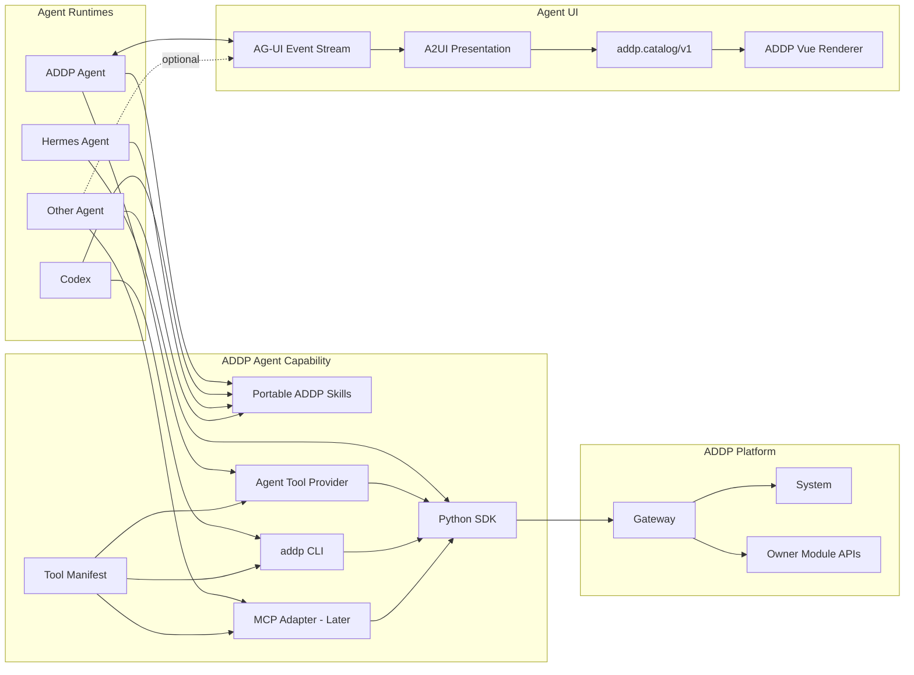

# ADDP 智能体能力开放体系专题

更新时间：2026-07-16

状态：已完成架构决策，进入分阶段实施。本文是实现期间的专题事实源；稳定概念同步进入术语表，完成实现后再将协议和开发约束拆入正式规范。

## 一、专题目标

ADDP 需要同时解决两个相互独立的问题：

1. 将 ADDP 的 Skill、Tool 和客户端能力从内置 Agent Runtime 中分离，使 Codex、Hermes Agent 等其他智能体也能使用 ADDP。
2. 完善 ADDP 内置 Agent 的多轮对话、流式运行、Tool 轨迹、澄清、审批以及 DAG、地图、表格等富交互界面。

本专题的目标不是选择一个唯一 Agent Framework，而是建立与 Agent Framework 解耦的能力层和交互协议。ADDP 内置 Agent 是官方提供的一种 Agent Runtime，不拥有平台级 Skill 和 Tool。

## 二、已确认的架构决策

以下结论已经确认，后续实现不再保留平行路线。

1. `Skill + Tool` 是 ADDP 面向智能体的能力模型。
2. Skill 是可复用的任务级知识与工作方法，不绑定单次业务案例、数据集或参数。
3. `workflow-analysis` 是合适的 Skill；“铁路占耕地面积计算”只是该 Skill 的评测场景。
4. Tool Manifest 是 AI Tool 契约事实源，owner 模块正式 API 是业务事实源。
5. Python SDK 是访问 ADDP API 的唯一客户端实现；CLI、内置 Agent Tool Provider 和后续 MCP Server 都是薄适配器。
6. 不新建中心 Tool 服务，不建立拥有第二套业务状态的 Tool Core。
7. ADDP 内置 Agent 直接调用 Python SDK，不通过 shell 调用 CLI。
8. Codex 等本地通用智能体优先调用 `addp` CLI；Python Agent 可以直接调用 SDK。
9. MCP 只作为后续 Tool Adapter，不作为第一阶段能力主线。
10. ADDP 内置 Agent 使用现有登录入口；外部 CLI 后续通过 OAuth Authorization Code + PKCE 登录，无浏览器环境使用 Device Authorization Flow。
11. ResultRef、Interaction 和 Presentation 分层；表现数据不能成为业务结果或审批状态的事实源。
12. AG-UI 是 Agent Runtime 与 Web 前端之间的统一事件协议。
13. A2UI 是 AG-UI 中的声明式表现协议，只负责安全地描述界面和用户动作。
14. A2UI 使用官方 `@a2ui/web_core`，建设 ADDP 自有 Vue Renderer 和版本化 Catalog。
15. 不采用 `@a2ui-vue/vue`；CopilotKit 作为 AG-UI、A2UI 和 Human-in-the-loop 的参考实现，不成为 ADDP 平台 Runtime。
16. 客户端不支持 ADDP A2UI Catalog 时，统一降级为文本摘要和 `open_url`，不为不同 Agent Framework 建立业务分支。

## 三、目标架构

ADDP 智能体开放体系分为“能力消费”和“Agent UI 接入”两个正交方向。



### 3.1 能力消费方向

唯一调用主线为：

```text
Agent Runtime
  -> Tool Adapter
  -> Python SDK
  -> Gateway / Owner Module Public API
  -> Owner Module Business Logic
```

约束如下：

- Skill 不直接访问数据库，不复制认证和 API Client。
- Adapter 不包含业务逻辑，只负责宿主协议、参数和输出转换。
- SDK 不维护任务、审批或业务结果状态。
- Tool 不绕过 Gateway 和 owner 模块正式 API。
- owner 模块继续拥有任务定义、execution、结果状态和审批事实。

### 3.2 Agent UI 接入方向

AG-UI 负责传输 Agent 运行过程，包括：

- run / step 生命周期；
- 文本流；
- Tool call；
- 状态快照和增量；
- 错误与取消；
- A2UI Activity。

A2UI 负责把 ResultRef 或 Interaction 投影成声明式 Surface。A2UI 消息通过独立 UI 通道进入 Renderer，不能作为大段 Tool Result 重新写回 LLM 上下文。

外部 Agent 只想调用 ADDP 能力时不需要实现 AG-UI；只有希望接入 ADDP Web 对话界面时才需要提供 AG-UI endpoint。

## 四、概念与责任边界

### 4.1 Agent Runtime

Agent Runtime 负责：

- 多轮对话和上下文管理；
- Skill 发现与按需加载；
- 规划、路由和 Tool 调用循环；
- run 的停止、恢复和重试；
- Agent 自身会话状态和记忆；
- AG-UI 事件输出。

Agent Runtime 不实现 ADDP owner 模块业务能力。

### 4.2 ADDP Skill

ADDP Skill 是可移植的任务级知识与工作方法，至少包含 `SKILL.md`，可以按需包含：

- `references/`：领域规范、参数说明和背景资料；
- `scripts/`：Skill 私有的确定性处理脚本；
- `assets/`：模板和展示资源；
- 运行时特定的可选展示元数据。

Skill 只引用稳定 Tool 名称，不引用 LangChain 类名、Agent 私有模块路径或某个 Agent Framework 展开后的工具名。

Skill 的唯一平台级落点为仓库根目录 `skills/`。原 `agent/backend/skills/` 已删除，不保留两套 Skill 事实源。

### 4.3 ADDP Tool 与 Tool Manifest

ADDP Tool 是面向智能体的稳定操作能力，不等同于任意一个 HTTP endpoint。Tool Manifest 至少声明：

- 稳定名称和版本；
- 用途与适用边界；
- 输入、输出 Schema；
- owner 模块和正式 API 映射；
- 权限和 scope；
- 风险等级；
- 幂等、超时和重试语义；
- 错误类型；
- 审计字段和输出上限。

Tool Manifest 是 AI Tool 契约事实源，但不自动生成或替代 Swagger。CI 负责校验 Tool Manifest 指向的正式 API 和 Schema 没有漂移。

### 4.4 Tool Adapter

Tool Adapter 把同一个 Tool Manifest 和 Python SDK 暴露给不同宿主：

- ADDP Agent Tool Provider；
- `addp` CLI；
- 后续 MCP Server。

Adapter 不能拥有第二套 HTTP Client、审批状态或结果状态。

### 4.5 ResultRef

ResultRef 是 Agent 消息对 owner 模块结果的稳定引用，不是新的全局 Artifact 实体。它至少表达：

```json
{
  "owner_module": "develop",
  "kind": "workflow",
  "ref": "workflow:123",
  "schema": "addp.result-ref/v1"
}
```

ResultRef 不复制 workflow、execution、数据项、地图图层或表格结果的完整业务事实。需要展示时由受信任客户端根据引用读取 owner 模块 API。

### 4.6 Interaction

Interaction 表达当前等待用户完成的动作，例如：

- clarification；
- approval；
- form；
- resource selection。

Interaction 必须具有稳定 ID、owner、状态、输入 Schema、创建时间和可选过期时间。

- 对话澄清可以由 Agent Runtime 持有。
- 涉及业务写入或破坏性操作的审批由对应 owner 模块持有并校验。
- 浏览器中的确认框或 Promise 只能改善交互体验，不能替代服务端 Interaction 状态。

### 4.7 Presentation

Presentation 描述 ResultRef 或 Interaction 如何显示。它是可重建投影，不是事实源。

```json
{
  "protocol": "a2ui",
  "catalog_id": "addp.catalog/v1",
  "surface_id": "surface:789",
  "open_url": "https://addp.example.com/develop/workflows/123"
}
```

一条 Agent 消息使用有序 `parts` 表达 text、result_ref、interaction_ref 和 presentation_ref，不再使用单一 `result_type + result_data`。

## 五、Skill 体系

### 5.1 Skill 粒度

Skill 应覆盖可复用能力域，不绑定某次任务、固定数据集或固定参数。

合适的 Skill：

- `workflow-analysis`；
- `data-discovery`；
- `data-preview`；
- `sql-analysis`；
- `knowledge-graph-exploration`。

不合适的 Skill：

- `railway-farmland-analysis`；
- `analyse-project-2026-07`；
- 只服务于某个固定表或某次交付的任务包。

铁路占耕地面积计算应进入评测场景，例如：

```text
evals/agent-scenarios/railway-farmland-area/
├── scenario.yaml
├── expected-behavior.md
└── fixtures/
```

### 5.2 渐进式加载

Skill 按以下层级加载：

1. 初始只发现 `name`、`description` 和位置。
2. 命中 Skill 后读取完整 `SKILL.md`。
3. 只有执行步骤需要时才读取指定 reference、script 说明或 asset。
4. Tool 大结果使用引用和摘要，不进入 Skill 正文。

### 5.3 Skill 与 Tool 的关系

Skill 的公共 front matter 只保留 `name` 和 `description`。ADDP Runtime 通过 `agents/addp.yaml` 声明依赖的稳定 Tool 名称；风险属于具体 Tool 和本次操作，不属于 Skill 本身。

```yaml
schema: addp.skill-runtime/v1
required_tools:
  - data.search
  - data.preview
  - workflow.operators.list
  - workflow.validate
  - workflow.run
  - execution.get
max_iterations: 8
```

## 六、Tool、SDK 与 CLI

### 6.1 单一实现关系

```text
Tool Manifest
  ├── ADDP Agent Tool Provider ─┐
  ├── addp CLI ─────────────────┼──> Python SDK ──> ADDP API
  └── MCP Adapter - Later ──────┘
```

Python SDK 是唯一远程 API 客户端实现。CLI 只负责：

- 参数解析；
- 调用 SDK；
- stdout 输出严格 JSON；
- stderr 输出日志和进度；
- NDJSON 输出流式事件；
- 稳定 exit code。

Tool Manifest 的唯一实现位置为 `common-python/addp_common/tools/manifest.json`，随 Python SDK 一起发布。Manifest 使用 `addp.tool-manifest/v1`，每个 Tool 必须声明稳定名称和版本、owner、风险与审批策略、输入输出 JSON Schema、认证与权限执行方、审计要求、输出限制、ResultRef 规则和稳定错误码。

CLI 最小正式入口为：

```text
addp tools list
addp tools get <tool-name>
addp tool call <tool-name> --arguments '<json>'
```

成功时 stdout 只输出 Tool 结果 JSON；失败时 stdout 输出标准错误 JSON、stderr 只输出诊断信息，并以非零稳定 exit code 结束。

### 6.2 第一批 Tool

第一批 Tool 控制在 8 至 12 个，先形成 workflow-analysis 的最小闭环：

| Tool | Owner | 风险 | 说明 |
| --- | --- | --- | --- |
| `engine.list` | System | read | 查询当前用户可使用的引擎实例。 |
| `data.search` | Manager / Meta | read | 搜索已有数据项并返回 locator。 |
| `resource.ancestors.get` | Meta | read | 校验 locator 并取得祖先链。 |
| `data.preview` | Manager | read | 返回受限行数、字段和内容的预览。 |
| `workflow.operators.list` | Develop | read | 查询 Public Operator Spec。 |
| `workflow.draft.generate` | Copilot | propose | 生成候选 workflow definition。 |
| `workflow.validate` | Develop | read | 校验 workflow definition。 |
| `workflow.run` | Develop | write | 创建 execution。 |
| `execution.get` | Monitor / owner | read | 查询执行状态和结果摘要。 |

owner 和 API 路径在实施前以对应模块正式文档和 Swagger 为准。

阶段 2 使用的正式校验 API 为 `POST /api/v1/develop/workflow-validations`。它只校验候选 definition，不创建 execution；执行仍唯一使用 `POST /api/v1/develop/executions`。

### 6.3 长任务与大结果

Tool 不同步等待长任务完成。标准流程为：

1. owner 模块创建 execution；
2. Tool 返回 `execution_id`；
3. Agent 查询或订阅 execution 状态；
4. 最终返回 ResultRef、locator 或 owner 模块结果引用。

Tool 输出必须有字段、行数和字节上限。地图要素、表格记录和完整 A2UI 组件树不直接作为 LLM Tool Result 返回。

## 七、AG-UI 与 A2UI

### 7.1 AG-UI

现有 Agent 自定义 `0:` 和 `dag:` 前缀只支持文本和 DAG，正式切换时由 AG-UI 一次性替代。新实现不保留兼容解析。

第一阶段使用以下 AG-UI 事件：

- `RUN_STARTED` / `RUN_FINISHED` / `RUN_ERROR`；
- `TEXT_MESSAGE_START` / `TEXT_MESSAGE_CONTENT` / `TEXT_MESSAGE_END`；
- `TOOL_CALL_START` / `TOOL_CALL_ARGS` / `TOOL_CALL_END`；
- `STATE_SNAPSHOT` / `STATE_DELTA`；
- A2UI Activity。

### 7.2 ADDP A2UI Catalog

ADDP 定义版本化 `addp.catalog/v1`，第一批组件为：

- `WorkflowDag`；
- `ClarificationChoice`；
- `ApprovalCard`；
- `ExecutionStatus`；
- `ResultLink`。

后续增加：

- `MapView`；
- `TablePreview`；
- `ResourcePicker`；
- `GraphView`。

Catalog props 只允许声明式数据、稳定引用和受限展示参数，不能包含函数、任意 API URL、脚本或未经验证的 HTML。

### 7.3 Vue Renderer

ADDP Vue Renderer 使用官方 `@a2ui/web_core/v0_9` 处理 Surface、组件更新、数据绑定和 action dispatch。ADDP 只实现 Vue 组件适配和 Catalog。

现有组件改造原则：

1. 业务组件不直接解析 A2UI JSON。
2. A2UI wrapper 把稳定 Catalog props 映射到现有组件 props / emits。
3. 大数据由 wrapper 根据 ResultRef 调 owner API 加载。
4. 组件统一使用 ADDP 主题变量和 i18n。
5. DAG Web Component 中的重复 G6 实现应删除，保留一份 Vue 组件核心。

### 7.4 客户端能力协商与降级

| 客户端能力 | 输出方式 |
| --- | --- |
| 支持 `addp.catalog/v1` | 原生渲染 ADDP DAG、地图、表格和交互组件。 |
| 只支持 A2UI Basic Catalog | 渲染基础文本、卡片和表单。 |
| 不支持 A2UI | 返回文本摘要、ResultRef 和 `open_url`。 |
| 纯 CLI | stdout 输出紧凑 JSON，必要时由 CLI 打开 ADDP 页面。 |

降级只改变 Presentation，不改变 Tool、ResultRef、Interaction 和 owner 模块业务路径。

## 八、认证、权限、审批与审计

### 8.1 内置 Agent

内置 Agent 继续通过 ADDP 登录入口使用。当前用户身份进入 Agent 后，由 System 签发或验证面向下游 owner 模块的短期受委托身份。长期目标至少包含：

- `user_id`；
- `tenant_id`；
- `delegated_by`；
- `audience`；
- `scope`；
- `expires_at`；
- 可选 `run_id` / `tool_call_id`。

### 8.2 外部 CLI

推荐登录流程：

```text
addp auth login
  -> 浏览器 Authorization Code + PKCE
  -> refresh token 写入 OS keychain
  -> 短期 access token 调用 ADDP

addp auth login --device
  -> Device Authorization Flow
```

外部智能体不得使用 `INTERNAL_API_KEY`。SDK 和 CLI 都是不可信客户端，权限与数据校验必须在 System 和 owner 模块服务端完成。

### 8.3 审批

客户端确认只负责 UX。write 和 destructive 操作必须由服务端返回稳定的 pending Interaction，例如：

```json
{
  "status": "approval_required",
  "interaction_id": "approval:456",
  "open_url": "https://addp.example.com/approvals/456"
}
```

真实执行前由 owner 模块校验审批状态、用户、租户、scope、过期时间和一次性使用约束。

### 8.4 审计

每次 Tool 调用至少关联：

- 用户和租户；
- Agent client 类型和实例；
- Skill 名称和版本；
- Tool 名称和版本；
- Agent run id / Tool call id；
- 输入、输出摘要；
- Interaction / approval 记录；
- owner request id / execution id；
- 状态、错误、耗时和成本摘要。

## 九、模块边界

| 能力 | Owner |
| --- | --- |
| 用户、租户、OAuth、委托身份、加密模型凭据 | System |
| 多轮对话、Agent run、对话澄清、AG-UI endpoint | Agent |
| SQL、工作流等专业对象生成 | Copilot |
| workflow definition、执行和结果 | Develop |
| 数据项事实、locator 和资源树 | Meta / Manager |
| execution 统一查询和观测 | Monitor |
| Python API Client、Tool Adapter 公共实现 | common-python |
| A2UI Vue Renderer、Catalog 和共享展示组件 | common-frontend |
| Skill 知识包 | 仓库根目录 `skills/` |

Agent 不复制 Copilot 生成逻辑；Copilot 不维护第二套用户对话；common-python 不成为远程 Tool 服务；common-frontend 不拥有 Result 或 Interaction 状态。

## 十、实施路线

### 阶段 0：文档与契约

1. 定稿本专题和平台术语。
2. 将 Skill 规范改为平台级规范。
3. 明确 PoC 文件和验收标准。
4. 后续 API 实施前修订认证、API 和 Swagger 正式规范。

### 阶段 1：AG-UI + A2UI 最小纵向验证

实施状态：已于 2026-07-15 完成最小纵向实现和自动化验证，后续扩展仍以本专题约束为准。

验证链路：

```text
FastAPI Agent
  -> AG-UI SSE
  -> Vue AG-UI Client
  -> A2UI MessageProcessor
  -> addp.catalog/v1
  -> WorkflowDag / ClarificationChoice
```

只验证：

1. 文本流；
2. Tool 进度；
3. DAG Surface；
4. 服务端持久澄清和恢复。

### 阶段 2：Skill + SDK + CLI 最小闭环

实施状态（2026-07-16）：最小闭环已完成。核心代码、自动化契约验证、真实 JWT 下的 CLI Tool 链路、ADDP Agent 结构化澄清、跨语言资源检索、正式 workflow 校验和 A2UI DAG 均已在线验收；全过程保持 design mode，未调用 `workflow.run`。Codex 独立进程的用户友好登录与完整接入归入阶段 4，不再作为阶段 2 的阻塞项。

1. 已建立根目录 `skills/workflow-analysis/`，公共 front matter 与 ADDP Runtime 装配分离。
2. 已建立 `addp.tool-manifest/v1` 和第一批 9 个 Tool。
3. 已实现 common-python `ToolExecutor`、缺失 Client 方法和请求/响应校验。
4. 已提供严格 JSON 的 `addp` CLI，并验证 wheel 携带 Manifest 与命令入口。
5. ADDP Agent 已切换到平台级 Skill 和 Manifest Adapter；真实服务已验证同一 Skill 所依赖的 CLI Tool 链路和内置 Agent 结构化澄清链路。Codex 独立进程接入待阶段 4 的外部登录能力完成后验收。

阶段 2 在线验收记录（2026-07-16）：

1. Gateway、System、Develop、Copilot 和 Agent 健康检查通过；Develop 已公开 `POST /workflow-validations`，Copilot workflow API 使用 Bearer JWT。
2. 使用真实登录 JWT 通过 `addp` CLI 成功调用 `engine.list`、`data.search`、`resource.ancestors.get`、`data.preview` 和 `workflow.operators.list`。
3. 在线发现多个工作流运行时；GeoPython 和 SuperMap 均具备 buffer、intersection/clip 和面积相关算子，因此 Runtime 不能静默选择运行时。
4. 首轮验收时数据搜索发现铁路与耕地均有多个候选。`public.railway` 的几何列为 `geom`，但当时 CRS 为空；`public.farmland` 的几何列为 `geometry`，CRS 为 EPSG:32650；另一个耕地候选 `public.dltb` 的几何列为 `SmGeometry`，CRS 为 EPSG:2360。这验证了 Skill 不得猜测 `geom`、CRS 或首个搜索结果。
5. ADDP Agent 首轮调用 `engine.list` 后，通过 Runtime 私有 `request_clarification` 创建持久 Interaction；AG-UI 以 interrupt 结束，A2UI 输出 `ClarificationChoice`。用户选择 GeoPython 后，原 Interaction 变为 `completed`，Agent 继续搜索数据并为铁路候选创建第二个 `pending` Interaction。
6. `request_clarification` 只用于 Agent run 的暂停控制，不进入 Tool Manifest，不代表 owner 模块业务能力；平台 Tool 与 Runtime 控制能力保持分离。
7. 最终契约切换后，CLI 通过 `workflow.draft.generate.resources[]` 提交铁路与耕地两个已验证 locator；在铁路 CRS 修复前，Copilot 在模型调用前返回 `need_clarification/resource_crs_required`，不生成 workflow，也未执行写操作。

阶段 2 最终收口记录（2026-07-16）：

1. 在业务 PostgreSQL 中将 `public.railway.geom` 从 `geometry(LineString)` 收敛为 `geometry(LineString,32650)`，只使用 `ST_SetSRID` 设置事实，不转换坐标；修改前后 166 行、extent 和坐标二进制校验和一致。随后通过 Manager 正式 API 对 item 60 完成深度扫描，Meta 已保存 `crs_ref=EPSG:32650`。
2. 使用真实 JWT 和 `addp` CLI 提交两个 `resources[]` 后，Copilot 生成 7 节点候选 DAG，Develop `workflow.validate` 返回 `valid=true`、零错误、零警告。
3. 内置 Agent 删除“draft 成功即展示 DAG”的旧路径；现在只有 `workflow.validate.valid=true` 才产生 `WorkflowDag` Presentation，校验失败或未校验均不展示。
4. `workflow-analysis` 增加通用跨语言资源检索方法：原始业务词不能召回目标数据项时，补充使用资源命名语言或常用技术名检索，转换词只用于搜索，不作为资源事实。中文需求在线验证触发 4 次搜索并召回 `public.railway` 与 `public.farmland`。
5. Agent Runtime 对结构化澄清增加 Tool 事实门禁：工作流引擎选项必须来自当前 run 的 `engine.list`，资源 locator 必须来自当前 run 的 `data.search`、`resource.ancestors.get` 或 `data.preview`；LLM 提供的标签和 candidate 不作为事实，Runtime 使用 owner Tool 返回值重建选项。未经观察的 locator 返回 `clarification_option_not_observed`，不能创建 Interaction。
6. 真实 Agent 会话完成 `engine.list -> data.search -> resource.ancestors.get -> data.preview -> workflow.operators.list -> workflow.draft.generate -> workflow.validate`，消息持久化为 text + A2UI `presentation_ref`；Vue 页面实际创建 `addp.catalog/v1` Surface，并渲染 7 节点 G6 Canvas。全过程没有 `workflow.run`。
7. 当前“已观察 Tool 事实”和“已确认选择”仍只存在于单次 ReAct run 内，Interaction 恢复后会重新发现；候选是否必须澄清仍部分依赖模型遵守 Skill。该边界进入阶段 3，由持久 run 状态和 Runtime 选择策略统一解决，不在阶段 2 建立临时兼容状态。

阶段 2 在线验收随后发现，Copilot 原工作流生成路径只接受单个 `DataSourceContext`，并会在 Agent 已完成数据发现后再次搜索资源。该路径无法表达铁路与耕地等多输入工作流，还会把第二个已确认 locator 判为未验证资源。现决定 clean break 为唯一契约：

```json
{
  "query": "计算铁路两侧 50 米范围内占用的耕地面积",
  "workflow_engine_id": 20,
  "resources": [
    {
      "role": "railway",
      "locator": "addp://engine/8/path/public/railway?type=table&item_id=60",
      "geometry_column": "geom",
      "crs": "EPSG:32650"
    },
    {
      "role": "farmland",
      "locator": "addp://engine/8/path/public/farmland?type=table&item_id=55",
      "geometry_column": "geometry",
      "crs": "EPSG:32650"
    }
  ]
}
```

- `resources[]` 只接收已由 `resource.ancestors.get`、`data.preview` 等 owner Tool 验证的事实。
- Copilot 不再调用 Manager 搜索或推断资源身份，只负责算子选择、候选 DAG 生成和内部结构验证。
- workflow 中所有 load locator 必须属于 `resources[]`；生成器不得新增 locator。
- `resources[]` 缺失或关键事实不足时返回结构化澄清，不建立 query-only 兼容路径。

### 阶段 3：内置 Agent 运行时完善

阶段 1 已提前完成 AG-UI、message parts、Interaction、统一 Renderer、私有 API Client 和旧流解析的正式切换。阶段 3 继续：

1. 建立可查询、可审计的 run 持久模型和完整生命周期，持久化已观察 Tool 事实、已确认选择和待处理步骤，使 Interaction 恢复后继续原 run，而不是重新发现；
2. 增加停止、断线重连和失败重试；
3. 将业务结果统一收敛为 ResultRef，并从 owner API 按需加载；
4. 补齐运行指标、错误归因和上下文压缩策略。

#### 阶段 3.1：AgentRun 与语义检查点决策

实施状态（2026-07-16）：已完成模型、数据库 clean break、Runtime 事实检查点、Interaction 恢复、步骤审计、查询 API、31 项自动化测试和真实在线恢复验收。

AgentRun 是 Agent 模块拥有的逻辑运行，不等同于一次 HTTP/SSE 连接、一次 LLM 调用或 Develop 等 owner 模块的 execution。一次 AgentRun 可以跨越初始 AG-UI 调用和若干次 Interaction resume 调用。

唯一恢复路线为语义检查点，不保存框架进程内 checkpoint 双轨：

```text
session history + Skill
  + checkpoint.observed owner facts
  + checkpoint.confirmed user selections
  + pending/completed Interaction
  -> rebuild one Agent Runtime invocation
  -> continue the same AgentRun
```

AgentCheckpoint 使用 `addp.agent-checkpoint/v1`，只允许保存：

- `observed.workflow_engines`：本 run 的 `engine.list` 返回并压缩后的工作流引擎事实；
- `observed.resources`：本 run 的 `data.search`、`resource.ancestors.get`、`data.preview` 返回并压缩后的 locator 事实；
- `confirmed.workflow_engine`：用户明确选择的工作流引擎事实；
- `confirmed.resources`：用户明确选择的资源事实；
- 当前恢复所需的稳定控制字段。

不得保存：

- 模型隐藏推理或 chain-of-thought；
- LangChain / LangGraph 私有内存对象；
- 未经 Tool 验证的 LLM 候选；
- 完整表格、地图要素、长日志或未经限制的 Tool 原始结果。

数据模型固定为：

| 表 | 责任 |
| --- | --- |
| `agent.runs` | AgentRun 身份、session/user/tenant、初始协议 run id、生命周期、Skill、AgentCheckpoint、错误和时间。 |
| `agent.run_steps` | Tool / Runtime 步骤序号、稳定名称、输入、状态、受限输出摘要、事实投影和时间。 |
| `agent.interactions` | 通过 `agent_run_id` 关联 AgentRun；原字符串 `run_id` 删除，不保留双轨。 |

生命周期唯一取值为：

```text
running -> waiting -> running -> completed
   |          |          |
   +----------+----------+-> failed / cancelled
```

恢复规则：

1. 新用户消息创建新 AgentRun。
2. resume 必须只关联同一用户、租户、会话和 AgentRun 的 pending Interaction。
3. Interaction 完成与 confirmed checkpoint 更新在同一数据库事务中完成。
4. 恢复后的新 AG-UI 调用不创建第二个 AgentRun；协议 `runId` 只作为本次传输调用标识记录。
5. run waiting 前必须先持久化当前 checkpoint；恢复后事实门禁直接消费该 checkpoint，不重新信任 LLM 复述。
6. 首阶段只实现 run/step/checkpoint 与 Interaction 恢复；事件重放、取消和失败重试继续在同一模型上扩展，不建立旁路状态表。

阶段 3.1 在线验收记录：

1. 新建 `agent.runs` 和 `agent.run_steps`；`agent.interactions.run_id` 已删除，唯一关联字段为非空 UUID `agent_run_id`，并建立到 `agent.runs` 的外键。
2. Agent Factory 把 `engine.list`、`data.search`、`resource.ancestors.get` 和 `data.preview` 的紧凑 owner 事实写入 `addp.agent-checkpoint/v1`；preview 只保存字段、几何列、CRS、总数等事实，不保存样本行。
3. Interaction 回答只接受持久 options 中存在的 value；服务端忽略客户端提交的 label / candidate，并使用持久化规范选项更新 confirmed checkpoint。
4. 真实会话首个 AG-UI 调用产生运行时澄清，AgentRun 状态由 `running` 进入 `waiting`；第二个 resume 调用恢复同一 AgentRun，状态由 `waiting` 回到 `running` 并最终 `completed`。
5. 两次协议调用只生成一条 `agent.runs` 记录，15 个 Tool step 通过不同 `protocol_invocation_id` 归入同一 run；恢复后没有重复调用 `engine.list`，confirmed workflow engine 为 owner Tool 返回的 GeoPython 事实。
6. 新增 `GET /api/v1/agent/runs/{agent_run_id}`，按当前用户和租户返回 run、checkpoint 和受限 step 审计；Agent OpenAPI 已包含 BearerAuth、双语摘要和 `x-ai-hint`。
7. `run_steps.output_summary` 不保存 Tool 原始结果：合法 JSON 只提取状态、计数和结果字节数等白名单摘要；过长结果被 Runtime 截断为非 JSON 后，只记录 `value_type` 与 `result_size_bytes`，不得回退保存原文前缀；owner 事实单独进入 `facts`。
8. 最终安全摘要在线复验中，一个 AgentRun 跨两个协议调用保持同一 UUID；恢复后真实执行 `data.search`、`resource.ancestors.get`、`data.preview` 等 Tool，所有截断结果摘要均只有类型和字节数，不包含 locator、样本行或完整元数据。

#### 阶段 3.2：事件重放、取消与失败重试决策

阶段 3.2 继续沿用 AgentRun 的单一生命周期，不建立连接级状态、框架 checkpoint 或 owner execution 的旁路模型。

1. 新增 `agent.run_events`。每条事件以 `(agent_run_id, sequence)` 唯一排序，记录可安全重放的 AG-UI 事件投影和所属协议调用 ID。它是客户端状态重建记录，不是 Tool 原始日志。
2. `AgentRunEvent` 只允许持久化 `RUN_STARTED`、`STATE_SNAPSHOT`、文本、Tool 开始/结束进度、A2UI Activity、`RUN_FINISHED` 和 `RUN_ERROR`。Tool 参数事件不进入事件表；Tool 结果事件只保存与 `run_steps.output_summary` 一致的受限提示，不能保存原始 content。
3. `GET /api/v1/agent/runs/{agent_run_id}/events?after=<sequence>` 按当前用户和租户隔离，以 SSE 回放 sequence 大于游标的事件。客户端断线后以最后已处理 sequence 继续，不重新调用模型或 Tool。
4. `POST /api/v1/agent/runs/{agent_run_id}/cancel` 只允许取消 `running` 或 `waiting` 的 AgentRun：取消本 Agent 进程内的 Runtime 调用、关闭 pending Interaction，并写入终止事件。它绝不取消已经提交给 owner 模块的 execution。
5. `POST /api/v1/agent/runs/{agent_run_id}/retry` 只允许失败的 AgentRun 重建一次新的 Runtime 调用；它保留同一 AgentRun、checkpoint、step 和事件序列，以新的协议调用 ID 追加事件，不新建 run。取消态是终态，不提供 retry 旁路。
6. Agent 进程内的活跃调用注册表只负责本实例的取消和实时订阅；持久事实始终是 AgentRun、AgentRunEvent、AgentRunStep、Interaction 和 AgentCheckpoint。跨实例调度不在本阶段引入第二套持久队列。

阶段 3.2 的状态补充为：

```text
running --cancel--> cancelled
waiting --cancel--> cancelled
failed --retry--> running
```

`cancelled` 和 `completed` 都是终态；`retry` 不是复制或克隆 AgentRun。

实施状态（2026-07-16）：已完成 `AgentRunEvent` 表、sequence + SSE `id`、安全事件重放、取消 API、失败重试 API、内置 Agent 前端停止/重试操作、37 项后端自动化测试、5 项前端测试和在线事件回放/取消验收。

阶段 3.2 在线验收记录：

1. 一次真实 AG-UI 调用在 `agent.run_events` 生成 9 条连续 sequence，实时 SSE 与重放 SSE 都带相同 `id`；`after=0` 可重建运行时、Tool 进度和 A2UI 澄清 Surface。
2. 回放流不包含 `TOOL_CALL_ARGS`；`TOOL_CALL_RESULT` 的原始 content 被固定受限提示替换，Tool 参数和原始结果不进入事件表。
3. 对 waiting Run 调用 cancel 后，pending Interaction 进入 `cancelled`，AgentRun 进入 `cancelled`，并追加 `STATE_SNAPSHOT(cancelled)` 和 `RUN_ERROR(code=cancelled)`；`after=9` 只回放这两个新增事件。
4. retry 仅接受 `failed` AgentRun，复用其 UUID、checkpoint、step 与 event sequence，以新的协议调用 ID 追加事件；取消态被服务端拒绝重试。

#### 阶段 3.3：ResultRef 与客户端断线恢复决策

1. ResultRef 的产生完全由 Tool Manifest 的 `result_ref` 声明驱动。当前第一条正式结果路径只实现 `result_ref.mode=execution`：`workflow.run` 和 `execution.get` 返回合法 `execution_id` 时，Agent 追加 `{schema:"addp.result-ref/v1", owner_module:"develop", kind:"execution", ref:"execution:<id>"}` message part。
2. `data.search`、`data.preview` 和 locator 类 Tool 的输出仍是 AgentCheckpoint 所需的 owner 事实或候选，不因 Manifest 的 locator 模式自动成为用户业务结果；没有单一 owner 结果身份时不得创建 ResultRef。
3. Agent 不持久化 execution 状态、工作流定义、结果表或地图要素。内置 Web 客户端仅根据 execution ResultRef 以当前用户 JWT 调用 Develop 的 `GET /api/v1/develop/executions/{execution_id}`，按需展示受 owner 权限保护的状态摘要。
4. Web 客户端发生 AG-UI 传输错误且已收到 `agentRunId` 时，只调用 `GET /api/v1/agent/runs/{agent_run_id}/events?after=0` 回放安全事件以重建当前界面；不重新提交用户消息、resume 或 Tool 调用。首版从 sequence 0 重建，避免依赖第三方 AG-UI Client 未暴露的 SSE id。
5. ResultRef 是消息事实，A2UI 是表现投影；事件重放可以重建文本、Tool 进度和 Presentation，但不成为 execution 或 owner 结果的事实源。

实施状态（2026-07-16）：已完成 Manifest 驱动的 Develop execution ResultRef、消息 parts 持久化、owner API 按需状态组件，以及 Web 客户端 AG-UI 传输错误后的安全事件重建；40 项后端测试、6 项前端测试和前端生产构建通过。

阶段 3.3 在线验收记录：

1. 使用既有 Develop execution 执行只读 `execution.get`，未触发 workflow.run、取消或重试；assistant message 同时保存文本 part 和 `{schema:"addp.result-ref/v1", owner_module:"develop", kind:"execution", ref:"execution:<id>"}`。
2. execution ResultRef 不包含 status、进度、时间或结果数据；前端组件使用当前用户认证按需读取 Develop owner API。
3. 客户端回放解析支持 SSE sequence、流尾无额外空行和认证刷新；传输异常后从 sequence 0 重建临时消息，不重复提交 Agent 输入。

#### 阶段 3.4：运行指标、错误归因与上下文预算决策

1. AgentRun 的指标直接保存在 `agent.runs.metrics`，由现有 step 和 event 事实计算，至少包含协议调用数、step 数、失败 step 数、事件数、文本字符数和运行时长。当前模型调用链无法对所有 Provider 稳定取得 token usage 时，不估算或伪造 token 数。
2. `agent.runs.context_metrics` 保存本次 Runtime 重建使用的上下文预算事实：输入消息数、选入消息数、遗漏消息数、截断消息数、消息字符数、摘要字符数和预算上限；不保存第二份消息正文。
3. 上下文使用唯一预算策略：最多 20 条最近消息、单条最多 6000 字符、消息正文总计最多 24000 字符、历史摘要最多 2000 字符。预算从最新消息向前分配，确保当前用户目标优先进入 Runtime。
4. `agent.sessions.summary_message_id` 是已压缩早期消息水位。摘要只组合已有摘要与水位之后、最近窗口之前的新消息，不再每次重复压缩全部早期历史；LLM 调用期间不持有数据库事务。
5. 错误归因统一为 `error_source=client|runtime|tool|owner|protocol`、稳定 `error_code` 和最多 1000 字符的受限 message。`error_type` 删除，不保留双字段兼容。Tool 的 owner API 错误归到 owner，参数/结果限制等 Tool 契约错误归到 tool，未经观察的澄清或 Runtime 异常归到 runtime。
6. Run API 直接返回 metrics、context_metrics、error_source 和 error_code；Monitor 若后续消费，只能读取这些 Agent owner 事实，不读取 LangChain 私有对象或日志反推状态。

实施状态（2026-07-16）：已完成 Run 结构指标、上下文预算指标、增量摘要水位、统一错误归因和数据库 clean break；48 项后端自动化测试通过。

阶段 3.4 在线验收记录：

1. Agent 启动迁移已创建 `agent.runs.metrics` / `context_metrics`、run/step `error_source` / `error_code` 和 `agent.sessions.summary_message_id`；旧 `agent.runs.error_type` 已删除。
2. 使用真实 JWT 创建临时会话，只读查询既有 Develop execution，没有调用 `workflow.run`；AgentRun 完成后仅有 1 个 `execution.get` step，临时会话随后删除。
3. 该 Run 实测得到 `protocol_invocation_count=1`、`step_count=1`、`failed_step_count=0`、`event_count=9`、`text_character_count=246` 和 `duration_ms=8192`，证明 PostgreSQL 时间字段可正常计算时长。
4. 上下文指标实测记录 1 条输入消息、70 个消息字符和全部四项预算上限；Run 和正常 step 的 `error_source` / `error_code` 均为 null，API 不再返回 `error_type`。
5. owner 错误 envelope 归因为 `owner/owner_api_unavailable`、Tool Adapter 异常归因为 `runtime/tool_adapter_exception` 由自动化测试覆盖；在线验收未为制造故障而停止 owner 服务。
6. 增量摘要纯逻辑测试已验证：水位第一次推进后，第二次只选取新增的早期消息，不重复压缩旧消息。

### 阶段 4：认证与外部 Agent

#### 阶段 4.1：统一授权上下文

1. System 提供权威 `GET /api/v1/system/auth/context`，在解析 Token 后回查当前用户、租户和激活状态。
2. `common/middleware/auth` 和 `common-python/addp_common/auth.py` 使用同一 AuthContext 契约，Go/Python 模块不再通过 `/users/me` 推断令牌身份。
3. Agent 删除私有 HS256 JWT 解析和 `JWT_SECRET` 依赖；当前用户 Token 继续原样传给 Tool Adapter。
4. AuthContext 固定用户、租户、`user_type`、客户端、audience、Scope、委托和有效期字段；第一方 JWT 在 OAuth 签发切换前不伪造客户端或 Scope。

实施状态（2026-07-16）：已完成。

1. `system.users` / `system.tenants` 已成为用户、租户和账号状态的唯一事实源；System 在登录、当前请求和现有刷新入口中统一校验用户与租户当前状态。
2. Go 业务模块统一通过 `common/middleware/auth` 调用 `/auth/context`；Redis Key 使用 Token SHA-256，缓存时间不超过 Access Token 剩余有效期，过期 AuthContext 会被拒绝并删除。
3. Python 业务模块统一通过 `common-python` 的 `resolve_authorization_context()` 获取不可变 AuthContext；Agent 私有 JWT 解析器、`JWT_SECRET` 配置和 `python-jose` 依赖已删除，Copilot 同步迁移。
4. `/users/me` 仅保留为前端当前用户资料接口；Common Go、Common Python、Agent 和 Copilot 不再把它作为 Token 验证接口。
5. 共享配置和业务模块中的 `jwt_secret` / `JWTSecret` 已删除；Go 静态搜索确认签名密钥只由 System 的签发、刷新和解析代码读取。
6. System Swagger 已包含 `/auth/context`、BearerAuth 和完整 AuthorizationContext schema，并增加合同测试防止接口漂移。

阶段 4.1 自动化验证：

- `common`：`go test ./...` 通过，包含 AuthContext endpoint、Redis TTL 上限和过期缓存删除测试。
- `system/backend`：使用项目 PostgreSQL 环境执行 `go test ./...` 通过，包含 AuthContext 用户/租户状态校验和 Swagger 合同测试。
- `develop/backend`：`go test ./...` 通过。
- `common-python`：35 项测试通过。
- `agent/backend`：51 项测试通过。
- `copilot/backend`：24 项测试通过。

阶段 4.1 在线验收记录：

1. 使用真实 `admin` 登录 Token 调用 System `/auth/context` 返回 200，`subject_type=user`、用户/租户/`user_type` 与当前数据库一致，`auth_type=first_party_access_token`，客户端、委托和 Agent 审计绑定为空，audience / Scope 为空数组。
2. 同一 Token 调用 Meta `/api/v1/meta/stats` 返回 200；Redis 从无缓存变为存在 `auth:context:<sha256>`，TTL 为 300 秒，证明运行中的 Go 公共中间件已使用 AuthContext 主路径。
3. 同一 Token 调用 Agent `/api/v1/agent/sessions` 和 Develop `/api/v1/develop/workflow-engines` 均返回 200，证明 Python 与 Go 业务模块可以消费同一授权上下文。
4. 在线验收仅执行登录和只读查询，没有触发 `workflow.run` 或任何写入、破坏性 Tool。

#### 阶段 4.2：OAuth 登录与刷新令牌

1. System 实现 Authorization Code + PKCE 和 Device Authorization Flow。
2. 建立 OAuth Client、授权码、Device Code 和 Refresh Token Family 模型，不复用 `applications/api_keys`。
3. Refresh Token 仅保存 Hash，每次刷新轮换；检测到旧 Token 重用时撤销整个 family。
4. CLI 使用 OS Keychain 保存 Refresh Token，短期 Access Token 调用 ADDP。

#### 阶段 4.3：外部 Agent 与受委托执行

1. 使用 Codex 和 Hermes Agent 验证 CLI / SDK 登录、Scope 和租户隔离。
2. System 增加绑定 audience、Scope、AgentRun / ToolCall 的短期受委托令牌。
3. owner 模块完成写入/破坏性操作的服务端审批闭环和完整审计。

### 阶段 5：扩展与评测

1. 增加地图、表格、资源选择和图谱组件。
2. 建设铁路占耕地面积等评测场景。
3. SDK 和 Manifest 稳定后验证 MCP Adapter。
4. 在有明确价值和隔离模型后再引入受限多智能体委派。

## 十一、PoC 文件级实施清单

以下是阶段 1 已落地的文件级主路径，不保留候选双轨。

### 11.1 Agent Backend

| 文件 | 变更 |
| --- | --- |
| `agent/backend/api/chat.py` | 唯一 AG-UI SSE endpoint；转换标准生命周期、文本、Tool、Activity 和 interrupt 事件。 |
| `agent/backend/agents/events.py` | Agent Runtime 内部结构化事件，不向前端暴露私有流格式。 |
| `agent/backend/protocol/a2ui.py` | 生成 `addp.catalog/v1` 的 A2UI Surface。 |
| `agent/backend/services/interactions.py` | 创建、读取和完成服务端 clarification。 |
| `agent/backend/models/interaction.py` | 保存 Interaction ID、owner、状态、Schema 和答案。 |
| `agent/backend/models/run.py` | 保存 AgentRun 身份、生命周期和语义检查点。 |
| `agent/backend/models/run_step.py` | 保存 Tool / Runtime 步骤审计和事实投影。 |
| `agent/backend/models/run_event.py` | 保存可按 sequence 安全回放的 AG-UI 事件投影。 |
| `agent/backend/agents/checkpoint.py` | 规范化、压缩、确认和恢复 `addp.agent-checkpoint/v1`。 |
| `agent/backend/agents/result_refs.py` | 按 Tool Manifest 将受支持的单一 owner 结果转换为 `addp.result-ref/v1`。 |
| `agent/backend/agents/context.py` | 按最新消息优先的唯一预算策略构建 Runtime 上下文并输出指标。 |
| `agent/backend/services/runs.py` | AgentRun 状态转换、恢复、step、审计摘要和结构运行指标。 |
| `agent/backend/services/run_events.py` | 过滤、持久化和编码安全的 AG-UI 事件回放。 |
| `agent/backend/services/runtime.py` | 管理当前 Agent 进程内 Runtime 取消信号。 |
| `agent/backend/utils/summary.py` | 按 `summary_message_id` 水位增量合并早期历史，LLM 调用期间不持有数据库事务。 |
| `agent/backend/api/runs.py` | 当前用户可查询的 AgentRun 详情 API。 |
| `agent/backend/tests/test_ag_ui_protocol.py` | 验证 AG-UI 输入、SSE、OpenAPI 和 A2UI 契约。 |
| `agent/backend/tests/test_agent_factory_events.py` | 验证 Tool 与 clarification 结构化事件。 |
| `agent/backend/tests/test_interactions.py` | 验证澄清持久字段、身份隔离、恢复和重复提交拒绝。 |
| `agent/backend/tests/test_run_events.py` | 验证事件 sequence、SSE id、Tool 参数排除和 Tool 结果脱敏。 |
| `agent/backend/tests/test_result_refs.py` | 验证 execution ResultRef 和 locator 候选不被误升级。 |
| `agent/backend/tests/test_context.py` | 验证最新优先、单消息/总字符上限、摘要截断和可观测指标。 |
| `agent/backend/tests/test_summary.py` | 验证增量摘要水位只向前推进，不重复压缩已摘要消息。 |

`agent/backend/api/chat.py` 中 `0:` / `dag:` 输出和旧前端解析已删除，不保留旧 endpoint 的兼容分支。

### 11.2 Common Frontend

| 文件 | 变更 |
| --- | --- |
| `common-frontend/agent-ui/package.json` | 声明 Vue 和官方 A2UI Core 依赖。 |
| `common-frontend/agent-ui/src/a2ui/A2UISurface.vue` | 渲染 A2UI Surface。 |
| `common-frontend/agent-ui/src/a2ui/catalog.js` | 注册 `addp.catalog/v1`。 |
| `common-frontend/agent-ui/src/a2ui/components/WorkflowDag.vue` | 映射到共享 DAGViewer。 |
| `common-frontend/agent-ui/src/a2ui/components/ClarificationChoice.vue` | 提交 Interaction 答案。 |
| `common-frontend/agent-ui/tests/a2uiRenderer.test.js` | 验证 Catalog、未知组件和 action dispatch。 |
| `common-frontend/basic/src/composables/useAuth.js` | 为 AG-UI 等 Fetch 流提供统一 JWT 注入、刷新和单次重试。 |

### 11.3 Agent Frontend

| 文件 | 变更 |
| --- | --- |
| `agent/frontend/src/agent/createAgentClient.js` | 创建使用共享认证 Fetch 的 AG-UI Client。 |
| `agent/frontend/src/views/ChatView.vue` | 消费 AG-UI 消息和 Activity，提供 AgentRun 停止与失败重试操作，不再判断 `result_type === 'dag'`。 |
| `agent/frontend/src/components/MessagePartsRenderer.vue` | 按顺序渲染文本、结果引用、Interaction 和 Presentation。 |
| `agent/frontend/src/components/ExecutionResultRef.vue` | 根据 Develop execution ResultRef 按需读取 owner 状态并打开执行详情。 |
| `agent/frontend/tests/aguiClient.test.js` | 验证标准 RunAgentInput、JWT 注入、刷新和重试。 |

### 11.4 PoC 验收标准

1. 同一 run 中按顺序显示文本、Tool 进度和 DAG。
2. A2UI Surface 不进入 LLM 上下文。
3. clarification 持久化，页面刷新后仍可回答并继续 run。
4. 未授权用户不能读取或完成其他用户的 Interaction。
5. 未注册 A2UI 组件不能执行。
6. 不支持 A2UI 时返回文本摘要、ResultRef 和 `open_url`。
7. 正式切换后仓库中不存在 `0:` / `dag:` 兼容解析。

阶段 1 的内置 Web 客户端必然支持 `addp.catalog/v1`，因此本轮验收 1—5、7；第 6 项属于外部 AG-UI 客户端接入前的跨客户端降级验收，不建立第二套 Agent 业务路径。

## 十二、端到端评测场景

铁路占耕地面积计算作为 `workflow-analysis` 的评测场景：

```text
用户提出铁路缓冲范围内耕地面积分析
  -> 加载 workflow-analysis Skill
  -> data.search 查找铁路与耕地数据
  -> 候选不唯一时创建 clarification
  -> data.preview 确认字段与空间能力
  -> workflow.draft.generate 生成候选 DAG
  -> workflow.validate 验证 Public Operator Spec
  -> A2UI 展示 DAG 和关键参数
  -> owner 模块创建 approval
  -> workflow.run 创建 execution
  -> execution.get 跟踪状态
  -> 返回面积摘要、地图和结果数据 ResultRef
```

验收要求：

1. ADDP Agent 和 Codex 使用同一个 `workflow-analysis` Skill。
2. 两个运行时通过相同 SDK 和 owner 模块 API 执行。
3. 全流程不猜测 locator、引擎、字段名或空间字段名。
4. 写操作有服务端审批记录。
5. 长任务进入统一 execution 体系。
6. 大数据不进入模型上下文。
7. 支持 A2UI 的客户端显示 DAG、地图和表格；不支持时可以打开 ADDP 页面。

## 十三、外部参考与采用结论

- [Agent Skills Specification](https://agentskills.io/specification)：采用渐进式 Skill 包结构和按需加载思想。
- [Codex Skills](https://codexdown.cc/docs/configuration/skills/)：作为外部 Agent 消费 ADDP Skill 的主要参考。
- [Hermes Agent](https://github.com/NousResearch/hermes-agent)：作为可替换 Agent Runtime 和本地 Tool 消费参考。
- [AG-UI](https://docs.ag-ui.com/)：采用为 Agent 与前端之间的事件协议。
- [A2UI](https://a2ui.org/)：采用为声明式表现协议。
- [`@a2ui/web_core`](https://www.npmjs.com/package/@a2ui/web_core)：采用为 A2UI 官方框架无关核心。
- [`@a2ui-vue/vue`](https://www.npmjs.com/package/@a2ui-vue/vue)：不采用，原因包括早期版本、发布包类型缺失、旧协议消息和不必要依赖。
- [CopilotKit](https://github.com/CopilotKit/CopilotKit)：参考其 AG-UI、Vue A2UI、Tool Renderer 和 Human-in-the-loop 设计；不采用其 Runtime 作为 ADDP 平台事实源。

## 十四、相关 ADDP 文档

- `docs/concepts/addp术语表.md`
- `docs/concepts/addp模块架构图.md`
- `docs/concepts/addp共享模块介绍.md`
- `docs/skills/addp-Skill规范.md`
- `docs/spec/addp-API设计规范.md`
- `docs/spec/addp登录认证的统一要求.md`
- `docs/concepts/addp登录认证的原理说明.md`
- `agent/CLAUDE.md`
- `common-python/CLAUDE.md`
- `common-frontend/README.md`
- `docs/plan/铁路占耕地面积计算-AI自动化实验.md`
