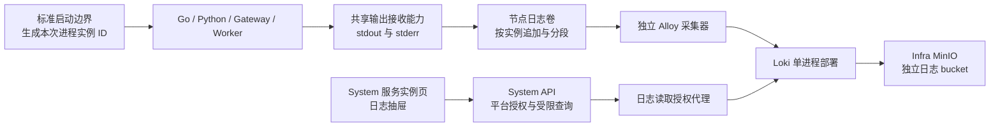

# ADDP 模块服务运行日志设计

状态：首版实现及本轮 T0-T3 对应门禁已完成（2026-10-01），本机服务与日志 Infra 已重启并核对。首版允许明确缺口；未验证的完整删除周期、多节点及 T4 范围见第十节。

## 一、目标和范围

运维人员从 System 的“模块管理 → 服务实例”中选中一个实例，查看它的启动信息、运行输出和异常堆栈。实例离线或模块重启后，仍可查到保留期内已经进入日志存储的旧实例日志。

用户已同意 Alloy 采集、Loki 存储和 System 平台查看入口。本稿补充日志来源、实例关联、基础设施和可靠性边界。

首版覆盖模块注册体系中的 Backend、Worker、Scheduler 和 Gateway 入口实例，包含 Go 与 Python 服务。操作审计、任务执行记录继续使用各自的事实源。工作流引擎运行时、数据库等 Infra、前端浏览器日志暂不纳入本入口，不能按模块实例冒充其身份。

首版面向故障排查，不承诺日志完整归档、零丢失或存储高可用。若这些是必需条件，应先调整可靠性设计，再实施。

## 二、实施前基础与首版改动

| 项目 | 实施前已核对的事实 | 首版改动 |
| --- | --- | --- |
| 功能归属 | System 拥有模块登记和平台实例查询；既有日志领域是操作审计 | System 新增运行日志查询能力，正文存入 Loki，不写 `system.audit_logs` |
| 日志输出 | Go 默认写模块文件；开发脚本还重定向 stdout/stderr；Python Agent 有文件与流 Handler | 收敛应用输出，按进程实例保存，避免重复采集 |
| 重启保留 | 开发脚本部分固定文件使用 `>`，可能覆盖旧输出 | 新实例使用新目录，旧实例保留到清理期限 |
| 实例关联 | Go/Python 登记代码内部生成实例 ID，日志没有统一复用该身份 | 身份在进程启动边界产生，贯通登记、健康响应和输出 |
| 集中存储 | 当前 Infra 没有配置 Alloy/Loki | 纳入标准 Infra 生命周期，持久保存位置、WAL 和清理状态 |
| 对象存储 | 当前 Infra MinIO 已有持久卷 | 建议复用，独立日志 bucket 和账号；实际读写与清理仍须验证 |
| 权限 | 已有 `platform.module.read/update`，没有运行日志读取权限 | 独立 Permission，按 Platform Context 授权 |

现有机器可以用于开发部署和隔离集成验证；日志每日增量、查询并发、背压及磁盘容量尚未测量。此前需要专用 Runner 的真实进程故障验收仍是未验证项，不能由日志设计稿代替。

## 三、架构和职责



| 所有者 | 职责 |
| --- | --- |
| `common/`、`common-python/` | 统一进程身份消费契约、结构化应用日志；共享输出接收能力由 `common/` 提供，Go/Python 不各写一套接收器 |
| 标准开发启动脚本、容器入口 | 创建启动身份、连接输出接收能力、记录实际业务进程 PID，并维持原有停止与信号语义 |
| Infra | Alloy/Loki、日志卷、MinIO bucket、轮转与清理、网络和链路健康检查 |
| System | 核验模块实例身份、读取权限、查询参数及结果；提供前端入口 |
| Monitor | 保持现有执行监控、健康和告警职责；本次不增加远程读文件能力 |

本地开发和 Docker 均使用“受控实例文件 → Alloy → Loki → System”这一条主路径。Docker 将日志目录挂入专用持久卷，采集器只读挂载日志源，不需要获得 Docker Socket。System 不连接业务节点读取文件。

日志采集与业务服务生命周期分离。停止或重启 ADDP 应用不停止日志 Infra，不删除日志卷。日志设施是否可用不加入业务模块 Ready 的前置条件。

## 四、日志如何准确归属于实例

### 4.1 在启动边界产生身份

标准启动入口在创建每个业务进程之前生成一次 `instance_id`，将它传给共享输出接收能力和应用。登记客户端、健康响应及应用日志只能消费这个身份，不再各自生成 UUID。同一进程重新登记保留身份；真正重启产生新身份。

每个独立 Worker/Scheduler 进程有自己的身份。Python 多进程部署必须逐个启动和登记，不能让多个子进程继承同一实例 ID。日志接收进程本身不是业务实例，也不进入模块在线数量。

Worker 的任务执行租约 owner 与模块登记的进程身份分别服务于执行领取和运行观测；登记只能消费共享进程身份，不能直接用执行器自行生成的 Worker ID 替代。

进程启动时间仍由实际业务进程的共享启动事实提供；不把接收器或启动脚本的时间替换为业务进程启动时间。身份和启动时间契约将在确认后同步到生命周期规范。

接收器在业务程序运行前建立输出通道，因此能关联解释器错误、初始化失败和登记之前的输出。应用始终未登记成功时，System 没有对应实例行：首版会保留这些启动输出，但暂通过节点运维工具排查，不新增“启动尝试”实体或虚构在线实例。是否需要页面上的“未登记启动失败”入口，单独讨论。

### 4.2 统一输出和保存

Go/Python 应用日志统一输出 JSON 到 stdout，取消应用文件 Handler 与固定模块文件双写。stderr 和第三方普通文本同样由接收器捕获。接收器为输出补齐可信实例身份、通道、接收时间和递增序号，再按 JSON 行写入实例分段文件。

Python 共享日志入口将 HTTPX 输出的成功例行请求降为 DEBUG：仅覆盖 POST 模块心跳、POST OAuth 令牌获取，以及 GET 存活/就绪检查的 2xx 响应。默认 INFO 不输出这些成功请求；启用 DEBUG 时仍可查看。失败、重定向、异常与普通业务请求保持原有记录，模块注册成功、恢复和注销等生命周期事件也保留。该规则在生产端执行，不在采集或查询层隐藏已存储日志，也不调整操作审计。

System 数据库诊断默认使用 GORM Warn 级别，保留错误与慢查询，不逐条打印成功的认证 SQL。平台操作审计和业务生命周期事件仍由其正式日志入口记录；正常查询诊断不能占满接收队列并挤掉异常证据。

源目录结构为 `logs/runtime/<module>/<instance_id>/<segment>.jsonl`。这是受控部署路径，不是浏览器或 API 可传入的文件路径。段文件只追加，不原地截断；轮转创建新文件，避免 `copytruncate` 导致漏读。

接收器使用 16 MiB 实际消息缓冲预算及最多 8192 条队列；最多合并 64 条或 64 KiB，安静时每 50 ms 刷新，批次写入仍在节点锁下校验磁盘额度。接收器保留磁盘限额和失败计数。磁盘写入失败或额度耗尽时继续消费输出并记录丢弃数量，不能无限缓存或持续阻塞业务进程。新增接收器会影响启动进程树，需验证精确停止、SIGTERM、退出码及 EOF 后释放段文件。共享 Go 日志初始化忽略 SIGPIPE，避免接收器异常退出使业务随日志写入被终止；写入仍可能返回 EPIPE。容器主进程退出后，运行时可能立即结束接收器，最后尚未刷新输出不保证保留。

被替换的固定模块文件输出路径及查询设想一并删除。历史未携带实例身份的日志不回填为某个确定实例的日志。

### 4.3 字段与索引

| 字段 | 来源和用途 |
| --- | --- |
| `module_name`、`role`、部署标识 | 启动配置中的稳定字段；作为低基数索引标签 |
| `instance_id`、`node_name` | 启动身份和受信部署节点信息；作为结构化元数据 |
| `entry_id` | 实例 ID 与接收序号组合；用于区分真实重复消息和重复采集 |
| `timestamp` | 接收器 UTC 时间，作为检索时间；应用原始时间另以 `event_time` 保存 |
| `level` | 结构化日志声明的规范级别；普通文本为 `unknown` |
| `channel` | stdout 或 stderr；stderr 不自动等同 ERROR |
| `message`、`stack` | 正文及堆栈；结构化堆栈按一个事件保存，普通文本保留通道和顺序 |
| `request_id` | 可选关联字段；不能放入索引标签 |

接收器提供的身份字段不能被正文中的同名字段覆盖。长消息应显式标识截断，不能静默剪掉错误堆栈。格式解析和接收截断由接收器计数；发送重试和丢弃由 Alloy `/metrics` 观测。首版不测量节点时钟偏差，也不把 Alloy 总丢弃计数细分为已确认的迟到拒收；Loki 旧时间拒收配置已限制，专项观测仍待补充。

Loki 官方建议高基数信息使用结构化元数据，并要求相应存储 Schema 支持。实施时固定 TSDB Schema，实例 ID、事件 ID、请求 ID 以及分段文件路径均不作为索引标签。[Loki 结构化元数据说明](https://grafana.com/docs/loki/latest/get-started/labels/structured-metadata/)

## 五、基础设施和可靠性

### 5.1 首版部署

- 每个应用节点部署独立 Alloy；首版先验证本机及 Docker 部署。多节点使用同一输出契约和集中存储，跨节点接入另行验收。
- Loki 使用单进程部署，不额外部署 Grafana 页面。
- 复用 Infra MinIO，使用独立日志 bucket、最小权限凭据和明确的备份策略。
- 持久化 Alloy positions、Loki WAL、Compactor 工作目录及日志源目录；不依赖容器可写层。
- 新增组件的固定版本、镜像 digest、ARM64/AMD64、网络、端口、健康检查，同次纳入 `up/down/status/ports` 标准入口。
- 日志读取和写入端点只向必要的内部调用方开放；跨节点接入通过认证和 TLS。浏览器只访问 System。

Loki 自身不提供完整的用户认证层，tenant header 也不能替代用户授权。部署入口必须受控；首版日志存储作为平台运维域，不把 Loki tenant 与 ADDP Tenant 混为同一概念。[Loki 认证说明](https://grafana.com/docs/loki/latest/operations/authentication/)

### 5.2 建议的初始限额

以下数值是已确认的部署默认值，不是已测容量或性能承诺。

| 项目 | 首版建议 |
| --- | --- |
| 集中日志保留 | 7 天，由 Loki Compactor 实际执行 |
| 节点源文件保留 | 最长 48 小时，同时受磁盘额度约束；不承诺所有文件一定保留满 48 小时 |
| 单段文件 | 50 MiB；单实例额度 1 GiB；单节点总额度 10 GiB |
| 清理顺序 | 关闭的旧段按年龄清理；额度优先于时长，产生明确的提前清理计数 |
| 单条事件上限 | 64 KiB，超过时保留截断标记；结构化元数据单独受控 |
| 页面查询 | 默认 200 条，最多 1000 条、2 MiB 响应、10 秒查询超时 |

源文件清理不是“已送达”证明。额度清理可能删除尚未读取的输出，应记录影响并提示排障完整性有限。7 天保留也不是精确到秒的删除承诺；需验收异步清理，避免给整个 MinIO bucket 配置粗粒度过期规则而误删索引或其他对象。[Loki 保留与 Compactor 说明](https://grafana.com/docs/loki/latest/operations/storage/retention/)

### 5.3 首版可靠性标准

首版采用“正常运行可查、业务重启保留、短暂故障重试、失败可观测”的标准。未被读取且仍保留的源文件可以恢复采集；已读取但发送失败的数据不能仅凭源文件和 positions 声称自动补齐。极端断连、额度清理、接收器故障、机器损坏或进程未刷新缓冲区时，可能出现缺口。

Alloy 的 positions 记录读取位置，不是远端持久化回执。官方 `loki.write` 当前将 WAL 与队列配置标为实验功能，有限重试也可能丢弃条目。因此首版不默认启用实验特性，也不承诺自动重放或零丢失。[Alloy 文件采集](https://grafana.com/docs/alloy/latest/reference/components/loki/loki.source.file/)、[Alloy 发送与重试](https://grafana.com/docs/alloy/latest/reference/components/loki/loki.write/)

首版提供接收器写失败/丢弃、源清理及 Alloy 发送重试/丢弃计数，以及独立探针从写入到可查的延迟。节点计数和发送计数通过标准 Infra 状态入口查看；页面提供查询失败和过时结果提示。源目录不可写时接收器继续消费输出，但无法保证把失败计数写入同一损坏目录；节点时钟偏差及迟到拒收分类尚未专项验证。Infra 状态显示组件健康和最近探针时间。探针成功只证明所测链路，不能证明每个实例的所有日志完整。

日志接收器或 Alloy 健康异常不改写业务实例的 UP/DOWN。若用户要求长时间断连后完整自动恢复，需要在此阶段先验证稳定的持久发送队列和确认机制，再进入页面开发。

## 六、页面设计

### 6.1 入口与默认定位

服务实例行增加“查看日志”，UP 和 DOWN 均可打开。抽屉展示模块中文名、实例 ID、角色、节点、启动时间和离线判定时间；关闭后保留实例列表筛选和页码。

- UP 默认查询最近 15 分钟。
- DOWN 默认查询离线判定前 15 分钟至后 5 分钟，结束时间不晚于当前时间。
- 页面注明租约到期判定时间不等于真实崩溃时间，也可能晚于最后输出时间。
- 没有权限时不显示读取入口，后端仍独立校验。

### 6.2 查询和阅读

抽屉顶部提供时间、级别和关键字；实例身份固定，不能切换成其他实例。预设时间复用已有 15 分钟、30 分钟、1 小时、6 小时、12 小时、24 小时、7 天及自定义交互。

选项变化立即查询；关键字输入防抖 300 ms，支持 Enter 立即查询。提供重置、手动刷新和自动跟随开关。正文以文本呈现，支持展开堆栈和复制单条日志，不执行 HTML。级别可选择未知，普通 stderr 不会被 ERROR 筛选错误排除或纳入。

采用固定时间窗口的分批查询：每批最多 N 条，按时间顺序阅读，支持更早一批、返回上一批和回到最新。不提供精确总数、总页数或存储快照保证；同时间戳不能完整核对时明确失败。当前方案见第十二节。

Loki 的范围查询提供时间、方向和条数限制，不能直接把最早时间减 1 ns 当作无遗漏分页，同一时间戳可能有多条输出。System 以精确接收序号和完整边界核对实现稳定续查，仍受安全容量限制。[Loki HTTP API](https://grafana.com/docs/loki/latest/reference/loki-http-api/)

自动跟随默认关闭，开启后每 3 秒刷新最近窗口；页面隐藏或抽屉关闭时暂停。跟随替换最近批次，不承诺连续全量尾随；进入历史浏览时暂停跟随。查询失败保留同一查询的上次结果、标记过时，筛选变化清除旧结果；旧响应不得覆盖新筛选结果。

### 6.3 状态如何表达

| 可获得的事实 | 页面表达 |
| --- | --- |
| 部署配置明确未启用运行日志 | 运行日志未接入 |
| Loki 查询成功但没有匹配项 | 当前条件没有匹配日志；不能推断未输出、未采集或已过期 |
| 时间范围早于配置保留窗口 | 该范围超出配置保留期，结果可能不完整；不能声称逐条确认已删除 |
| 已知格式、容量或发送丢弃 | 当前通过标准 Infra 状态查看接收器及节点发送计数；抽屉仍提示完整性未知，不把节点计数当作某实例的确定丢失条数 |
| 查询后端失败或超时 | 日志查询暂不可用；保留旧结果并标记过时 |
| 缺少采集覆盖证据 | 采集完整性未知；不显示伪造的“采集正常” |

## 七、API 和权限

System 提供唯一查询接口：

```text
GET /api/v1/system/platform/modules/{module_name}/instances/{instance_id}/logs
    ?from=<UTC RFC3339>&to=<UTC RFC3339>&level=<level>&keyword=<literal>&limit=<n>
```

参数、响应、权限与双语 Swagger 已同步实现。System 先校验 Platform Context 和独立的 `platform.module_log.read`，再核验登记事实中的模块与实例匹配，最后生成受限 LogQL。关键字最多 128 字符、自定义窗口最长 7 天；不接受正则、任意 LogQL、文件路径、远端 URL 或客户端自报的节点目标。

System 既有登记路径保留旧实例观测记录；租约到期只改变在线可用性，不删除 DOWN 实例。运行日志读取核验仍采用该登记事实，不因为离线拒绝查询。集中日志保留结束后实例登记仍可能存在，不能据此推断日志完整。

响应包含 `entries`、实际时间窗口、返回条数、`has_more/next_cursor`、查询时间及有证据的链路提示；不新增日志数据库实体，不提供编辑、删除或逐条并发版本。时间窗口采用 `[from,to)`，服务端统一 UTC，页面按当前时区展示。

参数错误返回 400；未认证 401；Context/Permission 不满足 403；通过授权后实例不存在或不匹配 404；未配置日志服务 503；上游查询失败 502、超时 504。查询失败不得伪装成 200 空列表。实现时遵守既有错误格式、国际化及双语 Swagger。

默认只把新 Permission 加入 `platform.system_administrator`。安全管理员、审计管理员和租户管理员不因现有角色自动得到运行日志正文权限；Runtime Service Principal 也不获得该读取能力。角色配置、生成产物、迁移和路由声明同次完成。

平台日志可能经过多个租户的请求，必须在生产端禁止输出令牌、密码、连接凭据、认证 URL 参数、业务响应正文和原始租户数据；采集端再做已知敏感模式防护。当前共享请求日志中的原始 URL query 必须审查，不能只在页面脱敏。运行日志读取的审计只记录操作者、实例、时间范围和结果，不记录日志正文及可能敏感的关键字。

## 八、实施顺序和验收

方案确认后按以下顺序实施，各阶段均可独立核对结果：

1. 同步术语、模块边界、生命周期身份、配置、部署及权限规范；固定组件版本和容量配置。
2. 统一启动身份和受控输出，删除旧文件双写路径；验证登记前输出、重启身份、信号和进程清理。
3. 接入 Alloy/Loki/MinIO，验证真实读写、源轮转、组件重启、保留清理、背压和已知丢弃观测。
4. 实现 System 授权查询、Swagger 和日志抽屉；验证离线实例查询及自动筛选、跟随交互。
5. 完成与受影响 owner 对应的 Make、测试发现和 CI 编排，再交付功能；真实宿主机破坏性验收仍使用隔离 Runner。

| 层级 | 必需证据和入口 |
| --- | --- |
| T0 | 配置、镜像固定、端口归属、权限/Swagger 覆盖、旧路径删除和测试发现；纳入 `make test-platform` |
| T1 | Go/Python 身份一致、解析/脱敏、参数转义、权限拒绝、接收器有界行为；共享变更扩散到 `make test-go`、`make test-common-python` 等现有 owner 门禁 |
| T2 | `make test-system-runtime-log` 的真实采集、查询、组件重建保留、实例隔离和短暂断连恢复；源轮转/额度/过期清理使用 T1，满 7 天集中删除待验收 |
| T3 | System 日志抽屉、组合筛选、未知级别、DOWN、空结果/失败、响应竞态及窗口限额；由 `make test-module MODULE=system` 覆盖 |
| T4 | 真实进程异常退出后查旧实例日志、多节点接入和故障恢复；现有 Online 体系扩展，不在共享开发栈注入故障 |

日志 T2 标准入口为 `make test-system-runtime-log`，由 System owner 自建 disposable MinIO、Loki、Alloy、授权代理和源清理器；CI Job 为 `system-runtime-log`，所有退出路径清理并核验自建容器、网络和卷。工作区实施后的默认入口仍是 `make test-changed`；涉及启动入口和进程树时同次覆盖生命周期与 Online 编排测试，不把日志内容测试当作进程安全证明。

最小验收场景：同模块两个实例互不串日志；重启后新旧身份分开；旧 DOWN 实例可查；Python 堆栈与普通 stderr 可读；已登记实例的登记前启动输出可查；查询失败不返回空成功；超限和迟到拒收可见；凭据不进入源文件或存储；没有权限无法读取；应用重启不删除集中日志。

## 九、已确认的设计选择

| 选择 | 已确认方案 | 已接受的边界 |
| --- | --- | --- |
| 日志源 | 共享接收器捕获输出，按实例分段保存；本地和 Docker 统一文件采集 | 需要改标准启动边界及进程树，并承担源目录轮转和磁盘治理 |
| 可靠性 | 首版采用可观测、允许明确缺口的运维日志标准 | 不保证长期断连自动补齐、零丢失或高可用；若不可接受，先补持久发送设计 |
| 范围与交互 | 先提供已登记实例日志抽屉、有界查询和刷新跟随 | 尚未登记的启动失败和引擎/Infra 日志另行设计；历史分页见第十二节 |
| 保留与权限 | 集中保留 7 天，节点源文件最多 48 小时；平台系统管理员持独立读取权限 | 限额需实测调整，默认不向租户或平台其他角色开放正文 |

后续优先用实际服务故障排查验证查询价值，再根据日志增量和已知丢弃计数调整容量。多节点、完整自动重放或高可用若成为明确需求，应重新讨论基础设施方案。

## 十、首版验证边界与结果

- T1 验证身份、解析和脱敏、消息及响应容量、源轮转/额度/过期元数据清理、PID/退出码、SIGTERM、接收器异常退出后的业务存活，以及 API 授权与实例匹配。
- T2 在自建日志栈验证真实采集、MinIO/Loki 持久化、组件重建查询保留、新旧实例隔离、短暂入口断连的重试指标及恢复查询。该门禁不故障注入开发者的共享应用或基础设施。
- T3 验证权限入口、DOWN 默认窗口、自动筛选和防抖、文本渲染及堆栈、失败保留、跟随恢复、旧响应竞态及关闭后保留列表状态。
- 本机部署使用标准 `infra/up.sh`、`infra/status.sh` 和 `dev/keepalive.sh restart -all`；探针只证明运行时所测链路。
- 未验收：集中保留满 7 天后的 Compactor 异步删除、跨节点故障恢复、专用 T4 真实模块异常退出全链路、完整历史重放、高可用、吞吐和容量性能。配置了 7 天保留不等于已观察到完整保留/删除周期。
- `make test-changed` 的全仓聚合预检要求全部受影响 owner 的数据库/外部资源配置。本机未提供这些聚合输入，该入口未通过；本功能使用已登记的 System owner、共享 Go/Python 与 Console 前端门禁核对，其他 owner 的 T2 验证仍由其既有 CI Job 执行。

已取得的证据：`make test-platform`、`make test-go`、`make test-common-python`、`make test-system-frontend`、`make test-console-frontend`、`make test-system-iam-postgres`（仅 `addp_iam_test`）及 `make test-system-runtime-log`。System 浏览器回归 24 项、Console 浏览器回归 100 项通过；Python 189 项通过、1 项既有条件跳过，跳过项不计通过。真实本机 System、Manager、Copilot、Gateway 的 `/health/live`、源目录和集中查询实例身份已核对一致；右侧浏览器页面读取验收已补充，范围见下文；工具点击仍失效，未补做真实页面交互验收。接收器批量优化后的 `make test-go` 和 `make test-system-runtime-log` 已通过，并再次按标准入口全量重启。最新快照中 System 接收/写入 34822 条、Manager 5287 条、Copilot 16 条、Gateway 57 条，四个实例的接收器丢弃及写失败计数均为 0。这是该次启动的有限观测，不是整体链路完整性或容量性能承诺。

### 2026-10-01 页面读取核对补充

- 用户以平台系统管理员登录后，服务实例列表显示“查看日志”入口；用户手动打开 Copilot 实例的日志抽屉，浏览器工具成功读取。
- 列表与抽屉的 Copilot 实例 ID 一致；抽屉展示模块名、角色、节点、启动时间、最近 15 分钟、全部级别及最近 200 条上限。该次查询时间为 22:34:22（Asia/Shanghai），显示 94 条，包含结构化心跳/令牌刷新请求日志及普通 stdout 输出。
- 页面按本地时区展示时间、识别结构化 INFO，普通未解析输出标为未知级别；查询成功仍保留“采集完整性未确认”的提示，该提示不表示查询失败，也不是日志完整交付证明。
- 本次仅核对真实页面读取、实例关联及查询结果呈现。级别/关键字自动查询、刷新、跟随、复制和 DOWN 实例交互仍由既有 T3 回归覆盖，未把读取结果视为这些交互的人工验收。
- 本轮 Infra 状态探针确认日志查询入口与 Alloy 可用；System、Manager、Copilot、Gateway 当前实例的源身份匹配，接收器丢弃与写失败计数均为 0。历史保留源的累计丢弃计数并非当前实例计数，未将其清零或据此宣称历史缺口已恢复。

### 2026-10-01 Python 成功例行请求降噪

- HTTPX 的成功心跳、令牌获取和健康检查日志按第四节规则降为 DEBUG；已有日志不回写，普通业务请求与失败请求保留。未全局关闭 HTTPX 日志，也未过滤采集器或页面中的历史正文。Uvicorn 的普通访问输出不属于本次 HTTPX 降噪范围。
- `make test-module MODULE=common-python`（含 T0）、`make test-common-python`、`make test-copilot` 和 `make test-agent-eval` 通过。共享 Python 为 191 项通过、24 个子测试通过，1 项既有条件跳过；Copilot 为 169 项通过。新增真实 HTTPX MockTransport 用例覆盖 2xx 例行请求、失败/重定向、普通业务请求和 DEBUG 输出。
- 标准全量重启先遇到工作区正在更新的共享执行权限字段引用及 Monitor 中间状态。相关引用和国际化常量随后在工作区补齐；本会话未改这些代码。重新构建后全套服务恢复，由 `keepalive.sh restart -all` 保活。
- System、Manager、Copilot、Agent 和 Gateway 的 live/ready 检查通过，源实例身份匹配，核对时丢弃及写失败计数为 0。新 Copilot 启动后 77 秒的观测中登记状态为 registered、就绪状态为 ready，源日志 13 条，成功心跳/令牌请求的 INFO 记录为 0；接收与写入均为 13，丢弃及写失败为 0。这是有限运行观测，未替代本稿列出的 T4 与容量验收。

## 十一、平台日志链路健康与告警（已实现，验收边界见 11.7）

状态：2026-10-01 用户确认本节方案；2026-10-02 已实现定时观测、平台告警及通知管理。当前证据和未验收范围见 11.7。

### 11.1 已有事实与首批范围

已有接收器状态文件、源清理状态、Alloy 重试/丢弃指标和端到端投递探针；当前仅通过 Infra 状态命令主动执行和查看，没有定时判定、持久告警事件或平台通知闭环。Monitor 现有 incident、event、destination、delivery 均绑定 Tenant 与任务身份，其平台 RuntimePolicy 只是运行策略，不代表已经支持平台事件。

首批实现平台日志链路的定时观测、页面健康摘要、告警生命周期和外部通知。登记前启动失败查询、多节点认证部署、备份/高可用及零丢失重放继续作为后续范围，不通过本次告警实现声称已完成。

### 11.2 建议的唯一职责划分

| 所有者 | 本次职责 |
| --- | --- |
| Infra 节点观测器 | 独立于业务进程运行；读取本节点安全计数、清理结果和 Alloy 指标，调用真实写入到查询探针，发送有界观测事实。复用既有 runtime-log 工具、源目录和标准部署入口，不访问业务数据库或日志正文 |
| Monitor | 接收经过认证的节点观测、检查过期、判定信号、持久化平台告警状态、去重及恢复、记录和发送通知。复用通知发送与重试能力，不把平台事件写成某个租户任务告警 |
| System | 在模块管理提供平台链路摘要与异常入口，沿用已有单实例正文查询。读取 Monitor 的授权平台结果，不从节点远程读取文件，也不另建告警事实表 |

观测器是 Infra 的工作负载，不登记成可路由业务模块，不增加模块在线数量。观测、判定与通知不依赖 Loki 存储告警事实；日志链路不可用时仍应能保留告警和执行通知。Monitor 或其依赖整体不可用的自监控与高可用不属于本次保证。

本方案新增 Monitor 的平台告警域与 Platform Permission，已获用户确认；实现遵循同步后的术语表、模块架构及监控体系规范。

### 11.3 观测事实与安全边界

- 每份观测包含明确的节点身份、观测器本次启动身份、递增序号、采样/接收时间、组件可用性、探针结果和延迟，以及接收器、发送器、源容量与清理的安全计数。采用版本化、有界载荷，不上传任意指标标签、日志正文、令牌、业务参数或租户数据。
- 观测器使用独立 Service Principal 的 Platform 凭据及最小上报 Permission；节点身份由控制面与部署配置绑定，不能仅信任载荷中的任意 node_name。第一方用户、其他服务和委托凭据不能伪造观测。
- Monitor 对上报序号和启动身份做幂等/乱序检查，保留接收时间；采样时钟偏差或观测过期明确标记 unknown，不把旧成功观测当作当前健康。
- 按实例分别比较接收器计数，按 Alloy 本次启动比较发送计数；重启或计数下降时重新建立基线，不产生负增量。首次导入历史计数只展示，不能把过去累计丢弃重新当作本轮故障。
- 区分当前登记实例与已结束的历史源：旧实例状态文件停止更新不触发活动接收器失联告警。登记仍 UP 而接收器状态过期时产生明确的观测异常；登记状态本身不可得时标记判断依据不足。
- 普通文本与未知级别不是丢弃证据。解析、截断和提前清理单独展示；不得根据某时段没有业务日志就判断采集失败。
- 上报暂时失败使用有界重试；Monitor 以观测过期发现失联，不承诺无限缓存或完整历史上报重放。状态与通知不写回业务实例 UP/DOWN。

### 11.4 初始检测规则（已确认默认值）

默认每 30 秒观测一次，单轮不重叠，探针必须有独立超时。以下阈值属于平台运行策略，不散落硬编码在各模块。

| 信号 | 初始建议 | 恢复方式 |
| --- | --- | --- |
| 接收写失败或丢弃 | 本次比较有新增即 critical；记录节点与有证据的实例 | 连续 3 个完整采样无新增后恢复；已丢失正文不会因恢复而补回 |
| Alloy 发送丢弃 | 新增即 critical，范围只能归当前节点链路 | 连续 3 个完整采样无新增后恢复 |
| Alloy 持续重试 | 连续 3 轮有新增重试时 warning | 连续 3 轮完整采样无新增重试后恢复 |
| 组件或端到端探针失败 | 连续 3 轮失败时 critical；分别记录采集、写入/查询失败或无法确定的环节 | 连续 3 轮成功后恢复 |
| 投递延迟升高 | 连续 3 轮高于 15 秒时 warning | 连续 3 轮不高于阈值后恢复 |
| 观测缺失 | 超过 120 秒未收到有效观测时 critical，健康显示 unknown | 连续 3 轮有效上报后恢复 |
| 源容量/提前清理 | 节点额度使用率连续 3 轮达到 80% 时 warning；新增提前清理记录风险摘要 | 使用率连续 3 轮降至 70% 以下后恢复；历史清理事实仍保留 |

失败/未知采样不能作为计数无新增或容量恢复的证明；部分环节可用不抵消其他环节失败。数据缺失不展示为 0。缺少足够证据时不把节点级故障断言为某个实例确定丢失了多少日志。

告警指纹采用平台域、节点与信号，接收器信号另含实例身份；同一指纹最多一个活动事件。确认、限时抑制只改变处理状态，恢复由有效观测裁决。通知覆盖 opened、escalated、resolved；确认或抑制不能删除证据和未恢复事件。

### 11.5 页面与权限

- System 模块管理增加“日志链路”摘要：健康/告警/未知、最近观测时间、探针延迟、活动告警数量和主要异常原因，提供详情入口。
- 观测新鲜且存在活动告警时显示“告警”；没有活动告警且所需证据完整、链路可用时显示“健康”。观测过期或没有足够判断依据时显示“未知”，已有告警记录仍保留。
- 实例抽屉只展示与该节点或实例确实有关的信号及证据时间；失效数据有显式标记。继续保留单实例“采集完整性未确认”，链路健康不能代替完整归档证明。
- Monitor 提供平台链路和告警的独立 Platform API 与权限。建议区分观测上报、状态/告警读取、确认/抑制、规则与通知目标管理。默认平台系统管理员有管理能力；正文查询仍由既有 platform.module_log.read 独立控制。
- 平台告警不使用 tenant_id=0 或虚构任务身份。现有租户 task alert 的模型、权限和路由保持其领域契约；平台事件需要自己的明确事实模型。共用发送、签名、SMTP 连接和重试语义，避免复制第二套传输实现。
- 平台目标支持 Webhook 和邮件，独立配置接收者、启用状态与订阅事件；凭据仍使用现有加密与部署配置规范。无通知目标或 SMTP 未配置时，页面明确显示“未配置通知”，不能声称已经主动通知。
- 目标测试只使用独立测试内容；正式告警事件和投递采用事务 outbox，发送失败有有界重试及最终失败状态。读取与管理操作写入审计，审计不保存正文、密钥或任意指标载荷。

### 11.6 实施顺序与门禁

1. 确认本节职责、Platform 权限与初始规则；同步概念、API、配置及部署契约。
2. 完成 Infra 定时观测与 Monitor 的平台事实、判定、去重和过期检测。
3. 完成 System 链路摘要及详情、确认/抑制、平台通知目标与投递状态。
4. 使用自建临时资源验证链路断连、观测停止、恢复与通知；恢复共享开发服务后交付。

受影响层级为 T0 配置/权限/Swagger/生命周期/CI 注册，T1 计数基线/重启/乱序/缺失/去重/恢复/授权，T2 真实采集与持久告警/outbox/受控通知，T3 平台页面及权限反馈。复用 make test-platform、test-go、test-system-runtime-log、test-system-iam-postgres、test-monitor-postgres、test-system-frontend、test-console-frontend、test-monitor-frontend 等标准 owner 入口；实现前核对自动发现，并按新探针/观测输入同步 T2 编排和清理验证。具体命令以当前 Make 登记和 owner gate 声明为准。

本地 PostgreSQL 只使用 addp_test / addp_iam_test。故障注入在 disposable 日志栈、观测器和本地 HTTP/SMTP 夹具内完成，不停止开发者共享 Infra，不发送到真实外部收件者。必须验收“业务仍 ready，但日志路径失败能开告警；恢复后只有一次恢复通知；指标缺失不误报健康；观测器/Alloy 重启不误算累计计数”。T4 多节点与完整保留期仍单列未验收。

### 11.7 实施与验证记录（2026-10-02）

- 已实现 Infra 每 30 秒定时观测、独立 `addp-log-observer` Platform 服务凭据、Monitor 平台事实及告警、过期检测、确认/限时抑制、规则版本校验、通知目标与投递分页。通知复用既有 Webhook/SMTP 传输与重试算法，平台 outbox 与租户任务告警各自保存领域事实。
- System 模块管理增加“日志链路”页签，实例正文抽屉可展示确实关联的节点证据。平台系统管理员默认获得链路和通知读写权限；观测器只有上报权限。操作审计不保存日志正文或密钥。
- 标准 `make test-go`、`make test-platform`、`make test-system-iam-postgres`、`make test-monitor-postgres`、`make test-system-runtime-log`、`make test-system-frontend`、`make test-monitor-frontend`、`make test-console-frontend` 已取得通过结果。System 前端 91 项单元测试及 28 项浏览器测试、Console 100 项浏览器测试通过。Swagger 生成与 System/Monitor/Develop 路由覆盖校验通过。
- 隔离日志 T2 验证真实观测器 OAuth 上报、采集与实例隔离、日志栈重启后持久化、接口中断期间 Alloy 重试和探针失败、恢复后重新查询及成功探针，并检查自建资源零残留。Monitor PostgreSQL 验证告警并发去重、计数基线、乱序与旧 boot 拒绝、观测过期、事务 outbox、受控 HTTP 接收方失败重试及唯一恢复事件。最终尝试中断后的过期投递直接结束为失败，不继续无限发送。
- 全仓 `make test-changed` 已执行，但在聚合预检因其他受影响 owner 的数据库及外部资源配置未提供而停止，不计为通过。对应既有 `release-and-t2-gates.yml` owner Job 承担其 T2 验证。平台 T0 曾在并行编译期间出现 IAM 锁夹具及镜像调度夹具启动超时；停止并行构建后标准入口重跑通过，没有放宽时限或跳过测试。
- 真实单节点标准 Infra 与全套开发服务已启动，System/Monitor/Gateway Ready 和 Console 返回 200；未认证链路查询返回 401。独立观测器已启用且只有上报权限，连续观测序号增长，日志接口、投递探针和采集指标有效。持续运行检查发现 Quality/Security Worker 用执行器 ID 替代进程登记身份，已改为共享进程身份，并增加 Worker 启动入口统一身份约束测试；任务执行租约 owner 保持其原有语义。
- 当前没有配置真实通知目标。实际外部邮件/Webhook 接收、右侧浏览器真实交互、多节点部署与完整保留期没有验收；浏览器工具连接超时不能计为页面交互通过。首批范围外能力仍按 11.1 保留为后续事项，链路健康不构成零丢失或完整归档证明。
- Worker 身份修正后真实登记与接收器再次核对一致，原两条缺失告警于 2026-10-02 自动恢复，各保留一次 opened 和 resolved 事件，未手工清除。接收器信号身份从规范指纹派生，不因首次计数不可比较而丢失；已结束实例在恢复事件持久化之后移除活动判定状态，避免反复重启积累接收器状态。
- 上述全量 Go 通过证据之后，另一个租户过程事件会话继续修改 Common/Meta/Monitor；最新全仓 Go 再次执行时 `TestMetaBoundedClaimAndExpiredRecoveryAreLeaseFenced` 因新增过程事件的租约核验失败，最新全仓结果不计通过。本会话未改该租户执行路径，平台日志最后的判定调整使用 Monitor owner 标准入口单独复核，不把持续开发中的全仓状态表述为全部完成。
- 真实持续观测另外发现 System 接收队列丢弃增量，当前写失败为 0。源输出抽样显示成功认证的多行 SQL 占主要条数；System 已从逐条 Info SQL 改为 Warn 诊断，保留错误和慢查询。标准重启后新实例约 2200 条接收的有限观测中丢弃/写失败均为 0，旧实例丢弃告警随登记结束恢复；历史缺失未回填，不把有限观测作为容量或零丢失证明。
- 此前 Monitor owner 标准门禁仅传入必要数据库测试变量，平台 T0 和 Monitor 后端 T1 均通过。随后 Monitor 前端现有诊断夹具因租户过程事件页面新增 `/executions/by-execution-id/:id/events` 请求而失败，当时的 Monitor owner 聚合结果不计通过；此前前端通过证据只能覆盖当时版本。当时 Monitor PostgreSQL 标准门禁已单独通过，System 平台日志页面本轮实现未再发生变化。System 新实例累计约 3700 条的后续观测丢弃/写失败仍为 0，当时活动告警为 0。
- 通知接收端验收断言补强后，2026-10-02 再次运行 `make test-module MODULE=monitor`，退出码为 0：平台 T0、Monitor 后端 T1、前端构建与 4 项浏览器测试、Monitor PostgreSQL T2 均通过。受控 HTTP 接收端验证了原始正文 HMAC、失败及重试的同一投递身份、恢复事件与原告警关联、发送时间更新、完成投递的凭据清除，以及对外投递结果不暴露私有字段。本次开始时 System/Monitor 开发服务已停止，数据库中的旧观测不作为当前健康证据；本次没有重启开发服务或配置真实外部通知目标，也没有据此宣称全仓或 T4 通过。
- 用户确认暂不接入真实 Webhook、先完善失败排查信息后，System 投递列表补齐目标名称、安全失败原因及展开诊断。`make test-system-frontend` 退出码为 0，91 项单元测试、29 项浏览器测试及生产构建通过；新增用例覆盖目标当前不可得、已知/未知失败原因、重试/送达时间及未知错误正文不泄露。复用既有接口字段和前端门禁，不修改平台通知发送、权限或租户日志。

### 11.8 Webhook 接收端接入与验收

平台系统管理员在“系统管理 → 模块管理 → 日志链路 → 通知管理”新建停用目标，填写接收地址和订阅事件，再单独设置签名凭据、启用目标并执行测试发送。测试内容使用 `addp.platform-log-notification-test/v1`，不会创建正式告警或投递记录；测试成功只能证明目标连接和接收能力，不能替代正式故障及恢复验收。

正式通知使用 `POST`、`Content-Type: application/json`，接收端须核对以下契约：

| 项目 | 契约 |
| --- | --- |
| 投递身份 | `X-ADDP-Webhook-ID` 为投递 UUID；同一投递重试保持该 ID 和正文，接收端用它去重。恢复事件使用新的投递 ID |
| 发送时间 | `X-ADDP-Webhook-Timestamp` 为发送时刻的 Unix 秒；重试使用本次发送时刻，不修改正文中的事件发生时间 |
| 签名 | `X-ADDP-Webhook-Signature` 为 `v1=` 加小写十六进制 HMAC-SHA256；签名输入是 `timestamp + "." + raw_body`，密钥为单独设置的签名凭据。必须使用收到的原始正文字节验签，不能重新序列化 JSON 后验签 |
| 防重放 | 接收端在与发送端时钟同步的前提下校验发送时间窗口，并使用恒定时间方式比较签名；有效请求在持久接受后返回 2xx |
| 正式正文 | `schema=addp.platform-log-alert/v1`，仅含 `event_id`、`event_type`、`incident_id`、`node`、`signal`、`instance_id`、`severity` 和 `occurred_at`；没有日志正文、租户业务数据或签名凭据 |
| 生命周期 | 按 `incident_id` 关联 `opened/escalated/resolved`，按 `event_id` 识别事件。网络重试不保证不同事件的接收顺序，接收端应依据事件发生时间处理状态，不能仅凭到达顺序覆盖状态 |

默认仅允许公网 HTTPS，开发或受管内网目标由部署者通过既有 `MONITOR_WEBHOOK_ALLOW_PRIVATE_NETWORKS` 配置允许；页面没有绕过选项。隔离测试的环回 HTTP 夹具只在测试实例中显式开启私网访问，不改变开发或生产配置。

隔离验收使用 `make test-monitor-postgres`：受控接收端首次返回 500，随后接受相同投递的重试，再接受同一告警的一次恢复通知；接收方独立验证原始正文签名、事件及投递身份、发送时间和安全字段，并核对 outbox 完成状态及凭据清除。该入口自动发现 `TestIntegrationPostgres*`，沿用既有 Monitor PostgreSQL CI Job。实际外部接收端仍须单独配置并验收，隔离结果不等于已经部署外部通知。

通知管理的投递列表展示目标当前名称、投递状态、累计尝试次数和安全失败原因；目标当前不可得时保留目标 ID，不将其虚构为仍可用。展开记录可查看告警事件 ID、通知目标 ID、下次尝试时间及送达时间，缺少时间时显示空缺。失败原因只翻译服务端的已知安全错误码；未知错误不直接展示原始文本，避免泄露接收地址参数或凭据。列表使用既有刷新和分页。本节描述失败诊断展示，单条手动重投的操作语义见 11.9；历史失败确认不在本轮范围。

### 11.9 最终失败通知手动重投（2026-10-02 已实现）

#### 目标与边界

接收端或通知渠道恢复后，平台系统管理员可把一条最终失败的通知重新放入现有投递队列。Monitor 继续拥有投递事实和裁决，System 在现有通知管理页面提供操作入口；不新增发送服务、后台队列或操作审计库，不修改租户通知。

仅支持单条 `dead` 投递。`pending/delivering/delivered/suppressed/cancelled` 均不能人工重投。目标必须仍存在、启用且仍订阅该事件；Webhook 当前签名凭据与传输必须可用，邮件必须配置 SMTP。关联告警正在抑制时拒绝重投，不通过人工操作绕过抑制。

#### 投递与尝试身份

- 复用原投递 ID、原事件 ID、原正文和原事件发生时间，不重新产生 opened/escalated/resolved，也不改写业务 UP/DOWN 或告警恢复状态。
- 使用原目标当前的 URL/签名凭据或邮件收件地址。确认操作时显示当前目标，目标发生版本变化时拒绝旧请求，刷新后重新确认；不允许把原投递迁移到另一个目标。
- 保留 `attempt_count` 累计领取次数，增加 `manual_retry_count` 和 `retry_base_attempt_count`。每次重投把当前累计值设为本轮基线，本轮尝试数为累计值减基线；最大尝试数和指数退避均依据本轮计数，沿用既有部署策略。
- 新周期从 pending 开始，接口只表示重新入队成功。最终是否送达由现有 dispatcher 更新；新周期成功后清除投递中的凭据，失败达上限后再次进入 dead。最后一次领取中断后的过期处理同样按本轮计数结束，不因人工重投变成无限重试。
- 此处累计次数包含已领取但可能在发送前中断的尝试，不宣称等于接收端收到的 HTTP/SMTP 请求数。保留累计及人工重投计数，不引入完整逐次网络尝试历史。

#### 并发、API 与授权

唯一接口为 `POST /api/v1/monitor/platform/log-notification-deliveries/{id}/retry`，id 为已有投递 UUID，使用 Platform User 与现有 `monitor.log_notification.update` Permission。请求仅携带 `expected_manual_retry_count` 和 `destination_version`，不能提交接收地址、正文、事件类型或凭据；首次重投的预期次数 0 必须被明确接受，遗漏该字段则拒绝。

事务内按统一锁顺序核对目标版本、关联告警抑制和投递状态，再增加人工重投次数、设置本轮基线、恢复目标凭据并重新入队。两个并发点击只有一个能成功；重复或延迟请求即使赶上新周期再次失败，也不能开启下一周期。请求成功返回 HTTP 200 与安全投递结果，代表已重新入队；状态/版本变化或当前不允许重投返回 409，资源不存在返回 404，格式错误返回 400，无权返回 403。

所有实际发送仍在事务外进行。dispatcher 保持 claim/lease 栅栏，只由当前领取者完成投递；目标停用、删除与抑制仍使用发送前核验。已经发出的网络请求可能完成，不能承诺取消或恰好一次外部送达。接收方继续按原投递 ID 去重。

沿用现有 System 平台操作审计，追加操作者、投递/事件/目标 ID、重投前后次数与操作结果，不记录正文、接收地址参数或密钥。现有跨服务审计写入可能失败，不把它表述为与 Monitor 入队事务原子提交；本方案不扩大为独立审计可靠性改造。

#### 页面与历史事件

投递列表补充本轮尝试数、累计尝试数和人工重投次数。仅具备管理权限且状态为最终失败时提供“重新投递”；确认框展示通知目标、事件类型、事件发生时间和告警当前状态。投递读取由 Monitor 在自己的事实表中关联这些安全字段，不由 System 推断事件或告警状态。提交期间禁用按钮，失败保留提示，成功提示“已重新入队”并刷新当前页，不能提示“已送达”。

**已确认的业务范围：** 允许补发已经恢复告警的历史失败事件，保留原发生时间和消息类型，确认框明确标记“历史事件，告警已恢复”。接收方须按事件发生时间维护状态，不能因迟到的 opened 消息重新判定故障。不会因为告警已恢复而禁止补发未送达的 resolved 消息。

重新入队后仍需 dispatcher 发送，发送成功后该投递为 delivered；仍为 dead 的其他记录继续属于未送达事实，不因关联告警恢复自动删除。历史失败确认、批量重投、自动补发抑制/取消记录及完整历史分页不在本方案范围。

#### 门禁与实施顺序

实施顺序为先同步平台日志概念边界与 API 文档，再修改 Monitor 模型/存储迁移、平台服务、Handler/Swagger 和 System 页面；不复用租户业务事实表，不添加兼容 API 或第二条发送路径。

- T0：权限范围与 Swagger 路由覆盖保持一致；新增字段/测试由现有 owner 自动发现，沿用 Monitor PostgreSQL 与 System 前端 CI Job。
- T1/T2：验证仅 dead 可重投、重复/延迟及并发请求、目标版本/删除/停用/订阅变化、抑制、SMTP 缺失、凭据轮换、本轮上限与累计计数、过期 claim、原身份及正文不变、告警已恢复时按确认后的规则处理，以及操作审计安全字段。
- T3：验证管理/只读权限、历史事件确认、409 不伪称成功、重新入队与送达区分、计数及当前分页刷新。
- 标准入口：`make test-module MODULE=monitor`、`make test-system-frontend`，Swagger 使用既有生成及覆盖脚本。本地 PostgreSQL 仍仅使用标准入口与允许的测试库，通知接收端使用隔离夹具；实际外部送达与 T4 单列验收，不计入本地确定性测试通过。


#### 本轮验收结果（2026-10-02）

- 已实现单条平台通知重投 API、Monitor 自动迁移的新计数字段、按本轮计数的上限/退避、System 权限入口与历史确认、安全操作审计；投递读取统一返回 Monitor 关联的事件/告警/当前目标事实，无平行接口或旧返回推断路径。
- 事务锁顺序为目标 SHARE → 告警 SHARE → 投递 UPDATE；入队核对当前目标版本与预期人工重投次数。数据库并发用例验证 5 个同时请求仅 1 个成功，新周期再次最终失败后，延迟旧请求仍不能开启下一周期。
- `make test-module MODULE=monitor` 退出码 0，平台 T0、Monitor 后端 T1、前端 29 项确定性测试与 5 项浏览器测试/构建、PostgreSQL T2 通过。新增用例覆盖权限与严格输入、平台审计安全字段、原身份/正文不变、已恢复历史事件、凭据轮换、目标/订阅/抑制/发送器守卫、本轮重试上限和过期 claim，测试清理检查零残留。
- `make test-system-frontend` 退出码 0，91 项单元测试、33 项浏览器测试和生产构建通过；重投用例覆盖历史事件确认、首次预期次数 0、当前版本请求、只读无入口、不可用/抑制禁用、409 保留失败提示，以及第二页重新入队后保持当前页。
- `bash scripts/swagger/gen-swagger.sh monitor` 与 `bash scripts/swagger/check-route-coverage.sh monitor` 均退出码 0，55 个公开路由方法覆盖一致；安全投递视图不公开正文、接收地址、收件人、凭据或 claim 信息。`git diff --check` 通过。
- 本轮使用已核实映射的标准测试 PostgreSQL，仅在允许的测试库内运行；未启动或重启业务服务，未配置真实外部通知目标。重投新周期测试使用受控传输夹具，既有 T2 同时验证受控 HTTP 签名和失败/恢复通知。实际外部 Webhook/SMTP 送达、右侧浏览器真实页面与 T4 仍未验收，不将本轮门禁表述为全工作区通过。


## 十二、历史日志分页（2026-10-02 已实现并完成分项验收）

### 12.1 已核对的现状与目标

实施前 System 日志接口只返回所选窗口最近 N 条，Loki 单次查询上限为 1001 条，API 每次最多 1000 条且正文响应不超过 2 MiB。接收器生成可信 UTC 接收时间与 `instance_id:sequence` 日志身份；Loki 为同一时间戳的日志提供有限结果，不提供可直接传回浏览器的分页游标。

本方案拟提供所选时间范围内的分批历史阅读，保持固定实例、平台正文权限、字面量筛选和既有资源预算。首批读取最近日志，此后可读取更早一批及返回已浏览的上一批；每批按接收时间和实例内序号排序阅读。当前未保证采集零丢失，日志迟到、保留删除和查询期间存储变化也不提供一致快照保证，页面不得将已到查询边界表述为全量日志完整。

核对事实：

- [Loki 范围查询](https://grafana.com/docs/loki/latest/reference/loki-http-api/#query-logs-within-a-range-of-time) 的 `end` 为排他上界。System 当前将 API `to` 额外减 1 ns，应在本轮统一修正，增加上下界相邻纳秒的实际存储测试。
- [固定版本 LogCLI](https://github.com/grafana/loki/blob/v3.6.0/pkg/logcli/query/query.go) 保留边界同时间戳记录并重叠查询；同时间戳记录达到批量上限时明确失败。不能用“最早时间减 1 ns”跳过尚未返回的同时间戳日志。
- [LogQL 标签比较](https://grafana.com/docs/loki/latest/query/log_queries/#label-filter-expression) 的数值比较使用 float64，不直接将 uint64 接收序号或纳秒时间转换成浮点排序键。序号由 System 精确解析既有日志 ID，客户端不提交可执行筛选表达式。

### 12.2 建议交互

1. 时间、级别、关键字和每批条数变化时立即回到首批，继续沿用关键字防抖。
2. 第一批请求固定实际 UTC `from/to`；翻页期间预设时间不随墙钟移动。提供“更早一批”“返回上一批”“回到最新”，展示本批条数及查询时间。
3. 每次只渲染当前批次，已浏览位置保存游标，避免正文无限堆积；筛选、实例变化和关闭抽屉时清除分页位置。
4. 浏览更早历史时暂停自动跟随。重新开启跟随或点击回到最新时清除历史位置、重算当前窗口；保持已有页面隐藏暂停与旧响应栅栏。
5. 翻页失败保留当前批次及当前位置，允许重试；筛选变化后的失败不能让旧分页结果冒充新查询。
6. 没有更早匹配项时说明“本次查询未发现更早记录”。超出保留窗口或采集覆盖未知仍分别提示；同时间戳边界无法完整读取时明确说明查询限额，保留已读结果并要求收紧筛选，不能伪造末页。

### 12.3 单一接口与游标

复用 `GET /api/v1/system/platform/modules/{module_name}/instances/{instance_id}/logs`。首批传现有时间和筛选参数，后续在同一接口带服务端产生的 `cursor`；不新增日志查询路由、数据库正文副本或查询快照服务。

响应提供本批 entries、固定范围、returned、has_more 与 next_cursor；不执行精确 COUNT，不显示虚构总页数。按同一分页逻辑处理首批与续批，替换现有只能截断的查询结果契约，Swagger、调用端和测试同次更新。

游标须完整性保护并绑定 Platform User、模块/实例、固定窗口、级别/关键字指纹、批大小、查询协议版本及上一批排序边界，设置明确有效期。每次续批重新检查当前 Permission 和实例登记；篡改、错配、过期或失权均拒绝，不能因曾成功读取而跳过授权。正文和关键字不写入操作审计。

### 12.4 同时间戳与容量裁决

System 对候选批次的边界时间戳执行有界完整性核对，按精确接收序号区分同时间戳日志。只有确认该时间戳的候选记录已完整取得，才能选择稳定批次并生成下一游标；续批先处理边界中尚未返回的记录，再向更早时间推进。具体 Loki 查询表达式以固定版本 T2 验证为准。

保持现有单次 Loki 1001 条和 API 2 MiB 预算，以及查询并发和超时限制。同时间戳候选触及上限、上游结果不一致或无法证明边界完整时，返回明确的查询不可继续错误，保留当前页面，不能悄悄跨过该时间戳。响应因字节预算缩短时，游标只越过实际返回条目；大正文不能使未返回记录消失。

查询期间迟到到已读位置的日志可能要刷新后才能发现；保留期删除可能改变重查结果。游标保证受控续查与已知边界处理，不构成存储快照或采集完整性证明。若要求存储快照与任意密度同时间戳的完整查询，需要另行确定存储/查询边界及资源预算，暂停依赖该决定的实现。

### 12.5 实施与验收入口

确认查询保证后同步概念/API文档，再实施 System 服务与 Handler、Swagger、日志抽屉及双语提示。复用既有游标加密能力的公共实现前先核对所有权，不直接引用 Service 私有包，不留两套同语义通用编解码器。

- T0：单一路由、参数白名单、Swagger 覆盖和 owner/CI 路径登记。需核对隔离日志 T2 的输入登记，确保 System 查询服务及新增分页测试也能触发门禁。
- T1：同时间戳跨批、序号 9/10 与大整数精度、重复采集去重、字节限额、上下界纳秒、游标篡改/错配/过期/权限撤销、迟到与存储结果变化、错误不能伪装末页。
- T2：在既有 disposable Loki/Alloy/MinIO 内验证 System 查询服务的真实分页；构造同时间戳超页大小、多 stream、同时间戳超过安全上限、断连与恢复，并检查自建资源零残留。现有仅 Python 查询探针不足以证明 System 分页，标准入口需同次扩充。
- T3：更早/返回/回到最新、固定窗口、筛选重置、跟随与历史位置切换、重试保留当前批、旧响应拒绝覆盖、密集边界和保留期提示。
- 标准入口：`make test-module MODULE=system`、`make test-system-runtime-log`、`make test-system-frontend`，及既有 System Swagger 生成/覆盖脚本。测试只在标准入口允许的 PostgreSQL 库和自建日志设施内运行；真实共享服务故障注入不作为本轮验证路线。

用户已确认上述非快照查询保证和同时间戳容量失败策略。游标有效期固定为首批查询后 30 分钟，绑定当前 Platform User ID；加密复用现有 ENCRYPTION_KEY 的用途派生，不新增密钥配置。通用 JSON 不透明令牌编解码提取到 common/opaquetoken，Service 私有封装只保留领域载荷和版本校验。首次和续查共享同一分页算法，整次查询最多 10 秒；超过同时间戳容量返回 422，错误不冒充末页。分页实现、专项门禁及 CI 路径登记已完成；平台与共享门禁已完成最终复核，命令与中断记录见下节。


### 12.6 实现与验收证据（2026-10-02）

- System 单一接口已切换到游标批次契约，删除 `limited` 截断结果路径；客户端、双语 Swagger 和查询参数白名单同步更新。接收时间使用 Loki 排他 `end=to`，不再额外减 1 ns。
- 查询按接收时间及精确 uint64 序号排序；续批先完整读取上一边界时间戳的剩余记录，常规只补足本批加一条候选，存储响应饱和时才完整核对新边界时间戳。原始重复行去重，冲突身份及上下界/时间身份不一致明确失败。2 MiB 正文限额只越过实际返回条目，未知更早结果使用有界存在性探测。
- 历史抽屉已提供更早、返回、最新和当前批次，固定窗口并暂停历史跟随；失败保留当前批和位置，筛选变化清空旧结果，延迟响应无法覆盖新筛选。保留期、采集覆盖未知及非快照语义继续展示。
- `make test-system-runtime-log` 通过：自建 Loki 的两轮查询均读出 1004 条不同日志、6 批，覆盖 1000 条同时间戳、多 stream、上下界相邻纳秒、字面量/级别筛选、迟到刷新、1001 条同时间戳容量拒绝；真实断连查询失败及恢复通过，清理后自建容器/网络/卷零残留。
- `make test-system-frontend` 通过：91 个确定性单元测试、36 个浏览器用例及生产构建；其中运行日志 7 个浏览器用例覆盖分页、筛选、延迟响应、失败、跟随、密集边界及保留期。
- `make test-module MODULE=service` 通过，包含平台 T0、Service Go T1、前端与 PostgreSQL T2；共享编解码抽取没有保留 Service 私有加密路径。
- System 总入口两次被并行工作区变更中断：第一次 IAM engineaccess 测试调用尚未同步实现签名；第二次新共享前端观测测试路径错误。相关文件随后已由原工作更新，`scripts/test/system-iam-postgres-gate.sh --package engineaccess` 和 `make test-common-frontend` 均通过。第一次总入口中 IAM、OAuth、API 和迁移 PostgreSQL 分组已通过；不将中断的总入口记录为通过。
- System Swagger 生成与覆盖通过，179 个公开路由方法；`make test-platform` 与 `make test-go` 的最终复核均通过，覆盖当前共享代码、CI 登记和所有 Go 消费者。最终分项验收覆盖 System T0-T3；两次中断的 System 总入口仍按失败记录，不改写为成功。真实开发服务未由本轮重启，代码未提交。
