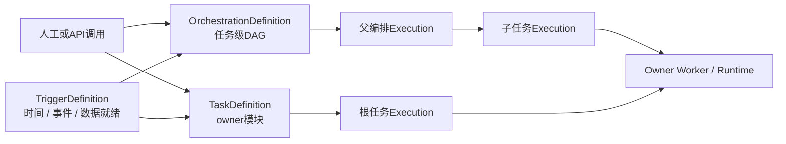

# ADDP 调度与任务编排统一改造专题

更新时间：2026-08-20

状态：讨论稿，尚未进入正式规范修订或代码实施

## 一、专题目的

ADDP 当前同时存在两类自动运行入口：

- Meta、Transfer、Manager 等任务 owner 在自己的任务定义中保存定时计划，由模块内 owner scheduler 创建 execution；
- Orchestrator 在编排定义中保存定时计划，启动一次 orchestration execution，再按照 DAG 调用各模块任务。

两类入口在技术上可以区分，但当同一个 owner 任务既启用自身定时，又被一个定时编排引用时，可能针对同一业务日期和输出目标产生两次运行。现有 active execution 检查主要防止同时运行，不能阻止两个入口先后处理同一业务批次。

本专题用于：

1. 统一任务定义、触发定义、编排定义和运行实例的概念；
2. 区分模块内自身调度、编排调度、同轮依赖和跨运行依赖；
3. 识别 ADDP 当前双入口模型中的重复运行和治理盲区；
4. 提出统一 Trigger 控制面的推荐目标路线；
5. 列出需要进一步确认的架构决策、规范修订和实施范围；
6. 作为后续 ADDP 改造讨论的起点，不直接替代正式规范。

## 二、与正式规范的关系

当前正式约束仍以以下文档为准：

- [ADDP 术语表](../concepts/addp术语表.md)
- [ADDP 任务体系规范](../spec/addp任务体系规范.md)
- [ADDP 任务编排体系图](../concepts/addp任务编排体系图.md)
- [ADDP 监控与执行体系图](../concepts/addp监控与执行体系图.md)
- [ADDP 模块架构图](../concepts/addp模块架构图.md)
- [Common Scheduler README](../../common/scheduler/README.md)
- [Orchestrator 模块说明](../../orchestrator/CLAUDE.md)

当前正式规范明确：

- 任务定义归 owner 模块；
- 调度定义归任务定义 owner 模块；
- owner scheduler 负责发现到期任务并创建 durable `pending` execution；
- Orchestrator 拥有编排定义，不拥有业务任务定义；
- 编排调度只决定 orchestration run 何时启动；
- 子任务自身调度与编排调度互不继承、互不覆盖；
- 同一个任务定义可以由自身调度和编排形成两个独立执行入口；
- `common.task_executions` 统一保存实际执行事实。

本专题认为，上述边界对“谁拥有任务”和“谁执行任务”的划分基本正确，但“调度定义必须归任务 owner”和“两个自动入口默认并存”需要重新讨论。

如果本专题的目标模型得到确认，应先修订术语表、任务体系规范、任务编排体系图和监控与执行体系图，再修改模块实现。专题文档不能与正式规范长期并列为两套有效规则。

## 三、当前实现事实

### 3.1 当前支持任务自身定时的能力

根据 TaskProvider capabilities 和当前运行闭环：

| 模块 | 任务类型 | `supports_schedule` | 当前含义 |
| --- | --- | --- | --- |
| Meta | `scan` | `true` | Meta owner scheduler 按扫描任务计划创建 execution |
| Transfer | `sync` | `true` | Transfer owner scheduler按同步任务计划创建 execution |
| Manager | `embedding` | `true` | Manager owner scheduler按向量化任务计划创建 execution |
| Orchestrator | `orchestration` | `true` | Orchestrator scheduler按编排计划创建 orchestration execution |
| Develop | `query/workflow/script` | `false` | 没有 owner scheduler 和 `next_run_at` due claim 闭环 |
| Quality | `check` | `false` | 可以手动或被编排调用，没有任务自身定时 |
| Graph | `kg_build` | `false` | 可以手动或被编排调用，没有任务自身定时 |
| Manager其他任务 | 多种 | `false` | 可以手动或被编排调用，没有任务自身定时 |

Develop 已明确删除任务定义中的 `schedule`、`enabled`、`next_run_at` 字段。Develop execution 可以因为父编排由定时触发而记录 `trigger_type=scheduled`，但这不代表 Develop 拥有自己的 owner scheduler。

### 3.2 当前 owner scheduler 的共同模式

当前支持自身定时的 owner task 基本采用以下模式：

```text
owner task.schedule + enabled + next_run_at
                ↓
owner scheduler 查询到期任务
                ↓
事务领取任务并推进 next_run_at
                ↓
创建 common.task_executions: pending
                ↓
owner execution worker 或 runner 执行
```

当前新规范已要求用户可配置任务采用 DB-driven due task claim，不再把各模块内存 Cron 注册表作为长期主路线。

### 3.3 当前编排调度模式

Orchestrator 当前采用：

```text
orchestration.schedule + enabled + next_run_at
                ↓
Orchestrator scheduler 创建父 execution
                ↓
Orchestrator 解析 DAG
                ↓
按 Step 调用 TaskProvider execution endpoint
                ↓
owner 模块创建子 execution 并完成实际工作
```

Step 只引用 `provider + task_type + task_id`，不读取、不修改子任务的 `schedule`、`enabled` 或 `next_run_at`。这一执行边界应继续保留。

### 3.4 当前 `common/scheduler` 的真实定位

`common/scheduler` 当前主要提供：

- Cron表达式解析和校验；
- 下一次运行时间计算；
- 时区处理；
- 必要的进程内Cron辅助能力。

它是公共调度工具库，不拥有持久 Trigger，不统一决定全平台哪些任务到期，也不处理跨模块DAG依赖。因此不应把 `common/scheduler` 单独称为 ADDP 调度引擎。

## 四、当前概念混淆

### 4.1 把定时配置等同于完整调度

Cron只能表达时间规则。完整调度还需要数据窗口、时区、日历、漏跑策略、事件去重、并发策略、触发审计和运行身份。

### 4.2 把 owner scheduler 等同于任务执行器

owner scheduler 只负责创建 execution。Worker或runner才负责真实数据读写。二者的进程边界、故障恢复和权限责任不同。

### 4.3 把编排步骤依赖等同于等待既有上游运行

当前 Orchestrator Step 引用 owner 任务时，会调用该任务的执行入口，创建本轮新的子 execution。

它不表示：

> 等待这个任务通过自身调度产生的某次 execution 完成。

如果下游只想消费已有上游结果，需要数据就绪触发、外部 execution 依赖或资产事件，而不是再次调用上游任务。

### 4.4 把禁止并发等同于业务去重

active execution guard 可以阻止同一任务同时存在两个 `pending/running` execution，但不能阻止：

```text
01:00 自身调度运行成功
03:00 定时编排再次调用同一任务
```

两次 execution 不并发，仍可能重复覆盖、追加或发布同一业务批次。

### 4.5 `supports_schedule` 同时承载两种容易误解的含义

当前 `supports_schedule=true` 表达“owner 模块实现了任务自身定时闭环”。它不表达“该任务能否被定时编排调用”。

例如 Develop 的 `supports_schedule=false`，但 Develop 任务仍可作为定时 orchestration 的 Step 执行。该字段容易被理解成“任务不支持定时自动运行”，实际只是“不支持 owner schedule”。

## 五、建议统一的目标概念模型

建议将 ADDP 任务生产体系明确分为五层。

| 对象 | Owner | 核心含义 |
| --- | --- | --- |
| TaskDefinition | 业务模块 | 稳定、可重复执行的业务任务定义 |
| TriggerDefinition | 统一调度与编排控制面 | 什么条件下为一个根目标创建运行 |
| OrchestrationDefinition | Orchestrator | 一次父运行中多个任务如何依赖和传递输出 |
| Execution | 实际任务或编排 owner写入公共事实 | 某一次实际运行的版本、参数、状态和结果 |
| Worker/Runtime | 实际执行 owner | 取得合法所有权并完成真实业务工作 |

目标关系如下：



### 5.1 TaskDefinition只定义“做什么”

任务定义继续归业务 owner 模块，保存：

- 业务配置；
- 默认参数；
- 输入输出契约；
- 运行时和资源绑定；
- 任务版本与授权要求；
- owner私有生命周期状态。

推荐目标中，任务定义不再直接拥有自动触发计划。模块页面上的“设置定时”只是创建或编辑一个指向该任务的 TriggerDefinition。

### 5.2 TriggerDefinition定义“为什么、何时创建根运行”

TriggerDefinition建议成为独立持久对象，至少表达：

| 字段语义 | 说明 |
| --- | --- |
| `id` | Trigger稳定身份 |
| `tenant_id` | 租户边界 |
| `name/description` | 用户可理解的触发目的 |
| `target_ref` | 指向一个TaskDefinition或OrchestrationDefinition |
| `trigger_type` | `schedule`、`event`或`data_ready` |
| `trigger_spec` | Cron、时区、事件条件、资产条件等类型化配置 |
| `enabled` | 是否继续产生根运行 |
| `next_fire_at` | 时间触发的下一次计划时间 |
| `misfire_policy` | 停机漏跑后的补跑、跳过或合并策略 |
| `concurrency_policy` | 已有活动运行时拒绝、排队或合并 |
| `authorization_subject` | 延迟执行所需的用户、成员关系和授权版本事实 |
| `created_at/updated_at` | 审计时间 |

一个 TriggerDefinition 默认只指向一个根目标。如果同一条件需要启动多个任务，应创建 OrchestrationDefinition并让Trigger指向该编排，不能让Trigger直接维护第二套隐式任务列表。

### 5.3 OrchestrationDefinition只定义“同一轮怎样协作”

OrchestrationDefinition继续保存：

- Step引用；
- `depends_on`；
- 参数固定值和声明输出绑定；
- Step超时和后续明确开放的控制流策略；
- 编排版本和布局。

编排定义不读取子任务Trigger，也不替用户启用、停用或修改子任务Trigger。

### 5.4 Execution只记录“这一次发生了什么”

根任务execution和父编排execution应能够记录：

- `trigger_id`；
- `trigger_type`和`source`；
- `scheduled_for`或事件身份；
- `data_interval_start/data_interval_end`；
- 任务或编排版本；
- 本次参数快照；
- 父子execution关系；
- 业务运行身份；
- 结果、错误和血缘事实。

TriggerDefinition变化不能改写历史execution。

## 六、推荐的单一目标路线

### 6.1 统一自动触发控制面

推荐由 Orchestrator 演进为统一的调度与任务编排控制面，拥有全平台用户可配置的 TriggerDefinition。

这里的“统一”指：

- 自动触发定义有一个事实源；
- 所有自动触发使用同一套时间、事件、授权和审计语义；
- 任务Trigger和编排Trigger能够统一查询和冲突分析；
- owner模块仍拥有任务定义、执行入口和业务幂等；
- Monitor仍然只观察，不成为Trigger或任务owner。

模块页面可以保留贴近业务的“定时运行”入口，但必须通过统一Trigger API创建TriggerDefinition，不能继续在owner私表保存第二份有效schedule。

### 6.2 删除owner task schedule主路径

目标路线确认并实施时，应删除业务任务表中的自动调度事实字段及owner scheduler due claim主路径，包括：

- `schedule`；
- 仅用于自动调度的`enabled`；
- `next_run_at`；
- owner模块的due task scheduler loop；
- `supports_schedule`表达owner schedule的旧语义。

任务是否可以手动执行、被编排调用或被Trigger作为根目标调用，统一由TaskProvider执行契约、授权能力和Trigger目标校验决定。

这不是保留两种方式供用户选择。正式切换后只允许统一Trigger主路线，旧owner schedule必须删除，不能与新Trigger长期双轨共存。

### 6.3 固定系统维护任务不进入TriggerDefinition

审计归档、注册同步、缓存清理、血缘collector和心跳采集等固定维护循环，如果不是用户可配置、可重复执行的任务定义，可以继续使用部署配置或轻量进程内机制。

一旦某项维护工作演进为用户可配置、可审计、可监控的持久任务，就必须进入TaskDefinition + TriggerDefinition主模型，不能同时保留配置Cron。

### 6.4 Continuous runtime不等于周期调度

Transfer continuous任务的启停和恢复属于长期runtime session生命周期，不应伪装为高频Cron。统一Trigger专题只处理“创建一轮根运行”的自动触发，不替代continuous runtime lease、position和fencing模型。

## 七、任务自身触发与编排触发的冲突规则

### 7.1 一个生产链路默认只有一个主要自动触发入口

当多个任务共同形成一条正式数据生产链路时，推荐创建一个Trigger指向OrchestrationDefinition。编排中的子任务不再为同一生产目的保留独立Trigger。

### 7.2 不自动关闭子任务Trigger

用户把一个已有独立Trigger的任务加入自动编排时，系统应：

1. 展示该任务现有全部Trigger；
2. 判断时间窗口、参数和目标是否可能重叠；
3. 对明显重复的生产入口阻止启用或要求用户明确选择；
4. 由用户停用、删除或保留独立Trigger；
5. 记录选择和审计信息。

Orchestrator不能在保存编排时静默修改owner任务或Trigger状态。

### 7.3 多Trigger可以存在，但必须表达不同运行目的

同一目标允许多个Trigger的前提应是能够说明差异，例如：

- 小时增量与月度全量；
- 不同数据窗口；
- 不同参数组合；
- 不同输出目标；
- 生产运行与隔离验证运行。

仅有不同Trigger名称不能证明它们是不同业务运行。

### 7.4 配置冲突、触发去重、并发控制和业务幂等分层处理

| 层次 | 解决的问题 | 建议责任方 |
| --- | --- | --- |
| 配置冲突分析 | 两个自动入口是否可能处理同一批数据 | Trigger控制面 |
| Trigger fire去重 | 同一计划时间或同一事件是否被重复消费 | Trigger控制面 |
| 活动运行并发 | 同一任务是否允许多个`pending/running` execution | owner执行入口 |
| 业务运行去重 | 两次先后运行是否处理同一业务窗口和目标 | owner任务语义 + 统一运行身份 |
| 外部副作用幂等 | 重试或重放是否产生重复写入和通知 | owner/Provider |

任何一层都不能冒充其他层已经解决。

## 八、需要新增的两类依赖语义

### 8.1 同轮执行依赖

当前Orchestrator `depends_on`属于同轮执行依赖：

```text
父编排execution
   ├── 子execution A
   └── A成功后创建子execution B
```

该模式会真实执行A和B，适合由一个根Trigger统一控制的生产链路。

### 8.2 跨运行或数据就绪依赖

另一类需求是：

```text
A通过自己的Trigger独立运行
        ↓
指定数据批次或产物就绪
        ↓
触发B或另一个Orchestration
```

此时不能把A再次作为Step执行。推荐优先以数据或产物就绪事实为依赖对象，例如：

- 指定ResourceLocator对应的数据版本更新；
- 指定业务日期分区就绪；
- 一组来源全部就绪；
- 质量门禁通过；
- 已发布数据产品产生新版本。

只有确实不存在可识别的数据产物时，才考虑等待外部execution状态。跨运行依赖必须同时包含任务身份、业务窗口和成功条件，不能只写“等待任务A最近一次成功”。

## 九、运行身份与防重复模型

建议区分两个身份。

### 9.1 Trigger fire identity

用于防止控制面因多实例、重复事件或网络重试重复创建根运行。

建议形态：

```text
trigger_id + scheduled_for
```

或：

```text
trigger_id + external_event_id
```

该身份应有数据库唯一约束，不能只依赖先查后插。

### 9.2 Business run identity

用于识别不同入口是否处理同一业务批次。推荐由owner任务根据稳定业务语义生成，例如：

```text
task_ref
+ task_version
+ normalized_data_interval
+ target_identity
+ execution_mode
```

统一控制面可以传递`data_interval`、Trigger参数和父编排上下文，但不能替不同owner猜测哪些字段构成业务身份。

任务执行契约后续需要明确：

- 是否声明业务运行身份；
- 相同身份再次运行时允许`reject`、`reuse`、`overwrite`还是创建新版本；
- 哪些字段变化会形成不同运行；
- 补数、重跑和恢复如何关联原execution。

## 十、统一Trigger需要覆盖的运行策略

### 10.1 时间与日历

- IANA时区；
- Cron或日历规则；
- 开始和结束时间；
- 工作日、交易日等业务日历；
- 夏令时重复或缺失时间的处理。

### 10.2 数据窗口

- `scheduled_for`与实际`started_at`分离；
- `data_interval_start/end`明确；
- 日、小时、月度和滚动窗口；
- 手动运行如何选择窗口；
- 补数如何批量生成窗口。

### 10.3 漏跑策略

服务停机或Trigger被暂时停用后，应明确：

- `catch_up`：逐个补齐缺失窗口；
- `latest_only`：只运行最新窗口；
- `skip`：记录漏跑但不补；
- `coalesce`：合并多个窗口为一次运行。

不能只根据`next_fire_at`向后推进而不记录错过了什么。

### 10.4 并发策略

- `reject`：已有活动运行时拒绝新运行；
- `enqueue`：保留待运行实例；
- `coalesce`：把多个未开始触发合并；
- 有界`max_concurrency`：允许指定数量并发。

第一版应优先选择少量明确策略，不应一次开放无法可靠实现的任意组合。

### 10.5 事件策略

- 事件来源和类型；
- 外部事件稳定身份；
- 去重窗口；
- `all`或`any`条件；
- 批量大小和等待窗口；
- 迟到、乱序和无效事件处理。

## 十一、授权与审计边界

自动Trigger不能保存长期用户Access Token。建议TriggerDefinition保存Task Authorization Subject：

- User Principal；
- Tenant Membership；
- authorization version；
- authorized_at；
- 目标引用和定义摘要。

Trigger创建或修改目标、参数、触发规则时，使用当前用户上下文原子刷新授权主体。每次创建根execution前重新校验：

- Principal和Membership仍有效；
- 当前Tenant一致；
- Role Permission仍允许执行目标；
- 授权版本和目标定义摘要仍匹配；
- Trigger参数符合目标最新execution contract。

如果目标是OrchestrationDefinition，父execution固化授权事实，子execution通过可验证的`parent_execution_id`继承编排上下文。owner模块仍执行最终领域和资源授权，不能只信任Trigger控制面。

## 十二、Monitor与可观测性要求

Monitor仍然是观察者，不拥有TriggerDefinition或任务状态。

统一Trigger上线后，Monitor至少需要展示：

- Trigger名称、类型、目标和启停状态；
- 下一次计划时间和最近一次fire结果；
- `scheduled_for`、实际创建时间和调度延迟；
- 漏跑、跳过、合并和冲突记录；
- 根execution及其子execution；
- 相同任务的全部Trigger来源；
- 业务数据窗口和补数范围；
- Trigger评估器健康和积压。

Trigger评估失败、目标授权失效和任务执行失败应是不同观测信号，不能都归为“任务失败”。

## 十三、业界模型参考

### 13.1 Apache Airflow

Airflow把Schedule、Tasks和Task Dependencies组织在DAG层面。Scheduler根据DAG时间表创建DagRun，并在依赖满足后创建Task Instance。Airflow还支持Asset-Aware Scheduling，让下游DAG在数据资产更新后启动，而不是再次执行上游DAG。

- [Airflow DAGs](https://airflow.apache.org/docs/apache-airflow/stable/core-concepts/dags.html)
- [Airflow Scheduler](https://airflow.apache.org/docs/apache-airflow/stable/administration-and-deployment/scheduler.html)
- [Airflow Asset-Aware Scheduling](https://airflow.apache.org/docs/apache-airflow/stable/authoring-and-scheduling/asset-scheduling.html)

### 13.2 Azure Data Factory

Azure Data Factory将Trigger与Pipeline分离。多个Trigger可以启动同一个Pipeline，一个Trigger也可以启动多个Pipeline。对ADDP更有参考价值的是“Trigger作为独立对象”，但ADDP推荐一个Trigger只指向一个根目标；多个目标通过OrchestrationDefinition显式表达，避免Trigger形成第二套隐藏编排。

- [Azure Data Factory Pipelines and Activities](https://learn.microsoft.com/en-us/azure/data-factory/concepts-pipelines-activities)
- [Create Schedule Triggers](https://learn.microsoft.com/en-us/azure/data-factory/how-to-create-schedule-trigger)

### 13.3 Databricks Jobs

Databricks把时间、表更新、文件到达、模型更新和持续运行等Trigger绑定到Job，Job内部再通过任务依赖形成DAG。其表更新和文件到达Trigger说明生产调度不应只依赖Cron。

- [Automate Jobs with Schedules and Triggers](https://docs.databricks.com/aws/en/jobs/triggers)
- [Configure Task Dependencies](https://docs.databricks.com/aws/en/jobs/run-if)
- [Trigger Jobs When Source Tables Are Updated](https://docs.databricks.com/aws/en/jobs/trigger-table-update)

### 13.4 Prefect

Prefect允许一个Deployment配置一个或多个Schedule，并明确Scheduler只创建Flow Run和计划状态，不参与Flow或Task实际执行。这与ADDP“Trigger控制面只创建execution，owner worker执行”的边界一致。

- [Prefect Schedules](https://docs.prefect.io/v3/concepts/schedules)
- [Prefect Deployments](https://docs.prefect.io/v3/concepts/deployments)

### 13.5 AWS Glue

AWS Glue将Trigger建模为显式对象，可以按时间、事件或上游状态启动Job；复杂多任务ETL推荐使用Workflow，每个Workflow有一个开始Trigger，内部再定义任务依赖。

- [AWS Glue Triggers](https://docs.aws.amazon.com/glue/latest/dg/about-triggers.html)
- [AWS Glue Workflows](https://docs.aws.amazon.com/glue/latest/dg/workflows_overview.html)

### 13.6 可归纳的共同原则

不同产品的物理实现并不相同，但普遍区分：

- 可复用的任务或工作流定义；
- 时间、事件或数据更新触发条件；
- 一轮运行中的依赖图；
- 不可变的运行实例；
- 真正执行任务的Worker或计算环境。

ADDP不需要复制某个产品的对象名称，但应遵守这些稳定边界。

## 十四、推荐实施顺序

本专题确认前不应直接修改代码。确认后建议按以下顺序推进。

### 阶段一：正式概念和规范修订

1. 在术语表新增TriggerDefinition、Trigger fire identity、business run identity、同轮依赖、跨运行依赖；
2. 修订任务体系规范，取消“调度定义必须归任务owner”的规则；
3. 修订任务编排体系图，增加Trigger控制面和数据就绪触发；
4. 修订监控与执行体系图，增加Trigger评估和fire观测；
5. 明确Orchestrator是否改名，以及模块边界是否变化；
6. 明确TaskProvider capabilities新版本。

### 阶段二：统一Trigger数据模型和API

1. 创建唯一TriggerDefinition存储；
2. 实现时间Trigger的DB-driven due claim；
3. 实现Trigger fire唯一约束；
4. 实现目标任务和编排的统一解析；
5. 实现授权主体刷新和执行前复核；
6. 实现Trigger列表、详情、启停、执行预览和冲突分析API；
7. 实现统一前端调度组件和上下文入口。

### 阶段三：一次性迁移并删除owner schedule

1. 盘点现有Meta、Transfer、Manager embedding和Orchestrator schedule数据；
2. 一次性转换为TriggerDefinition；
3. 切换所有模块页面到统一Trigger API；
4. 删除owner scheduler loop；
5. 删除owner任务表schedule活字段和相关API；
6. 删除`supports_schedule`旧语义；
7. 删除兼容读取、兼容写入和双轨开关；
8. 验证只有统一Trigger主路线可以创建自动根execution。

### 阶段四：数据窗口、漏跑和补数

1. 为时间Trigger增加`scheduled_for`和`data_interval`；
2. 增加明确的misfire策略；
3. 增加批量补数和窗口预览；
4. 增加Trigger级并发策略；
5. 让owner任务声明业务运行身份和重复执行策略。

### 阶段五：事件和数据就绪触发

1. 定义事件来源和稳定事件身份；
2. 定义数据版本、分区或产物就绪事实；
3. 支持`all/any`组合和批量等待窗口；
4. 支持从上游execution成功事实产生数据就绪事件；
5. 保持事件触发与同轮Step依赖为两种清楚能力。

## 十五、需要优先讨论确认的问题

### 15.1 Orchestrator是否承担统一Trigger控制面

推荐答案：承担。它已经拥有跨模块TaskProvider发现、编排定义和父子execution上下文，扩展为统一自动触发控制面比新增另一个并列调度模块更克制。

仍需确认是否继续使用“Orchestrator”模块名，还是在用户概念和文档中明确为“调度与任务编排”。

### 15.2 Trigger是否只允许一个根目标

推荐答案：只允许一个。多个任务应通过OrchestrationDefinition组织，避免Trigger自己形成没有DAG、没有父execution的隐式编排。

### 15.3 是否允许同一目标存在多个Trigger

推荐答案：允许，但必须统一可见并通过冲突分析；默认阻止明显相同时间窗口、参数和目标的重复生产入口。

### 15.4 `supports_schedule`如何处理

推荐答案：在新的TaskProvider capabilities版本中删除。自动触发能力属于Trigger控制面，任务是否能作为Trigger目标应由“持久任务定义 + 标准执行入口 + 延迟授权能力”共同决定，而不是继续沿用owner schedule布尔字段。

### 15.5 跨运行依赖优先依赖任务还是数据

推荐答案：优先依赖数据版本、分区或产物就绪事实。只有没有稳定数据对象时，才依赖带业务窗口的外部execution。不能使用“最近一次成功”这种没有窗口语义的弱条件。

### 15.6 第一阶段是否立即支持事件Trigger

推荐答案：不立即支持。第一阶段先收敛现有Cron到统一Trigger事实源，完成单一路线和执行身份；事件与数据就绪在第二专题中基于稳定事实接入，避免用通用JSON事件条件提前形成不可治理扩展点。

## 十六、改造完成标准

只有同时满足以下条件，才能认为调度与任务编排已经完成统一：

1. 用户可配置自动触发只有一个TriggerDefinition事实源；
2. owner任务表不再保存有效schedule和`next_run_at`；
3. owner模块不再运行用户任务due scheduler；
4. 时间Trigger通过数据库事务安全claim并去重fire；
5. Trigger只创建根execution，不执行业务逻辑；
6. Orchestration Step调用不读取子任务Trigger；
7. 同一目标的全部Trigger和编排引用统一可见；
8. 配置冲突、fire去重、活动并发和业务幂等分层实现；
9. 根execution记录Trigger、计划时间、数据窗口、参数和版本；
10. Monitor能够区分Trigger评估失败、授权失败和任务执行失败；
11. 现有Meta、Transfer、Manager和Orchestrator schedule完成一次性迁移；
12. 旧owner schedule API、字段、代码和兼容路线全部删除；
13. 固定维护循环和continuous runtime没有被错误并入周期任务调度；
14. 正式概念文档、规范、Swagger、前端入口和测试同步完成。

## 十七、当前建议结论

本专题建议确认以下长期方向：

1. 模块内定时属于调度，但模块owner scheduler不是独立的完整调度引擎；
2. 任务编排负责同一轮运行中的跨模块依赖，不代表等待任务自身调度产生的既有运行；
3. 同一个任务同时具有自身定时和定时编排调用，技术上是两个入口，业务上必须进行重复运行判断；
4. 复杂生产链路默认只有一个主要自动触发入口；
5. 下游只等待上游既有结果时，应使用数据就绪或跨运行依赖，不能再次调用上游任务；
6. ADDP推荐将所有用户可配置自动触发收敛为统一TriggerDefinition，由Orchestrator承担控制面；
7. 任务定义、执行入口、Worker、业务幂等和产物生命周期继续归owner模块；
8. 统一Trigger落地后删除owner schedule双轨，不保留兼容字段或旁路。

以上结论确认后，下一步应先修订正式术语和任务体系规范，再制定具体数据模型、API与一次性迁移方案。
