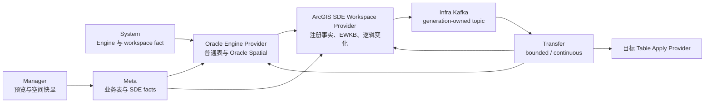
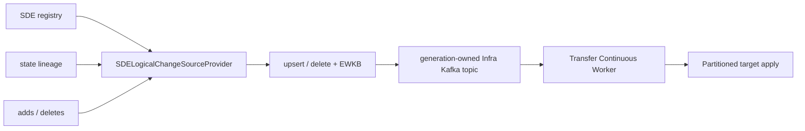

# ArcGIS SDE 支持设计

更新时间：2026-08-16

状态：设计冻结，等待真实 ArcGIS Enterprise Geodatabase 环境分阶段验证。未完成对应阶段 E2E 前，公开能力必须保持关闭。

本文定义 ADDP 对 ArcGIS Enterprise Geodatabase（下文简称 ArcGIS SDE）的唯一支持路线。当前正式能力仍以现行规范为准；本文中的能力只有在完成实现、真实环境验证并回写正式规范后才能对外声明。

正式文档入口：

- `docs/concepts/addp术语表.md`
- `docs/concepts/addp引擎体系图.md`
- `docs/spec/addp引擎插件接口规范.md`
- `docs/spec/addp引擎能力声明规范.md`
- `transfer/docs/transfer-任务语义与同步模式.md`
- `docs/next/transfer后续能力清单.md`

当前开放格式验收基线已增加 Oracle Spatial -> FileGDB round-trip：真实 PGeo `Loess` MultiPolygon 经统一 Transfer table pipeline 写入 Oracle Spatial，再由 Oracle 原生 reader 写入 GeoPython/OpenFileGDB，并回读验证行数、geometry 类型、空值和无 SRID 语义。该结果只证明 Oracle Spatial 与 FileGDB 的组合链路，不构成 ArcGIS SDE 验收。

## 一、目标与非目标

### 1.1 目标

1. 在 Oracle Engine Instance 中准确识别 ArcGIS SDE workspace，且不把普通 Oracle Spatial 或同名表误判为 SDE。
2. 读取 ArcGIS SDE 中已注册的简单要素类和普通表，并统一输出 ADDP `BatchData`，geometry 使用 EWKB。
3. 向预先创建并注册的非版本化简单要素类写入数据，正确处理 ObjectID、GlobalID、空间参考和事务。
4. 支持 enterprise geodatabase traditional versioning 的逻辑变化读取，并接入 Transfer continuous 主链路。
5. 保留 branch versioning 的独立扩展边界，但在完成独立协议和真实 E2E 前保持关闭。
6. 复用 FileGDB、PGeo、Oracle Spatial 和 Transfer 已有能力，不建立格式或引擎组合专用通道。

### 1.2 第一阶段非目标

- 不创建 enterprise geodatabase，不安装 `SDE.ST_GEOMETRY`，不替代 Esri 授权工具。
- 不自动创建、注册或升级 SDE 要素类。
- 不修改 SDE repository 系统表。
- 不支持 topology、network dataset、utility network、parcel fabric、annotation、dimension、relationship class、attachments、raster dataset、archive、replica 等高级数据集。
- 不支持 branch versioning、Feature Service 编辑协议或 reconcile/post 自动化。
- 不把普通 Oracle redo/LogMiner CDC 宣称为 SDE 逻辑变化源。
- 不把 FileGDB、PGeo 或 Oracle Spatial 的成功读写宣称为 SDE E2E。

## 二、核心概念与架构决策

### 2.1 Oracle Engine 与 SDE workspace

ArcGIS SDE 不是新的数据库 Engine Type。Oracle 仍通过 `engine_type=oracle` 注册为通用 Engine Instance；SDE 是该实例内探测到的厂商空间工作区事实：

```text
Oracle Engine Instance
  -> capabilities.extensions.spatial_workspaces[]
       -> ecosystem=arcgis
       -> kind=sde
```

因此：

- Engine 身份、连接、Catalog root 和 ResourceLocator 继续遵守 Oracle 规范。
- SDE 业务表仍使用 `schema -> table` EngineCatalogPath，不增加 `sde://` URI 或第二套资源树。
- `SDE` repository owner 和系统表不进入普通业务 Catalog。
- workspace capability 只决定是否可以选择 SDE 专用 Provider，不改变整个 Oracle Engine 的普通表行为。

### 2.2 四类能力严格分开

| 能力 | 数据语义 | 唯一实现边界 | 是否属于 SDE 支持 |
| --- | --- | --- | --- |
| Oracle Spatial | 普通 Oracle 表中的 `MDSYS.SDO_GEOMETRY` | Oracle Engine Provider | 否 |
| SDE 非版本化表 | 已注册的简单要素类或表 | workspace-scoped SDE Provider | 是 |
| SDE traditional versioning | registry、state lineage、adds/deletes 表达的版本逻辑变化 | `SDELogicalChangeSourceProvider` | 是 |
| SDE branch versioning | 服务化分支事务与编辑语义 | 后续独立 Provider | 是，但当前关闭 |

`MDSYS.ST_GEOMETRY`、`MDSYS.SDO_GEOMETRY`、存在名为 `SDE` 的用户或存在若干同名普通表，都不能单独构成 ArcGIS SDE workspace。

### 2.3 文件地理数据库不是 SDE

FileGDB 和 PGeo 是 encoded container format：

- FileGDB 使用 GDAL OpenFileGDB 读写普通图层。
- PGeo 使用 GDAL PGeo + unixODBC / MDB Tools，只作为只读 source。
- 它们通过统一 Transfer table pipeline 与目标 Provider 组合。

未来的 FileGDB/PGeo -> SDE 路径必须是：

```text
Format Provider
  -> BatchData（geometry=EWKB）
  -> Transfer table pipeline
  -> SDE target Provider
```

不得建立 FileGDB->SDE、PGeo->SDE 或 Oracle->SDE 专用执行器。

## 三、总体架构



模块边界：

| 模块 | 职责 | 禁止事项 |
| --- | --- | --- |
| System | 保存 Oracle Engine、刷新实例能力、展示 workspace 状态 | 不读取要素数据，不执行版本化逻辑 |
| `common/engine` | Oracle 连接、SDE 探测、注册事实、行与 geometry 转换、逻辑变化 Provider | 不保存 Transfer task 状态 |
| Meta | 扫描业务 schema/table，持久化已验证的 SDE 业务事实 | 不把 SDE repository 系统表建成普通 data item |
| Manager | 复用标准空间预览和快显 | 不解析 `SDE.ST_GEOMETRY` 私有内部表示 |
| Transfer | 任务配置、planner、capture generation、Kafka、position、目标应用与恢复 | 不硬编码 A/D 表名或 SDE 字段名 |
| Business | 承载真实或测试 Oracle/Enterprise Geodatabase 环境 | 不把伪造系统表用于运行时能力声明 |

## 四、Workspace 探测与能力门控

### 4.1 当前基线

Oracle `InstanceCapabilitiesResolver` 已按实例只读探测：

- repository owner 必须为 `SDE`。
- 同一 owner 必须同时可见 `TABLE_REGISTRY`、`GDB_ITEMS`、`GDB_ITEMTYPES`、`GEOMETRY_COLUMNS`。
- 弱签名保持 `not_detected`。
- 字典可见但核心表读取被拒绝时为 `permission_denied`。
- 第一阶段固定 `can_enable=false`、`risk_level=high`。

该探测只产生 workspace fact，不改变 Oracle `storage.store` 能力，也不开放 SDE 任务选项。

### 4.2 后续能力结构

真实 E2E 开始后，应把 workspace 的可执行能力从自由 `evidence` 中分离为强类型结构。建议扩展为：

```json
{
  "ecosystem": "arcgis",
  "kind": "sde",
  "state": "enabled",
  "backend_engine_type": "oracle",
  "risk_level": "high",
  "support": {
    "catalog": true,
    "nonversioned_read": true,
    "nonversioned_write": false,
    "traditional_change_read": false,
    "branch_change_read": false
  },
  "geometry_storage_types": ["sdo_geometry"],
  "versioning_models": ["none"]
}
```

实现时必须一次性更新 `SpatialWorkspaceFact`、System 展示、planner 和测试，不保留从 `evidence` 猜测能力的兼容路径。

### 4.3 开放条件

某项 support 只有同时满足以下条件才能为 true：

1. 当前实例探测到正式 SDE workspace。
2. 当前连接可读取对应 registry 和业务对象。
3. Provider 实现已注册且声明支持当前 Oracle、ArcGIS、geometry storage 和 versioning model 组合。
4. 该组合已通过真实 Enterprise Geodatabase E2E。
5. System 保存的是本次只读探测结果，不是用户手工填写的能力字符串。

## 五、Catalog 与元数据模型

### 5.1 ResourceLocator 保持不变

SDE feature class 仍是 Oracle catalog leaf：

```text
addp://engine/{engine_id}/path/{owner}/{table}?type=table&item_id={item_id}
```

版本名、registration ID、state ID 或 A/D 表名不是资源身份，不能写入 locator。

### 5.2 SDE 业务事实

SDE Provider 应从 repository registry 动态发现并向 EngineCatalogFacts/Meta 提供：

- repository owner。
- registration ID。
- 数据集分类与是否为简单要素类。
- versioning model：`none|traditional|branch`。
- ObjectID 字段名及其系统管理属性。
- 可选 GlobalID 字段名。
- geometry 字段名，不得默认 `SHAPE`、`GEOM` 或其他固定值。
- geometry storage：`sdo_geometry|st_geometry`。
- geometry type、SRID/CRS、XY tolerance/resolution、是否含 Z/M。
- 稳定非空业务键候选。
- 当前阶段不支持的高级数据集标记与原因。

这些事实应进入明确的 typed facts/attributes 结构。开始实现前先更新 `addp元数据attributes规范.md`，不得把整个 registry row 塞入 `native` 或任意 map。

### 5.3 系统对象过滤

- `SDE` repository owner、A/D delta tables、state/lineage tables 和内部索引表始终隐藏。
- 业务 owner 下已注册的 feature class/table 作为普通业务 leaf 展示。
- 是否展示业务对象由 registry 与 Catalog 交叉验证，不能仅靠名称前缀过滤。
- Provider 可以访问内部对象，但 Meta 和 Manager 不直接暴露这些对象。

## 六、Bounded 读取设计

### 6.1 输出契约

SDE bounded reader 输出统一 `BatchData`：

- 属性字段使用 ADDP 标准字段类型。
- geometry 统一为 EWKB，并携带明确 SRID。
- ObjectID 作为系统字段事实返回，不假设名称。
- 空 geometry 保持空值，不构造空点替代。
- 不支持的曲线、复杂几何或类型必须在 planning/prepare 阶段拒绝，不能逐行静默丢失。

### 6.2 geometry storage

| 存储类型 | 读取路线 | 要求 |
| --- | --- | --- |
| `MDSYS.SDO_GEOMETRY` | 复用 Oracle 空间转换底层 helper，由 SDE Provider 加入注册语义 | 必须验证 SRID、维度和有效性 |
| `SDE.ST_GEOMETRY` | 通过当前 geodatabase 提供的受支持 SQL 函数转换为 WKB/EWKB | 必须完成版本矩阵 E2E，不解析私有 Blob |

SDE Provider 可以复用 Oracle 连接与基础类型 helper，但 SDE registry、ObjectID 和 versioning 判断必须保留在 workspace Provider 内。

### 6.3 一致性

- 非版本化 bounded snapshot 使用 Oracle 一致性读边界。
- traditional versioning 的 bounded read 必须显式选择版本，第一版只允许 `SDE.DEFAULT`。
- versioned view 的行可见性由 Provider 根据 registry/state lineage 解释，不能读取 base table 后忽略 delta。

## 七、非版本化写入设计

### 7.1 第一版目标边界

第一版只写入已经由 ArcGIS 正式工具创建并注册的简单、非版本化 feature class/table：

- 不自动建表或注册。
- 不写 versioned、archived、replicated 或高级数据集。
- 不修改 SDE repository 表。
- 不支持 `replace` 删除重建目标。
- bounded snapshot 第一版只允许 `append`。
- `upsert` 只在后续 bounded incremental 与目标 Provider 契约完成后开放。
- `upsert_delete` 只属于后续 continuous target。

创建和注册要素类必须继续由 ArcGIS 授权工具完成。未来如需要自动 provisioning，应设计唯一的 licensed ArcGIS Adapter；它只负责创建/注册等控制面操作，不建立第二套行读写路径。

### 7.2 ObjectID 与 GlobalID

- ObjectID 是目标 geodatabase 管理的行身份，不默认从源复制。
- 源 ObjectID 需要保留时，必须显式映射到普通业务字段，不能占用目标 ObjectID。
- upsert/delete 稳定键优先使用 GlobalID 或用户确认的非空唯一业务键。
- 是否允许保留源 GlobalID 由 Provider 探测和任务选项显式决定，不能默认开启。
- Provider 必须使用当前 SDE/Oracle 版本受支持的 ObjectID 分配方式，不自行计算 `MAX(id)+1`。

### 7.3 空间与字段约束

- 写入前验证 geometry type、SRID、XY tolerance/resolution 和维度。
- 第一版固定二维 XY；Z/M、曲线和三维几何保持 unsupported。
- 字段名、长度、precision/scale、domain/subtype 字段必须在 prepare 阶段验证。
- 遇到 domain、subtype、default、relationship 等约束时，未实现明确解释的组合整体拒绝。

### 7.4 目标幂等

continuous target 后续只能复用 `PartitionedTableChangeApplyProvider` 契约：

```text
业务行 DML
  + ADDP-owned apply ledger
  + 同一 Oracle transaction
```

apply ledger 必须位于 ADDP 拥有的普通 schema，不能写入 SDE repository。失效 worker 必须被 fencing 阻止。若当前 ArcGIS/Oracle 组合不能保证业务 DML 与 ledger 原子提交，则该组合不得开放 continuous target。

## 八、Traditional Versioning 逻辑变化源

### 8.1 唯一路线

traditional versioning 不进入 Debezium/LogMiner：



现有 `SDELogicalChangeSourceProvider` 保持 workspace-scoped，不嵌入 Oracle `EnginePlugin`，也不声明普通 Oracle `storage.store.change_stream_read`。

### 8.2 Source descriptor

每个 capture generation 冻结：

- repository owner 与 registration ID。
- versioning model 与明确版本名。
- 字段、稳定键和 SpatialInfo。
- geometry 字段及存储类型。
- Provider 解释的原生位置类型版本。

调用方不得硬编码 ObjectID、GlobalID、geometry 字段、A/D 表名或 registration ID。

### 8.3 初始快照无空洞要求

首次固定 `bootstrap_mode=initial`。Provider 必须在同一 generation 中：

1. 冻结可重复解释的版本/状态边界。
2. 读取该边界下的完整业务行快照。
3. 将快照行归一化为 `upsert`，标记 `snapshot=true`。
4. 从紧邻该边界的原生位置继续读取已提交逻辑变化。
5. 发出唯一 bootstrap complete 事实。

无法证明 snapshot 与 change stream 之间无空洞时，generation 创建失败，不能退化为“先查全表、再从当前开始”。

### 8.4 变化归一化

| SDE 逻辑结果 | 规范 ChangeEvent |
| --- | --- |
| 新增可见业务行 | `upsert` |
| 更新后的最终可见业务行 | `upsert` |
| 从所选版本删除 | `delete`，仅稳定键 |
| state/lineage 内部变化但业务结果未变 | 不产生业务事件 |

同一业务编辑在 A/D 表中的多条内部记录必须折叠为版本可见的最终业务变化，不能把 repository 内部行当作业务 CDC 事件。

### 8.5 位置与恢复

- Provider 原生位置固定为 `arcgis_sde_logical_position/v1`。
- `partition` 至少绑定版本与 registration ID，但具体编码由 Provider 负责。
- `values` 是 opaque provider state，Transfer 不解释 state ID、lineage 或 delta rowid。
- Provider 负责 `PositionRange()` 和过期判断。
- 原生位置只用于 SDE capture adapter 恢复；Transfer `sync_states` 仍只提交 Infra Kafka offset。
- Kafka offset 已提交但 Provider 原生位置不可恢复时，不得创建隐藏的新 generation，任务进入明确阻塞状态。

### 8.6 生命周期与观测

SDE capture generation 需要单独公开：

- workspace probe、source connection 和 Provider session 状态。
- 当前版本、registration ID 的安全摘要。
- bootstrap 状态。
- earliest/latest native position 与 recovery 状态。
- Infra Kafka lag 与 retention headroom。

不得套用 Oracle redo/archive SCN、FRA 或 LogMiner connector health；SDE 没有 Kafka Connect connector。

## 九、Branch Versioning 边界

branch versioning 不复用 traditional A/D delta table 路线。它通常绑定服务化编辑、分支事务和不同的冲突处理模型。

开始设计 branch versioning 前必须确认：

1. 以 ArcGIS Feature Service、replica/change tracking 还是其他正式接口作为唯一事实源。
2. 分支、session、moment 和 edit operation 的位置模型。
3. initial bootstrap 与增量无空洞保证。
4. GlobalID、附件、关系和服务端规则的事件表达。
5. 授权、许可、token、网络和服务版本矩阵。
6. reconcile/post、冲突与回滚是否属于 ADDP 任务职责。

上述内容未形成独立规范和真实 E2E 前，`branch_change_read=false`，planner 必须明确拒绝。

## 十、Transfer 任务语义

### 10.1 Bounded

- 读取 SDE 表仍使用 `boundary=bounded + load.mode=snapshot`。
- SDE source/target 仍通过标准 table locator 表达。
- planner 根据 workspace typed facts 选择 Provider。
- 目标 feature class 必须预先存在，第一版只允许 `append`，不允许 `replace`。

### 10.2 Continuous

SDE logical change 应新增独立变化识别值：

```json
{
  "runtime": {"boundary": "continuous"},
  "load": {
    "mode": "incremental",
    "change_detection": {
      "type": "sde_logical",
      "bootstrap": "initial_snapshot",
      "version_name": "SDE.DEFAULT"
    }
  }
}
```

采用 `sde_logical` 而不是 `cdc`，用于明确区分：

- `cdc`：数据库事务日志 -> Debezium/Kafka Connect。
- `sde_logical`：SDE registry/state lineage/A-D 语义 -> ADDP capture adapter。

实现该配置前必须先更新术语表与 Transfer 正式规范，并删除任何把 SDE 塞入 `cdc` source 分支的临时代码。

### 10.3 目标支持矩阵

首个 SDE logical source 的目标继续限定为已支持 `PartitionedTableChangeApplyProvider` 的目标。SDE 自身作为 continuous target 必须在非版本化写入和同事务 apply ledger E2E 完成后单独开放；versioned SDE target 不进入第一版。

## 十一、安全、权限与许可

### 11.1 连接身份

第一版不向 Oracle connection_info 增加隐藏的 `sde_user/sde_password` 双轨凭据。SDE Provider 使用当前 Engine Instance 的连接身份。

需要读写权限隔离时，使用不同数据库 principal 注册不同 Oracle Engine Instance。Engine 身份包含认证主体，不能在同一实例内隐式切换高权限账号。

### 11.2 最小权限

按阶段授予：

- 探测：读取必要 data dictionary 和核心 registry 的零行/结构访问。
- 读取：读取指定业务表、必要 registry/state/delta 表和空间转换函数。
- 写入：仅目标业务表 DML、受支持 ObjectID 分配函数和 ADDP apply ledger。
- 禁止 `SYS`、`SYSTEM`、直接更新 SDE repository 和全库 DBA 权限。

### 11.3 许可边界

- ADDP 的开源 Provider 可以验证格式、Oracle Spatial、workspace 探测和受支持 SQL 数据面。
- enterprise geodatabase 的创建、注册、升级和 ArcGIS 客户端一致性验收必须在正式 Esri 许可环境完成。
- ArcPy 只能作为测试建库、注册和验收工具，第一版不作为 ADDP 生产行读写的隐藏 fallback。
- 若未来引入 licensed ArcGIS Adapter，必须有显式部署、能力声明和审计，不得在 Provider 失败时自动切换。

## 十二、验证环境与测试矩阵

### 12.1 无许可环境可完成

1. SDE workspace 探测的完整、弱签名、权限不足 fixture 测试。
2. `SDELogicalChangeSourceProvider` descriptor/change/position 契约测试。
3. FileGDB、PGeo -> Oracle Spatial -> FileGDB roundtrip。
4. Point、LineString、Polygon、MultiPoint、MultiLineString、MultiPolygon、GeometryCollection 二维矩阵。
5. ObjectID/FID、空 geometry、SRID、字段精度和 Unicode 数据测试。
6. capability/planner 门控测试，确保没有真实 workspace 时公开选项关闭。

这些测试只能证明前置通用能力，不证明 SDE 可运行。

当前可重复的无许可验收入口为 `make test-arcgis-open-formats`。它在 GeoPython Linux 容器内确认普通 Access 不被提升为 PGeo、真实 PGeo 的 child/catalog/geometry 读取，并通过 Transfer 通用 table pipeline 将 PGeo `WGS84_Points` 和 `Loess` bounded 导入 Oracle `SDO_GEOMETRY`，覆盖 Point/MultiPolygon、空 geometry 和有/无 SRID；另对 `Fault` 的 MultiLineString 做 Runtime 读取验收。它仍不宣称 enterprise geodatabase/SDE 已通过验收。

### 12.2 正式许可环境矩阵

| 维度 | 首批矩阵 |
| --- | --- |
| ArcGIS | 项目实际使用的 Enterprise Geodatabase 版本 |
| Oracle | 与该 ArcGIS 版本官方兼容的 Oracle 版本 |
| geometry storage | `SDO_GEOMETRY`、`SDE.ST_GEOMETRY` 分别验证 |
| versioning | none、traditional；branch 延后 |
| geometry | Point、LineString、Polygon、MultiPoint、MultiLineString、MultiPolygon |
| 数据状态 | 非空、空 geometry、Unicode、decimal、date/timestamp、null |
| 编辑来源 | ArcGIS 编辑 -> ADDP 读取；ADDP 写入 -> ArcGIS 打开与查询 |
| 故障 | Oracle/网络/Provider/Transfer/Kafka 中断、position 过期、权限回收 |

### 12.3 每阶段验收原则

- ADDP 查询结果与 ArcGIS 客户端可见结果一致。
- ADDP 写入后 ArcGIS 可以正常打开、查询和编辑目标要素类。
- 不产生无效 geometry、重复 GlobalID、错误 ObjectID 或损坏的 registry 状态。
- 失败可恢复且位置不跳跃，不丢失已提交业务变化。
- 所有公开 capability 与真实 Provider/E2E 一致。
- 没有真实 E2E 的组合必须保持不可选，而不是标记 beta 后放行。

## 十三、实施阶段

### Phase 0：现有前置基线

- Oracle Spatial 表读写、预览和二维 geometry matrix。
- Oracle/Oracle Spatial CDC。
- FileGDB 读写、PGeo 只读和 Oracle Spatial roundtrip。
- Oracle SDE workspace 只读探测与 `can_enable=false` 门控。
- `SDELogicalChangeSourceProvider` 基础契约。

### Phase 1：真实 workspace 发现与只读 Catalog

1. 建立正式许可 E2E 环境。
2. 读取 registry，识别 feature class、storage、versioning、ObjectID/GlobalID 和高级数据集。
3. 定义 typed EngineCatalogFacts/Meta attributes。
4. 开放 `support.catalog=true`，其他执行能力继续关闭。

### Phase 2：非版本化 bounded read

1. 实现 `SDO_GEOMETRY` 与 `SDE.ST_GEOMETRY` 到 EWKB 的唯一读取路径。
2. 完成字段、SRID、二维 geometry 和 snapshot 一致性矩阵。
3. 接入 Manager 预览与 Transfer source。
4. 通过 E2E 后开放 `nonversioned_read=true`。

### Phase 3：非版本化 bounded write

1. 仅支持预创建、已注册的简单非版本化目标。
2. 完成 ObjectID、GlobalID、稳定键、事务和空间约束。
3. bounded snapshot 只开放 `append`；后续增量和 continuous 能力分别验证 `upsert`、`upsert_delete`。
4. 验证 FileGDB/PGeo/Oracle Spatial -> SDE，并由 ArcGIS 客户端验收。

### Phase 4：Traditional versioning logical source

1. 实现 registry/state lineage/A-D 解释。
2. 完成无空洞 initial bootstrap、opaque position、恢复窗口和 schema drift。
3. 接入 generation-owned Infra Kafka 与现有 Continuous Worker。
4. 故障注入通过后开放 `traditional_change_read=true`。

### Phase 5：SDE continuous target

1. 限定非版本化目标。
2. 实现业务 DML 与 ADDP apply ledger 的同事务提交。
3. 完成 fencing、重复批次、恢复和 ArcGIS 客户端一致性验证。
4. versioned target 继续关闭。

### Phase 6：Branch versioning 独立专题

达到第九章前置条件后另建正式设计。不得在 traditional Provider 中增加 branch 兼容分支。

## 十四、必须阻塞的条件

出现以下任一情况时 planner 或 Provider 必须在创建外部资源前拒绝：

- workspace 未检测、权限不足或 capability 仍关闭。
- ArcGIS/Oracle/geometry storage/versioning 组合未认证。
- registry 与业务表事实不一致。
- 高级数据集或 branch versioning。
- 缺少稳定非空键。
- geometry 类型、SRID、Z/M、曲线或 tolerance/resolution 不受支持。
- 目标不是预创建的简单非版本化表。
- ObjectID/GlobalID 策略不明确。
- initial bootstrap 无法证明无空洞。
- resume position 已过期或无法解释。
- 目标行与 apply ledger 无法原子提交。

不允许通过忽略未知字段、退化为普通 Oracle CDC、跳过 geometry、重建 position 或改用另一 Runtime 来维持表面成功。

## 十五、正式化与本文收口条件

每完成一个阶段：

1. 先把已验证概念和能力回写术语表、引擎插件规范、能力声明规范、Meta attributes 或 Transfer 正式规范。
2. 实现只保留一条主路径，删除实验入口和兼容分支。
3. 更新 System/Meta/Manager/Transfer 的能力消费测试。
4. 保存真实 Enterprise Geodatabase E2E 和故障注入证据。
5. 从本文删除已经成为正式规范的章节。

当 Phase 1 至 Phase 5 的已选范围全部进入正式规范，且剩余 branch versioning 已迁入独立专题后，删除本文。
