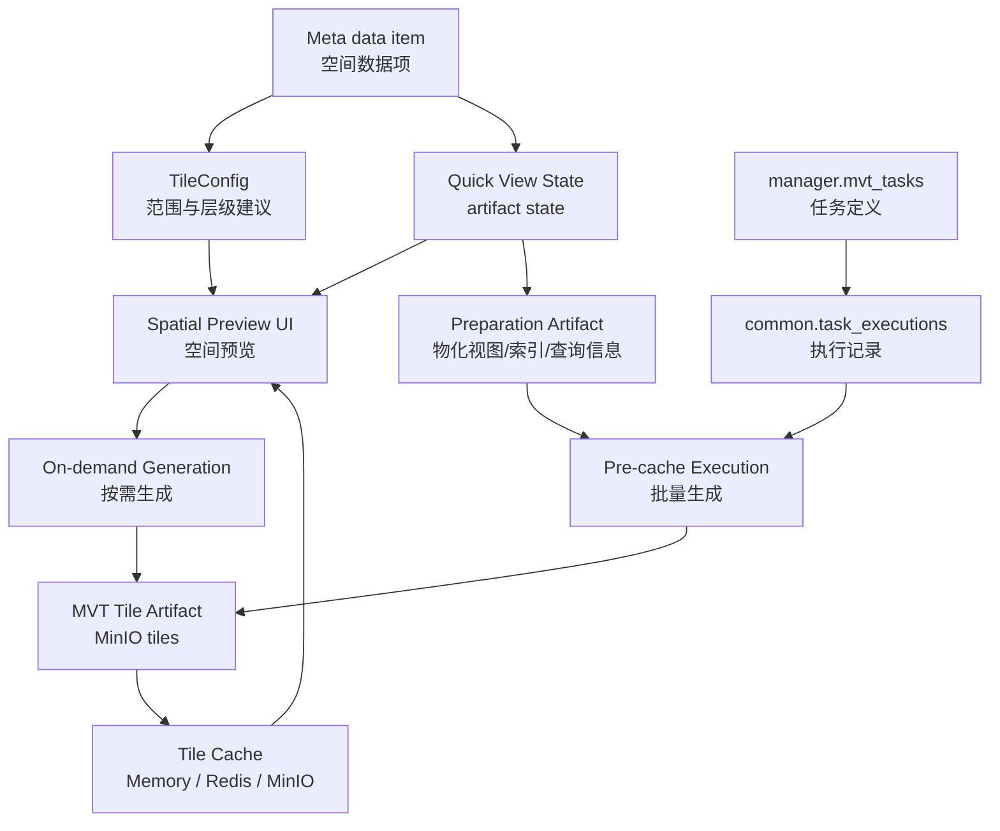

# Manager 快显与 MVT 瓦片缓存概念设计

> 状态：讨论稿。本文用于收敛 Manager 中 Quick View 快显、MVT 瓦片缓存、准备产物、任务定义和执行记录的概念边界；不代表已经确定最终实现方案。extent 与 SRID 的细节边界见 [MVT 快显 extent 与 SRID 边界说明](MVT快显extent与SRID边界说明.md)。

## 背景

Manager 当前负责数据探查、数据预览、混合检索、空间瓦片和 Quick View 快显能力。现有实现已经具备以下能力：

1. 空间表可以通过 GeoJSON 或 MVT 进入地图预览。
2. MVT 瓦片请求有统一入口，可先查内存、Redis、MinIO，未命中时再从 PostGIS 实时生成。
3. Quick View 提供准备、预缓存、状态查询、取消、恢复和清除接口。
4. Manager Worker 使用 Asynq 执行准备和批量瓦片生成。
5. `manager.mvt_tasks` 作为可编排任务定义，执行时写入 `common.task_executions`。

当前主要问题不是缺少能力，而是概念混合：

- Quick View 有时被称为任务，有时又是产物状态。
- MVT 预缓存、按需缓存、瓦片持久化和 UI 显示偏好都写在 `quick_view` 语境下。
- 准备阶段会在业务数据源里创建物化视图、索引并执行 `ANALYZE`，这和“只读探查与预览”的模块描述存在边界冲突。
- `quick_view.status`、Asynq 队列状态、`common.task_executions.status` 和 MVT artifact 状态尚未完全分层。
- 旧文档仍保留 md5 指纹、旧路径、旧状态和旧 API 说法。

本文先讨论价值和概念，不进入具体表结构和接口改造细节。

## 价值定义

快显不是一张表，也不是一个后台任务。快显是空间数据预览的用户体验目标：

> 用户打开一个空间数据项时，系统能尽快显示正确范围、合适层级和可交互要素，并把数据库查询、网络传输和缓存存储成本控制在可预期范围内。

这个目标包含四类价值。

### 1. 首屏可见

用户进入空间预览后，应先获得数据范围、推荐 zoom 和可用显示模式。即使尚未预缓存，也应尽量通过低成本路径看到数据，而不是要求用户先理解和启动后台任务。

### 2. 渐进加速

小数据可以直接 GeoJSON 或按需 MVT。中大型数据可以先按需生成热点瓦片，再在后台生成常用层级。超大数据需要明确预缓存计划、成本提示、进度和取消能力。

### 3. 成本可控

系统应避免无边界地请求高层级瓦片、全表转换、过多属性和重复生成。预缓存、按需缓存、singleflight、层级限制、属性裁剪和 extent 优化都服务于这个目标。

### 4. 可治理和可清理

MVT 瓦片、物化视图、索引、Redis 缓存、MinIO 对象和 quick view 状态都属于派生产物或加速产物，必须能追踪来源、判断是否过期，并能按数据项或租户清理。

## 概念模型

后续建议统一使用以下概念。

| 概念 | 中文名 | Owner | 定义 |
| --- | --- | --- | --- |
| Quick View | 快显体验 | Manager | 面向用户的空间数据快速预览能力，表达当前推荐显示模式、范围、zoom 建议和快显产物摘要。 |
| Quick View State | 快显状态 | Manager | 某个空间数据项当前快显产物是否可用、准备到哪一步、是否正在生成、最近错误是什么。属于 artifact state。 |
| MVT Tile Artifact | MVT 瓦片产物 | Manager | 已生成并持久化的矢量瓦片内容，通常存放在系统 MinIO。 |
| Tile Cache | 瓦片缓存 | Manager | 加速瓦片读取的多层缓存，包括内存、Redis 和 MinIO。MinIO 是持久层，内存和 Redis 是热缓存层。 |
| Preparation Artifact | 准备产物 | Manager | 为高效生成 MVT 所需的派生准备结果，例如查询表、几何列、目标 SRID、物化视图和索引状态。 |
| MVT Generation Task Definition | MVT 生成任务定义 | Manager | `manager.mvt_tasks` 中可重复执行、可编排的任务定义，表达“未来按什么策略为哪个对象生成 MVT”。 |
| MVT Generation Execution | MVT 生成执行 | Common execution | 一次实际执行记录，写入 `common.task_executions`，表达本次谁触发、何时运行、成功还是失败。 |
| Asynq Job | 队列作业 | Manager 内部 | Manager Worker 消费的内部运行单元，不作为长期业务事实源。 |

核心区分：

- Quick View State 回答“现在留下了什么”。
- Execution 回答“这次做了什么”。
- Task Definition 回答“未来可以按什么策略重复执行”。
- Asynq Job 回答“当前内部队列正在处理什么”。

## 主线关系



## UI 操作界面建议

UI 上应避免让用户先理解“任务”才能看地图。推荐分为两个层次。

### 空间预览页

空间预览页是用户打开空间数据项后的主入口。

建议包含：

1. 地图主体。
2. 显示模式切换：自动、GeoJSON、MVT。
3. 快显状态条：未准备、准备中、已准备、生成中、可用、失败、已取消。
4. 推荐层级信息：`min_zoom`、`max_zoom`、预估瓦片数、记录数或平均记录数。
5. 操作按钮：检查准备、执行准备、开始预缓存、取消、恢复、清除缓存。
6. 进度展示：当前 zoom、已处理瓦片数、估算总数、耗时、最近错误。
7. 成本提示：预计生成瓦片数量、可能创建物化视图或索引、可能占用 MinIO 存储。

默认体验建议：

- 小数据默认 GeoJSON 或按需 MVT。
- 大数据默认 MVT。
- 无预缓存时允许按需生成，但需要限制 zoom 和缓存策略。
- 只有用户明确执行准备时，才允许创建物化视图、索引或执行 `ANALYZE`。

### MVT 任务定义页

MVT 任务定义页是运维、管理员或高级用户使用的入口，不应替代空间预览页。

建议包含：

1. 任务名称和描述。
2. 目标数据项选择：优先使用 locator 或 item 身份，至少保留 engine/schema/table 展示。
3. 生成策略：min zoom、max zoom、并发、优化配置。
4. 调度策略：手动、定时、由 Orchestrator 编排触发。
5. 最近执行摘要：execution id、状态、开始时间、耗时、错误。
6. 产物状态跳转：回到对应空间预览页或 quick view 状态页。

这里的“任务”只表示 `manager.mvt_tasks` 任务定义，不表示 Quick View 本身。

## 产物模型

### 1. Quick View State

Quick View State 是 Manager 私有 artifact state，建议至少表达：

| 字段组 | 含义 |
| --- | --- |
| 身份 | tenant、engine、schema/table 或 item/locator、item fingerprint |
| 状态 | preparing、prepared、generating、ready、failed、cancelled、stale |
| 显示建议 | preferred mode、min zoom、max zoom、extent、extent SRID |
| 准备状态 | preparation status、query info、target SRID、transform engine |
| 缓存摘要 | total tiles、cached tiles、actual max zoom、MinIO prefix、metadata path |
| 版本 | source version、config version、generated at、last execution id |
| 错误 | error code、error message、failed step |

`quick_view.status` 只表达产物当前状态，不使用 `success`、`running`、`completed` 这类 execution status。

### 2. MVT Tile Artifact

MVT Tile Artifact 是实际瓦片内容，建议统一路径：

```text
tenant_{tenant_id}/mvt-tiles/{item_fingerprint}/tiles/z{z}/{x}_{y}.mvt.gz
tenant_{tenant_id}/mvt-tiles/{item_fingerprint}/metadata.json
```

其中 `item_fingerprint` 应使用平台统一算法：先得到 data item 的 `full_name`，再调用 `GenerateItemFingerprint(engineID, full_name)`。

需要进一步决定的是：瓦片路径是否只使用 item fingerprint，还是加入 source version / config version。只用 item fingerprint 路径稳定，但数据变化后必须有明确清理或覆盖策略；加入版本路径更安全，但会增加清理和引用复杂度。

### 3. Preparation Artifact

Preparation Artifact 描述 MVT 生成前的准备结果。它不是 Meta attributes，也不应写回 `attributes.capabilities.spatial`。

准备结果可以包含：

- 源表 SRID。
- 目标 SRID，MVT 路径通常是 3857。
- 是否需要物化视图。
- 查询表名。
- 查询几何列。
- 主键或 feature id 策略。
- 空间索引状态。
- `ANALYZE` 状态。
- 执行准备的 worker、耗时和错误。

如果准备阶段会修改业务数据源，必须在 UI 和文档中明确提示。

## 与任务体系的关系

Manager 对外仍只有一个 TaskProvider，即 `manager`。MVT 任务类型为 `mvt_generation`。

关系建议如下：

| 对象 | 是否进入 TaskProvider | 是否进入 `common.task_executions` | 是否是 artifact state |
| --- | --- | --- | --- |
| Quick View State | 否 | 否 | 是 |
| Quick View 手动预缓存 | 否，除非由任务定义触发 | 建议作为 ad-hoc execution 记录 | 会更新 artifact state |
| `manager.mvt_tasks` | 是 | 否 | 否 |
| 执行 `manager.mvt_tasks` | 通过 TaskProvider 触发 | 是 | 否 |
| Asynq Job | 否 | 否，除非被上层 execution 包裹 | 否 |
| MinIO tiles | 否 | 否 | 是，内容产物 |

建议：

1. 从任务定义页执行 `mvt_generation` 时，必须创建 `common.task_executions`，并在执行完成后更新 Quick View State。
2. 从空间预览页直接点击“开始预缓存”时，如果需要长期审计和 Monitor 可见，建议创建 ad-hoc execution；如果只是短时体验优化，则至少应在 Quick View State 中记录 `last_execution_id` 为空和触发来源。
3. Quick View 的 `ready/generating/preparing/failed/cancelled/stale` 不得映射成 execution status。
4. Monitor 读取 execution 历史；空间预览页读取 Quick View State 和瓦片产物状态。

## 重要边界

### 1. Manager 与 Meta 的边界

Meta 是 data item 身份和标准 attributes 的 owner。Manager 只消费 Meta 已识别的数据项和空间能力，不重新裁决 item 边界。

Manager 可以请求 Meta refresh，也可以读取 Meta GIS-facing API，但不得在预览链路写回 `meta_item.attributes`。

### 2. 源空间事实与快显派生事实

`attributes.capabilities.spatial` 表达源事实。Quick View 中的 extent、target SRID、物化视图和 MVT 查询信息是派生事实，只服务地图快显和瓦片生成。

### 3. Manager 是否写业务数据源

这是当前最大边界问题。

如果允许写业务数据源：

- 必须定义这是 Manager-owned preview acceleration artifact。
- 必须有显式用户动作或任务定义授权。
- 必须明确命名规则、冲突策略、权限要求、刷新策略和清理入口。
- 不得在普通瓦片请求或普通预览中悄悄创建物化视图或索引。

如果不允许写业务数据源：

- MVT 只能实时 `ST_Transform` 或使用外部缓存产物。
- 性能会下降，尤其是非 3857 大表。
- 需要考虑把 3857 派生产物放入平台控制的存储或计算结果引擎，而不是源库。

当前建议：允许，但必须从“隐式优化”改为“显式准备产物”，并在 UI 和任务定义中清楚展示。

### 4. GeoJSON 与 MVT 的关系

GeoJSON 是轻量预览路径，适合小数据或抽样。MVT 是地图快显路径，适合中大型空间表和连续缩放浏览。

`preferred_mode` 是用户或系统对显示模式的偏好，不等同于产物状态。MVT 产物 ready 后可以推荐切换为 MVT，但不能因此删除 GeoJSON 路径。

### 5. 按需缓存与预缓存的关系

按需缓存和预缓存都可以生成同一类 MVT Tile Artifact。区别在触发方式和覆盖范围：

- 按需缓存：由用户浏览触发，缓存热点瓦片，受严格成本阈值约束。
- 预缓存：由用户、任务定义或编排触发，按范围和层级批量生成。

建议二者写入同一 MinIO 路径和同一瓦片 metadata，但 Quick View State 应能区分 `generated_by=precache|on_demand|mixed` 或至少记录缓存覆盖率。

### 6. 缓存失效边界

只使用 item fingerprint 无法表达数据内容变化。后续需要引入 source version。

source version 可由以下事实组合：

- item fingerprint。
- Meta item `data_updated_at`。
- 源表统计更新时间或数据版本。
- 内容哈希、etag 或 row count。
- MVT 配置版本和目标 SRID。

当前建议：Quick View State 增加 `source_version` 和 `config_version` 概念；当版本不匹配时状态进入 `stale`，由用户或任务刷新，不自动静默覆盖。

## 未决事项分析与建议

### 1. Quick View 是否继续叫 Quick View

分析：Quick View 作为用户可理解的“快显”可以保留，但代码和文档不应再把它等同于任务。

建议：中文 UI 统一叫“快显”；技术文档中使用 Quick View State 表示状态表，MVT Tile Artifact 表示瓦片产物，MVT Generation Task 表示任务定义。

### 2. `quick_view` 是否应该绑定 `schema/table` 还是 data item

分析：当前关系型空间表用 `engine_id + schema + table` 足够直观，但 ADDP 的核心对象是 data item，长期应以 item/locator 为主。

建议：短期保留 `engine_id + schema + table`，同时文档上明确它是关系型表 data item 的路径投影；后续表结构可增加 `item_id`、`locator`、`item_fingerprint`，再逐步把 UI 和 API 切到 data item 语义。

### 3. 准备阶段是否必须先检查再执行

分析：检查只诊断、准备才修改数据源，符合用户信任和成本可见性。

建议：保留“检查 -> 准备 -> 预缓存”三步。普通瓦片请求不得自动执行准备。任务定义执行可以把检查和准备串起来，但 execution config 中必须记录本次允许执行哪些准备动作。

### 4. 是否允许按需生成写入持久 MinIO

分析：按需持久化能显著提升热点浏览体验，但如果没有阈值和版本管理，会造成缓存膨胀和过期数据。

建议：允许按需写入 MinIO，但必须受成本阈值、zoom 范围和 source/config version 控制。低成本空瓦片或很小瓦片可以只进 Redis/内存，不必长期持久化。

### 5. MVT metadata 是否需要单独 manifest

分析：仅靠 `quick_view` 表难以表达瓦片内容覆盖范围、版本、生成配置和 MinIO 内容摘要。

建议：保留 `metadata.json` 作为 tile artifact manifest，`quick_view` 保存摘要和入口路径。manifest 记录完整配置、版本、层级覆盖、生成来源和统计信息。

### 6. 取消和恢复是否属于 artifact state

分析：取消和恢复发生在执行过程中，但它们改变的是当前产物是否继续生成。execution 需要记录本次取消结果，Quick View State 也需要反映当前状态。

建议：用户取消时同时更新 Quick View State 为 `cancelled`，对应 execution 若存在则更新为统一取消状态；没有 execution 时至少记录取消时间和原因。恢复应创建新的 execution 或新的 Asynq Job，不复用旧执行记录。

### 7. 是否需要把 MVT 产物纳入 Meta cleanup

分析：MVT 是 Manager-owned artifact，不应让 Meta cleanup 直接依赖 Manager 私有表结构。

建议：Meta cleanup 只发布 item 删除或过期事件，Manager 订阅或提供 cleanup API 清理 quick view、tiles、Redis key 和源库准备产物。具体边界应与 `meta-cleanup边界与派生产物清理设计.md` 对齐。

## 推荐推进顺序

1. 先确认本文的概念分层和最大边界：Manager 是否允许显式写业务数据源。
2. 修订 Manager MVT/Quick View 专题文档，删除旧 md5、旧路径、旧状态和旧 API 说法。
3. 明确 Quick View State 状态机和字段语义，尤其是 `prepared/preparing/stale`。
4. 明确 source version、config version 和缓存失效策略。
5. 再改后端 API、模型、worker 和 frontend UI。
6. 最后补 Swagger、任务体系 capabilities、测试和验证命令。

## 暂不处理

本文不直接决定以下实现细节：

- 是否立即迁移 `quick_view` 表结构。
- 是否立即删除 `schema/table` 路由。
- 是否改造 `common/spatial` 的具体 SQL 构造。
- 是否新增独立 tile manifest 表。
- 是否立刻让空间预览页直接创建 ad-hoc execution。

这些应在概念确认后进入实现专题，按 clean break 方式收敛，不保留新旧双轨。
