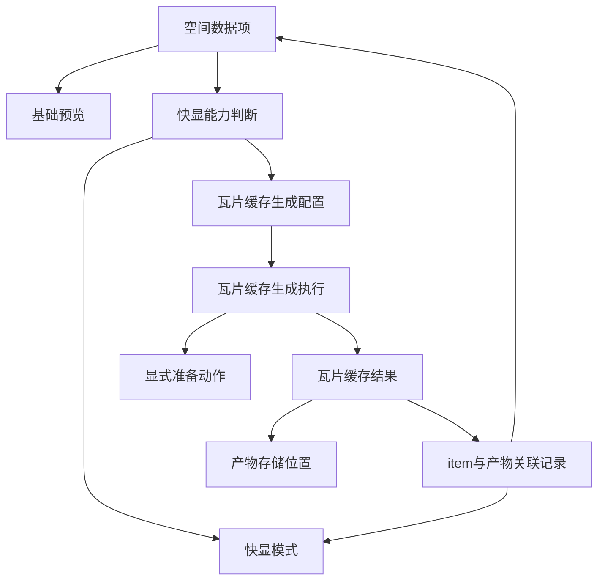

# Manager 快显与瓦片缓存概念原则

> 状态：最高概念指南。本文只讨论 Manager 空间快显与瓦片缓存的用户价值、概念边界和原则，不绑定当前 MVT / PostGIS 实现。后续规范、API、表结构、任务体系和 UI 改造均应以本文为概念依据。

## 一、核心定位

Manager 对空间数据的基础预览是“表格 + GeoJSON 绘制”。

基础预览的价值是帮助用户看懂数据：

1. 表格用于查看字段、属性、样本和记录。
2. GeoJSON 绘制用于轻量查看空间形态。
3. 基础预览可以降级、抽样或分页，不要求支持大范围连续地图浏览。

快显是基础预览之外的高性能空间绘制模式。

快显的价值是帮助用户像浏览地图一样浏览空间数据：

1. 能全幅查看空间范围。
2. 能缩放、拖动、连续加载。
3. 能在较大数据量下保持可用响应。
4. 能复用已有瓦片缓存或低成本实时生成能力。

因此，快显不是任务，不是 MVT，也不是某张表。快显是 Manager 空间预览中的一种用户可切换绘制模式。

## 二、核心原则

### 1. 任何 spatial 数据都有快显潜力

理论上，任何具备空间语义的数据项都有快显潜力。

能否快显取决于条件，而不是取决于当前第一阶段实现是否覆盖：

1. 数据量是否小到可以直接或按需绘制。
2. 是否已有可用瓦片缓存。
3. 是否能生成瓦片缓存。
4. 是否有可靠的空间范围、CRS、几何列或等价空间读取信息。
5. 当前数据源或派生服务是否具备瓦片生成能力。

快显能力判断必须基于 ADDP 的统一抽象：

1. 数据项身份使用 Resource Locator。
2. 数据语义使用 `data_type`、`format` 和 `capabilities.spatial`。
3. 数据读取使用 ADDP engine provider 和 format provider。
4. `schema/table` 只是在数据库类 engine 中由 locator 解析出的 provider 参数，不是快显 API 的主身份。

具体实现可以分阶段推进，但概念上不能把快显限定为 PostGIS、数据库表或 MVT。非 PG 的空间表格对象，例如 NFS / MinIO 上的 Shapefile，只要 `data_type=table` 且具备 `capabilities.spatial` 或预览 DTO 已给出几何列、SRID、范围和行数，就应进入同一套快显能力判断。

小数据量非数据库空间项不要求先生成瓦片缓存。若记录数不超过直接快显阈值，Manager 应通过 locator 调用预览/format 读取链路返回全量 GeoJSON，并以 `render_source=direct_geojson` 提供快显。

快显是 Manager 的空间预览能力，不应依赖 Meta 的数据库表空间查询接口。Meta 可以作为已扫描 attributes 的事实仓库参与普通预览解析，但快显能力 API 不得为了判断非 PG 空间项而调用按 `schema.table` 定位的 Meta 空间接口。

### 2. 快显开启与瓦片缓存生成分离

快显开启回答：“当前能不能切换到快显模式”。

瓦片缓存生成回答：“当前能不能通过生成缓存来获得或改善快显能力”。

二者应拆成两个判断：

| 判断 | 问题 | 服务对象 |
| --- | --- | --- |
| `can_use_quick_view` | 当前 item 是否可以直接切换到快显模式 | 空间预览 UI |
| `can_generate_tile_cache` | 当前 item 是否可以生成瓦片缓存 | 瓦片缓存生成入口 |

这两个判断是快显能力 API 的动态能力结果，不要求也不建议作为 `quick_view` 表字段持久化。

如果 `can_use_quick_view=true`，用户可以直接切换快显。若渲染源是 `cached_tile` 或 `direct_geojson`，预览页不展示“生成瓦片缓存”按钮，避免给用户增加不必要选择；若渲染源是 `realtime_tile`，可以同时提供“生成瓦片缓存”入口，用于把实时计算路径固化为可复用缓存。

如果 `can_use_quick_view=false` 且 `can_generate_tile_cache=true`，预览页只展示“生成瓦片缓存”按钮。用户点击后应跳转到瓦片缓存页面的“任务”tab，并携带当前 item 信息继续配置。

如果两者都为 false，系统应说明缺失条件，例如空间元数据不足、当前引擎不支持、权限不足或 CRS 无法可靠处理。

### 3. 瓦片缓存是独立产物

瓦片缓存不是快显本身，而是支撑快显的核心产物之一。

快显可以消费：

1. 已有瓦片缓存。
2. 实时瓦片生成结果。
3. 小数据量下的轻量绘制结果。
4. 未来其他空间服务或缓存产物。

瓦片缓存有独立价值：

1. 可提升 Manager 快显体验。
2. 可降低源数据库重复查询成本。
3. 可作为空间服务发布、共享浏览或后续分析的基础产物。
4. 可能体积较大，需要明确存储位置、版本、清理和授权。

### 4. 瓦片缓存格式不固定为 MVT

MVT 只是当前阶段最方便的瓦片缓存格式，因为 PostGIS 原生支持 MVT 生成。

概念上，瓦片缓存格式应开放：

1. MVT 矢量瓦片。
2. 栅格瓦片。
3. 预渲染图片瓦片。
4. 未来其他适合地图快显的瓦片格式。

因此，任务概念应统一为“瓦片缓存生成”，而不是“MVT 生成”。

建议概念任务类型为：

```text
tile_cache_generation
```

`tile_cache_generation` 表达瓦片缓存生成能力，不绑定具体瓦片格式；MVT 只进入任务配置和产物状态。

### 5. 用户应能决定瓦片缓存存储位置

瓦片缓存可能体积较大，也可能被用户用于其他场景，因此不应在概念上限定必须存入 ADDP infra MinIO。

ADDP 应提供默认存储位置，同时允许用户在任务配置中选择目标存储。

推荐原则：

1. ADDP 提供默认 tile cache storage，便于开箱即用。
2. 用户可以选择有写入权限的存储位置。
3. 无论存储在哪里，ADDP 都必须记录原始 data item 与瓦片缓存结果的关联关系。
4. 关联记录应先保留最核心的产物事实，包括存储引用、格式、配置指纹、范围、层级、最近执行和状态。
5. 生成配置完整快照应由任务定义和 execution 承载；产物状态只保留必要配置指纹或摘要。
6. 存储位置的权限、清理和可见性后续进入存储、授权和清理专题，不应第一阶段过早扩张产物表字段。

这份关联关系应独立为瓦片缓存结果状态，而不再由快显状态表承载。快显状态表达 UI 能力和推荐结果，瓦片缓存结果状态表达最小必要产物事实。

后续细化设计见 [Manager 瓦片缓存结果状态设计](Manager瓦片缓存结果状态设计.md)。

### 6. 对业务数据源的加工允许显式执行

创建物化视图、空间索引、统计信息等不应简单归类为“修改业务数据源”。

它们更准确地说是对业务数据源的进一步加工或派生产物准备：

1. 不破坏原始业务数据。
2. 不改变原始表记录。
3. 不修改业务字段含义。
4. 目的是提升快显或瓦片缓存生成性能。

因此，在显式授权、可诊断、可清理的前提下，可以执行这类加工。

但一般不允许直接修改业务数据：

1. 不更新原始业务记录。
2. 不改写原始几何。
3. 不删除原始表或原始数据。
4. 不在普通预览或普通瓦片请求中隐式执行加工。

对业务数据源的加工必须作为准备动作被用户或任务定义显式允许。是否需要准备动作应根据数据量、SRID、索引、已有派生产物、引擎能力和用户授权综合判断，不能一概而论。

## 三、用户视角流程

### 1. 默认进入空间预览

用户打开一个 spatial item。

Manager 默认展示：

1. 表格。
2. GeoJSON 轻量绘制。
3. 空间元数据摘要。
4. 快显能力状态。

### 2. 判断是否可直接快显

如果满足以下任一条件，可以直接切换快显：

1. 已有关联且有效的瓦片缓存。
2. 数据量较小，可实时或按需生成瓦片。
3. 当前 item 暴露了可被 Manager 消费的瓦片服务。

UI 展示“切换快显”。此时不展示“生成瓦片缓存”按钮。

### 3. 判断是否可生成瓦片缓存

如果不能直接快显，但具备生成条件，UI 展示“生成瓦片缓存”。

用户点击后，应跳转到瓦片缓存页面的“任务”tab，并携带当前 item 信息作为任务创建上下文。页面不应要求用户重新定位数据项，而应基于带入的 item 信息继续做任务配置。

用户进入瓦片缓存页面的“任务”tab 时，应看到：

1. 目标 item。
2. 瓦片格式。
3. 层级范围。
4. 目标存储。
5. 是否需要准备动作及判断依据。
6. 预计成本和风险提示。
7. 原始 item 与将要生成的瓦片缓存结果之间的关联预览。

确认后创建瓦片缓存任务定义。用户可在同一页面选择是否立即执行；执行记录进入统一任务执行体系。

### 4. 生成完成后回到快显

瓦片缓存生成完成后：

1. 产物状态记录关联原始 data item。
2. 快显状态变为可用。
3. 空间预览页可以直接切换快显。
4. 任务和执行监控可追踪生成过程。

## 四、产物关系



## 五、状态和记录

ADDP 需要记录原始 data item 与瓦片缓存结果的关联关系。

这份记录不等同于任务定义，也不等同于执行记录。它表达当前产物状态：

| 信息 | 含义 |
| --- | --- |
| 原始 item | 这个瓦片缓存来自哪个 data item |
| 存储位置 | 缓存存在哪里 |
| 瓦片格式 | MVT、栅格瓦片或其他格式 |
| 范围和层级 | 覆盖的 extent、CRS、min zoom、max zoom |
| 配置指纹 | 生成配置指纹 |
| 状态 | ready、generating、failed、cancelled |
| 最近执行 | 最近一次生成执行 ID |

这份记录应独立为瓦片缓存结果状态。快显状态只引用和推荐瓦片缓存结果，不保存完整产物事实。

## 六、任务体系关系

瓦片缓存生成是任务能力。

概念上应纳入统一任务体系：

1. 任务定义：描述未来按什么策略为哪些 item 生成瓦片缓存。
2. 执行记录：描述某一次实际生成过程。
3. 监控：展示进度、耗时、错误、产物大小和状态。
4. 编排：允许 Orchestrator 将瓦片缓存生成作为流程节点。
5. API：提供任务定义、执行、状态和产物关联查询。

任务不等于快显。任务生产或刷新瓦片缓存结果，快显消费这些产物。

从空间预览页发起瓦片缓存生成也必须创建 `manager.tile_cache_tasks`。瓦片缓存生成不设计无任务定义的 ad-hoc execution。

瓦片缓存生成的任务定义表后续应采用带 `tasks` 的命名，推荐为 `manager.tile_cache_tasks`。任务类型推荐为 `tile_cache_generation`。细化设计见 [Manager 瓦片缓存生成任务设计](Manager瓦片缓存生成任务设计.md)。

## 七、边界

### 1. Manager 与 Meta

Meta 负责 data item 身份、资源树、标准 attributes 和空间源事实。

Manager 负责空间预览、快显、瓦片缓存结果和相关派生加工。

Manager 不重新裁决 data item 边界，不在预览链路写回 Meta attributes。

### 2. 快显与瓦片缓存

快显是 UI 能力，瓦片缓存是产物。

没有瓦片缓存也可能快显，例如小数据实时生成。

有瓦片缓存也不代表必须自动切换快显，用户仍可以选择基础预览。

### 3. 瓦片格式

MVT 是当前实现格式，不是概念上唯一格式。

后续新增其他格式时，不应新增一套平行任务体系，而应扩展瓦片缓存任务的格式能力。

### 4. 存储位置

瓦片缓存可以存入 ADDP 默认存储，也可以由用户指定目标存储。

无论存储在哪里，ADDP 必须保留 item 与产物的关联记录，否则快显、清理、监控和权限都会失去事实源。

### 5. 业务数据源加工

允许显式加工，不允许隐式破坏。

允许：

1. 创建用于快显的物化视图。
2. 创建空间索引。
3. 执行统计信息更新。
4. 刷新已声明的派生准备产物。

不允许：

1. 修改原始业务记录。
2. 改写原始几何列。
3. 删除业务数据。
4. 在普通预览请求中悄悄执行准备动作。

## 八、后续落地原则

1. 先按本文修订概念和规范，再改实现。
2. 任务命名从 MVT 生成收敛为瓦片缓存生成。
3. 快显状态记录和瓦片缓存结果记录必须清晰区分任务定义、执行记录和产物状态。
4. 第一阶段可以只支持 PostGIS + MVT，但接口和文档不应把概念锁死。
5. 存储位置、瓦片格式、准备动作都应进入任务配置和产物状态。
6. 旧实现如果与本文冲突，应按 clean break 方式收敛，不保留新旧双轨。
