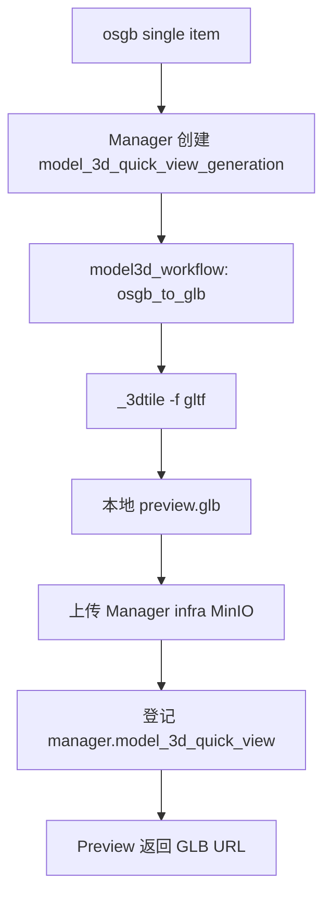
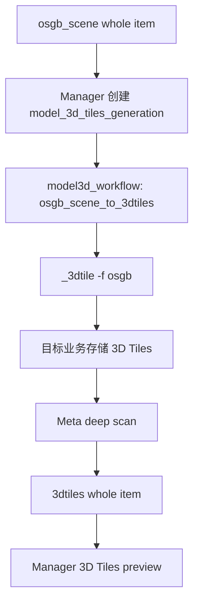

# OSGB 倾斜摄影与 3D Tiles 方案

更新时间：2026-06-28

状态说明：本文为 `docs/next/` 专题方案，用于统一 ADDP 中单个 OSGB 文件、OSGB 倾斜摄影数据集、单文件快显 GLB 产物、3D Tiles 业务数据集和 `model3d_workflow` 运行时的概念边界与落地路径。当前已完成格式拆分、`model3d_workflow` 最小运行时、OSGB Scene 转 3D Tiles 任务语义修正、单 OSGB GLB 快显任务与 Manager artifact 闭环、Manager 预览和任务页面接入、Linux arm64 生产镜像内置 `_3dtile` 转换工具、MinIO/S3 source staging 与 target publish，以及 3D Tiles 前端第一主路线收敛。本文只保留 OSGB 专题主线；OBJ / STL / FBX 已落地能力和 IFC / 3MX / SLPK / 点云等后续路线见 `docs/next/三维模型格式扩展路线.md`。

相关文档：

- `docs/concepts/addp数据类型和格式体系图.md`
- `docs/spec/addp内置数据类型与文件格式规范.md`
- `docs/spec/addp数据项探测器规范.md`
- `docs/spec/addp元数据attributes规范.md`
- `docs/spec/addp任务体系规范.md`
- `docs/spec/addp工作流计算引擎接口规范.md`
- `docs/spec/addp端口分配.md`
- `manager/docs/快显概念说明.md`
- `manager/docs/快显实现规范.md`
- `manager/docs/数据预览语义协议.md`
- `docs/next/三维模型与点云首轮验证记录.md`
- `docs/next/三维模型格式扩展路线.md`
- `docs/next/栅格镶嵌数据集mosaic快显方案.md`

## 一、核心结论

ADDP 需要同时支持两类 OSGB 对象：

1. **单个 `.osgb` 文件**：一个三维模型文件，数据量相对可控，但浏览器直接解析困难。它应识别为 `format=osgb`、`layout=single`、`data_type=model_3d`，快显路线是转换为 GLB 后复用前端三维模型预览。
2. **一套 OSGB 倾斜摄影数据集**：由 `metadata.xml`、`Data/` 和大量 `.osgb` 叶子文件组成的 whole-scope 场景。它不应继续占用 `format=osgb` 名称，应识别为 `format=osgb_scene`、`layout=whole`、`data_type=model_3d`，预览路线是转换为业务存储中的 `format=3dtiles` 数据集后复用 3D Tiles 预览。

推荐格式组合：

```text
单个 OSGB 文件
  data_type = model_3d
  format = osgb
  layout = single

OSGB 倾斜摄影场景
  data_type = model_3d
  format = osgb_scene
  layout = whole

转换后的 3D Tiles
  data_type = model_3d
  format = 3dtiles
  layout = whole
```

推荐任务和运行时：

```text
单 OSGB 快显
  task_type = model_3d_quick_view_generation
  operator = osgb_to_glb
  runtime = model3d_workflow
  result = model3d_workflow 直接发布到 Manager infra MinIO 的 GLB artifact

OSGB 场景转 3D Tiles
  task_type = model_3d_tiles_generation
  operator = osgb_scene_to_3dtiles
  runtime = model3d_workflow
  result = 业务存储中的 3dtiles item
```

关键约束：

1. `osgb` 只表示单个 `.osgb` 文件，不再表示一整套倾斜摄影数据集。
2. `osgb_scene` 表示 whole-scope OSGB 倾斜摄影场景，不直接在线预览。
3. 单 OSGB 的 GLB 是 Manager 快显 artifact，不自动成为业务 item；GLB 文件由 `model3d_workflow` 直接写入 Manager infra MinIO，Manager 只负责登记和读取。
4. 3D Tiles 结果是业务存储中的业务 item，不是 Manager 私有 artifact。
5. 三维转换不放入 `python_workflow`，新增专用 `model3d_workflow` 运行时。
6. `model3d_workflow` 实现 `addp.workflow/v1`，对 ADDP 暴露 direct operator。
7. `model3d_workflow` 第一版通过外部专业 CLI 工具执行转换，不直接绑定工具内部非稳定 API。
8. 对象存储不能套用 GDAL `/vsis3/` 思路，OSGB 转换器以本地文件路径为主，对象存储支持必须通过 staging 和发布流程完成。

## 二、和 TIFF / COG / mosaic 的类比

OSGB 体系应复用 raster 已经收敛出的分层思路。

| 栅格体系 | 三维模型体系 | 说明 |
| --- | --- | --- |
| 单个 TIFF | 单个 OSGB | 单文件原始格式，扫描后形成普通 data item。 |
| TIFF -> COG | OSGB -> GLB | 单文件快显优化，结果是 Manager 受管 artifact。 |
| 一批 TIFF 生成 raster mosaic | 一套 OSGB scene 生成 3D Tiles | 批量/目录型数据准备，结果是业务存储中的新业务 item。 |
| `raster_cog_generation` | `model_3d_quick_view_generation` | 单文件快显生成任务。 |
| `raster_mosaic_generation` | `model_3d_tiles_generation` | whole-scope 业务数据集生成任务。 |
| Python Workflow + GDAL | Model3D Workflow + 3D Tiles converter | 重型处理放到 workflow runtime，不放 Manager 主进程。 |

核心差异：

1. COG 和 raster mosaic 基于 GDAL，能够使用 `/vsis3/` 读写对象存储。
2. OSGB 转换器面向本地文件系统路径，不能默认支持 `/vsis3/`。
3. 3D Tiles 已有标准入口 `tileset.json`，不需要 ADDP 自定义 manifest 才能识别。
4. 单 OSGB 转 GLB 是快显体验，OSGB scene 转 3D Tiles 是业务数据准备。

## 三、格式与 Meta item 边界

### 3.1 单个 OSGB 文件

单个 `.osgb` 文件应作为普通 single item 识别：

```text
data_type = model_3d
format = osgb
layout = single
```

识别规则：

1. primary content 是 `.osgb` 文件。
2. 不在已强命中的 `osgb_scene` whole scope claims 内。
3. 不因为父目录存在大量 `.osgb` 就自动把父目录识别为 scene。

职责边界：

1. `common/format/plugins/osgb` 负责单文件 descriptor、轻量 info provider 和后续可选模型摘要。
2. Manager 不直接把 `.osgb` 原始文件暴露给前端解析。
3. 快显通过 `model_3d_quick_view_generation` 生成 GLB artifact。

### 3.2 OSGB 倾斜摄影场景

一套 OSGB 倾斜摄影数据集应作为 whole-scope item 识别：

```text
data_type = model_3d
format = osgb_scene
layout = whole
```

标准目录示例：

```text
/models/site_a/
  metadata.xml
  Data/
    Tile_001/
      Tile_001.osgb
      Tile_001_L15_0.osgb
    Tile_002/
      Tile_002.osgb
```

强命中规则：

1. 候选目录下存在 `metadata.xml`。
2. `metadata.xml` 可解析为 `ModelMetadata`。
3. `ModelMetadata` 至少能读取 `SRS` 或 `SRSOrigin`。
4. 候选目录下存在 `Data/`。
5. `Data/` 下至少存在一个 tile 目录，且该目录下存在与目录同名的根 `.osgb` 文件。

Meta item 组织：

```text
meta_item.full_name = scene 根目录
item.refs = 只保留 metadata.xml，role=manifest，primary=true
claims = metadata.xml + Data/ 下被识别的 .osgb 叶子文件
exclusive = 强命中时为 true
```

`format_info.osgb_scene` 建议字段：

```json
{
  "manifest_ref": "metadata.xml",
  "data_dir": "Data",
  "metadata_version": "1",
  "srs": "ENU:...",
  "srs_origin": "...",
  "root_tile_count": 3200,
  "leaf_osgb_count": 12800
}
```

`item.refs` 不展开上千个 `.osgb` 叶子文件。叶子文件由 claims 表达，避免重复落为单个 OSGB item。

### 3.3 3D Tiles 数据集

转换结果应继续使用已有 3D Tiles 语义：

```text
data_type = model_3d
format = 3dtiles
layout = whole
```

识别规则：

1. 数据集根目录存在 `tileset.json`。
2. `tileset.json` 可解析。
3. `asset.version` 和 `root` 存在。
4. 瓦片、纹理、子 tileset 等内部资源由 claims 表达，不进入 `item.refs` 全量列表。

Manager 预览消费的是 `3dtiles` item，不消费 `osgb_scene` 源 item。

## 四、`model_kind` 的处理原则

`model_kind` 第一版不作为主流程必填字段。

当前三元组已经能表达核心边界：

```text
data_type = model_3d
format = osgb / osgb_scene / 3dtiles
layout = single / whole
```

`model_kind` 可以作为后续可选展示和筛选字段，例如：

```text
type_info.model_3d.model_kind = photogrammetry_scene
type_info.model_3d.model_kind = tiled_scene
```

但第一版不得让 `model_kind` 成为 detector、任务准入、preview provider 的必要条件。任务准入应优先看：

```text
format + layout + data_type
```

原因：

1. `osgb_scene` 已经足以表达 OSGB 倾斜摄影场景。
2. `3dtiles` 可能来自倾斜摄影、BIM、城市白模或点云，第一版不要过早用 `model_kind` 绑定来源。
3. 多一个分类维度会增加任务和预览路由的歧义。

## 五、`model3d_workflow` 运行时

### 5.1 定位

`model3d_workflow` 是一个专用三维模型工作流运行时：

```text
engine_type = model3d_workflow
runtime_api = addp.workflow/v1
default_port = 8101
```

它和 `python_workflow`、`spark_workflow` 同属工作流运行时，不是新的业务模块，不是新的 TaskProvider，也不是 Orchestrator 的特殊分支。

ADDP 调用方式保持不变：

```text
Manager
  -> WorkflowRuntimeProvider.InvokeOperator(...)
  -> model3d_workflow /api/operators/{name}/invoke
```

### 5.2 语言选择

`model3d_workflow` 推荐使用 Python 开发 HTTP runtime wrapper。

原因：

1. ADDP 现有 workflow runtime 已有 Python HTTP 实现模板。
2. 本运行时主要负责参数校验、工作目录、子进程调用、对象存储上传下载、进度回调和产物校验。
3. 重计算由外部 `_3dtile` 原生命令执行，Python 不承担转换性能瓶颈。
4. Python 对 MinIO/S3 SDK、HTTP callback、JSON 参数和文件遍历支持直接。
5. 后续如果转换器提供稳定 SDK，Python wrapper 内部可替换实现，不影响 ADDP 外部契约。

不建议第一版用 Go 或 Rust 重写运行时：

1. Go 会偏离现有 workflow runtime 目录和开发模板。
2. Rust 直接嵌入转换器内部函数会绑定非稳定 API，升级成本高。
3. 运行时进程和转换进程分离更容易隔离崩溃、超时和日志。

### 5.3 外部专业工具

第一版主选 `fanvanzh/3dtiles` 提供的 `_3dtile` CLI。

已确认能力：

```bash
# OSGB scene -> 3D Tiles
_3dtile -f osgb -i <osgb_scene_root> -o <target_3dtiles_root>

# single OSGB -> GLB
_3dtile -f gltf -i <input.osgb> -o <output.glb>
```

工具能力：

1. 支持 OSGB 转 3D Tiles。
2. 支持单 OSGB 转 GLB。
3. 支持 Linux、macOS、Windows 和 Docker。
4. 支持 Draco、KTX2 texture compression、mesh simplify 等优化参数。
5. Apache 2.0 license。

`model3d_workflow` 第一版只依赖 CLI 作为稳定集成面，不直接调用工具内部 Rust/C++ 函数。工具内部确实有 `osgb_batch_convert`、`osgb2glb` 等函数，但它们不是公开稳定 SDK，不应作为 ADDP 第一版依赖面。

### 5.4 运行时目录建议

```text
engines/model3d-workflow/
  api_server.py
  workflow_engine.py
  operators/
    __init__.py
    base.py
    model3d_operators.py
  storage/
    object_store.py
    staging.py
  requirements.txt
  Dockerfile
  README.md
```

推荐 Python 依赖：

```text
flask
flask-cors
gunicorn
requests
minio
pydantic
```

推荐环境变量：

```text
MODEL3D_WORKFLOW_PORT=8101
MODEL3D_CONVERTER_BIN=/3dtiles/_3dtile
MODEL3D_WORKSPACE_ROOT=/tmp/addp/model3d-workflow
MODEL3D_WORKSPACE_TTL_HOURS=24
MODEL3D_MAX_CONCURRENT_CONVERSIONS=1
MODEL3D_UPLOAD_CONCURRENCY=8
MODEL3D_DATA_HOST_PATH=/path/to/nfs/data
MODEL3D_DATA_CONTAINER_PATH=/same/path/seen/by/runtime
```

`MODEL3D_CONVERTER_BIN` 必须指向 `model3d_workflow` 运行时部署内的可执行文件路径，不能只写 `_3dtile` 并依赖系统 `PATH`。默认开发路径为 `engines/model3d-workflow/bin/_3dtile`。

单 OSGB 快显 GLB artifact 使用 ADDP infra MinIO 的统一配置，不新增 `model3d_workflow` 专用 MinIO endpoint。部署时必须保证 Manager 传给 `model3d_workflow` 的 infra MinIO endpoint 对 runtime 也可访问。Docker Compose 模式下 Manager 和 runtime 同在容器网络，统一使用 `minio:9000`；本机 macOS 开发模式下 Manager 和 Python runtime 同在宿主机，统一使用 `localhost:19000`，`_3dtile` 通过 Docker wrapper 执行。

`MODEL3D_DATA_HOST_PATH` / `MODEL3D_DATA_CONTAINER_PATH` 用于 Docker runtime 挂载 NFS/localfs 数据根目录。对于 NFS/localfs source，Manager 生成的 `local_path` 必须在 `model3d_workflow` 内可访问；推荐把宿主机数据根目录挂载到容器内相同路径。

`MODEL3D_MAX_CONCURRENT_CONVERSIONS` 第一版建议默认为 1，避免多个大型倾斜摄影转换同时占满 CPU、内存和磁盘。

## 六、单 OSGB 快显路线

### 6.1 语义

单 OSGB 快显类比 TIFF -> COG：

```text
单 OSGB item
  -> model_3d_quick_view_generation
  -> osgb_to_glb
  -> model3d_workflow publish 到 Manager infra MinIO
  -> 前端 model_3d renderer 预览
```

GLB 结果是 Manager 快显产物，不进入业务存储，不形成新的 Meta item。

这里不能让 `model3d_workflow` 写 Manager 本地临时文件。运行时可能是 Docker 容器或远程服务，Manager 进程的本地 `/tmp` 对它不可见。因此单 OSGB 快显的主路径是：

```text
Manager
  -> 构造 source local_path + target object_store publish plan
  -> model3d_workflow 本地临时转换
  -> model3d_workflow 上传 GLB 到 Manager infra MinIO
  -> Manager stat artifact 并登记结果
```

### 6.2 任务边界

当前主路径：

```text
task_type = model_3d_quick_view_generation
task table = manager.model_3d_quick_view_tasks
artifact table = manager.model_3d_quick_view
operator = osgb_to_glb
runtime = model3d_workflow
```

`manager.model_3d_quick_view` 用于登记 Manager 拥有生命周期的 GLB 快显 artifact。删除 quick view 结果时，只删除 Manager infra MinIO 中的 GLB 和对应状态，不删除源 OSGB item。

### 6.3 operator 输入输出

输入：

```json
{
  "access_plan": {
    "source": {
      "access_method": "mounted_path",
      "local_path": "/mnt/nfs/models/part.osgb",
      "metadata": {
        "locator": "addp://engine/12/path/models/part.osgb?type=item&item_id=77",
        "engine_id": 12,
        "engine_type": "nfs",
        "format": "osgb"
      }
    },
    "target": {
      "access_method": "s3_upload",
      "bucket": "manager",
      "object_key": "tenant_1/model3d/glb/<fingerprint>/preview.glb",
      "endpoint": "minio:9000",
      "use_ssl": false
    }
  },
  "options": {
    "overwrite": true
  }
}
```

输出：

```json
{
  "status": "success",
  "result": {
    "storage_ref": "minio://manager/tenant_1/model3d/glb/<fingerprint>/preview.glb",
    "file_name": "preview.glb",
    "size_bytes": 123456,
    "format": "glb"
  }
}
```

### 6.4 第一版支持范围

第一版：

```text
source = NFS / localfs
target = Manager infra MinIO
```

不支持：

1. 浏览器直接解析 `.osgb`。
2. MinIO/S3 source 直接转换。
3. 将 GLB 快显产物自动登记为业务 item。

## 七、OSGB scene 转 3D Tiles 路线

### 7.1 语义

OSGB scene 转 3D Tiles 类比一批 TIFF 生成 raster mosaic：

```text
osgb_scene item
  -> model_3d_tiles_generation
  -> osgb_scene_to_3dtiles
  -> 目标业务存储生成 3D Tiles 数据集
  -> Meta scan 形成 3dtiles item
  -> Manager 预览 3dtiles item
```

结果是业务数据集，不是 Manager artifact。

### 7.2 任务边界

已有 `model_3d_tiles_generation` 任务类型可以保留，但需修正语义：

```text
source.format = osgb_scene
operator = osgb_scene_to_3dtiles
target.format = 3dtiles
```

不得继续使用：

```text
source.format = osgb
operator = osgb_to_3dtiles
```

### 7.3 operator 输入输出

输入：

```json
{
  "access_plan": {
    "source": {
      "access_method": "mounted_path",
      "local_root": "/mnt/nfs/models/site_a",
      "metadata": {
        "locator": "addp://engine/12/path/models/site_a?type=item&item_id=77",
        "engine_id": 12,
        "engine_type": "nfs",
        "format": "osgb_scene"
      }
    },
    "target": {
      "access_method": "mounted_path",
      "local_root": "/mnt/nfs/derived/site_a_3dtiles",
      "metadata": {
        "locator": "addp://engine/12/path/derived?type=node",
        "engine_id": 12,
        "engine_type": "nfs",
        "format": "3dtiles"
      }
    },
    "progress_callback": {
      "endpoint": "http://manager-backend:8081/api/v1/manager/internal/executions/<execution_id>/events",
      "tenant_id": 1,
      "execution_id": "<execution_id>",
      "internal_api_key": "<internal-key>"
    }
  },
  "options": {
    "height_offset": 0,
    "max_level": 20,
    "pbr": true,
    "enable_simplify": false,
    "enable_draco": false,
    "enable_texture_compress": false
  }
}
```

输出：

```json
{
  "status": "success",
  "result": {
    "tileset_ref": "tileset.json",
    "tileset_locator": "addp://engine/12/path/derived/site_a_3dtiles?type=item",
    "tile_count": 3200,
    "format": "3dtiles"
  }
}
```

### 7.4 第一版支持范围

当前支持：

```text
source = NFS / localfs / MinIO / S3
target = NFS / localfs / MinIO / S3
```

原因：

1. 当前用户场景是 NFS 中已有 OSGB 数据。
2. OSGB 转换器面向本地路径。
3. source object store 由 `model3d_workflow` staging 到本地临时 workspace。
4. target object store 由 `model3d_workflow` 在本地 workspace 输出后递归上传，并保证 `tileset.json` 最后发布。

后续增强：

```text
source object summary / resumable staging / workspace TTL
```

## 八、对象存储支持策略

### 8.1 基本原则

OSGB 转换器不是 GDAL，不能直接复用 raster mosaic 的 `/vsis3/` access plan。

错误路线：

```text
_3dtile -f osgb -i /vsis3/bucket/osgb_scene -o /vsis3/bucket/out
```

推荐路线：

```text
object store source
  -> download/stage to local workspace
  -> _3dtile local path conversion
  -> upload/publish to object store target
```

### 8.2 target object store

目标对象存储比源对象存储更容易支持。

流程：

```text
1. _3dtile 输出到本地 workspace/output
2. 校验 workspace/output/tileset.json
3. 递归上传除 tileset.json 外的所有对象
4. 最后上传 tileset.json
5. 返回 tileset_ref
6. Manager 触发 Meta scan
```

`tileset.json` 必须最后上传。因为 3D Tiles detector 以 `tileset.json` 作为 manifest，最后上传可以避免半成品被扫描为业务 item。

建议对象布局：

```text
bucket/prefix/site_a_3dtiles/
  tileset.json
  Data/
    ...
```

上传进度：

```text
uploaded_files / total_files
uploaded_bytes / total_bytes
```

当前实现：

1. Manager 只生成 `access_plan.target.publish`，包含发布目标、连接参数和最终 dataset locator。
2. `model3d_workflow` 创建临时本地 workspace，调用 `_3dtile` 写入本地目录。
3. `model3d_workflow` 递归上传目录内容，跳过 `tileset.json` 到最后。
4. 结果返回 `tileset_locator`、`tileset_ref`、`uploaded_files` 和 `uploaded_bytes`；密钥不写入 Manager execution metadata。

### 8.3 source object store

源对象存储通过 staging 支持。

流程：

```text
1. list_objects(prefix)
2. 校验 metadata.xml 和 Data/ 候选
3. 本地磁盘空间预检
4. 并发下载到 workspace/source
5. 调用 _3dtile
6. 转换完成后按 target access_method 发布
7. 清理或保留 workspace 供诊断
```

当前实现：

1. Manager 生成 `access_plan.source.stage`，包含 source bucket / prefix 和连接参数。
2. `model3d_workflow` 递归 list/download 到本地临时 workspace。
3. 下载完成后调用 `_3dtile -f osgb -i <workspace/source> -o <target>`。
4. 任务结果返回 `downloaded_files` 和 `downloaded_bytes`；密钥不写入 Manager execution metadata。
5. 转换结束或失败后清理临时 source workspace。

后续增强：

1. 大数据量下载时间长。
2. 本地 workspace 需要足够磁盘。
3. 中断后需要清理或断点复用。
4. 凭据不能写入 execution metadata。
5. source prefix 内容变更会影响任务可重复性，需要记录源文件 size、etag 或 fingerprint 摘要。

### 8.4 不推荐路线

不推荐第一版使用：

1. `s3fs` / `rclone mount`：隐藏复杂依赖，错误和性能不可控。
2. presigned URL 拼接整套数据：适合少量单文件，不适合上万对象的目录型场景。
3. GDAL `/vsis3/`：这是 GDAL 能力，不是 OSGB 转换器通用能力。

## 九、进度与事件

`model3d_workflow` 应复用 Manager 内部 execution event 入口：

```http
POST /api/v1/manager/internal/executions/{execution_id}/events
X-Internal-API-Key: <internal-key>
X-Tenant-ID: <tenant-id>
Content-Type: application/json
```

### 9.1 单 OSGB 快显进度

单文件 GLB 快显可以使用阶段进度：

```text
0-10%    preflight
10-80%   convert
80-95%   upload
95-100%  validate and complete
```

### 9.2 OSGB scene 转 3D Tiles 进度

第一版可用进度：

```text
0-5%     preflight
5-10%    scan Data/ root tiles
10-85%   convert with _3dtile
85-92%   validate tileset and output
92-98%   publish target
98-100%  return and trigger Meta scan
```

转换阶段的近似进度：

1. wrapper 预扫描 `Data/` 下符合规则的 root tile 数量，得到 `total_tiles`。
2. `_3dtile` 转换过程中，wrapper 定时检查输出目录中已生成的 tile 入口，例如 `Data/<tile>/tileset.json`。
3. 用 `converted_tiles / total_tiles` 估算转换阶段进度。
4. 同时捕获 stdout / stderr，保存最近日志摘要。

事件示例：

```json
{
  "phase": "convert",
  "event": "tile_progress",
  "message": "转换 OSGB root tiles",
  "total_files": 3200,
  "processed_files": 36,
  "failed_files": 0,
  "current_file": "Tile_036",
  "overall_progress": 18,
  "metadata": {
    "operator": "osgb_scene_to_3dtiles",
    "runtime": "model3d_workflow"
  }
}
```

### 9.3 更精确进度的后续增强

`fanvanzh/3dtiles` 当前没有公开稳定的结构化 progress API。后续可以 fork 或向上游贡献：

```bash
_3dtile -f osgb -i <src> -o <out> --progress-json
```

输出 JSON Lines：

```json
{"phase":"scan","total_tiles":3200}
{"phase":"convert","processed_tiles":36,"total_tiles":3200,"current":"Tile_036"}
{"phase":"done","tileset":"tileset.json"}
```

ADDP 第一版不依赖该增强。对 ADDP 稳定的是 `model3d_workflow` operator 契约，不是 `_3dtile` 的内部实现。

## 十、Manager 职责

Manager 负责：

1. 在单 OSGB item 上提供“生成 GLB 快显”入口。
2. 在 OSGB scene item 上提供“生成 3D Tiles”入口。
3. 创建任务定义和执行记录。
4. 解析 ResourceLocator 和 engine connection。
5. 构造 `model3d_workflow` 专用 access plan。
6. 选择可用 workflow runtime 并 direct invoke operator。
7. 接收进度事件并更新 `common.task_executions`。
8. 单 OSGB 快显完成后登记 Manager artifact。
9. 3D Tiles 生成完成后触发 Meta scan。
10. 对 `3dtiles` item 返回 `frontend_renderer=3dtiles` 的预览材料。

Manager 不负责：

1. 不在 Go 后端内执行 OSGB 转换。
2. 不直接解析 OSGB scene graph。
3. 不把 OSGB scene 原始数据直接暴露给前端预览。
4. 不用 Manager infra MinIO 承载 3D Tiles 长期数据集。
5. 不把 GLB 快显 artifact 自动升格为业务 item。

当前已有 `manager.model_3d_tiles_tasks` 和 `model_3d_tiles_generation` 的雏形，需要修正 source format、operator 名称和 access plan。

## 十一、Meta 与探测器职责

Meta 负责：

1. 单 `.osgb` 文件识别为 `format=osgb`、`layout=single`。
2. 标准 OSGB 倾斜摄影目录识别为 `format=osgb_scene`、`layout=whole`。
3. 3D Tiles 根目录识别为 `format=3dtiles`、`layout=whole`。
4. `osgb_scene` strong match 时用 claims 认领 `metadata.xml` 和 `.osgb` 叶子文件。
5. `3dtiles` strong match 时用 claims 认领 `tileset.json` 和瓦片资源。
6. attributes 中写入格式私有事实和空间事实。

Meta 不负责：

1. 不触发转换任务。
2. 不在扫描时自动把 OSGB scene 转 3D Tiles。
3. 不因目录中存在 `.osgb` 就直接独占 whole scope。
4. 不把 `.osgb` 叶子文件全量写入 `item.refs`。

## 十二、前端预览职责

前端预览分三类：

| 对象 | 预览行为 |
| --- | --- |
| `format=osgb` 单文件 | 如果已有 GLB 快显结果，使用 `frontend_renderer=model_3d`；否则提示创建快显任务。 |
| `format=osgb_scene` whole item | 不直接预览，提示创建 3D Tiles 生成任务。 |
| `format=3dtiles` whole item | 使用 `frontend_renderer=3dtiles` 预览。 |

推荐渲染器：

1. GLB 使用现有 Three.js / GLTFLoader 类三维模型预览能力。
2. 3D Tiles 第一版使用 Three.js 生态的 `3d-tiles-renderer` 作为单一前端主路线，复用现有模型预览的 Three.js 场景、相机和 GLB 兼容处理。
3. 如果后续需要地球坐标、倾斜摄影飞行浏览、地形/影像底图或更完整 GIS 场景，再单独评估 CesiumJS 迁移；第一版不保留 CesiumJS 与 `3d-tiles-renderer` 双轨。

## 十三、数据流

### 13.1 单 OSGB 快显



### 13.2 OSGB scene 转 3D Tiles



## 十四、实施推进记录

本节保留从概念收敛到实现落地的阶段记录。已经完成的阶段不再作为待办清单使用，新的后续增强集中在第十六节。

### 14.1 第一阶段：文档和概念收敛

目标：先把当前混用 `osgb` 的概念修正。

状态：已完成。

任务：

1. 修订 `docs/concepts/addp数据类型和格式体系图.md`。
2. 修订 `docs/spec/addp内置数据类型与文件格式规范.md`。
3. 修订 `docs/spec/addp数据项探测器规范.md`。
4. 修订 `docs/spec/addp元数据attributes规范.md`。
5. 修订 `docs/spec/addp任务体系规范.md`。
6. 修订 `docs/spec/addp工作流计算引擎接口规范.md`，补充 `model3d_workflow`。
7. 修订 `docs/spec/addp端口分配.md`，为 `model3d_workflow` 分配 8101。
8. 修订 Manager 快显和任务文档。

### 14.2 第二阶段：格式和探测器修正

目标：让 Meta 正确区分单 OSGB 和 OSGB scene。

状态：已完成。

任务：

1. 保留 `format=osgb`，但语义改为单 `.osgb` 文件。
2. 新增 `format=osgb_scene`。
3. 当前 whole-scope `common/format/plugins/osgb` 迁移为 `plugins/osgbscene`。
4. 新建单文件 `plugins/osgb`。
5. `osgb_scene` descriptor 不声明 `.osgb` extension，只声明 `metadata.xml` manifest 规则。
6. `.osgb` fallback 只命中单文件 `osgb`。
7. 修正 common/dataitem、Meta enrich、Meta attributes 测试。
8. `osgb_scene` claims 认领 metadata 和 leaves，refs 只保留 manifest。

### 14.3 第三阶段：`model3d_workflow` 最小运行时

目标：新增 runtime 并通过健康检查、算子列表和 direct invoke 合约。

状态：已完成。

任务：

1. 新增 `engines/model3d-workflow/`。
2. 新增 `common/engine/plugins/model3d_workflow`。
3. 加入 builtin extension import。
4. 实现 `/health`、`/api/operators`、`/api/operators/{name}/invoke`、`/api/workflow`、`/api/executions/{id}`。
5. operator metadata 声明 `osgb_to_glb` 和 `osgb_scene_to_3dtiles` 支持 `direct`。
6. Docker image 内置 `_3dtile`、OSG plugins、GDAL/PROJ data。
7. 本地开发允许通过 `MODEL3D_CONVERTER_BIN` 指向已有 `_3dtile` 可执行文件路径。
8. 接入启动脚本和自注册。

### 14.4 第四阶段：单 OSGB 快显闭环

目标：单 `.osgb` item 可以生成 GLB 并预览。

状态：已完成。

任务：

1. 新增 `model_3d_quick_view_generation` 任务类型。
2. 新增 `manager.model_3d_quick_view_tasks`。
3. 新增 `manager.model_3d_quick_view` artifact 表。
4. Manager 生成 infra MinIO target。
5. direct invoke `osgb_to_glb`。
6. `model3d_workflow` 本地生成 GLB。
7. `model3d_workflow` 上传 GLB 到 infra MinIO。
8. Manager 登记 artifact，并通过 `/api/v1/manager/model_3d_quick_view/{id}/content` 提供带 Range 支持的 GLB 内容流。
9. Preview 对 ready GLB 返回 `content.kind=model_3d`、`preview_material=url`、`frontend_renderer=model_3d`。

### 14.5 第五阶段：OSGB scene 转 3D Tiles 闭环

目标：NFS 中的 OSGB scene 可以生成目标 NFS 业务存储中的 3D Tiles item。

状态：已完成。

任务：

1. 修正 `model_3d_tiles_generation` source format 为 `osgb_scene`。
2. operator 改为 `osgb_scene_to_3dtiles`。
3. 替换当前复用 raster GDAL access plan 的逻辑，新增 model3d local access plan。
4. `model3d_workflow` 调用 `_3dtile -f osgb`。
5. 输出校验 `tileset.json`。
6. Manager 触发目标位置 Meta scan。
7. Meta 识别 `format=3dtiles` item。
8. Manager 复用 3D Tiles 预览。

### 14.6 第六阶段：对象存储 target 支持

目标：NFS source 转换后的 3D Tiles 可以发布到 MinIO/S3 target。

状态：已完成。

已完成任务：

1. `model3d_workflow` 增加 MinIO/S3 upload client。
2. operator 本地生成结果。
3. 递归上传非 `tileset.json` 对象。
4. 最后上传 `tileset.json`。
5. 上传结果返回 files / bytes。
6. Manager 触发对象存储 target prefix Meta scan。

### 14.7 第七阶段：对象存储 source 支持

目标：MinIO/S3 中的 OSGB scene 可以通过 staging 下载后转换。

状态：已完成主闭环。

已完成任务：

1. `model3d_workflow` 增加 source prefix list/download。
2. 失败或完成后清理临时 workspace。
3. 下载结果返回 files / bytes。

后续增强：

1. 增加本地 workspace 磁盘空间预检。
2. 增加下载断点复用或清理策略。
3. 记录源对象 size、etag、count 摘要。
4. 下载进度上报。
5. 明确任务失败后的 workspace TTL 清理。

## 十五、第一批代码修改记录

本节记录第一批实现的推进顺序，当前不再作为待办入口：

1. 文档规范同步。
2. `common/format` 拆分 `osgb` 和 `osgb_scene`。
3. `common/dataitem` 和 Meta detector 修正 claims / refs。
4. Manager `model_3d_tiles_generation` 修正 source format、operator 名称和 access plan。
5. 新增 `model3d_workflow` runtime。
6. 新增单 OSGB GLB 快显任务与 artifact 表。
7. 接入前端 preview capability 和任务入口。
8. 补测试、Swagger 和启动脚本。

当前落地状态：

1. 已完成 `osgb` / `osgb_scene` / `3dtiles` 格式拆分。
2. 已完成 `model3d_workflow` engine plugin、Python runtime、direct operator 合约和启动脚本接入。
3. 已完成 `model_3d_tiles_generation` source format、operator 和 NFS/localfs 第一阶段 access plan 修正。
4. 已完成 `model_3d_quick_view_generation` 任务类型、任务表、artifact 表、Manager 任务服务、operator 调用、infra MinIO 上传、结果登记和 GLB content API。
5. 已完成 Manager 预览层对 `format=osgb` 的 ready GLB artifact 消费、`frontend_renderer=model_3d` 返回，以及 `/manager/model-3d-quick-view` 任务 / 结果页面。
6. 已完成 `/manager/model-3d-tiles` 倾斜摄影 3D Tiles 生成任务页面，和 TaskProvider 的 `create_url` / `edit_url` 对齐。
7. 已完成 Linux arm64 生产镜像内置 `_3dtile` 转换工具，并固定默认上游版本为 `fanvanzh/3dtiles@acbcf603f33fdfe3c34b704a8b019c4fd32a8376`。
8. 已完成 NFS/localfs source 发布到 MinIO/S3 target 的对象存储 target 支持，`model3d_workflow` 保证 `tileset.json` 最后上传。
9. 已完成 3D Tiles 前端第一主路线收敛，使用 `3d-tiles-renderer`，并将 storage-stream 虚拟瓦片 URL 映射抽为可测试 utility。
10. 已完成 MinIO/S3 source staging 主闭环。
11. 待推进对象存储断点复用、workspace TTL、源对象摘要，以及真实大规模 OSGB 样本压测。

关键测试方向：

```text
common/format:
  - .osgb -> osgb single
  - metadata.xml + Data/ -> osgb_scene whole
  - tileset.json -> 3dtiles whole

common/dataitem:
  - osgb_scene refs 只包含 metadata.xml
  - osgb_scene claims 包含 metadata.xml 和 leaves
  - osgb_scene exclusive 避免 leaf .osgb 重复 item

meta:
  - format_info.osgb_scene
  - format_info.3dtiles
  - single osgb 不被误归并

manager:
  - model_3d_tiles_generation 只接受 osgb_scene
  - operator = osgb_scene_to_3dtiles
  - access_plan 不再使用 /vsis3 GDAL 路线
  - 任务完成后触发 Meta scan

model3d_workflow:
  - /health
  - /api/operators
  - osgb_to_glb direct invoke
  - osgb_scene_to_3dtiles direct invoke
  - progress callback
```

涉及 API 后必须执行：

```bash
bash scripts/swagger/gen-swagger.sh manager
bash scripts/swagger/check-route-coverage.sh manager
```

涉及运行时后至少验证：

```bash
bash scripts/dev/start.sh -model3d-workflow
curl http://localhost:8101/health
curl http://localhost:8101/api/operators
```

## 十六、已定结论与后续增强

已定结论：

1. `model3d_workflow` 端口正式定为 `8101`。
2. 单 OSGB 快显第一版只生成 GLB artifact，不生成缩略图或模型截图。
3. OSGB Scene 转 3D Tiles 已支持 NFS/localfs source、MinIO/S3 source staging、NFS/localfs target 和 MinIO/S3 target publish。
4. 3D Tiles 前端第一版使用 `3d-tiles-renderer`，不保留 CesiumJS 双轨。
5. `_3dtile` 先固定使用 `fanvanzh/3dtiles@acbcf603f33fdfe3c34b704a8b019c4fd32a8376` 构建镜像。

后续增强：

1. 对象存储 source staging 增加 workspace TTL、断点复用和源对象摘要。
2. 使用真实大规模 OSGB 样本做转换压测，观察内存、磁盘临时空间、对象上传耗时和任务超时参数。
3. 如需要地球坐标、地形/影像底图和飞行浏览，再单独评估 CesiumJS 迁移。
4. 如需要结构化 progress 和稳定 arm64/amd64 发布产物，再维护 ADDP fork 或向上游提交补丁。
