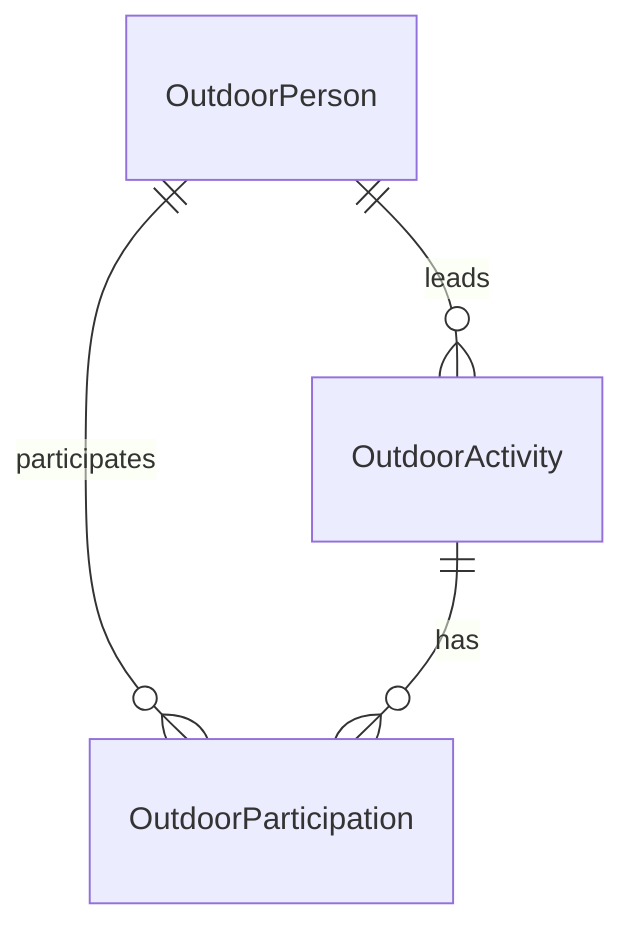

# 基于 Outdoor 业务文档的数据治理推进方案

> 本文说明如何把 [Outdoor 业务理解](Outdoor领域理解.md) 转化为 ADDP 中可治理、可计算、可供 Copilot 使用的语义资产。它是推进方案，不把尚未审核的候选对象直接当作平台事实。

## 1. 目标与边界

目标不是把 MongoDB 四个 collection 原样搬进 ADDP，而是建立一条可验证的链路：

```text
业务确认
  -> 物理事实核验
  -> Standard 语义资产
  -> Meta 物理字段绑定
  -> Model 逻辑实体与关系
  -> 指标计算计划
  -> Copilot 小模型上下文
  -> 查询/工作流生成与结果回归
```

模块边界保持如下：

- `Standard` 拥有 Outdoor 业务域、术语、数据元、码值、单位、指标和定义文档；
- `Meta` 拥有 MongoDB collection、字段路径、动态 schema 采样事实和资源定位；
- `Model` 拥有租户级实体、实体关系、逻辑表和 Standard 指标引用，不复制 Standard 事实；
- `Copilot` 只消费经过验证的资源事实和已审核语义上下文，形成结构化计划，最终由确定性编译器生成 MQL 或工作流；
- `Graph`、`Asset`、`Service` 等模块只在各自 owner 边界内消费已发布语义，不新增第二套 Outdoor 事实源。

照片、人脸、强度自动计算、群组排行和路线分析不进入第一批闭环。它们保留在业务文档中作为后续专题，避免不确定语义阻塞核心人员/活动指标。

## 2. 推进原则

### 2.1 文档先于代码

业务文档中的“已确认”“观察事实”“待确认”必须分开。待确认内容只能作为候选或结构化澄清，不能自动写入已批准指标、查询编译规则或小模型固定提示词。

### 2.2 主体事实与摘要分离

活动成员、当前主领队、活动状态等主体事实优先来自 `Outdoors`；`Persons.myOutdoors`、`entriedOutdoors`、`caredOutdoors` 是人员侧索引或摘要。任何冲突都要保留数据质量证据，不能静默选择一方。

### 2.3 指标先声明粒度，再声明公式

每个指标必须明确：统计对象、事实粒度、关系口径、时间范围、状态过滤、去重键、空值处理、零分母规则、事实来源和结果单位。指标名称相似不代表可以共用公式。

### 2.4 小模型只做受约束的语义选择

27B 模型不应从整篇业务文档自由编写 MongoDB 查询。模型只选择已注册的实体、关系、字段、指标、状态枚举和计算操作；缺少必需语义时返回澄清；查询文本由确定性编译器生成。

### 2.5 敏感信息最小化

OpenID、电话、紧急联系人、人脸向量、人脸框、外部账号和照片原始内容不进入默认 Copilot 上下文。语义上下文只提供字段作用、身份解析方式、脱敏后的样例和权限约束。

## 3. 阶段一：冻结业务语义基线

### 3.1 当前业务决策

| 决策 | 当前口径 |
| --- | --- |
| 初始发起人与当前主领队 | 创建账号 `Outdoors._openid` 表示初始发起来源；当前负责活动的人按 `leader`/当前主领队计算，不能用转让后的 `members[0]` 还原历史发起人 |
| 报名活动 | 报名、替补、占坑均计入；退出后不计入 |
| 实际参加活动 | `报名中`、`领队`、`领队组`计入；替补、占坑、浏览中不计入 |
| 活动成行 | `拟定中`为草稿，`已取消`为未成行，其他状态统一为成行 |
| 群组与活动 | 不建立必然组织关系 |
| 照片/人脸 | 第一阶段暂不治理；`Photos._openid` 不作为活动归属键 |
| 定向活动重叠率 | `|A∩B|/|A|` 与 `|A∩B|/|B|` 同时返回 |

### 3.2 保留为工作假设、待历史数据验证的内容

人员侧 `myOutdoors`、`entriedOutdoors`、`caredOutdoors` 均属于可能悬空的缓存索引，活动主体事实不依赖这些数组；`addMembers` 是否计入实际参加仍待业务确认，第一阶段先排除。强度公式不进入本批次，直接使用最终强度数字。默认排除草稿、取消和缺少活动日期的活动；零分母时结果为 0。

### 3.3 交付物

- 更新后的 [Outdoor 业务理解](Outdoor领域理解.md)；
- 一份业务决策记录，记录决策人、确认时间和适用范围；
- 每个待确认问题的状态：`待确认`、`已确认` 或 `不适用`；
- 不把一次 MongoDB 数据快照中的记录数写成长期业务规则。

## 4. 阶段二：Meta 物理事实与数据质量核验

### 4.1 资源与字段事实

通过 MongoDB Engine 和 Meta 的统一扫描路径登记：

- `Outdoor.Persons`、`Outdoor.Outdoors`、`Outdoor.Groups`、`Outdoor.Photos` 四个 collection；
- MongoDB 目录路径 `database -> collection`；
- 嵌套字段完整路径，如 `members.entryInfo.status`、`title.level`、`myOutdoors.id`；
- 数值/string 混合、object/array 混合、空数组和字段缺失情况；
- 动态键结构：`Groups.members.*`、`Persons.facecodes.*`、`Outdoors.photos.*`；
- 记录数、字段覆盖率和采样范围。

当前已完成的 Meta 基线核验：Business MongoDB engine `11` 的 `Outdoor/Outdoors` 集合已深度扫描，记录数为 2,383；字段画像覆盖 `_id`、`_openid`、`status`、`members`、`members.personid`、`members.entryInfo.status`、`title.date` 和 `title.level`。其中 `title.level` 当前画像为字符串，不能在语义层假设其原生类型为数值；第一阶段仅使用其最终强度业务值，数值计算必须由确定性查询计划显式转换并对非数值值做质量处理。Meta 页面已能展开到集合并查看预览和字段属性，说明本批次物理资源事实具备进入字段绑定和指标回归的条件。

Meta 只记录结构化字段事实，不写入人脸向量、照片原图或完整样本记录作为长期元数据。动态键要表达为“按业务标识索引的映射”，不能把某一次样本中的键注册成标准字段。

### 4.2 第一批关系一致性检查

| 检查 | 目标 |
| --- | --- |
| 活动成员 `personid` 是否存在 | 识别悬空人员引用 |
| 主领队是否能映射成员或人员 | 识别转让、退出和快照不一致 |
| `entriedOutdoors` 活动 ID 是否存在 | 识别人员侧历史摘要失效 |
| `myOutdoors` 与当前主领队是否一致 | 观察转让后的摘要保留规则 |
| 成员状态和值类型分布 | 发现新状态和历史脏值 |
| 活动状态分布 | 验证草稿、取消、成行分类 |

照片、人脸和 `Photos._openid` 关系只记录观察结果，不作为第一批指标的依赖。质量检查结果由 Meta/Quality 的正式 owner 管理；不能在 Copilot 中临时查询并把检查结果当作业务定义。

### 4.3 本阶段门禁

只有字段路径、关系事实和数据质量结果可复现，才允许进入 Standard 绑定和指标验算。若扫描覆盖率不足，查询生成必须返回“需要补充元数据事实”，不能由模型根据样本猜字段。

## 5. 阶段三：Standard 语义资产

### 5.1 业务域与术语

在 Standard 建立 `Outdoor` 业务域，并优先登记：

- 户外参与者、户外活动、初始发起人、当前主领队、领队组、活动成员；
- 报名、实际参加、替补、占坑、关注/收藏；
- 活动状态、成行活动、活动路线、集合地点、活动强度；
- 定向活动重叠率。

每个术语需要定义、别名、适用范围、事实来源和禁止推断项。比如“发起活动”必须说明初始发起与当前主领队的区别，不能只绑定一个模糊同义词。

### 5.2 数据元与码值

数据元候选包括：人员标识、OpenID、昵称、活动标识、活动日期、活动地点、强度等级、累积公里数、累积爬升、强度调整比例、活动状态、成员报名状态和群组标识。

成员状态应建立码值集，但“是否实际参加”不应只依赖码值名称。推荐同时登记经审核的业务映射：

```text
报名中 -> actual_participation = true
领队 -> actual_participation = true
领队组 -> actual_participation = true
替补中 -> actual_participation = false
占坑中 -> actual_participation = false
浏览中 -> pending_confirmation
```

OpenID 等身份字段应设置安全等级；Copilot 只消费字段语义和经过授权的人员候选，不消费原始敏感值。

### 5.3 第一批指标

| 指标 | 粒度 | 核心公式/过滤 | 主要事实源 |
| --- | --- | --- | --- |
| 当前负责活动数 | 人员 | 当前主领队为该人员的活动 ID 去重数 | `Outdoors.leader`/成员角色 |
| 报名活动数 | 人员 | 报名、替补、占坑关系的活动 ID 去重数，排除退出 | 活动成员或 `entriedOutdoors` |
| 实际参加活动数 | 人员 | 状态为报名中、领队、领队组的活动 ID 去重数 | `Outdoors.members[]` |
| 当前负责或参加的不同活动数 | 人员 | 当前负责集合与实际参加集合按活动 ID 去重并集 | `Outdoors` |
| A 视角的 B 重叠率 | 人员对 | `|A∩B| / |A|` | 实际参加活动集合 |
| B 视角的 A 重叠率 | 人员对 | `|A∩B| / |B|` | 实际参加活动集合 |

每个指标进入 Standard 前都要补齐：时间过滤、草稿和取消状态处理、失效引用、零分母、是否将领队角色计为参加，以及结果为空时的返回语义。

## 6. 阶段四：Standard 与 Meta 的物理绑定

绑定应以“标准语义 -> 物理字段路径/映射结构”为主，不把 MongoDB 路径直接当作术语：

| 标准语义 | 物理绑定候选 | 绑定说明 |
| --- | --- | --- |
| 人员标识 | `Persons._id`、`members[].personid` | 同一人员标识在不同 collection 的引用路径 |
| 当前主领队 | `Outdoors.leader`、`members[].entryInfo.status` | 需要验证 leader 对象和成员角色的一致性 |
| 成员报名状态 | `Outdoors.members[].entryInfo.status` | 码值映射决定报名与实际参加 |
| 活动标识 | `Outdoors._id`、人员摘要 `*.id` | 活动主体以 `Outdoors._id` 为准 |
| 活动强度 | `title.level`、`title.addedLength`、`title.addedUp`、`title.adjustLevel` | 公式未闭合前只绑定数据元，不发布派生指标 |

`Persons` 中的摘要数组、成员展示快照和活动主体事实属于不同事实层级，绑定时必须明确“当前主体事实”“历史快照”“加速索引”三类角色。

## 7. 阶段五：Model 逻辑模型

Model 只保存经过 Standard 验证的引用，第一批建议形成：

- `OutdoorPerson`：人员身份、履历和可授权的展示属性；
- `OutdoorActivity`：活动主体、日期地点、强度、状态和当前主领队；
- `OutdoorParticipation`：人员与活动的报名、角色和实际参加状态。

当前 MongoDB 把成员嵌入活动文档，不代表逻辑模型也必须保持嵌套。Model 的实体关系应服务于粒度和指标计算，但不能伪造 MongoDB 中不存在的历史事实。



群组、照片和人脸暂不进入第一批 Model 设计；群组与活动之间不建立默认关系。

## 8. 阶段六：Copilot 语义上下文与计算过程

### 8.1 面向 27B 的最小语义包

Copilot 不直接喂入整篇讨论稿，而是由已批准 Standard 资产和 Meta 事实生成版本化语义包。语义包至少包含：

```json
{
  "domain": "outdoor",
  "entities": ["person", "activity", "participation"],
  "identities": {
    "person": ["Persons._id"],
    "activity": ["Outdoors._id"]
  },
  "relationships": [
    "person_current_leader_activity",
    "person_signup_activity",
    "person_actual_participation_activity"
  ],
  "approved_metrics": [
    "current_responsible_activity_count",
    "signup_activity_count",
    "actual_participation_activity_count",
    "directional_activity_overlap_rate"
  ],
  "uncertainties": [
    "browser_status",
    "leader_transfer_my_outdoors_retention"
  ]
}
```

实际字段路径、枚举和指标定义应由系统从已审核事实生成，不在提示词中复制第二份易漂移的规则。

### 8.2 结构化查询计划

对于“某人参加了多少活动”这类请求，模型应输出语义计划：

1. 解析人员候选，不以昵称直接当稳定身份；
2. 选择 `actual_participation_activity` 关系；
3. 选择 `activity_id` 去重；
4. 应用已批准的成员状态映射；
5. 明确时间范围、活动状态和空值规则；
6. 计划闭合后由 MQL 编译器生成查询；
7. 返回计算过程、字段证据和结果引用。

对于定向重叠率，计划必须明确两个人、实际参加关系和两个方向的分母。不能把用户的“重叠度”自动改写为 Jaccard 或对称相似度。

### 8.3 澄清机制

以下情况必须返回结构化澄清：

- 同名人员无法唯一解析；
- 用户说“报名”但未说明是否包含替补/占坑，而当前指标不存在批准口径；
- 用户说“参加”但 `浏览中` 是否计入仍未确认；
- 未提供时间范围，而指标定义要求时间窗口；
- 用户说“重叠度”但未说明是实际参加还是报名集合；
- 分母为空、活动状态过滤或失效引用处理未闭合；
- 查询需要未扫描、字段覆盖不足或动态结构无法安全解释。

小模型可以提出候选解释，但不能把候选解释写入 `assumptions` 后继续编译。

## 9. 阶段七：验证与小模型回归集

### 9.1 指标金样

为每个已批准指标准备人工可核对的金样：

- 选定人员的稳定 ID、昵称候选和授权范围；
- 参与活动 ID 集合及每个成员状态；
- 领队转让、退出、替补、占坑和重复摘要案例；
- 共同活动集合和两个方向的重叠率；
- 空集合、零分母、失效引用和草稿/取消活动案例。

金样必须记录“期望集合”和“期望公式”，不能只记录最终数字，否则无法定位去重、过滤和分母错误。

### 9.2 分层验证

| 层级 | 验证内容 |
| --- | --- |
| Meta | 字段路径、动态 schema、记录数和关系质量检查 |
| Standard | 术语、数据元、码值、指标公式和生命周期校验 |
| Model | 实体粒度、关系方向、指标引用和版本约束 |
| Copilot | 语义计划、澄清、敏感信息过滤和资源事实引用 |
| Query/MQL | 编译结果只使用已验证 collection/字段，且计算过程与指标定义一致 |
| 端到端 | 用户问题 -> 澄清 -> 计划 -> MQL -> 结果与解释 |

### 9.3 27B 验收标准

重点不是让模型“记住文档”，而是验证它是否能在受控上下文中稳定完成：

1. 正确区分报名、替补、占坑和实际参加；
2. 正确区分初始发起人与当前主领队；
3. 使用活动 ID 去重，不用标题去重；
4. 正确返回两个方向的重叠率；
5. 对未确认语义主动澄清，不猜测；
6. 不泄露 OpenID 等敏感信息；
7. 生成的 MQL 能由确定性校验器验证并复现指标公式。

## 10. 模块责任与实施顺序

| 顺序 | Owner 模块 | 主要交付 |
| ---: | --- | --- |
| 1 | 业务/架构 + 文档 | 确认业务口径，更新 Outdoor 业务文档和决策记录 |
| 2 | Meta | 完成 MongoDB `Persons`、`Outdoors`、`Groups` 的深度扫描和字段事实 |
| 3 | Quality | 关系一致性、状态分布、失效引用质量检查 |
| 4 | Standard | 建立 Outdoor 域、术语、数据元、码值、指标和绑定入口 |
| 5 | Model | 建立 Person/Activity/Participation 逻辑模型和指标引用 |
| 6 | Copilot | 生成语义包、计划槽位、澄清和确定性 MQL 编译支持 |
| 7 | Develop/Monitor | 查询预览、执行、审计、结果解释和统一监控 |

不能先在 Copilot 中硬编码 Outdoor 规则，再反向补 Standard；也不能在 Model 中复制一套独立指标定义。每次实现必须同步对应测试入口和 CI 门禁，至少覆盖受影响模块的标准测试。

## 11. 第一轮建议范围

第一轮只做 Person、Activity、Participation 三个核心对象和六项指标：

1. 当前负责活动数；
2. 报名活动数；
3. 实际参加活动数；
4. 当前负责或实际参加的不同活动数；
5. A 视角的 B 重叠率；
6. B 视角的 A 重叠率。

第一轮的最小闭环是：

```text
业务口径确认
 -> Persons/Outdoors Meta 深度扫描
 -> Standard 术语/数据元/指标
 -> Model Person/Activity/Participation
 -> Copilot 结构化计划
 -> MQL 确定性编译
 -> 金样回归
```

只有这条链路在样例和边界案例上通过，才扩展到 `Groups`、`Photos`、人脸识别、强度公式和路线分析。

## 12. 当前租户的首轮配置记录（2026-08-24）

本轮使用已登录 Console，通过 Standard 和 Model 完成最小垂直切片：

| 模块 | 已配置内容 | 状态 |
| --- | --- | --- |
| Standard 业务域 | 已核对 `户外域 / outdoor`，未重复创建 | 已存在 |
| Standard 码值集 | `outdoor_member_status`，录入报名中、领队、领队组、替补中、占坑中、浏览中六项 | 已创建 |
| Standard 业务术语 | 初始发起人、当前主领队、实际参加、成行活动、定向活动重叠率 | 已审批 |
| Standard 指标 | `outdoor_actual_participation_activity_count`（实际参加活动数） | 已审批 |
| Standard 指标 | `outdoor_signup_activity_count`（报名活动数） | 已审批 |
| Standard 指标 | `outdoor_current_responsible_activity_count`（当前负责活动数） | 已审批 |
| Model 实体 | 活动、人员、活动参与；已绑定 Outdoor 数据元并补齐主键 | 已审批 |
| Model 关系 | 人员 -> 活动参与（一对多）；活动 -> 活动参与（一对多） | 已配置 |

旧的“参加活动次数”及其派生依赖因口径不完整已删除；客户域、性别码值集等无冲突资产未修改。

## 13. 首轮验证得到的能力缺口

1. 指标新建和详情界面现已补充业务域选择；`outdoor_actual_participation_activity_count` 已通过正式更新接口绑定 `户外域`，未改变其数据元或 Model 引用。
2. Model 属性可以表达标量类型，但不能表达 `members[]` 展开、`title.date`/`title.level` 嵌套路径及数组元素过滤；这些必须由 Meta locator 和逻辑表绑定承载。
3. Model 关系类型只有一对一、一对多、多对多；主体 -> 活动参与应使用一对多，不能误建反向的“活动参与 -> 活动”一对多。
4. Model 属性的数据元选择闭环已验证可用；Standard 数据元详情页现已补充业务域编辑入口，早期创建的“活动标识”已通过带版本校验的正式更新接口绑定 `户外域`，未改变其 Model 引用。
5. 指标审批只校验标准定义，不校验 MongoDB 字段事实、状态码值和可执行计算计划；发布前仍需要 Meta/Copilot 事实门禁。

### 13.1 Meta 核验结果（2026-08-24）

通过已登录 Console 的 Meta 扫描页面及 `meta.meta_item` 只读核验，MongoDB `Business MongoDB` 的 `Outdoor` 数据库已完成 `deep` 扫描。当前已确认：

- `Outdoors` item id 为 `51659`，`Persons` item id 为 `51657`，`Groups` item id 为 `51658`，`Photos` item id 为 `51656`；
- `Outdoors.members.personid`、`Outdoors.members.entryInfo.status`、`Outdoors.title.date`、`Outdoors.title.level`、`Outdoors._id` 已保留为字段路径；
- `Persons._id`、`Persons.userInfo.nickName`、`Persons.myOutdoors`、`Persons.entriedOutdoors`、`Persons.caredOutdoors` 已保留为字段路径；
- `Photos` 暂不作为第一批指标事实源，不能用 `Photos._openid` 推断活动归属。

结论：当前不需要修改 MongoDB 动态 schema 扫描器；Standard 数据元、Model 属性和首个指标的业务域绑定已完成，下一步进入可执行查询计划编译与事实门禁。

### 13.2 已配置的 Standard 数据元

已创建并审批：人员标识、人员昵称、活动日期、活动状态、最终强度、成员人员标识、成员状态；活动标识已创建并审批，并已绑定 `户外域`。此前编码误录的人员标识草稿已删除并按 `outdoor_person_id` 重建。

### 13.3 Model 绑定与审批结果

人员、活动、活动参与三个实体的关键属性已关联 Standard 数据元，并分别补齐主键属性；人员 -> 活动参与、活动 -> 活动参与两条一对多关系保持不变。三个实体均已审批通过。`actual_participation` 是由成员状态映射得到的派生属性，不直接绑定物理字段。

### 13.4 首个指标的真实数据验算

使用 `Outdoor.Outdoors` 的真实数据按已审批口径独立验算：排除 `拟定中`、`已取消` 和缺少 `title.date` 的活动；展开 `members[]`；仅保留 `报名中`、`领队`、`领队组`；按 `Outdoors._id` 去重。当前快照得到 681 个有效活动、1,099 个出现实际参加关系的人员、6,799 个去重后的人员-活动关系。示例最高值为人员 `W7cw8J25dhqgDMHA`（昵称“攀爬”）实际参加 286 个活动。

该结果证明业务口径和物理字段可以闭合；当前 Standard 指标已绑定 `户外域`，但尚未绑定可执行 MQL/查询计划，下一步要补确定性编译和结果回归，而不是继续增加指标数量。

下一步不再继续批量创建指标，而是把已审批指标接入可执行查询计划、Meta/Copilot 事实门禁和真实数据回归。

### 13.5 首个指标的通用查询计划能力（2026-08-25）

首个“实际参加活动数”指标暴露了原有 MQL 强类型计划的边界：`count_array_elements` 只能计算每条文档数组长度，不能表达“展开 `members[]`、过滤成员状态、按人员分组、按活动 `_id` 去重后计数”。这不是 Outdoor 专属规则，应由 Copilot 的通用计划能力承担。

已补充 `count_distinct_array_elements` 语义操作，计划必须声明：

- `field`：待展开的数组字段；
- `element_filters`：数组元素级过滤条件；
- `group_by`：数组元素归属实体字段，例如 `members.personid`；
- `distinct_by`：去重身份字段，例如活动主体 `Outdoors._id`。

编译器按以下固定顺序生成单个 MQL `aggregate` command：

```text
有效活动过滤
  -> $unwind members
  -> 成员状态过滤
  -> 身份字段非空过滤
  -> group_by + distinct_by 复合去重
  -> 按 group_by 聚合计数
```

模型只选择已验证 collection、字段和状态值，不生成 pipeline。`in` 状态集合会被展开为独立的标量参数；活动日期的存在性和空字符串过滤也属于计划条件。该路径仍由 Develop 负责保存、预检和执行，Copilot 只返回候选查询和参数定义。

当前运行中的 `Outdoor.Outdoors` 快照按同一计划独立回归得到：583 个出现实际参加关系的人员、4,886 条去重后的人员-活动关系，最高人员“攀爬”（`W7cw8J25dhqgDMHA`）为 286 个活动。该快照与 2026-08-24 文档基线的总量不同，属于源数据变化；回归必须同时记录快照时间和口径，不能把任一批次数字写成业务定义。

Standard 指标 `outdoor_actual_participation_activity_count` 已通过登录 Console 的正式更新接口写入上述强类型计划，当前版本为 4、状态仍为已审批。配置只保存语义计划，不保存 MQL 文本；Meta collection、字段事实和执行范围仍由 Develop/Copilot 的资源事实链路提供。

### 13.8 第二个指标：报名活动数（2026-08-25）

已在 Standard 正式创建并审批 `outdoor_signup_activity_count`（指标 ID `5`），所属业务域为 `户外域`。指标沿用首个指标的有效活动过滤和复合去重计划，仅将成员状态集合扩展为：

```text
报名中、领队、领队组、替补中、占坑中
```

`浏览中` 不计入报名关系。语义计算配置仍使用 `count_distinct_array_elements`，以 `members.personid + Outdoors._id` 去重；未使用 `Persons.entriedOutdoors[]` 作为主体事实源。该指标已通过审批，但尚未进行独立的真实数据结果回归；下一步应执行其 MQL 并与实际参加活动数做边界对照，确认替补和占坑关系确实只增加报名指标、不增加实际参加指标。

随后已在 Develop 查询工作台执行对应 MQL，使用同一 `Outdoor/Outdoors` Meta 资源和相同的有效活动过滤，执行成功，耗时 37ms；工作台展示前 500 行并标记结果截断。该执行只证明计划可运行，完整人员总量和报名/实际参加差异仍需通过全量汇总或专门对照查询回归，不以工作台的 500 行展示上限作为统计总量。

### 13.9 报名与实际参加边界回归（2026-08-25）

使用 Business MongoDB 中 `Outdoor.Outdoors` 的当前快照，直接执行与两个指标相同的有效活动过滤和 `members.personid + Outdoors._id` 复合去重，并对报名集合与实际参加集合做集合差异计算，结果如下：

| 校验项 | 当前快照结果 |
| --- | ---: |
| 有效活动数 | 681 |
| 报名人员-活动关系数 | 4,944 |
| 实际参加人员-活动关系数 | 4,886 |
| 报名但未实际参加 | 58 |
| 实际参加但未报名 | 0 |
| 其中替补中 | 34 |
| 其中占坑中 | 24 |

`34 + 24 = 58`，且实际参加集合没有反向差异，证明当前数据同时满足三条边界：替补和占坑计入报名、不计入实际参加；`浏览中` 不会被两个集合纳入；活动主体事实和活动 ID 去重逻辑闭合。该结果是快照回归证据，不应写入指标定义作为固定业务常量。

### 13.10 第三个指标：当前负责活动数（2026-08-25）

已在 Standard 正式创建并审批 `outdoor_current_responsible_activity_count`（指标 ID `6`），所属业务域为 `户外域`。指标以 `Outdoors.leader.personid` 作为当前主领队身份，按 `Outdoors._id` 去重；不使用创建账号 `_openid`，也不使用人员侧 `myOutdoors[]` 缓存索引。有效活动过滤与前两个指标一致。

为表达该指标，Copilot 增加通用语义操作 `count_distinct_documents`：`group_by` 声明文档归属字段，`distinct_by` 声明文档身份字段；确定性编译器补充非空身份过滤和两级 `$group`，模型不直接生成 MQL pipeline。当前快照独立回归得到 75 位当前主领队、577 条有效活动负责关系，最高人员 `W7cw8J25dhqgDMHA` 当前负责 224 个活动。

核对 Meta 时发现 `Outdoors` 动态 schema 正好达到 200 字段上限，旧扫描顺序会先耗尽在按字典序靠前的大型嵌套对象上，导致真实存在的顶层 `leader` 没有进入字段事实。扫描器已改为按层、按父路径交错采集，使有限字段预算优先覆盖不同顶层对象，再逐层补嵌套字段；没有增加 Outdoor 字段白名单，也没有提高字段数量上限。重新扫描后必须以 Meta 出现 `leader.personid` 作为第三个指标 Copilot 闭环的发布门禁。

### 13.6 Model 逻辑表与星型关系（2026-08-25）

在已有 Person、Activity、Participation 业务实体和“活动参与事实”逻辑表基础上，已通过 Model 正式界面补齐三张可执行逻辑表：

| 逻辑表 | 物理表 | 类型 | 状态 |
| --- | --- | --- | --- |
| 人员维度 | `dim_outdoor_person` | dimension | 已审批 |
| 活动维度 | `dim_outdoor_activity` | dimension | 已审批 |
| 活动参与事实 | `dwd_outdoor_participation` | fact | 已审批 |

事实表粒度为“每行一条有效户外活动中的人员参与关系”，复合主键为 `person_id + activity_id`。星型关系已配置为：

- `活动参与事实.person_id -> 人员维度.person_id`（FK）
- `活动参与事实.activity_id -> 活动维度.activity_id`（FK）

事实表保留成员状态、活动日期、实际参加标识和最终强度字段；实际参加标识是由成员状态按业务口径派生的治理字段。该逻辑模型用于承载指标粒度和维度导航，不改变 MongoDB `Outdoors` 作为活动主体事实源的原则。

### 13.7 Meta -> Develop 首个指标执行回归（2026-08-25）

在已登录 Console 中，通过 Develop 查询工作台选择 Business MongoDB、MQL 和 `Outdoor` 数据库，执行与首个指标计划一致的确定性查询。查询使用 Meta 已验证的 `Outdoors` collection，并按以下顺序执行：活动状态和日期有效性过滤、展开 `members`、成员状态过滤、人员与活动复合去重、按人员计数。

本次真实执行结果：请求成功，执行耗时 61ms，返回 500 行（工作台结果展示上限为 500 行，结果标记为截断）；结果中包含人员 `W7cw8J25dhqgDMHA` 的 `actual_activity_count = 286`，与独立回归结果一致。Develop 执行日志确认目标定位为 `addp://engine/11/path/Outdoor?type=database`，执行状态为 `success`。这证明 Meta 资源事实、MQL 预检、MongoDB 执行器和结果回传已经形成闭环；全量人员数量应通过专门的汇总查询或导出处理，不能把“返回行数 500”误当作人员总数。

同时，在同一工作台使用 AI 查询助手提交相同业务描述，资源发现阶段正确列出 `Groups`、`Outdoors`、`Persons`、`Photos` 并要求确认 `Outdoors`。确认后的第二次请求最终返回 HTTP 200，但本地 `qwen3.8:27b-mlx` 结构化推理耗时约 58.9 秒，网关总耗时约 59.1 秒；因此页面长时间显示生成中是低延迟体验问题，不是资源发现失败或 API 丢响应。当前查询助手仍应补充明确的长耗时状态提示或异步执行体验，但这不阻塞确定性计划编译和指标回归。
