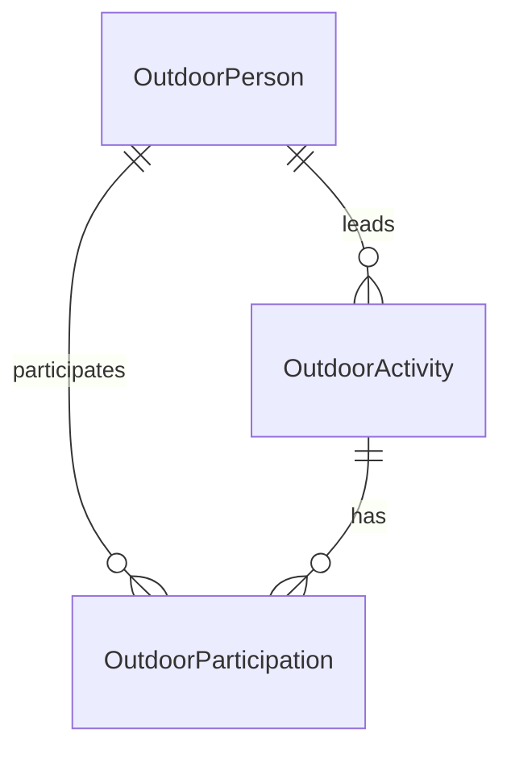
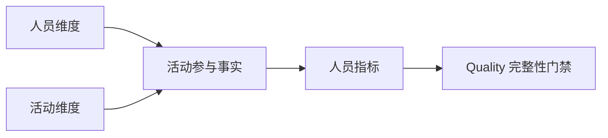

# 基于 Outdoor 业务文档的数据治理推进方案

> 本文说明如何把 [Outdoor 业务理解](Outdoor领域理解.md) 转化为 ADDP 中可治理、可计算、可供 Copilot 使用的语义资产。它是推进方案，不把尚未审核的候选对象直接当作平台事实。

> 当前目标（2026-09-14）：删除发布组和暂存批次。Model 独立创建正式表；唯一编排 10 收敛为 3 个 ODS 同步、4 个 Develop 正式表覆盖计算和 1 个 Quality 数据校验，共 8 步。保留 16 条质量断言。以下历史执行记录仅作背景，不代表当前运行路线。

## 1. 目标与边界

目标不是把 MongoDB 四个 collection 原样搬进 ADDP，而是建立一条可验证的链路：

```text
业务确认
  -> 物理事实核验
  -> Standard 语义资产
  -> Meta 物理字段绑定
  -> Model 逻辑实体与关系
  -> Transfer 将 MongoDB 贴源同步到 PostgreSQL ODS
  -> Model 准备 DIM/DWD/DWS 物化批次
  -> Develop 基于 ODS 计算 DIM/DWD，再基于同批 DIM/DWD 计算 DWS
  -> Quality 数据门禁
  -> Orchestrator 统一重算
  -> Copilot/Service 消费已发布指标结果
```

模块边界保持如下：

- `Standard` 拥有 Outdoor 业务域、术语、数据元、码值、单位、指标和定义文档；
- `Meta` 拥有 MongoDB collection、字段路径、动态 schema 采样事实和资源定位；
- `Model` 拥有实体与逻辑模型，负责根据审批结构创建正式表和显式退役目标；
- `Transfer` 只负责引擎间数据同步：通过 bounded query-source 执行只读 MongoDB MQL，将嵌套 BSON 做贴源结构整理后写入任务自身配置的 PostgreSQL ODS 固定目标；它不认识 Model；
- `Develop` 从 PostgreSQL ODS 计算正式 DIM/DWD，再计算正式 DWS；每次覆盖在单表事务内完成，不直接查询 MongoDB；
- `Quality` 负责物化结果的主键、引用完整性、业务关系和指标结果门禁；
- `Orchestrator` 只引用各 owner 模块的持久任务，形成支持手动执行和定时调度的唯一全量重算 DAG；
- `Copilot` 只消费经过验证的资源事实、已审核语义上下文和已发布指标结果；MongoDB MQL 编译结果只保留为指标金样和开发期回归工具，不作为生产指标计算路线；
- `Graph`、`Asset`、`Service` 等模块只在各自 owner 边界内消费已发布语义，不新增第二套 Outdoor 事实源。

照片、人脸、强度自动计算、群组排行和路线分析不进入第一批闭环。它们保留在业务文档中作为后续专题，避免不确定语义阻塞核心人员/活动指标。

## 2. 推进原则

### 2.1 文档先于代码

业务文档中的“已确认”“观察事实”“待确认”必须分开。待确认内容只能作为候选或结构化澄清，不能自动写入已批准指标、查询编译规则或小模型固定提示词。

### 2.2 主体事实与摘要分离

活动成员、当前主领队、活动状态等主体事实优先来自 `Outdoors`；`Persons.myOutdoors`、`entriedOutdoors`、`caredOutdoors` 是人员侧索引或摘要。任何冲突都要保留数据质量证据，不能静默选择一方。

### 2.3 指标先声明粒度，再声明公式

每个指标必须明确：统计对象、事实粒度、关系口径、时间范围、状态过滤、去重键、空值处理、零分母规则、事实来源和结果单位。指标名称相似不代表可以共用公式。

### 2.4 小模型只做受约束的语义选择

27B 模型不应从整篇业务文档自由编写 MongoDB 查询。模型只选择已注册的实体、关系、字段、指标、状态枚举和计算操作；缺少必需语义时返回澄清；查询文本由确定性编译器生成。

### 2.5 敏感信息最小化

OpenID、电话、紧急联系人、人脸向量、人脸框、外部账号和照片原始内容不进入默认 Copilot 上下文。语义上下文只提供字段作用、身份解析方式、脱敏后的样例和权限约束。

## 3. 阶段一：冻结业务语义基线

### 3.1 当前业务决策

| 决策 | 当前口径 |
| --- | --- |
| 初始发起人与当前主领队 | 创建账号 `Outdoors._openid` 表示初始发起来源；当前负责活动的人按 `leader`/当前主领队计算，不能用转让后的 `members[0]` 还原历史发起人 |
| 报名活动 | 报名、替补、占坑均计入；退出后不计入 |
| 实际参加活动 | `报名中`、`领队`、`领队组`计入；替补、占坑、浏览中不计入 |
| 活动成行 | `拟定中`为草稿，`已取消`为未成行，其他状态统一为成行 |
| 群组与活动 | 不建立必然组织关系 |
| 照片/人脸 | 第一阶段暂不治理；`Photos._openid` 不作为活动归属键 |
| 定向活动重叠率 | `|A∩B|/|A|` 与 `|A∩B|/|B|` 同时返回 |

### 3.2 保留为工作假设、待历史数据验证的内容

人员侧 `myOutdoors`、`entriedOutdoors`、`caredOutdoors` 均属于可能悬空的缓存索引，活动主体事实不依赖这些数组；`addMembers` 是否计入实际参加仍待业务确认，第一阶段先排除。强度公式不进入本批次，直接使用最终强度数字。默认排除草稿、取消和缺少活动日期的活动；零分母时结果为 0。

### 3.3 交付物

- 更新后的 [Outdoor 业务理解](Outdoor领域理解.md)；
- 一份业务决策记录，记录决策人、确认时间和适用范围；
- 每个待确认问题的状态：`待确认`、`已确认` 或 `不适用`；
- 不把一次 MongoDB 数据快照中的记录数写成长期业务规则。

## 4. 阶段二：Meta 物理事实与数据质量核验

### 4.1 资源与字段事实

通过 MongoDB Engine 和 Meta 的统一扫描路径登记：

- `Outdoor.Persons`、`Outdoor.Outdoors`、`Outdoor.Groups`、`Outdoor.Photos` 四个 collection；
- MongoDB 目录路径 `database -> collection`；
- 嵌套字段完整路径，如 `members.entryInfo.status`、`title.level`、`myOutdoors.id`；
- 数值/string 混合、object/array 混合、空数组和字段缺失情况；
- 动态键结构：`Groups.members.*`、`Persons.facecodes.*`、`Outdoors.photos.*`；
- 记录数、字段覆盖率和采样范围。

当前已完成的 Meta 基线核验：Business MongoDB engine `11` 的 `Outdoor/Outdoors` 集合已深度扫描，记录数为 2,383；字段画像覆盖 `_id`、`_openid`、`status`、`members`、`members.personid`、`members.entryInfo.status`、`title.date` 和 `title.level`。其中 `title.level` 当前画像为字符串，不能在语义层假设其原生类型为数值；第一阶段仅使用其最终强度业务值，数值计算必须由确定性查询计划显式转换并对非数值值做质量处理。Meta 页面已能展开到集合并查看预览和字段属性，说明本批次物理资源事实具备进入字段绑定和指标回归的条件。

Meta 只记录结构化字段事实，不写入人脸向量、照片原图或完整样本记录作为长期元数据。动态键要表达为“按业务标识索引的映射”，不能把某一次样本中的键注册成标准字段。

### 4.2 第一批关系一致性检查

| 检查 | 目标 |
| --- | --- |
| 活动成员 `personid` 是否存在 | 识别悬空人员引用 |
| 主领队是否能映射成员或人员 | 识别转让、退出和快照不一致 |
| `entriedOutdoors` 活动 ID 是否存在 | 识别人员侧历史摘要失效 |
| `myOutdoors` 与当前主领队是否一致 | 观察转让后的摘要保留规则 |
| 成员状态和值类型分布 | 发现新状态和历史脏值 |
| 活动状态分布 | 验证草稿、取消、成行分类 |

照片、人脸和 `Photos._openid` 关系只记录观察结果，不作为第一批指标的依赖。质量检查结果由 Meta/Quality 的正式 owner 管理；不能在 Copilot 中临时查询并把检查结果当作业务定义。

### 4.3 本阶段门禁

只有字段路径、关系事实和数据质量结果可复现，才允许进入 Standard 绑定和指标验算。若扫描覆盖率不足，查询生成必须返回“需要补充元数据事实”，不能由模型根据样本猜字段。

## 5. 阶段三：Standard 语义资产

### 5.1 业务域与术语

在 Standard 建立 `Outdoor` 业务域，并优先登记：

- 户外参与者、户外活动、初始发起人、当前主领队、领队组、活动成员；
- 报名、实际参加、替补、占坑、关注/收藏；
- 活动状态、成行活动、活动路线、集合地点、活动强度；
- 定向活动重叠率。

每个术语需要定义、别名、适用范围、事实来源和禁止推断项。比如“发起活动”必须说明初始发起与当前主领队的区别，不能只绑定一个模糊同义词。

### 5.2 数据元与码值

数据元候选包括：人员标识、OpenID、昵称、活动标识、活动日期、活动地点、强度等级、累积公里数、累积爬升、强度调整比例、活动状态、成员状态和群组标识。

活动源状态使用 `outdoor_activity_status`，只登记 MongoDB 可观测的六个值；“活动进行中”由活动日期和源状态共同推导，不建立第七个码值。成员状态使用 `outdoor_member_status`，表达成员名单中的队员性质：

```text
拟定中 -> draft
已发布 -> published
报名截止 -> registration_closed
已成行 -> confirmed
已结束 -> completed
已取消 -> cancelled

报名中 -> signup
领队 -> leader
领队组 -> leader_group
替补中 -> alternate
占坑中 -> hold
浏览中 -> browsing
```

不建立“领队”码值集：当前主领队是 `Outdoors.leader.personid` 表达的权威人员关系，不能由成员状态枚举替代。有效活动统一定义为活动日期有效、已经开始，且源状态不是 `draft` 或 `cancelled`；因此已经开始但源状态仍为 `published` 或 `registration_closed` 的活动按已成行处理。

OpenID 等身份字段应设置安全等级；Copilot 只消费字段语义和经过授权的人员候选，不消费原始敏感值。

### 5.3 第一批指标

| 指标 | 粒度 | 核心公式/过滤 | 主要事实源 |
| --- | --- | --- | --- |
| 当前主领队活动次数 | 人员 | 当前主领队为该人员的有效活动 ID 去重数 | `Outdoors.leader.personid` |
| 参加活动次数（含当前主领队） | 人员 | 当前主领队活动集合与成员状态为 `signup / leader / leader_group` 的有效活动集合按活动 ID 去重并集 | `Outdoors.leader`、`Outdoors.members[]` |
| 定向参加活动重叠率 | 有序人员对、即时查询 | `|A∩B| / |A|` 与 `|A∩B| / |B|` 同时返回；零分母返回 0 | 已发布的 DWD 参加活动集合 |

每个指标进入 Standard 前都要补齐：时间过滤、草稿和取消状态处理、失效引用、零分母、是否将领队角色计为参加，以及结果为空时的返回语义。

## 6. 阶段四：Standard 与 Meta 的物理绑定

绑定应以“标准语义 -> 物理字段路径/映射结构”为主，不把 MongoDB 路径直接当作术语：

| 标准语义 | 物理绑定候选 | 绑定说明 |
| --- | --- | --- |
| 人员标识 | `Persons._id`、`members[].personid` | 同一人员标识在不同 collection 的引用路径 |
| 当前主领队 | `Outdoors.leader`、`members[].entryInfo.status` | 需要验证 leader 对象和成员角色的一致性 |
| 成员报名状态 | `Outdoors.members[].entryInfo.status` | 码值映射决定报名与实际参加 |
| 活动标识 | `Outdoors._id`、人员摘要 `*.id` | 活动主体以 `Outdoors._id` 为准 |
| 活动强度 | `title.level`、`title.addedLength`、`title.addedUp`、`title.adjustLevel` | 公式未闭合前只绑定数据元，不发布派生指标 |

`Persons` 中的摘要数组、成员展示快照和活动主体事实属于不同事实层级，绑定时必须明确“当前主体事实”“历史快照”“加速索引”三类角色。

## 7. 阶段五：Model 逻辑模型

Model 只保存经过 Standard 验证的引用，第一批建议形成：

- `OutdoorPerson`：人员身份、履历和可授权的展示属性；
- `OutdoorActivity`：活动主体、日期地点、强度、状态和当前主领队；
- `OutdoorParticipation`：人员与活动的报名、角色和实际参加状态。

当前 MongoDB 把成员嵌入活动文档，不代表逻辑模型也必须保持嵌套。Model 的实体关系应服务于粒度和指标计算，但不能伪造 MongoDB 中不存在的历史事实。



群组、照片和人脸暂不进入第一批 Model 设计；群组与活动之间不建立默认关系。

## 8. 阶段六：维度物化与指标计算

生产链路固定为：

```text
Model 独立创建正式 DIM/DWD/DWS 表（结构操作）
Orchestrator 执行：Transfer 同步 ODS -> Develop 覆盖 DIM/DWD -> Develop 覆盖 DWS -> Quality 校验正式表
```


Model 拥有物化结构和发布边界，只根据已审批模型生成受控 DDL；不接受任意 DDL。Transfer 只负责 MongoDB 到 PostgreSQL ODS 的跨引擎流式同步；Develop 负责 PostgreSQL 内 ODS -> DIM/DWD -> DWS 的通用关系计算。两者都不创建、删除或修改正式逻辑表，也不依赖 Model。Orchestrator 只控制依赖、触发和执行追踪，不复制任务实现。所有生产计算都从 PostgreSQL ODS 起步；DWS 只读取同批 sealed DIM/DWD，禁止直接读取 `Outdoor.Outdoors` 或 `Outdoor.Persons`。

第一批物理表如下：

| 物理表 | 粒度 | 用途 |
| --- | --- | --- |
| `dim_outdoor_person` | 每个人员一行 | 稳定人员标识及授权展示属性 |
| `dim_outdoor_activity` | 每个活动一行 | 源状态、标准化状态、活动日期、有效活动标记、当前主领队 ID 和昵称 |
| `dwd_outdoor_participation` | 每个有效活动与参加人员组合一行 | 成员或当前主领队参加事实、成员状态、当前主领队标记和人员昵称 |
| `dws_outdoor_person_metric` | 每个人员、指标和统计范围一行 | 两项人员活动次数指标及人员昵称 |

`dwd_outdoor_participation` 必须以 `person_id + activity_id` 为复合主键。只保留有效活动中成员状态为 `signup / leader / leader_group` 的人员和当前主领队；当前主领队即使不在 `members[]` 中也必须进入事实表，并用 `is_current_leader` 明确表达。旧口径专用的 `is_signup`、`is_actual_participant` 不再保留。人员侧摘要数组不参与事实生成。

`dws_outdoor_person_metric` 属于指标事实表，不是业务实体表。它只保存两项人员预计算指标；重算 lineage 由 `common.task_executions` 和 Model MaterializationBatch 统一表达，结果表保留 `calculated_at` 作为业务消费时间事实。定向人员重叠率不进入 DWS 物化，而由 Service 对已发布事实执行带 `person_id_a`、`person_id_b` 的固定参数化 SQL 即时计算。

MongoDB `title.level` 的真实值包含 `1.9`、`2.2` 等小数。ODS 保留贴源值；`dim_outdoor_activity.activity_intensity` 和 `dwd_outdoor_participation.activity_intensity` 必须统一使用 `decimal`，由 Develop 任务 `52/53` 在业务加工阶段显式转换，转换失败写 `NULL` 并交给 Quality 观测；不得使用 `int` 截断业务值。

### 8.1 Transfer 与 Develop 持久任务

最终保留七个可独立审计和重试的持久任务：

1. Transfer `outdoor_ods_persons_refresh`（`74`）；
2. Transfer `outdoor_ods_activities_refresh`（`75`）；
3. Transfer `outdoor_ods_activity_members_refresh`（`76`）；
4. Develop `outdoor_dim_person_from_ods_refresh`（`51`）；
5. Develop `outdoor_dim_activity_from_ods_refresh`（`52`）；
6. Develop `outdoor_dwd_participation_from_ods_refresh`（`53`）；
7. Develop `outdoor_dws_person_metric_refresh`（`49`）。

前三个任务属于 Transfer bounded query-source：MongoDB MQL 只做 ODS 所需的确定性结构整理，普通对象子字段通过 `$project` 投影，成员数组通过 `$unwind` 展开，再写入三个固定 ODS 目标。Transfer 不解释 Standard 码值或 Model 业务粒度，不提供递归 JSON 自动摊平。后四个任务属于 Develop PostgreSQL SQL 查询：`51/52/53` 读取 ODS 生成 DIM/DWD，`49` 只读取同一父编排下已 sealed 的 DIM/DWD 生成 DWS。

Transfer 三个任务使用固定 ODS 目标；Develop 四个任务由 Orchestrator 显式指定固定正式表 target_locator 与 write_mode=overwrite。下游读取上游正式表；没有准备、封口或发布步骤。

### 8.2 Quality 门禁

最终门禁包括 16 项阻断级断言：维表主键非空且唯一、DWD 复合主键唯一、DWD 人员和活动引用完整、有效活动和成员状态口径可复现、人员昵称覆盖、DWS 两项指标粒度唯一及公式一致。门禁失败时本次总编排失败，不发布成功结论。

### 8.3 Orchestrator 总编排

唯一总编排命名为 `outdoor_governance_full_refresh`，手动执行和 Cron 调度必须进入同一个 DAG：



Orchestrator 的父执行 ID 作为同一次重算的稳定执行 lineage 贯穿所有子 execution 和 MaterializationBatch，不复制进 DWS 业务行。下游任务只能在依赖任务成功后启动，任一节点失败时终止后续节点。

## 9. 阶段七：Copilot 语义上下文与结果消费

### 8.1 面向 27B 的最小语义包

Copilot 不直接喂入整篇讨论稿，而是由已批准 Standard 资产和 Meta 事实生成版本化语义包。语义包至少包含：

```json
{
  "domain": "outdoor",
  "entities": ["person", "activity", "participation"],
  "identities": {
    "person": ["Persons._id"],
    "activity": ["Outdoors._id"]
  },
  "relationships": [
    "person_current_leader_activity",
    "person_participation_activity"
  ],
  "approved_metrics": [
    "outdoor_current_responsible_activity_count",
    "outdoor_responsible_or_actual_activity_count",
    "outdoor_directional_participation_overlap_rate"
  ],
  "uncertainties": [
    "browser_status",
    "leader_transfer_my_outdoors_retention"
  ]
}
```

实际字段路径、枚举和指标定义应由系统从已审核事实生成，不在提示词中复制第二份易漂移的规则。

### 8.2 结构化查询计划

对于“某人参加了多少活动”这类请求，模型应输出语义计划：

1. 解析人员候选，不以昵称直接当稳定身份；
2. 选择 `person_participation_activity` 关系；
3. 选择 `activity_id` 去重；
4. 应用已批准的成员状态映射；
5. 明确时间范围、活动状态和空值规则；
6. 生产查询读取已发布的 DWS 指标结果；
7. 返回指标版本、计算批次、字段证据和结果引用。

MongoDB MQL 编译器继续用于金样生成、源事实核验和开发期回归，不作为生产指标结果接口。Copilot 不得针对同一指标在运行时重新生成一条并行计算路线。

对于定向重叠率，计划必须明确两个稳定人员 ID、参加活动关系和两个方向的分母，并调用发布的参数化即时查询服务。不能把用户的“重叠度”自动改写为 Jaccard 或对称相似度。

### 8.3 澄清机制

以下情况必须返回结构化澄清：

- 同名人员无法唯一解析；
- 用户说“报名”但未说明是否包含替补/占坑，而当前指标不存在批准口径；
- 用户说“参加”但 `浏览中` 是否计入仍未确认；
- 未提供时间范围，而指标定义要求时间窗口；
- 用户说“重叠度”但未说明是实际参加还是报名集合；
- 分母为空、活动状态过滤或失效引用处理未闭合；
- 查询需要未扫描、字段覆盖不足或动态结构无法安全解释。

小模型可以提出候选解释，但不能把候选解释写入 `assumptions` 后继续编译。

## 9. 阶段七：验证与小模型回归集

### 9.1 指标金样

为每个已批准指标准备人工可核对的金样：

- 选定人员的稳定 ID、昵称候选和授权范围；
- 参与活动 ID 集合及每个成员状态；
- 领队转让、退出、替补、占坑和重复摘要案例；
- 共同活动集合和两个方向的重叠率；
- 空集合、零分母、失效引用和草稿/取消活动案例。

金样必须记录“期望集合”和“期望公式”，不能只记录最终数字，否则无法定位去重、过滤和分母错误。

### 9.2 分层验证

| 层级 | 验证内容 |
| --- | --- |
| Meta | 字段路径、动态 schema、记录数和关系质量检查 |
| Standard | 术语、数据元、码值、指标公式和生命周期校验 |
| Model | 实体粒度、关系方向、指标引用、物化批次和受控发布 |
| Copilot | 语义计划、澄清、敏感信息过滤和资源事实引用 |
| Transfer | 只读 MongoDB MQL、流式查询读取、贴源结构整理和 PostgreSQL ODS 固定目标写入 |
| Develop | 只读 PostgreSQL ODS 计算 DIM/DWD，再只读同批 sealed DIM/DWD 计算 DWS，并写入受限 staging |
| Quality | 主键、引用、关系口径和指标结果门禁 |
| Orchestrator | 单一 DAG、手动执行、定时执行和失败传播 |
| Query/MQL | 高级 MQL 仅作为源事实金样；生产 ODS MQL 与后续 SQL 可分层复现 |
| 端到端 | MongoDB -> ODS -> DIM/DWD -> DWS -> 质量门禁 -> 指标结果消费 |

### 9.3 27B 验收标准

重点不是让模型“记住文档”，而是验证它是否能在受控上下文中稳定完成：

1. 正确区分报名、替补、占坑和实际参加；
2. 正确区分初始发起人与当前主领队；
3. 使用活动 ID 去重，不用标题去重；
4. 正确返回两个方向的重叠率；
5. 对未确认语义主动澄清，不猜测；
6. 不泄露 OpenID 等敏感信息；
7. 生成的 MQL 能由确定性校验器验证并复现指标公式。

## 10. 模块责任与实施顺序

| 顺序 | Owner 模块 | 主要交付 |
| ---: | --- | --- |
| 1 | 业务/架构 + 文档 | 确认业务口径，更新 Outdoor 业务文档和决策记录 |
| 2 | Meta | 完成 MongoDB `Persons`、`Outdoors`、`Groups` 的深度扫描和字段事实 |
| 3 | Quality | 关系一致性、状态分布、失效引用质量检查 |
| 4 | Standard | 建立 Outdoor 域、术语、数据元、码值、指标和绑定入口 |
| 5 | Model | 建立逻辑模型和指标引用，准备受控物化批次 |
| 6 | Transfer | 执行只读 MongoDB MQL，将贴源结构整理结果流式写入 PostgreSQL ODS 固定目标 |
| 7 | Develop | 基于 ODS 生成 DIM/DWD，再基于同批 sealed DIM/DWD 生成 DWS |
| 8 | Quality | 执行物化和指标结果门禁 |
| 9 | Orchestrator | 建立唯一的手动/定时全量重算 DAG |
| 10 | Copilot/Service/Monitor | 消费已发布结果、提供解释并统一观测执行 |

不能先在 Copilot 中硬编码 Outdoor 规则，再反向补 Standard；也不能在 Model 中复制一套独立指标定义。每次实现必须同步对应测试入口和 CI 门禁，至少覆盖受影响模块的标准测试。

## 11. 第一轮建议范围

当前范围只做 Person、Activity、Participation 三个核心对象和三项指标：

1. 当前主领队活动次数；
2. 参加活动次数（含当前主领队）；
3. 定向参加活动重叠率，同时返回 A 视角和 B 视角结果。

第一轮的最小闭环是：

```text
业务口径确认
 -> Persons/Outdoors Meta 深度扫描
 -> Standard 术语/数据元/指标
 -> Model Person/Activity/Participation
 -> Transfer 通过只读 MQL 将 MongoDB 贴源同步到 PostgreSQL ODS
 -> Model 准备物化批次
 -> Develop 基于 ODS 生成 DIM/DWD，再基于同批 sealed DIM/DWD 计算 DWS
 -> Quality 门禁
 -> Orchestrator 统一重算
 -> 金样回归与结果消费
```

只有这条链路在样例和边界案例上通过，才扩展到 `Groups`、`Photos`、人脸识别、强度公式和路线分析。

## 12. 当前租户的首轮配置记录（2026-08-24）

本轮使用已登录 Console，通过 Standard 和 Model 完成最小垂直切片：

| 模块 | 已配置内容 | 状态 |
| --- | --- | --- |
| Standard 业务域 | 已核对 `户外域 / outdoor`，未重复创建 | 已存在 |
| Standard 码值集 | `outdoor_member_status`，录入报名中、领队、领队组、替补中、占坑中、浏览中六项 | 已创建 |
| Standard 业务术语 | 初始发起人、当前主领队、实际参加、成行活动、定向活动重叠率 | 已审批 |
| Standard 指标 | `outdoor_actual_participation_activity_count`（实际参加活动数） | 已审批 |
| Standard 指标 | `outdoor_signup_activity_count`（报名活动数） | 已审批 |
| Standard 指标 | `outdoor_current_responsible_activity_count`（当前负责活动数） | 已审批 |
| Standard 指标 | `outdoor_responsible_or_actual_activity_count`（当前负责或实际参加的不同活动数） | 已审批 |
| Standard 指标 | `outdoor_directional_actual_participation_overlap_rate`（定向实际参加活动重叠率，指标 ID `8`） | 已审批 |
| Model 实体 | 活动、人员、活动参与；已绑定 Outdoor 数据元并补齐主键 | 已审批 |
| Model 关系 | 人员 -> 活动参与（一对多）；活动 -> 活动参与（一对多） | 已配置 |

旧的“参加活动次数”及其派生依赖因口径不完整已删除；客户域、性别码值集等无冲突资产未修改。

## 13. 首轮验证与收敛记录

本章按日期保留方案演进和当时的验收事实，旧指标名、旧表和旧步骤数只用于说明迁移过程；当前有效成果以 13.19 为准，不得把较早小节恢复为可执行配置。

1. 指标新建和详情界面现已补充业务域选择；`outdoor_actual_participation_activity_count` 已通过正式更新接口绑定 `户外域`，未改变其数据元或 Model 引用。
2. Model 属性可以表达标量类型，但不能表达 `members[]` 展开、`title.date`/`title.level` 嵌套路径及数组元素过滤；这些必须由 Meta locator 和逻辑表绑定承载。
3. Model 关系类型只有一对一、一对多、多对多；主体 -> 活动参与应使用一对多，不能误建反向的“活动参与 -> 活动”一对多。
4. Model 属性的数据元选择闭环已验证可用；Standard 数据元详情页现已补充业务域编辑入口，早期创建的“活动标识”已通过带版本校验的正式更新接口绑定 `户外域`，未改变其 Model 引用。
5. 指标审批只校验标准定义，不校验 MongoDB 字段事实、状态码值和可执行计算计划；发布前仍需要 Meta/Copilot 事实门禁。

### 13.1 Meta 核验结果（2026-08-24）

通过已登录 Console 的 Meta 扫描页面及 `meta.meta_item` 只读核验，MongoDB `Business MongoDB` 的 `Outdoor` 数据库已完成 `deep` 扫描。当前已确认：

- `Outdoors` item id 为 `51659`，`Persons` item id 为 `51657`，`Groups` item id 为 `51658`，`Photos` item id 为 `51656`；
- `Outdoors.members.personid`、`Outdoors.members.entryInfo.status`、`Outdoors.title.date`、`Outdoors.title.level`、`Outdoors._id` 已保留为字段路径；
- `Persons._id`、`Persons.userInfo.nickName`、`Persons.myOutdoors`、`Persons.entriedOutdoors`、`Persons.caredOutdoors` 已保留为字段路径；
- `Photos` 暂不作为第一批指标事实源，不能用 `Photos._openid` 推断活动归属。

结论：不需要修改 MongoDB 动态 schema 扫描器；Standard 数据元、Model 属性和指标业务域绑定均已完成，可执行查询、事实门禁和生产物化的最终结果见 13.13～13.16。

### 13.2 已配置的 Standard 数据元

已创建并审批：人员标识、人员昵称、活动日期、活动状态、最终强度、成员人员标识、成员状态；活动标识已创建并审批，并已绑定 `户外域`。此前编码误录的人员标识草稿已删除并按 `outdoor_person_id` 重建。

### 13.3 Model 绑定与审批结果

人员、活动、活动参与三个实体的关键属性已关联 Standard 数据元，并分别补齐主键属性；人员 -> 活动参与、活动 -> 活动参与两条一对多关系保持不变。三个实体均已审批通过。`actual_participation` 是由成员状态映射得到的派生属性，不直接绑定物理字段。

### 13.4 首个指标的真实数据验算

使用 `Outdoor.Outdoors` 的真实数据按已审批口径独立验算：排除 `拟定中`、`已取消` 和缺少 `title.date` 的活动；展开 `members[]`；仅保留 `报名中`、`领队`、`领队组`；按 `members.personid + Outdoors._id` 复合去重。2026-08-26 当前快照得到 681 个有效活动、583 个出现实际参加关系的人员、4,886 个去重后的人员-活动关系。示例最高值为人员 `W7cw8J25dhqgDMHA`（昵称“攀爬”）实际参加 286 个活动。此前记录的 1,099 人和 6,799 条关系混入了未应用有效活动过滤的结果，不能作为该指标口径的回归基线。

该结果证明业务口径和物理字段可以闭合。后续已完成已审批指标的确定性查询计划、Meta/Copilot 事实门禁、真实数据回归与生产物化；本节不再保留过渡期待办。

### 13.5 首个指标的通用查询计划能力（2026-08-25）

首个“实际参加活动数”指标暴露了原有 MQL 强类型计划的边界：`count_array_elements` 只能计算每条文档数组长度，不能表达“展开 `members[]`、过滤成员状态、按人员分组、按活动 `_id` 去重后计数”。这不是 Outdoor 专属规则，应由 Copilot 的通用计划能力承担。

已补充 `count_distinct_array_elements` 语义操作，计划必须声明：

- `field`：待展开的数组字段；
- `element_filters`：数组元素级过滤条件；
- `group_by`：数组元素归属实体字段，例如 `members.personid`；
- `distinct_by`：去重身份字段，例如活动主体 `Outdoors._id`。

编译器按以下固定顺序生成单个 MQL `aggregate` command：

```text
有效活动过滤
  -> $unwind members
  -> 成员状态过滤
  -> 身份字段非空过滤
  -> group_by + distinct_by 复合去重
  -> 按 group_by 聚合计数
```

模型只选择已验证 collection、字段和状态值，不生成 pipeline。`in` 状态集合会被展开为独立的标量参数；活动日期的存在性和空字符串过滤也属于计划条件。该路径仍由 Develop 负责保存、预检和执行，Copilot 只返回候选查询和参数定义。

当前运行中的 `Outdoor.Outdoors` 快照按同一计划独立回归得到：583 个出现实际参加关系的人员、4,886 条去重后的人员-活动关系，最高人员“攀爬”（`W7cw8J25dhqgDMHA`）为 286 个活动。该快照与 2026-08-24 文档基线的总量不同，属于源数据变化；回归必须同时记录快照时间和口径，不能把任一批次数字写成业务定义。

重叠率批量计算对象固定为“当前负责或实际参加的不同活动数”最多的 10 个人：先按指标 `outdoor_responsible_or_actual_activity_count` 的活动去重并集降序排序，人员标识作为同值时的稳定次序；再对实际人数生成无序人员对，10 人时共 45 对。每一对只存一行，但同时输出 A→B 与 B→A 两个方向的重叠率。少于 10 人时按实际人数生成组合，空集合返回空结果且不报错。

Standard 指标 `outdoor_actual_participation_activity_count` 已通过登录 Console 的正式更新接口写入上述强类型计划，当前版本为 4、状态仍为已审批。配置只保存语义计划，不保存 MQL 文本；Meta collection、字段事实和执行范围仍由 Develop/Copilot 的资源事实链路提供。

### 13.6 第二个指标：报名活动数（2026-08-25）

已在 Standard 正式创建并审批 `outdoor_signup_activity_count`（指标 ID `5`），所属业务域为 `户外域`。指标沿用首个指标的有效活动过滤和复合去重计划，仅将成员状态集合扩展为：

```text
报名中、领队、领队组、替补中、占坑中
```

`浏览中` 不计入报名关系。语义计算配置仍使用 `count_distinct_array_elements`，以 `members.personid + Outdoors._id` 去重；未使用 `Persons.entriedOutdoors[]` 作为主体事实源。该指标已通过审批，且后续已完成报名与实际参加的集合边界回归；替补和占坑只增加报名关系，不增加实际参加关系。

随后已在 Develop 查询工作台执行对应 MQL，使用同一 `Outdoor/Outdoors` Meta 资源和相同的有效活动过滤，执行成功，耗时 37ms；工作台展示前 500 行并标记结果截断。该执行只证明计划可运行，完整人员总量和报名/实际参加差异仍需通过全量汇总或专门对照查询回归，不以工作台的 500 行展示上限作为统计总量。

### 13.7 报名与实际参加边界回归（2026-08-25）

使用 Business MongoDB 中 `Outdoor.Outdoors` 的当前快照，直接执行与两个指标相同的有效活动过滤和 `members.personid + Outdoors._id` 复合去重，并对报名集合与实际参加集合做集合差异计算，结果如下：

| 校验项 | 当前快照结果 |
| --- | ---: |
| 有效活动数 | 681 |
| 报名人员-活动关系数 | 4,944 |
| 实际参加人员-活动关系数 | 4,886 |
| 报名但未实际参加 | 58 |
| 实际参加但未报名 | 0 |
| 其中替补中 | 34 |
| 其中占坑中 | 24 |

`34 + 24 = 58`，且实际参加集合没有反向差异，证明当前数据同时满足三条边界：替补和占坑计入报名、不计入实际参加；`浏览中` 不会被两个集合纳入；活动主体事实和活动 ID 去重逻辑闭合。该结果是快照回归证据，不应写入指标定义作为固定业务常量。

### 13.8 第三个指标：当前负责活动数（2026-08-25）

已在 Standard 正式创建并审批 `outdoor_current_responsible_activity_count`（指标 ID `6`），所属业务域为 `户外域`。指标以 `Outdoors.leader.personid` 作为当前主领队身份，按 `Outdoors._id` 去重；不使用创建账号 `_openid`，也不使用人员侧 `myOutdoors[]` 缓存索引。有效活动过滤与前两个指标一致。

为表达该指标，Copilot 增加通用语义操作 `count_distinct_documents`：`group_by` 声明文档归属字段，`distinct_by` 声明文档身份字段；确定性编译器补充非空身份过滤和两级 `$group`，模型不直接生成 MQL pipeline。当前快照独立回归得到 75 位当前主领队、577 条有效活动负责关系，最高人员 `W7cw8J25dhqgDMHA` 当前负责 224 个活动。

核对 Meta 时发现 `Outdoors` 动态 schema 正好达到 200 字段上限，旧扫描顺序会先耗尽在按字典序靠前的大型嵌套对象上，导致真实存在的顶层 `leader` 没有进入字段事实。扫描器已改为按层、按父路径交错采集，使有限字段预算优先覆盖不同顶层对象，再逐层补嵌套字段；没有增加 Outdoor 字段白名单，也没有提高字段数量上限。重新扫描后必须以 Meta 出现 `leader.personid` 作为第三个指标 Copilot 闭环的发布门禁。

2026-08-25 的第一次重扫仍未通过该门禁。进一步回归发现，字段预算虽然已改为跨头尾样本采集，但嵌套字段仍按单文档顺序扩展，第一份文档的深层字段会再次耗尽预算。扫描器随后改为两阶段跨样本采集：先合并所有样本的顶层字段，再按父路径和样本统一交错扩展嵌套字段。新增单元测试覆盖“第一份文档拥有大量嵌套字段、后续文档才出现 `leader.personid`”的场景；MongoDB 集成采样测试和 `go test ./common/engine/plugins/mongodb` 均通过。

第二次重扫于 `2026-08-25 15:27:01+08` 完成，Meta 查询结果为 `leader.personid` 存在（`t`），同时已登记 `leader`、`leader.entryInfo`、`leader.userInfo` 等字段。该结果满足第三个指标的物理字段发布门禁；后续指标 MQL 验证可以使用真实 Meta 资源继续推进。

随后用真实 Meta 字段集合编译并执行第三个指标的 MQL，执行成功。结果为 75 位当前主领队、577 条当前负责活动关系，人员 `W7cw8J25dhqgDMHA` 的去重活动数为 224，与独立 MongoDB 聚合回归一致。至此，第三个指标完成“Standard 定义 -> Meta 字段门禁 -> Copilot 确定性编译 -> MongoDB 执行 -> 结果对照”闭环。

### 13.9 第四个指标：当前负责或实际参加的不同活动数（2026-08-25）

曾在旧版 Standard 创建并审批 `outdoor_responsible_or_actual_activity_count`（旧指标 ID `7`、版本 `4`），所属业务域为“户外域”。指标粒度为人员，计算对象是两个集合的并集；旧实现曾把 `count_distinct_document_and_array_elements` 结构化计算配置保存在 Standard 指标中。

指标定义/实现拆分后，该记录只作为历史验证证据：Standard 应重建业务定义修订，原粒度、来源、过滤、去重和 MongoDB 可执行配置应在 Model MetricImplementation 中重建并冻结对应 MetricDefinitionRevision。旧 `derivation_config` 已随迁移删除，不自动伪造新实现。

指标计算对象是两个集合的并集：

- `Outdoors.leader.personid` 代表当前主领队负责的活动；
- `Outdoors.members[]` 中状态为 `报名中`、`领队`、`领队组` 的成员代表实际参加的活动；
- 两个来源都应用有效活动过滤：排除 `拟定中`、`已取消` 和缺少 `title.date` 的活动；
- 以 `人员标识 + Outdoors._id` 去重后按人员计数，不能把两个指标结果直接相加。

为表达这一稳定的跨层集合语义，Copilot 新增通用操作 `count_distinct_document_and_array_elements`。编译器生成一条确定性 MongoDB 管道：成员数组分支先展开并过滤，当前主领队分支通过 `$unionWith` 合并，随后按人员和活动 ID 两级去重计数。该操作要求同时声明数组字段、数组分组字段、文档分组字段、活动身份字段和成员状态过滤，不接受 Outdoor 专用隐式规则。

当前 Outdoor 快照的真实聚合结果为 583 位人员、4,888 条人员-活动去重关系；人员 `W7cw8J25dhqgDMHA` 为 286 条。独立 MongoDB 聚合与 Copilot 编译后的管道结果一致。与实际参加关系 4,886 条相比，合并后增加 2 条去重关系，说明结果确实是集合并集而非计数相加。

### 13.10 双向实际参加活动重叠率（2026-08-25）

业务要求的“重叠度”不是 Jaccard 或对称相似度，而是两个方向的条件比例：

```text
A 视角的 B 重叠率 = |A 实际参加活动 ∩ B 实际参加活动| / |A 实际参加活动|
B 视角的 A 重叠率 = |A 实际参加活动 ∩ B 实际参加活动| / |B 实际参加活动|
```

该指标以 `Outdoors` 活动主体文档为唯一事实源，不使用 `Persons.myOutdoors[]`、`entriedOutdoors[]` 或 `caredOutdoors[]` 摘要。Copilot 新增通用语义操作 `directional_overlap_rate`，计划必须声明：

- `field`：成员数组 `members`；
- `entity_field`：成员人员标识 `members.personid`；
- `entity_values`：待比较的两个稳定人员标识；
- `activity_id_field`：活动标识 `_id`；
- `element_filters`：实际参加状态 `报名中`、`领队`、`领队组`。

确定性编译顺序为：有效活动过滤 -> 展开 `members[]` -> 实际参加状态过滤 -> 人员与活动标识去重 -> 形成两个人的活动集合 -> 计算交集、两个分母和两个方向比例。任一分母为 0 时对应比例返回 0；输出同时包含共同活动数、两个人各自活动数、`overlap_rate_from_left` 和 `overlap_rate_from_right`。该操作已加入 Copilot 编译器和 27B 语义提示约束，并由单元测试覆盖集合去重、双向输出和零分母保护。

结构化推理的严格响应 Schema 已同步登记 `entity_field`、`entity_values` 和 `activity_id_field`，避免模型按提示生成合法计划后又被响应契约拒绝。聚合管道使用 `$facet` 收束人员活动集合，使过滤后没有任何匹配记录时仍返回一行结果，并把共同活动数、两个分母和两个方向比例全部稳定为 0，而不是返回空结果。

使用当前 `Outdoor.Outdoors` 快照对实际参加活动数最高的两名人员执行真实 MongoDB 聚合回归：人员 `W7cw8J25dhqgDMHA` 有 286 个去重活动，人员 `W7Y6ad2AWotkW4_c` 有 193 个去重活动，共同活动 32 个；A→B 重叠率为 `32 / 286 = 0.11188811188811189`，B→A 重叠率为 `32 / 193 = 0.16580310880829016`。两个分母与独立的实际参加活动计数查询一致，证明集合构造、活动 ID 去重和双向分母均闭合。上述数字只作为 2026-08-25 当前快照的回归证据，不进入指标定义。

随后按已冻结的批量口径完成 Top 10 全量回归：先以“当前负责或实际参加的不同活动数”降序、人员标识升序稳定选出 10 人，再基于实际参加活动集合生成 45 组无序人员对。当前快照得到 45/45 对结果，零分母人员对为 0，共同活动数最小为 0、最大为 178；既覆盖完全无交集，也覆盖高度单向重叠。批量调度只是对同一个双人强类型计划替换 `entity_1`、`entity_2` 参数并逐对执行，不新增批量专用 MQL 语义或 Outdoor 硬编码编译路径。

使用查询工作台的本地 `qwen3.8:27b-mlx` 做了真实生成回归。资源发现阶段正确返回 Outdoor 范围内的 `Groups`、`Outdoors`、`Persons`、`Photos` 四个真实候选，并在用户确认 `Outdoors` 后进入语义规划；模型没有自行猜测 collection。首轮语义规划要求补充两个人员稳定标识和“实际参加”状态口径，符合缺少必需语义时必须澄清的门禁。补充 `members.personid` 字面测试值、`members.entryInfo.status` 三个已批准状态和有效活动过滤后，第二轮生成超过 110 秒仍未返回结果，Copilot 与 Inference 健康检查均正常、前端无错误日志。因最终强类型计划尚未返回，本次不能把 27B 计划生成标记为通过；该现象进一步证明查询助手需要明确的超时、取消或异步任务反馈，不能无限保持禁用态“生成中”。

### 13.11 Model 逻辑表与星型关系（2026-08-25）

在已有 Person、Activity、Participation 业务实体和“活动参与事实”逻辑表基础上，已通过 Model 正式界面补齐三张可执行逻辑表：

| 逻辑表 | 物理表 | 类型 | 状态 |
| --- | --- | --- | --- |
| 人员维度 | `dim_outdoor_person` | dimension | 已审批 |
| 活动维度 | `dim_outdoor_activity` | dimension | 已审批 |
| 活动参与事实 | `dwd_outdoor_participation` | fact | 已审批 |

事实表粒度为“每行一条有效户外活动中的人员参与关系”，复合主键为 `person_id + activity_id`。星型关系已配置为：

- `活动参与事实.person_id -> 人员维度.person_id`（FK）
- `活动参与事实.activity_id -> 活动维度.activity_id`（FK）

事实表保留成员状态、活动日期、实际参加标识和最终强度字段；实际参加标识是由成员状态按业务口径派生的治理字段。该逻辑模型用于承载指标粒度和维度导航，不改变 MongoDB `Outdoors` 作为活动主体事实源的原则。

### 13.12 Meta -> Develop 首个指标执行回归（2026-08-25）

在已登录 Console 中，通过 Develop 查询工作台选择 Business MongoDB、MQL 和 `Outdoor` 数据库，执行与首个指标计划一致的确定性查询。查询使用 Meta 已验证的 `Outdoors` collection，并按以下顺序执行：活动状态和日期有效性过滤、展开 `members`、成员状态过滤、人员与活动复合去重、按人员计数。

本次真实执行结果：请求成功，执行耗时 61ms，返回 500 行（工作台结果展示上限为 500 行，结果标记为截断）；结果中包含人员 `W7cw8J25dhqgDMHA` 的 `actual_activity_count = 286`，与独立回归结果一致。Develop 执行日志确认目标定位为 `addp://engine/11/path/Outdoor?type=database`，执行状态为 `success`。这证明 Meta 资源事实、MQL 预检、MongoDB 执行器和结果回传已经形成闭环；全量人员数量应通过专门的汇总查询或导出处理，不能把“返回行数 500”误当作人员总数。

同时，在同一工作台使用 AI 查询助手提交相同业务描述，资源发现阶段正确列出 `Groups`、`Outdoors`、`Persons`、`Photos` 并要求确认 `Outdoors`。确认后的第二次请求最终返回 HTTP 200，但本地 `qwen3.8:27b-mlx` 结构化推理耗时约 58.9 秒，网关总耗时约 59.1 秒；因此页面长时间显示生成中是低延迟体验问题，不是资源发现失败或 API 丢响应。当前查询助手仍应补充明确的长耗时状态提示或异步执行体验，但这不阻塞确定性计划编译和指标回归。

### 13.13 最终生产路线与首轮成功回归（2026-08-28）

本节记录 Outdoor 生产改造的最终事实。过渡期的旧任务、旧 17 步 DAG 和 Transfer 直接写 DIM/DWD 路线均已退出；唯一生产路线为：

```text
MongoDB Outdoor
  -> Transfer：固定目标的跨引擎快照同步，MQL 整形并写入 PostgreSQL ODS
  -> Develop：只读取 PostgreSQL ODS，计算 DIM/DWD 并写入 Model 准备的 staging
  -> Model：prepare / seal，持有逻辑表结构和物化生命周期
  -> Develop：只读取同批 sealed DIM/DWD，计算两张 DWS staging
  -> Quality：对五个 sealed batch 执行统一门禁
  -> Model：对物化组执行一次原子发布
```

模块边界保持不变：Transfer 和 Develop 均不知道 Model；Transfer 只承担引擎间数据同步，Develop 只承担通用关系查询参数到既有目标表的查询计算，Model 独占逻辑表 DDL 和物化生命周期，Orchestrator 是唯一跨业务模块组合层。MongoDB 嵌套对象仍由任务 MQL 的 `$project` 确定性展开，数组由 `$unwind` 展开，再使用 Transfer 既有 `field_mapping` 完成目标字段名和类型映射；没有新增递归 JSON 自动摊平或 Outdoor 专用 Provider。

数仓分层配置已同步收敛为当前确实使用的三层：`ODS`（贴源层，排序 1）、`DWD`（明细层，排序 2）和 `DWS`（汇总层，排序 3），没有为尚未使用的 ADS 建立配置。ODS 的命名规范为 `ods_{domain}_{entity}`，并明确允许确定性的嵌套展开、数组拆行和类型规范化，但不承载业务口径加工；DWD 同时承载 `dwd_{domain}_{entity}` 事实明细和 `dim_{domain}_{entity}` 维度模型，DWS 使用 `dws_{domain}_{subject}`。这只是 Model 拥有的 Tenant 数仓分层分类事实，不把三张 Transfer ODS 物理表登记为 Model LogicalTable：ODS 物理表继续由 Transfer 任务生成，由 Meta/Catalog 发现和治理，避免 Model 与 Transfer 同时拥有 ODS DDL 和生命周期。

Standard 侧已完成旧码值集 Tenant/Domain 不一致的收敛：`outdoor_member_status` 已纠正到 Tenant 1 / 户外域，`gender` 已纠正到 Tenant 1 / 客户域；Standard Schema 迁移新增“Tenant 码值集必须有业务域”约束并已应用到运行库，同时纳入 PostgreSQL 门禁。“成员状态”数据元已通过正式修订生命周期发布 R2，值域类型为枚举，绑定 `outdoor_member_status` 已发布修订 R1；其编译质量规则包含六个允许值。重启后的迁移已移除 `current_revision_id` 持久化指针，并把 R1/R2 收敛为两个不重叠的半开生效区间，当前时点动态解析为 R2。该修正只发生在 Standard owner 内，没有为 Model、Transfer 或 Develop 新增 Standard 依赖。

最终持久资源如下：

| Owner | 资源 | ID/版本 | 最终用途 |
| --- | --- | --- | --- |
| Transfer | `outdoor_ods_persons_refresh` | `74` | MongoDB `Outdoor` 多 collection 查询 -> `outdoor.ods_outdoor_persons` |
| Transfer | `outdoor_ods_activities_refresh` | `75` | MongoDB `Outdoors` -> `outdoor.ods_outdoor_activities` |
| Transfer | `outdoor_ods_activity_members_refresh` | `76` | MongoDB `Outdoors.members[]` -> `outdoor.ods_outdoor_activity_members` |
| Develop | `outdoor_dim_person_from_ods_refresh` | `51` | ODS 人员、活动、成员关系 -> 人员维 staging |
| Develop | `outdoor_dim_activity_from_ods_refresh` | `52` | ODS 活动 -> 活动维 staging |
| Develop | `outdoor_dwd_participation_from_ods_refresh` | `53` | ODS 活动、成员关系 -> 参与事实 staging |
| Develop | `outdoor_dws_person_metric_refresh` / `outdoor_dws_person_pair_metric_refresh` | `49/50` | sealed DIM/DWD -> 两张 DWS staging |
| Model | 五张逻辑表 | `3/4/5/6/7`，版本 `49/21/20/28/33` | prepare、seal、组原子发布到 `outdoor` Schema |
| Model | `outdoor_governed_refresh` | 组 `1@13` | 五表同批原子发布 |
| Quality | `outdoor_governed_data_validation` | 任务 `1`、版本 `4`，绑定组 `1@13` | 10 项阻断级断言，含 `member_status` 枚举值域 |
| Quality | `Outdoor 成员状态质量检查` | RuleApplication `15`、CheckTask `10` | 按已冻结的数据元修订检查正式 DWD 字段 |
| Service | `outdoor_person_metric` / `outdoor_person_pair_metric` | 查询服务 `24/25` | 对外提供两张 DWS 的私有 REST 查询服务 |
| Orchestrator | `outdoor_governance_full_refresh` | 编排 `10` | 20 步唯一全量重算 DAG；支持手动执行，预留 Cron 但未配置业务调度周期 |

20 步 DAG 由三条无依赖 Transfer ODS 根节点、五条 Model prepare、五条 Develop 计算、五条 Model seal、一个 Quality gate 和一个 Model group publish 组成。三条 DIM/DWD Develop 任务通过各自 `type=relation` 的同名查询参数直接绑定 Transfer 的固定 ODS `target_locator`，通过 `target_locator` 绑定各自 Model prepare 的 staging；DWS、门禁和组发布继续使用 sealed batch 输出。原 17 步 DAG 中三条“Transfer 直接写 Model staging”的节点已删除。

真实执行过程中补齐了两个根因：

- Transfer 的执行契约虽然已声明 `execution_id / target_locator / row_count`，但固定目标成功路径没有把它们写入 `common.task_executions.metadata.outputs`。现已让表同步、水位增量和原始复制三类有界执行统一持久化稳定输出；固定目标 ODS 可被 Orchestrator 正常传递给 Develop。
- 参与事实 SQL 中 `m.person_id = a.leader_person_id` 在源活动无当前领队时会得到 `NULL`，与逻辑表的非空布尔字段冲突。任务 `53` 已改为 `COALESCE(..., FALSE)`；最终事实表三个布尔字段均无空值。
- ODS 保留 MongoDB 中文成员状态，Develop 任务 `53` 在 DWD 业务加工阶段确定性映射为 Standard 发布码值：`报名中 -> signup`、`领队 -> leader`、`领队组 -> leader_group`、`替补中 -> alternate`、`占坑中 -> hold`；当前参与事实口径仍排除仅浏览记录。Transfer 不解释 Standard，也没有新增对 Standard 或 Model 的依赖。

首轮成功父执行为 `f10767a9-703f-494c-85a4-f60e28b3c638`，开始于 `2026-08-28 15:48:26 +08:00`，完成于 `15:50:07`。20 个步骤全部成功，Quality 结果为 `passed=true`，9 项断言全部通过且 `failed_count=0`；组发布 execution 为 `dad629ca-5fab-46fe-a12b-3be30ee3e940`，五张逻辑表在 `2026-08-28 15:50:02 +08:00` 同批进入 `published`。

最终行数与数据约束证据：

| 层级 | 表 | 行数 |
| --- | --- | ---: |
| ODS | `ods_outdoor_persons` | 2,188 |
| ODS | `ods_outdoor_activities` | 2,383 |
| ODS | `ods_outdoor_activity_members` | 6,954 |
| DIM | `dim_outdoor_person` | 2,207 |
| DIM | `dim_outdoor_activity` | 681 |
| DWD | `dwd_outdoor_participation` | 4,946 |
| DWS | `dws_outdoor_person_metric` | 8,828 |
| DWS | `dws_outdoor_person_pair_metric` | 45 |

`dwd_outdoor_participation` 的 `is_signup / is_actual_participant / is_current_leader` 空值数为 0，`person_id + activity_id` 重复组数为 0。Transfer 三条执行输出的 `target_locator` 分别稳定指向三个正式 ODS 表，`row_count` 与上述 ODS 行数一致；Develop 五条执行输出的 `row_count` 与 DIM/DWD/DWS 行数一致。

新路线通过后，旧 Develop 任务 `47`（户外活动重叠度）和 `48`（`outdoor_dwd_activity_full_refresh`）已通过正式删除流程软删除，且删除前确认没有任何现存 Orchestrator 编排引用。生产侧不再保留旧任务入口或双轨路线。

2026-08-28 完成 PostgreSQL 命名空间收敛：由受控数据库操作一次性创建 `outdoor` Schema，Owner 为 `business`，撤销 `PUBLIC` 的 Schema 权限；Schema 的创建不属于 Transfer、Develop、Model 或 Orchestrator 的业务职责。Transfer 三个固定目标和 Model 五张逻辑表的物化目标均通过各自正式配置生命周期改为 `addp://engine/2/path/outdoor?type=schema&node_id=373`，Develop 继续只消费编排传入的 locator，Orchestrator DAG 没有新增 Schema 硬编码。

本次没有把旧业务表搬迁为最终数据。确认配置完成后，先删除 `public/outdoor` 中既有的 8 张 Outdoor 表，使两处旧表计数归零，再由编排 `10` 从 MongoDB 全量重建。重算父执行 `cef7516f-0b47-4694-a2fb-c5236887c821` 于 `2026-08-28 16:23:15 +08:00` 开始、`16:24:55` 成功完成，20 个步骤全部成功；Quality 执行 `ac79ba1f-53c9-4328-92f2-1db8f616f1ff` 成功，9 项阻断级断言全部通过；Model 组发布 execution 为 `17101a08-d387-4920-bcc4-14863f954cf5`，五张表同批进入 `published`。重建行数与上表完全一致，8 张物理表只存在于 `outdoor`，`public` 不再保留同名表。随后重扫 Meta：`outdoor` 的 8 个数据项均为 active，原 `public` 三个 ODS 数据项均为 deleted。

### 13.14 标准码值、字段质量与数据服务收口（2026-08-28）

Model 已把三个业务实体和三张 DIM/DWD 逻辑表所引用的数据元修订固化为审批时快照，并完成重新审批；当前逻辑表 `3/4/5/6/7` 的版本分别为 `49/21/20/28/33`，物化组仍为 `1@13`。这使业务定义引用稳定修订，但没有让 Develop、Transfer 或 Quality 直接依赖 Model。

Quality 通用数据校验新增 `allowed_values` 断言后，正式门禁任务 `1` 已更新到版本 `4`，在原 9 项主键、非空、外键和指标粒度断言之外，增加 `dwd_outdoor_participation.member_status` 的六值枚举门禁。字段级治理同时建立 RuleApplication `15` 和 CheckTask `10`，二者绑定“成员状态”已冻结的数据元修订与正式 DWD 字段。

最终全量回归父执行为 `333bb5e7-d92e-447f-b563-fee22d608c24`，开始于 `2026-08-28 19:44:23 +08:00`，完成于 `19:46:04`。20 个步骤全部成功；Quality 门禁 execution `82120f15-cc5c-4bb5-bef8-6de61fc69b1a` 的 10 项断言全部通过，各项 `failed_count=0`；Model 组发布 execution `17891574-b849-4b42-a4f1-59a8c0ae3bfa` 成功。正式 DWD 共 4,946 行，成员状态分布为 `signup=4,076`、`leader=670`、`leader_group=142`、`alternate=34`、`hold=24`，空值或枚举外值为 0。字段质量 execution `7bfb63df-061b-4fb7-8797-e3fab5ff5e82` 进一步得到 `quality_score=100`、`failed_rules=0`、`failed_count=0`。

查询服务 `24`（`outdoor_person_metric`）和 `25`（`outdoor_person_pair_metric`）均处于 active/private 状态，分别绑定 `outdoor.dws_outdoor_person_metric` 和 `outdoor.dws_outdoor_person_pair_metric`。最终发布后两项服务的依赖快照检查均为“当前有效”，REST 数据预览均成功返回首批 20 行；`public` Schema 中仍无 Outdoor 同名表。至此，Outdoor 的 ODS 同步、DIM/DWD/DWS 计算、Model 受控发布、Quality 门禁、字段质量检查和查询服务已形成单一路线闭环。

### 13.15 MongoDB 结构整理易用性收敛与存量迁移（2026-08-31）

Transfer 的 MongoDB 基础结构整理已收敛为一类数据的通用配置，不包含 Outdoor 专用规则：用户只选择“一份文档形成一行”或“一个数组元素形成一行”、Meta 已识别的单个数组字段、需要输出的源字段，以及是否输出数组序号。单数组模式允许选择多个数组元素叶子字段，并允许选择多个不位于任何数组下的父文档叶子字段随每个元素行重复携带；不会同时展开多个数组。MongoDB `_id` 自动作为记录标识或父记录标识保留；基础模式只生成一个可选 `$unwind` 和一个 `$project`，不再向用户暴露仅为构造 MQL 服务的筛选、排序、投影别名、空值补齐或保留空数组选项。包含业务聚合或其他高级阶段的只读语句继续使用高级 MQL，但执行仍走同一条 Provider 主路径。

结构整理与 PostgreSQL 字段映射的职责已经拆开：结构整理步骤只决定输出行和源字段，系统为嵌套路径生成确定性的内部扁平名；字段映射步骤固定展示这些源字段，不允许混入未选择的 MongoDB 原始字段，也不能删除记录标识、父记录标识或数组序号。PostgreSQL 目标字段名、类型、可空性、格式和默认值只在字段映射步骤维护。因此 `activity_id` 不再是基础 MQL 中的用户别名，而是 `_id -> activity_id` 的目标映射；数组成员任务同理使用 `members__index -> member_index`。

存量任务 `74/75/76` 已通过 Transfer 正式配置界面迁移到该规范，并保留既有目标列和非空约束。三条新 MQL 均删除无效的 `_id` 非空 `$match` 和不影响快照语义的 `$sort`；任务 `74/75` 只保留 `$project`，任务 `76` 只保留 `$unwind members` 和 `$project`。迁移后分别执行成功：

| 任务 | execution | 读取/写入行数 | 重算前后内容 MD5 |
| --- | --- | ---: | --- |
| `74` 人员 ODS | `fbf092e8-4a4f-4a97-acb4-84af23a0974e` | 2,188 / 2,188 | `1889243fae686c0b7cddef86d5132a2f` |
| `75` 活动 ODS | `741f944b-e887-48ac-9a4a-bf86cd9dece2` | 2,383 / 2,383 | `75b8b269eefd5d338bde2f7e1f3871c0` |
| `76` 活动成员 ODS | `a811bc02-51f0-4d16-a98f-3e54e13902ff` | 6,954 / 6,954 | `908df099639df8d6c770771a01094d35` |

三张 ODS 表的行数和按稳定键排序计算的全表内容哈希均与迁移前一致，任务最终状态均为 `idle`，执行状态均为 `success`。本次只修改 Transfer 自有的查询构建、字段映射和任务定义，没有让 Transfer 或 Develop 感知 Model，也没有改变编排 `10` 的模块依赖关系。

最终端到端回归父执行为 `a644c024-f684-4151-97bd-71a095b5c281`，于 `2026-08-31 16:50:53 +08:00` 开始、`16:52:34` 成功完成。20 个步骤全部成功，分别为 Transfer 3 步、Develop 5 步、Model 11 步和 Quality 1 步。Quality 门禁 execution `30ac41d5-041f-4874-86a4-686f8f6301ab` 的 10 项断言全部通过，各项 `failed_count=0`；Model 组发布 execution `1c0cf616-2621-442d-bb97-47add2c11eb1` 成功原子发布五张逻辑表。最终表行数为人员维 2,207、活动维 681、参与事实 4,946、人员指标 8,828、人员对指标 45。发布后重新检查查询服务 `24/25`，两者均为 `active/private`、依赖快照“当前有效”，REST 数据预览均成功返回 20 行。

### 13.16 Transfer 确认体验、电话类型与最终回归收口（2026-08-31）

Transfer 任务确认页和任务详情页不再向用户展示 Engine ID，而是通过既有 System Engine Client 动态解析并展示 `Business MongoDB`、`Business PostgreSQL` 等引擎名称。确认页按任务与装载、源与目标、字段映射分区展示；源 MQL 和完整 JSON 默认折叠，并删除与页头重复的底部操作区。该改动只发生在 Transfer 前端，没有新增模块依赖或第二条 API 路线。

任务 `76` 补充成员昵称和电话后，第一次执行暴露 PostgreSQL Provider 的类型一致性缺口：`mixed` 字段的物理建表类型本来就是 `TEXT`，但既有列校验没有把 `mixed` 与 PostgreSQL `text` 视为兼容。Common PostgreSQL Provider 已收敛为单一规则：`string / mixed / unknown` 均以 `TEXT` 表示，`mixed` 目标可以继续写入既有 `text` 列；对应回归测试覆盖该事实。

源数据全量核验得到：6,954 个成员元素中，6,942 条电话和昵称均为字符串；8 条电话为三位正整数而昵称为字符串；4 条电话和昵称同时缺失，其中 2 条仍有 `personid`，另 2 条连 `userInfo` 和 `personid` 都缺失。因此电话在 MongoDB 物理画像中为 `mixed`，但业务语义仍是标识文本。任务 `76` 已通过正式配置流程把电话目标类型明确收敛为 `string / PostgreSQL TEXT`，真实缺失继续保存为 `NULL`，没有伪造默认值。最新独立执行 `7b788ae2-d095-41fa-b115-1beb3407926c` 成功写入 6,954 行，目标表电话和昵称各有 6,950 个非空值。

Standard 当前已有“手机号码”和“人员昵称”数据元，两者发布修订均明确允许为空，且没有发布非空质量规则。当前不存在把上述 4 条缺失判定为错误的业务依据，因此没有为了制造绿色或红色结论而新增 `not_null` 规则；Meta 字段覆盖率和 ODS `NULL` 已完整保留真实事实。若业务以后确认成员快照必须包含电话或昵称，应先修订并发布 Standard 数据元规则，再由 Quality 建立规则应用，不能在 Transfer 中解释质量语义。

任务配置收敛后再次执行唯一总编排 `outdoor_governance_full_refresh`。父 execution `ae667fad-b3ac-46e9-aa19-10e1d5d39466` 于 `2026-08-31 23:14:05 +08:00` 开始、`23:15:46` 成功完成，20 个子步骤全部成功。Quality execution `ec9c3ef8-058d-475b-a52f-0faad41a6f98` 的 10 项阻断级断言全部通过且 `failed_count=0`；Model 组发布 execution `081302c6-8e7c-44f7-913a-a15f4c648286` 成功。最终行数保持为 ODS 人员 2,188、ODS 活动 2,383、ODS 成员 6,954、人员维 2,207、活动维 681、参与事实 4,946、人员指标 8,828、人员对指标 45。查询服务 `24/25` 的依赖快照复查均为“当前有效”，REST 数据预览均成功返回 20 行。

### 13.17 DWD 参与语义与人员对分母修订（2026-09-01）

进一步对照 Standard 已审批指标定义与生产 DWD 后发现，旧任务 `53` 把仅来自 `Outdoors.leader.personid`、但不在有效 `members[]` 关系中的两条当前领队事实同时标记为 `is_signup=true` 和 `is_actual_participant=true`。这会让“实际参加活动数”与“当前负责或实际参加活动数”的生产结果都变成 4,888，掩盖两个集合本应存在的 2 条差异。问题不在 Transfer ODS 或 Model 结构，而在 Develop 对三类业务事实的布尔派生。

任务 `53` 已通过 Develop 正式配置接口收敛为单一语义：

- 有效成员关系继续按成员状态分别派生 `is_signup` 和 `is_actual_participant`；
- 当前领队来源只派生 `is_current_leader=true`；若同一人员-活动同时存在有效成员关系，最终分组的 `BOOL_OR` 仍会得到对应报名、实际参加标记；
- 仅有当前领队来源的关系保留在 DWD 中，但 `is_signup=false`、`is_actual_participant=false`，不再混入成员事实口径。

人员对任务 `50` 同步明确了两个不同职责：Top 10 候选仍按 `outdoor_responsible_or_actual_activity_count@4` 排序；双向重叠率的左右分母则分别读取 `outdoor_actual_participation_activity_count@4`，与交集所使用的实际参加集合保持同一口径。任务没有新增 Outdoor 专用执行能力，也没有改变 Develop、Model、Transfer 的模块边界。

修订后执行唯一总编排 `outdoor_governance_full_refresh`。父 execution `d0ee8ad2-966a-4ba0-ad70-7be2d1902ddc` 于 `2026-09-01 16:59:51 +08:00` 开始、`17:01:32` 成功完成，耗时 100,994ms；20 个子步骤全部成功，其中 Transfer 3 步、Develop 5 步、Model 11 步、Quality 1 步。Quality execution `99772cfd-dfe9-4bf9-9030-163a22157f16` 成功通过任务 `1@4` 的 10 项阻断级断言，Model 组发布 execution `cc2238e1-2d5c-4fc3-ad2b-c4e88cf5a3f5` 成功原子发布五张逻辑表。

新一轮生产结果如下：

| 校验项 | 结果 |
| --- | ---: |
| ODS 人员 / 活动 / 成员 | 2,188 / 2,383 / 6,954 |
| DIM 人员 / 活动 | 2,207 / 681 |
| DWD 人员-活动关系 | 4,946 |
| DWD 报名关系 | 4,944 |
| DWD 实际参加关系 | 4,886 |
| DWD 当前负责关系 | 577 |
| DWD 仅当前负责、非报名且非实际参加 | 2 |
| DWS 人员指标 / 人员对指标 | 8,828 / 45 |
| 实际参加 / 当前负责 / 负责或实际参加 / 报名指标总量 | 4,886 / 577 / 4,888 / 4,944 |
| 人员对实际参加分母不一致数 | 0 |
| 人员对双向比例公式不一致数 | 0 |

独立从 ODS 重算得到报名 4,944、实际参加 4,886、当前负责 577、负责或实际参加 4,888，与 DWD/DWS 完全一致。两条仅当前负责关系分别为 `W7Yv8Z25dhqgCt8g + 281fb4bf5d0eff7d067110722894dd00` 和 `W7rtxZ25dhqgFZtJ + 3b07eb945d10524e0708e91f6a49b02f`，两者均只保留 `is_current_leader=true`。`public` Schema 中仍无 8 张 Outdoor 同名表；查询服务 `24/25` 均保持 `active`，继续读取 `outdoor` Schema 中两张正式 DWS 表。

### 13.18 活动有效性、人员展示与即时重叠度收敛（2026-09-03）

经业务确认，Outdoor 生产口径从“四项人员预计算指标 + Top 10 人员对预计算”收敛为两项人员预计算指标和一项即时参数化指标：

- `当前主领队活动数`：人员出现在 `Outdoors.leader.personid` 的有效活动去重数，不把 `leader_group` 等同于主领队；
- `参加活动数（含主领队）`：当前主领队活动集合与 `members[]` 中 `signup | leader | leader_group` 成员活动集合的并集去重数；
- `两人活动重叠度`：调用时传入两个稳定人员 ID，基于上述“参加活动（含主领队）”集合即时返回共同活动数、双方活动数和两个方向的条件比例，不再预计算全部人员对。

“活动进行中”是时间推导事实，不增加独立活动状态码值。ODS 保留 MongoDB 原始状态；治理计算使用统一的 `is_effective_activity`：活动日期有效、已经开始，且原始状态不是 `拟定中` 或 `已取消`。因此源状态仍为 `已发布` 或 `报名截止`、但已经开始的活动按已成行参与计算，避免领队漏确认使指标失真。

Standard 新增活动状态码值集，保留并明确现有成员状态码值集；不新增领队码值集，因为主领队是活动与人员之间的权威关系，不是枚举。Model 中所有含人员的正式表同时保留稳定人员 ID 和昵称，ID 用于关联与计算、昵称用于展示；ODS 只保存源昵称快照，DIM 作为下游规范昵称来源。

最终标准成果固定为：

- 活动状态码值集 `outdoor_activity_status`，按源系统六个可观测状态发布 `draft=拟定中`、`published=已发布`、`registration_closed=报名截止`、`confirmed=已成行`、`completed=已结束`、`cancelled=已取消`；“活动进行中”由日期和状态共同推导，不作为第七个源状态；
- 成员状态码值集继续使用 `outdoor_member_status`，发布值保持 `signup | leader | leader_group | alternate | hold | browsing`。它表达人员在活动成员名单中的关系状态，也就是业务所称的“队员性质”；
- 不创建领队码值集。当前主领队只由 `leader.personid` 关系确定，`members[].entryInfo.status=领队组` 不能替代该关系；
- 人员预计算指标只保留 `outdoor_current_responsible_activity_count` 和 `outdoor_responsible_or_actual_activity_count`，展示名称分别收敛为“当前主领队活动次数”和“参加活动次数（含当前主领队）”；
- 即时重叠指标使用新代码 `outdoor_directional_participation_overlap_rate`。旧的实际参加、报名、批量人员对重叠指标定义在引用解除后删除，不保留兼容指标。

最终物理成果只保留四张 Model 逻辑表：`dim_outdoor_person`、`dim_outdoor_activity`、`dwd_outdoor_participation` 和 `dws_outdoor_person_metric`。其中 `dim_outdoor_activity` 增加标准化活动状态、`is_effective_activity`、当前主领队 ID 和昵称；`dwd_outdoor_participation`、`dws_outdoor_person_metric` 增加人员昵称。参与事实本身只保存有效活动中确实参加的人员以及当前主领队，因此删除只为旧指标服务的 `is_actual_participant`、`is_signup` 字段；是否为当前主领队继续由 `is_current_leader` 明确表达。`dws_outdoor_person_pair_metric` 及其 Model 组成员、Develop 任务、Quality 断言、Service 和 Orchestrator 节点全部删除。

Develop 只保留四条正式计算任务：人员维、活动维、参与事实和人员指标汇总。参与事实只写入 `is_effective_activity=true` 的活动；人员指标汇总每人只产生上述两个指标，并直接携带 `person_nickname`。活动状态中文源值到发布码值的映射发生在 Develop，Transfer ODS 继续原样保存源状态。

即时重叠度由 Service SQL 模式 Query Service 声明 `person_id_a`、`person_id_b` 两个必填字符串命名参数。Workbench 只消费 Consumer Descriptor：复用人员指标服务形成两个可选择的人员列表，通过 Selection Binding 写入两个 Application Parameter，再驱动重叠度 Component；Workbench 不读取 Engine、Model、Develop 或物理表。Service 只通过已发布的 PostgreSQL 表和 Engine Runtime 执行固定 SQL，不依赖 Model 或 Develop。

即时服务返回两人的 ID、昵称、共同活动数、各自参加活动数，以及 A 视角和 B 视角的条件比例；人员 ID 只用于精确关联，界面展示不再按 ID 二次查询昵称。查询服务 `outdoor_person_metric` 刷新发布快照后提供两项预计算指标；旧的 `outdoor_person_pair_metric` 删除，由 `outdoor_directional_participation_overlap` 参数化 SQL 服务唯一替代。

新路线发布后必须删除 `dws_outdoor_person_pair_metric` 逻辑表和物理表、Develop 人员对预计算任务、对应质量断言、Query Service 和 Orchestrator 节点；旧路线不得与即时查询并存。Standard、Transfer、Model、Develop、Quality、Service、Workbench、Orchestrator 和 Meta/Catalog 必须在同一轮刷新与验收中闭环。

### 13.19 最终迁移与验收（2026-09-05）

13.18 所述收敛已全部落地，当前不存在新旧口径并行的可执行入口。Standard 最终只保留以下户外域标准资产：

- `outdoor_member_status`（码值集 `2@R1`）和 `outdoor_activity_status`（码值集 `3@R1`）均为户外域已发布资产；活动状态码值集严格包含 `draft / published / registration_closed / confirmed / completed / cancelled` 六个源状态，不建立领队码值集；
- `outdoor_current_responsible_activity_count`（指标 `6@R2`）、`outdoor_responsible_or_actual_activity_count`（指标 `7@R2`）和 `outdoor_directional_participation_overlap_rate`（指标 `9@R1`）均为户外域已发布指标；
- 旧指标 `4`、`5`、`8` 已通过 Standard 正式界面删除，其定义主记录和修订历史均为 0，不保留兼容指标或影子定义。

Standard 迁移还修复了旧码值项显式保留主键后 PostgreSQL sequence 未同步的问题：Schema 迁移在旧修订数据迁移完成后，以数据库当前最大项 ID 对 `standard.code_set_revision_items_id_seq` 做幂等对齐。PostgreSQL 集成门禁覆盖“保留旧 ID 后继续创建新码值项”的场景；运行库序列当前为 `15 / is_called=true`，新活动状态码值项已通过正式生命周期创建并发布。

生产计算与发布链路最终为 17 步：Transfer 3 步、Develop 4 步、Model 9 步、Quality 1 步。最近一次完整父 execution 为 `8b62581c-fcc3-48bd-99ca-e186bfa24083`，执行时间 `2026-09-04 08:55:47 +08:00` 至 `08:57:13`，17 个子 execution 全部成功。Quality execution `2c79df3f-feb7-43c3-a25c-f01127e560ac` 对物化组 `1@15` 执行任务 `1@5`，16 项阻断级断言全部通过。编排没有配置 Cron 周期；当前保留经过验证的手动全量重算能力，待业务明确调度周期后再配置计划，不猜测运行频率。

PostgreSQL `outdoor` Schema 最终只保留七张正式表：

| 层级 | 表 | 行数 |
| --- | --- | ---: |
| ODS | `ods_outdoor_persons` | 2,188 |
| ODS | `ods_outdoor_activities` | 2,383 |
| ODS | `ods_outdoor_activity_members` | 6,954 |
| DIM | `dim_outdoor_person` | 2,210 |
| DIM | `dim_outdoor_activity` | 2,383 |
| DWD | `dwd_outdoor_participation` | 4,888 |
| DWS | `dws_outdoor_person_metric` | 4,420 |

人员指标表中两个指标各 2,210 行：当前主领队活动次数总量 577、最大值 224；参加活动次数总量 4,888、最大值 286。DWD 的 `person_nickname` 缺失数为 0，活动维中有主领队但缺少主领队昵称的记录数为 0。人员维有 2 个源 `Persons` 记录本身缺少昵称且没有任何参与事实；DWS 因每人两项指标对应出现 4 个空昵称单元。这是保留的真实源数据事实，不在 DIM/DWS 中伪造展示值。

Service 最终只保留三项 active/private 查询服务：`24`（`outdoor_person_metric`）、`28`（`outdoor_directional_participation_overlap`）和 `29`（`outdoor_person_directory`）。服务 `28` 只接受两个必填字符串命名参数 `person_id_a`、`person_id_b`，在已发布 DWD 上即时计算；以人员 `W7cw8J25dhqgDMHA` 和 `W7Y6ad2AWotkW4_c` 回归时，双方活动数为 286 和 193，共同活动数为 32，两个方向比例为 `0.111888` 和 `0.165803`。旧服务 `25` 已删除，不再读取人员对物化表。

迁移清理结果如下：Model 逻辑表只剩 `3/4/5/6`，物化组只包含这四张表，逻辑表 `7` 及其 MaterializationBatch 均不存在；物理表 `dws_outdoor_person_pair_metric` 不存在；Develop 任务 `50` 已软删除并从可执行列表过滤；Quality 断言、Service 和 17 步编排均不再引用旧人员对路线。历史 `common.task_executions` 和 Catalog 变更记录继续作为审计事实保留，不构成兼容入口。`public` Schema 中 Outdoor 同名旧表数量为 0。

最终 Meta 重扫 execution 为 `91b0776a-0aef-40b5-ae71-a4c7ee7d0491`，执行成功并扫描 `outdoor` 的 7 个数据项。当前生产链路仍严格遵循模块边界：Transfer 只做跨引擎 ODS 同步，Develop 只做通用关系计算，Model 独占逻辑表 DDL 和物化生命周期，Quality 执行发布门禁，Service 消费已发布关系表，Orchestrator 是唯一跨模块组合层；Transfer 和 Develop 均不知道 Model。

### 13.20 户外域语义闭环验证基线（2026-09-06）

户外域作为 ADDP 第一条端到端语义闭环验证样板。验证对象不是 Catalog 单模块，也不把 Catalog 扩张为完整语义层；验证的是以下 owner 事实能否通过稳定引用形成可解释、可执行且可治理的一条链：

```text
Standard MetricDefinitionRevision
    -> Model MetricImplementation
    -> Model LogicalTable / LogicalField
    -> Meta DataItem / Component
    -> Catalog CatalogEntry / SourceBinding / governance facts
    -> Service execution output
```

各模块继续保持唯一事实所有权：Standard 拥有指标业务定义与发布修订，Model 拥有粒度、事实来源、维度、过滤和可执行表达式，Meta 拥有实际扫描到的技术事实，Catalog 只拥有稳定目录身份、来源绑定、人工治理补充和字段落标，Service 拥有发布后的查询服务。Catalog 不复制 MetricImplementation，也不把 Service 的固定 SQL 反向解释为指标实现。

#### 当前事实基线

2026-09-06 对当前系统库只读核验得到：

| 验证对象 | 当前状态 | 判定 |
| --- | --- | --- |
| Outdoor 三个 MetricDefinition | `6 / 7 / 9` 均为 `active` | 绿灯，指标业务定义存在 |
| Outdoor MetricImplementation | 对应记录为 0 | 红灯，定义到执行实现的稳定链路中断 |
| 四张 LogicalTable 的 Catalog 来源绑定 | `3 / 4 / 5 / 6` 均为 `active` | 绿灯，专业资源已进入资源盘点 |
| 三个 MetricDefinition 的 Catalog 来源绑定 | `6 / 7 / 9` 均为 `active` | 绿灯，专业资源已进入资源盘点 |
| 三个 QueryService 的 Catalog 来源绑定 | `24 / 28 / 29` 均为 `active` | 绿灯，执行出口已进入资源盘点 |
| 上述 10 个 CatalogEntry | 均为 `discovered + inventory`，业务名称为空 | 红灯，尚未完成企业编目 |
| 上述条目的 Catalog 人工语义关联、组件落标和责任关系 | 均为 0 | 红灯，Catalog 自有治理事实尚未建立 |

`MetricImplementation=0` 是当前架构迁移后的真实缺口。此前已经运行成功的 Develop 任务、Model 物化和 Service 固定查询只能证明人工配置的生产路线能够执行，不能替代 Model 对指标实现的正式建模，也不能证明平台已经具备统一语义查询能力。

进一步核对当前唯一 MetricImplementation 契约后确认，不能直接以三条配置把该红灯改成绿灯：

- 前端曾把 `source_config.field_ids` 错误限制为 `measure_*` 字段，而规范只要求字段属于当前事实表。Outdoor 的计数指标合法依赖人员标识、活动标识和当前主领队布尔字段，这些均不是预存度量值；该前端限制已移除，来源字段选择恢复为当前事实表全部字段；
- 当前 `grain` 只是说明文本，`dimension_config` 与 `filter_config` 没有机器可读结构，前端固定提交空对象；只填写 `COUNT(DISTINCT activity_id)` 仍无法让 planner 确定按人员分组、应用哪个过滤条件或使用哪个时间字段；
- 方向性参与重合率需要同一参与事实的两个有序人员角色、自连接、共同活动集合、两个分母和零分母规则，当前契约没有角色、自连接和参数绑定语义；
- Standard 指标 `9@R1` 当前同时叙述 A→B 与 B→A 两个输出，而单个 MetricDefinitionRevision 应表示确定粒度下的一个指标值。Service 可以一次返回两个方向及辅助计数，但不能反过来把服务响应结构当成一个指标定义的值域。

因此当前只完成“来源字段选择器符合既有规范”的实现修正；在 MetricImplementation 的机器可读粒度、过滤、字段引用和同源角色契约形成文档共识前，不向生产库写入装饰性指标实现。

#### 验证用例与通过标准

第一组验证企业资源发现与治理：

1. Catalog 能通过业务域、责任部门、资源类型和名称找到上述指标、模型、数据项与服务；
2. 用户通过名称选择器完成业务名称、业务说明、责任和字段数据元落标，不输入内部 ID；
3. 详情页动态读取 Standard、Model、Meta 和 Service 当前专业事实，Catalog 不保存可恢复 owner 全量事实副本；
4. 完成编目的条目进入 `curated`，未编目资源继续留在 `discovered + inventory`，两种视图不混淆。

第二组验证指标定义到实现：

1. `outdoor_current_responsible_activity_count@R2`、`outdoor_responsible_or_actual_activity_count@R2` 和方向性参与重合率的最终生效修订均至少存在一个 active MetricImplementation；
2. 每个实现同时保存指标定义稳定身份并冻结已发布修订；
3. 实现明确声明事实表、粒度、来源字段、维度、过滤和表达式，不把这些内容写回 Standard 或 Catalog；
4. 实现引用的 LogicalField 与已发布物理结构一致，失效字段、草稿修订和跨事实表字段必须被 Model 拒绝。

第三组验证确定性执行：

1. 查询某人员的“当前主领队活动次数”；
2. 查询某人员的“参加活动次数（含当前主领队）”；
3. 查询两个人员的“方向性参与重合率”，同时返回共同活动数、双方活动数和两个方向比例；
4. 输出能够解释本次结果采用的指标定义修订、指标实现、事实模型、过滤口径、数据批次和服务版本。

完整 Outdoor 快照可继续使用人员 `W7cw8J25dhqgDMHA` 和 `W7Y6ad2AWotkW4_c` 的 `286 / 193 / 32 / 0.111888 / 0.165803` 作为 2026-09-05 既有快照的集成回归证据，但这些值不是业务定义。长期 CI 必须使用固定且最小充分的 Outdoor 测试夹具，覆盖当前主领队、普通参加、领队组、无效活动、重复成员和零分母；不能依赖持续变化的业务 MongoDB 得到固定数字。

第四组验证组合查询能力缺口：

> 查询指定人员在指定年份内按月统计“参加活动次数（含当前主领队）”。

该查询必须引用同一个指标定义与实现，通过时间维度和输出粒度表达，不能为每个问题临时新增 QueryService 或复制 SQL。若现有系统无法生成并执行该查询，应把结果判为“统一语义查询契约与 planner/compiler 尚缺失”，而不是由 Catalog、Service 或 Develop 增加户外域专用旁路。只有多个真实领域用例共同证明现有 owner 无法承载稳定查询身份、计划和执行生命周期时，才重新评估独立 Semantic Runtime。

#### 推进顺序

1. 先确认单个 MetricDefinitionRevision 只表示一个标量指标值；将方向性重合率收敛为“主体人员 → 对比人员”的一个方向，Service 通过交换角色计算并组合展示两个方向；
2. 文档优先定义 MetricImplementation 最小机器契约，至少包括稳定字段引用、分组维度、时间维度、固定过滤和同源角色；表达式只能引用这些已声明符号，不能依赖未校验物理列名；
3. 契约实现并通过 Model 门禁后，再通过正式生命周期为三个指标建立实现，恢复定义修订到模型实现的唯一链路；
4. 以这批真实资源完成 Catalog 企业编目和字段数据元落标，验证 Catalog 自有治理事实；
5. 使用现有 Service 结果和固定 Outdoor 测试夹具建立端到端解释性回归；
6. 最后以“指定年份按月统计”为首个组合查询红灯用例，定义最小语义查询请求、逻辑计划和解释响应，不预先创建新模块。

本节是后续语义能力研发的验收清单；在四组验证全部通过前，不得把 Outdoor 标记为“完整语义层闭环已完成”。

### 13.21 人员指标汇总维度关系补齐（2026-09-14）

本轮范围经确认仅修复缺失的维度关系，MetricImplementation 契约单独讨论。通过 Model 正式页面将人员维度和人员指标汇总退回草稿，登记 `dws_outdoor_person_metric.person_id → dim_outdoor_person.person_id` 的 `fk` 建模关系，再重新审批两张表。该关系不修改物理表结构，不触发指标计算，也不把 DWD 到 DWS 的加工血缘登记为维度关系。

本地核验结果：关系 ID 为 `4`，对应映射仅一条；人员维度 `5` 恢复为 `approved@22`，人员指标汇总 `6` 恢复为 `approved@39`。两表人员标识和昵称的数据元冻结修订仍分别为 `11` 和 `4`。汇总记录仍为 `4,420` 条，全部能匹配人员维度。Console 维度建模页已显示人员维度节点和关联线。

本次仅修复已有业务模型记录，未修改代码、API、数据库结构或测试入口，不新增 CI 门禁。最小验证为页面重新加载、审批状态与冻结修订复核，以及以下只读关系完整性查询（本地业务 PostgreSQL）：

```bash
docker exec business-postgres sh -c 'psql -U "$POSTGRES_USER" -d "$POSTGRES_DB" -X -c "SELECT COUNT(*) AS metric_rows, COUNT(*) FILTER (WHERE p.person_id IS NULL) AS missing_person_dimension FROM outdoor.dws_outdoor_person_metric m LEFT JOIN outdoor.dim_outdoor_person p USING (person_id);"'
```

`MetricImplementation` 仍为 `0`，不改变 13.20 的缺口判定；后续先讨论机器可读的分组、过滤、时间字段和同源角色契约，再建立指标实现。

### 13.22 指标工作区、独立生命周期与双用例设计验证（2026-09-14）

本节记录已确认方向及据此细化的实施设计，不表示后端契约、页面或生产指标已经完成。本节编写时仍采用事实表聚合；后续首期实现进度见 13.23，当前契约以 [Model 概念与数据约束规范](../../model/docs/model概念与数据约束规范.md) 为准。本节的纯内存金样只记录设计验证，不代表生产指标或计算任务。

#### 模块边界结论

产品层建设统一指标工作区；后端保留 Standard、Model、Service 的唯一职责，不新建 Metrics 微服务。两个用例需要独立指标实现修订与确定性计划，但没有证明需要新的后端 owner。

| 能力 | 唯一责任与消费方式 |
| --- | --- |
| 业务含义、口径、单位及语义依赖 | Standard MetricDefinitionRevision；一个定义修订在确定输出粒度下表示一个标量指标值 |
| 来源、字段、角色、连接、固定过滤、分组能力、时间语义、计算设计与计划编译 | Model；引用并冻结 Standard 发布修订，不复制指标业务定义 |
| 已发布查询入口、消费参数、服务版本、运行授权与结果输出 | Service；引用确定的实现修订，消费 Model 生成的计划，复用统一受保护查询执行链路 |
| 批量预计算与刷新 | Develop 执行计算任务，Orchestrator 负责调度；不得重新手写第二套指标公式 |
| 目录身份、搜索与治理补充 | Catalog；动态读取专业对象，不持有可编辑的指标副本 |
| 页面组织 | Console 集成 owner 页面；同一指标定义和实现各自只有一个编辑器，多个入口导航到同一编辑器 |

Model 编译只根据确定的实现修订、模型依赖和类型化查询参数生成计划，不持有引擎凭证，不执行业务查询。Service 的服务查询与 Develop 的批量任务分别沿其既有授权和执行边界消费计划；公共执行机制复用 `common`，指标语义规则仍由 Model 拥有。不可在 Service 或 Develop 中各写一个指标编译器。

统一工作区围绕一个指标依次展示“业务口径、实现方案、来源与关联、验证结果、查询与服务”。定义已发布、实现已发布、依赖有效、数据验证通过、服务可查询分别展示；这些状态不能合成一个含义不清的“已完成”。定义管理与实现管理分别校验已有或新登记的 owner 权限，能查看定义不等于能查看业务结果。

#### 独立生命周期设计

采用“指标实现稳定身份 + 不可变实现修订”。稳定身份引用一个 MetricDefinition；实现修订冻结一个 MetricDefinitionRevision 及其完整计算设计。修改计算产生新实现修订，不修改已发布内容，不推进 LogicalTable 的并发版本，也不要求已审批事实表退回草稿。

1. 实现稳定身份使用自己的并发 `version`，草稿修改和发布都必须校验该版本；同一实现最多一个工作草稿。
2. 实现修订按 `draft → published → withdrawn` 管理。此技术发布流程不另造业务口径审核流程；业务口径审核仍在 Standard。发布检查契约、依赖及验证证据，验证证据必须匹配当前草稿内容和依赖，修改后旧验证失效。
3. 已发布实现冻结来源模型身份、字段身份、角色化连接以及实际使用的类型、键、数据元修订和关联契约。当前 LogicalTable 的并发版本不是可重放的历史模型快照，不能仅记录一个版本号就宣称旧结构可执行。
4. 未使用字段或展示名称变化不应机械地使实现失效；使用中的字段被删除、类型或关联语义变化、模型退回草稿或物理结构不匹配时，依赖校验必须阻止新发布与新执行。依赖失效不篡改已发布修订。模型删除、指标发布和依赖变更须有事务内引用屏障，防止检查后被并发删除。
5. Service 发布版本绑定确切的实现修订，不在请求时自动选择“最新实现”。一个定义存在多个实现时，由发布者显式选择；新修订不暗中替换现有服务绑定。已撤回修订不接受新执行，也不自动回退其他修订。
6. 已发布修订保留解释历史所需证据，不能硬删除仍被服务或执行引用的对象。计算口径可追溯不等于历史数据可重放；没有数据快照能力时，界面和响应必须明确只能说明计算时采用的口径与已记录来源。

事实表详情中的“指标实现”成为来源关联视图；全局列表、指标详情与维度建模图均进入同一个实现编辑器。业务域用于查找指标及来源，不能裁掉合法跨域模型关系，也不授予跨域数据读取权限。

#### 最小机器契约与查询边界

以下是设计字段职责，不是已经上线的 HTTP 请求 Schema。正式 API 实施时遵循平台 API、Swagger 和国际化规范。

| 契约部分 | 必须表达的内容 |
| --- | --- |
| 定义绑定 | 指标稳定身份及冻结的发布修订 |
| 来源与角色 | 模型稳定身份；同一模型允许声明不同角色，每个字段引用由“角色 + LogicalField 身份”定位 |
| 连接 | 已声明的连接键、基数及用途；事实到维度的连接与计算中的角色自连接分开，不把后者登记为新的维度关系 |
| 输入粒度 | 来源事实的唯一键；本例为人员与活动组合 |
| 输出粒度与时间 | 主体身份、可分组维度、活动日期字段、允许的时间粒度和空分组处理 |
| 固定口径 | 类型化过滤表达式；客户端不能覆盖，例如当前主领队标志为真 |
| 运行参数 | 类型化人员身份、起止日期及允许的分组选择；只绑定值，不能传字段路径、表名、连接或 SQL 片段 |
| 计算 | 对已声明符号使用去重计数、集合交集、比例等确定性操作；表达式不得绕过引用校验访问物理列 |
| 验证与解释 | 依赖签名、测试输入及期望值、实际验证结果；输出中保留定义修订、实现修订、服务版本、输入范围和来源证据 |

一次查询先解析指定服务版本绑定的实现修订，验证参数与授权，随后按计划执行。结果解释依调用者权限呈现，不能向普通消费者暴露内部 SQL、凭证或未经授权的人员信息。该工作区展示查询结果时复用现有查询结果组件。

#### 用例一：指定人员按月统计当前主领队活动次数

- 来源为 DWD 活动参与事实，输入粒度为人员 × 活动；由已建模的活动关系取得活动日期，人员角色绑定查询人员。
- 固定口径为 `is_current_leader = true`，按活动标识去重。用户只能选择人员、时间范围与契约允许的分组，不能把该固定条件改成假。
- 输出粒度为人员 × 月；年度总数是另一次对同一实现的不同粒度查询，不另建“月指标”或“年指标”。
- 本例日期字段为 DATE，范围采用左闭右开 `[start_date, end_date)`。不把 DATE 当 UTC 时间戳转换；将来支持时间戳字段时必须声明统计时区。
- 针对已明确选择且有权访问的人员，月查询在请求范围内补齐月份，无活动月返回 0；不存在或无权访问的人员不得伪装成“活动数为 0”。没有指定人员时，不默认展开所有人员与所有月份的笛卡尔积。

计划顺序为：验证人员和日期参数 → 读取允许参与计算的事实 → 关联活动日期并限定时间 → 应用当前主领队固定过滤 → 按人员、月份去重计数 → 对明确请求的月份补零。维度缺失或连接基数不满足契约必须报依赖或质量问题，不能静默少算。

#### 用例二：两人定向参与重合率

单个指标值定义为主体 A 到对比人员 B 的重合率：`|S_A ∩ S_B| / |S_A|`。两人的活动集合都来自当前 DWD 的“有效参加关系，包含当前主领队”口径，应用同一个查询时间范围；不能把用例一的主领队专用过滤带到这里。

实施前须核对 Standard 当前有效修订：若仍同时定义两个方向，则通过新修订收敛为一个方向并按正式流程发布，不原地修改已发布修订。本节确认的是目标语义，没有将历史 `9@R1` 自动视为已经满足该契约。

1. 声明主体 A、对比人员 B 两个必填、有序角色；两者均指向同一参与事实模型，以活动标识比较活动集合。
2. 分别对 A、B 的活动集合去重，并在求交集前计算主体完整集合大小。先对共同活动做内连接再计算分母会错误地得到 100%，必须作为拒绝错误计划的回归用例。
3. 分母为 0 时值为 0；无共同活动也返回 0。A 与 B 相同时，非空集合得到 1，空集合仍按零分母规则得到 0。
4. 一个方向只产生一个值。页面同时展示双向结果时，以交换角色的两次计算组成一个受控服务请求，并在同一次一致性读取中得到双方集合；辅助计数是解释数据，不将整个响应对象当成指标值。
5. 月比例与全期比例分别从对应期间的集合计算，不能把月比例相加或简单平均得到全期比例。首期不开放未定义作用范围的任意角色过滤。

本例只有同一物理查询目标，计划可由一次 SQL 的公共子查询获得双方集合、分母和交集。请求值必须由统一参数绑定层传入；不为每一对人员创建固定 SQL 服务。DWS 已有结果只有在定义修订、范围、粒度和来源证据都匹配时才可能作为后续优化，本期不增加 DWD/DWS 自动选路。

#### 可复算金样与设计结论

使用虚构人员 A、B、C，不依赖业务 MongoDB 或现有生产计数。活动 e1、e2、e3、e6 位于 2026 年 1 月，e4 位于 2 月，e5 位于 3 月。A 参加 e1、e2、e6、e4、e5，且前四项为当前主领队；B 参加 e1、e3、e4；C 无活动。另加上一年末、下一年初的边界记录。重复 A/e1 仅用于验证去重计算，不代表生产 DWD 可以违反复合主键质量要求。

| 查询 | 期望 |
| --- | --- |
| A 在 2026 年各月主领队活动次数 | 1 月 3，2 月 1，其余月份 0 |
| A 在 2026 年主领队活动总次数 | 4 |
| A 到 B，2026 年 | 交集 2，主体集合 5，比例 2/5 |
| B 到 A，2026 年 | 交集 2，主体集合 3，比例 2/3 |
| A 到 B，2026 年 1 月 | 交集 1，主体集合 3，比例 1/3 |
| A 到 C / C 到 A | 均为 0，分别覆盖无交集和零分母 |
| A 到 A / C 到 C | 分别为 1、0 |

从仓库根目录执行以下纯内存算例。它只验证设计中的集合与时间语义，不是 ADDP 后端、SQL 编译器或真实数据验收，不创建测试数据库，也不新增持久测试入口。

```bash
python3 - <<'PY'
from fractions import Fraction

dates = dict(e1='2026-01-01', e2='2026-01-02', e3='2026-01-03',
             e6='2026-01-06', e4='2026-02-01', e5='2026-03-01',
             previous='2025-12-31', following='2027-01-01')
rows = [('A', 'e1', True), ('A', 'e2', True), ('A', 'e6', True),
        ('A', 'e4', True), ('A', 'e5', False), ('B', 'e1', False),
        ('B', 'e3', True), ('B', 'e4', False), ('A', 'e1', True),
        ('A', 'previous', True), ('A', 'following', True)]

def activities(person, start='2026-01-01', end='2027-01-01', leader=False):
    return {event for who, event, is_leader in rows
            if who == person and start <= dates[event] < end
            and (not leader or is_leader)}

def overlap(subject, peer, start='2026-01-01', end='2027-01-01'):
    a, b = activities(subject, start, end), activities(peer, start, end)
    return Fraction(len(a & b), len(a)) if a else Fraction(0)

months = [sum(dates[e][5:7] == f'{month:02d}'
              for e in activities('A', leader=True)) for month in range(1, 13)]
checks = [
    months == [3, 1] + [0] * 10,
    len(activities('A', leader=True)) == 4,
    len(activities('A')) == 5,
    len(activities('B')) == 3,
    len(activities('A') & activities('B')) == 2,
    overlap('A', 'B') == Fraction(2, 5),
    overlap('B', 'A') == Fraction(2, 3),
    overlap('A', 'B', '2026-01-01', '2026-02-01') == Fraction(1, 3),
    overlap('A', 'B', '2026-02-01', '2026-03-01') == 1,
    overlap('A', 'C') == 0, overlap('C', 'A') == 0,
    overlap('A', 'A') == 1, overlap('C', 'C') == 0,
    overlap('A', 'B') != (Fraction(1, 3) + 1 + 0) / 3,
]
assert all(checks), [i + 1 for i, passed in enumerate(checks) if not passed]
print(f'{len(checks)} metric design checks passed')
PY
```

设计结论：两个用例均可在现有 owner 分工下表达，当前缺的是独立实现修订、结构化计算契约与计划编译；无需因此新增微服务。尚不能据此宣称生产查询可用，也不外推为任意跨引擎、多事实表复合指标已被支持。

#### 实施门禁与下一步

本轮仅修改本推进方案，验证为上述内存算例及 `git diff --check -- docs/next/Outdoor业务数据治理推进方案.md`，不涉及构建、API 或运行环境变更；现有 Platform CI 的空白检查继续适用，不为文档算例新增 workflow。

下一项实现优先打通用例一：先同步术语表与 Model 正式规范，再完成独立实现修订、字段与依赖校验、唯一编辑器、编译与 Service 消费，随后复用同一契约增加用例二的角色与集合运算。每个阶段只保留一条正式写入与执行路径，不保留旧 `active|disabled` 可变实现作为兼容方案。

| 实施范围 | 必需验证及已有标准入口 |
| --- | --- |
| Model 独立实现修订与权限 | 并发冲突、已发布不可变、草稿验证失效、模型引用屏障、租户隔离；`make test-module MODULE=model`，现有 Model PostgreSQL 门禁使用 `addp_test` |
| Standard 单方向定义与修订引用 | 单个标量语义、发布修订冻结与删除屏障；`make test-module MODULE=standard` |
| Model 计划与 Service 消费 | 参数类型、固定口径不可覆盖、半开时间范围、补零、去重、方向、零分母、依赖失效与受保护查询；`make test-module MODULE=service` 并覆盖 Model 计划测试 |
| Console 与唯一编辑器 | 全局入口、事实表入口和图入口定位同一实现；分离定义/实现/查询状态、权限与未保存变更保护；`make test-model-frontend`、`make test-console-frontend` |
| 批量计算复用（接入时） | Develop 消费同一冻结计划，任务与在线查询结果一致；`make test-module MODULE=develop` |

正式代码变更交付还须按实际影响运行 `make test-changed`；权限、迁移、API 与 Swagger 同步，新增路径或依赖必须检查 CI 自动发现，必要时同步 Makefile、workflow 与平台一致性检查。上表是实施验收要求，不是本轮已经通过的测试记录。


### 13.23 月度去重计数的首期实现（2026-09-14）

首期已落实统一指标实现工作区和独立修订：Console「数据建模 → 指标实现」进入唯一编辑器；事实表详情、维度建模图、服务详情导航至同一实现，服务详情带 `revision_id` 精确定位其冻结修订。Standard 继续拥有指标定义，Model 编译结构化契约，Service 绑定确切修订并消费编译计划，不新增 Metrics 微服务。

- Model 稳定身份使用自己的版本号，最多一个草稿；已发布修订不原地修改，撤回后拒绝查询。事实表不因指标操作推进版本或退回草稿。
- 首期计算为 `count_distinct`，支持事实与已声明维度的字段、单键主体维度、固定布尔过滤及 DATE 时间字段。运行参数仅人员、起止日期和 `month|total`，最多 120 个相交月份；不接受运行时 SQL、关系或字段覆盖。
- 维度关联缺失、键重复、所需日期或去重标识为空时，同一 PostgreSQL 查询快照内的标量基数检查使查询失败，不能静默少算。不存在人员返回空结果，存在但无活动的人员按请求粒度补零。
- Service 通过既有 SQL 类型接收 `metric_source`，由 Model 返回 SQL 和修订依赖；发布者不得覆盖编译配置。输出结构来自编译器声明，不能标成已执行的业务数据验证。服务执行前重验 Model 发布状态和依赖，再完整经过既有授权、参数绑定、数据保护与分页链路。
- 首期没有实现任意关系聚合的输出血缘证明。对于已有数据保护策略而当前 Provider 无法证明其聚合输出的来源，既有门禁仍会拒绝执行；不会为指标新增保护豁免。结构发布、数据库金样验证和真实业务数据验收必须分别说明。

自动化覆盖独立并发版本、发布不可变、跨租户拒绝、展示变更不失效、字段变更失效、撤回拒绝、确定服务修订、禁止覆盖公式，以及真实 PostgreSQL 的月度计数、全期计数、日期边界、补零、未知人员、引号参数和异常维度数据。浏览器场景覆盖创建、保存、发布、新草稿及从指定旧修订创建查询服务。

验证采用现有标准入口：`make test-go`、`make test-platform`、`make test-model-postgres`、`make test-service-postgres`、`make test-model-frontend`、`make test-service-frontend`、`make test-console-frontend`；IAM 前向迁移使用 `scripts/test/system-iam-postgres-gate.sh --package migration`。本地数据库只使用 `addp_test` 与 `addp_iam_test`。现有 Go 包、Model PostgreSQL 的 `TestPostgres` 前缀、IAM `AgainstPostgres` 后缀和前端 Playwright 自动发现覆盖本次新增用例；不新增未登记的 CI 路线。

首期代码完成时尚未创建 Outdoor 实际指标实现；重启后的真实业务验收记录见下文。定向重合率仍属于后续独立用例。


本轮交付检查：平台一致性/Swagger、全量 Go、Model 与 Service PostgreSQL、IAM 前向迁移、Model 24 个浏览器用例及 Model/Console/Service 前端构建均已验证。Model 额外验证编译计划可被共享 PostgreSQL PreparedQuery 接受，完整读取集包含事实、活动维度与人员维度。

此前重启被活跃的开发环境生命周期锁拒绝；用户于 2026-09-14 重启后，Console、System、Model、Standard、Service 均就绪，Model 独立实现修订表已存在。通过现有登录会话实际创建并发布了指标实现 `1@R1`，绑定 Standard 定义 `6@R2`（修订 ID `7`），并发布私有 Query Service `34`：`outdoor_current_leader_activity_count`。Service 精确绑定实现修订 ID `1`，未写入或修改业务 DWD/DIM/DWS 数据。

实际契约：事实表 `3` 的人员字段 `5` 为主体，经关系 `3` 关联人员维度；按事实活动字段 `6` 去重，经关系 `2` 取得活动维度日期字段 `12`，固定事实字段 `38`（`is_current_leader`）为真。

真实查询与独立 PostgreSQL 只读聚合对照：

- 人员 `W7cw8J25dhqgDMHA`、范围 `[2026-01-01,2027-01-01)`、月度：返回 12 行，前三个月 `5 / 1 / 4`，其余月份均为 `0`。
- 同一人员、范围 `[2018-01-01,2027-01-01)`、全期：`224`。
- 人员维度中存在且无参与事实的人员 `00a6cea35dc3301b02a68c262145ac51`：全期返回一行 `0`。
- 来源事实共有 `4,888` 行；活动维度缺失、活动日期缺失、人员维度缺失的关联检查均为 `0`。

不存在人员的查询暴露了通用 Service 空结果问题：后端 nil slice 被序列化为 `data:null`，前端只提示未取得数据，却残留上一查询结果。修复将 REST 查询的零行结果规范为 `data:[]`，前端新查询立即清除旧结果及下一页标记。用户再次重启后，已于 2026-09-14 完成最终在线复核：从全期 224 的人员切换到不存在人员，页面显示“成功加载 0 条数据”（进入数组响应分支），且不残留上一查询结果；存在但无参与事实的人员仍返回一行 0；正常人员全期仍为 224，2026 年月度仍为 5 / 1 / 4、其余月份补零。首期“当前主领队活动次数”的定义修订、实现发布、服务绑定与真实查询验收已闭环；本结论不覆盖定向重合率及受保护来源的任意聚合血缘证明。全量 `make test-go`、`make test-service-frontend`（26 项测试与构建）、Service Swagger 路由覆盖（59 项）及 `git diff --check` 已通过；沿用现有门禁，无新测试入口或 CI 注册。

### 13.24 定向参加活动重叠率的独立实现与服务切换（2026-09-15）

本轮经用户确认，继续沿用 Standard 定义、Model 实现、Service 发布、Workbench 消费的分工。既有定义 `9@R1` 把两个方向写在一个公式中；新建 `9@R2` 统一为有序人员对的单方向标量，交换主体和比较对象得到反向指标。已通过 Standard 页面发布 R2，生效于 2026-09-15 00:00:00；Standard 的既有发布事务自动闭合 R1 的开放生效区间，保留历史修订及其语义。

- Model 的 `directional_overlap` 使用已声明的事实、主体维度关系、活动去重字段和 DATE 字段；不接受尚未定义口径的附加过滤。主体与比较对象采用同一参加活动事实集合。
- 查询参数为 `subject_id`、`comparison_id`、`start_date`、`end_date`、`grain` 与 `directions`。`forward` 返回单方向，`both` 在同一 PostgreSQL 查询快照内返回两个方向。时间范围为半开区间，月度补零；每个方向先取得完整主体集合，再计算交集与分母。
- 输出为方向、主体、比较对象、统计桶、比率、双方集合大小和交集大小，稳定键为 `direction,bucket`。比率保持数值精度；零分母为 0，同一人员且集合非空为 1，任一人员不存在时无结果。交换方向后，主体标识和双方计数同时交换。
- 编译计划统一声明参数、输出字段和稳定键。Service 冻结声明并在执行前重验，不再假设所有指标都是四参数计数。既有计数的 SQL 与输出契约保持不变。
- Service 新增唯一来源切换命令 `PUT /query/{id}/metric-source`，由 `service.definition.update` 授权；请求给出确切实现修订和当前 `service_version`。事务锁定当前租户服务、比较发布指纹、原子替换编译契约，保留服务身份、访问设置与条数限制；旧版本请求返回冲突，验证失败回滚。
- Model 同一“发布查询服务”入口支持新建服务或选择现有 SQL 服务切换来源。Service `28` 已切换到实现 `2@R1`（实现修订 ID `2`），绑定定义 `9@R2`（定义修订 ID `10`）；原手写 SQL 已被编译计划替换，没有新建并行的重叠率服务。
- Workbench 既有应用 `18c7223c-b5c0-4c25-ba28-648e85f44537` 有一处组件引用 Service `28`。已更新该组件的字段、六个参数和指纹，复用两个人员选择器，并发布新的不可变应用修订 `4`。另两个人员活动指标图表消费 Service `24`，继续维持其已有统计范围；重叠率日期参数须明确仅作用于重叠率组件。

验证入口沿用 `make test-go`、`make test-platform`、`make test-model-postgres`、`make test-service-postgres`、`make test-model-frontend` 和 `make test-service-frontend`。Model PostgreSQL 自动发现覆盖重叠率金样及共享 PreparedQuery；Service PostgreSQL 的显式测试集合已登记 `TestMetricSourcePublicationAgainstPostgres`，现有 CI T2 入口直接覆盖租户隔离、发布冲突、契约漂移和失败回滚，不新增数据库或独立 workflow。标准全量重启后，服务切换和 Workbench 新修订的在线验收已完成。

本轮自动化门禁已通过：全量 Go、平台一致性与 Swagger、Model/Service PostgreSQL、Model 前端 25 个浏览器用例及构建、Service 前端 26 项测试及构建。全量 Go 同时暴露两处测试配置问题，已修正迁移目录最新版本断言（145），并让使用 SQLite `ATTACH` 的 API Consumer 测试固定单连接，复跑通过。已通过 `bash scripts/dev/keepalive.sh restart -all` 完成整套开发服务的重新编译和启动。

Service `28` 原来的 `max_features=1` 已通过既有服务编辑入口调至 240，应用组件分页大小同步为 240，覆盖最多 120 个月的双向结果。Workbench 在契约变化时新增显式重新配置按钮，复用已有 Service 选择逻辑重新加载 Descriptor，不增加 API 或编辑器；该前端增量使用已有 `make test-workbench-frontend` 门禁。

最终在线验收（2026-09-15）：

- 范围 `[2018-01-01,2027-01-01)`，人员 A=`W7cw8J25dhqgDMHA`、B=`W7Y6ad2AWotkW4_c`：A 活动数 286、B 活动数 193、交集 32；一次全期查询返回 forward=`0.11188811188811188811`、reverse=`0.16580310880829015544`，与独立只读聚合一致。
- A=B 且有活动时，两个方向均为 1；存在但没有活动的 A 返回双向 0；任一人员不存在时返回空数组，页面不残留前次结果。
- 同一人员对的 2026 年月度查询返回 24 行（12 个月 × 2 方向），补齐无活动月份；Service 正常游标翻页得到最后 4 行。
- Workbench 整页预览和正式运行页 `/data-apps/18c7223c-b5c0-4c25-ba28-648e85f44537` 均显示发布修订 4，默认双向比例按 6 位小数呈现；选择无活动人员后结果自动变为双向 0，恢复默认参数后恢复原结果。
- 应用快照只读前后对比确认，其余四个组件及 Selection Binding 完全保留；新增四个日期、粒度、方向应用参数，原两个人员参数继续映射到主体和比较对象。
- 既有 Service `34` 继续绑定计数实现 `1@R1`，相同全期范围仍返回 224，未因计划契约扩展而失效。
- Workbench 前端 89 项测试与构建通过，来源重配入口已用真实应用验收。数据源业务表未被修改；本次未提交代码。

下一步优先将应用下方两个人员活动指标图接入同一指标实现链路和日期参数。目前它们仍消费 Service `24` 的既有 DWS 汇总，页面已明确提示统计范围差异；不能将本次重叠率联调结论延伸为整页指标都已统一时间口径。

### 13.25 人员活动指标统一查询口径（2026-09-15）

用户确认继续将应用下方活动指标接入独立指标实现链路，并统一日期范围。已核对 Standard 定义 `7@R2`“参加活动次数（含当前主领队）”为已发布修订：有效参加集合包含当前主领队，按人员与活动去重，时间归属为活动日期，空集合为 0。现有 DWD 已表达该集合，因此复用 `count_distinct`，不增加主领队过滤；主领队次数继续消费实现 `1@R1`。

现有两张图各自包含两个指标，而 Data Application Component 只引用一个 Service，当前指标服务只绑定一个实现修订。本轮提出可选展示方案，并在未收到不同偏好后明确采用推荐方案：复用现有能力拆为 A/B 各两张图，共享起止日期与 `total|month`。没有扩展多指标查询契约，没有在 Workbench 拼接 SQL 或增加客户端计算。

本阶段通过现有 Model、Service、Workbench 正式页面完成配置和发布。只变更产品配置及本记录，不新增代码、API、构建入口、数据库或 CI 路线；本轮验证使用真实页面的发布与查询主路径，以及 `git diff --check -- docs/next/Outdoor业务数据治理推进方案.md`，不把前轮自动化门禁结果当成本轮重新执行。

落地与在线验收：

- 新增并发布参加活动次数实现 `3@R1`，绑定定义 `7@R2`；事实表 3，主体为人员标识，经人员维度关系识别有效主体，按事实活动标识去重，日期取活动维度，不加固定过滤。发布私有、active 的 Service `35`（`outdoor_participation_activity_count`），最大返回 120 行。既有主领队图复用 Service `34`。
- Service 35 全期 `[2018-01-01,2027-01-01)` 实测 A=286、B=193；A 的 2026 年月度为 5/1/4，其余九个月为 0。存在但无活动人员全期返回一行 0；未知人员返回零行且清除上一查询结果。
- 原应用发布修订 `5`，共七个组件：两个人员选择表、一张双向重叠率表、四张活动图。两张旧图替换为主领队次数图，新增两张参加次数图；应用内已无 Service 24 引用。旧历史发布修订保留，Service 24 的独立生命周期和其他消费者不在本轮删除范围。
- 七组件服务引用依次为 `29,29,28,34,34,35,35`。四张图使用 `bucket` 横轴和 `value` 度量，单页 120 行，中文标签与“次”单位；A/B 两列、主领队与参加次数两行。图表不在客户端聚合或合并查询。
- 保存后只有六个应用参数：人员 A/B、唯一开始/结束日期、粒度、方向。五个指标组件绑定同一日期/粒度参数；方向只作用于重叠率。已有人员选择绑定保持，A/B 各驱动自己的两张活动图及重叠率。移除旧“日期仅作用于重叠率”的说明。
- 整页预览中切换到 2026 年 month，重叠率返回 24 行；四图均显示同一年度月份，参加次数 A 前三月为 5/1/4，B 前四月为 3/2/5/1，其余补零。选择无活动人员 A 后重叠率主体计数归零；再输入未知人员 A，截图确认 A 两图清空而 B 两图仍保留正确结果，重叠率表无旧行。恢复默认参数后双向结果回到 32/286 与 32/193。
- Console 正式入口 `/data-apps/18c7223c-b5c0-4c25-ba28-648e85f44537` 显示发布修订 5、七个组件及唯一日期参数；查询全部成功，默认双向比率为 0.111888/0.165803。未修改业务 DWD/DIM/DWS 数据，未提交代码。

下一步优先完善服务命名参数的枚举契约，使 `total|month`、`forward|both` 在消费端呈现为中文下拉选择；应先明确 Service Consumer Descriptor 的枚举事实与 Workbench 唯一控件适配，不在应用里硬编码这些指标的特殊选项。

### 13.26 命名参数枚举契约（2026-09-15，应用修订 6 已发布并验收）

用户已确认以下设计与架构边界。先完成代码、文档和自动化验证；用户重启开发服务后，再完成服务重绑和应用修订 6 的在线发布。以下先保留实施前问题和离线验证记录，在线验收结果见本节末尾。

实施前，Model 编译计划的参数声明只有名称、类型和必填性；Model 的执行输入校验已经限制 `grain=total|month`、`directions=forward|both`，但未把这些允许值传给 Service。Service 的命名参数和 Consumer Descriptor 只有类型、必填性、说明及默认值。Workbench 的 `select` 输入仅表达布尔值；Component 编辑器、应用参数输入与 Service 查询页还分别实现了类型到输入控件的渲染。因此只改页面下拉框会新增第二套允许值事实，无法满足契约统一要求。

已确认采用以下单一路线：

1. 由 Service 发布契约统一提供固定选项，每项包含类型化 `value` 和 `zh-cn/en` 显示名称；指标来源的选项由 Model 编译器声明，Service 原样冻结，普通 SQL 服务由服务发布者声明。选项表示有限允许值集合，服务端校验定义、默认值及每次执行输入，不能仅作为 UI 提示。Workbench 不自行增加允许值。
2. 采用完整多语言名称快照，避免请求语言改变契约指纹。Model 的内置名称来自模块国际化资源，Workbench 按当前语言展示；请求始终发送机器值。首批中文呈现为“全期 / 按月”和“单向（主体→比较对象）/ 双向”，不在通用代码中把主体硬编码为人员 A。
3. 复用并提取现有参数输入能力到 common-frontend，Service 查询页、Workbench Component 编辑、应用预览和正式运行使用同一控件实现；删除被替代的重复渲染。允许值始终从 Descriptor 的显式绑定解析，不保存在应用参数中形成第二事实源。
4. 共享应用参数必须同时满足全部绑定目标的类型和允许值约束。仅展示全部目标允许值的交集，空交集阻止保存和发布并标明冲突组件；默认值、参数预设、选择联动和运行输入均需校验。存在契约加载或指纹错误时不得退化为自由输入。交集的多语言名称如存在分歧，应明确报冲突，不任意选择某个组件的名称。
5. 新枚举进入 Service 发布签名和 Consumer Descriptor 指纹。实施时通过正式来源重绑入口更新 Service 28、34、35，再重新配置对应组件、保留查询及图表配置、统一绑定，并发布应用新修订。历史应用修订不原地改写，不绕过契约变化检查。

另一种选择是 Service 只发布允许值、Workbench 创作者配置选项名称。它能让每个应用自行措辞，但会增加应用呈现配置及校验，并要求多个页面分别维护显示名称；当前需求优先选择服务统一名称，以减少重复配置和跨应用歧义。

实施前已识别验证范围：共享参数控件唯一所有权、Service 定义与执行校验及指纹、Model 编译计划与原有指标 SQL、Workbench 组件/共享参数/预设/联动校验，以及三个指标服务和应用的新契约联调。沿用 `make test-platform`、`make test-go`、`make test-model-postgres`、`make test-service-postgres`、`make test-workbench-postgres`、`make test-model-frontend`、`make test-service-frontend`、`make test-workbench-frontend` 与对应模块 Swagger 生成及覆盖检查；新增测试必须命中既有自动发现或显式集合。若修改共享模块，还须按标准依赖分析执行受影响消费者门禁。设计核查阶段仅执行文档差异检查；本轮实施门禁结果记录如下。


#### 本轮实现与验证记录

已实现 `options[].value + options[].labels[zh-cn/en]`，共享后端值域校验负责类型化值相等、重复值、名称完整性和交集；Model 编译计划声明 grain/directions 并复用同一允许值进行输入校验；Service 冻结并输出选项、校验默认值与执行输入。完整命名参数纳入服务版本号及消费契约指纹，名称变更也要求显式重绑。数据库测试覆盖元数据单独变化时的版本更新、陈旧版本冲突与失败回滚。

Workbench 从显式绑定的 Descriptor 动态计算参数选项，不在应用快照持久化选项副本；组件默认值、应用默认值、预设、选择联动及查询/导出都经过相应校验。契约缺失、失配、类型不一致、无共同选项或名称冲突会阻止使用。Service 配置页增加固定选项编辑；共享 `ParameterValueInput` 替换原应用参数控件及组件、Service 查询/配置页中的重复分支，空间探索向导同步使用共享控件。应用参数控件类型显示改为中文/英文名称。

已完成的功能验证：全量 Go；Model/Service/Workbench PostgreSQL（仅 `addp_test`，既有入口串行运行）；Model 25 个浏览器用例及构建；Service 27 项前端测试及构建；Workbench 91 项前端测试及构建。共享控件渲染测试验证中文/英文切换、禁用状态及提交值仍为机器值；唯一所有权测试验证旧控件路径删除和各消费者统一引用。Swagger 同步 Model、Service、Workbench；既有 Make/CI 的 Go 和前端 glob 自动发现新测试，Service PostgreSQL 在既有 `TestMetricSourcePublicationAgainstPostgres` 内扩展，不新增测试数据库、入口或 workflow。

`make test-changed` 已执行预检，但当前工作树同时包含众多既有改动，且未配置全套 PostgreSQL、MySQL、OceanBase T2 环境，整体入口在测试开始前明确失败。本轮已单独配置并通过三个直接相关模块的 PostgreSQL 门禁，没有启动额外数据库或修改环境配置以绕过预检。完整工作树的剩余 PostgreSQL 集成验证由 `.github/workflows/release-and-t2-gates.yml` 及各 owner 标准入口覆盖，外部 MySQL/OceanBase 验证须提供现有门禁声明的连接条件，不将局部门禁通过写成 `test-changed` 全通过。

本轮没有执行开发启动或重启命令；交付检查发现开发端口后来已恢复监听，已向用户说明并询问是否为其他终端或任务启动，没有擅自接管这组服务。本轮没有在线重绑 Service 28、34、35，也没有发布应用新修订；本任务最后确认的应用发布事实为上一轮的修订 5，本轮未重新查询线上发布状态。恢复运行后旧指标服务须先经正式入口重绑，随后重配五个指标组件并发布应用新修订，才能完成最终在线验收。不能把代码与离线验证完成等同于当前应用已上线新下拉框。


最终构建与复验：平台一致性和 Swagger 覆盖门禁通过；24 个 Linux/arm64 产品二进制强制构建通过；自动选择的 48 个产品镜像全部构建通过，最后的 Service/Workbench 后端增量另行复建通过。使用 `--verify`，产品镜像只加载本机、未推送或部署。Service 新增选项错误按请求语言返回，并通过新增 API 双语测试及 `SERVICE_POSTGRES_TEST_DSN=... make test-module MODULE=service` 完整复验。`git diff --check` 通过。未提交代码、未创建分支。

#### 用户重启后的在线切换与验收

用户确认重启后，在线 Model/Service Swagger 已包含 `options`。通过 Model 已发布实现的“发布查询服务 → 替换现有服务来源”入口，依次将服务 28、34、35 重绑到实现修订 ID 2、1、3；均保留原服务身份和私有访问范围。三个查询详情页已显示粒度下拉框，服务 28 同时显示方向下拉框。

应用 `18c7223c-b5c0-4c25-ba28-648e85f44537` 的五个指标组件逐个检查当前字段、参数和图表配置后，显式应用新契约并保存草稿。七个组件、四张柱状图、六个应用参数、既有人员选择联动及布局均保留；参数标签统一为“统计粒度”和“查询方向”，默认值保持 `total`、`both`，默认日期范围保持 `[2018-01-01, 2027-01-01)`。通过正式发布入口生成不可变修订 6，运行地址仍为 `/data-apps/18c7223c-b5c0-4c25-ba28-648e85f44537`。

在线预览发现首次异步加载 Descriptor 后，参数区错误停留在“契约不可用”，而查询已能返回结果。根因为 `loadDescriptor` 保存了普通对象引用，后续修改没有经过 Vue 响应式代理。现改为从响应式状态容器取回对象再提交加载结果。该修复只涉及 Workbench 前端运行画布，不改变模块边界、持久化结构或契约校验规则，也不需要重启后端。新增回归测试调用实际画布加载逻辑，用 Vue effect 验证多个共享目标全部加载后控件自动启用；修复前稳定失败，修复后通过。

验收结果：

- 中文粒度选项为“全期 / 按月”，方向选项为“单向（主体→比较对象）/ 双向”；参数不再显示机器枚举值。中英文名称切换与机器值提交继续由已有共享控件渲染测试覆盖，本次线上操作使用中文。
- 全期双向查询返回参加次数 286、193，共同活动数 32，重叠率显示 0.111888 和 0.165803。
- `[2026-01-01, 2027-01-01)` 按月双向查询返回 24 行；切换单向后返回 12 行 forward、0 行 reverse。四张月度图表正常渲染，参加次数 A 为 5、1、4 后补零，B 为 3、2、5、1 后补零。
- 正式运行页明确显示“发布修订 6”，自动加载全期双向结果，下拉框可用，无契约失配提示。预览参数改动没有覆盖发布默认值。
- 本次前端修复通过 `make test-workbench-frontend`（92 项测试及 Vite 构建）和 `make build-images IMAGE_BUILD_ARGS='--verify --services workbench-frontend'`。现有根 Make 入口、测试文件 glob 和 `.github/workflows/platform-ci.yml` 的 Workbench 前端矩阵已覆盖新回归，无需新增 CI 路线或外部测试依赖。镜像仅本地验证，未推送或部署。

本次未启动、停止或重启开发服务，未提交代码。此前全工作树 `test-changed` 的外部 T2 环境缺口不因本次在线验收而视为已解决。

#### 发布与运行浏览器回归

在线验收后的自动化补充使用真实 Workbench Vue 页面与内存 HTTP fixture，新增四个浏览器用例：服务重绑后的旧契约阻断及显式重配、草稿保存与新修订发布和参数查询；共享参数等待全部异步 Descriptor 就绪后自动启用；英文选项名称保持机器值提交；无共同选项时阻止输入与草稿保存。发布用例同时检查参数绑定、图表配置、布局和发布默认值保持，历史发布快照不被改写。

Model 原有浏览器回归负责重绑入口及版本化请求；Workbench 新用例从重绑后的 Service Consumer Descriptor 边界开始。这是两段确定性浏览器回归，不代表通过真实后端完成整条链路，也不修改 Outdoor 应用或业务数据。

根 `make test-workbench-frontend` 已统一执行 92 项 Node 测试、4 项 Playwright 测试和产品构建，全部通过。上游 `make test-model-frontend` 同步复验通过 37 项 Node 测试、25 项浏览器用例与构建。`.github/workflows/platform-ci.yml` 同步注册 Workbench Chromium 安装与失败截图、trace 上传；平台检查增加 Playwright 脚本、根 Make 入口和 CI 浏览器安装的登记约束，`make test-platform` 通过。测试专用 Vite 服务由 Playwright 自动启停，不影响用户运行的开发服务。真实后端自动验收继续沿用既有 Workbench Service Consumption 在线 T4 门禁，本次未运行该门禁。


### 13.27 指标计算与数据库方言分离（2026-09-15，编译与执行验证完成）

用户确认指标定义和计算逻辑不受数据库方言影响，数据库表达能力由 Common 与各引擎 Provider 提供。本轮统一术语、Model 契约规范及插件规范后实施：Model 保留一套去重计数和定向集合重叠逻辑；新增通用 `AnalyticalSQLProvider`，原生 PostgreSQL、MySQL 8 提供日期桶、月份增量、精确文本键、数值转换和有限整数行集。Common 不接收指标 ID 或公式，Service 删除 PostgreSQL 类型白名单，仍冻结确定修订并经唯一 PreparedQuery、读取集合、授权与数据保护路径执行。

Model 通过既有租户 Service Token 读取 System 无凭据运行描述；远程读取在本地行锁之前完成，事务内重新核对来源引擎。依赖快照新增解析方言；来源定位符由引擎目录模型验证，不把 MySQL database 强制解释为 PostgreSQL schema。首批仅认证 PostgreSQL、MySQL；其他协议兼容插件不能自动启用分析 SQL。

真实 MySQL 验证暴露旧 AST 解析器不能证明 CTE 读取集合。已将 Common MySQL 读取集合和输出血缘统一替换为 Dolthub Vitess AST，删除旧依赖；非递归 CTE 在分析树内按词法作用域展开，执行仍使用原 SQL。递归、未知函数、锁、赋值和未知表表达式明确拒绝，展开有大小、节点与深度预算。计算输出保留来源事实但不伪造直通字段血缘。各 Go 消费者依赖文件同步更新。

已通过的最小充分门禁：

- `make test-go`：全部已登记 Go 模块；包括 CTE 作用域、副作用拒绝、展开预算、Provider 显式认证、双方言服务绑定及不可覆盖公式。
- `make test-model-postgres`：PostgreSQL 真实计算、异常维度和来源修订生命周期；生命周期的逻辑来源分别使用 PostgreSQL 与 MySQL 描述，元数据数据库仍仅为 `addp_test`。
- `make test-service-postgres`：既有服务发布、不可变契约及执行保护回归，仅使用 `addp_test`。
- `ADDP_LOCAL_CI_MYSQL=1 make test-model-mysql test-common-mysql-data-protection`：17 项 MySQL 真实指标用例及 Common/Manager/Develop/Service/Transfer 数据保护组合门禁。指标覆盖大小写、尾空格、引号身份、时间边界、补零、双向分母和坏关联报错。
- `make test-platform`、Model Swagger 生成及 `git diff --check`：通过。新增 `scripts/test/model-mysql-gate.sh` 已登记根 Make、T2 自动发现和既有 MySQL CI 作业；无测试跳过。MySQL 8 使用既有本地 CI Compose 的专属无卷容器，测试 database 自动清理，容器已删除。

尚未完成的产品边界：逻辑表物化配置、目标选择器、DDL 预览、正式建表和退役仍按 PostgreSQL 设计。本轮 MySQL 支持是编译及 Provider 查询能力验证，不能称为已完成 MySQL 页面配置、发布和运行全链路；集成夹具中的目标映射不替代产品入口。下一步应先明确现有物理表绑定与模型建表职责，再统一物理目标及建表 Provider，避免仅放开选择器而生成错误方言 DDL。

本轮没有重启开发服务、改动 Outdoor 业务数据、重绑在线服务或发布应用新修订。新代码启用后，旧发布依赖不能直接沿用：须保存并发布新的指标实现修订，再显式重绑 Service 并发布应用新修订；不保留旧 SQL 编译分支。OceanBase 真实数据库回归和在线 T4 未在本轮执行，分别由既有 `common-oceanbase` T2 作业和 Workbench Service Consumption T4 门禁继续验证；MySQL 通过不代表其他引擎已认证。

### 13.28 开放分析计算契约定稿与实施清单（2026-09-15）

用户确认采用“数据库无关逻辑计划 + 按引擎注册编译实现”，要求新增数据库不改指标及上层模块；本步完成设计契约与实施清单，未实施下面的代码替换。13.27 是阶段代码和测试的历史事实，不能视为下列目标接口已完成。后续实现不得继续扩大封闭两方言表达器。

#### 四份契约的唯一事实源

| 契约 | 正式文档 | 已确定的边界 |
| --- | --- | --- |
| 逻辑计划 | [引擎插件接口规范](../spec/addp引擎插件接口规范.md#数据库无关分析计算契约) | addp.query_plan/v1；类型化关系／表达式／断言；不含原生语法或物理引擎身份 |
| 编译接口 | 同上 | AnalyticalCompilerProvider → AnalyticalCompiler；Check/Compile；无连接编译、完整路径绑定、同一 PreparedQuery 执行 |
| 发布计划包 | 同上及 [Model 约束](../../model/docs/model概念与数据约束规范.md#数据库无关计划与修订已确认设计待代码替换) | addp.analytical_plan/v1；冻结逻辑包、来源、编译身份；原生查询是派生物；修订变化正式重发和重绑 |
| 能力声明 | [引擎能力声明规范](../spec/addp引擎能力声明规范.md#411-分析计算能力已确认设计待实现) | compute.query.analytical；实例事实与编译器认证共同成立；统一选择和逐计划校验 |

本轮还确定了 Service 的来源表达：指标计划使用显式 config_type=analytical，继续绑定 engine_id，只允许由受信任 Model 确定修订解析得到；不与 SQL 字段并存。这是来源类型变化，所有来源仍共用既有 PreparedQuery 执行通道。Service 的分页和过滤改为中立 ResultRequest，禁止留下上层指标 SQL 包装路径。计划结构和源绑定互相分离，Common Plan 包不依赖 plugin/resourcetree，防止循环导入。

#### 第二步：内核与引擎编译器

以下为拟新增／修改文件，文件拆分可随实现规模合并，但职责与唯一所有权不变。

| 路径（仓库根目录相对路径） | 动作与交付内容 | 验收 |
| --- | --- | --- |
| common/query/plan/{plan,relation,expression,assertion,validate,fingerprint}.go | 新增类型化 DAG、参数及输出契约、确定性校验和指纹；使用 tagged union 的 JSON 结构 | 环／悬空／重复／未知节点、类型错误、预算、序列化稳定性；无 engine、owner 或驱动依赖 |
| common/engine/plugin/analytical.go | 新增 CompileRequest、SourceBinding、CompilerIdentity、SupportReport、CompiledQuery、AnalyticalPlanPackage 和公开接口 | 无凭据校验；完整路径；缺失实现、编译版本与能力不匹配明确失败 |
| common/resourcetree/engine_catalog_path.go 与必要的 Catalog path helper | 核查并按声明目录模型泛化固定路径层级约束；路径转换仍只有一个公共实现，不把 schema/database 规则复制到 Model | 第三方言三层目录从 owner 来源解析进入编译，而非只手工构造测试 binding |
| common/engine/plugin/registry.go | 复用唯一插件注册表解析编译器 | 不增加第二注册表；不新增引擎类型 switch |
| common/query/sqlcompile/ | 新增必要的共享计划遍历和 SQL 渲染组件 | 依赖中立计划和接口，不依赖具体引擎；不存在 raw SQL 扩展节点 |
| common/engine/plugins/postgresql/analytical_compiler.go | 新增原生 PG 计划编译与配套测试 | 通过统一语义金样、异常与 PreparedQuery 保护检查 |
| common/engine/plugins/mysql/analytical_compiler.go | 新增原生 MySQL 8 计划编译与配套测试 | 与 PG 使用同一逻辑计划；日期、精度、精确文本和约束结果一致 |
| common/engine/plugin/{capabilities,capability_validator,capability_builders}.go | 扩展 analytical 声明、双向实现校验及模板构建 | true 不得对应无实现／未认证配置；false 和未知值按契约处理 |
| common/engine/selection/filter.go | 统一支持性、实例状态和候选判断 | 前端无数据库名单，已有失效绑定保留但不可执行 |
| system/backend/internal/service/engine_service.go 与各引擎实例能力解析器 | 沿现有保存／刷新路径收敛能力事实，不新增启动探测 | 实例版本条件、离线、探测失败与已有生命周期行为不回退 |
| common/engine/analyticaltest/ | 新增仅测试使用的通用金样与第三方言编译接口夹具 | 无 Model 业务 ID；第三方言通过公开入口贯通 owner 来源解析、计划发布包和 Service ResultRequest，使用不同物理语法及三层目录；不登记生产能力 |

#### 第三步：Model → Service 唯一计划链路

| 路径（仓库根目录相对路径） | 动作与交付内容 | 验收 |
| --- | --- | --- |
| model/backend/internal/service/metric_plan.go | 将 compileMetricSQL 替换为 buildMetricPlan；只组合通用节点 | 去重计数和定向重叠率业务语义、分母与补零不变；不生成 SQL |
| model/backend/internal/service/metric_implementation_service.go；必要时抽出 metric_source_binding.go | 解析并校验模型引用、完整来源绑定，冻结计划包和 owner 依赖 | 定义发布状态、租户隔离、锁、并发、确定修订、描述变更与依赖漂移 |
| model/backend/internal/models/metric_implementation.go、metric_contract.go 及模块版本化 migration | 保存不可变中立计划包，业务 Contract 保持数据库无关 | 不通过迁移伪造发布；旧包明确失效，不保留旧 SQL 兼容读取 |
| common/client/model_metric.go、Model metric handler/Swagger | 将公开计划响应 SQL 替换为 execution_plan，保留唯一 plan 路由 | 拒绝旧／混合响应，参数与输出只有一份事实，client/handler/Swagger 同步 |
| service/backend/internal/models/{metric_source,query_service,query_service_snapshot}.go 及模块 migration | 引入 analytical 来源判别与冻结包；不存第二份可编辑 SQL／参数／输出事实 | 与 sql/table 字段互斥；DTO 为只读投影；服务与消费版本完整覆盖包变化 |
| service/backend/internal/service/metric_source.go | 创建／重绑获取精确 Model 包，执行前验证修订和依赖 | 不自动换最新版；重绑原子清理旧字段并保留服务身份和权限 |
| service/backend/internal/service/{query_plan,query_executor_service}.go | 校验结构化请求，生成通用 ResultRequest，经 Common 编译并进入既有 PreparedQuery | keyset、limit+1、输出筛选、稳定键、参数单次绑定；无 SQL 包装旁路 |
| Service 创建／更新／查询 API、Swagger、前端来源表单与 Model 发布入口 | 接受 analytical 来源，展示包投影，支持显式重绑 | config_type 和互斥字段同步；不展示“支持 SQL 即支持指标”的名单 |
| Workbench 消费回归与发布操作 | 保持 Service 唯一入口，验证新消费版本和显式应用契约 | 不新增引擎／逻辑计划解析；旧绑定阻断和新应用修订可运行 |

既有 SQL/table 查询服务保持其自身来源语义，不在本轮重写普通 SQL 编辑器。指标 analytical 来源必须在代码、DTO、持久化和浏览器流程中形成单一主路径，不能把实际迁移留到用户提交新配置时隐式处理。

#### 删除清单与切换条件

- 删除 common/query/analytical.go 的封闭 AnalyticalDialect 及其构造入口；删除 AnalyticalSQLProvider 和 ResolveAnalyticalSQLDialect。通用基础 Dialect 若仍有普通查询消费者则保留，禁止误删无关能力。
- 删除 Model compileMetricSQL 与其指标 SQL 模板；金样用例保留业务期望并迁入中立计划构建／原生执行验证，不删除已有覆盖来让新实现通过。
- 删除 ModelMetricPlan.sql、指标来源对 SqlQuery 的冻结／比较，以及 Service 指标原生 SQL 包装。普通 SQL 来源的 SqlQuery 不属于该删除范围。
- 不提供 v1/v2 双路由、use_new_compiler 开关、按数据库回退或旧发布 SQL 执行分支。编译器升级后通过新指标修订、服务重绑及应用新修订重新确立发布事实。
- 在线切换前盘点现有实现、服务和应用依赖；没有新计划包的旧发布引用须明确不可执行。切换需安排协调发布窗口，不通过自动改写生产数据或迁移造出“已发布”记录来掩盖不可用。
- MySQL 现有物理表来源绑定入口尚未交付，单独列为后续产品交付项；自动建表和退役 Provider 扩展另行设计。不能用 SQL fixture 证明页面配置已完成。

#### 门禁与实施顺序

| 层级 | 既有标准入口／CI | 必须新增或保留的验证 |
| --- | --- | --- |
| T0/T1 | make test-go；make test-platform；.github/workflows/platform-ci.yml | 类型化计划、指纹、包依赖、能力/实现一致性、第三方言可替换、禁止 Model/Service 指标路径引用原生方言；平台登记与 Swagger |
| T2 Model | make test-model-postgres；make test-model-mysql；.github/workflows/release-and-t2-gates.yml | PG/MySQL 真实金样，精确文本、月边界、NULL、DECIMAL、坏关联、断言不被分页绕过，以及元数据发布与不可变修订 |
| T2 Service/System | make test-service-postgres；make test-system-iam-postgres；同一 T2 workflow | 来源判别及迁移、原子重绑、发布漂移、实例能力条件、租户和授权；相关公共包受影响消费者按标准模块门禁执行 |
| T2 MySQL 保护 | make test-common-mysql-data-protection；既有 MySQL T2 作业 | 完整读取集合、聚合来源保护、拒绝无法证明血缘的执行；不能用 compile 成功替代执行保护 |
| 前端 | make test-model-frontend；make test-service-frontend；make test-workbench-frontend；platform-ci 对应矩阵 | 来源互斥、能力与不可用提示、旧消费版本阻断、显式重绑、参数控件、发布与运行 |
| T4 | 既有 Workbench Service Consumption online suite | 新实现修订 → Service 重绑 → 应用新修订 → 正式运行；通过线上结果验证而非仅截取下拉框 |

新增测试必须进入上述标准入口，能力／schema／来源枚举变化同步平台一致性和 Swagger；如新 fixture 需要额外服务或新脚本，必须在同一变更登记 Make、T2 服务/环境声明和 CI，不能留到推送失败再补。PG 本地只使用 addp_test / addp_iam_test，独立 MySQL 由既有 disposable 入口自动清理；不启动或接管用户的开发服务。

执行顺序：先中立计划和独立编译接口，再 PG/MySQL 同计划金样，然后一次性替换 Model/Service 与浏览器来源流，最后删除旧路径并执行发布验收。代码未全部通过相应门禁前不宣称“新增引擎无需修改上层”已兑现。新增业务语义可能扩展 Plan 和 owner，这与仅新增数据库适配是不同变更。

本步为文档变更，无 API、迁移、Make 或 CI 编排的运行行为变更，因此不生成与当前代码不符的 Swagger。上述表格是后续同次实施要求，不是已运行测试或已交付代码的声明；本步已通过 `make test-platform` 与 `git diff --check`，另以临时只读检查验证 9 份相关文档的契约小节、代码块闭合及 11 个分析契约链接。没有运行或宣称上述尚未实现的新编译器测试，也没有启动／重启开发服务。


### 13.29 Common 中立计划与编译接口基础（2026-09-15）

本轮先落实第二步中的 Common 基础契约，不切换生产指标执行链。

- `common/query/plan/{plan,value,expression,validate,encoding}.go`：类型化节点、表达式、参数与断言；推导可空性和字段类型；拒绝不合法图、原生表达式、预算超限及含歧义的 JSON；规范化序列化与指纹保持精确整数／十进制值。
- `common/engine/plugin/analytical.go`：开放 Compiler Provider、Check/Compile、实例能力投影输入、完整来源／列绑定，以及稳定错误分类。`registry.go` 复用唯一引擎注册表解析接口。
- `common/engine/plugin/analytical_package.go`：中立冻结包的深拷贝、规范化指纹、编译版本／依赖漂移拒绝，以及只读编译产物；不增加 Execute、数据库连接或 HTTP 入口。
- 测试覆盖计划结构／类型／NULL 推导、精确值、指纹及冻结隔离。外部测试编译器使用独立语法和 root→catalog→schema→table 路径，验证开放接口与绑定层级；它尚未贯通 owner 来源解析和 Service，不能替代第三方言全链路验收。

T0/T1 使用既有 `make test-platform` 与 `make test-go`；Common 新包自动进入既有 `platform-ci.yml` Go 作业，无新依赖、测试模块、数据库或服务，不需要增加 Make/CI 入口。没有公开 API 字段变更，因此本轮不生成 Swagger。真实引擎编译器尚未实现，本轮也不将旧 SQL 生成器的数据库用例宣称为新编译器认证。

后续顺序保持：完善公共目录路径转换 → PG/MySQL 同一计划的原生编译与真实语义门禁 → Model/Service 和页面一次性切换 → 删除旧 SQL 路线。当前生产端仍走原有单一路径，新基础只由测试消费，没有新增兼容开关或双路执行。

本轮验证结果：`make test-go`（最终代码与测试版本）、`make test-platform` 和 `git diff --check` 均通过；新增 Go 文件经过 gofmt 检查。未启动／重启开发服务，未修改生产能力声明或发布数据。下一步优先交付 PG/MySQL 共用计划的原生语义认证，尤其是空结果、NULL、精确文本、十进制精度和不能被分页跳过的断言。


### 13.30 编译前的公共目录路径约束（2026-09-15）

继续推进引擎编译前，核查发现 `common/resourcetree/engine_catalog_path.go` 的 server 路径转换仍只接受两个业务段。这会使未来多层目录引擎在上层来源解析时被拒绝，不能用直接构造 SourceBinding 的编译测试掩盖。

本轮将该原有入口改为按声明 Levels 匹配完整路径，删除固定 branch＋leaf 取首尾层的实现；支持中间 branch 和无歧义的 optional level，拒绝缺失必选层、歧义路径、未知版本和非法名称。物理名称逐段保留，包括大小写、空格和特殊字符；不从连接配置补路径，不新增引擎名单。可选层匹配使用带缓存的状态搜索，避免大量 optional level 引起指数级枚举。

测试覆盖 root→catalog→schema→table/view、中间层定位、可选层省略／歧义、路径预算及既有 PG/MySQL/MongoDB/Graph 路径回归。外部编译器接口测试现在通过真实 `EngineCatalogPathFromLocator` 生成来源，再进入现有注册表和 Compile；仍未宣称 Model 业务来源解析和 Service 全链路完成。

此次仍属于 Common 内部路径能力，使用现有 `make test-go` 和 `make test-platform`；没有新增 HTTP 契约、数据库依赖或 CI 作业，现有 Common 模块自动发现新测试。PG/MySQL 原生分析编译器、结果归一化、实例能力认证和上层切换仍待交付。

本轮验证：`make test-platform`、`git diff --check` 与 gofmt 检查通过；`make test-go` 中 Common 全包（包括 resourcetree 与外部编译器接口测试）通过。全仓库门禁未整体通过：最终运行停在并行 Meta 改动的 `internal/scanruntime/object_catalog_runtime_test.go:20`，原因是 `scanflow` 导入未使用；本轮没有修改该 Meta 文件。PG/MySQL 新编译器的真实数据库验证尚未执行，页面也没有新运行路径可验收；没有启动或重启开发服务。


### 13.31 编译结果与唯一执行链衔接（2026-09-15）

本轮落实首期单条只读查询的检查记录协议，解决“把断言附着在业务行上，空结果时不执行检查”的问题。`CompiledQuery.QueryRequest` 只接收类型化参数和超时；SQL Prepare 复核原生模板、编译器身份、引擎与参数规范形式，拒绝外层分页、Describe、Spatial、位置参数和流式消费。执行仍由既有 PreparedQuery 完成，没有新 Execute 或生产双路开关。

`common/engine/plugin/analytical_result.go` 在结果交付前检查完整标记和每个断言的唯一记录，拒绝截断、重复、未知记录及非空／类型违规；失败不返回部分数据。多个违例关系允许共用错误码，记录使用确定性序号分别验证。业务结果保留精确 bigint、DECIMAL(38,18) 文本和日历 DATE，不经过 float64。原生读取集合保持不变；控制列的血缘保留为 derived 依赖，不丢弃检查使用的数据源。

`common/query/sqlcompile/result.go` 新增共享结果组合组件，通过 ResultDialect 接收各引擎自己的 NULL 与排序语法，没有引擎 switch。PostgreSQL 原生结果语法已实现；测试专用编译器使用真实表和完整过滤／排序／limit 关系，验证根结果为空或被分页时仍报告负值违例，清理违例后返回空结果或单条正确结果，同时核对真实 Provider 的读取集合与血缘。

测试登记：Common 新包由 `make test-go` 和 platform-ci 的 Common `./...` 自动发现；`TestIntegrationPostgresAnalyticalResultAssertions` 同步加入 `scripts/test/common-postgres-gate.sh` 的明确匹配集合，复用根 `make test-common-postgres` 和 release-and-t2-gates 的既有 Common PostgreSQL 作业。仅在 `addp_test` 创建并自动删除测试表；未新增数据库或开发服务。

当前边界：已经验证结果协议和执行衔接，尚未实现完整原生节点／表达式编译、MySQL 同计划语义认证、实例能力投影或 Model/Service 切换。当前真实数据库测试使用专用 fixture 编译器，不能作为完整指标计算能力的认证，也不能用现有页面行为宣称新路径已交付。

最终验证：`make test-go` 全仓库通过（此前另一组 Meta 改动的编译阻断已不再出现，本轮未改动 Meta）；`make test-common-postgres`、`make test-platform`、`git diff --check` 和 gofmt 检查均通过。没有启动／重启开发服务、启用生产分析能力或改写发布记录。下一步优先实现完整 PG/MySQL 原生节点和表达式编译，并复用本轮结果检查协议做同计划语义对照，随后一次性切换上层与删除旧指标 SQL 路径。


### 13.32 无损整数转换与原生求值错误（2026-09-15）

用户明确选择：整数转换只允许无损转换，不默认截断或四舍五入。`integer(2.0)` 得到 2；`integer(2.7)`、`integer(-2.7)` 及超出有符号 64 位范围的数值必须拒绝，NULL 保持 NULL。先同步引擎插件规范，再实现下层；没有引入尚无业务需求的取整参数。

`common/query/sqlcompile/integer.go` 返回 CheckedExpression 的安全值和独立违例条件，先比较范围及整数性，再执行 CAST。截断函数仅用于“原值是否等于其整数部分”的判断，不参与选择输出值。PG 使用明确的 `pg_catalog.trunc(numeric, 0)` 与 bigint CAST；MySQL 使用 TRUNCATE 与 signed CAST。两套实现独立放在引擎目录，没有新增上层数据库名单。PG 双参数入口是 internal 原生函数；没有为 SQL 包装函数放松现有读取集合信任规则。

求值错误由编译产物 EvaluationCheck 绑定到计划节点，纳入编译指纹、确定性排序和完整检查协议；与 owner 的业务 Assertion 分开，不写入冻结 Plan。执行层先检查所有记录，再规范化业务字段，因此不会把非法转换的内部 NULL 占位当成业务 NULL，也不会被后续结果过滤隐藏。检查缺失、重复、未知序号或节点均拒绝。

共享结果组合为每个 UNION 分支显式声明列名，并删除外层 SELECT *；MySQL 血缘检查可以逐列核对，不依赖驱动给表达式自动命名。MySQL 读取分析只新增允许无限定名的原生 TRUNCATE 标量函数，仍拒绝带 schema 的同名函数，计算字段不能伪装成源字段直通。

`query/sqlcompile/conformance` 提供同一批数值用例：整值小数、正负非整数、小数末位非零、NULL、超出 float64 精确范围的整数、64 位上下界及越界值。两个 Provider 的真实数据库测试分别验证原生安全值／错误条件，以及测试计划经 PreparedQuery、读取集合、血缘和 Execute 后的正常输出／空结果行为。测试编译器仅实现固定验证 DAG，不注册生产能力，不代表完整表达式与节点编译器已交付。

门禁与 CI：新增用例同步登记进 scripts/test/common-postgres-gate.sh 和 common-mysql-data-protection-gate.sh 的明确匹配集合，沿用根 Make 与 release-and-t2-gates 的两个 Common 数据库作业。Common 和 conformance 包由 make test-go 自动发现。PG 使用 addp_test；MySQL 使用 scripts/test 中既有临时容器配置与数据库自动清理 helper，测试结束移除本轮启动的容器，不使用业务 MySQL，不接管开发服务。

最终验证：make test-common-postgres 与 make test-common-mysql-data-protection 均通过，每种数据库运行同一组 17 个数值边界用例，并分别验证有结果／过滤为空的 PreparedQuery 行为。make test-go 最终全仓库通过；期间另一组 Meta 测试变更曾导致门禁失败，其修正后重跑通过，本轮未改动 Meta。make test-platform、gofmt 与 git diff --check 通过。临时 MySQL 容器已移除，没有重启或接管开发服务。下一步优先补齐通用表达式编译中的条件求值与四则运算，复用错误检查机制，再接入完整节点编译和上层切换。


### 13.33 条件表达式的求值范围（2026-09-15）

在无损整数转换基础上补齐公共 CASE/COALESCE 组合组件。CASE 的条件总是求值，只有 true 选择 then，false/NULL 选择 else；COALESCE 从左向右，到首个非 NULL 值停止。内部失败占位 NULL 不能用于成功补值；必须保留已求值错误，同时屏蔽未选分支的错误。先在引擎插件规范明确这组规则，再落实代码。

CheckedExpression 统一放在 query/sqlcompile/conditional.go，明确 Invalid 必须为非空布尔语义，空字符串表示无错误条件。Case 将条件错误和选中分支错误组合；Coalesce 用线性增长的 CASE 检查先判断参数错误，再判断参数值是否非 NULL，避免重复展开全部前缀条件。输入类型、参数数量和展开后的 SQL 体积均受 Common 预算约束。整数转换复用同一输入检查，没有新增引擎名单或上层数据库判断。

共享 conformance fixture 增加 22 组条件组合，通过同一 PreparedQuery、ReadSet、OutputLineage 和 Execute 路径在 PG/MySQL 对照；每组分别验证保留结果和后续过滤为空。覆盖条件 true/false/NULL、条件自身计算失败、嵌套条件、业务 NULL 补值、首个非 NULL 值停止、内部失败不能被补值隐藏。fixture 只处理固定测试 DAG 与所需表达式，不注册生产能力，不代表完整节点或表达式编译器已交付。

受影响门禁在实施前确定为 make test-go、make test-common-postgres、make test-common-mysql-data-protection 和 make test-platform。条件矩阵从已经登记的 LosslessAnalyticalInteger 集成测试调用，因此既有 scripts/test 精确匹配、根 Make 和 release-and-t2-gates 的 Common PG/MySQL 作业自动覆盖，无新增服务依赖或 CI 路径；Common 包由现有 Go 作业自动发现。API 和前端未变，无 Swagger 或浏览器功能验收变更。

最终验证：make test-go 全仓库通过；make test-common-postgres、make test-common-mysql-data-protection 和 make test-platform 均通过。PG/MySQL 的同一组 22 个条件场景分别验证正常结果和空结果，保留上一轮 17 个整数边界用例；gofmt 与 git diff --check 通过。本轮启动的临时 MySQL 已清理，没有启动、重启或接管开发服务。完整原生节点／表达式编译及 Model/Service 切换尚未交付，下一步优先补齐四则运算的精度、除零和溢出检查，并继续通过同计划真实数据库对照验证。


### 13.34 四则运算的精确结果与工作精度（2026-09-15）

按已确认的中立表达式类型规则实现四则运算：两个整数的加减乘返回 bigint，含 decimal 的加减乘及所有除法返回 DECIMAL(38,18)。乘除在每个逻辑表达式节点舍入到 18 位，中点远离零，随后检查结果范围；普通 NULL 传播，但不能隐藏已经求值的子表达式错误。非 NULL 操作数除以零报错。先同步引擎插件规范，再实现公共组件。

query/sqlcompile/arithmetic.go 通过 ArithmeticDialect 使用精确十进制工作区，各原生适配位于 PG/MySQL 自己的目录；没有指标模块的数据库判断或第二条执行路径。整数加减乘在运算前扩宽、检查后窄化，避免 bigint 原生溢出。小数乘法把一个操作数拆为整数部分与小数系数，避免直接产生最多 76 位的乘积；中间值最多 58 位，保留精确余数来决定舍入。除法先排除除零与确定溢出，再生成至少 30 位小数的候选商；用放大后整数的精确余数校正候选值，最终舍入不取决于候选商先前的舍入方向。原生工作精度属于该 SQL 策略，不进入 Plan；其他引擎可以实现自己的认证策略。

MySQL 的原生除法小数位受 div_precision_increment 影响，依据见 [MySQL 8.0 算术规则](https://dev.mysql.com/doc/refman/8.0/en/arithmetic-functions.html)。不能仅使用默认除法加 ROUND(18)，因为中间舍入会影响靠近半值的结果。共享测试通过 math/big 有理数独立计算期望，不以另一个数据库作为标准。特别覆盖小数第 18 位的正负半值、略低于半值、乘法舍入后越界、最大数、极小数、NULL、整数范围、混合类型，以及错误不能被结果过滤／COALESCE／后续 NULL 运算吞掉。

测试 fixture 的整数参数显式生成原生类型转换，解决 PG 参数单独用于 IS NULL 时无法推导类型的问题；参数仍由唯一 PreparedQuery 通路绑定，不改动生产参数执行接口。算术 fixture 使用稳定的 numeric_evaluation_failed 节点检查码，统一报告此表达式的数值求值失败；没有新增上层错误解析或原生 SQL 消费契约。

实施前确定的门禁为 make test-go、make test-common-postgres、make test-common-mysql-data-protection、make test-platform。新 AnalyticalArithmetic 集成测试与既有整数／条件矩阵同属两个 Common 原生门禁，已同步 scripts/test 的明确匹配集合；根 Make 与 release-and-t2-gates 继续调用原入口，Common 包由既有 Go 作业自动发现。MySQL 原生矩阵分别验证 div_precision_increment=0/4/30，并检查无原生警告；PreparedQuery 验证读取集合、血缘、结果类型和空结果下的错误。未新增 API、服务或持久化配置，无 Swagger 与前端运行行为变更。

最终验证：make test-go 全仓库通过，make test-common-postgres、make test-common-mysql-data-protection 与 make test-platform 均通过；56 个四则运算用例在两种引擎对照，MySQL 原生矩阵额外验证三种除法精度配置且无警告。PreparedQuery 对每例分别验证保留结果／过滤为空，并验证 4 组条件和错误传播组合；原整数与条件矩阵保留通过。gofmt 与 git diff --check 通过，本轮临时 MySQL 已移除，未启动或接管开发服务。生产能力、完整原生编译器及 Model/Service 切换仍未交付；下一步优先将已验证组件接入通用表达式编译器，逐步替换仅用于验证的固定 fixture 串联方式。


### 13.35 通用表达式编译入口（2026-09-15）

将已验证的标量组件接入 query/sqlcompile/CompileExpression。plan.AnalyzeExpression 与完整 Plan 校验复用同一表达式语义实现和参数声明校验，不另写原生侧的类型规则；独立表达式允许暂时未使用整份计划的其他参数。程序构造输入、作用域、JSON 大小及递归资源均受既有预算限制，编译过程中累计检查子表达式大小，避免到最后才检查已膨胀的 SQL。

ExpressionScope 仅在编译器内部保存逻辑字段、参数声明和逻辑列到原生关系别名／列名的映射；标识符由引擎引用，参数只生成类型化占位符，不接受调用方原生片段。ExpressionDialect 组合既有算术能力，分别提供值类型、常量编码和精确比较。PG/MySQL 的文本常量以 UTF-8 十六进制编码生成，避免受引号、反斜杠和命名参数标记影响；文字比较分别使用明确的 C 排序与 binary 比较，保留大小写和尾空格的差异。

本轮接入列、参数、常量、比较、AND/OR/NOT/IS NULL、CASE/COALESCE、无损整数转换、decimal 转换及四则运算。AND/OR 及比较保留已求值操作数错误；控制条件求值范围仍使用 CASE/COALESCE。合法但尚未实现的 date、month_start、add_months、text 运算明确返回不支持。测试 fixture 删除原先的私有表达式递归和参数渲染逻辑；投影列与过滤参数也调用通用入口。固定节点 DAG 仍属于测试编排，完整关系节点编译、生产能力声明和 Model/Service 切换没有在本轮交付。

实施前确定验证层级：plan/sqlcompile 的单元测试与全仓库 make test-go；原整数、条件、算术对照与新增 31 组叶子／比较／布尔用例，通过 make test-common-postgres 和 make test-common-mysql-data-protection 运行；每组检查保留结果和空结果。新 AnalyticalExpressions 测试名称同步登记进两个 scripts/test 门禁，沿用根 Make 与 release-and-t2-gates 的 Common 作业，无新增依赖或旁路。make test-platform 继续验证路径、模块和 CI/Swagger 一致性；本轮无 HTTP API 或前端变更。

最终验证（2026-09-16）：make test-go 全仓库通过，make test-common-postgres、make test-common-mysql-data-protection、make test-platform 均通过。31 组通用表达式用例在 PG/MySQL 分别验证保留结果／过滤为空，原整数、条件与四则运算矩阵全部保留并改用通用入口；新增 AND/OR/NOT/比较的常量除零错误传播验证通过。gofmt 与 git diff --check 通过。本轮测试容器已由脚本清理，没有重启或接管开发服务。下一步优先补齐日期和月份运算，再推进完整关系节点编译和上层切换。


### 13.36 严格日期转换和月初计算（2026-09-16）

沿用既有 DATE 常量的公历 0001-01-01 至 9999-12-31 契约，实现 date 与 month_start。文本仅接受十位 ASCII YYYY-MM-DD；不去空白、不补零、不截去时间，不把无效闰日或不存在的日期自动修正。共享 calendar.go 明确检查年、月、日与公历闰年规则，再在原生 CAST 内部传入安全值，避免无效常量被数据库提前求值。NULL 保持 NULL，已求值错误继续由 EvaluationCheck 在业务结果规范化前拦截。月底跨月策略仍待用户确认，add_months 尚未实现；text 转换、完整关系节点、生产能力注册及 Model/Service 切换也尚未交付。

CalendarDialect 只提供原生日期、字符形状和字段拆分能力，业务规则保留在公共编译组件中；没有上层数据库名单。PG 使用 pg_catalog.substr 的整数参数入口，避免 substring 同参数个数中 SQL 包装重载造成依赖不可证明；month_start 明确转换为无时区 timestamp 后调用 date_trunc。MySQL 使用 SUBSTRING 的逗号参数写法，以适配现有读取分析器对嵌套表达式的语法支持；日期和月初分别使用已防护的 CAST 与 DATE_FORMAT。MySQL 函数检查只增加无限定名的 char_length 和 substring，继续拒绝限定名和窗口调用，没有放松未知函数或读取依赖校验。

实施前确定的门禁为 make test-go、make test-common-postgres、make test-common-mysql-data-protection、make test-platform；AnalyticalCalendar 已同步登记到 scripts/test 两个 Common 数据库门禁，根 Make 与 release-and-t2-gates 使用现有入口自动覆盖。公共 conformance 复用通用表达式测试运行器，增加 50 个日期场景，覆盖范围两端、世纪闰年、格式错误、Unicode 数字、NULL、嵌套月初、CASE/COALESCE 条件范围和参数。每例通过 PreparedQuery 验证正常输出与后续过滤为空；其中 48 个无参数表达式另做原生结果检查，MySQL 同一连接额外检查零警告。失败表达式的内部占位值不属于业务契约，测试核对错误标志并验证执行层不会暴露占位值。没有新增 API、前端页面或 Swagger 变化。

最终验证：make test-go 全仓库通过，make test-common-postgres、make test-common-mysql-data-protection 与 make test-platform 均通过；50 个日期场景在 PG/MySQL 分别验证正常输出与空结果，48 个原生表达式对照通过，MySQL 同连接零警告。gofmt 与 git diff --check 通过。本轮自行启动的标准临时 MySQL 容器已移除，没有启动、重启或接管开发服务。下一步先确认 add_months 的月底语义（推荐保留日号，目标月不足则取月底），再补齐跨月与范围溢出检查；不以数据库默认行为代替业务决策。


### 13.37 月份偏移的日号保留语义（2026-09-16）

用户确认采用“尽量保留日号，目标月不存在该日才取月底”，不保持原日期的月末身份。先同步引擎插件规范，再将 add_months 接入通用表达式编译器。2026-01-31 加一个月得到 2026-02-28，后者再加一个月得到 2026-03-28；一次加两个月则得到 2026-03-31。负数月份表示向前移动，零保持原日期，每个调用都基于其实际输入日号。

公共 CalendarAddMonths 校验日期并根据年月计算月份偏移的允许区间。先比较偏移与上下界的差值，再把安全偏移交给原生操作，避免 int64 极值参与月份加法或原生日期运算后才检查溢出。普通 NULL 传播，但日期或月份子表达式已经产生的错误必须保留；原有 EvaluationCheck 继续阻止错误被 COALESCE 或最终空结果隐藏。年月提取复用输入表达式，不在每个边界检查中重复展开完整日期校验，防止简单嵌套放大 SQL 并触及既有查询分析预算；没有扩大预算或跳过读取集合、血缘检查。

CalendarDialect 增加受范围保护的 ShiftMonths 原语，PG 和 MySQL 分别实现无时区 timestamp 加月份 interval、DATE_ADD 的 MONTH 操作；其日号保留与目标月裁剪行为由同一批用例认证。上层计划不包含数据库方言，没有增加引擎名单、执行旁路或生产能力注册。

新增 41 个月份场景并复用既有 AnalyticalCalendar 入口，总计 91 个日期场景。覆盖跨年、世纪闰年、正负偏移、连续调用与一次调用的差别、最小／最大日期、int64 极值、NULL 与错误传播，以及绑定参数。PreparedQuery 对每例验证正常结果和过滤为空；其中 85 个无参数表达式另做原生结果对照，MySQL 同连接检查零警告。单元测试补充类型、nil 方言和 SQL 展开预算拒绝。实施前确定的门禁为 make test-go、make test-common-postgres、make test-common-mysql-data-protection、make test-platform；已有 scripts/test 精确匹配与根 Make、release-and-t2-gates Common 作业自动覆盖，无新增服务依赖、HTTP API 或前端变更。

最终验证：make test-go 全仓库通过，make test-common-postgres、make test-common-mysql-data-protection 与 make test-platform 均通过；PG/MySQL 共用的 91 个日期场景分别验证正常输出／空结果，85 个原生表达式对照通过且 MySQL 零警告。gofmt 与 git diff --check 通过，本轮启动的标准临时 MySQL 已清理，没有启动、重启或接管开发服务。月份偏移语义已落实；下一步优先推进完整关系节点编译，把已验证的表达式组合为完整查询计划，生产能力注册与 Model/Service 单路径切换仍未完成。


### 13.38 通用关系 DAG 编译主路径（2026-09-16）

新增 query/sqlcompile/CompileRelations，先复用 plan.Analyze 验证整份计划及输出类型，再按节点 ID 的确定顺序和依赖拓扑生成关系。实现 constant_rows、filter、project、inner/left/cross join、distinct、aggregate count_rows/count_value、union_all、sort、limit 九类节点。共享输入只定义一次，节点数组重排不改变 SQL 或编译指纹。表达式和结果协议继续调用既有共享组件，编译期间累计约束展开体积；未实现的 scan 和 date_buckets 明确拒绝，不生成原生片段或旁路执行。

求值检查按节点覆盖原始求值范围：过滤与投影检查输入行，聚合检查分组前的输入表达式和最终计数范围，连接条件检查左右候选配对。右侧为空时没有连接条件的实际配对，不误报该条件的错误；后续结果过滤、聚合和 limit 不能隐藏已经求值的错误。检查统一使用 expression_evaluation_failed 并绑定实际节点，替换旧测试 fixture 按整数／算术矩阵硬编码的错误码。全部检查与 owner 断言仍在同一条只读查询内，执行层先消费检查，不能返回部分数据。

排序由过滤和限行保留，投影仅在完整保留排序列的直接映射时传播，否则明确拒绝，不能静默丢弃排序；连接、聚合、去重和合并不继承输入顺序。limit 必须有可继承的显式排序，否则返回不支持；稳定分页仍由 owner 提供包含稳定键的排序。最终结果补充输出稳定键排序，不将根节点内部的限行施加到检查记录上。文本分组、去重使用原生精确比较键，随后恢复逻辑文本输出，大小写、尾空格和 NULL 语义不受实例默认排序规则影响。

删除原 ExpressionFixtureCompiler 的固定 seed/converted/filtered SQL 拼接；RelationalFixtureCompiler 只保留测试身份、请求校验、共享渲染调用和 CompiledQuery 包装，没有私有节点或表达式编译。旧整数、条件、算术和日期矩阵全部转到通用 DAG 主路径。新增 18 个关系组合场景，覆盖排序／重命名／过滤／限行、三类连接、按位置合并与重复行、文本及 NULL 去重／分组、空关系计数、unknown 过滤、错误求值范围、独立断言和后续限行不能跳过较晚输入行的错误。每个计划反转节点数组重新编译，比较 SQL 与指纹不变；真实执行复用 PreparedQuery、ReadSet 和 OutputLineage。单元测试覆盖未实现节点、无排序 limit、共享依赖、输入不可变和累计展开预算。

实施前确定的门禁为 make test-go、make test-common-postgres、make test-common-mysql-data-protection 和 make test-platform。AnalyticalRelations 已同步登记到两个 scripts/test 数据库门禁，根 Make 和 release-and-t2-gates 的 Common 作业继续调用原标准入口；没有新增服务依赖或 API／Swagger 变更。物理来源绑定与类型认证、月份桶、完整引擎编译器及能力注册、Model/Service 单路径切换仍未交付。

最终验证：make test-go 全仓库通过，make test-common-postgres、make test-common-mysql-data-protection 与 make test-platform 均通过。PG/MySQL 的 18 个关系组合场景通过；既有整数、条件、算术、通用表达式及 91 个日期场景全部通过通用 DAG 编译执行，节点重排保持 SQL／指纹不变。gofmt 与 git diff --check 通过。MySQL 门禁使用已运行的标准测试实例及自动清理的独立测试 database，本轮未启动、停止或接管该实例及开发服务。下一步优先实现物理表扫描与原生来源／字段类型认证，使通用计划能够读取真实业务表；生产指标路径尚未切换。
