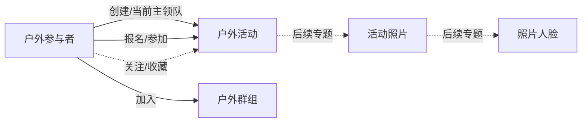

# Outdoor 业务理解

> 状态：业务语义基线（结合业务确认与 EntryOutdoor 源码调研）。本文只描述 Outdoor 业务对象、关系、状态和当前已确认的业务口径，不规定 ADDP 模块如何实现。物理字段是现状证据，不等同于理想业务模型。
>
> 证据补充：除生产 MongoDB 快照和业务方确认外，本文参考 `EntryOutdoor源码调研结论.md`。源码版本与生产库不是同一时点；代码明确的行为用于解释字段语义，历史快照只用于识别遗留形态。

## 1. 范围与观察基线

本文以本地 MongoDB `Outdoor` 数据库为观察对象。2026-08-24 的观察基线如下，记录数只表示本次数据快照，不属于业务定义：

| Collection | 记录数 | 业务对象 | 说明 |
| --- | ---: | --- | --- |
| `Persons` | 2188 | 户外参与者 | 人员身份、报名摘要、发起活动摘要、群组引用、履历和人脸登记信息 |
| `Outdoors` | 2383 | 户外活动 | 活动标题、路线、集合、规则、成员、领队、状态和活动照片 |
| `Groups` | 339 | 户外群组 | 日常沟通使用的微信群及其成员、群主和排行摘要 |
| `Photos` | 288 | 照片人脸分析记录 | 上传者和照片中检测到的人脸识别结果；暂不纳入第一阶段治理 |

Outdoor 的业务核心是人员围绕户外活动形成的发起、带领、报名、参加和关注关系，而不是简单的“人员表 + 活动表”。群组是日常沟通组织，与活动没有必然关系。照片和人脸属于后续专题。

### 1.1 ADDP Meta 扫描事实（2026-08-25）

ADDP 的 Meta 已通过 Business MongoDB 引擎（engine id `11`）完成 `Outdoor` 数据库深度扫描。当前扫描事实如下：

| 数据项 | Meta 事实 |
| --- | --- |
| `Outdoor.Outdoors` | 集合，扫描记录数 2,383，动态 schema |
| 活动标识 | `_id`，字符串画像并建立唯一候选索引 |
| 活动状态 | `status`，字符串 |
| 活动日期 | `title.date`，字符串路径 |
| 活动强度 | `title.level`，字符串画像；业务含义仍是最终强度数字，计算时需显式转数值并处理非数值值 |
| 成员数组 | `members`，数组；成员标识为 `members.personid`，成员状态为 `members.entryInfo.status` |
| 创建账号 | `_openid`，字符串 |

Meta 同时观察到 `members`、`title`、`photos` 等动态嵌套结构。字段画像是采样事实，不代表每条记录都存在该字段或拥有统一原生类型；查询和质量规则必须显式处理缺失、空值和混合类型。该扫描结果是当前 ADDP 物理事实基线，后续字段绑定应引用 Meta 的资源定位 `Outdoor/Outdoors`，不以手写路径替代资源事实。



## 2. 户外参与者 Person

### 2.1 身份字段

| 业务身份 | 物理字段 | 业务含义 |
| --- | --- | --- |
| 人员标识 | `Persons._id` | Outdoor 内部人员标识，被活动成员、领队和群组成员引用 |
| 外部账号标识 | `Persons._openid` | 小程序或外部账号标识，被活动创建记录和群组成员键使用 |
| 昵称 | `Persons.userInfo.nickName` | 展示和搜索名称，不是稳定唯一身份 |

电话、紧急联系人、OpenID、人脸向量、外部账号等信息具有隐私属性。业务语义可以说明这些字段的作用，但不应默认把具体值提供给小模型。

### 2.2 人员侧活动索引

| 字段 | 业务含义 | 口径 |
| --- | --- | --- |
| `myOutdoors[]` | 当前担任主领队的活动摘要 | 创建草稿时即写入；转让后从原领队移除并转入新领队；取消不会自动移除，彻底删除只清理操作者自己的索引 |
| `entriedOutdoors[]` | 人员报名关系摘要 | 代码会把报名、替补和占坑写入该索引；成为主领队时会移除，转让卸任后再加入；退出、强制退坑和活动删除可能留下悬空或过期摘要 |
| `caredOutdoors[]` | 人员关注或收藏的活动摘要 | 便于后续查看或报名；活动删除后不会统一清理，可能留下悬空引用 |

这些数组都是人员视角的索引或缓存，可能存在失效引用、过期状态和历史不一致。它们不能独立证明当前主领队、当前报名或实际参加事实；得到活动主体事实时始终以 `Outdoors` 活动记录为准。人员侧指标如需使用这些数组，必须明确这是“缓存索引口径”，不能将其当作活动主体事实的替代。

### 2.3 人员履历

`career` 是人员自行填写的户外履历，供领队和队员相互了解，不是平台自动计算的能力等级或活跃度指标。`facecodes` 是人员主动登记本人脸信息的动态结构，照片和人脸不纳入当前治理批次。

## 3. 户外活动 Outdoor Activity

### 3.1 活动身份与角色

| 业务概念 | 物理表达 | 语义说明 |
| --- | --- | --- |
| 活动标识 | `Outdoors._id` | 活动稳定身份，集合运算和去重必须使用它 |
| 创建账号 | `Outdoors._openid` | 创建活动时使用的外部账号，转让领队后仍保持不变 |
| 初始发起人 | 创建时的 `Outdoors._openid` 对应人员 | 创建活动时默认担任领队；不能用转让后的 `members[0]` 反推历史初始发起人 |
| 当前主领队 | `Outdoors.leader`，并由 `members[0]` 维护当前成员位置 | 领队可以转让；转让后新领队进入 `members[0]`，原领队变为领队组并可退出 |
| 领队组 | `members[].entryInfo.status = 领队组` | 主领队指定的协助开展活动人员 |
| 活动成员 | `Outdoors.members[]` | 报名人员、领队、领队组及其他报名状态的成员 |

需要区分两个时间语义：`Outdoors._openid` 表示创建账号，`leader`/当前 `members[0]` 表示当前主领队。对于“某人负责的活动”这类当前业务查询，以当前主领队为准；不能仅用创建账号推断当前主领队。活动创建者与主领队不一致时，业务展示和统计按主领队处理。

### 3.2 活动标题与强度

`title` 是结构化对象，不是只供全文搜索的字符串：

| 字段 | 业务含义 |
| --- | --- |
| `title.date` | 活动日期 |
| `title.place` | 目的地或线路名称 |
| `title.during` | 活动时长，如一日 |
| `title.loaded` | 负重方式，如轻装 |
| `title.level` | 活动最终强度数字，是当前语义层使用的强度值 |
| `title.whole` | 组合后的完整展示标题 |

当前语义层只使用最终强度数字 `title.level`，不展开里程、爬升和调整比例的计算过程，也不要求 Copilot 推导强度公式。

查询标题时使用 `title.whole`；查询日期、地点和强度时使用对应结构化字段，不应从完整标题反向解析。分时段统计使用活动日期 `title.date`。

### 3.3 成员报名与参加

`members[]` 中每个成员通常包含 `personid`、报名时的 `userInfo` 快照和 `entryInfo` 状态或角色。

| `entryInfo.status` | 是否计入报名 | 是否计入实际参加 | 当前解释 |
| --- | --- | --- | --- |
| `报名中` | 是 | 是 | 已报名并作为参加人员 |
| `领队` | 是 | 是 | 当前主领队，实际参与活动 |
| `领队组` | 是 | 是 | 领队指定的协助人员，实际参与活动 |
| `替补中` | 是 | 否 | 报名关系存在，但没有取得参加资格 |
| `占坑中` | 是 | 否 | 预留名额关系存在，但不视为参加 |
| `浏览中` | 否 | 否 | 只浏览活动，不属于报名或实际参加 |

“报名活动数”和“实际参加活动数”必须是两个不同指标。两者的第一阶段事实源都优先使用活动主体；人员侧报名摘要只用于索引校验。实际参加指标必须使用活动成员状态过滤，不能把替补、占坑和浏览计入。

活动对象还可能包含两个不属于 `members[]` 的数组：

- `addMembers[]`：领队手工添加的附加队员，不经过小程序报名流程；第一阶段实际参加指标暂不计入，除非业务方确认其应与 `members[]` 合并统计；
- `aaMembers[]`：AA 费用分摊名单，只表达费用参与，不自动等同于报名或实际参加。

因此，第一阶段指标必须明确声明事实范围为 `Outdoors.members[]`；不能因为人员出现在 `addMembers[]` 或 `aaMembers[]` 就自动推断其已报名或实际参加。

### 3.4 活动状态

持久化字段中观察到：`拟定中`、`已发布`、`报名截止`、`已成行`、`已取消`、`已结束`。源码状态机还会按当前时间推导“进行中”和“已结束”等展示步骤；“进行中”通常不是独立持久化状态，“报名截止”主要是历史遗留状态，现行代码不主动写入。

面向业务统计的简化分类已经确认：

| 原始状态 | 统计分类 | 业务含义 |
| --- | --- | --- |
| `拟定中` | 草稿 | 活动尚未正式成行 |
| `已取消` | 未成行 | 明确没有成行 |
| 其他状态（包括历史遗留的 `报名截止`） | 成行 | 按业务方已确认的简化口径，除草稿和取消外均视为成行 |

`已结束` 仍属于成行活动。`进行中`/`已结束` 可能是客户端根据活动日期、集合时间和时长推导的展示状态，不能把它们当作统一的服务端事件记录。当前业务只要求按“草稿/取消/其他”分类；若要分析活动是否已结束，应另行声明采用存储状态还是日期事实，不能由模型自行混用。

#### 统计有效活动

默认统计只纳入同时满足以下条件的活动：

1. 状态不是 `拟定中`（草稿）；
2. 状态不是 `已取消`；
3. 存在非空的活动日期 `title.date`；缺失、`null` 或空字符串都视为无效。

缺少 `title.date` 的活动视为无效活动，不进入活动数量、分时段统计或活动集合重叠计算。

### 3.5 活动内容

常见内容包括 `brief`、`route`、`meets[]`、`traffic`、`limits`、`websites`、`chat/messages` 和 `photos`。`route` 在现有数据中存在 object 和 array 两种形态，属于动态 schema 或历史版本差异，不能假设所有活动使用同一种结构。

## 4. 户外群组 Group

群组是日常沟通用的微信群，不与活动建立必然组织关系。当前结构包括：

- `Groups._id`：群组记录标识；
- `groupOpenid`：群组业务引用标识；
- `owner`：群主，包含 OpenID、Person ID 和用户信息快照；
- `members`：以成员 OpenID 为动态键的成员映射；
- `rank`：本年、上年和累计排行摘要。

`Persons.groups[].openid` 通常对应 `Groups.groupOpenid`，群组成员中的 `personid` 通常对应人员。`Groups.members` 的对象键是数据值，不是固定字段名；它表达“按 OpenID 索引的成员映射”。群组成员数可以独立建设，但不能替代活动报名关系。

## 5. 照片与人脸：后续专题

照片和人脸暂不纳入第一阶段治理，只保留当前核实结论：

- `Photos` collection 的顶层字段为 `_id`、`_openid`、`faces`；
- `Photos._openid` 与 `Outdoors._openid` 只有部分交集，不能直接当作稳定的活动归属关系；
- 活动照片索引在 `Outdoors.photos` 中，以照片 ID 为动态键，条目通常包含 `id`、`owner`、`src`、`facecount`、`faces`；
- 部分 `src` 路径包含 `Outdoors/{活动_id}/Photos/{照片_id}.jpg`，但历史数据存在 `undefined` 路径，仍需单独清洗和核实；
- 人脸识别涉及 `Persons.facecodes`、相似度距离和敏感特征向量，后续必须单独定义阈值、人工确认、隐私和授权边界。

因此，第一批人员/活动指标不依赖 `Photos`，也不因 `Photos._openid` 与活动创建账号相似而建立隐含关系。

## 6. 已确认的关系与事实来源

| 业务关系 | 主要物理表达 | 事实来源 | 可信度 |
| --- | --- | --- | --- |
| 初始发起活动 | 创建时的 `Outdoors._openid` 对应人员 | `Outdoors` | 高 |
| 当前主领队 | `Outdoors.leader`，并由当前 `members[0]` 位置辅助表达 | `Outdoors` | 高 |
| 活动创建账号 | `Outdoors._openid` | `Outdoors` | 高，但不是当前主领队 |
| 报名活动 | `Outdoors.members[]`；`Persons.entriedOutdoors[]` | 活动主体为事实源，人员数组只作索引 | 高 |
| 实际参加活动 | 成员状态为 `报名中`、`领队`、`领队组` | `Outdoors.members[]` | 高 |
| 替补/占坑关系 | 成员状态为 `替补中`、`占坑中` | `Outdoors.members[]` | 高，不计实际参加 |
| 当前主领队活动摘要 | `Persons.myOutdoors[]` | `Persons` | 中高，仅作人员侧缓存索引 |
| 关注/收藏活动 | `Persons.caredOutdoors[]` | `Persons` | 中高，活动删除后可能保留悬空摘要 |
| 人员加入群组 | `Persons.groups[].openid` | `Persons` 与 `Groups` 对照 | 高 |

## 7. 已确认的指标口径草案

以下口径可以进入后续标准化讨论。所有指标默认只基于统计有效活动；分时段统计统一使用 `Outdoors.title.date`；活动集合为空时计数为 0。

### 7.1 当前负责活动数

当前活动责任人按主领队确定。在统计有效活动中，对 `Outdoors` 的当前主领队统计活动 ID 去重数；初始创建事实使用 `Outdoors._openid`，不能用当前 `members[0]` 还原历史发起人。

### 7.2 报名活动数

人员报名活动集合来自统计有效活动的 `Outdoors.members[]`，包括 `报名中`、`领队`、`领队组`、`替补中` 和 `占坑中`，不包括 `浏览中`；当前成员已退出或不再出现在活动成员集合中的关系不计入。活动 ID 是去重键，按 `Outdoors.title.date` 支持分时段统计。该指标回答“当前报名关系覆盖多少个活动”，不回答“实际参加多少个活动”；`Persons.entriedOutdoors[]` 只作索引校验，不作为唯一事实源。

### 7.3 实际参加活动数

人员实际参加活动集合来自统计有效活动的 `Outdoors.members[]`，成员状态按已确认口径过滤：`报名中`、`领队`、`领队组`计入，`替补中`、`占坑中`、`浏览中`不计入。第一阶段不把 `addMembers[]` 或 `aaMembers[]` 自动并入。活动 ID 是去重键，按 `Outdoors.title.date` 支持分时段统计。

### 7.4 当前负责或参加的不同活动数

```text
|当前负责活动集合 ∪ 实际参加活动集合|
```

两个集合按活动 ID 去重，不能使用标题去重；集合为空时结果为 0。

### 7.5 两人的定向活动重叠率

设：

```text
A = 人员 A 的实际参加活动集合
B = 人员 B 的实际参加活动集合
C = A ∩ B
```

返回两个值：

```text
A 视角的 B 重叠率 = |C| / |A|
B 视角的 A 重叠率 = |C| / |B|
```

例如 A 参加 50 次、B 参加 100 次、共同参加 25 次，则 A 视角为 50%，B 视角为 25%。若任一方活动集合为空，则共同集合也为空，分子为 0；对应方向的重叠率直接记为 0。

## 8. 尚未闭合的业务问题

1. `addMembers[]` 附加队员是否应计入“实际参加活动数”，第一阶段先排除，待业务方明确后再改变指标口径。
2. 老数据可能存在 `members[].entryInfo.status` 缺失；治理查询需要将其识别为数据质量问题，不得按名称或数组位置猜测参加状态。
3. “进行中/已结束”的客户端推导状态与存储状态可能不一致；当前指标只使用存储状态的“草稿/取消/其他”分类和 `title.date` 有效性，不把推导状态混入计算。

除上述边界外，当前业务口径以活动主体事实为准，不保留人员摘要与活动主体之间的历史冲突投影。模型生成查询时遇到会改变结果的缺口，应返回结构化澄清，不能猜测。
