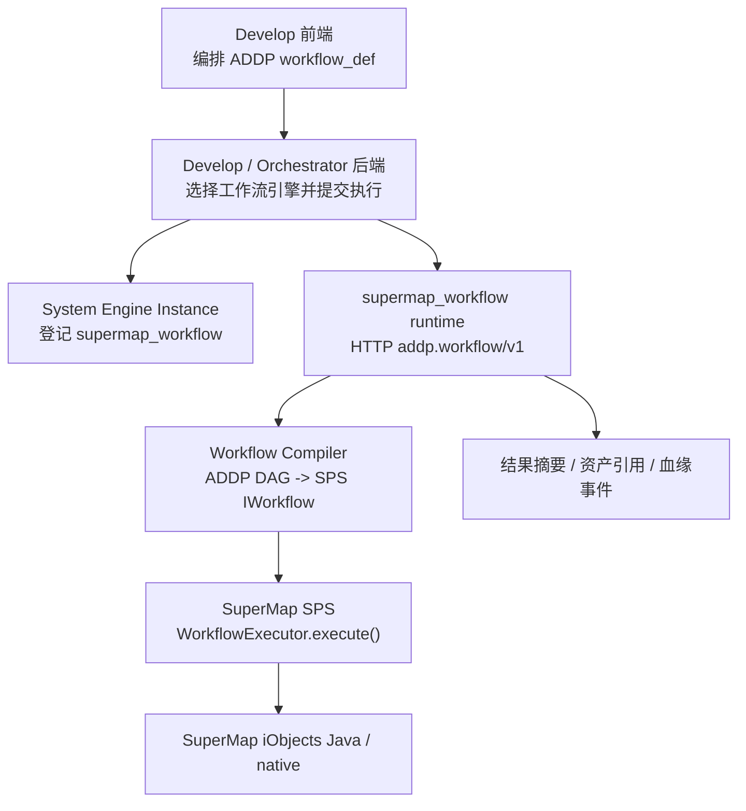

# SuperMap 工作流运行时设计

更新时间：2026-07-10

状态说明：本文为 `docs/next/` 讨论稿，记录 ADDP 增加 SuperMap 数据格式和空间算法支持的运行时设计。本文不替代 `docs/spec/addp工作流计算引擎接口规范.md`、`docs/concepts/addp引擎体系图.md` 和 `docs/spec/addp引擎插件接口规范.md`；方案进入实现阶段后，应再将稳定契约回写到正式规范和对应模块文档。

相关文档：

- `docs/concepts/addp引擎体系图.md`
- `docs/spec/addp引擎插件接口规范.md`
- `docs/spec/addp引擎能力声明规范.md`
- `docs/spec/addp工作流计算引擎接口规范.md`
- `docs/concepts/addp任务编排体系图.md`
- `docs/plan/meta模块血缘扩展设计.md`

## 一、背景与目标

ADDP 需要在 Develop 算子工作流中增加对 SuperMap 数据格式和空间算法的支持。已验证的 SuperMap 组件包括：

1. iObjects Java / iObjectsPy 的 Linux arm64 组件可在 Docker 环境运行。
2. SuperMap Python 包基于 Java / native 组件包装，可执行真实 UDBX 读取、属性查询和 overlay 空间叠加。
3. `sps-core` 提供 `IWorkflow`、`IDataItem`、`WorkflowExecutor` 和 JSON serializer 等工作流模型与执行能力。
4. SPS 工作流节点之间可通过 `IDataItem` 传递同一个 Java 内存对象引用。

设计目标：

1. 保持 ADDP 工作流运行时统一协议，不把 SuperMap 私有 Java API 或 processflow JSON 暴露给 Develop 前端。
2. 使用 SuperMap SPS 作为 `supermap_workflow` runtime 内部 DAG 执行框架。
3. 默认在同一个 JVM 内传递中间对象，避免每个算子边都落盘。
4. 为后续数据血缘保留节点级、端口级和资产级事件。

非目标：

1. 不让 Develop 前端直接生成 SuperMap processflow JSON。
2. 不以 Python `gpapy.GPARunner` 作为 DAG 主执行入口。
3. 不把每个 SuperMap 算子拆成独立 HTTP 服务或独立容器。
4. 不把每条 DAG 边默认物化为文件、表或对象存储产物。

## 二、术语分层

### 2.1 ADDP Operator

ADDP Operator 是平台统一算子定义，面向 Develop 前端、工作流定义、参数校验、执行历史、权限和血缘。

示例：

```text
operator_id = overlay.intersect
input_ports = left_dataset, right_dataset
output_ports = result_dataset
```

ADDP Operator 不承载 SuperMap Java 类名、SPS process 类名或 SuperMap 私有 processflow JSON。

### 2.2 SPS Process

SPS Process 是 SuperMap SPS 工作流中的可执行节点，实现 `IProcess`，声明 input / output，并由 `WorkflowExecutor` 调度。

在 `supermap_workflow` runtime 内部，一个 ADDP Operator 会被编译为一个或多个 SPS Process instance。

### 2.3 SuperMap Algorithm / API

SuperMap Algorithm / API 是实际完成空间分析、数据转换或数据访问的底层能力，例如 iObjects Java API、iObjectSpy Python 函数或 SuperMap native 算法。

SPS Process 的 `execute()` 内部调用这些底层能力。

三者关系：

```text
ADDP OperatorSpec
  -> runtime 编译
  -> SPS Process
  -> 调用 SuperMap Algorithm / API
```

## 三、总体架构



主链路：

```text
ADDP workflow_def
  -> supermap_workflow HTTP runtime
  -> 编译为 SPS IWorkflow
  -> WorkflowExecutor.execute()
  -> IDataItem 传递中间对象
  -> 返回 execution_id / final_result / all_results / lineage_events
```

## 四、模块边界

### 4.1 System

System 只负责引擎控制面：

1. 注册 `supermap_workflow` engine instance。
2. 保存 runtime endpoint、认证信息、许可状态、资源限制等 connection_info。
3. 暴露 `engine.capabilities/v1`，声明 `compute.workflow` 能力。
4. 不保存 SuperMap 算子私有参数，也不负责执行空间分析。

### 4.2 Common Engine Plugin

`common/engine/plugins/<engine_type>` 中新增 `supermap_workflow` 插件时，应实现 `WorkflowRuntimeProvider`，通过 ADDP 工作流 HTTP 协议调用 runtime。

插件职责：

1. 连接信息校验。
2. 健康检查。
3. 获取算子列表。
4. 提交 workflow execution。

插件不得绕过 runtime 直接调用 SuperMap Java 或 Python API。

### 4.3 Develop

Develop 负责用户编排体验：

1. 展示 ADDP OperatorSpec。
2. 保存 ADDP workflow_def。
3. 执行时只提交 ADDP 标准 workflow_def。
4. 不生成 SuperMap processflow JSON。
5. 不识别 SPS process 类名。

### 4.4 supermap_workflow runtime

`supermap_workflow` 是独立运行时服务，内部使用 Java / SuperMap SPS：

1. 实现 `addp.workflow/v1` HTTP 协议。
2. 维护 SuperMap 算子注册表。
3. 将 ADDP workflow_def 编译为 SPS `IWorkflow`。
4. 使用 `WorkflowExecutor.execute()` 一次性执行 DAG。
5. 返回 ADDP 标准执行结果和血缘事件。

## 五、算子适配方式

“每个 SuperMap 算子包装成一个 SPS process” 的含义是：

1. 每个 SuperMap 算法能力对应一个 Java 类或 Java 对象实例。
2. 该类实现 SPS `IProcess` 或继承 SPS 提供的 process 基类。
3. 它运行在同一个 `supermap_workflow` JVM 进程内。
4. 它不是独立 OS 进程、独立 HTTP 服务或独立容器。

示例：

```text
ADDP node:
  operator: overlay.intersect

SPS process:
  OverlayIntersectProcess extends AbstractProcess

SuperMap API:
  overlay(leftDataset, rightDataset, "INTERSECT", ...)
```

SPS process 的典型输入输出：

| Process | 输入 | 输出 |
| --- | --- | --- |
| `OpenDatasourceProcess` | `ResourceLocator` / path / engine binding | `DatasourceHandle` |
| `GetDatasetProcess` | `DatasourceHandle`、dataset name | `DatasetVector` / `DatasetGrid` |
| `OverlayIntersectProcess` | left `DatasetVector`、right `DatasetVector`、output target | result `DatasetVector` |
| `SaveDatasetProcess` | `Dataset`、target storage binding | `produced_asset` |

## 六、内存对象传递

### 6.1 默认策略

同一个 `WorkflowExecutor.execute()` 中，DAG 边优先传递 Java 对象或轻量 handle：

1. `DatasourceHandle`
2. `DatasetVector`
3. `DatasetGrid`
4. `Recordset`
5. `Geometry`
6. 自定义运行时对象，例如 `SuperMapDatasetRef`

SPS 的 `IDataItem` 用于连接上游 output 和下游 input。已通过 POC 验证：两个 SPS process 之间可以传递同一个 Java 对象引用。

### 6.2 何时落盘

落盘只应发生在明确边界：

1. 工作流输入来自外部资源，需要打开已有数据源。
2. SuperMap 算法本身要求输出到 `Datasource + DatasetName`。
3. 用户显式要求保存中间结果。
4. 最终结果需要登记为 ADDP data item 或 artifact。
5. 需要跨进程、跨容器、跨节点传递。
6. 需要 checkpoint、失败恢复或审计留痕。

### 6.3 中间结果语义

中间结果可以分为三类：

| 类型 | 是否落盘 | 是否进入 Meta | 说明 |
| --- | --- | --- | --- |
| memory object | 否 | 否 | 仅在单次 execution JVM 内存在。 |
| runtime temp dataset | 可选 | 否 | SuperMap 算法内部产生的临时数据集，由 runtime 清理。 |
| persisted dataset | 是 | 是 | 用户或算子明确保存，返回 `produced_asset`。 |

## 七、血缘设计

SuperMap runtime 不应成为血缘黑盒。即使中间结果走内存，也必须保留逻辑血缘事件。

### 7.1 血缘层次

```text
Workflow lineage
  ADDP 节点之间的 DAG 依赖

Runtime lineage
  某次 execution 中每个节点实际消费和产出的对象

Asset lineage
  已登记 data item / artifact 之间的来源关系
```

### 7.2 Runtime 返回事件

`supermap_workflow` runtime 建议从第一版开始返回轻量 `lineage_events`：

```json
{
  "node_id": "overlay_1",
  "operator_id": "overlay.intersect",
  "runtime_process": "OverlayIntersectProcess",
  "input_ports": {
    "left_dataset": "task.open_left.result",
    "right_dataset": "task.open_right.result"
  },
  "output_ports": {
    "result_dataset": "task.overlay_1.result"
  },
  "consumed_assets": [
    "addp://engine/12/path/example_data.udbx?type=file#Landuse_R"
  ],
  "produced_assets": [
    "addp://engine/18/path/outputs/overlay_result.udbx?type=file#OverlayOutput"
  ],
  "parameters_fingerprint": "sha256:..."
}
```

如果某个输出只是内存对象，`produced_assets` 可以为空，但 `output_ports` 仍应记录逻辑输出。

### 7.3 后续与 Meta 血缘对接

待 ADDP 血缘能力落地后，可将 runtime 事件转换为：

1. data item -> operator execution -> data item
2. data item -> operator execution -> memory intermediate -> operator execution -> data item
3. workflow definition -> workflow execution -> node execution

内存对象不妨碍血缘，因为血缘记录的是逻辑依赖和可识别资产，而不是必须记录每个对象的物理文件。

## 八、容器与运行环境

已验证的 Linux arm64 POC 条件：

1. SuperMap iObjectSpy 2026 Linux arm64 包。
2. `objectsjava/bin_linux_arm64` native 目录。
3. SuperMap `.lic12` 许可文件放入 `bin_linux_arm64` 后生效。
4. JRE 17 可运行 SPS 和 iObjectsPy gateway。
5. Python 3.9 可加载 iObjectSpy `py39_64` 包。
6. 真实 UDBX 打开、属性查询和 overlay 算子已验证。
7. PDT scheduler 的 `scheduler/gpa/libs` 中包含 `gpa-sps-core-12.0.1-20251113.jar`、Jackson、Hutool 等 SPS/GPA 运行依赖；普通 iObjects Java 镜像只包含 iObjects Java/native，不包含完整 SPS core。

正式镜像建议：

1. 以 Java runtime 为主，不以 Python `GPARunner` 为 DAG 主入口。
2. 镜像内固定或挂载 SuperMap Java/native 组件、GPA/SPS jars 和许可路径。
3. 如保留 Python，用于兼容部分 iObjectSpy 算子封装或验证，不作为工作流调度核心。
4. 健康检查应返回许可可用性、SuperMap home、SPS 版本、算子数量和 native library 加载状态。

## 九、分阶段推进

### 阶段 0：POC 已完成

已验证：

1. Linux arm64 容器中 Java SPS 空 workflow 可加载、序列化和执行。
2. SuperMap 许可生效后，可打开 UDBX、查询 dataset、运行 overlay。
3. SPS process 之间可通过 `IDataItem` 传递同一个 Java 对象引用。
4. 最小 HTTP runtime 可接收 ADDP 风格 workflow_def，编译为 SPS `IWorkflow` 并返回执行结果。

临时 POC 文件位于 `/tmp/addp-supermap-poc`，不作为仓库长期资产。

### 阶段 1：正式 runtime 骨架

新增 `engines/supermap-workflow/`，第一步已落地 Java HTTP runtime 骨架：

```text
engines/supermap-workflow/
├── src/main/java/com/addp/supermap/workflow/
├── Dockerfile
├── run.sh
└── README.md
```

当前已实现：

1. `/health`
2. `/api/operators`
3. `/api/workflow`
4. `/api/operators/{name}/invoke`
5. `/api/executions/:execution_id`
6. 最小 execution 记录
7. 轻量 lineage_events

该骨架通过 Docker 绑定外部 SuperMap Java SDK 与 GPA libs，不把 SDK、native `.so` 或许可文件提交到 ADDP 仓库。已接入真实 SuperMap 算子，并验证 ADDP `workflow_def` 可驱动 SPS DAG 打开 UDBX、选择数据集、执行 `OverlayAnalyst.intersect`、写出结果 UDBX。

### 阶段 2：ADDP Engine Plugin

新增 `supermap_workflow` engine plugin：

1. `EngineOrigin() == "extension"`
2. `engine_family == "workflow"`
3. 声明 `compute.workflow`
4. 实现 `WorkflowRuntimeProvider`
5. 接入 System 引擎注册与 Develop 工作流引擎发现

### 阶段 3：SuperMap 核心算子

核心闭环算子已落地：

1. `datasource.open`
2. `datasource.open_postgis`
3. `datasource.enable_postgis`
4. `datasource.create`
5. `dataset.select`
6. `dataset.info`
7. `dataset.project`
8. `vector.filter`
9. `vector.spatial_filter`
10. `vector.buffer`
11. `vector.dissolve`
12. `vector.merge`
13. `vector.feature_envelope`
14. `vector.inner_point`
15. `overlay.intersect`
16. `overlay.clip`
17. `overlay.erase`
18. `overlay.union`
19. `vector.query`
20. `dataset.save`

当前目标不是覆盖全部 SuperMap 工具箱，而是验证：

1. 输入资产绑定。
2. 内存 Dataset 传递。
3. 输出资产保存。
4. 血缘事件回传。
5. Develop 前端编排可用。
6. 坐标转换、空间关系筛选、融合和多数据集合并等常用分析链路可用。

### 阶段 4：算子目录扩展

在第一批稳定后，再按类别扩展：

1. 矢量叠加与缓冲。
2. 栅格分析。
3. 坐标转换。
4. 数据格式转换。
5. 影像处理。
6. 网络分析。

是否批量生成 OperatorSpec，应在第一批手写算子稳定后再讨论。

## 十、待确认问题

1. SuperMap Java API 中哪些算法可以直接返回内存对象，哪些必须物化到 `Datasource`。
2. 运行时临时 workspace / datasource 的生命周期和清理策略。
3. 大数据集是否需要显式 checkpoint 或 memory limit。
4. SuperMap 许可在生产环境的挂载、续期和健康检查方式。
5. 输出资产登记由 runtime 直接调用 ADDP API，还是由 Develop / Orchestrator 根据 runtime 返回的 `produced_assets` 完成。
6. 血缘事件最终归属 Meta、Monitor 还是独立 lineage 模块，需要结合 `docs/plan/meta模块血缘扩展设计.md` 决定。

## 十一、架构结论

`supermap_workflow` 应采用单一主路径：

```text
ADDP workflow_def
  -> Java supermap_workflow runtime
  -> SPS IWorkflow
  -> WorkflowExecutor.execute()
  -> IDataItem 内存传递中间对象
  -> 最终结果落盘并回写 ADDP
```

Python iObjectSpy 可以作为算法包装参考或个别函数调用辅助，但不作为 DAG 主执行框架。Develop 前端和 ADDP 后端只消费 ADDP 自己的工作流协议，不直接依赖 SuperMap 私有模型。
