# ADDP CAD 数据支持设计

> 状态：第一阶段实现、真实 DWG 和平台内 Meta/Manager 端到端验收完成。本文固化第一阶段 CAD / DWG 接入路线；稳定语义已同步进入术语表、数据类型与格式规范、attributes 规范、任务规范和 Manager 预览协议。

## 目标与范围

第一阶段只支持二维 DWG，建立从格式识别、Meta 扫描、Manager 预览到 Transfer 原文件传输的完整主链路。DXF、DGN、三维 CAD、实体级交互和 CAD 编辑不在本阶段范围。

DWG 必须归一为：

```text
layout=single
data_type=cad
format=dwg
```

`cad` 表达设计图纸及其 CAD 原生组织语义。CAD entity 可以在查询或导入界面投影为记录，但源 DWG item 不因此变成 `table`。通过 `cad.import` 生成的 GIS 数据是新的 `table + capabilities.spatial` item。

## 单一技术路线

```mermaid
flowchart LR
  A["DWG content"] --> B["common/format header detection"]
  B --> C["Meta basic scan: cad/dwg"]
  C --> D["Meta deep scan"]
  D --> E["supermap_workflow cad.inspect"]
  E --> F["type_info.cad + format_info.dwg"]
  F --> G["Manager cad_preview_generation"]
  G --> H["supermap_workflow cad.render_preview"]
  H --> I["Manager infra MinIO tiles"]
  I --> J["OpenLayers CAD preview"]
```



- Go 侧只做 DWG header 识别，不嵌入 SuperMap 或 ODA。
- SuperMap iObjects Java 是 deep scan、渲染和后续 CAD→GIS 导入的唯一 CAD provider。
- 不直接调用 SuperMap 组件内部 ODA 原生库，不引入独立 ODA Viewer / Open Cloud 或 LibreDWG 备用路径。
- Meta、Manager 通过现有 Workflow Runtime direct operator 调用 `supermap_workflow`，不构造私有 HTTP 请求。

## Meta 扫描

Basic scan 读取 DWG 六字节版本头 `AC10xx`，结合 `.dwg` 扩展名和 MIME 完成轻量识别。它不依赖 SuperMap，可在 CAD engine 不可用时稳定写入 `data_type=cad + format=dwg`。

Deep scan 调用 direct-only operator `cad.inspect`，请求使用 `addp.workflow.access-plan/v1`，响应固定使用 `addp.cad.inspect/v1`，至少包含 DWG 版本、单位、model/paper space、layout/layer/block/xref 数量、SuperMap 解释后的 dataset/record 数量、二维范围和 warning。

`cad.inspect` 只读打开 DWG，读取 Datasource、Dataset 元数据、RecordCount 和 Bounds；严禁遍历 Recordset Geometry，也不生成 UDB/UDBX 中间数据。SuperMap 不可用或打开失败时 deep scan 失败且 `scanned_depth` 不升级，不得回退到另一套解析器。

## Manager 预览

Manager 使用独立的 `cad_preview_generation` 任务。执行器解析源 item 和访问计划后，direct 调用 `cad.render_preview`。SuperMap 使用 `Map` / `Layer` / `MapPainter` 直接渲染 CAD Dataset，不把 Geometry 转成 WKB、GeoJSON 或前端图元。

第一阶段产物：

```text
manifest.json
thumbnail.webp
model-space/{z}/{x}/{y}.webp
layouts/<layout-id>/{z}/{x}/{y}.webp
```

`manifest.json` 记录本地二维坐标范围、tile size、zoom 范围、model space 和 layouts。前端使用 OpenLayers 自定义 projection，支持平移、缩放和 model/layout 切换。

瓦片访问 API 固定为 `GET /api/v1/manager/cad-previews/{id}/tiles/{z}/{x}/{y}`。第一阶段 API 读取 Manager infra MinIO 中的预生成瓦片。若实际放大效果或生成成本不能接受，后续在同一 API 下切换为后端实时渲染，并删除预生成实现；不保留两条可选路线。

## CAD→GIS 与 Transfer

后续新增独立 direct operator `cad.import`。它读取 DWG entity，经 SuperMap 转换为 GIS Dataset，并由调用方登记为新的 `data_type=table` item。`cad.inspect`、`cad.render_preview` 和 `cad.import` 三者不得合并。

Transfer 对 `data_type=cad + layout=single` 仅提供 encoded raw copy。传输复制原始 DWG 字节并保留 format，不执行 CAD→GIS、DWG→DXF 或其他隐式转换。

## 外部引用、字体与安全

- Xref 第一阶段只允许源文件同目录或同 object prefix 下的相对路径。
- 拒绝绝对路径、网络路径、父目录逃逸和跨租户引用。
- SHX/TTF 字体只从平台受控只读目录加载。
- object storage 输入只能物化到任务私有临时目录，任务结束后清理。
- 扫描和渲染必须配置超时、最大文件大小、最大 layout/layer 数、最大输出瓦片数和最大临时空间。

## 第一阶段完成标准

1. `common/datatype` 唯一声明 `cad`，`common/format` 唯一声明并识别 `dwg`。
2. Meta basic scan 不依赖 SuperMap；deep scan 只走 `cad.inspect` 且不遍历 Geometry。
3. Manager 只通过 SuperMap 直接渲染 CAD Dataset 生成受管瓦片，前端不重画 entity。
4. Transfer 只提供 CAD raw copy。
5. 文档、Swagger、后端和前端测试同步通过。

## 实施结果与验收边界

截至 2026-07-13，以下主链路已完成：

- Common 已声明 `cad/dwg`、CAD payload 和 DWG header 探测。
- Meta basic scan 不依赖 SuperMap；deep scan 只调用 `cad.inspect`，实现未遍历 Geometry。
- Manager 已提供 `cad_preview_generation`、受管 manifest/WebP 瓦片 API、Quick View 生成动作和 OpenLayers 本地二维预览组件；源 DWG `storage-stream` 不进入 CAD renderer。
- SuperMap 已提供 `cad.inspect` 与 `cad.render_preview` direct operator；渲染金字塔使用正方形本地 extent，manifest 另保留真实 drawing bounds，总瓦片数限制为 25,000。
- Transfer 已将 CAD 纳入 encoded raw copy，不执行隐式 CAD→GIS 转换。
- Manager migration SQL 已在临时 PostgreSQL 中实际执行并创建两张目标表；Swagger 公开路由覆盖一致。

真实样例来自 `/Users/pampa/Documents/MacStudio/data/cad/libredwg`。独立构建的 SuperMap Runtime 已完成以下验收：

- `example_2000.dwg`（AC1015）、`example_2018.dwg`（AC1032）、`example_r14.dwg`（AC1014）、`sample_2018.dwg`（AC1032）均可由 `cad.inspect` 打开；前三个样例各得到 1 个 Dataset / 64 条记录，`sample_2018.dwg` 得到 1 个 Dataset / 6 条记录，全部返回 `geometry_traversed=false`。
- `sample_2018.dwg` 与 `example_r14.dwg` 已真实生成 manifest、thumbnail 和 WebP 金字塔。`sample_2018.dwg` 使用默认 `tile_size=512`、`max_zoom=4` 时生成 341 张瓦片，耗时约 5.8 秒，产物约 1.4 MiB；全部瓦片均为真实 512×512 WebP。
- SuperMap 12.1 通用 `Map.outputMapToFile(..., ImageType.WEBP, ...)` 实际不支持 WebP，渲染实现已收敛为专用 `Map.outputMapToWEBP(...)`。CAD 常见白色线条在白底下不可见，当前统一使用深色背景并禁用 bounds inflate。
- `max_zoom=8` 会超过 25,000 张瓦片上限并被明确拒绝，证明输出预算限制生效。

平台内验收已将 `sample_2018.dwg` 的只读测试副本放入 Business NFS 的 `cad/sample_2018.dwg`。通过两层镜像重建并局部重启 `localhost:8103` 后，Runtime 动态暴露 24 个算子，其中包含 `cad.inspect` / `cad.render_preview`。Meta deep scan 用时约 3.6 秒，写入 AC1032、1 个 Dataset、6 条解释记录、真实二维范围和 `geometry_traversed=false`。Manager `cad_preview_generation` 用时约 4.0 秒生成 21 张 256×256 WebP；正式 manifest API 和 z0 tile API 均返回 200，tile `Content-Type=image/webp`。Java MinIO client 已统一把 access plan 中无 scheme 的 endpoint 按 `use_ssl` 补全，并把 localhost 归一为容器可访问地址。代码同时修正 CAD deep enrich 失败仍错误升级 `scanned_depth=deep` 的问题，未引入备用解析或渲染路线。
