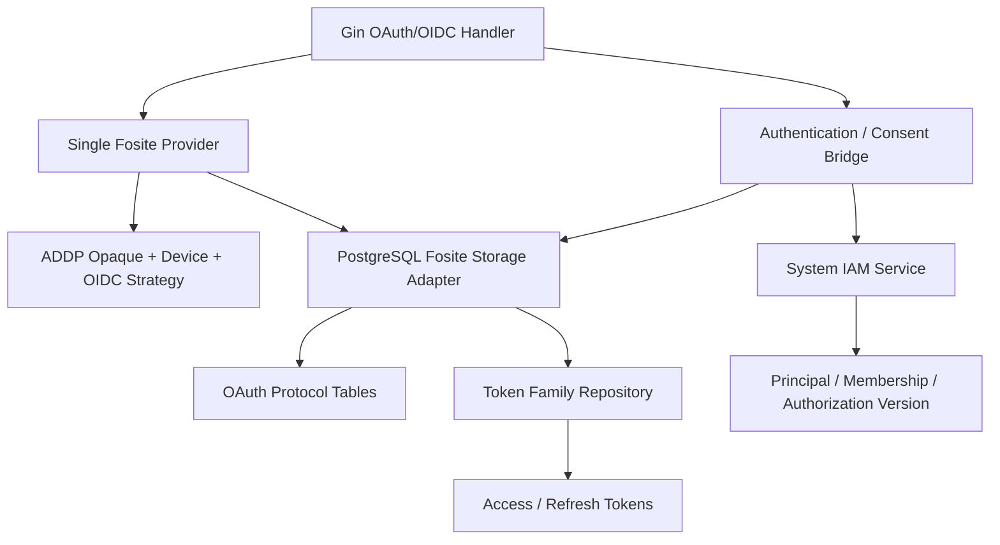

# ADDP IAM Fosite Provider 与 Storage Adapter 设计

更新日期：2026-07-28

状态：技术设计和 Fosite OAuth 唯一主路径已实现。受控 Fosite `v0.50.0-addp.2`、目标协议表 migration、ADDP Session、PostgreSQL Storage Adapter、Provider、Consent Bridge 与 System Router 已落地；开发数据库已迁移到 `25/clean` 并完成三员恢复，真实 Browser 登录与正式 `addp` CLI E2E 已覆盖 RFC 8252 动态 loopback、PKCE、Device Flow、AuthContext、Keychain 刷新轮换、受委托 Tool 调用和撤销。OIDC 尚未启用，继续遵守“无 OpenID Handler、无 `openid` Scope、无 Discovery/JWKS 宣告”的单一路径，待 issuer、Claim 和密钥生命周期独立设计完成后再实施。

## 一、目标与边界

本设计回答：

1. ADDP 具体启用哪些 Fosite Handler 和 Strategy；
2. 如何用稳定 ADDP 字段重建 `fosite.Requester` / `fosite.Session`；
3. 每个 Fosite Storage 方法读写哪一张表；
4. Authorization Code、Device Code、Refresh Rotation 和重放如何保证原子性；
5. Fosite 协议状态与 ADDP Token Family、Principal、Context 的唯一事实边界；
6. 当前自研 `TokenService` 在切换时删除和拆分到哪里。

本设计不完成：

- Fosite 受控派生仓库的实际创建；
- SQL migration 文件；
- Go Adapter、Handler 或测试代码；
- OIDC issuer、Subject 类型、Claim 发布策略和签名密钥生命周期；
- MFA、外部 IdP 和账号恢复实现；
- 动态 Client Registration、PAR 或 Token Exchange。Client Credentials 已纳入唯一 Fosite Provider，且只服务于一对一绑定 Service Principal 的 Confidential Client。

## 二、核心设计结论

1. **显式 Compose**：只组合已批准 Handler，禁止 `ComposeAllEnabled`。
2. **一个 Provider**：Authorization Code、Device、Client Credentials、Refresh、Revocation，以及后续启用的 Introspection 和 OIDC 使用同一个 Provider 实例。
3. **一个 Adapter**：所有启用 Handler 使用同一个 PostgreSQL Storage Adapter，不为 Device 或 OIDC 建独立 Store。
4. **一个 Token Family**：OAuth 与第一方 Web 共用 `refresh_token_families`、`access_tokens`、`refresh_tokens`，但协议入口不同。
5. **无通用 Session Blob**：不保存 Fosite Go 对象、Gob 或库私有 JSON；Adapter 从显式列和 ADDP 版本化 JSON 重建对象。
6. **Context 由 System 确定**：User OAuth Context 只在批准时确定；Client Credentials 的 `tenant_id` 只能选择已绑定 Service Principal 的有效 Membership。客户端不能提交 Principal、Membership、Role、Permission 或授权版本。
7. **Token 只存 Hash**：随机 Code/Token 使用 SHA-256；低熵 User Code 使用服务端密钥 HMAC-SHA-256。
8. **事务由 Adapter 控制**：Fosite `Transactional` 映射为 PostgreSQL 短事务，所有方法从 `context.Context` 取得同一事务连接。
9. **重放事实保留**：Code、Refresh Token 和 Device Code 不物理删除，使用失效时间和状态返回 Fosite 指定错误。
10. **无运行时兼容**：切换后删除自研 OAuth 状态机和旧表读取，不通过 feature flag 保留旧路径。

## 三、目标组件关系



System API Handler 只负责 HTTP 输入输出、调用 Fosite、认证/同意桥接、安全审计和错误写出。协议判断不能重新出现在 Gin Handler 或 IAM Service 中。

## 四、Provider 组合

### 4.1 启用的 Factory

Provider 使用 `compose.Compose` 显式加入：

| Factory | 用途 | 启用阶段 |
| --- | --- | --- |
| `OAuth2AuthorizeExplicitFactory` | Authorization Code | 首次切换 |
| `OAuth2RefreshTokenGrantFactory` | OAuth Refresh Token | 首次切换 |
| `OAuth2TokenRevocationFactory` | RFC 7009 Revocation | 首次切换 |
| `OAuth2TokenIntrospectionFactory` | opaque Token Introspection 能力 | 延后到受控调用方和 API 鉴权契约确认后 |
| `OAuth2PKCEFactory` | PKCE S256 | 首次切换 |
| `RFC8628DeviceFactory` | Device Authorization Endpoint | 首次切换 |
| `RFC8628DeviceAuthorizationTokenFactory` | Device Code Token Grant | 首次切换 |
| `OpenIDConnectExplicitFactory` | OIDC Authorization Code | OIDC issuer/key 设计完成时 |
| `OpenIDConnectRefreshFactory` | OIDC Refresh ID Token | OIDC issuer/key 设计完成时 |
| `OpenIDConnectDeviceFactory` | OIDC Device Flow | OIDC issuer/key 设计完成时 |

Introspection 和 OIDC Factory 后续都加入现有同一个 Provider 配置，不创建第二 Provider。Introspection 未启用前不暴露端点；OIDC 未启用前，Client 不允许 `openid` Scope，Discovery 不宣告对应能力。

### 4.2 明确禁用

以下 Factory 不进入 Provider：

- `OAuth2AuthorizeImplicitFactory`；
- `OpenIDConnectImplicitFactory`；
- `OpenIDConnectHybridFactory`；
- `OAuth2ResourceOwnerPasswordCredentialsFactory`；
- `OAuth2ClientCredentialsGrantFactory`；
- `RFC7523AssertionGrantFactory`；
- `PushedAuthorizeHandlerFactory`；
- Stateless JWT Access Token / Introspection；
- Token Exchange、动态 Client Registration 及其他未确认扩展。

禁用能力不能仅依赖 Client 配置拒绝；对应 Handler 根本不组合进 Provider。

### 4.3 核心配置

| 配置 | 目标值或规则 |
| --- | --- |
| Access Token 生命周期 | 15 分钟 |
| Authorization Code 生命周期 | 5 分钟 |
| Refresh Token Family 最终期限 | 30 天，轮换不延长 |
| Device / User Code 生命周期 | 10 分钟 |
| Device 初始轮询 interval | 5 秒 |
| `EnforcePKCE` | `true` |
| `EnforcePKCEForPublicClients` | `true` |
| `EnablePKCEPlainChallengeMethod` | `false` |
| Scope Strategy | 精确匹配 |
| API audience | 固定 `addp.api`，Client 不能请求未注册 audience |
| Debug error | 生产环境不向客户端输出 debug/hint 内部详情 |
| Token entropy | 随机部分至少 32 字节 |

第一阶段 `RefreshTokenScopes` 保持空集合：只要 Client 注册了 `refresh_token` grant，Authorization Code 或 Device 授权成功后即可签发 Refresh Token。不要在未修订 CLI 契约前额外要求 `offline_access`。

## 五、ADDP Strategy

Provider 注入一个组合 Strategy：

```text
ADDPStrategy
  -> oauth2.CoreStrategy
  -> rfc8628.RFC8628CodeStrategy
  -> openid.OpenIDConnectTokenStrategy
  -> jwt.Signer
```

### 5.1 opaque Core Strategy

- Authorization Code：`addp_ac_` + 32 字节随机值；
- Access Token：`addp_at_` + 32 字节随机值；
- Refresh Token：`addp_rt_` + 32 字节随机值；
- Signature：对完整明文执行 SHA-256，返回 64 位小写十六进制；
- Validate：先校验固定前缀和最小长度，再依赖 Storage Session、有效期和状态完成权威判断。

Adapter 收到 Code/Token signature 时必须验证其格式为 64 位小写十六进制，避免误把明文 Token 落库。

### 5.2 Device Strategy

- Device Code：`addp_dc_` + 32 字节随机值，Signature 使用 SHA-256；
- User Code：8 位排除易混淆字符，展示为 `XXXX-XXXX`；
- User Code 规范化：去分隔符并转大写；
- User Code Signature：`HMAC-SHA-256(user_code_pepper, normalized_code)`；
- `ShouldRateLimit`：调用同一个 PostgreSQL Device Repository 原子更新轮询状态；
- 不使用 Fosite 默认 `ory_dc_` 格式或默认空 `ShouldRateLimit`。

User Code pepper 与 OIDC 签名密钥、Token 随机值和数据库凭据相互独立，进入 System 密钥配置和轮换设计。轮换时只允许验证当前及明确的前一 pepper；过渡结束后删除旧 pepper，不建立无限密钥链。

### 5.3 OIDC Strategy

OIDC 使用 Fosite JWT Signer 生成 ID Token。签名私钥由 System Key Provider 提供，不能放入数据库 Session、环境日志或 Client 表。JWKS 只发布当前和仍处于验证窗口的公钥。

OIDC 未启用时不创建临时开发密钥，也不允许每次启动随机生成生产 issuer 的签名密钥。

## 六、ADDP Session Schema

实现单一 `IAMSession`，同时满足 `fosite.Session` 和 `openid.Session`。逻辑字段为：

| 字段 | 来源 | 用途 |
| --- | --- | --- |
| `principal_id` | System 批准结果 | 内部主体关联，不进入公开 Claim |
| `context_type` | `platform | tenant` | 唯一当前上下文 |
| `tenant_membership_id` | System 批准结果 | Tenant 模式必填 |
| `issued_authorization_version` | Principal 当前版本 | 撤权即时失效 |
| `subject` | System Subject Service | Fosite Subject / OIDC `sub` |
| `authentication_methods` | 认证事实 | OIDC `amr` 和审计 |
| `assurance_level` | 认证事实 | OIDC `acr`、step-up |
| `authenticated_at` | 认证事实 | OIDC `auth_time` / `max_age` |
| `requested_at` | Fosite 请求 | `prompt`、`max_age` |
| `expires_at` | 协议对象/Token 表 | 实现 `Get/SetExpiresAt` |
| `oidc_nonce` | 已校验协议参数 | ID Token nonce |
| `oidc_extra_claims` | System Claim Policy | 只允许版本化白名单 Claim |

`GetUsername()` 默认返回空字符串。用户名、邮箱和展示名不作为 Token Session 的稳定授权事实；需要时由 UserInfo 或明确 Claim Policy 提供。

`IAMSession` 只是进程内适配对象。数据库不 `json.Marshal(IAMSession)`，不保存 Fosite `DefaultSession`、`openid.DefaultSession` 或 `fosite.Request` 原始结构。每次读取由 Adapter 从下述表投影并构造新对象。

## 七、目标表与事实归属

### 7.1 `system.oauth_clients`

保留一个 Client 事实表，至少包含：

| 字段 | 约束 |
| --- | --- |
| `client_id` | text PK，稳定且不可复用 |
| `display_name` | text 非空 |
| `client_type` | `public | confidential` |
| `client_secret_hash` | public 必须为空；confidential 按认证方式决定 |
| `redirect_uris` | text[] 非空，逐项完整 URI |
| `grant_types` | text[]，只允许已组合 Handler 对应值 |
| `response_types` | text[]，当前只允许 `code` |
| `allowed_scopes` | text[] 非空 |
| `allowed_audiences` | text[] 非空 |
| `token_endpoint_auth_method` | public 固定 `none` |
| OIDC Client 元数据 | `jwks_uri`、受控 `jwks`、request URIs 和签名算法，按需可空 |
| `status` | `active | disabled` |
| 审计时间 | `created_at`、`updated_at` |

删除 `device_flow_enabled` 重复字段；是否允许 Device Flow 只由 `grant_types` 包含 RFC 8628 grant 表达。

Client Secret 只保存强 KDF Hash，不使用普通 SHA-256。第一阶段内置 `addp-cli` 为 public Client，不创建 Secret。

### 7.2 `system.oauth_authorization_requests`

该表是浏览器 `request_id` 托管边界，也是 Authorization Code Flow 批准前的 Requester 事实：

- `id uuid`：同时作为 API `request_id`、OAuth `state` 和 Fosite Request ID；
- `request_secret_hash char(64)`：唯一，只保存随机 Secret Hash；
- `client_id`、完整 `redirect_uri`、`response_types`、`response_mode`；
- `requested_scopes`、`requested_audiences`；
- `status=pending|approved|rejected|cancelled`；
- 批准后写入 `principal_id`、`context_type`、`tenant_membership_id`、`issued_authorization_version`；
- 批准后写入 `granted_scopes`、`granted_audiences`、认证方法、AAL、认证时间；
- `requested_at`、`expires_at`、`completed_at`、`created_at`；
- `client_id` FK，以及 `expires_at where status='pending'` 部分索引。

请求不保存原始 query 或 form JSON。Adapter 仅从显式字段构造 Fosite 允许的参数。

### 7.3 `system.oauth_pkce_sessions`

PKCE 只有一个事实表，不在 Authorization Request 和 Code 表重复 challenge：

- bigint identity PK；
- `authorization_request_id uuid` 唯一 FK；
- `authorization_code_hash char(64)` 唯一、批准前可空；
- `code_challenge`、`code_challenge_method=S256`；
- `verified_at`、`consumed_at` 可空；
- `expires_at`、`created_at`。

创建 Authorization Request 时写入 challenge；Fosite `CreatePKCERequestSession` 在批准事务中绑定 `authorization_code_hash`。错误 verifier 不更新状态；成功 verifier 才写 `verified_at`。Code 成功消费后写 `consumed_at`。

### 7.4 `system.oauth_oidc_sessions`

仅当请求包含 `openid` Scope 时存在：

- bigint identity PK；
- `authorization_request_id uuid` 唯一 FK；
- `authorization_code_hash char(64)` 唯一、批准前可空；
- `subject`、`nonce`、`requested_at`、`authenticated_at`；
- `acr`、`amr text[]`；
- `extra_claims_schema_version smallint`；
- `extra_claims jsonb`，只允许 Claim Policy 白名单；
- `consumed_at`、`expires_at`、`created_at`。

不为 `extra_claims` 建 GIN 索引：运行时按 Authorization Request / Code Hash 主键查找，不按 Claim 内容查询。

### 7.5 `system.oauth_authorization_codes`

- bigint identity PK；
- `code_hash char(64)` 唯一；
- `authorization_request_id uuid` 唯一 FK；
- `expires_at`、`invalidated_at`、`created_at`。

Requester、Client、Scope、Context 和 OIDC/PKCE 信息通过关联表重建，不复制到 Code 表。失效 Code 保留到安全清理期限；`GetAuthorizeCodeSession` 对失效 Code 返回 Requester 和 `fosite.ErrInvalidatedAuthorizeCode`，使 Fosite 能撤销关联 Token Family。

### 7.6 `system.oauth_device_authorizations`

Device 表同时保存 Device Requester、用户决定和轮询状态：

- `id uuid`：Fosite Request ID；
- `device_code_hash char(64)` 唯一；
- `user_code_hash char(64)` 唯一，HMAC 结果；
- `client_id` FK；
- `requested_scopes`、`requested_audiences`；
- `granted_scopes`、`granted_audiences`，批准前为空；
- `status=pending|approved|rejected|invalidated`；
- 批准后写入 Principal、唯一 Context、授权版本和认证事实；
- `poll_interval_seconds`，初始 5；
- `next_poll_at`、`last_polled_at`；
- `requested_at`、`expires_at`、`decided_at`、`invalidated_at`、`created_at`。

`GetDeviceCodeSession` 同时接受 Device Code Signature 或 User Code Signature。对 `invalidated` 返回原 Requester 和 `fosite.ErrInvalidatedDeviceCode`，不能物理删除或返回普通 Not Found。

### 7.7 `system.refresh_token_families`

Token Family 是 OAuth 与第一方 Web 会话的共同事实源：

- bigint identity PK；
- `protocol_request_id uuid`：OAuth 时唯一非空，Web 时为空；
- `principal_id`、`context_type`、`tenant_membership_id`；
- `issued_authorization_version`；
- `client_id`：Web 固定 `addp-web`；
- `auth_type=first_party|oauth`；
- `audiences`、`scopes`；
- `authentication_methods`、`assurance_level`、`authenticated_at`；
- OIDC 时保存稳定 `subject`、`acr`、`amr` 和版本化最小 Claim 快照；
- `expires_at`、`revoked_at`、`revoked_reason`、`created_at`、`updated_at`。

Family 的 `expires_at` 在创建后不延长。`protocol_request_id` 是 Fosite `Requester.GetID()` 与 Family 的唯一映射，供 Code/Device 重放、Refresh 重用和 RFC 7009 撤销使用。

### 7.8 `system.access_tokens`

- bigint identity PK；
- `token_hash char(64)` 唯一；
- `family_id` FK；
- `expires_at`、`revoked_at`、`created_at`。

Principal、Context、Client、audience 和 Scope 只从 Family 读取，不在每枚 Access Token 重复保存。AuthContext 本来就必须联查 Family 的撤销和期限，重复列只会产生漂移。

这会修订目标数据模型中“Context 字段同时进入 Access Token”的原表述；确认本设计后再同步该文档。

### 7.9 `system.refresh_tokens`

- bigint identity PK；
- `token_hash char(64)` 唯一；
- `family_id` FK；
- `issued_access_token_id` FK；
- `parent_token_id`、`replaced_by_token_id` 自引用 FK；
- `expires_at`、`used_at`、`reuse_detected_at`、`revoked_at`、`created_at`。

使用部分唯一索引保证每个未撤销 Family 最多一枚 `used_at is null` 的当前 Refresh Token。所有 FK 列显式建索引。

## 八、Storage 接口映射

| Fosite 方法 | ADDP 映射 |
| --- | --- |
| `GetClient` | 读取 active `oauth_clients`，投影为 ADDP Fosite Client |
| `CreateAuthorizeCodeSession` | 插入 Authorization Code，关联已批准 Authorization Request |
| `GetAuthorizeCodeSession` | Code + Request + PKCE + OIDC 投影 Requester |
| `InvalidateAuthorizeCodeSession` | 锁 Code，写 `invalidated_at`；同步消费 PKCE/OIDC Session |
| `CreatePKCERequestSession` | 将 Code Hash 绑定到已有 PKCE Session |
| `GetPKCERequestSession` | 按 Code Hash 投影 challenge Requester |
| `DeletePKCERequestSession` | 受控版本成功验证后写 `verified_at`；不物理删除 |
| `CreateOpenIDConnectSession` | 对传入明文 Code 立即 Hash，绑定 OIDC Session |
| `GetOpenIDConnectSession` | 按 Code Hash 重建 OIDC `IAMSession` |
| `DeleteOpenIDConnectSession` | 写 `consumed_at`，不物理删除 |
| `CreateDeviceAuthSession` | 插入 Device 行；User Code 唯一冲突映射 `ErrExistingUserCodeSignature` |
| `GetDeviceCodeSession` | 按 Device/User Hash 重建 Device Requester |
| `InvalidateDeviceCodeSession` | 锁 Device 行并写 `invalidated_at/status` |
| `CreateAccessTokenSession` | 确保 Family 存在，插入 Access Token |
| `GetAccessTokenSession` | Token + Family 投影 Requester / IAMSession |
| `DeleteAccessTokenSession` | 写 `revoked_at` |
| `CreateRefreshTokenSession` | 插入新 Refresh Token，关联本次 Access Token 和前代 |
| `GetRefreshTokenSession` | Token + Family 投影；已使用时返回 Requester + `ErrInactiveToken` |
| `RotateRefreshToken` | 锁 Family 和当前 Token，标记 used，撤销旧 Access Token，不撤销 Family |
| `DeleteRefreshTokenSession` | 只用于重用处置，写 `reuse_detected_at`，不物理删除 |
| `RevokeRefreshToken(requestID)` | 按 `protocol_request_id` 撤销整个 OAuth Family 及所有派生 Token |
| `RevokeAccessToken(requestID)` | 按 `protocol_request_id` 撤销全部 Access Token；Family 已撤销时幂等 |
| `BeginTX/Commit/Rollback` | GORM PostgreSQL 短事务，通过私有 Context Key 传播 |

Adapter 必须使用接口编译断言覆盖实际 Provider 组合需要的全部 Storage 接口。不得为了让编译通过而嵌入返回 `not implemented` 的通用 Store。

## 九、事务与锁顺序

### 9.1 事务传播

`BeginTX` 使用 `db.WithContext(ctx).Begin()` 创建事务，把 `*gorm.DB` 放入 Adapter 私有 Context Key；后续 Storage 方法只能通过 `dbFromContext(ctx)` 取得连接。`Commit` / `Rollback` 必须验证事务存在且只结束一次。

不支持隐式嵌套事务。Authentication / Consent Bridge 需要与 Fosite 原子写入时，必须显式以同一 Adapter Transaction Context 调用；Fosite 不得提交一个由外层业务 Service 所拥有的未知事务。

事务内禁止 Redis、HTTP、外部 IdP、审计导出或密钥服务调用。首次 IAM 阶段 AuthContext 不跨请求缓存，因此提交后无需同步 Redis Token 缓存；未来启用缓存必须以授权版本校验或事务 Outbox 解决失效，不把 Redis 纳入数据库事务。

### 9.2 全局锁顺序

```text
Principal
  -> Tenant Membership
  -> Authorization Request / Device Authorization
  -> Token Family
  -> Refresh Token
  -> Access Token
  -> PKCE / OIDC Protocol Session
```

已知 Token Hash 但未知 Family 时，先无锁查询 `family_id`，再锁 Family，最后锁 Token；不能先锁 Refresh Token 再反向锁 Family。

### 9.3 Authorization Code 兑换

1. Fosite 在事务前读取 Code、PKCE 和 OIDC Session并完成标准校验；
2. Adapter 事务锁定 Authorization Request 和 Code；
3. 重新确认 Code active、未过期、Client active 和批准 Context 仍有效；
4. `InvalidateAuthorizeCodeSession` 写失效时间；
5. 创建唯一 `protocol_request_id` Family；
6. 创建 Access Token 和 Refresh Token；
7. 绑定前代关系为空的首枚 Refresh Token；
8. 提交。

Code 已失效时，Adapter 返回原 Requester + `ErrInvalidatedAuthorizeCode`；Fosite 使用原 Request ID 撤销已签发 Family。

### 9.4 Device Code 兑换

1. `DeviceRateLimitStrategy` 先原子处理轮询间隔；
2. Fosite 读取 Device Session 并判断 pending/rejected/approved；
3. 批准后进入事务，锁 Device 行；
4. 写 `invalidated_at`；
5. 创建 Family、Access Token 和 Refresh Token；
6. 提交。

失效 Device Code 重放必须由受控 Fosite 修复使用原 Device Request ID，随后 Adapter 撤销对应 Family。

### 9.5 Refresh Rotation 与重用

正常轮换：

1. `GetRefreshTokenSession` 在事务外读取 active Token；
2. `RotateRefreshToken` 无锁取 Family ID，按顺序锁 Family、Refresh Token、旧 Access Token；
3. 若事务外快照为 unused、但锁定后 Token 已由另一个事务变为 used 并建立 replacement，返回 `fosite.ErrSerializationFailure`，本次请求失败但不误判攻击；
4. 标记旧 Token `used_at`，撤销旧 Access Token；
5. 创建新 Access / Refresh Token并写 parent/replaced_by；
6. Family 最终期限保持不变；
7. 提交。

请求开始时已经读取到 `used_at` 且 replacement 链完整，表示非并发的旧 Token 再次出现。此时 `GetRefreshTokenSession` 返回 Requester + `ErrInactiveToken`。Fosite 调用 `DeleteRefreshTokenSession`、`RevokeRefreshToken` 和 `RevokeAccessToken`；Adapter 在同一事务写 `reuse_detected_at` 并撤销整个 Family、所有 Access/Refresh、Delegated Token 和 Resource Access Ticket。不能用毫秒窗口、节点内存或客户端标识猜测并发关系；并发与历史重用只由“请求开始时的已提交快照”和“按固定顺序加锁后的状态”共同判定。

## 十、Device 轮询与决定

### 10.1 `slow_down`

`ShouldRateLimit` 对 Device Hash 执行单条锁定更新或短事务：

1. 不存在或已过期：不泄露存在性，交由后续 Session 查询返回标准错误；
2. `now >= next_poll_at`：记录 `last_polled_at=now`、`next_poll_at=now+interval`，返回 false；
3. `now < next_poll_at`：`interval += 5`、`next_poll_at=now+new_interval`，返回 true；
4. 数据库错误：返回 error，Token Endpoint 失败关闭。

Redis 端点限流仍用于 IP / client_id 滥用防护；RFC 8628 interval 必须存 PostgreSQL，以便 System 多实例和重启后保持同一协议状态。

### 10.2 用户决定

Fosite Device Storage 没有持久化“修改 UserCodeState”的方法，MemoryStore 依赖指针原地修改，不适用于 PostgreSQL。因此 Adapter 额外暴露内部方法：

```text
DecideDeviceAuthorization(ctx, userCodeSignature, decision, ApprovedIdentityFacts)
```

该方法属于 Authentication / Consent Bridge，不是第二协议 Handler。它锁定 Device 行、验证 pending/未过期/Client active，写 approved 或 rejected；批准时只接受 System 计算的 Principal、Context、授权版本、Scope、audience 和认证事实。

## 十一、Authorization Request 桥接

创建请求时：

1. Bridge 生成 `request_id/request_secret`；
2. Gin Handler 将已定义表单构造为标准 Fosite Authorize HTTP Request，并补入 `response_type=code`、`state=request_id`；
3. `NewAuthorizeRequest` 完成 Client、redirect URI、Scope、audience、response type 和 PKCE 校验；
4. Bridge 显式将 Fosite Request ID 设置为同一 `request_id`；
5. Adapter 保存显式 Authorization Request、PKCE 和可选 OIDC Session；
6. 浏览器只获得 `request_id`。

批准时：

1. 锁定 Authorization Request；
2. System 重新验证 Principal、当前 Context、授权版本、Client 和用户决定；
3. 将 System 事实写入 `IAMSession`；
4. 调用 Fosite `NewAuthorizeResponse`；
5. Fosite 通过 Adapter 创建 Code、绑定 PKCE/OIDC Session；
6. Request 状态与 Code 在同一事务提交；
7. Handler 使用 Fosite Response Writer 生成回跳参数，不自行拼 OAuth error。

取消和拒绝不创建 Fosite Code Session。状态只允许从 pending 单向进入 approved/rejected/cancelled。

## 十二、错误、审计与清理

- PostgreSQL unique violation 按具体约束映射为 Fosite `ErrExistingUserCodeSignature`、冲突或内部错误；不能把所有约束错误都映射为 invalid request。
- 并发 Refresh 条件失败映射 `ErrSerializationFailure`；确定的历史 Token 重放才映射 `ErrInactiveToken`。
- 第一方 Web Runtime 使用同一语义：并发竞争映射可重试冲突；历史重用映射未授权并撤销 Family。
- Not Found、Inactive、Invalidated 必须携带 Fosite 需要的 Requester，不能丢失原 Request ID。
- Adapter error 不包含 Token、Code、PKCE、User Code、Client Secret 或完整请求表单。
- OAuth Security Audit 由 Handler 在协议结果确定后写一条结构化事件，Storage 方法不各自写重复审计。
- 第一方 Web Runtime 的成功轮换写 `iam.refresh_token.rotated`（medium），历史重用处置写 `iam.refresh_token.reuse_detected`（high）；状态变化与审计同一 PostgreSQL 事务提交，正常并发竞争不写高风险安全事件。
- 过期 Code、PKCE、OIDC 和 Device 行由 System Cleanup Provider 分批清理；重放检测保留窗口不得短于对应 Family 最终期限和安全审计要求。
- Cleanup 使用稳定主键分页和短事务；不在 Token Endpoint 请求中同步删除历史行。

## 十三、包与模块边界

目标代码全部位于 `system/backend/internal/iam` 或 System 内等价清晰边界，不进入 `common/`：

```text
system/backend/internal/iam/oauth/
  provider.go
  config.go
  strategy.go
  session.go
  client.go
  storage.go
  storage_authorization.go
  storage_device.go
  storage_token.go
  transaction.go
  consent_bridge.go
```

Token Family Repository 同时供第一方 Session Service 和 Fosite Adapter 使用，但只能有一个实现。`common/` 和 owner 模块不依赖 Fosite 类型。

当前 `service.TokenService` 拆分为：

- `SessionService`：第一方登录、Web Refresh、Context Switch、Logout；
- `TokenFamilyRepository`：Family、Access/Refresh、撤销和重用原语；
- `OAuthProvider` / Storage Adapter：Fosite 协议路径；
- `DelegationService`：Delegated Access Token；
- `ResourceTicketService`：Browser Resource Access Ticket。

拆分后删除旧 `CreateAuthorizationRequest`、`ExchangeAuthorizationCode`、`Create/Approve/ExchangeDeviceAuthorization`、`RotateOAuthRefreshToken`、`RevokeOAuthRefreshToken` 和重复 OAuth error 状态机。

## 十四、测试门禁

### 14.1 Adapter 契约测试

对每个 Storage 方法使用真实 PostgreSQL，验证：

- active / not found / inactive / invalidated 返回语义；
- Requester、Client、Scope、audience、Context 和 OIDC Session 可无损重建；
- 明文 Token、Code 和 User Code 未落库；
- 事务提交、任一步失败回滚、Commit/Rollback 只执行一次；
- FK、唯一约束、部分唯一索引和清理查询使用预期索引。

### 14.2 并发测试

- 同一 Code 并发兑换只有一个成功；
- 错误 PKCE verifier 不消费有效 PKCE Session；
- 两个真正并发 Refresh 一个成功、一个 serialization failure，不撤销成功 Family；
- 已完成轮换后的旧 Refresh Token 重放撤销整个 Family；
- Device pending 并发轮询正确返回 pending/slow_down 并累加 interval；
- Device 批准与过期、拒绝、兑换竞争只有一个终态；
- Device Code 兑换后重放撤销原 Family。

### 14.3 Provider 与 E2E

- 验证 Provider 未注册 implicit/password/hybrid/PAR，并且 Client Credentials 只允许绑定 Service Principal 的 Confidential Client；
- Authorization Code + PKCE 动态 loopback；
- Device approve/deny/expire/slow_down/replay；
- OAuth Refresh、Revocation，以及启用后的 Introspection；
- OIDC 启用后验证 Discovery、nonce、`auth_time`、acr/amr、JWKS 和 Logout；
- 真实 Console、CLI loopback、CLI Device Flow 和服务重启恢复。

SQLite 不能作为 Storage Adapter 事务、锁和约束语义的证明；可以保留纯投影单测，但核心测试必须使用 PostgreSQL 15。

## 十五、已完成的一次性切换记录

1. 确认本文技术决策；
2. 建立受控 Fosite 派生版本并补齐三项强制修复/策略；
3. 编写显式 SQL migration 和 PostgreSQL 约束测试；
4. 实现 `IAMSession`、Strategy、Client Projection 和 Storage Adapter；
5. 实现 Authentication / Consent Bridge；
6. 一次性切换 OAuth Handler；
7. 删除旧 OAuth Service 方法、模型、AutoMigrate 和 SQLite 伪数据库表；
8. 生成 Swagger 并执行全仓测试和真实 E2E；
9. OIDC issuer/Subject/Claim/Key 不在本次 OAuth 收口范围，作为下一阶段独立设计与启用。

## 十六、已确认的技术决策

以下决策已确认，后续 DDL 和实现不得重新引入并行路线：

1. Provider 采用显式 Compose，不使用 `ComposeAllEnabled`。
2. 不启用 implicit、hybrid、password、client credentials、JWT assertion、PAR 或 stateless JWT Access Token。
3. OAuth 与第一方 Web 共用唯一 Token Family Repository。
4. 不创建通用 `fosite_sessions` 表，不序列化 Fosite Requester / Session。
5. Authorization Request ID 同时作为 OAuth state 和 Fosite Request ID。
6. PKCE、OIDC 使用独立一对一表，避免在 Request/Code 重复字段。
7. Access Token 只保存 Token 生命周期并引用 Family，不重复 Principal/Context/Scope。
8. Device Flow 使用 ADDP 自定义 opaque/HMAC Strategy 和 PostgreSQL `slow_down` 状态。
9. Device 用户决定通过 Adapter 内部 Bridge 方法持久化，不依赖 MemoryStore 指针语义。
10. Refresh 并发竞争返回 serialization failure；非并发历史 Token 重放才撤销 Family。
11. Code、Refresh、Device 重放记录保留，不物理删除安全状态。
12. Storage Adapter 使用 GORM PostgreSQL 事务和显式 SQL/锁，不引入第二个 pgx 连接池。
13. 核心 Adapter 测试必须使用 PostgreSQL 15，不以 SQLite 通过作为完成证据。
14. OIDC Factory 只加入同一个 Provider；OIDC 未就绪前不允许 `openid` Scope。
15. 当前 `TokenService` 按领域拆分，OAuth 自研方法在切换时删除，不保留兼容入口。
