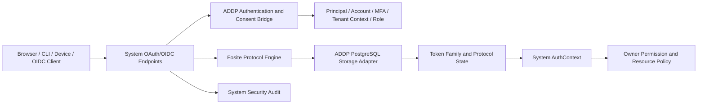

# ADDP IAM OAuth/OIDC 协议引擎 ADR

更新日期：2026-07-23

状态：已接受。本文决定 System 内部 OAuth/OIDC 协议引擎的目标路线；当前运行代码尚未切换，实施前仍需完成 Fosite 受控版本和 PostgreSQL Storage Adapter 设计。

## 一、决策摘要

ADDP 采用 **System 内嵌的 ADDP 受控 Fosite 派生版本** 作为唯一 OAuth2/OIDC 协议引擎。

- System 继续是 ADDP 唯一 IAM 逻辑权威和唯一 Auth Server，不新增独立认证中心进程；
- Fosite 只负责 OAuth2/OIDC 标准协议状态机、校验、错误语义和 Token Endpoint Handler；
- ADDP 继续负责 Principal、账号、认证、MFA、Tenant Context、Role、owner 资源授权、审计、页面和外部 IdP 身份映射；
- 不直接采用缺少 RFC 8628 Device Flow 的上游正式版 `v0.49.0`；
- 不直接依赖可移动的 `master` 分支或未审查的伪版本；
- 以已验证的上游提交 `a5f0b09bf31c17297b25637bb3fec2ff7a55b159` 为首个候选基线，建立 ADDP 控制、带来源和补丁清单的不可变版本；
- 上线基线必须纳入适用的未合并安全与一致性修复，其中 PKCE Session 删除时机、Device `slow_down` 持久化和失效 Device Code 按原 Grant 撤销 Token 是强制门禁；
- 当前自研 OAuth 状态机是一次性待替换实现。切换时删除旧 OAuth Code、Device、Refresh、Revocation 协议处理逻辑，不按 grant type、客户端或配置保留双处理器。

这个结论选择的是 Fosite 协议核心，不是 Ory Hydra、Keycloak、Casdoor 或第二套 IAM 产品。

## 二、决策背景

ADDP 已确定以下长期要求：

1. 本地账号和外部 IdP 最终映射到同一 User / Principal；
2. 浏览器、CLI loopback、Device Flow 和后续 SSO 共享同一授权上下文；
3. OAuth Scope 只能缩小 Role Permission 和 owner Resource Grant 的结果；
4. API Access Token 保持随机 opaque Token，业务模块只消费 System AuthContext；
5. OIDC 需要 Discovery、Authorization Server Metadata、JWKS、ID Token 和退出语义；
6. Authorization Code、Refresh Token 和 Device Code 必须具备标准的一次性消费、轮换、重用检测和稳定错误语义；
7. 协议状态必须在 PostgreSQL 事务中持久化，多个 System 实例不能依赖进程内状态。

当前 System 已自研 Authorization Code + PKCE、RFC 8252 动态 loopback、Device Flow、Refresh Token Rotation / Reuse Detection、Revocation 和 opaque Token，但没有 OIDC Discovery、JWKS 或 ID Token。继续扩展自研状态机意味着 ADDP 要长期自行维护 OAuth/OIDC 协议一致性和安全边界，这不是平台的核心业务能力。

## 三、候选版本核实

核实日期为 2026-07-23。

| 能力或事实 | 上游 `v0.49.0` | 上游 master 伪版本 | ADDP 结论 |
| --- | --- | --- | --- |
| 最新正式版本 | 2024-12-12 发布 | 不适用 | 正式版已超过一年半未更新 |
| Go 版本 | 要求 Go 1.22 | 要求 Go 1.22 | 与 ADDP Go 1.24 兼容 |
| Authorization Code + PKCE | 支持，PoC 通过 | 支持 | 交给 Fosite |
| RFC 8252 loopback 动态端口 | 支持，PoC 通过 | 支持 | 交给 Fosite redirect matcher |
| opaque Code / Access / Refresh Token | 可替换 `oauth2.CoreStrategy`，PoC 通过 | 同左 | 保留 `addp_ac_`、`addp_at_`、`addp_rt_` |
| Refresh Rotation / Reuse Detection | 支持，PoC 通过 | 支持 | 交给 Fosite Handler，持久化由 ADDP Adapter 完成 |
| RFC 7009 Revocation | 支持 | 支持 | 交给 Fosite Handler |
| RFC 8628 Device Flow | **不支持**，无 `handler/rfc8628` | 有 Handler，官方 `TestDeviceFlow` 通过；默认 Rate Limit Strategy 不实施 `slow_down`，失效 Code 重放撤销使用错误 Request ID | 使用受控派生版本修复，不由 ADDP 另写 Device Handler |
| OIDC Core | 支持协议 Handler | 支持协议 Handler | 由 Fosite 生成协议响应，ADDP 提供认证和 Claim 来源 |
| Discovery / Metadata / JWKS / 登录页 | 不提供完整应用 | 不提供完整应用 | 由 System 提供外围端点和页面 |
| PostgreSQL Storage | 只定义接口 | 只定义接口 | ADDP 必须实现事务型 Storage Adapter |
| 维护状态 | 最新 release 为 `v0.49.0` | HEAD 固定在 2025-07-03 的 `a5f0b09b` | 不能把上游活跃维护作为安全假设 |

上游当前仍有未合并修复，包括：

- [#883：PKCE verifier 成功校验后才删除 PKCE Session](https://github.com/ory/fosite/pull/883)；
- [#887：JWT Claims 从通用 JSON 数组恢复 audience](https://github.com/ory/fosite/pull/887)。

因此，“直接固定当前 master 伪版本”虽然具备 Device Flow 主体结构，但仍不满足 ADDP 的生产安全门禁。受控派生版本必须逐项审查从 `v0.49.0` 到候选基线的变更和后续适用修复，不能只复制 HEAD 后停止维护。官方 `TestDeviceFlow` 通过只证明其已覆盖用例，不等于完整 RFC 8628 一致性证明。

## 四、方案比较

| 路线 | 优点 | 不可接受的问题 | 结论 |
| --- | --- | --- | --- |
| 继续完全自研 | 当前代码和数据表可直接延续 | OIDC、协议错误、安全测试和后续 RFC 都由 ADDP 独自维护 | 拒绝 |
| 上游 `v0.49.0` + ADDP 自研 Device Flow | 使用正式 tag | 按 grant type 形成两个协议引擎，事务、错误和安全行为会分裂 | 拒绝 |
| 直接依赖上游 master 伪版本 | Device Flow 已实现，官方测试通过 | 未发布、上游停更、存在未合并关键修复，版本治理不可控 | 拒绝 |
| ADDP 受控 Fosite 派生版本 | 复用成熟协议核心，同时固定来源、补丁和升级节奏 | ADDP 需要承担依赖审计与小规模补丁维护 | **接受** |
| 独立 OAuth/IAM 产品 | 产品能力完整 | 引入第二部署单元和潜在第二 IAM 事实源，超出当前边界 | 本 ADR 不采用 |

受控派生版本不是重新实现 Fosite。ADDP 不修改协议语义或创造私有 grant，只维护构建可重复性、已知修复和与 ADDP Storage Adapter 的必要集成。若未来上游发布覆盖这些修复的正式版本，应通过完整回归后回到上游正式版，不能长期保留无价值差异。

## 五、目标边界



| 能力 | 唯一责任方 |
| --- | --- |
| OAuth/OIDC 请求解析、标准校验、grant 状态机和协议错误 | Fosite |
| OAuth Client、redirect URI、Scope 和 protocol session 持久化 | ADDP Storage Adapter，按 Fosite 接口提供 |
| 用户认证、登录 Session、MFA、账号恢复 | System IAM |
| 用户同意、Platform / Tenant Context 选择 | System Authentication / Consent Bridge |
| Principal、Membership、Role Permission 和授权版本 | System IAM |
| owner Resource Grant / Policy 最终判断 | 各资源 owner |
| Discovery、Authorization Server Metadata、JWKS 和退出页面 | System，内容必须来自同一 Provider 配置 |
| OAuth 安全审计和 Redis 限流 | System 外围中间件 |
| opaque Token 生成与签名索引 | ADDP `oauth2.CoreStrategy` |

Fosite 不读取或计算 ADDP Role 和资源权限。Consent Bridge 只把 System 已计算并由用户确认的 Principal、唯一当前 Context、audience 和 Scope 写入 Fosite Session；客户端不能通过协议参数提交 Principal、Tenant、Role 或 Permission。

## 六、协议与现有 API 的衔接

### 6.1 Authorization Code + PKCE

现有 `request_id` 托管流程保留为 ADDP 的浏览器安全边界，但协议校验不再由 `TokenService` 重写：

1. `POST /oauth/authorization_requests` 把表单转换为规范化 Fosite Authorize Request；
2. Fosite 完成 Client、redirect URI、response type、Scope、audience 和 PKCE 校验；
3. Storage Adapter 保存可重建的协议请求，浏览器仍只携带随机 `request_id`；
4. 用户完成认证、Context 选择和同意后，Bridge 调用 Fosite 生成 Authorization Response；
5. `/oauth/token` 完整交给 Fosite 处理 Code 兑换与 PKCE；
6. Fosite 的 Code Session 失效、Access / Refresh Session 创建和 ADDP Token Family 更新必须处于同一 PostgreSQL 事务。

ADDP 不再并行执行 redirect、PKCE、Code 单次使用或 OAuth error 校验。

### 6.2 Device Flow

`/oauth/device/code`、Device 授权确认和 Device Code grant 使用同一个含 `handler/rfc8628` 的 Fosite Provider。User Code 页面、当前用户认证和 Context 选择由 System 负责；`authorization_pending`、`access_denied`、`expired_token` 和一次性兑换由 Fosite Handler 负责。

Fosite master 的默认 `DeviceRateLimitStrategy` 不实施轮询间隔。ADDP 必须为同一 Handler 注入 PostgreSQL 持久化的 `DeviceRateLimitStrategy`，原子维护当前 interval 和下一次允许轮询时间，过快轮询返回 `slow_down` 并将后续 interval 增加 5 秒。它是 Fosite Strategy 扩展，不是第二个 Device Handler。

受控派生版本还必须修复失效 Device Code 重放时使用新 Token Request ID 撤销的错误，改为使用已持久化 Device Request 的原始 ID，使关联 Access / Refresh Token Family 真正被撤销。

不得保留现有 `CreateDeviceAuthorization`、`ApproveDeviceAuthorization`、`ExchangeDeviceCode` 作为另一套协议状态机。

### 6.3 Refresh 与 Revocation

OAuth Client 的 Refresh Token grant 和 Revocation Endpoint 交给 Fosite Handler。Storage Adapter 必须复用 System 唯一 Token Family Repository 和事务原语，保持：

- opaque Token Hash 存储；
- Refresh Token 严格轮换；
- 已使用 Token 重放时撤销整个 Family；
- Access Token、Browser Resource Access Ticket 和缓存同步失效；
- Principal 授权版本和唯一当前 Context 仍有效。

第一方 Web `/refresh` 不是 OAuth grant，由 System Session Service 处理，但必须复用同一 Token Family Repository；不能复制另一套 Family 状态和重用判断。

### 6.4 OIDC

OIDC ID Token 是发给 OIDC Client 的签名身份断言，不是 ADDP API Access Token。`System 不签发用户 JWT` 的准确边界是：**ADDP API Access Token 始终为 opaque Token，业务模块永远不把 ID Token 或外部 IdP Token 当作 Bearer Access Token。**

System 负责：

- issuer 和端点配置；
- Discovery 与 Authorization Server Metadata；
- JWKS 发布、签名密钥轮换和 `kid`；
- UserInfo Claim 来源；
- `prompt`、`max_age`、`auth_time`、`acr`、`amr` 和 nonce 所需的认证事实；
- 前后端退出、RP-Initiated Logout 和外部 IdP 会话衔接。

Fosite 负责 OIDC Authorize/Token 响应和 ID Token 的标准协议校验。OIDC issuer、Claim 最小化、签名算法和密钥生命周期必须在启用 OIDC 前形成单独实现设计，不能从环境 URL 临时拼接。

## 七、Storage Adapter 约束

ADDP 必须实现事务型 PostgreSQL Adapter，覆盖所选 Provider 实际组合要求的全部接口，包括 Client、Authorize Code、PKCE、Access Token、Refresh Token、Revocation、OIDC 和 RFC 8628 Device Session。

约束如下：

1. 实现 Fosite 事务接口，使 Code 消费、Token 创建、Refresh Rotation 和重用撤销原子提交；
2. Token、Code、Device Code、User Code 和 Request Secret 只保存 Hash；
3. 不使用 Go `gob`、内存对象地址或库私有结构的原始二进制作为长期协议事实；
4. 持久化字段使用 ADDP 版本化 JSON Schema 或显式列，Adapter 能从稳定字段重建 Fosite Requester / Session；
5. Session 必须包含 Principal、唯一当前 Context、`issued_authorization_version`、Client、audience、Scope、认证方法和认证时间；
6. 所有跨表 FK、唯一约束和重放防护进入显式 SQL migration，不使用 GORM AutoMigrate；
7. Adapter 不自行重新判断 OAuth 语义，领域校验只限 ADDP Principal、Context、授权版本和 Token Family 生命周期；
8. 多实例并发必须使用数据库行锁、唯一约束和可识别的序列化冲突，不能使用进程锁保证安全。

具体表和接口映射在第一批 IAM SQL migration 前完成独立的 Storage Adapter 设计。现有 OAuth 表只作为事实参考，不直接承诺沿用。

## 八、受控版本治理

首个可进入 ADDP `go.mod` 的 Fosite 版本必须满足：

1. 来源提交、上游 tag 差异、补丁清单和 Apache-2.0 许可可追溯；
2. 使用不可变 tag / commit 和 `go.sum`，禁止 `@master`、本地 replace 或运行时下载；
3. 审查 `v0.49.0..a5f0b09b` 全部提交及所有适用的未合并修复；
4. 合入 PKCE Session 删除时机修复，并补充错误 verifier 后合法客户端仍能成功兑换的回归测试；
5. 修复失效 Device Code 重放按原 Device Request ID 撤销，并增加兑换后重放导致整个 Family 失效的回归测试；
6. 使用 ADDP PostgreSQL `DeviceRateLimitStrategy` 覆盖默认空实现，并验证 `slow_down` 后 interval 累加；
7. 运行 Fosite 上游单元/集成测试、ADDP Storage Adapter 测试和真实 Web / CLI / Device E2E；
8. 在依赖扫描、SBOM 和升级记录中单独标识该派生版本；
9. 每次升级必须重新审查 Provider 组合、Storage 接口变化、数据库迁移和协议行为；
10. 上游正式版覆盖所需能力与修复后，优先无差异回归上游正式版。

ADDP 不承诺跟随上游 master。受控版本升级是显式安全变更，不能由自动依赖更新直接合入。

## 九、切换与删除范围

切换采用一次性主路径替换：

1. 先完成受控 Fosite 模块、Provider 组合、Storage Adapter Schema 和事务测试；
2. 在现有 System 路由内接入单一 Fosite Provider，保持已确认的外部 API 契约；
3. 一次性切换 Authorization Code、Device、OAuth Refresh 和 Revocation；
4. 删除 `TokenService` 中对应的自研协议状态机、重复 OAuth error mapping 和旧模型；
5. 第一方 Web Session、Delegated Access Token 和 Browser Resource Access Ticket 移入明确的领域 Service，不以“暂时兼容”为由留在旧 OAuth Service；
6. 删除旧表或由一次性开发环境重建替换，不保留 Adapter 同时读取新旧结构；
7. 同步 Swagger、正式规范、CLI 和真实环境 E2E 后才允许合并切换。

测试中可以离线对比新旧行为，运行时不能通过 feature flag、配置、client_id 或 grant type 选择旧处理器。

## 十、验收门禁

实现阶段至少验证：

- Authorization Code + PKCE S256 正常、错误 verifier、Code 重放和并发兑换；
- RFC 8252 `127.0.0.1` 动态端口接受矩阵与 host/path/query/scheme 拒绝矩阵；
- Device Flow pending、slow_down、deny、expire、approve、单次兑换和并发轮询；
- Refresh Rotation、并发刷新、旧 Token 重放、全 Family 撤销和缓存失效；
- Revocation 的 Client 绑定和 RFC 7009 不泄露语义；
- OIDC nonce、`auth_time`、audience、`azp`、签名、JWKS 轮换和退出；
- Platform / Tenant Context 固定、Membership 失效和 `authorization_version` 变化；
- PostgreSQL 事务回滚、序列化冲突、重启恢复和多 System 实例；
- OAuth 安全审计脱敏、Redis 限流失败关闭和稳定错误码；
- 真实 Console 登录、CLI loopback、CLI Device Flow 和刷新 E2E。

协议基线至少对照 OAuth 2.0、PKCE、RFC 7009、RFC 8252、RFC 8414、RFC 8628、OAuth 2.0 Security Best Current Practice（RFC 9700）、OpenID Connect Core、Discovery 和 RP-Initiated Logout。

## 十一、PoC 证据

PoC 位于仓库外 `/tmp/addp-fosite-poc`，不会进入生产树。验证结果：

```text
Fosite v0.49.0:
- RFC 8252 dynamic loopback redirect: PASS
- Authorization Code + PKCE S256: PASS
- custom addp_ac_ / addp_at_ / addp_rt_ opaque strategy: PASS
- Authorization Code single consumption: PASS
- Refresh Token rotation and family revoke on reuse: PASS
- handler/rfc8628 package: ABSENT

Fosite master a5f0b09b:
- official integration TestDeviceFlow: PASS
- all 9 Device Flow subcases: PASS
- source audit: default ShouldRateLimit is a no-op; invalidated-code replay revokes by the new token request ID
```

PoC 同时确认 Fosite 在 Authorization Code 重放时会撤销该请求关联的 Access / Refresh Token；测试和 Adapter 不得把这个标准安全处置误判为普通 Code 校验失败。

## 十二、后果

正向结果：

- ADDP 不再自行扩展 OAuth/OIDC 状态机；
- CLI loopback、Device Flow、OIDC 和 Refresh 共用同一协议引擎；
- 账号、Tenant、三员、Role 和 owner 授权仍只有 ADDP 一个事实源；
- opaque Access Token 与现有 AuthContext 边界可以保留；
- 后续协议一致性测试能够围绕一个 Provider 和一个 Storage Adapter 建立。

需要承担的成本：

- ADDP 必须维护受控依赖版本、补丁审查和升级流程；
- PostgreSQL Storage Adapter 是安全关键代码，不能把 MemoryStore 或简单 GORM CRUD 带入生产；
- Discovery、JWKS、密钥轮换、登录/同意页面、MFA 和外部 IdP 联合仍需 System 自己实现；
- 当前 OAuth 表和 `TokenService` 不能原样保留，需要在 IAM 一次性切换中重构和删除。

## 十三、下一实施顺序

1. 设计 Fosite Provider 组合、ADDP Session 类型和 PostgreSQL Storage Adapter 接口/表映射；
2. 建立受控 Fosite 派生版本并完成补丁、许可、SBOM 和上游测试门禁；
3. 将 Storage Adapter 所需表并入 IAM 第一批显式 SQL migration；
4. 实现单一 Provider 并一次性替换当前 OAuth 状态机；
5. 完成 OIDC issuer、Discovery/JWKS、Claim 和密钥生命周期设计后启用 OIDC；
6. 执行全量后端测试、协议一致性测试与真实 Web / CLI / Device E2E。
