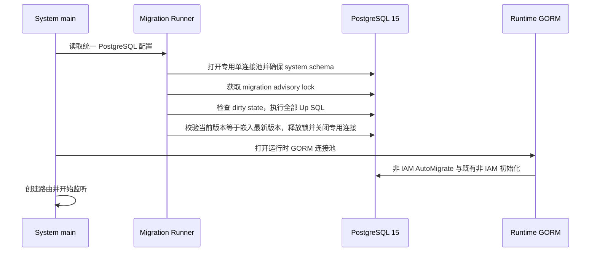

# ADDP IAM PostgreSQL 迁移与首批 DDL 设计

更新日期：2026-07-31

状态：三十四版 IAM DDL、PostgreSQL 15 约束测试、System migration runner、TOTP Runtime、离线三员 Bootstrap、离线三员凭据恢复、普通 User 本地密码重置、Tenant 管理闭环、Service Principal Runtime 和 Fosite 主路径已实现。开发 `addp` 数据库已迁移到 `34/clean`；Recovery Attempt 1 已完成，既有三员 Browser `platform + AAL2` 登录与正式 `addp` CLI E2E 已覆盖 RFC 8252 动态 loopback、PKCE、Device Flow、AuthContext、Keychain 刷新轮换、受委托 Tool 调用和撤销。Tenant 管理 Browser E2E 已覆盖安全管理员创建普通 User、系统管理员初始化 Tenant、首位 Tenant Administrator 进入 Tenant Context、显式授予基础设施管理员、密码受控重置以及引擎、应用和 Cleanup 正常使用。

## 一、目标与边界

本文确定：

1. System 的 IAM schema 如何由显式、版本化 SQL 创建和演进；
2. migration runner 的库、包边界、启动顺序、锁和失败行为；
3. 第一批 IAM DDL 的分版边界、表归属、约束和种子数据来源；
4. 开发环境从旧三级 User / 自研 OAuth 一次性切换到目标模型的破坏性边界；
5. PostgreSQL 15 上的最小验证矩阵。

本文不定义：

- migration runner、`.sql` 文件、模型或 Service 的具体 Go 实现；
- 各 owner Permission Manifest、聚合器、Permission 常量或内置 Role 精确数据；
- 普通账号自助恢复、WebAuthn 或外部 IdP 配置；
- owner、Asset 或其他模块自身的 schema migration；
- 现有非 IAM System 表从 GORM `AutoMigrate` 全量迁移的改造。

IAM 表的定义以 [IAM 目标数据模型设计](addp-IAM目标数据模型设计.md) 为准；OAuth 协议表和事务事实以 [Fosite Provider 与 Storage Adapter 设计](addp-IAM%20Fosite%20Provider与Storage%20Adapter设计.md) 为准；Permission 种子由 [IAM Permission 目录与 Role 矩阵设计](addp-IAM权限目录与角色矩阵设计.md) 确定的各 owner Manifest 和唯一发布期聚合流程生成。

## 二、核心决策

| 决策 | 结论 | 原因 |
| --- | --- | --- |
| 迁移库 | `github.com/golang-migrate/migrate/v4 v4.19.1` | 支持 Go 1.24、`io/fs` 嵌入、PostgreSQL advisory lock、dirty state 和现有 `database/sql` 驱动生态 |
| SQL 交付 | SQL 嵌入 System 二进制 | 每个部署实例只执行与该二进制完全对应的 migration 集合，不依赖工作目录或外部 CLI 文件 |
| 运行入口 | 只有 System 启动期 runner 调用 `Up` | 禁止应用启动和外部 CLI 两条运行路径竞争版本、锁或环境变量 |
| SQL 方向 | 仅允许向前 `.up.sql` migration | 开发环境重建或数据库备份恢复是回退方式，不在生产运行路径执行 `Down` 或 `Force` |
| IAM DDL | 全部显式 SQL | 目标模型依赖组合外键、部分唯一索引、触发器和 `NULLS NOT DISTINCT`，不能由 GORM 推断 |
| 旧数据 | 首次切换前重建开发环境 IAM 数据 | 不编写运行时回填、旧表读取、旧字段兼容或双表同步 |
| 非 IAM 表 | 暂保留现有 `AutoMigrate`，但置于 runner 之后 | 不扩大本轮范围；IAM 新路径不能再次进入 `AutoMigrate` |
| 并发启动 | PostgreSQL session advisory lock，等待锁释放才继续 | 多实例不能在 schema 未完成时对外服务；连接终止后 PostgreSQL 自动释放锁 |
| 失败处理 | dirty state 直接使 System 启动失败 | 禁止自动 `Force`、删除版本记录或静默修复未知的部分 schema |

`v4.19.1` 的模块声明为 Go 1.24，与 `system/backend` 的 Go 1.24.2 匹配。选择该版本不表示开始修改 `go.mod`；依赖只在本文确认、代码实施开始时加入。

## 三、运行器边界与目录

目标目录如下：

```text
system/backend/internal/migration/
  runner.go
  embed.go
  sql/
    000001_iam_identity_tenant.up.sql
    000002_iam_federation_organization.up.sql
    000003_iam_authorization_governance.up.sql
    000004_iam_session_token_family.up.sql
    000005_iam_oauth_fosite_storage.up.sql
    000006_iam_catalog_seed.up.sql
    000007_iam_audit_context.up.sql
    000008_iam_context_selection_step_up.up.sql
    000009_iam_catalog_restore_actions.up.sql
    000010_iam_tenant_invitation_enrollment.up.sql
    000011_iam_mfa_bootstrap.up.sql
    000012_iam_standard_document_catalog.up.sql
    000013_monitor_authorization_catalog.up.sql
    000014_model_authorization_catalog.up.sql
    000015_standard_authorization_catalog.up.sql
    000016_manager_authorization_catalog.up.sql
    000017_iam_disable_unconsumed_authorization_catalog.up.sql
    000018_iam_administrator_credential_recovery.up.sql
    000019_iam_tenant_administration_closure.up.sql
    000020_iam_role_key_namespace.up.sql
    000021_iam_local_account_password_reset.up.sql
```

`internal/migration` 是 System 启动基础设施，不是运行时 Repository：

- `runner.go` 只处理嵌入 SQL、数据库版本、锁、错误和启动门禁；
- `embed.go` 通过 `//go:embed sql/*.up.sql` 提供只读 `embed.FS`；
- `sql/` 只保存不可变、按零填充版本升序的向前 migration；
- `internal/repository` 只保留运行时数据访问，不持有 migration 版本或 DDL 字符串；
- `internal/iam` 只使用完成迁移后的领域表，不能在启动时自行建表、补列或写种子。

不创建仓库外可执行 migration CLI、临时 SQL 脚本或可由不同版本二进制单独调用的第二 runner。运维需要审阅数据库版本时，只读查询 `system.schema_migrations`；需要恢复时走备份恢复或开发环境整体重建，不调用应用内 `Down` / `Force`。

## 四、启动顺序与数据库连接

目标启动顺序是：



具体约束：

1. PostgreSQL DSN 从一个 System 配置对象生成，runner 和 GORM 不再各自读取不同的环境变量；
2. runner 使用同一 PostgreSQL 实例和同一凭据，但使用启动期专用、`MaxOpenConns=1` 的 `database/sql` 连接池；migration 完成后立即关闭；
3. 不能将 GORM 运行时的 `*sql.DB` 直接传给 `postgres.WithInstance`。该 driver 的 `Close` 会关闭传入连接池，容易误伤运行时连接；
4. runner 在建立 migration driver 前只允许执行 `CREATE SCHEMA IF NOT EXISTS system`。所有业务表、约束、种子和删除动作只能在版本化 SQL 中出现；
5. runner 成功前不创建 GORM 运行时连接、不调用 `AutoMigrate`、`EnsureBuiltinOAuthClients`、`InitSuperAdmin`、`InitDefaultTenant` 或其他数据初始化；
6. runner 成功后，IAM 相关模型不再传给 `AutoMigrate`，旧 OAuth Client 初始化和默认账号初始化也必须删除；
7. 非 IAM 的既有 `AutoMigrate` 仅是暂时范围边界，后续将以独立设计迁移；它不能创建、修改或回填任何 IAM 表。

`golang-migrate` 的 PostgreSQL driver 默认使用 `schema_migrations`。ADDP 固定配置为 `SchemaName: "system"`、`MigrationsTable: "schema_migrations"`，因此唯一版本记录表为 `system.schema_migrations`，不依赖连接的 `search_path` 或未加引号的 `system.schema_migrations` 表名解析。

## 五、锁、事务与失败状态

### 5.1 全局锁

`golang-migrate` PostgreSQL driver 使用基于数据库名、schema 和 migration table 派生的 session advisory lock。ADDP 采用此锁作为 System schema migration 的唯一全局锁：

- 第二个 System 实例在锁被占用时保持未就绪，不打开 HTTP 监听；
- 持锁实例正常完成后，等待实例重新读取版本并确认无变更；
- 持锁进程或数据库连接异常终止后，PostgreSQL 自动释放 session lock；
- 不使用进程内 mutex、Redis lock、文件锁或 Kubernetes leader election 替代数据库锁；
- 不暴露跳过锁、并行执行或自动接管的环境变量。

该库默认的 `Migrate.LockTimeout=15s` 只是本地 goroutine 等待，并不能取消底层阻塞式 `pg_advisory_lock`。因此 runner 不把默认 15 秒解释为可靠的启动超时，也不在超时后继续启动。实施时将锁等待设置为 fail-closed 的进程生命周期等待，服务编排的终止动作负责取消整个启动进程；不得留下“报告超时但后台 goroutine 随后获得锁”的路径。

### 5.2 每个版本的事务

PostgreSQL driver 不为 migration 文件自动定义事务边界。每个普通 `.up.sql` 必须显式：

```sql
BEGIN;
-- 本版本的全部 DDL、约束、触发器和固定种子
COMMIT;
```

约束：

- 一个版本只做一个可审查的语义变更，不把不相关表改动混在一起；
- 事务内禁止 `CREATE INDEX CONCURRENTLY`、`VACUUM` 等 PostgreSQL 不允许在事务中执行的语句；第一批 IAM DDL 不需要这些语句；
- 如果未来确需非事务语句，必须单独成版、显式标记、评审锁定和失败恢复方案，不能混入普通 IAM migration；
- migration 之间不是一个巨型事务。前一版完成、后一版失败时，`schema_migrations` 会标记失败版本 dirty，System 仍不得启动。

### 5.3 dirty state、版本门禁与恢复

执行一个版本前，库先把该版本写为 dirty，SQL 成功后才写为 clean。runner 的行为固定为：

1. 启动前发现 dirty，记录版本号并退出；
2. `Up` 返回 `ErrNoChange` 是正常结果，其他错误使启动退出；
3. `Up` 后重新读取版本，要求 `dirty=false` 且版本等于嵌入 SQL 集合的最高版本；
4. 数据库版本高于当前二进制、缺少嵌入版本或版本不连续，均使启动退出；
5. 运行时代码不调用 `Force`，不删除 `schema_migrations`，不根据表存在性猜测版本，也不自动重试失败 DDL；
6. 开发环境的恢复方式是停止所有 ADDP 服务并重建目标数据库；需要保留数据的环境只能先从备份恢复到已知版本，再通过新的向前 migration 修复。

因此 migration 文件一经合入不可编辑、不可改号、不可重用。修复只能新增更高版本；环境整体重建也不构成允许改写已发布 migration 的理由。

## 六、首批版本与 DDL 边界

第一批版本按依赖关系拆分。全部版本执行成功后才允许 System 进入 IAM 新主路径；任何中间版本都不是可独立发布的运行时契约。

| 版本 | 表与约束范围 | 不承担的职责 |
| --- | --- | --- |
| `000001_iam_identity_tenant` | `principals`、`users`、`local_accounts`、`service_principals`、`tenants`、`tenant_memberships`；Principal 子类型、唯一本地账号、Tenant Membership 和 Context 的基础检查/组合外键 | 不创建默认 User、Tenant、管理员或 Service Principal |
| `000002_iam_federation_organization` | `identity_providers`、`tenant_idp_connections`、`external_identities`、`user_attribute_authorities`、`departments`、`department_memberships`、`project_groups`、`project_group_memberships`；同 Tenant 组合外键、主部门唯一、组织树防环触发器 | 不配置外部 IdP、不执行 JIT 或目录同步 |
| `000003_iam_authorization_governance` | `permissions`、`roles`、`role_permissions`、`role_assignments`、`role_conflicts`、`privileged_change_requests`、`privileged_change_approvals`，以及 Principal/Assignment 的审批请求外键；Role Scope、三员互斥、高权限双人审批和一次性消费约束/触发器 | 不授予三员 Role Assignment，不实现审批 API |
| `000004_iam_session_token_family` | `context_selection_tickets`、`context_selection_ticket_options`、`refresh_token_families`、`access_tokens`、`refresh_tokens`，以及按目标模型改造的 `delegated_access_tokens`、`resource_access_tickets`；Family 与 Principal/Context/授权版本的一致性 | 不签发 Token，不保留旧 `user_id + tenant_id` Token 语义 |
| `000005_iam_oauth_fosite_storage` | `oauth_clients`、`oauth_authorization_requests`、`oauth_pkce_sessions`、`oauth_oidc_sessions`、`oauth_authorization_codes`、`oauth_device_authorizations`；Hash、请求关联、PKCE、Device `slow_down`、Code/Device 重放和 Fosite Adapter 所需索引 | 不启用 OIDC endpoint，不保存 Fosite session blob |
| `000006_iam_catalog_seed` | 聚合各 owner Permission Manifest 和 System 内置 Role 模板后生成的 `permissions`、内置 Role、Role Permission、Role Conflict 和内置 Client 固定种子 | 不用 `ON CONFLICT DO UPDATE` 充当运行时 reconciliation，不创建 Bootstrap 状态、默认密码或默认三员 |
| `000007_iam_audit_context` | 创建统一 `system.audit_logs`；Principal、AuthContext、Tenant、稳定事件、结构化脱敏详情、追加式存储门禁和审计查询索引 | 不创建第二张 IAM/OAuth 审计表，不把匿名或内部来源扩展为 AuthContext，不实现归档调度器或生产数据库角色交付 |
| `000008_iam_context_selection_step_up` | 补齐 Context Selection 的 step-up 有效期事实与约束 | 不新增认证方式或第三种 Context |
| `000009_iam_catalog_restore_actions` | 向前发布 restore/reactivate Permission，并固化 Principal 生命周期和平台身份审批约束 | 不重写历史 Catalog Seed |
| `000010_iam_tenant_invitation_enrollment` | 创建 Tenant Invitation、Enrollment Ticket、状态机和不可删除门禁；Membership 来源增加 `invitation` | 不发送邮件、不创建第三种 AuthContext、不允许邀请恢复 ended Membership |
| `000011_iam_mfa_bootstrap` | 创建 TOTP Credential、一次性 MFA Challenge、唯一 Bootstrap 状态和不可逆状态约束 | 不实现 WebAuthn、账号恢复或网络 Bootstrap API |
| `000012_iam_standard_document_catalog` | 向前发布 `standard.document.read/create/update/delete`，并将其加入内置 Tenant Governance Manager | 不重写 `000006` 已发布 Catalog Seed，不动态扫描 owner Manifest |
| `000013_monitor_authorization_catalog` | 向前发布 Monitor Alert Incident、Alert Rule、Notification Destination、Notification Delivery Permission 和内置 Tenant Monitoring Operator | 不借用 Execution / Statistics Permission 表达告警与通知写操作 |
| `000014_model_authorization_catalog` | 向前发布 Model Entity、Entity Relation、DW Layer Permission，并将 Entity / Entity Relation 加入 Tenant Governance Manager | DW Layer 只允许 Tenant Scope，不注入可分配到 Department / Project Group 的内置角色；Logical Field、Table Relation、Fact Metric Mapping 继续作为 Logical Model 聚合内子资源 |
| `000015_standard_authorization_catalog` | 向前发布 Standard Glossary、Unit、Classification、Dimension Hierarchy、Element Approve、Metric Approve/Offline Permission，并加入 Tenant Governance Manager | `/deprecate` 业务动作使用稳定 `offline` Permission；Measurement Category、Grading Level、Dimension Hierarchy Level 保持聚合内子资源；文档关联采用 all-of |
| `000016_manager_authorization_catalog` | 前向发布 `manager.derived_artifact.update` 并加入 Tenant Data Steward | 受管 artifact 任务配置更新不借用 create 或 data_item.update；搜索历史和 preview state 继续由 owner 以 self 语义约束 |
| `000017_iam_disable_unconsumed_authorization_catalog` | 将没有 OpenAPI Operation 或 Tool 消费入口的 Permission 置为 `disabled`，同步收缩或停用空内置 Role | 不删除历史目录事实，不在运行时扫描 owner Manifest |
| `000018_iam_administrator_credential_recovery` | 创建短期 `iam_recovery_attempts`、单一有效 Attempt 约束、不可逆状态转换与物理删除门禁 | 不重开 Bootstrap，不创建网络恢复 API，不保存明文 Recovery Secret、密码或 TOTP Secret |
| `000019_iam_tenant_administration_closure` | 发布 Tenant 初始化 Permission，恢复 Tenant Role/Assignment 管理权限，增加显式初始化事实和最后管理员延迟约束 | 新建 Tenant 必须原子建立首位管理员；既有空 Tenant 只允许一次正式初始化；不建立第二套授权表 |
| `000020_iam_role_key_namespace` | 保留所有内置 Role Key，阻止 Tenant 自定义 Role 与内置 Role 同键，并用事务级键锁关闭并发竞态 | 不建立第二个 Role 命名空间；不同 Tenant 仍可各自使用相同的自定义 Role Key |
| `000021_iam_local_account_password_reset` | 前向发布普通 User 本地密码重置 Permission，并加入平台安全管理员 | 不允许重置平台角色持有人，不替代本人改密或三员离线灾难恢复 |

每版必须显式列出：创建对象、外键、检查约束、唯一/部分唯一索引、触发器、所依赖的前一版本和对应测试。禁止通过 `CREATE TABLE IF NOT EXISTS`、`ALTER TABLE ... ADD COLUMN IF NOT EXISTS` 或基于 `information_schema` 的分支使同一版本在不同旧 schema 上产生不同结果。

`000006` 的 SQL 是各 owner `authorization/permissions.yaml` 与 `system/authorization/builtin_roles.yaml` 经唯一发布期聚合后的确定性生成物。Manifest、Schema、聚合器、SQL、owner-local Go/Python/Frontend 常量和角色矩阵必须由同一 CI 校验；不能在 System 启动时扫描模块、动态注册 Permission 或变更 Role Composition。

`000006` 的生成门禁只验证 Catalog、Builtin Role、owner-local 常量、确定性 SQL 和 PostgreSQL 约束。路由/Swagger/Tool 授权覆盖报告必须持续输出真实缺口，并在 IAM Runtime 一次性切换前达到 `complete=true`；它不作为 `000006` 的前置条件，因为部分旧路由只能依赖完整目标 DDL 在 Runtime 重写时删除或拆分。该顺序调整不降低最终发布门禁。

## 七、目标 DDL 强制规则

首批 SQL 必须把下列已确认事实落为 PostgreSQL 15 约束，而不是只在 Go Service 中校验：

1. 新 IAM 业务表主键采用 `bigint generated by default as identity`；短期不可猜测请求和安全 Token 使用 UUID 或 Hash，不退回 `serial`；
2. 所有时间列使用 `timestamptz`，状态用 `text + check constraint`，不使用多组 boolean 推断生命周期；
3. 所有外键列有匹配索引，跨 Tenant 关系使用组合外键，不能只校验两个独立 ID；
4. `roles(tenant_id, role_key)`、Context Ticket Option 和 Role Assignment 的空值唯一语义使用 PostgreSQL 15 `UNIQUE NULLS NOT DISTINCT`；
5. 密码、Client Secret、Token、Authorization Code、Device Code 和 User Code 只保存文档规定的 Hash 或强 KDF 结果；DDL、种子、索引注释和审计表不得出现这些安全材料的明文；
6. Principal 子类型、Department 防环、Role Scope、三员冲突、高权限审批和授权版本递增等跨表不变量使用明确触发器；触发器函数与触发器同版创建并可单独测试；
7. Access/Refresh Token 不重复 Family 的 Principal、Context、Client、audience 或 Scope；Fosite Requester / Session 不落通用 JSON blob；
8. OAuth Device 行必须持久化 `poll_interval_seconds`、`next_poll_at`、`last_polled_at`，失效或已兑换的 Device Code 必须保留原 Request ID 以撤销正确 Family；
9. 对高频 active/pending 查询使用与谓词一致的部分索引，不为低选择性 `status` 单独建立全表索引；
10. 审计表、Permission 目录和 Token 清理保留窗口遵守其各自设计，不能借 IAM migration 临时删除历史事实。
11. `audit_logs.context_type` 只允许 `platform | tenant` 或空；空表示没有已建立 AuthContext，不能使用 `anonymous | internal` 扩展会话枚举；Tenant Context 必须携带 Tenant，Platform Context 和空 Context 都不得携带 Tenant；
12. `audit_logs.details` 必须是 JSON object，禁止密码、Token、Code、PKCE、Cookie、Authorization Header、原始 OAuth 请求体和 query；数据库无条件阻止 UPDATE / DELETE / TRUNCATE，不预留运行时 maintenance 开关。

## 八、一次性切换和旧路径删除

本轮不把旧 schema 包装成可迁移兼容层。切换前置条件和删除边界如下：

1. 停止全部 ADDP 服务；
2. 开发环境清理现有 System IAM 数据和依赖旧 User / Token 主键的测试数据，使用空的目标 `system` schema 执行首批 migration；
3. 对需要保留数据的环境，先完成单独审批的离线导入设计；该工具不进入 System 运行时，不创建旧字段或双读逻辑；
4. 新 System、common、common-python、Gateway、owner 和前端调用方必须同一发布窗口切到 `Principal + AuthContext + Token Family` 契约；
5. 删除旧 `models.User`、旧 `models.Tenant`、自研 OAuth 模型、OAuth `AutoMigrate` 条目、`EnsureBuiltinOAuthClients`、`InitSuperAdmin`、默认 SuperAdmin 环境变量、`InitDefaultTenant` 和旧 `user_type` / 单 `tenant_id` 授权分支；
6. 旧 `system.users`、OAuth、Token 和相关派生表不由 migration 用 `IF EXISTS` 猜测性删除。它们应随开发数据库重建消失；若仍存在，runner 的 preflight 必须拒绝混合 schema 并终止启动；
7. `000006` 只登记不可用的三员 Role 和冲突事实。三个实名主体、强 MFA、初始 Role Assignment 和初始审计事件只能由一次性离线 Bootstrap 在新模型上创建；
8. 完成 PostgreSQL 测试、System API/Swagger 契约、Console/CLI/Device 真环境 E2E 后，才恢复服务流量。

旧路径删除是一次性切换的一部分，不属于后续清理项。运行时 feature flag、Client ID、环境变量或表存在性不得选择旧 OAuth/账号路径。

## 九、验证矩阵

首批实现至少在真实 PostgreSQL 15 上验证以下内容：

| 类别 | 最小验证 |
| --- | --- |
| 嵌入与版本 | 空数据库执行到当前嵌入的最新版本；再次启动返回 no change；版本表在 `system.schema_migrations`；数据库版本高于二进制、dirty 或缺失版本均失败 |
| 原子性 | 每个普通 migration 人为触发约束失败后，DDL/种子整体回滚、目标版本保持 dirty，System 不监听端口 |
| 并发 | 两个 runner 同时启动时只有一个执行 SQL，另一个等待并随后确认 no change；持锁进程终止后锁可被新连接获取 |
| 约束 | Principal 子类型、同 Tenant 组合外键、组织防环、Role Scope、三员互斥、角色审批、`NULLS NOT DISTINCT` 和有效记录部分唯一约束 |
| Token / Fosite 表 | Hash 不泄露、Code/Refresh/Device 重放事实保留、Device `slow_down` 原子累加、Family 撤销关联正确 |
| 旧路径 | 新 runner 拒绝混合 legacy schema；System 启动代码中 IAM 模型不再进入 `AutoMigrate`，不存在 SuperAdmin 或默认 OAuth Client 初始化 |
| 回归 | `go test` 的纯领域测试可以使用 SQLite；迁移、约束、锁、Adapter 事务和并发测试必须使用 PostgreSQL 15；IAM Runtime 切换前授权覆盖报告必须 `complete=true` |

实现阶段应新增独立的 migration runner 测试包，使用临时 PostgreSQL database/schema 而不是测试间共享 `system` schema。测试通过后再执行 System 启动验证和 Fosite Provider/CLI E2E；此时才修改 Swagger 和公开 API 契约。

## 十、已完成的实施记录

1. 确认本文迁移库、启动连接、锁等待、向前 migration 和旧 schema 重建决策；
2. 创建 `internal/migration`、嵌入 runner 和 PostgreSQL 15 migration 测试基座；
3. 先实现并验证 runner 的空库、重复启动、dirty、并发锁和版本门禁；
4. 根据版本化边界实现 DDL、触发器和由 owner Manifest 聚合生成的固定种子；
5. 重写 System IAM 领域模型、Repository 和 Service，删除旧初始化/AutoMigrate 路径，并在切换前把路由/Swagger/Tool 授权覆盖报告收敛为 `complete=true`；
6. 实现 Token Family、Fosite Adapter 与认证/同意桥接；
7. 一次性切换所有 AuthContext 消费方，生成 Swagger，完成真实 Web 与 OAuth 客户端协议 loopback/Device E2E；
8. 实现 TOTP Runtime 与离线三员 Bootstrap，不把 Bootstrap 当作 migration seed；
9. Bootstrap 与真实登录 E2E 通过后实现统一 `/system/iam` 管理工作台，并删除旧 Users、Tenants 和 Logs 页面。

## 十一、已确认的技术决策

System 目标 Router、migration runner、旧 IAM AutoMigrate/默认 SuperAdmin 删除和真实 PostgreSQL 启动组合已经完成。离线三员 Bootstrap 固定采用 `prepare/apply` CLI、256 bit 一次性 Secret Hash、TTY 三人独立密码、TOTP 连续双码验证、单事务三员创建与永久 `completed` 状态。该路线不得用恢复默认 SuperAdmin、开发弱密码或临时网络注册端点替代。

后续实现以以下结论为单一路径：

1. System 采用 `golang-migrate/v4 v4.19.1` 和 PostgreSQL driver，不引入 Goose 或自研 SQL 版本表；
2. SQL 位于 `system/backend/internal/migration/sql/`，经 `go:embed` 发布；
3. `system.schema_migrations` 是唯一版本记录表，runner 是唯一执行入口；
4. runner 使用启动期专用单连接池，完成后关闭；GORM 运行时连接在 runner 成功后才打开；
5. migration 只向前、显式事务、dirty fail-closed，不使用 `Down`、`Force` 或自动修复；
6. IAM schema 按不可变向前版本持续演进，当前嵌入版本为十八，全部成功才允许 System 进入新主路径；
7. 首次切换以开发数据库 IAM 重建完成，不支持旧表/字段/Token 的运行时迁移或兼容；
8. IAM 表从 `AutoMigrate` 和默认账号/OAuth Client 初始化中完全移除；非 IAM `AutoMigrate` 的后续迁移另行设计。
