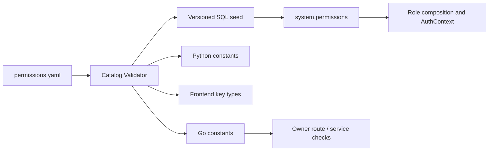

# ADDP IAM Permission 目录与 Role 矩阵设计

更新日期：2026-07-22

状态：技术设计已确认。本文基于 `docs/concepts/addp账号与权限体系图.md` 和 `docs/next/addp-IAM目标数据模型设计.md`，确定 Permission 命名、事实源、路由声明、内置 Role 和 Scope 规则；不定义 AuthContext JSON Schema 或 owner Resource Grant / Policy 表。

## 一、设计目标

本文解决：

1. ADDP Permission 如何命名和维护；
2. System、各业务 owner、Gateway 和前端分别承担什么责任；
3. 平台三员、Tenant 管理角色和首批业务角色拥有哪些 Permission；
4. Tenant 自定义 Role 可以组合哪些 Permission；
5. Platform、Tenant、Department、Project Group Scope 如何参与授权；
6. HTTP、Tool 和非浏览器调用如何声明同一功能权限。

本文不把 Permission 设计成资源 ACL。Permission 回答“是否允许使用一类产品能力”，owner Resource Grant / Policy 回答“是否允许对当前资源执行该动作”。

## 二、核心决策

| 决策 | 结论 |
| --- | --- |
| Permission 粒度 | 按稳定业务能力定义，不按页面、菜单、URL 或 HTTP method 定义 |
| Permission Key | `{domain}.{resource}.{action}`，全部使用小写 snake_case 和点分段 |
| 事实源 | `common/authorization/permissions.yaml` 是版本化产品清单，System 数据库是运行时权威投影 |
| Owner | 每条 Permission 必须声明唯一 `owner_module`，owner 后端执行最终功能校验 |
| Role | 只是一组 Permission，不继承其他 Role，不包含通配符 |
| Tenant 自定义 Role | 只能引用 `tenant_customizable=true` 的稳定 Permission |
| Scope | Role Assignment 显式携带 Platform、Tenant、Department 或 Project Group Scope |
| Deny | Permission / Role 层不存 Deny；资源级 Explicit Deny 归 owner Policy，且优先于 Allow |
| 前端 | 只消费授权结果控制导航和按钮，不作为安全执行点 |
| Gateway | 只做认证和粗粒度入口治理，不根据 URL 推断业务 Permission |

## 三、Permission 事实源

### 3.1 单一清单

新增版本化清单：

```text
common/authorization/permissions.yaml
```

每条 Permission 至少包含：

```yaml
- key: manager.data_item.read
  owner_module: manager
  action: read
  allowed_scope_types: [tenant, department, project_group]
  risk_level: low
  tenant_customizable: true
  delegable: true
  name_i18n_key: permissions.manager.data_item.read.name
  description_i18n_key: permissions.manager.data_item.read.description
```

约束：

- `key` 全局唯一且不可改名；需要改变语义时新增 Key，并在一次性切换中删除旧引用；
- `owner_module` 必须是稳定 ADDP 模块名；`platform`、`iam`、`audit`、`statistics` 权限的 owner 均为 System；
- 清单只包含产品定义，不包含 Tenant 自定义 Role 或运行时 Assignment；
- 模块下线不会自动删除 Permission；禁用必须通过显式版本变更和 SQL migration；
- 用户可见名称和说明只保存 i18n Key，不在数据库硬编码中英文文案。

### 3.2 生成与同步

清单生成：

- Go Permission 常量和描述符；
- common-python Permission 常量；
- common-frontend 只读 Permission Key 类型；
- System SQL seed / reconciliation 数据；
- 文档中的 Permission 目录表。



不采用模块启动时动态注册 Permission 的路线。模块健康状态不能改变授权目录，避免服务暂时离线导致 Role 语义漂移。

### 3.3 CI 校验

清单校验必须覆盖：

- Key 格式、唯一性和 owner_module 合法性；
- action 是否来自允许词汇表；
- allowed Scope 非空且不越过 owner 边界；
- Tenant 自定义 Role 只能引用可定制 Permission；
- 所有内置 Role 引用的 Permission 存在且启用；
- 受保护公开路由声明授权模式；
- `permission` 模式路由引用的 Permission 存在且 owner 匹配；
- Tool Manifest 的 owner、required Scope 和可委托 Permission 与目录一致；
- Swagger / OpenAPI 中的授权元数据与真实路由声明一致。

## 四、命名规范

### 4.1 Key 结构

```text
{domain}.{resource}.{action}
```

示例：

- `iam.tenant_membership.read`
- `manager.data_item.read`
- `meta.scan_task.execute`
- `asset.application.approve`
- `platform.tenant.suspend`

规则：

- domain 表达稳定能力域，通常与 owner 模块相同；
- resource 使用单数 snake_case，不照抄任意 URL 片段；
- action 使用稳定动作词；
- 不使用 `admin`、`superuser`、`all`、`full_access` 等角色或范围词；
- 不支持 `manager.*`、`*.read` 或其他通配符 Permission；
- Permission 之间没有隐式包含关系，`update` 不自动包含 `read`，`execute` 不自动包含 `create`。

### 4.2 动作词汇

首批允许动作：

| Action | 含义 | 默认风险 |
| --- | --- | --- |
| `read` | 读取列表、详情或状态 | low |
| `create` | 创建持久业务定义或关系 | medium |
| `update` | 修改持久业务定义或关系 | medium |
| `delete` | 删除业务定义或资源 | high |
| `execute` | 发起任务、计算、扫描或生成 | medium |
| `cancel` | 取消运行中操作 | medium |
| `retry` | 重新触发已有操作 | medium |
| `publish` | 对外发布或上线 | high |
| `offline` | 下线已发布对象 | high |
| `approve` | 批准业务或高权限申请 | high |
| `reject` | 拒绝申请 | medium |
| `revoke` | 撤销凭据、授权或会话 | high |
| `export` | 导出数据、日志或统计 | high |
| `link` | 建立身份或资源关系 | high |
| `unlink` | 解除身份或资源关系 | high |
| `suspend` | 暂停主体、Tenant 或 Membership | high |
| `close` | 关闭生命周期对象 | critical |

具体 Permission 可以覆盖默认风险级别，但不能改变动作语义。避免使用含义不确定的 `manage`；确实无法拆分的原子能力应重新命名为业务动作。

## 五、授权模式与路由声明

每个公开路由必须声明一种授权模式：

| 模式 | 用途 | 示例 |
| --- | --- | --- |
| `public` | 无身份即可访问 | Login、OAuth metadata |
| `authenticated` | 只要求有效 AuthContext，不产生业务授权 | AuthContext 基础设施入口 |
| `self` | 只能操作当前 User 自身资源 | `/users/me`、修改自己的凭据 |
| `permission` | 要求一个或多个稳定 Permission | 创建任务、管理 Tenant Membership |
| `delegated_tool` | 同时要求 Role Permission、Tool Scope、audience 和审批 | Agent 代表用户执行 Tool |
| `resource_ticket` | 原生 GET/HEAD 资源请求 | 图片、媒体、下载、三维内容 |
| `internal` | 已验证 Service Principal / Internal API 身份 | 模块注册、内部配置读取 |

规则：

- `self` 是 User 与自身身份资源的关系策略，不是隐藏的全局 Role；
- `internal` 不携带或提升 User / Tenant Permission；
- `resource_ticket` 仍执行对应内容读取 Permission 和 owner Resource Policy；
- `delegated_tool` 不能只校验 OAuth Scope，Role Permission 仍必须成立；
- 一个路由需要多个 Permission 时按 all-of 计算，不支持含糊的字符串表达式；
- 业务上的“满足其一”应定义一个稳定能力 Permission，由 owner 在内部处理来源差异。

目标 Swagger / OpenAPI 为公开路由输出：

```yaml
x-addp-auth-mode: permission
x-addp-required-permissions:
  - meta.scan_task.execute
```

具体 Swagger 注解和路由 helper 在 API 技术设计阶段确定。本轮不修改真实路由或生成产物。

## 六、平台与 IAM Permission 目录

以下每个 action 都生成一个完整 Permission Key，例如 `platform.tenant.read`。

| Base Key | Actions | Allowed Scope | Tenant Customizable | Owner |
| --- | --- | --- | --- | --- |
| `platform.tenant` | `read, create, update, suspend, close` | Platform | false | System |
| `platform.module` | `read, update` | Platform | false | System |
| `platform.configuration` | `read, update` | Platform | false | System |
| `platform.operation` | `read` | Platform | false | System |
| `platform.backup` | `execute` | Platform | false | System |
| `platform.restore_request` | `read, create, approve, reject, execute` | Platform | false | System |
| `iam.user` | `read, create, update, suspend` | Platform | false | System |
| `iam.external_identity` | `read, link, unlink, suspend` | Platform | false | System |
| `iam.identity_provider` | `read, create, update, suspend` | Platform | false | System |
| `iam.security_policy` | `read, update` | Platform | false | System |
| `iam.session` | `read, revoke` | Platform | false | System |
| `iam.permission` | `read` | Platform, Tenant | false | System |
| `iam.role` | `read` | Platform, Tenant | false | System |
| `iam.platform_role_change` | `read, create, approve, reject` | Platform | false | System |
| `iam.platform_identity_change` | `read, create, approve, reject` | Platform | false | System |
| `audit.event` | `read, export` | Platform | false | System |
| `audit.subject` | `read` | Platform | false | System |
| `audit.report` | `read, create, update` | Platform | false | System |
| `statistics.summary` | `read` | Platform | false | System |
| `statistics.tenant_breakdown` | `read, export` | Platform | false | System |

平台内置 Role 只由版本化产品清单和 SQL migration 维护，不提供运行时创建或修改入口。Platform Role Assignment 只能经 `iam.platform_role_change` 审批流程生成。对当前持有平台角色的 User 执行 suspend / deactivate 等身份变更时，必须转入 `iam.platform_identity_change` 审批流程，安全管理员不能单方面使其他两员失效。

平台恢复会改变 IAM、Tenant 和审计状态，不能由系统管理员单独完成。Restore Request 必须由系统管理员创建，经不同的安全管理员和审计管理员分别批准后，才允许系统管理员执行；审批过程中不得持有数据库事务锁。

## 七、Tenant 管理 Permission 目录

| Base Key | Actions | Allowed Scope | Tenant Customizable | Owner |
| --- | --- | --- | --- | --- |
| `iam.tenant_invitation` | `read, create, revoke` | Tenant | false | System |
| `iam.tenant_membership` | `read, update, suspend, close` | Tenant | false | System |
| `iam.tenant_role` | `read, create, update, delete` | Tenant | false | System |
| `iam.tenant_role_assignment` | `read, create, revoke` | Tenant, Department, Project Group | false | System |
| `iam.department` | `read` | Tenant, Department | false | System |
| `iam.department` | `create, update, delete` | Tenant | false | System |
| `iam.department_membership` | `read, create, update, close` | Tenant, Department | false | System |
| `iam.project_group` | `read` | Tenant, Project Group | false | System |
| `iam.project_group` | `create, update, close` | Tenant | false | System |
| `iam.project_group_membership` | `read, create, update, close` | Tenant, Project Group | false | System |
| `iam.tenant_idp_connection` | `read, create, update, suspend` | Tenant | false | System |
| `audit.tenant_event` | `read, export` | Tenant | false | System |
| `audit.tenant_subject` | `read` | Tenant | false | System |
| `system.engine` | `read, create, update, delete, execute` | Tenant | false | System |
| `system.application` | `read, create, update, delete` | Tenant | false | System |
| `system.api_key` | `read, create, revoke` | Tenant | false | System |
| `system.cleanup` | `read, execute` | Tenant | false | System |

Tenant 管理员不能修改全局 User 状态或其他 Tenant Membership。邀请流程可以创建新 User 或关联已有 User，但结果始终是当前 Tenant Membership，不授予全局身份管理权。

## 八、业务 Permission 目录

### 8.1 数据管理与元数据

| Base Key | Actions | Scope | Customizable | Owner |
| --- | --- | --- | --- | --- |
| `manager.data_item` | `read, create, update, delete` | Tenant, Department, Project Group | true | Manager |
| `manager.content` | `read` | Tenant, Department, Project Group | true | Manager |
| `manager.derived_artifact` | `read, create, delete` | Tenant, Department, Project Group | true | Manager |
| `manager.search` | `execute` | Tenant, Department, Project Group | true | Manager |
| `meta.catalog` | `read` | Tenant, Department, Project Group | true | Meta |
| `meta.inspect` | `execute` | Tenant, Department, Project Group | true | Meta |
| `meta.scan_task` | `read, create, update, delete, execute` | Tenant, Department, Project Group | true | Meta |

### 8.2 数据开发、传输和编排

| Base Key | Actions | Scope | Customizable | Owner |
| --- | --- | --- | --- | --- |
| `transfer.task` | `read, create, update, delete, execute, cancel` | Tenant, Department, Project Group | true | Transfer |
| `develop.task` | `read, create, update, delete, execute, cancel` | Tenant, Department, Project Group | true | Develop |
| `develop.notebook` | `read, create, update, delete, execute` | Tenant, Department, Project Group | true | Develop |
| `orchestrator.workflow` | `read, create, update, delete, execute, cancel` | Tenant, Department, Project Group | true | Orchestrator |
| `monitor.execution` | `read, cancel, retry` | Tenant, Department, Project Group | true | Monitor |
| `monitor.health` | `read` | Tenant | false | Monitor |
| `monitor.statistics` | `read, export` | Tenant, Department, Project Group | true | Monitor |

TaskProvider 不定义第二套 Permission。通过 TaskProvider 执行 Meta、Transfer、Develop、Manager、Quality 或 Graph 任务时，仍校验该 owner 任务类型对应的精确 `execute` Permission。

### 8.3 数据服务与资产

| Base Key | Actions | Scope | Customizable | Owner |
| --- | --- | --- | --- | --- |
| `service.definition` | `read, create, update, delete, publish, offline` | Tenant, Department, Project Group | true | Service |
| `service.endpoint` | `read` | Tenant, Department, Project Group | true | Service |
| `service.external_registration` | `read, create, update, delete` | Tenant, Department, Project Group | true | Service |
| `asset.catalog` | `read, create, update, delete` | Tenant, Department, Project Group | true | Asset |
| `asset.entry` | `read, update, delete, publish, offline` | Tenant, Department, Project Group | true | Asset |
| `asset.application` | `read, create, approve, reject, revoke` | Tenant, Department, Project Group | true | Asset |
| `asset.authorization` | `read, revoke` | Tenant, Department, Project Group | true | Asset |
| `asset.rating` | `read, create, update` | Tenant, Department, Project Group | true | Asset |

Portal 是 Asset 的用户入口，不创建 `portal.asset.*` 平行 Permission。Portal 调用 Asset 时保留当前 Principal 和 Tenant 上下文，最终使用 Asset Permission 与 Resource Policy。

### 8.4 标准、模型与质量

| Base Key | Actions | Scope | Customizable | Owner |
| --- | --- | --- | --- | --- |
| `standard.domain` | `read, create, update, delete` | Tenant, Department, Project Group | true | Standard |
| `standard.element` | `read, create, update, delete` | Tenant, Department, Project Group | true | Standard |
| `standard.metric` | `read, create, update, delete` | Tenant, Department, Project Group | true | Standard |
| `standard.code_set` | `read, create, update, delete` | Tenant, Department, Project Group | true | Standard |
| `model.logical_model` | `read, create, update, delete` | Tenant, Department, Project Group | true | Model |
| `quality.rule_application` | `read, create, update, delete` | Tenant, Department, Project Group | true | Quality |
| `quality.check_task` | `read, create, update, delete, execute` | Tenant, Department, Project Group | true | Quality |
| `quality.issue` | `read, update` | Tenant, Department, Project Group | true | Quality |

### 8.5 知识图谱与 AI

| Base Key | Actions | Scope | Customizable | Owner |
| --- | --- | --- | --- | --- |
| `graph.ontology` | `read, create, update, delete` | Tenant, Department, Project Group | true | Graph |
| `graph.graph` | `read, create, update, delete` | Tenant, Department, Project Group | true | Graph |
| `graph.build_task` | `read, create, update, delete, execute, cancel` | Tenant, Department, Project Group | true | Graph |
| `graph.analysis` | `read, execute` | Tenant, Department, Project Group | true | Graph |
| `graph.review` | `read, approve, reject, update` | Tenant, Department, Project Group | true | Graph |
| `agent.session` | `read, create, delete` | Tenant, Department, Project Group | true | Agent |
| `agent.run` | `read, create, execute, cancel` | Tenant, Department, Project Group | true | Agent |
| `copilot.sql` | `execute` | Tenant, Department, Project Group | true | Copilot |
| `copilot.workflow` | `execute` | Tenant, Department, Project Group | true | Copilot |
| `copilot.knowledge_graph` | `execute` | Tenant, Department, Project Group | true | Copilot |

Copilot 生成结果不自动获得执行权限。生成 SQL、Workflow 或图谱配置后，真正保存或执行仍校验 Develop、Graph 等 owner Permission。

## 九、Platform Role 矩阵

### 9.1 平台系统管理员

Role Key：`platform.system_administrator`

包含：

- `platform.tenant.read/create/update/suspend/close`；
- `platform.module.read/update`；
- `platform.configuration.read/update`；
- `platform.operation.read`；
- `platform.backup.execute`；
- `platform.restore_request.read/create/execute`；
- `iam.platform_role_change.read/approve/reject`；
- `iam.platform_identity_change.read/approve/reject`。

不包含 User 管理、安全策略、IdP 管理、会话撤销、审计内容、跨租户统计或 Tenant 业务 Permission。

### 9.2 平台安全管理员

Role Key：`platform.security_administrator`

包含：

- `iam.user.read/create/update/suspend`；
- `iam.external_identity.read/link/unlink/suspend`；
- `iam.identity_provider.read/create/update/suspend`；
- `iam.security_policy.read/update`；
- `iam.session.read/revoke`；
- `iam.permission.read`；
- `iam.role.read`；
- `iam.platform_role_change.read/create`；
- `iam.platform_identity_change.read/create`；
- `platform.restore_request.read/approve/reject`。

不包含平台运维、审批自己发起的平台 Role 变更、审计导出、跨租户统计或 Tenant 业务 Permission。

### 9.3 平台审计管理员

Role Key：`platform.audit_administrator`

包含：

- `audit.event.read/export`；
- `audit.report.read/create/update`；
- `iam.platform_role_change.read`；
- `iam.platform_identity_change.read`；
- `iam.permission.read`；
- `iam.role.read`；
- `audit.subject.read`；
- `platform.restore_request.read/approve/reject`。

不包含任何写入 User、Role、平台配置、Tenant 生命周期或业务资源的 Permission。

### 9.4 平台统计查看者

Role Key：`platform.statistics_viewer`

包含：

- `statistics.summary.read`；
- `statistics.tenant_breakdown.read`；
- 不包含 `statistics.tenant_breakdown.export`；导出能力后续必须通过独立高风险 Role 明确开放。

该 Role 可与一个平台三员角色组合，但不会因此获得 Tenant 业务明细权限。

## 十、Tenant 管理 Role 矩阵

### 10.1 Tenant Administrator

Role Key：`tenant.administrator`，只允许 Tenant Scope。

包含 Tenant Invitation、Tenant Membership、Tenant Role、Role Assignment、Department、Project Group 和 Tenant IdP Connection 的全部显式 Tenant 管理 Permission，以及 `iam.permission.read`。

不包含 Engine、API Key、Cleanup、审计导出或业务模块 Permission。

### 10.2 Tenant Infrastructure Administrator

Role Key：`tenant.infrastructure_administrator`，只允许 Tenant Scope。

包含：

- `system.engine.read/create/update/delete/execute`；
- `system.application.read/create/update/delete`；
- `system.api_key.read/create/revoke`；
- `system.cleanup.read/execute`；
- `monitor.health.read`。

不包含 Tenant IAM、审计或业务数据读取 Permission。

### 10.3 Tenant Auditor

Role Key：`tenant.auditor`，只允许 Tenant Scope。

包含 `audit.tenant_event.read/export`、`audit.tenant_subject.read` 和只读的 `monitor.execution.read`、`monitor.statistics.read`。不包含任何写 Permission。

### 10.4 Department Coordinator

Role Key：`tenant.department_coordinator`，只允许 Department Scope。

包含当前 Department 的 `iam.department.read` 和 `iam.department_membership.read/create/update/close`。不能修改 Department Parent、其他 Department 或 Tenant Role。

### 10.5 Project Group Coordinator

Role Key：`tenant.project_group_coordinator`，只允许 Project Group Scope。

包含当前 Project Group 的 `iam.project_group.read` 和 `iam.project_group_membership.read/create/update/close`。不能创建新的 Project Group 或管理其他 Project Group。

ADDP 不提供包含所有 Tenant Permission 的 `tenant.super_admin`。同一 User 需要多类职责时显式分配多个 Role，并保留每个授权来源。

## 十一、首批业务内置 Role

内置业务 Role 是可直接使用的模板，不形成 Role 继承。SQL seed 必须展开为完整 Role Permission 行。

| Role Key | 主要 Permission 集合 | Allowed Scope |
| --- | --- | --- |
| `tenant.data_viewer` | Manager Data Item / Content read、Manager Search execute、Meta Catalog read | Tenant, Department, Project Group |
| `tenant.data_steward` | Data Viewer + Manager Data Item / Derived Artifact create/update/delete、Meta Inspect、Meta Scan Task | Tenant, Department, Project Group |
| `tenant.data_engineer` | Data Viewer + Transfer、Develop、Orchestrator Task 全生命周期及 Monitor Execution read | Tenant, Department, Project Group |
| `tenant.service_publisher` | Data Viewer + Service Definition / External Registration 全生命周期 | Tenant, Department, Project Group |
| `tenant.governance_manager` | Standard、Model、Quality 全生命周期及 Monitor Execution read | Tenant, Department, Project Group |
| `tenant.asset_consumer` | Asset Catalog / Entry read、Application read/create、Authorization read、Rating read/create/update、Service Endpoint read | Tenant, Department, Project Group |
| `tenant.asset_manager` | Asset Catalog、Entry、Application、Authorization、Rating 治理 | Tenant, Department, Project Group |
| `tenant.graph_engineer` | Graph Ontology、Graph、Build Task、Analysis、Review | Tenant, Department, Project Group |
| `tenant.ai_user` | Agent Session / Run、Copilot 生成能力 | Tenant, Department, Project Group |

“全生命周期”只代表该表格对应 Base Key 中明确列出的 actions，不代表通配符。高风险发布、审批、删除 Permission 可由 Tenant 基于内置 Role 创建更窄的自定义 Role；内置 Role 本身不可修改。

## 十二、Tenant 自定义 Role

Tenant 创建自定义 Role 时必须满足：

- Role 只属于一个 Tenant；
- Permission 必须 `tenant_customizable=true`；
- 不得引用 Platform、IAM 三员、Tenant IAM 管理、审计管理、Infrastructure 管理或 Internal Permission；
- Role 的 allowed Scope 是所选 Permission allowed Scope 的交集，不能为空；
- 不允许 Role 继承、Role 包含 Role、通配符或字符串前缀匹配；
- 删除改为 disable；已有 Assignment 在同一变更流程中撤销；
- Role Permission 变化必须递增所有受影响 Principal 的 `authorization_version` 并撤销 Token Family；
- UI 可以提供内置 Role 复制入口，但复制后生成独立 Tenant Custom Role，不与源 Role 保持动态继承。

## 十三、Scope 计算

### 13.1 Platform Context

只读取 Platform Scope Role Assignment。Tenant、Department 和 Project Group Assignment 完全不可见。

### 13.2 Tenant Context

只读取当前 Tenant 内有效 Assignment：

- Tenant Scope Assignment 对当前 Tenant 内相应功能成立；
- Department Scope Assignment 只对明确关联该 Department 的资源或 owner Grant 成立；
- Project Group Scope Assignment 只对明确关联该 Project Group 的资源或 owner Grant 成立；
- 一个 User 的其他 Tenant Assignment 不进入当前 AuthContext。

### 13.3 合并与拒绝

- 多个 Role Assignment 的 Allow Permission 可以取并集；
- Permission 仍受 OAuth Scope / audience 上限约束；
- Role Permission 不自动产生 Resource Grant；
- owner Explicit Deny 优先于所有 Allow；
- Department Parent/Child 默认不继承；
- Project Group 权限不传播到成员所属 Department；
- Role 名称不参与运行时判断，运行时只判断 Permission Key、Scope 和 owner Policy。

## 十四、Owner 与调用链

```text
Route 声明 Required Permission
  -> AuthContext 提供当前上下文的 Permission Grant + Scope
  -> owner 校验 required Permission
  -> owner 加载目标 Resource、Grant、Policy 和 Explicit Deny
  -> owner 校验 OAuth audience / Scope、条件和审批
  -> Allow 或稳定拒绝原因
```

Owner 责任：

- 使用生成的 Permission 常量，不硬编码角色名称；
- 在 Service / Policy 层执行权限，不只在 Handler 或前端隐藏；
- 对资源不存在和跨 Tenant 访问使用不泄露存在性的稳定错误；
- 对高风险动作执行 step-up MFA 和业务审批；
- 审计 Permission Key、Assignment 来源、Scope、资源决策和 Deny 原因；
- 同一业务能力的 Web、CLI、Agent Tool 和模块间委托调用使用同一个 Permission。

## 十五、实施顺序

1. 确认本文 Permission 和 Role 决策；
2. 把精确目录落为 `permissions.yaml`，生成常量和 SQL seed；
3. 为每个 owner 路由建立“授权模式 + Required Permission”清单；
4. 扩展 Swagger/OpenAPI 授权元数据和覆盖校验；
5. 设计 AuthContext JSON Schema，使其能够表达 Permission Grant 与 Scope；
6. 设计 owner Resource Grant / Policy 接口；
7. 进入 Fosite ADR；
8. ADR 完成后才实施 IAM SQL migration 和代码切换。

## 十六、已确认的技术决策

以下决策已确认，后续设计和实现不得重新引入并行路线：

1. **单一清单**：使用 `common/authorization/permissions.yaml` 作为产品 Permission 事实源，不采用运行时动态注册。
2. **Key 规则**：采用 `{domain}.{resource}.{action}`，无通配符、无隐式权限继承。
3. **路由声明**：每个公开路由显式声明授权模式；Permission 模式在 Swagger 输出稳定权限元数据。
4. **自服务边界**：当前 User 自身资料和凭据使用 `self` 关系策略，不创建隐藏的“所有用户基础 Role”。
5. **平台三员矩阵**：安全管理员申请平台 Role 变更，系统管理员独立复核，审计管理员只读监督。
6. **Tenant 管理拆分**：Tenant Administrator、Infrastructure Administrator、Tenant Auditor 分离，不提供 Tenant SuperAdmin。
7. **业务内置 Role**：采用 Data Viewer、Data Steward、Data Engineer、Service Publisher、Governance Manager、Asset Consumer、Asset Manager、Graph Engineer、AI User 九个首批模板。
8. **Tenant 自定义 Role**：只能组合 `tenant_customizable=true` Permission，不支持 Role 继承。
9. **Scope 语义**：Department / Project Group Scope 只提供功能 Allow 候选，仍要求 owner 资源关联或 Grant。
10. **Portal / TaskProvider 边界**：复用事实 owner Permission，不建立 Portal 或 TaskProvider 平行权限目录。
