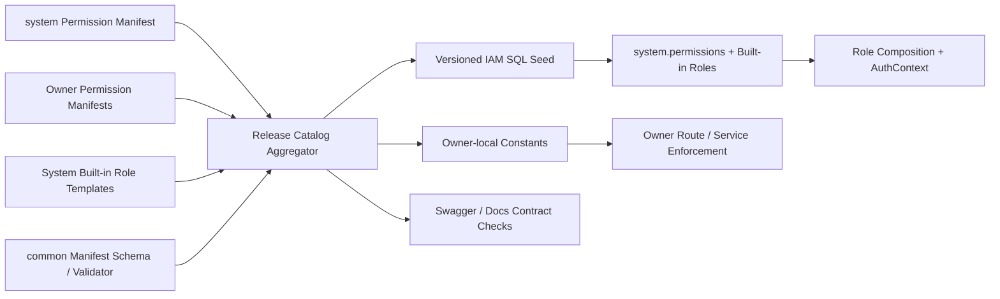

# ADDP IAM Permission 目录与 Role 矩阵设计

更新日期：2026-07-28

状态：技术设计已确认。本文基于 `docs/concepts/addp账号与权限体系图.md` 和 `docs/next/addp-IAM目标数据模型设计.md`，确定 Permission 命名、事实源、路由声明、内置 Role 和 Scope 规则；不定义 AuthContext JSON Schema 或 owner Resource Grant / Policy 表。

## 一、设计目标

本文解决：

1. ADDP Permission 如何命名和维护；
2. System、各业务 owner、Gateway 和前端分别承担什么责任；
3. 平台三员、Tenant 管理角色和首批业务角色拥有哪些 Permission；
4. Tenant 自定义 Role 可以组合哪些 Permission；
5. Platform、Tenant、Department、Project Group Scope 如何参与授权；
6. HTTP、Tool 和非浏览器调用如何声明同一功能权限。

本文不把 Permission 设计成资源 ACL。Permission 回答“是否允许使用一类产品能力”，owner Resource Grant / Policy 回答“是否允许对当前资源执行该动作”。

## 二、核心决策

| 决策 | 结论 |
| --- | --- |
| Permission 粒度 | 按稳定业务能力定义，不按页面、菜单、URL 或 HTTP method 定义 |
| Permission Key | `{domain}.{resource}.{action}`，全部使用小写 snake_case 和点分段 |
| 事实源 | 每个 owner 模块拥有自己的版本化 Permission Manifest；唯一发布期聚合流程生成 System 数据库运行时投影 |
| Owner | 每条 Permission 必须声明唯一 `owner_module`，owner 后端执行最终功能校验 |
| System 知识边界 | System 只保存 Permission Key、owner、Scope、风险和可组合性等不透明授权契约，不知道业务实现、资源结构或 Policy |
| Role | 只是一组 Permission，不继承其他 Role，不包含通配符 |
| Tenant 自定义 Role | 只能引用 `tenant_customizable=true` 的稳定 Permission |
| Scope | Role Assignment 显式携带 Platform、Tenant、Department 或 Project Group Scope |
| Deny | Permission / Role 层不存 Deny；资源级 Explicit Deny 归 owner Policy，且优先于 Allow |
| 前端 | 只消费授权结果控制导航和按钮，不作为安全执行点 |
| Gateway | 只做认证和粗粒度入口治理，不根据 URL 推断业务 Permission |

## 三、Permission 所有权与事实源

### 3.1 模块拥有 Manifest

每个 owner 在自身模块维护唯一 Permission Manifest：

```text
system/authorization/permissions.yaml
manager/authorization/permissions.yaml
meta/authorization/permissions.yaml
transfer/authorization/permissions.yaml
...
```

例如 Manager Manifest：

```yaml
schema_version: addp.permission_manifest/v1
owner_module: manager
manifest_version: 1
permissions:
  - key: manager.data_item.read
    allowed_scope_types: [tenant, department, project_group]
    risk_level: low
    tenant_customizable: true
    delegable: true
    status: active
    name_i18n_key: permissions.manager.data_item.read.name
    description_i18n_key: permissions.manager.data_item.read.description
```

约束：

- 模块只能定义 `owner_module` 等于自身稳定模块名的 Permission，不能替其他模块声明能力；
- `platform`、`iam`、`audit`、`statistics` 等 System 能力只由 `system/authorization/permissions.yaml` 定义；
- `key` 全局唯一且不可改名；需要改变语义时新增 Key、迁移调用方并显式禁用旧 Key；
- 每个 Manifest 只包含该模块的产品能力定义，不包含 Tenant 自定义 Role、Role Assignment、资源 ID、路由 URL 或 Resource Policy；
- 模块下线不会自动删除 Permission；禁用必须通过显式版本变更和 SQL migration；
- 用户可见名称和说明只保存 i18n Key，不在数据库硬编码中英文文案。

`common/authorization` 不保存全平台业务 Permission 清单，只提供统一的 Manifest Schema、解析/校验类型和跨模块测试工具。目标机器可读 Schema 为：

```text
common/authorization/schemas/permission-manifest-v1.schema.json
```

产品级内置 Role 模板由 System IAM 拥有，目标机器可读文件为：

```text
system/authorization/builtin_roles.yaml
```

它可以组合多个 owner 的 Permission Key，但只表达产品授权策略，不复制 Permission 描述或业务实现。Tenant 自定义 Role 仍是 System 运行时数据，不进入任何模块 Manifest。

### 3.2 唯一发布期聚合

发布期聚合器读取所有模块 Manifest 和 System 内置 Role 模板，生成：

- `system.permissions`、内置 Role 和 Role Permission 的版本化 SQL seed；
- 每个 owner 自己使用的 Go、Python 或前端 Permission 常量；
- Swagger / OpenAPI 权限元数据校验基线；
- 文档中的 Permission 目录和 Role 矩阵校验结果。



聚合产物是一次发布中唯一可执行的目录更新路径。System 不在运行时扫描仓库，业务模块也不通过启动注册、心跳或 Module Registry Metadata 增删 Permission。模块健康状态不能改变授权目录，避免服务暂时离线导致 Role 语义漂移。

未来可安装模块也必须在显式安装/升级事务中提交同一 Manifest 契约，经同一聚合和 migration 流程进入目录；不能另开运行时自注册路线。

Manifest 字段、内置 Role 模板、生成产物和升级语义详见 [IAM Permission Manifest 与发布期聚合设计](addp-IAM%20Permission%20Manifest与发布期聚合设计.md)。

### 3.3 System 最小知识边界

System 只允许知道并持久化：

- Permission Key、`owner_module` 和稳定 action；
- 允许的 Scope、风险级别、是否可委托、是否允许 Tenant 自定义 Role；
- i18n Key、状态和版本化目录来源；
- 哪些 Permission Key 被内置 Role 或 Tenant Role 组合。

System 不允许知道：

- Permission 对应的页面、URL、HTTP Method、Service 或 Repository；
- owner 的资源表、资源层级、资源 ID 和业务状态；
- Resource Grant、Explicit Deny、密级、发布状态和 Policy 算法；
- 业务操作如何执行，或模块健康时是否应临时改变 Role 语义。

如果 System 连不透明 Permission Key 都不知道，就无法验证跨模块 Role 和 Tenant 自定义 Role，只能让各模块各建一套角色体系。因此“不知道业务功能”的准确边界是：System 管理授权词汇和组合，不管理功能实现和资源决策。

### 3.4 CI 校验

清单校验必须覆盖：

- Key 格式、唯一性和 owner_module 合法性；
- Manifest 所在模块与 `owner_module` 一致，且没有跨 owner 定义；
- action 是否来自允许词汇表；
- allowed Scope 非空且不越过 owner 边界；
- Tenant 自定义 Role 只能引用可定制 Permission；
- 所有内置 Role 引用的 Permission 存在且启用；
- 模块删除或禁用 Permission 时生成显式向前 migration，不静默删除已发布 Key；
- 每个 `active` Permission 必须至少被一个公开 OpenAPI Operation 或 Tool Manifest 显式引用；尚无唯一运行入口的目标能力只能保留为 `disabled`，不得提前进入内置 Role；
- 受保护公开路由声明授权模式；
- `permission` 模式路由引用的 Permission 存在且 owner 匹配；
- Tool Manifest 的 owner、required Scope 和可委托 Permission 与目录一致；
- Swagger / OpenAPI 中的授权元数据与真实路由声明一致。

## 四、命名规范

### 4.1 Key 结构

```text
{domain}.{resource}.{action}
```

示例：

- `iam.tenant_membership.read`
- `manager.data_item.read`
- `meta.scan_task.execute`
- `asset.application.approve`
- `platform.tenant.suspend`

规则：

- domain 表达稳定能力域，通常与 owner 模块相同；
- resource 使用单数 snake_case，不照抄任意 URL 片段；
- action 使用稳定动作词；
- 不使用 `admin`、`superuser`、`all`、`full_access` 等角色或范围词；
- 不支持 `manager.*`、`*.read` 或其他通配符 Permission；
- Permission 之间没有隐式包含关系，`update` 不自动包含 `read`，`execute` 不自动包含 `create`。

### 4.2 动作词汇

首批允许动作：

| Action | 含义 | 默认风险 |
| --- | --- | --- |
| `read` | 读取列表、详情或状态 | low |
| `create` | 创建持久业务定义或关系 | medium |
| `update` | 修改持久业务定义或关系 | medium |
| `delete` | 删除业务定义或资源 | high |
| `execute` | 发起任务、计算、扫描或生成 | medium |
| `cancel` | 取消运行中操作 | medium |
| `retry` | 重新触发已有操作 | medium |
| `publish` | 对外发布或上线 | high |
| `offline` | 下线已发布对象 | high |
| `approve` | 批准业务或高权限申请 | high |
| `reject` | 拒绝申请 | medium |
| `revoke` | 撤销凭据、授权或会话 | high |
| `reset` | 以受控新状态替换既有凭据或安全状态 | high |
| `export` | 导出数据、日志或统计 | high |
| `link` | 建立身份或资源关系 | high |
| `unlink` | 解除身份或资源关系 | high |
| `initialize` | 完成既有对象的一次性初始管理关系建立 | high |
| `suspend` | 暂停主体、Tenant 或 Membership | high |
| `close` | 关闭生命周期对象 | critical |

具体 Permission 可以覆盖默认风险级别，但不能改变动作语义。避免使用含义不确定的 `manage`；确实无法拆分的原子能力应重新命名为业务动作。

## 五、授权模式与路由声明

每个公开路由必须声明一种授权模式：

| 模式 | 用途 | 示例 |
| --- | --- | --- |
| `public` | 无身份即可访问 | Login、OAuth metadata |
| `authenticated` | 只要求有效 AuthContext，不产生业务授权 | AuthContext 基础设施入口 |
| `self` | 只能操作当前 User 自身资源 | `GET /users/me`、`PUT /users/me/password` |
| `permission` | 要求一个或多个稳定 Permission | 创建任务、管理 Tenant Membership |
| `delegated_tool` | 同时要求 Role Permission、Tool Scope、audience 和审批 | Agent 代表用户执行 Tool |
| `resource_ticket` | 原生 GET/HEAD 资源请求 | 图片、媒体、下载、三维内容 |
| `internal` | 已验证 Service Principal | 模块注册、内部配置读取 |

规则：

- `self` 是 User 与自身身份资源的关系策略，不是隐藏的全局 Role；
- `internal` 仍使用 Service Access Token、AuthContext 和精确 Permission，不接受共享 Internal API Key；
- `resource_ticket` 仍执行对应内容读取 Permission 和 owner Resource Policy；
- `delegated_tool` 不能只校验 OAuth Scope，Role Permission 仍必须成立；
- 一个路由需要多个 Permission 时按 all-of 计算，不支持含糊的字符串表达式；
- 业务上的“满足其一”应定义一个稳定能力 Permission，由 owner 在内部处理来源差异。

目标 Swagger / OpenAPI 为公开路由输出：

```yaml
x-addp-auth-mode: permission
x-addp-required-permissions:
  - meta.scan_task.execute
```

具体 Swagger 注解和路由 helper 在 API 技术设计阶段确定。本轮不修改真实路由或生成产物。

## 六、平台与 IAM Permission 目录

以下每个 action 都生成一个完整 Permission Key，例如 `platform.tenant.read`。

| Base Key | Actions | Allowed Scope | Tenant Customizable | Owner |
| --- | --- | --- | --- | --- |
| `platform.tenant` | `read, create, initialize, update, suspend, restore, close` | Platform | false | System |
| `platform.module` | `read, update` | Platform | false | System |
| `platform.configuration` | `read, update` | Platform | false | System |
| `platform.operation` | `read` | Platform | false | System |
| `platform.backup` | `execute` | Platform | false | System |
| `platform.restore_request` | `read, create, approve, reject, execute` | Platform | false | System |
| `iam.user` | `read, create, update, suspend, reactivate` | Platform | false | System |
| `iam.local_account` | `reset` | Platform | false | System |
| `iam.external_identity` | `read, link, unlink, suspend` | Platform | false | System |
| `iam.identity_provider` | `read, create, update, suspend` | Platform | false | System |
| `iam.security_policy` | `read, update` | Platform | false | System |
| `iam.session` | `read, revoke` | Platform | false | System |
| `iam.permission` | `read` | Platform, Tenant | false | System |
| `iam.role` | `read` | Platform, Tenant | false | System |
| `iam.platform_role_change` | `read, create, approve, reject` | Platform | false | System |
| `iam.platform_identity_change` | `read, create, approve, reject` | Platform | false | System |
| `audit.event` | `read, export` | Platform | false | System |
| `audit.subject` | `read` | Platform | false | System |
| `audit.report` | `read, create, update` | Platform | false | System |
| `statistics.summary` | `read` | Platform | false | System |
| `statistics.tenant_breakdown` | `read, export` | Platform | false | System |

平台内置 Role 只由版本化产品清单和 SQL migration 维护，不提供运行时创建或修改入口。Platform Role Assignment 只能经 `iam.platform_role_change` 审批流程生成。对当前持有平台角色的 User 执行 suspend / deactivate 等身份变更时，必须转入 `iam.platform_identity_change` 审批流程，安全管理员不能单方面使其他两员失效。

平台恢复会改变 IAM、Tenant 和审计状态，不能由系统管理员单独完成。Restore Request 必须由系统管理员创建，经不同的安全管理员和审计管理员分别批准后，才允许系统管理员执行；审批过程中不得持有数据库事务锁。

## 七、Tenant 管理 Permission 目录

| Base Key | Actions | Allowed Scope | Tenant Customizable | Owner |
| --- | --- | --- | --- | --- |
| `iam.tenant_invitation` | `read, create, revoke` | Tenant | false | System |
| `iam.tenant_membership` | `read, update, suspend, restore, close` | Tenant | false | System |
| `iam.tenant_role` | `read, create, update, delete` | Tenant | false | System |
| `iam.tenant_role_assignment` | `read, create, revoke` | Tenant, Department, Project Group | false | System |
| `iam.department` | `read` | Tenant, Department | false | System |
| `iam.department` | `create, update, delete` | Tenant | false | System |
| `iam.department_membership` | `read, create, update, close` | Tenant, Department | false | System |
| `iam.project_group` | `read` | Tenant, Project Group | false | System |
| `iam.project_group` | `create, update, close` | Tenant | false | System |
| `iam.project_group_membership` | `read, create, update, close` | Tenant, Project Group | false | System |
| `iam.tenant_idp_connection` | `read, create, update, suspend` | Tenant | false | System |
| `audit.tenant_event` | `read, export` | Tenant | false | System |
| `audit.tenant_event` | `append` | Tenant | false | System |
| `audit.tenant_subject` | `read` | Tenant | false | System |
| `system.engine` | `read, create, update, delete, execute` | Tenant | false | System |
| `system.execution_authorization` | `execute` | Tenant | false | System |
| `system.application` | `read, create, update, delete` | Tenant | false | System |
| `system.api_key` | `read, create, revoke` | Tenant | false | System |
| `system.cleanup` | `read, execute` | Tenant | false | System |

平台运行时注册使用独立 `system.runtime_registry.update`，Allowed Scope 固定为 Platform、
`tenant_customizable=false`、`delegable=false`。它只授予平台所有内置 Service Principal 的
专用 Platform Service Role，不授予平台三员、Tenant User 或自定义 Role。

Tenant 管理员不能修改全局 User 状态或其他 Tenant Membership。邀请流程可以创建新 User 或关联已有 User，但结果始终是当前 Tenant Membership，不授予全局身份管理权。

## 八、业务 Permission 目录

### 8.1 数据管理与元数据

| Base Key | Actions | Scope | Customizable | Owner |
| --- | --- | --- | --- | --- |
| `manager.data_item` | `read, create, update, delete` | Tenant, Department, Project Group | true | Manager |
| `manager.content` | `read` | Tenant, Department, Project Group | true | Manager |
| `manager.data_profile` | `execute` | Tenant, Department, Project Group | true | Manager |
| `manager.derived_artifact` | `read, create, update, delete` | Tenant, Department, Project Group | true | Manager |
| `manager.search` | `execute` | Tenant, Department, Project Group | true | Manager |
| `meta.catalog` | `read` | Tenant, Department, Project Group | true | Meta |
| `meta.inspect` | `execute` | Tenant, Department, Project Group | true | Meta |
| `meta.scan_task` | `read, create, update, delete, execute` | Tenant, Department, Project Group | true | Meta |

### 8.2 数据开发、传输和编排

| Base Key | Actions | Scope | Customizable | Owner |
| --- | --- | --- | --- | --- |
| `transfer.task` | `read, create, update, delete, execute, cancel` | Tenant, Department, Project Group | true | Transfer |
| `develop.task` | `read, create, update, delete, execute, cancel` | Tenant, Department, Project Group | true | Develop |
| `develop.notebook` | `read, create, update, delete, execute` | Tenant, Department, Project Group | true | Develop |
| `develop.data_read` | `execute` | Tenant, Department, Project Group | true | Develop |
| `develop.data_write` | `execute` | Tenant, Department, Project Group | true | Develop |
| `develop.data_ddl` | `execute` | Tenant, Department, Project Group | true | Develop |
| `develop.data_external_effect` | `execute` | Tenant, Department, Project Group | true | Develop |
| `orchestrator.workflow` | `read, create, update, delete, execute, cancel` | Tenant, Department, Project Group | true | Orchestrator |
| `monitor.execution` | `read, cancel, retry` | Tenant, Department, Project Group | true | Monitor |
| `monitor.health` | `read` | Tenant | false | Monitor |
| `monitor.statistics` | `read, export` | Tenant, Department, Project Group | true | Monitor |
| `monitor.alert_incident` | `read, update` | Tenant | true | Monitor |
| `monitor.alert_rule` | `read, create, update, delete` | Tenant | true | Monitor |
| `monitor.notification_destination` | `read, create, update, delete, execute` | Tenant | true | Monitor |
| `monitor.notification_delivery` | `read, retry` | Tenant | true | Monitor |

TaskProvider 不定义第二套 Permission。通过 TaskProvider 执行 Meta、Transfer、Develop、Manager、Quality 或 Graph 任务时，仍校验该 owner 任务类型对应的精确 `execute` Permission。

`develop.task.execute` 和 `develop.notebook.execute` 只允许使用执行入口，不自动授权任意数据效果。Develop 必须由服务端解析 SQL 或汇总 Workflow Operator Spec，按实际效果追加校验 `develop.data_read.execute | develop.data_write.execute | develop.data_ddl.execute | develop.data_external_effect.execute`。一次执行可以要求多个效果，按 all-of 校验；无法可靠分类时默认拒绝。`system.execution_authorization.execute` 只授予 `tenant.develop_runtime` 等允许 `service_principal` 的最小 Runtime Role，并且 Handler 必须校验 OAuth Client、Service Principal、Tenant、audience 和 execution 全部匹配，不能用于通用 Engine 读取。

`system.engine_descriptor.read` 只允许 Tenant Runtime Service Principal 读取同 Tenant 可见的 Engine Runtime Descriptor。该投影只包含 Engine 身份、生命周期、能力声明，以及工作流/脚本 Runtime 的 `protocol/host/port`；不得返回数据引擎明文连接、密码、Token 或任意连接参数 map。唯一服务路由为 `GET /api/v1/system/runtime/engine-descriptors` 和 `GET /api/v1/system/runtime/engine-descriptors/:id`。`tenant.develop_runtime` 使用它完成查询/工作流引擎列表和算子发现；真正执行仍必须消费 Execution Authorization。

本节是 IAM 目标目录，不代表当前每个 owner 已存在同名运行时路由。例如 Transfer、Develop 和 Orchestrator 当前并未全部提供真实执行取消能力；`cancel` 在首次 SQL seed 前必须通过路由覆盖门禁证明已有唯一消费入口，否则应在初次发布前从未发布 Manifest 删除，不能把无实现的 active Permission 写入运行时目录。

### 8.3 数据服务与资产

| Base Key | Actions | Scope | Customizable | Owner |
| --- | --- | --- | --- | --- |
| `service.definition` | `read, create, update, delete, publish, offline` | Tenant, Department, Project Group | true | Service |
| `service.endpoint` | `read` | Tenant, Department, Project Group | true | Service |
| `service.external_registration` | `read, create, update, delete` | Tenant, Department, Project Group | true | Service |
| `asset.management` | `read` | Tenant, Department, Project Group | true | Asset |
| `asset.catalog` | `read, create, update, delete` | Tenant, Department, Project Group | true | Asset |
| `asset.entry` | `read, update, delete, publish, offline` | Tenant, Department, Project Group | true | Asset |
| `asset.application` | `read, create, approve, reject, revoke` | Tenant, Department, Project Group | true | Asset |
| `asset.authorization` | `read, revoke` | Tenant, Department, Project Group | true | Asset |
| `asset.rating` | `read, create, update` | Tenant, Department, Project Group | true | Asset |

`asset.management.read` 是进入 Asset 管理面的稳定能力，管理路由必须将它与具体资源 Permission
按 all-of 校验。它不授予任何 CRUD、审批或上下架动作；`tenant.asset_manager` 默认拥有该能力，
Tenant 也可以用它组合只读资产审计 Role。`tenant.asset_consumer` 不拥有该能力，因此不能直接调用
管理 API。

Portal 是 Asset 的用户入口，不创建 `portal.asset.*` 平行 Permission。Portal 只在同步调用栈中
转发当前 User Bearer 到 Asset 消费 API，最终仍由 Asset Permission 与 Resource Policy 决定。
消费 API 强制只读已发布资产，并把申请、授权和评价约束为当前 Principal 自身；请求不得包含
由调用方指定的 `applicant_id` 或 `user_id`。`addp-portal` Service Principal 不持有任何
`asset.*` Permission，只以 `service.endpoint.read` 读取已授权资产的端点投影。

`service.definition` 统一覆盖 Query、Graph、Tile 等 ADDP 内建服务定义，`service.external_registration` 对应外部 Registered Service。Service 当前主要通过通用 status 更新表达服务启停，尚未形成独立 publish/offline 路由；`publish/offline` 与上一节 `cancel` 一样，首次 SQL seed 前必须通过路由覆盖门禁收敛，不能长期保留无唯一消费入口的 active Permission。

### 8.4 标准、模型与质量

| Base Key | Actions | Scope | Customizable | Owner |
| --- | --- | --- | --- | --- |
| `standard.domain` | `read, create, update, delete` | Tenant, Department, Project Group | true | Standard |
| `standard.element` | `read, create, update, delete, approve` | Tenant, Department, Project Group | true | Standard |
| `standard.metric` | `read, create, update, delete, approve, offline` | Tenant, Department, Project Group | true | Standard |
| `standard.code_set` | `read, create, update, delete` | Tenant, Department, Project Group | true | Standard |
| `standard.document` | `read, create, update, delete` | Tenant, Department, Project Group | true | Standard |
| `standard.glossary` | `read, create, update, delete, approve, offline` | Tenant, Department, Project Group | true | Standard |
| `standard.unit` | `read, create, update, delete` | Tenant, Department, Project Group | true | Standard |
| `standard.classification` | `read, create, update, delete` | Tenant, Department, Project Group | true | Standard |
| `standard.dimension_hierarchy` | `read, create, update, delete` | Tenant, Department, Project Group | true | Standard |
| `model.logical_model` | `read, create, update, delete` | Tenant, Department, Project Group | true | Model |
| `model.entity` | `read, create, update, delete, approve` | Tenant, Department, Project Group | true | Model |
| `model.entity_relation` | `read, create, update, delete` | Tenant, Department, Project Group | true | Model |
| `model.dw_layer` | `read, create, update, delete` | Tenant | true | Model |
| `quality.rule_application` | `read, create, update, delete` | Tenant, Department, Project Group | true | Quality |
| `quality.check_task` | `read, create, update, delete, execute` | Tenant, Department, Project Group | true | Quality |
| `quality.issue` | `read, update` | Tenant, Department, Project Group | true | Quality |

Standard 的 Measurement Category 是 Unit 聚合内子资源，Grading Level 是 Classification 聚合内子资源，Dimension Hierarchy Level 是 Dimension Hierarchy 聚合内子资源；这些子资源不建立平行 Permission。Document 与 Element、Glossary、Metric 的关联操作按涉及资源 Permission 做 all-of 校验。

### 8.5 知识图谱与 AI

| Base Key | Actions | Scope | Customizable | Owner |
| --- | --- | --- | --- | --- |
| `graph.ontology` | `read, create, update, delete` | Tenant, Department, Project Group | true | Graph |
| `graph.graph` | `read, create, update, delete` | Tenant, Department, Project Group | true | Graph |
| `graph.build_task` | `read, create, update, delete, execute, cancel` | Tenant, Department, Project Group | true | Graph |
| `graph.analysis` | `read, execute` | Tenant, Department, Project Group | true | Graph |
| `graph.review` | `read, approve, reject, update` | Tenant, Department, Project Group | true | Graph |
| `agent.session` | `read, create, delete` | Tenant, Department, Project Group | true | Agent |
| `agent.run` | `read, create, execute, cancel` | Tenant, Department, Project Group | true | Agent |
| `copilot.sql` | `execute` | Tenant, Department, Project Group | true | Copilot |
| `copilot.workflow` | `execute` | Tenant, Department, Project Group | true | Copilot |

Copilot 生成结果不自动获得执行权限。生成 SQL、Workflow 或图谱配置后，真正保存或执行仍校验 Develop、Graph 等 owner Permission。

Graph 子资源不额外建立宽泛 Permission，但必须按明确的聚合边界映射：Ontology 的实体类、关系类、版本、导入和 Schema 推导归 `graph.ontology.*`；图谱浏览、搜索、展开、路径和私有 Knowledge Service 查询归 `graph.graph.read`；构建材料增删归 `graph.build_task.update`，运行/重跑归 `graph.build_task.execute`；批量审核必须按请求 action 选择 `graph.review.approve` 或 `graph.review.reject`。不允许根据 URL 前缀或 Permission 前缀隐式放行。

Agent Session 和 AgentRun 是 Agent owner 的私有资源：Role Permission 只是功能 Allow 候选，owner 还必须校验当前 User 和 Tenant 归属。`/chat` 是单一 AG-UI Operation，新建和 Interaction resume 统一按 all-of 需要 `agent.run.create + agent.run.execute`；独立 retry 路由只继续已有 Run，需要 `agent.run.execute`。

Copilot Permission 只允许生成候选结果，不自动授予保存或执行权限。SQL 入口已删除请求体 `tenant_id/user_id` 并从 AuthContext 取得租户；Workflow 的 `workflow.draft.generate` Tool Scope 唯一映射到可委托的 `copilot.workflow.execute`；Graph 单 chunk KG 抽取使用内部服务身份。当前没有真实用户级图谱候选生成入口，因此未发布的 `copilot.knowledge_graph.execute` 已删除，不允许把内部路由冒充 User Permission 消费入口。Navigate 只要求已认证用户，不进入首批 Permission 目录。

### 8.6 owner 内部 Resource Grant

对外提供可授权资源的 owner 在清单中注册：

```text
{owner}.resource_grant.create
{owner}.resource_grant.read
{owner}.resource_grant.revoke
```

例如 Manager 使用 `manager.resource_grant.create/read/revoke`。这些 Permission 的 `allowed_scope_types=[tenant]`、`tenant_customizable=false`、`delegable=false`，只用于 `internal` 模式的 Resource Grant API。它们只授予位于同一 Tenant Context 的专用 Service Principal 内置 Role，不授予 User、Tenant 管理角色、平台三员或 Agent Tool。

Owner 未开放可申请资源时不注册空 Permission；一旦开放，Grant API、Permission 清单、Service Principal Role 和 Swagger 授权元数据必须在同一次变更中加入。

## 九、Platform Role 矩阵

### 9.1 平台系统管理员

Role Key：`platform.system_administrator`

包含：

- `platform.tenant.read/create/update/suspend/restore/close`；
- `platform.module.read/update`；
- `platform.configuration.read/update`；
- `platform.operation.read`；
- `platform.backup.execute`；
- `platform.restore_request.read/create/execute`；
- `iam.platform_role_change.read/approve/reject`；
- `iam.platform_identity_change.read/approve/reject`。

不包含 User 管理、安全策略、IdP 管理、会话撤销、审计内容、跨租户统计或 Tenant 业务 Permission。

### 9.2 平台安全管理员

Role Key：`platform.security_administrator`

包含：

- `iam.user.read/create/update/suspend/reactivate`；
- `iam.local_account.reset`；
- `iam.external_identity.read/link/unlink/suspend`；
- `iam.identity_provider.read/create/update/suspend`；
- `iam.security_policy.read/update`；
- `iam.session.read/revoke`；
- `iam.permission.read`；
- `iam.role.read`；
- `iam.platform_role_change.read/create`；
- `iam.platform_identity_change.read/create`；
- `platform.restore_request.read/approve/reject`。

不包含平台运维、审批自己发起的平台 Role 变更、审计导出、跨租户统计或 Tenant 业务 Permission。

### 9.3 平台审计管理员

Role Key：`platform.audit_administrator`

包含：

- `audit.event.read/export`；
- `audit.report.read/create/update`；
- `iam.platform_role_change.read`；
- `iam.platform_identity_change.read`；
- `iam.permission.read`；
- `iam.role.read`；
- `audit.subject.read`；
- `platform.restore_request.read/approve/reject`。

不包含任何写入 User、Role、平台配置、Tenant 生命周期或业务资源的 Permission。

### 9.4 平台统计查看者

Role Key：`platform.statistics_viewer`

包含：

- `statistics.summary.read`；
- `statistics.tenant_breakdown.read`；
- 不包含 `statistics.tenant_breakdown.export`；导出能力后续必须通过独立高风险 Role 明确开放。

该 Role 可与一个平台三员角色组合，但不会因此获得 Tenant 业务明细权限。

### 9.5 平台控制面运行角色

每个需要注册 Module、发送心跳或发布 TaskProvider 契约的内置模块使用独立的 Platform
Runtime Role。当前 Role Key 包括 `platform.meta_runtime` 和 `platform.develop_runtime`，均只允许
Platform Scope 和 `service_principal`。

这些 Role 只包含 `system.runtime_registry.update`。Handler 必须校验 OAuth Client / Service
Principal 与请求中的 `module_name` 一致。Platform Runtime Role 不包含平台三员、Tenant、引擎
或审计 Permission；后续模块迁移到 Service Access Token 注册路径时，必须同时新增对应的独立
Platform Runtime Role，不得复用其他模块的 Role。

## 十、Tenant 管理 Role 矩阵

### 10.1 Tenant Administrator

Role Key：`tenant.administrator`，只允许 Tenant Scope。

用户界面统一显示为“租户组织与权限管理员（Tenant Access Administrator）”，避免把该 Role 误解为包含全部 Tenant Permission 的超级管理员。协议、数据库和审计继续使用稳定 Role Key `tenant.administrator`，不得再引入平行 Role Key。

包含 Tenant Invitation、Tenant Membership、Tenant Role、Role Assignment、Department、Project Group 和 Tenant IdP Connection 的全部显式 Tenant 管理 Permission，以及 `iam.permission.read`。

不包含 Engine、API Key、Cleanup、审计导出或业务模块 Permission。

首位 Tenant Administrator 由平台系统管理员在 Tenant 创建事务中指定，或通过既有未初始化 Tenant 的一次性 Initialization 状态转换产生。候选人必须是平台安全管理员已创建的有效普通 User，并且不能持有任一平台三员 Role。Tenant Administrator 只管理当前 Tenant 的 Membership、Invitation、Role 和 Role Assignment；不能创建或修改全局 User 凭据。

Tenant Role 和 Role Assignment 只使用 `system.roles`、`system.role_permissions` 与 `system.role_assignments`。管理 API 不建立第二套授权表，不接受角色名通配符，也不保留旧授权接口。撤销最后一个有效 `tenant.administrator` Assignment，或停用其唯一有效 Membership，必须拒绝，除非同一事务中已经建立替代管理员。

### 10.2 Tenant Infrastructure Administrator

Role Key：`tenant.infrastructure_administrator`，只允许 Tenant Scope。

包含：

- `system.engine.read/create/update/delete/execute`；
- `system.application.read/create/update/delete`；
- `system.api_key.read/create/revoke`；
- `system.cleanup.read/execute`；
- `monitor.health.read`。

不包含 Tenant IAM、审计或业务数据读取 Permission。

### 10.3 Tenant Auditor

Role Key：`tenant.auditor`，只允许 Tenant Scope。

包含 `audit.tenant_event.read/export`、`audit.tenant_subject.read` 和只读的 `monitor.execution.read`、`monitor.statistics.read`。不包含任何写 Permission。

### 10.4 Meta Tenant Runtime

Role Key：`tenant.meta_runtime`，只允许 Tenant Scope 和 `service_principal`。

只包含 `system.engine.read` 与 `audit.tenant_event.create`。`addp-meta` 必须按 execution 或
当前请求的 `tenant_id` 即时取得该 Tenant Context 的 Service Access Token；引擎列表仍
返回脱敏投影，引擎详情只对该 Service Principal 返回解密连接信息。Token 不进入
`execution_config`、任务载荷、缓存、日志或审计详情。

### 10.5 Department Coordinator

Role Key：`tenant.department_coordinator`，只允许 Department Scope。

包含当前 Department 的 `iam.department.read` 和 `iam.department_membership.read/create/update/close`。不能修改 Department Parent、其他 Department 或 Tenant Role。

### 10.6 Project Group Coordinator

Role Key：`tenant.project_group_coordinator`，只允许 Project Group Scope。

包含当前 Project Group 的 `iam.project_group.read` 和 `iam.project_group_membership.read/create/update/close`。不能创建新的 Project Group 或管理其他 Project Group。

ADDP 不提供包含所有 Tenant Permission 的 `tenant.super_admin`。同一 User 需要多类职责时显式分配多个 Role，并保留每个授权来源。

首位 Tenant Administrator 第一次进入 Tenant Context 时，管理界面必须明确显示其当前职责仅覆盖成员、组织与授权治理，并引导其通过唯一的 Tenant Role Assignment API 分配 Infrastructure Administrator、Data Viewer、Data Steward 等既有 Role。引导只能预选既有 Role 和 Membership，不能自动授权、创建隐式角色包或把业务 Permission 合并进 `tenant.administrator`。Role Assignment 生效后的会话更新继续遵守 AuthContext 和授权版本规则。

Tenant Role 选择器必须先按当前 Assignment Scope 过滤可用 Role；目标 Membership 在同一精确 Scope 已拥有的 Role 仍保留在列表末尾，显示“已分配”并禁用，其他 Scope 已拥有的同一 Role 显示范围提示。后端仍以唯一约束和 HTTP 409 拒绝并发或重复授权，不能依赖前端过滤保证一致性。给当前登录 Membership 授权或撤销后，前端必须使用现有 Refresh Token 轮换推进 `authorization_version` 并重新读取 AuthContext，使菜单和按钮原地更新；只有身份、凭据、Membership、Tenant 或 Token Family 失效时才要求重新登录，不得为角色变更新增专用换票或兼容接口。

## 十一、首批业务内置 Role

内置业务 Role 是可直接使用的模板，不形成 Role 继承。SQL seed 必须展开为完整 Role Permission 行。

| Role Key | 主要 Permission 集合 | Allowed Scope |
| --- | --- | --- |
| `tenant.data_viewer` | Manager Data Item / Content read、Manager Search execute、Meta Catalog read、Develop Data Access read；不包含 Develop 执行入口 | Tenant, Department, Project Group |
| `tenant.data_steward` | Data Viewer + Manager Data Item create/update/delete、Derived Artifact read/create/update/delete、Meta Inspect、Meta Scan Task 全生命周期、Develop Data Access write；不包含 Develop 执行入口 | Tenant, Department, Project Group |
| `tenant.data_engineer` | Data Viewer + Develop Data Access write、Manager Data Profile execute、Transfer Task、Develop Task、Develop Notebook、Orchestrator Workflow 全生命周期及 Monitor Execution read；不默认包含 DDL 或 external_effect | Tenant, Department, Project Group |
| `tenant.service_publisher` | Data Viewer + Service Definition / External Registration 全生命周期 | Tenant, Department, Project Group |
| `tenant.governance_manager` | Standard Domain/Element/Metric/Code Set/Document、Model Logical Model、Quality Rule Application/Check Task 的全部显式 actions，Quality Issue read/update，Monitor Execution read | Tenant, Department, Project Group |
| `tenant.asset_consumer` | Asset 已发布 Catalog / Entry read、自己的 Application read/create、自己的 Authorization read、Rating read/create/update；不包含管理面访问 | Tenant, Department, Project Group |
| `tenant.asset_manager` | Asset Management access，以及 Catalog、Entry、Application、Authorization、Rating 的全部显式 actions | Tenant, Department, Project Group |
| `tenant.portal_runtime` | Service Endpoint read；仅允许 `addp-portal` Service Principal | Tenant |
| `tenant.graph_engineer` | Graph Ontology、Graph、Build Task、Analysis、Review | Tenant, Department, Project Group |
| `tenant.ai_user` | Agent Session / Run、Copilot 生成能力 | Tenant, Department, Project Group |
| `tenant.monitoring_operator` | Monitor Execution / Statistics / Health read、Alert Incident read/update、Alert Rule 全生命周期、Notification Destination 全生命周期和测试、Notification Delivery read/retry | Tenant |

“全生命周期”只代表该表格对应 Base Key 中明确列出的 actions，不代表通配符。高风险发布、审批、删除 Permission 可由 Tenant 基于内置 Role 创建更窄的自定义 Role；内置 Role 本身不可修改。

## 十二、Tenant 自定义 Role

Tenant 创建自定义 Role 时必须满足：

- Role 只属于一个 Tenant；
- 自定义 Role Key 不得与任何平台或 Tenant 内置 Role Key 重名；内置 Role Key 是跨 Tenant 保留的稳定产品词汇，同键不能表达另一组 Permission；
- 不同 Tenant 可以各自使用相同的自定义 Role Key，但同一 Tenant 内仍必须唯一；
- Permission 必须 `tenant_customizable=true`；
- 不得引用 Platform、IAM 三员、Tenant IAM 管理、审计管理、Infrastructure 管理或 Internal Permission；
- Role 的 allowed Scope 是所选 Permission allowed Scope 的交集，不能为空；
- 不允许 Role 继承、Role 包含 Role、通配符或字符串前缀匹配；
- 删除改为 disable；已有 Assignment 在同一变更流程中撤销；
- Role Permission 变化必须递增所有受影响 Principal 的 `authorization_version` 并撤销 Token Family；
- UI 可以提供内置 Role 复制入口，但复制后生成独立 Tenant Custom Role，不与源 Role 保持动态继承。

## 十三、Scope 计算

### 13.1 Platform Context

只读取 Platform Scope Role Assignment。Tenant、Department 和 Project Group Assignment 完全不可见。

### 13.2 Tenant Context

只读取当前 Tenant 内有效 Assignment：

- Tenant Scope Assignment 对当前 Tenant 内相应功能成立；
- Department Scope Assignment 只对明确关联该 Department 的资源或 owner Grant 成立；
- Project Group Scope Assignment 只对明确关联该 Project Group 的资源或 owner Grant 成立；
- 一个 User 的其他 Tenant Assignment 不进入当前 AuthContext。

### 13.3 合并与拒绝

- 多个 Role Assignment 的 Allow Permission 可以取并集；
- Permission 仍受 OAuth Scope / audience 上限约束；
- Role Permission 不自动产生 Resource Grant；
- owner Explicit Deny 优先于所有 Allow；
- Department Parent/Child 默认不继承；
- Project Group 权限不传播到成员所属 Department；
- Role 名称不参与运行时判断，运行时只判断 Permission Key、Scope 和 owner Policy。

## 十四、Owner 与调用链

```text
Route 声明 Required Permission
  -> AuthContext 提供当前上下文的 Permission Grant + Scope
  -> owner 校验 required Permission
  -> owner 加载目标 Resource、Grant、Policy 和 Explicit Deny
  -> owner 校验 OAuth audience / Scope、条件和审批
  -> Allow 或稳定拒绝原因
```

Owner 责任：

- 使用生成的 Permission 常量，不硬编码角色名称；
- 在 Service / Policy 层执行权限，不只在 Handler 或前端隐藏；
- 对资源不存在和跨 Tenant 访问使用不泄露存在性的稳定错误；
- 对高风险动作执行 step-up MFA 和业务审批；
- Tenant Role Assignment 的高风险自我授予必须执行 AAL2 Guard：当 Actor Principal 等于目标 Membership Principal，且目标 Role 至少包含一个 `high` 或 `critical` Permission 时，要求当前 AuthContext 为未过期的 AAL2/AAL3，否则返回稳定 `step_up_required`。给他人授权、仅含 `low/medium` Permission 的自我授予和自我撤销不触发该 Guard；
- 审计 Permission Key、Assignment 来源、Scope、资源决策和 Deny 原因；
- 同一业务能力的 Web、CLI、Agent Tool 和模块间委托调用使用同一个 Permission。

## 十五、已完成的实施记录

1. 确认本文 Permission 和 Role 决策；
2. 建立 Permission Manifest Schema，并把精确目录分别落到各 owner 的 `authorization/permissions.yaml`；
3. 建立唯一发布期聚合器和 `system/authorization/builtin_roles.yaml`，生成 owner-local 常量与版本化 SQL seed；
4. 为每个 owner 路由建立“授权模式 + Required Permission”清单；
5. 扩展 Swagger/OpenAPI 授权元数据和覆盖校验；
6. 设计 AuthContext JSON Schema，使其能够表达 Permission Grant 与 Scope；
7. 设计 owner Resource Grant / Policy 接口；
8. 进入 Fosite ADR；
9. ADR 完成后实施 IAM SQL migration 和代码切换；当前已完成并删除旧路径。

## 十六、已确认的技术决策

以下决策已确认，后续设计和实现不得重新引入并行路线：

1. **模块所有、单路聚合**：每个 owner 的 `authorization/permissions.yaml` 是其 Permission 定义事实源；唯一发布期聚合流程生成 System 目录和 owner-local 产物，不采用中央手工业务清单或运行时动态注册。
2. **System 最小知识**：System 只管理不透明 Permission 契约、Role 组合和 Assignment，不知道业务实现、资源结构或 owner Policy。
3. **共享边界**：`common/authorization` 只提供 Manifest Schema、校验器和共享授权类型，不保存全平台业务 Permission 内容。
4. **Key 规则**：采用 `{domain}.{resource}.{action}`，无通配符、无隐式权限继承。
5. **路由声明**：每个公开路由显式声明授权模式；Permission 模式在 Swagger 输出稳定权限元数据。
   发布期覆盖校验同时执行反向检查：公开 Operation 和 Tool 引用必须存在，`active` Permission 也必须存在实际消费者。内部 Resource Grant 只有在 Grant API、专用 Service Principal Role 和 Swagger 授权元数据同时落地后才能启用。
6. **自服务边界**：当前 User 自身资料和凭据使用 `self` 关系策略，不创建隐藏的“所有用户基础 Role”。
7. **平台三员矩阵**：安全管理员申请平台 Role 变更，系统管理员独立复核，审计管理员只读监督。
8. **Tenant 管理拆分**：Tenant Administrator、Infrastructure Administrator、Tenant Auditor 分离，不提供 Tenant SuperAdmin。
9. **业务内置 Role**：采用 Data Viewer、Data Steward、Data Engineer、Service Publisher、Governance Manager、Asset Consumer、Asset Manager、Graph Engineer、AI User 九个首批模板。
10. **Tenant 自定义 Role**：只能组合 `tenant_customizable=true` Permission，不支持 Role 继承。
11. **Scope 语义**：Department / Project Group Scope 只提供功能 Allow 候选，仍要求 owner 资源关联或 Grant。
12. **Portal / TaskProvider 边界**：复用事实 owner Permission，不建立 Portal 或 TaskProvider 平行权限目录。
