# ADDP IAM 目标数据模型设计

更新日期：2026-07-28

状态：核心 IAM、Fosite、管理 API、MFA Runtime、离线三员 Bootstrap、离线三员凭据恢复与二十五版 migration 已实现；开发数据库已迁移到 `25/clean`。Tenant 原子创建/初始化、Tenant Role/Assignment API、IAM Workbench、数据库最后管理员约束、普通 User 本地密码重置、授权版本 Refresh 推进、普通 User TOTP 自助登记、Browser Session 内 step-up、高风险自我授权 AAL2 Guard、Swagger 和前端契约测试已经收口；Recovery Attempt 1 已完成，既有三员 Browser `platform + AAL2` 登录与正式 `addp` CLI 已覆盖 RFC 8252 动态 loopback、PKCE、Device Flow、AuthContext、Keychain 刷新轮换、受委托 Tool 调用和撤销。Tenant 管理 Browser E2E 已覆盖安全管理员创建普通 User、系统管理员初始化 Tenant、首位 Tenant Administrator 进入 Tenant Context、显式授予基础设施管理员、密码受控重置以及引擎、应用和 Cleanup 正常使用；MFA 安全设置页面与密码确认入口已完成真实 Browser 验证，登记/step-up/自我授权事务闭环由一次性 PostgreSQL E2E 覆盖。

## 一、目标与边界

本阶段确定以下目标数据模型：

1. Principal、User、Service Principal；
2. Local Account、External Identity 和 IdP 连接；
3. Tenant、Tenant Membership、Tenant Invitation；
4. Department、Project Group 及成员关系；
5. Permission、Role、Role Assignment；
6. 平台三员互斥和高权限角色变更事实；
7. Token / Session 与唯一当前上下文的关联方式；
8. PostgreSQL 约束、索引、事务和一次性切换边界。

本阶段不设计：

- owner 模块的 Resource Grant / Policy 表；
- Asset 授权申请表；
- 具体 AuthContext JSON 字段；
- WebAuthn 和 Service Principal Credential 细节；
- IdP 协议配置、Claim Mapping 规则和目录同步任务；
- 管理控制台页面和公开 API 路径。

这些内容必须基于本文数据模型继续设计，不能反向改变已确认概念。

## 二、核心技术决策

| 决策 | 结论 | 原因 |
| --- | --- | --- |
| Principal 表达 | 建立 `system.principals` 基表，User 和 Service Principal 共享稳定 Principal ID | 避免无法建立外键的 `principal_type + principal_id` 多态引用 |
| User 与账号 | User、Local Account、External Identity 分表 | 身份、登录标识和认证方式生命周期不同 |
| User 与 Tenant | 通过 `tenant_memberships` 多对多关联 | 支持同一 User 进入多个 Tenant，同时保持一次会话一个当前 Tenant |
| 组织成员 | Department / Project Group 成员关系引用 Tenant Membership | 数据库能够证明成员属于同一 Tenant |
| 功能授权 | Permission、Role、Role Permission、Role Assignment 分表 | Tenant 可组合稳定 Permission，但不能创造动作语义 |
| 资源授权 | 不进入 System IAM 通用表 | Resource Grant / Policy 和最终判断归 owner 模块 |
| 主键 | 新 IAM 业务表使用 `bigint generated by default as identity` | PostgreSQL 单库场景索引紧凑、写入有序；不引入随机 UUID 主键碎片 |
| 状态 | 使用 `text + check constraint` 和 `timestamptz` | 状态清晰，避免 boolean 组合歧义；时间始终带时区 |
| 核心迁移 | IAM 表使用显式版本化 SQL，不由 GORM `AutoMigrate` 创建或演进 | 组合外键、部分唯一索引、触发器和 `NULLS NOT DISTINCT` 需要可审查 DDL |
| 切换策略 | 一次性替换，不保留 `user_type`、User 单 Tenant 或双 AuthContext | 遵守 ADDP 无兼容分支原则 |

ADDP 当前使用 PostgreSQL 15，可以使用 `UNIQUE NULLS NOT DISTINCT`。新表、列、约束和索引统一使用小写 snake_case。

## 三、模型总览

```mermaid
erDiagram
    PRINCIPAL ||--o| USER : "is user"
    PRINCIPAL ||--o| SERVICE_PRINCIPAL : "is workload"
    USER ||--o| LOCAL_ACCOUNT : "may authenticate locally"
    USER ||--o{ EXTERNAL_IDENTITY : "binds"
    IDENTITY_PROVIDER ||--o{ EXTERNAL_IDENTITY : "asserts"
    IDENTITY_PROVIDER ||--o{ TENANT_IDP_CONNECTION : "is configured by"
    TENANT ||--o{ TENANT_IDP_CONNECTION : "configures"

    PRINCIPAL ||--o{ TENANT_MEMBERSHIP : "joins"
    TENANT ||--o{ TENANT_MEMBERSHIP : "contains"
    TENANT ||--o{ TENANT_INVITATION : "invites"
    TENANT_INVITATION ||--o{ ENROLLMENT_TICKET : "authorizes enrollment"
    PRINCIPAL ||--o{ ENROLLMENT_TICKET : "authenticates"

    TENANT ||--o{ DEPARTMENT : "owns"
    DEPARTMENT ||--o{ DEPARTMENT : "parent of"
    TENANT_MEMBERSHIP ||--o{ DEPARTMENT_MEMBERSHIP : "participates"
    DEPARTMENT ||--o{ DEPARTMENT_MEMBERSHIP : "contains"

    TENANT ||--o{ PROJECT_GROUP : "owns"
    TENANT_MEMBERSHIP ||--o{ PROJECT_GROUP_MEMBERSHIP : "participates"
    PROJECT_GROUP ||--o{ PROJECT_GROUP_MEMBERSHIP : "contains"

    ROLE ||--o{ ROLE_PERMISSION : "contains"
    PERMISSION ||--o{ ROLE_PERMISSION : "belongs to"
    PRINCIPAL ||--o{ ROLE_ASSIGNMENT : "receives"
    ROLE ||--o{ ROLE_ASSIGNMENT : "is assigned"
    ROLE ||--o{ ROLE_CONFLICT : "conflicts"

    PRINCIPAL ||--o{ REFRESH_TOKEN_FAMILY : "owns"
    TENANT_MEMBERSHIP ||--o{ REFRESH_TOKEN_FAMILY : "binds tenant context"
    REFRESH_TOKEN_FAMILY ||--o{ ACCESS_TOKEN : "issues"
```



图中省略审计列、审批表和 Token 明细表。Department 和 Project Group 不是 Principal，也不是 Role；它们是 owner Resource Grant 可以引用的主体集合。

## 四、统一字段规则

### 4.1 主键与时间

- IAM 业务实体使用 `bigint generated by default as identity primary key`；
- Token、Authorization Code、短期请求等不可猜测安全对象可以继续使用 UUID 和随机明文 Hash；
- 所有业务时间使用 `timestamptz`；
- 表统一包含 `created_at`、`updated_at`，生命周期实体按需增加 `deactivated_at`、`expires_at` 或 `ended_at`；
- 不使用 `serial`、无时区 `timestamp` 或混合大小写标识符。

### 4.2 生命周期状态

身份与成员关系不以物理删除表达日常停用：

| 对象 | 状态 |
| --- | --- |
| Principal | `active | suspended | deactivated` |
| Local Account | `active | locked | disabled` |
| External Identity | `active | disabled | unlinked` |
| Tenant | `active | suspended | closed` |
| Tenant Membership | `active | suspended | ended` |
| Department | `active | disabled` |
| Project Group | `planned | active | closed` |
| Role / Permission | `active | disabled` |
| Role Assignment | `active | revoked`，另受有效时间限制 |

历史审计引用的 Principal、User、Role 和 Membership 不得因普通停用而物理删除。开发环境整体重建不属于业务删除。

### 4.3 审计列

高价值 IAM 表按需包含：

- `created_by_principal_id`；
- `updated_by_principal_id`；
- `source_type`，例如 `manual | idp_jit | directory_sync | bootstrap`；
- `source_ref`，只保存稳定来源引用，不保存外部 Token 或原始 Claim；
- `reason`，用于高权限变更和撤销。

所有外键列必须有匹配索引。常用查询按“等值列在前、时间范围列在后”建立组合索引。

## 五、Principal 与账号

### 5.1 `system.principals`

| 字段 | 类型 | 约束 |
| --- | --- | --- |
| `id` | bigint identity | PK |
| `principal_type` | text | `user | service_principal` |
| `status` | text | `active | suspended | deactivated` |
| `authorization_version` | bigint | 非空，默认 1，只递增 |
| `deactivated_at` | timestamptz | 可空 |
| `status_change_request_id` | bigint | 可空，FK -> `privileged_change_requests.id`，仅记录最近一次受治理身份状态变更 |
| `created_at` / `updated_at` | timestamptz | 非空 |

`authorization_version` 是授权事实版本。任何会改变该 Principal 有效权限的 Membership、Role Assignment、Department / Project Group Membership 或身份状态变更，必须在同一数据库事务中递增该值。

### 5.2 `system.users`

| 字段 | 类型 | 约束 |
| --- | --- | --- |
| `id` | bigint | PK，同时 FK -> `principals.id` |
| `display_name` | text | 非空 |
| `primary_email` | text | 可空，不做全局唯一 |
| `locale` | text | 可空 |
| `created_at` / `updated_at` | timestamptz | 非空 |

约束：

- 对应 Principal 必须为 `principal_type=user`，由数据库触发器兜底；
- Principal 已建立 User 或 Service Principal 子类型后，`principal_type` 不允许修改；
- User 不再保存用户名、密码、`user_type` 或 `tenant_id`；
- Email 是资料属性，不是永久身份键，也不默认作为登录唯一键。

### 5.3 `system.local_accounts`

| 字段 | 类型 | 约束 |
| --- | --- | --- |
| `id` | bigint identity | PK |
| `user_id` | bigint | FK -> `users.id`，唯一 |
| `username` | text | 非空，保留展示形式 |
| `normalized_username` | text | 非空，全局唯一 |
| `password_hash` | text | 非空 |
| `status` | text | `active | locked | disabled` |
| `locked_until` | timestamptz | 可空 |
| `password_changed_at` | timestamptz | 非空 |
| `last_authenticated_at` | timestamptz | 可空 |
| `created_at` / `updated_at` | timestamptz | 非空 |

第一阶段一个 User 最多绑定一个 Local Account。`normalized_username` 使用 `trim + Unicode NFKC + Unicode case folding` 的单一规则生成；数据库保存结果并做唯一约束，不依赖数据库 locale 或 `citext` 隐式行为。停用账号仍占用用户名，避免身份审计混淆和用户名接管。

密码历史、防泄露词典和轮换周期属于后续统一 Authentication Policy。IAM Runtime 基础 Service 只拒绝空密码、使用 bcrypt 生成 Hash，并保证密码轮换、授权版本递增、Token Family 撤销和审计同事务；三员 Bootstrap 与灾难恢复额外强制三个互不相同且至少 14 字符的密码。旧 DTO 的 `min=6` 不是目标 IAM 契约，不得继续沿用为默认策略。

当前用户资料 API 只投影 `users` 的稳定资料字段和可空 Local Account 展示用户名，不把 Local Account、Principal、Tenant Membership 或 Role Assignment 重新拼成旧 User 聚合。当前用户改密必须用当前第一方 Browser Access Token 定位 Principal，在 Principal 锁内重新校验 Token，再修改密码并撤销全部 Family；当前密码错误是字段校验结果，不使用会触发浏览器 Token 刷新的 401。

### 5.4 `system.mfa_credentials`

首个强 MFA 方法固定为 TOTP。每个 User 当前只允许一条激活的 TOTP Credential：

| 字段 | 类型 | 约束 |
| --- | --- | --- |
| `id` | bigint identity | PK |
| `user_id` | bigint | FK -> `users.id` |
| `method` | text | 当前固定 `totp` |
| `status` | text | `active | disabled` |
| `secret_ciphertext` | bytea | AES-256-GCM 密文 |
| `secret_nonce` | bytea | GCM 唯一 nonce |
| `key_version` | integer | 非空正整数 |
| `last_accepted_counter` | bigint | 最近成功 TOTP counter，可空 |
| `created_at` / `updated_at` | timestamptz | 非空 |

TOTP 固定使用 RFC 6238、HMAC-SHA-1、6 位数字、30 秒周期和 `±1` 时间窗，以兼容主流 Authenticator。验证成功时必须在锁定 Credential 的同一事务中递增式写入 `last_accepted_counter`；同一或更早 counter 不得再次接受。TOTP Secret 使用独立的 `IAM_MFA_ENCRYPTION_KEY` 加密，不与通用 `ENCRYPTION_KEY`、OAuth User Code Pepper 或 Bootstrap Secret 复用。

### 5.5 `system.mfa_challenges`

密码校验成功但尚未达到 AAL2 时，System 创建短期一次性 MFA Challenge，只保存随机 Token Hash、Principal、当时的 `authorization_version`、已验证的第一因素方法与时间、失败次数、到期和消费事实。Challenge 固定 5 分钟有效，连续 5 次失败即终止；密码或授权版本变化、成功、过期或并发消费后都不能重放。浏览器提交 TOTP 后，System 在同一事务中验证 Credential、记录防重放 counter、消费 Challenge，并生成 `password + totp / aal2` 的 Context Selection 或 Browser Session。

Challenge 必须显式区分 `purpose=login | step_up`。`login` Challenge 不绑定 Token Family；`step_up` Challenge 必须绑定一个创建时有效的第一方 Browser Token Family。用途、Family 绑定、Principal、授权版本与第一因素事实创建后不可修改。step-up 消费时必须同时锁定并验证该 Family 当前未撤销、当前 Access Token 与 Refresh Token 均属于该 Family 且 Refresh Token 尚未使用。

### 5.6 `system.mfa_enrollments`

普通 User 首次登记 TOTP 使用独立的一次性 Enrollment，不得把尚未验证的 Secret 写入 `mfa_credentials`。字段固定包括：随机 Token Hash、Principal、源 Browser Token Family、当时的 `authorization_version`、加密 Secret 与 Nonce、Key Version、失败次数、到期、消费时间、创建时间。Enrollment 固定 5 分钟有效、最多失败 5 次，物理删除与 Truncate 被禁止；身份、Family、授权版本、Secret、到期和创建事实不可修改。

开始登记要求当前第一方 Browser Access Token、同一 Family 的 Refresh Token Cookie 和当前本地密码。完成登记按 Principal -> Family -> Refresh Token -> Access Token -> Enrollment 的固定锁序，在单个事务内完成 TOTP 验证、创建激活 Credential（首个 `last_accepted_counter` 即本次 counter）、消费 Enrollment、创建 AAL2 替换 Family、撤销源 Family与完整高风险审计。唯一索引保证每个 User 只有一个激活 TOTP；并发完成只能成功一次。Secret、验证码、Token 和 `otpauth://` URI不得进入审计详情。

### 5.7 Browser step-up 的 Token Family 转换

Token Family 的认证方法、AAL、认证时间、step-up 期限和 Context 均保持不可变。登记完成或 step-up 成功时不得 UPDATE 原 Family；System 必须继承 Principal、Context、Client、Audience、Scope 与原 Family 固定 `expires_at`，创建新的 `password + totp / aal2` Family和新 Access/Refresh/Resource Ticket，再以 `mfa_enrollment_completed` 或 `mfa_step_up_completed` 撤销原 Family。事务失败时原 Family 保持有效，不出现半升级状态。

高风险 Tenant 自我授权 Guard 只作用于“Actor Principal 与目标 Membership Principal 相同，且目标 Role 包含至少一个 `risk_level=high | critical` Permission”的新授予。此时 AuthContext 必须为当前有效 AAL2/AAL3 且 `step_up_expires_at > now()`，否则返回 HTTP 403 和稳定 `step_up_required`。给他人授权、授予全为 low/medium 的 Role、自我撤销均不扩张当前主体权限，不触发该 Guard；它们仍遵守原有精确 Permission Guard、作用域和最后管理员约束。

### 5.6 `system.service_principals`

| 字段 | 类型 | 约束 |
| --- | --- | --- |
| `id` | bigint | PK，同时 FK -> `principals.id` |
| `name` | text | 非空 |
| `description` | text | 非空，默认空字符串 |
| `owner_scope` | text | `platform | tenant` |
| `owner_tenant_id` | bigint | Tenant owner 时必填 |
| `created_by_principal_id` | bigint | FK -> `principals.id` |
| `created_at` / `updated_at` | timestamptz | 非空 |

检查约束保证 `owner_scope=platform` 时 `owner_tenant_id` 为空，`owner_scope=tenant` 时非空；Tenant owner 的 Service Principal 必须具有该 Tenant 的有效 Membership。内置模块使用平台所有的 Service Principal，并在每个被服务 Tenant 中建立显式 Membership 和仅允许 `service_principal` 的最小内置 Role Assignment。Service Principal 不使用 Local Account、用户密码或平台三员角色。

每个可运行 Service Principal 一对一绑定一个 Confidential OAuth Client。第一阶段唯一
Credential 为 `client_secret_basic`：Secret 由部署环境独立注入，System 只保存 BCrypt
Hash；Client Credentials Grant 只签发短期、不可刷新 Service Access Token。Tenant
Runtime Token 必须绑定有效 Tenant Membership；平台所有内置模块还可以显式选择 Platform
Context，但必须持有只允许 `service_principal` 的专用 Platform Service Role，不能持有平台
三员 Role。OAuth Client 是协议凭据载体，不代替 Principal、Membership 或 Role
Assignment，也不允许一个共享 Client/Secret 代表多个模块。

### 5.7 跨模块主体引用

现有业务表中的 `created_by`、`triggered_by`、`owner_id` 和审计 `user_id` 最终统一为 Principal 语义：

- 允许 User 和 Service Principal 发起的事实使用 `principal_id`；
- 明确只允许自然人的事实使用 `user_id`；
- 审计日志同时记录 `principal_id`、Principal 类型、会话模式和当前 Tenant；
- 跨 schema 不强制数据库 FK 时，也必须由 owner Service 在写入前验证 Principal，并保留稳定字段命名；
- 不继续用名为 `user_id` 的字段保存 Service Principal ID。

## 六、外部身份与 IdP

### 6.1 `system.identity_providers`

Identity Provider 表达外部身份权威本身，而不是某个 Tenant 的连接配置。

| 字段 | 类型 | 约束 |
| --- | --- | --- |
| `id` | bigint identity | PK |
| `issuer` | text | 非空，全局唯一 |
| `protocol` | text | `oidc | saml` |
| `display_name` | text | 非空 |
| `status` | text | `active | disabled` |
| `created_at` / `updated_at` | timestamptz | 非空 |

### 6.2 `system.tenant_idp_connections`

| 字段 | 类型 | 约束 |
| --- | --- | --- |
| `id` | bigint identity | PK |
| `tenant_id` | bigint | FK -> `tenants.id` |
| `identity_provider_id` | bigint | FK -> `identity_providers.id` |
| `status` | text | `active | disabled` |
| `provisioning_mode` | text | `preprovisioned | jit` |
| `mapping_version` | bigint | 非空，默认 1 |
| `secret_ref` | text | 可空，指向受保护配置，不保存明文 Secret |
| `created_at` / `updated_at` | timestamptz | 非空 |

同一 Tenant 对同一 IdP 只能有一个连接。平台默认 IdP 通过平台策略引用同一个 `identity_provider_id`，不复制新的身份权威，也不把 Tenant 配置混入 `external_identities`。

### 6.3 `system.external_identities`

| 字段 | 类型 | 约束 |
| --- | --- | --- |
| `id` | bigint identity | PK |
| `identity_provider_id` | bigint | FK -> `identity_providers.id` |
| `subject` | text | 非空 |
| `user_id` | bigint | FK -> `users.id` |
| `status` | text | `active | disabled | unlinked` |
| `last_authenticated_at` | timestamptz | 可空 |
| `created_at` / `updated_at` | timestamptz | 非空 |

唯一键为 `(identity_provider_id, subject)`，对应概念上的 `issuer + subject`。一个外部身份只能映射一个 ADDP User；同一 User 可以绑定多个外部身份。

不保存原始 ID Token、Access Token 或完整 Claim。需要保留的映射属性必须进入显式字段或后续属性权威表。

### 6.4 属性权威

第一阶段在 User 显式字段旁记录属性来源，不引入任意 EAV 用户资料表。需要外部托管的字段通过 `system.user_attribute_authorities` 声明：

| 字段 | 说明 |
| --- | --- |
| `user_id` | User |
| `attribute_name` | 产品允许托管的稳定字段，例如 `display_name`、`primary_email` |
| `authority_type` | `local | identity_provider | directory_sync` |
| `tenant_idp_connection_id` | 外部权威时 FK -> `tenant_idp_connections.id`，本地权威时为空 |
| `updated_at` | 最近权威变更时间 |

唯一键为 `(user_id, attribute_name)`。检查约束确保本地权威不带 Connection、外部权威必须带 Connection。非权威来源不得覆盖对应 User 字段。

## 七、Tenant 与成员关系

### 7.1 `system.tenants`

现有 Tenant 表保留概念身份，但目标字段收敛为：

| 字段 | 类型 | 约束 |
| --- | --- | --- |
| `id` | bigint identity | PK |
| `code` | text | 非空，规范化后全局唯一，稳定且不可复用 |
| `name` | text | 非空，允许修改 |
| `description` | text | 非空，默认空字符串 |
| `status` | text | `active | suspended | closed` |
| `initialized_at` | timestamptz | 可空；完成首位 Tenant Administrator 原子初始化后写入 |
| `initialized_by_principal_id` | bigint | 可空，FK -> `principals.id`；与 `initialized_at` 同空或同非空 |
| `created_at` / `updated_at` | timestamptz | 非空 |

Tenant 不创建或持有独立管理员账号和密码。平台安全管理员先创建普通全局 User，平台系统管理员在创建 Tenant 时指定其中一个有效 User 为首位 Tenant Administrator；平台三员角色的持有人不得成为首位 Tenant Administrator。

创建 Tenant、为指定 User 建立首个有效 Membership、授予 `tenant.administrator` Tenant Scope Assignment，以及写入对应审计事件，必须在一个数据库事务中完成，任一步失败整体回滚。运行时不得再创建没有首位管理员的 Tenant。

为承接切换前已经存在且尚无任何 Membership 和 Role Assignment 的 Tenant，平台提供一次性的 Tenant Initialization 状态转换。初始化同样在一个事务内锁定 Tenant 和目标 Principal，建立 Membership、Assignment 和审计，并写入 `initialized_at`、`initialized_by_principal_id` 初始化事实；Tenant 已存在初始化事实、任一 Membership 或 Assignment 时拒绝重复初始化。该入口不创建 User、不接收密码，也不能作为常规创建 Tenant 的旁路。

`initialized_at` 不是由当前 Assignment 反推的展示字段。数据库仅对已经写入初始化事实且状态不是 `closed` 的 Tenant 强制保留至少一个有效、Membership 不到期的 `tenant.administrator`，并在 Tenant、Principal、Role、Membership 和 Assignment 授权事实变化时延迟到事务提交前校验；因此切换前的 `default` Tenant 可以保留业务数据并通过正式入口完成一次初始化，而初始化后的 Tenant 不能退回空壳状态。

### 7.2 `system.tenant_memberships`

| 字段 | 类型 | 约束 |
| --- | --- | --- |
| `id` | bigint identity | PK |
| `tenant_id` | bigint | FK -> `tenants.id` |
| `principal_id` | bigint | FK -> `principals.id` |
| `status` | text | `active | suspended | ended` |
| `source_type` | text | `manual | invitation | idp_jit | directory_sync | bootstrap` |
| `source_ref` | text | 可空 |
| `joined_at` | timestamptz | 非空 |
| `expires_at` | timestamptz | 可空 |
| `ended_at` | timestamptz | 可空 |
| `created_by_principal_id` | bigint | 可空，FK -> `principals.id` |
| `created_at` / `updated_at` | timestamptz | 非空 |

约束与索引：

- `unique (tenant_id, principal_id)`，同一主体在一个 Tenant 只有一条可恢复生命周期记录；
- `unique (tenant_id, id)`，供组织成员关系建立同 Tenant 组合外键；
- `index (principal_id, status)`，用于登录后列出可进入 Tenant；
- `index (tenant_id, status, created_at)`，用于 Tenant 成员管理；
- `expires_at > joined_at`；
- Membership 失效必须在同一事务中递增 Principal `authorization_version` 并撤销相关 Token Family；普通 Role Assignment 或 Role Permission 变化只递增版本，使旧派生凭据立即失效，有效 Family 在下一次 Refresh Token 轮换中复核 Context 后推进版本。
- 暂停或结束 Membership、撤销 Assignment 时，不得使 Tenant 失去最后一个有效 `tenant.administrator`；替代管理员必须在同一事务中先建立。

### 7.3 `system.tenant_invitations`

Tenant 管理员不能直接创建跨全局 User 的 Membership。公开入会的唯一人工路径是 Tenant Invitation：邀请持有者必须显式注册或以已认证 User 接受，结果只建立当前 Tenant 的 Membership。

| 字段 | 类型 | 约束 |
| --- | --- | --- |
| `id` | bigint identity | PK |
| `tenant_id` | bigint | FK -> `tenants.id` |
| `email` / `normalized_email` | text | 非空；后者使用统一 NFKC + case folding 规则 |
| `secret_hash` | char(64) | 非空、唯一，只保存 `addp_ti_` Secret 的 SHA-256 Hash |
| `status` | text | `pending | accepted | revoked | expired` |
| `expires_at` | timestamptz | 非空，晚于创建时间 |
| `accepted_at` / `accepted_by_principal_id` | timestamptz / bigint | 仅 accepted 时非空，Principal FK |
| `revoked_at` / `revoked_by_principal_id` | timestamptz / bigint | 仅 revoked 时非空，Principal FK |
| `expired_at` | timestamptz | 仅 expired 时非空 |
| `created_by_principal_id` | bigint | 非空，FK -> `principals.id` |
| `created_at` / `updated_at` | timestamptz | 非空 |

同一 Tenant、同一规范化邮箱同时最多存在一条 `pending` 邀请。明文 Secret 只在创建响应中返回一次，不进入数据库、日志或列表/详情响应。邀请只能按 `pending -> accepted | revoked | expired` 单向转换，历史记录不得物理删除。服务端在任何消费路径中都必须同时检查状态和 `expires_at`，过期邀请在锁内物化为 `expired`，不能通过延长时间复活。

接受邀请后创建或恢复的 Membership 使用 `source_type=invitation`、`source_ref=<invitation_id>`。已存在但处于 `ended` 的同 Tenant Membership 只能由独立 `iam.tenant_membership.restore` 管理动作恢复，邀请接受不能形成恢复旁路。

## 八、组织模型

### 8.1 `system.departments`

| 字段 | 类型 | 约束 |
| --- | --- | --- |
| `id` | bigint identity | PK |
| `tenant_id` | bigint | FK -> `tenants.id` |
| `parent_id` | bigint | 可空，同 Tenant Department FK |
| `code` | text | Tenant 内唯一 |
| `name` | text | 非空 |
| `status` | text | `active | disabled` |
| `created_at` / `updated_at` | timestamptz | 非空 |

数据库要求：

- 建立 `unique (tenant_id, id)`，供组合外键引用；
- `(tenant_id, parent_id)` 组合外键引用 `(tenant_id, id)`，防止跨 Tenant 父节点；
- `check (parent_id is null or parent_id <> id)`；
- INSERT / UPDATE 触发器使用递归 CTE 检查祖先链，拒绝多级循环；
- 不保存 materialized path 或 closure table。第一阶段组织规模下递归 CTE 足够，避免双事实源。

### 8.2 `system.department_memberships`

| 字段 | 类型 | 约束 |
| --- | --- | --- |
| `id` | bigint identity | PK |
| `tenant_id` | bigint | 非空 |
| `department_id` | bigint | 组合 FK -> Department |
| `tenant_membership_id` | bigint | 组合 FK -> Tenant Membership |
| `membership_type` | text | `primary | additional` |
| `relation_role` | text | `member | leader`，只描述组织关系 |
| `status` | text | `active | ended` |
| `ended_at` | timestamptz | 可空 |
| `created_at` / `updated_at` | timestamptz | 非空 |

关键约束：

- `unique (department_id, tenant_membership_id)`；
- 部分唯一索引确保每个 Tenant Membership 同时最多一个有效主部门；
- 触发器验证关联 Principal 为 User，Service Principal 不进入 Department；
- `relation_role=leader` 不自动产生功能 Permission，需要权限时另建 Role Assignment；
- 父部门授权默认不继承。owner 策略需要包含子部门时必须显式请求递归展开。

Department Membership 结束或 Department 停用时，必须在同一 Principal 授权变更事务中撤销对应 Department Scope Role Assignment。

### 8.3 `system.project_groups`

| 字段 | 类型 | 约束 |
| --- | --- | --- |
| `id` | bigint identity | PK |
| `tenant_id` | bigint | FK -> `tenants.id` |
| `code` | text | Tenant 内唯一 |
| `name` | text | 非空 |
| `description` | text | 非空，默认空字符串 |
| `status` | text | `planned | active | closed` |
| `starts_at` / `ends_at` | timestamptz | 可空 |
| `created_at` / `updated_at` | timestamptz | 非空 |

第一阶段没有 `parent_project_group_id` 或通用 Group 嵌套表。

数据库额外建立 `unique (tenant_id, id)`，供 Project Group Membership 和 Role Assignment 建立同 Tenant 组合外键。

### 8.4 `system.project_group_memberships`

| 字段 | 类型 | 约束 |
| --- | --- | --- |
| `id` | bigint identity | PK |
| `tenant_id` | bigint | 非空 |
| `project_group_id` | bigint | 组合 FK -> Project Group |
| `tenant_membership_id` | bigint | 组合 FK -> Tenant Membership |
| `relation_role` | text | `member | leader | coordinator` |
| `status` | text | `active | ended` |
| `ended_at` | timestamptz | 可空 |
| `created_at` / `updated_at` | timestamptz | 非空 |

`unique (project_group_id, tenant_membership_id)`。Project Group Membership 结束或 Project Group 关闭时，在同一 Principal 授权变更事务中撤销对应 Project Scope Role Assignment，并递增相关 Principal 的 `authorization_version`。

## 九、Permission 与 Role

### 9.1 `system.permissions`

| 字段 | 类型 | 约束 |
| --- | --- | --- |
| `id` | bigint identity | PK |
| `permission_key` | text | 全局唯一，例如 `iam.user.read` |
| `owner_module` | text | 非空，稳定模块名 |
| `action` | text | 非空，稳定动作名 |
| `risk_level` | text | `low | medium | high | critical` |
| `delegable` | boolean | 非空，默认 false |
| `allowed_scope_types` | text[] | Permission 可进入的 Scope 非空集合 |
| `tenant_customizable` | boolean | 是否允许 Tenant 自定义 Role 引用 |
| `name_i18n_key` | text | 非空，稳定名称翻译 Key |
| `description_i18n_key` | text | 非空，稳定说明翻译 Key |
| `status` | text | `active | disabled` |
| `created_at` / `updated_at` | timestamptz | 非空 |

Permission 由对应 owner 模块的版本化 Manifest 定义，经唯一发布期聚合器生成版本化迁移并注册到 System；System 只保存不透明授权契约，不理解业务实现或资源 Policy。Tenant 不具有创建任意 Permission 的 API。Permission 删除使用 `disabled`，避免已有 Role 静默改变语义。

### 9.2 `system.roles`

| 字段 | 类型 | 约束 |
| --- | --- | --- |
| `id` | bigint identity | PK |
| `tenant_id` | bigint | Tenant 自定义 Role 时非空；平台/内置模板为空 |
| `role_key` | text | 稳定键 |
| `name` | text | Tenant 自定义 Role 必填；内置 Role 为空 |
| `description` | text | Tenant 自定义 Role 可填；内置 Role 为空 |
| `name_i18n_key` | text | 内置 Role 必填；Tenant 自定义 Role 为空 |
| `description_i18n_key` | text | 内置 Role 必填；Tenant 自定义 Role 为空 |
| `role_type` | text | `platform_builtin | tenant_builtin | tenant_custom` |
| `allowed_scope_types` | text[] | Platform / Tenant / Department / Project Group 的非空集合 |
| `allowed_principal_types` | text[] | `user | service_principal` 的非空有序集合；平台三员只允许 `user` |
| `immutable` | boolean | 内置角色为 true |
| `status` | text | `active | disabled` |
| `created_by_principal_id` | bigint | Tenant 自定义 Role 必填；内置 Role 为空 |
| `created_at` / `updated_at` | timestamptz | 非空 |

唯一约束使用 `unique nulls not distinct (tenant_id, role_key)`。数据库同时保留所有平台与 Tenant 内置 Role Key，任何 Tenant 自定义 Role 都不得与内置 Role Key 重名；不同 Tenant 可以各自使用相同的自定义 Role Key。检查约束保证内置 Role 只使用 i18n Key 且没有伪造的创建 Principal；Tenant 自定义 Role 只使用 Tenant 自己输入的名称/说明并记录真实创建 Principal，不把翻译后的文本固化为内置 Role 数据。Tenant 自定义 Role 只能引用 `tenant_id` 对应 Tenant，并且只能组合允许 Tenant 使用的稳定 Permission。

### 9.3 `system.role_permissions`

| 字段 | 类型 | 约束 |
| --- | --- | --- |
| `role_id` | bigint | FK -> `roles.id` |
| `permission_id` | bigint | FK -> `permissions.id` |
| `source_type` | text | `product | tenant` |
| `created_by_principal_id` | bigint | Tenant 变更必填；产品种子为空 |
| `created_at` | timestamptz | 非空 |

主键为 `(role_id, permission_id)`。检查约束保证 `source_type=product` 只能用于内置 Role 且 `created_by_principal_id` 为空，`source_type=tenant` 只能用于 Tenant 自定义 Role 且记录真实 Principal。触发器验证 Role 的允许 Scope 不突破 Permission 的 `allowed_scope_types`，Tenant 自定义 Role 只能引用 `tenant_customizable=true` 的 Permission。本表只表达 Allow 候选，不表达资源 Deny。资源级显式 Deny 归 owner Policy。

### 9.4 `system.role_assignments`

| 字段 | 类型 | 约束 |
| --- | --- | --- |
| `id` | bigint identity | PK |
| `principal_id` | bigint | FK -> `principals.id` |
| `role_id` | bigint | FK -> `roles.id` |
| `scope_type` | text | `platform | tenant | department | project_group` |
| `tenant_id` | bigint | 非 Platform Scope 时非空 |
| `department_id` | bigint | Department Scope 时非空 |
| `project_group_id` | bigint | Project Group Scope 时非空 |
| `status` | text | `active | revoked` |
| `valid_from` | timestamptz | 非空 |
| `valid_until` | timestamptz | 可空 |
| `source_type` | text | `manual | idp_mapping | bootstrap | break_glass` |
| `created_by_principal_id` | bigint | Bootstrap 时为空，其他来源必填 |
| `revoked_by_principal_id` | bigint | 可空 |
| `revoked_at` | timestamptz | 可空 |
| `reason` | text | 非空，默认空字符串 |
| `grant_change_request_id` | bigint | Platform Assignment 除 Bootstrap 外必填，FK -> `privileged_change_requests.id`，唯一消费 |
| `revoke_change_request_id` | bigint | Platform Assignment 撤销时必填，FK -> `privileged_change_requests.id`，唯一消费 |
| `created_at` / `updated_at` | timestamptz | 非空 |

Scope 检查约束：

```text
platform      -> tenant_id / department_id / project_group_id 全为空
tenant        -> 只有 tenant_id 非空
department    -> tenant_id 和 department_id 非空，project_group_id 为空
project_group -> tenant_id 和 project_group_id 非空，department_id 为空
```

数据库组合外键确保 Department / Project Group 属于 `tenant_id`。触发器额外校验：

- 非 Platform Scope 的 Principal 具有同 Tenant 有效 Membership；
- Department Scope 的 Principal 具有该 Department 的有效成员关系；
- Project Group Scope 的 Principal 具有该 Project Group 的有效成员关系，且 Project Group 未关闭；
- Tenant 自定义 Role 只能在自身 Tenant 分配；
- Role 的 `allowed_scope_types` 包含当前 Scope；
- Principal 的 `principal_type` 必须属于 Role 的 `allowed_principal_types`；
- 有效期满足 `valid_until > valid_from`；
- 三员冲突和高权限审批事实有效。

`source_type=bootstrap` 只允许离线 Bootstrap 流程使用，`created_by_principal_id` 和 `grant_change_request_id` 必须为空并由独立 Bootstrap 审计事件记录来源；其他 Platform Assignment 必须记录真实创建 Principal，并通过 `grant_change_request_id` 关联一次性消费的已批准请求。Platform Assignment 撤销通过 `revoke_change_request_id` 关联另一条已批准请求，不能覆盖原授予请求。Tenant、Department 和 Project Group Assignment 不使用平台高权限请求字段。

有效 Assignment 使用 `UNIQUE NULLS NOT DISTINCT` 部分唯一索引，唯一键为 Principal、Role 和完整 Scope，条件为 `status='active'`。

### 9.5 `system.role_conflicts`

| 字段 | 类型 | 约束 |
| --- | --- | --- |
| `role_id_low` | bigint | FK -> Role |
| `role_id_high` | bigint | FK -> Role |
| `reason` | text | 非空 |
| `created_at` | timestamptz | 非空 |

主键为 `(role_id_low, role_id_high)`，并要求 `role_id_low < role_id_high`。平台系统管理员、安全管理员和审计管理员生成三组两两冲突记录。

授予或撤销 Role 时必须先锁定 Principal 行，再检查冲突和写入 Assignment，防止两个并发请求分别授予冲突角色。

## 十、平台内置角色与三员治理

第一阶段至少注册以下不可变 Platform Role：

| Role Key | 含义 | 默认 Permission 边界 |
| --- | --- | --- |
| `platform.system_administrator` | 平台系统管理员 | 平台运行、Tenant 生命周期、备份恢复和可用性；不含 IAM、安全策略、审计内容和 Tenant 业务数据 |
| `platform.security_administrator` | 平台安全管理员 | User、身份、认证策略、IdP、会话撤销、Role 治理；不含平台运维、审计删除和 Tenant 业务数据 |
| `platform.audit_administrator` | 平台审计管理员 | 审计查询、导出、报表和履职检查；不含平台运维、账号授权和业务操作 |
| `platform.statistics_viewer` | 平台统计查看者 | 已发布平台汇总和按策略开放的 Tenant 聚合统计；不含业务明细 |

三员 Role 互斥，Statistics Viewer 不属于三员之一，也不默认授予任何三员。

### 10.1 高权限变更

新增：

- `system.privileged_change_requests`：显式记录 `change_type=platform_role_grant | platform_role_revoke | platform_identity_suspend | platform_identity_reactivate | platform_identity_deactivate`、目标 Principal、Role 变更时的目标 Role、固定 `scope_type=platform`、理由、申请人、`pending | approved | rejected | cancelled | applied` 状态以及决定/消费时间；
- `system.privileged_change_approvals`：每个 Request 最多一条终局复核决定，记录独立复核人、`approved | rejected`、理由和决定时间。

Platform Assignment 除离线 Bootstrap 外只能由已批准 Request 生成；对当前持有有效 Platform Role 的 User 执行 suspend / reactivate / deactivate 也必须具有已批准 Request。数据库要求申请人、复核人和目标自然人互不相同，并要求目标、申请人和复核人都是 User Principal；同一自然人多账号规避由 User 身份治理和审计规则检测。

审批事实使用显式、不可复用的外键闭环：

- Platform Role 授予写入 `role_assignments.grant_change_request_id`；
- Platform Role 撤销写入 `role_assignments.revoke_change_request_id`，保留原授予请求；
- 受治理身份停用写入 `principals.status_change_request_id`；
- 实际变更成功后，数据库在同一事务把对应 Request 从 `approved` 单向更新为 `applied` 并写入 `applied_at`；
- `rejected`、`cancelled` 和 `applied` 都是终态，已消费 Request 不能再次授予、撤销或停用其他主体。

普通 Tenant Role Assignment 仍通过统一 Role Assignment Service 写入，但不强制使用平台三员审批表。两者共享同一个最终 `role_assignments` 事实表，不形成两套权限判断路径。

### 10.2 初始引导

不创建默认 `SuperAdmin`。空系统只允许通过一次性离线 Bootstrap 流程。命令固定为两个阶段：

1. `iam-bootstrap prepare` 在 migration 完成且 IAM 事实为空时创建唯一 `prepared` 状态，生成 256 bit 随机 `addp_bs_...` Secret，只向终端显示一次，数据库只保存 SHA-256 Hash；
2. `iam-bootstrap apply` 读取不含任何 Secret 的三员实名 Manifest，从 TTY 分别接收三人的独立密码，逐人在终端直接渲染 TOTP 二维码并显示手动设置密钥备用值，然后要求连续两个不同时间窗口的有效验证码；二维码只存在于终端输出，不写入图片文件。

`apply` 验证三人的密码和 TOTP 持有事实后，在单个事务中：

1. 创建三个不同的实名 User；
2. 为每个 User 绑定允许的 Local Account 或预配 External Identity，并完成强 MFA；
3. 分别授予平台系统管理员、安全管理员和审计管理员；
4. 创建三员冲突事实和初始审计记录；
5. 销毁 Bootstrap Secret 并永久关闭 Bootstrap 状态。

Bootstrap 状态只允许 `prepared -> completed`，成功后将 Secret Hash 置空并保留不可逆 `completed_at` 事实。Bootstrap 不开放普通网络 API，不接受命令行参数中的密码、TOTP Secret 或 Bootstrap Secret，不留下可重复运行的默认密码或常驻 root。开发与生产使用同一条路径；自动化测试只能通过进程内受控输入验证同一领域服务，不新增开发专用绕过分支。

Manifest 只保存非 Secret 的实名资料，固定格式如下：

```json
{
  "administrators": [
    {
      "role_key": "platform.system_administrator",
      "username": "system-admin",
      "display_name": "系统管理员",
      "primary_email": "system-admin@example.com",
      "locale": "zh-cn"
    },
    {
      "role_key": "platform.security_administrator",
      "username": "security-admin",
      "display_name": "安全管理员",
      "primary_email": "security-admin@example.com",
      "locale": "zh-cn"
    },
    {
      "role_key": "platform.audit_administrator",
      "username": "audit-admin",
      "display_name": "审计管理员",
      "primary_email": "audit-admin@example.com",
      "locale": "zh-cn"
    }
  ]
}
```

构建与执行入口固定为：

```bash
make build-iam-bootstrap
dist/release-$(go env GOOS)-$(go env GOARCH)/addp-iam-bootstrap prepare
dist/release-$(go env GOOS)-$(go env GOARCH)/addp-iam-bootstrap apply --manifest /path/to/bootstrap.json
```

CLI 只接受已经由 System migration runner 迁移到当前版本的数据库，不自行执行 migration。

### 10.3 普通 User 本地密码重置

普通 User 遗失本地密码时，唯一管理入口是平台安全管理员持有的 `iam.local_account.reset` 能力及 `POST /platform/users/{id}/reset-password`。该入口只替换目标 User 已存在的 Local Account 密码，不创建新 User、Membership、Role Assignment 或第二套凭据表。

重置必须在一个事务内完成：锁定目标 Principal 和 Local Account；要求 Principal 有效且不持有任何有效 Platform Role；要求新密码与当前密码不同；替换 Password Hash 并清除临时锁定；递增 `authorization_version`；撤销全部 Token Family；终止未消费的 MFA Challenge 和 Context Selection Ticket；写入 `iam.local_account.password_reset` 高风险审计。审计只记录目标 Principal、Local Account、原因、授权版本和撤销数量，不记录密码或 Hash。

任何有效 Platform Role 持有人都不得通过该入口重置。平台三员知道当前密码时使用本人密码修改接口；三员凭据整体失效时只能使用离线 `iam-recovery prepare/apply`。不得用 User 更新接口、数据库 SQL、删除重建 User 或恢复 Bootstrap 旁路替代。

### 10.4 三员凭据灾难恢复

Bootstrap 永久完成后，如果三员密码或 TOTP 已全部不可用，不回退、删除或重建 `iam_bootstrap_state`，也不通过数据库直接修改 Password Hash。唯一恢复入口是与 System 同版本发布的离线 `iam-recovery prepare/apply` CLI；它不开放 HTTP API，不接受命令行参数、Manifest、环境变量或标准输入重定向中的密码、TOTP Secret、验证码和 Recovery Secret。

恢复是三员整体灾难恢复，不是普通管理员重置密码：

1. `prepare` 只允许在 Bootstrap 为永久 `completed`、三种内置平台角色各恰有一个有效 User Assignment、对应 Principal 和 Local Account 可恢复时执行；
2. `prepare` 创建短期 `prepared` Recovery Attempt，生成 256 bit 随机 `addp_ir_...` Secret，只向 TTY 显示一次，数据库只保存 SHA-256 Hash；同一时刻最多存在一个未过期 Attempt；
3. `apply` 用 Recovery Secret 锁定 Attempt，从数据库重新解析三种角色的唯一当前持有人，并从 TTY 为三人分别读取至少 14 字符且互不相同的新密码；
4. `apply` 逐人在终端直接渲染新 TOTP 二维码，并显示仅供认证器“手动输入设置密钥/TOTP”入口使用的 Secret 备用值；短信/邮件激活入口不接受 TOTP Secret；随后要求连续两个不同时间窗口的有效验证码，证明新认证器已完成登记；
5. 单个事务内替换三人的密码、停用旧 TOTP Credential、写入新 TOTP Credential、递增各自 `authorization_version`、撤销全部 Token Family、终止未消费的 MFA Challenge 与 Context Selection Ticket，并写入关键审计事件；
6. 成功后销毁 Recovery Secret Hash，并将 Attempt 永久置为 `completed`；过期 Attempt 只能置为 `expired`，不能重新激活、删除或复用。

恢复不改变 Principal、User、用户名、Role Assignment 或三员互斥事实。Principal 已暂停、停用，Local Account 已禁用，三员 Assignment 缺失/重复或三种角色并非三个不同 User 时，CLI 必须 fail closed；这些问题属于身份与授权治理，不能由凭据恢复旁路修复。Local Account 仅处于临时 `locked` 时，成功恢复可将其恢复为 `active` 并清除 `locked_until`。

稳定审计事件为 `iam.recovery.prepared`、`iam.recovery.expired`、逐人的 `iam.recovery.administrator_credentials_replaced` 和整体 `iam.recovery.completed`，风险等级均为 `critical`。审计详情只包含 Attempt ID、Role Key、Principal ID、Authorization Version 和撤销数量，不记录任何 Secret、密码、Hash、TOTP URI 或验证码。

构建与执行入口固定为：

```bash
make build-iam-recovery
dist/release-$(go env GOOS)-$(go env GOARCH)/addp-iam-recovery prepare
dist/release-$(go env GOOS)-$(go env GOARCH)/addp-iam-recovery apply
```

CLI 只接受已经由 System migration runner 迁移到当前版本的数据库，不自行执行 migration。

### 10.5 审计存储边界

`system.audit_logs` 是 IAM、OAuth 和通用操作审计的唯一持久化事实表，不建立第二张 IAM 或 OAuth 审计表。目标字段固定为：

| 字段 | 类型 | 约束与语义 |
| --- | --- | --- |
| `id` | bigint identity | PK |
| `principal_id` | bigint | 可空，FK -> `principals.id`；匿名或尚未建立身份的事件为空 |
| `principal_type` | text | 可空，`user \| service_principal`；有 Principal 时必须与 Principal 当前类型一致 |
| `context_type` | text | 可空，`platform \| tenant`；只表示已经建立的 AuthContext，不增加 `anonymous` 或 `internal` 伪上下文 |
| `tenant_id` | bigint | 可空，FK -> `tenants.id`；Tenant Context 时必填，Platform Context 或无上下文事件为空 |
| `event_name` | text | 非空稳定事件名，例如 `iam.tenant_membership.suspended` |
| `result` | text | 非空稳定结果，例如 `succeeded \| failed \| denied \| ignored` |
| `risk_level` | text | `low \| medium \| high \| critical` |
| `module_name` | text | 非空 owner 模块名 |
| `http_method` / `resource_path` / `http_status` | text / text / integer | 可空；非 HTTP 领域事件不伪造 HTTP 字段 |
| `request_id` | text | 可空；有请求链路时保存稳定追踪 ID |
| `ip_address` / `user_agent` | inet / text | 可空；没有终端请求来源的内部事务事件为空 |
| `entity_type` / `entity_id` | text / text | 可空的业务实体定位 |
| `details` | jsonb | 非空对象，只保存结构化、允许公开给审计管理员的脱敏详情 |
| `created_at` | timestamptz | 非空，数据库生成 |

上下文约束为：

```text
context_type = platform -> tenant_id is null
context_type = tenant   -> tenant_id is not null
context_type is null    -> tenant_id is null
principal_id is null    -> principal_type is null
principal_id is set     -> principal_type is set and matches principals.principal_type
```

`context_type IS NULL` 表示事件发生时没有已建立的授权上下文，例如登录失败、OAuth 客户端前置校验失败或数据库内部安全事件；它不表示平台上下文，也不能获得任何平台权限。事件来源通过 `module_name`、`event_name` 和结构化详情表达，不把 `internal` 扩展成第三种 AuthContext。

身份、Tenant Membership、Role Assignment、授权版本、Token Family 撤销、Bootstrap 和 OAuth 一次性状态转换等安全事实，必须在修改权威事实的同一个 PostgreSQL 事务中写入审计事件；审计写入失败时整个业务事务回滚。通用 HTTP 操作审计可以在请求完成后写入，但不得替代领域安全事件，也不能产生同一安全事实的重复记录。

`details` 禁止保存密码、密码 Hash、MFA Secret、Client Secret、Access/Refresh/Delegated Token、Resource Ticket、Authorization/Device/User Code、PKCE verifier/challenge、state、Cookie、Authorization Header、原始 OAuth 请求体、原始 query 或可能包含上述材料的错误堆栈。OAuth 安全事件继续遵守 OAuth 规范的更小字段白名单。

首段 IAM Runtime 使用下列稳定事件名；风险等级与 Permission 目录保持一致：

| 事件 | 风险等级 | 事务边界 |
| --- | --- | --- |
| `iam.identity.created` | medium | Principal、User、Local Account 和审计同事务 |
| `iam.authentication.succeeded \| failed` | medium | `last_authenticated_at` 成功更新或失败结果与审计同事务 |
| `iam.password.rotated` | high | Password Hash、授权版本、全部有效 Token Family 撤销和审计同事务 |
| `iam.tenant.created` | medium | Tenant 和审计同事务；不隐式创建 User 或管理员 |
| `iam.tenant.initialized` | high | 既有 Tenant、首个 Membership、首个 `tenant.administrator` Assignment 和审计同事务 |
| `iam.tenant_administrator.assigned` | high | 首位或后续 Tenant Administrator Assignment、授权版本和审计同事务；有效 Family 在 Refresh 轮换时推进版本 |
| `iam.tenant_membership.established` | medium | Membership、授权版本、全部有效 Token Family 撤销和审计同事务 |
| `iam.tenant_membership.suspended` | high | 同上 |
| `iam.tenant_membership.ended` | critical | 同上 |
| `iam.tenant_membership.restored` | medium | 同上 |
| `iam.context_selection.ticket_issued` | low | Ticket、选项快照和审计同事务；不签发业务 Token |
| `iam.browser_session.issued` | medium | Ticket 消费（直接签发时无）、Family、Access/Refresh Token、各 owner Resource Ticket 和审计同事务 |
| `iam.refresh_token.rotated` | medium | 旧 Refresh Token 使用、旧 Access/Resource Ticket 撤销、新 Access/Refresh/Resource Ticket 和审计同事务；Family 最终期限不变 |
| `iam.refresh_token.reuse_detected` | high | 历史 Refresh Token 标记重用、整个 Family 及全部派生票据撤销和审计同事务 |
| `iam.browser_context.switched` | medium | 旧 Browser Family 撤销、继承原最终期限的新 Context Family 及全部派生票据和审计同事务 |
| `iam.browser_session.logged_out` | medium | 当前 Browser Family 及全部派生票据撤销和审计同事务；只接受同一 Family 的当前 Access/Refresh 凭据对 |

审计记录采用追加式存储。普通 System 运行时路径只能 INSERT 和按权限 SELECT，不得 UPDATE / DELETE / TRUNCATE；当前目标 DDL 对这些操作无条件拒绝。平台审计管理员通过只读 API 查询和导出；审计保留和归档能力不能授予平台系统管理员或安全管理员。生产部署最终拆分 migration owner、运行时 writer、审计 reader 和 maintenance 数据库角色；需要物理保留清理时必须先形成独立的分区、归档校验和数据库职责设计，不能在运行时表上预留可自行开启的绕过开关。

## 十一、Session 与 Token 关联

### 11.1 Context Selection Ticket

多 Context 第一方登录在创建 Token Family 前使用两个临时表：

`system.context_selection_tickets`：

| 字段 | 类型 | 约束 |
| --- | --- | --- |
| `id` | bigint identity | PK |
| `token_hash` | char(64) | 非空、唯一，只保存 `addp_cst_` Ticket 的 SHA-256 Hash |
| `principal_id` | bigint | FK -> `principals.id` |
| `issued_authorization_version` | bigint | 非空 |
| `client_id` | text | 第一阶段固定 `addp-web` |
| `authentication_methods` | text[] | 非空 |
| `assurance_level` | text | `aal1 | aal2 | aal3` |
| `authenticated_at` | timestamptz | 非空 |
| `step_up_expires_at` | timestamptz | 可空，不早于认证时间；Ticket 过期不截断既有 step-up 事实 |
| `expires_at` | timestamptz | 非空，默认签发后 5 分钟 |
| `consumed_at` | timestamptz | 可空 |
| `created_at` | timestamptz | 非空 |

`system.context_selection_ticket_options`：

| 字段 | 类型 | 约束 |
| --- | --- | --- |
| `id` | bigint identity | PK |
| `ticket_id` | bigint | FK -> `context_selection_tickets.id` |
| `context_type` | text | `platform | tenant` |
| `tenant_membership_id` | bigint | Tenant 选项时非空，FK -> `tenant_memberships.id` |

选项使用 `unique nulls not distinct (ticket_id, context_type, tenant_membership_id)`。Platform 选项的 Membership 为空，Tenant 选项必须非空。Ticket 只保存选项和认证事实快照，不是授权事实；消费时必须锁定 Ticket 并重新校验 Principal 当前版本、Membership、Platform Assignment 和认证强度。消费与创建新 Browser Token Family 在同一事务完成，并发消费只有一个成功。

### 11.2 Enrollment Ticket

`system.enrollment_tickets` 只服务于“User 本地认证成功，但当前没有任何可进入 AuthContext”的邀请接受场景：

| 字段 | 类型 | 约束 |
| --- | --- | --- |
| `id` | bigint identity | PK |
| `token_hash` | char(64) | 非空、唯一，只保存 `addp_et_` Ticket 的 SHA-256 Hash |
| `principal_id` | bigint | FK -> `principals.id` |
| `invitation_id` | bigint | FK -> `tenant_invitations.id` |
| `issued_authorization_version` | bigint | 非空 |
| `authenticated_at` | timestamptz | 非空，本地账号认证成功时间 |
| `expires_at` | timestamptz | 非空，签发后 5 分钟 |
| `consumed_at` | timestamptz | 可空 |
| `created_at` | timestamptz | 非空 |

Enrollment Ticket 不是 Session、Token Family 或第三种 AuthContext。签发前必须同时验证邀请 Secret 和 Local Account；消费时再次锁定并校验 Principal、授权版本、Invitation 状态/邮箱和有效期。Ticket 与邀请接受、Membership 创建及审计在一个事务中一次性消费，并发或重放只能一个成功。Ticket 明文不得进入 URL、Cookie、持久化存储或日志。

### 11.3 Token Family 与 Access Token

现有 Token 表不再保存 `user_id + tenant_id` 作为权限语义。Refresh Token Family 统一保存：

| 字段 | 含义 |
| --- | --- |
| `principal_id` | 当前授权主体 |
| `context_type` | `platform | tenant` |
| `tenant_membership_id` | Tenant 模式必填，Platform 模式为空 |
| `issued_authorization_version` | 签发时 Principal 授权版本 |
| `client_id` / `audiences` / `scopes` | 客户端能力上限 |

Authorization Request 和 Device Authorization 在批准结果中保存同一组字段，兑换时复制到唯一 Refresh Token Family。Access Token 和 Refresh Token 只保存自身 Hash、生命周期和 `family_id`，不重复 Principal、Context、Client、audience 或 Scope；Authorization Code 通过 Authorization Request 重建协议 Session。Delegated Access Token 和 Browser Resource Access Ticket 从源 Family 派生同一上下文，不能改变 Tenant。

派生票据的目标字段进一步固定为：

- `delegated_access_tokens` 只保存 Token Hash、`source_access_token_id`、唯一 owner `audience`、非空 Tool Scope、AgentRun / ToolCall 审计绑定和生命周期；Principal、Context、Client 与授权版本通过 Source Access Token -> Family 唯一派生，不重复保存；
- `resource_access_tickets` 只保存 Token Hash、`family_id`、唯一 owner 和生命周期，只允许从 `auth_type=first_party` 的 Browser Family 派生；
- Family、Access Token、Refresh Token、Delegated Access Token 和 Resource Access Ticket 的撤销事实保留，不物理删除；Family 撤销在同一事务级联标记全部派生 Token / Ticket；
- Access Token 撤销立即使其 Delegated Access Token 失效并同步标记撤销；Delegated Token 和 Resource Ticket 都不可刷新或继续派生。

数据库检查约束：

```text
context_type = platform -> tenant_membership_id is null
context_type = tenant   -> tenant_membership_id is not null
```

Token 解析时必须确认：

- Principal 和 Membership 仍有效；
- Membership 仍属于当前 Principal；
- `issued_authorization_version` 等于 Principal 当前版本；
- Family 和 Token 未撤销；
- Role Assignment、Tenant、客户端和有效期满足 AuthContext 规范。

第一阶段不缓存跨请求 AuthContext。System 每次通过索引查询 Token、Principal、Membership 和授权版本，优先保证停用和撤权立即生效。性能数据证明需要缓存后，只允许引入带授权版本校验和可靠失效协议的单一路径缓存。

## 十二、数据库约束与索引

### 12.1 约束原则

- 能由数据库证明的 Tenant 一致性使用组合外键，不只依赖 Service 校验；
- 能由部分唯一索引证明的“有效记录唯一”不使用先查后写；
- 跨表类型、角色冲突和 Department 防环使用短事务中的触发器兜底；
- Service 层仍提前校验并返回稳定领域错误，但数据库约束是并发下最终防线；
- 不使用 PostgreSQL RLS 复制一套业务授权引擎。System IAM 和 owner Policy 仍是唯一应用授权路径；数据库连接角色按最小权限配置。

### 12.2 核心索引

至少包含：

- 所有 FK 列索引；
- `local_accounts(normalized_username)` 唯一索引；
- `external_identities(identity_provider_id, subject)` 唯一索引；
- `tenant_memberships(tenant_id, principal_id)` 唯一索引；
- `tenant_memberships(principal_id, status)`；
- `department_memberships(tenant_id, tenant_membership_id)` 条件索引；
- 每个 Tenant Membership 一个有效主部门的部分唯一索引；
- `project_group_memberships(project_group_id, status)`；
- `permissions(permission_key)` 唯一索引；
- `roles(tenant_id, role_key) nulls not distinct` 唯一索引；
- `role_assignments(principal_id, status, valid_until)`；
- Role Assignment 完整 Scope 的有效记录部分唯一索引；
- Token Hash 唯一索引，以及 `(principal_id, revoked_at, expires_at)` 组合索引。

不要为低选择性的 `status` 单独建立全量索引；针对 `active`、`pending` 等高频子集使用与查询条件一致的部分索引。

## 十三、事务与并发

### 13.1 授权变更事务

Role、Membership 或组织关系变更使用固定锁顺序：

```text
Principal -> Tenant Membership -> Role Assignment / Organization Membership -> Token Family
```

事务内完成：

1. `select principal ... for update`；
2. 校验目标状态、Tenant 一致性、Role 冲突和审批；
3. 写入或撤销授权事实；
4. 递增 `authorization_version`；
5. 身份、凭据、Tenant 或 Membership 失效时撤销受影响 Token Family；纯 Role/Assignment/组织授权变化由有效 Family 在下一次 Refresh Token 轮换中推进版本；
6. 写入 IAM 审计事件；
7. 提交。

事务中不调用外部 IdP、Redis、HTTP 服务或消息系统。需要的外部通知在提交后发送，失败不回滚已生效的安全撤权。

### 13.2 Department 与 Project Group 关闭

- Department 调整 Parent 时锁定当前节点和目标 Parent，并通过递归 CTE 检查环；
- Project Group 关闭时按 Principal ID 升序锁定受影响主体，避免并发撤权死锁；
- 批量变更分页执行，但同一 Principal 的授权版本和 Token 撤销必须原子完成；
- 高风险批量操作设置事务超时并产生可恢复的进度审计，不持有锁等待人工确认。

### 13.3 Refresh Token 轮换与重用

Refresh Token 轮换先无锁读取已提交快照以定位 Principal 和 Family，再按 `Principal -> Token Family -> Refresh Token -> Access Token -> Resource Access Ticket` 顺序加锁。服务端使用快照与锁后状态共同区分两类请求：

- 快照为当前 unused，锁后变为 used 且 replacement 已建立：属于正常并发竞争，返回可重试冲突，不撤销 Family，不写高风险重用事件；
- 快照已经为 used 且 replacement 已建立：属于历史 Token 重用，在同一事务设置 `reuse_detected_at`、撤销 Family 和全部派生票据、写 `iam.refresh_token.reuse_detected`。

正常轮换必须标记旧 Refresh Token、撤销其 Access Token 及 Delegated Token、撤销旧 Resource Access Ticket、创建 replacement Access/Refresh/Resource Ticket 并写 `iam.refresh_token.rotated`。Family `expires_at` 固定不延长。无效、过期、已撤销 Token 返回未授权；不得使用时间宽限窗口、进程内状态或客户端上报信息作为并发判据。

### 13.4 Browser 主动退出

Browser logout 先无锁读取当前 Access Token、Refresh Token 和 Family 快照，确认两枚 Token 属于同一 Family，且 Refresh Token 的 `issued_access_token_id` 指向提交的 Access Token；然后按 `Principal -> Token Family -> Refresh Token -> Access Token -> Resource Access Ticket` 加锁并复核。只允许 `auth_type=first_party`、`client_id=addp-web` 的当前有效凭据对主动撤销整个 Family，并写 `iam.browser_session.logged_out`。

logout 与 refresh / context switch 竞争时，只允许先获得 Principal 锁的事务完成状态转换。锁后发现 Family 或任一提交 Token 已被转换时统一返回未授权，不把竞争识别为 Refresh Token 重用。重复 logout 同样返回未授权，不通过已撤销 Token 建立幂等成功旁路，也不重复写审计。审计失败时 Family 和全部派生 Token / Ticket 撤销必须回滚。

## 十四、迁移与切换

ADDP 当前处于开发阶段，本次采用破坏性、一次性切换：

1. 停止所有 ADDP 服务；
2. 聚合各 owner Permission Manifest 和 System 内置 Role 模板，使用生成的版本化 SQL 创建目标 IAM 表、约束、触发器和种子 Permission / Role；
3. 开发环境重建旧 User、Token、Session 和相关测试数据，不编写运行时兼容回填分支；
4. 一次性修改 System、common、common-python、Gateway、owner 模块和前端调用方；
5. 从 Token、DTO、helper、数据库和 Swagger 删除 `user_type` 与 User 单 `tenant_id`；
6. 删除 `InitSuperAdmin`、默认 SuperAdmin 环境变量和旧三级账号初始化；
7. 通过离线 Bootstrap 建立三员；
8. 生成 Swagger，执行全仓契约测试和真实 Web / CLI 登录 E2E 后再启动新主路径。

若某个环境确有保留身份数据的要求，只能另行执行离线、一次性导入；导入工具不进入运行时，不产生旧字段兼容读取，也不改变目标表结构。

IAM 模型迁移后必须从 `AutoMigrate` 列表移除相关表。GORM 只作为运行时 ORM，不能重新创建被显式 SQL 迁移删除的旧字段。

## 十五、阶段实施记录与后续边界

Fosite 决策门已完成。阶段 A 至 C 已落地并删除旧路径；阶段 D 是后续 IAM 建设，不得以兼容分支方式提前接入当前运行路径。

### 阶段 A：数据基础（已完成）

- 引入版本化 SQL migration runner；
- 创建 Principal、User、账号、外部身份、Tenant Membership 和组织表；
- 创建 Permission、Role、Role Assignment、冲突和审批表；
- 注册平台三员和 Statistics Viewer；
- 三员 Role 此时只完成注册，不创建可用 Assignment；
- 完成数据库约束与并发测试。

### 阶段 B：System IAM Service（已完成）

- 重写用户、Tenant、组织和角色 Service；
- 实现上下文选择、授权版本和 Token Family 绑定；
- 实现平台管理员最低强 MFA 和离线 Bootstrap 后，才允许激活三员 Assignment；
- 删除旧 UserType、AuthService 和 SuperAdmin 判断；
- 实现已确认的 `addp.auth_context/v1` Schema 和 Context Selection / Switch 契约。

### 阶段 C：共享调用方切换（已完成）

- 更新 common 和 common-python AuthContext 类型；
- 一次性迁移所有 owner 权限入口；
- 删除旧 helper 和本地 JWT / `user_type` 逻辑；
- 更新前端登录上下文选择和角色驱动导航。

### 阶段 D：外部 IdP 与高级治理（后续阶段）

- 实现 IdP Connection、预配和 JIT；
- 扩展 Passkey、账号恢复和 Service Principal Credential；
- 以单一安全闭环实现普通 User MFA 自助登记、已登录会话内 step-up 和高风险自我授权 AAL2 Guard；三者不得拆分上线；
- 实现 Break-glass Grant、全局统计投影和完整三员管理控制台。

## 十六、已确认的技术决策

以下决策已确认，后续设计和实现不得重新引入并行路线：

1. **Principal 基表**：接受 `principals + users/service_principals`，不使用多态 ID。
2. **本地账号数量**：第一阶段每个 User 最多一个 Local Account，外部身份可以多个。
3. **用户名范围**：`normalized_username` 全平台唯一，账号停用后不复用。
4. **主键与迁移**：新 IAM 表使用 bigint identity；复杂约束使用显式版本化 SQL，不依赖 AutoMigrate。
5. **IdP 分层**：全局 Identity Provider 表达 `issuer`，Tenant Connection 表达配置和供应策略。
6. **组织关系**：Department / Project Group Membership 引用 Tenant Membership，并由组合外键保证同 Tenant。
7. **Role Scope**：使用单一 Role Assignment 表和显式 Scope 列，不为 Platform / Tenant / Department / Project Group 建四套 Assignment 表。
8. **首阶段 AuthContext 缓存**：不跨请求缓存，先保证撤权即时生效；后续只允许版本校验后的单一路径缓存。
9. **切换方式**：开发环境破坏性重建 IAM 数据，不保留 `user_type` 或旧 AuthContext 兼容期。
10. **OAuth/OIDC 协议引擎**：采用 System 内嵌的 ADDP 受控 Fosite 派生版本作为唯一协议引擎；不直接使用缺少 Device Flow 的 `v0.49.0`，不裸用 master，不保留自研 OAuth 双处理器。
11. **Fosite 持久化**：使用显式 Provider Compose、单一 PostgreSQL Storage Adapter 和 Token Family Repository；不保存通用 Fosite Session Blob，Access/Refresh Token 不重复 Family 上下文字段。
12. **Tenant Invitation**：Invitation 只存 Secret Hash；新 User 原子创建身份、Local Account 和 Membership；已有 User 使用 Browser Session 或一次性 Enrollment Ticket 接受，不增加第三种 AuthContext；首阶段只展示一次性邀请链接，不内嵌邮件发送器。

## 十七、Fosite 决策门

Fosite 是可嵌入 Go 服务的 OAuth2 / OIDC 协议引擎，不是账号、组织、MFA、外部 IdP 联合、RBAC 或资源授权产品。是否使用 Fosite 只决定 System 内部如何实现标准协议，不改变 System 是 ADDP 唯一 IAM 逻辑权威。

### 17.1 决策时间点

按以下顺序完成设计：

1. 本文 IAM 目标数据模型；
2. Permission 目录、内置 Role 权限矩阵和 Role Assignment 规则；
3. AuthContext JSON Schema、上下文选择和授权版本契约；
4. owner Resource Grant / Policy 接口及 Asset 授权衔接；
5. OAuth/OIDC 协议需求矩阵与 Fosite ADR。

第 2 至第 4 项完成后立即进行第 5 项，不等待外部 IdP、管理控制台、全局统计或完整 IAM 实现。Fosite ADR 必须在第一批正式 IAM SQL migration 和 Token/OAuth 代码重写之前完成，避免先按自研协议存储落库、随后再次改表。

### 17.2 ADR 比较范围

只比较两条内部协议实现路线：

| 路线 | 含义 |
| --- | --- |
| 继续自研协议引擎 | ADDP 自己维护 OAuth2 / OIDC 状态机、错误语义、安全校验和协议扩展 |
| System 内嵌 Fosite | System 保留现有 API、页面、IAM 数据和 opaque Token 策略，Fosite 负责标准协议状态机，ADDP 实现 Storage Adapter 和业务授权桥接 |

Keycloak、Casdoor 或企业 IdP 不属于这次 Fosite ADR 的等价替代项。它们属于外部 IdP 或完整外部 IAM 产品接入决策；即使接入，External Identity 仍映射为 ADDP User，Tenant、Role 和资源权限仍由 ADDP 管理。

### 17.3 最小验证内容

ADR 前进行一个不进入生产代码的最小验证，检查当时选定 Fosite 版本能否满足：

- Authorization Code + PKCE；
- RFC 8252 动态 loopback redirect URI；
- Device Authorization Flow；
- Refresh Token 轮换和重用检测；
- opaque Access Token、撤销、introspection 和 audience / Scope；
- OIDC Discovery、Authorization Server Metadata、ID Token 和必要退出语义；
- ADDP 的 Platform / Tenant 上下文绑定；
- PostgreSQL Storage Adapter、事务边界和稳定 OAuth error；
- 与现有 `request_id` 托管授权请求、CLI 和 Browser SSO 流程的衔接；
- 协议一致性、安全测试和后续升级成本。

### 17.4 已确认结论

决策门已完成，具体证据、版本风险、职责边界和切换要求见 [ADDP IAM OAuth/OIDC 协议引擎 ADR](addp-IAM%20OAuth-OIDC协议引擎ADR.md)。

结论是 **System 内嵌 ADDP 受控 Fosite 派生版本，仅把它作为 OAuth2 / OIDC 协议引擎**。账号、组织、三员、Role、owner 授权和审计继续归 ADDP 自身；Fosite 不成为第二 IAM 事实源。

受控版本以包含 RFC 8628 Device Flow 的已验证上游提交为候选基线，纳入适用的未合并安全修复并固定不可变版本。正式版 `v0.49.0 + ADDP 自研 Device Flow`、裸用上游 master 和继续完全自研三条路线均已拒绝。实施时必须一次性替换当前自研 OAuth 状态机，不按 grant type 或客户端分流。
