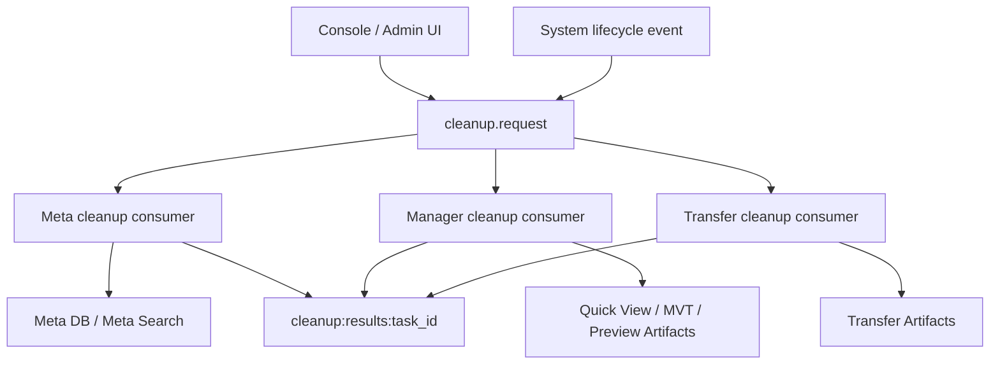

# Meta cleanup 边界与派生产物清理设计

> 状态：讨论稿。本文记录当前 cleanup 实现的边界问题和推荐方向；本轮先不改代码，后续作为 cleanup / 扫描后派生能力专题的输入。

## 背景

Meta 扫描主线已经逐步收敛为：

- Meta 负责发现和刷新数据项事实，写入 `meta_node`、`meta_item` 和标准 `attributes`。
- Manager preview、Quick View、MVT 等消费方读取 Meta 已有事实，不应在预览链路偷偷写回 Meta。
- MVT / Quick View 属于空间展示相关派生产物，不属于源 metadata facts。

在继续整理 Meta 后端目录和服务职责时，发现 cleanup 链路存在跨模块 owner 边界问题，需要单独讨论，不适合在普通代码整理中顺手修改。

## 当前实现事实

### 1. Meta CleanupService 承担多类职责

当前 `meta/backend/internal/service/cleanup_service.go` 同时承担：

- 定时物理删除软删除的 `meta_item` / `meta_node`。
- 订阅 `cleanup.request` Redis Stream。
- 扫描和执行 Meta DB 垃圾清理。
- 清理 Meta 的 Meilisearch 索引。
- 扫描和删除 MinIO 对象。
- 在引擎删除事件后，软删除 Meta 数据并尝试删除 MVT 瓦片。

这些职责中，Meta DB 和 Meta Search 属于 Meta 自身 owner 范围；MinIO 中的 MVT tiles 则属于 Manager Quick View 派生产物。

### 2. Meta 直接读取 Manager 表

`meta/backend/internal/metacleanup/database.go` 中存在直接查询 `manager.quick_view` 的逻辑：

- 按无效 engine 查询 Quick View fingerprint。
- 按单个 engine 查询 Quick View fingerprint。

这使 Meta 知道了 Manager 的内部表结构、fingerprint 用法和 Quick View 派生产物关系。

### 3. Meta 直接删除 Manager bucket 中的 MVT tiles

`meta/backend/internal/metacleanup/minio.go` 中存在直接扫描和删除以下对象的逻辑：

```text
bucket: manager
prefix: mvt-tiles/<fingerprint>/
```

这使 Meta 知道了 Manager 的 MinIO bucket、MVT tiles key 结构，以及 Quick View 派生产物的存储策略。

### 4. cleanup 事件协议已有雏形，但 Manager 未接入

`common/events/cleanup_events.go` 已经定义：

- `cleanup.request`
- `CleanupRequestEvent.ExpectedModules`
- `CleanupResultData`
- `ModuleMeta`
- `ModuleManager`

这说明 cleanup 本来可以是跨模块协同协议。但当前实际消费方主要是 Meta，Manager 暂未实现 cleanup consumer，导致 Meta 代替 Manager 处理了 Manager 资源。

## 核心问题

### 1. Meta 越过模块 owner 边界

Meta 可以知道 System，因为 Meta 扫描需要读取 engine 注册信息和 engine 生命周期事件。

但 Meta 不应知道 Manager 的 Quick View 表结构、MVT bucket 结构和派生产物生命周期。否则 Manager 内部实现一旦调整，Meta cleanup 会被迫同步修改，形成隐式耦合。

### 2. cleanup 把源事实和派生产物混在一起

`meta_item.attributes` 是源 metadata facts。

Quick View / MVT tiles 是基于 metadata facts 和展示策略生成的派生产物。它们可能有自己的状态、任务、重试、缓存和过期策略，不应被 Meta DB cleanup 逻辑直接支配。

### 3. 当前逻辑难以扩展到更多扫描后派生产物

如果后续出现：

- 图片缩略图
- 文档向量化索引
- embedding index
- 大文件 access index
- 其他物化缓存

都不能让 Meta cleanup 逐个知道每个模块的表、bucket、key 和删除规则。否则 cleanup 会变成跨模块硬编码中心。

### 4. System 不应知道 Meta，cleanup 也不能反向制造耦合

System 只应发布中性的生命周期事件，例如 engine deleted / disabled。

具体模块如何处理自己的资源，应由各模块订阅并执行。System 不需要知道 Meta，也不需要知道 Manager 的 MVT 或其他派生产物。

## 推荐原则

### 1. 谁拥有产物，谁负责 cleanup

| 资源 | Owner | cleanup 责任 |
| --- | --- | --- |
| `meta.meta_node` | Meta | Meta |
| `meta.meta_item` | Meta | Meta |
| Meta search index | Meta | Meta |
| `manager.quick_view` | Manager | Manager |
| `manager.quick_view_optimization` 及 Manager 创建并登记的 3857 优化目标 | Manager | Manager |
| 自动识别的外部 3857 物化视图、外部表或外部索引 | 外部 owner / 源 PG 管理方 | Manager 不清理 |
| `manager` bucket 下的 MVT tiles | Manager | Manager |
| Manager embedding / preview cache | Manager | Manager |
| Transfer 临时导入产物 | Transfer | Transfer |

### 2. common 只定义协议，不承载业务 owner

`common/events` 可以定义 cleanup request / result 的协议模型，但不能把具体模块的表结构、bucket key、artifact 类型写进 common。

### 3. cleanup coordinator 与 cleanup executor 分离

推荐概念模型：



其中：

- coordinator 只负责发起请求、汇总结果和展示审计。
- executor 只清理本模块拥有的资源。
- `ExpectedModules` 用于声明本次请求等待哪些模块响应。

### 4. engine lifecycle event 应由各模块独立消费

引擎删除或禁用后：

- Meta 消费事件：软删除或标记相关 metadata，并清理 Meta search index。
- Manager 消费事件：清理 Quick View、MVT tiles、相关 preview/embedding 派生产物。
- 其他模块按自己的 owner 范围消费事件。

这条路径不要求 System 知道 Meta 或 Manager 的内部实现。

### 5. 派生产物 lifecycle 应统一描述

Manager 派生产物不只有 Quick View 和 MVT。随着向量化主线收敛，至少需要把以下 artifact state 纳入同一套 lifecycle 讨论：

| 派生产物 | 状态 owner | 物理产物 | 典型失效来源 |
| --- | --- | --- | --- |
| Quick View | Manager | `manager.quick_view` | 源 item 删除、engine 删除 |
| Quick View Optimization | Manager | `manager.quick_view_optimization`、Manager 创建并登记的 3857 物化视图和索引 | 源 item 删除、空间字段变化、engine 删除、源事实变化 |
| MVT tiles | Manager | MinIO tiles、Redis / 内存缓存、manifest 或任务结果 | 源 item 变化、配置变化、SRID / extent 策略变化 |
| preview cache | Manager | 预览缓存、临时抽取结果、可能的缩略图 | 源 content 变化、格式插件变化、缓存过期 |
| embedding vectors | Manager | `manager.embeddings` pgvector 行 | 源 item 变化、模型变化、维度变化、engine / tenant 删除 |

lifecycle 需要区分三类对象：

1. `TaskExecution`：某次执行历史，只记录过程和审计，不代表当前产物是否可用。
2. `artifact state`：当前产物状态，例如 `ready`、`outdated`、`failed`、`missing_source`。
3. 物理产物：MinIO 对象、Redis key、pgvector 行、缓存文件等可删除资源。

后续 cleanup 专题至少需要统一以下决策：

- item 删除后，artifact state 是删除还是标记 `missing_source`。
- engine 删除后，任务定义、artifact state 和物理产物是否同步删除。
- tenant 删除后，各模块是否通过 cleanup request 统一处理。
- 源事实变化后，是事件驱动标记 `outdated`，还是查询 / 执行时惰性判断。
- 模型、维度、SRID、extent、preview 插件等配置变化是否进入统一 config version。
- cleanup result 是否进入 `common.task_executions`，以及 scan / execute 是否拆分记录。

约束：

- Meta 只发布或处理 Meta 自己的事实生命周期，不直接读写 Manager 私有表和 bucket key。
- Manager cleanup consumer 只清理 Manager-owned artifact，不反向修改 Meta attributes。
- 各派生产物可以有不同物理删除策略，但对外应暴露一致的 cleanup result 摘要。

## 推荐改造方向

### 阶段 1：文档固化

- 本文先记录现状、问题和推荐方向。
- `扫描后派生能力与任务边界.md` 可引用本文，说明派生产物的 cleanup owner 归属。
- 暂不修改 Meta cleanup 代码，避免影响当前正在推进的 Meta 扫描主线。

### 任务体系边界

cleanup 从监控视角具有 execution 特征，但从编排视角属于系统级运维清理流程，不是用户数据处理流水线的一环。

后续如果 cleanup 接入 `common.task_executions`：

- 只能作为 `module=system` 或具体 owner 模块的运维执行记录，用于监控、审计和故障追踪。
- 不能声明为 TaskProvider 可编排任务类型。
- 不能出现在 Orchestrator 任务选择列表中。
- cleanup scan / execute 是否分别产生 execution，需要在 cleanup 专题中统一定义。
- `ExpectedModules`、各模块 cleanup result 标准字段、scan result 与 execute result 的关联，也应在本文专题中继续收敛。

### 阶段 2：Manager 接入 cleanup consumer

在 Manager 内新增 cleanup consumer：

- 订阅 `cleanup.request`。
- 仅处理 `ExpectedModules` 包含 `manager`，或请求未限制模块但 Manager cleanup 已启用的任务。
- scan 阶段统计 Manager 自己的垃圾数据：
  - 无效 engine 关联的 `quick_view`。
  - 孤立或过期的 Quick View 记录。
  - 无效 engine、缺失 item 或源事实变化导致的 `manager.quick_view_optimization` 记录。
  - Manager 创建并登记、但已无有效结果归属的 3857 优化目标。
  - 可删除的 MVT tiles。
- execute 阶段删除 Manager 自己的资源：
  - `manager.quick_view`。
  - `manager.quick_view_optimization` 中 Manager 拥有生命周期的结果记录。
  - Manager 创建并登记的 3857 物化视图或索引。
  - `manager` bucket 下对应 MVT tiles。
  - Redis / 内存中的 Manager 运行时瓦片缓存键。
- Manager cleanup 不删除 capability 自动识别的外部 3857 物化视图、外部表或外部索引；这些对象不写入 `manager.quick_view_optimization`，也不获得 Manager 生命周期所有权。
- 写入 `cleanup:results:<task_id>` hash，key 为 `manager`。

### 阶段 3：移除 Meta 对 Manager 产物的直接依赖

确认 Manager cleanup consumer 可用后，从 Meta 移除：

- `metacleanup.DatabaseCleaner.InvalidFingerprints`
- `metacleanup.DatabaseCleaner.FingerprintsByEngine`
- `metacleanup.MinIOCleaner` 中扫描 / 删除 `manager` bucket 的 MVT 逻辑
- `CleanupService.deleteMinIOMVTByEngine`
- `CleanupService.ScanGarbage` / `ExecuteCleanup` 中基于 Manager fingerprint 的 MinIO cleanup

Meta 保留：

- Meta DB cleanup。
- Meta search index cleanup。
- 对 System engine lifecycle event 的消费。

### 阶段 4：统一 cleanup 结果模型

后续可进一步讨论：

- cleanup 是否以 `module=system` 的系统级运维 execution 进入 `common.task_executions`。
- cleanup scan 和 cleanup execute 是否需要统一 execution 记录。
- `ExpectedModules` 的默认行为。
- 各模块 cleanup result 的标准字段。
- cleanup scan result 与 execute result 的关联和审计。

阶段 1 明确不把 cleanup 纳入 TaskProvider，也不进入 Orchestrator 编排。cleanup 不是用户数据处理任务；即便后续为了监控和审计接入统一 execution，也只能作为系统运维记录展示，不能出现在编排任务选择列表中。

## 本轮暂不处理

本轮只记录边界，不修改代码：

- 不删除 Meta 中现有 MVT cleanup 逻辑。
- 不新增 Manager cleanup consumer。
- 不修改 `common/events` 协议。
- 不调整 MVT / Quick View 表结构和 MinIO key。
- 不改变当前 cleanup API 行为。

后续需要在 cleanup / 扫描后派生能力专题中确认后，再进入代码迁移。
