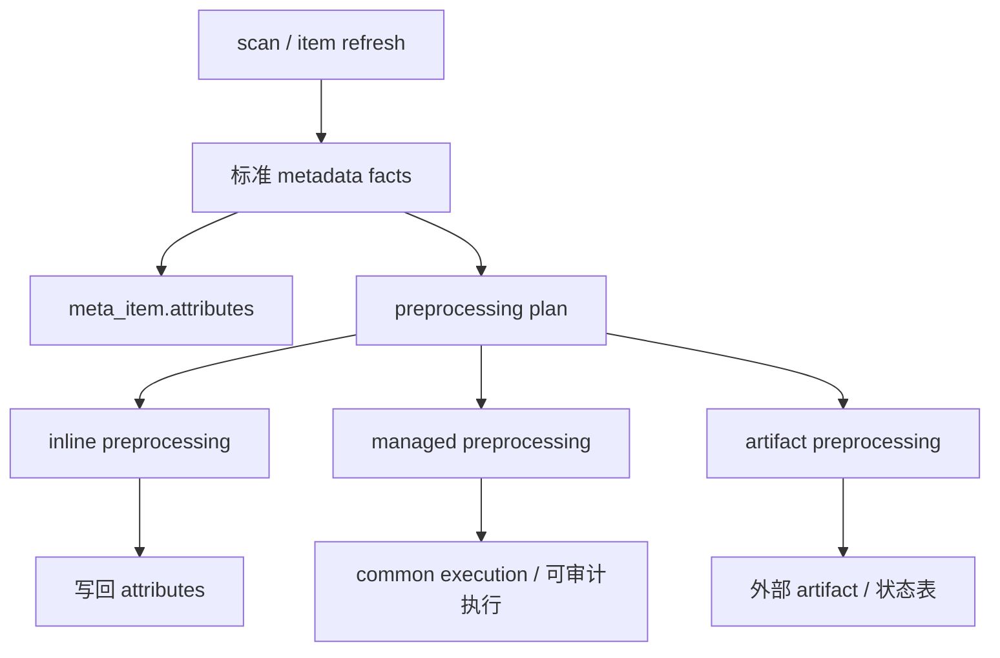

# Meta preprocessing 语义与任务边界

> 状态：讨论稿。本文只固化后续专题讨论的概念边界，不代表当前立即改造任务体系。

## 背景

Meta 扫描主线已经收敛为：

1. 由 scan / item refresh 写入 `meta_item.attributes`。
2. Manager preview 等消费方只读取 Meta 已有事实，不在预览链路偷偷写回 attributes。
3. `access_index` 当前保留在 deep scan / item refresh 主线内生成，缺失时由消费方降级读取。

后续需要统一讨论的不是 `access_index` 是否保留，而是 `access_index`、MVT、图片/文档向量化、缩略图等“扫描后派生能力”是否应抽象为 Meta preprocessing，并如何接入任务体系。

## 核心结论

`scan` 和 `preprocessing` 不应混为一个概念：

- `scan`：发现和刷新数据项事实，写入 item/node 的标准 metadata。
- `preprocessing`：基于已识别的数据项事实生成派生能力、辅助索引或外部物化产物。

`access_index` 当前作为 deep scan 的默认尝试目标保留：

- 生成位置仍在 Meta scan / item refresh。
- 标准落点仍是 `attributes.access_index.<data_type>`。
- provider 可因格式不支持、成本限制、文件过大等原因跳过。
- 跳过不应导致 deep scan 失败。
- Manager preview 只消费已有索引；缺失或不可用时降级读取，不触发写回。

## 分类框架

| 类型 | 定义 | 典型对象 | 初步建议 |
| --- | --- | --- | --- |
| inline preprocessing | 与扫描强绑定、成本可控、产物只写 attributes | 小/中型表格 `access_index` | 可继续在 deep scan / refresh 内执行 |
| managed preprocessing | 成本较高、需要重试/进度/审计，产物服务单个 item | 大文件 `access_index`、图片向量化、文档向量化 | 后续考虑接入 common execution |
| artifact preprocessing | 生成外部物化产物或缓存状态 | MVT 预缓存、物化视图、瓦片缓存、缩略图文件 | 应有独立状态对象或 artifact 记录 |

## 与任务体系的关系

后续讨论时应区分三类对象：

1. **策略**：某个 engine / item 是否启用某类 preprocessing。
2. **执行**：一次 preprocessing run 的调度、状态、重试和审计。
3. **产物**：attributes 内事实、外部缓存、物化视图、向量索引或文件对象。

建议方向：

- preprocessing execution 可以复用 common execution 基础能力。
- 但 scan task 和 preprocessing task 不应在语义上合并。
- scan execution 可以产生 preprocessing plan，也可以在策略允许时触发后续 preprocessing execution。
- 不同 preprocessing 类型是否立即执行、异步执行或只登记待处理，应由策略决定。

## 待专题讨论问题

1. preprocessing policy 的归属：Meta 自己维护，还是由 Console 基于 System engine 注册流程写入 Meta。
2. preprocessing execution 是否统一进入 common task execution，以及 task type / source / trigger_type 如何命名。
3. inline preprocessing 的失败是否只记录 attributes 状态，还是也需要 execution 记录。
4. MVT 当前位于 Manager 任务体系，未来是否迁入 Meta preprocessing，还是保持 Manager 作为空间展示派生产物的 owner。
5. 向量化产物的 owner：Meta、Manager、Asset/Search，还是独立 embedding/index 模块。
6. attributes 中是否需要标准化 `capabilities.preprocessing` 或 `preprocessing_status`，用于表达跳过、失败、部分完成等状态。

## 当前不改的边界

本讨论稿不改变当前实现：

- 不拆出 `access_index` 独立任务。
- 不改变 `attributes.access_index.<data_type>` 结构。
- 不改变 Manager preview 的降级读取策略。
- 不改变 MVT / embedding 现有模块归属。

