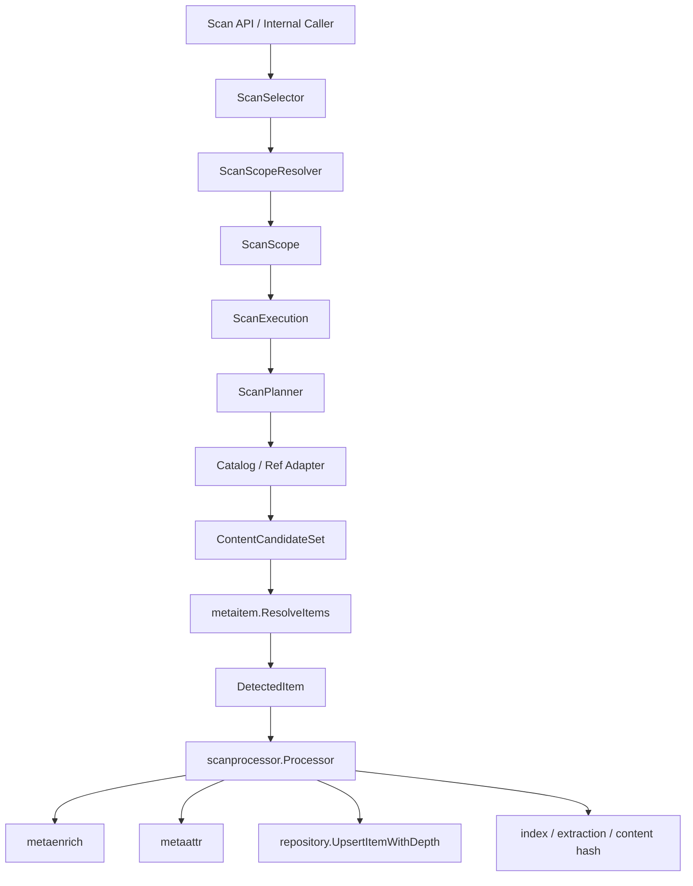
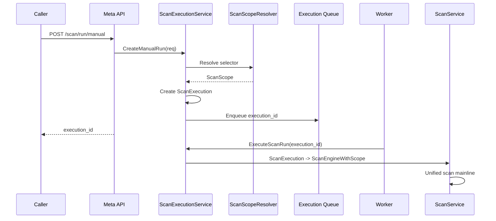
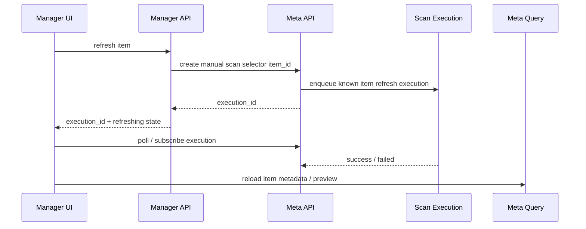
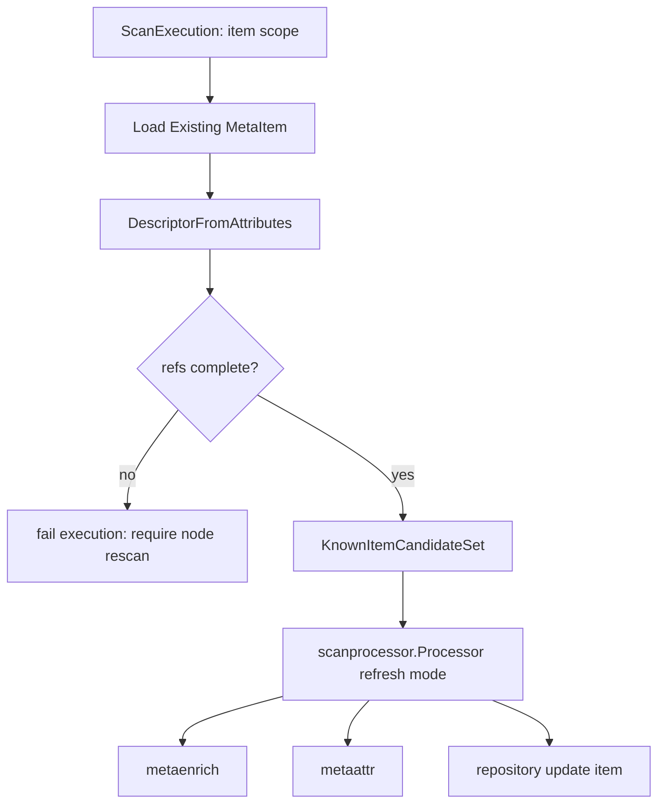
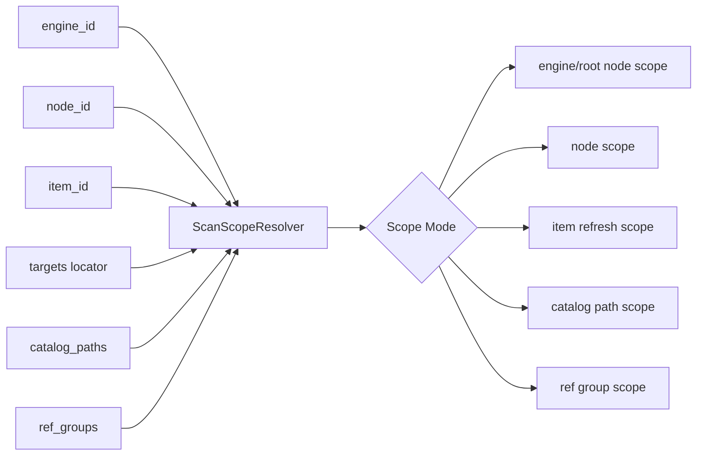
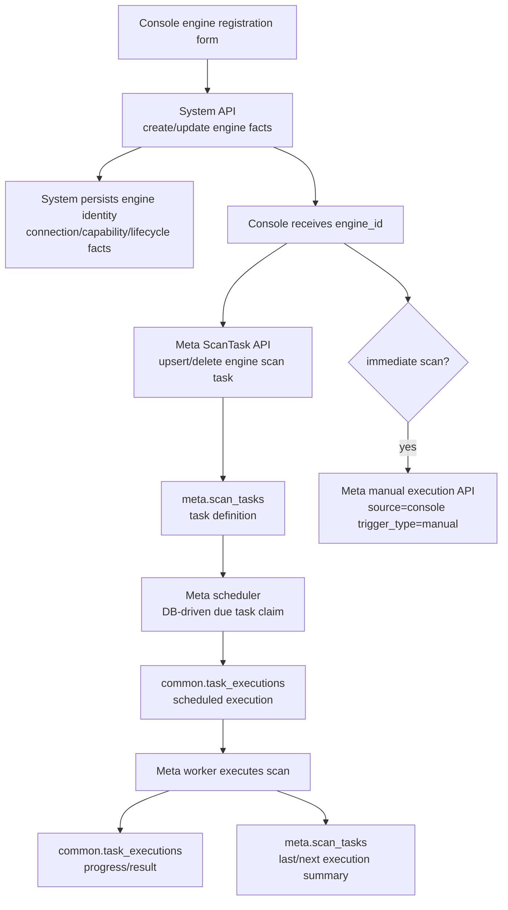
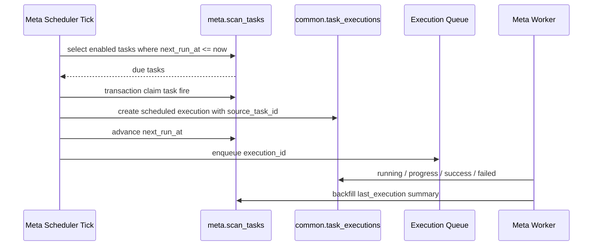
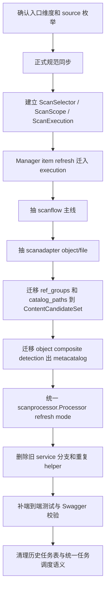

# Meta 扫描入口与内部主线设计

本文讨论 Meta 扫描体系“应该如何设计”，不描述现状实现细节，也不作为正式规范。待方案确认后，再同步修订 `docs/spec/` 与 `docs/concepts/`，最后进入代码改造。

目标：

- 从概念上统一 Meta 提供的扫描入口。
- 明确所有入口进入 Meta 内部后的统一主线。
- 基于目标主线重新规划 Meta 后端目录职责。
- 默认不兼容旧实现，不保留双轨、兼容字段或绕路入口。

## 一、扫描入口维度

Meta 对外和对内的扫描入口不应按“哪个模块调用”或“哪个 handler 先写出来”分叉，而应先拆成稳定维度。

### 1. 执行形态：统一 execution / 前台等待体验

| 维度 | 含义 | 典型场景 | 约束 |
|---|---|---|---|
| 统一 execution | 后端为每次扫描或刷新创建 execution，由统一执行链路记录状态、进度和结果 | Meta 前端手动扫描、Manager item 刷新、Transfer 回扫、System 触发扫描、定时扫描 | 所有入口都必须进入同一套 execution 生命周期，便于审计、监控、取消、重试和错误排查。 |
| 前台等待体验 | UI 对某次 execution 做局部 loading、轮询或订阅，完成后重新读取目标 item / node | Manager 点击单个 item 刷新后“立等可用” | 这是产品交互体验，不是后端同步扫描分支；不得绕过 execution 直接调用另一套刷新逻辑。 |

建议取消“同步扫描入口”这个后端概念。Manager 的 item refresh 可以做到用户体验上的即时反馈：

1. 前端点击 item refresh。
2. Meta 创建 `module=meta, task_type=scan, trigger_type=manual, source=manager` 的 execution。
3. execution 的 scope 是单个 known item refresh，不扩大到父 node。
4. 前端对该 execution 做局部等待；成功后重新读取 item 元数据和预览。

这样用户得到“我点了这个 item，刷新后马上可用”的体验；平台仍只保留一条任务、审计和执行主线。

### 2. 目标选择器：engine / node / item / catalog path / ref group

| selector | 外部输入 | 内部目标 | 说明 |
|---|---|---|---|
| engine | `engine_id` | engine root scope | 从引擎 catalog root 开始扫描；如果 root node 不存在，由 Meta 构造。 |
| node | `node_id` | node scope | 从已有 Meta node 对应的 catalog 范围扫描；engine root node 属于 node scope 的特例。 |
| item | `item_id` | known item refresh scope | 刷新已入库 item 的 metadata facts；不重新裁决 item 边界。 |
| catalog path | `catalog_paths` | catalog scope | 按引擎 catalog model 定位路径范围；需要构造 / 更新对应 Meta node 和 item。 |
| ref group | `ref_groups` | content refs scope | 给定一组 content refs，在该边界内识别 item；不得枚举父目录。 |
| locator | `targets` | selector adapter | locator 是入口定位语法，不是内部扫描原语；必须先解析成 node / item / catalog path / ref group 之一。 |

关键约束：

- `catalog_paths` 只表达 catalog 范围，不能表达 sibling refs。
- `ref_groups` 只表达内容引用边界，不能表达父目录扫描。
- `item_id` refresh 只消费已入库 item 标准事实，不退回父目录重新识别。
- engine root 在内部应被当作 root node scope，而不是额外扫描类型。

### 3. 扫描深度：basic / deep

`scan_depth` 已在正式规范中相对清晰：

- `basic`：建立资源树和 data item 身份，原则上不打开 file/object 内容。
- `deep`：补充字段、format info、access index、content hash、extraction、spatial 等稳定事实。

`basic/deep` 是扫描目标深度，不应创造两套扫描主线。差异应由 processor / enricher 根据深度决定做哪些步骤。

### 4. 调度方式：manual / scheduled

`trigger_type` 只表达调度方式：

| trigger_type | 含义 |
|---|---|
| `manual` | 用户、模块或系统动作即时触发。 |
| `scheduled` | 定时计划触发。 |

不应再引入 `api`、`transfer`、`system`、`manager` 等 trigger type。它们属于来源，不属于调度方式。

### 5. 触发来源：source

`source` 只记录触发模块，用于审计、排查和执行记录，不参与扫描分支选择，也不承载调度方式、前后端通道或具体业务场景。

建议固定为 ADDP 模块名：

| source | 含义 |
|---|---|
| `console` | Console 聚合编排触发，例如注册 engine 后写入扫描计划或创建立即扫描 execution。 |
| `meta` | Meta 模块自身触发，包括 Meta 前端手动扫描和 Meta 内部定时调度触发。 |
| `manager` | Manager 模块触发，例如资源树刷新、item refresh 或预览前置刷新。 |
| `system` | System 模块触发，例如 engine 创建、配置变化后的立即扫描。 |
| `transfer` | Transfer 模块触发，例如导入/转换完成后提交本次实际生成 refs。 |
| `asset` | Asset 模块触发，例如资产发现或资产侧补扫。 |
| `orchestrator` | Orchestrator 模块触发，例如工作流步骤要求扫描或刷新。 |
| `develop` | Develop 模块触发，例如 SQL 工作台或 Notebook 产物要求纳管。 |
| `graph` | Graph 模块触发，例如图谱构建前后需要补齐元数据。 |

关键结论：

- `scheduler` 不应作为 `source`，因为它不是业务模块；定时调度只由 `trigger_type=scheduled` 表达。
- 暂不引入 `source_detail` / `channel`。如果未来审计确实需要更细粒度信息，应先在正式规范中单独定义，不能把扩展字段作为当前扫描主线的前置条件。
- 用户、请求、链路追踪等信息可继续放在统一 execution 的通用上下文中，但不参与扫描策略。

## 二、Meta 内部统一主线

所有入口进入 Meta 后，应尽量统一到同一条主线。入口差异只允许停留在 selector resolution、execution mode 和 candidate adapter 上，不应让每个入口自己做 detection、enrich、persist。

### 目标主流程



主线含义：

1. API 或内部调用方只提交 selector，不直接决定扫描实现。
2. `ScanScopeResolver` 是 selector 到内部范围的唯一入口。
3. `ScanExecution` 记录执行状态、触发方式、来源、深度、force 和 scope。
4. `ScanPlanner` 根据 scope 和 catalog model 选择 adapter。
5. adapter 只负责枚举或构造候选集合，不负责落库。
6. `ContentCandidateSet` 是 detector 的唯一输入模型。
7. `metaitem.ResolveItems` 只裁决 item 边界、layout、refs、claims。
8. `scanprocessor.Processor` 是 item attributes、deep enrich、hash、extraction、index、upsert 的唯一主路径。

### 统一 execution 入口



统一 execution 入口必须覆盖：

- Meta 前端手动扫描。
- System 创建引擎后的立即扫描。
- Transfer 回扫。
- 定时任务触发。
- 任何 node / engine / catalog_paths / ref_groups 范围扫描。
- Manager item refresh。

Manager 这类需要“立等可用”的交互，不新增同步扫描分支，而是在 UI 上等待同一条 execution：



### known item refresh 子路径

item refresh 不应进入 catalog 枚举，也不应重新识别 sibling refs。它和扫描主线的统一点不是 `ResolveItems`，而是统一的 execution、content reader、attributes 和 persist 规则。



约束：

- 使用相同的 content reader / enrich 能力。
- 使用相同的 attributes 写入规则。
- 最终应尽量复用 `scanprocessor.Processor` 或同级的 item processor。
- attributes 中缺少 refresh 所需 refs 时，当前 item refresh 失败并给出“重扫 node / 上游重新提交完整 refs”的明确提示；不得自动扩大到父目录，也不得把不存在的配套文件补进 children。
- item refresh 可以不经过 detector，但不能拥有另一套 enrich / attributes / persist 规则。

### selector 到 scope 的统一



要求：

- `ScanService`、`ScanTaskService`、handler、worker 不再各自解析 target。
- execution config 存储 scope，而不是只存 `catalog_paths`。
- `targets` 只是兼容 ResourceLocator 的入口语法；解析后必须消失。

## 三、目录职责规划

目录划分应服务上面的主线，而不是维护现状。可以大幅调整，但每层只保留单一职责。

### 建议目标目录

```text
meta/backend/internal/
├── api/                 # HTTP handler、参数绑定、响应，不写扫描逻辑
├── models/              # DB model 与 API DTO，不写流程逻辑
├── repository/          # GORM 持久化，封装 SQL，不做扫描决策
├── scantask/            # execution config、调度、进度、队列语义
├── scanflow/            # 扫描主线：selector、scope、planner、execution orchestrator
├── scanadapter/         # object/file/tabular 等 catalog adapter
├── scanruntime/         # adapter 调用的扫描运行时：持久化、processor、节点状态细节
├── metaitem/            # detector 编排、DetectedItem、claims/exclusive
├── metacatalog/         # catalog entry/resource 规范化、node/item plan
├── metaenrich/          # 打开内容并提取 deep facts
├── metaattr/            # attributes 标准写入
├── metapath/            # 路径语义工具
├── scanchange/          # 是否需要重扫/跳过判断
├── search/              # 搜索索引
├── metatext/            # 文本抽取/清洗辅助
└── worker/              # 后台 worker glue
```

### 目录边界

| 目录 | 应该负责 | 不应该负责 |
|---|---|---|
| `api/` | handler、鉴权上下文、DTO 绑定、响应 | 解析 scan target、判断扫描策略、落库。 |
| `scantask/` | execution config、manual/scheduled execution、队列进度 | catalog 枚举、detector、attributes。 |
| `scanflow/` | ScanSelector、ScanScope、ScanPlanner、主流程 orchestration | 格式 parser、SQL 细节、attributes 字段路径。 |
| `scanadapter/` | object/file/tabular adapter，构造 `ContentCandidateSet` 和 node plan | data item detection、deep enrich、upsert。 |
| `scanruntime/` | adapter 的运行时执行能力：node/item 持久化、processor 调用、状态细节 | selector、scope、strategy dispatch、HTTP/API。 |
| `metaitem/` | `ResolveItems`、claims、exclusive、`DetectedItem` | node 创建、fingerprint、repository。 |
| `metacatalog/` | `StorageResource`、catalog path / node / item plan | 调用 `metaitem.ResolveItems` 或读取内容。 |
| `metaenrich/` | 通过 provider / reader 提取 deep facts | 决定 item 边界、写 DB。 |
| `metaattr/` | 标准 attributes 写入 helper | 接收 engine、catalog provider、manager DTO 等上层复杂对象。 |
| `repository/` | 持久化操作 | 扫描策略和业务判断。 |

### 当前需要重点收敛的边界

1. `metacatalog` 不应调用 detector。
   - 目标：`metacatalog` 只做 plan。
   - `DetectObjectCatalogCompositeItems` 这类逻辑应迁到 `scanflow` / `scanadapter` / `metaitem` 的明确边界。

2. `service/` 不应继续成为所有逻辑的堆叠目录。
   - 目标：`service` 保留应用服务门面。
   - 扫描主线迁入 `scanflow`。
   - object/file/tabular 差异迁入 `scanadapter`。

3. item refresh 不应独立拥有另一套 enrich / attributes / persist。
   - 目标：refresh 不走 detector，但走同一套 item processor 或 processor 子能力。

4. ref groups 和 catalog paths 不应是两条扫描实现。
   - 目标：二者都构造 `ContentCandidateSet`，区别只在 candidate 来源。

## 四、任务定义、调度与执行记录边界

Meta 扫描需要区分三类对象：

| 对象 | 归属 | 含义 | 是否持久化 | 目标存储 |
|---|---|---|---|---|
| 扫描策略输入 | 调用方 / UI | 用户在某个入口提交的扫描意图，例如注册 engine 时顺手配置 Meta 扫描策略 | 不作为 Meta 调度权威状态 | 请求体、事件载荷或临时命令 |
| 扫描任务定义 | Meta | “未来应该按什么计划扫描什么范围”的定义态 | 是 | `meta.scan_tasks` |
| 扫描执行记录 | Common | “某一次扫描实际执行了什么、进度如何、结果如何”的运行态 | 是 | `common.task_executions` |

关键边界：

- `common.task_executions` 只记录执行，不保存调度定义。
- `ScanTask` 只记录任务定义和最近一次执行摘要，不保存每次执行历史。
- System 拥有 engine 身份、连接配置和生命周期，不知道 Meta，也不接收、不保存、不投递 Meta 扫描策略。
- Console 同时知道 System 和 Meta。System 注册引擎时“默认带有 Meta 扫描配置”的产品体验，应由 Console 在同一个表单流程中分别编排 System engine 写入与 Meta `ScanTask` / execution 写入。
- 定时执行由 `trigger_type=scheduled` 表达，触发来源仍为 `source=meta`；任务定义的创建者或管理方应使用独立字段表达，不混入 execution `source`。

目标链路：



### 1. `ScanTask` 是调度权威

目标上，`ScanTask` 应保存：

- `tenant_id`
- `engine_id`
- `scope`：engine / node / item / catalog path / ref group 等统一 selector/scope 表达
- `schedule`：标准 Cron 表达式；空值表示无定时计划
- `enabled`
- `scan_depth`
- `force`
- `next_run_at`
- `last_run_at`
- `last_execution_id`
- `last_execution_status`
- `owner_module` 或同等语义字段：表达任务定义绑定的对象所属模块，例如 `system`、`meta`

`owner_module` 与 execution `source` 不是同一个概念：

- `owner_module`：任务绑定在哪个模块的对象上。
- `source`：这次 execution 是哪个模块触发的。

例如 Console 在注册 engine 后为该 engine 创建了一个自动扫描任务：

- `ScanTask.owner_module=system`
- 到点后由 Meta scheduler 触发 execution：
  - `TaskExecution.module=meta`
  - `TaskExecution.task_type=scan`
  - `TaskExecution.trigger_type=scheduled`
  - `TaskExecution.source=meta`
  - `TaskExecution.source_task_id=scan_tasks.id`

这样不会让一个字段承载两个含义。

这里的 `owner_module=system` / `owner_ref=engine:{engine_id}` 只表达任务绑定的外部领域对象是 System engine，不表达 System 管理 Meta 任务，也不要求 System 知道 Meta。

### 2. 调度保证方式

不建议把“保证按调度执行”建立在纯内存 cron 上。目标应是 DB 驱动的 durable scheduler：



调度保证的目标：

- Meta 重启后，可以通过 `next_run_at <= now()` 找回应该触发的任务。
- 多实例部署时，通过数据库行锁、唯一 fire key 或分布式锁保证同一个 planned run 只创建一次 execution。
- 即使 execution 失败，也应在 `common.task_executions` 留下失败记录，并回写 `ScanTask.last_execution_status`。
- 任务是否补跑错过的时间点需要单独定义策略；默认建议只补最近一次 due run，避免 Meta 长时间停机后集中创建大量历史执行。

### 3. System 注册引擎时的扫描设置

System 注册引擎时出现 Meta 扫描设置，本质上是 Console 提供的跨模块便捷入口，不代表 System 应该拥有、理解或转发 Meta 调度状态。

目标上建议：

1. System engine 创建 / 更新只持久化 engine 自身事实：身份、连接、能力、租户、状态等。
2. System 前端在 Console iframe 中完成 engine 保存后，只通过 `postMessage` 向父级 Console 提交扫描策略编排请求，不直接调用 Meta。
3. Console 拿到 `engine_id` 和扫描策略后调用 Meta，由 Meta upsert / delete `ScanTask`。
4. 如果用户选择“注册后立即扫描”，Console 在 engine 创建成功后再调用 Meta manual execution API，创建一次 `trigger_type=manual` 的 execution。
5. UI 需要展示某个 engine 的扫描计划时，查询 Meta 的 `ScanTask`，或由 Console 聚合 System engine 与 Meta task。
6. 删除 engine 时，System 只发布通用 engine lifecycle event；Meta 监听到 delete 后删除或禁用对应 `ScanTask`，并清理 metadata。

目标实现中，`ScanTask` 是唯一调度定义。System engine 表、DTO、事件载荷和 System 前端不保留 `scan_config`。

### 4. 当前实现需要收敛的问题

1. `system.engines.scan_config` 与 `meta.scan_tasks` 都持久化调度信息，存在状态漂移风险；目标是删除 System 侧 `scan_config`，只保留 Meta `ScanTask`。
2. Meta 当前启动时把 enabled task 注册到进程内 scheduler，缺少 DB 驱动的 due task claim 机制。
3. 多实例部署下，纯内存 scheduler 可能重复触发；Meta 宕机时也可能漏掉到点任务。
4. `common.task_executions.trigger_type` 已通过公共 migration 收敛为 `manual` / `scheduled`，来源模块、API 通道、编排父子关系和重试场景不再进入 trigger type。
5. 自动扫描任务当前通过名称模式识别，目标应改为明确的任务定义归属字段。

## 五、PG schema 与任务表现状调研

这一节记录当前仓库和本地开发库的事实，用于支撑 schema 命名统一和后续是否清理历史任务表。`meta` schema 改名已经按模块一致性原则落地；历史 `metadata` 仅作为旧库迁移来源存在。

### 1. `meta` schema 命名

当前事实：

- infra 初始化脚本创建的是 `meta` schema：`scripts/infra/init-postgresql.sql` 中 `CREATE SCHEMA IF NOT EXISTS meta;`。
- Meta 后端默认配置也是 `DB_SCHEMA=meta`：`meta/backend/internal/config/config.go` 默认值为 `meta`。
- Meta 模型和 SQL 大量使用 `meta.meta_node`、`meta.meta_item`、`meta.scan_tasks`。
- 旧本地开发库可能只有 `common` 和 `metadata`，没有 `meta`；服务启动前会在只存在旧 schema 时执行 `ALTER SCHEMA metadata RENAME TO meta`。

判断：

- `metadata` 更像历史上的“元数据领域 schema 名”，不是当前模块名。
- 从 ADDP 模块边界一致性的角度，改为 `meta` 更清晰：模块名、目录名、服务名、schema 名一致。
- schema 改名不能保留 `metadata` / `meta` 双 schema 兼容；如果两者同时存在，应失败并要求人工确认数据状态，避免静默合并或误删。

已落地处理：

- infra 初始化、Meta 默认配置、GORM `TableName`、手写 SQL、迁移文件、测试和文档统一为 `meta`。
- Meta API 进程和 worker 在连接通用 AutoMigrate 前统一准备 schema：只存在旧 `metadata` 时改名为 `meta`；两者同时存在时报错。
- 后续重点不再是 schema 命名，而是清理历史任务表与统一任务调度语义。

### 2. `scan_tasks` 与 `scan_task_runs`

当前本地开发库表行数：

| 表 | 行数 |
|---|---:|
| `common.task_executions` | 431 |
| `meta.meta_item` | 187 |
| `meta.meta_node` | 31 |
| `meta.scan_tasks` | 0 |
| `meta.scan_task_runs` | 0 |

执行记录分布：

| module | task_type | trigger_type | status | count |
|---|---|---|---|---:|
| `meta` | `scan` | `api` | `success` | 345 |
| `meta` | `scan` | `manual` | `success` | 25 |
| `transfer` | `transfer` | `manual` | `success` | 4 |
| `transfer` | `transfer` | `manual` | `failed` | 1 |
| `transfer` | `transfer` | `retry` | `failed` | 1 |
| `develop` | `query` | `manual` | `success` | 1 |
| `develop` | `workflow` | `manual` | `success` | 12 |
| `develop` | `workflow` | `manual` | `failed` | 37 |
| `graph` | `kg_build` | `manual` | `success` | 4 |
| `graph` | `kg_build` | `manual` | `pending` | 1 |

原调研时 Meta 执行记录的 `source` 均为空，且存在历史 `trigger_type=api`；公共执行表已通过迁移收敛旧 trigger type，`source` 字段仍是后续统一执行审计需要补齐的问题。

代码和迁移证据：

- `common/execution/store.go` 有 `EnsureStore`，会维护 `common.task_executions` 和它自己的 SQL migrations。
- `meta/backend/internal/repository/migrations.go` 已提供 Meta embedded SQL migration runner，服务端初始化数据库后会执行 `meta/backend/migrations/*.sql` 并记录到 `meta.schema_migrations`。
- `meta/backend/migrations/011_drop_scan_task_runs.sql` 明确写着：`meta.scan_task_runs` 已废弃，执行记录统一由 `common.task_executions` 管理。
- `meta/backend/migrations/010_align_scan_tasks_basetask.sql` 要删除 `schedule_type`，补充 `last_execution_id` / `last_execution_status`。
- Meta worker 目前通过 common repository 连接数据库，不主动执行 Meta migrations；开发启动脚本会先启动 Meta Backend，再启动 Worker，因此本地开发链路由 Backend 完成迁移。

判断：

- `meta.scan_task_runs` 是历史残留执行表，应删除；执行历史已经实际归入 `common.task_executions`。
- `meta.scan_tasks` 是任务定义表，不是执行历史表。它为空不代表扫描没有执行，只代表当前没有持久化的定时/可复用扫描任务定义。
- 当前最大问题不是“为什么表里没内容”，而是任务定义、执行记录、调度触发三者还没有被文档和迁移机制彻底收敛。
- `trigger_type=api` 和 `trigger_type=retry` 是统一执行体系里的历史/跨模块残留值；公共执行表已通过迁移收敛为 `manual` / `scheduled`。

建议：

- 扫描重构时只保留两类持久对象：`ScanTask` 作为任务定义，`common.task_executions` 作为执行记录。
- 删除 `scan_task_runs` 的模型、文档、表和引用，不保留兼容读取。
- 补齐 Meta 自身 migrations 的执行机制，或把需要长期存在的结构迁移纳入统一数据库迁移体系；不能继续只靠 AutoMigrate，因为 AutoMigrate 不会删除旧字段和旧表。
- 各模块新写入的 `trigger_type` 必须按 `manual` / `scheduled` 规范执行；更细的触发来源、编排上下文和重试原因应进入 source、parent execution 或模块 metadata。

## 六、建议改造顺序



优先级：

1. 先定概念和目录边界。
2. 再同步正式规范。
3. 再做代码迁移。
4. 每一步删除旧路径，不保留兼容分支。

## 七、已确认结论与待讨论问题

已确认结论：

1. `source` 只表示触发模块，不承载调度器、场景、前端/后端通道等第二含义。
2. 当前不引入 `source_detail` / `channel`。
3. item refresh 的 refs 不完整时应失败并提示重扫 node 或上游提交完整 refs，不自动扩大扫描范围。
4. 可以根据目标架构大幅调整目录，目标是边界清晰、无重复主线、无历史垃圾。
5. `ScanTask` 是 Meta 扫描调度定义，`common.task_executions` 是执行记录；二者不能互相替代。

建议确认的新结论：

1. 后端取消同步扫描入口；所有扫描和 refresh 都创建 execution。
2. Manager 的“立等可用”由 UI 对单个 execution 前台等待实现，完成后重新读取 item 和预览。
3. `meta` schema 改名为 `meta` 可以做，但单独排期，避免和扫描主线重构互相污染。
4. `scan_task_runs` 作为历史残留删除；`scan_tasks` 保留为任务定义表；执行历史统一在 `common.task_executions`。
5. System 注册 engine 时提交的 Meta 扫描策略应转交 Meta upsert `ScanTask`，不作为 System 长期拥有的调度权威状态。
6. 调度触发目标上应改为 DB-driven due task claim，而不是只依赖进程内 cron。

后续仍需单独讨论：

1. ADDP 各模块统一任务体系中，`trigger_type` 已整体收敛为 `manual` / `scheduled`；后续需要补齐 source 字段或模块 metadata，承载来源和重试原因等审计信息。
2. 各模块是否都需要任务定义表，还是只有具备定时/可复用定义的模块保留 Task 表，所有一次性运行只写 Execution。
3. Meta migrations 应自建执行机制，还是纳入全局数据库迁移体系。
4. `ScanTask.owner_module`、`scope`、planned fire key 等字段是否进入第一轮正式规范。

## 八、下一轮讨论议题展开

下一轮建议聚焦 `ScanTask` 目标模型和统一任务体系边界。原因是：扫描入口、source、item refresh、execution 主线已经基本清楚；如果不先定任务定义模型，后续代码迁移会很容易再次把调度、执行、来源和 scope 混在一起。

### 1. `ScanTask.scope` 是否进入第一轮

问题本质：

- 当前 `ScanTask.Parameters` 主要保存 `catalog_paths`、`scan_depth`、`force`。
- 目标扫描入口已经统一成 engine / node / item / catalog path / ref group / locator selector。
- 如果 `ScanTask` 仍只存 `catalog_paths`，定时任务就无法表达 node、item refresh、ref groups 等未来可能需要调度的范围。

可选方案：

| 方案 | 说明 | 优点 | 问题 |
|---|---|---|---|
| 继续用 `parameters` 自由 JSON | 不新增结构化 scope 字段 | 改动小 | 语义松散，后续每个入口又会自己解释 parameters。 |
| 新增结构化 `scope` | `scope` 保存 selector/scope 的统一模型 | 和扫描主线一致，便于校验、迁移和 UI 展示 | 需要先定义 scope schema。 |
| 同时保留 `parameters` 和 `scope` | scope 表达范围，parameters 表达调优参数 | 边界清楚 | 需要明确二者不能重复表达同一含义。 |

建议：

- 第一轮正式规范应引入结构化 `scope`。
- `parameters` 只保留非范围参数，例如 `scan_depth`、`force`，或进一步拆成明确字段。
- 不建议继续让 `parameters.catalog_paths` 承担任务范围模型，否则 `ScanScopeResolver` 无法成为唯一入口。

建议的最小 `scope` 形态：

```json
{
  "type": "engine",
  "engine_id": 12
}
```

```json
{
  "type": "ref_group",
  "engine_id": 12,
  "ref_groups": [
    {
      "root": "bucket-a",
      "refs": ["a.shp", "a.dbf", "a.shx"]
    }
  ]
}
```

### 2. `ScanTask.owner_module` 是否进入第一轮

问题本质：

- `source` 是 execution 来源，不应该表达任务定义由谁创建或管理。
- 当前自动任务通过名称模式识别，例如 `自动扫描%`，这会把业务语义藏进展示名。
- System 注册 engine 时创建的扫描任务，后续需要由 System engine update/delete 事件维护；Meta 前端创建的任务则由 Meta 用户维护。

可选方案：

| 方案 | 说明 | 优点 | 问题 |
|---|---|---|---|
| 继续靠 `name` 识别自动任务 | 维持现状 | 零结构改动 | 不可靠，展示名和管理语义耦合。 |
| 新增 `owner_module` | 表达任务定义归属模块 | 语义清楚 | 还需要表达任务类型或外部关联。 |
| 新增 `managed_by` + `external_ref` | `managed_by=system`，`external_ref=engine:{id}` | 便于跨模块同步和幂等 upsert | 字段稍多。 |

建议：

- 第一轮至少加入 `owner_module`。
- 如果要彻底替代名称匹配，建议同时加入 `owner_ref` 或 `managed_ref`。
- 对 System engine 自动任务，建议：
  - `owner_module=system`
  - `owner_ref=engine:{engine_id}`
  - `name` 只作为展示名，不参与查询和 upsert 判定。

这样 System update/delete 事件可以稳定找到对应 `ScanTask`，不依赖中文名称或命名规则。

### 3. planned fire key 是否进入第一轮

问题本质：

- 只靠进程内 scheduler，无法保证 Meta 重启、多实例和错过触发时间时的行为。
- DB-driven due task claim 需要有“某个任务在某个计划时间点触发过没有”的判定。
- 否则多实例可能重复创建 execution，或者重启后无法判断某次 due run 是否已经生成。

可选方案：

| 方案 | 说明 | 优点 | 问题 |
|---|---|---|---|
| 不记录 fire key | 到点就创建 execution | 简单 | 多实例/重启下重复或漏触发风险高。 |
| 在 execution metadata 写 planned time | `meta.planned_run_at` | 改动较小 | 唯一约束不方便。 |
| 增加独立 fire log / unique key | `task_id + planned_run_at` 唯一 | 调度语义最稳 | 需要新增表或字段。 |

建议：

- 第一轮目标规范应定义 planned fire key 概念。
- 代码第一阶段可以先把 `planned_run_at` 写入 execution config / metadata，并建立创建 execution 前的幂等检查。
- 如果后续进入多实例或严格调度保证，再升级为独立 `scan_task_fires` 表或唯一约束。

建议的语义：

- `planned_run_at`：本次 scheduled execution 对应的计划触发时间。
- 同一个 `task_id + planned_run_at` 只能创建一条有效 execution。
- 如果 execution 失败，仍不重复创建同一个 planned run，重试应作为同一 execution 的 retry 或显式新 planned run 策略。

### 4. `trigger_type` 是否全平台收敛

已确认并落地：

- `trigger_type` 全平台只表达触发形态，取值为 `manual` / `scheduled`。
- `common.task_executions` 通过公共 migration 将历史 `schedule` 收敛为 `scheduled`，将 `api`、`orchestrator`、`retry`、`system_immediate` 等混合语义值收敛为 `manual`。
- 各模块新写入不得再使用 `schedule`、`api`、`system_immediate`、`orchestrator`、`retry` 这类混合语义值。
- 编排父子关系使用 `parent_execution_id` 表达；重试原因和调用来源后续应由 source 或模块 metadata 承载。

### 5. 各模块是否都需要 Task 表

问题本质：

- `Task` 是定义态，`Execution` 是运行态。
- 不是所有模块都有可复用、可调度、可编辑的任务定义。
- 如果每个模块都为了统一而建 Task 表，会产生空表和概念垃圾；但如果没有 Task 表，定时/复用任务又没有权威定义。

建议判断标准：

| 场景 | 是否需要模块 Task 表 |
|---|---|
| 一次性手动动作 | 不需要，只写 `common.task_executions`。 |
| 用户可保存、编辑、启停的任务 | 需要。 |
| 定时调度任务 | 需要。 |
| 可被 Orchestrator 引用的长期任务定义 | 通常需要。 |
| 纯后台内部动作，且无复用定义 | 不需要。 |

建议：

- 不要求所有模块都有 Task 表。
- 只有具备“定义态”的模块才保留 Task 表。
- Meta 扫描有定时、范围、启停、最近执行摘要，所以应保留 `ScanTask`。
- `scan_task_runs` 这种模块私有执行历史表应删除，执行历史统一进 `common.task_executions`。

### 6. Meta migrations 如何处理

问题本质：

- 当前 Meta 已有 `meta/backend/migrations/*.sql` 和 embedded migration runner。
- AutoMigrate 不会删除旧字段、旧表，也不会稳定执行复杂数据迁移。
- 因此删除旧字段、旧表应继续通过 SQL migration 表达，而不是回到 AutoMigrate 或手写启动补丁。

可选方案：

| 方案 | 说明 | 优点 | 问题 |
|---|---|---|---|
| 继续 AutoMigrate + 手写 constraint | 回到旧方式 | 改动小 | 旧表旧字段会继续残留，不符合当前原则。 |
| Meta 自建 migration runner | 已落地，使用 embedded SQL migrations | 模块自治，落地快 | 各模块可能重复造迁移机制。 |
| 平台级统一 migration 体系 | 所有模块迁移统一登记和执行 | 架构最统一 | 需要单独设计，影响全平台。 |

建议：

- 短期：继续使用 Meta 当前 migration runner 承载删表、删字段和后续 schema 改名。
- 中期：把模块 migration runner 的模式抽到 common，形成统一迁移能力。
- 不建议继续只靠 AutoMigrate，因为这和“默认不兼容旧实现、旧路径必须删除”的原则冲突。

## 九、建议下一轮决策清单

下一轮建议按以下顺序做决策：

1. 确认 `ScanTask.scope` 进入第一轮正式规范。
2. 确认 `ScanTask.owner_module` / `owner_ref` 进入第一轮正式规范。
3. 确认 scheduled execution 使用 `planned_run_at`，并定义 `task_id + planned_run_at` 幂等语义。
4. 确认各模块新写入的 `trigger_type` 只允许 `manual` / `scheduled`，公共执行表通过 migration 迁移历史值。
5. 确认 Meta 先补 migration runner，后续再抽 common 统一迁移能力。

如果这些点确认，后续正式规范和代码重构就能按单一路线推进。

## 十、落地进展记录

### 2026-06-04 第一轮落地

已完成：

1. 正式规范已同步 `source`、`trigger_type`、`ScanTask.scope`、`owner_module`、`owner_ref`、`planned_run_at`、Manager item refresh 前台等待语义。
2. `ScanTask` 已新增结构化 `scope`、`owner_module`、`owner_ref`，`parameters` 收敛为扫描参数，不再承载范围。
3. engine 绑定的自动扫描任务已改为通过 `owner_module=system`、`owner_ref=engine:{engine_id}` 幂等维护，不再依赖 `name LIKE 自动扫描%`；任务由 Console 调用 Meta 维护，不由 System 投递。
4. Meta 已补 embedded SQL migration runner，`meta.schema_migrations` 记录已执行迁移，旧 `scan_task_runs` 和旧 `schedule_type` 可由迁移删除。
5. 定时调度已从进程内 per-task cron 注册改为 DB-driven due task claim：
   - `next_run_at` 只由任务创建、任务更新、启动初始化和 due claim 推进。
   - completion backfill 只写最近执行状态，不再按完成时间重算 `next_run_at`。
   - scheduled execution 写入 `planned_run_at`，创建前按 `task_id + planned_run_at` 做幂等检查。
6. Manager item refresh 已迁入统一 execution 主线：
   - Meta `/items/{item_id}/refresh` 创建 `manual` execution，等待 execution 完成后返回原 `ScanResponse` 结构。
   - `item_id` 写入 execution config，worker 执行时恢复为 known item refresh scope。
   - `ScanService` item scope 分支统一调用 `scanruntime.ItemRefreshRuntime`，API 层不能再绕过 execution 直接同步刷新。
   - Manager 调用 item refresh 时显式传 `source=manager`、`trigger_type=manual`、`scan_depth=deep`。
7. `ImmediateExecutionRecorder` 旧同步记录路径已删除，`ScanService` 不再创建 execution；execution 生命周期统一由 `ScanExecutionService` 管理。
8. 已建立 `meta/internal/scanflow` 第一层边界：
   - `Options`、`Scope`、`Mode`、`ProgressReporter` 从 `service` 抽出。
   - `TargetSet`、`TargetsFromScope`、`InheritedTargets` 迁入 `scanflow`。
   - `scantask` 不再持有扫描目标集合模型，只负责 ScanTask 和 TaskExecution 构造。
9. `execution config` 构造与解析已迁入 `scanflow`：
   - `ManualExecutionConfig`、`TaskExecutionConfig`、`TargetExecutionConfig`、`ParseExecutionConfig` 统一由 `scanflow` 负责。
   - `scantask` 不再保存 execution config 解析逻辑，只装配 `common.task_executions` 记录。
10. selector 解析、扫描深度和 catalog planner 已继续收敛到 `scanflow`：
    - node/item/locator 到 catalog target path 的纯解析逻辑迁入 `scanflow`。
    - `scan_depth=basic/deep` 常量与校验迁入 `scanflow`。
    - catalog model 到 tabular / branch-leaf / object / file scan strategy 的 planner 迁入 `scanflow`。
11. known item refresh 已复用 `scanprocessor`：
    - item refresh 不再维护独立 attributes / content hash / extraction / index 写入路径。
    - processor 增加 `ExistingItemID` refresh mode，刷新指定已存在 item，不因 fingerprint 差异写到另一条记录。
    - processor 增加 strict deep enrich 语义：普通 catalog 扫描可容忍单项 deep enrich 失败，known item refresh 必须失败并暴露错误。
12. scan result / dispatch / content candidate 模型已继续迁入 `scanflow`：
    - `ScanCounts`、`ExtractionCounts`、`NewScanResponse` 从 `scantask` 迁出。
    - `DispatchRequest`、`DispatchResult`、`DispatchMode` 从 `service` 迁出。
    - `ContentCandidateSet` 与 content candidate resolve 入口从 `service` 迁出。
    - catalog target 顶层解析等纯工具也迁入 `scanflow`。
13. ref group 到候选集合的转换已迁入 `scanflow`：
    - `ScanRefGroup` 的 primary/ref 归一化由 `scanflow` 统一负责。
    - file ref group 与 object ref group 都转换为统一 `ContentCandidateSet`。
    - service 层只保留 ref group 扫描执行和持久化，不再保存候选集合拼装细节。
14. object catalog 组合项检测已迁入 `scanflow`：
    - `metacatalog` 不再直接调用 detector，只保留对象资源分组、路径规划、item plan 等 catalog 纯逻辑。
    - `scanflow.DetectObjectCatalogCompositeItems` 统一负责对象资源候选集合构造和内容检测调度。
    - object catalog service 只调用扫描主线能力，不再从 catalog 层绕路触发 `metaitem.ResolveItems`。
15. file catalog 候选集合构造已迁入 `scanflow`：
    - 文件目录、根目录非独占识别的 `ContentCandidateSet` 由 `scanflow` 统一构造。
    - filesystem catalog service 保留目录枚举、递归、持久化和状态维护，不再保存文件候选集合拼装规则。
16. catalog path 解析与默认深度 helper 已迁入 `scanflow`：
    - object/file catalog 共用 `scanflow.ResolveCatalogScanPaths`。
    - `scanDepthOrDefault` 旧 service 私有 helper 已删除，默认扫描深度入口统一为 `scanflow.ScanDepthOrDefault`。
17. known item refresh 的扫描规则已迁入 `scanflow`：
    - 已有 item 到 descriptor、物理路径、object path、catalog path resolver、detected item 的恢复规则由 `scanflow` 统一负责。
    - item refresh service 保留查库、engine 获取、属性回填和 processor 调用，不再保存 known item 私有扫描规则。
18. 扫描响应转换已迁入 `scanflow`：
    - `ExtractionCounts -> ExtractionScanStats`、execution metadata 到 `ScanResponse` 的转换由 `scanflow` 统一负责。
    - Meta API refresh item 等入口直接使用 `scanflow.ScanResponseFromExecution`，不再通过 service 私有转换函数。
19. `scanadapter` 目录已建立第一层边界：
    - `ContentCatalogScanner` 和通用 content catalog adapter interface 已从 `service` 迁入 `scanadapter`。
    - service 层只保留 object/file 具体服务到 adapter interface 的薄适配，后续可继续迁移 object/file/tabular adapter 本体。
20. GeoJSON 独立格式语义已同步到 Meta / Manager / Transfer 验证：
    - Meta 单资源推断中 `.geojson` 识别为 `format=geojson`、`data_type=table`，但不因此写入 `capabilities.spatial`。
    - Meta 深度解析只有在 GeoJSON feature 实际包含 geometry 时才写空间能力。
    - Manager preview 和 Transfer planner 测试已按 `FormatGeoJSON` 独立身份更新。
21. `scanprocessor` 目录已建立：
    - detected item 入库、deep enrich、content hash、文档正文抽取、Meilisearch 资产索引调度已从 `service` 迁入 `scanprocessor`。
    - catalog runtime / item refresh runtime 通过 `scanprocessor.New(repo, indexer, log)` 调用 processor；旧 `detected_item_processor.go` / `content_hash.go` service 路径已删除。
    - processor 对索引器只依赖 `AssetIndexer` 接口，避免反向依赖 service。
22. `scanadapter.CatalogDispatcher` 已建立：
    - tabular / branch-leaf / object / file 的 scan strategy 分发已从 `service` 迁入 `scanadapter`。
    - tabular namespace 批量调度、branch-leaf 分支批量调度、root finalize、缺失 namespace 清理统一收敛到 dispatcher。
    - `ScanService` 不再持有 catalog 策略分支，只负责装配依赖并调用 `catalogDispatcher.Dispatch`。
    - catalog root node 的创建/更新 helper 已下沉到 `repository`，service 私有 root helper 已删除。
23. `scanresolver` 目录已建立：
    - engine id 推断、node/item/locator 到目标 catalog path 的入口解析、最终 `scanflow.Scope` 构造已从 `ScanService` 迁入 `scanresolver`。
    - `ScanService.ResolveScanScope` 保留为 facade，内部只转发到 resolver；旧 `resolveScanEngineID` / `resolveScanTargets` service 私有实现已删除。
24. file ref group 执行主线已迁入 `scanruntime`：
    - `scanruntime.scanFileRefGroups` 负责 file ref group 的候选解析、内容识别循环和进度推进。
    - `FilesystemCatalogRuntime` 内部直接调用文件扫描根节点创建和 detected item 持久化步骤，不再通过 adapter 参数接口绕转。
    - `ExtractionCounts` 合并函数已迁入 `scanflow`，不再把通用计数模型挂在 `scanprocessor` 下。
25. object ref group 执行主线已迁入 `scanruntime`：
    - `scanruntime.scanObjectRefGroups` 负责 object ref group 的 bucket 节点准备、候选解析、内容识别循环和进度推进。
    - object catalog 聚合模型 `ObjectCatalogNodeAggregate` 已迁入 `scanflow`，作为扫描主线过程状态。
    - `ObjectStorageCatalogRuntime` 内部直接调用对象格式嗅探和 composite item 持久化步骤。
26. file path scan 执行主线已迁入 `scanruntime`：
    - `scanruntime.scanFilePaths` 负责路径解析、目录校验、扫描节点状态推进、递归扫描调度和进度推进。
    - `FilesystemCatalogRuntime` 保留目录节点创建、目录枚举、递归目录处理和 item 持久化 runtime 能力。
27. object catalog 纯路径 helper 已迁入 `scanruntime`：
    - bucket 列表、object leaf 列表、path target 解析、single leaf 读取、CatalogEntry 到 StorageResource 转换属于 object runtime 的内部路径解析实现。
    - service 和 adapter 层不再保存 object catalog path 的纯解析和转换工具。
28. object path scan 执行主线已迁入 `scanruntime`：
    - `scanruntime.scanObjectPaths` 负责 object catalog path 的路径解析、bucket/prefix/object 枚举、扫描节点状态推进、缺失对象清理和进度推进。
    - `ObjectStorageCatalogRuntime` 保留 object resource 持久化、格式嗅探、prefix 节点构建和 item processor 调用 runtime 能力。
29. `scanruntime` 目录已建立：
    - object/file catalog runtime 已从 `service` 迁入 `scanruntime`。
    - runtime 依赖 `scanprocessor.AssetIndexer` 接口，不反向依赖 service 的 `IndexerService` 具体类型。
    - `ScanService` 仅装配 runtime，并通过 `scanadapter.ContentCatalogScanner` 调用。
30. `scanruntime` 内部职责已初步拆分：
    - object runtime 拆出 composite item 持久化、content format sniffing、prefix node 构建。
    - file runtime 拆出 scan root 构建、目录枚举、目录级 item 识别、detected item 持久化。
    - object/file 主 runtime 文件继续保留路径扫描入口和递归/资源持久化主线，后续可继续迁移专属测试。
31. object/file runtime 类型命名已收敛：
    - `ObjectStorageCatalogScanService` 更名为 `ObjectStorageCatalogRuntime`。
    - `FilesystemCatalogScanService` 更名为 `FilesystemCatalogRuntime`。
    - `ScanService` 字段命名同步改为 runtime，不再在 content catalog runtime 上保留 service 命名残留。
32. runtime 专属测试已开始迁入 `scanruntime`：
    - filesystem catalog runtime 测试已从 `service` 测试包迁入 `scanruntime`。
    - object/file ref group runtime 测试已从 `service` 测试包迁入 `scanruntime`。
    - object runtime 的格式嗅探、prefix node 构建、shapefile 组合持久化测试已迁入 `scanruntime`。
33. `service/scan_object_storage_catalog_service_test.go` 测试归属已收敛：
    - object catalog processor 的 deep enrich、文档抽取、content hash 测试已迁入 `scanprocessor`。
    - object catalog target 解析测试已迁入 `scanadapter`。
    - service 测试文件只保留 `ScanService` facade / 装配相关覆盖。
34. tabular / branch-leaf runtime 已迁入 `scanruntime`：
    - `DatabaseScanService` 更名并迁移为 `scanruntime.DatabaseRuntime`。
    - `BranchLeafScanService` 更名并迁移为 `scanruntime.BranchLeafRuntime`。
    - database runtime 只依赖 `TableAssetIndexer` 窄接口；表级空间事实改由 common engine `CatalogFacts.Spatial` 提供。
    - 对应 helper 测试已从 `service` 迁入 `scanruntime`。
35. `ScanService` facade 文件继续瘦身：
    - 启动残留扫描锁清理迁入 `scan_lock_cleanup.go`。
    - 扫描完成事件发布迁入 `scan_event_publisher.go`。
    - `scan_service.go` 聚焦依赖装配、入口 orchestration 和查询代理。
36. item refresh 已抽入 `scanruntime`：
    - `scanruntime.ItemRefreshRuntime` 负责 known item descriptor 还原、content reader 获取和 `scanprocessor` 调用。
    - known item 的 item/resource/parent 查询、engine_id 校验和 processor 调用归入 `scanruntime.ItemRefreshRuntime`。
    - `service` 不再直接调用 `scanprocessor.New`。
37. content catalog thin adapter 已迁入 `scanruntime`：
    - object/file runtime 到 `scanadapter.ContentCatalogAdapter` 的适配由 `scanruntime.NewRuntimeContentCatalogScanner` 创建。
    - `service/content_catalog_scanner.go` 已删除，`service` 只装配 scanner 实例。
38. runtime bundle 已建立：
    - `scanruntime.Runtimes` 统一构造 database / branch-leaf / object / filesystem / item refresh runtime。
    - `ScanService` 不再持有分散 runtime 字段，只持有 `runtimes` 和 `catalogDispatcher`。
    - runtime bundle 的索引依赖使用组合接口 `RuntimeIndexer`，同时覆盖 catalog asset 与 table asset 索引能力。
39. `scanruntime` 测试 helper 已初步集中：
    - runtime 测试共用的 sqlite meta schema、shapefile logical item 断言、测试插件注册、静态 object content reader 已集中到包内 test helper。
    - filesystem runtime 与 ref group runtime 测试不再各自复制同一套 helper。
    - 后续可按同样原则继续收敛 `scanprocessor` 包内测试 helper。
40. content catalog root 收尾已统一回 dispatcher：
    - object / file content catalog 成功 dispatch 后，统一由 `scanadapter.CatalogDispatcher` finalizes catalog root。
    - tabular / branch-leaf / object / file 四类 catalog strategy 的入口级 root 状态维护归属一致。
    - 原 service 包中的 object runtime 组合测试已改为 `scanadapter` dispatcher 测试；service 包只保留自身仍需的通用测试 helper。
41. `scanprocessor` 测试 helper 已拆分：
    - object catalog processor 测试中的 sqlite schema、最小 DOCX/PPTX 构造、静态 content reader 已集中到包内 helper。
    - known multi-table access-index 清理语义测试已从 service 包迁回 `scanprocessor` 包。
    - service 测试不再直接覆盖 processor 内部函数，只保留 item refresh 入口行为。
42. `ScanService` facade 继续瘦身：
    - 查询代理、对象按需提取代理和统计入口已从 `ScanService` 主入口拆出，后续继续收敛到专门查询/提取服务。
    - `CountItems` 的实际查询实现已归到 `MetadataQueryService`，`ScanService` 只保留 API facade。
    - `scan_service.go` 聚焦依赖装配、依赖注入和 `ScanEngineWithOptions` 主入口。
    - 后续如继续拆分，应优先围绕“扫描入口 orchestration”和“API 兼容 facade”两个职责边界处理。
43. Meta 后端测试 DB helper 已上提：
    - 新增 `internal/metatest.OpenMetadataDB`，统一创建 sqlite in-memory 数据库和 `meta` schema。
    - `scanadapter` / `scanruntime` / `scanprocessor` / `service` 包不再重复声明 `meta_node` / `meta_item` 建表 SQL。
    - `metatest.WithoutMetaItemTable` 覆盖只需要 root node 的轻量测试场景。
44. `ScanTaskService` / `ScanExecutionService` / `ScanTaskScheduler` 职责已拆分：
    - `ScanTaskService` 只管理扫描任务定义，以及 Console 提交的 engine 扫描策略到 `ScanTask` 的绑定。
    - `ScanExecutionService` 管理 manual/auto execution 创建、执行、等待、查询、取消和进度回写。
    - `ScanTaskScheduler` 管理 execution 入队分发、本地 worker loop、pending execution 恢复和 DB-driven due task claim。
    - `scan_task_crud.go` 只负责任务 CRUD，不再创建 execution。
    - `scan_task_schedule.go` 负责 Console engine 扫描策略到 `ScanTask` 的 upsert/delete，不从 System 读取或解释 `scan_config`。
45. `CatalogDispatcher` 大文件已按 strategy 拆分：
    - `catalog_dispatcher.go` 保留类型、构造、总分发和 object/file content 分发。
    - `catalog_dispatcher_branch.go` 承接 branch-leaf strategy。
    - `catalog_dispatcher_tabular.go` 承接 tabular strategy、namespace 清理和 namespace 扫描。
    - `catalog_dispatcher_helpers.go` 承接锁清理和 root finalization。
46. `scanprocessor.Processor` 大文件已按职责拆分：
    - `processor.go` 保留 `Processor` 类型、主 `Process` 流程和紧贴流程的 helper。
    - `processor_inputs.go` 承接 file/object 输入构造器、content path 和 row count helper。
    - `processor_document.go` 承接文档正文抽取与索引 fingerprint helper。
    - `content_hash.go` 继续承接内容 hash 计算和 storage hash 写入。
47. `scanruntime.DatabaseRuntime` 大文件已按数据库扫描职责拆分：
    - `database_runtime.go` 只保留 `DatabaseRuntime` 类型、构造、scan catalog 描述和 `ScanNamespace` 主入口。
    - `database_tables.go` 承接表清单扫描、行数补全、连接池获取、表 item 写入循环和删除清理。
    - `database_table_details.go` 承接 basic/deep 表详情、attributes 构造和表 item 事实写入。
    - `database_table_facts.go` 承接 `DescribeCatalogFacts`、表事实合并、字段类型标准化和主键字段提取。
    - `database_spatial.go` 承接空间元数据能力判断、扫描和 `datatype.SpatialInfo` 转换。
48. object / file catalog runtime 主文件已继续瘦身：
    - `object_storage_catalog_runtime.go` 只保留 `ObjectStorageCatalogRuntime` 类型、构造和 `ScanPaths` 入口。
    - `object_resources.go` 承接对象 catalog resource 持久化、prefix path 处理、single object item 写入循环和 aggregate 统计。
    - `filesystem_catalog_runtime.go` 只保留 `FilesystemCatalogRuntime` 类型、构造和 `ScanPaths` 入口。
    - `file_directory_scan.go` 承接文件目录递归扫描、目录级 item detection、single file item 写入和目录清理。
49. `scanruntime.BranchLeafRuntime` 已按 branch-leaf 职责拆分：
    - `branch_leaf_runtime.go` 只保留类型、scan catalog 描述、构造和 `ScanBranch` 主入口。
    - `branch_leaf_leaves.go` 承接 leaf 列表扫描、collection / graph item upsert 和 scannedByType 清理编排。
    - `branch_leaf_dynamic_schema.go` 承接动态 schema facts 到 `metaattr.DynamicSchemaAttributesInput` 的转换。
    - `branch_leaf_helpers.go` 承接 missing item 清理和 catalog entry 事实 helper。
50. 旧扫描主线残留已清点：
    - Meta 生产代码中不再保留 `DatabaseScanService` / `BranchLeafScanService` / `ObjectStorageCatalogScanService` / `FilesystemCatalogScanService` 旧类型。
    - Meta 生产代码中不再保留 `DetectedItemProcessor` / `catalogSingleItemProcessor` 旧目标名；统一主路径命名为 `scanprocessor.Processor`。
    - `service` 包生产代码只保留装配、scope、execution、item refresh facade 和查询代理，不再直接持有 catalog runtime / item processor 的重复主线。
    - `EngineService` / `MetadataQueryService` / `CleanupService` 等仍有大文件，但职责分别属于 System 引擎代理、查询 API 和清理治理，不纳入本轮扫描主线拆分；后续如整理应另立边界讨论。
51. Meta 模块表文档已按当前任务语义收敛：
    - `meta/docs/数据库架构.md` 不再把 `scan_task_runs` / `scan_logs` 作为现役表。
    - `meta/docs/tables/scan_tasks表.md` 已明确 `scan_tasks` 只保存任务定义，执行记录统一进入 `common.task_executions`。
    - 已删除 `meta/docs/tables/scan_task_runs表.md` 和 `meta/docs/tables/scan_logs表.md`，不保留已废弃私有运行历史表文档。
    - `meta/CLAUDE.md` 相关文档入口已同步删除旧表链接。
52. 扫描去重锁语义已收敛：
    - execution 去重锁按 scope 生成，不再只按 `tenant+engine+trigger_type` 粗粒度阻塞。
    - `item_id` 优先于 `catalog_paths` / `ref_groups`，不同 scope 对应不同锁 key。
    - execution 锁采用原子获取，owner 使用 `execution_id`，释放时必须校验 owner，避免旧执行误删新锁。
    - execution 创建失败或事务回滚时立即释放锁，不依赖 TTL。
53. item refresh 私有 service 分支已删除：
    - `ScanService` 的 item scope 分支直接调用 `scanruntime.ItemRefreshRuntime.RefreshKnownItemByID`。
    - known item 的 item/node 装载、engine_id 校验、descriptor 还原和 processor 调用统一归入 `scanruntime`。
    - service 包测试改为通过 `ScanEngineWithOptions` 公开主线覆盖 known item refresh 行为。
54. `ScanExecutionService` 文件按执行生命周期职责拆分：
    - `scan_execution_service.go` 保留类型、构造、dispatcher 和存储类型查询。
    - `scan_execution_create.go` 承接 manual/auto/task execution 创建。
    - `scan_execution_runner.go` 承接执行运行、锁释放、进度回写和任务最近执行状态回填。
    - `scan_execution_query.go` 承接执行查询、等待和取消。
55. `ScanTaskScheduler` 文件按调度职责拆分：
    - `scan_task_scheduler.go` 保留类型、构造、队列接口和 task queue 注入。
    - `scan_task_scheduler_lifecycle.go` 承接启动/停止、execution 入队、本地 worker loop 和 pending execution 恢复。
    - `scan_task_scheduler_due.go` 承接 DB-driven due task claim、planned execution 幂等检查和继承目标计算。
56. `scanruntime.DatabaseRuntime` 接口依赖命名已收敛：
    - `indexerService` 更名为 `tableIndexer`，只表达 `TableAssetIndexer` 能力。
    - 空间事实不再由 meta runtime 通过 service/scanner 私有分支获取，而是消费 common engine catalog facts。
    - runtime 内部不再用 service 命名承载窄接口依赖。
57. Transfer 写后 Meta scan 文档已同步为 refs group 语义：
    - encoded/raw content 目标提交单文件或单对象 `ref_groups`，不扩大为父目录扫描。
    - Shapefile 等 multi-ref 目标只提交本次实际生成的 refs group，不补不存在的 sidecar refs。
    - native table 目标仍使用 schema / database catalog path。
58. Manager / common client 上层迁移已复核：
    - Manager item refresh 通过 `/items/{item_id}/refresh`，显式使用 `source=manager`、`trigger_type=manual`、`scan_depth=deep`。
    - Manager 资源树刷新和预览补扫使用 node / item selector，不回退到父目录扫描。
    - common MetaClient 删除未使用且不带 source 的 `ForceRefreshItem` 快捷入口，避免上层误用裸刷新。
59. System -> Meta 扫描策略权威边界已确认：
    - System 不知道 Meta，不接收、不保存、不投递 Meta 扫描配置。
    - Console 负责注册体验编排：先调用 System 创建 / 更新 engine，再调用 Meta upsert / delete 该 engine 绑定的 `ScanTask`，必要时创建一次 manual execution。
    - System engine 注册 / 编辑体验默认保存后立即触发一次基础扫描，不默认创建定时 `ScanTask`。
    - Console 收到未启用或未启用定时扫描的策略时，调用 Meta delete 该 engine 绑定的 `ScanTask`，不保留 disabled 绑定任务。
    - Meta 监听 System 通用 engine lifecycle event，只用于清缓存、维护 catalog root、engine 删除后的 metadata / scan task 清理；不得从 System 回查并解释 `scan_config`。
    - `owner_module=system`、`owner_ref=engine:{engine_id}` 只表示 `ScanTask` 绑定 System engine，不表示 System 管理 Meta。
60. System 侧 `scan_config` 已移除：
    - `common/models.Engine`、System DTO、System service、System DB 迁移和 Swagger 不再保留扫描配置字段。
    - common-frontend 仍保留扫描配置表单体验；System iframe 保存 engine 后通过 `postMessage` 请求 Console 编排 Meta 扫描任务，不直接调用 Meta。
    - Meta 已提供 Console-facing 的 engine scan task upsert/delete 能力；不使用 System 内部 command 或 System -> Meta 直连。
    - `postMessage` 请求/响应细节已抽到 common-frontend Console bridge helper，System 页面只声明业务 channel，Console Portal 只注册业务 handler。
61. Meta “扫描未扫描引擎”入口已从 `auto` 语义改为 manual batch run 语义：
    - 后端路由从 `POST /scan/auto` 收敛为 `POST /scan/run/unscanned`，不再用 auto 表达非定时入口。
    - `CreateAutoRuns` 改为 `CreateUnscannedRuns`，仍为每个未扫描 engine 创建 `trigger_type=manual` 的 execution。
    - Meta 前端与 Console 调用已同步到新路径，用户文案改为“一键补扫未扫描引擎”。
    - 旧 `AUTO_SYNC_*` Meta 配置字段已删除，避免和 DB-driven scheduled task 混淆。
62. 查询 facade 依赖继续瘦身：
    - `MetadataQueryService` 删除未使用的 `SpatialMetadataService` 注入。
    - `ScanService` 不再装配空间表扫描器；数据库空间 facts 统一来自 engine `CatalogFacts.Spatial`。
63. System -> Console -> Meta 前端编排链路已验收：
    - 新建 storage engine 默认保存后触发一次 Meta basic manual scan。
    - 编辑已有 storage engine 默认保存后也触发一次 Meta basic manual scan，即使用户没有改动扫描配置开关。
    - 用户手动关闭“注册后立即扫描”时，编辑保存不应被默认值重新覆盖。
    - “定时自动扫描”默认关闭；只有显式打开时，Console 才 upsert engine 绑定的 `ScanTask`。
    - 保存 System engine 成功后，Meta 扫描编排失败只提示扫描编排失败，不再把已成功的 System 保存误报为整体保存失败。
64. `ScanService` 查询 facade 已删除：
    - API handler 直接依赖 `MetadataQueryService` 承接 metadata tree、node、item、field、spatial metadata 查询。
    - API handler 直接依赖独立对象 metadata 服务承接 object metadata 查询。
    - `ScanService` 不再持有 `MetadataQueryService` 或对象 metadata 服务，只保留扫描入口 scope 解析、runtime/adapter 分发和扫描执行主线装配。
    - `scan_metadata_facade.go` 已删除，避免查询路径继续伪装成扫描服务能力。
65. `scanadapter` 窄接口命名已收敛：
    - `ObjectPathRuntime` 改为 `ObjectPathPersister`。
    - `FilePathRuntime` 改为 `FilePathExecutor`。
    - `ObjectRefGroupRuntime` 改为 `ObjectRefGroupPersister`。
    - `FileRefGroupRuntime` 改为 `FileRefGroupPersister`。
    - adapter 包不再用 `Runtime` 命名表达由 scanruntime 传入的窄能力，避免读成 adapter 直接拥有 runtime。
66. `FilesystemCatalogRuntime.ScanDirectory` 单文件处理职责已拆出：
    - 新增 `file_single_items.go`，承接 single file item 的 skip 判定、`scanprocessor.FileSingleInput` 构造、processor 调用和表识别日志。
    - `ScanDirectory` 保留目录级编排：列目录、组合 item 检测、claimed paths、子目录递归和 force reconciliation。
    - root 目录和普通目录只保留 detection resolver 选择差异，claims 合并、detected item 持久化和 extraction 合并统一走同一个后处理分支。
    - `fileItemNeedsScan` 归入 single file item 处理文件，避免目录编排文件继续承载 item 刷新细节。
67. database spatial facts 已收敛到 common engine catalog facts：
    - `common/engine/plugin.CatalogFacts` 新增独立 `Spatial *datatype.SpatialInfo`，不污染 `datatype.TableInfo`。
    - `CatalogFactsOptions.IncludeSpatialFacts` 显式控制是否请求空间事实，普通 catalog listing 不承担深度空间探测成本。
    - PostgreSQL 插件通过 `TabularCatalogCallbacks.DescribeSpatial` 提供空间列、SRID、extent 和空间索引事实。
    - `scanruntime.DatabaseRuntime` 深扫时消费 `CatalogFacts.Table` 与 `CatalogFacts.Spatial`，分别写入 `type_info.table` 和 `capabilities.spatial`。
    - Meta 私有 `TableSpatialScanner` / `SpatialMetadataService` / 空间扫描配置残留已删除，避免基于具体数据库实现开分支。
68. format table describe attributes 落库已收敛：
    - 新增 `metaattr.TableDescribeAttributes`，统一处理 format `TableDescribeResult` 中的 table / spatial / access_index / format_info 分区。
    - multi-ref table enrich 不再手写 `type_info.table`、`capabilities.spatial`、`access_index.table` 和 `format_info.<format>`。
    - access-index 构建归入 deep scan / refresh 的 attributes 写入主线，不再由预览链路按需写回。
    - `TableFileAttributes` 复用 table describe helper，继续独立维护文件 item 的 storage、mode、file_count 等扫描上下文属性。
69. spatial facts 对外能力命名已收敛：
    - Meta 注册到 System `task_providers` 的 feature 从 `spatial_metadata` 改为 `spatial_facts`，与 engine capabilities 和 common datatype 术语保持一致。
    - Meta 内部仍通过 `capabilities.spatial` 存储标准 spatial facts；Manager-facing 空间查询 API 的命名属于上层迁移范围，不在本轮半改。
70. content catalog scanner 装配命名已收敛：
    - `scanadapter.NewContentCatalogScanner` 保留为 adapter 层 scanner 构造函数。
    - `scanruntime.NewContentCatalogScanner` 改为 `NewRuntimeContentCatalogScanner`，明确只是把 object/file runtime 适配成 adapter scanner，不再和 adapter 构造函数同名。
71. Console-facing engine 扫描策略 API 字段已收敛：
    - `EngineScanTaskPolicyRequest` 的请求字段从 `scan_config` 改为 `scan_policy`，避免和已删除的 System engine `scan_config` 混淆。
    - System 前端与 common-frontend 表单内部仍可使用表单态 `scan_config`，但跨 Console -> Meta API 边界时统一表达为扫描策略。
72. `EngineService` 注释命名残留已清理：
    - `EngineService` 明确表达为 System engine 连接信息读取与缓存，不再在注释中混用 ResourceService / 资源服务旧称。
    - `GetEnginesByTenant` / `GetEnginesWithStats` 注释统一使用 engine 术语，并保留 storage capability 过滤语义。
73. spatial facts / spatial metadata 边界已明确：
    - `/api/v1/meta/items/:item_id/spatial` 对外仍表达 GIS-facing spatial metadata，不暴露 facts 术语。
    - Meta database runtime 内部消费 engine `CatalogFacts.Spatial` 时统一称为空间事实，避免和对外空间元数据响应混淆。
    - `metaquery.SpatialMetadataFromItem` 明确是从 `capabilities.spatial` 与 `type_info.table` 投影出对外空间元数据响应。
74. Manager 读取 Meta attributes 的边界已加固：
    - Preview 内部读取 `type_info.*` / `capabilities.*` 仅限于已经持有 Meta item/node snapshot 的本地投影，不作为跨模块查询入口。
    - `catalogutil.attributeSectionsForKey` 明确只服务展示/预览 convenience；新的跨模块查询语义应由 Meta API 提供。
    - 数据库表空间/MVT 路径继续通过 Meta `/items/:item_id/spatial` API 获取 GIS-facing 空间元数据。
75. `metaquery` / `scanruntime` 依赖边界已收敛：
    - 删除 `metaquery.StandardizeFieldType` 等查询包中的字段标准化 helper。
    - database runtime 自己在扫描链路内完成数据库字段类型归一化，不再反向依赖查询投影包。
    - 删除未使用的 `metaquery.ParseTableName` / `QualifiedName`，查询包不再承载通用命名工具。
    - `metaquery` 保持为 Meta item/node 查询投影层，避免被扫描写入主线复用。
76. Meta 内部 engine 扫描策略命名已收敛：
    - Console -> Meta API 字段继续使用 `scan_policy`。
    - `ScanTaskService` / `scantask` 内部函数和变量统一表达为 policy；公共传递结构只作为策略载荷复用，不再在 Meta 内部语义上称为 System `scan_config`。
77. object catalog path helper 暴露面已收窄：
    - `ObjectCatalogPathTarget` 与 object catalog path 解析/list/read/resource 转换 helper 改为 `scanadapter` 包内私有。
    - adapter 对外只保留 `ContentCatalogScanner` / `ContentCatalogAdapter` 这类主线装配概念，具体 object path 解析不再成为可复用公共 API。
78. object catalog 聚合状态已迁入 `scanflow`：
    - `ObjectCatalogNodeAggregate` / `EnsureObjectCatalogNodeAggregate` 从 `scanadapter` 移到 `scanflow`。
    - adapter 与 runtime 共同使用扫描主线模型，不再由 adapter 定义 runtime 持久化过程状态。
79. `scanadapter` 参数约束接口已收窄：
    - namespace/branch scanner、scan locker、object/file path/ref-group persister/executor 接口改为包内私有。
    - `scanadapter` 对外只保留 dispatcher、content catalog scanner 与路径/ref-group 扫描函数，避免把内部参数约束误当成扩展抽象。
80. content catalog runtime 结果类型已统一：
    - object/file runtime 的 path 与 ref-group 入口统一返回 `scanflow.DispatchResult`。
    - 删除 `ObjectCatalogScanResult` 重复壳，`scanruntime.ContentCatalogAdapter` 只负责透传 runtime 结果，不再做字段拆装。
    - `scanruntime.scanFileRefGroups` 与 object/path 扫描入口一致，直接返回主线调度结果。
81. content catalog path/ref-group 扫描入口已迁回 `scanruntime`：
    - `object_path_scanner` / `file_path_scanner` / `object_ref_group_scanner` / `file_ref_group_scanner` 从 `scanadapter` 移入 `scanruntime`。
    - `object_catalog_paths` helper 与测试跟随迁移，作为 object runtime 的内部路径解析实现。
    - 删除迁移后无意义的 persister/executor 接口，runtime 内部直接调用自身持久化方法。
    - `scanadapter` 目录只保留 catalog dispatcher 与 content catalog scanner 装配层。
82. content catalog runtime 内部步骤已私有化：
    - file/object runtime 只对外保留 `ScanPaths` / `ScanRefGroups` 入口。
    - 目录列举、目录递归扫描、单项持久化、对象资源持久化、组合项持久化、对象格式识别、前缀节点创建等步骤改为包内私有。
    - known item table refresh 复用 `tableInfoFromMetaAttributes` 与 `RuntimeIndexer`，删除不存在的旧 helper/alias 引用。
83. `scanprocessor` 输入边界已收敛：
    - 原始 `Input` 改为包内私有，外部只能通过 `FileSingleInput` / `FileDetectedInput` / `ObjectSingleInput` / `ObjectCompositeInput` / `KnownItemInput` 构造处理请求。
    - `item_refresh_runtime` 不再直接拼 processor 底层字段，改用 `KnownItemInput`。
    - 内容 hash、文档文本抽取、内容路径、文件更新时间、known multi-table access-index 清理等 helper 改为包内私有。
84. Meta API 与 processor 主线继续收敛：
    - Console -> Meta 的 engine 扫描策略 DTO 使用独立 `EngineScanPolicy` / `EngineScanPreprocessingPolicy` / `EngineScanMVTPreprocessPlan`，Swagger 不暴露 common 内部策略结构。
    - API 边界在 DTO 层显式转换为内部任务调度复用结构，避免把 common 结构名泄漏为 Meta 对外语义。
    - `scanprocessor.Process` 拆为校验、基础 attributes、deep enrich、deep content extraction、持久化、索引等包内私有步骤；外部入口和 builder 输入保持单一路径。
    - `ScanService` 扫描启动日志删除固定 `mode=manual`，`scanadapter` dispatcher 日志改为使用真实 dispatch mode；入口维度继续使用 `scope_mode` / `source` / `scan_depth`。
85. 对象 metadata 查询与按需写回边界已收敛：
    - 删除绕过统一扫描/refresh 主线的 `POST /metadata/extract`、`POST /metadata/access-index` API，以及对应 `MetaClient.ExtractObjectMetadata` / `MetaClient.BuildObjectAccessIndex`。
    - 删除 `internal/extractor` 包，保留的对象 metadata 查询迁入 `service.ObjectMetadataService`。
    - Manager 文件预览不再缺失 `access_index.table` 时调用 Meta 写回；缺索引时使用普通流式读取，索引生成归属 deep scan / item refresh / preprocessing。
86. Metadata 查询入口读前写行为已清理：
    - `MetadataQueryService.GetMetadataTree` 不再在查询前 ensure engine catalog root，也不再触发 invalid graph hard delete。
    - catalog root 维护归属启动 preload、engine lifecycle event 和扫描 runtime 入口；查询服务只负责从已落库的 meta node/item 投影响应。
    - `MetadataQueryService` 构造函数收敛为只依赖 `gorm.DB`，避免查询层继续携带 `EngineService` 或 logger 等写入/协调依赖。
87. `common/client.MetaClient` 的 Meta item DTO 已对齐：
    - `common/models.MetaItem` 使用 `DataUpdatedAt json:"data_updated_at"`，与 Meta 内部 `MetaItemLite` 响应保持一致。
    - `common/client` 增加 `data_updated_at` 解码契约测试，避免重新退回旧 `last_modified_at` 字段。
    - Manager repository 继续把 Meta 的 `DataUpdatedAt` 投影到 Manager 内部展示用 `LastModifiedAt`，不反向污染 Meta API 契约。
88. catalog root reconcile 职责已从 `EngineService` 拆出：
    - 新增 `CatalogRootReconciler`，专门负责根据 engine plugin catalog model 维护 Meta catalog root 节点。
    - `EngineService.PreloadResources` 继续在启动预加载时触发 root reconcile，但不再承载 plugin 判定和 root 落库细节。
    - `EngineSyncService` 在 engine create/update event 后复用同一个 reconciler；System engine 读取/缓存与 Meta root 维护的职责边界更清晰。
89. Meta preprocessing 边界已单独立题：
    - 新增 `docs/next/meta-preprocessing语义与任务边界.md`，先固化 scan 与 preprocessing 的概念区分。
    - `access_index` 当前能力保留在 deep scan / item refresh 主线内，不立即拆成独立任务。
    - MVT、embedding、thumbnail 等派生能力后续按 preprocessing 专题继续讨论，不在当前扫描主线改造中半截先行。
90. `common/client.MetaClient` 查询方法命名已贴近 Meta API：
    - `GetMetaItemByID` 改为 `GetItemByID`，`GetMetaNode` 改为 `GetNodeByID`。
    - `ListItems` 改为 `ListEngineItems`，明确对应 `/engines/{engine_id}/items`。
    - Manager preview、Transfer 执行服务和 common DuckDB SQL 重写器已迁移到新方法名，不保留旧兼容壳。
91. `EngineService` 的 engine stats view 构造已拆出：
    - 新增 `engine_stats_view.go`，承接扫描统计查询、catalog terminology 投影和 `ResourceWithStats` 构造。
    - `EngineService.GetEnginesWithStats` 只保留 engine 列表获取、统计加载和结果编排。
    - catalog model / capability view 相关 plugin 依赖不再留在 `engine_service.go` 中。
92. `IndexerService` 文件职责已拆分：
    - 表资产索引迁入 `indexer_table_asset.go`。
    - catalog/object 资产索引迁入 `indexer_catalog_asset.go`。
    - `indexer_service.go` 保留服务壳、删除索引方法和通用 attributes helper。
    - 删除未使用的旧深拷贝 helper，索引入口行为保持不变。
93. `EngineService` 缓存与连接 helper 已拆出：
    - engine cache entry、内部客户端懒初始化、缓存写入/清理/快照迁入 `engine_cache.go`。
    - 敏感字段掩码判断迁入 `engine_connection_helpers.go`。
    - `engine_service.go` 继续保留 System engine 获取、租户过滤、缓存命中编排和 stats API 编排。
94. Meta repository 数据库初始化职责已拆分：
    - schema 准备与历史 `metadata` -> `meta` 单次重命名逻辑迁入 `database_schema.go`。
    - GORM slog logger 迁入 `gorm_logger.go`。
    - GORM AutoMigrate 无法表达的数据库约束迁入 `database_constraints.go`。
    - `database.go` 只保留初始化编排、连接池配置、migration/constraint 调用和全局 DB 设置。
95. Console -> Meta engine 扫描策略模式字段已改名：
    - 策略载荷中的表单选择字段从 `schedule_type` 改为 `schedule_mode`，表达 daily/weekly/monthly/cron 这类“策略模式”。
    - `scan_tasks` 任务定义仍只存 `schedule` Cron 表达式，不恢复旧 `schedule_type` 数据库字段。
    - common 中复用的扫描策略结构从 `ScanConfig` 收敛为纯载荷 `ScanPolicy`，移出 `engine.go`，并删除数据库序列化方法，避免暗示 System engine 表持久化扫描配置。
    - System/Console 前端、common-frontend 表单、Meta DTO、内部策略转换和 Swagger 已同步，不保留旧 JSON 字段。
96. `MetadataQueryService` 查询职责已拆分：
    - item 列表、branch item、item fields、catalog path item、node items、item by id 查询迁入 `metadata_query_items.go`。
    - metadata tree、catalog path node、node children、node by id 查询迁入 `metadata_query_nodes.go`。
    - catalog path 候选与规范化 helper 迁入 `metadata_query_paths.go`。
    - `metadata_query_service.go` 保留服务壳、item count 与 GIS-facing spatial metadata 投影，不改变查询 SQL 与 API 行为。
97. Meta query API handler 已按资源维度拆分：
    - node/tree 查询入口迁入 `handler_query_nodes.go`。
    - item 查询入口迁入 `handler_query_items.go`。
    - `handler_query.go` 保留 Swagger 类型引用与 GIS-facing spatial metadata handler。
    - Swagger 注释跟随 handler 迁移并重新生成，路由覆盖保持一致。
98. Meta scan task API handler 已按任务职责拆分：
    - 任务定义 create/update/delete/list 迁入 `handler_scan_task_crud.go`。
    - Console engine 扫描策略 upsert/delete 迁入 `handler_scan_task_engine_policy.go`。
    - 任务手动触发迁入 `handler_scan_task_trigger.go`。
    - 删除原 `handler_scan_tasks.go` 聚合文件，Swagger 注释跟随新文件重新生成，路由覆盖保持一致。
99. 手动扫描入口的 `trigger_type` 语义已收紧：
    - `/scan/run/manual` 和 `ScanExecutionService.CreateManualRun` 只接受空值或 `manual`。
    - `scheduled` 只能由 Meta scheduler 通过 `scantask.NewScheduledExecution` 创建，不再允许从手动 API 入口传入后被静默写成 manual。
    - 补充 `CreateManualRun` 拒绝 `scheduled` 的测试，避免 manual/scheduled 入口再次混淆。
94. Meta API handler 文件职责已拆分：
    - metadata query handlers 迁入 `handler_query.go`。
    - scan run handlers 迁入 `handler_scan_runs.go`。
    - scan task handlers 迁入 `handler_scan_tasks.go`。
    - item-facing handlers 迁入 `handler_items.go`。
    - cache handlers 迁入 `handler_cache.go`。
    - `handler.go` 保留 Handler 构造、基础 stats/object/engine handlers 和共享 helper；Swagger 注释随 handler 移动并重新生成校验。

本轮验证：

```bash
cd meta/backend && go test ./internal/metatest ./internal/scanadapter ./internal/scanruntime ./internal/scanprocessor ./internal/service
cd meta/backend && go test ./internal/service
cd meta/backend && go test ./internal/scanruntime
cd meta/backend && go test ./internal/scanadapter ./internal/service
cd meta/backend && go test ./internal/scanprocessor ./internal/service
cd meta/backend && go test ./internal/service
cd meta/backend && go test ./...
cd meta/backend && go test ./internal/scanadapter
cd meta/backend && go test ./internal/scanprocessor
cd meta/backend && go test ./internal/scanruntime
cd meta/backend && go test ./...
cd meta/backend && go test ./internal/scanruntime
cd meta/backend && go test ./...
cd meta/backend && go test ./internal/scanruntime
cd meta/backend && go test ./...
cd meta/backend && go test ./...
cd meta/backend && go test ./internal/service
bash scripts/swagger/gen-swagger.sh meta
bash scripts/swagger/check-route-coverage.sh meta
cd meta/backend && go test ./internal/service ./internal/scanflow
cd system/frontend && npm run build
cd console/frontend && npm run build
cd meta/backend && go test ./...
cd meta/backend && go test ./internal/api ./internal/service
bash scripts/swagger/gen-swagger.sh meta
bash scripts/swagger/check-route-coverage.sh meta
cd meta/backend && go test ./internal/scanadapter ./internal/scanruntime ./internal/scanprocessor
cd meta/backend && go test ./internal/service
cd meta/backend && go test ./internal/scanruntime
go test ./common/engine/plugin ./common/engine/plugins/postgresql
cd meta/backend && go test ./internal/scanruntime ./internal/service
cd meta/backend && go test ./...
go test ./common/engine/...
cd meta/backend && go test ./internal/metaattr ./internal/metaitem ./internal/metaenrich
cd meta/backend && go test ./internal/scanprocessor ./internal/scanruntime ./internal/service
bash scripts/swagger/gen-swagger.sh meta
bash scripts/swagger/check-route-coverage.sh meta
cd meta/backend && go test ./...
cd meta/backend && go test ./internal/scanprocessor ./internal/scanruntime ./internal/service
cd meta/backend && go test ./internal/scanprocessor
cd meta/backend && go test ./internal/service
cd meta/backend && go test ./...
bash scripts/swagger/check-route-coverage.sh meta
cd meta/backend && go test ./internal/scanadapter ./internal/service
cd meta/backend && go test ./internal/api ./internal/service
go test ./common/client
cd manager/backend && go test ./internal/preview
cd meta/backend && go test ./internal/service ./internal/api
go test ./common/client ./common/resourcetree
cd manager/backend && go test ./internal/repository ./internal/service ./internal/preview
cd transfer/backend && go test ./internal/service ./internal/api
cd service/backend && go test ./internal/service ./internal/api
cd develop/backend && go test ./internal/service
cd quality/backend && go test ./internal/service
cd meta/backend && go test ./internal/service
go test ./common/client ./common/duckdb
cd manager/backend && go test ./internal/preview
cd transfer/backend && go test ./internal/service
cd meta/backend && go test ./internal/service
cd meta/backend && go test ./...
cd meta/backend && go test ./internal/service
cd meta/backend && go test ./internal/api
bash scripts/swagger/gen-swagger.sh meta
bash scripts/swagger/check-route-coverage.sh meta
git diff --check
cd meta/backend && go test ./...
bash scripts/swagger/gen-swagger.sh meta
bash scripts/swagger/check-route-coverage.sh meta
cd system/frontend && npm run build
cd console/frontend && npm run build
git diff --check
cd meta/backend && go test ./internal/service
cd meta/backend && go test ./...
git diff --check
cd meta/backend && go test ./internal/api ./internal/service
cd meta/backend && go test ./...
bash scripts/swagger/gen-swagger.sh meta
bash scripts/swagger/check-route-coverage.sh meta
git diff --check
cd meta/backend && go test ./internal/api ./internal/service
cd meta/backend && go test ./...
bash scripts/swagger/gen-swagger.sh meta
bash scripts/swagger/check-route-coverage.sh meta
git diff --check
cd meta/backend && go test ./internal/service
cd meta/backend && go test ./internal/api ./internal/scantask
cd meta/backend && go test ./...
bash scripts/swagger/gen-swagger.sh meta
bash scripts/swagger/check-route-coverage.sh meta
git diff --check
```

下一步建议：

1. 继续清点 Manager/Transfer/Service 对 Meta 查询 API 的 direct convenience 包装，优先删除重复转换。
2. 后续专题讨论 preprocessing policy / execution / artifact 三层边界，再决定哪些能力进入 common execution。
3. 清点 Meta service 包剩余大文件，优先只拆职责明确且不会改变 API 的部分。
