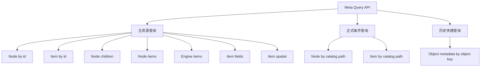
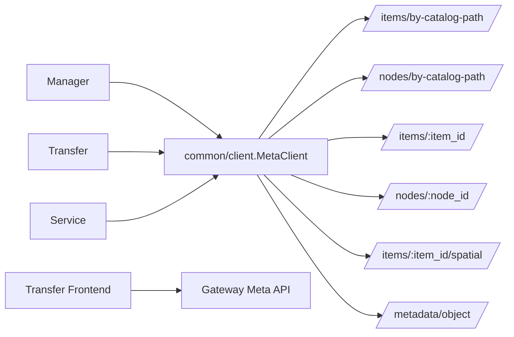
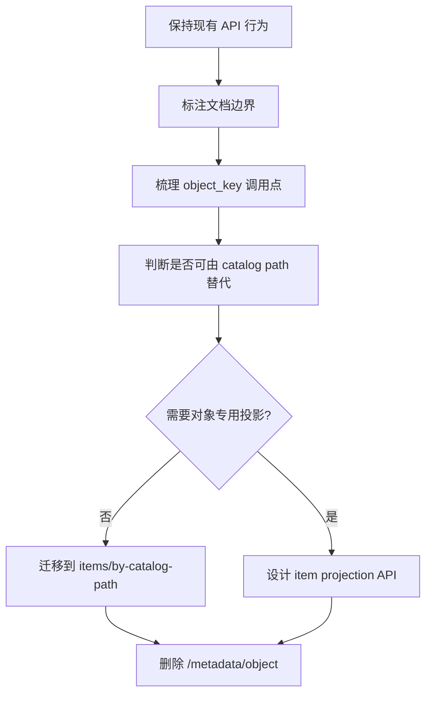

# Meta 查询 API 快捷入口收敛设计

## 背景

Meta 的扫描入口已经收敛到统一执行主线后，查询 API 也需要明确边界：

- 查询入口只能读取已经扫描和持久化的 Meta node / item / field / spatial metadata。
- 查询入口不能触发扫描、不能写 `attributes`、不能构建 `access_index`、不能创建 preprocessing artifact。
- 上层模块为了交互体验，可以通过 catalog path、object key 等条件做便捷查询，但这种便捷查询不能变成第二套元数据识别链路。

本文讨论的是 Meta 查询 API 的快捷入口收敛，不讨论 scan、item refresh、preprocessing、cleanup 和 MVT 派生产物。

## 查询入口分类

### 主资源查询

主资源查询以 Meta 已持久化资源的稳定标识为入口：

| API | 语义 |
| --- | --- |
| `GET /nodes/:node_id` | 查询单个 Meta node |
| `GET /nodes/:node_id/children` | 查询 node 子节点 |
| `GET /nodes/:node_id/items` | 查询 node 下 item |
| `GET /items/:item_id` | 查询单个 Meta item |
| `GET /items/:item_id/fields` | 查询 item 字段 |
| `GET /items/:item_id/spatial` | 查询 item 的 GIS-facing spatial metadata |
| `GET /engines/:engine_id/items` | 查询 engine 下 item 列表 |
| `GET /engines/:engine_id/tree` | 查询 engine 的 Meta tree 投影 |

这类 API 是 Meta 查询主线。上层在已经拿到 `node_id` 或 `item_id` 时，应优先使用这类入口。

### 正式条件查询

正式条件查询不是第二套资源模型，而是主资源查询的定位补充：

| API | 语义 | 当前必要性 |
| --- | --- | --- |
| `GET /nodes/by-catalog-path?engine_id=&catalog_path=` | 通过 engine + catalog path 定位 Meta node | Manager 目录、对象预览、服务发布等仍需要 |
| `GET /items/by-catalog-path?engine_id=&catalog_path=` | 通过 engine + catalog path 定位 Meta item | Manager、Service、Transfer 前后端仍需要 |

`catalog_path` 是 Meta 与 engine catalog path 对齐后的稳定定位条件，因此 `by-catalog-path` 可以作为正式查询能力保留。

### 历史快捷查询

`GET /metadata/object?engine_id=&object_key=` 当前语义是：通过对象存储的 `object_key` 查找已扫描的 object item。

它的问题不是“有副作用”，而是查询模型不够统一：

- 它以对象存储技术形态暴露查询入口，和 Meta node / item 主资源模型不在同一层。
- 它内部需要拆分 bucket / prefix / object name，再按历史节点结构逐段查询。
- 它返回的是 item，但 API 名称是 `metadata/object`，不如 `items/by-catalog-path` 清晰。

当前它仍是只读 API，不触发扫描、不写 attributes、不构建 access index，因此不需要在本轮强删。但它应被标记为待评估快捷入口，后续优先考虑迁移到 `items/by-catalog-path` 或更明确的 item 查询投影。

## 当前调用矩阵

| 调用方 | 当前用法 | 判断 |
| --- | --- | --- |
| Manager preview resolver | locator 中没有 id 时，通过 catalog path 定位 item/node | 合理，属于条件定位 |
| Manager metadata repository | object catalog path 到 Meta item/node 的映射 | 合理，但应坚持 catalog path 主线 |
| Manager metadata / embedding / quick view | 按表名或对象路径查询 item、spatial metadata | 合理，后续可逐步减少重复拼 path |
| Service query service | 服务发布、对象表识别、spatial metadata 查询 | 合理，依赖已扫描 metadata |
| Transfer execution / data source | 通过 item id 或 catalog path 查询已扫描 metadata | 合理，不能触发扫描写入 |
| common/client | 封装 Meta 查询 API | 合理，但 helper 名称必须表达只读查询语义 |

## 设计原则

1. `item_id` / `node_id` 是已定位资源的首选入口。
2. `engine_id + catalog_path` 是跨模块定位 node / item 的正式条件查询入口。
3. `object_key` 不应发展为新的 Meta 查询主键；对象存储路径应尽量归一到 catalog path。
4. 查询 API 只能读已存在的 Meta 状态；任何需要补充 attributes、index、thumbnail、MVT、embedding 的动作，都必须进入 scan / refresh / preprocessing 任务体系。
5. common/client helper 可以保留，但不能隐藏写行为，也不能把查询失败包装成隐式扫描。

## 收敛建议

### 保留 `by-catalog-path`

`/nodes/by-catalog-path` 和 `/items/by-catalog-path` 暂时作为正式 API 保留：

- 它们表达的是清晰的条件定位，不是历史兼容分支。
- Manager、Service、Transfer 对 catalog path 定位仍有真实依赖。
- 它们和 Meta 扫描后的 `full_name` / catalog path 规范是一致的。

后续优化重点不是删除这两个 API，而是减少上层各自拼接 catalog path 的重复逻辑。可以考虑把常见 locator 到 catalog path 的转换收敛到 common 或模块内的单一 helper。

### 标记 `/metadata/object` 为待评估快捷入口

`/metadata/object` 本轮不删除，但建议在后续迁移中处理：

- 若上层只需要定位 object item，应迁移为 `items/by-catalog-path`。
- 若上层需要对象 metadata 的特定投影，应设计为明确的 item projection，而不是继续扩大 `metadata/object`。
- 迁移前先核对 manager object catalog、common/client wrapper 和测试覆盖，避免破坏对象预览链路。

### 暂不新增新的快捷入口

本轮不建议新增类似下面的 API：

- `/metadata/table`
- `/metadata/file`
- `/metadata/spatial`
- `/objects/:object_key/metadata`

这些入口会把 engine / format / storage 的具体形态重新暴露到 Meta API 层，容易形成按类型分叉的查询体系。确有需要时，应优先通过 item/node 主资源、catalog path 条件查询或 locator 解析来解决。

## 后续迁移顺序

建议顺序：

1. 本轮只固化本文档，不改代码。
2. 下一轮若继续 Meta 查询 API 收敛，先补充 `/metadata/object` 的 Swagger 描述，明确它是只读历史快捷查询。
3. 再调研所有 object metadata 调用点，判断是否都能用 `items/by-catalog-path` 替代。
4. 能替代后，一次性迁移调用点、测试和 Swagger，再删除 `/metadata/object`，不保留双轨。

## 阶段结论

Meta 查询 API 的主线已经足够清晰：资源查询以 `node_id` / `item_id` 为主，跨模块定位以 `engine_id + catalog_path` 为正式条件查询。

`/metadata/object` 当前没有写入副作用，因此不是本轮必须阻断的问题；但它暴露了对象存储形态，不适合作为长期查询主线。后续应以专题迁移方式处理，迁移完成后删除旧入口。
