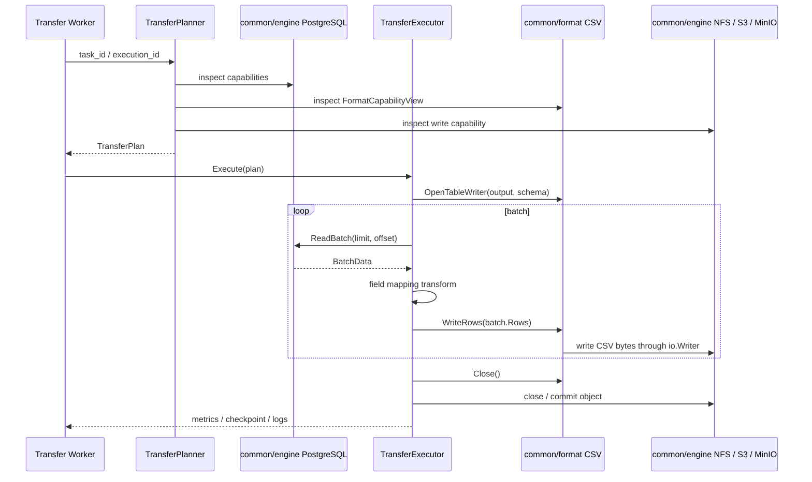

# Transfer 基于 common engine / format 的改造设计

更新时间：2026-05-16

本文是 Transfer 模块后续改造的讨论稿。当前口径采用 clean break：不保留旧任务 JSON 兼容，不保留 Transfer 私有 reader / writer 插件体系，优先补齐 common 中缺失的抽象和实现，再让 Transfer 只负责任务、规划、调度、执行状态和策略编排。

本文已吸收 [Transfer 数据类型与文件格式后续事项](transfer数据类型与文件格式后续事项.md) 的核心待办；后者后续只保留索引和最短未决清单。

稳定后的规则应按归属分别沉淀到 `docs/spec/`、`docs/concepts/`、`common/` 文档和 `transfer/docs/`。

## 背景

`common/engine` 和 `common/format` 已经完成一轮规整：

- `common/engine` 负责引擎连接、catalog、metadata、store、batch、query、transfer capability 等能力声明和实现入口。
- `common/format` 负责 format identity、descriptor、capability view、provider / reader、data type 信息、横切能力和内置格式注册。
- `common/resource` 已经有 `ResourceRef`、`ResourceReader`、`ComponentReader` 等最小资源读取抽象。

Transfer 原先通过自己的 `plugins/readers`、`plugins/writers` 和 `pipeline.ConnectorRegistry` 运行。这个体系在早期支撑了功能验证，但长期看会造成事实源分裂：

- engine 能力和 Transfer connector 能力重复表达。
- `common/format` 中面向 data type 的 provider / reader 与 Transfer 文件 reader / writer 重复实现。
- 高性能数据库读写、对象存储读写、文件格式编解码散落在 Transfer 私有插件里，无法被 Manager、Meta、Develop、Service 等模块复用。
- 任务配置里 `connector_type`、`engine_type`、`format`、`file_type`、`output_format` 混用，越兼容越难规整；其中最关键的问题是把 native table 这类引擎原生表示也写成 `format=table`，和 `common/format` 的 format identity 概念冲突。
- 前端、`ExecutionEngineService` 和 writer 内部都在做规划判断。

因此，本轮改造应把 Transfer 从“拥有 reader / writer 的执行框架”调整为“消费 common 能力的传输编排模块”。

## 核心判断

从长远看，所有可复用 reader / writer 都应放入 common，而不是留在 Transfer：

- engine-native reader / writer 归 `common/engine`，例如数据库批量读写、Kafka 消费 / 生产、CDC 订阅、对象存储流式读写、NFS 文件读写。
- 面向 data type 的 reader / writer 归 `common/format`，由 CSV、JSON、Parquet、Shapefile、PDF、图片等具体 format plugin 实现格式读取、写出、编码、解码。
- resource 组合和定位归 `common/resource`，例如 single resource、multi component、whole scope、range-aware 读取。
- Transfer 只负责把 source、target、policy、transform、mode 规划成可执行链路，并交给 worker 执行。

这意味着原 Transfer 私有 plugins 体系不作为长期架构保留。若 common 中暂时缺能力，应优先补 common；只有在“先走通一个新框架”的阶段，才允许极小范围临时 adapter，且 adapter 不能成为新事实源。

`common/format` 当前已经有 `FormatPlugin -> FormatDescriptor -> FormatCapabilityView` 主线。Transfer planner 应消费这条主线，但必须区分两类事实：

- `TransferRead` / `TransferWrite` 是 descriptor 中的传输适配声明，表示该格式适合作为 Transfer 的读入或写出格式。
- 实际能否执行，还要看当前进程是否加载了对应 data type reader / writer 实现，例如 `TableReaderProvider`、`TableSampleReader`、`ScopeTableProvider`、`TableWriterProvider`。

因此 planner 不能只看到 `TransferWrite=true` 就生成可执行计划。

## 目标

1. 不保留历史任务 JSON 兼容，重新定义清晰的 Transfer 任务配置。
2. 删除 Transfer 私有 reader / writer 插件体系的长期定位。
3. 将高性能读取、写入和格式编解码能力沉淀到 common。
4. 优先补齐 common 缺失的 transfer execution 抽象。
5. 保留 Transfer worker / Asynq 机制，作为任务调度、异步执行、日志、指标和重试的模块职责。
6. 先搭起 Transfer 新框架，至少走通一个端到端链路。
7. 让 Transfer 未来能处理 table 之外的数据类型，例如 document、media、container、graph。
8. 为实时数据、Kafka、CDC、流批一体留下明确扩展位置。

## 非目标

- 不为旧任务 JSON 做兼容解析。
- 不保留旧 `connector_type` 作为规划事实源。
- 不保留 Transfer 私有 reader / writer registry 作为长期机制。
- 不把 worker、任务表、执行历史、调度和日志下沉到 common。
- 不恢复 `format=geojson` 作为顶层格式。

## 职责边界

标准链路：

```text
Transfer task
  -> TransferPlanner
  -> TransferPlan
  -> common engine reader / writer
  -> common resource reader / writer
  -> common format data type reader / writer
  -> TransferExecutor
  -> worker logs / metrics / execution state
```

模块职责：

| 层 | 负责 | 不负责 |
|---|---|---|
| `common/engine` | 引擎连接、能力声明、catalog、metadata、store、batch、stream、CDC、query、native reader / writer | Transfer 任务、调度、执行历史 |
| `common/resource` | 资源定位、资源打开、range 读取、多组件组合、whole scope 枚举 | 格式解析、任务策略 |
| `common/format` | 格式身份、data type info、content reader、面向 data type 的 reader / writer、编码解码、格式级 transfer 能力 | engine 连接、worker 执行历史 |
| `transfer` | 任务配置、planner、policy、transform 编排、worker、checkpoint、日志、指标、重试、后处理、触发 Meta 扫描 | 具体 engine reader / writer、具体 data type reader / writer |

## 新任务 JSON

旧任务 JSON 不再兼容。新的任务配置以 source / target endpoint 为核心，显式表达 data item、engine、resource、data type、representation、format、mode 和 policy。

示例：PostgreSQL 表导出为 CSV 对象。

```json
{
  "mode": "batch",
  "source": {
    "engine": {
      "scope": "system",
      "id": 1
    },
    "resource": {
      "kind": "native_table",
      "path": {
        "schema": "public",
        "table": "roads"
      }
    },
    "data_type": "table",
    "representation": "native"
  },
  "target": {
    "engine": {
      "scope": "system",
      "id": 2
    },
    "resource": {
      "kind": "object",
      "path": {
        "bucket": "exports",
        "path": "roads.csv"
      }
    },
    "data_type": "table",
    "representation": "encoded",
    "format": "csv",
    "options": {
      "header": true,
      "delimiter": ","
    },
    "policy": {
      "write_mode": "overwrite"
    }
  },
  "batch_size": 10000
}
```

关键规则：

1. `source` / `target` 必须显式声明 endpoint。
2. `engine.id` 指向 System engine；`local_engines` 不再作为新架构入口，已从 Transfer 运行面删除。
3. `resource.kind` 表示资源形态，例如 `native_table`、`object`、`file`、`component_set`、`scope`、`topic`、`cdc_stream`。
4. `data_type` 表示平台数据类型，例如 `table`、`document`、`media`、`container`、`graph`。
5. `representation` 表示 endpoint 的内容表示方式：`native` 表示引擎原生表示，`encoded` 表示由某种文件 / 消息 / 内容格式编码。
6. `format` 只表示稳定 format identity，例如 `csv`、`json`、`parquet`、`shapefile`；native endpoint 不应强填 `format=table`。
7. GeoJSON 仍表达为 `format=json + spatial.target_encoding=geojson`。
8. Shapefile 表达为 `format=shapefile`，resource / writer 必须处理 multi component 提交。
9. `policy` 只表达任务策略，不表达 engine 或 format 能力。

## 当前实测状态

第一条链路已经作为 Transfer worker 的新主路径跑通：

```text
PostgreSQL native table
  -> common/engine BatchReadableProvider.ReadBatch(limit, offset)
  -> common/format CSV TableWriterProvider
  -> common/engine NFS ContentWritableProvider.CreateContent
  -> Transfer execution metrics / status
```

实测任务：

| 项 | 值 |
|---|---|
| source | System engine PostgreSQL，`public.yanshi` |
| target | System engine NFS，`yanshi_export_from_task.csv` |
| source rows | 73090 |
| output rows | 73091，含 CSV header |
| 输出文件 | `business/nfs/data/yanshi_export_from_task.csv` |

当前后端执行口径：

1. 新任务 JSON 是创建、更新、启动和 worker 执行的唯一入口。
2. `mode` 必填，当前只支持 `batch`。
3. `source.engine.scope` / `target.engine.scope` 必须为 `system`，`local_engines` 不再作为新入口。
4. 顶层或 endpoint 内出现旧字段 `connector_type`、`source_config`、`target_config`、`output_format`、`file_type`、`engine_id` 时直接拒绝。
5. `ExecutionEngineService` 不再对旧 pipeline 做执行兜底；当前执行服务只走 common planner + executor。
6. 前端任务创建、编辑和详情页已切到新 endpoint JSON；旧快速创建表单、旧 TaskWizard 和本地引擎管理页已删除。
7. Transfer 后端本地引擎 API、旧 transform API、私有 plugins、plugin loader、旧 pipeline connector registry 已删除；`/system-engines` 仅保留为只读 System engine 列表代理，用于前端选择系统引擎。

已修复的第一条链路问题：

| 问题 | 处理 |
|---|---|
| PostgreSQL 批次读取重复读取第一页 | `ReadSQLBatch` 使用 `opts.Offset`。 |
| worker 自动重试导致目标文件被反复覆盖 | Transfer queue 默认 `asynq.MaxRetry(0)`，失败重试后续应由任务 policy 显式表达。 |
| NFS 每批次写入时覆盖目标文件 | NFS `CreateContent()` 尊重 `WriteOptions.Overwrite`，同一次 writer 会话只打开一次目标。 |
| 成功 execution 保留旧 `error_details` | 成功完成时清空错误详情。 |

仍未完成：

- progress / checkpoint / batch-level logs 还只是最小状态。
- JSON / Parquet / Shapefile 等写侧 provider 还未补。
- PostgreSQL 数据库写侧 common writer 已补第一版，支持普通 batch insert 或 COPY 写入；`TableWritePreparer` 已支持 `create_if_not_exists` 和 `truncate_insert`；drop-create、schema evolution 和跨批次 COPY 会话仍未补。CSV / TSV file/object -> PostgreSQL native table 的 import 第一版已接入 Transfer 新主路径，PostgreSQL 目标默认使用 COPY 方法。
- CSV / TSV 已补 `TableReaderProvider`，Transfer import 优先使用连续 reader，不再通过 `TableSampleReader` 每批重新打开并重扫源文件；其他格式仍按需要逐步补。
- S3 / MinIO `ContentWritableProvider.CreateContent()` 已补第一版：先写 OS 临时文件，`Close()` 时 `PutObject`，后续需要升级为 multipart streaming。

## 已有 common 能力能否支撑第一步

结论：**不能完全支撑，但读侧可复用较多；第一步不应新增大而全的统一数据流框架，而应围绕“PostgreSQL table -> CSV -> NFS / S3”补最小缺口。**

### 当前已有能力

| 层 | 已有能力 | 当前可用于 Transfer 的部分 |
|---|---|---|
| `common/engine` | `BatchReadableProvider.ReadBatch()` | PostgreSQL、MySQL、ClickHouse、Doris、Spark SQL、MongoDB、Neo4j 已有读取实现，可先用 limit / offset 方式跑通 table batch read。 |
| `common/engine` | `ContentReadableProvider.OpenContent()`、`RangeReadableProvider.OpenRange()` | S3、MinIO、NFS 已有对象 / 文件读取，可作为 format provider 的输入。 |
| `common/engine` | `ContentWritableProvider.CreateContent()` | NFS、S3、MinIO 已有写入实现；S3 / MinIO 当前第一版为临时文件缓冲 + Close PutObject，后续升级 multipart streaming。 |
| `common/format` | `TableInfoProvider`、`TableReaderProvider`、`TableSampleReader`、`ComponentTableProvider`、`ScopeTableProvider` | CSV / TSV 已有连续 table reader；CSV、JSON、Parquet、Shapefile 等已有表信息和样本读取能力，可用于预览、验证、小批读取和部分迁移。 |
| `common/format` | `FormatDescriptor`、`FormatCapabilityView`、`TransferRead`、`TransferWrite`、implementation status | 可用于 planner 判断格式身份、默认 data type、layout、transfer 声明和当前进程已加载的 reader / provider 实现。 |
| `common/format` | `TableWriterProvider`、`TableWriter` | CSV / TSV 已有最小写出实现，可把 table rows 按 schema 字段顺序写成分隔文本。 |
| `common/format` | `DocumentTextReader`、`MediaInfoProvider`、`ContainerInfoProvider` | 可支撑 document / media / container 的信息和内容片段读取，但还不是完整传输执行能力。 |
| `common/resource` | `ResourceReader`、`RangeReader`、`ComponentReader` | 可把 engine content / range 能力适配成格式读取输入，multi 格式读取已有基础。 |

### 为什么还不够

| 需求 | 现有能力不足 |
|---|---|
| 连续批量读取表 | `BatchReadableProvider.ReadBatch()` 是单次 batch 调用，可以循环 offset / limit 跑通第一步，但缺少 server-side cursor、分区计划、稳定 checkpoint、schema 快照和高性能流式游标语义。 |
| 写入数据库表 | PostgreSQL 已实现 `BatchWritableProvider` 第一版，写入方法可选 ordinary insert 或 COPY；并通过 `TableWritePreparer` 支持 `create_if_not_exists` 和 `truncate_insert`。drop-create、schema evolution 和跨批次 COPY 会话仍待补。 |
| 写入对象存储 | S3 / MinIO 已有第一版 common 写 provider，但大文件场景仍需 multipart streaming、失败清理和更细的提交语义。 |
| data type 内容写出 | CSV / TSV 已有最小 `TableWriterProvider`；JSON / Parquet / Shapefile 等格式还没有 table writer provider。 |
| planner 能力判定 | `FormatCapabilityView` 已能表达声明能力和 writer implementation status；Transfer 已有第一条链路的最小 planner，并已接入 System engine resolver、worker 和真实任务入库；完整能力矩阵尚未补齐。 |
| 全量读取文件格式 | CSV / TSV 已补最小 `TableReaderProvider`；JSON / Parquet / Shapefile 等仍主要依赖 `TableSampleReader.SampleTable()` 或 component / scope sample，后续需要按真实链路补连续 reader 或更高性能 reader。 |
| 多组件写出 | `common/resource` 有 `ComponentReader`，但没有 `ComponentWriter`；Shapefile 这类 multi component 输出缺提交边界。 |
| stream / CDC | common engine 尚无 `StreamReadableProvider`、`CDCReadableProvider` 和 change event / offset 标准。 |

因此，第一阶段不新增“统一传输数据流”大框架，而是先补三个明确缺口：

1. **common engine 写侧**：S3 / MinIO `ContentWritableProvider` 已补第一版；PostgreSQL `BatchWritableProvider` 已补普通 batch insert 和 COPY batch write，`TableWritePreparer` 已补 `create_if_not_exists` / `truncate_insert`，后续补 drop-create、schema evolution 和跨批次 COPY 会话。
2. **common format table 读写侧**：CSV / TSV `TableReaderProvider` 和 `TableWriterProvider` 已补；后续按链路需要继续补 JSON / Parquet / Shapefile。
3. **Transfer 执行适配**：最小 `internal/planner` 和 `internal/executor` 已能把 table/native -> CSV/TSV encoded file/object 规划为 `BatchData` / `TableWriterProvider` / `CreateContent` 执行链路，并已接入 worker 和真实任务入库。

## 第一阶段最小增强

### 一、先不新增统一 RecordBatch

`common/engine/plugin.BatchData` 已经能表达第一阶段 table batch：

```go
type BatchData struct {
    Rows     []map[string]interface{}
    Fields   []FieldInfo
    Metadata map[string]interface{}
    Offset   int64
}
```

先沿用它作为第一阶段执行数据流，不新增 `RecordBatch`。原因：

- 当前第一条链路只处理 `data_type=table`。
- `BatchData` 已被多个 engine plugin 的 `ReadBatch()` 使用。
- 过早抽象 document / media / graph 的统一流，会把第一步复杂度拉高。

后续只有当 document chunk、media object、graph subgraph 或 CDC event 真正进入 Transfer executor，再新增更通用的 `common/transferio`。

### 二、读取侧先复用现有能力

第一阶段读取链路：

```text
engine BatchReadableProvider
  -> BatchData
  -> Transfer transform
```

文件格式读取链路暂不作为第一条主线；需要对象 / 文件输入时，先复用：

```text
engine ContentReadableProvider / RangeReadableProvider
  -> common/resource ResourceReader
  -> common/format TableReaderProvider / TableSampleReader / ScopeTableProvider / ComponentTableProvider
  -> BatchData adapter
```

当前已经把“连续读取 table rows”沉淀为最小 common format 接口：

```go
type TableReaderProvider interface {
    Provider
    OpenTableReader(ctx context.Context, input io.Reader, options *ParseOptions) (TableReader, error)
}

type TableReader interface {
    Schema() *TableInfo
    ReadRows(ctx context.Context, limit int) ([]map[string]interface{}, error)
    Close(ctx context.Context) error
}
```

`TableReaderProvider` 是面向 data type 的格式能力，不是 format 泛化 record reader；它只解决 table encoded content 的连续读取。CSV / TSV 已实现，Transfer import 优先使用该接口；provider 不存在时才退回 `TableSampleReader` 窗口读取。

这说明 `range reader` 和 `sample reader` 仍有价值，但它们不是完整替代品：

- range reader 只负责字节读取，不理解 table row。
- sample reader 只负责给定 offset / limit 的逻辑行窗口，不负责持久 reader 状态。
- Transfer executor 可以在缺少 `TableReaderProvider` 的格式上临时循环调用 sample reader；若某个格式进入正式导入链路，应优先给该格式补连续 reader 或更高性能 reader。

### 三、只补明确缺失的写侧接口

现有 `common/format` 缺的是“把 table batch 编码为具体格式输出”的能力。不要先引入 `FormatRecordReader` / `FormatRecordWriter` 这种过宽接口，第一步只补面向 table data type 的 writer：

```go
type TableWriterProvider interface {
    Provider
    OpenTableWriter(ctx context.Context, output io.Writer, schema *TableInfo, options *WriteOptions) (TableWriter, error)
}

type TableWriter interface {
    WriteRows(ctx context.Context, rows []map[string]interface{}) error
    Close(ctx context.Context) error
}
```

`TableWriterProvider` 是可注册的无状态能力入口，放在具体 format plugin 上；`TableWriter` 是一次输出会话的状态对象，由 provider 基于 `io.Writer` 打开。不要把 `Format()` 和 `OpenTable()` 放到同一个状态 writer 上，否则会和现有 `Provider` / registry 模式不一致。

注册侧需要同步补齐：

```go
func RegisterTableWriterProvider(provider TableWriterProvider) error
func GetTableWriterProvider(formatType FormatType) (TableWriterProvider, error)
```

能力发现侧需要补：

```go
type FormatImplementationStatus struct {
    // existing fields...
    TableWriterProvider bool `json:"table_writer_provider,omitempty"`
}
```

descriptor 中的 `TransferWrite` 继续表示“该格式适合作为 Transfer 写出格式”，不等于当前进程已经有 writer provider。

第一阶段只实现：

- CSV / TSV 插件实现 `TableWriterProvider`。
- JSON Lines 或 JSON array 插件实现 `TableWriterProvider` 可作为第二个。

别的模块如何用：

- Manager 如需导出当前预览结果，可复用 `TableWriterProvider`。
- Service 如需发布查询结果下载，可复用 `TableWriterProvider`。
- Transfer 只负责编排，不再拥有 table writer 实现。

### 四、补 common engine 写入实现

第一条链路需要把 CSV 写到文件或对象：

```text
common/format TableWriterProvider / TableWriter
  -> io.Writer
  -> common/engine ContentWritableProvider
```

当前：

- NFS 已有 `CreateContent()`。
- S3 / MinIO 已补 `CreateContent()` 第一版。

当前 S3 / MinIO 写入签名：

```go
func (p *S3Plugin) CreateContent(ctx context.Context, connInfo plugin.ConnectionInfo, path plugin.CatalogPath, opts plugin.WriteOptions) (io.WriteCloser, error)
```

实现暂时采用临时文件缓冲 + Close 时 PutObject，后续再升级 multipart streaming writer。

### 五、高性能能力按需要演进

高性能能力要进入 common，但不要一次性铺开。演进顺序：

| 阶段 | 当前不足 | 最小增强 | 受益模块 |
|---|---|---|---|
| 第一阶段 | 数据库写入无 common 实现 | PostgreSQL `BatchWritableProvider` 已补普通 batch insert / COPY batch write，`TableWritePreparer` 已补 `create_if_not_exists` / `truncate_insert` | Transfer、Service、Manager 导出回写 |
| 第二阶段 | PostgreSQL COPY 仍是逐 transfer batch 建立会话 | 增加跨批次 COPY 写入会话或批量 writer 生命周期 | Transfer、数据导入、批量服务 |
| 第三阶段 | `ReadBatch(limit, offset)` 大表性能一般 | 增加 cursor / partition read options | Transfer、Manager 大表预览、Service 批量读取 |
| 第四阶段 | 对象写入大文件内存压力 | S3 multipart `ContentWritableProvider` | Transfer、Manager 导出、文件生成任务 |
| 第五阶段 | 部分文件格式全量读取仍靠 sample 循环 | 针对确有需要的格式补 `TableReaderProvider` 或专用高性能 reader，例如 Parquet row group reader | Transfer、Manager 大文件预览 |

优先补齐的格式能力：

| 格式 | Reader | Writer | 说明 |
|---|---|---|---|
| CSV / TSV | 已有 `TableReaderProvider`，`TableSampleReader` 保留用于预览 / 窗口读取 | 已有最小 `TableWriterProvider` | 第一条链路。 |
| JSON / JSONL / GeoJSON encoding | 现有 `TableSampleReader` / `DocumentTextReader` | 第二阶段由插件补 `TableWriterProvider`，GeoJSON 作为 spatial encoding | 空间表导出。 |
| Parquet | 现有 table / scope sample | 后续由插件补 `TableWriterProvider` 和必要的批量 reader | 大数据传输核心格式。 |
| Shapefile | 现有 component sample | 后续由插件补 table / component 写出能力 | multi component 输出。 |
| Excel / SQLite / GeoPackage | 现有容器 / child 能力 | 后续按 child table 转出 | 容器局部传输。 |
| Document / Media raw | 现有 info / text / media metadata | 先用 engine content read/write 做 raw copy | table 之外的第一步。 |

### 六、resource writer / component writer

`common/resource` 当前以读取抽象为主。Transfer 写出需要补写入侧抽象：

```go
type ResourceWriter interface {
    Create(ctx context.Context, ref ResourceRef, opts WriteOptions) (io.WriteCloser, error)
    Commit(ctx context.Context, refs []ResourceRef, opts CommitOptions) error
    Abort(ctx context.Context, refs []ResourceRef) error
}

type ComponentWriter interface {
    CreateComponent(ctx context.Context, component ComponentRef, opts WriteOptions) (io.WriteCloser, error)
    CommitComponents(ctx context.Context, components []ComponentRef, opts CommitOptions) error
    AbortComponents(ctx context.Context, components []ComponentRef) error
}
```

这能把 Shapefile、压缩包、manifest table、多文件 Parquet 等提交边界从 Transfer 私有 writer 中移出。

第一阶段如果只做 CSV 单文件输出，可以暂不补 `ComponentWriter`，等 Shapefile / multi Parquet 进入实施时再补。

## 第一条链路能力差距图



图中已经具备的是：

- PostgreSQL `ReadBatch()`。
- NFS `CreateContent()`。
- CSV descriptor、capability view、table schema / sample parser。
- `transfer/backend/internal/planner` 已有第一条链路的最小 `BuildTableExportPlan()`，支持 native table -> encoded table file/object，并提供 System engine resolver。
- `transfer/backend/internal/executor` 已有最小 `TableExportExecutor`，支持 registry 构造和注入式单测。
- `ExecutionEngineService` 已有新任务 JSON 的唯一执行入口：直接走 common planner + executor。

缺失的是：

- 更完整的执行日志、checkpoint、progress 回写。
- PostgreSQL 跨批次 COPY 写入会话、drop-create、schema evolution；MySQL 等其他数据库写侧 common writer。
- JSON / Parquet / Shapefile 等更多 `TableWriterProvider`。

## TransferPlanner 设计

`TransferPlanner` 输入新任务 JSON、System engine、Meta item、common engine capability view、common format capability view，输出 `TransferPlan`。

概念结构：

```go
type TransferPlan struct {
    TaskID      uint
    ExecutionID uint
    Mode        string
    Source      EndpointPlan
    Target      EndpointPlan
    Transforms  []TransformPlan
    Policy      TransferPolicy
}

type EndpointPlan struct {
    Role         string
    Engine       EnginePlan
    Resource     ResourcePlan
    DataItem     *DataItemPlan
    DataType     string
    Representation string
    Format       string
    Organization string
    Spatial      *SpatialPlan
    Reader       *ReaderPlan
    Writer       *WriterPlan
}

type ReaderPlan struct {
    Layer string // engine_native / resource_format / stream / cdc
    Kind  string // table_batch / object_stream / component_table / kafka_stream / cdc_events
}

type WriterPlan struct {
    Layer string // engine_native / format_resource / stream
    Kind  string // table_batch / object_format / component_format / kafka_stream
}
```

Planner 只做规划，不执行读写。

Planner 规则：

1. 根据 `engine.id` 读取 System engine 和 capabilities。
2. 根据 `data_item_id` 或 `resource` 获取 Meta item attributes；有 Meta item 时优先使用已入库事实。
3. 根据 `representation` 分流：`native` endpoint 只校验 engine native 能力，`encoded` endpoint 必须校验 `format`。
4. 对 `encoded` endpoint 读取 `FormatCapabilityView`，校验 descriptor 的 `data_type`、layout、`TransferRead` / `TransferWrite`、engine family 是否满足任务。
5. 再校验 implementation status：读取侧优先需要对应 `TableReaderProvider`，预览 / 局部场景可用 `TableSampleReader`、`ComponentTableProvider`、`ScopeTableProvider` 或其他 data type reader；写出侧需要 `TableWriterProvider` 等实际 writer provider。
6. 校验 engine 是否具备对应 read / write / stream / cdc / batch 能力。
7. 根据 `mode` 选择 batch、stream、micro-batch 或 cdc 执行链。
8. 根据 `policy` 生成提交、覆盖、失败回滚、checkpoint 策略。
9. 根据 source / target data type 判断是否允许转换。

## TransferExecutor 与 worker

worker 机制保留：

```text
Asynq job(task_id, execution_id)
  -> ExecutionService
  -> TransferPlanner.BuildPlan()
  -> TransferExecutor.Execute(plan)
  -> 更新 execution 日志 / 指标 / checkpoint
```

`TransferExecutor` 取代旧 pipeline 的长期位置，但可以借鉴旧 pipeline 的优点：

- 批次循环。
- transform 链。
- checkpoint。
- metrics。
- progress callback。
- postprocessor callback。

长期执行器不再通过 `ConnectorRegistry` 创建 reader / writer，而是通过 plan 指向 common engine / resource / format 能力。

## 先走通一个链路

建议第一条链路选择：

```text
PostgreSQL native table
  -> common engine TableBatchReader
  -> Transfer field mapping transform
  -> common format TableWriterProvider / TableWriter implemented by CSV plugin
  -> common engine object/file ResourceWriter
```

原因：

- 数据类型是 table，最容易验证。
- PostgreSQL 和 CSV 都已有较多现成代码可迁移。
- 输出到 S3 / MinIO 或 NFS 都能验证 resource writer 抽象。
- 不涉及 multi component 和空间编码的复杂性。

第二条链路建议：

```text
PostgreSQL spatial table
  -> common engine TableBatchReader
  -> spatial encoding transform
  -> common format TableWriterProvider / TableWriter implemented by JSON plugin with spatial.target_encoding=geojson
  -> common engine object/file ResourceWriter
```

第三条链路建议：

```text
Object Parquet
  -> common engine ContentReadableProvider / RangeReadableProvider
  -> common resource reader
  -> common format Parquet reader
  -> common engine TableBatchWriter
```

## Table 之外的数据类型

Transfer 不应只面向 table，但不同 data type 的“传输”含义不同。

| Data type | 第一阶段能力 | 长期能力 |
|---|---|---|
| `table` | 批量读写、字段映射、格式转换、空间编码 | 分区并行、统计驱动、schema evolution、CDC merge。 |
| `document` | raw / range copy，文档格式保持不变 | 文档转文本、文本索引导出、PDF/DOCX/Markdown 互转、批量摘要产物。 |
| `media` | raw / range copy，metadata 保留 | 缩略图、转码、格式转换、EXIF / 空间信息保留。 |
| `container` | 外层 raw copy，或 child table 选择性导出 | Excel sheet、SQLite table、GeoPackage layer、ZIP entry 的局部传输和重组。 |
| `graph` | 引擎原生导入导出或查询结果 table 化 | 子图导出、GraphML/GEXF/RDF/JSON-LD 转换。 |

设计要求：

1. `TransferPlan` 必须显式带 `data_type`。
2. transform 必须声明输入 / 输出 data type。
3. data type reader / writer 必须声明自身支持的 data type，并由具体 format plugin 声明支持的 format / data type 组合。
4. 不同 data type 之间的转换必须是显式 transform，例如 document -> table、container child -> table、graph -> table。

## 实时数据、Kafka 和 CDC

Transfer 未来应支持三类非一次性批任务：

### Stream

适用 Kafka、消息队列、WebSocket、持续追加日志等。

任务示例：

```json
{
  "mode": "stream",
  "source": {
    "engine": {"scope": "system", "id": 10},
    "resource": {"kind": "topic", "path": "orders"},
    "data_type": "table",
    "representation": "encoded",
    "format": "json"
  },
  "target": {
    "engine": {"scope": "system", "id": 11},
    "resource": {"kind": "native_table", "path": {"schema": "public", "table": "orders"}},
    "data_type": "table",
    "representation": "native",
    "policy": {"write_mode": "append"}
  }
}
```

需要 common engine 提供：

- `StreamReadableProvider`
- `StreamWritableProvider`
- offset / partition checkpoint
- at-least-once / exactly-once 能力声明

### Micro-batch

适用对象存储增量、按时间窗口拉取、Kafka 小批量落库。

要求：

- planner 将 `mode=micro-batch` 转成窗口计划。
- executor 按窗口循环执行 batch 子计划。
- checkpoint 保存窗口位置和 source offset。

### CDC

适用 PostgreSQL WAL、MySQL binlog、MongoDB change stream 等。

CDC 不应伪装成普通 table batch。建议新增 change event 抽象：

```go
type ChangeEvent struct {
    Operation string // insert / update / delete / ddl
    Before    map[string]any
    After     map[string]any
    Key       map[string]any
    Timestamp time.Time
    Offset    StreamOffset
}
```

需要 common engine 提供：

- `CDCReadableProvider`
- source offset / LSN / binlog position checkpoint
- schema change event 表达
- snapshot + incremental 两阶段读取

Transfer planner 根据目标 policy 决定：

- append change log。
- merge / upsert 到目标表。
- publish 到 Kafka。
- 写成 Iceberg / Parquet 增量文件。

## 原 Transfer plugins 体系处理

结论：不保留长期价值。

处理策略：

1. 能迁入 `common/engine` 的迁入 `common/engine`。
2. 能迁入 `common/format` 的迁入 `common/format`。
3. 只属于任务编排的留在 Transfer，例如任务、planner、executor、checkpoint、execution metrics；旧 pipeline transform / postprocessor 不再作为新主路径保留。
4. `transfer/backend/plugins/readers`、`transfer/backend/plugins/writers`、`pkg/plugin_loader`、旧 `pkg/pipeline` 已删除。
5. 不再新增 Transfer 私有 reader / writer。

归属建议：

| 旧组件 | 新归属 |
|---|---|
| JDBC Reader / Writer | `common/engine` table batch reader / writer |
| Postgres COPY Writer | `common/engine/plugins/postgresql` 高性能 batch writer |
| S3 Reader / Writer | `common/engine/plugins/s3` content/resource reader / writer |
| NFS Writer | `common/engine/plugins/nfs` content/resource writer |
| CSV Reader / Writer | `common/format/plugins/csv` 实现 `TableReaderProvider` / `TableSampleReader` / `TableWriterProvider` |
| JSON / JSONL / GeoJSON Reader / Writer | `common/format/plugins/json` 实现 table / document 相关 data type 能力，GeoJSON 作为 spatial encoding |
| Parquet Reader / Writer | `common/format/plugins/parquet` 实现 table 相关 data type 能力 |
| Shapefile Reader / Writer | `common/format/plugins/shapefile` 实现 table 相关 data type 能力，并配合 component 写出能力 |
| GeoPackage / SpatiaLite Reader | `common/format/plugins/sqlite` / geopackage 子能力 |

## 分阶段实施建议

### 阶段一：稳定新规范和最小 common 缺口

1. 修订相关 concept / spec 文档，明确 Transfer 不再拥有 reader / writer。
2. 定义新任务 JSON。
3. 不新增通用 `RecordBatch`，第一阶段沿用 `common/engine/plugin.BatchData`。
4. `common/format` 最小 `TableWriterProvider` / `TableWriter` 和 writer implementation status 已补，先覆盖 CSV / TSV。
5. 在 `common/engine/plugins/s3` 和 `minio` 中补 `CreateContent()` 第一版；后续升级 multipart streaming。
6. 明确 PostgreSQL `BatchReadableProvider` 的第一阶段循环读取方式。

### 阶段二：补 common 第一条链路能力

1. 复用 PostgreSQL `ReadBatch()` 作为 table batch reader。
2. CSV / TSV 插件已实现 `TableWriterProvider` / `TableWriter`。
3. NFS、S3、MinIO `CreateContent()`。
4. 必要的 schema / type mapper 转换。
5. PostgreSQL `BatchWritableProvider` 已补普通 append / insert 和 COPY batch write，`TableWritePreparer` 已补 `create_if_not_exists` / `truncate_insert`，CSV / TSV file/object -> PostgreSQL native table 已接入第一版 import；drop-create、跨批次 COPY 会话后续补。

### 阶段三：搭 Transfer 新框架

1. `internal/planner` 已有最小 table export planner，先只覆盖 `source=data_type:table, representation:native` 到 `target=data_type:table, representation:encoded, format:csv/tsv`。
2. `internal/executor` 已有最小 table export executor，使用 common engine `BatchReadableProvider` / `ContentWritableProvider` 和 common format `TableWriterProvider`。
3. System engine resolver 已补，新任务 JSON 入库、更新和启动前校验已补。
4. worker / `ExecutionEngineService` 已接入 planner + executor，并回写基础 records metrics；待补 checkpoint、progress 和更完整日志。
5. PostgreSQL table -> CSV -> NFS file 已在真实环境跑通，前端创建 / 编辑 / 详情页已切到新规范；S3 / MinIO 写侧第一版、PostgreSQL 普通 batch writer、CSV/TSV -> PostgreSQL import 第一版和旧本地引擎 / pipeline / plugins 删除也已完成。

### 阶段四：扩展格式和空间链路

1. JSON writer 支持 `spatial.target_encoding=geojson`。
2. Parquet writer 迁入 common；Parquet reader 先复用现有 sample / scope provider，进入正式导入链路时补 `TableReaderProvider` 或 row group reader。
3. Shapefile component writer 迁入 common。
4. 删除对应 Transfer 私有插件。

### 阶段五：扩展 data type 和实时链路

1. document / media raw copy。
2. container child table 传输。
3. Kafka stream。
4. PostgreSQL / MySQL CDC。

### 阶段六：删除旧实现

已完成：

1. 删除 TaskDetail 的 worker config 复制逻辑。
2. 删除 Transfer 本地引擎管理前端入口和后端 local engine API。
3. 删除 Transfer plugins、plugin loader、旧 pipeline connector registry、旧 transform API。
4. 旧任务 JSON 字段不作为入口支持，仅在 planner 中保留显式拒绝列表和测试。

后续：

1. 根据新主路径继续清理不再需要的字段映射 UI / API，或将字段映射改造成新 planner transform。
2. 更新 `transfer/docs/` 和稳定 spec。

## 待讨论问题

1. 字段映射是否继续作为独立 UI / API 保留，还是改造成新 planner 的显式 transform？
2. Shapefile 输出到对象存储应落 multi component，还是落 zip 容器？从 data item 规范看更推荐 multi component，但对象存储用户体验可能偏向 zip。
3. CDC 的 change event 是新 data type，还是 table 的 stream event 表达？初步倾向不新增 data type，作为 stream payload / capability 表达。
4. `TransferPlan` 是否写入 execution snapshot？初步建议写入，便于排障和复现。
5. 何时引入更通用的 `RecordBatch` / `common/transferio`？建议等第二个 data type 或 CDC 实施时再定。

## 与现有 next 文档的关系

本文替代 `docs/next/transfer数据类型与文件格式后续事项.md` 中“兼容旧执行面”的隐含假设，并进一步明确：

- Transfer 不再只按 connector type 或具体格式名路由。
- `ExecutionEngineService` 里的 connector 推断逻辑不迁移成兼容 planner，而是由新任务 JSON 和 common capability 取代。
- `TransferPlan` 必须拆分 source / target 的 engine、resource、data_type、representation、format、spatial、policy。
- `mode` 由 planner 和 executor 统一处理，并覆盖 batch、stream、micro-batch、CDC。
- `geojson` 口径保持 `format=json + spatial.target_encoding=geojson`。
