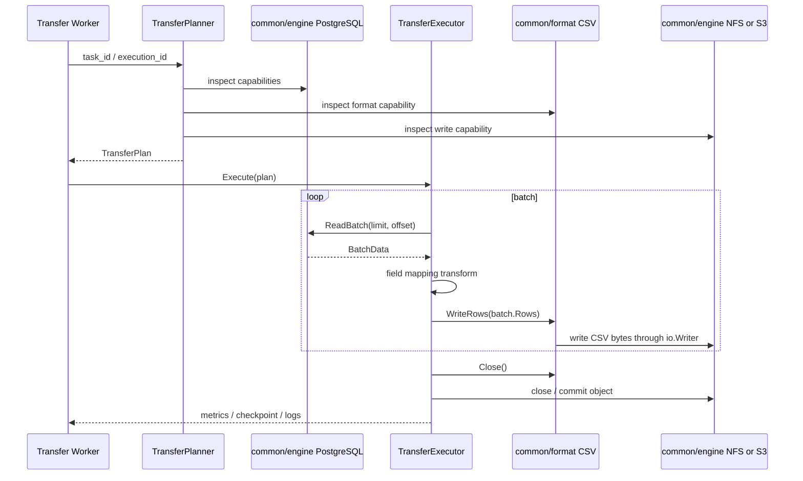

# Transfer 基于 common engine / format 的改造设计

更新时间：2026-05-15

本文是 Transfer 模块后续改造的讨论稿。当前口径采用 clean break：不保留旧任务 JSON 兼容，不保留 Transfer 私有 reader / writer 插件体系，优先补齐 common 中缺失的抽象和实现，再让 Transfer 只负责任务、规划、调度、执行状态和策略编排。

本文已吸收 [Transfer 数据类型与文件格式后续事项](transfer数据类型与文件格式后续事项.md) 的核心待办；后者后续只保留索引和最短未决清单。

稳定后的规则应按归属分别沉淀到 `docs/spec/`、`docs/concepts/`、`common/` 文档和 `transfer/docs/`。

## 背景

`common/engine` 和 `common/format` 已经完成一轮规整：

- `common/engine` 负责引擎连接、catalog、metadata、store、batch、query、transfer capability 等能力声明和实现入口。
- `common/format` 负责 format identity、format capability、provider / reader、data type 信息、横切能力和内置格式注册。
- `common/resource` 已经有 `ResourceRef`、`ResourceReader`、`ComponentReader` 等最小资源读取抽象。

Transfer 目前仍通过自己的 `plugins/readers`、`plugins/writers` 和 `pipeline.ConnectorRegistry` 运行。这个体系在早期支撑了功能验证，但长期看会造成事实源分裂：

- engine 能力和 Transfer connector 能力重复表达。
- `common/format` 中面向 data type 的 provider / reader 与 Transfer 文件 reader / writer 重复实现。
- 高性能数据库读写、对象存储读写、文件格式编解码散落在 Transfer 私有插件里，无法被 Manager、Meta、Develop、Service 等模块复用。
- 任务配置里 `connector_type`、`engine_type`、`format`、`file_type`、`output_format` 混用，越兼容越难规整。
- 前端、`ExecutionEngineService` 和 writer 内部都在做规划判断。

因此，本轮改造应把 Transfer 从“拥有 reader / writer 的执行框架”调整为“消费 common 能力的传输编排模块”。

## 核心判断

从长远看，所有可复用 reader / writer 都应放入 common，而不是留在 Transfer：

- engine-native reader / writer 归 `common/engine`，例如数据库批量读写、Kafka 消费 / 生产、CDC 订阅、对象存储流式读写、NFS 文件读写。
- 面向 data type 的 reader / writer 归 `common/format`，由 CSV、JSON、Parquet、Shapefile、PDF、图片等具体 format plugin 实现格式读取、写出、编码、解码。
- resource 组合和定位归 `common/resource`，例如 single resource、multi component、whole scope、range-aware 读取。
- Transfer 只负责把 source、target、policy、transform、mode 规划成可执行链路，并交给 worker 执行。

这意味着原 Transfer 私有 plugins 体系不作为长期架构保留。若 common 中暂时缺能力，应优先补 common；只有在“先走通一个新框架”的阶段，才允许极小范围临时 adapter，且 adapter 不能成为新事实源。

## 目标

1. 不保留历史任务 JSON 兼容，重新定义清晰的 Transfer 任务配置。
2. 删除 Transfer 私有 reader / writer 插件体系的长期定位。
3. 将高性能读取、写入和格式编解码能力沉淀到 common。
4. 优先补齐 common 缺失的 transfer execution 抽象。
5. 保留 Transfer worker / Asynq 机制，作为任务调度、异步执行、日志、指标和重试的模块职责。
6. 先搭起 Transfer 新框架，至少走通一个端到端链路。
7. 让 Transfer 未来能处理 table 之外的数据类型，例如 document、media、container、graph。
8. 为实时数据、Kafka、CDC、流批一体留下明确扩展位置。

## 非目标

- 不为旧任务 JSON 做兼容解析。
- 不保留旧 `connector_type` 作为规划事实源。
- 不保留 Transfer 私有 reader / writer registry 作为长期机制。
- 不把 worker、任务表、执行历史、调度和日志下沉到 common。
- 不恢复 `format=geojson` 作为顶层格式。

## 职责边界

标准链路：

```text
Transfer task
  -> TransferPlanner
  -> TransferPlan
  -> common engine reader / writer
  -> common resource reader / writer
  -> common format data type reader / writer
  -> TransferExecutor
  -> worker logs / metrics / execution state
```

模块职责：

| 层 | 负责 | 不负责 |
|---|---|---|
| `common/engine` | 引擎连接、能力声明、catalog、metadata、store、batch、stream、CDC、query、native reader / writer | Transfer 任务、调度、执行历史 |
| `common/resource` | 资源定位、资源打开、range 读取、多组件组合、whole scope 枚举 | 格式解析、任务策略 |
| `common/format` | 格式身份、data type info、content reader、面向 data type 的 reader / writer、编码解码、格式级 transfer 能力 | engine 连接、worker 执行历史 |
| `transfer` | 任务配置、planner、policy、transform 编排、worker、checkpoint、日志、指标、重试、后处理、触发 Meta 扫描 | 具体 engine reader / writer、具体 data type reader / writer |

## 新任务 JSON

旧任务 JSON 不再兼容。新的任务配置以 source / target endpoint 为核心，显式表达 data item、engine、resource、data type、format、mode 和 policy。

示例：PostgreSQL 表导出为 GeoJSON 对象。

```json
{
  "mode": "batch",
  "source": {
    "engine": {
      "scope": "system",
      "id": 1
    },
    "resource": {
      "kind": "native_table",
      "path": {
        "schema": "public",
        "table": "roads"
      }
    },
    "data_type": "table",
    "format": "table"
  },
  "target": {
    "engine": {
      "scope": "system",
      "id": 2
    },
    "resource": {
      "kind": "object",
      "path": "exports/roads.geojson"
    },
    "data_type": "table",
    "format": "json",
    "spatial": {
      "geometry_fields": ["geom"],
      "target_encoding": "geojson"
    },
    "policy": {
      "write_mode": "overwrite"
    }
  },
  "transforms": [
    {
      "type": "field_mapping",
      "mappings": [
        {"source": "id", "target": "id"},
        {"source": "geom", "target": "geom"}
      ]
    }
  ]
}
```

关键规则：

1. `source` / `target` 必须显式声明 endpoint。
2. `engine.id` 指向 System engine；`local_engines` 不再作为新架构入口，后续应统一迁入 System。
3. `resource.kind` 表示资源形态，例如 `native_table`、`object`、`file`、`component_set`、`scope`、`topic`、`cdc_stream`。
4. `data_type` 表示平台数据类型，例如 `table`、`document`、`media`、`container`、`graph`。
5. `format` 表示稳定 format identity，例如 `table`、`csv`、`json`、`parquet`、`shapefile`。
6. GeoJSON 仍表达为 `format=json + spatial.target_encoding=geojson`。
7. Shapefile 表达为 `format=shapefile`，resource / writer 必须处理 multi component 提交。
8. `policy` 只表达任务策略，不表达 engine 或 format 能力。

## 已有 common 能力能否支撑第一步

结论：**不能完全支撑，但读侧可复用较多；第一步不应新增大而全的统一数据流框架，而应围绕“PostgreSQL table -> CSV -> NFS / S3”补最小缺口。**

### 当前已有能力

| 层 | 已有能力 | 当前可用于 Transfer 的部分 |
|---|---|---|
| `common/engine` | `BatchReadableProvider.ReadBatch()` | PostgreSQL、MySQL、ClickHouse、Doris、Spark SQL、MongoDB、Neo4j 已有读取实现，可先用 limit / offset 方式跑通 table batch read。 |
| `common/engine` | `ContentReadableProvider.OpenContent()`、`RangeReadableProvider.OpenRange()` | S3、MinIO、NFS 已有对象 / 文件读取，可作为 format provider 的输入。 |
| `common/engine` | `ContentWritableProvider.CreateContent()` | NFS 已有写入实现；S3 / MinIO 写入侧目前缺 common provider。 |
| `common/format` | `TableInfoProvider`、`TableSampleReader`、`ComponentTableProvider`、`ScopeTableProvider` | CSV、JSON、Parquet、Shapefile 等已有表信息和样本读取能力，可用于预览、验证、小批读取和部分迁移。 |
| `common/format` | `DocumentTextReader`、`MediaInfoProvider`、`ContainerInfoProvider` | 可支撑 document / media / container 的信息和内容片段读取，但还不是完整传输执行能力。 |
| `common/resource` | `ResourceReader`、`RangeReader`、`ComponentReader` | 可把 engine content / range 能力适配成格式读取输入，multi 格式读取已有基础。 |

### 为什么还不够

| 需求 | 现有能力不足 |
|---|---|
| 连续批量读取表 | `BatchReadableProvider.ReadBatch()` 是单次 batch 调用，可以循环 offset / limit 跑通第一步，但缺少 server-side cursor、分区计划、稳定 checkpoint、schema 快照和高性能流式游标语义。 |
| 写入数据库表 | `BatchWritableProvider` 接口已有，但当前没有实际实现；PostgreSQL COPY writer 仍在 Transfer 私有插件里。 |
| 写入对象存储 | `ContentWritableProvider` 只有 NFS 实现；S3 / MinIO 目前没有 common 写 provider。 |
| data type 内容写出 | `common/format` 有 info provider / sample reader，但没有面向 table 等 data type 的标准 writer 接口。 |
| 全量读取文件格式 | `TableSampleReader.SampleTable()` 语义是样本 / 窗口读取，不是长期持有状态的 reader。它可用于第一步的简单循环或验证，但对大文件连续传输、checkpoint、错误恢复不够清晰。 |
| 多组件写出 | `common/resource` 有 `ComponentReader`，但没有 `ComponentWriter`；Shapefile 这类 multi component 输出缺提交边界。 |
| stream / CDC | common engine 尚无 `StreamReadableProvider`、`CDCReadableProvider` 和 change event / offset 标准。 |

因此，第一阶段不新增“统一传输数据流”大框架，而是先补三个明确缺口：

1. **common engine 写侧**：S3 / MinIO `ContentWritableProvider`，PostgreSQL `BatchWritableProvider` 或 COPY batch writer。
2. **common format 写侧**：由 CSV 插件实现的 `TableWriter`。
3. **Transfer 执行适配**：用现有 `BatchData` / `TableSampleReader` / `CreateContent` 先跑通 table batch 到 CSV 文件。

## 第一阶段最小增强

### 一、先不新增统一 RecordBatch

`common/engine/plugin.BatchData` 已经能表达第一阶段 table batch：

```go
type BatchData struct {
    Rows     []map[string]interface{}
    Fields   []FieldInfo
    Metadata map[string]interface{}
    Offset   int64
}
```

先沿用它作为第一阶段执行数据流，不新增 `RecordBatch`。原因：

- 当前第一条链路只处理 `data_type=table`。
- `BatchData` 已被多个 engine plugin 的 `ReadBatch()` 使用。
- 过早抽象 document / media / graph 的统一流，会把第一步复杂度拉高。

后续只有当 document chunk、media object、graph subgraph 或 CDC event 真正进入 Transfer executor，再新增更通用的 `common/transferio`。

### 二、读取侧先复用现有能力

第一阶段读取链路：

```text
engine BatchReadableProvider
  -> BatchData
  -> Transfer transform
```

文件格式读取链路暂不作为第一条主线；需要对象 / 文件输入时，先复用：

```text
engine ContentReadableProvider / RangeReadableProvider
  -> common/resource ResourceReader
  -> common/format TableSampleReader / ScopeTableProvider / ComponentTableProvider
  -> BatchData adapter
```

这说明 `range reader` 和 `sample reader` 有价值，但它们不是完整替代品：

- range reader 只负责字节读取，不理解 table row。
- sample reader 只负责给定 offset / limit 的逻辑行窗口，不负责持久 reader 状态。
- Transfer executor 可以先封装一个轻量 adapter 循环调用它们；若性能和 checkpoint 不够，再沉淀为 common 格式批量 reader。

### 三、只补明确缺失的写侧接口

现有 `common/format` 缺的是“把 table batch 编码为具体格式输出”的能力。不要先引入 `FormatRecordReader` / `FormatRecordWriter` 这种过宽接口，第一步只补面向 table data type 的 writer：

```go
type TableWriter interface {
    Format() FormatType
    OpenTable(ctx context.Context, output io.Writer, schema *TableInfo, options *WriteOptions) error
    WriteRows(ctx context.Context, rows []map[string]interface{}) error
    Close(ctx context.Context) error
}
```

第一阶段只实现：

- CSV / TSV 插件实现 `TableWriter`。
- JSON Lines 或 JSON array 插件实现 `TableWriter` 可作为第二个。

别的模块如何用：

- Manager 如需导出当前预览结果，可复用 `TableWriter`。
- Service 如需发布查询结果下载，可复用 `TableWriter`。
- Transfer 只负责编排，不再拥有 table writer 实现。

### 四、补 common engine 写入实现

第一条链路需要把 CSV 写到文件或对象：

```text
common/format TableWriter
  -> io.Writer
  -> common/engine ContentWritableProvider
```

当前：

- NFS 已有 `CreateContent()`。
- S3 / MinIO 缺 `CreateContent()`。

所以第一阶段补：

```go
func (p *S3Plugin) CreateContent(ctx context.Context, connInfo plugin.ConnectionInfo, path plugin.CatalogPath, opts plugin.WriteOptions) (io.WriteCloser, error)
```

实现可以先用临时缓冲 + Close 时 PutObject，后续再升级 multipart streaming writer。

### 五、高性能能力按需要演进

高性能能力要进入 common，但不要一次性铺开。演进顺序：

| 阶段 | 当前不足 | 最小增强 | 受益模块 |
|---|---|---|---|
| 第一阶段 | 数据库写入无 common 实现 | PostgreSQL `BatchWritableProvider`，可先普通 batch insert | Transfer、Service、Manager 导出回写 |
| 第二阶段 | PostgreSQL 高性能 COPY 在 Transfer 私有插件 | 把 COPY writer 迁入 `common/engine/plugins/postgresql` | Transfer、数据导入、批量服务 |
| 第三阶段 | `ReadBatch(limit, offset)` 大表性能一般 | 增加 cursor / partition read options | Transfer、Manager 大表预览、Service 批量读取 |
| 第四阶段 | 对象写入大文件内存压力 | S3 multipart `ContentWritableProvider` | Transfer、Manager 导出、文件生成任务 |
| 第五阶段 | 文件格式全量读取靠 sample 循环不优雅 | 针对确有需要的格式补批量 reader，例如 Parquet row group reader | Transfer、Manager 大文件预览 |

优先补齐的格式能力：

| 格式 | Reader | Writer | 说明 |
|---|---|---|---|
| CSV / TSV | 现有 `TableSampleReader` 可读窗口 | 第一阶段由插件补 `TableWriter` | 第一条链路。 |
| JSON / JSONL / GeoJSON encoding | 现有 `TableSampleReader` / `DocumentTextReader` | 第二阶段由插件补 `TableWriter`，GeoJSON 作为 spatial encoding | 空间表导出。 |
| Parquet | 现有 table / scope sample | 后续由插件补 `TableWriter` 和必要的批量 reader | 大数据传输核心格式。 |
| Shapefile | 现有 component sample | 后续由插件补 table / component 写出能力 | multi component 输出。 |
| Excel / SQLite / GeoPackage | 现有容器 / child 能力 | 后续按 child table 转出 | 容器局部传输。 |
| Document / Media raw | 现有 info / text / media metadata | 先用 engine content read/write 做 raw copy | table 之外的第一步。 |

### 四、resource writer / component writer

`common/resource` 当前以读取抽象为主。Transfer 写出需要补写入侧抽象：

```go
type ResourceWriter interface {
    Create(ctx context.Context, ref ResourceRef, opts WriteOptions) (io.WriteCloser, error)
    Commit(ctx context.Context, refs []ResourceRef, opts CommitOptions) error
    Abort(ctx context.Context, refs []ResourceRef) error
}

type ComponentWriter interface {
    CreateComponent(ctx context.Context, component ComponentRef, opts WriteOptions) (io.WriteCloser, error)
    CommitComponents(ctx context.Context, components []ComponentRef, opts CommitOptions) error
    AbortComponents(ctx context.Context, components []ComponentRef) error
}
```

这能把 Shapefile、压缩包、manifest table、多文件 Parquet 等提交边界从 Transfer 私有 writer 中移出。

第一阶段如果只做 CSV 单文件输出，可以暂不补 `ComponentWriter`，等 Shapefile / multi Parquet 进入实施时再补。

## 第一条链路能力差距图



图中已经具备的是：

- PostgreSQL `ReadBatch()`。
- NFS `CreateContent()`。
- CSV table schema / sample parser。

缺失的是：

- CSV table writer。
- S3 / MinIO `CreateContent()`。
- TransferPlanner / TransferExecutor 对这些 common 能力的编排。

## TransferPlanner 设计

`TransferPlanner` 输入新任务 JSON、System engine、Meta item、common capability view，输出 `TransferPlan`。

概念结构：

```go
type TransferPlan struct {
    TaskID      uint
    ExecutionID uint
    Mode        string
    Source      EndpointPlan
    Target      EndpointPlan
    Transforms  []TransformPlan
    Policy      TransferPolicy
}

type EndpointPlan struct {
    Role         string
    Engine       EnginePlan
    Resource     ResourcePlan
    DataItem     *DataItemPlan
    DataType     string
    Format       string
    Organization string
    Spatial      *SpatialPlan
    Reader       *ReaderPlan
    Writer       *WriterPlan
}

type ReaderPlan struct {
    Layer string // engine_native / resource_format / stream / cdc
    Kind  string // table_batch / object_stream / component_table / kafka_stream / cdc_events
}

type WriterPlan struct {
    Layer string // engine_native / format_resource / stream
    Kind  string // table_batch / object_format / component_format / kafka_stream
}
```

Planner 只做规划，不执行读写。

Planner 规则：

1. 根据 `engine.id` 读取 System engine 和 capabilities。
2. 根据 `data_item_id` 或 `resource` 获取 Meta item attributes；有 Meta item 时优先使用已入库事实。
3. 校验 `data_type`、`format` 与 `common/format` capability 是否一致。
4. 校验 engine 是否具备对应 read / write / stream / cdc / batch 能力。
5. 根据 `mode` 选择 batch、stream、micro-batch 或 cdc 执行链。
6. 根据 `policy` 生成提交、覆盖、失败回滚、checkpoint 策略。
7. 根据 source / target data type 判断是否允许转换。

## TransferExecutor 与 worker

worker 机制保留：

```text
Asynq job(task_id, execution_id)
  -> ExecutionService
  -> TransferPlanner.BuildPlan()
  -> TransferExecutor.Execute(plan)
  -> 更新 execution 日志 / 指标 / checkpoint
```

`TransferExecutor` 取代旧 pipeline 的长期位置，但可以借鉴旧 pipeline 的优点：

- 批次循环。
- transform 链。
- checkpoint。
- metrics。
- progress callback。
- postprocessor callback。

长期执行器不再通过 `ConnectorRegistry` 创建 reader / writer，而是通过 plan 指向 common engine / resource / format 能力。

## 先走通一个链路

建议第一条链路选择：

```text
PostgreSQL native table
  -> common engine TableBatchReader
  -> Transfer field mapping transform
  -> common format TableWriter implemented by CSV plugin
  -> common engine object/file ResourceWriter
```

原因：

- 数据类型是 table，最容易验证。
- PostgreSQL 和 CSV 都已有较多现成代码可迁移。
- 输出到 S3 / MinIO 或 NFS 都能验证 resource writer 抽象。
- 不涉及 multi component 和空间编码的复杂性。

第二条链路建议：

```text
PostgreSQL spatial table
  -> common engine TableBatchReader
  -> spatial encoding transform
  -> common format TableWriter implemented by JSON plugin with spatial.target_encoding=geojson
  -> common engine object/file ResourceWriter
```

第三条链路建议：

```text
Object Parquet
  -> common engine ContentReadableProvider / RangeReadableProvider
  -> common resource reader
  -> common format Parquet reader
  -> common engine TableBatchWriter
```

## Table 之外的数据类型

Transfer 不应只面向 table，但不同 data type 的“传输”含义不同。

| Data type | 第一阶段能力 | 长期能力 |
|---|---|---|
| `table` | 批量读写、字段映射、格式转换、空间编码 | 分区并行、统计驱动、schema evolution、CDC merge。 |
| `document` | raw / range copy，文档格式保持不变 | 文档转文本、文本索引导出、PDF/DOCX/Markdown 互转、批量摘要产物。 |
| `media` | raw / range copy，metadata 保留 | 缩略图、转码、格式转换、EXIF / 空间信息保留。 |
| `container` | 外层 raw copy，或 child table 选择性导出 | Excel sheet、SQLite table、GeoPackage layer、ZIP entry 的局部传输和重组。 |
| `graph` | 引擎原生导入导出或查询结果 table 化 | 子图导出、GraphML/GEXF/RDF/JSON-LD 转换。 |

设计要求：

1. `TransferPlan` 必须显式带 `data_type`。
2. transform 必须声明输入 / 输出 data type。
3. data type reader / writer 必须声明自身支持的 data type，并由具体 format plugin 声明支持的 format / data type 组合。
4. 不同 data type 之间的转换必须是显式 transform，例如 document -> table、container child -> table、graph -> table。

## 实时数据、Kafka 和 CDC

Transfer 未来应支持三类非一次性批任务：

### Stream

适用 Kafka、消息队列、WebSocket、持续追加日志等。

任务示例：

```json
{
  "mode": "stream",
  "source": {
    "engine": {"scope": "system", "id": 10},
    "resource": {"kind": "topic", "path": "orders"},
    "data_type": "table",
    "format": "json"
  },
  "target": {
    "engine": {"scope": "system", "id": 11},
    "resource": {"kind": "native_table", "path": {"schema": "public", "table": "orders"}},
    "data_type": "table",
    "format": "table",
    "policy": {"write_mode": "append"}
  }
}
```

需要 common engine 提供：

- `StreamReadableProvider`
- `StreamWritableProvider`
- offset / partition checkpoint
- at-least-once / exactly-once 能力声明

### Micro-batch

适用对象存储增量、按时间窗口拉取、Kafka 小批量落库。

要求：

- planner 将 `mode=micro-batch` 转成窗口计划。
- executor 按窗口循环执行 batch 子计划。
- checkpoint 保存窗口位置和 source offset。

### CDC

适用 PostgreSQL WAL、MySQL binlog、MongoDB change stream 等。

CDC 不应伪装成普通 table batch。建议新增 change event 抽象：

```go
type ChangeEvent struct {
    Operation string // insert / update / delete / ddl
    Before    map[string]any
    After     map[string]any
    Key       map[string]any
    Timestamp time.Time
    Offset    StreamOffset
}
```

需要 common engine 提供：

- `CDCReadableProvider`
- source offset / LSN / binlog position checkpoint
- schema change event 表达
- snapshot + incremental 两阶段读取

Transfer planner 根据目标 policy 决定：

- append change log。
- merge / upsert 到目标表。
- publish 到 Kafka。
- 写成 Iceberg / Parquet 增量文件。

## 原 Transfer plugins 体系处理

结论：不保留长期价值。

处理策略：

1. 能迁入 `common/engine` 的迁入 `common/engine`。
2. 能迁入 `common/format` 的迁入 `common/format`。
3. 只属于任务编排的留在 Transfer，例如 transform、checkpoint、postprocessor、execution metrics。
4. 迁移完成后删除 `transfer/backend/plugins/readers`、`transfer/backend/plugins/writers` 和 `pkg/plugin_loader`。
5. 不再新增 Transfer 私有 reader / writer。

归属建议：

| 旧组件 | 新归属 |
|---|---|
| JDBC Reader / Writer | `common/engine` table batch reader / writer |
| Postgres COPY Writer | `common/engine/plugins/postgresql` 高性能 batch writer |
| S3 Reader / Writer | `common/engine/plugins/s3` content/resource reader / writer |
| NFS Writer | `common/engine/plugins/nfs` content/resource writer |
| CSV Reader / Writer | `common/format/plugins/csv` 实现 `TableSampleReader` / `TableWriter` |
| JSON / JSONL / GeoJSON Reader / Writer | `common/format/plugins/json` 实现 table / document 相关 data type 能力，GeoJSON 作为 spatial encoding |
| Parquet Reader / Writer | `common/format/plugins/parquet` 实现 table 相关 data type 能力 |
| Shapefile Reader / Writer | `common/format/plugins/shapefile` 实现 table 相关 data type 能力，并配合 component 写出能力 |
| GeoPackage / SpatiaLite Reader | `common/format/plugins/sqlite` / geopackage 子能力 |

## 分阶段实施建议

### 阶段一：稳定新规范和最小 common 缺口

1. 修订相关 concept / spec 文档，明确 Transfer 不再拥有 reader / writer。
2. 定义新任务 JSON。
3. 不新增通用 `RecordBatch`，第一阶段沿用 `common/engine/plugin.BatchData`。
4. 在 `common/format` 中补最小 `TableWriter`，先由 CSV 插件实现。
5. 在 `common/engine/plugins/s3` 和 `minio` 中补 `CreateContent()`，或第一条链路先选择 NFS 避开对象写缺口。
6. 明确 PostgreSQL `BatchReadableProvider` 的第一阶段循环读取方式。

### 阶段二：补 common 第一条链路能力

1. 复用 PostgreSQL `ReadBatch()` 作为 table batch reader。
2. CSV 插件实现 `TableWriter`。
3. NFS `CreateContent()` 或 S3 / MinIO `CreateContent()`。
4. 必要的 schema / type mapper 转换。
5. 暂不补 PostgreSQL 写入，除非第一条链路选择导入到数据库。

### 阶段三：搭 Transfer 新框架

1. 新建 `internal/planner`。
2. 新建 `internal/executor`。
3. 新任务 JSON 入库。
4. worker 调用 planner + executor。
5. 跑通 PostgreSQL table -> CSV object/file。

### 阶段四：扩展格式和空间链路

1. JSON writer 支持 `spatial.target_encoding=geojson`。
2. Parquet writer 迁入 common；Parquet reader 先复用现有 sample / scope provider，性能不足时再补批量 reader。
3. Shapefile component writer 迁入 common。
4. 删除对应 Transfer 私有插件。

### 阶段五：扩展 data type 和实时链路

1. document / media raw copy。
2. container child table 传输。
3. Kafka stream。
4. PostgreSQL / MySQL CDC。

### 阶段六：删除旧实现

1. 删除旧任务 JSON 字段。
2. 删除 TaskDetail 的 worker config 复制逻辑。
3. 删除 Transfer plugins、plugin loader、旧 pipeline connector registry。
4. 更新 `transfer/docs/` 和稳定 spec。

## 待讨论问题

1. 第一阶段是否直接选 NFS 作为输出，避免同时补 S3 / MinIO 写入？
2. `TableWriter` 放在 `common/format` 根接口，还是单独 `common/format/write` 子包？
3. `local_engines` 是否直接废弃并迁入 System？
4. 第一条链路选择 PostgreSQL -> CSV -> S3，还是 PostgreSQL -> CSV -> NFS？
5. Shapefile 输出到对象存储应落 multi component，还是落 zip 容器？从 data item 规范看更推荐 multi component，但对象存储用户体验可能偏向 zip。
6. CDC 的 change event 是新 data type，还是 table 的 stream event 表达？初步倾向不新增 data type，作为 stream payload / capability 表达。
7. `TransferPlan` 是否写入 execution snapshot？初步建议写入，便于排障和复现。
8. 何时引入更通用的 `RecordBatch` / `common/transferio`？建议等第二个 data type 或 CDC 实施时再定。

## 与现有 next 文档的关系

本文替代 `docs/next/transfer数据类型与文件格式后续事项.md` 中“兼容旧执行面”的隐含假设，并进一步明确：

- Transfer 不再只按 connector type 或具体格式名路由。
- `ExecutionEngineService` 里的 connector 推断逻辑不迁移成兼容 planner，而是由新任务 JSON 和 common capability 取代。
- `TransferPlan` 必须拆分 source / target 的 engine、resource、data_type、format、spatial、policy。
- `mode` 由 planner 和 executor 统一处理，并覆盖 batch、stream、micro-batch、CDC。
- `geojson` 口径保持 `format=json + spatial.target_encoding=geojson`。
